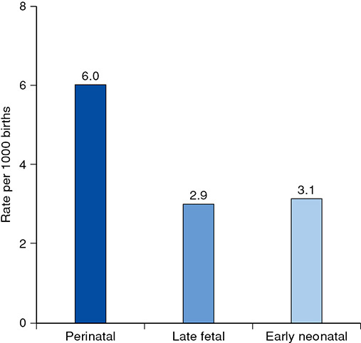
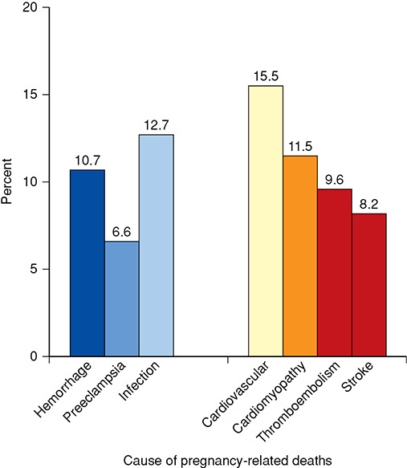
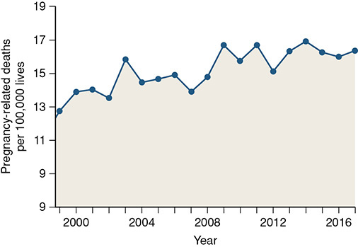
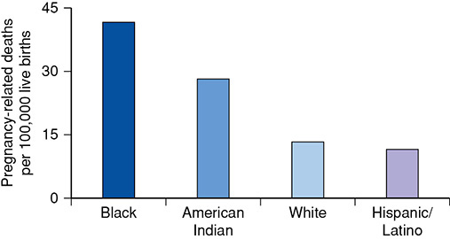
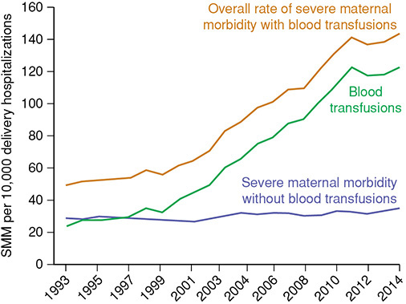

# Chapter 1: Overview of Obstetrics — Revision Notes

> Williams Obstetrics 26e, pp. 28–51 of the PDF. High-yield numbers are in **bold**.
> The two tables are transcribed from the PDF images (they are missing from the extracted chapter text). All 5 figures are included from the PDF.

**Big picture:** Obstetrics is judged by maternal and perinatal outcomes. Know the **standard vital-statistics definitions** cold, the **US numbers** (perinatal mortality, maternal mortality ratio, SMM), the **leading causes of maternal death**, and the current "hot topics" (COVID-19, maternal mortality programs, opioids, prenatal genetics, placenta accreta spectrum, 17-OHPC).

---

## 1. Vital Statistics

- The **National Vital Statistics System** collects US births and deaths, including fetal deaths. Legal authority rests with the **50 states**, 2 regions (DC, New York City) and 5 territories.
- The standard birth certificate records medical/lifestyle risks, labor and delivery factors and newborn characteristics.
- The current **death certificate has a pregnancy checkbox**.
- Most evidence in obstetrics is **not high quality** → much practice rests on expert opinion and bodies such as ACOG, SMFM, CDC and NIH.

### Definitions
- Standard definitions come from **WHO, AAP and ACOG**; uniformity allows comparison between regions and countries.
- ⚠️ **Fetal-death reporting is not uniform** across states:
    - **28 states:** losses from **20 weeks** are fetal deaths.
    - **8 states:** all products of conception.
    - Others: a minimum birthweight of **350, 400 or 500 g**.
- National Vital Statistics Reports tabulate fetal deaths at **≥20 weeks**.
- The 50th-centile fetal weight at **20 wk ≈ 325–350 g**, much less than 500 g. **500 g ≈ 50th centile at 22 wk.**

**Births and perinatal period**

| Term | Definition |
|---|---|
| **Perinatal period** | Birth of a neonate after **20 wk** → **28 completed days** after birth. If based on birthweight, it starts at the birth of a **500-g** neonate. |
| **Birth** | Complete expulsion or extraction of a fetus after **20 wk**. Without accurate dating, fetuses **<500 g** are **abortuses**, not births. |
| Birthweight | Weight immediately after delivery, to the **nearest gram**. |
| **Live birth** | Newborn **breathes spontaneously or shows any other sign of life** (heartbeat, definite spontaneous voluntary movement). Transient cardiac contractions and fleeting gasps don't count. |
| **Stillbirth / fetal death** | **Absence of signs of life** at birth. |
| **Abortus** | Fetus/embryo removed or expelled in the first half of gestation: **≤20 wk**, or **<500 g** if dating is uncertain. |
| Induced termination | Purposeful interruption of an intrauterine pregnancy intended not to produce a liveborn neonate, and not resulting in a live birth. Excludes retained products after fetal death. |

**Rates**

| Rate | Numerator | Denominator |
|---|---|---|
| **Birth rate** | Live births | **1000 population** |
| **Fertility rate** | Live births | **1000 females aged 15–44** |
| **Stillbirth (fetal death) rate** | Stillbirths | **1000 births (live + stillbirths)** |
| **Neonatal mortality rate** | Neonatal deaths | **1000 live births** |
| **Perinatal mortality rate** | **Stillbirths + neonatal deaths** | **1000 total births** |
| **Infant mortality rate** | Infant deaths (birth to **12 months**) | **1000 live births** |
| **Maternal mortality ratio** | Maternal deaths from the reproductive process | **100,000 live births** |

- **Early neonatal death:** first **7 days**. **Late neonatal death:** after 7 days but **before 29 days**.
- **Why "ratio", not "rate":** the numerator counts deaths regardless of pregnancy outcome (live births, stillbirths, **ectopics**), but the denominator is only **live births**.

**Birthweight**

| Category | Weight |
|---|---|
| **Low birthweight (LBW)** | **<2500 g** |
| **Very low birthweight (VLBW)** | **<1500 g** |
| **Extremely low birthweight (ELBW)** | **<1000 g** |

**Gestational age**

| Category | Gestational age |
|---|---|
| **Preterm** | Before **37 completed weeks** (the **259th day**) |
| — Early preterm | Before **34 completed weeks** |
| — Late preterm | **34–36** completed weeks |
| **Term** | **37 to 42 completed weeks (260–294 days)** |
| — Early term | **37⁰/₇ – 38⁶/₇** wk |
| — Full term | **39⁰/₇ – 40⁶/₇** wk |
| — Late term | **41⁰/₇ – 41⁶/₇** wk |
| **Postterm** | After completion of the **42nd week** (from **day 295**) |

**Maternal deaths**

| Term | Definition | Example |
|---|---|---|
| **Direct** | From obstetrical complications of pregnancy, labor or puerperium, or from interventions, omissions, incorrect treatment or a chain of events from these | Exsanguination after **uterine rupture** |
| **Indirect** | Not directly obstetrical: pre-existing or new disease **aggravated by the physiology of pregnancy** | **Mitral stenosis** |
| **Late maternal** | Direct or indirect cause, **>42 days but <1 year** after pregnancy ends | — |
| **Nonmaternal** | Accidental or incidental, unrelated to pregnancy | Car accident, concurrent malignancy |
| **Pregnancy-associated** | Death **from any cause** while pregnant or **within 1 calendar year** of pregnancy end, regardless of duration or site | — |
| **Pregnancy-related** | A pregnancy-associated death from (1) complications of pregnancy, (2) a chain of events started by pregnancy, or (3) **aggravation of an unrelated condition** by pregnancy's physiological or pharmacological effects | — |

> **Memory hook:** "Associated = **A**ny cause; Related = **R**esulting from pregnancy." Every pregnancy-related death is pregnancy-associated, not vice versa.

---

## 2. Pregnancy Rates in the United States

- **Fertility rate (2019): 58 live births per 1000 women** aged 15–44. Falling since 1990 and now **below replacement** → population decline.
- Birth rate ↓ in all major racial/ethnic groups, adolescents, unmarried women and ages 20–24. **Slightly ↑ in women >30.**
- Almost **half of 2019 newborns were minorities:** Hispanic **25%**, African-American **15%**, Asian **4%**.
- **45% of US births are unintended** at conception (Guttmacher), though the proportion has fallen since 2008.
    - More likely in unmarried and black women, and in women with less education or income.

### Table 1-1. Total Pregnancies and Outcomes in the United States in 2019

| Outcome | Number or Percent |
|---|---|
| **Total births** | **3,747,540** |
| — Cesarean deliveries | **31.7%** |
| — Primary cesarean delivery | 21.6% |
| — Vaginal birth after cesarean | 13.8% |
| — Preterm births (<37 weeks) | **10.0%** |
| — Low birthweight (<2500 g) | **8.0%** |
| — Very low birthweight (<1500 g) | 1.4% |
| **Induced abortions** | **862,320** |

*Data from Guttmacher 2019b; Martin, 2021.*

---

## 3. Obstetrical Care Measures

### Perinatal and infant mortality
- **Perinatal mortality rate (2016): 6 per 1000 births**, unchanged for several years.
- Fetal deaths at **≥28 wk have declined** since 1990; those at **20–27 wk are static**.
- **Infant mortality: ~6 per 1000 live births (2018)**, vs nearly 7 in 2001.
- **Four leading causes of infant death** (together almost **half**):
    1. **Congenital malformations**
    2. **Preterm birth**
    3. **Low birthweight**
    4. **Maternal pregnancy complications**
- **17%** of infant deaths in 2018 were in neonates born **preterm and LBW**.
- Intensive care can now be offered to some neonates **<500 g** (Ch 45).

*Figure 1-1. US 2016: perinatal mortality 6.0/1000 births = late fetal 2.9 + early neonatal 3.1.*

### Maternal mortality
- Fell precipitously in the 20th century; now measured **per 100,000 births**.
- The CDC's **Pregnancy Mortality Surveillance System (PMSS)**: **3410** pregnancy-related deaths in 2011–2015.
    - **~5%** were early-pregnancy deaths (ectopic or abortive outcomes).
- **Causes:**
    - **Obstetrical triad (hemorrhage, preeclampsia, infection) → ⅓** of all deaths.
    - **Thromboembolism, cardiomyopathy and other cardiovascular disease → another ⅓**.
    - **Cerebrovascular accidents 8.2%**, **amnionic fluid embolism 5.5%**.
    - **Anesthesia-related only 0.4%** (all-time low).

*Figure 1-2. Causes of US pregnancy-related deaths 2014–2017: cardiovascular 15.5%, infection 12.7%, cardiomyopathy 11.5%, hemorrhage 10.7%, thromboembolism 9.6%, stroke 8.2%, preeclampsia 6.6%.*

- **Pregnancy-related maternal mortality ratio: 17 per 100,000 live births (2017)**, rising over the last 30 years.
- **Why the apparent rise:**
    1. More women with **severe chronic health conditions**
    2. More births to women **>40 years**
    3. Artificial elevation from **ICD-10** (implemented 1999)
    4. **Better reporting**
    5. **Pregnancy checkbox** on the death certificate
- After accounting for the checkbox, predicted maternal mortality **did not change significantly from 1999 to 2017**.

*Figure 1-3. US pregnancy-related mortality 1999–2017: an upward trend from ~12–13 to ~17 per 100,000.*

- **Racial disparity:** black women have the highest ratio; causes are health-care availability, access and use. Rates are also higher in **rural** than metropolitan areas.

*Figure 1-4. Pregnancy-related mortality by race/ethnicity 2014–2017: Black ~41, American Indian ~28, White ~13, Hispanic ~11 per 100,000.*

- **Preventability:**
    - Up to **⅓ of deaths in white women** and up to **½ in black women** (Berg, 2005).
    - **28%** of 98 deaths in an insured cohort (Clark, 2008).

### Severe maternal morbidity (SMM)
- **Definition:** unintended events of labor and delivery with **serious short- or long-term consequences** to the woman.
- ACOG and SMFM (2016) give suggested screening topics.
- CDC analysis of >50 million records (1998–2009): **129 per 10,000** women had ≥1 SMM indicator.
- **~200 women have SMM for every maternal death.**
- SMM rates have **risen over 15 years**, attributed to better documentation and a **rise in blood transfusion**.
- Highest in **smaller hospitals (<1000 deliveries/yr)**. Black women are disproportionately affected.

### Table 1-2. Severe Maternal Morbidity Indicators

| | | |
|---|---|---|
| Acute myocardial infarction | Disseminated intravascular coagulation | Pulmonary edema |
| Acute renal failure | Eclampsia | Severe anesthesia complications |
| Adult respiratory distress syndrome | Heart failure during procedure | Sepsis |
| Amnionic fluid embolism | Hysterectomy | Shock |
| Cardiac arrest/ventricular fibrillation | Injuries of thorax, abdomen, and pelvis | Sickle-cell crisis |
| Cardiac monitoring | Intracranial injuries | Thrombotic embolism |
| Cardiac surgery | Puerperal cerebrovascular disorders | Tracheostomy |
| Conversion of cardiac rhythm | | Ventilation |

*Summarized from the Centers for Disease Control and Prevention, 2021. (The printed table is a single alphabetical list of 23 indicators, shown here in three columns.)*

*Figure 1-5. SMM per 10,000 delivery hospitalizations 1993–2014: the rise is driven by blood transfusion; SMM without transfusion is flat (~30).*

### Near misses
- **Near miss / close call:** an **unplanned event caused by error** that **does not injure** the patient but could have.
- More common than injury events, but harder to identify and quantify. Reporting systems allow focused safety work.
- Systems:
    - **WHO** near-miss system (validated in Brazil; correlates with maternal death rates)
    - **UKOSS** (UK Obstetric Surveillance System)
    - **National Partnership for Maternal Safety** (USA)

---

## 4. Timely Topics in Obstetrics

### COVID-19 pandemic
- SARS-CoV-2, early 2020: the greatest public health crisis since the **1918 influenza pandemic**.
    - By early 2021: >181 million infected, nearly 4 million deaths worldwide.
    - US 2020: >500,000 deaths, including >3000 healthcare workers.
- Prenatal care changed: **virtual and drive-through** models.
- Asymptomatic or mild infection is common in pregnancy. The effect of pregnancy on the disease course is **controversial**.
- **mRNA vaccines are safe and highly effective**, but the data came late because pregnant women were **excluded from the initial trials**. The FDA approved COVID-19 vaccines for pregnant women in **2021**.
- **Chinn (2021):** **2.2%** of >800,000 pregnancies had COVID-19 → ↑ **preterm birth, ICU admission, intubation/ventilation and maternal death**.
- A combined in-person plus **audio-only** virtual care model may best reach vulnerable women without internet access.

### Maternal mortality — a call to arms
- **~700 US women die each year** from pregnancy or its complications; many deaths are preventable.

| Program | Role |
|---|---|
| **PMSS** (CDC) | National pregnancy-related death data to guide prevention |
| **AIM** (Alliance for Innovation on Maternal Health) | **Patient safety bundles**: evidence-based best practices |
| **The Joint Commission** | Birthing centers should have **protocols and simulation** |
| National working groups | Target specific risks, e.g., **thromboembolism** |

- The **puerperium** is also vulnerable → dedicated **1-year postpartum follow-up** (hypertension, diabetes, cardiovascular disease). The **"fourth trimester"** concept (Ch 36).
- **MOMMA's Act:** extend Medicaid postpartum coverage from **60 days to 12 months**.

### Opioid use disorder
- Prevalence in pregnancy **↑ 333%** from **1.5 to 6.5 per 1000 deliveries** (1999–2014).
- → Unprecedented rise in **neonatal opioid withdrawal syndrome** (Ch 33).
- **ACOG:** **universal screening by questionnaire** + **multidisciplinary care**; curtail therapeutic opioid use.
- Treatment: **methadone or buprenorphine** (Ch 64).

### Advances in prenatal genetics

| Test | Key points |
|---|---|
| **cfDNA screening** | Noninvasive; now commonplace |
| **Chromosomal microarray (CMA)** on CVS or amnionic fluid | Detects gains/losses as small as **50–100 kb**. Higher yield than karyotype, but **most birth defects have a normal CMA and karyotype**. |
| Next-generation sequencing panels | Targeted genes, e.g., for **skeletal dysplasia** |
| **Whole exome sequencing (WES)** | All coding regions = **1.5% of the genome**. Finds a significant abnormality in **~10%** of structurally abnormal fetuses with normal CMA and karyotype, and **~30%** of unexplained **nonimmune hydrops**. |

- **WES is not recommended for routine prenatal diagnosis** (ACOG). Limitations: many **variants of uncertain significance**, long turnaround, high cost, and **incidental medically actionable findings** → comprehensive counseling.

### Placenta accreta spectrum (PAS)
- Cesarean rate is **static at ~32%**, but **PAS has grown**: up to **1 in 300 deliveries**.
- Responses: specialized **accreta surgical teams** at tertiary centers, more antepartum transfer, and efforts to **avoid the primary cesarean**.
- PAS will likely remain a significant cause of SMM (Ch 43).

### Progestogens to prevent preterm birth
- **17-OHPC** (17-alpha-hydroxyprogesterone caproate, IM; **Makena**): FDA **accelerated approval**, contingent on a second confirmatory trial.
- **PROLONG trial (2019): no benefit vs placebo** for birth <35 wk.
- Timeline:
    - 2019: FDA Advisory Committee voted **9 to 7** to withdraw approval.
    - Late 2020: **FDA CDER recommended withdrawal**, and still does (2021).
- **ACOG and SMFM continued to endorse 17-OHPC**, provided the **"uncertainty regarding benefit"** is shared with the patient.
- **EPPPIC meta-analysis (2021):** progestogens (including 17-OHPC) reduced births <34 wk, but **not statistically significantly**.

---

## Quick-Recall: Denominators and Cutoffs

| Measure | Per | Cutoff / window |
|---|---|---|
| Birth rate | 1000 population | — |
| Fertility rate | 1000 women 15–44 | US 2019: **58** |
| Stillbirth rate | 1000 total births | ≥20 wk (or ≥500 g) |
| Perinatal mortality rate | 1000 total births | >20 wk birth → 28 days; US: **6** |
| Neonatal mortality | 1000 live births | Early ≤7 d; late >7 d to <29 d |
| Infant mortality | 1000 live births | Birth → 12 months; US: **~6** |
| Maternal mortality **ratio** | **100,000 live births** | US 2017: **17** |
| Pregnancy-associated death | — | Any cause, pregnancy → **1 year** |
| Late maternal death | — | **>42 days to <1 year** |
| Abortus | — | **≤20 wk or <500 g** |
| LBW / VLBW / ELBW | — | **<2500 / <1500 / <1000 g** |
| Preterm / term / postterm | — | **<37 / 37–42 / >42 wk** |

## Key Numbers to Memorize
- Birth = after **20 wk**; abortus **<500 g**; 500 g ≈ 50th centile at **22 wk**
- Term **260–294 days**; preterm before day **259**; postterm from day **295**
- Fertility rate **58/1000** (below replacement); **45%** of births unintended
- 2019: **3.75 million** births; cesarean **31.7%**; preterm **10%**; LBW **8%**; VLBW **1.4%**
- Perinatal mortality **6/1000**; infant mortality **~6/1000**
- Maternal mortality ratio **17/100,000**; **~700** US deaths/yr; black women **~3×** white
- Causes: hemorrhage + preeclampsia + infection **⅓**; thromboembolism + cardiomyopathy + CVD **⅓**; stroke **8.2%**; AFE **5.5%**; anesthesia **0.4%**
- SMM **129/10,000**; **~200 SMM cases per maternal death**
- Opioid use disorder **1.5 → 6.5/1000** deliveries (**+333%**)
- CMA resolution **50–100 kb**; WES yield **~10%** (hydrops **~30%**); exome = **1.5%** of genome
- PAS up to **1 in 300**; cesarean rate **~32%**
