# Chapter 2: Maternal Anatomy — Revision Notes

> Williams Obstetrics 26e, pp. 52–93 of the PDF. High-yield numbers are in **bold**.
> This chapter has no tables. 15 of the 16 figures are included from the PDF (Fig 2-4, clitoral detail, is omitted).

**Big picture:** Surgical anatomy for obstetrics: the layers you cut at cesarean, the nerves and vessels you can injure, the perineal structures torn at delivery, the uterine blood supply you ligate for hemorrhage, and the bony pelvis the fetus must pass through.

---

## 1. Anterior Abdominal Wall

### Skin, subcutaneous layer and fascia
- **Langer lines run transversely** on the anterior abdominal wall.
  - Vertical incisions → more lateral tension → wider scars.
  - Low transverse (**Pfannenstiel**) incisions follow Langer lines → better cosmesis.
- **Subcutaneous layer:**
  - **Camper fascia** = superficial, fatty. Continues to the mons, labia majora and ischioanal fat.
  - **Scarpa fascia** = deep, membranous. Continues onto the perineum as **Colles fascia**.
- **Muscles:** midline **rectus abdominis** and **pyramidalis**; external oblique, internal oblique and transversus abdominis across the whole wall.
- The aponeuroses of the three flat muscles = the primary fascia. They fuse in the midline at the **linea alba**, normally **≤15 mm wide** below the umbilicus on sonography (nongravid). Wider → diastasis recti or ventral hernia.

### Rectus sheath and arcuate line

| Level | Anterior to rectus | Posterior to rectus |
|---|---|---|
| **Above** the arcuate line | Aponeuroses | Aponeuroses (muscle invested on both surfaces) |
| **Below** the arcuate line | **All** aponeuroses | Only **transversalis fascia + peritoneum** |

- The transition is best seen in the **upper third of a midline vertical incision**.
- **Pyramidalis:** paired, triangular; pubic crest → linea alba. Lies on the rectus, under the anterior sheath.
- **Umbilicus:** peritoneum, transversalis fascia and skin; contains the **umbilical ring** (the linea alba defect the fetal umbilical vessels passed through).

### Transversalis fascia and peritoneum
- Transversalis fascia: thin layer between transversus abdominis and preperitoneal fat; blends with pubic periosteum.
- **Five umbilical ligaments** (parietal peritoneal folds):

| Ligament | Number | Contents |
|---|---|---|
| **Median** umbilical | 1 | **Urachus** (bladder apex → umbilicus); white midline cord at laparotomy |
| **Medial** umbilical | 2 | **Obliterated umbilical arteries** |
| **Lateral** umbilical | 2 | **Patent inferior epigastric vessels** |

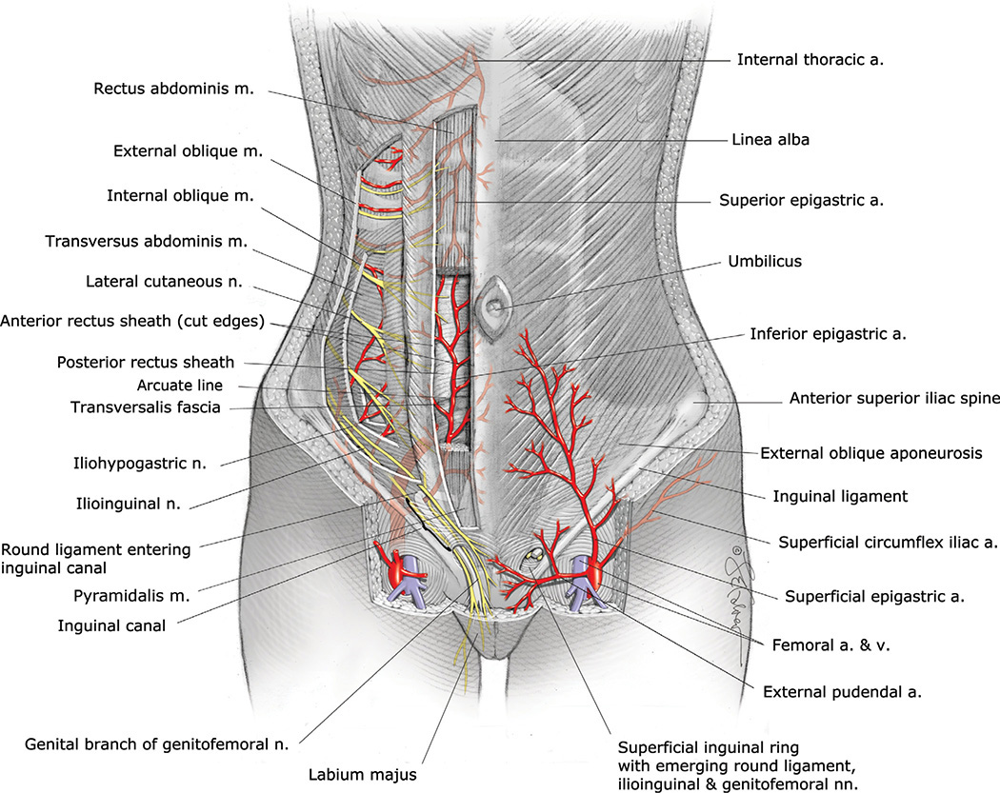

*Figure 2-1. Anterior abdominal wall: rectus sheath and arcuate line, superficial and inferior epigastric vessels, iliohypogastric and ilioinguinal nerves.*

### Blood supply and lymphatics
- **Superficial vessels** (from the **femoral artery** just below the inguinal ligament, femoral triangle):
  - Superficial epigastric, superficial circumflex iliac, superficial external pudendal.
  - Supply skin and subcutaneous tissue of the wall and mons.
  - **Superficial epigastric vessels** run diagonally toward the umbilicus. At a low transverse incision they lie **halfway between skin and anterior rectus sheath**, **above Scarpa fascia**, several cm from the midline → identify and occlude.
- **Deep vessels:** **inferior epigastric artery and vein** (from the **external iliac**). Run lateral to, then **posterior to the rectus** muscles.
  - Can be lacerated during muscle transection in a **Maylard incision** → identify and occlude first.
  - Rarely rupture spontaneously or with trauma in pregnancy → **rectus sheath hematoma**.
- Lymphatics run cephalad–caudad; most lie in the dermis, fewer between Camper and Scarpa. A deep system follows the inferior epigastric arteries.

**Hesselbach triangle**
- Borders: **lateral** = inferior epigastric vessels; **inferior** = inguinal ligament; **medial** = lateral border of rectus.
- **Direct** inguinal hernia = through the triangle. **Indirect** = through the **deep inguinal ring** (lateral to the triangle) into the inguinal canal.

> **Memory hook:** "RIP" for Hesselbach borders: **R**ectus (medial), **I**nferior epigastrics (lateral), **P**oupart = inguinal ligament (inferior).

### Innervation
- **Intercostal T7–11, subcostal T12, iliohypogastric and ilioinguinal L1.**
- Intercostal/subcostal nerves run between **transversus abdominis and internal oblique** = the **transversus abdominis plane** → **TAP block** for post-cesarean analgesia.
- Their anterior branches pierce the posterior sheath, rectus and anterior sheath near the lateral rectus border → can be **cut during Pfannenstiel** when the anterior sheath is separated from the rectus.
- **Iliohypogastric and ilioinguinal (L1):**
  - Lateral to psoas → across quadratus lumborum → pierce transversus near the iliac crest.
  - Pierce the internal oblique **2–3 cm medial to the ASIS**.
  - **Iliohypogastric** → suprapubic skin.
  - **Ilioinguinal** → through the inguinal canal and superficial ring → **mons, upper labia majora, medial upper thigh**.
  - **Sensory only.** Injured by cutting or **entrapment during closure**, especially if the incision extends **beyond the lateral rectus borders** → numbness; rarely chronic pain.
- **Dermatomes for anesthesia:**
  - **T10 = umbilicus** → adequate for **labor and vaginal birth**.
  - **T4** → needed for **cesarean** or puerperal sterilization.

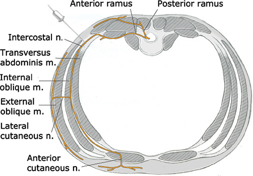

*Figure 2-2. Intercostal nerve runs between transversus abdominis and internal oblique: the plane targeted by the TAP block.*

---

## 2. Perineum

- **Diamond-shaped**, mirroring the bony outlet: symphysis (anterior), ischiopubic rami and ischial tuberosities (anterolateral), sacrotuberous ligaments (posterolateral), coccyx (posterior).
- A line between the **ischial tuberosities** divides it into the anterior **urogenital triangle** and posterior **anal triangle**.

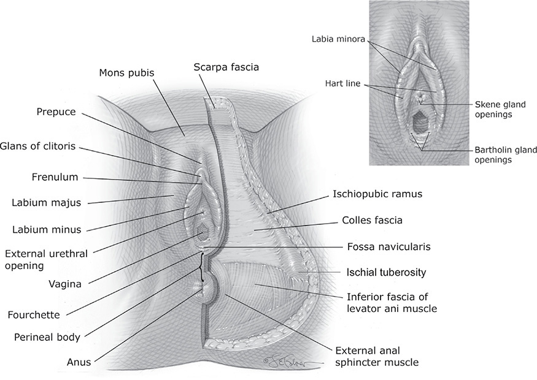

*Figure 2-3. Vulvar structures and the urogenital triangle; inset shows the vestibule boundaries and its openings.*

### Vulva
- All externally visible structures of the urogenital triangle: mons, labia majora and minora, clitoris, hymen, vestibule, urethral opening, Bartholin, minor vestibular and paraurethral glands.
- Innervation and blood supply: **pudendal nerve** and vessels.
- **Mons pubis:** fat cushion over the symphysis. Female escutcheon is triangular (base at upper symphysis); diamond-shaped in men and some hirsute women.
- **Labia majora:** **7–8 cm long, 2–3 cm wide, 1–1.5 cm thick**. The **round ligaments terminate** at their upper borders. Hair + apocrine, eccrine and sebaceous glands. A rich venous plexus → **varicosities in pregnancy**.
- **Labia minora:**
  - Start at the **fourchette**; superiorly each splits into two lamellae: lower → **frenulum** of clitoris, upper → **prepuce**.
  - Size varies widely: mean length **4 cm** (0.5–10), lateral span 1.5 cm (0.1–6).
  - Connective tissue, vessels, elastin, many nerves, very little smooth muscle.
  - **Hart line** = boundary between keratinized (lateral) and **nonkeratinized** (medial) squamous epithelium on the inner surface.
  - **No hair follicles, eccrine or apocrine glands; many sebaceous glands.**
- **Clitoris:** principal erogenous organ.
  - Rarely **>2 cm** long. Glans (**<0.5 cm**), body (two corpora cavernosa) and two **crura** (along the ischiopubic rami, under ischiocavernosus).
  - Blood supply from the **internal pudendal artery**: deep artery → body; dorsal artery → glans and prepuce.

### Vestibule
- Almond-shaped; bounded by the **Hart line** (lateral), **hymen** (medial), **clitoral frenulum** (anterior), **fourchette** (posterior).
- **Six openings:** urethra, vagina, 2 Bartholin ducts, 2 Skene ducts.
- **Vestibular fossa** (between fourchette and vaginal opening): usually seen only in nulliparas.
- **Bartholin (greater vestibular) glands:**
  - **0.5–1 cm**; lie inferior to the vestibular bulb and deep to the **bulbospongiosus**.
  - Duct **1.5–2 cm**, opens distal to the hymeneal ring at **5 and 7 o'clock**.
  - Trauma/infection → obstruction → **cyst** or **abscess**.
- **Minor vestibular glands:** shallow, mucin-secreting, open along the Hart line.
- **Paraurethral glands:** many small ducts along the inferior urethra; the two largest = **Skene glands** (near the meatus). Inflammation/obstruction → **urethral diverticulum**.
- **Urethral meatus:** midline, **1–1.5 cm below the pubic arch**.

### Hymen and vagina
- **Hymen:** elastic fibers + collagen, few nerves (at its base); nonkeratinized squamous epithelium both sides. Usually torn at several sites at first coitus, but identical tears can occur with tampons; edges re-epithelialize.
- **Vagina:**
  - Total length **9–10 cm**.
  - Anterior: **vesicovaginal septum**. Posterior (lower): **rectovaginal septum**. The **upper ¼** is separated from the rectum by the **rectouterine pouch (cul-de-sac, pouch of Douglas)**.
  - Fornices: anterior, posterior and two lateral. Pelvic organs can be palpated through them.
  - Layers: nonkeratinized stratified squamous epithelium + lamina propria (**rugae** premenopause) → muscularis → adventitia.
  - **No true fascia** separates it from bladder or rectum. **No glands**: lubricated by a **transudate** from the subepithelial capillary plexus.
  - Pregnancy ↑ secretions (vascularity) → can be **confused with amnionic fluid leak**.
  - Buried epithelium after birth trauma → **epidermal inclusion cysts**.

**Vaginal blood supply and lymphatics**

| Part | Arterial supply | Lymph drainage |
|---|---|---|
| Proximal | **Cervical branch of the uterine artery** + **vaginal artery** (from uterine, inferior vesical or internal iliac) | Pelvic nodes |
| Posterior wall | **Middle rectal artery** | — |
| Distal | **Internal pudendal artery** | **Lower ⅓ + vulva → inguinal nodes** |

- Vessels from each side form **midline anastomoses**; an extensive venous plexus follows the arteries.

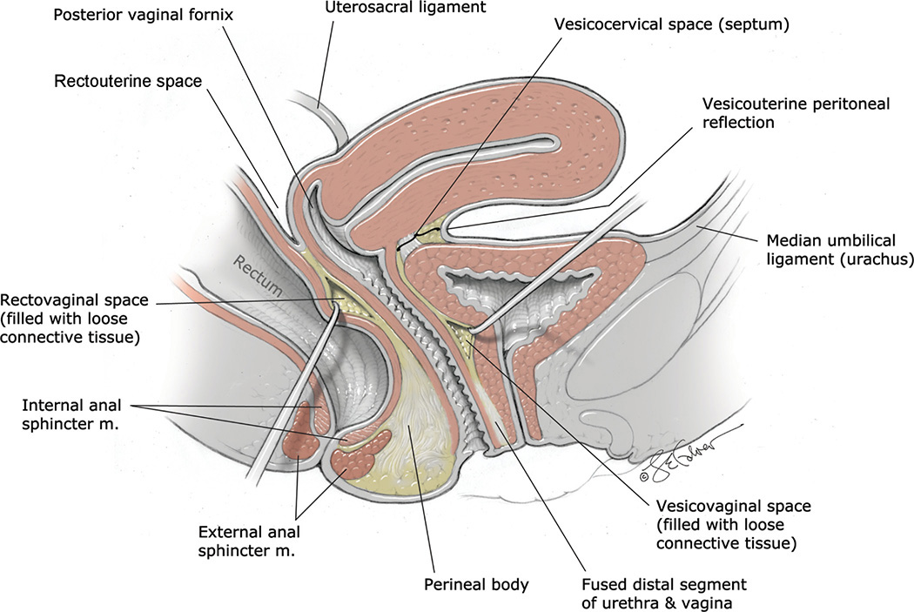

*Figure 2-5. Sagittal view: vagina between bladder/urethra and rectum; vesicouterine and rectouterine pouches, perineal body.*

### Perineal body
- **Fibromuscular pyramid** at the junction of the urogenital and anal triangles.
- Length (posterior hymen → mid-anal opening, POP-Q landmarks): **3.5–5 cm** in nulliparas. Lengthens slightly in pregnancy and **stretches >65%** in second-stage labor.
- **Superficial insertions:** bulbospongiosus, superficial transverse perineal, **external anal sphincter**.
- **Deep contributors:** perineal membrane, parts of pubococcygeus, internal anal sphincter.
- **Incised at episiotomy** and torn in **2nd-, 3rd- and 4th-degree lacerations**. Data conflict on whether a short perineal body predisposes to higher-order tears.

---

## 3. Urogenital Triangle

- Bounded by the pubic rami (superior), ischial tuberosities (lateral) and superficial transverse perineal muscles (posterior).
- **Perineal membrane** (formerly inferior fascia of the urogenital diaphragm) divides it into **superficial and deep spaces**. It lies at the **depth of the hymeneal ring**; attaches to the ischiopubic rami, distal ⅓ of urethra and vagina, perineal body and arcuate ligament of the pubis.

### Superficial space
- Walls: **perineal membrane (deep)** and **Colles fascia (superficial)**. Colles attaches firmly to the pubic rami, fascia lata, superficial transverse perineal muscle and perineal membrane → a **relatively closed compartment**.
- **Contents:** Bartholin glands, vestibular bulbs, clitoral body and crura, pudendal vessel and nerve branches, and three muscles:

| Muscle | Attachments | Action |
|---|---|---|
| **Ischiocavernosus** | Ischial tuberosity, ischiopubic ramus → clitoral crus | Maintains clitoral erection (compresses crus, blocks venous drainage) |
| **Bulbospongiosus** | Over vestibular bulb and Bartholin gland; clitoral body → perineal body (may blend with EAS) | Constricts vagina, expresses Bartholin secretions, compresses deep dorsal vein of clitoris |
| **Superficial transverse perineal** | Ischial tuberosity → perineal body | — |

- **Vestibular bulbs:** almond-shaped venous aggregations under bulbospongiosus, **5 cm long, 2 cm wide**. They may **lacerate or rupture at childbirth → hematoma confined to the superficial space**.

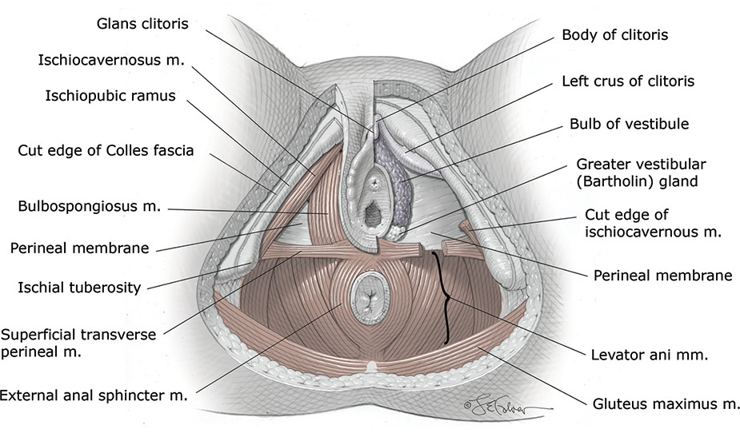

*Figure 2-6. Superficial space of the urogenital triangle and anal triangle: ischiocavernosus, bulbospongiosus and superficial transverse perineal muscles; vestibular bulb and Bartholin gland.*

### Deep space
- Above the perineal membrane, below the inferior fascia of levator ani.
- Contains parts of the urethra and vagina, internal pudendal branches and the **striated urogenital sphincter complex**.

**Urethra**
- Length **3–4 cm**; starts within the bladder trigone. **Distal ⅔ fused with the anterior vaginal wall.**
- Epithelium: transitional (urethrovesical junction) → pseudostratified columnar (proximal) → **nonkeratinized stratified squamous (distal)**.
- Wall: inner longitudinal + outer circular smooth muscle, surrounded by the **sphincter urethrae** (skeletal).
- **External urethral sphincter (EUS) = striated urogenital sphincter complex** = sphincter urethrae + **compressor urethrae** + **sphincter urethrovaginalis** (the last two at the middle/lower ⅓ junction). Provides constant tone and reflex contraction for continence.
- Most paraurethral glands lie in the submucosa on the **dorsal (vaginal) surface**.
- Blood: inferior vesical, vaginal or internal pudendal arteries. **Somatic nerve to EUS = pudendal**; smooth muscle = inferior hypogastric plexus.

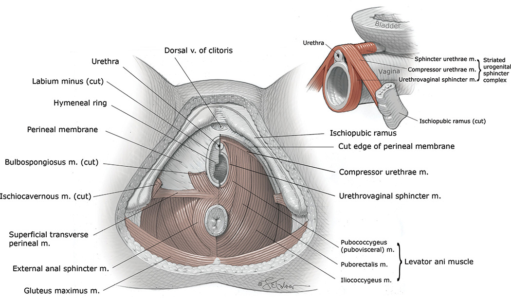

*Figure 2-7. Deep space of the urogenital triangle: compressor urethrae and sphincter urethrovaginalis; structures inserting on the perineal body.*

### Pelvic diaphragm
- Spans the outlet deep to both triangles. **Coccygeus + levator ani**.
- **Levator ani = pubococcygeus (pubovisceral) + puborectalis + iliococcygeus.**
  - Pubococcygeus subdivisions: **pubovaginalis, puboperinealis, puboanalis** (insert into vagina, perineal body and anus).
- Vaginal birth can damage the levator ani or its nerves → possible later **pelvic organ prolapse**.

---

## 4. Anal Triangle

- Contains the anal canal, anal sphincter complex (IAS, EAS, **puborectalis**) and ischioanal fossae, plus pudendal nerve and internal pudendal vessel branches.

### Anal canal
- Columnar mucosa above the **pectinate (dentate) line**; squamous below it to the **anal verge** (where keratin and skin adnexa start).
- **Surgical anal canal:** levator ani → anal verge, **4 cm**. **Anatomical anal canal:** pectinate line → anal verge, **2 cm**.
- **Anal cushions:** three submucosal AV plexuses that aid closure and continence. Uterine size, straining and hard stool → laxity → protrusion and engorgement = **hemorrhoids**.

| | External hemorrhoids | Internal hemorrhoids |
|---|---|---|
| Site | **Below** pectinate line | **Above** pectinate line |
| Covering | Stratified squamous epithelium | Insensitive anorectal mucosa |
| Nerve | **Inferior rectal nerve** (sensate) | None (insensate) |
| Symptoms | **Pain + palpable mass**; may leave a skin tag | **Prolapse or bleed**; painless unless thrombosed/necrotic |

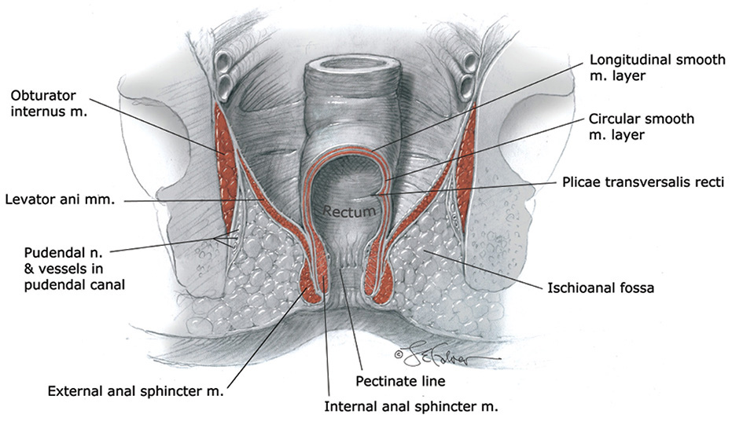

*Figure 2-8. Anal canal: pectinate line, internal and external sphincters, and the ischioanal fossa.*

### Anal sphincter complex

| | Internal anal sphincter (IAS) | External anal sphincter (EAS) |
|---|---|---|
| Muscle | **Smooth**: continuation of rectal circular layer | **Striated** ring |
| Size | **3–4 cm long, 2–3 mm thick**; overlaps EAS distally by 1–2 cm | **1.5–2.5 cm deep, 6–15 mm thick** |
| Attachments | — | Perineal body (anterior); coccyx via anococcygeal ligament (posterior) |
| Nerve | Mainly **parasympathetic** (pelvic splanchnic) | **Inferior rectal branch of pudendal** (somatic) |
| Blood | Superior, middle and inferior rectal arteries | **Inferior rectal artery** (from internal pudendal) |
| Function | **Most of resting pressure**; relaxes before defecation | Resting tone + **squeeze pressure**; relaxes for defecation |

- **Intersphincteric groove** (where the overlap ends) is palpable on digital exam.
- The "EAS capsule" is probably perineal body, not a true sheath.
- Both are involved in **3rd- and 4th-degree lacerations**; reapproximating the rings is integral to repair (Ch 27).

### Ischioanal fossae
- Two fat-filled wedges either side of the anal canal (formerly ischiorectal).

| Border | Structure |
|---|---|
| Superficial base | Skin |
| Deep | Levator ani |
| Lateral | Obturator internus, ischial tuberosity |
| Medial | Anal sphincter complex, levator ani |
| Posterior | Gluteus maximus, sacrotuberous ligament |
| Anterior | Inferior border of urogenital triangle |

- Fat permits rectal distention and vaginal stretching.
- Vessel injury → **ischioanal hematoma**. The fossae **communicate posteriorly via the deep postanal space** → episiotomy infection or hematoma can **spread from one side to the other**.

### Pudendal nerve
- **S2–S4** anterior rami. Between piriformis and coccygeus → exits the **greater sciatic foramen** **posterior to the sacrospinous ligament, just medial to the ischial spine** → **ischial spine = landmark for pudendal block**.
- Re-enters through the **lesser sciatic foramen** → runs on obturator internus in the **pudendal (Alcock) canal** (split obturator fascia).
- Relatively fixed behind the sacrospinous ligament and in the canal → **stretch injury** risk with pelvic floor descent at birth.
- **Three terminal branches:**
  1. **Dorsal nerve of the clitoris** → glans
  2. **Perineal nerve** → posterior labial (skin) + muscular branches (urogenital triangle muscles)
  3. **Inferior rectal nerve** → EAS, anal mucosa, perianal skin
- **Internal pudendal artery** branches mirror the nerve. It is the **closest vessel at pudendal block, within 5–8 mm**, usually deep to the spine.

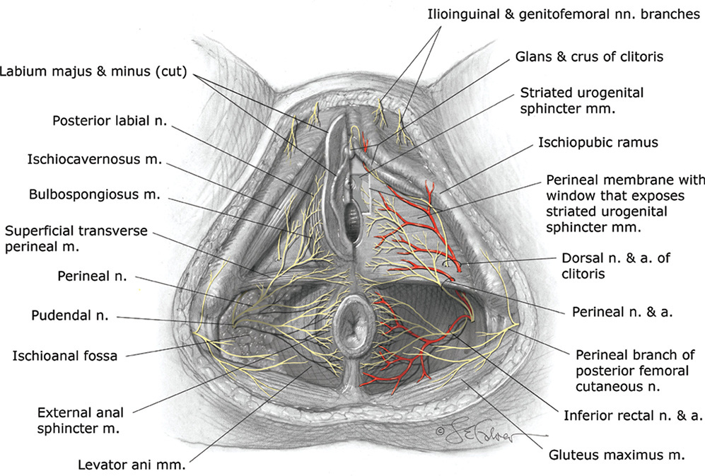

*Figure 2-9. Pudendal nerve and artery: dorsal nerve of clitoris, perineal and inferior rectal branches.*

---

## 5. Internal Generative Organs

### Uterus
- Between bladder (anterior) and rectum (posterior); covered by serosa. Peritoneum forms the **rectouterine pouch** posteriorly and **vesicouterine pouch** anteriorly.
- **At cesarean:** incise the vesicouterine peritoneum → enter the **vesicocervical space** (loose areolar tissue) → dissect caudally to lift the bladder off the cervix and lower segment.
- **Parts:** corpus (body), cervix, **isthmus** (their junction; **forms the lower uterine segment in pregnancy**), cornua (tube, round and uteroovarian ligament origins), fundus.
- **Size:**
  - Length **6–8 cm nulligravid** vs **9–10 cm multiparous**.
  - Weight averages **60 g** (heavier in parous women).
- **Pregnancy:** growth by **muscle fiber hypertrophy**; fundus becomes dome shaped; round ligaments seem to insert at the junction of the middle and upper thirds; tubes elongate, ovaries grossly unchanged.

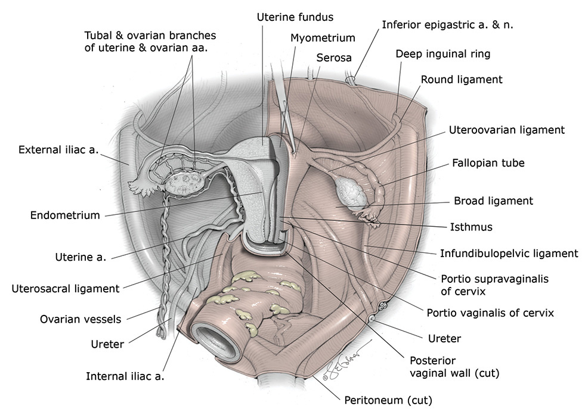

*Figure 2-10. Uterus, adnexa and ligaments; the ureter passes under the uterine artery near the cervix.*

### Cervix
- Internal os → endocervical canal → external os.
- **Portio supravaginalis** (starts at the internal os = level of the vesicouterine peritoneum) and **portio vaginalis**.
- **External os:** small regular oval before childbirth → **transverse slit** (anterior and posterior lips) after vaginal birth. Deep tears heal irregular, nodular or stellate.
- **Ectocervix:** nonkeratinized stratified squamous. **Endocervix:** single layer of **mucin-secreting columnar** epithelium with cleftlike "glands". **Eversion** in pregnancy.
- Stroma: collagen, elastin, proteoglycans, **very little smooth muscle**. Changes in these → **cervical ripening**.

**Early pregnancy signs**

| Sign | Finding | Cause |
|---|---|---|
| **Chadwick** | Blue tint of ectocervix | ↑ stromal vascularity |
| **Goodell** | Cervical softening | Cervical edema |
| **Hegar** | Isthmic softening | — |

### Myometrium and endometrium
- Myometrium: smooth muscle bundles + connective tissue with elastic fibers. **Interlacing fibers around vessels compress them → hemostasis at the placental site in 3rd-stage labor.**
- Endometrium: **functionalis** (shed at menses) and **basalis** (regenerates it). In pregnancy = **decidua**.

### Ligaments
- **Round and broad ligaments give no substantial support**; **cardinal and uterosacral** do.

| Ligament | Key facts |
|---|---|
| **Round** | Arises **below and anterior to the tube** (helps identify the tube at sterilization). Through the inguinal canal → **upper labium majus**. **3–5 mm** diameter; hypertrophies in pregnancy. Contains the **artery of the round ligament (Sampson artery)**, from the uterine artery. Varicosities can mimic inguinal hernia → color Doppler. |
| **Broad** | Double peritoneal drape (anterior + posterior leaves), uterus → sidewall. **Mesosalpinx** (tube), **mesoteres** (round ligament), **mesovarium** (ovarian ligament). |
| **Infundibulopelvic** (suspensory ligament of ovary) | Contains the **ovarian vessels** and nerves. Pedicle diameter **0.9 → 2.6 cm at term**. |
| **Cardinal** (transverse cervical, Mackenrodt) | **Thick base of the broad ligament**; anchors uterus and upper vagina. Needs sturdy clamps at cesarean hysterectomy. |
| **Uterosacral** | Posterolateral supravaginal cervix → sacral fascia. Form the **lateral boundaries of the rectouterine space**. |

- **Parametrium** = connective tissue lateral to the uterus in the broad ligament; **paracervical** = beside the cervix; **paracolpium** = lateral to the vagina.

---

## 6. Pelvic Blood Supply, Lymphatics and Innervation

### Uterine artery
- Main branch of the **internal iliac** (hypogastric) artery; enters the base of the broad ligament.
- **Crosses OVER the ureter ~2 cm lateral to the cervix** → ureter at risk when uterine vessels are clamped at hysterectomy.
- At the cervix it divides:
  - **Cervicovaginal artery** → lower cervix, upper vagina.
  - Main branch turns **upward** along the lateral uterus → **arcuate arteries** (just under the serosa, anastomose in the midline) → **radial arteries** (right angles, through myometrium) → **spiral arteries** (functionalis) and **basal/straight arteries** (basalis).
  - Gives off the **artery of the round ligament**.
- **Three terminal branches at the cornu:** **tubal** (through mesosalpinx), **fundal**, **ovarian** (anastomoses with the ovarian artery).

> **Memory hook:** "Water under the bridge": the ureter (water) runs **under** the uterine artery (bridge).

### Ovarian artery
- **Direct branch of the aorta**; enters via the **infundibulopelvic ligament**. Branches at the ovarian hilum and to the tubes; the main stem runs to the cornu and **anastomoses with the ovarian branch of the uterine artery**.
- This **dual supply = vascular reserve**: prevents uterine ischemia if the uterine or internal iliac artery is ligated for **postpartum hemorrhage**.

### Veins
- Arcuate veins → uterine vein → internal iliac → common iliac.
- **Right ovarian vein → IVC. Left ovarian vein → left renal vein.**

### Internal iliac artery divisions

| Division | Branches | Supplies |
|---|---|---|
| **Anterior** | Inferior gluteal, **internal pudendal**, middle rectal, vaginal, **uterine**, obturator, **umbilical** (→ superior vesical) | Pelvic organs and perineum |
| **Posterior** | **Superior gluteal, lateral sacral, iliolumbar** | Buttock and thigh |

- **Internal iliac ligation: ligate distal to the posterior division** to avoid compromising its territory.

> **Memory hook:** Posterior division = "**PILS**": **P**osterior → **I**liolumbar, **L**ateral sacral, **S**uperior gluteal.

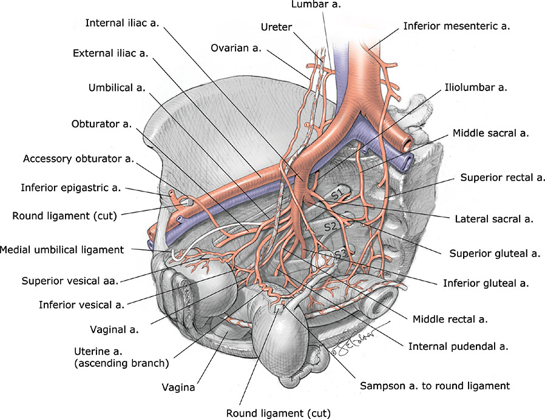

*Figure 2-11. Pelvic arteries: anterior and posterior divisions of the internal iliac artery.*

### Pelvic lymphatics

| Site | Drainage |
|---|---|
| Cervix + lower uterine segment | **Pelvic nodes → paraaortic** |
| Fundus (with adnexal lymphatics) | **Directly to paraaortic** |
| Vagina | Extensive anastomoses: **any** pelvic, groin or anorectal node can drain any part |
| Vulva + distal vagina | **Superficial inguinal** → deep femoral → pelvic nodes |

### Pelvic innervation
- **Sympathetic:** **superior hypogastric plexus (presacral nerve), T10–L2**. At the sacral promontory → right and left **hypogastric nerves**.
- **Parasympathetic:** **S2–S4** → **pelvic splanchnic nerves (nervi erigentes)**.
- Hypogastric nerves + pelvic splanchnic nerves → **inferior hypogastric (pelvic) plexus** → bladder, uterus, upper vagina, rectum; extensions to the clitoris and vestibular bulbs.

**Pain pathways of labor** (the targets of analgesic blocks)

| Source | Pathway | Spinal level |
|---|---|---|
| **Uterus** (contractions) | Inferior hypogastric plexus | **T10–T12, L1** |
| **Cervix + upper birth canal** | Pelvic splanchnic nerves | **S2–S4** |
| **Lower birth canal** | **Pudendal nerve** | S2–S4 |

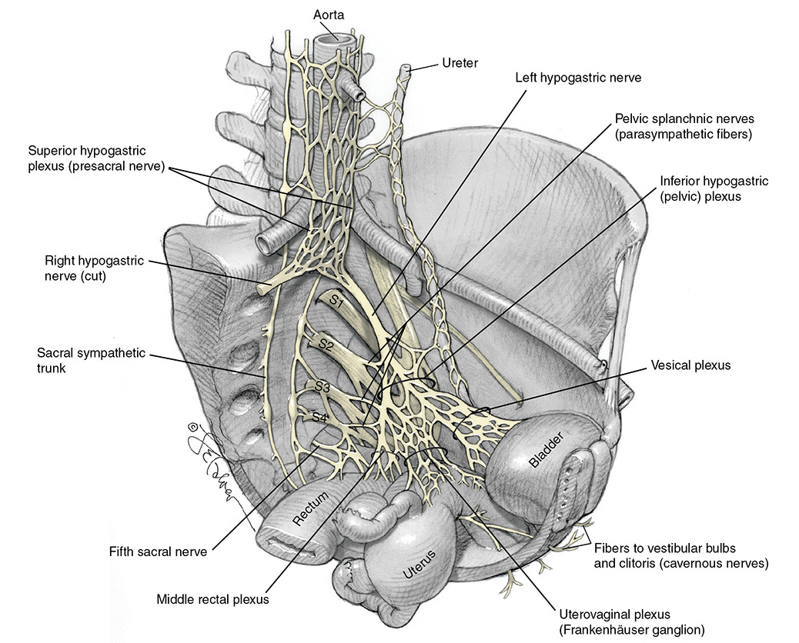

*Figure 2-12. Pelvic autonomic nerves: superior hypogastric plexus, hypogastric nerves, pelvic splanchnic nerves and inferior hypogastric plexus.*

---

## 7. Ovaries and Fallopian Tubes

### Ovaries
- Lie in the **ovarian fossa** between the external and internal iliac vessels.
- Size (reproductive age): **2.5–5 × 1.5–3 × 0.6–1.5 cm**.
- **Ovarian (uteroovarian) ligament:** posterolateral cornu → uterine pole of ovary; a few cm long, 3–4 mm diameter; covered by the **mesovarium**, through which blood reaches the hilum.
- **Cortex** (single cuboidal epithelium, **tunica albuginea**, oocytes and follicles) and **medulla** (loose connective tissue, vessels, some smooth muscle).
- **Nerves:** sympathetic mainly from the **ovarian plexus (from the renal plexus)**; parasympathetic from the **vagus**. Sensory afferents → **T10**.

### Fallopian tubes
- **8–14 cm** long. Four parts:

| Part | Width / feature |
|---|---|
| **Interstitial** | Within the uterine wall |
| **Isthmus** | Narrow, **2–3 mm** |
| **Ampulla** | **5–8 mm**; lumen almost filled by arborescent mucosa |
| **Infundibulum** | Funnel-shaped, fimbriated; opens to the abdominal cavity |

- Layers: **mesosalpinx** (serosa), **myosalpinx** (inner circular + outer longitudinal smooth muscle; rhythmic contractions that vary with hormones), **endosalpinx** (single columnar layer of **ciliated, secretory and intercalary cells** on a sparse lamina propria).
- Mucosa lies close to the myosalpinx → **easy invasion by ectopic trophoblast**.
- Mucosal folds become more complex toward the fimbria. **Ciliary current flows toward the uterus**; cilia + peristalsis aid ovum transport.
- Innervation: **sympathetic extensive**, parasympathetic sparse; sensory afferents → **T10**.

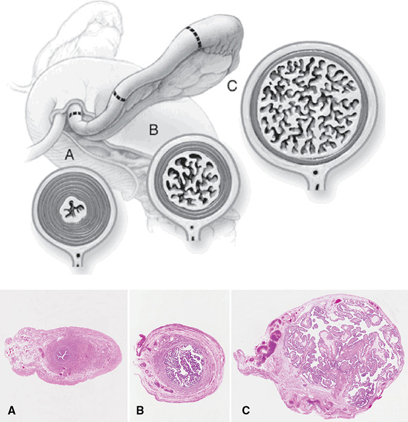

*Figure 2-13. Fallopian tube: isthmus, ampulla and infundibulum, with mucosal folds becoming more complex distally.*

---

## 8. Lower Urinary Tract

### Bladder
- **Dome** (thin, distensible) and **base** (thicker), divided at about the level of the ureteral orifices.
- **Trigone** (in the base): both ureteral orifices + internal urinary meatus. The urethra traverses the base for **<1 cm** = **bladder neck**.
- Wall = **detrusor** smooth muscle; mucosa = **transitional epithelium**.
- **Blood:** **superior vesical** (from the patent umbilical artery) → **dome**; **inferior vesical** (from umbilical, uterine or vaginal artery) → **base**.
- Nerve supply: inferior hypogastric plexus.

### Ureter (pelvic course)
1. Enters the pelvis crossing the **common iliac bifurcation**, just **medial to the ovarian vessels**.
2. Medial to the internal iliac branches, anterolateral to the uterosacral ligaments.
3. Through the **cardinal ligament ~1–2 cm lateral to the cervix**.
4. Near the isthmus, passes **below the uterine artery**, then anteromedially to the bladder base, close to the **upper ⅓ of the anterior vaginal wall**.
5. Runs **~1.5 cm obliquely** in the bladder wall before opening.

- Blood supply from the vessels it passes (common iliac, internal iliac, uterine, superior vesical). The ureter lies **medial** to them, so **its supply comes from the lateral side**: important when isolating it. A longitudinal anastomotic network runs in its sheath.

> **Pearl:** Two classic sites of ureteric injury in obstetric surgery: at the **pelvic brim** (near the infundibulopelvic ligament) and **beside the cervix** where the uterine artery crosses it.

---

## 9. Pelvic Skeletal Anatomy

### Bones and joints
- **Four bones:** sacrum, coccyx, two innominate bones (each = **ilium + ischium + pubis**).
- **Sacroiliac joints** posteriorly; **symphysis pubis** anteriorly (fibrocartilage + superior and inferior pubic ligaments; the inferior = **arcuate ligament of the pubis**).
- Joints **relax in pregnancy**:
  - At term the SI joint can glide upward, greatest in **dorsal lithotomy** → outlet diameter **↑ 1.5–2.0 cm**.
  - SI mobility likely aids the **McRoberts maneuver** for shoulder dystocia.
  - **Squatting** may ↑ the interspinous and outlet diameters (modified squatting may hasten second stage).

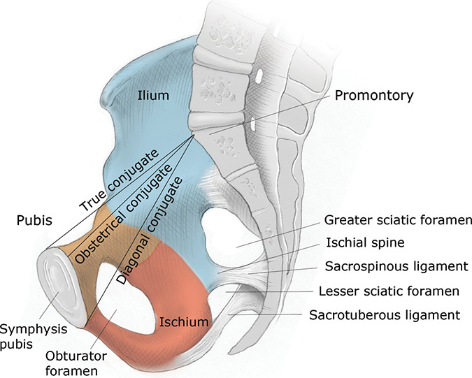

*Figure 2-14. Innominate bone and the three AP diameters of the inlet: true, obstetrical and diagonal conjugates. Only the diagonal conjugate can be measured clinically.*

### False vs true pelvis
- **False pelvis:** above the **linea terminalis**; bounded by lumbar vertebrae (posterior), iliac fossae (lateral), lower abdominal wall (front).
- **True pelvis:** below the linea terminalis. **Four planes:**
  1. **Pelvic inlet** (superior strait)
  2. **Pelvic outlet** (inferior strait)
  3. **Midpelvis** (plane of **least** pelvic dimensions)
  4. Plane of greatest pelvic dimension (**no obstetrical significance**)

### Pelvic inlet
- Bounded by the sacral promontory (posterior), linea terminalis (lateral), horizontal pubic rami and symphysis (anterior).
- **Engagement = the biparietal diameter passing through the inlet.**
- Diameters: AP, transverse, two oblique.

| Diameter | Landmarks | Value |
|---|---|---|
| **True conjugate** | **Upper** margin of symphysis → promontory | — |
| **Obstetrical conjugate** | **Shortest** distance promontory → symphysis (the most limiting) | **≥10 cm** normally (Fig 2-15 labels **10.5 cm**); cannot be measured directly |
| **Diagonal conjugate** | **Lower** margin of symphysis → promontory (measured by vaginal exam) | Obstetrical conjugate = diagonal conjugate **− 1.5 to 2 cm** |
| **Transverse** | Greatest distance between the linea terminalis, at right angles to the obstetrical conjugate; crosses it **~5 cm in front of the promontory** | **~13 cm** in the text (Fig 2-15 labels **13.5 cm**) |

*The text gives 1.5–2 cm to subtract from the diagonal conjugate; the Fig 2-14 legend says 1.5 cm. The text gives the transverse inlet as ~13 cm; Fig 2-15 labels it 13.5 cm.*

- **Measuring the diagonal conjugate:** palm faces laterally; index fingertip on the promontory; mark where the **lowest margin of the symphysis** meets the base of the finger.

### Midpelvis and outlet
- **Midpelvis** = level of the **ischial spines** = **zero station**.
  - **Interspinous diameter ≥10 cm** = usually the **smallest pelvic diameter**.
  - AP diameter at the spines **≥11.5 cm**.
- **Outlet:** two triangles sharing a base (the **bituberous line**).
  - Posterior triangle: apex = sacral tip; sides = sacrotuberous ligaments and ischial tuberosities.
  - Anterior triangle: descending inferior pubic rami, meeting at a **subpubic angle of 90–100°** under which the head passes.
  - **The outlet seldom obstructs vaginal delivery** unless there is significant bony disease.

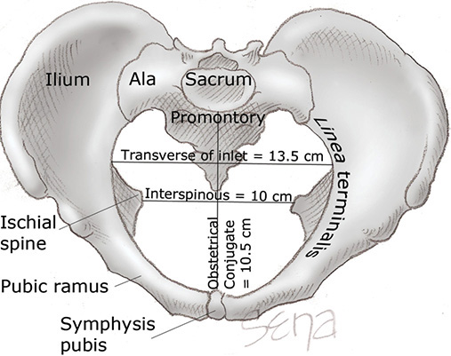

*Figure 2-15. Inlet from above: obstetrical conjugate 10.5 cm, transverse of inlet 13.5 cm, interspinous 10 cm.*

### Pelvic shapes (Caldwell–Moloy)
- Based on the **greatest transverse diameter of the inlet**, which divides it into **posterior (P) and anterior (A) segments**.
- **Posterior segment determines the TYPE; anterior segment determines the TENDENCY** (e.g., "gynecoid with android tendency" = gynecoid posterior, android anterior).
- **Gynecoid** is best suited for delivery and is found in **almost half** of women.

| Type | Inlet shape (Fig 2-16) |
|---|---|
| **Gynecoid** | Round; widest transverse diameter near the middle, P and A segments rounded |
| **Platypelloid** | Flat, transversely oval (wide transverse, short AP) |
| **Anthropoid** | AP oval (long AP, narrower transverse) |
| **Android** | Heart shaped; wedge-shaped anterior segment, flat posterior segment |

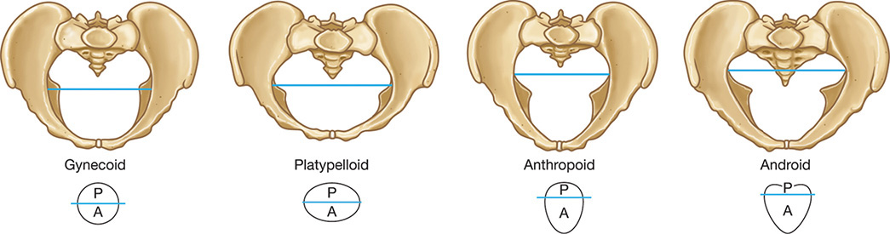

*Figure 2-16. The four Caldwell–Moloy pelvic types; the blue line (widest transverse diameter) splits the inlet into posterior (type) and anterior (tendency) segments.*

---

## Quick-Recall: Structure → Clinical Relevance

| Structure | Why it matters |
|---|---|
| Superficial epigastric vessels | Halfway between skin and anterior sheath at Pfannenstiel → occlude |
| Inferior epigastric vessels | Cut at Maylard muscle transection; rectus sheath hematoma; lateral border of Hesselbach triangle |
| Iliohypogastric / ilioinguinal nerves (L1) | Cut or entrapped if incision goes beyond lateral rectus border → numbness, rarely chronic pain |
| Transversus abdominis plane | TAP block for post-cesarean analgesia |
| T10 / T4 dermatomes | Labor and vaginal birth / cesarean |
| Bartholin duct (5 and 7 o'clock) | Cyst or abscess |
| Skene / paraurethral glands | Urethral diverticulum |
| Vestibular bulb | Superficial-space hematoma at childbirth |
| Perineal body | Episiotomy; 2nd–4th-degree tears |
| IAS / EAS | 3rd- and 4th-degree tears; resting vs squeeze pressure |
| Deep postanal space | Episiotomy infection or hematoma spreads between ischioanal fossae |
| Ischial spine | Landmark for pudendal block; internal pudendal artery within 5–8 mm; zero station |
| Vesicocervical space | Bladder flap at cesarean |
| Uterine artery over ureter (~2 cm from cervix) | Ureteric injury at hysterectomy |
| Ovarian–uterine anastomosis | Uterine viability after uterine/internal iliac ligation for PPH |
| Posterior division of internal iliac | Ligate distal to it |
| Cardinal ligament | Sturdy clamps at cesarean hysterectomy |
| Round ligament | Identifies the tube at sterilization; varicosity mimics hernia |
| Diagonal conjugate | Only inlet AP diameter measurable clinically |

## Key Numbers to Memorize
- Linea alba **≤15 mm**; ilioinguinal/iliohypogastric pierce internal oblique **2–3 cm medial to ASIS**
- Dermatomes: **T10** (labor/vaginal birth), **T4** (cesarean)
- Labia majora **7–8 × 2–3 × 1–1.5 cm**; clitoris **≤2 cm**, glans **<0.5 cm**
- Bartholin gland **0.5–1 cm**, duct **1.5–2 cm** at **5 and 7 o'clock**; meatus **1–1.5 cm** below the pubic arch
- Vagina **9–10 cm**; perineal body **3.5–5 cm**, stretches **>65%** in labor; vestibular bulb **5 × 2 cm**
- Urethra **3–4 cm** (distal ⅔ fused to vagina); intramural ureter **~1.5 cm**; bladder neck **<1 cm**
- Anal canal: surgical **4 cm**, anatomical **2 cm**; IAS **3–4 cm long, 2–3 mm thick**; EAS **1.5–2.5 cm deep, 6–15 mm thick**
- Pudendal nerve **S2–4**; internal pudendal artery **5–8 mm** from the block site
- Uterus **6–8 cm** (nulligravid) vs **9–10 cm** (multiparous), **60 g**; round ligament **3–5 mm**; ovarian pedicle **0.9 → 2.6 cm**
- Uterine artery crosses ureter **~2 cm** lateral to cervix; ureter in cardinal ligament **1–2 cm** lateral to cervix
- Sympathetic **T10–L2**; parasympathetic **S2–4**; uterine pain **T10–L1**; ovary and tube afferents **T10**
- Ovary **2.5–5 × 1.5–3 × 0.6–1.5 cm**; tube **8–14 cm**, isthmus **2–3 mm**, ampulla **5–8 mm**
- Obstetrical conjugate **≥10 cm** (= diagonal − **1.5–2 cm**); transverse inlet **~13 cm** (13.5 in figure); interspinous **≥10 cm** (smallest); midpelvis AP **≥11.5 cm**; subpubic angle **90–100°**; SI glide ↑ outlet **1.5–2 cm**
- Gynecoid pelvis in **~50%**
