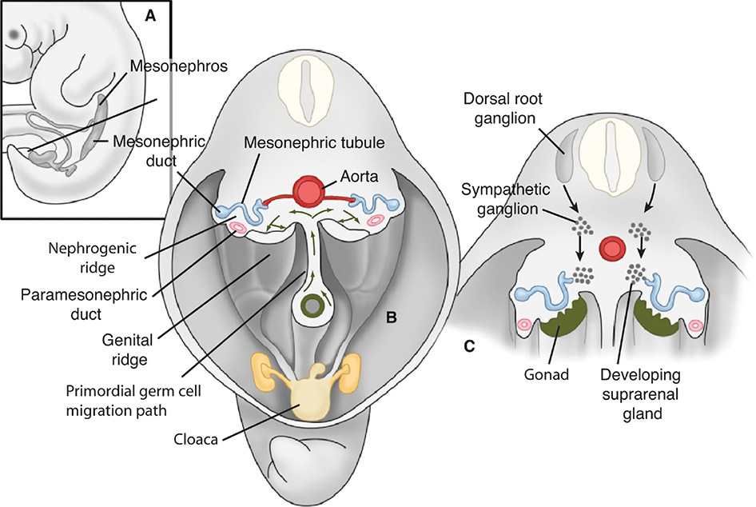
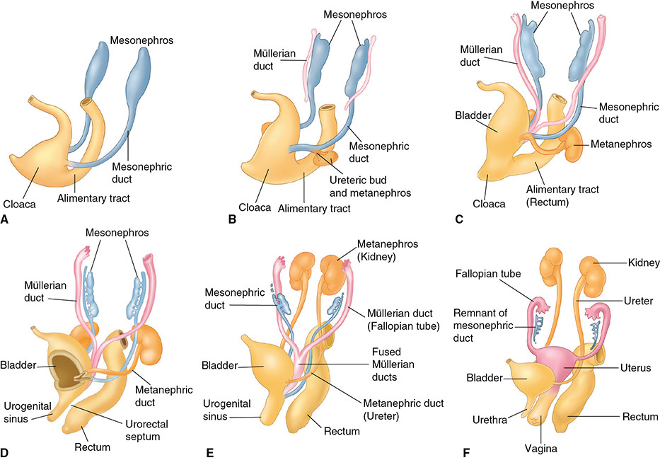
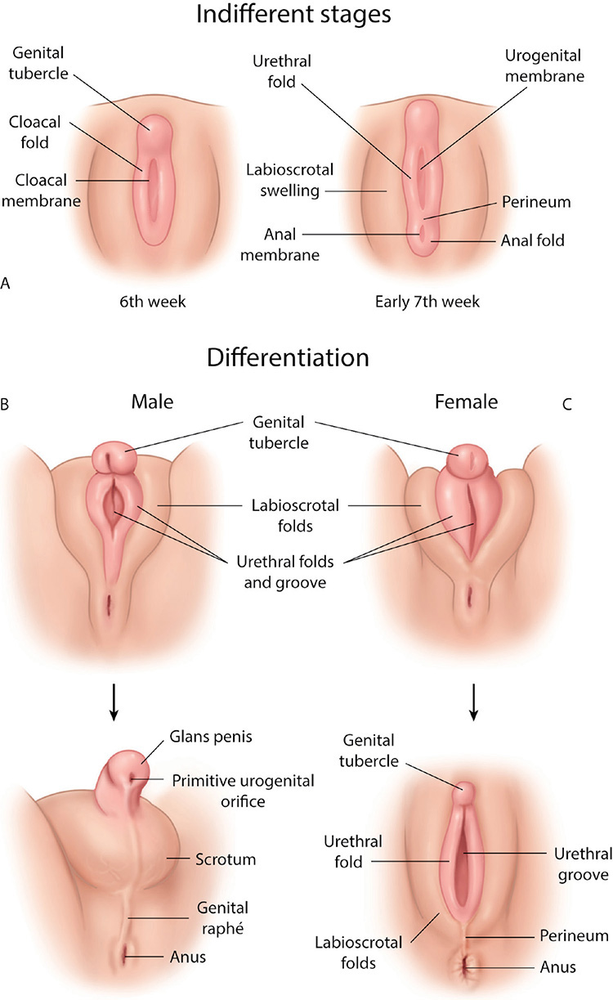
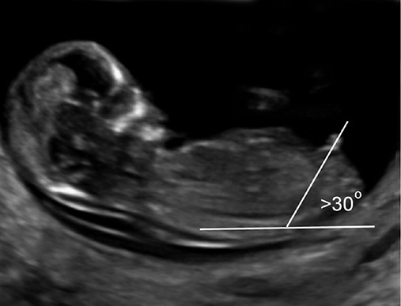
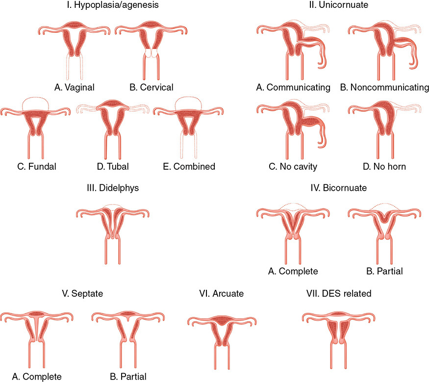
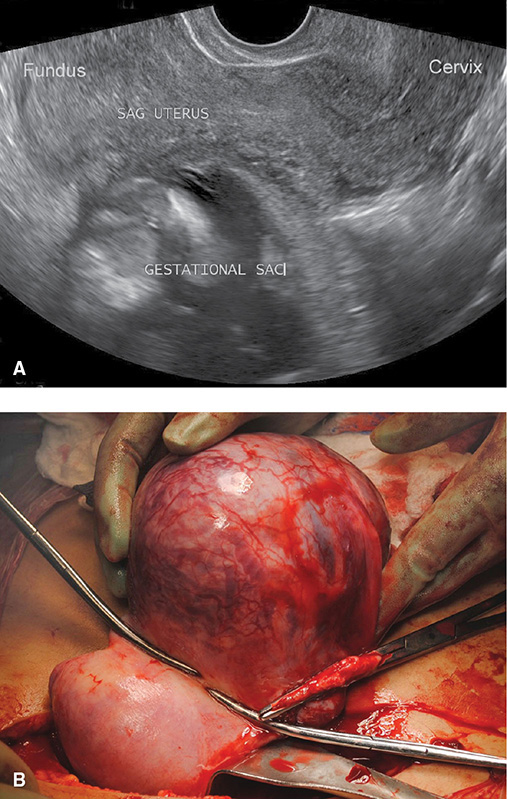
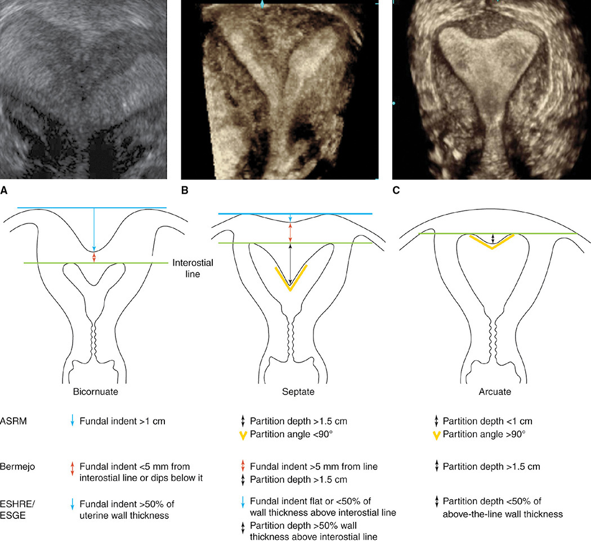
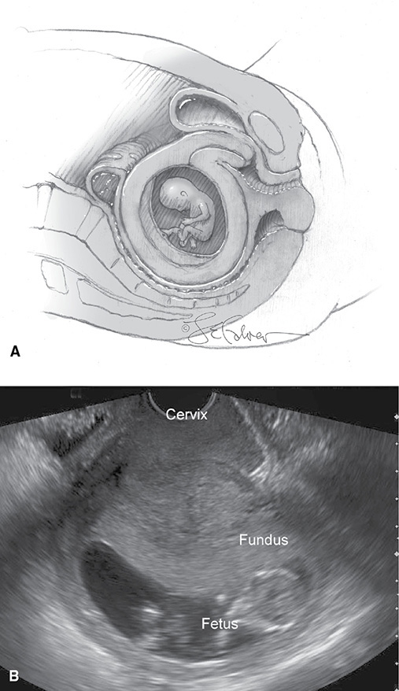
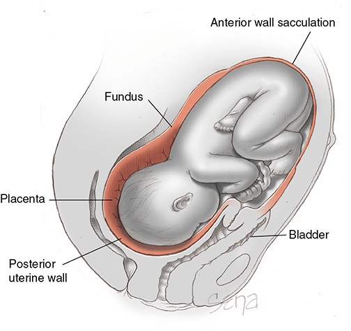

# Chapter 3: Congenital Genitourinary Abnormalities — Revision Notes

> Williams Obstetrics 26e, pp. 94–145 of the PDF. High-yield numbers are in **bold**.
> The three tables are transcribed from the PDF images (they are missing from the extracted chapter text). All 9 figures are included from the PDF.

**Big picture:** The gonads, müllerian ducts and external genitalia come from different primordia, closely linked to the urinary tract and hindgut. Faulty embryogenesis → DSDs and müllerian anomalies that cause infertility, miscarriage, preterm birth and malpresentation; renal anomalies travel with them.

---

## 1. Genitourinary Tract Development

### Urinary system
- **Weeks 3–5:** intermediate mesoderm → **urogenital ridge** → **genital ridge** (gonads) + **nephrogenic ridge**.
- Each nephrogenic ridge → mesonephros, **mesonephric (wolffian) duct** and **paramesonephric (müllerian) duct**.
- **Weeks 4–5:** each mesonephric duct gives a **ureteric bud** → induces the **metanephros** (final kidney). The bud also forms the metanephric duct (**ureter**).
- Metanephros **ascends to its final position by week 9** (disproportionate caudal growth).
- **Cloaca** (common urinary, genital and alimentary opening) is divided by the **urorectal septum by week 7** → hindgut + **urogenital sinus**.

| Urogenital sinus part | Forms |
|---|---|
| Cephalad (vesicle) | **Bladder** |
| Middle (pelvic) | **Female urethra** |
| Caudal (phallic) | **Distal vagina**, Bartholin and paraurethral glands |

- Near the end of the 1st trimester the mesonephros degenerates; **without testosterone the mesonephric ducts regress**.
- The ureterovesical junction forms at the **trigone**; faults → obstruction and **vesicoureteral reflux**.

*Figure 3-1. Embryo at 4–6 weeks: nephrogenic and genital ridges, müllerian duct, and primordial germ cells migrating from the yolk sac to the genital ridge.*

### Genital tract
- **Müllerian ducts → fallopian tubes, uterus, upper vagina.** Patterning is guided by **Hox genes**.
- Ducts fuse in the midline → **uterus by ~week 10**. Fusion starts in the **middle** and extends caudally and cephalad.
- The upper wedge-shaped **septum is resorbed**; the final cavity forms **by week 20**.
  - **Failed fusion** → two separate horns (didelphys, bicornuate).
  - **Failed resorption** → persistent **septum**.
- **Vagina:** the fused ducts contact the urogenital sinus → **sinovaginal bulbs** → **vaginal plate** → resorbs to form the lumen; **canalization complete by week 20**. The **hymeneal membrane** separates it from the sinus and degenerates to the hymeneal ring.
- **Nearly half** of females with uterovaginal malformations have **urinary tract defects** (close wolffian–müllerian association).
- With müllerian anomalies, **ovaries are functionally normal** but more often maldescended.

**Wolffian remnants in females**

| Remnant | Site |
|---|---|
| **Gartner duct cyst** | **Proximal anterolateral vaginal wall** (any level). Usually asymptomatic, benign; usually no excision or drainage |
| **Epoöphoron** | Blind tubules in the mesovarium |
| **Paroöphoron** | Similar tubules adjacent to the uterus |

*Figure 3-2. Female genitourinary development (A–F): ureteric bud and metanephros, urorectal septum dividing the cloaca, müllerian fusion into the uterus, mesonephric remnants.*

### Gonads
- **~Week 4:** gonads form from the **genital (gonadal) ridge** = coelomic epithelium on the mesonephros → **primary sex cords**.
- **By week 6:** **primordial germ cells** (future oogonia) migrate **from the yolk sac along the dorsal mesentery** into the genital ridge.
- **Week 7:** sexes distinguishable microscopically. Testis cords → seminiferous tubules and rete testis; mesonephric tubules → efferent ducts; mesonephric duct → epididymis, vas deferens.
- **After week 8:** gonads differ grossly.
- **Female:** primary sex cords → short-lived medullary cords; a second proliferation = **cortical cords** → **primordial follicles by week 16** (oogonium + single layer of follicular cells).
- **By 8 months:** long, narrow, lobulated ovary; tunica albuginea separates coelomic epithelium from the cortex.

### External genitalia
- **Week 6:** cloacal folds meet ventrally → **genital tubercle**.
- **Early week 7:** cloacal membrane divides → anal + urogenital membranes; cloacal folds → anal and **urethral folds**; lateral **labioscrotal swellings** appear. **Late week 7:** urogenital membrane ruptures.
- **Visual differentiation not possible until week 12.**
- **Male:** **DHT** (local **5α-reduction** of testosterone) → longer anogenital distance, phallus enlarges, labioscrotal folds fuse (scrotum). **Complete by 14 wk.**
- **Female:** no DHT → no fusion. **Differentiated by 11 wk.**

| Primordium | Female | Male |
|---|---|---|
| Genital tubercle | Clitoris | Glans penis |
| Urethral folds | **Labia minora** | Floor of penile urethra |
| Labioscrotal folds | **Labia majora** | Scrotum |
| Urogenital sinus | Vestibule | — |

- **First-trimester sex by sonography:** angle of the genital tubercle to a horizontal line along the lumbosacral skin.
  - **>30° = male**; **<10° = female**.

*Figure 3-3. External genitalia: indifferent stage (weeks 6–7), then virilization (male) or feminization (female).*

*Figure 3-4. First-trimester sonogram of a male fetus: phallus angled >30° above the lumbosacral horizontal.*

---

## 2. Sexual Differentiation

- **Genetic gender** (XX/XY) at fertilization. Embryos look identical for the **first 6 weeks**.
- **Gonadal gender:** Y present → testis, directed by **SRY** (short arm of Y). Also needs autosomal **SOX9, WT1, DAX1, WNT4, NR5A1 (SF1)**.
  - **46,XX male:** Y fragment with SRY translocated to X during paternal meiosis.
  - **46,XY female:** SRY mutation.
- **Phenotypic gender** begins at **8 weeks**. Male differentiation depends on testicular function; **without it, female development ensues** regardless of genetic sex.

**Testicular hormones**

| Cell | Product | Timing | Effect |
|---|---|---|---|
| **Sertoli** | **AMH** (müllerian-inhibiting substance) | From **7 wk**; regression complete **9–10 wk** | Paracrine → **müllerian duct regression** (no uterus, tubes, upper vagina). Acts **locally**: absent testis on one side → ipsilateral horn and tube persist |
| **Leydig** | **Testosterone** (hCG first, then fetal LH) | After Sertoli cells differentiate | Wolffian → vas, epididymis, seminal vesicles. Converted to **5α-DHT** → virilizes external genitalia |
| Leydig | **Insulin-like factor 3** | — | Testicular descent via the gubernaculum |

### Table 3-1. Embryonic Urogenital Structures and Their Adult Homologues

| Indifferent Structure | Female | Male |
|---|---|---|
| Genital ridge | Ovary | Testis |
| Primordial germ cells | Ova | Spermatozoa |
| Sex cords | Granulosa cells | Seminiferous tubules, Sertoli cells |
| Gubernaculum | Uteroovarian and round ligaments | Gubernaculum testis |
| Mesonephric tubules | Epoöphoron, paroöphoron | Efferent ductules, paradidymis |
| Mesonephric ducts | Gartner duct | Epididymis, vas deferens, ejaculatory duct |
| Paramesonephric ducts | Uterus, fallopian tubes, upper vagina | Prostatic utricle, appendix of testis |
| Urogenital sinus | Bladder, urethra | Bladder, urethra |
| | Vagina | Prostatic utricle |
| | Paraurethral glands | Prostate glands |
| | Greater (Bartholin) and lesser vestibular glands | Bulbourethral glands |
| Genital tubercle | Clitoris | Glans penis |
| Urogenital folds | Labia minora | Floor of penile urethra |
| Labioscrotal swellings | Labia majora | Scrotum |

> **Memory hook:** "Skene = prostate, Bartholin = Cowper (bulbourethral)."

---

## 3. Disorders of Sex Development (DSD)

- Three categories: **sex chromosome DSD, 46,XY DSD, 46,XX DSD**. Overall **~1 in 5000 births**.

### Table 3-2. Disorders of Sex Development (DSD) Classification

| Category | Subgroup | Examples |
|---|---|---|
| **Sex chromosome DSD** | — | 45,X Turnerᵃ; 47,XXY Klinefelterᵃ; 45,X/46,XY mixed gonadal dysgenesis; 46,XX/46,XY ovotesticular DSD |
| **46,XY DSD** | Testicular development abnormalities | Complete gonadal dysgenesis; partial gonadal dysgenesis; ovotesticular; testicular regression syndrome |
| | Androgen production or action defects | Androgen synthesis; androgen receptor; LH/hCG receptor; AMH |
| | Persistent müllerian duct syndrome | — |
| | Other structure-affecting syndrome | Smith-Lemli-Opitz |
| **46,XX DSD** | Ovarian development abnormalities | Gonadal dysgenesis; testicular; ovotesticular |
| | Androgen excess | Fetal; maternal; placental |

*ᵃAnd syndrome variants. AMH = antimüllerian hormone; hCG = human chorionic gonadotropin; LH = luteinizing hormone.*

### Definitions
- **Gonadal dysgenesis:** underdeveloped gonads (**dysgenetic testis** or **streak ovary**) → fail → **low sex steroids, high FSH and LH**.
- **Ambiguous genitalia:** hypospadias, undescended testes, micropenis or clitoromegaly, labial fusion, labial mass.
- **Ovotesticular DSD** (formerly true hermaphroditism): ovarian + testicular tissue in one person (any pairing of testis, ovary, streak, dysgenetic testis or ovotestis).
  - Internal ducts follow the **ipsilateral gonad**: inadequate **AMH → müllerian structures persist**; inadequate **testosterone → ambiguous, undermasculinized genitalia**.
  - Can occur in **all three** DSD categories.

### Germ cell cancer (GCC)
- Arises in **dysgenetic gonads with all or part of a Y chromosome**. Candidate gene **TSPY**. Other risks: disturbed gonadal development, delayed germ cell maturation, **gonadoblastoma** (benign; germ cells + immature granulosa cells).
- **Gonadectomy** may be advised by a multispecialty DSD team: early if GCC risk is high or hormones oppose chosen gender identity; later if risk is low and hormones help desired puberty.
- **Undescended testes** also ↑ GCC; **orchiopexy** may be protective.

### Sex chromosome DSD
- Sex chromosome aneuploidy **~1 in 2500 births**. Thick **NT or cystic hygroma** ↑ risk; detectable by cell-free DNA.
- **ACMG: cfDNA solely for sex identification without medical indication is not recommended.**

| Condition | Frequency | Key features |
|---|---|---|
| **Turner (45,X)** | **1 in 2000** female live births (most abort) | Short stature (nearly all); **coarctation, bicuspid aortic valve**, long QT; renal, skeletal, ENT anomalies; **webbed neck** (from cystic hygroma); DM, autoimmune thyroiditis, celiac, ↑ LFTs. **Two streak ovaries** → most common gonadal dysgenesis causing **POI**. Uterus and vagina normal |
| **Klinefelter (47,XXY)** | **1 in 650** males | Tall, undervirilized, gynecomastia, small firm testes; reduced fertility. ↑ mediastinal germ cell tumors, osteoporosis, hypothyroidism, DM, **breast cancer**, CV and neurobehavioral disorders. Thick NT. Pregnancy: preterm birth, cesarean, SGA, neonatal death |
| **47,XXX / 47,XYY** | **1 / 10,000** females; **2 / 10,000** males | Thick NT, FGR; taller, subtle dysmorphism, autism/ADHD. Hormones and fertility mostly normal (POI or semen abnormalities possible) |
| **Ovotesticular** | Rare | 46,XX/46,XY (ovary, testis or ovotestis) or mosaic **45,X/46,XY = mixed gonadal dysgenesis** (streak + dysgenetic or normal testis). Phenotype varies widely |

**Turner syndrome in pregnancy**
- Conception by **ART** (rarely spontaneous) despite POI.
- Main danger = **aortic dissection** (also AS, hypertension) → MFM counseling + cardiology before conception.
- Use the **aortic size index (ASI)** = aortic diameter / BSA (accounts for short stature).
  - **Avoid conception if ASI >2.5 cm/m²**, or **ASI 2.0–2.5 cm/m² plus risk factors** (bicuspid valve, elongated transverse arch, coarctation, hypertension).
  - **ASRM advises against pregnancy with ASI >2 cm.**
  - Dissection can occur even without risk factors.
- **Preconception work-up:** echocardiography, CT + cardiac MR of heart/aorta, 24-h ambulatory BP, exercise testing, ECG. Serial echos as needed.
- **Risks:** miscarriage, preterm birth, SGA, **preeclampsia, GDM, cholestasis**. Baseline renal, liver, thyroid tests and DM screen.
- **Cesarean rate 40–80%** (complications + cephalopelvic disproportion).

### 46,XY DSD (formerly male pseudohermaphroditism)
- **Insufficient androgen exposure** in a fetus destined to be male. Testes often present; **uterus usually absent** (AMH works). Usually sterile.

**Gonadal dysgenesis**

| Type | Cause / features |
|---|---|
| **Complete** | **SRY** mutation (**Swyer syndrome**) or **WT1** mutation (**Frasier, Denys-Drash**). No androgens or AMH → **normal prepubertal female phenotype + normal müllerian system** |
| Partial | Intermediate testis development; variable wolffian/müllerian structures and ambiguity |
| Mixed | Ovotesticular type: one streak gonad + normal or dysgenetic testis |
| Testicular regression | Testis fails after forming; phenotype depends on timing |

- **Gonadectomy often recommended** (GCC risk).

**Abnormal androgen production or action**
1. **Testosterone biosynthesis defects** → undervirilized male or phenotypic female. **5α-reductase type 2 deficiency** → ↓ DHT, blunted virilization.
2. **hCG/LH receptor defects** → **Leydig cell hypoplasia**, ↓ testosterone.
3. **AMH / AMH receptor defects** → **persistent müllerian duct syndrome (PMDS)**: phenotypic male with a uterus and tubes.
4. **Androgen receptor defects → androgen insensitivity syndrome (AIS).**

**Complete AIS (CAIS)**
- Phenotypically **normal female**; presents at puberty with **primary amenorrhea**.
- **Breasts develop** (androgen → estrogen conversion); **scant or absent pubic and axillary hair**; **short vagina**; **no uterus or tubes**.
- Testes in the labia, groin or abdomen.
- **Low GCC risk** → testes can be kept **until after puberty** for breast and bone development. Many report mood problems even with hormone replacement after gonadectomy.
- Incomplete AIS → variable virilization; mild forms → severe male-factor infertility.

### 46,XX DSD

**Abnormal ovarian development**

| Type | Features |
|---|---|
| **46,XX gonadal dysgenesis** | Streak gonads, hypogonadism, normal female genitalia and müllerian structures; **no other Turner stigmata** |
| **46,XX testicular DSD** | Usually **SRY translocation onto the paternal X**. AMH → müllerian regression; androgens → wolffian development and masculinization. **No spermatogenesis** (Yq genes lacking). Diagnosed at puberty or infertility work-up |
| **46,XX ovotesticular DSD** | Unilateral ovotestis + ovary or testis, or bilateral ovotestes. **SOX** overexpression or deficient ovary-promoting genes |

**Androgen excess** (formerly female pseudohermaphroditism)
- Ovaries, uterus, cervix and upper vagina develop normally → **potentially fertile**. External genitalia virilized according to **dose and timing**: clitoromegaly → posterior labial fusion → phallus with penile urethra.
- Scoring: **Prader 0 (normal female) to 5 (normal male)**; external genitalia score 0–12.

| Source | Causes | Notes |
|---|---|---|
| **Maternal** | **Luteoma, Sertoli-Leydig cell tumor**, virilizing adrenal tumors; **testosterone, danazol**, androgen derivatives | Tumors rarely affect the fetus: **placental aromatase** converts C19 steroids (androstenedione, testosterone) to estradiol |
| **Fetal** | **Congenital adrenal hyperplasia**: mostly **21-hydroxylase** deficiency (rarely 3β-HSD, 17α-hydroxylase, side-chain cleavage, P450 oxidoreductase, 11β-hydroxylase) | **~1 in 18,000** US live births; a frequent cause of virilization |
| **Placental** | **Aromatase deficiency** (fetal **CYP19** mutation) | ↑ placental androgens, ↓ estrogens → **both mother and 46,XX fetus virilized** |

**CAH mechanism and forms**
- Enzyme block → ↓ cortisol → ↑ **ACTH** → precursors shunted to androgens.
- **Salt-wasting** (aldosterone blocked, severe): **hyponatremia, hyperkalemia, metabolic acidosis, hypovolemia**: life-threatening.
- **Nonclassic (late-onset, adult-onset):** unmasked at puberty → hirsutism, acne, anovulation → **mimics PCOS**.
- **Antenatal:** early **maternal dexamethasone** can reduce virilization (Ch 19). **cfDNA fetal sex**: if **Y-chromosome DNA is found, stop dexamethasone** (androgens don't harm a male).

### Gender assignment at birth
- A **potential medical emergency** with lasting psychosocial effects.
- Once stable, encourage parents to hold "**your baby**". Use neutral terms: **"phallus," "gonads," "folds," "urogenital sinus."** Explain the genitalia are incompletely formed and that urgent consultation and tests are needed.
- **History:** prior outcomes, medications, consanguinity, antenatal tests and sonography, family history; **maternal hyperandrogenism signs**.
- **Neonatal exam (5 points):**
  1. Palpable gonads (labioscrotal or inguinal)
  2. Palpable uterus on rectal exam
  3. Phallus size
  4. Other syndromic features
  5. Genital **hyperpigmentation** (↑ MSH with ACTH → suggests CAH)
- **Hyperkalemia, hyponatremia, hypoglycemia → suspect CAH.**
- Tests: genetics, hormones, sonography/MRI (müllerian/wolffian structures, gonads, renal anomalies), ± endoscopy, laparoscopy, gonadal biopsy.

---

## 4. Bladder and Perineal Abnormalities

- Without mesodermal ingrowth into the **bilaminar cloacal membrane**, it ruptures early → **cloacal exstrophy, bladder exstrophy or epispadias** (all rare).

### Cloacal exstrophy (OEIS complex)
- **O**mphalocele, bladder **E**xstrophy, **I**mperforate anus, **S**pina bifida. **~1 in 300,000** live births.
- Sonography: 1st tri, thin-walled lower abdominal cyst + thick NT; 2nd tri, infraumbilical wall defect, **bladder not seen**, other OEIS defects.
- **Prenatal karyotyping recommended.** **Delivery route usually dictated by the spina bifida.** Postnatal repair is complex (incontinence, gender assignment issues).

### Bladder exstrophy
- Bladder lies open outside the abdomen, drains into amnionic fluid, **never fills**. Abnormal external genitalia, **widened symphysis**; uterus, tubes, ovaries usually normal (occasional fusion defects).
- **Sonographic clues:**
  - **Bladder not seen**
  - Solid mass between the umbilical arteries
  - **Low umbilical cord insertion**
  - Divergent pubic rami
  - **Normal amnionic fluid volume**
  - Males: small penis, anteriorly displaced scrotum
- Differential: bladder exstrophy or agenesis, bilateral ectopic ureters, patent urachus, cloacal exstrophy, simple nonvisualization. MRI helps. Karyotype if genitalia ambiguous.
- **Affected fetus:** routine prenatal course; **cesarean only for obstetrical indications**.
- **Gravida with repaired exstrophy:** ↑ **pyelonephritis, urinary retention, ureteral obstruction, prolapse, miscarriage, preterm birth, breech**. AUA guidelines exist. Some advise **planned early cesarean at a tertiary center** (adhesions); paramedian abdominal and vertical uterine incisions described.
- **Epispadias** alone: patulous urethra, absent or bifid clitoris, unfused labia, flat mons; vertebral anomalies and pubic diastasis common.

### Clitoral anomalies
- **Bifid clitoris** (with exstrophy/epispadias); **female phallic urethra** (opens at clitoral tip).
- **Clitoromegaly at birth → excess fetal androgen.** Idiopathic clitoromegaly in extremely premature girls without DSD → observe.

### Hymeneal anomalies
- Imperforate, microperforate, cribriform (sievelike), navicular (boat-shaped), septate: failed canalization of the **inferior vaginal plate (hymeneal membrane)**. The hymen marks the müllerian / urogenital sinus boundary.
- **Hydrometrocolpos (HMC):** secretions accumulate behind an imperforate hymen.
  - Sonography: **cystic mass behind the bladder**.
  - Most are asymptomatic and **resolve postnatally**. Rare urinary obstruction → **cruciate hymenal incision**.
  - Differential: outlet obstruction (hymen, vagina, cervix), ureterocele, megacystis, ovarian/urachal/mesenteric cyst, anterior meningocele, bowel or bladder duplication, urogenital sinus or cloacal dysgenesis.
  - Rare syndromes: **McKusick-Kaufman, Ellis-van Creveld, Bardet-Biedl**.

---

## 5. Müllerian Abnormalities

- Four embryological faults:
  1. **Agenesis** of both ducts (focal or complete)
  2. **Unilateral maturation** (other side absent or incomplete)
  3. **Absent or faulty midline fusion**
  4. **Defective canalization**
- **American Fertility Society (1988)** classification is the most widely used.

### Table 3-3. Classification of Müllerian Anomalies

| Class | Anomaly | Subtypes |
|---|---|---|
| **I** | Segmental müllerian hypoplasia or agenesis | a. Vaginal; b. Cervical; c. Uterine fundal; d. Tubal; e. Combined anomalies |
| **II** | Unicornuate uterus | a. Communicating rudimentary horn; b. Noncommunicating horn; c. No endometrial cavity; d. No rudimentary horn |
| **III** | Uterine didelphys | — |
| **IV** | Bicornuate uterus | a. Complete (division to internal os); b. Partial |
| **V** | Septate uterus | a. Complete (septum to internal os); b. Partial |
| **VI** | Arcuate | — |
| **VII** | Diethylstilbestrol related | — |

*Data from American Fertility Society, Fertil Steril 1988;49(6):944–955.*

> **Memory hook:** classes in order "**A U D B S A D**": **A**genesis, **U**nicornuate, **D**idelphys, **B**icornuate, **S**eptate, **A**rcuate, **D**ES.

*Figure 3-5. AFS classification of müllerian anomalies, classes I–VII with subtypes.*

### Presentation
- Suspect with a **vaginal septum, blind-ending vagina or duplicated cervix**.
- **Agenesis → amenorrhea.** **Outlet obstruction with functioning endometrium → pelvic pain** (hematocolpos, hematometra, hematosalpinx) and **endometriosis** (dysmenorrhea, dyspareunia, chronic pain).

### Comorbid renal anomalies
- Most often with **unicornuate uterus, didelphys, and ipsilateral obstructing vaginal septum**; less often partial bicornuate or septate.
- **Most common = absent unilateral kidney.**
- Image the urinary tract (sonography, **MRI or IVP**; the last two also show the ureters). Conversely, **renal agenesis → image the reproductive tract in early puberty**.

### Class I: agenesis
**Vaginal anomalies**
- **MRKH (Mayer-Rokitansky-Küster-Hauser):** **upper vaginal agenesis + uterine hypoplasia/agenesis**. Variant **MURCS** (müllerian aplasia, renal aplasia, cervicothoracic somite dysplasia).
  - A functional vagina can be created, but no childbearing → **IVF with surrogate**; **uterine transplant** is experimental but promising.
- **Complete vaginal agenesis** precludes pregnancy by intercourse unless corrected.

| Septum | Labor implications | Management |
|---|---|---|
| **Longitudinal, complete** | Usually **no dystocia** (fetus descends through one side, which dilates) | Speculum can pass along one side |
| **Longitudinal, incomplete distal** | **May impede descent** | **Antepartum resection preferred.** In labor: septum thins under the head; with analgesia, clamp, cut and ligate the **posterior attachment**; after the placenta, clamp and cut the superior attachment (**avoid urethra**) |
| **Transverse** | Mostly in the **lower third**; may be imperforate → obstruction or infertility. In labor a perforate septum can be **mistaken for the vault, and its opening for an undilated cervix** | After full cervical dilation the head bulges it; stretch the opening; occasionally **cruciate incisions** (avoid urethra and rectum). **Thick septum → cesarean** |

**Cervical anomalies**
- Partial/complete agenesis, duplication, longitudinal septum.
- **Complete cervical agenesis = incompatible with pregnancy** → IVF with surrogacy or transmyometrial embryo transfer.
- Uterovaginal anastomosis relieves obstruction but live-birth rates are low and complications (including deaths) occur → some advise **hysterectomy**, reserving reconstruction for selected cervical dysgenesis.

### Uterine anomalies: overview
- Prevalence on imaging **0.4–10%**; higher with recurrent miscarriage.
- **Frequency (general population): arcuate > septate > bicornuate > didelphys > unicornuate.**
- As a group ↑ **miscarriage, malpresentation, preterm birth, poor fetal growth**.
- **Vaginal delivery preferred** when feasible: the cervix of the pregnant horn dilates and a proximal septum stretches.

**Imaging**

| Modality | Accuracy / role | In pregnancy |
|---|---|---|
| **2-D TVS** | First line; **90–92%** | Yes |
| **3-D TVS** | **~97%**; coronal views show internal **and external** contour | Yes |
| **MRI** | **Up to 100%**; preferred for complex anatomy or planned surgery; shows renal/skeletal anomalies | Yes (**without contrast**) |
| Saline infusion sonography | Better internal cavity outline; needs patent cavity | **Contraindicated** |
| **HSG** | Cavity + tubal patency in infertility; **poor external contour**; misses noncavitary or noncommunicating horns and obstructed outlets | **Contraindicated** |
| Hysteroscopy / laparoscopy + chromotubation | Confirm/treat cavity or tubal disease; screens for endometriosis | Laparoscopy rarely; **hysteroscopy contraindicated** |

### Class II: unicornuate uterus
- **~1 in 4000** women. One horn ± rudimentary horn (communicating or not, with or without cavity). Noncommunicating rudiments can lie anywhere along the **paramesonephric migration path** (from the back, sweeping forward along the broad ligament).
- HSG false negatives (noncavitary/noncommunicating horns don't fill) → 3-D TVS or MRI.
- **Renal anomalies in 40%.**

**Main horn pregnancy**
- ↑ 1st- and 2nd-trimester miscarriage, malpresentation, **FGR**, fetal demise, PROM, preterm delivery (abnormal blood flow, cervical insufficiency, small cavity and muscle mass).
- Median hemiuterus length **5 cm** (normal uterus 7–8 cm). **Internal os–fundus length <4.5 cm** before pregnancy → ↑ preterm labor.
- Surveillance is guided mainly by prior pregnancy outcomes.

**Rudimentary horn pregnancy (a cornual ectopic)**
- Can occur even in **noncommunicating** cavitary horns via **transperitoneal sperm migration**.
- **Rupture → life-threatening hemorrhage** (converging uterine + ovarian vessels, associated **placenta accreta spectrum**).
  - Most rupture **before 20 wk** (Rolen, 70 cases).
  - Nahum review (588 cases): **half ruptured**, **80% before the 3rd trimester**; **neonatal survival only 6%**.
- **First-trimester sonographic criteria:**
  1. **No continuity** between cervical canal and gestational sac
  2. **Myometrium surrounds** the gestation
  3. PAS-associated **hypervascularity** around the sac
  4. **Vascular pedicle** joining the main horn and the sac's myometrium
  - The main horn shows an empty endometrium continuous with the cervix and an interstitial tube on one side only. 3-D TVS helps.
- **Treatment: excise the horn + pregnancy + ipsilateral tube** (prevent ectopic). Divide uteroovarian ligament, mesosalpinx, round ligament, then the pedicle. Spare the ovary if possible. Route by size and laparoscopic skill.
- **Nonpregnant:** most asymptomatic; noncommunicating cavitary rudiment → obstructive symptoms at puberty ± endometriosis. **Prophylactic excision of any cavitary rudiment is recommended.** (Small series after excision: all preterm cesareans.)

*Figure 3-6. Rudimentary horn pregnancy: (A) sac surrounded by myometrium, not continuous with the cervical canal; (B) clamps across the broad vascular pedicle to the main horn.*

### Class III: uterine didelphys
- **Incomplete fusion** → **two separate hemiuteri, two cervices**, usually two vaginas or a longitudinal vaginal septum.
- **OHVIRA (Herlyn-Werner-Wunderlich):** **O**bstructed **H**emi**V**agina + **I**psilateral **R**enal **A**genesis + didelphys. Consider antenatally with **fetal renal agenesis + cystic pelvic mass** (hydrometrocolpos); fetal MRI helps.
- **Diagnosis:** longitudinal septum + two cervices on exam; HSG = two separate canals and fusiform cavities, each with one tube; TVS = divergent horns with a **large fundal cleft**.
- Outcomes like unicornuate but **less frequent**: miscarriage, preterm birth, malpresentation.
- **Metroplasty** (didelphys or bicornuate) only for highly selected unexplained **late recurrent miscarriage** → afterwards **scheduled delivery before labor** (rupture risk).

### Class IV: bicornuate uterus
- Fusion anomaly: two hemiuteri; central myometrium extends partly or fully to the cervix.
  - Complete to internal os = **bicornuate unicollis**; to external os = **bicornuate bicollis**. Longitudinal vaginal septum common.
- **Distinguishing bicornuate from septate matters: septate can be treated by hysteroscopic resection.** Use **3-D TVS or MRI** (intercornual angle, fundal contour, interostial line).
- Risks: miscarriage, preterm birth, malpresentation. Metroplasty rarely.

### Class V: septate uterus
- **Resorption defect** → complete or partial septum. **Robert uterus:** asymmetric septum → sequestered noncommunicating hemicavity (behaves like a rudimentary horn).
- Found in infertility or **recurrent pregnancy loss** work-ups; 3-D TVS or MRI distinguishes it from bicornuate (criteria still debated).
- Risks: miscarriage, preterm delivery, malpresentation.
- **Hysteroscopic septal resection** may improve birth rates with recurrent loss. Later labor: **small uterine rupture risk**, especially if resection was complicated by **perforation**.

### Class VI: arcuate uterus
- Mild deviation from normal. Mostly considered benign; some report ↑ 2nd-trimester loss, preterm labor, malpresentation.

**Distinguishing bicornuate, septate and arcuate (Fig 3-7)**

| Criteria | Bicornuate | Septate | Arcuate |
|---|---|---|---|
| **ASRM** | **Fundal indent >1 cm** | **Partition depth >1.5 cm**; **angle <90°** | Partition depth **<1 cm**; **angle >90°** |
| **Bermejo** | Fundal indent <5 mm from the interostial line, or dips below it | Fundal indent >5 mm from the line; partition depth >1.5 cm | Partition depth >1.5 cm (as printed) |
| **ESHRE/ESGE** | Fundal indent **>50% of uterine wall thickness** | Fundal indent flat or <50% of wall thickness; partition depth **>50%** of above-the-line wall thickness | Partition depth **<50%** of above-the-line wall thickness |

*Fig 3-7 prints the Bermejo arcuate criterion as "partition depth >1.5 cm", the same as its septate criterion. It is probably meant to be <1.5 cm.*

*Figure 3-7. Coronal 3-D TVS: bicornuate (external fundal dip to the interostial line), septate (narrow-angled partition, flat fundus) and arcuate (obtuse shallow indent), with ASRM, Bermejo and ESHRE/ESGE criteria.*

### Cesarean delivery and müllerian anomalies
- **Cesarean rates are ↑.** TOLAC data are few and conflicting. Concerns: small cavity, abnormal myometrial conduction, weaker scar (altered vasculature).
- **ECV is reasonable** to avoid primary cesarean for malpresentation, but a small cavity or midline partition may limit turning.
- **Anomaly first found at cesarean:**
  - Before closure: **explore the cavity** manually (partition length; look for a communication if a rudimentary horn is present).
  - After closure: examine the fundus (**bicornuate vs didelphys** by external contour).
  - **Only one adnexum → suspect unicornuate**; trace the paramesonephric path (back → forward) for a rudiment; remove it or at least **ligate its tube**.
  - **Check both renal fossae** for kidneys; postoperative urinary imaging is reasonable.

### Cerclage
- Uterine anomalies are a risk factor for **cervical insufficiency**. Some with repeated post-1st-trimester losses, or partial cervical atresia/hypoplasia, may benefit.
- **Cervical length screening and cerclage use the same criteria as for a normal uterus.**

### Class VII: DES-related abnormalities
- **Diethylstilbestrol** (1960s) for threatened abortion, preterm labor, preeclampsia, diabetes: **remarkably ineffective**.
- In utero–exposed women: ↑ **vaginal clear cell adenocarcinoma, CIN, vaginal adenosis**.
- Cervix/vagina: transverse septum, circumferential ridge, **cervical collar**. Uterus: smaller or **T-shaped cavity**. Infertility and adverse outcomes; this cohort is now postreproductive.

### Fallopian tube abnormalities
- Tubes form from the **unpaired distal ends** of the müllerian ducts.
- Accessory ostia, complete or segmental agenesis, cystic remnants.
- **Most common = hydatid of Morgagni** (small benign pedunculated cyst at the distal tube). Paratubal cysts may be mesonephric or mesothelial. DES is linked to various tubal anomalies.

---

## 6. Uterine Flexion

### Anteflexion
- Extreme: the fundus falls forward below the lower symphysis late in pregnancy (lax abdominal wall). Can impair transmission of contractions → **reposition + abdominal binder**.

### Retroflexion and incarceration
- A growing retroflexed fundus can become **trapped in the sacral hollow**.
- **Symptoms:** pelvic pressure or pain, **voiding dysfunction or urinary retention**, constipation.
- **Exam:** **cervix anterior, behind the symphysis**; uterus wedged in the deep pelvis. Sonography or MRI confirms.

**Management (stepwise)**
1. Often **resolves spontaneously in 1–2 wk** with uterine growth; **knee-chest position** several times daily helps.
2. **Indwelling or intermittent self-catheterization** for retention.
3. **Persistent → manual repositioning:** empty the bladder, knee-chest position, digital pressure through the **rectum or vagina**; IV sedation or spinal analgesia helps.
4. Then a soft **space-filling pessary for a few weeks** to prevent recurrence.
5. Resistant: colonoscope advancement or colonoscopic insufflation; laparoscopic upward round ligament traction.

*Figure 3-8. Uterine incarceration: retroflexed fundus wedged between promontory and symphysis (A); sonogram with the fundus lying beneath the cervix (B).*

### Sacculation
- Persistent entrapment → massive **dilation of the lower uterine segment**. The elongated vagina extends above the descended head; the **Foley catheter is palpable above the umbilicus**.
- Sonography and MRI define anatomy.
- **Marked sacculation → cesarean** to avoid rupture. Extend the incision above the umbilicus and **deliver the whole uterus before hysterotomy**, restoring anatomy to avoid cutting into the **vagina or bladder**.

*Figure 3-9. Anterior sacculation: attenuated anterior wall and atypical location of the true fundus; beware incising vagina or bladder.*

---

## Quick-Recall: Müllerian Anomaly Comparison

| Anomaly (class) | Defect | Key feature | Renal link | Obstetric risk / management |
|---|---|---|---|---|
| MRKH (I) | Agenesis | Absent upper vagina + uterus; normal ovaries | Yes (MURCS) | IVF + surrogate; transplant experimental |
| Unicornuate (II) | Unilateral maturation | ± rudimentary horn; ~1/4000 | **40%** | Main horn: miscarriage, FGR, preterm. Rudimentary horn pregnancy: rupture (50%), excise horn + tube |
| Didelphys (III) | Failed fusion | 2 uteri, 2 cervices, ± 2 vaginas | Yes (OHVIRA) | Similar to unicornuate but less; metroplasty rarely |
| Bicornuate (IV) | Failed fusion | Fundal indent; unicollis/bicollis | Sometimes (partial) | Miscarriage, preterm, malpresentation; metroplasty rarely |
| Septate (V) | Failed resorption | Flat fundus, partition | Sometimes (partial) | Miscarriage, preterm; **hysteroscopic resection** |
| Arcuate (VI) | Mild | Obtuse shallow indent | — | Mostly benign |
| DES (VII) | Drug exposure | T-shaped cavity, cervical collar | — | Clear cell adenocarcinoma, infertility |

## Quick-Recall: DSD at a Glance

| Condition | Karyotype | Gonad | Uterus | External genitalia |
|---|---|---|---|---|
| Turner | 45,X | Streak ovaries | Normal | Female |
| Swyer (complete gonadal dysgenesis) | 46,XY | Streak/dysgenetic | **Present** | Female |
| CAIS | 46,XY | Testes | **Absent** | Female (short vagina, breasts, scant hair) |
| 5α-reductase deficiency | 46,XY | Testes | Absent | Undervirilized |
| PMDS | 46,XY | Testes | **Present** | Male |
| 46,XX testicular DSD | 46,XX (SRY on X) | Testes | Absent | Male, azoospermic |
| CAH | 46,XX | Ovaries | Present | Virilized; potentially fertile |
| Mixed gonadal dysgenesis | 45,X/46,XY | Streak + testis | Variable | Variable |

## Key Numbers to Memorize
- Urogenital ridge **3–5 wk**; ureteric bud **4–5 wk**; kidney in place **9 wk**; cloaca divided **7 wk**
- Uterus fuses **~10 wk**; septum resorbed and vagina canalized **by 20 wk**; urinary defects in **~50%** of uterovaginal anomalies
- Germ cells in ridge **by 6 wk**; sexes distinguishable **7 wk**; primordial follicles **16 wk**
- AMH from **7 wk**, müllerian regression **9–10 wk**; phenotypic differentiation from **8 wk**
- External genitalia: female **11 wk**, male **14 wk**, visually distinct **12 wk**; tubercle angle **>30° male, <10° female**
- DSD **1/5000**; sex chromosome aneuploidy **1/2500**; Turner **1/2000** girls; Klinefelter **1/650** boys; XXX **1/10,000**, XYY **2/10,000**; CAH **1/18,000**; OEIS **1/300,000**
- Turner: avoid pregnancy if **ASI >2.5 cm/m²** (or 2.0–2.5 + risk factors); ASRM **>2**; cesarean **40–80%**
- Prader score **0–5**; external genitalia score **0–12**
- Uterine anomalies **0.4–10%**; 2-D TVS **90–92%**, 3-D TVS **97%**, MRI **up to 100%**
- Unicornuate **1/4000**, renal anomaly **40%**; hemiuterus **5 cm** (<4.5 cm → preterm); rudimentary horn: **50% rupture, 80% before 3rd tri, 6% neonatal survival**
- ASRM: bicornuate indent **>1 cm**; septate depth **>1.5 cm**, angle **<90°**; arcuate depth **<1 cm**, angle **>90°**
- Incarceration often resolves in **1–2 wk**
