# Chapter 4: Maternal Physiology — Revision Notes

> Williams Obstetrics 26e, pp. 146–227 of the PDF. High-yield numbers are in **bold**.
> The six tables are transcribed from the PDF images (they are missing from the extracted chapter text). All 19 figures are included from the PDF.

**Big picture:** Almost every organ system adapts, mostly driven by the fetus and placenta, and nearly all return to baseline after delivery and lactation. Normal changes can mimic disease or unmask pre-existing disease.

---

## 1. Reproductive Tract

### Uterus
| Parameter | Nonpregnant | Term |
|---|---|---|
| Weight | **70 g** | **~1100 g** |
| Cavity volume | ≤10 mL | **~5 L** (may be ≥20 L) — 500–1000× increase |
| Myometrial thickness | — | **1–2 cm** at term |

- Early growth = **hypertrophy** (estrogen ± progesterone), which is why it also happens with ectopic pregnancy. After **12 wk**, growth is mainly from **pressure of the conceptus**. Few new myocytes form.
- Growth is greatest at the **fundus** and around the placental site.
- **Three muscle layers:** outer hood-like; **middle interlacing "figure-of-8" layer** (constricts vessels after delivery → hemostasis); inner sphincter-like layer at the tubal ostia and internal os.
- **Shape:** pear → globular by 12 wk → ovoid. It **leaves the pelvis at 12 wk**.
- **Dextrorotation** (the rectosigmoid is on the left).
- **Supine** → the uterus rests on the vertebral column and great vessels.

**Braxton Hicks contractions**
- 5–25 mm Hg, irregular.
- Near term they occur every 10–20 min → **false labor**.
- Electrical synchrony develops **2× faster in multiparas**.

**Uteroplacental blood flow**
- **~450 mL/min** midtrimester → **500–750 mL/min at 36 wk**.
- Contractions reduce flow in proportion to their intensity; a **tetanic contraction causes a precipitous fall**.
- FGR fetuses tolerate labor poorly because their baseline flow is already reduced.

**Regulation**
- Flow ∝ **radius⁴**. Uterine artery 3.3 → 3.7 mm = 50% ↑ velocity.
- **Spiral arteries** dilate and **lose contractility** because of trophoblast invasion.
- **Nitric oxide / eNOS** is the key mediator, upregulated by shear stress, estrogen, progesterone, activin, **PlGF, VEGF**.
- **sFlt-1** binds PlGF/VEGF → **preeclampsia** (Ch 40).
- **Refractoriness to angiotensin II** raises uteroplacental flow.
- Also: relaxin; adipocytokines (chemerin, visfatin, leptin, resistin, adiponectin); **miR-17–92 and miR-34** (spiral artery remodeling).

### Cervix
- Softens and turns **bluish at 1 month** (vascularity, edema, collagen remodeling, gland hyperplasia). By term, the **glands make up ½ of cervical mass**.
- **Eversion** (columnar epithelium on the portio) → red, velvety, bleeds easily (e.g., on Pap smear).
- **Mucus plug** (rich in IgA/IgG and cytokines) → expelled as **"bloody show"**.
- Mucus pattern: **beading** (progesterone, poor crystallization) is normal. **Ferning** suggests **amnionic fluid leak**.
- **Arias-Stella reaction**: endocervical gland hyperplasia/hypersecretion that mimics atypical glandular cells on Pap.

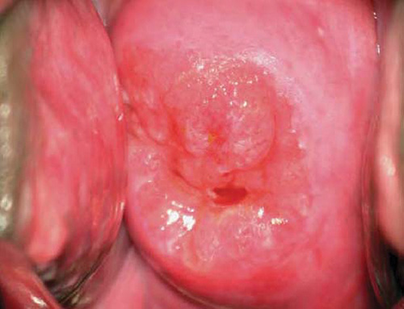

*Figure 4-1. Cervical eversion of pregnancy (colposcopic view): columnar epithelium on the portio.*

### Ovaries
- Ovulation stops.
- **Corpus luteum** is maximal for **6–7 wk** (4–5 wk post-ovulation). Removal **before 7 wk** → progesterone falls → abortion, so give **progesterone support**. After 7 wk, removal is usually safe.
- **Decidual reaction** on the ovary/serosa: red blisters that bleed easily (seen at cesarean).
- Ovarian vascular pedicle **0.9 → 2.6 cm**.
- **Relaxin** comes from the corpus luteum, decidua and placenta (same pattern as hCG).
  - It remodels connective tissue, ↑ renal hemodynamics, ↓ osmolality and ↑ arterial compliance.
  - ⚠️ It does **NOT** cause peripheral joint laxity or pelvic girdle pain.
- **Theca-lutein cysts (hyperreactio luteinalis):**
  - Bilateral and linked to **high hCG**: GTD, multifetal pregnancy, diabetes, anti-D alloimmunization.
  - Associated with preeclampsia and hyperthyroidism.
  - **Maternal virilization in up to 30%**; the fetus is rarely virilized.
  - Self-limited: resolves after delivery.

### Fallopian tubes
- Little hypertrophy, flattened epithelium, decidual cells but no continuous decidua.
- Rare torsion (usually with a paratubal or ovarian cyst).

### Vagina & perineum
- **Chadwick sign** = violet color from ↑ vascularity.
- Thick white discharge with **pH 3.5–6**. The acidity comes from *Lactobacillus acidophilus* making lactic acid from glycogen.
- ↑ **Candidiasis** risk, especially in the 2nd–3rd trimesters.
- The vaginal wall thickens, connective tissue loosens and smooth muscle hypertrophies.

**Pelvic organ prolapse and incontinence**
- The uterus may **incarcerate at 10–14 wk** → replace it and use a pessary.
- **Urinary incontinence:** ~**20% in the 1st trimester → ~40% in the 3rd**, mostly **stress UI**.
  - Risk factors: age >30, obesity, smoking, constipation, GDM.
- Cystocele/rectocele may rarely block fetal descent → empty the bladder or rectum and reduce the bulge.

---

## 2. Breasts
- Tenderness early; they enlarge after **2 months**. Visible veins and larger, darker nipples.
- **Colostrum** after the first few months.
- **Montgomery glands** = hypertrophic sebaceous glands in the areola.
- **Gigantomastia** (rare) → bromocriptine, then later surgical reduction.
- Breast size does **not** correlate with milk production.

---

## 3. Skin
- **89%** of women have at least one physiological skin change.
- **Striae gravidarum:**
  - 70% abdomen, 41% hips/thighs, 33% breasts.
  - Risk factors: young age, family history, weight and weight gain.
  - Aloe vera and almond oil ↓ itching.
- **Diastasis recti:** if severe → ventral hernia.
- **Hyperpigmentation (up to 90%):**
  - **Linea nigra**; **chloasma/melasma gravidarum** ("mask of pregnancy"); areolae and genital skin.
  - Cause: MSH, estrogen, progesterone.
- **Vascular spiders and palmar erythema** (hyperestrogenemia): no clinical significance, and they regress.
- **Hair:** anagen is prolonged in pregnancy. Postpartum hair shedding is **telogen effluvium**.

---

## 4. Metabolic Changes

- **BMR ↑ 20%** by the 3rd trimester (+10% more with twins).
- **Extra energy needed: 85 / 285 / 475 kcal/d** in the 1st / 2nd / 3rd trimesters.
- Average **weight gain 12.5 kg (27.5 lb)**.

### Table 4-1. Additional Energy Demands During Normal Pregnancy

**Rates of tissue deposition**

| | 1st Tri (g/d) | 2nd Tri (g/d) | 3rd Tri (g/d) | Total (g/280 d) |
|---|---|---|---|---|
| Weight gain | 17 | 60 | 54 | 12,000 |
| Protein deposition | 0 | 1.3 | 5.1 | 597 |
| Fat deposition | 5.2 | 18.9 | 16.9 | 3741 |

**Energy cost of pregnancy (estimated from BMR and energy deposition)**

| | 1st Tri (kJ/d) | 2nd Tri (kJ/d) | 3rd Tri (kJ/d) | Total MJ | Total kcal |
|---|---|---|---|---|---|
| Protein deposition | 0 | 30 | 121 | 14.1 | 3370 |
| Fat deposition | 202 | 732 | 654 | 144.8 | 34,600 |
| Efficiency of energy utilization* | 20 | 76 | 77 | 15.9 | 3800 |
| Basal metabolic rate | 199 | 397 | 993 | 147.8 | 35,130 |
| **Total energy cost** | **421** | **1235** | **1845** | **322.6** | **77,100** |

*Assumes an average gestational weight gain of 12 kg. \*Efficiency of food energy utilization for protein and fat deposition estimated as 0.90.*

### Table 4-2. Weight Gain Based on Pregnancy-Related Components (cumulative, g)

| Tissues and Fluids | 10 wk | 20 wk | 30 wk | 40 wk |
|---|---|---|---|---|
| Fetus | 5 | 300 | 1500 | 3400 |
| Placenta | 20 | 170 | 430 | 650 |
| Amnionic fluid | 30 | 350 | 750 | 800 |
| Uterus | 140 | 320 | 600 | 970 |
| Breasts | 45 | 180 | 360 | 405 |
| Blood | 100 | 600 | 1300 | 1450 |
| Extravascular fluid | 0 | 30 | 80 | 1480 |
| Maternal stores (fat) | 310 | 2050 | 3480 | 3345 |
| **Total** | **650** | **4000** | **8500** | **12,500** |

### Water
- **Plasma osmolality ↓ 10 mOsm/kg**, early in pregnancy: reset of the **thirst and vasopressin thresholds** (relaxin plays a role).
- Extra water: **~6.5 L** in total (3.5 L fetus/placenta/fluid + 3.0 L maternal blood, uterus and breasts), about 15 lb.
- **Ankle pitting edema is normal** (~1 L). Causes: partial vena cava occlusion ↑ venous pressure, plus ↓ interstitial colloid osmotic pressure.

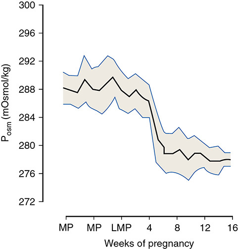

*Figure 4-2. Plasma osmolality falls ~10 mOsm/kg early in pregnancy (reset of thirst and vasopressin thresholds).*

### Protein
- **~1000 g** protein gained: 500 g in the fetus + placenta, 500 g in the uterus, breasts and blood.
- Amino acids are higher on the fetal side (active placental transport).
- Estimated need is **1.22 g/kg/d early and 1.52 g/kg/d late**, vs the current recommendation of **0.88 g/kg/d**, which may be too low.

### Carbohydrate
- The triad: **mild fasting hypoglycemia + postprandial hyperglycemia + hyperinsulinemia**.
- **Peripheral insulin resistance:** insulin sensitivity is **30–70% lower** in late pregnancy.
  - Cause: progesterone, **placental GH**, prolactin, cortisol, TNF, leptin.
  - Effect: a sustained glucose supply to the fetus.
- Insulin half-life is **unchanged**.
- ↑ **Hepatic gluconeogenesis** in the 3rd trimester.
- **"Accelerated starvation":** with fasting, fuel switches to lipids. Prolonged fasting → rapid **ketonemia**.

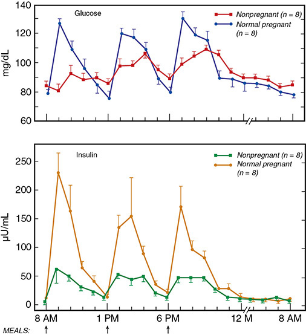

*Figure 4-3. Diurnal glucose and insulin in late pregnancy: fasting hypoglycemia, postprandial hyperglycemia, hyperinsulinemia.*

### Fat
- **Anabolic** in the 1st–2nd trimesters (fat storage) → **catabolic** in the 3rd (lipolysis ↑, lipoprotein lipase ↓). This spares glucose and amino acids for the fetus.
- Maternal **hyperlipidemia** is caused by insulin resistance and estrogen.
- Endothelial function actually **improves**, because HDL ↑ inhibits LDL oxidation.
- Breastfeeding ↓ triglycerides and ↑ HDL.

### Table 4-3. Plasma Concentrations of Lipids

| Lipid | Nonpregnant | Third Trimester (mean ± SD) |
|---|---|---|
| Total cholesterol | <200 mg/dL | 267 ± 30 mg/dL |
| LDL | <100 mg/dL | 136 ± 33 mg/dL |
| HDL | 40–60 mg/dL | 81 ± 17 mg/dL |
| Triglycerides | <150 mg/dL | 245 ± 73 mg/dL |

### Leptin and other adipocytokines
- **Leptin:** peaks in the 2nd trimester and plateaus at **2–4× nonpregnant** levels; the placenta is a major source, so it falls after delivery.
  - "Leptin resistance" promotes energy storage.
  - High levels are linked to preeclampsia, GDM and fetal distress.
  - Low fetal leptin → FGR.
- **Adiponectin:** from maternal fat, **not the placenta**. An insulin sensitizer that falls in GDM, but it is **not useful for predicting GDM**.
- **Ghrelin:** from the stomach and placenta; a role in fetal growth.
- **Visfatin + leptin ↑** → impaired uterine contractility (may explain dysfunctional labor in obesity).

### Electrolytes and minerals
- Retained: **~1000 mEq Na⁺ and 300 mEq K⁺**, yet serum levels are **slightly ↓**.
- **Calcium:**
  - **Total Ca ↓** (because albumin ↓); **ionized Ca unchanged**.
  - The fetus takes **~30 g Ca** by term, **80% in the 3rd trimester**.
  - Met by **doubled intestinal absorption** via **1,25(OH)₂D₃ (doubled)**, driven by **PTH-rP**.
- **Magnesium ↓** (total and ionized). Phosphate is normal.
- **Iodine needs ↑:**
  1. ↑ maternal T4 production
  2. Fetal thyroid hormone production in the 2nd half
  3. **Renal iodine clearance ↑ 30–50%**
  - Excess iodine → fetal hypothyroidism (**Wolff-Chaikoff effect**).

---

## 5. Hematological Changes

### Blood volume
- **↑ 40–45%** after **32–34 wk**. Plasma ↑ ~15% by 12 wk. Fastest rise is in the midtrimester, then a plateau near term. Greater with twins.
- It happens even with a **hydatidiform mole**, so a fetus isn't needed.
- **Functions:**
  1. Meets the needs of the enlarged uterus
  2. Supplies nutrients to the fetus and placenta
  3. Protects against impaired venous return (supine or erect)
  4. **Protects against blood loss at delivery**
- **RBC mass ↑ ~450 mL**, but plasma ↑ more → **dilutional ↓ Hb/Hct** and ↓ viscosity. Mild erythroid hyperplasia and ↑ reticulocytes (EPO ↑).
- **Hb at term averages 12.5 g/dL. <11.0 g/dL = abnormal**, usually iron deficiency.

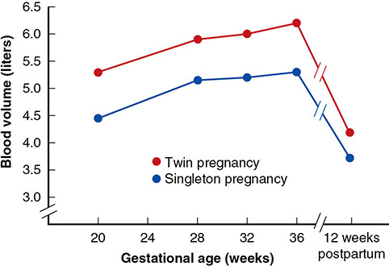

*Figure 4-4. Blood volume expansion: singletons vs twins; plateau near term, falls postpartum.*

### Iron
- Women's total body iron is **2.0–2.5 g**, with stores of only **~300 mg**.
- **Hepcidin ↓ early** → ↑ absorption via ferroportin and ↑ transfer to the fetus.

**Iron requirement ≈ 1000 mg**

| Use | Amount |
|---|---|
| Fetus + placenta | 300 mg |
| Obligatory losses (mainly GI) | 200 mg |
| RBC mass expansion (450 mL × 1.1 mg/mL) | 500 mg |

- Most of it is needed in the **second half**: **6–7 mg/d**, which diet and stores can't supply → **supplement**.
- The **fetus gets iron even if the mother is severely anemic** (maternal Hb 3 vs fetal Hb 16 g/dL).
- Blood loss with vaginal delivery is **500–600 mL**. The leftover hemoglobin iron becomes stores.

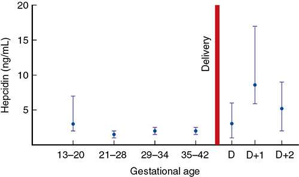

*Figure 4-5. Hepcidin falls early in pregnancy (↑ iron absorption) and rises after delivery.*

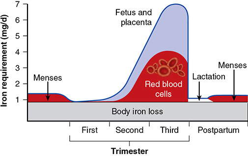

*Figure 4-6. Daily iron requirement across pregnancy (55-kg woman): most is needed in the second half.*

### Immunology
- **Th1 → Th2 shift.** Suppression of Th1/Tc1 → ↓ IL-2, IFN, TNF.
- Special **MHC molecules on trophoblast**.
- Cervical mucus IgA/IgG ↑.
- **IgG crosses to the fetus in the 3rd trimester** (passive immunity).

### Leukocytes and inflammatory markers
- **WBC up to 15,000/µL**, and **≥25,000/µL in labor and the early puerperium**.
- T lymphocytes ↑ (relative), B cells unchanged, CD4:CD8 ratio unchanged.
- **Leukocyte alkaline phosphatase ↑.**
- **CRP ↑**, but 95% of non-laboring women have **≤1.5 mg/dL**.
- **ESR ↑** (globulin + fibrinogen).
- **C3, C4 ↑.**
- **Procalcitonin** is low midpregnancy and ↑ at term and postpartum. It is a **poor predictor of chorioamnionitis** after PPROM.

### Coagulation
- **Hypercoagulable (procoagulant) state:**
  - **All clotting factors ↑ except XI and XIII**; **XIII ↓**.
  - Thrombin generation ↑; fibrinolysis is probably ↓.
- **Fibrinogen: 300 → 450 mg/dL** (range 300–600), ↑ ~50%.
- **D-dimer ↑**, so it is less useful for diagnosing VTE.
- **Regulatory proteins:**
  - **Activated protein C resistance ↑** (APC 2.4 → 1.9 U/mL).
  - **Free protein S ↓** (0.4 → 0.16 U/mL).
  - **Antithrombin ↓ 13%** by term and ↓ 30% more by 12 h postpartum; back to baseline by 72 h.

### Table 4-4. Coagulation Factor Normal Values Across Pregnancy

| Factor | Nonpregnant | 1st Tri | 2nd Tri | 3rd Tri |
|---|---|---|---|---|
| Fibrinogen (mg/dL) | 233–496 | 244–510 | 291–538 | 373–619* |
| D-dimer (µg/mL) | 0.22–0.74 | 0.05–0.95 | 0.32–1.29 | 0.13–1.7 |
| Factor V (% activity) | 50–150 | 75–95 | 72–96 | 60–88 |
| Factor VII (% activity) | 50–150 | 100–146 | 95–153 | 149–211 |
| Factor VIII (% activity) | 50–150 | 90–110 | 97–312 | 143–353 |
| Protein C, functional (%) | 70–130 | 78–121 | 83–133 | 67–135 |
| Protein S, functional (%) | 65–140 | 57–95 | 42–68 | 16–42 |

*The printed table reads "373–6.19", an obvious typo for 373–619.*

### Platelets and spleen
- **Platelets ↓** across pregnancy (lower in twins), and normal again by **4–12 wk postpartum**.
  - Causes: hemodilution, ↑ consumption (larger, younger platelets), splenic sequestration.
- **Spleen ↑ up to 50%** vs the 1st trimester (68% vs nonpregnant).

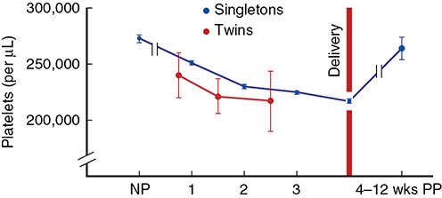

*Figure 4-7. Platelet counts fall across pregnancy (lower with twins) and recover by 4–12 wk postpartum.*

---

## 6. Cardiovascular System

- Changes start by **8 weeks**. **Cardiac output ↑ from week 5** (↓ SVR + ↑ HR).
- **Resting pulse ↑ ~10 bpm.**
- **Heart:**
  - Displaced **up and to the left and rotated** → larger silhouette on chest X-ray. A benign pericardial effusion is common.
  - **LV mass ↑ 30–35%** (concentric remodeling from 26–30 wk; resolves within 3 months).
  - Ejection fraction and septal thickness are unchanged.
  - Cardiac function is **eudynamic** (normal on the Braunwald graph).
- **ECG:** **slight left-axis deviation**; Q waves in II, III, aVF; flat or inverted T waves in III and V1–V3.
- **Heart sounds:**
  - **Exaggerated split S1** (both components louder)
  - No definite change in S2
  - **Loud S3**
  - **Systolic murmur is common**
  - Soft diastolic murmur (transient) and a mammary souffle (continuous) are possible

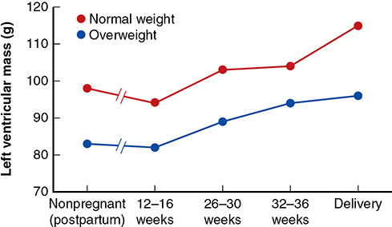

*Figure 4-9. Left ventricular mass rises from 26–30 wk in normal-weight and overweight women.*

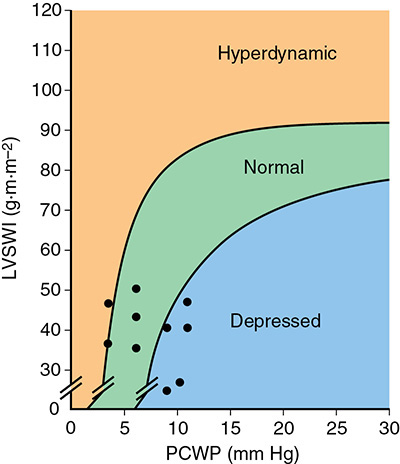

*Figure 4-10. Braunwald graph (LVSWI vs PCWP): cardiac function in late pregnancy is normal (eudynamic).*

### Cardiac output
- Highest in the **lateral recumbent** position.
- **Supine → aortocaval compression** → ↓ CO. Rolling to the left side ↑ CO by **~20% at 26–30 wk** and **10% at 32–34 wk**. Fetal O₂ saturation is **10% higher** with the mother in the lateral position during labor.
- **Twins:** a further **~20% ↑**; cardiovascular reserve is reduced.
- CO ↑ moderately in the **1st stage** of labor and **appreciably in the 2nd stage**.

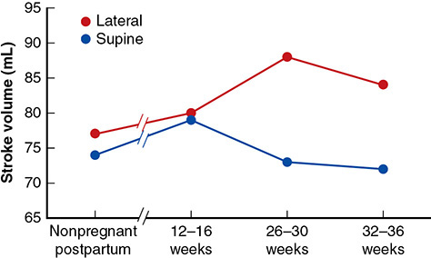

*Figure 4-8. Stroke volume, lateral vs supine: supine position lowers stroke volume in late pregnancy.*

### Table 4-5. Central Hemodynamic Changes in 10 Normal Nulliparous Women Near Term and Postpartum (Clark, 1989)

| Parameter | Pregnant (35–38 wk)ᵃ | Postpartum (11–13 wk) | Changeᵇ |
|---|---|---|---|
| Mean arterial pressure (mm Hg) | 90 ± 6 | 86 ± 8 | NSC |
| Pulmonary capillary wedge pressure (mm Hg) | 8 ± 2 | 6 ± 2 | NSC |
| Central venous pressure (mm Hg) | 4 ± 3 | 4 ± 3 | NSC |
| Heart rate (beats/min) | 83 ± 10 | 71 ± 10 | **+17%** |
| Cardiac output (L/min) | 6.2 ± 1.0 | 4.3 ± 0.9 | **+43%** |
| Systemic vascular resistance (dyn/sec/cm⁻⁵) | 1210 ± 266 | 1530 ± 520 | **−21%** |
| Pulmonary vascular resistance (dyn/sec/cm⁻⁵) | 78 ± 22 | 119 ± 47 | **−34%** |
| Serum colloid osmotic pressure (mm Hg) | 18.0 ± 1.5 | 20.8 ± 1.0 | **−14%** |
| COP–PCWP gradient (mm Hg) | 10.5 ± 2.7 | 14.5 ± 2.5 | **−28%** |
| LV stroke work index (g/m/m²) | 48 ± 6 | 41 ± 8 | NSC |

*ᵃMeasured in lateral recumbent position. ᵇSignificant unless NSC = no significant change. COP = colloid osmotic pressure; PCWP = pulmonary capillary wedge pressure.*

> **Memory hook:** "Output and rate go UP, resistance and COP go DOWN, pressures (MAP, PCWP, CVP) and LVSWI stay the SAME." Pregnancy is **not** a continuous "high-output" state.
>
> The ↓ COP–PCWP gradient helps explain why pregnant women are more prone to **pulmonary edema**.

### Blood pressure and venous system
- **BP nadir at 24–26 wk**, then it rises. **Diastolic falls more than systolic.**
- **Supine hypotensive syndrome** in **~10%** (compression of the great vessels).
- **Femoral venous pressure** (supine): **8 → 24 mm Hg** at term. Antecubital pressure is unchanged.
  - Consequences: dependent edema, varicosities, hemorrhoids, **DVT risk**.

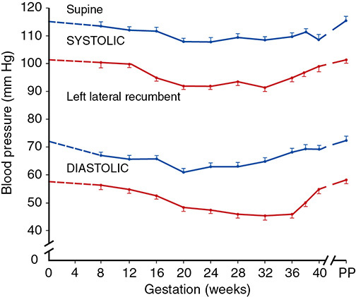

*Figure 4-11. Blood pressure (supine vs left lateral): nadir at 24–26 wk; diastolic falls more than systolic.*

### Vasoactive systems
| System | Change in pregnancy |
|---|---|
| Renin–angiotensin–aldosterone | **All components ↑**. **Refractory to angiotensin II** (progesterone, PlGF). Losing refractoriness predicts hypertension (Gant, 1973); it is lost within 15–30 min after the placenta delivers. |
| ANP / BNP | Stay in the **nonpregnant range**; BNP <20 pg/mL. **↑ in severe preeclampsia.** |
| Prostaglandins | ↑ PGE₂ (renal, natriuretic); ↑ **PGI₂** (vasodilation). The PGI₂:thromboxane ratio matters in preeclampsia. |
| Endothelin-1 | Vasoconstrictor. Sensitivity is unchanged in normal pregnancy; ↑ in preeclampsia. |
| Nitric oxide | Vasodilator; placental vascular tone. Abnormal in preeclampsia. |

---

## 7. Respiratory Tract

- **Diaphragm rises ~4 cm.** Subcostal angle widens; transverse chest diameter ↑ 2 cm; circumference ↑ 6 cm.
- Diaphragmatic excursion **increases**. Dyspnea is common.

| Volume / capacity | Change |
|---|---|
| **Functional residual capacity (FRC)** | **↓ 20–30%** (400–700 mL) |
| Expiratory reserve volume | ↓ 15–20% (200–300 mL) |
| Residual volume | ↓ 20–25% (200–400 mL) |
| Inspiratory capacity | ↑ 5–10% (200–350 mL) |
| **Tidal volume** | **↑** |
| **Minute ventilation** | **↑** (10.7 → 14.1 L/min) |
| Total lung capacity | Unchanged or ↓ <5% |
| **Respiratory rate** | **Unchanged** |
| Vital capacity, lung compliance | Unchanged |
| Peak expiratory flow, airway conductance | ↑ (total pulmonary resistance ↓) |

- **O₂ consumption ↑ ~20%** (↑ 10% more with twins; **↑ 40–60% in labor**). The arteriovenous O₂ difference ↓.
- **Physiological dyspnea:** progesterone ↑ respiratory drive → ↑ tidal volume → ↓ PaCO₂.

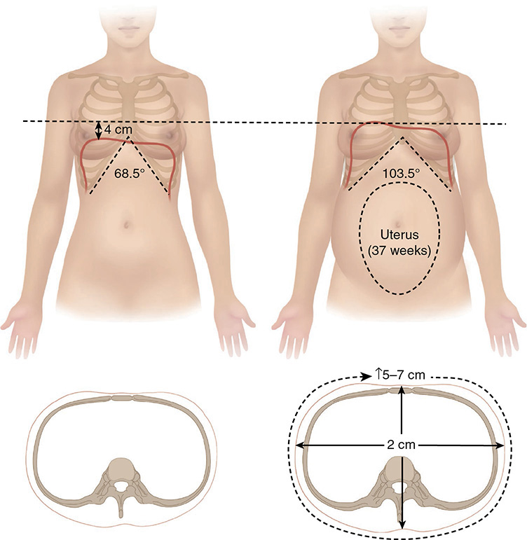

*Figure 4-12. Chest wall changes: diaphragm ↑ 4 cm, subcostal angle 68.5° → 103.5°, transverse diameter ↑ 2 cm, circumference ↑ 5–7 cm.*

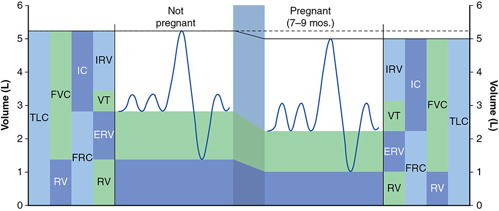

*Figure 4-13. Lung volumes: FRC, ERV and RV fall; inspiratory capacity and tidal volume rise; TLC is about unchanged.*

### Acid–base
- **Compensated respiratory alkalosis.** Progesterone lowers the CO₂ threshold and raises chemoreflex sensitivity.
- **Bicarbonate 26 → 22 mmol/L.**
- pH ↑ slightly, shifting the O₂ dissociation curve **left** (Bohr effect). This is offset by **↑ 2,3-DPG**, which shifts it back **right**.
- Net result: ↓ PaCO₂ **helps CO₂ transfer from the fetus** and O₂ release to the fetus.

---

## 8. Urinary System

- **Kidney size ↑ ~1 cm.**
- **GFR:** ↑ 25% by 2 wk after conception and **↑ 50% by the start of the 2nd trimester**; stays up until term.
- **Renal plasma flow ↑ ~80%** by the end of the 1st trimester, then falls late in pregnancy.
  - Mechanism: hemodilution (↓ oncotic pressure) + ↑ RPF. **Relaxin → NO → renal vasodilation.**
- Urinary frequency (60%) and **nocturia (80%)** in 3rd-trimester nulliparas.
- Supine position ↓ Na⁺ excretion to less than half that of lateral recumbency.
- ↑ loss of amino acids and water-soluble vitamins.

### Table 4-6. Renal Changes in Normal Pregnancy

| Parameter | Alteration | Clinical relevance |
|---|---|---|
| Kidney size | ~1 cm longer on radiograph | Returns to normal postpartum |
| Dilatation | Resembles hydronephrosis on sonogram or IVP (more marked on right) | Can be confused with obstructive uropathy. Retained urine → collection errors. Renal infections are more virulent. May cause "distention syndrome". **Defer elective pyelography ≥12 wk postpartum.** |
| Renal function | GFR and renal plasma flow ↑ ~50% | **Serum creatinine ↓. >0.8 mg/dL (>72 µmol/L) is already borderline.** Protein, amino acid and glucose excretion all ↑. |
| Acid–base | ↓ bicarbonate threshold; progesterone stimulates the respiratory center | Serum HCO₃⁻ ↓ 4–5 mEq/L. PCO₂ ↓ 10 mm Hg. **A PCO₂ of 40 mm Hg already represents CO₂ retention.** |
| Plasma osmolality | Osmoregulation altered; thresholds for AVP release and thirst ↓; hormonal disposal rates ↑ | Serum osmolality ↓ 10 mOsm/L (Na⁺ ↓ ~5 mEq/L). Placental metabolism of AVP may cause **transient diabetes insipidus**. |

*AVP = vasopressin; IVP = intravenous pyelography.*

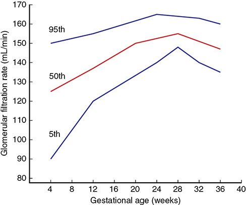

*Figure 4-14. GFR (inulin clearance) across pregnancy: 5th, 50th and 95th percentiles.*

### Renal function tests
- **Creatinine 0.7 → 0.5 mg/dL.** **≥0.9 mg/dL → look for renal disease.**
- Creatinine clearance is **~30% higher** than the nonpregnant 100–115 mL/min.
- Diurnal pattern reverses: water collects as edema by day and is mobilized at night → nocturia with dilute urine.

### Urinalysis
- **Glucosuria** is often normal (↑ GFR + ↓ tubular reabsorption); **~1 in 6** women.
  - UK (NICE): test for GDM if dipstick is **2+ once or 1+ repeatedly**.
- **Proteinuria:**
  - Abnormal is **≥300 mg/d** (vs >150 mg/d nonpregnant).
  - Normal mean is **115 mg/d**; upper 95% limit **260 mg/d**; albumin 5–30 mg/d.
- **Measuring protein:**
  - Dipstick doesn't account for concentration.
  - 24-h collection has retention and timing errors from the dilated tract. Minimize them by hydrating and using lateral recumbency for 45–60 min at the start and end.
  - Protein:creatinine ratio is quick, but the thresholds vary. **Unreliable postpartum.**

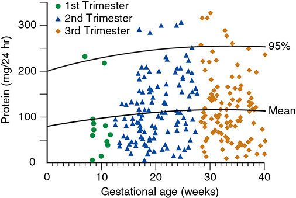

*Figure 4-15. 24-hour urinary protein by gestational age: mean ~115 mg/d, upper 95% limit ~260 mg/d.*

### Ureters and bladder
- **Hydroureter/hydronephrosis, right > left (86% right-sided).** Why:
  1. The **sigmoid colon cushions** the left ureter
  2. The **dextrorotated** uterus compresses the right
  3. The dilated **right ovarian vein** crosses over the right ureter
  - Plus progesterone.
- Ureteral "kinks" are really gentle curves.
- Ureteroscopy complication rates are the same as when not pregnant.
- **Bladder:**
  - Trigone is elevated and widened. Pressure **8 → 20 cm H₂O**.
  - Urethral length ↑ (6.7 / 4.8 mm) and **intraurethral pressure 70 → 93 cm H₂O** preserve continence.
  - Still, **≥50% have some incontinence by the 3rd trimester** → always consider it when ruptured membranes are suspected.

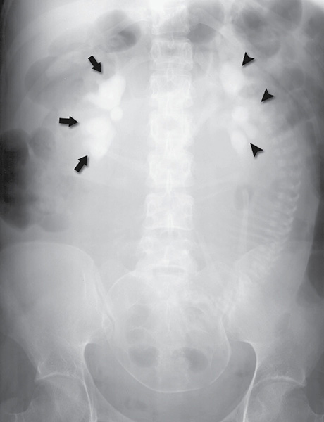

*Figure 4-16. IVP at 35 wk: moderate right (arrows) and mild left (arrowheads) hydronephrosis, both normal.*

---

## 9. Gastrointestinal Tract
- The stomach and intestines are pushed **up**. The **appendix moves up and laterally** (can reach the right flank), so appendicitis presents differently.
- **Heartburn:** ↓ lower esophageal sphincter tone, ↑ intragastric and ↓ intraesophageal pressure, slower peristalsis.
- **Gastric emptying is unchanged in pregnancy**, but it is **prolonged in labor and after analgesics** → **aspiration risk with general anesthesia**.
- Hemorrhoids: constipation + ↑ rectal venous pressure.

### Liver
- **Size unchanged.** Hepatic arterial and portal flow ↑. Stiffness ↑ in the 2nd–3rd trimesters.

| Test | Change |
|---|---|
| **Alkaline phosphatase** | **~2× ↑** (placental heat-stable isozyme) |
| AST, ALT, GGT, bilirubin | **Slightly ↓** |
| **Albumin** | ↓ to **~3.0 g/dL** (vs 4.3); total body albumin ↑ |
| Globulin | Slightly ↑ |
| Leucine aminopeptidase | Markedly ↑. Pregnancy-specific enzyme with **oxytocinase/vasopressinase activity → transient DI** |

> **Pearl:** a raised ALT/AST in pregnancy is **always abnormal**. A raised ALP alone is usually physiological.

### Gallbladder
- **Volume ↑ 50%**, contractility ↓.
  - Cause: progesterone inhibits CCK-mediated contraction.
  - Result: stasis + lithogenic bile → **cholesterol stones** (~8% have sludge or stones).
- Intrahepatic cholestasis of pregnancy → see Ch 58.

---

## 10. Endocrine System

### Pituitary
- **Enlarges ~135%** (lactotroph hyperplasia from estrogen). Up to 12 mm on MRI postpartum; back to normal by 6 months. Rarely compresses the chiasm → visual field loss.
- **Cell populations:**
  - Lactotrophs ↑
  - Gonadotrophs ↓
  - Corticotrophs and thyrotrophs unchanged
  - Somatotrophs suppressed (by placental GH)
- **The pituitary is not essential** for pregnancy: post-hypophysectomy pregnancies succeed with replacement.
- **Prolactinoma:** incidence not increased. A **macroadenoma (≥10 mm)** is more likely to grow.
- **Growth hormone:**
  - 1st trimester: maternal pituitary.
  - **Placental GH** detectable from 6 wk and **dominant by ~20 wk**. Differs by 13 amino acids; made by syncytiotrophoblast; acts via IGF-1.
  - Serum GH 3.5 → 14 ng/mL (plateau after 28 wk).
- **Prolactin:**
  - **~10× at term (~150 ng/mL)**. Paradoxically falls after delivery even with breastfeeding (pulsatile with suckling).
  - Essential for **lactation, not pregnancy**.
  - Amnionic fluid prolactin comes from the **decidua**, up to **10,000 ng/mL at 20–26 wk**.
  - A prolactin fragment is linked to **peripartum cardiomyopathy**.
- **Vasopressin (ADH) level is unchanged.**

### Thyroid
- **hCG and TSH share an identical α-subunit.** hCG is weakly thyrotropic → **TSH ↓ in the 1st trimester** in >80% of women (still within the nonpregnant range).
- TRH is unchanged; it crosses the placenta.
- **TBG ↑** early, peaking at **~20 wk at 2× baseline** (estrogen ↑ synthesis, ↓ clearance from sialylation).
  - → **Total T4 and T3 ↑** (rise from 6–9 wk, plateau at 18 wk).
  - → **Free T4 and T3 essentially unchanged**; free T4 peaks slightly with the hCG peak.
- Thyroid hormone production ↑ **40–100%**. Volume **12 → 15 mL**; **a goiter is not normal**, so evaluate it.
- ~⅓ of women have relative hypothyroxinemia with preferential T3 secretion.
- **Fetus:**
  - Fetal thyroid concentrates iodine from **10–12 wk**; its own TSH-driven secretion starts at **~20 wk**.
  - **~30% of cord T4 is maternal.**
- **Use gestational-age-specific TSH nomograms** (Dashe 2005). With nonpregnant cutoffs, **28%** of women with TSH above the 97.5th percentile would be missed.
- BMR ↑ up to 25%, mostly from the fetus.
- **Iodine:**
  - More than ⅓ of the world is marginally deficient.
  - Severe deficiency → **cretinism** (>2 million people globally).

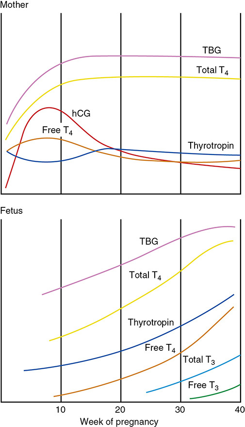

*Figure 4-17. Maternal and fetal thyroid changes: TBG and total T4 rise; hCG transiently suppresses TSH; free T4 about unchanged.*

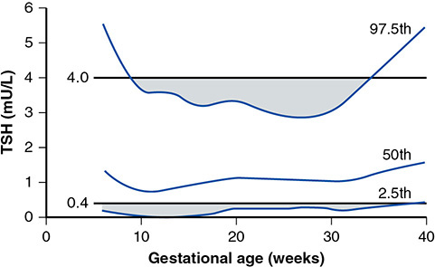

*Figure 4-18. Gestational-age-specific TSH nomogram: nonpregnant cutoffs (0.4–4.0 mU/L) misclassify many women.*

### Parathyroid, calcium and bone
- **Calcitriol (1,25-(OH)₂D) ↑ 2×** → ↑ intestinal Ca absorption to **~400 mg/d** in the 3rd trimester.
- **PTH ↓ in the 1st trimester, then ↑.** Active vitamin D rises anyway because of **placental PTH / PTH-rP**.
- **PTH-rP ↑ markedly** (made by fetal tissues and the breasts).
- Fetal skeleton needs **30 g Ca** (3% of maternal skeletal Ca).
- Bone turnover markers stay ↑ up to 12 months postpartum → risk of **pregnancy-associated osteoporosis**.
- **Calcitonin** (thyroid C cells) protects the maternal skeleton. Fetal levels are ≥2× maternal.

### Adrenal
| Hormone | Change |
|---|---|
| **Cortisol** | Total ↑ (**transcortin ↑**). **Free cortisol ↑.** Secretion rate unchanged or ↓; **half-life ~2×**. |
| **ACTH** | ↓ early, then **↑ in parallel with free cortisol** (feedback reset at a higher set point; progesterone antagonism). |
| **Aldosterone** | ↑ from **15 wk**; **~1 mg/d** by the 3rd trimester (angiotensin II ↑). Protects against the natriuresis of progesterone and ANP. |
| **Deoxycorticosterone** | **>15× ↑ (~1500 pg/mL)**. Made by the **kidney** (estrogen-stimulated), not the adrenal. |
| **Androstenedione / testosterone** | ↑ (probably ovarian). The **placenta aromatizes** them to estradiol, so **the fetus is protected** even from androgen-secreting tumors. |
| **DHEA-S** | **↓** (↑ hepatic 16α-hydroxylation + placental conversion to estrogen). |

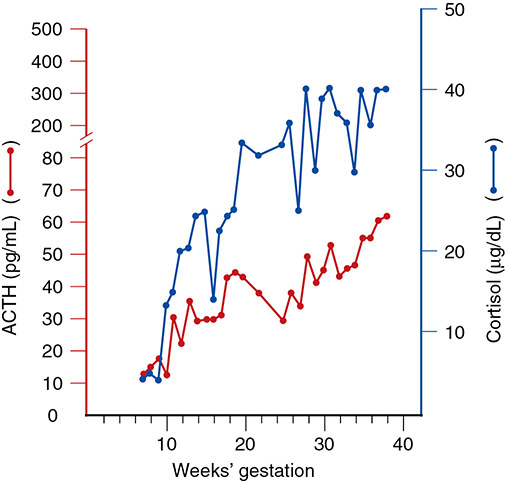

*Figure 4-19. Serum cortisol and ACTH rise together across pregnancy.*

---

## 11. Musculoskeletal System
- **Progressive lordosis** moves the center of gravity back over the legs.
- Sacroiliac, sacrococcygeal and pubic joint mobility ↑, mostly in the first half of pregnancy → low back pain.
  - ⚠️ **Not** correlated with relaxin, estradiol or progesterone levels.
- **Symphyseal separation >1 cm** → significant pain.
- Neck flexion and shoulder slumping → ulnar/median nerve traction (can mimic **carpal tunnel syndrome**).
- Joints firm up again within **3–5 months** postpartum. Pelvic dimensions are unchanged by 3 months.

---

## 12. Central Nervous System
- **Cerebral blood flow ↓:**
  - MCA: 147 → 118 mL/min
  - PCA: 56 → 44 mL/min
  - **Autoregulation is unchanged.**
- **Memory:** a decline that is worst in the **3rd trimester**, transient and **not** explained by mood or sleep. Preeclampsia and eclampsia → lasting cognitive effects.
- **Eyes:**
  - **Intraocular pressure ↓**
  - Corneal sensitivity ↓
  - **Corneal thickness ↑** (contact lens intolerance)
  - **Krukenberg spindles**
  - Transient loss of accommodation
- **Sleep:** disrupted from **12 wk** to 2 months postpartum, worst postpartum. Linked to sleep-disordered breathing and postpartum blues or depression.

---

## Quick-Recall: What Goes Up / Down / Stays the Same

| ↑ Increases | ↓ Decreases | ↔ Unchanged |
|---|---|---|
| Blood volume (40–45%), RBC mass, plasma volume | Hb/Hct (dilutional), blood viscosity | Respiratory rate |
| Cardiac output (40–50%), HR (+10–15 bpm), stroke volume | SVR, PVR, colloid osmotic pressure | MAP, PCWP, CVP, LVSWI |
| Tidal volume, minute ventilation, O₂ consumption | FRC, ERV, RV, PaCO₂, HCO₃⁻ | Total lung capacity, vital capacity, lung compliance |
| GFR (50%), RPF, creatinine clearance | Serum creatinine, osmolality, Na⁺, K⁺ | Antecubital venous pressure |
| All clotting factors (except XI, XIII), fibrinogen, D-dimer, WBC, ESR, CRP | Platelets, protein S, antithrombin, factor XIII | CD4:CD8 ratio, B cells |
| ALP (placental), albumin *total*, lipids (TC, LDL, HDL, TG) | Albumin *concentration*, AST/ALT/GGT/bilirubin | Liver size, gastric emptying (before labor) |
| TBG, total T4/T3, prolactin, cortisol, ACTH, aldosterone, DOC, 1,25-D, PTH-rP | TSH (1st tri), DHEA-S, total Ca, Mg | Free T4/T3, ionized Ca, vasopressin level, insulin half-life |
| Insulin, insulin resistance, leptin | Fasting glucose, insulin sensitivity | Cerebral autoregulation |

## Key Numbers to Memorize
- Uterus **70 g → 1100 g**, **5 L** volume; uteroplacental flow **500–750 mL/min**
- Weight gain **12.5 kg**; extra water **6.5 L**; protein **1000 g**; iron **1000 mg** (6–7 mg/d late)
- Blood volume **+40–45%**; RBC **+450 mL**; Hb **<11 g/dL = anemia**
- WBC to **15,000** (labor **≥25,000**); fibrinogen **~450 mg/dL**
- Cardiac output **+43%**, HR **+17%**, SVR **−21%**; BP nadir **24–26 wk**; supine hypotension **10%**
- Diaphragm **↑4 cm**; FRC **↓20–30%**; HCO₃⁻ **22 mmol/L**; O₂ use **+20%**
- GFR **+50%**; creatinine **0.5 mg/dL** (≥0.9 abnormal); proteinuria **≥300 mg/d** abnormal
- Hydronephrosis **right-sided in 86%**
- Pituitary **+135%**; prolactin **~150 ng/mL**; thyroid volume **12 → 15 mL**; aldosterone **1 mg/d**; DOC **15×**
