# Chapter 5: Implantation and Placental Development — Revision Notes

> Williams Obstetrics 26e, pp. 228–294 of the PDF. High-yield numbers are in **bold**.
> The two tables are transcribed from the PDF images (they are missing from the extracted chapter text). 13 of the 17 figures are included from the PDF (histology micrographs 5-3, 5-6, 5-8 and 5-12 are omitted).

**Big picture:** From ovulation to a working hemochorial placenta: decidualization, implantation on days 6–7, trophoblast invasion and spiral artery remodeling, villous development, the fetal membranes and cord, and the placenta as an endocrine organ (hCG, hPL, progesterone, estrogens) working with the fetal adrenal.

---

## 1. Ovarian–Endometrial Cycle

- ~40 years of cyclical ovulation → **~400 chances** of pregnancy. Controlled by GnRH, FSH, LH, estrogen and progesterone.
- **Follicular phase (days 1–14):** rising estrogen, endometrial thickening, selection of the dominant follicle.
- **Luteal phase:** the corpus luteum (CL) makes estrogen + progesterone to prepare for implantation. If implantation occurs, **hCG rescues the CL**.

### Ovulation and the corpus luteum
- **Luteinization:** the basement membrane between granulosa-lutein and theca-lutein cells breaks down; **by day 2 after ovulation** vessels invade the granulosa layer.
- **LH is the main luteotropic factor.** **LH and hCG share the same LH-hCG receptor.**
- Granulosa-lutein cells make more progesterone because of better access to **LDL cholesterol**.
- **Progesterone peaks at 25–50 mg/d** in the midluteal phase.
- No pregnancy → CL **apoptosis 9–11 days after ovulation** → estradiol and progesterone fall → menstruation.

### Secretory endometrium
- **Days 22–25:** predecidual change of the **upper ⅔ of the functionalis**; glands coil, secretions visible.
- **Window of implantation = days 20–24:** fewer microvilli and cilia; apical **pinopodes** appear; glycocalyx changes allow blastocyst acceptance.
- **Spiral arteries** (from radial ← arcuate ← uterine arteries) lengthen faster than the endometrium thickens → more coiling; marked angiogenesis.

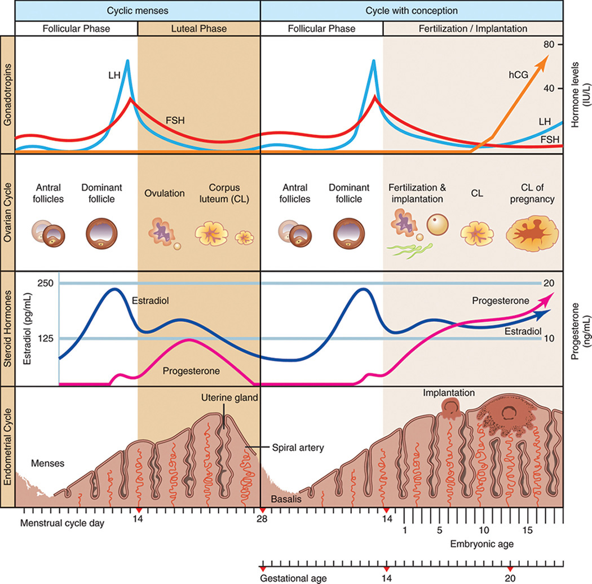

*Figure 5-1. Ovarian–endometrial cycle with and without conception: LH surge, corpus luteum, and hCG rescuing the corpus luteum to maintain progesterone.*

---

## 2. Decidua

- Specialized endometrium of pregnancy, **essential for hemochorial placentation** (maternal blood contacts trophoblast).
- **Decidualization:** stromal cells → secretory decidual cells; needs estrogen, progesterone, androgens and blastocyst factors.
- Immunomodulation of the semiallograft is largely by **decidual NK cells**.

### Structure

| Part | Location / features |
|---|---|
| **Decidua basalis** | Beneath the implantation site; invaded by trophoblast; forms the **basal plate** |
| **Decidua capsularis** | Over the blastocyst; most prominent in the **2nd month**; contacts the **chorion laeve**; loses its blood supply |
| **Decidua parietalis** | Lines the rest of the cavity |
| **Decidua vera** | Capsularis + parietalis fused **by 14–16 wk** → uterine cavity functionally obliterated |

- The gestational sac = **extraembryonic coelom = chorionic cavity**.
- Thickness **5–10 mm** early, thinner later.
- **Layers (parietalis and basalis):** **zona compacta** + **zona spongiosa** (= zona functionalis) + **zona basalis** (remains after delivery → new endometrium).
- Predecidual change starts in the **midluteal phase** around the spiral arteries and spreads in waves; completed only with implantation.

**Spiral arteries: parietalis vs basalis**

| | Decidua parietalis | Decidua basalis (placental bed) |
|---|---|---|
| Wall | Keep smooth muscle + endothelium | **Trophoblast replaces endothelium; smooth muscle destroyed** |
| Vasoactive response | **Responsive** | **Unresponsive** |
| Clinical | — | **Defective invasion → preeclampsia** |

- Fetal **chorionic vessels** contain smooth muscle → **do respond** to vasoactive agents.

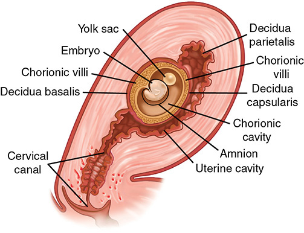

*Figure 5-2. The three parts of the decidua: basalis (under the implantation site), capsularis (over the sac) and parietalis (rest of the cavity).*

### Histology
- Early: spongiosa has large hyperplastic secretory glands (nourish the blastocyst). Later: mainly arteries and dilated veins.
- **Nitabuch layer:** fibrinoid zone where invading trophoblast meets decidua basalis. **Usually absent in placenta accreta** (defective decidua).
- **Rohr stria:** superficial, inconsistent fibrin at the bottom of the intervillous space around anchoring villi.
- **Decidual necrosis** is common in the 1st (and probably 2nd) trimester → necrotic decidua at curettage is **not necessarily cause or effect** of miscarriage.
- Cells: true decidual cells + bone marrow–derived **regulatory T cells, decidual macrophages, dNK cells** → immunotolerance, trophoblast invasion, vasculogenesis.

### Decidual prolactin
- Same gene as pituitary prolactin; physiological role unknown.
- Preferentially enters amnionic fluid: **~10,000 ng/mL at 20–24 wk**, vs maternal serum **150–200 ng/mL**.
- Cleaved to **vasoinhibins** (antiangiogenic) → possible role in **peripartum cardiomyopathy**.
- Prolactin inhibits maternal insulin action → more glucose for the fetus.

---

## 3. Implantation and Early Trophoblast Formation

### Fertilization
- Oocyte–cumulus complex is picked up by the infundibulum; **fertilization within a few hours and no more than 1 day** after ovulation.
- **Almost all pregnancies result from intercourse in the 2 days before or on the day of ovulation.**
- Sperm pass the cumulus → **zona pellucida** → oocyte → zygote (46 chromosomes).
- **Dating:** 1 wk postfertilization ≈ **3 wk from LMP**. For **IVF, gestational age = fertilization day + 14 days**. 8 wk gestation = 6 wk postfertilization.

### Cleavage to blastocyst
- Zygote cleaves slowly for **3 days in the tube** → blastomeres → **morula** (12–16 cells) → **enters the uterus ~day 3**.
- Morula ends when the blastocyst forms at **50–60 blastomeres**.
- **Day 4–5: 58-cell blastocyst** = **5 inner cell mass** (embryo) + **53 trophectoderm** (trophoblast). 107-cell stage: 8 embryo cells + 99 trophoblast.
- **Hatching** from the zona is caused by proteases from secretory endometrial glands.
- Blastocyst signals: **IL-1α, IL-1β, hCG**. Endometrium responds with **LIF, follistatin, CSF-1**.

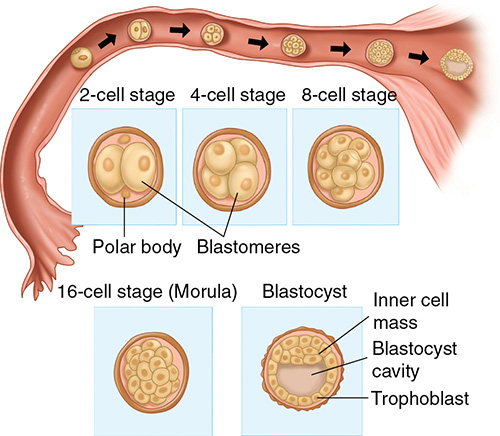

*Figure 5-4. Cleavage in the fallopian tube: 2-, 4-, 8-cell stages → morula (16 cells) → blastocyst with inner cell mass and trophoblast.*

### Implantation
- **Day 6–7 after fertilization.** Receptivity limited to **cycle days 20–24**; after day 24 antiadhesive glycoproteins block adhesion.
- **Three phases:**
  1. **Apposition:** loose contact; most often the **upper posterior uterine wall**
  2. **Adhesion:** via cell adhesion molecules, especially hormonally regulated **integrins**
  3. **Invasion:** syncytio- and cytotrophoblast into decidua, **inner ⅓ of myometrium** and vessels
- Blastocyst is **100–250 cells** at implantation.
- Receptivity/transfer timing mismatch → **repeated IVF implantation failure** (gene-expression receptivity testing).

### Trophoblast development
- **Hemochorial placenta:** maternal blood bathes syncytiotrophoblast; fetal and maternal blood **do not normally mix**.
- **By day 8:** outer **syncytiotrophoblast** + inner **cytotrophoblast**.

| | Cytotrophoblast | Syncytiotrophoblast |
|---|---|---|
| Structure | Distinct borders, single nucleus | No cell borders, multiple nuclei, continuous lining |
| Division | **DNA synthesis and mitosis** | None |
| Role | **Germinal** cells for the syncytium (fuse via **syncytin**) | **Transport** and hormone production |

- Two pathways:
  - **Villous trophoblast** → chorionic villi (exchange).
  - **Extravillous trophoblast** → **interstitial** (invade decidua and myometrium → **placental-bed giant cells**; surround spiral arteries) and **endovascular** (enter spiral artery lumens).

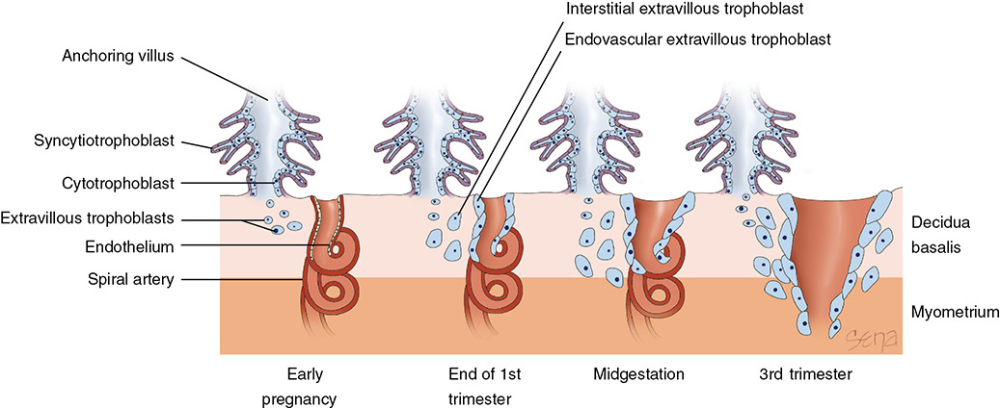

*Figure 5-5. Extravillous trophoblasts: endovascular cells replace the spiral artery endothelium and interstitial cells surround the vessel, converting it to a wide low-resistance channel by the 3rd trimester.*

### Early invasion
- **Day 9:** the wall facing the lumen is a single flat layer. **Day 10: blastocyst completely encased** in endometrium.
- **Day 7.5:** inner cell mass → **embryonic disc** (ectoderm + endoderm); amnionic cavity appears.
- Extraembryonic mesoderm lines the cavity → spaces fuse → **extraembryonic coelom (chorionic cavity)**. **Chorion = trophoblast + mesenchyme.** Mesenchyme condenses into the **body stalk → umbilical cord**.
- **Day ~12:** **trophoblastic lacunae** in the syncytium fill with maternal blood.

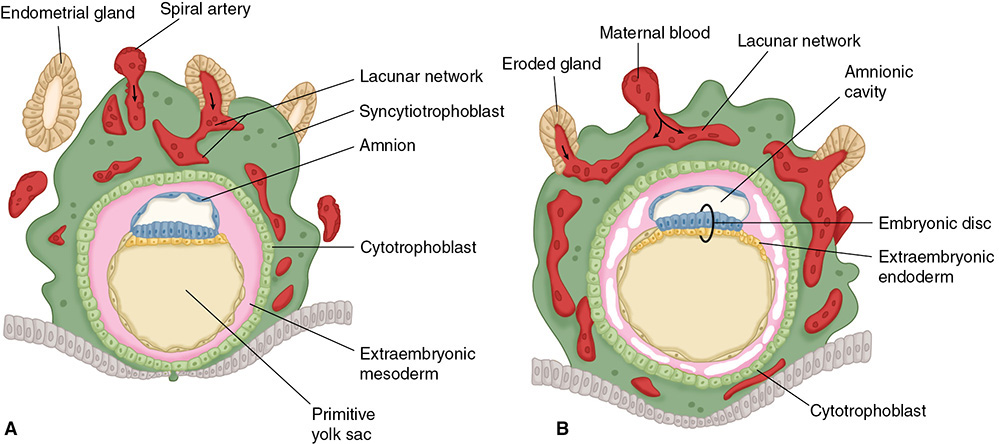

*Figure 5-7. Implanted blastocyst at 10 and 12 days: lacunar network filling with maternal blood, embryonic disc, amnionic cavity and primitive yolk sac.*

### Chorionic villi

| Villus | Composition | Timing |
|---|---|---|
| **Primary** | Cytotrophoblast core + syncytium | Before day 12 |
| **Secondary** | + mesenchymal core | From day 12 |
| **Tertiary** | + fetal blood vessels (angiogenesis) | Then |

- **Maternal arterial blood enters the intervillous space ~day 15.** **Fetal vessels functional by day 17** → placental circulation established.
- Failed villous angiogenesis, taken to the extreme = **hydatidiform mole**.
- **Anchoring villi:** cytotrophoblast columns at villous tips, not invaded by mesenchyme, attached at the **basal plate** (maternal side). **Chorionic plate** = roof; final form **by 8–10 wk**.
- Syncytial **microvilli** ↑ surface area in direct contact with maternal blood = defining feature of a hemochorial placenta.

---

## 4. Placenta and Chorion

### Chorion development
- Early: villi cover the **entire** chorionic sac.
- Villi against the decidua basalis proliferate → **chorion frondosum** (leafy) → placenta.
- Villi against the decidua capsularis lose blood supply and degenerate → **chorion laeve** (smooth; avascular; cytotrophoblast + mesenchyme).
- Until the **end of month 3** the chorion laeve and amnion are separated by the exocoelomic cavity → then fuse as the avascular **amniochorion** (an important paracrine arm of maternal–fetal communication).

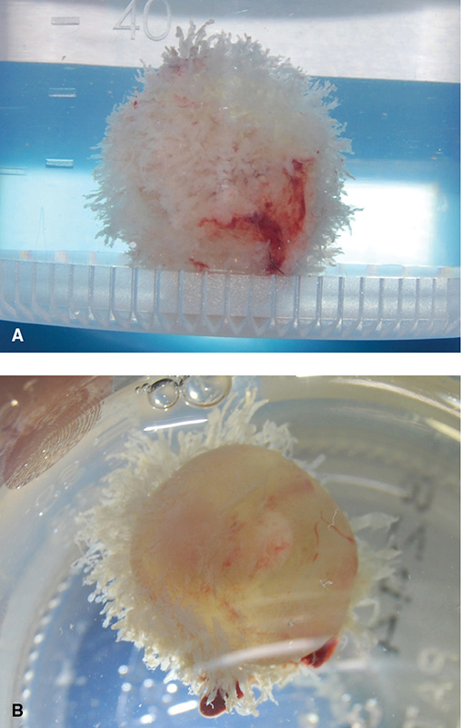

*Figure 5-9. Complete abortion specimens: villi first cover the whole sac, then regress except where the placenta will form.*

### Regulators of trophoblast invasion

| Cell | Share of 1st-tri decidual leukocytes | Role |
|---|---|---|
| **Decidual NK (dNK)** | **70%** | **Not cytotoxic** (unlike blood NK). Secrete **IL-8, IP-10** (attract trophoblast toward spiral arteries), **VEGF, PlGF** (angiogenesis); aid phagocytosis |
| **Decidual macrophages** | **~20%** | M2-like immunomodulatory phenotype; IL-10; control dNK |
| **Tregs** | — | **Essential for immune tolerance**; systemic numbers expand |
| Th1, Th2, Th17 | — | Tightly regulated |

**Endometrial invasion**
- Occurs under **low oxygen**; hypoxia-induced factors help.
- Trophoblast **urokinase plasminogen activator** → plasmin → degrades matrix and activates **MMPs (MMP-9 critical)**.
- **Low 1st-trimester estradiol is needed for invasion.** Rising estradiol in the 2nd trimester **downregulates VEGF and integrins** (collagen IV, laminin, fibronectin receptors) → limits remodeling.

### Spiral artery invasion
- Occurs in the **first half of pregnancy**; key to preeclampsia, FGR and preterm birth.
- Endovascular trophoblasts form **plugs**, cause endothelial **apoptosis**, replace the lining; **fibrinoid replaces the media** → ↓ resistance. They migrate **against arterial flow**, several cm. **Arteries only, not veins.**

| Wave | Timing (postfertilization) | Extent |
|---|---|---|
| **First** | **Before 12 wk** | Up to the decidual–myometrial border |
| **Second** | **12–16 wk** | Some intramyometrial segments |

- Early placenta develops at **2–3% O₂**; remodeling **more than doubles O₂** around the end of the 1st trimester.

### Villus branching and lobules
- Most villi end freely in the intervillous space; some anchor. Stem villi → progressively finer branches; surface area ↑ with gestational age. **Restricted blood flow → more branching** (compensation).
- **Lobule (cotyledon) = one main stem villus with its branches, one chorionic artery and vein** = the functional unit.

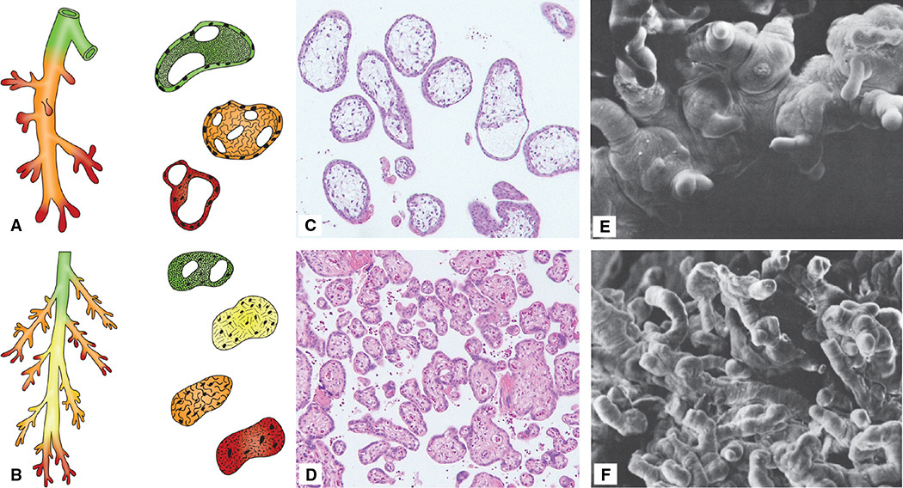

*Figure 5-10. Early (top) vs late (bottom) villi: limited branching early; extensive arborization at term, with capillaries close to the villous surface.*

### Growth and maturation
- 1st trimester: placenta grows faster than the fetus. **17 wk: placental ≈ fetal weight.** **Term: placenta ≈ ⅙ of fetal weight.**
- Maternal surface: **10–38 lobes**, separated by grooves from decidual **septa**. Lobe number is fixed; grossly visible "cotyledons" are really **lobes**.
- **By 16 wk** cytotrophoblast continuity is lost; syncytium thins; fetal capillaries move close to the surface.
- **Hofbauer cells** = **fetal macrophages** in the villous stroma: phagocytic, immunosuppressive, paracrine.
- ↓ exchange efficiency: thickened basal lamina, obliterated fetal vessels, more stroma, villous fibrin.

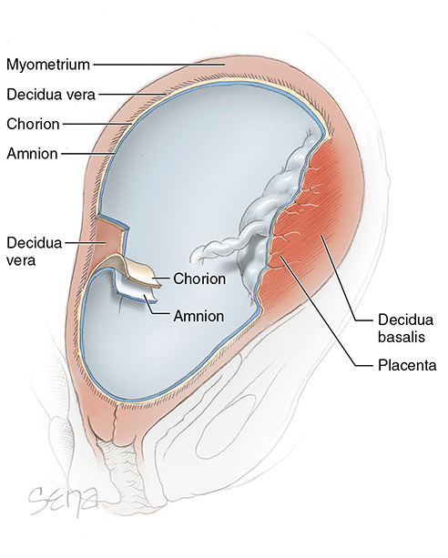

*Figure 5-11. Placenta and membranes in situ: amnion, chorion, decidua vera and decidua basalis.*

### Placental circulation

**Fetal side**
- **Two umbilical arteries** carry deoxygenated blood; **one umbilical vein** returns oxygenated blood.
- Chorionic (surface) vessels: **arteries always cross over veins** (histologically hard to tell apart).
- **Truncal arteries** perforate the chorionic plate; each supplies **one stem villus = one cotyledon**; lose smooth muscle as they branch.
- **Umbilical artery end-diastolic flow is absent before 10 wk** and present thereafter in normal pregnancy (basis of Doppler assessment).

**Maternal side**
- Blood enters through the basal plate in **spurts**, is driven up toward the chorionic plate, disperses laterally, bathes the villi, and drains through venous orifices in the basal plate. **No preformed channels.**
- **Arteries are perpendicular** to the uterine wall, **veins parallel** → veins close during contractions, retaining blood in the intervillous space.
- **~120 spiral artery entry sites at term.**
- **After 30 wk** a venous plexus between decidua basalis and myometrium creates the **cleavage plane for placental separation**.
- **Contractions:** inflow and outflow both ↓; venous outflow is impaired more → intervillous space distends (placenta ↑ in size) → more blood available for exchange though flow rate ↓.
- **Regulators of intervillous flow:** arterial BP, intrauterine pressure, contraction pattern, factors acting on arterial walls.

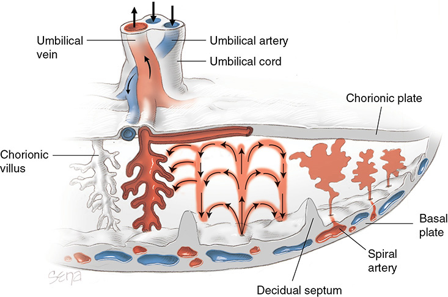

*Figure 5-13. Term placenta: maternal blood spurts from spiral arteries into the intervillous space and drains through basal plate veins; umbilical arteries bring deoxygenated fetal blood.*

### Breaks in the placental "barrier"
- Cells traffic **both ways**: e.g., **D-antigen alloimmunization**; rarely fetal exsanguination into the mother.
- **Microchimerism:** fetal cells engraft in the mother and persist for **decades** → linked to the female predominance of autoimmune disease: **lymphocytic thyroiditis, scleroderma, SLE**.

### Maternal–fetal interface: immunology
- Trophoblast = the **only fetal cells in direct contact** with maternal tissue and blood.
- HLA = human MHC. Class Ia: **HLA-A, -B, -C**. Class Ib: **HLA-E, -F, -G**.
- **Villous trophoblast: no MHC class I or II** → immunologically inert.
- **Extravillous trophoblast expresses HLA-C, HLA-E, HLA-G**; these with dNK cells permit and then **limit** invasion (too much → placenta accreta spectrum).
- **HLA-G:** human-only, restricted to extravillous trophoblast; membrane-bound + soluble; protects from NK attack.
  - **IVF embryos not expressing soluble HLA-G fail to implant.**
  - **Abnormal HLA-G in preeclampsia.**
- dNK cells: predominate in midluteal endometrium and 1st-tri decidua, fall by term; recruited by **progesterone, IL-15, decidual prolactin**; cytotoxicity blocked by macrophage cues and HLA.
- **Dendritic cells** educate maternal T cells.

---

## 5. Amnion

- Tough, pliable, **avascular**; innermost membrane; provides **almost all tensile strength** of the membranes. **PROM is a major cause of preterm delivery.**
- **No smooth muscle, nerves, lymphatics or blood vessels.**

**Five layers (fluid → chorion)**
1. **Cuboidal epithelium** (single layer)
2. Basement membrane
3. **Compact layer** (interstitial collagens) = **tensile strength**
4. Fibroblast-like **mesenchymal layer**
5. **Zona spongiosa** (contiguous with chorion laeve)

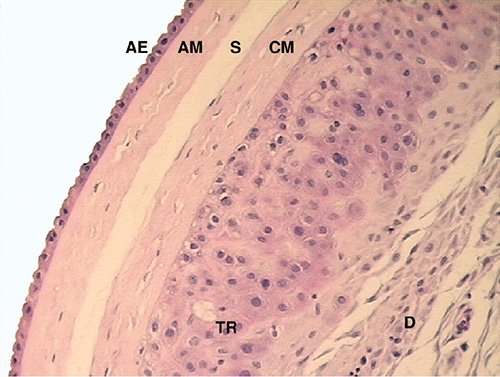

*Figure 5-14. Fetal membranes, fluid side to maternal side: amnion epithelium, amnion mesenchyme, zona spongiosa, chorionic mesenchyme, trophoblast, decidua.*

### Development
- First seen on **day 7–8**; engulfs the embryo; fuses with the chorion laeve near the end of the 1st trimester, obliterating the extraembryonic coelom. **Amnion and chorion are easily separated** (never intimately joined).
- **Twins:** monochorionic-diamnionic → nothing between the amnions; **dichorionic-diamnionic → fused chorions between the amnions**.
- **Amnionic fluid** rises until **~34 wk**, then declines; **~1000 mL at term**.
- **Amnionic epithelium comes from fetal ectoderm, not trophoblast**; its HLA class I pattern resembles embryonic cells. Mesenchyme likely from embryonic mesoderm.

### Cell functions

| Cell | Products / roles |
|---|---|
| **Epithelium** (microvilli; transfer site) | TIMP-1, **PGE₂**, **fetal fibronectin (fFN)**, IL-8 in labor; endothelin, PTH-rP, **BNP** and CRH (smooth-muscle relaxation). Oxytocin and vasopressin ↑ PGE₂ |
| **Mesenchyme** | **Interstitial collagens of the compact layer** (tensile strength); **cortisol via 11β-HSD** at term may ↓ collagen → rupture; IL-6, IL-8, MCP-1; may be the **greater PGE₂ source**, especially with PROM |

- **fFN** acts on mesenchyme → **↑ MMPs** (collagen breakdown) and **↑ prostaglandins** (contractions); upregulated with thrombin- or infection-induced PROM.
- **BNP** (stretch-induced) promotes uterine quiescence; **EGF** rises at term, suppressing BNP → quiescence ends.

### Tensile strength
- On testing, **decidua then chorion give way long before the amnion**. Membranes can stretch to **2× normal size**.
- Strength = **compact layer: cross-linked collagens I and III** (+ some V, VI). Assembly regulated by proteoglycans **decorin, biglycan**.
- Membranes over the **cervix** show regional inflammatory gene changes → weakening.
- Amnion is metabolically active: water/solute transport; stretch → MMPs, IL-8, collagenase.

---

## 6. Umbilical Cord

- Embryo bulges into the amnion; the yolk sac is incorporated as the **gut**. **Body stalk** joins the caudal embryo to the chorion. **Allantois** = diverticulum of the caudal yolk sac into the body stalk.
- **Mid-3rd month:** amnion fuses with chorion laeve and covers the body stalk → **umbilical cord (funis)**.
- **Two arteries + one vein.** The **right umbilical vein disappears early**; the **left** remains.
- **Umbilical vein → fetus** by two routes: **ductus venosus → IVC** (sphincter at its origin, **vagal** innervation) and hepatic circulation → hepatic vein → IVC.
- **Umbilical arteries** = anterior branches of the **internal iliac**; obliterated after birth → **medial umbilical ligaments**.

---

## 7. Placental Hormones

- Trophoblast steroid and protein hormone output is **greater in amount and diversity than any single endocrine tissue** in mammalian physiology.

### Table 5-1. Steroid Production Rates in Nonpregnant and Near-Term Pregnant Women

| Steroidᵃ | Nonpregnant (mg/24 hr) | Pregnant (mg/24 hr) |
|---|---|---|
| Estradiol | 0.1–0.6 | **15–20** |
| Estriol | 0.02–0.1 | **50–150** |
| Progesterone | 0.1–40 | **250–600** |
| Aldosterone | 0.05–0.1 | 0.250–0.600 |
| Deoxycorticosterone | 0.05–0.5 | 1–12 |
| Cortisol | 10–30 | 10–20 |

*ᵃEstrogens and progesterone are produced by the placenta. Aldosterone is produced by the maternal adrenal in response to angiotensin II. Deoxycorticosterone is produced in extraglandular tissue sites by 21-hydroxylation of plasma progesterone. Cortisol production is not increased in pregnancy even though blood levels are elevated, because clearance falls with increased cortisol-binding globulin.*

### Table 5-2. Protein Hormones Produced by the Human Placenta

| Hormone | Primary Non-placental Site of Expression | Shares Structural or Function Similarity | Functions |
|---|---|---|---|
| Human chorionic gonadotropin (hCG) | — | LH, FSH, TSH | Maintains corpus luteum function; regulates fetal testis testosterone secretion; stimulates maternal thyroid |
| Placental lactogen (PL) | — | GH, prolactin | Aids maternal adaptation to fetal energy requirements |
| Adrenocorticotropin (ACTH) | Pituitary* | — | — |
| Corticotropin-releasing hormone (CRH) | Hypothalamus | — | Relaxes smooth muscle; initiates parturition?; promotes fetal and maternal glucocorticoid production |
| Gonadotropin-releasing hormone (GnRH) | Hypothalamus | — | Regulates trophoblast hCG production |
| Thyrotropin-releasing hormone (TRH)* | Hypothalamus | — | Unknown |
| Growth hormone–releasing hormone (GHRH) | Hypothalamus | — | Unknown |
| Growth hormone variant (hGH-V) | — | GH variant not found in pituitary | Potentially mediates pregnancy insulin resistance |
| Neuropeptide Y | Brain | — | Potentially regulates CRH release by trophoblasts |
| Parathyroid hormone–related protein (PTH-rP)* | — | — | Regulates transfer of calcium and other solutes; regulates fetal mineral homeostasis |
| Inhibin | Ovary/testis | — | Potentially inhibits FSH-mediated ovulation; regulates hCG synthesis |
| Activin | Ovary/testis | — | Regulates placental GnRH synthesis |

*\*Corrected printed typos: the table lists ACTH's non-placental site as "Hypothalamus" (it is the anterior pituitary), "Thyrotropin (TRH)" for thyrotropin-releasing hormone, and "Parathyroid-releasing protein" for parathyroid hormone–related protein. GH = growth hormone; FSH = follicle-stimulating hormone; LH = luteinizing hormone; TSH = thyroid-stimulating hormone.*

### Human chorionic gonadotropin (hCG)

**Structure**
- Glycoprotein, **36,000–40,000 Da**; **30% carbohydrate** (most of any human hormone) → **half-life 36 h** (vs LH 2 h).
- **α + β subunits**, noncovalently linked; **free subunits are inactive**.
- **Common α-subunit with LH, FSH, TSH** (gene on **chromosome 6**); distinct β-subunits (**chromosome 19**: 6 β-hCG genes + 1 β-LH gene).
- **Before 5 wk** made by syncytio- and cytotrophoblast; later **almost only syncytiotrophoblast**.
- Free β-subunit is low/undetectable and **limits** secretion of intact hCG. α-subunit rises with placental mass, plateaus **~36 wk**.

**Serum and urine levels**
- Detectable **7–9 days after the midcycle LH surge** (≈ implantation).
- **Doubles about every 2 days** in the 1st trimester; same-day fluctuations occur.
- **Peak 50,000–100,000 mIU/mL at 60–80 days after LMP** (text also says ~9 wk) → **nadir by ~16 wk** → plateau for the rest of pregnancy.
- Urine: main form is the **β-core fragment**, peaks ~10 wk. Pregnancy tests' β-antibody detects intact hCG **and** fragments.
- Isoforms cross-react differently between assays → **use the same assay for serial hCG** (pregnancy of unknown location, ectopic treatment).
- GA-dependent levels matter for **aneuploidy screening**.

**Regulation and clearance**
- **Placental GnRH** (cyto- and syncytiotrophoblast) ↑ hCG. **Activin stimulates, inhibin inhibits** GnRH and hCG.
- **~30% cleared by the kidney**, the rest by the liver → altered in **chronic renal disease**.

**Functions**

| Target | Action |
|---|---|
| **Corpus luteum** | **Rescues CL → progesterone**. But luteal progesterone **falls from ~6 wk** while hCG keeps rising, so this is only part of its role |
| **Fetal testis** | LH surrogate → Leydig replication and **testosterone** (peaks with hCG) → male differentiation. Fetal pituitary LH is minimal until **~110 days** |
| **Maternal thyroid** | Binds TSH receptor (and LH-hCG receptor on thyrocytes) → **hyperthyroidism in GTD**. Acidic isoforms stimulate activity |
| Myometrium / uterine vessels | Possible vasodilation and myometrial relaxation |
| Decidua | Modulates maternal immune cells |

**Abnormal levels**

| ↑ High hCG | ↓ Low hCG |
|---|---|
| **Multifetal pregnancy** | **Failing early pregnancy** |
| **Erythroblastosis fetalis** (fetal hemolytic anemia) | **Ectopic pregnancy** |
| **Gestational trophoblastic disease** / trophoblastic neoplasms; other malignancies | |
| **Down syndrome** (used in screening) | |

- Tiny amounts in men and nonpregnant women (mainly pituitary), but **hCG in blood or urine almost always means pregnancy**.

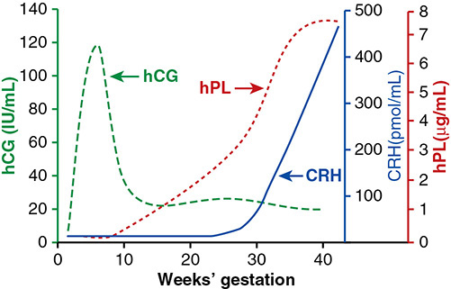

*Figure 5-15. hCG peaks in the 1st trimester then plateaus; hPL rises steadily to a plateau near term; CRH rises steeply in the last weeks.*

*The figure draws the hCG peak at ~120 IU/mL around 6–8 wk; the text gives 50,000–100,000 mIU/mL (50–100 IU/mL) at 60–80 days after LMP.*

### Human placental lactogen (hPL)
- Single nonglycosylated chain; **96% homology with GH**, **67% with prolactin**. Genes **CSH1, CSH2** in the GH–PL cluster on **chromosome 17**.
- In syncytiotrophoblast (cytotrophoblast before 6 wk). Detectable in the placenta **5–10 days** after conception and in maternal serum by **3 wk**.
- Secretion ∝ **placental mass**; rises until **34–36 wk**.
- **Production ~1 g/d near term = the greatest of any human hormone.** Half-life **10–30 min**. Maternal serum **5–15 µg/mL** late. Very little in fetal blood → acts mainly on the **mother**.

**Metabolic actions**
- **Lipolysis → ↑ free fatty acids** (maternal fuel, fetal nutrition). Prolonged fasting in the first half → ↑ hPL.
- **↑ Maternal insulin resistance** → nutrient flow to the fetus; favors protein synthesis and amino acid supply.
- With prolactin, via the **prolactin receptor → β-cell proliferation → ↑ insulin** (prevents maternal hyperglycemia).
- Inhibits placental leptin secretion (in vitro). Stimulated by insulin and IGF-1; inhibited by PGE₂ and PGF₂α. Acute glucose/insulin changes have little effect.

### Other placental peptide hormones
- Some are **not subject to feedback inhibition**.

| Hormone | Key facts |
|---|---|
| **GnRH** | Highest in the **1st trimester**; in **cytotrophoblast, not syncytium**. Regulates hCG and extravillous invasion (MMP-2, MMP-9). Source of ↑ maternal GnRH |
| **CRH** | Maternal serum **5–10 pmol/L** (nonpregnant) → **~100 pmol/L** early 3rd tri → **~500 pmol/L in the last 5–6 wk**; higher in labor. Relaxes vascular and myometrial smooth muscle, immunosuppressive; **may help initiate parturition**. **Glucocorticoids stimulate placental CRH** (opposite of hypothalamus) → **positive feedback**: CRH → placental ACTH → adrenal glucocorticoids → more CRH |
| Urocortin | CRH family; lower levels; stress response |
| GHRH | Function unclear; possible autocrine trophoblast survival |
| **Ghrelin** | Peaks midpregnancy; may regulate hGH-V |
| **hGH-V (placental GH)** | 191 aa, **differs from hGH at 15 positions**; syncytiotrophoblast; in maternal plasma by **21–26 wk**, rises to **~36 wk**. Growth-promoting, **less diabetogenic and lactogenic** than hGH. Correlates with **IGF-1**; inhibited by glucose. **Likely mediator of pregnancy insulin resistance** |
| **POMC** | Cleaved to ACTH, β-lipotropin, MSH, β-endorphin; placental CRH → placental ACTH |
| **Relaxin** | CL (H2, H3 genes), decidua, placenta, membranes (H1, H2). Insulin/IGF-like. Early rise from the **CL, parallels hCG**. With progesterone → **myometrial quiescence**; ECM remodeling; **↑ GFR early in pregnancy** |
| **PTH-rP** | ↑ in **maternal, not fetal**, circulation. Not made by normal adult parathyroids. Calcium/solute transfer; fetal mineral homeostasis |
| **Leptin** | Also made by trophoblast. Maternal levels ↑. Promotes placental growth and tolerance. **Fetal leptin correlates with birthweight**; low leptin → adverse programming in FGR |
| Neuropeptide Y | In cytotrophoblast; causes **CRH release** |

**TGF-β superfamily** (TGF-β, activin, inhibin, nodal, BMPs, AMH, GDFs): fine-tunes invasion. **Too much invasion → PAS; too shallow → early loss or preeclampsia.**

| Factor | Effect |
|---|---|
| **Activin A** | Promotes syncytialization, extravillous trophoblast formation and **invasion** |
| BMP2 | ↑ invasion (BMP4 → trophoblast lineage) |
| **Inhibin A** | Promotes syncytialization, **inhibits invasion** |
| **Nodal** | Inhibits proliferation, extravillous formation, invasion |

### Placental progesterone
- **Luteal–placental shift:** little ovarian progesterone **after 6–7 wk**. CL removal or bilateral oophorectomy at **7–10 wk** does not ↓ urinary **pregnanediol**. **Before this, CL removal → abortion unless a progestin is given.**
- **Placenta takes over by ~8 wk.** Term levels are **10–5000×** nonpregnant values.
- Production **~250 mg/d** (singleton); **>600 mg/d** in multifetal pregnancy.
- **Synthesis:** cholesterol → pregnenolone (**P450scc**, mitochondria) → progesterone (**3β-HSD**, ER); released by diffusion.
- Syncytiotrophoblast makes little cholesterol (rate-limiting **HMG-CoA reductase**) → relies on **maternal LDL cholesterol**.
- **Independent of the fetus:** progesterone and hCG production can **persist for weeks after fetal demise** (unlike estrogen).
- Metabolites: **5α-DHP** (ratio to progesterone ↑); **deoxycorticosterone** (potent mineralocorticoid), mostly **extraadrenal** from circulating progesterone.

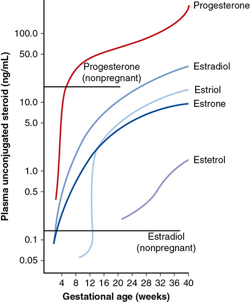

*Figure 5-16. Maternal plasma steroids across gestation (log scale): progesterone and estradiol far exceed nonpregnant levels; estriol rises steeply after ~12 wk; estetrol appears late.*

### Placental estrogens
- Weeks 2–4: CL estradiol maintained by hCG. **By 7 wk luteal–placental transition**; then >½ of estrogen is placental.
- Near term: syncytiotrophoblast makes the estrogen equivalent of **≥1000 ovulatory women's ovaries per day**. Ends abruptly after placental delivery.

**Why the placenta needs C19 precursors**
- **CYP17A1 (17α-hydroxylase/17,20-lyase) is not expressed in the placenta** → cannot make C19 androgens from C21 (cholesterol, progesterone).
- **DHEA-S from the fetal adrenal (mainly) and maternal adrenal** is the major precursor.

**Four placental enzymes (DHEA-S → estradiol)**
1. **Steroid sulfatase (STS):** DHEA-S → DHEA
2. **3β-HSD type 1:** DHEA → androstenedione
3. **Aromatase (CYP19):** androstenedione → estrone
4. **17β-HSD type 1:** estrone → estradiol

| Estrogen | Precursor source near term |
|---|---|
| **Estradiol (E2)** | **½ fetal adrenal DHEA-S, ½ maternal DHEA-S** |
| **Estriol (E3)** | **90% fetal 16OH-DHEA-S** (fetal adrenal DHEA-S → **fetal liver 16α-hydroxylase**) |

- **Directional secretion:** **>90% of estradiol and estriol** and **≥85% of progesterone** enter the **maternal** circulation (syncytium faces maternal blood; steroids must cross cytotrophoblast, stroma and capillary wall to reach the fetus).

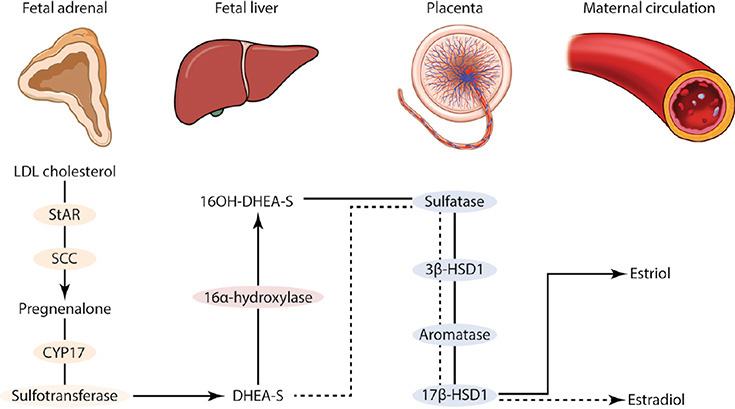

*Figure 5-17. Fetal adrenal DHEA-S (and fetal liver 16OH-DHEA-S) is converted by placental sulfatase, 3β-HSD1, aromatase and 17β-HSD1 into estradiol and estriol for the maternal circulation.*

> **Memory hook:** "Estriol = fetal wellbeing hormone" — it needs a live fetal adrenal **and** liver, whereas progesterone needs only the placenta and maternal LDL.

---

## 8. Fetal Adrenal Gland–Placental Interactions

- Fetal adrenal at term is **heavier than the adult's**; **>85% is the fetal zone**, which regresses in the first year of life.
- Steroid output **100–200 mg/d** near term vs adult **30–40 mg/d**.
- Growth driven by fetal ACTH **and placental factors** (it involutes rapidly after birth).
- Estradiol is the main placental estrogen at term, but **estriol and estetrol** rise late; **90% of their precursors come from the fetus** → once used as a **fetal well-being test**.
- **Cholesterol source:** de novo synthesis from acetate is very high but insufficient → mainly **fetal liver LDL**. Its steroidogenesis equals **¼ of adult daily LDL turnover**.

### Fetal conditions affecting estrogen production

| Condition | Estrogen | Mechanism / notes |
|---|---|---|
| **Fetal demise; cord ligation** | **Markedly ↓** | Loss of fetal precursors; **progesterone maintained** |
| **Anencephaly** | **~10% of normal** (urinary) | No ACTH → **atrophic adrenals**; estrogens come from maternal DHEA-S |
| **Fetal adrenal hypoplasia** (~1 in 12,500) | ↓ | No C19 precursors |
| **Placental sulfatase deficiency** | **Very low** | **X-linked → all affected fetuses male**; **1 in 2000–5000**; **delayed labor onset**; later **ichthyosis** |
| **Placental aromatase deficiency** | Absent | Autosomal recessive; androstenedione and testosterone accumulate → **virilizes mother and female fetus** |
| **Down syndrome** | **Low unconjugated estriol** | Inadequate fetal adrenal C19 production (used in screening) |
| **Erythroblastosis fetalis** | ↑ | Placental hypertrophy (↑ mass) |
| **Complete mole / GTN** | Mainly estradiol only | No fetus → uses maternal C19 steroids |

### Maternal conditions affecting estrogen production
- **Glucocorticoid treatment** ↓ maternal and fetal ACTH → ↓ DHEA-S → **striking ↓ estrogen**.
- **Addison disease:** ↓ estrone and estradiol (the fetal contribution to estriol matters more).
- **Maternal androgen-secreting tumors:** placental aromatization is so efficient that virtually **all androstenedione becomes estradiol**; none reaches the fetus → **female fetus rarely virilized**. Exceptions: a **nonaromatizable androgen (5α-DHT)** or very early testosterone exceeding aromatase capacity.

---

## Quick-Recall: Placental Hormones at a Glance

| Hormone | Made by | Peak / pattern | Key role or clinical use |
|---|---|---|---|
| hCG | Syncytiotrophoblast | Doubles q2 d; peak 60–80 d (50,000–100,000 mIU/mL); nadir 16 wk | Rescues CL; fetal testosterone; thyroid stimulation; ↑ in twins, mole, Down; ↓ in ectopic/failing |
| hPL | Syncytiotrophoblast | Rises with placental mass to 34–36 wk; ~1 g/d | Lipolysis, insulin resistance, β-cell proliferation |
| hGH-V | Syncytiotrophoblast | From 21–26 wk to 36 wk | Insulin resistance; IGF-1 |
| CRH | Placenta, membranes, decidua | ~500 pmol/L in last 5–6 wk | Parturition?; positive feedback with glucocorticoids |
| Progesterone | Placenta (from maternal LDL) | Placenta takes over ~8 wk; 250 mg/d | Independent of fetal status |
| Estradiol | Placenta (½ fetal, ½ maternal DHEA-S) | = daily output of ≥1000 women's ovaries | Hyperestrogenic state ends at delivery |
| Estriol | Placenta (90% fetal 16OH-DHEA-S) | Rises after ~12 wk | Low in Down syndrome, anencephaly, sulfatase deficiency, demise |
| Relaxin | CL (early), decidua, placenta | Parallels hCG | Myometrial quiescence; ↑ GFR |
| Decidual prolactin | Decidua | Amnionic fluid ~10,000 ng/mL at 20–24 wk | Vasoinhibins → peripartum cardiomyopathy? |

## Key Numbers to Memorize
- CL progesterone **25–50 mg/d**; CL apoptosis **9–11 d** after ovulation; implantation window **days 20–24**
- Fertilization within **1 day** of ovulation; morula enters uterus **day 3**; blastocyst **day 4–5** (58 cells: **5 ICM + 53 trophectoderm**)
- **Implantation day 6–7**; encased **day 10**; lacunae **day 12**; maternal arterial inflow **day 15**; fetal circulation **day 17**
- IVF: GA = fertilization + **14 d**
- Decidua **5–10 mm**; capsularis + parietalis fuse **14–16 wk**; dNK **70%**, macrophages **20%** of 1st-tri decidual leukocytes
- Spiral artery waves: **<12 wk** (decidua), **12–16 wk** (myometrium); O₂ **2–3%** early, doubles by end of 1st tri; **~120** arterial entry sites at term; venous cleavage plexus after **30 wk**
- Placenta = fetus by **17 wk**; **⅙ fetal weight** at term; **10–38 lobes**; cytotrophoblast continuity lost by **16 wk**
- Umbilical artery EDF absent **<10 wk**
- Amnion day **7–8**; fluid peaks **34 wk**, **~1000 mL** at term; membranes stretch **2×**
- hCG: **36 h** half-life, **30%** carbohydrate, detectable **7–9 d** post-LH surge, **doubles q2 d**, **30%** renal clearance
- hPL: **96%** GH / **67%** PRL homology; **~1 g/d**; **5–15 µg/mL**; half-life **10–30 min**
- Progesterone **250 mg/d** (**>600** twins); luteal–placental shift **6–8 wk**; >**90%** of estrogens and ≥**85%** of progesterone go to the mother
- Fetal adrenal **>85%** fetal zone; **100–200 mg/d** steroids; estriol **90%** fetal; anencephaly estrogen **~10%**; sulfatase deficiency **1/2000–5000**
