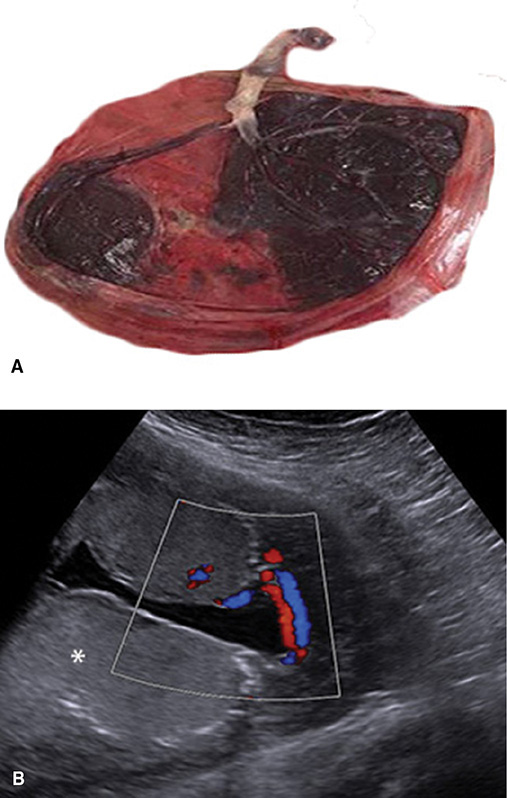
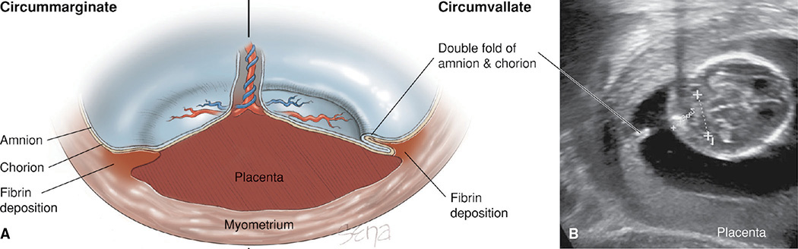
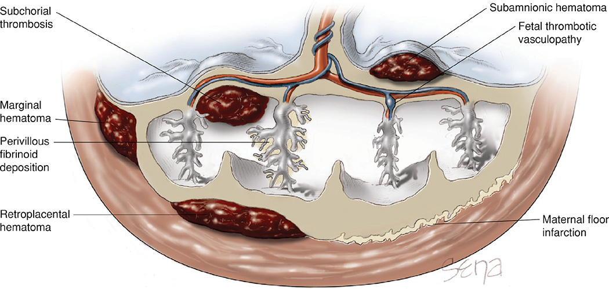
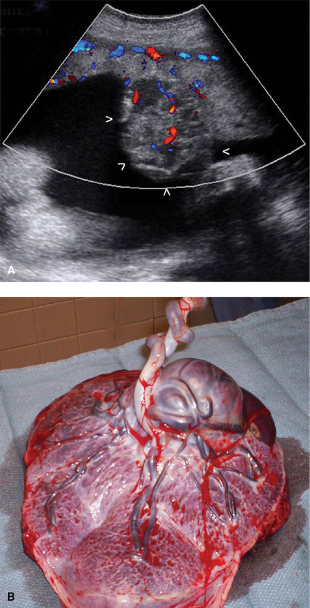
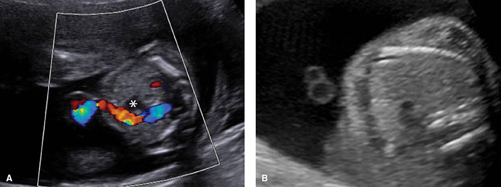
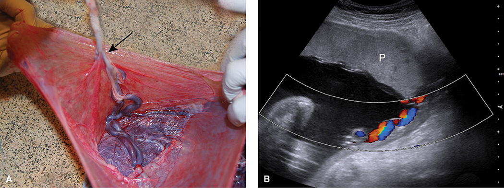
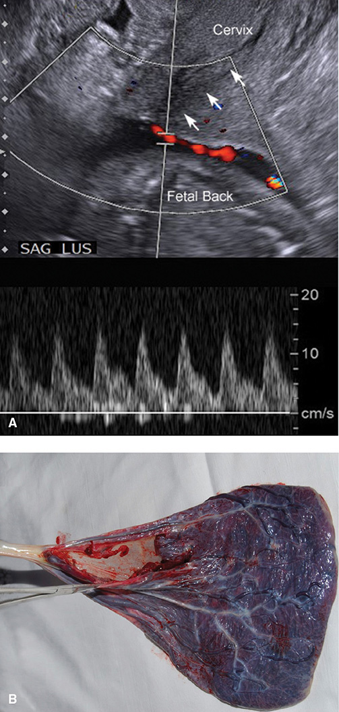

# Chapter 6: Placental Abnormalities — Revision Notes

> Williams Obstetrics 26e, pp. 295–329 of the PDF. High-yield numbers are in **bold**.
> The two tables are transcribed from the PDF images (they are missing from the extracted chapter text). All 7 figures are included from the PDF.

**Big picture:** Inspect every placenta and cord in the delivery room; send for pathology based on clinical and placental findings. Most shape variants and small lesions are harmless, but some (succenturiate lobe, velamentous insertion, vasa previa, large chorioangioma, maternal floor infarction, cord thrombosis) threaten the fetus.

---

## 1. Placental Examination

- **Visual inspection by the obstetrician is recommended; routine pathology is not mandatory.** At minimum inspect the placenta and cord in the delivery room.
- CAP lists many indications, but data don't support all of them.

### Table 6-1. Some Indications for Placental Pathological Examinationᵃ

| Maternal Indications | Fetal and Neonatal Indications | Placental Indications |
|---|---|---|
| Abruption | Admission to an acute care nursery | Gross lesions |
| Antepartum infection with fetal risks | Birth weight <10th or >95th percentile | Markedly abnormal placental shape or size |
| Anti-CDE alloimmunization | Fetal anemia | Markedly adhered placenta |
| Cesarean hysterectomy | Fetal or neonatal compromise | Term cord **<32 cm or >100 cm*** |
| Oligohydramnios or hydramnios | Neonatal seizures | Umbilical cord lesions |
| Peripartum fever or infection | Hydrops fetalis | Velamentous cord insertion |
| Preterm (<32 wk) delivery | Infection or sepsis | |
| Postterm (>42 wk) delivery | Major anomalies or abnormal karyotype | |
| Severe trauma | Multifetal gestation | |
| Suspected placental injury | Stillbirth or neonatal death | |
| Systemic disorders with known placental effects | Vanishing twin beyond the first trimester | |
| Thick meconium | | |
| Unexplained late pregnancy bleeding | | |
| Unexplained or recurrent pregnancy complications | | |

*ᵃIndications are organized alphabetically. \*The printed table reads "Term cord >32 cm or <100 cm", an obvious typo (that would include every normal cord). The intended criterion is a short (<32 cm) or long (>100 cm) cord, matching the text's normal 40–70 cm range.*

---

## 2. Normal Placenta

| Feature | Normal at term |
|---|---|
| Weight | **470 g** |
| Shape / diameter | Round to oval, **22 cm** |
| Central thickness | **2.5 cm** (sonographically **2–4 cm**, homogeneous) |
| Cord | **Three vessels**, usually **central** insertion |
| Retroplacental space | Hypoechoic, **<1–2 cm** |

- **Basal plate** (maternal, against uterus) divided by clefts into **cotyledons**; **chorionic plate** (fetal) where the cord inserts.
- On the chorionic plate, **fetal arteries almost always cross over veins**. The amnion covering it peels off easily.
- **AIUM:** record **placental location and its relation to the internal os**; image the cord insertions and **count cord vessels** at every prenatal scan.
- Placenta accreta spectrum, previa (Ch 41) and GTD (Ch 20) are covered elsewhere.

---

## 3. Shape and Size Variants

| Variant | Description | Clinical significance |
|---|---|---|
| **Bilobate** (bipartite, placenta duplex) | Two nearly equal discs; cord inserts between them (chorionic bridge or membranes) | Type 2 vasa previa risk |
| **Multilobate** | ≥3 equal lobes | Rare |
| **Succenturiate lobe** | ≥1 **smaller accessory lobe** in the membranes away from the main disc; vessels run in the membranes | **Vasa previa** if vessels overlie the cervix. **Retained lobe → postpartum atony, hemorrhage or endometritis** |
| **Placenta membranacea** | Villi cover all or nearly all of the cavity | **Serious hemorrhage** (associated previa/accreta) |
| **Ring-shaped (annular)** | Partial or complete ring; may be a variant of membranacea | ↑ ante- and postpartum bleeding, **FGR** |
| **Placenta fenestrata** | Central part of disc missing (usually villi only; chorionic plate intact) | — |

*Figure 6-1. Succenturiate lobe: vessels run through the membranes from the main disc to the accessory lobe (A); color Doppler shows them crossing the cavity (B).*

### Placentomegaly
- Thickness increases **~1 mm/wk**; normally **≤40 mm**. **Placentomegaly = >40 mm.**

| Pattern | Causes |
|---|---|
| **Homogeneous** thickening (villous enlargement) | **Maternal:** diabetes, severe anemia. **Fetal:** hydrops, anemia, **syphilis, toxoplasmosis, parvovirus, CMV** |
| **Inhomogeneous** (cystic) | **Partial mole** (edematous villi = small anechoic cysts); **placental mesenchymal dysplasia** (enlarged stem villi, **diploid**, no excess trophoblast proliferation) |
| **Inhomogeneous** (blood/fibrin) | Massive perivillous fibrin, intervillous or subchorionic thromboses, large retroplacental hematomas |

---

## 4. Extrachorial Placentation

- **Chorionic plate is smaller than the basal plate** (doesn't reach the disc edge).

| | Circummarginate | Circumvallate |
|---|---|---|
| Edge | Fibrin and old hemorrhage between disc and **thin single-layer** amniochorion | **Thickened, opaque, gray-white ridge = double fold of chorion + amnion** |
| Sonography | — | Thick linear band edge to edge; on cross section two **"shelves"** above opposite placental margins |

- Circumvallate diagnosed **postpartum** (small studies): ↑ antepartum bleeding, abruption, fetal demise, preterm birth. But prospectively (17 cases) most sonographic circumvallate placentas were **transient**, and persistent ones were **benign**.
- **Most uncomplicated pregnancies with either type have normal outcomes → no extra surveillance usually needed.**

*Figure 6-2. Circummarginate (single-layer amniochorion over fibrin) vs circumvallate (double fold of amnion and chorion forming a ridge); sonogram of the circumvallate shelf.*

### Table 6-2. Sonographic Bands During Pregnancy

| Condition | Sonographic Findings |
|---|---|
| Normal early chorioamnionic separation | Crescent-shaped amnion mirrors the chorion's curve; distinct from the fetus; **fuses after 16 weeks' gestation** |
| Subchorionic hematoma | Echogenic blood lies between the myometrium and chorioamnion, which appears as a thin band crossing the cavity. Hemorrhage and band resolve over time |
| Uterine synechiae (amnionic sheet) | **2.5- to 4.0-mm-thick, broad-based band** crosses the cavity. Appears shelflike on cross section |
| Circumvallate placenta | Broad-based band extends from one placental edge to the other, just above the placental surface. Appears shelflike on cross section |
| Amnionic band | **Thin strands** cross and appear to **tether fetal parts** |
| Pseudoamnionic band syndrome | Thin strands tether fetal parts and form **after fetoscopic surgeries or amniocenteses** complicated by membrane laceration |
| Uterine septum | Chorioamnionic sac of an early pregnancy fills one horn of a septate or partial bicornuate uterus. Thick band of echoes, which may be wedge-shaped, extends from uterine fundus in midline |
| Membranes from vanishing twin | Depending on chorionicity, either a thin amnion or thicker chorioamnion spans the cavity |
| Placental vessels supported by membranes: velamentous insertion, succenturiate lobe | With grayscale imaging, vessels appear as bands. **Color Doppler will clarify** (see Figs. 6-1 and 6-6) |

*Modified from Dashe, 2017; Lafitte, 2017.*

---

## 5. Circulatory Disturbances

- Two groups: **maternal blood flow** to/within the intervillous space disrupted, or **fetal blood flow** through villi disrupted.
- Common in normal mature placentas; functional reserve protects: **up to 30% of villi can be lost without fetal harm**. Extensive lesions → **FGR**.
- Many appear as focal **sonolucencies**. **Small isolated sonolucencies without complications = incidental.**

*Figure 6-3. Sites of circulatory lesions: subchorial thrombus, subamnionic, marginal and retroplacental hematomas, perivillous fibrin, fetal thrombotic vasculopathy and maternal floor infarction.*

### Maternal blood flow disruption

| Lesion | Mechanism / appearance | Significance |
|---|---|---|
| **Subchorionic fibrin** | Stasis near the chorionic plate → white/yellow firm raised plaques under the chorionic plate | Usually benign |
| **Perivillous fibrin** | Stasis around a villus → ↓ oxygenation, syncytial necrosis; small yellow-white nodules | Normal aging within limits. **>25% of villi → FGR and adverse neonatal outcomes** |
| **Maternal floor infarction** (massive perivillous fibrin if it extends up to entrap villi) | Dense fibrinoid layer in the **basal plate**, thick yellow-white corrugated surface; **not a true infarct**. Auto-/alloimmunity, **APS**, preeclampsia angiogenic factors | **Miscarriage, FGR, preterm delivery, stillbirth**; **can recur**. Not reliably seen on sonography (may thicken the basal plate) |
| **Intervillous thrombus** | Maternal blood mixed with **fetal blood** from a villous break; red (new) or white-yellow (old), up to several cm | Common, usually harmless. A maternal–fetal communication → **large ones raise MSAFP** |
| **Infarction** | Villi get O₂ only from maternal intervillous blood; obstructed supply → infarct | Few are benign; many → **placental insufficiency**. Thick, central, random infarcts → **preeclampsia or lupus anticoagulant** |

### Hematomas

| Type | Location |
|---|---|
| **Retroplacental** | Between placenta and decidua (**abruption = a large, clinically significant retroplacental hematoma**) |
| **Marginal** (= clinical **subchorionic hemorrhage**) | Between chorion and decidua at the placental edge |
| **Subamnionic** | **Fetal** vessel origin; beneath amnion, above chorionic plate |
| **Subchorial thrombus** | Roof of the intervillous space, under the chorionic plate. Massive = **Breus mole** |

**Sonographic evolution of a hematoma**

| Time after bleed | Echogenicity |
|---|---|
| **1st week** | Hyperechoic to isoechoic |
| **1–2 weeks** | Hypoechoic |
| **>2 weeks** | Anechoic |

- Most visible subchorionic hematomas are small and harmless. **Extensive** retroplacental, marginal or subchorial collections → ↑ **miscarriage, stillbirth, abruption, preterm delivery**.

### Fetal blood flow disruption
- **Fetal vascular malperfusion:** thrombosis in fetal vessels makes distal villi nonfunctional. A few thrombi are normal; many (e.g., **preeclampsia**) → **FGR, stillbirth, nonreassuring FHR**.
- **Villous vascular lesions:**

| Lesion | Definition | Associations |
|---|---|---|
| **Chorangiosis** | ↑ capillaries in **terminal** villi: **≥10 capillaries in ≥10 villi in ≥10 fields at 10×** ("rule of 10s") | Long-standing hypoperfusion/hypoxia. Focal form → lower Apgars, fetal vascular malperfusion |
| **Chorangiomatosis** | ↑ capillaries in **stem** villi; terminal villi spared | FGR, anomalies |

- Clinical significance of both remains unclear.
- **Subamnionic hematoma:** usually **acute, iatrogenic, harmless** (cord traction in 3rd stage ruptures a vessel near the insertion). Large chronic antepartum ones → fetomaternal hemorrhage or FGR; can mimic chorioangioma → **color Doppler shows no internal flow**.

---

## 6. Placental Calcification

- Most common on the **basal plate**; ↑ with gestation, **smoking** and higher maternal serum calcium.

**Grannum grading (0–3)**

| Grade | Sonographic appearance |
|---|---|
| **0** | Homogeneous, no calcification, smooth flat chorionic plate |
| **1** | Scattered echogenicities; subtle chorionic plate undulations |
| **2** | Basal plate stippling; comma-shaped densities from an indented chorionic plate that **fall short of** the basal plate |
| **3** | Indentations run **from chorionic to basal plate** → cotyledon-like compartments; ↑ basal densities |

- **Poor predictor of neonatal outcome near term.** But **grade 3 before 32 wk** has been linked to **stillbirth** and other adverse outcomes (two small studies).

---

## 7. Placental Tumors

### Chorioangioma (chorangioma)
- Benign tumor of villous vessels and stroma; incidence **~1%**.
- Fetal-to-maternal bleeding across tumor capillaries → **↑ MSAFP** → sonography to exclude a neural-tube defect.
- **Sonography:** well-circumscribed, rounded, mostly **hypoechoic** mass near the **chorionic plate** protruding into the amnionic cavity. **↑ color Doppler flow** distinguishes it from hematoma, partial mole, teratoma, metastases, leiomyoma. (Rare chorangiocarcinoma mimics it.)

| Size | Consequences |
|---|---|
| Small | Usually asymptomatic |
| **Large (>4 cm)** | **AV shunting → high-output heart failure, hydrops, fetal death**; **microangiopathic hemolytic anemia**; **hydramnios**, preterm delivery, FGR |

- **Large size and hydrops** are the main predictors of poor outcome.
- **Work-up:** grayscale + color Doppler, amnionic fluid volume; **MSAFP and Kleihauer-Betke** for fetomaternal hemorrhage; **fetal echo** (cardiac function); **MCA Doppler** (anemia).
- **Treatment (specialized centers):** **endoscopic laser ablation of feeder vessels** (most used; favorable outcomes); fetal transfusion for anemia, amnioreduction for hydramnios, digoxin for heart failure.

*Figure 6-4. Chorioangioma: color Doppler shows internal flow in a well-circumscribed mass (A); grossly a round mass protruding from the fetal surface (B).*

### Metastatic tumors
- Rare. Most common maternal sources: **melanoma, leukemia/lymphoma, breast cancer**. Usually confined to the intervillous space; **spread to the fetus is uncommon but most often with melanoma**.
- Fetal tumors metastasizing to the placenta: rare, mostly **neuroectodermal**.

---

## 8. Amniochorion

### Chorioamnionitis
- Genital flora **ascend**, usually after **prolonged membrane rupture and during labor**.
- Sequence: chorion + decidua **over the internal os** → full-thickness membranes (**chorioamnionitis**) → amnionic fluid → chorionic plate and cord (**funisitis**).
- Usually **microscopic/occult**; a possible explanation for many unexplained cases of **ruptured membranes and preterm labor**. Gross infection: clouded membranes ± foul odor.

### Other membrane abnormalities

| Condition | Features | Significance / management |
|---|---|---|
| **Amnion nodosum** | Small light-tan nodules on the amnion over the chorionic plate (fetal squames + fibrin); scrape off | Sign of **prolonged severe oligohydramnios** |
| **Amnionic band sequence** | Disruption sequence: bands **tether, constrict or amputate** fetal parts; spontaneous or after fetal surgery | **Limb-reduction defects, facial clefts, encephalocele**; cord compromise. Severe spine/ventral wall defects → think **limb-body wall complex**. Sonography usually finds the **sequelae**, not the bands → targeted scan. Management by severity; **fetoscopic laser release** in selected cases |
| **Amnionic sheet** | Normal amniochorion draped over a **uterine synechia** | Little risk; slightly ↑ PPROM and abruption |

- **Clues to amnionic bands:** limb-reduction defect, **encephalocele in an atypical location**, an extremity with edema or positional deformity.

---

## 9. Umbilical Cord

### Length
- Usually **40–70 cm**; very few **<30 cm or >100 cm**. Longer with ↑ **parity and BMI**.
- **Short cords:** congenital malformations, intrapartum distress.
- **Long cords:** **entanglement, prolapse**, fetal anomalies.
- Cord diameter: lean cords ↔ poor growth, thick ↔ macrosomia (utility unclear).

### Coiling
- Usually **sinistral (left-twisting)**. **Umbilical coiling index (UCI)** = complete coils per cm.
  - Normal UCI: **0.4 antepartum (sonographic)** vs **0.2 postpartum (measured)**.
  - **Hypocoiled <10th percentile; hypercoiled >90th percentile.**
- Significance controversial; extremes most consistently linked to **intrapartum FHR abnormalities, preterm labor, FGR**. Not part of standard sonography.

### Vessel number
- Embryos have two umbilical veins; the **right vein atrophies in the 1st trimester** → 1 vein + 2 thick-walled arteries.
- **Four-vessel cord:** rare, often with anomalies; good prognosis if isolated.

**Single umbilical artery (SUA)**: the most common aberration

| Population | Incidence |
|---|---|
| Liveborn neonates | **0.63%** |
| Perinatal deaths | **1.92%** |
| Twins | **3%** |

- Frequent with major malformations, mostly **cardiovascular and genitourinary** → **targeted sonography ± fetal echocardiography**.
- **SUA + another anomaly → aneuploidy risk greatly ↑ → amniocentesis for karyotype.**
- **Isolated SUA** in a low-risk pregnancy: aneuploidy risk **not significantly ↑**; linked to FGR and perinatal death in some studies → **clinical growth monitoring is reasonable** (value of sonographic surveillance unclear).
- On sonography, the two arteries **encircle the fetal bladder** (extensions of the superior vesical arteries).
- **Fused umbilical artery** (shared lumen, usually near the placental insertion): ↑ marginal/velamentous insertion, not anomalies.
- **Hyrtl anastomosis:** connection between the two arteries near the placental insertion (in most placentas) → **equalizes pressure**, improves perfusion during contractions or compression of one artery. **SUA fetuses lack this safety valve.**

*Figure 6-5. Single umbilical artery: only one artery runs beside the fetal bladder (A); cross section shows two vessels, one small artery and one larger vein (B).*

### Remnants and cysts
- **Allantoic duct, vitelline duct and embryonic vessel remnants** in **25–50%** of sectioned cords: not associated with malformations.

| | True cysts | Pseudocysts |
|---|---|---|
| Origin | **Epithelium-lined** allantoic or vitelline remnants | **Local degeneration of Wharton jelly** |
| Site | Closer to the **fetal** insertion | Anywhere |
| Frequency | Less common | **More common** |

- **Single 1st-trimester cyst → usually resolves.** **Multiple cysts → miscarriage or aneuploidy.** **Persistent beyond the 1st trimester → structural and chromosomal anomalies.**

### Insertion

| Insertion | Incidence | Significance |
|---|---|---|
| Central | Normal | — |
| Eccentric | Common | No identifiable risk |
| **Marginal ("battledore")** | **6% singletons, 11% twins** | Rarely problematic; cord may **avulse** at placental delivery; **weight discordance in monochorionic twins** |
| **Velamentous** | **~1%; 6% in twins**; more common with **placenta previa** | Vessels run **unprotected in the membranes** → compression → hypoperfusion, acidemia. ↑ **low Apgar, stillbirth, preterm delivery, SGA**. Cord avulsion. **Monitor growth** (clinically or by sonography) |
| **Furcate** | Rare | Vessels **lose Wharton jelly** before inserting (amnion sheath only) → compression, twisting, thrombosis |

*Figure 6-6. Velamentous insertion: the cord inserts into the membranes (arrow) and vessels travel unprotected to the disc (A); color Doppler shows them running along the uterine wall (B).*

### Vasa previa
- Fetal vessels **in the membranes over the cervical os** → tear with cervical dilation or membrane rupture → **rapid fetal exsanguination**; can also be compressed by the presenting part.
- Incidence **1 in 338–365** pregnancies.

| Type | Vessels |
|---|---|
| **Type 1** | Part of a **velamentous cord insertion** |
| **Type 2** | Span between lobes of a **bilobate or succenturiate** placenta |

- **Other risk factors:** **IVF conception**; **2nd-trimester placenta previa** or low-lying placenta (even if it later migrates).
- **Antepartum diagnosis → perinatal survival 97–100%** (far better than intrapartum diagnosis).
- **Screening:** at the midtrimester scan; add **transvaginal sonography** in suspicious cases (vessels inserting into membranes and running over the internal os). **Color Doppler of the cord insertion**, especially with previa/low-lying placenta; the waveform shows the **fetal heart rate** (umbilical artery pattern). Median prenatal detection **93%**.

**Management**
1. **Repeat imaging**: up to **39% resolve**.
2. **Bed rest: no added benefit.**
3. **Antenatal corticosteroids** as indicated or **prophylactically at 28–32 wk**.
4. **Consider hospitalization at 30–34 wk** (surveillance; rapid delivery for labor, bleeding or ROM), especially with risk factors for early delivery.
5. **ACOG: scheduled cesarean at 34–36 wk.** Deliver the fetus **immediately after hysterotomy**; **delayed cord clamping not encouraged**.
- Fetoscopic laser ablation described in a few cases.
- **Any unexplained ante- or intrapartum vaginal bleeding → consider vasa previa with a torn fetal vessel.** Often rapidly fatal. With less bleeding, **fetal vs maternal blood** can be told apart because **fetal hemoglobin resists alkali/acid denaturation**.

*Figure 6-7. Vasa previa: color Doppler shows a fetal vessel over the internal os with an umbilical-artery waveform (A); amniotomy site through membranes carrying fetal vessels (B).*

### Knots, strictures and loops

| Lesion | Frequency | Key facts |
|---|---|---|
| **True knot** | **~1%** of births | From fetal movement; risk factors **hydramnios, diabetes**; very common/dangerous in **monoamnionic twins**. Singleton **stillbirth ↑ 4–10×**. Sonography: **"hanging noose" sign**; 3-D and color Doppler help. **Vaginal delivery suitable**; FHR, cesarean rate and cord gases usually normal. Surveillance unclear (UA Doppler, NST, kick counts) |
| **False knot** | — | Focal vessel redundancy/folding; **no significance** |
| **Cord stricture** | Rare | Focal narrowing near the **fetal insertion**, absent Wharton jelly, obliterated vessels → **usually stillbirth**. Rarely from an amnionic band |
| **Nuchal cord** | 1 loop **20–34%**; 2 loops **2.5–5%**; 3 loops **0.2–0.5%** | Up to **20%** have moderate–severe **variable decelerations** in labor with lower UA pH; **not relieved by amnioinfusion**. **Not linked to adverse outcome**; vaginal delivery suitable |
| **Funic presentation** | Uncommon | Cord is the presenting part; with malpresentation. Risk of prolapse → **cesarean at term** |

### Vascular lesions

| Lesion | Key facts |
|---|---|
| **Cord hematoma** | Rare; usually **venous** rupture into Wharton jelly. Linked to abnormal cord length, aneurysm, trauma, entanglement, cord venipuncture, funisitis. Hypoechoic mass without flow. → **stillbirth**, abnormal FHR (normal outcomes reported) |
| **Cord vessel thrombosis** | Rare. **70% venous, 20% venous + arterial, 10% arterial.** High rates of **stillbirth, FGR, intrapartum distress** → consider **prompt delivery** if viable |
| **Umbilical vein varix** | Intraamnionic or intraabdominal; cystic dilation contiguous with normal vein. May compress an artery, rupture or thrombose. **~⅕ have other anomalies**; isolated ones do well with surveillance |
| **Umbilical artery aneurysm** | Congenital wall thinning with little Wharton jelly, **near the placental insertion**. Associated with **SUA, trisomy 18**, fluid extremes, FGR, stillbirth. **>5 cm → high-output failure risk**. Cyst with hyperechoic rim; low-velocity or turbulent **nonpulsatile** flow. Consider karyotype, surveillance, early delivery; some advise **cesarean** |

---

## Quick-Recall: Lesion → Clinical Consequence

| Finding | Main risk | Action |
|---|---|---|
| Succenturiate / bilobate | Vasa previa (type 2); retained lobe → PPH, endometritis | Check membranes for vessels; inspect placenta |
| Placenta membranacea / annular | Hemorrhage (previa, accreta); FGR | — |
| Placentomegaly (>40 mm), homogeneous | Diabetes, anemia, hydrops, TORCH/parvovirus/CMV/syphilis | Look for cause |
| Circumvallate | Usually benign | No extra surveillance |
| Perivillous fibrin >25% / maternal floor infarction | FGR, stillbirth; recurs | Counsel for future pregnancies |
| Large intervillous thrombus | ↑ MSAFP | — |
| Many central infarcts | Preeclampsia, lupus anticoagulant | — |
| Extensive retroplacental / marginal hematoma | Miscarriage, abruption, stillbirth, preterm birth | — |
| Chorioangioma >4 cm | Hydrops, heart failure, anemia, hydramnios | Echo, MCA Doppler; laser ablation |
| Amnion nodosum | Severe prolonged oligohydramnios | — |
| Amnionic bands | Limb amputation, clefts, atypical encephalocele | Targeted scan; selected fetoscopic release |
| SUA + anomaly | Aneuploidy | Amniocentesis |
| Isolated SUA | Possible FGR | Monitor growth |
| Velamentous insertion | Stillbirth, SGA, vasa previa | Monitor growth; look for vasa previa |
| Vasa previa | Fetal exsanguination | Steroids 28–32 wk, admit 30–34 wk, cesarean 34–36 wk |
| True knot | Stillbirth 4–10× | Vaginal delivery OK |
| Cord thrombosis / stricture | Stillbirth | Consider prompt delivery |

## Key Numbers to Memorize
- Placenta **470 g**, **22 cm**, **2.5 cm** thick (sonography **2–4 cm**); retroplacental space **<1–2 cm**
- Thickness ↑ **1 mm/wk**; **>40 mm = placentomegaly**
- Up to **30%** of villi can be lost without harm; perivillous fibrin **>25%** → FGR
- Hematoma echogenicity: hyper/iso **<1 wk**, hypo **1–2 wk**, anechoic **>2 wk**
- Chorangiosis: **10 × 10 × 10 at 10×**
- Chorioangioma **~1%**; **>4 cm** → complications
- Amnionic sheet band **2.5–4.0 mm**; chorioamnion fuses after **16 wk**
- Cord **40–70 cm** (few <30 or >100); UCI **0.4** antepartum / **0.2** postpartum
- SUA **0.63%** live births, **1.92%** perinatal deaths, **3%** twins
- Remnants in **25–50%** of cords
- Marginal insertion **6%** (twins **11%**); velamentous **1%** (twins **6%**)
- Vasa previa **1/338–365**; detection **93%**; **39%** resolve; survival **97–100%** if diagnosed antenatally; steroids **28–32 wk**, admit **30–34 wk**, deliver **34–36 wk**
- True knot **1%**, stillbirth **4–10×**; nuchal cord 1 loop **20–34%**, 2 loops **2.5–5%**, 3 loops **0.2–0.5%**; variables in up to **20%**
- Cord thrombosis **70%** venous / **20%** both / **10%** arterial; varix anomalies **~⅕**; artery aneurysm **>5 cm** → heart failure risk
