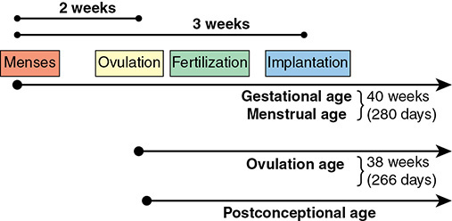
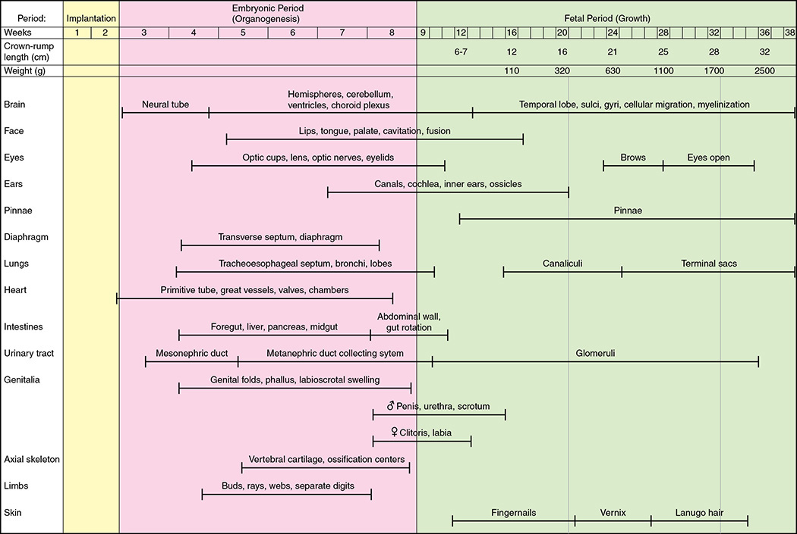
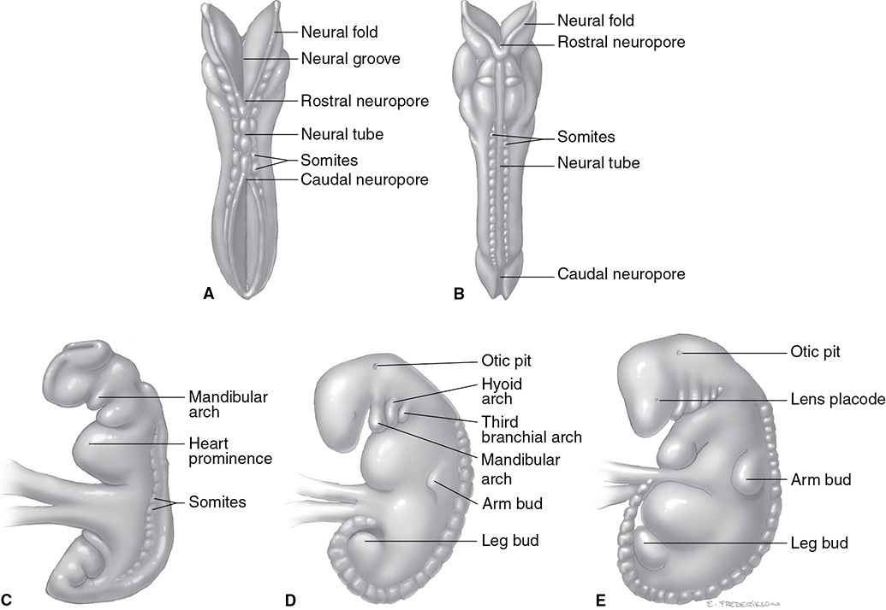
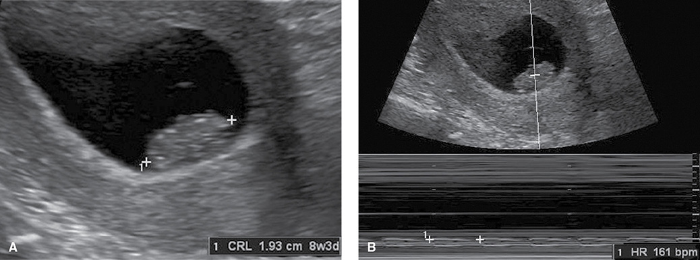
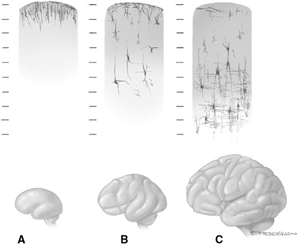
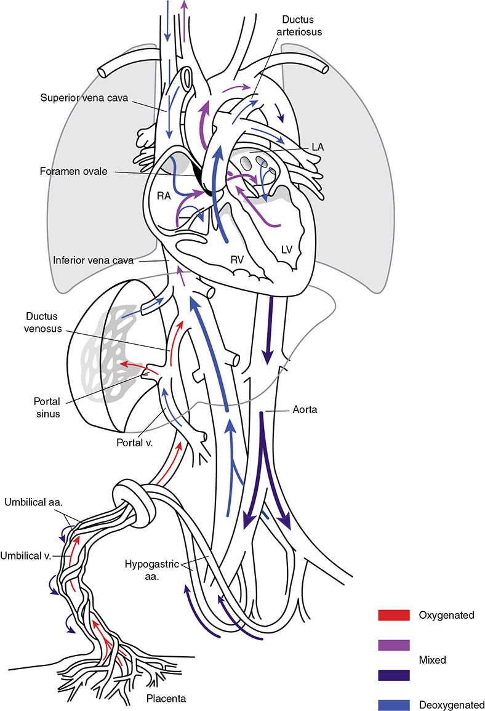
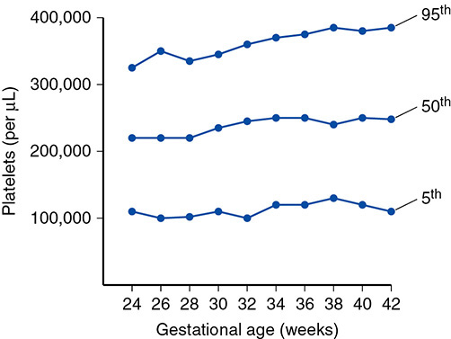
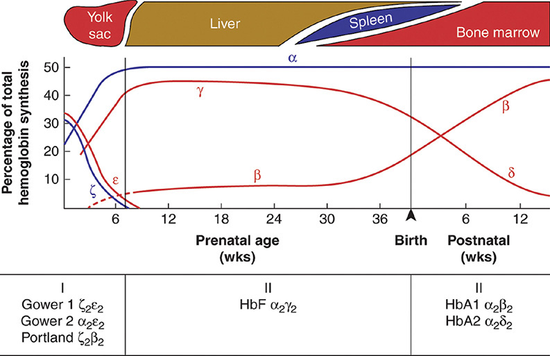

# Chapter 7: Embryogenesis and Fetal Development — Revision Notes

> Williams Obstetrics 26e, pp. 330–382 of the PDF. High-yield numbers are in **bold**.
> The two tables are transcribed from the PDF images (they are missing from the extracted chapter text). 8 of the 11 figures are included from the PDF (embryo drawings/photos 7-3 and 7-5 and the 12-week CRL image 7-7 are omitted).

**Big picture:** The fetus is a patient. Know how gestational age is defined and dated, the embryonic (organogenesis) vs fetal (growth) periods, the fetal circulation and its changes at birth, organ-by-organ maturation milestones, fetal fuel supply and how the placenta transfers substances.

---

## 1. Gestational Age

| Term | Starts from | Term length |
|---|---|---|
| **Gestational (menstrual) age** | **First day of the LMP** (~2 wk before ovulation, ~3 wk before implantation) | **280 days = 40 wk** (9⅓ calendar months) |
| **Ovulation age** | Ovulation (used by embryologists) | **266 days = 38 wk** |
| **Postconceptional age** | Fertilization (≈ ovulation age) | — |

*Figure 7-1. Gestational (menstrual) age counts from the LMP: 40 weeks (280 days); ovulation/postconceptional age is 2 weeks less (38 weeks, 266 days).*

### ACOG / AIUM / SMFM (2019) dating recommendations
1. **First-trimester sonography is the most accurate** way to establish or confirm gestational age.
2. **IVF:** use the **embryo age and transfer date**.
3. Compare LMP and first-trimester sonographic dates; record and discuss the **EDC**.
4. Record the **best obstetrical estimate** of gestational age at delivery on the birth certificate.

- **CRL is accurate to ±5–7 days.** Change the EDC if the difference is **>5 days before 9 wk** or **>7 days later in the 1st trimester**.

### Naegele rule
- **EDC = LMP + 7 days − 3 months.** E.g., LMP October 5 → **July 12**.
- **Three trimesters of ~14 wk each.** Wheels, EMR calculators and apps (e.g., the ACOG app, which uses sonographic criteria plus LMP or transfer date) also give the EDC.

---

## 2. Embryonic Development

*Figure 7-2. Organ-system timetable by menstrual weeks: implantation (wk 1–2), embryonic period of organogenesis (wk 3–8), then the fetal period of growth, with CRL and weight.*

*Fig 7-2's CRL and weight rows differ slightly from the text (e.g., 16 wk: 110 g vs 150 g; 24 wk: 630 g vs ~700 g; 32 wk: 1700 g vs ~1800 g; 36 wk: 2500 g vs ~2800 g; 12 wk CRL 6–7 cm vs 5–6 cm). The text values are used below.*

### Zygote and blastocyst
- First **2 weeks** after ovulation/fertilization = **preembryo** → blastocyst. **Implantation day 6–7.**
- **58-cell blastocyst = 5 inner cell mass (embryo) + 53 trophoblast.**

### Embryonic period
- Conceptus is an **embryo from the start of the 3rd week after fertilization**; primitive villi form around the expected day of menses; most **hCG tests are positive** by now.
- **Organogenesis lasts 6 weeks**, running through the **8th week**.

| Timing | Milestone |
|---|---|
| **Week 3** (postfertilization) | Body stalk differentiated; villous cores with angioblastic mesoderm; true intervillous space with maternal blood; fetal vessels appear in villi |
| **Week 4** | **Cardiovascular system formed** → true circulation (embryo ↔ villi); heart partitioning begins; **neural plate folds into the neural tube**; limb buds |
| **End of menstrual wk 5** | Chorionic sac **~1 cm**; **embryo 3 mm** (measurable by sonography); arm and leg buds; amnion ensheathes the body stalk (→ cord) |
| **End of wk 6** | Embryo **~9 mm**; **neural tube closed**; **cardiac motion almost always visible** |
| **End of wk 8** | CRL **~22 mm**; fingers and toes; elbows bend; upper lip complete; external ear elevations |

- **Neural tube closure: cranial end by 38 days and caudal end by 40 days from the LMP.**

*The text's timing wording is inconsistent: it dates the embryo stage from the 3rd week after fertilization, but also says the period "begins the third week from the LMP". The fetal period starts at 7 wk after fertilization (9 wk LMP).*

*Figure 7-4. Embryos at 22–28 days: neural tube with rostral and caudal neuropores, somites, branchial arches, heart prominence, and arm and leg buds.*

*Figure 7-6. At 8 wk 3 d the CRL is 1.93 cm; M-mode already shows cardiac activity (161 bpm).*

---

## 3. Fetal Period Epochs

- **Embryonic → fetal period at 7 wk after fertilization = 9 wk after LMP.** Fetus ~**24 mm**; most organs formed; now growth and maturation.

| GA (wk) | CRL | Weight | Key features |
|---|---|---|---|
| **12** | **5–6 cm** | — | Uterus **just palpable above the symphysis**. Ossification centers in most bones; fingers and toes differentiated; skin, nails, hair rudiments; external genitalia **beginning** to show sex; **spontaneous movements** |
| **16** | **12 cm** | **~150 g** | Growth slows. **CRL not measured after 13 wk (~8.4 cm)** → BPD, HC, AC, FL instead. **Eye movements 16–18 wk.** Female: **uterus formed and vaginal canalization begins by 18 wk**; male: **testes start descending by 20 wk** |
| **20** | — | **>300 g** | **Midpoint.** Linear weight gain. Moves ~every minute; **active 10–30%** of the day. Brown fat; **lanugo**; scalp hair. **Cochlear function 22–25 wk** (matures 6 months after birth) |
| **24** | — | **~700 g** | Wrinkled skin, fat deposition begins; brows and lashes. **Type II pneumocytes begin surfactant secretion.** Canalicular period nearly complete but **terminal sacs not yet formed**. **Survival barely >50%**. **Eyes open by 26 wk**; nociceptors and neural pain system developed |
| **28** | **25 cm** | **~1100 g** | Thin red skin with **vernix caseosa**; pupillary membrane just gone; eye blinking peaks. **Bone marrow = main site of hemopoiesis.** **90% survival without impairment** |
| **32** | **28 cm** | **~1800 g** | Skin still red and wrinkled |
| **36** | **32 cm** | **~2800 g** | Subcutaneous fat → rounder body, fuller face. **Survival ~100%** |
| **40 (term)** | **36 cm** | **~3500 g** | Fully developed |

---

## 4. Central Nervous System

### Brain
- **Neural tube closes: cranial end by 38 d, caudal end by 40 d from the LMP** → **folic acid must be started before this** to prevent NTDs.
- Walls → brain and spinal cord; lumen → ventricles and central canal.
- **Week 6:** three primary vesicles. **Week 7:** five secondary vesicles (Hox-controlled):

| Vesicle | Becomes |
|---|---|
| Telencephalon | Cerebral hemispheres |
| Diencephalon | Thalami |
| Mesencephalon | Midbrain |
| Metencephalon | Pons, cerebellum |
| Myelencephalon | Medulla |

- **Neuronal proliferation peaks at 3–4 months** (disorders here are devastating, e.g., **Zika**). **Migration peaks at 3–5 months** (ventricular/subventricular zones → final sites). Both **complete by 20–24 wk**.
- Then gyral formation and maturation; brain appearance tracks gestational age (MRI studies).
- **Myelination** of cerebrospinal nerve ventral roots and brainstem starts **~6 months**; most is **after birth**. Little myelin + incomplete skull ossification let the brain be seen on sonography.

*Figure 7-8. Cortical organization and gyral development at 20, 35 and 40 weeks; proliferation and migration are complete by 20–24 weeks.*

### Spinal cord
- Upper ⅔ of the neural tube → brain; **lower ⅓ → spinal cord**.
- **Entire sacrum ossified on sonography by ~21 wk.**
- **Conus level: S1 at 24 wk → L3 at birth → L1 in adults.**
- Cord myelination starts midgestation, continues through year 1. **Synaptic function by week 8** (neck and trunk flexion).

---

## 5. Cardiovascular System

- More than 100 genes/factors (e.g., **HIF, HOX**). **Straight heart tube by day 23.** **Weeks 4–7:** growth and remodeling → partially septated 4-chambered heart with primitive valves; aortic arch by vasculogenesis. Coronary angiogenesis late in fetal life.

### Fetal circulation
- Placenta oxygenates the blood → most RV output **bypasses the lungs**. **Ventricles work in parallel**, not in series.
- **Umbilical vein** (single) → **ductus venosus** (major branch; straight to IVC with well-oxygenated blood) + **portal sinus** (to hepatic veins, mainly left liver; O₂ extracted).
- IVC blood = mix of ductus venosus blood + deoxygenated lower-body blood → lower O₂ content than blood leaving the placenta.

**Streaming in the right atrium**

| Stream | Route | Destination |
|---|---|---|
| **Well-oxygenated** (dorsomedial IVC) | **Crista dividens** → **foramen ovale** → LA → LV | **Heart and brain** |
| **Less oxygenated** (lateral IVC wall), **SVC** and **coronary sinus** | Tricuspid → RV | Pulmonary trunk → **ductus arteriosus** → descending aorta |

- **RV = ⅔ of total cardiac output.** RV blood is **15–20% less saturated** than LV blood.
- **~90% of RV output passes through the ductus arteriosus**; only **~8% goes to the lungs** (high pulmonary resistance).
- Of ductus blood, **⅓ goes to the body**; the rest returns to the placenta via the **two hypogastric arteries** → umbilical arteries.
- SVC flow velocity rises from 20 wk to term.

*Figure 7-9. Fetal circulation: umbilical vein → ductus venosus → IVC → foramen ovale to the left heart; SVC blood → RV → ductus arteriosus; hypogastric (umbilical) arteries return blood to the placenta.*

### Circulatory changes at birth

| Fetal structure | Change | Adult remnant |
|---|---|---|
| **Ductus arteriosus** | Functional closure; lungs expand → RV blood goes to the lungs | — |
| **Foramen ovale** | Closes | — |
| **Distal hypogastric (umbilical) arteries** | Atrophy/obliterate **within 3–4 days** | **Umbilical ligaments** |
| **Umbilical vein** (intraabdominal) | Obliterates | **Ligamentum teres** |
| **Ductus venosus** | Constricts **10–96 h**; **anatomically closed by 2–3 wk** | **Ligamentum venosum** |

- Ventricles switch **almost instantly** from parallel to **series** function.

### Fetoplacental blood volume
- Term newborn (immediate clamping) **~78 mL/kg** + placental fetal blood **~45 mL/kg** → **fetoplacental volume ~125 mL/kg** (used to size **fetomaternal hemorrhage**).

---

## 6. Hemopoiesis

- **Sites in order: yolk sac (and endothelium) → liver → spleen and bone marrow.** Marrow is the main site by **28 wk**.
- **Erythrocytes:** first ones are **nucleated and macrocytic**.
  - **MCV ≥180 fL** in the embryo → **105–115 fL at term** (adult 80–95 fL).
  - **Aneuploid fetuses keep a high MCV (~130 fL).**
  - Life span lengthens to **~90 days at term**. Reticulocytes fall to **4–5%** at term. More deformable (offsets size and viscosity); different enzyme activities.
- **SMFM: fetal anemia = hematocrit <30%.**

### Table 7-1. Fetal Hemoglobin Concentrations Across Pregnancy (g/dL)

| Weeks' Gestation | 1.16 MoM (95th percentile) | 1.00 MoM (median) | 0.84 MoM (5th percentile) |
|---|---|---|---|
| 18 | 12.3 | 10.6 | 8.9 |
| 20 | 12.9 | 11.1 | 9.3 |
| 22 | 13.4 | 11.6 | 9.7 |
| 24 | 13.9 | 12.0 | 10.1 |
| 26 | 14.3 | 12.3 | 10.3 |
| 28 | 14.6 | 12.6 | 10.6 |
| 30 | 14.8 | 12.8 | 10.8 |
| 32 | 15.2 | 13.1 | 10.9 |
| 34 | 15.4 | 13.3 | 11.2 |
| 36 | 15.6 | 13.5 | 11.3 |
| 38 | 15.8 | 13.6 | 11.4 |
| 40 | 16.0 | 13.8 | 11.6 |

*MoM = multiples of the median.*

### Erythropoietin and platelets
- Erythropoiesis is driven by **fetal erythropoietin** (maternal EPO does **not** cross the placenta). Stimulated by testosterone, estrogen, prostaglandins, thyroid hormone, lipoproteins and above all **fetal hypoxia**.
- EPO rises with maturity; **fetal liver is the source until the kidney takes over near term**. Amnionic fluid EPO correlates with umbilical venous EPO. **May be undetectable for up to 3 months after birth.**
- **Platelets reach stable levels by midpregnancy.**

*Figure 7-10. Platelet counts on day 1 of life by gestational age (24–42 wk): median ~220,000–250,000/µL, 5th percentile ~100,000–130,000/µL.*

### Fetal hemoglobin
- **β-type genes on chromosome 11; α-type on chromosome 16.** Genes switch on and off (off by **methylation**).

| Stage / site | Hemoglobins |
|---|---|
| **I. Embryonic (yolk sac)** | **Gower 1 (ζ₂ε₂), Gower 2 (α₂ε₂), Portland (ζ₂β₂)** |
| **II. Fetal (liver)** | **HbF (α₂γ₂)** |
| **III. Adult (bone marrow)** | **HbA1 (α₂β₂)**, HbA2 (α₂δ₂) |

- **Adult α chain is made exclusively by 6 wk**; ζ is switched off → an **α-gene mutation has no substitute**.
- **γ and δ chains continue** → with a **β-gene mutation**, HbF (α₂γ₂) or HbA2 (α₂δ₂) can substitute.
- **Persisting HbF (γ-gene hypomethylation):** infants of **diabetic mothers**; **sickle cell anemia** (↑ HbF = milder disease; basis of HbF-inducing drugs).
- **HbF binds O₂ more avidly than HbA** because **HbA binds 2,3-DPG more avidly**; maternal 2,3-DPG is ↑ in pregnancy and fetal RBCs have less 2,3-DPG.
- **At term ~¾ of hemoglobin is HbF**; it falls to adult levels over **6–12 months**.

*Figure 7-11. Globin switching: ζ and ε (yolk sac) give way to α and γ (liver, HbF); β rises after birth (HbA1). The postnatal panel is printed as stage "II"; it is stage III.*

### Coagulation
- Except **fibrinogen**, hemostatic proteins have no embryonic forms. Adult-type pro-, anti-coagulant and fibrinolytic proteins are made **from 12 wk**; they **don't cross the placenta**.

| At birth ≈ **50%** of adult | Close to adult levels |
|---|---|
| Factors **II, VII, IX, X, XI**; **protein S, protein C, antithrombin, plasminogen** | Factors **V, VIII, XIII**, fibrinogen |

- **Vitamin K–dependent factors fall further in the first days** without prophylaxis (worse with **breastfeeding**) → **newborn hemorrhage**. Maternal vitamin K deficiency → fetal cerebral hemorrhage.
- **Fetal fibrinogen** from **5 wk**: same amino acids but less compressible clot; lower plasma level but **functionally more active**.
- Functional **factor XIII significantly ↓**. Low plasminogen, ↑ fibrinolytic activity in cord plasma. **Cord platelet counts are normal adult range.**
- Despite this, **fetal bleeding is rare** (even after cordocentesis): amnionic fluid thromboplastins + a Wharton jelly factor aid clotting.
- Inherited thrombophilia (usually **homozygous**) → placental/fetal thrombosis; e.g., **homozygous protein C deficiency → purpura fulminans**.

### Plasma proteins
- Made by the fetus; not correlated with maternal levels. **Albumin, LDH, AST, ALT, GGT rise**; **prealbumin falls** with GA.
- At birth, total protein and albumin ≈ maternal levels → **albumin binds unconjugated bilirubin** (prevents kernicterus).

---

## 7. Respiratory System

- Lung maturity predicts early neonatal outcome; immaturity → **respiratory distress syndrome**. Surfactant in amnionic fluid = biochemical maturity, but **structural maturation matters too**.
- Lung primordium from **foregut endoderm ~day 20**; **lung bud day 25**.

### Stages of lung development

| Stage | Timing | Events |
|---|---|---|
| **Pseudoglandular** | **5–17 wk** | Intrasegmental bronchial tree grows; microvasculature begins; looks like a gland |
| **Canalicular** | **16–25 wk** | Cartilage plates extend; terminal bronchioles → respiratory bronchioles → saccular ducts |
| **Terminal sac** | **After 25 wk** | Primitive alveoli (terminal sacs); ECM develops proximal → distal until term |
| **Alveolar** | Late fetal → childhood | Capillary network, lymphatics; **type II pneumocytes make surfactant** |

- **Only ~15% of adult alveoli at birth**; alveoli added **up to age 8**.

**Timing of insults**

| Insult | Effect |
|---|---|
| Embryonic-phase defects | Esophageal/tracheal atresia, **TE fistula**, pulmonary agenesis |
| **Renal agenesis** (no fluid from the start) | Major defects in **all four stages** |
| **ROM + oligohydramnios before 20 wk** | Near-normal bronchial branching and cartilage, but **immature alveoli** |
| **ROM after 24 wk** | **Minimal long-term effect** on lung structure |

- Vitamin D is thought to aid lung development.

### Surfactant
- Keeps terminal sacs open after the first breath. Made in **type II pneumocytes** (multivesicular bodies → **lamellar bodies**). Late in fetal life lamellar bodies are swept into amnionic fluid by **fetal breathing**; at the first breath surfactant uncoils and lines the alveolus.

| Component | Share |
|---|---|
| **Lipid** (glycerophospholipids) | **90%** of dry weight |
| Protein | 10% |
| Phosphatidylcholines (lecithins) | **~80% of glycerophospholipids** |
| **Dipalmitoyl phosphatidylcholine (DPPC)** | **~½ of surfactant** = principal active component |
| **Phosphatidylglycerol (PG)** | **8–15%**; role unclear (newborns without PG usually do well) |
| Phosphatidylinositol (PI) | Other major constituent |

- Phospholipid lowers surface tension; apoproteins help form the surface film.
- **Major apoprotein SP-A:** glycoprotein **28,000–35,000 Da**; amnionic fluid content rises with maturity; **gene expression by 29 wk**; **SP-A1 and SP-A2 on chromosome 10**.
- **Corticosteroids** (Liggins, lambs) accelerate lung maturation; not the only stimulus, but antenatal **betamethasone/dexamethasone** help at critical times (Ch 34).

### Fetal breathing
- Chest wall movements on sonography from **11 wk**. **From the 4th month** strong enough to move fluid in and out. **Essential for lung growth.** Maternal exercise stimulates it.

---

## 8. Digestive System

| Gut | Derivatives |
|---|---|
| **Foregut** | Pharynx, lower respiratory tract, esophagus, stomach, proximal duodenum, **liver, pancreas, biliary tree** |
| **Midgut** | Distal duodenum, jejunum, ileum, cecum, appendix, **right colon** |
| **Hindgut** | **Left colon, rectum**, upper anal canal |

- Rotation, fixation and partitioning errors → malformations (e.g., intestinal atresias).
- **Swallowing begins 10–12 wk** (with peristalsis and active glucose transport). Preterm infants may swallow poorly.
- Fetus ingests **~800 mg soluble protein/day** late in pregnancy.
- **Term fetus swallows 200–760 mL/d** (like a neonate) → major regulator of fluid volume at term; **impaired swallowing → hydramnios**. Early on, swallowing has little effect on volume.
- Taste: **saccharin ↑ swallowing**, noxious chemicals ↓ it.
- **Intrinsic factor by 11 wk; pepsinogen by 16 wk.** Stomach emptying driven by volume; **a dilated stomach suggests obstruction**.
- **Anencephalic fetuses** (limited swallowing) often have **normal fluid volume** and GI tract → other regulators exist.

### Meconium
- Contents: lung glycerophospholipids, desquamated cells, lanugo, scalp hair, vernix, swallowed debris. **Dark green-black from bile pigments (biliverdin).**
- Passage: normal peristalsis in the mature fetus, **vagal stimulation**, or **hypoxia → fetal pituitary AVP → colonic contraction**.
- **Toxic to the lungs → meconium aspiration syndrome.**

### Liver
- Hepatic diverticulum from foregut endoderm. **Liver = 10% of fetal weight at 9 wk.** Enzyme levels rise with GA; early hemopoiesis site.
- **Bilirubin:** limited, GA-dependent conjugation → preterm infants at risk of **unconjugated hyperbilirubinemia**. Short RBC life span → more bilirubin.
  - Most **unconjugated bilirubin → amnionic fluid (after 12 wk) and across the placenta** (transfer is **bidirectional**: maternal hemolysis → fetus and fluid).
  - **Conjugated bilirubin is not exchanged** significantly.
- **Cholesterol:** mostly fetal hepatic synthesis (for adrenal LDL demand); **20–50% maternal**. FGR fetuses have ↓ cholesterol from **↓ fetal synthesis**.
- **Glycogen:** low in the 2nd trimester; rises near term to **2–3× adult liver levels**; falls sharply after birth.

### Pancreas
- Dorsal and ventral buds from foregut endoderm.
- **Insulin granules by 9–10 wk; plasma insulin by 12 wk.** Fetal pancreas **secretes insulin in response to hyperglycemia**. Islets enlarged in fetuses of mothers with metabolic disease (pancreatic hyperechogenicity).
- **Glucagon at 8 wk**; fetal hypoglycemia doesn't raise it, but similar stimuli do by 12 h after birth.
- Trypsin, chymotrypsin, phospholipase A, lipase at **14 wk**; amylase in fluid at **14 wk**; most enzymes by **16 wk**. Exocrine function limited (needs a secretagogue, e.g., vagal acetylcholine). **No CCK** (needs protein ingestion).
- Sonographically visible in 60% at 19–36 wk.

---

## 9. Urinary System

- **Pronephros** involutes by **2 wk**; **mesonephros** makes urine at **5 wk** and degenerates by **11–12 wk**; **metanephros** (ureteric bud + nephrogenic blastema) **9–12 wk**.
- **Glomerular filtration begins by week 9.** **Loop of Henle functional by 14 wk.** **New nephrons until 36 wk** (continue after birth in preterm infants).
- Kidney and ureter from **intermediate mesoderm**; bladder and urethra from the **urogenital sinus** (bladder partly from the **allantois**).
- Fetal urine is **hypotonic**, low in electrolytes; limited concentrating and pH control. High renal vascular resistance, low filtration fraction. Regulated by RAS, sympathetic system, prostaglandins, kallikrein, ANP.
- **GFR: <0.1 mL/min at 12 wk → 0.3 mL/min at 20 wk**; constant per fetal weight later. **Hemorrhage or hypoxia ↓ renal flow, GFR and urine.**

| GA | Urine output |
|---|---|
| **12 wk** | Urine production starts |
| **18 wk** | **7–14 mL/d** |
| **Term** | **650 mL/d** |

- **Maternal furosemide ↑** fetal urine; **uteroplacental insufficiency and FGR ↓** it.
- Obstruction (urethra, bladder, ureters, pelves) damages parenchyma (Ch 19).
- **Kidneys are not essential in utero**, but **chronic anuria → oligohydramnios + pulmonary hypoplasia**.

---

## 10. Endocrine Glands

- The fetal endocrine system works before the CNS is mature.

### Pituitary
- **Anterior** from oral ectoderm (**Rathke pouch**); **posterior** from **neuroectoderm**.
- Anterior lobe: 5 cell types, 6 hormones (lactotropes PRL, somatotropes GH, corticotropes ACTH, thyrotropes TSH, gonadotropes LH + FSH).
  - **ACTH at 7 wk**; **GH and LH by 13 wk**; **all pituitary hormones by end of wk 17**.
  - Fetal pituitary secretes **β-endorphin**; cord β-endorphin and β-lipotropin rise with **PaCO₂**.
  - **Intermediate lobe** well developed in the fetus; disappears before term (absent in adults).
- **Neurohypophysis** developed by **10–12 wk**: oxytocin and AVP present; conserve water mainly via **lung and placenta**, not kidney. **Cord AVP ≫ maternal.**

### Thyroid
- From **pharyngeal endoderm**; migrates; thyroglossal duct obliterates to the **foramen cecum**.
- **Pituitary–thyroid axis functional by end of 1st trimester.** **Hormone synthesis by 10–12 wk**; TSH, T4 and TBG in fetal serum by **11 wk**.
- **Placenta concentrates iodine on the fetal side; from 12 wk the fetal thyroid concentrates iodine more avidly than the mother's** → **maternal radioiodine or large iodine doses are hazardous after 12 wk**.
- Free T4, free T3 and TBG rise steadily. **At 36 wk vs adult: TSH higher, total and free T3 lower, T4 similar** → pituitary feedback sensitivity develops late.
- Thyroid hormone is needed by almost all tissues, **especially the brain**.
- **Thyroid agenesis:** growth is normal because **small amounts of maternal T4 prevent antenatal cretinism**; stigmata appear **after birth** → **universal newborn TSH screening** (state law).
- **Placenta deiodinates maternal T4/T3 → reverse T3** (limits transfer).
- **Antibodies that cross:** **LATS, LATS-P, TSI** → **congenital hyperthyroidism**: large **goiter**, tachycardia, hepatosplenomegaly, hematological abnormalities, **craniosynostosis**, FGR; later perceptual-motor problems, hyperactivity, reduced growth.
- **After birth:** cooling → **TSH surge** → **T4 peaks at 24–36 h**; T3 rises almost simultaneously.

### Adrenal
- **Medulla from neural crest ectoderm; cortex (fetal and adult) from intermediate mesoderm.**
- Growth driven by proliferation, angiogenesis etc.; **Kiss1R** ± CRH stimulate it.
- **10–20× larger than adult glands relative to body size.** Bulk = **fetal zone**, which **involutes rapidly after birth**; scant/absent with congenital absence of the pituitary. (Function: Ch 5.)

---

## 11. Immunological System

- Immune competence reported by **13 wk**. Cord blood components at term ≈ **½ adult values**.
- Without infection, fetal immunoglobulin is almost all **maternal IgG** → newborn antibodies reflect **maternal** experience.

| Ig | Key facts |
|---|---|
| **IgG** | Transfer via placental **Fc receptors**, begins **~16 wk**, **bulk in the last 4 wk** → **preterm infants poorly protected**. Newborn reaches adult IgG at **3 yr**. Harmful example: **Rh alloimmunization** (hemolytic disease) |
| **IgM** | **Not transferred from the mother** → any fetal IgM is fetal. **↑ cord IgM = congenital infection** (**rubella, CMV, toxoplasmosis**). Adult levels by **9 months** |
| **IgA** | From **colostrum**: mucosal protection against enteric infection. Little fetal secretory IgA in amnionic fluid |

- **B cells in fetal liver by 9 wk**, blood and spleen by **12 wk**. **T cells leave the thymus ~14 wk.**
- Newborns respond poorly to immunization, especially **bacterial capsular polysaccharides**. Newborn monocytes can present antigen.

---

## 12. Musculoskeletal System

- Mostly **mesodermal**. **MYOD** activates muscle-specific genes. **Limb buds by week 4.** Skeletal muscle from somite myogenic precursors.
- Skeleton from condensed mesenchyme → **hyaline cartilage models** → **endochondral ossification**; ossification centers by the end of the embryonic period. Osteoclasts from erythro-myeloid progenitors.

---

## 13. Energy and Nutrition

- Little yolk → embryo depends on maternal nutrients in the **first 2 months**; right after implantation the blastocyst feeds on endometrial interstitial fluid.
- **Maternal depots: liver, muscle, adipose.** Insulin drives storage (glycogen, protein, fat). **Maternal fat storage peaks in the 2nd trimester**, then falls as fetal demand rises in the 3rd.
- Placenta acts as a **nutrient sensor**. In fasting, glycogen is insufficient → **lipolysis** releases free fatty acids.

### Glucose
- **Main fetal fuel.** From midpregnancy **fetal glucose is independent of, and may exceed, maternal levels**.
- **hPL** (abundant in mother, not fetus) is an **insulin antagonist**: blocks maternal glucose uptake, promotes FFA use → spares glucose for the fetus; **diabetogenic**.
- **Transfer: facilitated diffusion** (carrier-mediated, stereospecific, nonconcentrating). **14 GLUTs** (SLC2A family); **GLUT-1, -3, -4** in syncytiotrophoblast microvilli. GLUT expression regulated by **DNA methylation** (↑ with gestation).
- **Placental and fetal glucose use are inversely related**.
- **Lactate** crosses by facilitated diffusion (probably as lactic acid with H⁺).
- **Macrosomia:** **fetal hyperinsulinemia** is a key driver; IGF, leptin, adipokines regulate the placenta. **Maternal obesity begets macrosomia** (and may affect fetal cardiomyocytes). NAFLD is linked to macrosomia.

### Leptin
- From mother, fetus and placenta (syncytiotrophoblast, fetal endothelium). Of placental leptin **5% → fetus, 95% → mother**.
- Amnionic fluid leptin peaks midpregnancy; **fetal serum leptin rises from ~34 wk and correlates with fetal weight**; **↓ in FGR**. Abnormal levels with growth disorders, **GDM, preeclampsia** (not maternal obesity). Roles in heart, brain, kidney, pancreas maturation; later metabolic syndrome.

### Fatty acids and triglycerides
- Term newborn fat **~15% of body weight**.
- **Triglycerides do not cross; glycerol does.** Abnormal maternal TG (low or high) → major anomalies.
- **Preferential transfer of long-chain polyunsaturated fatty acids.**
- **Lipoprotein lipase on the maternal side only** → hydrolysis in the intervillous space, neutral lipids preserved in fetal blood; fetal liver re-forms TG.
- **LDL (~250,000 Da)** taken up by **receptor-mediated endocytosis** in syncytial coated pits → lysosomal hydrolysis yields (1) **cholesterol for progesterone**, (2) **amino acids**, (3) **essential fatty acids (linoleic acid)**. High maternal cholesterol linked to fetal aortic atherogenesis.

### Amino acids
- **Concentrated in syncytiotrophoblast**, then diffuse to the fetus → **cord plasma amino acids > maternal**.
- Transport modulated by GA, heat, hypoxia, under-/overnutrition, glucocorticoids, GH, leptin; **mTORC1** regulates transporters; ↑ transfer in **GDM with overgrowth**.

### Proteins
- Large proteins mostly excluded, **except IgG** (endocytosis via trophoblast Fc receptors; depends on maternal IgG level, GA, placental integrity, subclass, antigenic potential). **IgA and IgM are excluded.**

### Ions and trace metals

| Substance | Transfer / fetal vs maternal level |
|---|---|
| **Calcium, phosphorus** | **Active transport** mother → fetus (skeletal mineralization); placental Ca-binding protein. **PTH absent in fetal plasma; PTH-rP = the fetal parathormone** |
| **Iron** | **Unidirectional**; fetal plasma iron ≫ maternal; **fetal Hb normal even with severe maternal iron deficiency** |
| **Iodine** | **Active, carrier-mediated, energy-requiring**; placenta concentrates it |
| **Zinc** | Fetal > maternal |
| **Copper** | **Fetal < maternal** (sequestered by metallothionein) |

**Heavy metals**
- **Metallothionein-1** in syncytiotrophoblast binds zinc, copper, lead, cadmium.
- **Lead reaches ~90% of maternal levels**; **cadmium transfer is limited** (main source: **cigarette smoke**). Cadmium may induce amnion metallothionein → copper sequestration → ↓ **amnion tensile strength**.

### Vitamins

| Vitamin | Fetal vs maternal |
|---|---|
| **A (retinol)** | **Fetal > maternal**; bound to retinol-binding protein and prealbumin |
| **C** | **Fetal 2–4× maternal** (energy-dependent carrier) |
| **D** (incl. 1,25-(OH)₂D) | **Maternal > fetal**; 1β-hydroxylation of 25-OH-D₃ occurs in placenta and decidua |

---

## 14. Placental Role in Embryofetal Development

- Bidirectional exchange: O₂ and nutrients to the fetus; CO₂ and wastes to the mother. Fetal blood in villous capillaries never directly contacts maternal intervillous blood.
- **Breaks in villi** → fetal cells enter maternal blood → **D sensitization**; **microchimerism** (**1–6 cells/mL** at midpregnancy; some persist for life) → may provoke **Hashimoto thyroiditis**.
- **Cell-free DNA** from syncytiotrophoblast turnover: **after 10 wk, 10–15% of maternal plasma cfDNA is trophoblastic** → basis of **cfDNA aneuploidy screening**.

### Intervillous space
- Maternal spiral artery blood bathes the trophoblast; villi + intervillous space act as the **fetal lung, gut and kidney**.
- **Residual intervillous volume at term ~140 mL.** **Uteroplacental flow near term 700–900 mL/min**, mostly to the intervillous space.

### Placental transfer
- Barrier in terminal villi: **syncytiotrophoblast → attenuated cytotrophoblast → villous stroma → fetal capillary wall**. An active, selective interface: maternal-facing **microvilli**, fetal-facing **basal membrane**, and villous capillaries.

### Table 7-2. Variables of Maternal-Fetal Substance Transfer

| Variable |
|---|
| Maternal plasma concentration |
| Maternal carrier-protein binding |
| Maternal blood flow rate through the intervillous space |
| Trophoblast surface area size available for exchange |
| Physical trophoblast properties to permit simple diffusion |
| Trophoblast biochemical machinery for active transport |
| Substance metabolism by the placenta during transfer |
| Fetal intervillous capillary surface area size for exchange |
| Fetal blood concentration of the substance |
| Fetal carrier-protein binding |
| Villous capillary blood flow rate |
| DNA methylation of transporter genes |

### Mechanisms of transfer

| Mechanism | Examples |
|---|---|
| **Simple diffusion** (most substances **<500 Da**) | **O₂, CO₂, water, most electrolytes, anesthetic gases** |
| **Facilitated** by syncytiotrophoblast | Low-concentration essential compounds (e.g., glucose) |
| **Very slow crossing** | **Insulin, steroid hormones, thyroid hormones** |
| **Receptor-mediated** (large molecules) | **IgG (160,000 Da)** via trophoblast receptor |
| Unequal secretion of placental hormones | **hCG, hPL much lower in fetal than maternal plasma** |

### Oxygen and carbon dioxide
- **O₂ transfer is blood-flow limited.** Delivery **~8 mL O₂/min/kg** fetal weight.
- **Intervillous blood: O₂ saturation 65–75%, PaO₂ 30–35 mm Hg.** Umbilical vein saturation similar, PO₂ slightly lower. **HbF's higher O₂ affinity** helps.
- **CO₂ diffuses faster than O₂.** Umbilical artery **PaCO₂ ~50 mm Hg**, **~5 mm Hg above** intervillous blood. Fetal blood has **less CO₂ affinity**, and **maternal hyperventilation ↓ PaCO₂** → both favor fetus → mother CO₂ transfer.

> **Memory hook:** fetal O₂ loading = "**low 2,3-DPG + HbF + maternal hyperventilation**"; CO₂ unloading = "**fetus 50, intervillous 45**".

---

## Quick-Recall: Developmental Timeline (menstrual weeks unless stated)

| When | Event |
|---|---|
| Day 20 / 25 | Lung primordium / lung bud |
| Day 23 | Straight heart tube |
| Wk 4 (postfertilization) | Cardiovascular system and neural tube form; limb buds |
| 38 / 40 days | Cranial / caudal neuropore closure |
| End wk 5 | Embryo 3 mm, sac 1 cm |
| End wk 6 | Embryo 9 mm; cardiac motion |
| 6 wk | Adult α-globin only |
| 7 wk | ACTH in pituitary; five brain vesicles |
| 8 wk | CRL 22 mm; glucagon; synaptic reflexes |
| 9 wk | Fetal period begins (24 mm); liver 10% of body weight; glomerular filtration; B cells in liver |
| 10–12 wk | Swallowing; neurohypophysis; thyroid hormone synthesis; insulin granules |
| 11 wk | Intrinsic factor; fetal TSH, T4, TBG; fetal breathing movements |
| 12 wk | CRL 5–6 cm; urine; plasma insulin; coagulation proteins; fetal thyroid concentrates iodine |
| 13 wk | Last CRL measurement (8.4 cm); GH and LH; immune competence |
| 14 wk | Loop of Henle; T cells leave thymus; pancreatic enzymes |
| 16 wk | 150 g; eye movements (16–18); IgG transfer begins; pepsinogen |
| 17 wk | All pituitary hormones |
| 20 wk | >300 g; midpoint; neuronal migration complete (20–24) |
| 21 wk | Sacrum ossified on sonography |
| 24 wk | ~700 g; surfactant secretion; spinal cord at S1; survival ~50% |
| 26 wk | Eyes open |
| 28 wk | 1100 g; bone marrow hemopoiesis; 90% intact survival |
| 29 wk | SP-A gene expression |
| 34 wk | Fetal leptin rises |
| 36 wk | 2800 g; nephrogenesis complete |
| 40 wk | 36 cm, 3500 g; ~¾ HbF |

## Key Numbers to Memorize
- Term **280 d / 40 wk** (LMP) = **266 d / 38 wk** (ovulation); Naegele **+7 d −3 mo**
- CRL accuracy **±5–7 d**; re-date if **>5 d before 9 wk** or **>7 d** later in 1st tri
- Fetal period from **9 wk LMP (7 wk postfertilization)**, 24 mm
- Weights: 16 wk **150 g**, 20 wk **>300 g**, 24 wk **700 g**, 28 wk **1100 g**, 32 wk **1800 g**, 36 wk **2800 g**, 40 wk **3500 g**
- Neural tube closed by **38–40 days**; spinal cord **S1 (24 wk) → L3 (birth) → L1 (adult)**
- RV **⅔** of output; ductus arteriosus **~90%** of RV output; lungs **~8%**; RV blood **15–20%** less saturated
- Ductus venosus constricts **10–96 h**, closed **2–3 wk**; hypogastric arteries obliterate **3–4 d**
- Fetoplacental blood volume **~125 mL/kg** (78 newborn + 45 placenta)
- MCV **≥180 → 105–115 fL** (aneuploid **~130**); RBC life span **~90 d**; reticulocytes **4–5%**; anemia = Hct **<30%**; median fetal Hb **10.6 g/dL at 18 wk → 13.8 at 40 wk**
- HbF **~¾** at term; adult α by **6 wk**; neonatal factors II, VII, IX, X, XI **~50%**
- Only **15%** of alveoli at birth; alveoli added to **age 8**; DPPC **½** of surfactant; PG **8–15%**; SP-A gene **29 wk**
- Swallowing **200–760 mL/d** at term; urine **7–14 mL/d at 18 wk → 650 mL/d** at term; GFR **<0.1 → 0.3 mL/min** (12 → 20 wk)
- Fetal adrenal **10–20×** adult size relative to body; T4 surge peaks **24–36 h** after birth
- IgG from **16 wk**, mostly last **4 wk**; adult IgG **3 yr**, IgM **9 mo**
- Newborn fat **15%**; leptin **95%** to mother; lead **90%** of maternal; vitamin C fetal **2–4×**
- cfDNA **10–15%** fetal after 10 wk; microchimerism **1–6 cells/mL**
- Intervillous volume **140 mL**; uteroplacental flow **700–900 mL/min**; O₂ delivery **8 mL/min/kg**; intervillous SaO₂ **65–75%**, PO₂ **30–35 mm Hg**; UA PCO₂ **50 mm Hg**; diffusion **<500 Da**; IgG **160,000 Da**
