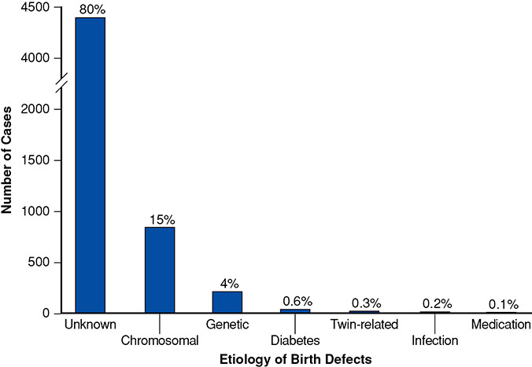
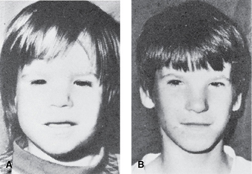
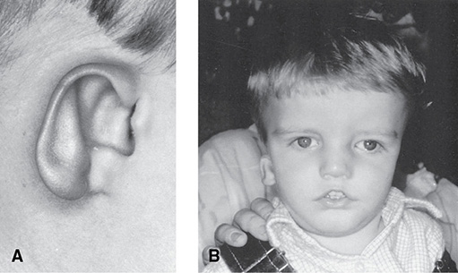
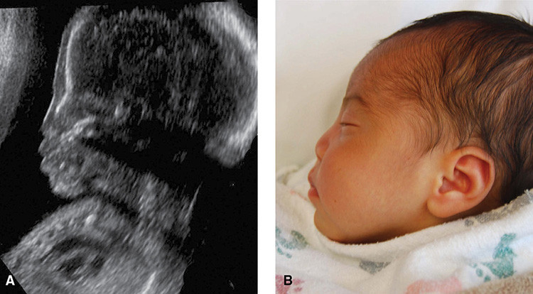

# Chapter 8: Teratology, Teratogens, and Fetotoxic Agents — Revision Notes

> Williams Obstetrics 26e, pp. 383–434 of the PDF. High-yield numbers are in **bold**.
> The five tables are transcribed from the PDF images (they are missing from the extracted chapter text). All 4 figures are included from the PDF.

**Big picture:** Major birth defects affect **2–3%** of newborns, but **<1%** of all birth defects are caused by medications. Few drugs are true teratogens, and for almost every one a safer alternative exists. Counseling should use **absolute risk**, not odds ratios.

---

## 1. Background and Definitions

- **2–3%** of newborns have a major congenital abnormality detectable at birth.
- **80%** of birth defects have **no obvious cause**. Of those with a known cause, **~95% are chromosomal or genetic**.
- FDA: **<1% of birth defects are caused by medications**.
- Medication use is common:
    - Average **2–3 medications per pregnancy**; **70%** use a medication in the 1st trimester.
    - **65%** fill ≥1 prescription in pregnancy (Canada).
    - Of 290 new drugs approved in 2010–2019, only **11%** had human pregnancy data.

### Table 8-1. Selected Teratogenic and Fetotoxic Agents

| A–L | L–P | R–W |
|---|---|---|
| Acitretin | Leflunomide | Radioactive iodine |
| Alcohol | Lithium | Ribavirin |
| Angiotensin-converting enzyme inhibitors | Marijuana | Sulfonamides |
| Angiotensin-receptor blockers | Mercury | Tamoxifen |
| Bexarotene | Methamphetamine | Tetracyclines |
| Carbamazepine | Methimazole | Thalidomide and analoguesᵇ |
| Cocaine | Methotrexate | Tobacco |
| Corticosteroids | Mycophenolate | Toluene |
| Cyclophosphamide | Nitrofurantoin | Topiramate |
| Endothelin-receptor antagonistsᵃ | Non-steroidal anti-inflammatory drugs | Trastuzumab |
| Fluconazole | Paroxetine | Valproic acid |
| Isotretinoin | Phenobarbital | Warfarin |
| Lead | Phenytoin |  |

*ᵃIncludes ambrisentan, bosentan and macitentan. ᵇIncludes lenalidomide and pomalidomide.*

*Figure 8-1. Causes of 5504 birth defects (270,878 births): unknown 80%, chromosomal 15%, genetic 4%, diabetes 0.6%, medication only 0.1%.*

---

## 2. Teratology

| Term | Definition |
|---|---|
| **Teratogen** | Any agent acting during embryonic or fetal development that produces a **permanent alteration of form or function**. Strictly, it causes **structural** abnormalities. |
| **Hadegen** (after Hades) | Interferes with normal **maturation and function** of an organ |
| **Trophogen** | Alters **growth** |

- Teratogens include drugs/chemicals, physical agents (**heat, radiation**), maternal metabolites (**diabetes, PKU**) and infections (**CMV**).
- Hadegens and trophogens act mostly in the fetal period or after birth → they are **fetotoxins** rather than teratogens.

---

## 3. Criteria for Determining Teratogenicity (Shepard)

### Table 8-2. Criteria for Determining Teratogenicity

**Essential criteria**

1. Careful delineation of clinical cases, particularly if there is a specific defect or syndrome
2. Proof that exposure occurred at a critical time during development (see Fig. 7-2)
3. Consistent findings by **at least two epidemiological studies** with:
    - a. exclusion of bias
    - b. adjustment for confounding variables
    - c. adequate sample size (power)
    - d. prospective ascertainment if possible
    - e. **relative risk (RR) ≥3.0**; some recommend RR ≥6.0

    ***or*** for a rare environmental exposure associated with a rare defect, **at least three reported cases**. This is easiest if the defect is severe.

**Ancillary criteria**

4. The association is biologically plausible
5. Teratogenicity in experimental animals is important but **not essential**
6. The agent acts in an unaltered form in an experimental model

### Key tenets

- **Defect completely characterized**, ideally by a geneticist/dysmorphologist. Causation is easiest to prove when a **rare exposure → rare anomaly**, ≥3 cases, severe defect.
- **Agent must cross the placenta** in sufficient quantity. Transfer depends on maternal metabolism, protein binding, molecular size, charge, lipid solubility and placental metabolism (**cytochrome P450**). The early placenta has a thick membrane that slows diffusion.
- **Exposure in a critical period:**

| Period | Timing | Effect of an insult |
|---|---|---|
| **Preimplantation ("all or none")** | First **2 wk** after fertilization | Many cells damaged → **embryonic death**; few damaged → compensation, **normal development** |
| **Embryonic** | **2nd–8th wk postconception** | **Organogenesis** → most crucial period for **structural malformations** |
| **Fetal** | **>8 wk postconception** | Maturation and functional development; some organs remain vulnerable |

- **Biological plausibility** supports the link (defects and drug use are both common, so they can be temporally but not causally related).
- **Consistent epidemiology:** ≥2 high-quality studies; **RR ≥3.0** needed. Pitfalls: recall bias, poor reporting, confounders (dose, other drugs, maternal disease).
- **Animal data:** not obligatory; for litigation, **human data are required**.

### Bendectin — the cautionary tale

- **Doxylamine + pyridoxine** (± dicyclomine) for nausea and vomiting; used by >30 million women.
- Anomaly rate **3%** = background rate. Still, lawsuits forced withdrawal in **1983** → **hospitalization for hyperemesis doubled**.
- Remarketed as **Diclegis**, FDA-approved in **2013**.

---

## 4. Studies in Pregnant Women

- Problems:
    - **Animal studies are necessary but insufficient** (thalidomide was harmless in several animal species → **phocomelia** in thousands of children).
    - Drugs are rarely approved for pregnancy indications; pregnant women are routinely excluded from research.
    - Pregnancy physiology changes drug levels (volume of distribution, CO, GI absorption, hepatic metabolism, renal clearance).

| Study design | Strength | Weakness |
|---|---|---|
| **Case reports/series** ("astute clinician model") | Found rubella (**Gregg, 1941**), thalidomide, alcohol. Need proven exposure at a critical time + **≥3 cases** | **No control group**; misses uncommon exposures, nonspecific defects or low-penetrance effects |
| **Case-control** | Efficient for **rare outcomes**; generates hypotheses | **Recall bias**; **confounding by indication**; power to detect trivial differences. Associations may be wrong unless **OR >3–4** |
| **Cohort** (e.g., Medicaid, insurance claims) | Exposed vs unexposed | Needs **very large** samples; can't adjust for confounders such as indication |
| **Pregnancy registries** | Prospective enrollment of exposed pregnancies (FDA lists registries for **115** drugs) | **No control group**; need baseline prevalence (e.g., **Metropolitan Atlanta Congenital Defects Program**, 1967) |

### National Birth Defects Prevention Study (NBDPS)

- Population-based **case-control** study, **1997–2013**, 10 states; **~32,000 cases, ~12,000 controls**; included live births, stillbirths and terminations.
- Found small associations with antibiotics, antidepressants, antiemetics, antihypertensives, asthma drugs, **NSAIDs, opioids**; also secondhand smoke, pesticides, nitrogen oxide (traffic pollution).
- **Pregestational diabetes** was associated with **46 of 50** abnormalities studied.
- **Limitations:**
    - Interviews **6 wk to 2 yr** after delivery → recall bias (25% couldn't remember which antibiotic).
    - Only ⅔ participated → selection bias.
    - No record review → no dose-response.
    - **No adjustment for multiple comparisons** (antibiotics: 43 comparisons, 4 significant; 2 expected by chance).
    - Absolute risks often as low as **1 per 1000** exposed.

---

## 5. Counseling for Medication Exposure

- Ask about medication and illicit drug use at every preconceptional and prenatal visit.
- Women **underestimate background risk** and **overestimate drug risk**:
    - Utah: of 5500 major defects in >270,000 births, only **4** were due to medication.
    - **¼** of women exposed to nonteratogenic drugs thought they had a **25%** risk of anomalies.
- Good counseling ↓ anxiety and **may avert termination**.
- **Sources:** the manufacturer's prescribing information (recommended first), PubMed, **Reprotox, TERIS, Shepard's Catalog**; **LactMed** for breastfeeding.
- Weigh dose, route, timing, other drugs, the underlying disease — and **the risk of not treating**.

### Labeling requirements

- **1979:** FDA letter categories **A, B, C, D, X** → led to over-reliance on the letter.
- **2015:** new **Pregnancy and Lactation Labeling** replaced the letters with a narrative summary of risks, clinical considerations and data. Also includes registry info, a lactation subsection, a reproductive-potential section, and the **background risk of birth defects and miscarriage**.

### Table 8-3. Food and Drug Administration Pregnancy Labeling Requirements

| Label Subsection | Categories | Selected Specific Content |
|---|---|---|
| **8.1 Pregnancy** | Pregnancy exposure registry | Presence of a registry and contact information |
| | Risk summary | Structural abnormalities, embryo-fetal and/or infant mortality information, functional impairments, and alterations to growth |
| | | Human data, animal data, and pharmacology information as an integrated summary |
| | | Incidence of adverse outcomes, including dose effects, exposure duration, and gestational age |
| | Clinical considerations | Disease-associated maternal and embryo-fetal risks; dose adjustments (pregnancy or postpartum); maternal, fetal or neonatal adverse reactions; effects on labor or delivery |
| | Data | Content from human and animal studies and their findings and limitations |
| **8.2 Lactation** | Risk summary | Presence of a drug or its metabolite(s) in human milk, effects on the breastfed child, and effects on milk production |
| | Clinical considerations | Summary of available data and information about minimizing exposure |
| | Data | Includes content from human and animal studies that inform clinical considerations |
| **8.3 Males and females of reproductive potential** | Pregnancy testing | Testing requirement or recommendation before, during, or after drug use |
| | Contraception | Contraception requirement or recommendation before, during, or after drug use |
| | Infertility | Effects on fertility, potential reversibility, mutagenesis data, and pre-implantation loss effects |

*From Food and Drug Administration, 2020b.*

### Presenting risk information

- Cover the fetal risk of the drug **and** the risk of the disease itself **and** of not treating it.
- **Framing matters:** "2% chance of a malformation" sounds worse than "**98% chance of an unaffected baby**".
- Use **absolute or attributable risk** (prevalence in exposed − unexposed), not odds ratios.
    - Example: oral corticosteroids + cleft lip = "tripled risk" sounds alarming, but it is **1 → 3 per 1000**, or a **99.7%** chance of no cleft.
- **Low-risk teratogen** = defects in **<10 per 1000** exposures; close to background, so usually not a reason to stop needed treatment.
- **Background risk of a major anomaly ≈ 3%** for all women. A confirmed teratogen usually adds only **1–2%**, or at most doubles or triples it.

---

## 6. Teratogenic and Fetotoxic Agents — General

- Relatively few drugs are major teratogens, and **a safer alternative almost always exists**.
- Take any medication only when clearly needed.
- **Detailed sonography** is generally indicated after exposure to a major teratogen during the **embryonic period**.

### Alcohol

- **Leading cause of preventable developmental disability** worldwide.
- US: **10%** of pregnant women drink; ~10% of these binge in the 1st trimester (1% in the 2nd–3rd).
- Described by **Lemoine (1968)** and **Jones (1973)**.
- **Fetal alcohol spectrum disorder (FASD)** — umbrella for **5 conditions:**
    1. Fetal alcohol syndrome (FAS)
    2. Partial FAS
    3. Alcohol-related birth defects
    4. Alcohol-related neurodevelopmental disorder
    5. Neurobehavioral disorder associated with prenatal alcohol exposure
- **Prevalence:**
    - FASD >1% in 76 countries; **1 in 13** women who drink in pregnancy has a child with FASD.
    - FAS up to **1%** of US births; FASD in **2–5%** of school-aged children.
- Other associations: **omphalocele, gastroschisis** (periconceptional use); **binge drinking** → highest risk for defects and **stillbirth**.
- **No sonographic criteria** for prenatal diagnosis. Parkland: detailed scan if exposure criteria are met ± 3rd-trimester growth scan.
- Susceptibility is modified by genetics, nutrition, maternal disease and age.
- **No amount of alcohol is safe in pregnancy** (ACOG, CDC, AAP).

### Table 8-4. Criteria for Prenatal Alcohol Exposure, Fetal Alcohol Syndrome, and Alcohol-Related Birth Defects

**Documented prenatal alcohol exposure — one or more required**

1. **≥6 drinks per week for ≥2 weeks**
2. **≥3 drinks per occasion for ≥2 occasions**
3. Risk identified with a validated screening questionnaire
4. Laboratory testing indicating alcohol intoxication or positive alcohol-exposure biomarker
5. Documentation of an alcohol-related legal or social problem

**Fetal alcohol syndrome diagnostic criteria — ALL required**

1. **Dysmorphic facial features (≥2 required):**
    - a. Short palpebral fissures
    - b. Thin vermilion border of the upper lip
    - c. Smooth philtrum
2. Prenatal and/or postnatal **growth impairment, ≤10th percentile**
3. Abnormal brain growth, morphogenesis, or physiology (≥1 required):
    - a. **Head circumference ≤10th percentile**
    - b. Structural brain abnormalities
    - c. Recurrent nonfebrile seizures
4. **Neurobehavioral impairment** (defined as **>1.5 SD below mean**):
    - a. Child <3 years: developmental delay
    - b. Child ≥3 years: global cognitive impairment, or cognitive deficit in at least 1 neurobehavioral domain, or behavioral deficit in at least 1 domain

**Alcohol-related birth defects**

| System | Defects |
|---|---|
| Cardiac | Atrial or ventricular septal defect, aberrant great vessels, conotruncal heart defects |
| Skeletal | Radioulnar synostosis, vertebral segmentation defects, joint contractures, scoliosis |
| Renal | Aplastic or hypoplastic kidneys, dysplastic kidneys, horseshoe kidney, ureteral duplication |
| Eyes | Strabismus, ptosis, retinal vascular abnormalities, optic nerve hypoplasia |
| Ears | Conductive or neurosensory hearing loss |

*SD = standard deviation.*

> **Memory hook:** FAS = "**3 faces + growth + brain + behavior**" — short **P**alpebral fissures, thin **U**pper lip, smooth **P**hiltrum ("PUP"), ≥2 of 3.

*Figure 8-2. Fetal alcohol syndrome at 2½ and 12 yr: short palpebral fissures, epicanthal folds, flat midface, hypoplastic philtrum and thin upper lip persist.*

---

## 7. Antiepileptic Drugs

- Most common anomalies: **orofacial clefts, cardiac malformations, neural-tube defects (NTDs)**.
- **Valproic acid = highest risk:**
    - NAAED registry: major malformations in **9%** after 1st-trimester exposure, including **4% NTDs**.
    - Exposed children have **lower IQ** and poorer cognitive development than with other AEDs.
- Malformation rate vs untreated epilepsy (monotherapy):

| Drug | Relative malformation risk |
|---|---|
| Carbamazepine, phenytoin | **2×** |
| Phenobarbital | **3×** |
| Topiramate | **4×** |
| **Polytherapy** | Risk roughly **doubled** |
| **Levetiracetam, lamotrigine** | **No increase** (levetiracetam 2% = population rate; >1500 lamotrigine pregnancies, no ↑; no oral clefts in 208 Israeli cases) |

- **Fetal hydantoin syndrome** (older AEDs): **hypertelorism, low nasal bridge, midface hypoplasia; hypoplastic distal phalanges and nails**; growth impairment; intellectual disability.
- Enroll exposed women in the **NAAED Pregnancy Registry**.

---

## 8. ACE Inhibitors and Angiotensin-Receptor Blockers

- **ACE-inhibitor fetopathy:** fetal kidney development depends on the fetal renin–angiotensin system.
    - Fetal hypotension → **renal hypoperfusion → ischemia and anuria**.
    - → **FGR, calvarial maldevelopment**; **oligohydramnios → pulmonary hypoplasia and limb contractures**.
- Exposure **beyond 20 wk:** fetopathy risk **30% with ARBs** vs **3% with ACE inhibitors**.
- **1st-trimester (embryo) toxicity largely disproven:** an early Tennessee Medicaid study (2–3× cardiac/CNS defects) was not confirmed in cohorts of **460,000** and **1.3 million** pregnancies.
- → Women with **inadvertent 1st-trimester exposure can be reassured**, but **avoid ACEi/ARBs in pregnancy** — use other antihypertensives.

---

## 9. Antifungals

- **Fluconazole, chronic high dose (400–800 mg/d), 1st trimester** → pattern like **autosomal recessive Antley-Bixler syndrome**: oral clefts, abnormal facies, cardiac, skull, long-bone and joint anomalies.
- **Low dose (150–300 mg total) for vulvovaginal candidiasis:**
    - No overall rise in birth defects (small cardiac risk not excluded).
    - Denmark: **3× tetralogy of Fallot** (3 → 10 per 10,000), but a later study of >37,000 exposures found **no cardiac association**.
- Parkland: **no** detailed scan or fetal echo after low-dose fluconazole.

---

## 10. Antiinflammatory Agents

### NSAIDs (aspirin, ibuprofen, indomethacin) — inhibit prostaglandin synthesis

- **≥20%** take them in the 1st trimester; **not a major risk factor for birth defects**.
- **Late pregnancy — indomethacin:**
    - **Constriction of the ductus arteriosus → pulmonary hypertension**; more likely with 3rd-trimester use **>72 h**.
    - ↓ fetal urine → **oligohydramnios**.
    - Tocolysis → **1.5×** risk of BPD, IVH and NEC.
- **FDA: avoid NSAIDs from ≥20 wk** (oligohydramnios/neonatal renal problems).
    - If needed for **>48 h**, consider ultrasound of amnionic fluid.
    - Oligohydramnios usually resolves **within 6 days** of stopping, but some infants died of renal failure.
- **Low-dose aspirin ≤100 mg/d is safe** (no ductal constriction). Avoid **high-dose** aspirin, especially in the 3rd trimester.

### Leflunomide (pyrimidine-synthesis inhibitor, for RA)

- **Contraindicated** in pregnancy (animal: hydrocephalus, eye/skeletal anomalies, embryo death).
- Active metabolite **teriflunomide persists up to 2 years**.
- If pregnant (or planning, even after stopping) → **accelerated elimination with cholestyramine or activated charcoal**.
- Human data are reassuring: >500 exposures, major defects **3%** (= population); no ↑ miscarriage.

---

## 11. Antimicrobial and Antiviral Drugs

- Most commonly used antimicrobials have **no embryo-fetal safety concerns**.

| Drug | Concern | Practical point |
|---|---|---|
| **Nitrofurantoin** | NBDPS: **2× cleft lip** (still 998/1000 unaffected). Case-control: **3× hypoplastic left heart** (<1/1000) — not seen in cohort studies | **Contraindicated with G6PD deficiency** (hemolysis). Fine in 2nd–3rd trimester; 1st trimester if no suitable alternative |
| **Sulfonamides (TMP-SMX)** | NBDPS: **5× esophageal atresia or diaphragmatic hernia** (~1/1000); not confirmed in >7500 exposures | OK in 1st trimester if no alternative. **Contraindicated with G6PD deficiency**. Displace bilirubin → theoretical neonatal hyperbilirubinemia near preterm delivery (not seen in Danish data) |
| **Tetracyclines** | **Yellow-brown staining of deciduous teeth** if used **after 25 wk**; no ↑ caries | **Doxycycline preferred** (less calcium chelation; no ↑ defects or staining) |
| **Ribavirin** (hepatitis C) | Animal teratogen at low doses (skull, palate, eye, skeleton, GI). **Half-life 12 days**; persists in tissues | **Two forms of contraception + monthly pregnancy tests** during and for **6 months** after. Also contraindicated in **men whose partners are pregnant** |

---

## 12. Antineoplastic Agents

- First-trimester chemotherapy exposure: **14%** major malformations (300 pregnancies).

| Agent | Key facts |
|---|---|
| **Cyclophosphamide** (alkylating) | ↑ pregnancy loss; skeletal, limb, cleft palate, eye defects. Major anomaly risk **18%**. Growth and developmental delay. Health-care workers exposed → ↑ miscarriage |
| **Methotrexate** (folic acid antagonist) | **Fetal methotrexate–aminopterin syndrome:** craniosynostosis with **"cloverleaf" skull**, wide nasal bridge, low-set ears, micrognathia; CNS, cardiac and limb defects; intellectual impairment. Most vulnerable at **8–10 wk postconception** and **≥10 mg/week**. Persists in the body → **preconceptional exposure is not risk-free**. The **50 mg/m²** ectopic/abortion dose exceeds the threshold → **conotruncal heart defects** reported after inadvertent treatment of an intrauterine pregnancy |
| **Tamoxifen** (SERM) | DES-like defects in rodents (vaginal adenosis). Human: abnormality in **13%** of 167 (ambiguous genitalia, craniofacial) |
| **Trastuzumab** (anti-HER2 antibody) | Not a malformation risk, but **oligohydramnios sequence** → pulmonary hypoplasia, renal failure, skeletal anomalies, neonatal death. Surveillance if exposed in pregnancy or **within 7 months before conception**. Same for ado-trastuzumab emtansine |

---

## 13. Endothelin-Receptor Antagonists

- **Bosentan, ambrisentan, macitentan** (pulmonary arterial hypertension).
- Endothelin signaling is needed for **neural-crest development** → craniofacial and **cardiac outflow tract** defects in animals. No human data.
- Available only through **restricted access programs**: contraception + **monthly pregnancy testing**.

---

## 14. Immunosuppressants

- **Corticosteroids:**
    - Systemic use → **3× orofacial clefts**, absolute risk only **3 per 1000**; no overall rise in major malformations → **not a major teratogen**.
    - **Prednisone/methylprednisolone** are lower risk: prednisolone is inactivated by placental **11β-hydroxysteroid dehydrogenase 2**, so less reaches the fetus.
- **Mycophenolate mofetil / mycophenolic acid** (IMP dehydrogenase inhibitor) — **potent teratogen**:
    - Continued past the 1st trimester: **30% birth defects + 30% miscarriage**. >20% of liveborns have major anomalies.
    - **Mycophenolate embryopathy:** **microtia, auditory canal atresia**, clefts, **coloboma**/eye anomalies, short fingers with hypoplastic nails, cardiac defects.
    - Prescribing requires a **REMS** (FDA-mandated Risk Evaluation and Mitigation Strategy).

---

## 15. Environmental Metals

### Lead

- Crosses the placenta by passive diffusion → **FGR** and childhood **neurodevelopmental delay**.
- **No safe level** (CDC). No routine testing, but **assess risk factors in every pregnancy** (Ch 10).

### Mercury

- **Congenital Minamata disease** (Japan, 1950s): methylmercury → disturbed neuronal division and migration → microcephaly, intellectual disability, choreoathetosis, motor delay.
- Main source is **large fish**. **Methylmercury is not removed by cooking.**
- **Avoid:** king mackerel, marlin, orange roughy, **shark, swordfish, tilefish**, bigeye tuna.

---

## 16. Psychiatric Medications

- **Antipsychotics:** **none is teratogenic**. Neonates may show transient extrapyramidal signs and withdrawal (agitation, tone changes, tremor, somnolence, respiratory and feeding problems) — FDA alert covers the whole class.
- **Lithium:**
    - **Ebstein anomaly** (apical displacement of the tricuspid valve → severe TR, big right atrium); background **1 in 20,000**.
    - Early registry suggested **3%**; the true attributable risk is only **1–4 per 1000** exposures.
    - **Neonatal lithium toxicity** from exposure near delivery: arrhythmias, hypoglycemia, **nephrogenic DI**, **"floppy infant"** (hypotonia, apnea, bradycardia, cyanosis, poor feeding); may last **2 wk**.
    - → **Reduce or stop the dose 2–3 days before delivery** if possible.
- **SSRIs/SNRIs:** as a class **not major teratogens**.
    - Exception: **paroxetine** → slightly ↑ **cardiac septal defects (ASD/VSD)**, pooled **OR 1.3** (not seen in ~1 million Medicaid pregnancies).
    - **ACOG: avoid paroxetine when planning pregnancy**; consider **fetal echo** after 1st-trimester exposure.
    - **Neonatal behavioral syndrome** in **~25%** with late exposure: jitteriness, irritability, tone changes, feeding problems, vomiting, hypoglycemia, temperature instability, respiratory problems. Mild, lasts **~2 days**.
    - **PPHN:** baseline **2 per 1000**; SSRIs add only **1–2 per 1000**, and cases are not severe.

---

## 17. Retinoids

- **Among the most potent human teratogens.** They inhibit **cranial neural-crest cell migration** → **retinoic acid embryopathy**: CNS, face, heart, thymus.
    - **Ventriculomegaly**, facial/cranial bone defects, **microtia/anotia**, micrognathia, cleft palate, **conotruncal heart defects**, **thymic aplasia/hypoplasia**.

| Retinoid | Use | Key rule |
|---|---|---|
| **Isotretinoin** (13-cis-retinoic acid) | Nodular acne | High pregnancy loss; **up to ⅓** malformed. **iPLEDGE** (FDA-mandated REMS) for patients, prescribers and pharmacies |
| **Acitretin** | Severe psoriasis | Metabolized to **etretinate** (half-life **120 days**; defects >2 yr after stopping). **"Do Your P.A.R.T."** → **delay conception ≥3 years** |
| **Bexarotene** | Cutaneous T-cell lymphoma | **2 contraceptive methods** from 1 month before to **1 month after**; monthly pregnancy tests; male partners use condoms |
| **Topical** (tretinoin, isotretinoin, adapalene) | Acne, sun damage | Low absorption; **no ↑ malformations** in 635 exposures. **Tazarotene not recommended** (large surface area ≈ oral dose) |
| **Vitamin A** | Supplements | Carotenoids (beta-carotene) **never teratogenic**. **Preformed vitamin A (retinol) >10,000 IU/d** in the 1st trimester → cranial neural-crest defects. Keep to **3000 IU/d** |

*Figure 8-3. Retinoic acid embryopathy: (A) microtia/anotia with ear canal stenosis; (B) flat, depressed nasal bridge and ocular hypertelorism.*

---

## 18. Sex Hormones

- **Androgens** → variable virilization of female fetuses and **ambiguous genitalia**.

---

## 19. Thalidomide and Analogues

- The most notorious teratogen: malformations in **20%** exposed at **34–50 days menstrual age**.
- **Phocomelia** = absence or underdevelopment of long bones (hands/feet attach to the trunk). Also cardiac, GI, ear and eye defects and other limb reductions. **Up to 40%** of affected newborns die in the neonatal period.
- Marketed **1956–1960** outside the US. Lessons:
    1. **The placenta is not a barrier** to toxins
    2. **Species vary** in susceptibility (no defects in rodents)
    3. **Timing determines the defect**

| Defect | Exposure (days postconception) |
|---|---|
| Upper-limb **amelia** | 24–30 |
| Upper-limb phocomelia | 24–33 |
| Lower-limb phocomelia | 27–33 |

- US approval **1999** for **erythema nodosum leprosum** and **multiple myeloma**; restricted via **THALOMID REMS**.
- Analogues **lenalidomide** (MDS, myeloma; limb defects in monkeys) and **pomalidomide** (myeloma, AIDS-related Kaposi sarcoma) → similar restricted programs.

---

## 20. Thyroid Medications

- **Methimazole embryopathy** (**1–2%** of exposed): **2× aplasia cutis congenita** (full-thickness skin defect, usually **scalp**), **choanal atresia**, **esophageal atresia**.
- **Radioiodine (¹³¹I) — contraindicated:**
    - Crosses the placenta; **fetal thyroid concentrates it by 12 wk** → severe/irreversible **fetal and neonatal hypothyroidism** (↓ mental capacity, delayed bone maturation).
    - **Pregnancy test before** treatment; **avoid pregnancy for 6–12 months** after (no ↑ loss or anomalies if conception delayed ≥6 months).

---

## 21. Warfarin

- Vitamin K antagonist, low molecular weight, long half-life → **crosses the placenta**.
- **Contraindicated except** for women with **mechanical heart valves** at high thromboembolic risk (Ch 52).
- **Warfarin embryopathy** (exposure **6–9 wk**; **6%** risk):
    - **Nasal hypoplasia / depressed nasal bridge**, choanal atresia.
    - **Stippled epiphyses** (femur, humerus, calcanei, distal phalanges).
    - **Dose dependent:** only **1%** with **≤5 mg/d**.
- **After the 1st trimester:** **fetal hemorrhage** → abnormal growth and deformation from scarring.
- **~50%** of embryopathy cases have **CNS anomalies**: agenesis of the corpus callosum, **Dandy-Walker**, microphthalmia, optic atrophy → blindness, deafness, developmental delay.

*Figure 8-4. Warfarin embryopathy: nasal hypoplasia and depressed nasal bridge on fetal sonography (A) and in the same newborn (B).*

---

## 22. Tobacco

- **Leading preventable cause of perinatal mortality**; **≥7%** smoke in pregnancy.
- Smoke contains nicotine, cotinine, cyanide, thiocyanate, **CO**, cadmium, lead, hydrocarbons → vasoactive and hypoxic effects.
- **Not a major teratogen**, but:
    - **Orofacial clefts up to 1.5×** (~1 per 2000 attributable).
    - **Poland sequence 2×** (vascular disruption of one side of the chest and arm).
    - **Limb reduction defects** (+25%); small ↑ cardiac defects (dose related).
- **Fetal growth** (most common complication; dose dependent):
    - Babies **~200 g lighter**; **LBW 2×**; **FGR 2–3×**.
    - Smoking causes **15% of LBW**. Secondhand smoke also ↑ LBW.
- Also: **preterm birth, PROM, placenta previa, abruption**; **~⅓ of SIDS**; childhood asthma and obesity.
- **All nicotine crosses the placenta; none is safe** — including vaping (fetal brain and lung effects; **EVALI** in adults) and hookah.
- **Cessation:** strongly encourage; avoid secondhand smoke and nicotine-replacement products; **1-800-QUITNOW**; USPSTF: behavioral interventions from the first visit.

---

## 23. Herbal Medicinal Products

- **30–60%** of pregnant women use herbal remedies. They are **not FDA-regulated**; identity, quantity and purity are unknown → **discourage use**.

### Table 8-5. Pharmacological Actions and Adverse Effects of Some Herbal Medicines

| Herb and Common Name | Potential Pharmacological Effects | Concerns |
|---|---|---|
| Aloe (oral ingestion) | Smooth-muscle stimulant | May cause uterine contractions |
| Almond oil (topical) | Smooth-muscle stimulant | Increase in preterm births |
| Black cohosh | Smooth-muscle stimulant | Causes uterine contractions; also has an estrogenic compound |
| Blue cohosh | Smooth-muscle stimulant | Causes uterine contractions; contains compounds teratogenic in multiple animal species |
| Echinacea: *purple coneflower root* | Activates cell-mediated immunity | Allergic reactions; decreases immunosuppressant effectiveness; possible immunosuppression with long-term use |
| Ephedra: *ma huang* | Direct and indirect sympathomimetic; tachycardia and hypertension | Hypertension, arrhythmias, myocardial ischemia; stroke; depletes endogenous catecholamines; life-threatening interaction with monoamine oxidase inhibitors |
| Evening primrose oil | Contains linoleic acids, a prostaglandin precursor | Possible complications if used for labor induction |
| Garlic: *ajo* | Inhibits platelet aggregation; increased fibrinolysis; antihypertensive activity | Risk of bleeding when combined with other platelet aggregation inhibitors |
| Ginger | Cyclooxygenase inhibitor, thromboxane synthetase inhibitor; lowers blood glucose | Increased risk of bleeding; hypoglycemia |
| Ginkgo biloba | Anticoagulant | Risk of bleeding; interferes with monoamine oxidase inhibitors |
| Ginseng | Lowers blood glucose; inhibition of platelet aggregation | Hypoglycemia; hypertension; risk of bleeding |
| Kava: *awa, intoxicating pepper, kawa* | Sedation, anxiolysis | Sedation; tolerance and withdrawal |
| Licorice (glycyrrhizin) | Inhibits cortisol and prostaglandin metabolism | Increased risk of preterm birth |
| Raspberry leaf | Smooth-muscle stimulant | Increased risk of cesarean when used in late pregnancy or in labor |
| Valerian: *all heal, garden heliotrope, vandal root* | Sedation | Sedation; hepatotoxicity; benzodiazepine-like acute withdrawal |
| Yohimbe | — | Hypertension, arrhythmias |

*Data from Ang-Lee, 2001; Facchinetti, 2012; Hall, 2012; Munoz Balbontin, 2019; Nordeng, 2011; Strandberg, 2002; Wiesner, 2017.*

---

## 24. Drugs of Abuse

- Outcomes are confounded by poor health, malnutrition, infection, **polysubstance use**, contaminants (lead, cyanide, pesticides) and by **alcohol and tobacco**.

| Drug | Teratogenic? | Main problems |
|---|---|---|
| **Cocaine** | Conflicting (cleft palate, cardiac, urinary tract reported) | **Vasoconstriction/hypertension** → maternal stroke/cerebral hemorrhage, MI, **abruption**; FGR, preterm birth; behavioral and cognitive problems in children |
| **Marijuana** | Not a major teratogen, but crosses the placenta; endocannabinoids guide brain development | Most common recreational drug (**~4%**). ↓ attention, visual problem solving. Preterm/LBW only with **concomitant tobacco**. **No evidence it helps nausea** (yet ~70% of dispensaries recommended it). **Avoid** — ACOG: may be as serious as tobacco or alcohol |
| **Methamphetamine** | No | **SGA**, developmental and behavioral problems; hypertension, abruption, preterm birth, stillbirth |
| **Opioids** | Not major (slight ↑ spina bifida, gastroschisis, cardiac in NBDPS) | Heroin → preterm birth, abruption, FGR, fetal death (repeated withdrawal). **Neonatal abstinence syndrome in 40–90%** |
| **Phencyclidine (PCP)** | No | **>½** of newborns have withdrawal (tremor, jitteriness, irritability) |
| **Toluene** (paint/glue solvent) | **Toluene embryopathy** — like FAS | Growth deficiency, microcephaly, midface hypoplasia, short palpebral fissures, wide nasal bridge; **up to 40%** developmental delay |

### Opioid-use disorder management

- **Neonatal abstinence syndrome:** CNS irritability → **seizures** if untreated, tachypnea, apnea, poor feeding, failure to thrive. Monitor with a scoring system (**Finnegan**); treat severe cases with opioids.
- **ACOG: opioid-agonist maintenance therapy** — **buprenorphine** (office-based) or **methadone** (licensed program), with multidisciplinary care.
- **Withdrawal from methadone in pregnancy is discouraged** (high relapse). Parkland offers **inpatient controlled methadone taper** to women who decline maintenance.

> **Pearl:** The small birth-defect risk with opioid maintenance is far outweighed by the risks of uncontrolled opioid use.

---

## Quick-Recall: Teratogen → Classic Effect

| Agent | Classic defect / effect | Critical fact |
|---|---|---|
| Alcohol | FAS: short palpebral fissures, thin upper lip, smooth philtrum; growth ↓; CNS | No safe amount |
| Valproate | **NTDs (4%)**, 9% major malformations; ↓ IQ | Highest-risk AED |
| Phenytoin / older AEDs | Fetal hydantoin syndrome (hypertelorism, distal phalanx/nail hypoplasia) | 2× risk |
| Carbamazepine / phenobarbital / topiramate | Clefts, cardiac, NTDs | 2× / 3× / 4× |
| Levetiracetam, lamotrigine | No ↑ risk | Preferred AEDs |
| ACEi / ARB | Fetal renal hypoperfusion → anuria, oligohydramnios, calvarial maldevelopment, pulmonary hypoplasia, limb contractures | 2nd–3rd trimester; ARB 30% vs ACEi 3% |
| Fluconazole (high dose) | Antley-Bixler–like phenotype | 400–800 mg/d chronic |
| Indomethacin/NSAIDs | Ductus constriction, oligohydramnios | Avoid ≥20 wk; >72 h |
| Tetracycline | Yellow-brown deciduous teeth | After 25 wk; doxycycline preferred |
| Nitrofurantoin, sulfonamides | Small ↑ cleft / HLHS; EA/CDH | Avoid in G6PD deficiency |
| Methotrexate | Cloverleaf skull, craniosynostosis, conotruncal heart | ≥10 mg/wk at 8–10 wk |
| Cyclophosphamide | Skeletal, limb, cleft palate, eye | 18% major anomaly |
| Trastuzumab | Oligohydramnios sequence | Within 7 months before conception |
| Mycophenolate | Microtia, ear canal atresia, clefts, coloboma | 30% defects + 30% loss |
| Lithium | **Ebstein anomaly**; neonatal toxicity (floppy infant, nephrogenic DI) | 1–4/1000; stop 2–3 days pre-delivery |
| Paroxetine | ASD/VSD | OR 1.3; fetal echo |
| SSRIs (late) | Neonatal behavioral syndrome (25%), PPHN | PPHN +1–2/1000 |
| Isotretinoin / retinoids | Microtia/anotia, conotruncal heart, thymic hypoplasia, CNS | Up to ⅓ malformed; iPLEDGE |
| Thalidomide | **Phocomelia** | 20% if exposed day 34–50 menstrual |
| Methimazole | **Aplasia cutis**, choanal/esophageal atresia | 1–2% |
| Radioiodine | Fetal hypothyroidism | Fetal thyroid uptake by 12 wk |
| Warfarin | **Nasal hypoplasia, stippled epiphyses**; CNS (50%) | 6–9 wk; 6% (1% if ≤5 mg/d) |
| Corticosteroids | Cleft lip/palate | 3 per 1000 |
| Tobacco | FGR (−200 g), clefts, Poland sequence | 15% of LBW; ⅓ SIDS |
| Toluene | FAS-like embryopathy | 40% developmental delay |
| Methylmercury | Minamata disease (microcephaly, intellectual disability, choreoathetosis) | Avoid shark, swordfish, king mackerel, tilefish |

## Key Numbers to Memorize

- Major anomalies **2–3%** of births; background major anomaly risk **~3%**; medications cause **<1%** (0.1% in Utah) of defects; **80%** unknown cause
- Preimplantation "all or none" **2 wk**; embryonic period **2–8 wk postconception**
- Teratogenicity: **RR ≥3.0**, ≥2 studies, or **≥3 cases** for a rare exposure/defect; case-control OR must be **>3–4**
- Low-risk teratogen **<10 per 1000** exposures
- FAS exposure: **≥6 drinks/wk × ≥2 wk** or **≥3 drinks/occasion × ≥2**; growth/HC **≤10th percentile**; neurobehavior **>1.5 SD** below mean
- Valproate **9%** malformations, **4%** NTD; levetiracetam **2%**
- ARB fetopathy **30%**, ACEi **3%** after 20 wk
- Fluconazole high-dose **400–800 mg/d**; NSAIDs avoid **≥20 wk**, ductal risk **>72 h**; aspirin safe **≤100 mg/d**
- Tetracycline teeth after **25 wk**; ribavirin half-life **12 days**, contraception **6 months** after
- Methotrexate **≥10 mg/wk**, **8–10 wk**; cyclophosphamide **18%**; trastuzumab **7 months** preconception
- Mycophenolate **30% + 30%**; isotretinoin **up to ⅓**; acitretin wait **3 yr**; vitamin A **>10,000 IU/d** harmful
- Thalidomide **20%**, days **34–50** menstrual; up to **40%** neonatal death
- Lithium Ebstein **1–4/1000** (background 1/20,000); stop **2–3 days** pre-delivery
- Warfarin **6–9 wk**, **6%** (1% if ≤5 mg/d); CNS anomalies **~50%**
- Radioiodine: fetal thyroid uptake **12 wk**; avoid pregnancy **6–12 months**
- Smoking: **−200 g**, LBW **2×**, FGR **2–3×**, **15%** of LBW; neonatal abstinence **40–90%**
