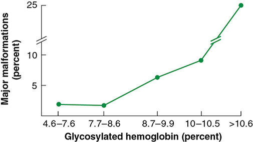
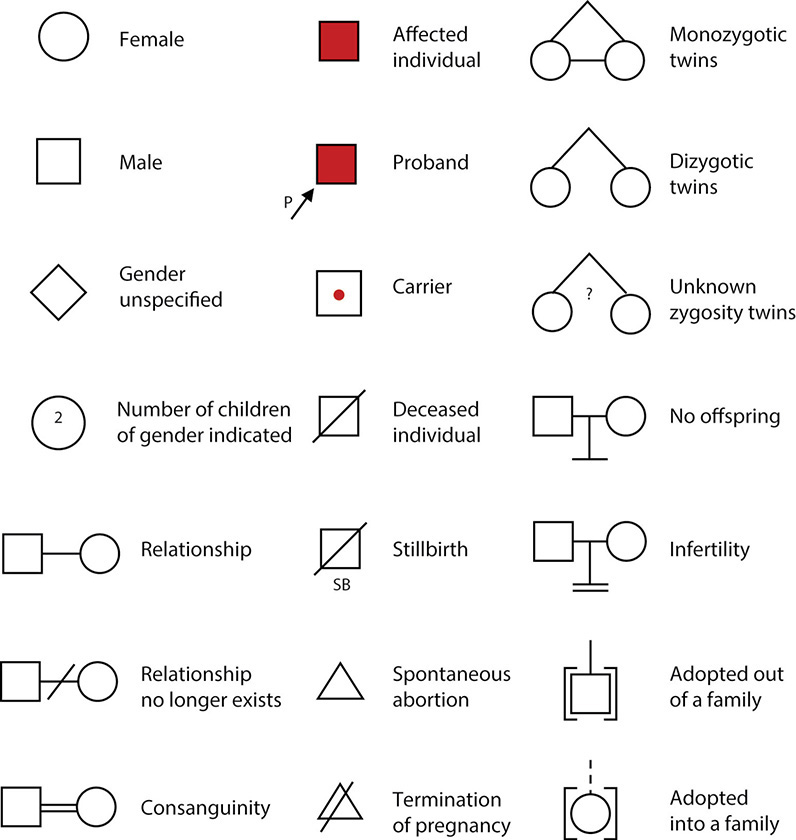
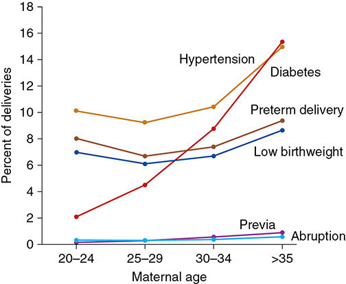

# Chapter 9: Preconceptional Counseling — Revision Notes

> Williams Obstetrics 26e, pp. 435–460 of the PDF. High-yield numbers are in **bold**.
> The four tables are transcribed from the PDF images (they are missing from the extracted chapter text). All 3 figures are included from the PDF.

**Big picture:** By the time most women know they are pregnant, organogenesis has already begun, so the window for many preventive steps (folic acid, glycemic control, drug changes, vaccination) is **before conception**. Nearly half of pregnancies are unplanned, so every health-maintenance visit is an opportunity.

---

## 1. Introduction

- **CDC definition:** preconceptional health = the overall health of **nonpregnant women during their reproductive years**.
- **ACOG + SMFM objectives:**
  1. Improve knowledge, attitudes and behaviors of men and women about preconceptional health
  2. Ensure all childbearing-aged women get preconceptional care (risk screening, health promotion, interventions)
  3. **Interconceptional interventions** to prevent recurrent adverse outcomes
  4. Reduce racial and socioeconomic disparities
- Most women realize they are pregnant **1–2 weeks after the first missed period**, when the embryo has already begun to form → folic acid started then is too late.
- **45% of US pregnancies are unplanned**, and these are often at greatest risk.
- Indigent women receive less preconceptional care.
- Few RCTs exist (withholding counseling would be unethical); benefit is shown by prospective observational and case-control studies. **Routine pregnancy intention screening** is recommended.

### Table 9-1. Preconceptional Health Indicators—United States, 2013–2015

| Factor | Prevalence (%) |
|---|---|
| Diabetes | 3.1 |
| Unwanted pregnancy | 6.1 |
| Hypertension | 10.9 |
| Smoking | 16.9 |
| Depression | 21.9 |
| Multivitamin use | 33.6 |
| Normal weight | 44.9 |
| Physical activity | 50.4 |
| Effective contraception | 56.9 |

*Data from Centers for Disease Control and Prevention, Behavioral Risk Factor Surveillance System, and Pregnancy Risk Assessment Monitoring System.*

---

## 2. Counseling Session

- Best opportunities: **periodic health maintenance visits** (ob-gyn, internist, family practitioner, pediatrician) and the occasion of a **negative pregnancy test**.
  - Of 136 women with a negative pregnancy test, **~95% had at least one risk** that could affect a future pregnancy (Jack, 1995).
- Intake = thorough **medical, obstetrical, social and family history**.
  - **Specific questions** about each history and each family member yield more than open-ended ones. Questionnaires help; answers are reviewed with the couple and records obtained.

### The fourth trimester
- The **postpartum period** is another optimal time to start counseling (ACOG Presidential Task Force on Redefining the Postpartum Visit).
- It optimizes postpartum care and contraception and sets up the next pregnancy and long-term health. ACOG/SMFM Obstetric Care Consensus on **interpregnancy care**.

---

## 3. Medical History

- Consider two things: the **pregnancy's effect on the condition** and the **condition's effect on the fetus and pregnancy**.
- Chronic conditions that may worsen outcomes: treated/active **cancer**, prior **peripartum cardiomyopathy**, **antiphospholipid antibodies**, **SLE**, **congenital heart disease**. Psychological health is also assessed.

### Diabetes mellitus
- The **prototype** condition for which preconceptional counseling is beneficial (details in Ch 60).
- Near-normal glucose before conception avoids many complications.
- Watch for **teratogenic ACE inhibitors**, common in this population.
- ACOG: preconceptional counseling for pregestational diabetes is **beneficial and cost-effective**.
- **ADA recommendations:** inventory disease duration and complications, examine for end-organ damage, and aim for a **preconceptional HbA1c <7%**.
- HbA1c also forecasts risk of **GDM** and **major anomalies** (Fig 9-1).
- Evidence: no RCTs, but cohort studies show benefit.
  - In 5075 women, counseling improved HbA1c, folic acid compliance and "optimal" preparation (Yamamoto, 2018).
  - Counseled women have better control before pregnancy and in the 1st trimester and **fewer perinatal deaths or major anomalies**.
  - Yet only **~half** of diabetic women in a managed-care plan received counseling.

*Figure 9-1. First-trimester HbA1c vs major malformations: ~2% at HbA1c ≤8.6%, rising to ~6% at 8.7–9.9%, ~9% at 10–10.5% and ~25% at >10.6%.*

### Epilepsy
- Women with seizure disorders have ↑ risk of neonates with **structural anomalies**.
  - An independent effect of epilepsy itself (apart from drugs) is largely **not confirmed**, but hard to refute (untreated women have milder disease).
  - **Polytherapy > monotherapy** for malformation risk.
  - **Miscarriage and stillbirth** are **not** increased with antiseizure drugs.
- **Seizure-free for 1 year before pregnancy → seizure risk in pregnancy 50–70% lower.** No extra benefit if the seizure-free period exceeds 1 year.
- **Goal:** control seizures with **monotherapy** using the **least teratogenic** drug.
- **Avoid valproic acid** if possible: consistently the highest major malformation risk.
- Data on newer antiepileptics are limited.

**American Academy of Neurology — consider stopping antiseizure drugs before pregnancy if ALL of:**
1. **Seizure-free for 2–5 years**
2. **Single seizure type**
3. **Normal neurological exam and normal intelligence**
4. **EEG normalized with treatment**

**Folic acid:** women with seizures take **4 mg oral folic acid daily**.
- Its benefit is unclear: one case-control study showed ↓ anomalies with carbamazepine, phenobarbital, phenytoin and primidone exposure (Kjær, 2008).
- But Morrow (2009) found a **paradoxical increase** in major malformations with preconceptional folate → folate metabolism is only part of the mechanism.

### Table 9-2. First-Trimester Antiepileptic Monotherapy and the Associated Major Malformation Risk

| Antiepileptic | Malformations (%)ᵃ | Relative Risk (95% CI)ᵇ |
|---|---|---|
| Unexposed controls | 1.1 | Reference |
| Gabapentin | 0.7 | 1.0 (0.5–1.9) |
| Lamotrigine | 2.0 | 0.9 (0.7–1.3) |
| Oxcarbazepine | 2.2 | — |
| Levetiracetam | 2.4 | 0.7 (0.4–1.2) |
| Phenytoin | 2.9 | 1.7 (1.3–2.2) |
| Carbamazepine | 3.0 | 1.4 (1.1–1.7) |
| Clonazepam | 3.1 | 1.1 (0.6–2.0) |
| Topiramate | 4.2 | 1.9 (1.2–2.9) |
| Phenobarbital | 5.5 | 1.8 (1.4–2.5) |
| **Valproate** | **9.3** | **2.9 (2.4–3.7)** |
| Ethosuximide | — | 3.0 (1.2–7.1) |

*Risk compared with that of the unexposed reference population of women without epilepsy. CI = confidence interval. Data from ᵃHernández-Díaz, 2012; ᵇVeroniki, 2017. The printed column header reads "Antiepileptic (n)", but no n values are given.*

> **Memory hook:** "Lamotrigine and Levetiracetam are the Low-risk L's; Valproate is the Villain (~9%)."

### Immunizations
- Assess immunity to common pathogens; add vaccines by health status, travel and season (Ch 10).

| Vaccine type | Examples | Pregnancy |
|---|---|---|
| **Toxoids** | Tetanus | Suitable before or during pregnancy |
| **Killed bacteria/virus** | Influenza, pneumococcus, hepatitis B, meningococcus, rabies | **Not contraindicated** preconceptionally or in pregnancy |
| **Live virus** | Varicella-zoster, measles, mumps, rubella, polio, chickenpox, yellow fever | **Not recommended** in pregnancy. Ideally wait **≥1 month** between vaccination and trying to conceive |

- **Inadvertent MMR or varicella vaccine in pregnancy is NOT an indication for termination**: the fetal risk is mostly **theoretical**.
- Smallpox, anthrax and other bioterrorism vaccines are discussed if clinically appropriate (Ch 67).
- No vaccine for some infections, e.g. **Zika** → the CDC issued travel advisories for pregnant women during the 2016 epidemic.

### Table 9-3. Immunization Resources

| Source | Website |
|---|---|
| American College of Obstetricians and Gynecologists | www.acog.org/programs/immunization-for-women |
| Centers for Disease Control and Prevention | www.cdc.gov/vaccines/hcp/ |
| Immunization Action Coalition | www.immunize.org |

---

## 4. Genetic Diseases

- **3% of US neonates** have at least one birth defect. Birth defects are the **leading cause of infant mortality (20% of deaths)**.
- Benefit is measured by comparing incidence before and after a counseling program (RCTs are unethical).
- Conditions that clearly benefit from education: **NTDs, PKU, thalassemias**, and disorders common in **Eastern European Jewish** descent.
- Missed opportunities: personal/family history of birth defects, intellectual disability or autism, and a prior positive carrier screen.

### Family history
- **Pedigree construction** (Fig 9-2) is the most thorough method.
- Review each **blood relative** for medical illness, intellectual disability, birth defects, infertility and pregnancy loss. Racial, ethnic or religious background may point to specific recessive disorders.
- Patients often report defects incompletely or incorrectly → **confirm with medical records** or affected relatives.

*Figure 9-2. Standard pedigree symbols: circle = female, square = male, diamond = unspecified; filled = affected, arrow "P" = proband, dot = carrier, slash = deceased, triangle = spontaneous abortion, double line = consanguinity.*

### Neural-tube defects
- Incidence **0.9 per 1000 live births**; **second only to cardiac anomalies** as the most common structural malformation.
- Some are linked to specific mutations, e.g. **MTHFR 677C→T**.
- **MRC Vitamin Study (1991):** preconceptional folic acid cut **recurrent NTD risk by 72%**.
- **>90% of NTDs occur in low-risk women** → Czeizel and Dudas (1992) showed **universal supplementation** lowers the risk of a first NTD.
- **Recommendation (USPSTF 2019): all women who may become pregnant take 400–800 µg folic acid daily**, from before conception through the **1st trimester**.
- **Mandatory US grain fortification since 1998** has lowered NTD rates.
- Only **half** of women take periconceptional folic acid.

> **Pearl:** Low-risk dose is **0.4–0.8 mg/d**; women with epilepsy (and, per other chapters, a prior NTD) take **4 mg/d**.

### Phenylketonuria
- **>600 mutations** in the phenylalanine hydroxylase gene.
- The classic example of a fetus **not at risk of inheriting** the disease but **damaged by maternal disease**.
- Unrestricted diet → high maternal phenylalanine, which **crosses the placenta** → damage to fetal **neural and cardiac** tissue.
- **Phenylalanine-restricted diet** brings levels to normal **3 months before conception**, maintained throughout pregnancy → malformations dramatically ↓.
- **Target phenylalanine: 120–360 µmol/L.**

### Thalassemias
- The **most common single-gene disorders worldwide**. Up to **200 million** carriers; hundreds of mutations.
- In endemic areas (Mediterranean, Southeast Asia), prevention programs cut new cases by **up to 80%**.
- ACOG: offer **carrier screening** to people of high-risk ancestry.
- Early prenatal diagnosis option: **preimplantation genetic testing (PGT)** with ART.

### Eastern European (Ashkenazi) Jewish descent
- ↑ risk of **autosomal recessive** disorders: **Tay-Sachs**, Gaucher, **cystic fibrosis**, **Canavan**, familial dysautonomia, mucolipidosis IV, Niemann-Pick type A, Fanconi anemia group C, Bloom syndrome.
- ACOG recommends **preconceptional counseling and screening** (details in Ch 17).

---

## 5. Reproductive History

- Ask about **infertility**, miscarriage, ectopic, molar pregnancy, **recurrent pregnancy loss**, and obstetrical complications (cesarean, preeclampsia, abruption, preterm delivery).
- **Prior stillbirth** details are especially important:
  - Chromosomal abnormality in **13% of karyotyped stillborns**.
  - **Chromosomal microarray (CMA)** detects more than karyotype, mainly because it works on **nonviable tissue**.
  - A genetic diagnosis helps define recurrence risk.

---

## 6. Parental Age

### Maternal age
| | Adolescents (15–19 y) | Age ≥35 y |
|---|---|---|
| Share of births | **3.4%** in the US (2010); **11.9%** globally | **~15%** of US pregnancies |
| Risks | **Anemia, preterm delivery, preeclampsia**; STDs even higher in pregnancy | ↑ obstetrical complications and perinatal morbidity/mortality |
| Counseling | Rarely seek it (pregnancies mostly unplanned) | More likely to request it |

- Risks are lower for the **physically fit** older woman without medical problems.
- **Maternal mortality ↑ at ≥35:** these women had **<15% of live births but 31% of maternal deaths** (US 2011–2013).
- **Fetal risks of older maternal age come from:**
  1. **Indicated preterm delivery** (hypertension, diabetes)
  2. Spontaneous preterm birth
  3. Fetal-growth disorders (chronic disease, multifetal gestation)
  4. **Fetal aneuploidy**
  5. Pregnancies from **ART**

*Figure 9-3. Parkland data (295,667 deliveries): hypertension and diabetes climb steeply after 35 (to ~15%); preterm delivery and low birthweight rise modestly; previa and abruption stay <1%.*

### Assisted reproductive technology
- Older women are subfertile. Dizygotic twinning ↑ with age, but **ART and ovulation induction** are the more important cause of multiples.
  - **30–40% of US multifetal gestations** (2012) were from ART.
  - Multifetal morbidity comes from **preterm delivery** and placentation problems (**previa, abruption**).
- **Infection transmission** is a risk: CDC strategies for HIV-negative women conceiving with HIV-positive partners; Zika transmission via IVF has been described.
- **Birth defects:** **8.3%** of ART neonates had major defects in a registry of 308,974 births; **ICSI** is also associated with ↑ malformations.

### Paternal age
- Advanced paternal age has **doubled** in the US over a generation.
- Linked to **preterm birth** and **new autosomal-dominant mutations**; possible link to complex **neuropsychiatric** conditions.
- **Epigenetic** inheritance (sperm/oocyte cytosine methylation, noncoding RNAs).

---

## 7. Social History

### Recreational drugs and smoking
- First step: an **honest, nonjudgmental** assessment of use.
- **T-ACE** screen for at-risk drinking (4 questions):

| Letter | Question |
|---|---|
| **T** | **Tolerance** to alcohol |
| **A** | **Annoyed** by comments about drinking |
| **C** | Attempts to **cut down** |
| **E** | **Eye-opener** (drinking early in the morning) |

- Canadian study: nearly **half** of women planning pregnancy drank a mean of **2.2 drinks/day** in early gestation before recognizing pregnancy.
- **17%** of reproductive-age US women smoked (2014–2015). Risks are largely **mitigated by quitting before pregnancy**.

### Environmental exposures
- Few agents are proven harmful. **Methyl mercury and lead** → neurodevelopmental disorders.
- **Lead (ACOG):** test **only if a risk factor** is present.
  - **>5 µg/dL** → counsel, find and remove the source.
  - **>45 µg/dL** = lead poisoning → consider **chelation**.
- **Electromagnetic fields** (power lines, electric blankets, microwaves, cell phones) are **not** linked to adverse fetal outcomes.

### Diet
- **Pica** (ice, laundry starch, clay, dirt) → discourage; replaces nutritious food; may reflect **iron deficiency**.
- **Vegetarian** diets are often protein deficient → ↑ eggs and cheese.
- **Anorexia/bulimia:** maternal deficiencies, electrolyte disturbance, arrhythmias, GI pathology; fetal **low birthweight, small head circumference, microcephaly, SGA**.
- **Obesity:** hypertension, preeclampsia, GDM, labor abnormalities, cesarean, operative complications; also associated with **structural fetal anomalies**.

### Exercise
- **Conditioned women can continue exercise** throughout pregnancy; no data show harm.
- Balance problems and joint laxity → orthopedic injury risk.
- **Avoid exhaustion, overheating, dehydration and prolonged supine position.**

### Intimate-partner violence
- **~324,000 pregnant women abused each year** (US).
- IPV is associated with **hypertension, vaginal bleeding, hyperemesis, preterm delivery, low birthweight**.
- It can **escalate in pregnancy, even to homicide** → preconception is an ideal time for **screening** (ACOG recommends screening pregnant and nonpregnant women).

### LGBTQ individuals
- Care has traditionally assumed heterosexuality; ACOG endorses quality care regardless of sexual orientation.
- **Three fourths** of lesbian couples planned for one partner to conceive.
- Adolescent bisexual and lesbian women are paradoxically at **greater risk of undesired pregnancy**.
- Higher rates of **obesity, tobacco and alcohol use, depression, diabetes** and low parity. Knowledge of **surrogacy laws** may be essential.

---

## 8. Screening Tests

- Women with chronic medical diseases are ideally evaluated **before conception**; optimizing the condition improves outcomes.

### Table 9-4. Selected Preconceptional Counseling Topics

| Condition | Reference Chapter | Recommendations for Preconceptional Counseling |
|---|---|---|
| Environmental exposure | Chap. 10, p. 188 | *Methyl mercury:* Avoid shark, swordfish, king mackerel and tile fish. Ingest **no more than 12 ounces or 2 servings of canned tuna** and **no more than 6 ounces of albacore per week**. *Lead:* Blood lead testing if a risk factor is identified; treat if indicated according to recommendations. |
| Obesity; eating disorder | Chap. 51, p. 902; Chap. 64, p. 1149 | Calculate BMI yearly (Figure 51-1). *BMI ≥25 kg/m²:* Counsel on diet. Test for diabetes and metabolic syndrome if indicated. Consider weight loss prior to conception. *BMI ≤18.5 kg/m²:* Assess for eating disorder. *Bariatric surgery:* Fertility rate, obstetrical complications. |
| Physical activity | Chap. 10, p. 187 | *Exercise:* Conditioned women may continue to exercise. Counsel on fall prevention. Avoid exhaustion and heat exposure. |

| Condition | Reference Chapter | Recommendations for Preconceptional Counseling |
|---|---|---|
| Cardiovascular disease | Chap. 52, p. 918; Chap. 8, p. 150 | Counsel on cardiac risks during pregnancy; discuss situations in which pregnancy is contraindicated. Optimize cardiac function. Discuss medication teratogenicity (**warfarin, ACE inhibitor, ARB**) and, if possible, switch to a less dangerous agent when conception is planned. Offer genetic counseling to those with congenital cardiac anomalies (Table 52-4). |
| Chronic HTN | Chap. 53, p. 944; Chap. 8, p. 150 | Counsel on specific risks during pregnancy. Assess those with long-standing HTN for **ventricular hypertrophy, retinopathy and renal disease**. Optimize blood pressure control. Assess for teratogenic drug use. |
| Asthma | Chap. 54, p. 960 | Counsel on asthma risks during pregnancy. Optimize pulmonary function preconceptionally. Treat women with pharmacological step therapy for chronic asthma. |

| Condition | Reference Chapter | Recommendations for Preconceptional Counseling |
|---|---|---|
| Thrombophilia | Chap. 55, p. 976 | Question for personal or family history of thrombotic events or recurrent poor pregnancy outcomes. If a thrombophilia is found or known, counsel and offer an appropriate anticoagulation regimen. |
| Renal disease | Chap. 56, p. 1003; Chap. 8, p. 150 | *Chronic renal disease:* Counsel on specific risks during pregnancy. Optimize blood pressure control before conception. Counsel women taking ACE inhibitors and ARBs about teratogenicity. |
| Gastrointestinal disease | Chap. 57, p. 1021; Chap. 8, p. 152 | *Inflammatory bowel disease:* Counsel on subfertility risks and risks of adverse pregnancy outcomes. Discuss teratogenicity of **methotrexate** and other immunomodulators. Offer effective contraception during their use. |

| Condition | Reference Chapter | Recommendations for Preconceptional Counseling |
|---|---|---|
| Hepatobiliary disease | Chap. 58, p. 1037 | *Hepatitis B:* **Vaccinate all high-risk women before conception** (Table 10-7). Counsel chronic carriers on transmission prevention to partners and fetus. Treat if indicated. *Hepatitis C:* Screen high-risk women. Counsel affected women on risks of disease and transmission. If nonpregnant treatment is indicated, discuss ramifications and appropriateness of pregnancy. |
| Hematological disease | Chap. 59, p. 1048 | *Iron-deficiency anemia:* Iron supplementation. *Sickle-cell disease:* **Screen all black women.** Counsel those with trait or disease. Test partner if desired. *Thalassemias:* **Screen women of Southeast Asian or Mediterranean ancestry.** |
| Diabetes | Chap. 60, p. 1070 | Optimize glycemic control to minimize teratogenicity of hyperglycemia. Evaluate for end-organ damage such as retinopathy, nephropathy, hypertension and others. **Discontinue ACE inhibitors.** |

| Condition | Reference Chapter | Recommendations for Preconceptional Counseling |
|---|---|---|
| Thyroid disease | Chap. 61, p. 1089 | Screen those with thyroid disease symptoms. Ensure iodine-sufficient diet. Treat overt hyper- or hypothyroidism. Counsel on risks to pregnancy outcome. |
| Connective tissue disease | Chap. 62, p. 1109; Chap. 8, p. 144 | *Rheumatoid arthritis:* Counsel on flare risk after pregnancy. Discuss **methotrexate and leflunomide** teratogenicity, as well as possible effects of other immunomodulators. Switch these agents before conception. **Stop NSAIDs by 27 weeks' gestation.** *Lupus:* Counsel on risks during pregnancy. Assess renal involvement. Optimize disease before conception. Discuss **mycophenolate mofetil and cyclophosphamide** teratogenicity as well as possible effects of newer immunomodulators. Switch these agents before conception. |
| Substance abuse | Chap. 64, p. 1150 | *Opioid use disorder (OUD):* codeine, oxycodone, heroin and other opioids. |

| Condition | Reference Chapter | Recommendations for Preconceptional Counseling |
|---|---|---|
| Psychiatric disorders | Chap. 64, p. 1143 | *Depression:* Screen for symptoms of depression. Counsel on risks of treatment and of untreated illness and the high risk of exacerbation during pregnancy and the puerperium. |
| Neurological disorders | Chap. 63, p. 1128 | *Seizure disorder:* Optimize seizure control using **monotherapy** if possible. |
| Dermatological disease | Chap. 8, p. 155 | Discuss **isotretinoin and etretinate** teratogenicity and effective contraception during their use; switch agents before conception. |

| Condition | Reference Chapter | Recommendations for Preconceptional Counseling |
|---|---|---|
| Cancer | Chap. 66, p. 1164 | Counsel on **fertility preservation** options before cancer therapy and on decreased fertility following certain agents. Discuss appropriateness of pregnancy balanced with need for ongoing cancer therapy and prognosis of the disease state. |
| Infectious diseases | Chap. 67, p. 1183 | *Influenza:* Vaccinate all women who will be pregnant during flu season. Vaccinate high-risk women prior to flu season. *COVID-19:* Vaccinate candidates. *Malaria:* Counsel to avoid travel to endemic areas during conception. If unable, offer effective contraception during travel or provide chemoprophylaxis for those planning pregnancy. *Zika virus:* See travel restrictions by CDC. *Rubella:* Screen for rubella immunity. If nonimmune, vaccinate and counsel on the need for **effective contraception during the subsequent month**. *Tdap (tetanus, diphtheria, pertussis):* Update vaccination in all reproductive-aged women. *Varicella:* Question regarding immunity. If nonimmune, vaccinate. |
| STIs | Chap. 68, p. 1206 | *Gonorrhea, syphilis, chlamydial infection:* Screen high-risk women and treat as indicated. *HIV:* Screen at-risk women. Counsel affected women on risks during pregnancy and on perinatal transmission. Discuss initiation of treatment before pregnancy to decrease transmission risk. Offer effective contraception to those not desiring conception. *HPV:* Provide Pap smear screening per guidelines (Chap. 66). Vaccinate candidate patients. *Herpes virus:* Provide serological screening to asymptomatic women with affected partners. Counsel affected women on risks of perinatal transmission and on preventive measures during the third trimester and labor. |

*ACE = angiotensin-converting enzyme; ARB = angiotensin-receptor blocker; BMI = body mass index; CDC = Centers for Disease Control and Prevention; HTN = hypertension; NSAID = nonsteroidal antiinflammatory drug; STI = sexually transmitted infection. Adapted from ACOG 2017a, 2019b, 2021; CDC 2021; Jack, 2008.*

---

## Quick-Recall: Preconceptional Action by Condition

| Condition / exposure | Key preconceptional action |
|---|---|
| Pregestational diabetes | **HbA1c <7%**; screen end-organ damage; **stop ACE inhibitors** |
| Epilepsy | Seizure-free **≥1 y**; **monotherapy**, avoid **valproate**; **folic acid 4 mg/d**; AAN criteria for stopping drugs |
| All women | **Folic acid 400–800 µg/d** before conception through 1st trimester |
| PKU | Phe-restricted diet; **120–360 µmol/L** from **3 months before** conception |
| Thalassemia / sickle cell | Carrier screening by ancestry; PGT an option |
| Ashkenazi Jewish | Carrier screening (Tay-Sachs, Canavan, CF, familial dysautonomia …) |
| Live vaccines (MMR, varicella, yellow fever) | Give before pregnancy; wait **≥1 month** before conceiving; inadvertent use ≠ termination |
| Killed vaccines / toxoids (influenza, HBV, Tdap) | Safe before and during pregnancy |
| Prior stillbirth | Review karyotype/**CMA** results for recurrence risk |
| Cardiac / HTN / renal | Switch **warfarin, ACE inhibitors, ARBs** |
| RA / lupus / IBD | Switch **methotrexate, leflunomide, mycophenolate, cyclophosphamide**; stop NSAIDs by 27 wk |
| Acne / psoriasis | **Isotretinoin, etretinate** → contraception, switch before conception |
| Lead | Test only if risk factor; **>5 µg/dL** remove source; **>45 µg/dL** chelation |
| Fish (mercury) | No shark, swordfish, king mackerel, tile fish; tuna **≤12 oz**, albacore **≤6 oz/wk** |
| Alcohol | **T-ACE** screen |
| IPV | Screen all women; risk escalates in pregnancy |

## Key Numbers to Memorize
- **45%** of US pregnancies unplanned; pregnancy recognized **1–2 wk after missed period**
- Negative pregnancy test visit: **~95%** have ≥1 risk factor
- **HbA1c <7%** goal; malformations **~25%** when HbA1c **>10.6%**
- Epilepsy: seizure-free **1 y** → **50–70%** fewer seizures in pregnancy; stop drugs if seizure-free **2–5 y**; valproate **9.3%** malformations (RR **2.9**) vs **1.1%** in controls
- Folic acid **400–800 µg** (low risk), **4 mg** (epilepsy); MRC trial **72%** ↓ recurrent NTD; fortification since **1998**
- NTD incidence **0.9/1000**; **>90%** occur in low-risk women
- Birth defects in **3%** of neonates; **20%** of infant deaths
- PKU target **120–360 µmol/L**, **3 months** before conception
- Thalassemia carriers **200 million**; prevention ↓ new cases **80%**
- Stillborn karyotype abnormal in **13%**
- Adolescent births **3.4%** (US), **11.9%** (global); age ≥35 = **~15%** of pregnancies but **31%** of maternal deaths
- ART: **30–40%** of multifetal gestations; **8.3%** major birth defects
- Smoking **17%**; lead **>5** / **>45 µg/dL**; IPV **324,000** pregnant women/year
- Live vaccine → wait **≥1 month**; NSAIDs stop by **27 wk**
