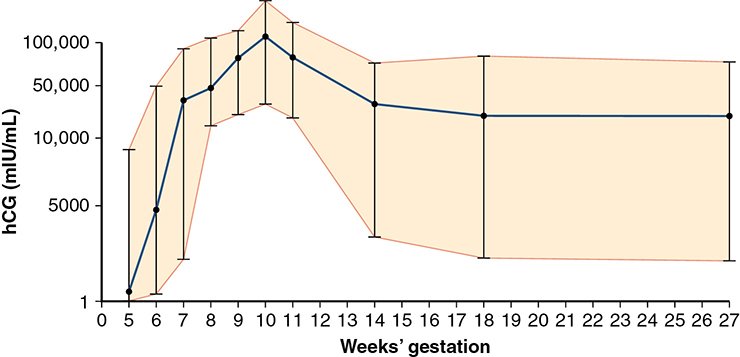
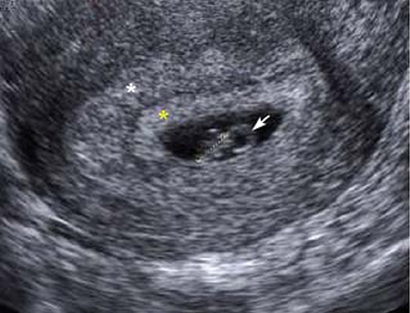
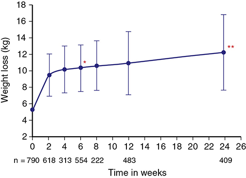
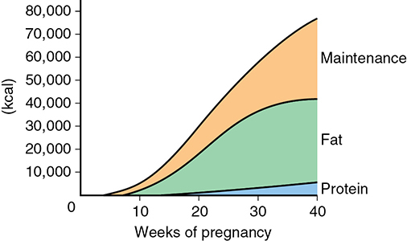

# Chapter 10: Prenatal Care — Revision Notes

> Williams Obstetrics 26e, pp. 461–514 of the PDF. High-yield numbers are in **bold**.
> The seven tables are transcribed from the PDF images (they are missing from the extracted chapter text). All 4 figures are included from the PDF.

**Big picture:** Prenatal care = coordinated medical care + continuous risk assessment + psychosocial support, ideally starting before pregnancy and extending through the postpartum and interpregnancy period. No prenatal care carries a **5-fold** higher risk of maternal death.

---

## 1. Prenatal Care in the United States

- Only **1.6%** of US women giving birth (2016) had **no prenatal care**.
  - Inadequate or no care: **10% African-American**, **7.7% Hispanic**; higher in adolescents, especially **<15 years**.

### Prenatal care effectiveness
- Maternal deaths fell from **690/100,000 (1920) to 50/100,000 (1955)**, helped by prenatal care.
- **No prenatal care → 5-fold ↑ maternal death** (1998–2005 surveillance).
- In ~29 million births, preterm birth, stillbirth, neonatal and infant death rose **linearly with ↓ prenatal care use**.
- Parkland: preterm births fell with any prenatal care use by indigent women. In diabetics, adherence → fewer NICU admissions.
- **Group prenatal care** is acceptable and effective, with **better outcomes** than individual care (Ickovics, 2016). **Childbirth education classes** also improve outcomes.

---

## 2. Diagnosis of Pregnancy

### Symptoms and signs
- **Amenorrhea** is not a reliable sign until **≥10 days after expected menses**.
- Bleeding in the 1st month may be **implantation bleeding**, but any 1st-trimester bleeding should prompt evaluation for an abnormal pregnancy.
- **Quickening (fetal movement felt):**
  - Multipara: **16–18 weeks**
  - Primigravida: about **2 weeks later**
  - An examiner can feel movements at about **20 weeks**.

### Pregnancy tests (hCG)
- Made by **syncytiotrophoblast**; rises exponentially in the 1st trimester.
- hCG and LH share the **same receptor**. Main function: **maintains the corpus luteum**, the principal progesterone source for the first **6 weeks**.
- Detectable in serum/urine **8–9 days after ovulation**.
- **Doubling time 1.4–2.0 days.** Lower levels rise faster than higher ones.
- **Peak at 60–70 days**, then falls slowly to a **plateau at ~16 weeks**.
- **Structure:** glycoprotein heterodimer. The **α-subunit is identical to LH, FSH and TSH**; the **β-subunit is distinct** → assays use β-specific antibodies. Serum detection limit **≤1.0 mIU/mL**.

*Figure 10-1. Serum hCG across normal pregnancy (mean, 95% CI): steep rise, peak ~100,000 mIU/mL at ~10 wk, then plateau from ~16 wk; the normal range is very wide.*

**False-positive hCG (rare)**
- **Heterophilic antibodies** (most common): bind the animal-derived test antibodies; more likely in women who **work with animals** → use alternative lab methods.
- Molar pregnancy and gestational trophoblastic neoplasia (raised hCG).
- Other causes without pregnancy:
  1. **Exogenous hCG** (weight-loss injections)
  2. **Renal failure** (↓ clearance)
  3. **Physiological pituitary hCG**
  4. **hCG-producing tumors**: GI tract, ovary, bladder, lung

**Home pregnancy tests**
- >60 kits in the US; many are **less accurate than advertised**.
- Diagnosing **95%** of pregnancies at the missed period needs a detection limit of **12.5 mIU/mL**; only 1 brand achieved this.
- At 100 mIU/mL only **44%** of brands were clearly positive → only **~15%** of pregnancies detected at the missed period.

### Sonographic recognition
- **Transvaginal sonography** establishes gestational age and location.
- **Gestational sac** is the first sign: seen at **4–5 weeks**.
- **Pseudosac** (fluid in the cavity with ectopic pregnancy) sits in the **midline**; a true sac implants **eccentrically**.
- Early IUP signs:
  - **Intradecidual sign:** anechoic center with a **single echogenic rim**
  - **Double decidual sign:** **two concentric echogenic rings** (decidua parietalis + decidua capsularis)
- **Yolk sac** within the sac **confirms an intrauterine pregnancy**; seen by the **middle of week 5**.
- **Embryo** with **cardiac motion** next to the yolk sac after **6 weeks**.
- Equivocal findings = **pregnancy of unknown location (PUL)** → serial hCG + TVS.

*Figure 10-2. Early IUP on TVS: double decidual sign (white asterisk = decidua parietalis, yellow = decidua capsularis), yolk sac (arrow), embryo CRL between calipers.*

---

## 3. Initial Prenatal Evaluation

- Goals:
  1. Define the **health status** of mother and fetus
  2. Estimate **gestational age**
  3. Plan continued obstetrical care

### Table 10-1. Typical Components of Routine Prenatal Care

| | Text Referral | First Visit | 15–20 wk | 24–28 wk | 29–41 wk |
|---|---|---|---|---|---|
| **History** | | | | | |
| Complete | Chap. 10, p. 179 | ● | | | |
| Updated | | | ● | ● | ● |
| **Physical Examination** | | | | | |
| Complete | Chap. 10, p. 180 | ● | | | |
| Blood pressure | Chap. 40, p. 688 | ● | ● | ● | ● |
| Maternal weight | Chap. 10, p. 181 | ● | ● | ● | ● |
| Pelvic/cervical examination | Chap. 10, p. 180 | ● | | | |
| Fundal height | Chap. 10, p. 180 | ● | ● | ● | ● |
| Fetal heart rate/fetal position | Chap. 10, p. 182 | ● | ● | ● | ● |
| **Laboratory Tests** | | | | | |
| Hematocrit or hemoglobin | Chap. 59, p. 1048 | ● | | ● | |
| Blood type and Rh factor | Chap. 18, p. 353 | ● | | | |
| Antibody screen | Chap. 18, p. 353 | ● | | A | |
| Pap smear screening | Chap. 66, p. 1164 | ● | | | |
| Glucose tolerance test | Chap. 60, p. 1079 | | | ● | |
| Fetal aneuploidy screening | Chap. 17, p. 335 | Bᵃ and/or | B | | |
| Neural-tube defect screening | Chap. 17, p. 338 | | B | | |
| Cystic fibrosis screening | Chap. 17, p. 342 | B or | B | | |
| Urine protein assessment | Chap. 4, p. 68 | ● | | | |
| Urine culture | Chap. 56, p. 996 | ● | | | |
| Rubella serology | Chap. 67, p. 1190 | ● | | | |
| Syphilis serology | Chap. 68, p. 1208 | ● | | | C |
| Gonococcal screening | Chap. 68, p. 1211 | D | | | D |
| Chlamydial screening | Chap. 68, p. 1212 | ● | | | C |
| Hepatitis B serology | Chap. 58, p. 1037 | ● | | | D |
| HIV serology | Chap. 68, p. 1219 | B | | | D |
| Group B streptococcus culture | Chap. 67, p. 1195 | | | | E |
| Tuberculosis screening | Chap. 54, p. 966 | F | | | |

*ᵃFirst-trimester aneuploidy screening may be offered between 10 and 14 weeks. **A** Performed at 28 weeks, if indicated. **B** Test should be offered. **C** High-risk women should be retested at the beginning of the third trimester. **D** High-risk women should be screened at the first prenatal visit and again in the third trimester. **E** Rectovaginal culture should be obtained between 35 and 37 weeks. **F** High-risk women should be screened at the first prenatal visit. HIV = human immunodeficiency virus.*

### Definitions (prenatal record)
| Term | Definition |
|---|---|
| **Nulligravida** | Not pregnant now and **never** pregnant |
| **Gravida** | Pregnant now or in the past, whatever the outcome (primigravida → multigravida) |
| **Nullipara** | Never completed a pregnancy **beyond 20 weeks** (may have had abortions or an ectopic) |
| **Primipara** | Delivered **once** of fetus(es), alive or dead, at **≥20 weeks** |
| **Multipara** | **Two or more** pregnancies reaching **≥20 weeks** |

- Parity counts **pregnancies** reaching 20 wk: **twins do not raise it**, and **stillbirth does not lower it**.
- The old **500-g** threshold for parity is now controversial (neonates <500 g now survive).
- **Four-digit notation (T-P-A-L):** term – preterm – abortuses (<20 wk) – living. E.g. **para 2–1–0–3** = 2 term, 1 preterm, 0 abortuses, 3 living children.

> **Memory hook:** "**T**exas **P**ower **A**nd **L**ight" = Term, Preterm, Abortions, Living.

### Pregnancy duration and dating
- **~280 days (40 weeks)** from the first day of the LMP.
- **Naegele rule:** LMP **+7 days −3 months**. E.g. LMP Oct 5 → EDD **July 12**.
- **First-trimester ultrasound is the most accurate** way to establish or confirm gestational age (ACOG, AIUM, SMFM). ART pregnancies are dated by **embryo age / transfer date**.
- **Trimesters:** 1st through **14 wk**, 2nd through **28 wk**, 3rd through **42 wk** (three periods of 14 weeks). **"Fourth trimester" = the 12 weeks after delivery.**
- Clinically, use **completed weeks + days** (e.g. 33⁴⁄₇ wk or 33 + 4), not trimesters ("third-trimester bleeding" is imprecise).

### Previous and current health status
- Many obstetrical complications **recur** → detailed prior-pregnancy history.
- Menstrual history (irregular menses → dating less accurate) and contraception (some methods favor **ectopic** implantation after failure).

**Psychosocial screening**
- Screen **all** women, **at least once per trimester**: barriers to care, communication, nutrition, unstable housing, desire for pregnancy, safety/**IPV**, depression, stress, tobacco/alcohol/drugs.
- Universal screening → fewer **preterm and low-birthweight** newborns.

**Cigarette smoking**
- Prevalence in pregnancy: **12–13%** (2000–2010) → **7.2% (2016)**.
- **E-cigarettes/vaping**: 0.6–15%; 7% used them before conception and postpartum, 1.4% in the last 3 months of pregnancy.
- Smoking → subfertility, miscarriage, stillbirth, low birthweight, preterm delivery. **Previa, abruption and PROM ↑ 2-fold.**
- USPSTF: offer counseling and intervention at the **first and every** prenatal visit. Quitting at **any** stage helps, best early or preconceptionally.
- **Person-to-person psychosocial interventions** beat simple advice → the **5 A's** (≤15 minutes).

### Table 10-2. Five A's of Smoking Cessation

| Step | Action |
|---|---|
| **ASK** | about smoking at the first and subsequent prenatal visits. |
| **ADVISE** | with clear, strong statements that explain the risks of continued smoking to the woman, fetus, and newborn. |
| **ASSESS** | the patient's willingness to attempt cessation. |
| **ASSIST** | with pregnancy-specific, self-help smoking cessation materials. Offer a direct referral to the smokers' quit line (1-800-QUIT NOW) to provide ongoing counseling and support. |
| **ARRANGE** | to track smoking abstinence progress at subsequent visits. |

*Adapted from American College of Obstetricians and Gynecologists, 2020b; Fiore, 2008.*

- **Nicotine replacement:** not adequately evaluated for safety or efficacy in pregnancy; trials conflicting (**SNAP**: possible better infant development; **SNIPP**: no difference in quit rates or birthweight). Bupropion: similar preliminary results. **Financial incentives** help.
- ACOG: if NRT is used, do so **under close supervision** after weighing smoking vs NRT risks.

**Alcohol**
- Potent teratogen → **fetal alcohol spectrum disorders**. **Fetal alcohol syndrome** = **growth restriction + facial abnormalities + CNS dysfunction**. Prevalence of FASD **11–50 per 1000**.
- **Abstain completely** when pregnant or planning pregnancy. **12%** of pregnant women drink (2015–2017).

**Illicit drugs**
- **~10%** of fetuses are exposed. Sequelae of chronic heavy use: **FGR, low birthweight, neonatal withdrawal**. Marijuana effects less convincing.
- **Heroin → methadone maintenance** in a registered program: start **10–30 mg orally daily**, titrate. Careful taper may suit some. **Buprenorphine ± naloxone** by credentialed physicians.

**Intimate-partner violence**
- Assault and coercion: physical, psychological, sexual, isolation, stalking, deprivation, intimidation, **reproductive coercion**.
- **Prevalence in pregnancy 4–8%**: more common than any condition found by routine screening **except possibly preeclampsia**.
- Linked to **preterm delivery, FGR, perinatal death**.
- **Screen at the first visit, at least once per trimester, and postpartum**, privately (self-administered or computerized screens work as well).
- Know state reporting laws; involve social services; National Domestic Violence Hotline **1-800-799-SAFE (7233)**.

### Clinical evaluation
- Full physical and pelvic exam at the first visit.
- **Cervix:** bluish-red passive hyperemia (characteristic, not diagnostic); **nabothian cysts** may be prominent; normally closed except at the external os.
- **Pap test** per guidelines; chlamydia/gonorrhea specimens when indicated.
- **Bimanual exam:** cervical consistency, length, dilation; uterine and adnexal size; **bony pelvis**; vaginal/perineal anomalies. Rectal exam only for symptoms.

**Gestational age by uterine size**

| Uterine size | Gestation |
|---|---|
| Small orange | **~6 weeks** |
| Large orange | **~8 weeks** |
| Grapefruit | **~12 weeks** |

### Laboratory tests
- **Initial bloods:** CBC, **blood type + Rh**, **antibody screen**.
- **Universal HIV testing** (opt-out: the woman may decline; record it).
- **All women:** hepatitis B, syphilis, **rubella immunity**.
- **Urine culture** recommended (treating bacteriuria ↓ symptomatic UTI). Routine urinalysis after the first visit is **unnecessary without hypertension**.

**Cervical infections**
- **Chlamydia:** isolated in **2–13%** of pregnant women.
  - **Screen all** at the first visit; retest in the **3rd trimester** if at risk.
  - Risk factors: unmarried, new or multiple partners, **age <25**, inner-city residence, other STDs, little or no prenatal care.
  - **Test of cure 3–4 weeks** after treatment.
- **Gonorrhea:** cervicitis/urethritis; rarely septic arthritis.
  - Screen women **with risk factors or in high-prevalence areas** at the first visit and again in the 3rd trimester.
  - Treat for gonorrhea **plus presumed chlamydia**; test of cure afterward.

### Pregnancy risk assessment
- "High-risk pregnancy" is too vague; use a **specific diagnosis** where possible.

### Table 10-3. Conditions for Which Maternal-Fetal Medicine Consultation May Be Beneficial

**Medical History and Conditions**
- Cardiac disease—moderate to severe disorders
- Diabetes mellitus with evidence of end-organ damage or uncontrolled hyperglycemia
- Family or personal history of genetic abnormalities
- Hemoglobinopathy
- Chronic hypertension if uncontrolled or associated with renal or cardiac disease
- Renal insufficiency if associated with significant proteinuria (**≥500 mg/24 hour**), serum creatinine **≥1.5 mg/dL**, or hypertension
- Pulmonary disease if severe restrictive or obstructive, including severe asthma
- Human immunodeficiency virus infection
- Prior pulmonary embolus or deep-vein thrombosis
- Severe systemic disease, including autoimmune conditions
- Bariatric surgery
- Epilepsy if poorly controlled or requires more than one anticonvulsant
- Cancer, especially if treatment is indicated in pregnancy

**Obstetrical History and Conditions**
- CDE (Rh) or other blood group alloimmunization (excluding ABO, Lewis)
- Prior or current fetal structural or chromosomal abnormality
- Desire or need for prenatal diagnosis or fetal therapy
- Periconceptional exposure to known teratogens
- Infection with or exposure to organisms that cause congenital infection
- Higher-order multifetal gestation
- Severe disorders of amnionic fluid volume

---

## 4. Subsequent Prenatal Visits

- **Traditional schedule:** every **4 weeks until 28 wk** → every **2 weeks until 36 wk** → **weekly** thereafter.
- Complicated pregnancies (twins, diabetes) → every **1–2 weeks**.
- 2005 expert panel: patient-specific risk assessment, **flexible visit spacing**, health promotion, standardized records, and family health up to **1 year after birth**.
- **WHO trial (~25,000 women):** low-risk women (**80%**) seen once in the 1st trimester and then at **26, 32 and 38 weeks** → median **5 visits vs 8**, with **no disadvantage**.

### Prenatal surveillance
- Each visit: fetal heart rate, growth, activity; maternal **BP and weight**; ask about pain, nausea/vomiting, bleeding, **fluid leakage**, headache, visual change, dysuria.
- Late pregnancy vaginal exam: presenting part and station, pelvic capacity, ballottement (fluid volume), cervical consistency, effacement and dilation.

**Fundal height**
- **20–34 weeks: fundal height (cm) ≈ gestational age (wk).**
- Measure from the **top of the symphysis to the top of the fundus**, with an **empty bladder**.
- Less accurate with obesity or leiomyomas. **FGR is missed in up to ⅓** if fundal height is used alone.

**Fetal heart sounds**
- **Doppler: almost always audible by 10 weeks** (without maternal obesity).
- **FHR 110–160 bpm**, heard as a double sound.
- **Nonamplified stethoscope:** audible by **20 wk in 80%**, and by **22 wk in all**.

| Sound | Character | Synchronous with | Source |
|---|---|---|---|
| **Funic souffle** | Sharp, whistling | **Fetal** pulse | Blood rushing through **umbilical arteries** |
| **Uterine souffle** | Soft, blowing | **Maternal** pulse | Dilated **uterine vessels**, heard best low on the uterus |

**Sonography**
- Offer **at least one** prenatal ultrasound to all women. Low-risk pregnancies average **4–5** scans.
- Only for valid indications, at the lowest exposure = **ALARA** (as low as reasonably achievable).

### Subsequent laboratory tests
- **Hb/Hct** (± syphilis serology where prevalent) repeated at **28–32 weeks**.
- **HIV:** retest high-risk women in the 3rd trimester, **preferably before 36 weeks**. **HBV:** high-risk women retested at delivery.
- **D (Rh)-negative, unsensitized:** repeat antibody screen at **28–29 weeks** → give **anti-D immunoglobulin** if still unsensitized.
- **GBS:** **vaginal + rectal culture at 35–37 weeks** in all women; intrapartum prophylaxis if positive.
  - **Empirical intrapartum prophylaxis** (no culture needed): **GBS bacteriuria**, **preterm labor**, **previous infant with invasive GBS disease**.
- **Gestational diabetes:** screen **all** women (history, clinical factors or labs). Lab testing at **24–28 weeks** is most sensitive.
- **Aneuploidy screening** offered to all: 1st trimester **10–14 wk**, 2nd trimester **15–20 wk**, or **cell-free DNA any time after 10 wk**.
- **Cystic fibrosis and spinal muscular atrophy carrier screening** offered to **all** women considering or in pregnancy. Consider **panethnic/expanded** screening; ethnicity-based screening (e.g. Tay-Sachs in Ashkenazi Jews) remains an option. All genetic screening is **optional**, ideally before pregnancy.
- **NTD screening:** traditionally **MSAFP** in the 2nd trimester → now largely replaced by the **2nd-trimester anatomy scan**.

---

## 5. Nutritional Counseling

### Weight gain recommendations
- **IOM 2009**: gain is stratified by **prepregnancy BMI**, and applies to all ages, races and ethnic groups.

### Table 10-4. Recommendations for Total and Rate of Weight Gain During Pregnancy

| Category (BMI) | Total Weight Gain Range (lb)ᵃ | Weight Gain in 2nd and 3rd Trimesters, Mean in lb/wk (range) |
|---|---|---|
| Underweight (<18.5) | **28–40** | 1 (1–1.3) |
| Normal weight (18.5–24.9) | **25–35** | 1 (0.8–1) |
| Overweight (25.0–29.9) | **15–25** | 0.6 (0.5–0.7) |
| Obese (≥30.0) | **11–20** | 0.5 (0.4–0.6) |

*ᵃEmpirical recommendations for weight gain in twin pregnancies include: normal BMI, 37–54 lb; overweight women, 31–50 lb; and obese women, 25–42 lb. BMI = body mass index. Modified from the Centers for Disease Control and Prevention, 2019b; Institute of Medicine and National Research Council, 2009.*

- The emphasis has shifted from low birthweight to **obesity**; the narrow range for obese women reflects interest in **lower** gains.
- Obesity → gestational hypertension, preeclampsia, GDM, **macrosomia**, cesarean. Risk ∝ weight gain.
- MFMU cohort (>29,000): **51% gained above** and **21% below** guidelines; excess gain → more hypertension and cesarean (worse with chronic hypertension).
- Normal-BMI women gaining **<25 lb**: less preeclampsia, failed induction, CPD, cesarean and LGA, but **more SGA**.

### Severe undernutrition
- Experimental deficiency is unethical; famine data suggest **near starvation** is needed to clearly change outcome in otherwise healthy women (Ch 47).

### Weight retention after pregnancy
- Average gain **12.9 kg (28.6 lb)** (795 women).
- Lost at **delivery ~5.4 kg (12 lb)**; next **2 weeks ~4 kg (9 lb)**; **2 wk–6 mo another 2.5 kg (5.5 lb)**.
- **Average retained: ~1 kg (2.1 lb).**
- Excess gain is laid down as **fat** and may be retained long term. More gain → more loss. **Longer breastfeeding → less retention.**

*Figure 10-3. Cumulative postpartum weight loss: ~5 kg at delivery, ~9.5 kg by 2 wk, ~12 kg by 6 months; on average 1 kg is retained.*

### Table 10-5. Recommended Daily Dietary Allowances for Pregnant and Lactating Women

| Nutrient | Pregnant | Lactating |
|---|---|---|
| **Fat-Soluble Vitamins** | | |
| Vitamin A | 770 µg | 1300 µg |
| Vitamin Dᵃ | **15 µg** | 15 µg |
| Vitamin E | 15 mg | 19 mg |
| Vitamin Kᵃ | 90 µg | 90 µg |
| **Water-Soluble Vitamins** | | |
| Vitamin C | 85 mg | 120 mg |
| Thiamin | 1.4 mg | 1.4 mg |
| Riboflavin | 1.4 mg | 1.6 mg |
| Niacin | 18 mg | 17 mg |
| Vitamin B₆ | 1.9 mg | 2 mg |
| Folate | **600 µg** | 500 µg |
| Vitamin B₁₂ | 2.6 µg | 2.8 µg |
| **Minerals** | | |
| Calciumᵃ | 1000 mg | 1000 mg |
| Sodiumᵃ | 1.5 g | 1.5 g |
| Potassiumᵃ | 4.7 g | 5.1 g |
| Iron | **27 mg** | 9 mg |
| Zinc | 11 mg | 12 mg |
| Iodine | **220 µg** | 290 µg |
| Selenium | 60 µg | 70 µg |
| **Other** | | |
| Protein | **71 g** | 71 g |
| Carbohydrate | 175 g | 210 g |
| Fiberᵃ | 28 g | 29 g |

*ᵃRecommendations measured as adequate intake. Modified from the American Academy of Pediatrics, 2017; Institute of Medicine, 2006, 2011. Note: the text gives zinc intake as "approximately 12 mg" in pregnancy; the table lists 11 mg (12 mg is the lactation value).*

- Excess self-prescribed supplements risk toxicity: **iron, zinc, selenium, vitamins A, B6, C and D**.

### Calories
- Pregnancy needs **~80,000 kcal** extra, mostly in the **last 20 weeks**.
- AAP/ACOG: **+100–300 kcal/d**. IOM: **+0 / 340 / 452 kcal/d** in the 1st / 2nd / 3rd trimesters.
- **≥1000 kcal/d extra → fat accrual.**
- Inadequate calories → protein is burned instead of spared for fetal growth. Extra needs may be offset by ↓ physical activity.

*Figure 10-4. Cumulative kcal cost of pregnancy (~77,000–80,000 kcal by 40 wk): maintenance and fat make up most of it; protein is a small share; most accrues after 20 wk.*

### Protein
- **~1000 g** deposited in the second half (**5–6 g/d**) → intake **~1 g/kg/d** (may need doubling late in gestation).
- Most plasma amino acids **fall** (ornithine, glycine, taurine, proline); **glutamic acid and alanine rise**.
- Best from **animal sources**; milk and dairy are nearly ideal (protein + calcium).

### Minerals
- Adequate-calorie diets supply enough minerals **except iron and iodine**.
- **Iron:**
  - ~300 mg to fetus + placenta, 500 mg to maternal Hb mass, nearly all **after midpregnancy** → **~7 mg/d**.
  - Supplement **≥27 mg elemental iron daily** (in most prenatal vitamins). **30 mg/d** (ferrous gluconate, sulfate or fumarate) in the second half meets pregnancy **and lactation** needs.
  - Labels: mg of compound followed by **mg of elemental iron in parentheses**.
  - **60–100 mg/d** if: **obese, multifetal, late start, irregular intake, or low Hb**.
  - Overt iron deficiency responds well to oral iron; **ferritin rises more than Hb**.
- **Iodine:** **220 µg/d**; iodized salt and bread. Intake has ↓ over 15 years. Severe deficiency → **endemic cretinism**; very early supplementation prevents some cases.
- **Calcium:** ~**30 g** retained, mostly to the fetus late; only **~2.5%** of maternal calcium. **Routine calcium does not prevent preeclampsia.**
- **Zinc:** ~**12 mg/d**; severe deficiency → poor appetite, poor growth, impaired healing. Supplement only zinc-deficient women in poor-resource countries. Vegetarians have lower intake.
- **Magnesium:** deficiency not a feature of pregnancy (seen after **intestinal bypass**). Supplementation (365 mg, 13–24 wk) did **not** improve outcomes.
- **Selenium:** deficiency → often fatal **cardiomyopathy**; toxicity from oversupplementation; not needed in US women.
- **Potassium:** plasma ↓ **~0.5 mEq/L** by midpregnancy; deficiency e.g. with **hyperemesis**.
- **Fluoride:** no added benefit from maternal fluoride if the newborn gets fluoridated water; not transferred into breast milk.

### Vitamins
- A diet adequate in calories and protein supplies most vitamins, **except folic acid** in times of unusual need (**protracted vomiting, hemolytic anemia, multiple fetuses**).
- Multivitamins in poor countries ↓ LBW and FGR but not preterm delivery or perinatal mortality.

**Folic acid**
- Fortification (1998) cut NTD-affected pregnancies from **~4000 → ~3000/year**.
- **400 µg/d periconceptionally** could prevent **more than half** of NTDs. Fortification (140 µg/100 g grain) adds only ~100 µg/d, so **supplements are still needed**.
- **Prior child with NTD:** recurrence **2–5%** → **4 mg/d** from the **month before conception through the 1st trimester** cuts it by **>70%**. Take as a **separate folic acid supplement, not extra multivitamins** (avoids excess fat-soluble vitamins).

**Other vitamins**
- **Vitamin A:** **>10,000 IU/d** is teratogenic (like **isotretinoin**). **β-carotene** does not cause toxicity. US intake adequate → no routine supplement. Deficiency (developing world) → **night blindness**, maternal anemia, spontaneous preterm birth.
- **Vitamin B12:** plasma ↓ in pregnancy (↓ transcobalamins). Only in animal foods → **strict vegetarians'** infants have low stores, worse with breastfeeding. Excess **vitamin C** → functional B12 deficiency. B12 deficiency may be an independent NTD risk factor.
- **Vitamin B6 (pyridoxine):** not routinely needed; **2 mg/d** if nutrition is poor. With **doxylamine** for nausea and vomiting.
- **Vitamin C:** **80–85 mg/d** (~20% above nonpregnant); diet suffices. Maternal levels ↓, cord levels higher (true of most water-soluble vitamins).
- **Vitamin D:** deficiency common (limited sun, vegetarians, **darker skin**) → congenital rickets, neonatal fractures. **Adequate intake 15 µg/d (600 IU/d).** Measure **25-hydroxyvitamin D** if deficiency suspected (optimal level unknown). Supplementation in asthmatic mothers may ↓ childhood asthma.

### Pragmatic nutritional surveillance
1. Eat what she wants in reasonable amounts, **salted to taste**
2. Ensure food is available to deprived women
3. Monitor weight gain against **IOM** goals
4. Periodic **dietary recall** to catch errant diets
5. **≥30 mg elemental iron daily**; **folate** before and early in pregnancy; **iodine** where deficient
6. Recheck **Hct/Hb at 28–32 weeks**

---

## 6. Common Concerns

### Employment
- **Family and Medical Leave Act (1993):** up to **12 weeks unpaid leave**.
- Uncomplicated pregnancy → can usually work **until labor**.
- **Preterm birth risk slightly ↑** with standing/walking **>3 h/day**, lifting **>5 kg**, or physical exertion. Working nulliparas had a **5-fold ↑ preeclampsia** (Higgins, 2002). Avoid severe physical strain and undue fatigue.

### Exercise
- Generally **no need to limit** exercise, if not excessively fatigued and no injury risk. Some studies show larger placentas and birthweights; working women who exercised had smaller neonates and more dysfunctional labor (Magann).
- **ACOG: ≥150 minutes/week of moderate-intensity activity** (after clinical evaluation, if no contraindication). Uterine artery Doppler is not affected.
- **Safe:** walking, running, swimming, stationary cycling, low-impact aerobics.
- **Avoid:** high risk of **falls or abdominal trauma**; **scuba diving** (fetal decompression sickness).
- Rest may benefit: hypertensive disorders, preterm labor, **placenta previa**, severe cardiac/pulmonary disease, **multiples, FGR**.

### Table 10-6. Some Contraindications to Exercise During Pregnancy

| Category | Examples |
|---|---|
| Significant cardiovascular or pulmonary disease | Chest pain, calf pain or swelling |
| Significant risk for preterm labor | Cerclage, multifetal gestation, significant bleeding, threatened preterm labor, ruptured membranes |
| Obstetrical complications | Preeclampsia, placenta previa, anemia, poorly controlled diabetes or epilepsy, morbid obesity, fetal-growth restriction |

*Summarized from American College of Obstetricians and Gynecologists, 2017g; The American Academy of Pediatrics, 2017.*

### Seafood consumption
- Fish = protein, low saturated fat, **omega-3 fatty acids**.
- **Eat 8–12 oz of fish weekly**, but **≤6 oz albacore ("white") tuna**.
- **Avoid high-mercury fish: shark, swordfish, king mackerel, tile fish.**
- Local fish with unknown mercury → **≤6 oz/week total**.
- No raw/undercooked fish (**listeriosis**).

### Lead screening
- Lead → gestational hypertension, miscarriage, LBW, neurodevelopmental impairment.
- Test **only if a risk factor** is present. **>5 µg/dL** → find and remove source, repeat levels. **>45 µg/dL** = lead poisoning → consider **chelation**, with expert consultation.

### Automobile and air travel
- **Three-point restraint**: lap belt **under the abdomen across the upper thighs**, shoulder belt **between the breasts**. **Do not disable airbags.**
- **Air travel is safe up to 36 weeks** if uncomplicated. Keep seatbelt on; **support stockings, leg movement, hourly ambulation** to ↓ VTE. Main risks: infection and distance from care.

### Coitus
- Usually **not harmful**. **Avoid** with threatened **miscarriage, placenta previa or preterm labor**.
- By 36 wk, **72%** have intercourse <1×/week. Late-pregnancy intercourse does **not** trigger labor (no ↑, even ↓ delivery within 2 weeks).
- ⚠️ **Air blown into the vagina during cunnilingus → fatal air embolism** has been reported.

### Dental care
- Periodontal disease is **linked to preterm labor**, but treating it does **not** prevent preterm birth.
- Caries are not aggravated by pregnancy. **Dental treatment and dental radiographs are not contraindicated.**

### Immunization
- **Thimerosal**–neuropsychological disorder link is **groundless**.
- **Influenza and Tdap are recommended for ALL pregnant women.**
- Rubella-susceptible women → **MMR postpartum** (contraindicated in pregnancy).

### Table 10-7. Recommendations for Immunization During Pregnancy and Postpartum

| Immunobiological Agent | Indications for Immunization During Pregnancy | Dose Schedule | Comments |
|---|---|---|---|
| **Live Attenuated Virus Vaccines** | | | |
| Measles | Contraindicated—see immune globulins | Single dose SC, preferably as MMRᵃ | Vaccinate susceptible women postpartum; breastfeeding is not a contraindication |
| Mumps | Contraindicated | Single dose SC, preferably as MMR | Vaccinate susceptible women postpartum |
| Rubella | Contraindicated, but congenital rubella syndrome has never been described after vaccine | Single dose SC, preferably as MMR | Teratogenicity of vaccine is theoretical and not confirmed to date; vaccinate susceptible women postpartum |

| Immunobiological Agent | Indications for Immunization During Pregnancy | Dose Schedule | Comments |
|---|---|---|---|
| Poliomyelitis (oral = live attenuated; injection = enhanced-potency inactivated virus) | Not routinely recommended for women in the United States, except women at increased risk of exposureᵇ | Primary: Two doses of enhanced-potency inactivated virus SC at 4- to 8-week intervals and a 3rd dose 6–12 months after 2nd dose. Immediate protection: One dose oral polio vaccine (in outbreak setting) | Vaccine indicated for susceptible women traveling in endemic areas or in other high-risk situations |
| Yellow fever | Travel to high-risk areas | Single dose SC | Limited theoretical risk outweighed by risk of yellow fever |
| Varicella | Contraindicated, but no adverse outcomes reported in pregnancy | Two doses needed: 2nd dose given 4–8 weeks after 1st dose | Teratogenicity of vaccine is theoretical; vaccination of susceptible women should be considered postpartum |
| Zoster | Contraindicated | Single dose | Teratogenicity is theoretical |

| Immunobiological Agent | Indications for Immunization During Pregnancy | Dose Schedule | Comments |
|---|---|---|---|
| Smallpox (vaccinia) | Contraindicated in pregnant women and in their household contacts | One dose SC, multiple pricks with lancet | **Only vaccine known to cause fetal harm** |
| **Other** | | | |
| Influenza | **All pregnant women, regardless of trimester during flu season (October–May)** | One dose IM every year | Inactivated or recombinant virus vaccine |
| Rabies | Indications for prophylaxis not altered by pregnancy; each case considered individually | Public health authorities to be consulted for indications, dosage, and route of administration | Killed-virus vaccine |

| Immunobiological Agent | Indications for Immunization During Pregnancy | Dose Schedule | Comments |
|---|---|---|---|
| Human papillomavirus | Not recommended | Three-dose series IM at 0, 1, and 6 months | Nonavalent vaccine is inactivated virus; no teratogenic effects have been observed |
| Hepatitis B | Preexposure and postexposure for women at risk of infection, e.g., chronic liver or kidney disease | Three-dose series IM at 0, 1, and 6 months | Used with hepatitis B immune globulin for some exposures; exposed newborn needs birth-dose vaccination and immune globulin as soon as possible; all infants should receive birth dose of vaccine |
| Hepatitis A | Preexposure and postexposure if at risk (international travel); chronic liver disease | Two-dose schedule IM, 6 months apart | Inactivated virus |
| **Inactivated Bacterial Vaccines** | | | |

| Immunobiological Agent | Indications for Immunization During Pregnancy | Dose Schedule | Comments |
|---|---|---|---|
| Pneumococcus | (1) For chronic metabolic, liver, cardiac, or lung ds. (2) For immunosuppression, general malignancy, chronic renal disease, or asplenia | One lifetime dose: (1) One dose PPSV23; (2) One dose PCV13 with PPSV23 given 8 weeks later | Indications not altered by pregnancy. Polyvalent polysaccharide vaccine; safety in the first trimester has not been evaluated |
| Meningococcus | Indications not altered by pregnancy; vaccination recommended in unusual outbreaks | One dose MenACWY or MPSV4; tetravalent vaccine; two doses for asplenia | Antimicrobial prophylaxis if significant exposure |
| Typhoid | Not recommended routinely except for close, continued exposure or travel to endemic areas | Killed. Primary: 2 injections IM 4 weeks apart. Booster: One dose; schedule not yet determined | Killed, injectable vaccine or live attenuated oral vaccine; oral vaccine preferred |
| Anthrax | See text | Six-dose primary vaccination, then annual booster vaccination | Preparation from cell-free filtrate of *B anthracis*; no dead or live bacteria; teratogenicity of vaccine theoretical |

| Immunobiological Agent | Indications for Immunization During Pregnancy | Dose Schedule | Comments |
|---|---|---|---|
| **Toxoids** | | | |
| Tetanus-diphtheria-acellular pertussis (Tdap) | **Recommended in every pregnancy, preferably between 27 and 36 weeks to maximize passive antibody transfer** | Primary: Two doses IM at 1–2 month interval with 3rd dose 6–12 months after the 2nd. Booster: Single dose IM every 10 years, as a part of wound care if ≥5 years since last dose, or once per pregnancy | Combined tetanus-diphtheria toxoids with acellular pertussis (Tdap) preferred; updating immune status should be part of antepartum care |
| **Specific Immune Globulins** | | | |
| Hepatitis B | Postexposure prophylaxis | Depends on exposure | Usually given with hepatitis B virus vaccine; exposed newborn needs immediate prophylaxis |

| Immunobiological Agent | Indications for Immunization During Pregnancy | Dose Schedule | Comments |
|---|---|---|---|
| Rabies | Postexposure prophylaxis | Half dose at injury site, half dose in deltoid | Used in conjunction with rabies killed-virus vaccine |
| Tetanus | Postexposure prophylaxis | One dose IM | Used in conjunction with tetanus toxoid |
| Varicella | Should be considered for exposed pregnant women to protect against maternal, not congenital, infection | **One dose IM within 96 hours of exposure** | Indicated also for newborns or women who developed varicella within 4 days before delivery or 2 days following delivery |
| **Standard Immune Globulins** | | | |

| Immunobiological Agent | Indications for Immunization During Pregnancy | Dose Schedule | Comments |
|---|---|---|---|
| Hepatitis A (hepatitis A virus vaccine should be used with hepatitis A immune globulin) | Postexposure prophylaxis and those at high risk | 0.02 mL/kg IM in one dose | Immune globulin should be given as soon as possible and within 2 weeks of exposure; infants born to women who are incubating the virus or are acutely ill at delivery should receive one dose of 0.5 mL as soon as possible after birth |

*ᵃTwo doses necessary for students entering institutions of higher education, newly hired medical personnel, and travel abroad. ᵇInactivated polio vaccine recommended for nonimmunized adults at increased risk. Ds. = disease; ID = intradermally; IM = intramuscularly; MMR = measles, mumps, rubella; PO = orally; SC = subcutaneously. From ACOG 2018o; CDC 2011; Kim, 2016; Munoz, 2019.*

### Caffeine
- **~500 mg/d (about 5 cups)** slightly ↑ miscarriage; **<200 mg/d** ("moderate") shows no ↑.
- Preterm birth and fetal growth: unclear. CARE study: **>200 mg/d → 1.4-fold FGR** vs <100 mg/d.
- **ACOG: <200 mg/d is not associated with miscarriage or preterm birth**; the FGR link is unsettled.

### Nausea and heartburn
- **Nausea/vomiting:** starts between the **1st and 2nd missed period**, lasts to **14–16 wk**.
  - Affects **¾** of women, average **35 days**. **Half relieved by 14 wk, 90% by 22 wk.** All-day in **80%** ("morning sickness" is a misnomer).
  - Treatment: **small frequent meals**, **ginger**; mild → **vitamin B6 + doxylamine**; some need **phenothiazine or H1-blocker** antiemetics.
  - **Hyperemesis gravidarum** → dehydration, electrolyte/acid–base disturbance, starvation ketosis (Ch 57).
- **Heartburn:** reflux from upward displacement of the stomach + **relaxed LES**. Avoid bending or lying flat; small frequent meals; **antacids** (aluminum hydroxide, magnesium trisilicate, magnesium hydroxide).

### Pica and ptyalism
- **Pica** prevalence ~**30%** worldwide (4% in one US 2nd-trimester survey).
  - **Pagophagia** (ice), **amylophagia** (starch), **geophagia** (clay).
  - May be triggered by **iron deficiency**, but not all have it; pica itself worsens iron deficiency.
  - Most common items: **starch 64%**, dirt 14%, sourdough 9%, ice 5%.
- **Ptyalism:** profuse salivation; sometimes after starch ingestion; common with **hyperemesis gravidarum**.

### Headache or backache
- New-onset/new-type headache in **≥5%** of pregnancies → **acetaminophen** for most.
- **Low back pain in ~70%**; worse with advancing gestation, obesity and a prior history.
  - Prevent: **squat rather than bend**, back-support pillow, **avoid high heels**.
  - **Severe pain needs orthopedic evaluation** (pregnancy-associated osteoporosis, disc disease, vertebral osteoarthritis, septic arthritis).
  - Treatment: analgesics, heat, rest; acetaminophen; **NSAIDs only in short courses**; muscle relaxants (cyclobenzaprine, baclofen); then physical therapy; **sacroiliac support belt**.

### Varicosities and hemorrhoids
- **Femoral venous pressure (supine): 8 → 24 mm Hg** at term → leg varicosities worsen, especially standing.
  - Treat with rest + **leg elevation, elastic stockings**; surgery generally not advised in pregnancy.
  - Superficial varicosities are a **risk factor for DVT/PE**.
- **Vulvar varicosities:** may be massive; **rupture → severe bleeding**. Specially fitted pantyhose; foam-rubber pad on a belt.
- **Hemorrhoids** in **up to 40%**: topical anesthetics, warm soaks, stool softeners. **Thrombosed external hemorrhoid** → incise and remove the clot under local anesthesia.

### Sleeping and fatigue
- Fatigue early (**progesterone** soporific effect + nausea); later discomfort, frequency, dyspnea.
- **Sleep-disordered breathing** → hypertensive disorders, stillbirth, preterm delivery.
- 3rd trimester: ↓ sleep efficiency, more awakenings, ↓ **stage 4 and REM** sleep.
- Daytime naps; mild sedative such as **diphenhydramine** at bedtime.

### Cord blood banking
- Hemopoietic stem cells treat **>70 diseases**.

| | Public bank | Private bank |
|---|---|---|
| Use | **Allogeneic** donation (related or unrelated recipient) | **Autologous** future use |
| Cost | Free donation | Fees for processing and annual storage |

- If asked, explain the pros and cons of each. Transplants from cord blood stored **without a known indication are rare**; use for the donor family is remote.
- **Directed donation** is recommended when an immediate family member has a condition treatable by hemopoietic transplantation.

---

## Quick-Recall: Prenatal Timeline

| Timing | Test / action |
|---|---|
| 8–9 days post-ovulation | hCG detectable (doubles every 1.4–2 days) |
| 4–5 wk | Gestational sac on TVS |
| Mid-5th wk | Yolk sac (confirms IUP) |
| >6 wk | Embryo with cardiac motion |
| 10 wk | FHR by Doppler; cfDNA possible from here; hCG peak (60–70 days) |
| First visit | History, exam, Pap, CBC, type/Rh/antibody screen, HIV, HBsAg, syphilis, rubella, urine culture, chlamydia (all); gonorrhea/TB if at risk |
| 10–14 wk | 1st-trimester aneuploidy screen |
| 15–20 wk | 2nd-trimester serum screen / NTD screen |
| 16–18 wk (multip) / ~2 wk later (primip) | Quickening |
| 20 wk | Fetoscope FHR in 80% (all by 22 wk); fundal height ≈ weeks (20–34 wk) |
| 24–28 wk | GDM testing |
| 27–36 wk | Tdap (every pregnancy) |
| 28 wk | Repeat antibody screen in D-negative → anti-D immunoglobulin |
| 28–32 wk | Repeat Hb/Hct (± syphilis) |
| 3rd trimester (<36 wk) | Retest HIV, syphilis, chlamydia, gonorrhea in high-risk women |
| 35–37 wk | GBS vaginal–rectal culture |
| ≤36 wk | Air travel allowed |
| Any time, flu season | Inactivated influenza vaccine |
| Postpartum | MMR, varicella for susceptible women |

## Key Numbers to Memorize
- No prenatal care: **1.6%** of US births; **5-fold** ↑ maternal death
- hCG doubling **1.4–2.0 days**; peak **60–70 days**; plateau **16 wk**; home test needs **12.5 mIU/mL** for 95% at missed period
- Visits: q**4 wk** to 28, q**2 wk** to 36, then **weekly**; WHO model **5 vs 8** visits
- Naegele: LMP **+7 d −3 mo**; pregnancy **280 d**; trimesters **14/28/42 wk**
- Uterus: small orange **6 wk**, large orange **8 wk**, grapefruit **12 wk**
- FHR **110–160**; Doppler **10 wk**; stethoscope **20 wk (80%)**, **22 wk (all)**; fundal height = weeks at **20–34 wk**; FGR missed in **⅓**
- Weight gain (lb): underweight **28–40**, normal **25–35**, overweight **15–25**, obese **11–20**; twins normal BMI **37–54**
- Postpartum: **5.4 kg** lost at delivery; **~1 kg** retained
- Calories: **80,000 kcal** total; **+0/340/452 kcal/d** by trimester; protein **71 g/d (~1 g/kg)**
- Iron **27 mg/d** (≥30 mg elemental; **60–100 mg** if high need); iodine **220 µg**; folate **600 µg** (RDA), **400 µg** supplement, **4 mg** after prior NTD; vitamin D **600 IU**; vitamin A teratogenic **>10,000 IU**
- Calcium retained **30 g** (2.5% of maternal); K⁺ ↓ **0.5 mEq/L**
- Chlamydia **2–13%**; test of cure **3–4 wk**; IPV **4–8%**; smoking **7.2%**; alcohol **12%**; illicit drugs **10%**; methadone start **10–30 mg/d**
- Exercise **≥150 min/wk**; fish **8–12 oz/wk**, albacore **≤6 oz**; lead **>5 / >45 µg/dL**; caffeine **<200 mg/d**
- Nausea: **¾** of women, 50% gone by **14 wk**, 90% by **22 wk**; back pain **70%**; hemorrhoids **40%**; pica **30%**
- Femoral venous pressure **8 → 24 mm Hg**; VZIG within **96 h**; FMLA **12 wk**
