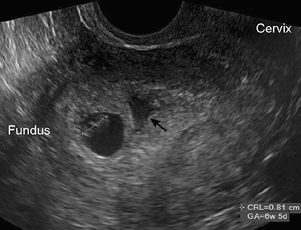
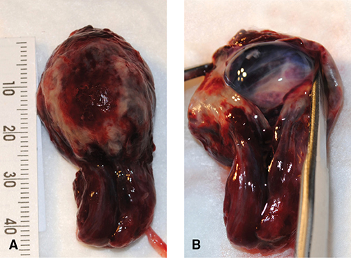
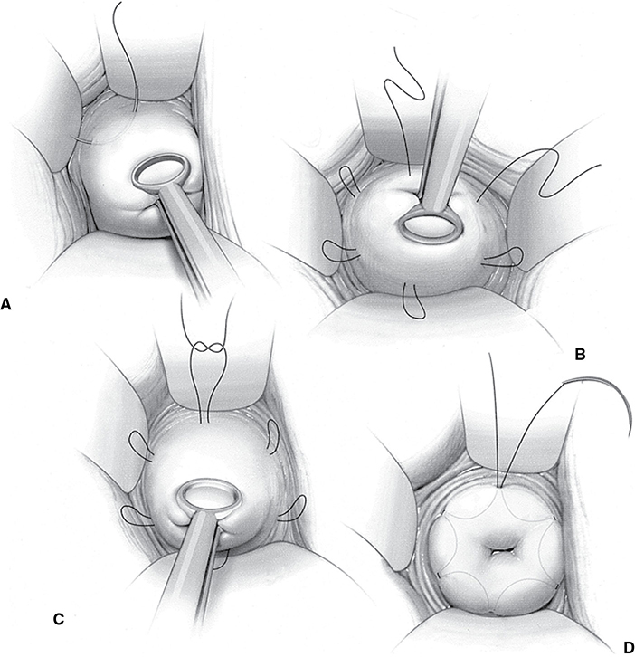
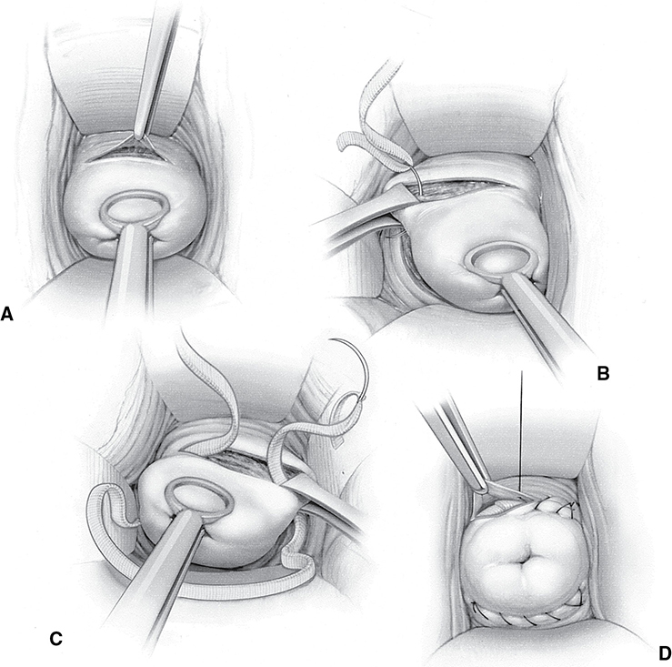
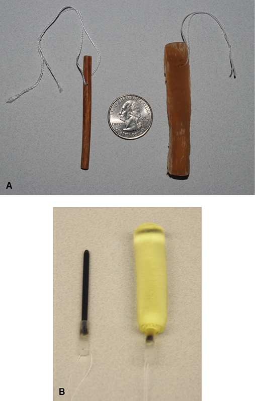
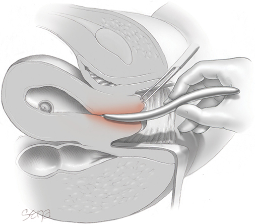
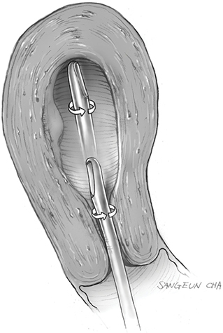
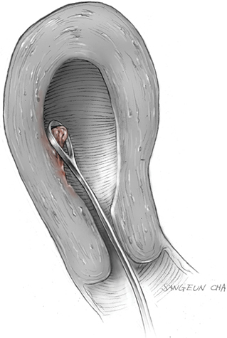

# Chapter 11: First- and Second-Trimester Pregnancy Loss — Revision Notes

> Williams Obstetrics 26e, pp. 515–573 of the PDF. High-yield numbers are in **bold**.
> The six tables are transcribed from the PDF images (they are missing from the extracted chapter text). All 8 figures are included from the PDF.

**Big picture:** Most early miscarriages are due to **chromosomal abnormalities** (little room for prevention). Later and recurrent losses more often have a **treatable maternal cause**. Whether the loss is spontaneous or induced, management is **expectant, medical (misoprostol ± mifepristone) or surgical (suction curettage / D & E)**.

---

## 1. Nomenclature

- **Abortion** = spontaneous or induced termination of pregnancy **before fetal viability**. **Miscarriage** is preferred for spontaneous loss.
- **Induced abortion** = termination of a **live** previable fetus with surgery or medication.
- **NCHS/WHO:** loss or termination at **<20 weeks** or fetal weight **<500 g**.
  - Contradictory: mean weight at **20 wk ≈ 330 g**; **500 g ≈ 22 wk**.
- **Early pregnancy loss (ACOG):** a **nonviable IUP within the first 12⁶⁄₇ weeks** — either an **empty gestational sac** or a sac with an embryo/fetus **without heart activity**.
- **Pregnancy of unknown location (PUL):** positive hCG, no confirmed location on sonography.
  - Five categories: **definite ectopic, probable ectopic, PUL, probable IUP, definite IUP**.
- Spontaneous abortion subtypes: **threatened, incomplete, complete, missed, inevitable**. **Septic** = any of these complicated by infection.

---

## 2. First-Trimester Spontaneous Abortion

### Pathogenesis
- **>80%** of spontaneous abortions occur in the first **12 weeks**.
- In the 1st trimester, **embryo/fetal death almost always precedes expulsion**: hemorrhage into the decidua basalis → necrosis → contractions → expulsion.
- **Anembryonic miscarriage** (preembryonic loss; "blighted ovum" is less preferred) = no embryo. **Embryonic miscarriage** = embryo without cardiac activity.
- In **2nd-trimester** losses the fetus usually does **not** die before expulsion → look for other causes.

### Incidence
- **10–20%** of pregnancies at 5–20 weeks (higher in earlier weeks).
- From conception (daily urine β-hCG): **~20%** fail very early = **biochemical pregnancy loss** (clinically silent).

### Fetal factors
- **~50% of miscarriages are euploid; ~50% are aneuploid** (holds with newer cytogenetic methods).
- Routine **chromosomal microarray of 1st-trimester tissue is not endorsed** by ACOG outside research (ASRM: only if the result changes future care).
- **75%** of aneuploid embryos abort by **8 weeks**. **Euploid** abortion peaks at **~13 weeks**.
- **95% of chromosomal errors are maternal** (gametogenesis), 5% paternal → aneuploid loss ↑ sharply **after maternal age 35**. Paternal age also contributes a little.

| Abnormality | Frequency in abortuses | Notes |
|---|---|---|
| **Autosomal trisomy** | **50–60%** (most common category) | Isolated **nondisjunction**, ↑ with maternal age. Most common: trisomies **13, 16, 18, 21, 22**. Occasionally from a balanced parental rearrangement (**2–4%** of couples with RPL) |
| **Monosomy X (45,X)** | **9–13%** | **Single most frequent specific abnormality** (Turner syndrome). Autosomal monosomy is rare and lethal |
| **Triploidy (69 chromosomes)** | **11–12%** | **Digynic** (maternal; diploid ovum + haploid sperm) or **diandric** (paternal; 2 sperm → **partial mole**). Abort early; late survivors grossly deformed |

### Maternal factors
- **Medical disorders:** poorly controlled **diabetes**, **obesity**, **thyroid disease**, **SLE** (inflammatory mediators may be the common theme).
  - **Thrombophilias are no longer linked to miscarriage.**
  - Direct therapeutic **radiation** can cause miscarriage; prior abdominopelvic radiotherapy may ↑ risk. Early **methotrexate** exposure is especially worrying (teratogen).
- **Surgery:** uncomplicated early-pregnancy surgery is unlikely to cause miscarriage; ovarian tumors can usually be resected.
  - **Exception:** removing the **corpus luteum (or its ovary) before 10 weeks** → give **supplemental progesterone**.
  - **Trauma** seldom causes 1st-trimester loss; major abdominal trauma matters more later.
- **Nutrition:** single or moderate deficiencies do **not** ↑ risk; abortion is rare even with hyperemesis. Diet rich in fruit, vegetables, whole grains and fish may ↓ risk. **Underweight is not** a risk factor (unlike obesity).
- **Caffeine:** **~5 cups/day (~500 mg)** slightly ↑ risk. An 8-oz cup of coffee = **80–100 mg**; black/green tea about half. **ACOG: <200 mg/d is likely not a major risk.**
- **Smoking** (~7% of pregnant women): slight dose-related ↑. **Alcohol:** risk mainly with **chronic or heavy** use.
- **Environment:**
  - Infections uncommonly cause early miscarriage.
  - Possible toxins: **bisphenol A, phthalates, PCBs, DDT**.
  - Health-care workers exposed to radiation or antineoplastics: slight ↑. Anesthetic gases: weak evidence (scavenging still recommended).

---

## 3. Spontaneous Abortion Clinical Classification

| Type | Cervical os | Key features | Management |
|---|---|---|---|
| **Threatened** | **Closed** | Bleeding at <20 wk with a **live** embryo/fetus | Observation, acetaminophen |
| **Incomplete** | Open | Tissue partly retained | Curettage, expectant or misoprostol |
| **Complete** | Closes within ~1 h | All tissue passed; bleeding ebbs | Confirm (tissue or serial hCG) |
| **Missed** | **Closed** | **Dead** products retained days–weeks | Expectant, misoprostol ± mifepristone, or surgery |
| **Inevitable** | Open / membranes ruptured | Previable PPROM or ballooning membranes | Evacuation or (selected) expectant |
| **Septic** | Any | Infection complicating any of the above | Antibiotics + evacuation |

### Threatened abortion
- **Bleeding through a closed os in the first 20 weeks with a live embryo/fetus.**
- Exclude **ectopic**, cervical infection, dysplastic/neoplastic cervical lesions.
- **~¼** of women bleed in early pregnancy. **Bleeding is by far the most predictive symptom** of loss.
- Check **hematocrit and blood type**; exclude ectopic with **β-hCG + TVS**; confirm viability.

**Sonographic milestones**

| Finding | Timing |
|---|---|
| Gestational sac (exocoelomic cavity) | **~4.5 weeks**; β-hCG usually **1500–2000 mIU/mL** (up to **3500** may be needed) |
| **Yolk sac** (excludes a pseudosac) | **~5.5 weeks**, MSD **~10 mm** |
| Embryo 1–2 mm next to the yolk sac | 5–6 weeks |
| **Cardiac activity** | **6–6.5 weeks**, CRL **1–5 mm**, MSD **13–18 mm** |

- Diagnose an IUP **cautiously if no yolk sac** is seen yet (a **pseudosac** may be blood from an ectopic).
- **Subchorionic hematoma** generally does **not** ↑ miscarriage risk.

*Figure 11-1. Subchorionic hematoma (arrow): hypoechoic collection next to a gestational sac with a ~7-week embryo (CRL 8.1 mm); usually does not raise miscarriage risk.*

**Management**
- **Observation** + acetaminophen.
- **Progesterone does not help** (PRISM trial). **Bed rest does not help** and may cause DVT. Avoid intercourse until bleeding stops.
- Rarely, severe anemia/hypovolemia → evacuation (or transfusion and observation).
- Even without miscarriage: slightly ↑ later **preterm birth and abruption** (more with heavy bleeding), but no extra surveillance is added for this alone.

### Incomplete abortion
- **Before 10 weeks** fetus and placenta are often expelled together; later they separate.
- Tissue in the cervical canal → remove with **ring forceps**.
- **Infection or hemodynamic instability with heavy bleeding → prompt surgical evacuation.**
- Otherwise three options:

| Option | Failure / success |
|---|---|
| Expectant | **~25% failure** |
| Misoprostol (PGE1): **800 µg vaginal, 400 µg sublingual or 600 µg oral** | **5–30% failure** |
| Curettage | **95–100% success**, quick, but invasive |

### Complete abortion
- Bleeding ebbs and the **internal os closes** over ~1 h. Examine passed tissue: gestation within clots or a **decidual cast** (thickened endometrium shaped like the cavity).
- **Thin endometrium without a sac ≠ proof**: of 152 women with heavy bleeding and endometrium <15 mm, **6% had an ectopic**.
- **Diagnose complete abortion only if:**
  1. **True products of conception are seen grossly**, or
  2. Sonography first documented an **IUP** and later an **empty cavity**.
- Otherwise use **serial β-hCG** (falls quickly; Table 11-1).

*Figure 11-2. (A) Decidual cast from a complete abortion; (B) opening it reveals a translucent gestational sac, confirming an IUP.*

### Table 11-1. Percentage Decline of Initial Serum β-hCG Levels Following Complete Spontaneous Abortion

| Initial hCG (mIU/mL) | By day 2: Expected % (Minimum %) | By day 4: Expected % (Minimum %) | By day 7: Expected % (Minimum %) |
|---|---|---|---|
| 50 | 68 (12) | 78 (26) | 88 (34) |
| 100 | 68 (16) | 80 (35) | 90 (47) |
| 300 | 70 (22) | 83 (45) | 93 (62) |
| 500 | 71 (24) | 84 (50) | 94 (68) |
| 1000 | 72 (28) | 86 (55) | 95 (74) |
| 2000 | 74 (31) | 88 (60) | 96 (79) |
| 3000 | 74 (33) | 88 (63) | 96 (81) |
| 4000 | 75 (34) | 89 (64) | 97 (83) |
| 5000 | 75 (35) | 89 (66) | 97 (84) |

*The percentage decline is given as the expected decline. The minimum expected decline in parentheses is the 95th percentile value. Declines less than this minimum may reflect retained either intrauterine or extrauterine trophoblast. hCG = human chorionic gonadotropin. Data from Barnhart, 2004; Chung, 2006.*

### Missed abortion
- **Dead products retained for days or weeks with a closed os.** Confirm the diagnosis before intervening (avoid interrupting a live IUP). β-hCG **plateaus or falls**.
- **MSD** = (length + width + height) ÷ 3.

### Table 11-2. Guidelines for Early Pregnancy Loss Diagnosis

**Sonographic Findings**
- **CRL ≥7 mm and no heartbeat**
- **MSD ≥25 mm and no embryo**
- An initial US scan shows a gestational sac **with yolk sac**, and after **≥11 days** no embryo with a heartbeat is seen
- An initial US scan shows a gestational sac **without a yolk sac**, and after **≥2 weeks** no embryo with a heartbeat is seen

**Modalities**
- Transvaginal preferable to transabdominal US
- **M-mode** imaging used to document and measure heartbeat
- **Pulsed Doppler** US methods generally **not used** to evaluate a normal early embryo (theoretical heating)

*CRL = crown-rump length; MSD = mean sac diameter; US = ultrasound. From ACOG, 2019b; Brown, 2018; Doubilet, 2013.*

> **Memory hook:** "**7-25-11-14**": CRL **7** mm, MSD **25** mm, **11** days with a yolk sac, **14** days without.

**Softer markers of impending failure**
- **Yolk sac diameter >7 mm** at <10 weeks
- **Slow FHR**, especially **<85 bpm** (normal rises from **110–130 bpm at 6 wk to 160–170 bpm at 8 wk**)
- **MSD − CRL <5 mm** (small sac)
- **Irregular sac contour**

**Management of confirmed embryonic/fetal death**

| Option | Details | Failure |
|---|---|---|
| Expectant | Weeks may pass before expulsion; underperforms the others | **15–50%** |
| **Misoprostol** | **800 µg vaginally once**, may repeat once in **1–2 days** (22% need a 2nd dose) | **15–40%** |
| **Mifepristone + misoprostol** | **Mifepristone 200 mg orally 24 h before** misoprostol → ↑ success. FDA **REMS**-restricted | Lower |
| Surgical evacuation | Most effective | — |

### Inevitable abortion of a previable fetus
- Caused by **ruptured membranes** or **marked ballooning** of membranes into the vagina.
- **Previable PPROM** complicates **0.5%** of pregnancies. (**Periviable birth** = 20⁰⁄₇–25⁶⁄₇ wk, Ch 45.)
- **Diagnosis:** fluid **pooling** on sterile speculum (accentuated by cough/Valsalva); pH, microscopy, sonographic fluid volume.
- **Risk factors:** prior PPROM, prior 2nd-trimester delivery, **tobacco**. Iatrogenic after amniocentesis or fetal surgery.
- **1st-trimester rupture** → nearly always contractions or infection → termination.
- **2nd-trimester previable PPROM:**
  - **40–50%** deliver within **1 week**; **70–80%** within **2–5 weeks**. **Average latency 2 weeks.**
  - Maternal complications (**56%** have ≥1): **uterine infection, sepsis, abruption, PPH, retained placenta**.
  - **Significant bleeding or fever → evacuate the uterus.**
  - Neonatal causes of early death: **pulmonary hypoplasia**, severe IVH, sepsis. PPROM **<20 wk** managed expectantly: only **12–23%** of infants go home.
  - Better prognosis: **later gestation, longer latency, no oligohydramnios**.
- **Expectant management** (counseled, no bleeding or fever): admit initially → if no bleeding, cramps or fever after **24 h**, discharge home with precautions. **Antibiotics for 7 days** to prolong latency.
  - ⚠️ **Before 22 weeks: NO corticosteroids, magnesium neuroprophylaxis, GBS prophylaxis, cesarean or tocolytics.**
  - Readmit once viable. **Perinatal palliative care** is an option.
- **Procedure-related leaks** are higher in the uterus and tend to **self-seal** (amniocentesis → conservative care, brief bedrest). After fetal surgery: investigational **amniopatch** (autologous platelets + cryoprecipitate).
- **Next pregnancy:** **46%** deliver <37 wk and **17% <24 wk**.

### Septic abortion
- Infection → parametritis, peritonitis, septicemia; after spontaneous or induced (medical or surgical) abortion.
- **Findings:** fever, lower abdominal pain, **uterine tenderness**, **foul discharge**, bleeding, retained tissue. Exclude UTI; CBC.
- Organisms are mostly **normal vaginal flora** → vaginal culture unhelpful; **blood cultures if septic**.
- ⚠️ **Group A streptococcus (S pyogenes)** → necrotizing infection / **toxic shock syndrome**. Deaths from ***Clostridium perfringens*** and ***C sordellii***.
  - **TSS:** endothelial injury, capillary leak, **hemoconcentration**, hypotension, tachycardia, **marked leukocytosis**, possibly **afebrile** at first.
- **Treatment:** prompt **broad-spectrum antibiotics** + **suction evacuation** of retained products. Most respond in **1–2 days**; no oral antibiotics needed afterward.
- Free air or **air in the uterine wall** → laparotomy. **Necrotic uterus → hysterectomy.**

### Anti-D immunoglobulin
- Without prophylaxis, **2%** of D-negative women are alloimmunized after abortion; up to **5%** after surgical D & C.
- **ACOG: 300 µg IM at all gestational ages.** Or graduated: **50 or 120 µg if ≤12 wk**, **300 µg if ≥13 wk**.
- Timing: **immediately after surgical evacuation**; **within 72 h** of diagnosis for medical or expectant management.
- Threatened abortion: controversial, but reasonable to give (Parkland practice).

---

## 4. Recurrent Miscarriage

- **RPL affects ~1%** of fertile couples.
- **Classic definition:** **≥3 consecutive losses** at <20 weeks or <500 g.
- **ASRM (2020): ≥2 failed pregnancies** confirmed by sonography or histopathology (recurrence risk is similar after 2 or 3 losses).
- **Primary RPL** = never had a live birth. **Secondary RPL** = prior live birth.
- **Chance of success is >50% even after 5 miscarriages.**

### Table 11-3. Predicted Success Rate of Subsequent Pregnancy According to Age and Number of Previous Miscarriages

| Age (yrs) | 2 previous | 3 previous | 4 previous | 5 previous |
|---|---|---|---|---|
| 20 | 92 | 90 | 88 | 85 |
| 25 | 89 | 86 | 82 | 79 |
| 30 | 84 | 80 | 76 | 71 |
| 35 | 77 | 73 | 68 | 62 |
| 40+ | 65 | 59 | 53 | 47 |

*Values are predicted success of the subsequent pregnancy (%).*

### Etiology and evaluation
| Accepted cause | Test |
|---|---|
| Parental chromosomal abnormality | **Karyotype both parents** |
| Antiphospholipid antibody syndrome | **Antiphospholipid antibodies** |
| Endocrinopathy | **HbA1c, TSH, prolactin** |
| Structural uterine abnormality | **Saline-infusion sonography (SIS)** or **HSG** |

- **~50% of RPL is idiopathic.** Losses may recur at the same gestational age.

### Parental chromosomal abnormalities
- Genetic abnormalities are **less common** in RPL than in sporadic miscarriage, except when a parent carries a **reciprocal or Robertsonian translocation** (**2–4%** of RPL).
- Options after counseling: **IVF + PGT** or **donor gametes**. But IVF + PGT birth rates are **not better than expectant management**.
- **PGT is not recommended** for RPL alone in chromosomally normal couples.

### Anatomical factors
- **15%** of women with ≥3 losses have a congenital or acquired uterine anomaly → **SIS and hysteroscopy**.
- **Leiomyomas:** link to RPL is weak; consider hysteroscopic excision of **large submucosal** myomas.
- **Asherman syndrome (synechiae):** after curettage or hysteroscopic surgery. SIS shows **hypoechoic bridging bands**. Treat with **hysteroscopic adhesiolysis** (worse results with severe disease).
- **Polyps:** more common in RPL (causality unclear). SIS + color Doppler shows a **single feeder vessel**. Polypectomy can be considered.
- Correct acquired lesions only with **significant cavity distortion**; benefit must be weighed against **new adhesions**.
- **Congenital (müllerian):** **septate uterus** is most closely linked to miscarriage → **hysteroscopic resection** can be considered.

### Immunological factors
- Miscarriage ↑ with **SLE**. **Antiphospholipid antibodies** (bind phospholipid-binding plasma proteins) are associated with RPL.

### Table 11-4. Clinical and Laboratory Criteria for Diagnosis of Antiphospholipid Antibody Syndromeᵃ

**Clinical Criteria**
- *Obstetrical:*
  - **≥3 unexplained consecutive spontaneous miscarriages <10 weeks' gestation**, *or*
  - **≥1 unexplained fetal death(s) ≥10 weeks' gestation**, *or*
  - **Severe preeclampsia or placental insufficiency necessitating delivery before 34 weeks**
- *Vascular:* ≥1 episode(s) of arterial, venous, or small-vessel thrombosis in any tissue

**Laboratory Criteriaᵇ**
- Presence of **lupus anticoagulant** according to guidelines of the International Society on Thrombosis and Hemostasis, *or*
- **Medium or high** serum levels of IgG or IgM **anticardiolipin** antibodies, *or*
- **Anti-β₂ glycoprotein-I** IgG or IgM antibody

*ᵃAt least one clinical and one laboratory criteria must be present for diagnosis. ᵇThese tests must be positive on two or more occasions **at least 12 weeks apart**. IgG = immunoglobulin G; IgM = immunoglobulin M. Modified from Branch, 2010; Miyakis, 2006.*

> **Memory hook (APS obstetric criteria):** "**3 before 10, 1 after 10, delivery before 34**."

### Endocrine factors
- Cause **8–12%** of recurrent miscarriages.
- **Uncontrolled diabetes** is a well-known abortifacient → optimize periconceptional control.
- **Overt hypothyroidism** and **severe iodine deficiency** ↑ miscarriage; correction reverses this. **Subclinical hypothyroidism does not.**
- **Antithyroid antibodies** are associated with sporadic and recurrent miscarriage, but **levothyroxine does not improve outcomes**. For RPL, **measure TSH, not antithyroid antibodies**.
- **Luteal-phase defect / progesterone deficiency:** progesterone did **not** ↑ live birth in RPL (large trial).
- Limited data: hyperprolactinemia. Obesity, **PCOS** and insulin resistance are linked, but causality is hard to assign.

---

## 5. Second-Trimester Abortion

### Etiology
- Midtrimester loss spans from the **end of the 1st trimester** to **<500 g or 20 weeks**. Much **rarer** than 1st-trimester loss, with **more diverse** causes than aneuploidy.
- Presents as miscarriage, **PPROM**, or fetal demise before labor.

### Table 11-5. Some Causes of Midtrimester Spontaneous Pregnancy Losses

| Fetal Anomalies | Placental Causes | Maternal Disorders | Uterine Defects |
|---|---|---|---|
| Structural | Abruption, previa | Autoimmune | Congenital |
| Chromosomal | Vasculopathy | Infections | Leiomyomas |
| | Chorioamnionitis | Metabolic | Incompetent cervix |

- Management mirrors 2nd-trimester induced abortion, except for **cerclage** for cervical insufficiency.

### Cervical insufficiency
- Formerly "incompetent cervix". **Classic: painless cervical dilation in the 2nd trimester** → membrane prolapse/ballooning → expulsion of an immature fetus; **often recurs**.
- **Causes:**
  - **Prior cervical trauma**: conization → **4-fold** ↑ loss before 24 wk. But **prophylactic cerclage does not help** women with conization alone and no prior preterm birth.
  - Abnormal development, e.g. **DES** exposure.
  - **Marfan** and **Ehlers-Danlos** syndromes.

**Indications for cerclage**

| Type | Basis | Evidence |
|---|---|---|
| **History-indicated (prophylactic)** | Unequivocal history of **painless 2nd-trimester delivery** | RCT (~1300 women): **13% vs 17%** delivered before 33 wk |
| **Examination-indicated** | **Early dilation of the internal os with visible membranes** | Better perinatal outcome than expectant care |
| **Ultrasound-indicated** | Short cervix on TVS in women with **any prior spontaneous preterm birth** | TVS cervical length every **1–4 wk from 16–24 wk** (SMFM, ACOG); details in Ch 45 |

- **No routine cervical length surveillance** without prior preterm birth or with **multifetal gestation**; the cervix is viewed at the **18–22-week anatomy scan**.

### Presurgical preparation
- **Contraindications: bleeding, contractions, ruptured membranes.**
- **Elective cerclage at 12–14 weeks:** after most predestined 1st-trimester losses and after aneuploidy/anomaly screening.
- Screen for cervical neoplasia, **gonorrhea and chlamydia**; treat obvious cervical infection.
- **Emergency cerclage** (already dilated/effaced) → higher risk of labor or rupture. **Parkland: no cerclage after 23–24 weeks.**
- **Outcomes:**
  - Elective: **~⅓ deliver before 35 wk**, few complications.
  - Emergency: only **½ delivered after 36 wk**; with **bulging membranes only 44% reached 28 wk** → high failure rate, counsel accordingly.
- Questionable indication → observe with cervical exams every 1–2 weeks.

### Vaginal cerclage
| | McDonald | Modified Shirodkar |
|---|---|---|
| Complexity | **Simpler, most used** | More complicated |
| Technique | **Purse-string** of no. 2 monofilament in the cervical body near the internal os; tightened to reduce the canal to **5–10 mm** | **Transverse anterior mucosal incision**, bladder pushed up; **5-mm Mersilene tape** passed submucosally anterior→posterior→anterior; tied anteriorly; mucosa closed with chromic |

- **Regional analgesia** preferred; lithotomy; drain the bladder. Warm saline rather than antiseptic if membranes exposed.
- Suture: **no. 1 or 2 nylon/polypropylene monofilament** or **5-mm Mersilene tape**. Place **as cephalad as possible** into dense stroma, avoiding the bladder. **Two tandem sutures are no better than one.**
- **No proven role** for perioperative antibiotics or prophylactic tocolysis.
- **Emergency cerclage with prolapsed membranes:** push them back with steep **Trendelenburg**, **filling the bladder with 600 mL saline**, a moist sponge stick, or a **transcervical Foley with 30-mL balloon** (deflated as the suture is tightened); ring forceps traction on cervical edges.
- **Removal at 37 weeks** in uncomplicated pregnancy (balances preterm birth vs cervical laceration in labor). Transvaginal cerclages are removed **even with cesarean** (or at the time of regional analgesia for scheduled cesarean).

*Figure 11-3. McDonald cerclage: purse-string monofilament placed high in the cervical body near the internal os (A–C) and tied to narrow the canal to 5–10 mm (D).*

*Figure 11-4. Modified Shirodkar cerclage: anterior mucosal incision with bladder advanced (A), Mersilene tape passed submucosally around the cervix (B–C), tied anteriorly and mucosa closed (D).*

### Transabdominal cerclage
- Suture at the **uterine isthmus**; for **prior failed transvaginal cerclage** or **severe cervical anatomical defects**.
- Left in place until childbearing is complete → **cesarean delivery required**. Conception rate **~75%** with it in place; D & E possible with the suture in situ.
- Technique: bladder pushed down; windows **medial to the uterine vessels** at the internal os; avoid the ureter. Laparotomy or laparoscopy.
- **MAVRIC trial** (prior failed vaginal cerclage): **preterm birth <32 wk 8% transabdominal vs 38%** McDonald or Shirodkar. More bleeding, organ injury, perforation and infection than vaginal methods.

### Complications
- **PPROM, preterm labor, hemorrhage, infection**: all uncommon with prophylactic cerclage (rupture in only 1 of >600 before 19 wk).
- **Clinical infection → remove the suture immediately** and induce/augment labor. **Imminent delivery → remove** to avoid cervical laceration.
- Post-cerclage sonographic surveillance and **reinforcing cerclage** are not supported.
- Rupture during placement or within **48 h** → some remove the cerclage. Later PPROM without infection or labor → data conflicting; Parkland retains it with close surveillance.

---

## 6. Induced Abortion

### Definitions
- **Induced abortion** = termination with medication or surgery **before viability**.
- **Abortion ratio** = abortions per **1000 live births** (**189** in 2018). **Abortion rate** = abortions per **1000 women aged 15–44** (**11.3**).
- 2018: **~620,000** abortions; **78% at ≤9 wk**, **92% at ≤13 wk**.
- **Therapeutic abortion** = for medical reasons; most common indication today is a fetus with a **significant anatomical, metabolic or mental deformity**. **Elective/voluntary** = at the woman's request, not medical; most abortions are elective.

### Legal influence (US)
| Year | Decision / law | Effect |
|---|---|---|
| 1973 | **Roe v. Wade** | 1st trimester left to the physician; later, regulation related to maternal health; after viability, the state may regulate except to preserve the mother's health |
| 1976 | **Hyde Amendment** | No federal funds except **rape, incest, life-threatening** situations |
| 1992 | **Planned Parenthood v. Casey** | Upheld the right; regulations allowed unless an **"undue burden"** → TRAP laws |
| 2007 | **Gonzales v. Carhart** | Upheld the **2003 Partial-Birth Abortion Ban Act** |
| 2016 | **Whole Woman's Health v. Hellerstedt** | Laws must confer health benefits that **outweigh burdens on access** |

### Provider availability
- **ACGME** requires access to abortion training in ob-gyn residency; **Kenneth J. Ryan program (1999)**; 2-year **Family Planning fellowships**.
- ACOG respects individual conscience but requires **counseling and timely referral**.

---

## 7. First-Trimester Methods

- No hospitalization needed without serious maternal disease, but outpatient sites must offer **resuscitation and hospital transfer**.

### Surgical abortion: preoperative preparation
- **Cervical ripening** → easier dilation, less pain, shorter procedure, but adds delay and side effects. In the 1st trimester reserve it for expected difficulty (**cervical stenosis, adolescents**).

| Agent | Dose / timing | Notes |
|---|---|---|
| **Hygroscopic (osmotic) dilators**: **Laminaria** (seaweed) or **Dilapan-S** (acrylic gel) | Inserted into the canal; expand to **3–4×** dry diameter | Equal or slightly more dilation than misoprostol; extends time, uncomfortable. **Count and record** dilators and sponges |
| **Misoprostol** | **400 µg** sublingual, buccal or posterior fornix **≥3–4 h** before | Oral is less effective. Fever, bleeding, GI effects |
| Mifepristone | **200 mg orally 24–48 h** before | Longer delay, cost, REMS → misoprostol preferred |

- Women who changed their minds after dilator placement (n = 21): of 17 who continued, **14 delivered at term** and none had infection.
- **Pre-abortion tests:** Hb, **Rh status**; screen for gonorrhea, syphilis, HIV, HBV, chlamydia; treat obvious cervical infection first.
- **Antibiotic prophylaxis: doxycycline 200 mg orally 1 h before** any 1st- or 2nd-trimester surgical evacuation.
- With local anesthesia, add an **NSAID 30–60 min** before. **No endocarditis prophylaxis** needed for valvular disease without active infection. Encourage early ambulation (no specific VTE guidance).

*Figure 11-5. Hygroscopic dilators, dry (left) and expanded (right): (A) Laminaria, (B) Dilapan-S; each expands to 3–4 times its dry diameter.*

### Vacuum aspiration (suction curettage)
- **EVA** (electric vacuum) or **MVA** (handheld **60-mL syringe**); both highly effective, safe and acceptable.
- **Sharp D & C alone is not recommended** (more blood loss, pain and time); a brief sharp curettage **after** aspiration is fine.
- **Steps:**
  1. **Bimanual exam** (uterine size, orientation); speculum; povidone-iodine; **tenaculum on the anterior lip**
  2. **Analgesia:** the cervix/uterus are innervated by the **Frankenhäuser plexus** (lateral to uterosacral and cardinal ligaments) → at minimum IV/oral sedation or analgesia ± block
     - **Paracervical block:** **5 mL of 1–2% lidocaine** into the uterosacral insertions at **4 and 8 o'clock**
     - **Intracervical block:** **5-mL aliquots of 1% lidocaine at 12, 3, 6 and 9 o'clock** (equally effective)
  3. **Sims uterine sound** to measure depth and direction
  4. **Dilate** (Hegar, Hank, Pratt): required dilation (**mm) ≈ gestational age (weeks)**. Hegar = mm; Pratt/Hank are **French ÷ 3 = mm**. Rest the **4th and 5th fingers on the perineum/buttocks** to prevent a sudden thrust → perforation
  5. **8–12-mm Karman cannula**: advance to the fundus, then suction while withdrawing and **rotating** until no more tissue
  6. Optional gentle **sharp curettage**, using only thumb and forefinger strength
- **≤6 weeks:** the pregnancy may be missed → rinse aspirate and inspect under back-lighting for **feathery villi**. Failed abortion **~2%** at <6 wk → **serial β-hCG** if products unclear.

*Figure 11-6. Hegar dilation: the 4th and 5th fingers rest on the perineum/buttocks so a sudden give of the cervix cannot drive the dilator through the fundus.*

*Figure 11-7. Suction cannula rotated as it is withdrawn to aspirate the entire cavity surface.*

*Figure 11-8. Sharp curette held with thumb and forefinger, drawn flush against the wall to remove adherent fragments.*

### Abortion complications
- **Mortality 0.4/100,000** (2013–2017). **0.3 at ≤8 wk → 2.5 at 14–17 wk → 6.7 at ≥18 wk.** Continuing pregnancy carries a **14-fold higher** maternal mortality.
- **Uterine perforation** and **lower-genital-tract laceration** each **≤1%** (1st trimester); ↑ with gestational age.
  - Recognized when an instrument passes **without resistance** deep into the pelvis.
  - Risk factors: operator inexperience, prior cervical surgery or anomaly, **adolescence, multiparity, advanced gestation**.
  - **Small fundal perforation** (sound, narrow dilator) → observe vital signs and bleeding.
  - **Suction cannula or sharp curette into the peritoneum → laparoscopy/laparotomy** to inspect the bowel; complete the curettage under direct vision.
- **Synechiae:** risk rises with number of procedures; usually mild. **⅔ of Asherman cases** in one series followed **1st-trimester curettage**.
- **Hemorrhage** (clinical response needed or **>500 mL**): **≤1%** of 1st-trimester surgical abortions (causes: **atony, abnormal placentation, coagulopathy**; trauma rare). Medication abortion bleeds more: **15% vs 2%** (Finnish study, <63 days).
- **Infection:** **0.5% with prophylaxis vs 2.6% with placebo**; <0.3% overall in another review.
- **Reevacuation:** **~5%** after medication abortion; **<2%** after surgical.
- **Efficacy: surgical 96–100% vs medication 83–98%.** Medication has slightly more complications but more privacy and no instrumentation.

### Medication abortion
- Outpatient option up to **≤70 days** menstrual age (lower success later). **39%** of abortions ≤9 wk in 2018 were medical.
- **Mifepristone:** antiprogestin → reverses progesterone-induced myometrial quiescence. **Misoprostol:** directly stimulates myometrium. **Both ripen the cervix.**
- **Cautions/contraindications:**
  - **Suspected ectopic pregnancy**
  - **IUD in situ**
  - **Severe anemia, coagulopathy, anticoagulant use**
  - **Long-term systemic corticosteroids**, **chronic adrenal failure** (mifepristone is an antiglucocorticoid)
  - **Inherited porphyria**
  - Allergy to the agents
- Misoprostol is suitable for early failure **after prior uterine surgery**.
- **Teratogenicity:** misoprostol → **transverse limb reduction, Möbius sequence** (cranial nerve palsy) → **commit to completion** once given. After mifepristone alone, **10–46%** of pregnancies continue; major malformations **5%** in one series.

**Administration**
- **Preferred (≤70 days): mifepristone 200 mg orally on day 0 → misoprostol 800 µg vaginal, buccal or sublingual 24–48 h later.** Oral misoprostol is less effective. May be **self-administered at home**.
- Infection **~0.3%** → **no antibiotic prophylaxis**.
- Side effects within **3 h** of misoprostol: vomiting, diarrhea, fever, chills. Bleeding and cramps **worse than menses** → oral analgesics.
- **Call if soaking ≥2 pads/hour for ≥2 hours.**
- **Follow-up at 1–2 weeks** with bimanual exam ± β-hCG (Table 11-1 declines). Routine ultrasound unnecessary.
- ⚠️ **No gestational sac and no heavy bleeding → no intervention**, even if sonographic **debris** remains.

### Table 11-6. Various Regimens for Medical Termination of Pregnancy

| Trimester | Regimen | Dosing |
|---|---|---|
| **First** | Mifepristone/Misoprostol | Mifepristone, **200 mg orally**, and after **24 hr** provide misoprostolᵃ **800 µg** |
| | Misoprostolᵃ Alone | **800 µg** and then may repeat every 3 hr for 3 total doses |
| **Second** | Mifepristone/Misoprostol | Mifepristone, **200 mg orally**, and after **24 hr** provide misoprostolᵃ **400 µg every 3 hr** up to 5 total dosesᵇ |
| | Misoprostolᵃ Alone | **400 µg every 3 hr** up to 5 total dosesᵇ |
| | Dinoprostone | 20 mg vaginal suppository every 4 hr |
| | Concentrated Oxytocin | 50 units oxytocin in 500 mL of normal saline and infuse during 3 hr; then 1-hr diuresis (no oxytocin); then escalate sequentially in a similar fashion through 150, 200, 250, and finally 300 units oxytocin, each in 500 mL normal saline |

*ᵃWith misoprostol, efficacy is similar for vaginal, buccal, and sublingual routes, whereas oral ingestion is less effective. ᵇIf abortion not completed by fifth dose, the cycle may be repeated following a 24-hour rest period. From ACOG, 2019f, 2020c; Raymond, 2019; Schreiber, 2018; Whitehouse, 2020; WHO, 2018. As printed, the oxytocin sequence goes from 50 units straight to 150 units; no 100-unit step is listed.*

---

## 8. Second-Trimester Methods

- Indications: fetal anomaly or death, maternal disease, inevitable abortion, or desired termination.
- **D & E** (not suction D & C) is needed because of fetal size and bones. **~8%** of 2018 abortions were D & E at >13 wk.

### Dilation and evacuation
**Cervical preparation**
- Wide dilation is needed; too little → **cervical trauma, perforation, retained tissue**.
- **Laminaria overnight** gives optimal dilation; serial insertions over several days if inadequate. **Dilapan-S** reaches maximal effect in **4–6 h** (good for same-day).
- **Mifepristone** added to laminaria helps at **>19 weeks**. Adding **misoprostol** to dilators: **no benefit** (meta-analysis).
- **Misoprostol alone: 400 µg vaginal or buccal 3–4 h before**; results vs dilators vary.
  - Uterine rupture not ↑ with **one** prior hysterotomy, but **2.5% with ≥2 cesareans**.
- Changing plans after dilator removal: **50%** ended in miscarriage or perinatal death (n = 12).
- Optional **induced fetal demise** before ripening: intracardiac **KCl or lidocaine**, or intraamnionic/intrafetal **digoxin**.

**Technique**
- Sonography as an adjunct. Same antibiotic prophylaxis as the 1st trimester.
- **Dilute vasopressin** intracervically or in the paracervical block ↓ bleeding.
- First **drain amnionic fluid** (11–16-mm cannula or amniotomy) → ↓ **amnionic fluid embolism** and brings the fetus down.
- **>16 weeks:** extract fetus (often in parts) with **Sopher forceps**; remove placenta with a large-bore vacuum curette.
- **Major complications 1–2%**: perforation, cervical laceration, bleeding, infection.
- **Prior cesarean is not a contraindication**; D & E may be **preferred over prostaglandins** with **multiple prior hysterotomies**.

**Other surgical considerations**
- **Placenta accreta spectrum** → usually **hysterectomy**.
- **Placenta previa** → D & E preferred (quick placental evacuation), with blood and hysterectomy capability. Medical abortion has more transfusion. Uterine artery embolization data conflict.
- Failed medical abortion → hysterotomy may be considered; significant uterine pathology (large myomas) → hysterectomy.
- Sterilization after evacuation: the contracted fundus lies lower → place the incision to allow tube access.

### Medication abortion (2nd trimester)
- **Mifepristone + misoprostol** shortens time to delivery vs misoprostol alone. Dilators may speed it further. **Oral misoprostol is slower** than vaginal or sublingual.
- **No routine antibiotic prophylaxis**; watch for infection in labor.
- Give an **antiemetic** (metoclopramide), **antipyretic** (acetaminophen) and **antidiarrheal** (diphenoxylate/atropine).
- **PGE2 (dinoprostone)** works as well as misoprostol but costs more and is unstable at room temperature.
- **Uterine rupture: 0.4%** with misoprostol after **one prior low transverse cesarean**; misoprostol and PGE2 carry similar risk. Few data for ≥2 prior cesareans.
- **High-dose IV oxytocin:** **80–90%** success, but misoprostol has higher success and faster delivery.
- **Ethacridine lactate** (rare in US): intraamnionic or extraovular; releases prostaglandins from myometrial mast cells; slower and less successful than misoprostol.

### Fetal and placental evaluation
- For fetal or maternal indications, either D & E or medication is suitable (patient input + indication). **Autopsy** is valuable for anomalies; **fragmented D & E specimens give less information** than intact fetuses. Perinatal palliative care may be offered.

---

## 9. Elective Abortion Consequences

- **Infertility and ectopic pregnancy are NOT increased**, except after postabortal infection (especially **C trachomatis**).
- **Preterm delivery ~1.5-fold ↑** after **surgical** evacuation, rising with the number of terminations.
- Subsequent outcomes are similar after medical vs surgical abortion.

---

## 10. Postabortal Contraception

- Ovulation may return as early as **8 days** after early abortion; average **3 weeks**.
- **Start any hormonal or nonhormonal contraception immediately.** An **IUD** can be inserted right after surgical or completed medication abortion.
- If pregnancy is desired, **no need to delay**: conceiving **within 3 months** of a 1st-trimester loss had **lower** subsequent miscarriage rates.

---

## Quick-Recall: Classification and Management

| Scenario | Key diagnostic point | First-line action |
|---|---|---|
| Threatened abortion | Closed os, live embryo, bleeding | Observe; no progesterone, no bed rest; anti-D reasonable |
| Incomplete abortion, stable | Open os, retained tissue | Curettage (95–100%), misoprostol (5–30% fail) or expectant (~25% fail) |
| Incomplete, infected or unstable | — | **Prompt surgical evacuation** |
| Complete abortion | POC seen or prior IUP now empty; else serial hCG | No treatment; beware ectopic (6%) |
| Missed abortion | CRL ≥7 mm no FH, MSD ≥25 mm no embryo | Mifepristone 200 mg → misoprostol 800 µg PV, or surgery |
| Previable PPROM | Pooling on speculum | Evacuate if bleeding/fever; else counsel; antibiotics ×7 d; no steroids/Mg/tocolysis <22 wk |
| Septic abortion | Fever, tender uterus, foul discharge | Broad-spectrum antibiotics + suction evacuation; hysterectomy if necrotic |
| D-negative, any abortion | — | **Anti-D 300 µg** (or 50–120 µg ≤12 wk) |
| RPL (≥2–3 losses) | — | Parental karyotypes, APS antibodies, HbA1c, TSH, prolactin, SIS/HSG |
| Cervical insufficiency | Painless 2nd-trimester dilation | Cerclage (history 12–14 wk; exam; US if prior PTB); remove at 37 wk |
| Failed vaginal cerclage | — | Transabdominal cerclage (PTB <32 wk 8% vs 38%) |
| Elective 1st-trimester abortion | ≤70 days | Mifepristone 200 mg → misoprostol 800 µg in 24–48 h, or vacuum aspiration + doxycycline 200 mg |
| Elective 2nd-trimester abortion | — | D & E with dilators, or mifepristone → misoprostol 400 µg q3h |

## Key Numbers to Memorize
- Abortion = **<20 wk or <500 g**; 20 wk ≈ **330 g**, 500 g ≈ **22 wk**; early pregnancy loss ≤**12⁶⁄₇ wk**
- **>80%** of losses in the 1st 12 wk; clinical miscarriage **10–20%**; biochemical loss **~20%**
- **~50%** aneuploid: trisomy **50–60%**, 45,X **9–13%**, triploidy **11–12%**; **95%** maternal errors; **75%** of aneuploid lost by **8 wk**; euploid loss peaks **13 wk**
- Corpus luteum removal **<10 wk** → progesterone; caffeine **<200 mg/d** OK, **500 mg** slight ↑
- Sac **4.5 wk** (hCG **1500–2000**, up to 3500); yolk sac **5.5 wk** (MSD 10 mm); heartbeat **6–6.5 wk**
- Nonviable: **CRL ≥7 mm** no FH; **MSD ≥25 mm** no embryo; no embryo **≥11 d** after yolk sac or **≥2 wk** after empty sac; yolk sac **>7 mm**; FHR **<85**
- Complete abortion: **6%** with empty uterus are ectopic
- Misoprostol **800 µg PV**; mifepristone **200 mg PO**; expectant failure **15–50%**
- Previable PPROM **0.5%**; **40–50%** deliver in 1 wk; latency **2 wk**; maternal complications **56%**; survival **12–23%**; no steroids/Mg/GBS/tocolysis **<22 wk**
- Anti-D **300 µg** (50/120 µg ≤12 wk); alloimmunization **2%** (5% with D & C); within **72 h**
- RPL **1%** of couples; **≥2** (ASRM) or **≥3** losses; **50%** idiopathic; translocations **2–4%**; uterine anomalies **15%**; endocrine **8–12%**; >**50%** success even after 5 losses
- APS: **≥3** losses **<10 wk**, **≥1** death **≥10 wk**, delivery **<34 wk**; labs twice **≥12 wk** apart
- Cerclage **12–14 wk**; McDonald canal **5–10 mm**; Mersilene **5 mm**; remove **37 wk**; no cerclage after **23–24 wk** (Parkland); conization → **4×** loss; MAVRIC **8% vs 38%**
- Abortion ratio **189/1000** live births; rate **11.3/1000** women; **78%** ≤9 wk
- Doxycycline **200 mg** 1 h pre-op; dilation mm ≈ weeks; French ÷ **3**; Karman **8–12 mm**; failure **2%** at <6 wk
- Mortality **0.4/100,000** (0.3 ≤8 wk → 6.7 ≥18 wk); continuing pregnancy **14×** riskier; perforation **≤1%**; hemorrhage **>500 mL**; infection **0.5% vs 2.6%**
- Surgical efficacy **96–100%** vs medical **83–98%**; medical ≤**70 days**; call if **≥2 pads/h for 2 h**
- Uterine rupture: misoprostol + 1 LTCS **0.4%**; ≥2 cesareans **2.5%**; oxytocin success **80–90%**
- Ovulation after abortion as early as **8 days** (mean **3 wk**)
