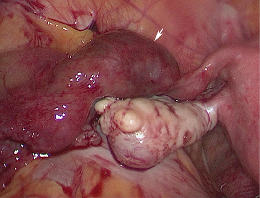
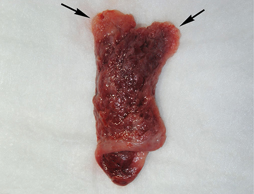
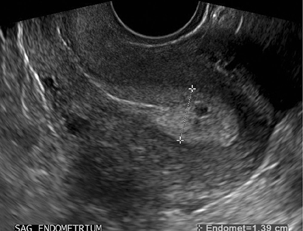
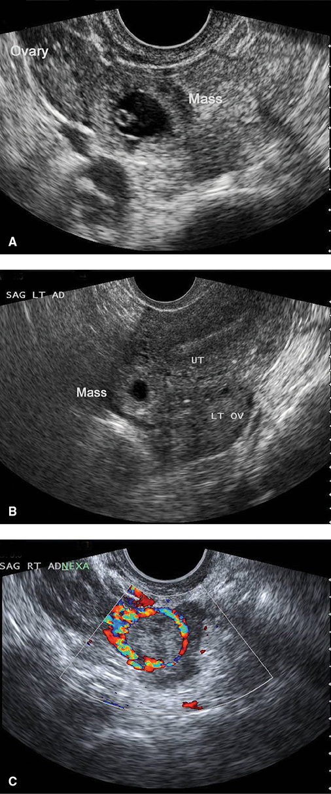
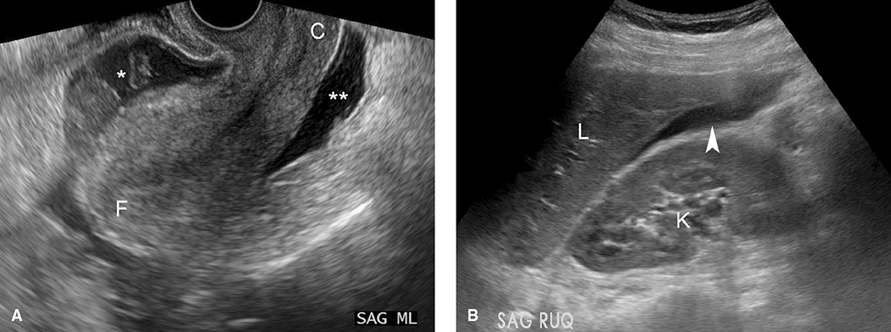
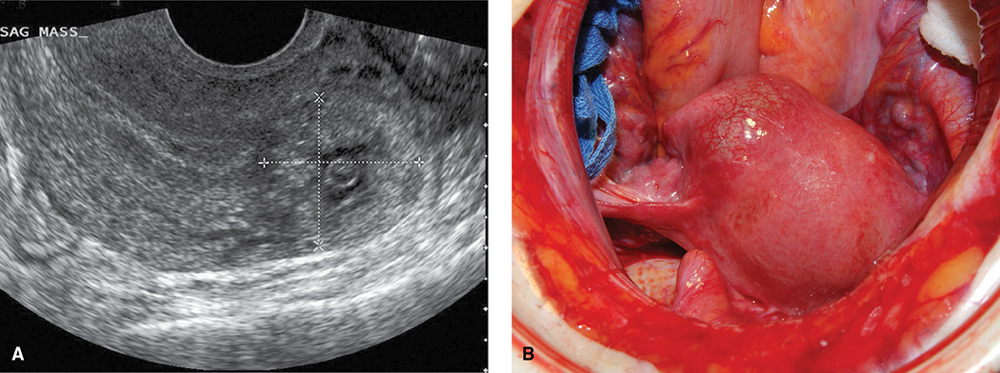
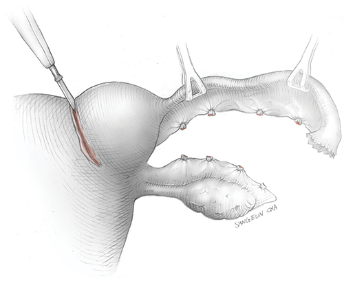
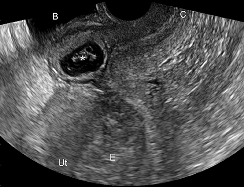
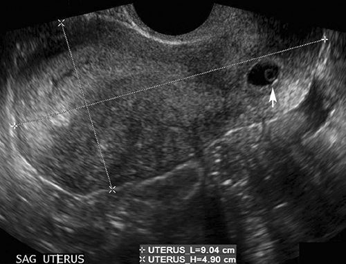

# Chapter 12: Ectopic Pregnancy — Revision Notes

> Williams Obstetrics 26e, pp. 574–613 of the PDF. High-yield numbers are in **bold**.
> The one table is transcribed from the PDF image (it is missing from the extracted chapter text). All 9 figures are included from the PDF (Figure 12-4 spans two pages and is shown once).

**Big picture:** Any implantation outside the endometrial cavity is ectopic. Rates are **~1.4–1.5%** of pregnancies, and ectopic pregnancy causes **3% of pregnancy-related deaths**. Serum **β-hCG + transvaginal sonography** allow early diagnosis, so most women can be treated with **methotrexate** or **laparoscopy** and keep their fertility.

---

## 1. Tubal Pregnancy

### Classification
- **~95%** of ectopics are **tubal**.

| Site | Share of tubal ectopics |
|---|---|
| **Ampulla** | **70%** (most common) |
| Isthmus | 12% |
| Fimbria | 11% |
| Interstitial | 2% |

- **Nontubal (~5%)**: ovary, peritoneal cavity (abdominal), cervix, cesarean scar.
- **Heterotopic** = an intrauterine and an ectopic conceptus together.
- Management depends on viability, gestational age, maternal health, fertility wishes, surgeon skill and resources.
- **D-negative women with any ectopic get anti-D immunoglobulin:** **50 or 120 µg IM in the 1st trimester**; **300 µg** later.

*Figure 12-1. Laparoscopic view of an unruptured ampullary tubal pregnancy (arrow), the most common site (70%).*

### Risk factors
- **Abnormal tubal anatomy** underlies most cases.
- **Highest risk: prior tubal surgery** (for a previous ectopic, fertility restoration or **sterilization**).
- **Prior ectopic → ~10% recurrence.**
- **Prior salpingitis:** one episode → up to **9%** later ectopic. Peritubal adhesions (salpingitis, appendicitis, endometriosis).
- **Infertility and ART.**
- **Smoking.**
- **Contraceptive failure** with methods that block intrauterine implantation better than tubal: **tubal sterilization, IUDs, progestin-only contraceptives**. (The absolute number of ectopics still falls with any contraception.)

### Pathogenesis and potential outcomes
- The tube **lacks a submucosa** → the ovum burrows through the epithelium into the muscularis, which trophoblast invades.

| Outcome | Features |
|---|---|
| **Tubal rupture** | Usually spontaneous (occasionally after coitus or bimanual exam); hemorrhage often **persistent and life-threatening** |
| **Tubal abortion** | Passes out the fimbriated end; bleeding may stop, or blood pools in the **cul-de-sac**; occluded fimbria → **hematosalpinx**; rarely reimplants → **abdominal pregnancy** |
| **Spontaneous failure** | Death and reabsorption; now detected more often with sensitive hCG assays |

| | Acute ectopic | Chronic ectopic |
|---|---|---|
| Frequency | More common | Less common |
| β-hCG | **High**, grows fast | **Negative or low and static** (trophoblast dies early) |
| Rupture | **Greater risk**, early | Late, if at all |
| Presentation | Timely diagnosis | **Persistent complex pelvic mass** (often found on imaging) |

### Clinical manifestations
- **Differential of early-pregnancy pain:** miscarriage, infection, leiomyoma degeneration, round-ligament pain; ovarian mass (hemorrhagic, ruptured, **torsed**); appendicitis, renal stone, cystitis, gastroenteritis.
- **Initial work-up:** urine β-hCG, urinalysis, Hb/Hct (**CBC** if infection possible). Positive urine test + pain or bleeding → **serum β-hCG**.
- **Classic triad: amenorrhea → pain + vaginal bleeding.** Before rupture, signs are often subtle or absent.
- **Rupture:** severe, **sharp, stabbing or tearing** lower abdominal/pelvic pain.
  - **Neck or shoulder pain on inspiration** = diaphragmatic irritation from hemoperitoneum.
  - **Vertigo, syncope** = hypovolemia.
- Most women have some spotting or bleeding; profuse bleeding suggests incomplete abortion but can occur with tubal pregnancy.
- **Exam:** abdominal tenderness; adnexal mass/tenderness on a **limited, gentle** bimanual exam (avoid iatrogenic rupture); uterus may be slightly enlarged.
- **Vital signs:** moderate bleeding may cause no change, a slight BP rise, or a **vasovagal response (bradycardia + hypotension)**. BP falls and pulse rises only with significant hypovolemia.
- **Labs:** initial Hb/Hct may be only slightly low → a **falling trend over several hours** is more useful. **Leukocytosis up to 30,000/µL** in ~half of ruptured ectopics.
- **Decidual cast:** sloughed endometrium shaped like the cavity; also occurs with miscarriage → send tissue for histology. **No sac or no villi → ectopic is still possible.**

*Figure 12-2. A 7-cm decidual cast passed with a tubal ectopic; arrows mark the decidua that lined the cornua. A cast alone does not prove an IUP.*

---

## 2. Tubal Pregnancy Diagnosis

- **Evidence of rupture → prompt surgery.** Hemodynamically stable women without a clearly located pregnancy → β-hCG, TVS ± surgery.
- **Trade-off:** strategies that maximize ectopic detection may **interrupt a normal IUP**; those that protect an IUP may **delay** ectopic diagnosis. The patient's wishes for the pregnancy guide the balance.

### β-hCG
- Immunoassays detect the β-subunit. Detection limits: **urine 20–25 mIU/mL; serum ≤5 mIU/mL**.
- Assays vary by **5–10%** → serial values from the **same laboratory**.
- **Discriminatory threshold:** the level above which a normal IUP should be seen on TVS: **≥1500** or **≥2000 mIU/mL** (institution-specific). With live IUPs, a sac was seen **99%** of the time above **3510 mIU/mL**.

### Transvaginal sonography

**Pregnancy of unknown location (PUL)**
- No IUP or ectopic seen on TVS. Usually one of:
  1. **Failing IUP**
  2. **Recent completed abortion**
  3. **Early IUP**
  4. **Ectopic pregnancy**
- Without clear ectopic evidence → **repeat β-hCG at 48 h** (avoids unnecessary MTX and harm to an early IUP).

| β-hCG pattern over 48 h | Interpretation |
|---|---|
| Rise **≥53%** (conservative minimum **35%**) | Consistent with a **normal IUP** (same expected rise with multiples) |
| Rapid fall (Table 11-1) | **Failed IUP** / failing PUL (fall **35–50% at 48 h**, **66–87% at 7 days** for starting values 250–5000) |
| Anything else | Suspicious for ectopic |

- ⚠️ **One third of ectopics rise ≥53%** in 48 h. About **half** of ectopics have falling and half rising levels.
- ⚠️ **A resolving ectopic can rupture even with falling or low β-hCG** (hCG may not reach the circulation when the vascular connection is partly disrupted) → follow β-hCG **until negative**.
- After the first two values, repeat every **2–7 days** (more often if higher risk), ± repeat TVS.
- **D & C** gives a faster diagnosis but may interrupt a normal IUP; repeat TVS first.

**Endometrial findings**

| Finding | Timing / meaning |
|---|---|
| IUP gestational sac | **4½–5 weeks** |
| Yolk sac | **5–6 weeks** |
| Fetal pole with cardiac activity | **5½–6 weeks** (transabdominal: slightly later) |
| **Trilaminar endometrial pattern** | Characteristic of ectopic: **specificity 94%, sensitivity 38%** |
| **Endometrial stripe <8 mm** in a PUL | **No normal IUPs** had a stripe this thin |
| **Pseudogestational sac** | Fluid **between the endometrial layers**, **central**, conforms to cavity shape → ↑ ectopic risk |
| **Decidual cyst** | Anechoic area **within** the endometrium, remote from the canal, often at the endometrial–myometrial border (early decidual breakdown) |
| **Intradecidual sign** (IUP) | Anechoic sac placed **eccentrically** within one endometrial layer |

- ACOG: **be cautious diagnosing an IUP without a definite yolk sac or embryo.**

*Figure 12-3. Pseudogestational sac: a central anechoic collection in the cavity with a trilaminar endometrium, common with ectopic pregnancy.*

**Adnexal findings**
- Diagnosis rests on an **adnexal mass separate from the ovary**.

| Appearance | Frequency |
|---|---|
| **Complex (inhomogeneous) adnexal mass** | **60%** |
| **Hyperechoic tubal ring** around an empty sac ("bagel") | **20%** |
| **Obvious extrauterine sac with yolk sac/embryo** (diagnostic) | **13%** |

- **"Ring of fire"** on color Doppler = peripheral placental flow. A **corpus luteum cyst** can look similar.
- Not every adnexal mass is an ectopic → integrate with clinical data.

*Figure 12-4. Tubal ectopic on TVS, separate from the ovary: (A) extrauterine sac with yolk sac, (B) empty sac with hyperechoic tubal ring, (C) inhomogeneous mass with color-Doppler "ring of fire".*

**Hemoperitoneum**
- Fluid first collects in the **retrouterine cul-de-sac**, then surrounds the uterus, then tracks up the **paracolic gutters to Morison pouch**.
- **Fluid in Morison pouch appears only after ~400–600 mL.**
- **Peritoneal fluid + adnexal mass + positive pregnancy test = highly predictive** of ectopic. Mimic: **malignant ascites**.
- **Culdocentesis** (if no ultrasound): tenaculum pulls the cervix up toward the symphysis; **18-gauge needle** through the **posterior fornix**.
  - No fluid = only an unsatisfactory tap.
  - **Nonclotting** bloody fluid / old clot fragments → **hemoperitoneum**.
  - Blood that **clots** → vessel puncture or brisk bleeding from rupture.

*Figure 12-5. Hemoperitoneum: (A) blood in the posterior (\*\*) and anterior (\*) cul-de-sac; (B) fluid in Morison pouch (arrowhead), seen only with ≥400–600 mL.*

### Serum progesterone
- Used by some when β-hCG and TVS are inconclusive (not Parkland practice). One value suffices.

| Level | Meaning |
|---|---|
| **<6 ng/mL (<20 nmol/L)** | **Nonviable** pregnancy (pooled specificity **98%**) |
| **>25 ng/mL** | **Live IUP**, excludes ectopic with **97% sensitivity** |
| **10–25 ng/mL** | Most ectopics → **limited utility**; cannot locate the pregnancy |

### Endometrial sampling
- Ectopic endometrium lacks villi: **decidual reaction 42%**, **secretory 22%**, **proliferative 12%**.
- Without histological exclusion of a miscarriage, a presumed ectopic diagnosis is **wrong in 27%** → some do **D & C before MTX** (weigh against MTX's limited risks).
- **Pipelle biopsy/aspiration is inferior** to curettage. **Frozen section** of curettings identifies products of conception in **95%**.

### Laparoscopy
- Reliable diagnosis in most cases and allows immediate **definitive surgery**.

---

## 3. Medical Management

### Regimen options
- **Medical therapy is preferred when feasible.** Disqualifiers: **ruptured tube** and **drug contraindications**. Also needs access to emergency care and commitment to follow-up labs.
- **Methotrexate (MTX):** folic acid antagonist; binds **dihydrofolate reductase** → blocks dihydrofolate → tetrahydrofolate → stops purine/pyrimidine synthesis → arrests DNA, RNA and protein synthesis. Kills rapidly dividing **trophoblast**; can harm **GI mucosa, bone marrow, respiratory epithelium**.
- **Pretreatment labs:** **serum creatinine** (renally cleared), **CBC and LFTs** (hepato- and myelotoxic), **blood type and Rh**. All but typing are repeated before extra doses.
- **Avoid during treatment:**
  1. **Folic acid** supplements (compete at DHFR)
  2. **NSAIDs** (↓ renal flow, delay excretion)
  3. **Alcohol** (liver enzyme rise)
  4. **Sunlight** (MTX dermatitis)
  5. **Sexual activity** (rupture)
- **Teratogen:** MTX embryopathy = **craniofacial and skeletal abnormalities + FGR**. Excreted in **breast milk**.

### Table 12-1. Medical Treatment Protocols for Ectopic Pregnancy

| | Single Dose | Multidose |
|---|---|---|
| **Dosing** | One dose; repeat if necessary | Up to four doses of both drugs until serum β-hCG declines by 15% |
| **Medication Dosage: Methotrexate** | **50 mg/m² BSA (day 1)** | **1 mg/kg, days 1, 3, 5, and 7** |
| **Medication Dosage: Leucovorin** | NA | **0.1 mg/kg days 2, 4, 6, and 8** |
| **Serum β-hCG level** | Days 1 (baseline), **4, and 7** | Days 1 (baseline), 3, 5, and 7 |
| **Indication for additional dose** | If serum β-hCG level does not decline by **15% from day 4 to day 7**. Less than 15% decline during weekly surveillance | If serum β-hCG level declines <15%, give additional dose; repeat serum β-hCG in 48 hours and compare with previous value; maximum four doses |
| **Surveillance** | Once 15% decline achieved, then weekly serum β-hCG levels until undetectable | (same) |

**Methotrexate Contraindications**

- MTX sensitivity
- Tubal rupture
- Breastfeeding
- Intrauterine pregnancy
- Peptic ulcer disease
- Active pulmonary disease
- Immunodeficiency
- Hepatic, renal, or hematologic dysfunction

*BSA = body surface area; β-hCG = β-human chorionic gonadotropin; MTX = methotrexate; NA = not applicable. From ACOG, 2019c; American Society for Reproductive Medicine, 2013.*

| | Single-dose | Multidose |
|---|---|---|
| Pros | **Simpler, cheaper, less monitoring** (Parkland's choice) | Some studies show **higher success** |
| Leucovorin | No | Yes (folinic acid, buffers toxicity) |

- Given **IM**; observe **30 min** after injection. Overall tubal resolution **~90%**.

### Patient selection
- **Best candidate:** **asymptomatic, motivated, compliant**.
- Predictors of success: **low initial β-hCG** (the **best single predictor** with single-dose MTX), **small mass**, **no cardiac activity**.

| Initial β-hCG (mIU/mL) | Single-dose MTX failure |
|---|---|
| **<1000** | **1.5%** |
| 1000–2000 | 5.6% |
| 2000–5000 | 3.8% |
| **5000–10,000** | **14.3%** |

- Mass **≤3.5 cm → 93% success** vs 87–90% if larger. **≤4 cm without cardiac activity** is suitable. **Cardiac activity → 87% success.**

### Side effects
- Usually minimal; resolve **3–4 days** after stopping. **Liver 12%**, **stomatitis 6%**, gastroenteritis 1%; rare marrow depression.
- **"Separation pain" in 65–75%**, starting several days after MTX; usually mild → analgesics. **20%** need clinic/ED evaluation to exclude rupture.
- **Ovarian reserve is not reduced.**
- **Delay conception ≥3 months** after MTX (persists in tissues), although conception within 6 months looked reassuring in one study.

### Surveillance
- **Single dose:** β-hCG on **days 4 and 7** (it may rise between days 1 and 4). If the fall from **day 4 to 7 is <15%** → recheck CBC, creatinine, LFTs → **second dose**; that day becomes the new day 1. Needed in **~20%**.
- **Multidose:** MTX 1 mg/kg alternating with leucovorin 0.1 mg/kg; check β-hCG after each pair; ≥15% fall expected; **max 4 doses**.
- Once **≥15%** fall → **weekly β-hCG until undetectable**.
- **Mean time to resolution (<15 mIU/mL) 34 days; longest 109 days.**

---

## 4. Surgical Management

### Options
- Discuss fertility plans; the **other tube can be ligated or removed** if sterilization is desired.
- **Laparoscopy is preferred** unless the woman is **hemodynamically unstable**: same subsequent IUP and patency rates as laparotomy, less infection, adhesion and VTE, faster recovery. Experienced surgeons can manage hemoperitoneum laparoscopically, but **pneumoperitoneum ↓ venous return and cardiac output** (important with hypovolemia).

| | Salpingectomy | Salpingostomy |
|---|---|---|
| Use | **Ruptured or unruptured** | **Small unruptured** pregnancy |
| Technique | Bipolar device across the **uterotubal junction**, then along the mesosalpinx | **10–15-mm linear incision on the antimesenteric border**; products extruded or flushed out with high-pressure irrigation; bleeding points coagulated; incision **left unsutured** (secondary intention) |
| Persistent trophoblast | **Rare** | **5–15%** |
| Follow-up | No routine β-hCG if asymptomatic | **Weekly β-hCG** |

- **Normal contralateral tube → no fertility difference:**
  - **ESEP:** ongoing natural pregnancy **56% (salpingectomy) vs 61% (salpingostomy)**, NS.
  - **DEMETER:** 2-year IUP **64% vs 70%**, NS.
- **Abnormal contralateral tube → salpingostomy** preferred if feasible.
- Irrigate and suction the pelvis to remove all trophoblast.

### Persistent trophoblast
- Suspected with **stable or rising β-hCG** after surgery.
- No rupture → **single-dose MTX 50 mg/m²**. **Rupture/bleeding → second surgery.**

### Medical versus surgical therapy
- **Multidose MTX vs laparoscopic salpingostomy** (RCT, n = 100): **no difference** in tubal preservation, primary success or fertility.
- **Single-dose MTX vs salpingostomy:** conflicting; long-term (8.6 y) success and spontaneous IUP rates similar.
- **Salpingectomy** has the highest resolution rate, but **future fertility and recurrence are similar** to MTX. Surgery, MTX and expectant care give similar subsequent IUP rates.
- **Equivalent outcomes** when: **stable, β-hCG <5000 mIU/mL, small mass, no cardiac activity**. MTX can still be offered to motivated women outside these limits who accept the risk of emergency surgery.

### Expectant management
- For **select asymptomatic** women with a **very early tubal pregnancy and stable or falling β-hCG**, committed to follow-up and near emergency care. (Different from expectant care of a PUL.)
- Predictors of success: **low initial β-hCG**, a **significant fall over 48 h**, and an **inhomogeneous mass** (not a tubal ring or embryo).

| Initial β-hCG | Spontaneous resolution |
|---|---|
| **<175 mIU/mL** | **88–96%** |
| **<1000 mIU/mL** | **71–92%** |

- Later tubal patency and IUP rates are comparable to surgery.

> **Pearl:** The three management options for tubal ectopics give similar future fertility. The choice rests on stability, β-hCG level, mass size, cardiac activity and whether the patient can be followed reliably.

---

## 5. Interstitial Pregnancy

### Diagnosis
- Implants in the **tubal segment within the muscular uterine wall**. ("**Cornual**" pregnancy strictly means one in the **rudimentary horn** of a müllerian anomaly.)
- Specific risk factor: **prior ipsilateral salpingectomy**.
- **Ruptures later: after 8–16 weeks** of amenorrhea (myometrium allows more distention).
- Close to the uterine and ovarian arteries → **severe hemorrhage; mortality up to 2.5%**.
- **Sonographic criteria:**
  - **Empty uterine cavity**
  - Sac **separate from the endometrium** and **>1 cm from the most lateral edge** of the cavity
  - **Thin myometrial mantle <5 mm** around the sac
  - **Interstitial line sign**: an echogenic line from the sac to the endometrial cavity (**highly sensitive and specific**)
- Unclear cases: **3-D sonography, MRI or laparoscopy** (bulge **lateral to the round ligament** with normal distal tube and ovary).

*Figure 12-6. Interstitial pregnancy: (A) empty cavity with a mass cephalad and lateral to the fundus; (B) at laparotomy, the bulge lies lateral to the round ligament and medial to the isthmic tube.*

### Management
- **Surgical** (laparotomy or laparoscopy), with **intramyometrial vasopressin** to ↓ blood loss:
  - **Cornual resection**: wedge excision of the sac, surrounding myometrium and ipsilateral tube, **en bloc**
  - **Cornuostomy**: incise the myometrium and extract the pregnancy
  - Both need **layered myometrial closure**; follow **β-hCG** for remnant trophoblast.
- **Medical** (early diagnosis): no consensus. Systemic MTX **50 mg/m² → 94%** success; multidose; **direct intrasac MTX**; **chemoembolization** (uterine artery MTX + UAE) + systemic MTX.
- Future rupture risk undefined → **elective cesarean at ≥37⁰⁄₇ weeks** (as after at-risk myomectomy).
- **Angular pregnancy** = eccentric implantation **within the cavity** near a cornu: **80%** reached viability without abnormal placentation or rupture → **managed as a normal pregnancy**.

*Figure 12-7. Cornual resection: wedge excision (angled inward) of the pregnancy, surrounding myometrium and ipsilateral tube en bloc, then layered closure.*

---

## 6. Cesarean Scar Pregnancy

### Diagnosis
- Implantation **within the myometrium of a prior hysterotomy scar**. Incidence **~1 in 2000** pregnancies, rising with cesarean rates.
- Usually present early with **pain and bleeding**; **up to 40% asymptomatic** (found on routine scan).
- **TVS criteria (Fig 12-8):**
  1. **Empty uterine cavity and empty endocervical canal**
  2. Placenta/sac **embedded in the hysterotomy scar niche**
  3. **Thin myometrial mantle** between sac and **bladder**
  4. **Prominent vascular pattern** at the scar
- **Endogenic** CSP (on the scar, grows toward the cavity) → variable outcomes. **Exogenic** (deep in the niche, grows toward the bladder) → **all needed hysterectomy with PAS** at delivery in one study.
- **Versus low IUP:** sac centre **below the midpoint** of the uterine length (cervix to fundus) → CSP.
- **Versus an aborting sac:** CSP shows **intense peritrophoblastic flow** on color Doppler and a **negative sliding sign** (does not move with probe pressure). An expelling sac is **avascular** and **slides**.
- MRI for inconclusive cases.

*Figure 12-8. Cesarean scar pregnancy: empty cavity (E) and canal, sac (\*) in the anterior scar niche, thin myometrium between the sac and bladder (B).*

### Management
- CSP may be a **precursor of placenta accreta spectrum**; many reach viability, with PAS complications. Rupture is less common than with typical ectopics.
- **Most successful operations:**
  1. **Laparoscopic isthmic resection**
  2. **Transvaginal isthmic resection** via anterior colpotomy
  3. **UAE then D & C** ± hysteroscopy
  4. **Hysteroscopic resection**
- SMFM: **ultrasound-guided vacuum aspiration** is suitable; **sharp curettage is not**. Hysterectomy if required or no further fertility wanted.
- **Medical:** slower and more variable. **Local intrasac MTX ~60%**; **local + systemic ~80%**. **SMFM recommends against systemic MTX alone.**
  - Local MTX **1 mg/kg or 50 mg**; in advanced gestations, first **KCl** into the sac (e.g. **1 mL of 2 mEq/mL**).
  - Bleeding → **Foley balloon** tamponade; **double-balloon catheter** + MTX has been used.
- After conservative treatment: good subsequent outcomes, but **PAS and recurrent CSP** (4 of 9 in one series) and **uterine AVMs** are risks.
- **Expectant management: SMFM recommends against it** (exception: early CSP with signs of failure).
  - Continuing CSPs: **uterine rupture/dehiscence 10%**; **hysterectomy 60% overall**; of 40 reaching the 3rd trimester, **17 had percreta** and 23 had hysterectomy.
  - Early CSPs **without cardiac activity**: **70% uncomplicated miscarriage**, none needed hysterectomy.
  - If continued: **repeat cesarean at 34⁰⁄₇–35⁶⁄₇ weeks** after **betamethasone**.

---

## 7. Cervical Pregnancy

### Diagnosis
- **Definition:** (1) **cervical glands opposite the placental attachment site** on histology, and (2) all or part of the placenta lies **below the entry of the uterine vessels** or below the anterior peritoneal reflection.
- Risk factors: **ART**, **prior uterine curettage**.
- **Painless vaginal bleeding in 90%** — may be severe.
- Exam: **distended, thin-walled cervix** with a partly open external os; a slightly enlarged fundus above it.
- **TVS findings (Fig 12-9):**
  1. **Hourglass uterus** with **ballooned cervix**
  2. Gestational tissue **at the level of the cervix**
  3. **No intrauterine gestational tissue**
  4. Part of the **endocervical canal between the gestation and the endometrial canal**
- Versus miscarriage in transit: **vascular** on color Doppler and a **negative sliding sign**. MRI/3-D TVS can help.

*Figure 12-9. Cervical pregnancy: hourglass uterus with the gestational sac (arrow) low in a ballooned cervix and an empty uterine cavity above.*

### Management
- **MTX is first-line** in stable women (Parkland): single- or multidose systemic (Table 12-1), or **50 mg directly into the sac**, or chemoembolization.
- **<12 weeks: 91% resolution with uterine preservation.**
- **Higher MTX failure if:** GA **>9 weeks**, **β-hCG >10,000 mIU/mL**, **CRL >10 mm**, **cardiac activity** → add **feticidal KCl** into the fetus/sac.
- Sonographic resolution **lags far behind** β-hCG decline.
- **Suction evacuation** (reduce bleeding with preoperative **UAE**, **intracervical vasopressin**, a **cerclage at the internal os**, or **hemostatic sutures at 3 and 9 o'clock** to ligate the cervical branches of the uterine artery).
- **Hysterectomy** for uncontrolled bleeding (**ureters** close to the ballooned cervix → urinary injury risk).
- **Hemorrhage:** **26F Foley with a 30-mL balloon** in the cervix for tamponade, left **24–48 h** and deflated gradually over a few days. UAE for bleeding or prevention.

---

## 8. Abdominal Pregnancy

### Diagnosis
- Implantation in the **peritoneal cavity**, excluding tubal, ovarian and intraligamentous sites. Most follow **early tubal rupture or tubal abortion with reimplantation**.
- Symptoms absent or vague; **MSAFP may be raised**. Later: **abnormal fetal lie**, **displaced cervix**.
- **Sonographic clues:**
  - Fetus or placenta **eccentric in the pelvis or separate from the uterus**
  - **No myometrium** between the fetus and the maternal abdominal wall or bladder
  - **Bowel loops around the sac**
  - **Oligohydramnios** (common, nonspecific)
- **MRI** often needed (also maps the placenta).

### Management
- Expectant care risks **sudden dangerous hemorrhage**; **fetal malformations/deformations in 20%** → **termination is generally indicated** once diagnosed, and rarely justified to wait **before 24 weeks** (some wait for viability with close surveillance).
- **Surgery:** deliver the fetus; assess the placental implantation **without provoking hemorrhage**; avoid unnecessary exploration.
- ⚠️ **Placental removal can cause torrential bleeding** (no myometrial contraction to close vessels).
  - Remove it only if clearly safe or already bleeding; **ligate its feeding vessels first**; dilute vasopressin for early gestations.
- **Leaving the placenta in situ** (lesser evil): ↓ immediate hemorrhage but risks **abscess, adhesions, bowel/ureteral obstruction, wound dehiscence** (often requiring later removal).
  - Monitor involution with **β-hCG, color Doppler or MRI**; resorption can take **months to years**.
  - **Postoperative MTX** hastens involution but causes necrosis → **infection/abscess**. Placental embolization may help.

---

## 9. Ovarian Pregnancy

- **Spiegelberg criteria (1878):**
  1. **Ipsilateral tube intact** and separate from the ovary
  2. Ectopic pregnancy **occupies the ovary**
  3. Connected to the uterus by the **utero-ovarian ligament**
  4. **Ovarian tissue** shown histologically **amid placental tissue**
- Risk factors like tubal, but **ART and IUD failure** are prominent.
- Presentation mirrors tubal ectopic; **early rupture** is usual.
- **TVS:** anechoic centre within a **wide echogenic ring**, surrounded by **ovarian cortex**. Often not diagnosed until surgery; may be mistaken for a **hemorrhagic corpus luteum**.
- **Surgical management:** small → **ovarian wedge resection or cystectomy**; large → **oophorectomy**. Follow β-hCG after conservative surgery.

> **Memory hook (Spiegelberg):** "Tube spared, ovary occupied, ligament linked, ovarian tissue on histology."

---

## 10. Heterotopic Pregnancy

- IUP + ectopic pregnancy together; most often **IUP + ampullary** tubal.
- **Natural incidence ~1 in 30,000**; with **ART ~9 in 10,000**.
- Symptoms come from the ectopic. **Rupture is more common** because the visible IUP falsely reassures and the ectopic is missed.
- **Hemorrhage → surgery** (resection or suction aspiration, depending on site). **UAE and vasopressin are less desirable** (↓ uterine flow to the IUP).
- Ovarian heterotopic with early **corpus luteum excision → progesterone** supplementation.
- **No significant bleeding:** inject the ectopic sac with **KCl or hyperosmolar glucose** ± later aspiration.
- ⚠️ **MTX is avoided** (toxic to the IUP).
- Neonatal outcomes of the IUP are not appreciably worse; early growth scans are reasonable. **Delivery route** depends on myometrial integrity after treatment.

---

## Quick-Recall: Ectopic Sites at a Glance

| Site | Frequency / incidence | Key diagnostic feature | First-line management |
|---|---|---|---|
| **Ampullary / tubal** | 95% of ectopics (ampulla 70%) | Adnexal mass separate from ovary; ring of fire | MTX if stable and suitable; else laparoscopic salpingectomy/salpingostomy |
| **Interstitial** | 2% of tubal | Sac >1 cm from cavity edge, mantle <5 mm, interstitial line sign | Cornual resection / cornuostomy; MTX if early; cesarean ≥37 wk later |
| **Cesarean scar** | 1 in 2000 | Sac in scar niche, thin mantle to bladder, negative sliding sign | Resection (laparoscopic, vaginal, hysteroscopic), UAE + D & C, or US-guided aspiration; local ± systemic MTX (not systemic alone) |
| **Cervical** | Rare | Hourglass uterus, ballooned cervix, painless bleeding in 90% | MTX (systemic or intrasac) ± KCl; suction ± UAE/cerclage/3 and 9 o'clock sutures; Foley tamponade |
| **Abdominal** | Rare | Fetus outside uterus, no myometrium, bowel around sac, MRI | Laparotomy; deliver fetus; leave placenta if removal unsafe |
| **Ovarian** | Rare | Spiegelberg criteria; ring within ovarian cortex | Wedge resection/cystectomy or oophorectomy |
| **Heterotopic** | 1/30,000 (9/10,000 with ART) | IUP plus adnexal mass | Surgery if bleeding; else KCl or hyperosmolar glucose into sac; no MTX |

## Key Numbers to Memorize
- Ectopic rate **1.4–1.5%**; **3%** of pregnancy-related deaths; tubal **95%**; ampulla **70%**, isthmus **12%**, fimbria **11%**, interstitial **2%**
- Recurrence after one ectopic **~10%**; after salpingitis **up to 9%**
- Anti-D **50–120 µg** (1st trimester), **300 µg** later; urine hCG detection **20–25**, serum **≤5 mIU/mL**; discriminatory zone **1500–2000** (sac in 99% >**3510**)
- Normal IUP 48-h rise ≥**53%** (≥35% conservative); **⅓** of ectopics also rise ≥53%
- Trilaminar endometrium: specificity **94%**, sensitivity **38%**; stripe **<8 mm** → no normal IUP
- Adnexal: complex mass **60%**, ring **20%**, yolk sac/embryo **13%**
- Morison pouch fluid at **400–600 mL**; leukocytosis up to **30,000/µL**
- Progesterone **<6 ng/mL** nonviable; **>25 ng/mL** live IUP
- Presumed ectopic wrong in **27%** without curettage; frozen section **95%** accurate
- MTX single dose **50 mg/m²**; check hCG day **4 and 7**, need ≥**15%** fall; second dose in **20%**; multidose MTX **1 mg/kg** + leucovorin **0.1 mg/kg**, max **4 doses**
- MTX success **~90%**; failure **1.5%** (<1000) → **14.3%** (5000–10,000); mass **≤3.5 cm** → **93%**; cardiac activity → **87%**
- Separation pain **65–75%**; resolution mean **34 days** (max 109); wait **3 months** to conceive
- Salpingostomy incision **10–15 mm**; persistent trophoblast **5–15%**; ESEP **56 vs 61%**; DEMETER **64 vs 70%**
- Equivalent medical vs surgical: β-hCG **<5000**, small, no cardiac activity
- Expectant: hCG **<175 → 88–96%**; **<1000 → 71–92%**
- Interstitial: rupture at **8–16 wk**; mortality **2.5%**; mantle **<5 mm**, **>1 cm** from cavity; MTX **94%**; cesarean **≥37 wk**
- CSP **1/2000**; asymptomatic **40%**; expectant → hysterectomy **60%**, rupture **10%**; deliver **34–35⁶⁄₇ wk**
- Cervical: painless bleeding **90%**; MTX **91%** (<12 wk); failure if >**9 wk**, hCG >**10,000**, CRL >**10 mm**, cardiac activity; Foley **26F / 30 mL** for **24–48 h**
- Abdominal: malformation/deformation **20%**, don't wait before **24 wk**; heterotopic **1/30,000** (ART **9/10,000**)
