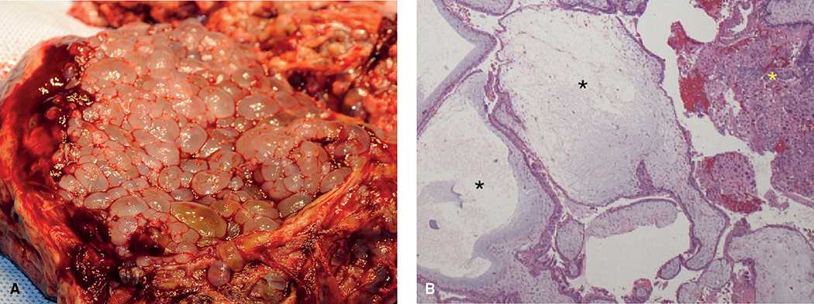
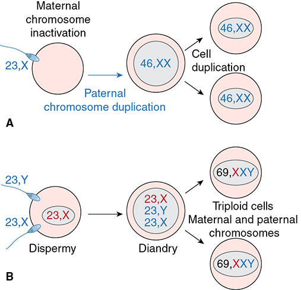
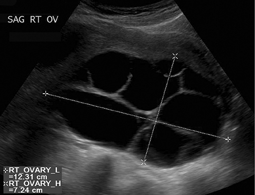
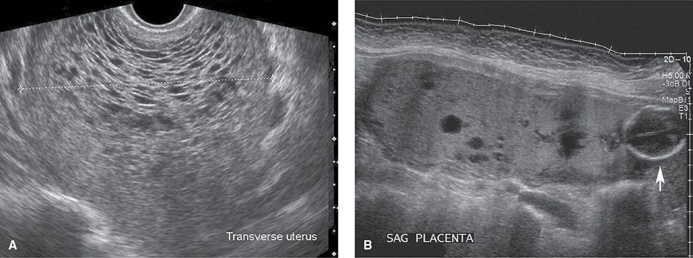

# Chapter 13: Gestational Trophoblastic Disease — Revision Notes

> Williams Obstetrics 26e, pp. 614–639 of the PDF. High-yield numbers are in **bold**.
> The five tables are transcribed from the PDF images (they are missing from the extracted chapter text). All 4 figures are included from the PDF.

**Big picture:** GTD = tumors of abnormal trophoblast proliferation, all of which make **hCG**. Serum hCG is therefore the key to **diagnosis, treatment and surveillance**. Molar pregnancies are **benign but can progress to GTN**. GTN is usually diagnosed from **hCG behavior rather than histology** and is **highly curable with chemotherapy**.

---

## 1. Classification

- **Hydatidiform moles** have **villi**: excessively edematous immature placentas.
  - **Benign:** complete and partial mole.
  - **Malignant:** **invasive mole** (penetrates and destroys the myometrium; can metastasize).
- **Nonmolar trophoblastic neoplasms** have **no villi**: choriocarcinoma, placental site trophoblastic tumor (PSTT), epithelioid trophoblastic tumor (ETT). They are distinguished by the trophoblast type they contain.
- **Gestational trophoblastic neoplasia (GTN)** = the malignant forms: **invasive mole, choriocarcinoma, PSTT, ETT**.
  - Can arise weeks or years after **any** pregnancy, but most often after a mole.
  - Rarely diagnosed histologically → managed as **one clinical entity** based on hCG and clinical findings.

### Table 13-1. Modified WHO Classification of GTD

| Molar Pregnancies | Trophoblastic Tumors |
|---|---|
| Hydatidiform mole: Complete | Choriocarcinoma |
| Hydatidiform mole: Partial | Placental site trophoblastic tumor |
| Invasive mole | Epithelioid trophoblastic tumor |

*GTD = gestational trophoblastic disease; WHO = World Health Organization. From Hui, 2014a,b.*

---

## 2. Hydatidiform Mole (Molar Pregnancy)

- Classic histology: **trophoblast proliferation + villous stromal edema**.
- Classified as complete or partial by the degree of histological change, **karyotype, immunostaining**, and presence of **embryonic elements**. **GTN follows complete moles more often.**
- **Gross:** complete mole = mass of **clear vesicles** of varying size hanging in clusters from thin pedicles. Partial mole = **focal**, less advanced change with some **fetal tissue**. Both usually fill the cavity; rarely ectopic.

*Figure 13-1. Complete mole: (A) grape-like vesicles of variable size; (B) edematous avascular villi with central cisterns (black asterisks) and haphazard trophoblastic hyperplasia (yellow asterisk).*

### Table 13-2. Features of Partial and Complete Hydatidiform Moles

| Feature | Partial Mole | Complete Mole |
|---|---|---|
| **Karyotype**ᵃ | **69,XXX or 69,XXY** | **46,XX** |
| **Clinical presentation** | | |
| Diagnosis | Missed abortion | Molar gestation |
| Uterine size | **Small for dates** | **Large for dates** |
| Theca-lutein cysts | Rare | **25–30% of cases** |
| Initial hCG levels | **<100,000 mIU/mL** | **>100,000 mIU/mL** |
| Medical complicationsᵇ | Rare | Uncommon |
| Rate of subsequent GTN | **1–5% of cases** | **15–20% of cases** |
| **Pathology** | | |
| Embryo-fetus | Often present | Absent |
| Amnion, fetal erythrocytes | Often present | Absent |
| Villous edema | Focal | Widespread |
| Trophoblastic proliferation | Focal, slight to moderate | Slight to severe |
| Trophoblast atypia | Mild | Marked |
| p57ᴷᴵᴾ² immunostaining | **Positive** | **Negative** |

*ᵃTypical karyotypes. ᵇThese include anemia, hyperthyroidism, hyperemesis gravidarum, preeclampsia, and infection. GTN = gestational trophoblastic neoplasia; hCG = human chorionic gonadotropin.*

### Epidemiology and risk factors
- Higher in **Asians, Hispanics and American Indians**.
- US/Europe incidence **~1 per 1000 deliveries** (stable).
- **Strongest risk factors: maternal age (both extremes) and a prior mole.**

| Prior history | Risk of another mole |
|---|---|
| One complete mole | **0.9%** |
| One partial mole | **0.3%** |
| Two complete moles | **~20%** |

### Pathogenesis
| | Complete mole | Partial mole |
|---|---|---|
| Ploidy | **Diploid** | **Triploid** |
| Usual karyotype | **46,XX** | **69,XXX or 69,XXY** (69,XYY rare) |
| Mechanism | **Androgenesis**: empty/inactivated ovum + one haploid sperm that **duplicates** its chromosomes. Less often **dispermy** (46,XY or 46,XX) | **Dispermy** (two sperm + one normal haploid ovum = **diandry**); less often one **unreduced diploid 46,XY sperm** |
| Parental origin | **All paternal** | **Two paternal sets + one maternal** |
| Fetus | None | Some embryonic development, but **lethal**: severe FGR, multiple anomalies |

> **Memory hook:** "Complete = Completely paternal (46,XX, no fetus). Partial = Part mother (69, triploid, with fetus)."

*Figure 13-2. (A) Complete mole: a 23,X sperm fertilizes an inactivated egg and duplicates → 46,XX, all paternal. (B) Partial mole: dispermy of a normal egg → 69,XXY triploid (diandry).*

### Twin pregnancy: normal fetus + complete mole
- Must be distinguished from a **single partial mole** with an abnormal fetus. Other mimics: **placental mesenchymal dysplasia**, subchorionic hematoma, chorioangioma.
- Confirm with **CVS, amniocentesis or fetal blood sampling + fetal karyotype**.
- Complications: **thyrotoxicosis** (common); most worrying are **preeclampsia and hemorrhage** → often **preterm delivery**. Many choose termination.
- Of 92 continued pregnancies: **42%** miscarried or had a perinatal death; **~60%** delivered preterm; **40%** at term.
- **GTN risk is not significantly different** whether the pregnancy is continued or terminated.

### Clinical findings
- Diagnosed earlier today (early prenatal care, universal sonography): median evacuation at **9 wk (complete)** and **12 wk (partial)** → most treated before complications.
- Usually **1–2 months of amenorrhea** first; symptoms are more marked with complete moles.
- **Uterine bleeding** in almost all untreated moles (spotting to profuse; often intermittent for weeks); concealed bleeding → **iron-deficiency anemia**.
- **Nausea and vomiting** may be significant.
- **Uterus larger than dates and softer.** No fetal heart motion with a complete mole.
- **Theca-lutein cysts** (multiple, ovaries full and cystic): more common with complete moles; from **hCG overstimulation** of the theca layer (hCG and LH share a receptor).
  - They **regress after evacuation** → **expectant management**.
  - Torsion/infarction/hemorrhage can occur; **oophorectomy only if extensive infarction persists after untwisting**.
- **Thyroid:** hCG is thyrotropin-like → **↑ free T4, ↓ TSH**; clinical thyrotoxicosis is unusual (bleeding and sepsis may mimic it); fT4 normalizes rapidly after evacuation. "Thyroid storm" reported.
- **Severe preeclampsia/eclampsia** is relatively common with **advanced** moles (rare now), except with a coexisting normal twin.

*Figure 13-3. Theca-lutein cysts: an enlarged (12 × 7 cm) multiloculated ovary from hCG overstimulation with a complete mole; managed expectantly, they regress after evacuation.*

---

## 3. Diagnosis

### Serum β-hCG
- **Complete mole:** β-hCG usually **above** expected for gestational age; **values in the millions** with advanced moles.
- ⚠️ **Hook effect:** very high hCG saturates the assay antibody → **false-negative urine test**. Serum hCG, with or without **dilution**, is positive.
- **Partial mole:** may be high, but more often **within the expected range**.

### Sonography
- The mainstay, but in >1000 moles **sensitivity 44%, specificity 74%**.
- **Complete mole:** echogenic mass filling the cavity with numerous anechoic cysts, **no fetus or amnionic sac** = **"snowstorm"**. Color Doppler: marked **surrounding myometrial** flow but **no internal flow** (avascular villi).
- **Partial mole:** **thick, multicystic placenta + fetus or fetal tissue**; thin septa in the sac. Fetus usually dies in the 1st trimester; survivors show **FGR, oligohydramnios, limb or CNS defects**.
- **Early moles:** <½ show these features. An early complete mole may be a **polypoid hyperechoic mass without cysts**, surrounded by fluid.
- **Mimics:** incomplete or missed abortion (most common); multifetal pregnancy; leiomyoma with cystic degeneration.

*Figure 13-4. (A) Complete mole: "snowstorm" echogenic mass with many small cysts and no fetus. (B) Partial mole: enlarged multicystic placenta next to a fetal head (arrow).*

### Pathology
- Moles must be distinguished from **hydropic abortuses** (normal biparental conception that failed; villi swollen). **These need no surveillance.**
- **Before 10 weeks** classic molar changes may be absent (villi not enlarged, stroma not yet edematous).
- **p57ᴷᴵᴾ² immunostaining:**
  - p57 gene is **paternally imprinted, maternally expressed** → protein present only when a **maternal allele** exists.
  - **Complete mole: p57 NEGATIVE** (no maternal genome).
  - **Positive** in normal placenta, hydropic abortus and **partial mole**.
- **Molecular genotyping** (parental source of alleles) separates a partial mole from a hydropic abortus:

| Genotype | Diagnosis |
|---|---|
| **Diploid diandric** | Complete mole |
| **Triploid diandric-monogynic** | Partial mole |
| **Biparental diploid** | Nonmolar hydropic abortus |

---

## 4. Management

- Maternal death is rare thanks to early diagnosis, evacuation and surveillance.
- **Preoperative evaluation** looks for preeclampsia, hyperthyroidism, anemia, electrolyte loss from hyperemesis and metastases.
- **Chest radiograph** for most. **CT/MRI only** if the CXR shows lung lesions or other extrauterine disease is suspected.

### Table 13-3. Some Considerations for Management of Hydatidiform Mole

**Preoperative**
- Laboratory:
  - Hemogram; serum β-hCG, creatinine, and hepatic aminotransferase levels
  - **TSH, free T₄** levels
  - Type and Rh; group & screen or crossmatch depending on uterine size
- **Chest radiograph**
- Consider hygroscopic dilators

**Intraoperative**
- Large-bore intravenous catheter(s)
- Regional or general anesthesia
- **Oxytocin (Pitocin): 20 units in 1000 mL Ringer lactate** for continuous infusion
- One or more other uterotonic agents may be added as needed:
  - **Methylergonovine** (Methergine): **0.2 mg** = 1 mL = 1 ampule IM every 2 h prn
  - **Carboprost tromethamine** (PGF₂α) (Hemabate): **250 µg** = 1 mL = 1 ampule IM every 15–90 min prn
  - **Misoprostol** (PGE₁) (Cytotec): **200-µg** tablets for rectal administration, **800–1000 µg** once
- **Karman cannula: size 10 or 14 mm**
- Consider sonography machine

**Postevacuation**
- **Anti-D immune globulin** (Rhogam) if Rh D-negative
- Initiate effective contraceptionᵃ
- Review pathology report
- **Serum hCG levels: within 48 h of evacuation, weekly until undetectable, then monthly for 6 months**

*ᵃIntrauterine devices are not suitable during surveillance. hCG = human chorionic gonadotropin; IM = intramuscular; PG = prostaglandin; T₄ = thyroxine; TSH = thyroid-stimulating hormone. The printed table gives the misoprostol dose as "200 mg tablets ... 800–1000 mg once", an obvious typo for µg (corrected here).*

### Molar evacuation
- **Suction curettage is preferred regardless of uterine size.**
- **Osmotic dilator** first if the cervix is minimally dilated.
- Bleeding can exceed that of a nonmolar uterus of the same size → with large moles ensure **adequate anesthesia, IV access and blood bank support**.
- Dilate to admit a **large Karman cannula (10–14 mm)**. **Start oxytocin as evacuation begins.** **Intraoperative sonography** helps ensure an empty cavity and ↓ perforation.
- After the myometrium contracts, gentle **sharp curettage with a large-loop Sims curette**.
- Ongoing bleeding → more uterotonics → rarely **pelvic artery embolization, packing, hysterectomy**.
- **Trophoblastic deportation** into pelvic veins during evacuation → with large moles, **respiratory insufficiency, pulmonary edema or embolism**; usually clears rapidly without specific treatment.
- **Anti-D immunoglobulin for D-negative women** (partial moles may contain fetal D-positive red cells; complete vs partial is not known until histology).
- **Prophylactic chemotherapy is NOT recommended** (no long-term benefit, significant toxicity).
- **Hysterectomy with ovarian preservation:** for women who have finished childbearing with **high-risk complete moles**. **Women aged 40–49: up to 50% develop GTN**, and hysterectomy markedly ↓ this. Theca-lutein cysts are left (they regress).
- **Labor induction or hysterotomy** is rarely used: more blood loss and possibly more persistent disease.

### Postevacuation surveillance
- Use an hCG assay that detects **all hCG isoforms** (different from routine pregnancy tests).
- **Baseline β-hCG within 48 h** → repeat every **1–2 weeks** until **undetectable**.
  - Median time to resolution: **6 wk (partial)**, **7 wk (complete)**.
  - Normal by **14 wk in 95%** and by **25 wk in 99%**.
- Then **monthly for 6 more months** → stop surveillance and allow pregnancy.
- **Reliable contraception** throughout: **combined hormonal contraception, DMPA or progestin implant** (last two if poor compliance expected).
  - ⚠️ **No IUD until hCG is undetectable** (perforation risk if an invasive mole is present).
- Pregnancy during surveillance is not advised, but live-birth and anomaly rates look normal.
- **Rising or plateaued hCG (not pregnant) → evaluate for GTN.**

**Risk factors for postmolar GTN**
- **Complete mole (15–20%)** vs partial mole (1–5%). Earlier evacuation has **not** lowered this risk.
- **Older maternal age**
- **Pre-evacuation β-hCG >100,000 mIU/mL**
- **Uterus large for gestational age**
- **Theca-lutein cysts >6 cm**
- **Slow β-hCG decline**

---

## 5. Gestational Trophoblastic Neoplasia

- Invasive mole, choriocarcinoma, PSTT, ETT: almost always follow a recognized pregnancy.

| Antecedent pregnancy | Share of GTN |
|---|---|
| **Hydatidiform mole** | **½** |
| Miscarriage or tubal pregnancy | ¼ |
| Preterm or term pregnancy | ¼ |

- Usually diagnosed from **persistently raised β-hCG alone** (tissue rarely available).

### Table 13-4. Criteria for Diagnosis of Gestational Trophoblastic Neoplasia

1. **Plateau** of β-hCG level (**± 10 percent**) for **four measurements** during a period of **3 weeks or longer**—days 1, 7, 14, 21
2. **Rise** of serum β-hCG level **>10 percent** during **three weekly consecutive measurements** or longer, during a period of **2 weeks or more**—days 1, 7, 14
3. Serum β-hCG level **remains detectable for 6 months or more**
4. Histological criteria for **choriocarcinoma**

> **Memory hook:** "**4-3 plateau, 3-2 rise, 6 months still there, or chorio on the slide.**"

### Diagnosis, staging and prognostic scoring
- **Most common finding: irregular bleeding with uterine subinvolution** (continuous, intermittent, or sudden and massive). Myometrial perforation → **intraperitoneal hemorrhage**.
- May show **lower genital tract metastases** (bluish vascular masses) or only distant metastases with no uterine tumor.
- **Thinking of GTN is the most important factor**: unusually **persistent bleeding after any pregnancy → measure β-hCG**.
- ⚠️ **Do not biopsy vaginal metastases** (unnecessary, can bleed heavily).
- **Work-up:** baseline β-hCG, hemogram, **liver and renal function**, **TVS**, **chest CT or radiograph**, **brain and abdominopelvic CT or MRI**; less often **PET** and **CSF β-hCG**.
- **No extrauterine disease:** a **second curettage or hysterectomy** may be considered → β-hCG every **2 weeks until 3 consecutive undetectable**, then **monthly for 6 months**.
- **Persistent hCG or extrauterine disease → stage and start chemotherapy.**
- Staging is **clinical (FIGO 2009)** with the **modified WHO prognostic score** (each factor scored 0–4).
  - **Score 0–6 = low risk; ≥7 = high risk.**

### Table 13-5. International Federation of Gynecology and Obstetrics (FIGO) Staging and Diagnostic Scoring System for Gestational Trophoblastic Neoplasia

**Anatomical Staging**

| Stage | Extent |
|---|---|
| **I** | Disease confined to the uterus |
| **II** | GTN extends outside of the uterus but is limited to the genital structures (adnexa, vagina, broad ligament) |
| **III** | GTN extends to the **lungs**, with or without known genital tract involvement |
| **IV** | All other metastatic sites |

**Modified World Health Organization (WHO) Prognostic Scoring Systemᵃ**

| Scoresᵇ | 0 | 1 | 2 | 4 |
|---|---|---|---|---|
| Age (years) | <40 | ≥40 | — | — |
| Antecedent pregnancy | Mole | Abortion | Term | — |
| Interval after index pregnancy (mo) | <4 | 4–6 | 7–12 | >12 |
| Pretreatment serum β-hCG (mIU/mL) | <10³ | 10³ to 10⁴ | 10⁴ to 10⁵ | ≥10⁵ |
| Largest tumor size (including uterus) | <3 cm | 3–4 cm | ≥5 cm | — |
| Site of metastases | | Spleen, kidney | GI | **Liver, brain** |
| Number of metastases | — | 1–4 | 5–8 | >8 |
| Previous failed chemotherapy drugs | — | — | 1 | ≥2 |

*ᵃAdapted by FIGO. ᵇLow risk = WHO score of 0 to 6; high risk = WHO score of ≥7. β-hCG = beta human chorionic gonadotropin; GI = gastrointestinal; GTN = gestational trophoblastic neoplasia.*

### Histological classification (staging ignores histology)
| Type | Origin / features | Behaviour | hCG | Treatment |
|---|---|---|---|---|
| **Invasive mole** (chorioadenoma destruens) | Almost all arise from **complete or partial moles**; **trophoblast + whole villi** deep in myometrium, sometimes peritoneum, parametrium, vaginal vault | **Locally aggressive**, **less prone to metastasize** | Raised | Chemotherapy |
| **Gestational choriocarcinoma** | **Most common GTN after term pregnancy or miscarriage** (only ¼ follow a mole); cyto- and syncytiotrophoblast, **no villi**; invades myometrium and vessels → hemorrhage, necrosis, dark surface nodules | **Early blood-borne metastases**: **lungs and vagina** most common; also vulva, kidney, liver, brain, ovary, bowel. Theca-lutein cysts common | High | Chemotherapy |
| **Placental site trophoblastic tumor (PSTT)** | Uncommon; **intermediate trophoblast at the placental site** | Locally invasive, **chemoresistant** | **Only modestly raised**; high proportion of **free β-hCG** favors it | **Hysterectomy**; adjuvant multiagent chemo for higher-risk stage I and later stages |
| **Epithelioid trophoblastic tumor (ETT)** | Rare; **chorionic-type intermediate trophoblast**; mainly uterine | Relatively chemoresistant; **metastases common** | **Low**, with bleeding | **Hysterectomy**; combination chemo for metastases |

### Treatment
- Best managed by **oncologists**, ideally in **specialist GTN centers**. **Chemotherapy alone** is usually primary.
- Second evacuation (no extrauterine disease) may avoid or minimize chemo; curettage for bleeding or bulky retained tissue; hysterectomy as primary or adjuvant therapy in specific cases.
- **Low-risk / nonmetastatic: single-agent chemotherapy**: **methotrexate or actinomycin D** (equally effective as both combined; **methotrexate less toxic**). Repeat until hCG undetectable.
- **High-risk: combination chemotherapy**, e.g. **EMA-CO** (**E**toposide, **M**ethotrexate, **A**ctinomycin D, **C**yclophosphamide, **O**ncovin/vincristine) → **cure ~90%**. Adjuvant surgery or radiotherapy in selected cases.
- Causes of death: **hemorrhage from metastases**, respiratory failure, sepsis, multiorgan failure from chemoresistant disease.
- **After hCG is undetectable: surveillance for 1 year** with **effective contraception** (chemo is teratogenic; a new pregnancy confuses hCG).
- **Quiescent hCG:** very low, **plateaued** hCG without metastases (dormant trophoblast) → **observe without treatment**; **20%** later recur with active GTN.

---

## 6. Subsequent Pregnancy

- **After a mole:** fertility and outcomes are usually normal. **~1% risk of GTD in a later pregnancy** → **early sonography**.
- **After GTN chemotherapy: delay pregnancy for 1 year** (most relapses occur within it; methotrexate persists in tissues for months).
  - Pregnancy within 1 year usually still has a **favorable outcome**; no ↑ miscarriage or relapse, but relapse **diagnosis may be delayed** by the pregnancy.
  - Fertility and anomaly rates normal; **stillbirth ↑: 1.5% vs 0.8%** background.
- **For any later pregnancy after a mole or GTN:** send the **placenta/products for pathology** and check **β-hCG 6 weeks postpartum** (more useful after treated GTN than after a mole alone).

---

## Quick-Recall: Complete vs Partial Mole vs GTN Types

| Feature | Complete mole | Partial mole | Choriocarcinoma | PSTT / ETT |
|---|---|---|---|---|
| Karyotype | 46,XX (all paternal) | 69,XXX/XXY (diandric triploid) | Any antecedent pregnancy | Any antecedent pregnancy |
| Fetus | Absent | Present (abnormal) | — | — |
| Villi | Yes, diffuse edema | Yes, focal edema | **No** | **No** |
| p57 | **Negative** | Positive | — | — |
| hCG | >100,000, often millions | Usually as for dates | High | **Low / modest** (PSTT: free β-hCG) |
| Uterus | Large for dates | Small for dates | Subinvolution, bleeding | Bleeding |
| Theca-lutein cysts | 25–30% | Rare | Common | — |
| Progression to GTN | **15–20%** | **1–5%** | — | — |
| Metastases | — | — | Early, blood-borne (lung, vagina) | ETT: common |
| Treatment | Suction evacuation + hCG follow-up | Suction evacuation + hCG follow-up | Chemotherapy (MTX/actinomycin D; EMA-CO if high risk) | **Hysterectomy** (chemoresistant) |

## Key Numbers to Memorize
- Mole incidence **1/1000** deliveries; recurrence **0.9%** (complete), **0.3%** (partial), **~20%** after two complete moles
- Evacuation at median **9 wk** (complete) and **12 wk** (partial)
- Theca-lutein cysts **25–30%** of complete moles; cysts **>6 cm** = GTN risk factor
- Complete mole hCG **>100,000 mIU/mL** (millions possible → hook effect)
- Sonography for mole: sensitivity **44%**, specificity **74%**
- Karman cannula **10–14 mm**; oxytocin **20 U/1000 mL**; methylergonovine **0.2 mg**; carboprost **250 µg**; misoprostol **800–1000 µg** PR
- GTN after complete mole **15–20%**, partial **1–5%**; age **40–49 → up to 50%**
- hCG baseline within **48 h**, every **1–2 wk** until undetectable, then monthly × **6 months**; resolution median **6–7 wk**; **95%** by 14 wk, **99%** by 25 wk
- GTN origin: **½** mole, **¼** miscarriage/ectopic, **¼** term/preterm
- GTN criteria: plateau **±10%** × **4** values over **3 wk**; rise **>10%** × **3** values over **2 wk**; detectable **≥6 months**; choriocarcinoma histology
- WHO score **0–6 low risk, ≥7 high risk**; FIGO stage III = **lungs**; score 4 for liver/brain metastases, hCG ≥**10⁵**, interval >**12 mo**
- High-risk cure with EMA-CO **~90%**; surveillance **1 year** after treatment; quiescent hCG recurs in **20%**
- Later pregnancy: GTD recurrence **1%**; delay **1 year** after chemo; stillbirth **1.5% vs 0.8%**; hCG **6 wk postpartum**
