# Chapter 14: Obstetrical Imaging — Revision Notes

> Williams Obstetrics 26e, pp. 640–701 of the PDF. High-yield numbers are in **bold**.
> All 12 tables are transcribed from the PDF images (they are missing from the extracted chapter text). All 16 figures are included from the PDF.

**Big picture:** Ultrasound is the core imaging tool in pregnancy: it confirms dates and viability, finds and characterizes fetal, placental and fluid abnormalities, and guides procedures. Doppler adds flow information (umbilical artery for FGR, MCA for anemia). MR imaging is a problem-solving adjunct, never the screening tool.

---

## 1. Technology and Safety

### Physics
- Piezoelectric crystals convert electrical energy ↔ sound waves, emitted in pulses.
- **B-mode (grayscale):** dense tissue (bone) = bright echoes; fluid = dark. **50 to >100 frames/sec** → looks real-time.
- Ultrasound = frequency **>20,000 Hz**.
- **Higher frequency = better resolution; lower frequency = deeper penetration.**

| Transducer | Frequency | Use |
|---|---|---|
| Transvaginal | **5–12 MHz** | Early pregnancy (embryo is close to the probe) |
| Transabdominal | **4–6 MHz** | 1st and 2nd trimesters |
| Transabdominal, low frequency | **2–5 MHz** | 3rd trimester, obesity (poorer resolution) |

### Embryo and fetal safety
- **ALARA** = as low as reasonably achievable. Scan only for a valid medical indication.
- **No causal link** between diagnostic ultrasound and any adverse effect in human pregnancy, including **autism**.
- Machines must display two indices:
  - **Thermal index (TI):** probability of enough heating to injure. Higher with longer exams and **near bone**; theoretical risk highest in **organogenesis**.
    - Use **TIs (soft tissue) before 10 wk** and **TIb (bone) at ≥10 wk**.
    - **Pulsed Doppler has a higher TI than B-mode.** In the 1st trimester, if needed: **TI ≤0.7** and as brief as possible.
    - Document embryonic heart rate with **M-mode, not pulsed Doppler**.
  - **Mechanical index (MI):** risk of cavitation from rarefactional pressure. Only relevant in **gas-containing tissue** → **no microbubble contrast in pregnancy**. The fetus has no gas bodies, so it is not at risk.
- **"Keepsake" imaging** for nonmedical purposes is not condoned (FDA, AIUM, ACOG). Images from medically indicated exams may be shared.

### Operator safety
- Work-related musculoskeletal injury in **~70%** of sonographers: shoulder capsulitis/tendonitis, epicondylitis, carpal/cubital tunnel, neck/back strain.
- Risk factors: awkward posture, sustained static force, pinch grips, obese patients.
- Prevention: patient close, elbow near body, **shoulder abduction <30°**, thumb up; forearm parallel to the floor; back-supported chair; monitor **~15° below horizontal**; no reaching/twisting; frequent breaks.

---

## 2. Gestational Age Assessment
- Based on **certain LMP + first ultrasound measurement**. **Gestational sac size is NOT used** to date.
- If LMP is certain, the EDD uses LMP unless the discrepancy exceeds the thresholds in Table 14-1. Uncertain/unknown LMP → ultrasound sets the EDD.
- **CRL = most accurate dating method.** Transvaginal, midsagittal, neutral (nonflexed) position; **mean of 3 measurements**. Accurate to **±5–7 days before 14 wk**.
- **From 14⁰ wk:** BPD, HC, AC, FL. Accurate to **7–10 days before 22 wk**. EFW accuracy **within 15%**.
- **First scan at ≥22 wk = suboptimally dated** → consider a repeat scan in **3–4 wk** (especially if measurements are small → possible FGR).
- **IVF, fresh transfer:** EDD = retrieval/fertilization date **+266 d**. **Day-3 frozen embryo: +263 d**. **IUI: use LMP.**

### Table 14-1. Assessment of Gestational Age

| Gestational Ageᵃ | Parameter(s) | Threshold Value to Redateᵇ |
|---|---|---|
| <9 wks | CRL | **>5 d** |
| 9 to <14 wks | CRL | **>7 d** |
| 14 to <16 wks | BPD, HC, AC, FL | **>7 d** |
| 16 to <22 wks | BPD, HC, AC, FL | **>10 d** |
| 22 to <28 wks | BPD, HC, AC, FL | **>14 d** |
| ≥28 wks | BPD, HC, AC, FL | **>21 d** |

*ᵃBased on last menstrual period (LMP). ᵇUltrasound gestational age should be used if it differs from the LMP-derived gestational age by more than the threshold value. AC = abdominal circumference; BPD = biparietal diameter; CRL = crown-rump length; FL = femur length; HC = head circumference.*

> **Memory hook:** Redating thresholds go **5 → 7 → 7 → 10 → 14 → 21 days**: the later the scan, the more slack you give the LMP.

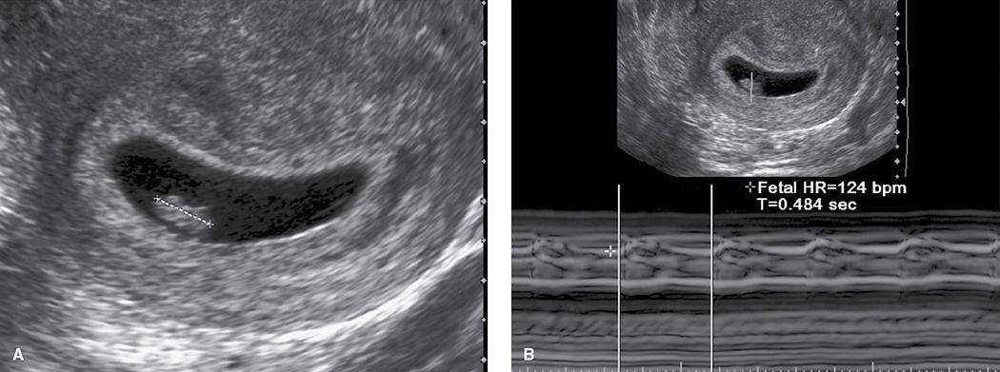

*Figure 14-1. A 6-week embryo with CRL ~7 mm (A); M-mode documents cardiac activity at 124 bpm (B).*

---

## 3. First-Trimester Ultrasound

**Three types:** (1) standard; (2) **nuchal translucency at 11–14 wk**; (3) **detailed 1st-trimester anatomy at 12–14 wk**.

- Ideal time to evaluate the **uterus, adnexa and cul-de-sac**, and to reliably diagnose anembryonic gestation, embryonic demise, ectopic pregnancy and GTD.
- **Chorionicity is most accurate in the 1st trimester.** Cesarean scar pregnancy is increasingly detected now.

### Key transvaginal milestones
| Finding | Timing / threshold |
|---|---|
| Intrauterine gestational sac | Visible by **5 wk** |
| Embryo with cardiac activity | By **6 wk** |
| Embryo must be seen once MSD reaches | **25 mm** (otherwise **anembryonic**) |
| Cardiac motion may be seen at CRL | **2 mm** |
| Cardiac motion should be seen at CRL | **7 mm** |
| CRL <7 mm with no heartbeat | **Rescan in 1 week** |
| Parkland: demise diagnosed at | **CRL ≥10 mm without cardiac motion** |

- Cardiac motion is documented by **video clip or M-mode**.
- New in the standard exam (when size permits): **calvarium, ventral-wall cord insertion, presence of limbs**.
- Criteria for 1st-trimester demise: Table 11-2.

### Table 14-2. Indications for First-Trimester Ultrasound Examination
- Confirm an intrauterine pregnancy
- Estimate gestational age
- Confirm cardiac activity
- Diagnose/evaluate a multifetal gestation, including chorionicity and amnionicity
- Assess for certain fetal anomalies, such as anencephaly
- Measure fetal nuchal translucency, when part of an aneuploidy screening program
- Evaluate for uterine abnormalities or pelvic masses
- Evaluate for suspected ectopic pregnancy
- Evaluate for suspected gestational trophoblastic disease
- Evaluate for the cause of vaginal bleeding
- Evaluate for the cause of pelvic pain
- Serve as adjunct to embryo transfer, chorionic villus sampling, and intrauterine device localization and removal

### Table 14-3. Components of Standard Ultrasound Examination by Trimester

| First Trimesterᵃ | Second and Third Trimester |
|---|---|
| Gestational sac size, location, and number | Gestational age assessment |
| Embryo and/or yolk sac identification | Fetal number, including amnionicity and chorionicity of multifetal gestations |
| Crown-rump length | Fetal weight estimation |
| Gestational age assessment | Fetal anatomical survey, including documentation of technical limitations |
| Fetal number, including amnionicity and chorionicity of multifetal gestations | Fetal cardiac activity, documented with M-mode or 2-dimensional video clip |
| Embryonic/fetal cardiac activity, documented with M-mode or 2-dimensional video clip | Fetal presentation |
| Fetal anatomy assessment including calvarium, nuchal region, ventral wall cord insertion, and presence of limbs (depending on gestational age and fetal size) | Amnionic fluid measurement (single deepest pocket, amniotic fluid index, or qualitative assessment) |
| Fetal nuchal translucency assessment | Placental location, appearance, and relationship to internal cervical osᵃ |
| Maternal uterus, adnexa, and cul-de-sac evaluation | Placental cord insertion site documentation when technically possible |
| | Evaluation of the maternal uterus, adnexa, and cervixᵃ |

*ᵃIf a transabdominal examination is not definitive, transvaginal (or transperineal) evaluation is recommended.*

### Nuchal translucency (NT)
- = maximum thickness of the subcutaneous translucent area at the back of the fetal neck, measured sagittally at **11–14 wk**.
- ↑ NT → ↑ risk of **aneuploidy** and structural anomalies, especially **heart defects**. Part of 1st-trimester aneuploidy screening (Ch 17); risk calculation depends on CRL.
- **NT ≥3 mm** → indication for a **detailed anatomical survey**.

### Table 14-4. Guidelines for Nuchal Translucency (NT) Measurement
- Angle of insonation is **perpendicular** to NT line
- Fetus is measured in **midsagittal plane**, with nasal tip, palate, and diencephalon visible
- Margins of NT edges are visible
- Majority of image is filled by the fetal head, neck, and upper thorax
- Fetal neck lies in a **neutral position**, not flexed or hyperextended
- **Amnion line must be separate** from the NT line
- \+ calipers are placed perpendicular to the fetal long axis, on the **inner borders** of the nuchal membranes, with none of the horizontal crossbar protruding into the space
- Measurement should be obtained at the **widest** NT space
- **Largest of 3** NT measurements should be used

### Detailed first-trimester examination (12–14 wk)
- For at-risk pregnancies at specialized centers. **Does NOT replace** the detailed 2nd-trimester survey.
- Detection of major anomalies at NT scan: **46% low-risk**, **>60% high-risk** (Karim, 2017).
- **Good detection:** anencephaly, alobar holoprosencephaly, ventral wall defects.
- **Poor:** only **⅓ of major cardiac anomalies**. **None** of: microcephaly, agenesis of the corpus callosum, cerebellar anomalies, CPAM, bowel obstruction (many haven't developed yet).

---

## 4. Second- and Third-Trimester Ultrasound
- **Offer to all women at 18–22 wk** (often done before 20 wk to preserve management options).
- Women average **4–5 sonograms** per pregnancy.
- Exam types: **standard, specialized, limited**. Specialized = detailed anatomy, PAS evaluation, fetal echo, Doppler, biophysical profile.

### Table 14-5. Indications for Standard Second- and Third-trimester Ultrasound Examinations
- Routine evaluation of gestational age and fetal anatomyᵃ
- Fetal growth evaluation or size-date discrepancy
- Fetal abnormality (follow-up evaluation)
- Amniocentesis or other procedure
- Cervical length assessment
- Multifetal gestation
- Vaginal bleeding
- Placenta previa or low-lying placentaᵇ
- Vasa previaᵇ
- Placenta accreta spectrumᵇ
- Placental abruptionᵇ
- Uterine or adnexal abnormalityᵇ
- Gestational trophoblastic diseaseᵇ
- Amnionic fluid volume abnormalityᵇ
- Preterm rupture of membranes or preterm labor
- Inability to document fetal heart tones
- Assessment of fetal well-being
- Assessment of fetal presentation
- Adjunct to external cephalic version

*ᵃStandard ultrasound examination should be offered in all pregnancies, ideally at 18–20 weeks' gestation. ᵇIncludes evaluation of suspected cases.*

### Standard examination
- Fetal number, presentation, cardiac activity, biometry, fluid, placental location, cervical length and anatomy survey (Table 14-3; components in Table 15-1).
- **Twins:** number of chorions and amnions, size comparison, fluid in each sac, fetal gender.
- **AIUM 2018 updates:**
  1. Added **hands and feet**, and when feasible the **3-vessel and 3-vessel-trachea views**.
  2. Placenta–cervix relationship unclear transabdominally → **transvaginal**.
  3. Cervix abnormal/not seen → transvaginal; **cervical length must come from a transvaginal image**.
  4. **Velamentous cord insertion** → color/pulsed Doppler to exclude **vasa previa**.

### Detailed ("targeted", **76811**) examination
- For ↑ risk of a structural or genetic abnormality (Table 14-6). Indication-driven; **not repeated** without a new risk factor.
- Table 15-1 lists ~**70** possible components; AIUM accreditation requires **50**.
- **Most common indications: maternal obesity and age ≥35.**
  - Obesity odds: NTD **1.9**, ventriculomegaly 1.7, cardiac 1.3, cleft 1.2, anorectal atresia 1.5, limb reduction 1.7. One study: higher anomaly rate with obesity **only when diabetes is present**.
  - Age ≥35: risk is from aneuploidy. **Euploid fetuses of older mothers have no higher anomaly rate.**

### Table 14-6. American Institute for Ultrasound in Medicine Indications for Detailed Second- and Third-trimester Ultrasound Examinations

| Category | Indications |
|---|---|
| **Prior fetus or infant** with a structural or genetic abnormality | — |
| **Current pregnancy** with known or suspected fetal abnormality or growth restriction | — |
| **Increased risk for fetal structural abnormality** in current pregnancy | Teratogen exposure (Chap. 8); **diabetes diagnosed before 24 weeks' gestation**; **nuchal translucency ≥3.0 mm**; abnormal serum analyte levels (e.g., elevated alpha fetoprotein); assisted reproductive technology used to achieve conception; **prepregnancy BMI ≥30 kg/m²**; multifetal gestation |
| **Increased risk for fetal genetic abnormality** in current pregnancy | Woman or her partner carries a genetic abnormality; **maternal age ≥35 years at delivery**; nuchal translucency ≥3.0 mm; abnormal aneuploidy screening test result (Chap. 17); minor aneuploidy marker found during standard ultrasound examination |
| **Other condition affecting the fetus** | Congenital infection (Chaps. 67, 68); substance abuse; alloimmunization (Chap. 18); amnionic fluid volume abnormality |
| **Suspected placenta accreta spectrum** or associated risk factors | — |

*Adapted from AIUM practice parameter for detailed second- and third-trimester diagnostic obstetric ultrasound examinations, 2019.*

### Fetal echocardiography — indications
- Suspected cardiac structural/functional abnormality; **heart rate abnormality or arrhythmia**
- Extracardiac anomaly or **hydrops**; chromosomal abnormality
- **NT ≥3.5 mm**
- **IVF**; **monochorionic twins**
- 1st-degree relative with congenital heart defect; 1st/2nd-degree relative with a Mendelian syndrome with childhood cardiac features
- Prior fetus with **heart block + maternal anti-Ro/La**
- **Retinoid** exposure; **pregestational diabetes, PKU**

### Limited examination
- Answers a specific question (number, presentation, heartbeat, fluid, placenta vs os); may include biometry but no full survey.
- Done only if a standard survey was already completed (unless emergency). Otherwise, if **≥18 wk**, do a standard exam.

### Fetal anomaly detection
- **Standard exam: ~60%** of major anomalies. **Detailed exam in high-risk: >90%**.
- **Maternal obesity ↓ detection by 20%.** EUROCAT: **40%** detected prenatally.

| Anomaly | Detection | Anomaly | Detection |
|---|---|---|---|
| **Anencephaly** | **98%** | Diaphragmatic hernia | 73% |
| Spina bifida | 89% | **Gastroschisis** | **92%** |
| Hydrocephaly | 82% | Omphalocele | 90% |
| Cleft lip/palate | 70% | **Bilateral renal agenesis** | **94%** |
| Hypoplastic left heart | 88% | Posterior urethral valves | 80% |
| Transposition of great vessels | 69% | Limb reduction / clubfoot | 60% / 60% |

- **Poorly detected:** microcephaly, choanal atresia, cleft palate, Hirschsprung disease, anal atresia, congenital skin disorders.
- Every exam should include a frank discussion of its **limitations**.

### Three-dimensional ultrasound
- A stored volume is rendered in any plane (static); 4-D = rapid reconstruction that looks real-time.
- Helps with **face, skeleton, tumors, some NTDs**, but **no better overall detection** than 2-D. ACOG: proof of clinical advantage is generally lacking.

---

## 5. Placenta and Cervix

### Placenta previa and low-lying placenta
- Placental location vs cervix can be assessed accurately by **~16 wk**; use transvaginal if transabdominal is limited.
- **Placenta previa:** placenta **overlies or reaches the margin** of the internal os.
- **Low-lying placenta:** inferior edge **within 2 cm** of the internal os but not reaching it.
- **Follow-up at ~32 wk** (transvaginal if needed); if it persists → **repeat at 36 wk**.

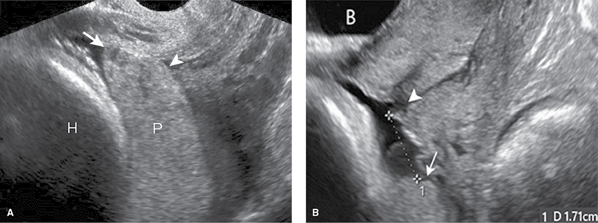

*Figure 14-2. Transvaginal views: placenta previa, edge covering the internal os (A); low-lying placenta, edge within 2 cm of the os (B).*

### Cord insertion and vasa previa
| Entity | Definition |
|---|---|
| **Marginal (battledore)** | Cord inserts at the placental edge or **within 2 cm** of the margin |
| **Velamentous** | Cord inserts into the **membranes**; vessels run unprotected by Wharton jelly |
| **Vasa previa** | Fetal vessels in membranes **over or within 2 cm of the cervix** (velamentous cord or vessels linking a **succenturiate lobe**) |

- Diagnosis: **transvaginal color Doppler**; pulsed Doppler of the vessel shows a **fetal heart rate** → confirms. Detailed follow-up at **32 wk**.

### Placenta accreta spectrum (PAS)
- Accreta / increta / percreta = invasion **onto / into / through** the myometrium.
- Evaluate transabdominally + transvaginally, ± color/power Doppler, **bladder partially filled**.
- Ultrasound **sensitivity 91 / 93 / 89%**, **specificity 97 / 98 / 99%** (accreta / increta / percreta).

**Five sonographic criteria:**
1. **Placental lacunae** (vascular spaces ± prominent flow)
2. **Retroplacental myometrial thinning**, smallest thickness **<1 mm** (loss of the retroplacental clear space)
3. **Disrupted bladder–uterine serosal interface** (irregular echogenic line)
4. **Bridging vessels** from placenta to bladder–serosal interface (color Doppler)
5. **Placental bulge** distorting the uterine contour; a focal exophytic mass in some percretas

- Accuracy depends on the number of findings and risk factors (previa, number of prior cesareans). **Previa + prior cesarean + any finding → detailed evaluation.** Serial scans help, especially in the 3rd trimester.

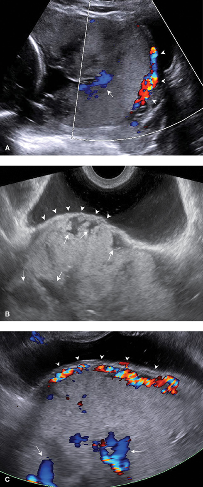

*Figure 14-3. PAS signs: bridging vessels and large lacunae (A); bulge toward the bladder with irregular lacunae (B); disrupted bladder–serosal interface with myometrium <1 mm (C).*

### Cesarean scar pregnancy (CSP)
- Implantation in a prior hysterotomy scar; often a **precursor of PAS**.
- Sac **low and anterior**, resting on the scar or filling the **"niche"** (myometrial pocket defect).
- Placental sonolucencies (precursors of lacunae); anterior trophoblast-to-serosa distance **<3 mm**; prominent vascularity at the scar; sac may bulge toward the bladder. (Management: Ch 12.)

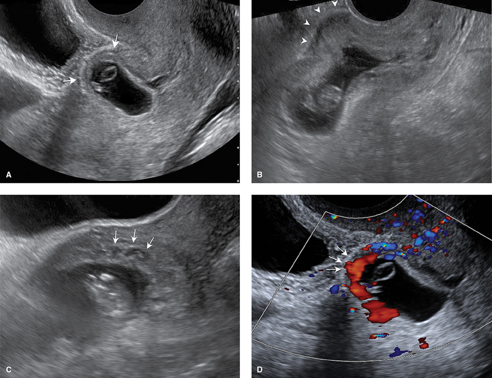

*Figure 14-4. Cesarean scar pregnancy: trophoblast filling the niche, bulge toward the bladder, sonolucencies and <1 mm myometrium with scar vascularity.*

### Cervical length
- Transabdominal views are limited (habitus, fetal part) and a full bladder or probe pressure **artificially lengthens** the cervix.
- **Only transvaginal cervical length is used for clinical decisions**; measure at **≥16 wk**.
- Short cervix → ↑ preterm birth risk, proportional to shortening, especially with a **prior preterm birth** (Ch 45).
- **Funneling** = membranes protrude into a dilated upper canal. **Not an independent predictor**, but linked with shortening. **Measure the cervix distal to the funnel** (the funnel base is the functional internal os).
- Dilated cervix (insufficiency) → membranes prolapse into the vagina → **hourglass** appearance.
- **Sludge** = particulate debris near the internal os; **further ↑ preterm birth risk** in at-risk women.

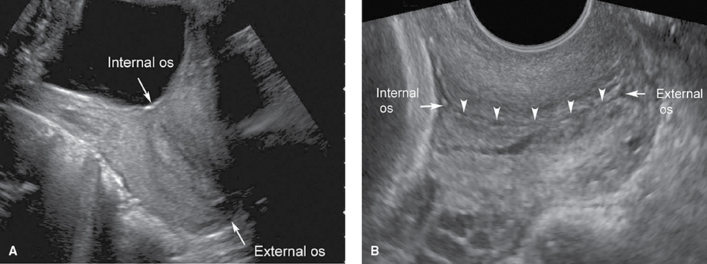

*Figure 14-5. Cervix transabdominally (A) vs transvaginally (B): only the transvaginal length is used for decisions.*

### Table 14-7. Criteria for Transvaginal Evaluation of the Cervix

**Imaging the cervix**
- Maternal **bladder should be empty**.
- Transducer is inserted under real-time observation, identifying midsagittal plane, internal os, and then external os, while keeping the internal os in view.
- Internal os, external os, and entire endocervical canal should be visible. The internal os may appear as a small triangular indentation at the junction of the amnionic cavity and endocervical canal.
- Image is enlarged so that the cervix fills approximately **75% of the screen**.
- Anterior and posterior width of the cervix should be approximately equal.
- Transducer is pulled back slightly until the image begins to blur, ensuring that pressure is not placed on the cervix, then inserted only enough to restore a clear image.
- Images should be obtained with and without fundal or suprapubic pressure, to assess for dynamic change or shortening on real-time imaging.

**Measuring the cervix**
- Calipers are placed at the point where anterior and posterior walls of cervix meet.
- Endocervical canal appears as a faint, linear echodensity.
- If canal has a curved contour, a straight line between the internal and external os will deviate from the path of the endocervical canal.
- If midpoint of the line between the internal and external canal deviates by **≥3 mm** from the endocervical canal, measure the cervical length in **two linear segments**.
- Funneling, sludge (debris), or dynamic change is noted.
- At least **three separate images** are measured during a period of at least **3 minutes** to allow for dynamic change. Visualization of cervical shortening on real-time imaging, with or without fundal or suprapubic pressure, raises preterm birth risks.
- **Shortest** cervical length image that meets all criteria should be used.

*Adapted from AIUM, 2018a; Iams, 2013.*

> **Memory hook:** NT uses the **largest** of 3 measurements; cervical length uses the **shortest** of 3. Both err toward detecting risk.

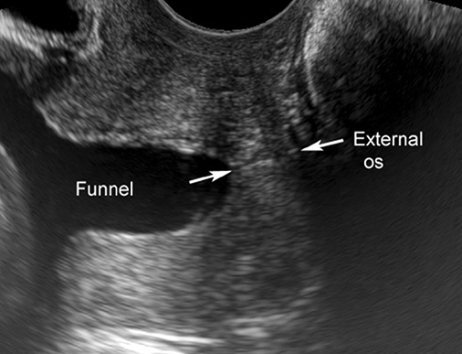

*Figure 14-6. Funneling: the cervical length is measured from the funnel tip (functional internal os) to the external os, excluding the funnel.*

---

## 6. Amnionic Fluid

### Physiology
- Roles: **lung growth** (fetal breathing), **GI development** (swallowing), space for movement, protection from **cord compression** and trauma, bacteriostatic.
- Early fluid = transudate (like extracellular fluid): **transmembranous** (across amnion), **intramembranous** (across fetal vessels on the placental surface), **transcutaneous** (across fetal skin, until **keratinization at 22–25 wk**).
- **Fetal urine is the main source from the 2nd half** of pregnancy; it becomes major only in the 2nd trimester → lethal renal anomalies may not cause severe oligohydramnios until **after 18 wk**.
- **Swallowing = main resorption route (500–1000 mL/d).** The whole volume is recirculated daily at term. Impaired swallowing (CNS or GI obstruction) → hydramnios.
- **Osmolality:** plasma ~**280**, amnionic fluid ~**260 mOsm/L** (hypotonic) → drives **up to 400 mL/d** intramembranous flow into fetal vessels. Maternal dehydration ↑ maternal osmolality → fluid moves fetus → mother.

### Table 14-8. Amnionic Fluid Volume Regulation in Late Pregnancy

| Pathway | Effect on Volume | Approximate Daily Volume (mL) |
|---|---|---|
| **Fetal urination** | Production | **1000** |
| Fetal lung fluid secretion | Production | 350 |
| **Fetal swallowing** | Resorption | **750** |
| Intramembranous flow across fetal vessels on the placental surface | Resorption | 400 |
| Transmembranous flow across amnionic membrane | Resorption | Minimal |

*Data from Magann, 2011; Modena, 2004; Moore, 2010.*

**Volume across gestation**
- **30 mL at 10 wk → 200 mL at 16 wk → 800 mL by the mid-3rd trimester.**
- Dye dilution: ~**400 mL at 22–30 wk**, **800 mL** until 40 wk, then **↓ 8% per week**.

### Semi-quantitative assessment
- Measured at every 2nd/3rd-trimester scan by **single deepest pocket (SDP)** or **AFI**. Subjective assessment alone is not recommended.
- **SDP:** sagittal, transducer perpendicular to the floor; pocket **≥1 cm wide**, no fetal parts or cord (check with color Doppler).
  - **Normal >2 and <8 cm** (≈ 3rd and 97th percentiles).
  - Used in **twins/multifetal** gestations (each sac) and in the **biophysical profile (>2 cm)**.
- **AFI:** sum of the deepest pocket in each of **4 quadrants**.
  - **Normal >5 and <24–25 cm.** Mean **12–15 cm** from 16 to 40 wk (Moore).
  - Rule of thumb: **AFI ≈ 3 × SDP**. Intra/interobserver variability <1 cm on average (2 SD up to 5–7 cm).

| | Oligohydramnios | Normal | Hydramnios |
|---|---|---|---|
| SDP | **<2 cm** | 2–8 cm | **≥8 cm** |
| AFI | **<5 cm** | 5–24 cm | **≥24–25 cm** |

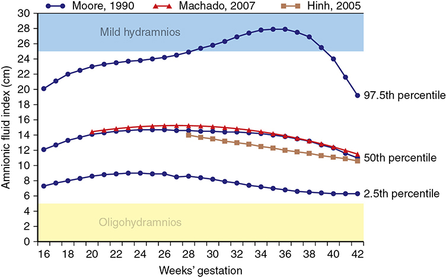

*Figure 14-7. AFI nomogram: mean 12–15 cm from 16–40 wk; AFI <5 cm is below the 2.5th percentile throughout; shaded bars mark oligo- and hydramnios thresholds.*

---

## 7. Hydramnios
- Complicates **1–2%** of singletons.

| Severity | AFI | SDP |
|---|---|---|
| Mild | **25–29.9 cm** | **8–9.9 cm** |
| Moderate | **30–34.9 cm** | **10–11.9 cm** |
| Severe | **≥35 cm** | **≥12 cm** |

- **Mild = ~⅔ of cases**, often idiopathic and benign. Severe is far more likely to have a cause and consequences.

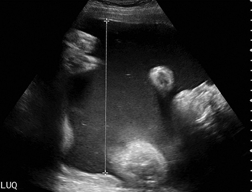

*Figure 14-8. Severe hydramnios: a pocket >15 cm, with an AFI of nearly 50 cm.*

### Causes
- **Fetal anomaly / genetic syndrome ~15%**; **diabetes 15–20%**.
- Less common: congenital infection (**syphilis, CMV, toxoplasmosis, parvovirus**), red cell alloimmunization, **placental chorioangioma**.
- **Hydrops** often coexists; mechanism is often a **high-output state** (classic example: **severe fetal anemia**).
- **Any hydramnios → detailed ultrasound.** If an anomaly is found, aneuploidy risk is significantly ↑.
- **Diabetes:** maternal hyperglycemia → fetal hyperglycemia → **fetal osmotic diuresis**. AFI correlates with amnionic fluid glucose. Repeat GDM screening is **not** helpful if the 2nd-trimester GTT was normal.
- **Twins:** hydramnios in **18%** (MC and DC alike). **MC: hydramnios in one sac + oligohydramnios in the other = TTTS**; isolated hydramnios in one sac may precede it.
- **Idiopathic** = diagnosis of exclusion; **up to 70%** of cases, **mild in ~80%**, resolves in **>⅓**.

### Table 14-9. Hydramnios: Prevalence and Associated Etiologies—Values in Percent

| | Golan (1993) n = 149 | Many (1995) n = 275 | Biggio (1999) n = 370 | Dashe (2002) n = 672 | Pri-Paz (2012) n = 655 |
|---|---|---|---|---|---|
| **Prevalence** | 1 | 1 | 1 | 1 | 2 |
| **Amnionic fluid index** | | | | | |
| Mild 25–29.9 cm | — | 72 | — | 66 | 64 |
| Moderate 30–34.9 cm | | 20 | | 22 | 21 |
| Severe >35 cm | | 8 | | 12 | 15 |
| **Etiology** | | | | | |
| Idiopathic | 65 | 69 | 72 | 82 | 52 |
| Fetal anomalyᵃ | 19 | 15ᵃ | 8 | 11ᵃ | 38ᵃ |
| Diabetes | 15 | 18 | 20 | 7 | 18 |

*ᵃA significant correlation was identified between severity of hydramnios and likelihood of an anomalous infant. The table prints "Severe >35 cm"; the text defines severe as ≥35 cm.*

### Table 14-10. Selected Anomalies and Mechanism for Hydramnios

| Mechanism | Anomaly Examples |
|---|---|
| Impaired swallowing (CNS) | Anencephaly; hydranencephaly; holoprosencephaly |
| Impaired swallowing (craniofacial) | Cleft lip/palate; micrognathia |
| Tracheal compression or obstruction | Neck venolymphatic abnormality; CHAOSᵃ |
| Thoracic etiology (mediastinal shift) | Diaphragmatic herniaᵃ; cystic adenomatoid malformationᵃ; pulmonary sequestrationᵃ |
| High-output cardiac state | Ebstein anomalyᵃ; tetralogy of Fallot with absent pulmonary valveᵃ; thyrotoxicosisᵃ |
| Functional cardiac etiology | Cardiomyopathy, myocarditisᵃ |
| Cardiac arrhythmia | Tachyarrhythmiaᵃ: atrial flutter, atrial fibrillation, supraventricular tachycardia; bradyarrhythmiaᵃ: heart block |
| GI obstruction | Esophageal atresia; duodenal atresia |
| Renal-urinary | Ureteropelvic junction obstruction ("paradoxical hydramnios"); Bartter syndrome |
| Neurological or muscular etiology | Arthrogryposis, akinesia sequence; myotonic dystrophy |
| Neoplastic etiology | Sacrococcygeal teratomaᵃ; mesoblastic nephromaᵃ; placental chorioangiomaᵃ |

*ᵃPoses risk for hydrops. CNS = central nervous system; CHAOS = congenital high-airway obstruction sequence; GI = gastrointestinal.*

### Degree vs anomaly risk (Parkland, Dashe 2002)
| Hydramnios | Anomalous neonate | Anomaly at birth despite normal targeted scan |
|---|---|---|
| Mild | **~8%** | 1–2% |
| Moderate | **~12%** | 1–2% |
| Severe | **>30%** | **10%** |

- Anomaly found after delivery: **9%** neonatal period → **28%** by 1 year.

### Management
- Severe hydramnios with **preterm labor or maternal respiratory compromise** → **amnioreduction**.
  - **18- or 20-gauge needle**; remove **1000–2000 mL over 20–30 min**; aim for the **upper normal** range.
  - May be repeated **weekly or twice weekly**.
  - In 138 cases needing amnioreduction: GI malformation **20%**, chromosomal/genetic **~30%**, neurological **8%**, idiopathic only **20%**. First procedure at **31 wk**, median delivery **36 wk**.

### Outcomes
- **Preterm birth, placental abruption, uterine dysfunction in labor, PPH.**
  - Abruption follows **rapid decompression** (membrane rupture or amnioreduction), sometimes days–weeks later.
  - Overdistension → **atony → PPH**.
- With an identified cause, severity correlates with preterm delivery, SGA and perinatal death. **Idiopathic hydramnios is generally NOT linked to preterm birth.**
- **Idiopathic:** birthweight **>4000 g in ~25%** (bigger fetus → more urine); **cesarean 35–55%**.
- Stillbirth at **37 wk ~7× higher** with hydramnios (California data); risk compounded with **FGR**.

---

## 8. Oligohydramnios
- Complicates **1–2%** of pregnancies. **AFI <5 cm or SDP <2 cm.** AFI 5 cm is below the 2.5th percentile throughout the 2nd and 3rd trimesters.
- **AFI labels more women as oligohydramnios than SDP, without better outcomes** (Kehl 2016: **10% vs 2%** → more inductions, same neonatal outcome).
- **TTTS evaluation:** SDP **<2 cm** defines oligohydramnios.
- **Anhydramnios** = no measurable pocket.

### Causes
| Timing / mechanism | Examples |
|---|---|
| **No fetal urine (renal)** — kidneys main source by **18 wk** | **Bilateral renal agenesis**, bilateral MCDK, unilateral agenesis + contralateral MCDK, **infantile ARPKD** |
| **Bladder outlet obstruction** | Lower urinary tract obstruction |
| Complex GU anomalies | Persistent cloaca, **sirenomelia** |
| **Drugs** | **ACE inhibitors, ARBs** (2nd/3rd tri → fetal hypotension, renal ischemia, anuric renal failure; **skull hypoplasia, limb contractures**); **NSAIDs** (↓ fetal urine, **ductus arteriosus constriction**) |
| **Late 2nd / 3rd trimester** | **Uteroplacental insufficiency** (placental abnormality, preeclampsia, vascular disease); **CAOS** (chronic abruption–oligohydramnios sequence, usually with FGR) |

- Oligohydramnios **before 20–22 wk** → **pulmonary hypoplasia**; extremely poor prognosis unless fetal therapy is possible.
- Workup: **first exclude ruptured membranes**, then a detailed ultrasound (especially in the 2nd trimester).

### Management
- **<36 wk with normal anatomy and growth → expectant management + fetal surveillance.**
- **Deliver at 36⁰–37⁶ wk** (ACOG) — late-preterm/early-term fetal risks outweigh prematurity risks.
- Oral/IV maternal **hydration ↑ AFI**, but outcome benefit is unclear.

### Outcomes
- AFI <5 cm at **24–34 wk** → ↑ perinatal morbidity and mortality (Table 14-11).
- Meta-analysis: **2×** cesarean for nonreassuring fetal status; **5×** Apgar <7 at 5 min.

### Table 14-11. Pregnancy Outcomes in Women Diagnosed with Oligohydramnios between 24 and 34 Weeks' Gestation at Parkland Hospital

| Factor | AFI ≤5 cm (n = 166) | AFI 8 to 24 cm (n = 28,185) | p Value |
|---|---|---|---|
| **Major malformation** | **42 (25)** | 634 (2) | <.001 |
| Stillbirth | 8 (5) | 133 (<1) | <.001 |
| Gestational age at deliveryᵃ | 35.1 ± 3.3 | 39.2 ± 2.0 | <.001 |
| Preterm birth, spontaneousᵃ | 49 (42) | 1698 (6) | <.001 |
| Preterm birth, indicatedᵃ | 23 (20) | 405 (2) | <.001 |
| Cesarean delivery for nonreassuring fetal statusᵃ | 10 (9) | 1083 (4) | <.001 |
| Birthweight <10th percentileᵃ | 61 (53) | 3388 (12) | <.001 |
| Birthweight <3rd percentileᵃ | 43 (37) | 1130 (4) | <.001 |
| Neonatal deathᵃ | 1 (1) | 24 (<1) | <.001ᵇ |

*Data expressed as No. (%) and mean ± standard deviation. ᵃAnomalous infants excluded. ᵇThis difference was no longer significant after adjustment for gestational age at delivery. Data from Petrozella, 2011.*

### Borderline oligohydramnios (borderline AFI)
- **AFI 5–8 cm** (8 cm is <5th percentile in the mid-3rd trimester). Controversial.
- **No ↑** hypertension, stillbirth or neonatal death vs AFI >8 cm (Petrozella); ↑ FGR in one study, but not preterm birth or NICU admission.
- **Insufficient evidence to support surveillance or delivery.**

---

## 9. Doppler

### Principles
- **Doppler shift:** reflected frequency shifts in proportion to the velocity and direction of the moving target (RBCs).
- **Angle of insonation (θ)** must be close to **0°**; error grows as θ increases. **Ratios** cancel out cos θ.
- **S/D ratio** = peak systolic / end-diastolic flow → downstream **impedance**.
- **Continuous-wave:** two crystals (transmit + receive); used in M-mode; **cannot image individual vessels**.
- **Pulsed-wave:** one crystal; allows vessel localization and **color-flow mapping**. **Red = toward the transducer, blue = away.**

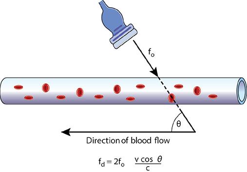

*Figure 14-9. Doppler equation: f_d = 2f₀ (v cos θ)/c. Accuracy depends on an insonation angle θ near zero.*

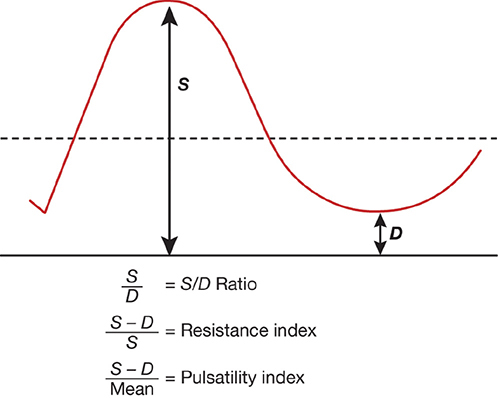

*Figure 14-10. Waveform indices: S/D ratio = S/D; resistance index = (S − D)/S; pulsatility index = (S − D)/mean.*

### Umbilical artery
- Normally **forward flow throughout the cardiac cycle**; diastolic flow ↑ with gestation (placental impedance ↓).
- **S/D ≤4.0 after 20 wk, <3.0 after 30 wk, ~2.0 at term.**
- More end-diastolic flow at the **placental** end, so AEDF/REDF appears **first at the fetal ventral-wall end**. Sample a **free loop** (ISUOG); near the ventral wall may improve reproducibility when flow is low.
- **Abnormal = S/D >95th percentile** for GA.
- **Reversed end-diastolic flow ↔ >70% obliteration** of small muscular arteries in tertiary stem villi.
- **Only proven use: managing FGR** (improves outcome). **Not** for other indications and **not** for FGR screening.
- Abnormal UA Doppler → **detailed anatomy scan** (anomalies and aneuploidy are common).

### Ductus arteriosus
- Used to monitor **indomethacin/NSAID** exposure, especially in the **3rd trimester**.
- Constriction → ↑ pulmonary flow → reactive arteriolar hypertrophy → **fetal pulmonary hypertension**.
- NSAIDs ↑ odds of ductal constriction **15-fold**; risk mostly with use **>72 h**. Stop the drug if constriction is seen; usually **reversible**.

### Uterine artery
- Uterine flow **50 mL/min early → 500–750 mL/min at term**. Normal: high diastolic flow, turbulent.
- **↑ resistance and a diastolic notch** → later gestational hypertension, preeclampsia, FGR (and superimposed preeclampsia in chronic hypertension when impedance ↑ at 16–20 wk).
- **Low predictive value; not recommended for screening** in high- or low-risk pregnancies.

### Middle cerebral artery (MCA)
- **Primary noninvasive test for fetal anemia** (alloimmunization surveillance); has replaced amniocentesis.
- Flow runs nearly "head-on" to the probe → accurate velocity. Axial view at the skull base, **within 2 mm of the internal carotid origin**; θ near 0, **≤30° angle correction**.
- Anemia → ↑ cardiac output + ↓ viscosity → **↑ peak systolic velocity (PSV)**.
- **MCA PSV ≥1.50 MoM** → **moderate or severe anemia** (Mari, 2000).
- **"Brain-sparing"** in hypoxemia (↑ end-diastolic MCA flow) is a misnomer: it signals ↑ perinatal morbidity/mortality.
- **Cerebroplacental ratio** = MCA PI / UA PI. PORTO: ratio **<1 → 11-fold** risk of adverse outcome in EFW <10th percentile. **Not standard** for timing delivery in FGR.

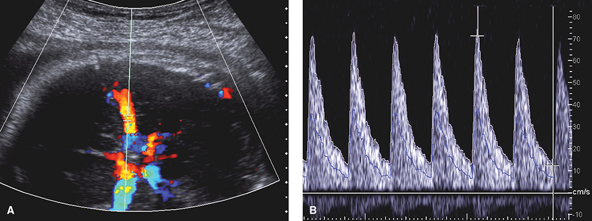

*Figure 14-11. MCA sampled at the circle of Willis (A); PSV >70 cm/sec at 32 wk = severe anemia from Rh alloimmunization (B).*

### Ductus venosus
- Shunts oxygenated umbilical venous blood to the **IVC**, bypassing the liver. Imaged near the diaphragm.
- Biphasic, normally **forward flow throughout**: ventricular systole peak, diastolic filling peak, then the **a-wave** nadir (atrial contraction).
- Proposed FGR progression: **UA → MCA → ductus venosus**. Severe FGR with cardiac dysfunction → a-wave **decreased → absent → reversed**, plus **pulsatile umbilical venous flow**.
- **Not recommended** for routine FGR management (ACOG, SMFM); has not improved outcomes.

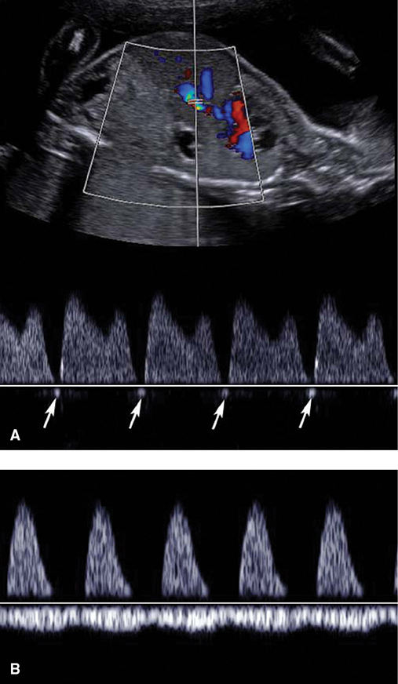

*Figure 14-12. Venous Doppler abnormalities in severe FGR: reversed a-wave in the ductus venosus (A); pulsatile umbilical vein flow (tricuspid regurgitation) with absent UA end-diastolic flow (B).*

---

## 10. Magnetic Resonance Imaging

### Principles and use
- Excites hydrogen ions using **1.5–3 Tesla** magnets; **<1 sec per slice**.
- Simple fluid (amnionic fluid, urine) is **bright on T2, dark on T1**.
- Better than ultrasound when limited by **bone, obesity, oligohydramnios or an engaged head**.
- Downsides: not portable, time-consuming, limited to referral centers.
- **Ultrasound remains the screening modality**; MR is for **problem solving** (diagnosis, counseling, treatment, delivery planning). Parkland: MR in **15%** of pregnancies with major fetal anomalies.

### Table 14-12. Fetal Conditions for Which Magnetic Resonance Imaging May Be Indicatedᵃ

| Region | Conditions |
|---|---|
| **Brain and spine** | Agenesis of the corpus callosum; cavum septum pellucidum abnormalities; cephalocele; cerebral cortical malformation or migrational abnormalities; family history conferring a risk for brain anomaly; hemorrhage; holoprosencephaly; hydranencephaly; infarctions; monochorionic twin pregnancy complications; neural-tube defects; posterior fossa abnormalities; sacral agenesis (caudal regression); sacrococcygeal teratoma; sirenomelia; solid or cystic masses; vascular malformations; ventriculomegaly; vertebral anomalies |
| **Skull, face, and neck** | Facial clefts; goiter; hemangiomas; teratomas; venolymphatic malformations; other abnormalities with potential airway obstruction |
| **Thorax** | Bronchogenic cyst or congenital lobar overinflation; congenital cystic adenomatoid malformation; diaphragmatic hernia; effusions; extralobar pulmonary sequestration; esophageal atresia; mediastinal masses; evaluation of pulmonary hypoplasia secondary to diaphragmatic hernia, oligohydramnios, chest mass, or skeletal dysplasia |
| **Abdomen, pelvis, and retroperitoneum** | Abdominopelvic cystic mass; bowel anomalies (anorectal malformations, complex obstructions); complex genitourinary anomalies (bladder outlet obstruction syndromes, bladder exstrophy, cloacal exstrophy); renal anomalies with oligohydramnios; tumors (sacrococcygeal teratoma, neuroblastoma, hemangioma, suprarenal or renal masses) |
| **Complications of monochorionic twins** | Assess morbidity after death of a monochorionic co-twin; determine vascular anatomy prior to laser treatment; evaluate conjoined twins |
| **Fetal surgery assessment** | Anomalies for which fetal surgery is planned; fetal brain anatomy before and after surgical intervention |

*ᵃIn some cases, magnetic resonance imaging is indicated only if the anomaly is suspected but cannot be adequately characterized sonographically, which is assessed on a case-by-case basis. Summarized from ACR-SPR practice parameter for fetal MRI, 2020.*

### Safety
- **No known adverse fetal effects without contrast**; no ionizing radiation. **1.5T and 3T are both safe.**
- Heating is reflected by the **specific absorption rate (SAR)** (FDA-regulated); follow ALARA.
- SPR recommends **3T** (better signal-to-noise); Parkland prefers **1.5T** for diagnosis (better field homogeneity), 3T for functional imaging.
- **Gadolinium:** crosses to the fetus, is excreted into amnionic fluid and re-swallowed; the longer it stays, the more toxic free **Gd³⁺** dissociates. Linked to slightly ↑ **rheumatological, inflammatory and infiltrative skin conditions** in children; nephrogenic systemic fibrosis in adults with renal disease.
  - **Not recommended in pregnancy without a life-threatening indication.**

### Technique
- Safety questionnaire first (metal implants, pacemakers).
- **Claustrophobia <1%** → single oral dose **diazepam 5–10 mg or lorazepam 1–2 mg**.
- Supine or **left lateral decubitus**; torso coil (body coil for large habitus).
- Sequence: 3-plane localizers → **T2 fast acquisition (SSFSE / HASTE / RARE), 7-mm slices, no gap** → **fast T1 (SPGR)** → targeted orthogonal T2 at **3–5 mm**.
- **T1-bright:** subacute hemorrhage, fat, **liver, meconium**. **STIR / fat-sat T2** separate lesions with similar water content (e.g., thoracic mass vs lung). **Diffusion-weighted imaging:** restricted diffusion in ischemia, cellular tumor, clot.

### Fetal anatomy evaluation
- ~**95%** of ISUOG components seen at 30 wk (**aorta and pulmonary artery hardest**); **99%** of non-cardiac anatomy.

### Central nervous system
- **T2:** CSF bright → posterior fossa, midline and cortex detail. **T1:** hemorrhage. Biometry matches ultrasound (nomograms for corpus callosum and vermis).
- Best yield **after 24 wk**. Adds CNS findings or changes the diagnosis in **~50%**; changes prognosis/management in **20%**.
- Uses: gyration/sulcation, **corpus callosum agenesis/dysgenesis**, migrational abnormalities, **septo-optic dysplasia** (absent septum pellucidum, hypoplastic optic tracts), **intracranial hemorrhage** (extent and timing), congenital infection.
- **ICH risk factors:** atypical ventriculomegaly, suspected **NAIT**, severe TTTS, or **demise of a monochorionic co-twin**.

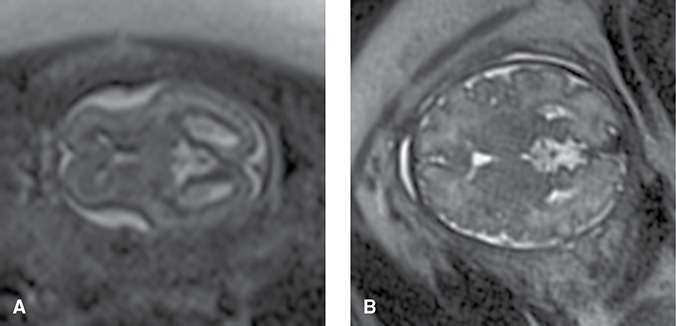

*Figure 14-13. Normal gyration and sulcation: smooth brain at 23 wk (A) vs folded cortex at 33 wk (B), HASTE sequence.*

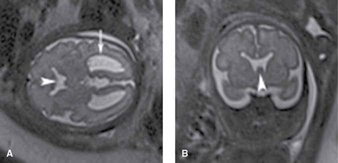

*Figure 14-14. Septo-optic dysplasia at 30 wk: absent cavum septum pellucidum with mild ventriculomegaly.*

### Thorax
- Size and location of masses, **lung volume**; feeding vessel distinguishes **CPAM vs pulmonary sequestration**.
- **CDH:** quantifies **herniated liver** and compressed lung.
- Lung volumes in prolonged oligohydramnios (renal anomalies, ruptured membranes).

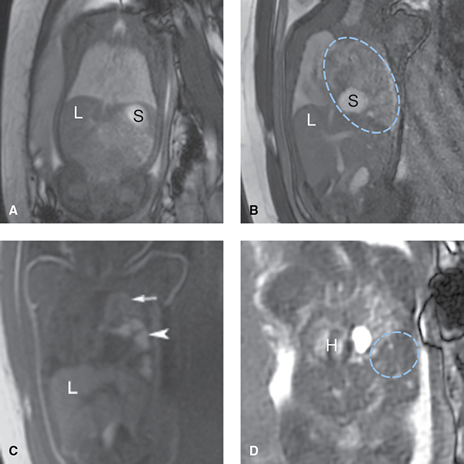

*Figure 14-15. Normal lungs (A) vs left CDH with stomach, bowel and meconium-filled colon in the chest and heart shifted right (B–D).*

### Abdomen
- **Meconium is T1-bright** → GI anomalies and **cloacal malformations**; distinguishes colon (meconium) from bladder (urine).
- **Meconium peritonitis calcifications: ultrasound is better.** Pseudocysts and abnormal meconium migration: MR is better.

### Adjunct to fetal therapy
- **Myelomeningocele** (brain/spine before repair); **sacrococcygeal teratoma** (pelvic extension).
- **Neck masses** → extent and airway compression → identifies candidates for **EXIT**. **Jaw index** for severe micrognathia.
- Before **laser for TTTS**: detect ICH or periventricular leukomalacia.

### Placenta
- Complements ultrasound in **PAS**, especially to define the **extent** of invasion. High sensitivity when combined with ultrasound; findings correlate with the need for **cesarean hysterectomy**.
- **MR signs of PAS:** **dark intraplacental T2 bands**, **focal bulge**, placental **heterogeneity**, involvement of the bladder–serosal interface, fibrin deposition.
- Emerging: **arterial spin labelling** (maternal RBCs as endogenous contrast, perfusion) and **radiomics texture analysis**.

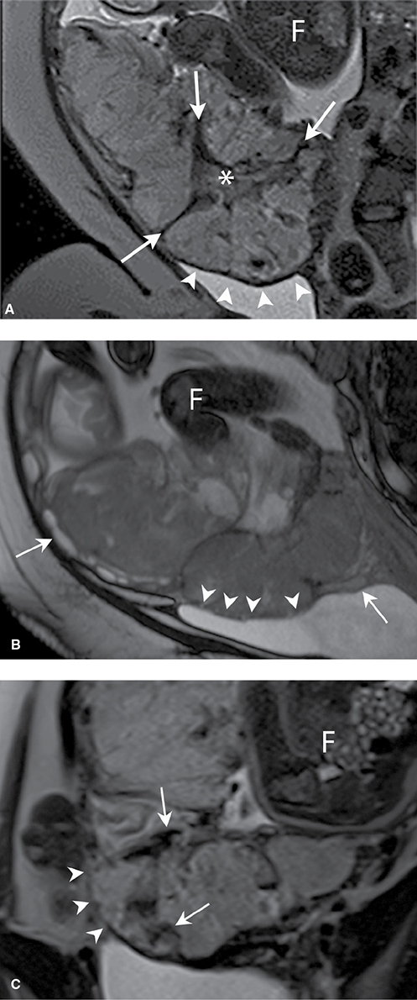

*Figure 14-16. Placenta percreta on MR: dark T2 bands, a bulge at the bladder–serosal interface and marked heterogeneity.*

---

## Quick-Recall: Which Test Answers Which Question

| Clinical question | Best test / sign | Key threshold |
|---|---|---|
| Dating | **CRL** (<14 wk) | Redate if >5 d (<9 wk) / >7 d (9–<14 wk) |
| Anembryonic gestation | Transvaginal MSD | **≥25 mm** with no embryo |
| Embryonic demise | Transvaginal CRL | No heartbeat at **CRL ≥7 mm** (Parkland ≥10 mm) |
| Aneuploidy/cardiac risk | Nuchal translucency (11–14 wk) | **≥3 mm** → detailed scan; **≥3.5 mm** → fetal echo |
| Previa / low-lying | Transvaginal scan (≥16 wk) | Covers/reaches os / **within 2 cm**; rescan **32 wk** |
| Vasa previa | TV color + pulsed Doppler | Fetal vessels **within 2 cm** of os; fetal HR on Doppler |
| PAS | US (5 signs) ± MR | Myometrium **<1 mm**, lacunae, bridging vessels, bulge |
| Preterm birth risk | **Transvaginal** cervical length (≥16 wk) | Shortest of 3; measure distal to funnel |
| Oligohydramnios | SDP / AFI | **SDP <2 cm / AFI <5 cm** |
| Hydramnios | SDP / AFI | **SDP ≥8 cm / AFI ≥24–25 cm**; severe **AFI ≥35 / SDP ≥12** |
| FGR management | **Umbilical artery Doppler** | S/D >95th percentile; AEDF/REDF |
| Fetal anemia | **MCA PSV** | **≥1.5 MoM** |
| NSAID exposure | Ductus arteriosus Doppler | Use >72 h; 15× constriction odds |
| Screening for preeclampsia/FGR | Uterine artery Doppler | **Not recommended** |
| Complex CNS/thoracic/GI anomaly, PAS extent | **MRI (no gadolinium)** | Best after 24 wk for CNS |

## Key Numbers to Memorize
- Transducers: TV **5–12 MHz**, TA **4–6 MHz**, late/obese **2–5 MHz**; TIs **<10 wk**, TIb **≥10 wk**; 1st-trimester Doppler **TI ≤0.7**
- CRL accuracy **±5–7 d**; biometry before 22 wk **±7–10 d**; EFW **±15%**; IVF EDD **+266 d** (day-3 frozen **+263 d**)
- Sac **5 wk**, heartbeat **6 wk**; MSD **25 mm** must show embryo; heartbeat by CRL **7 mm**
- Anatomy scan **18–22 wk**; standard detection **~60%**, detailed **>90%**; obesity **↓20%**; anencephaly **98%**
- Previa/low-lying: **2 cm**; follow-up **32 wk**, then **36 wk**; PAS US sensitivity ~**90%**, specificity **97–99%**
- Fluid: **30 mL (10 wk) → 200 mL (16 wk) → 800 mL**; urine **1000 mL/d**, swallowing **750 mL/d**, lung fluid **350 mL/d**
- SDP normal **2–8 cm**; AFI normal **5–24/25 cm**; AFI ≈ **3 × SDP**
- Hydramnios **1–2%**; anomaly **~15%**, diabetes **15–20%**, idiopathic **up to 70%**; anomalous neonate **8 / 12 / >30%** (mild/moderate/severe)
- Amnioreduction **1000–2000 mL over 20–30 min**, 18–20 G needle
- Oligohydramnios: deliver **36⁰–37⁶ wk**; major malformation **25%** with AFI ≤5 at 24–34 wk
- UA S/D: **≤4 (>20 wk), <3 (>30 wk), ~2 (term)**; REDF = **>70%** villous artery obliteration
- MCA PSV **1.5 MoM**; angle correction **≤30°**; CPR **<1** → **11×** adverse outcome
- MRI: **1.5–3 T**; CNS diagnosis changed in **~50%**, management in **20%**; no gadolinium unless life-threatening
