# Chapter 15: Normal and Abnormal Fetal Anatomy — Revision Notes

> Williams Obstetrics 26e, pp. 702–788 of the PDF. High-yield numbers are in **bold**.
> Both tables are transcribed from the PDF images (they are missing from the extracted chapter text). 25 of the 66 figures (the classic signs and key anomalies) are included from the PDF.

**Big picture:** The **standard anatomic survey** (ACOG "essential" / AIUM "minimal" elements) screens every pregnancy. The **detailed survey** (>60 components) is used for at-risk pregnancies and to characterize anomalies. **Any anomaly found → detailed survey + offer amniocentesis with chromosomal microarray (CMA)**. **Cardiac anomaly → fetal echocardiography.**

- Place the focal zone at the right level and magnify appropriately for every measurement.
- Fetal MR imaging is an adjunct (indications in Ch 14).

### Table 15-1. Components of Standard and Detailed Anatomic Surveys

| Region | Standard Ultrasound | Detailed Ultrasound, Additional Components |
|---|---|---|
| **Head, face, and neck** | Midline falx; cavum septum pellucidum; lateral ventricles; choroid plexus; cerebellum; cisterna magna; upper lip; nuchal skinfold measurement, 15–20 weeks | Cranial integrity and shapea; brain parenchymaa; lateral ventricle wall/lining and contour; third ventricle; fourth ventricle; corpus callosum; cerebellar vermisa and lobes; transverse cerebellar diameter; nasal bone measurement, 15–22 weeksa; profilea; coronal view of lenses, nosea, lips; orbits with measurement; maxillaa, mandiblea, palate, tongue; ear position, size; necka |
| **Thorax and heart** | Situs; heart rate (M-mode); four-chamber view of the heart; left ventricular outflow tract; right ventricular outflow tract; 3-vessel view, if feasible; 3-vessel trachea view, if feasible | Interventricular septum; superior/inferior venae cavaea; aortic archa; ductal arch; 3-vessel viewa; 3-vessel and trachea viewa; lungsa; diaphragm integritya; ribs |
| **Abdomen** | Stomach: presence, size, and situs; kidneys; urinary bladder; umbilical cord insertion into fetal abdomen; umbilical cord vessel number | Bowel, small and large; liver; gallbladder; spleen; renal arteries; adrenal glands; ventral wall integrity |
| **Spine** | Cervical, thoracic, lumbar, and sacral spine | Shapea, curvaturea, conus medullaris; integrity of spine and overlying tissuea |
| **Extremities** | Presence only: arms and legs; hands and feet | Architecture, position, numbera; long-bone measurements; fingers and toes (number, position)a |
| **External genitalia** | When indicated, e.g., multifetal gestation | External genitalia |

*aIn addition to all standard anatomy components, these detailed ultrasound components are required by the American Institute of Ultrasound in Medicine for normal cases submitted as part of the detailed ultrasound accreditation process. Modified from AIUM, 2018, 2019, 2020a.*

---

## 1. Biometry

### First trimester
- **CRL** establishes/confirms gestational age; the **earlier, the more accurate**.
- Midsagittal plane, **neutral (nonflexed)** position, straight line; use the **average of 3 measurements**.

### Second and third trimesters
- **BPD, HC, AC, FL** → confirm GA (if not set in 1st trimester) and estimate fetal weight (Hadlock nomograms).
- If one parameter is abnormal, consider excluding it; nomograms exist without head or femur measurements.

| Measurement | Plane / landmarks | Technique |
|---|---|---|
| **BPD & HC** | **Transthalamic view**: midline falx, **CSP, thalami, insula**; hemispheres symmetric; **cerebellum NOT visible** | BPD perpendicular to falx, **outer edge (near) → inner edge (far)**. HC = ellipse around outer skull edge, or **(BPD + OFD)/2 × π** |
| **AC** | Transverse: **stomach + J-shaped confluence of umbilical vein and portal sinus**; ≤1 rib each side; spine at 3 or 9 o'clock; **kidneys NOT visible** | Ellipse just **outside the skin edge**; image as round as possible |
| **FL** | Beam **perpendicular** to the shaft | Calipers at the ends of the **calcified diaphysis** |

- **AC is most affected by fetal growth**; **AC <10th percentile** can be used to diagnose **FGR**.
- **FL:AC ratio normally 20–24%**; **<18% → consider skeletal dysplasia** (especially if other long bones lag).
- Mildly short femur = minor marker for Down syndrome.
- Other nomograms: transverse cerebellar diameter, ocular distances, nasal bone, ear length, jaw index, thoracic circumference, liver, kidneys, long bones, feet.

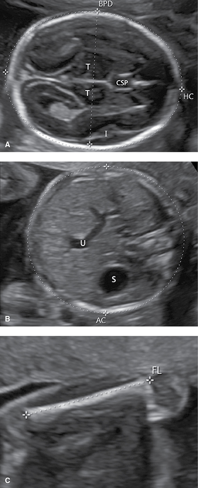

*Figure 15-2. Standard biometry planes: transthalamic BPD/HC (CSP, thalami, insula), AC at stomach + umbilical–portal confluence, and femur length.*

---

## 2. Brain and Spine

### Three standard transverse views
| View | Contents | Key measurements / normal values |
|---|---|---|
| **Transthalamic** | Falx, **CSP**, thalami, insula | BPD, HC |
| **Transventricular** | Lateral ventricles, choroid plexus | **Atrium 5–9 mm** (2nd & 3rd trimesters) |
| **Transcerebellar** | Falx, CSP, thalami, cerebellum, cisterna magna | **Cerebellum (mm) ≈ GA (wk) from 15–22 wk**; **cisterna magna 2–10 mm** (up to **12 mm** late 3rd trimester); **nuchal skinfold at 15–20 wk** |

**Cavum septum pellucidum (CSP)**
- Space between the two laminae separating the frontal horns. Visible **~17–37 wk**; after that, fusion may obliterate it.
- **Absent CSP → midline brain abnormality:**
  - Frontal horns **widely separated** → **agenesis of the corpus callosum**.
  - Frontal horns **communicate** → **septo-optic dysplasia (de Morsier)** or **lobar holoprosencephaly**.
- Abnormally **wide CSP** → trisomy 18.

**Choroid plexus cysts**
- Present in **0.5–2%** of normal pregnancies and **30–50% of trisomy 18**.
- Offer a detailed exam. **Isolated + no increased T18 screening risk → normal variant.**

**Posterior fossa**
- **Effaced cisterna magna → Chiari II.**
- **Enlarged cisterna magna** differential: vermian agenesis (complete/partial), posterior fossa cyst (e.g., arachnoid), **mega-cisterna magna** (diagnosis of exclusion, excellent prognosis).
- Cerebellar hypoplasia: associated with CNS and non-CNS anomalies.
- ↑ Nuchal skinfold → Down syndrome, other genetic syndromes, structural anomalies.

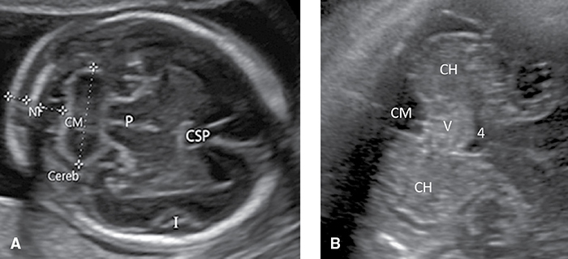

*Figure 15-5. Transcerebellar view: cerebellum, cisterna magna (2–10 mm) and nuchal fold measured; vermis with the 4th ventricle anterior to it.*

**Spine**
- Evaluate cervical, thoracic, lumbar, sacral segments. Sagittal/coronal images are representative, but **transverse images of each segment are most sensitive**.
- Transverse: **3 ossification centers**: anterior = vertebral body; posterior pair = lamina–pedicle junction.
- Ossification is **cranial → caudal**: **S1–S2 not visible before 16 wk**; entire sacrum may not be visible until **21 wk** → early 2nd-trimester detection is hard.

### Neural-Tube Defects (NTDs)
- Include anencephaly, myelomeningocele (spina bifida), cephalocele, rare spinal dysraphisms.
- Neural tube closes by embryonic day **26–28**.
- Prevalence **~0.9/1000** (US, most of Europe); **1.3/1000** (UK).
- Isolated NTD = **multifactorial**; recurrence **3–5%** without periconceptional folic acid.
- **Screening:** ultrasound alone, or ultrasound + **MSAFP**. At 15–20 wk, **MSAFP ≥2.5 MoM** detects **95% of anencephaly** and **80% of myelomeningocele**.
- Standard sonography is **at least comparable** to MSAFP; **detailed ultrasound is the preferred diagnostic test**.

**Anencephaly / acrania / exencephaly**
- **Anencephaly** = absent cranium and telencephalon above the skull base and orbits.
- **Acrania** = absent cranium with protruding disorganized brain; herniation of that tissue = **exencephaly**. **Anencephaly is the final stage of exencephaly** (brain tissue seen in late 1st trimester disappears later).
- Often diagnosed in the **late 1st trimester**; **virtually all** diagnosed in the 2nd trimester with adequate views.
- Signs: abnormal cranial contour → **"shower cap"**; **triangular face**; no ossified cranium on sagittal view.
- **Hydramnios** in the 3rd trimester (impaired swallowing). **Uniformly lethal** → consider perinatal palliative care.

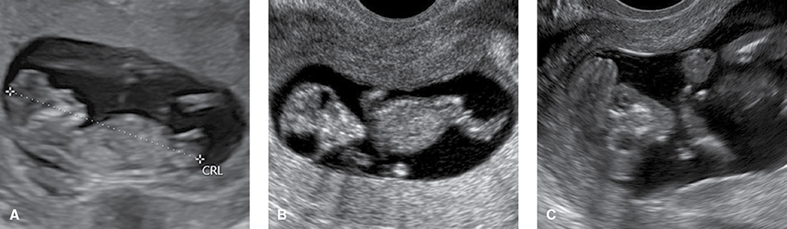

*Figure 15-7. Anencephaly/acrania at 11–14 wk: absent cranium with protruding disorganized brain, the "shower cap" appearance.*

**Cephalocele**
- Herniation of meninges through a cranial defect, usually **midline occipital**. With brain tissue = **encephalocele**; with cerebellum/posterior fossa = **Chiari III**.
- Microcephaly common by 3rd trimester; high rate of neurological deficits and intellectual disability.
- **Meckel-Gruber syndrome** (AR): **cephalocele + cystic renal dysplasia + polydactyly**.
- **Non-midline/non-occipital** cephalocele → suspect **amnionic-band sequence**.

**Spina bifida**
- Vertebral (dorsal arch) defect exposing meninges and nerve roots. Prevalence **~1 in 2000**.
- **Myelomeningocele** = meningeal sac + neural elements; **meningocele** = empty meningeal sac.
- Transverse views show **splaying of the lateral processes** and the level. Most are **open** (skin and soft tissue involved); **closed** (skin-covered) defects are harder to detect.
- **Cranial signs (Chiari II / Arnold-Chiari):**
  - **Lemon sign** = flattening/scalloping of the frontal bones.
  - **Banana sign** = anterior curvature of the cerebellum with **effaced cisterna magna**.
  - Mechanism: downward displacement of the cord pulls the cerebellum through the foramen magnum.
- **BPD often lags**; ventriculomegaly common after midgestation; **80–90% need VP shunt**.
- Multidisciplinary care: swallowing, bladder/bowel, ambulation. Fetal surgery → Ch 19.

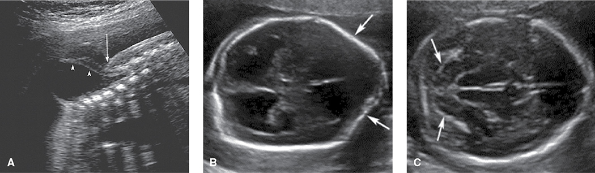

*Figure 15-9. Myelomeningocele: sac with nerve roots (A), lemon sign (B) and banana sign with effaced cisterna magna (C) of Chiari II.*

> **Memory hook:** **L**emon = **L**ooks at the front (frontal bones); **B**anana = **B**ack of the head (cerebellum).

### Ventriculomegaly
| Grade (SMFM 2018) | Atrial width | Normal development if isolated & non-progressive |
|---|---|---|
| Normal | **5–9 mm** | — |
| **Mild** | **10–12 mm** | **≥90%** |
| **Moderate** | **13–15 mm** | **≥75%** |
| **Severe** | **>15 mm** | Poorer; "**dangling choroid**" |

- Nonspecific marker of abnormal brain development.
- **Work-up:** detailed anatomy survey + **amniocentesis for CMA** + testing for **CMV and toxoplasmosis**; consider **fetal MRI**.
- Genetic causes: **L1 X-linked aqueductal stenosis**, Joubert, Walker-Warburg, hydrolethalus, lissencephaly.
- Skull usually **not** enlarged, **except** (macrocrania) **aqueductal stenosis** and **AVID syndrome** (asymmetric ventriculomegaly, interhemispheric cyst, callosal dysgenesis).
- Mild–moderate cases (systematic review ~1500): **infection 1–2%, aneuploidy 5%, neurological abnormality 12%**; CMA finds genetic abnormality in **10–15%**.
- Prognosis depends on etiology, severity and **progression** (progression ↑ risk of abnormal development). Larger atria → greater likelihood of an underlying CNS anomaly.

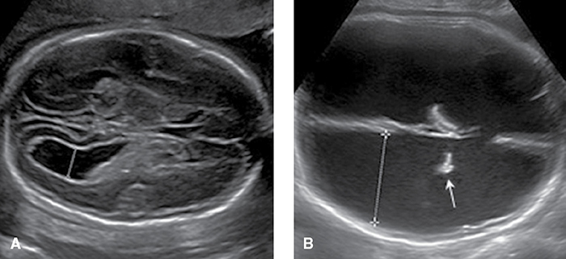

*Figure 15-10. Ventriculomegaly: mild (atrium 11 mm, A) versus severe from aqueductal stenosis (45 mm) with a dangling choroid plexus (B).*

### Agenesis of the Corpus Callosum (ACC)
- Best seen **midsagittal**; color Doppler shows the **pericallosal artery**.
- **Signs:**
  - **Frontal horns widely separated** + **rounded occipital horns (colpocephaly)** → **"teardrop" lateral ventricles**.
  - **No normal CSP** (frontal horns displaced).
  - **Bundles of Probst** (uncrossed fibers) line the midline.
  - **Elevated, mildly enlarged 3rd ventricle**; ventriculomegaly not uncommon.
- Prevalence **1 in 4000–5000**. Associated with other anomalies, aneuploidy and **>200 genetic syndromes** → offer CMA.
- Apparently isolated: **MRI finds more brain anomalies in >20%**. If MRI is normal: **normal development 67–75%**, **severe disability ~10%**.

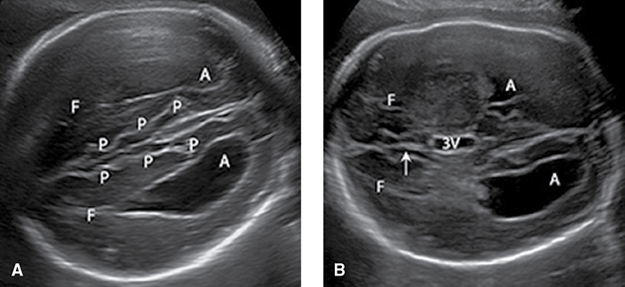

*Figure 15-12. Agenesis of the corpus callosum: teardrop ventricle, widely separated frontal horns, bundles of Probst, no CSP and an elevated 3rd ventricle.*

### Holoprosencephaly
- Prosencephalon fails to divide into two hemispheres and paired diencephalic structures.

| Type | Features |
|---|---|
| **Alobar** (most severe) | **Single monoventricle around fused thalami**; no midline falx |
| **Semilobar** | Hemispheres partially separate |
| **Lobar** | Variable fusion of frontal structures; hard to detect; a cause of **absent CSP** |
| **Middle interhemispheric variant** | Mid-bodies of the lateral ventricles communicate, frontal horns separate; choroid may prolapse across |

- **Prechordal mesenchyme** induces both hemisphere separation and **midline face** → associated facial anomalies (see section 3).
- Birth prevalence only **1 in 10,000**, but **~1 in 250 early abortuses** (very high in-utero lethality).
- **Alobar = 40–75%** of cases; **30–40% have numerical chromosomal abnormality**, especially **trisomy 13**. Conversely, **⅔ of trisomy 13** have holoprosencephaly.

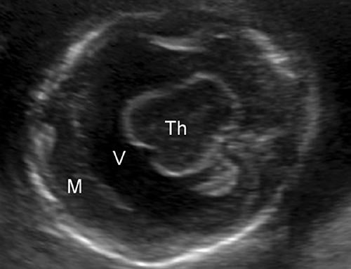

*Figure 15-13. Alobar holoprosencephaly: fused thalami surrounded by a single monoventricle, no midline falx.*

### Dandy-Walker Malformation
- **Triad:** **agenesis of the cerebellar vermis**, **enlarged posterior fossa**, **elevated tentorium**.
- Cerebellar hemispheres separated; cisterna magna communicates with the **4th ventricle** through the vermian defect.
- Prevalence **~1 in 12,000**. Ventriculomegaly **30–40%**, other anomalies **~50%**, **aneuploidy 40%**. Also genetic syndromes, viral infection, teratogens.
- Work-up = as for ventriculomegaly.
- **Inferior vermian agenesis** (partial): still high rates of anomalies/aneuploidy; prognosis often poor.

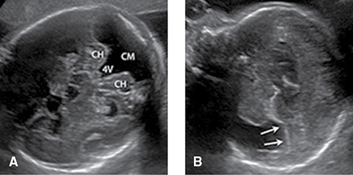

*Figure 15-14. Dandy-Walker malformation: splayed cerebellar hemispheres with the 4th ventricle opening into an enlarged cisterna magna (A); elevated tentorium (B).*

### Schizencephaly vs. Porencephaly
| | **Schizencephaly** | **Porencephaly** |
|---|---|---|
| Lesion | **Cleft** (usually perisylvian) from ventricle through cortex to pial surface | **Cystic space** in the brain; may or may not communicate with the ventricle |
| Lining | **Heterotopic gray matter** | **White matter** |
| Mechanism | **Neuronal migration** abnormality → recognized after midpregnancy | **Destructive** lesion |
| Associations | **Absent CSP** (frontal horns communicate), ventriculomegaly; open-lipped if cleft borders separate | ICH with **NAIT**; **COL4A1** mutation (familial); **death of a monochorionic cotwin** |

- Consider fetal MRI for either.

### Microcephaly
- **SMFM (2016): HC ≥3 SD below the mean.** Pathologic microcephaly is not considered certain until **≥5 SD below**.
- **HC >2 SD below mean → detailed brain ultrasound**, repeat in **3–4 wk**.
- **Upsloping forehead.** Causes: genetic syndromes, anomalies, congenital infection (**toxo, rubella, CMV, herpes, Zika**).
- Infection clues: parenchymal/periventricular echogenic foci, ventriculomegaly, cerebellar hypoplasia. Offer amniocentesis; consider MRI.

### Sacrococcygeal Teratoma (SCT)
- Germ cell tumor, one of the most common neonatal tumors; **~1 in 28,000**. Arises from totipotent cells of **Hensen node**, anterior to the coccyx.

| Altman type | Location |
|---|---|
| **1** | Predominantly **external**, minimal presacral component |
| **2** | Predominantly external, **significant intrapelvic** component |
| **3** | Predominantly **internal**, with **abdominal extension** |
| **4** | **Entirely internal** |

- Histology: mature, immature or malignant.
- Solid/cystic mass from the anterior sacrum, growing inferiorly/externally; may **enlarge rapidly**. MRI for internal components.
- **Hydrops** from **high-output cardiac failure** (vascularity) or tumor bleeding → anemia. **Hydramnios** common.
- **Tumor >5 cm → often cesarean**; **classical hysterotomy** may be needed.

### Caudal Regression Sequence
- Absent sacrum ± parts of the lumbar spine. **~25× more common with maternal diabetes.**
- Associated with GU malformations and **VACTERL** (vertebral, anal atresia, cardiac, TE fistula, renal, limb).
- Signs: short spine lacking lumbosacral curvature, **ending abruptly above the iliac wings**; iliac wings close together → **"shield" shape**; poorly developed, abnormally positioned lower limbs.

### Sirenomelia ("mermaid syndrome")
- **Single midline lower extremity + bilateral renal agenesis** (one or two sets of bones/feet).
- **No bladder, anus or genitalia.** The apparent single umbilical artery is a **vitelline artery remnant**.
- **Anhydramnios after 18 wk** (kidneys become main amnionic fluid source) hampers diagnosis. Survivors have a variant with some functioning renal tissue.

| | Caudal regression | Sirenomelia |
|---|---|---|
| Limbs | Two, hypoplastic | **Single, fused, midline** |
| Kidneys | GU anomalies possible | **Bilateral renal agenesis** |
| Link | **Diabetes (25×)**, VACTERL | Vitelline "single artery" |

### Hemivertebrae
- Segmentation–fusion defect: half of the vertebral body develops → **triangular vertebra** → **scoliosis**. Usually thoracolumbar.
- Associated skeletal, renal, cardiac defects; part of VACTERL and other syndromes.

---

## 3. Head, Face, and Neck

- Detailed survey: cranial integrity/shape, orbits, nose, lips, maxilla, mandible, hard palate, tongue, ears, neck.
- **Only the upper lip is part of the standard exam.** (Parkland adds a sagittal profile to detect micrognathia.)
- **Nuchal cord** is common in the 3rd trimester, **not associated with adverse outcome** → surveillance is not altered.

### Dolichocephaly and Brachycephaly
- **Cephalic index = BPD / OFD × 100; normal 70–86%.**
- **Dolichocephaly** (flattened, index low) and **brachycephaly** (rounded, index high) → use **HC rather than BPD** for GA.
- May be normal or due to position/oligohydramnios. Dolichocephaly → **NTDs**; brachycephaly → **Down syndrome**; **strawberry skull → trisomy 18**. Any abnormal shape → consider **craniosynostosis**.

### Orbits and Nose
- Normal: interorbital distance ≈ diameter of each orbit.
- **Hypertelorism → trisomy 18.**
- **Hypotelorism** (± microphthalmia) → **holoprosencephaly**; extreme = **cyclopia**. Other HPE facial signs: **single nostril (cebocephaly)**, **arhinia with proboscis**, **median cleft lip**.
- **Nasal bone** hypoplasia/absence = **aneuploidy marker (Down syndrome)**, not a structural anomaly. Measured only at **15–22 wk**; short if **<2.5 mm** or **>2 SD below mean**.
- Hypoplastic **nose** (different entity) → **warfarin** embryopathy.

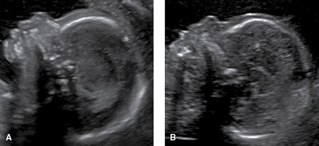

*Figure 15-25. Nasal bone: normal at 19 wk (A) versus absent nasal bone in trisomy 21 (B).*

### Facial Clefts
| Type | Features | Prevalence |
|---|---|---|
| **Cleft lip ± palate** | Always involves the **lip**; ± hard palate; uni- or bilateral | **~1 in 1000** |
| **Isolated cleft palate** | Starts at the uvula ± soft/hard palate, **lip spared**; **not expected on standard ultrasound** | **~1 in 2000** |
| **Median cleft lip** | **Holoprosencephaly** (with hypotelorism), or **frontonasal dysplasia** (with hypertelorism) | Rare |

- Isolated CL/P = multifactorial; **recurrence 3–5%** after one affected child.
- Cleft in upper lip → transverse view of the **alveolar ridge** shows primary palate involvement.
- Low-risk detection only **~50%**. **~40%** of prenatally detected clefts have other anomalies/syndromes (highest with **bilateral + palate**).
- **Aneuploidy:** **1%** cleft lip alone, **5%** unilateral CL/P, **13%** bilateral CL/P.

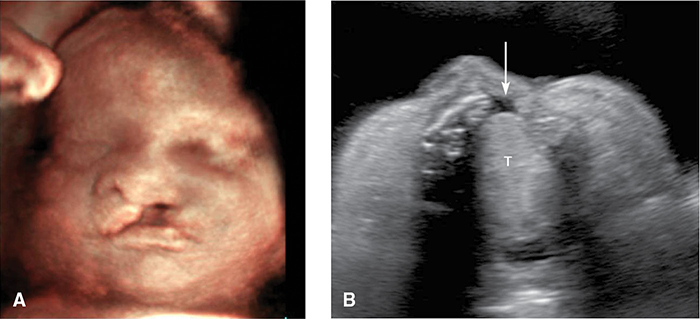

*Figure 15-26. Unilateral cleft lip (3-D rendering, A) with an alveolar ridge defect showing primary palate involvement (B).*

### Micrognathia
- Micrognathia = hypoplastic mandible; retrognathia = recessed mandible. Quantify with the **jaw index** (mandible AP diameter as % of BPD).
- **Pierre Robin sequence** = micrognathia/retrognathia + **posterior cleft palate** + **glossoptosis**.
- Also: **Treacher Collins**, oral-facial-digital syndromes, **trisomies 18 & 13**, **triploidy**, **22q11.2 deletion**.
- May cause **hydramnios** and **airway obstruction at birth** → **EXIT procedure** for severe cases.
- **Agnathia–otocephaly:** no mandible, ears low and may fuse in the midline; **lethal**; seen as early as late 1st trimester.

### Epignathus
- Teratoma of the oral cavity/pharynx; may grow outward ± into the brain (**brain involvement → extremely poor prognosis**). Without brain involvement → **EXIT** to secure the airway.

### Cystic Hygroma
- **Venolymphatic malformation**: fluid-filled sacs from the **posterior neck**; failed lymphatic drainage into the jugular vein → jugular lymphatic sacs distend.
- Birth prevalence **~1 in 5000**, but **>1 in 300 in the 1st trimester** (high in-utero lethality).
- **Aneuploidy in up to 70%.**
  - **1st trimester:** **trisomy 21** most common, then **45,X**, then trisomy 18. Hygroma is **5× more likely aneuploid than thickened NT**.
  - **2nd trimester:** **~75%** of aneuploid cases are **45,X (Turner)**.
- Euploid still at risk: **flow-related cardiac defects (HLHS, coarctation)**; **Noonan syndrome** (AD; short stature, lymphedema, high-arched palate, **pulmonary valve stenosis**).
- **Large** hygromas → usually **hydrops**, rarely resolve, poor prognosis. **Small** ones may resolve; good prognosis if karyotype and echo normal.
- Chance of a **nonanomalous, euploid liveborn** after 1st-trimester hygroma ≈ **1 in 6**.

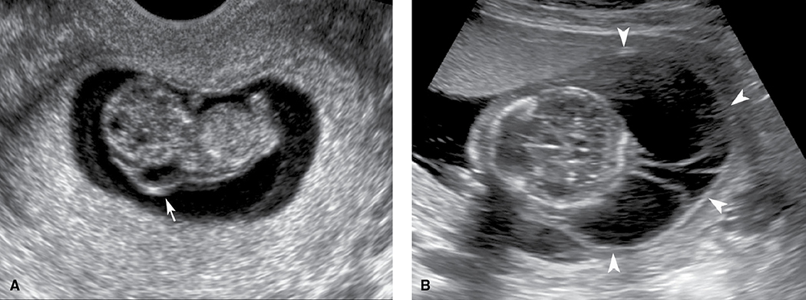

*Figure 15-30. Cystic hygroma at 9 wk (Noonan syndrome, A) and massive multiseptated hygromas with hydrops at 15 wk (B).*

---

## 4. Thorax

- Lungs homogeneous and symmetric, **each ≈ ⅓ of the area** in the four-chamber view.
- **Thoracic circumference** at the skin line at the 4-chamber level; compare with tables if pulmonary hypoplasia suspected (e.g., skeletal dysplasia).
- **Diaphragm** = hypoechoic line between lung and liver (parasagittal/coronal).
- Lesions appear as cystic/solid masses or effusions.

### Congenital Diaphragmatic Hernia (CDH)
- **Left 75%**, right 20%, bilateral 5%. Prevalence **1 in 3000–5000**.
- **Associated anomalies/aneuploidy 40%**; these cut survival from **~50% to ~20%**.
- Isolated CDH deaths: **pulmonary hypoplasia + pulmonary hypertension**.
- **Signs (left CDH):** heart pushed to the **right** (axis points to midline); **stomach bubble or peristalsing bowel in the chest**; anterior **wedge-shaped liver** in the left hemithorax.
- **Liver herniation in ≥50%** → **~30% lower survival**.
- Large lesions: **hydramnios** (swallowing) and **hydrops** (mediastinal shift).
- Prognosis: sonographic **lung-to-head ratio** (Ch 19); MRI lung volume and liver herniation.

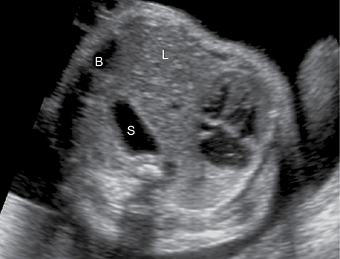

*Figure 15-32. Left CDH: stomach, liver and bowel in the left chest push the heart to the right.*

### Congenital Cystic Adenomatoid Malformation (CCAM / CPAM)
- **Hamartomatous overgrowth of terminal bronchioles** that **communicates** with the tracheobronchial tree. Prevalence **1 in 6000–8000** (rising with detection).
- Well-circumscribed mass, usually **one lobe**; **pulmonary artery supply, pulmonary venous drainage**.
- **Macrocystic = cysts ≥5 mm; microcystic = solid-appearing or cysts <5 mm.**
- Outcome (645 cases): **survival >95%**, **~30% apparent prenatal resolution**; **~5%** (large, mediastinal shift) → **hydrops, poor prognosis**.
- Microcystic lesions become less conspicuous later, but some grow rapidly at **18–26 wk**.
- **Therapy:** **corticosteroids** for large microcystic lesions; **thoracoamnionic shunt** for a large dominant cyst.

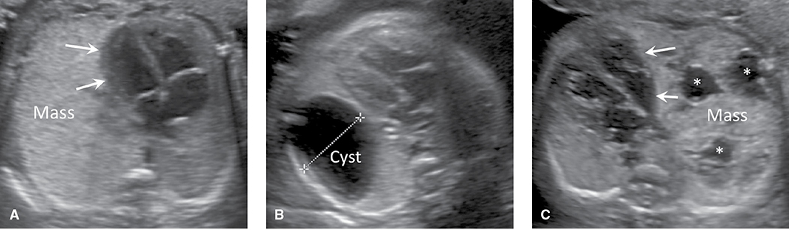

*Figure 15-33. CCAM: echogenic microcystic (A), macrocystic (B) and multicystic (C) lesions causing mediastinal shift.*

### Pulmonary (Bronchopulmonary) Sequestration
- Nonfunctioning accessory lung bud **not connected** to the tracheobronchial tree.
- Prenatal cases are mostly **extralobar** (own pleura); adult cases mostly **intralobar**.
- **Left lower lobe** predominance; **10–20% below the diaphragm**; associated anomalies **~10%**.
- Homogeneous echogenic mass (mimics microcystic CCAM) **but supplied by the systemic circulation (aorta)** on color Doppler.
- Complications: large **ipsilateral pleural effusion** → pulmonary hypoplasia/hydrops (→ **thoracoamnionic shunt**); hydrops also from mediastinal shift or **high-output failure** (left-to-right shunt).
- No effusion: **survival >95%**, **40% apparent prenatal resolution**.

| | CCAM/CPAM | Pulmonary sequestration |
|---|---|---|
| Airway connection | **Yes** | **No** |
| Blood supply | **Pulmonary artery** | **Systemic (aorta)** |
| Appearance | Solid or cystic (macro ≥5 mm) | Homogeneous echogenic |
| Prenatal resolution | ~30% | ~40% |
| Special complication | Rapid growth 18–26 wk | Pleural effusion; 10–20% infradiaphragmatic |

### Congenital High Airway Obstruction Sequence (CHAOS)
- Usually **laryngeal or tracheal atresia** → trapped lung fluid.
- Signs: **brightly echogenic, enlarged lungs**, **dilated fluid-filled bronchi**, **flattened/everted diaphragm**, compressed heart → **ascites → hydrops**.
- Associated anomalies **>50%**; feature of **Fraser syndrome** (AR); linked to **22q11.2 deletion**. Spontaneous perforation may improve prognosis. **EXIT** improves outcome in selected cases.

---

## 5. Heart

- Cardiac malformations = **most common class of congenital anomaly**; **8 per 1000 births**.
- Etiology: **~90% multifactorial/polygenic**, 1–2% single-gene/gene-deletion, 1–2% teratogen (**maternal diabetes, isotretinoin**).
- **~1 in 8** liveborn/stillborn neonates with CHD has a chromosomal abnormality: **trisomy 21** > trisomy 18 > 22q11.2 deletion > trisomy 13 > 45,X. **50–70%** of aneuploid fetuses with CHD also have noncardiac anomalies.
- Standard ultrasound detects **50–60%** of major cardiac anomalies before 22 wk; expert centers **≥90%** with outflow-tract and 3-vessel views.
- Prenatal detection may improve survival, especially for **ductal-dependent lesions** (need neonatal **prostaglandin** to keep the ductus open).

### Standard Cardiac Examination (5 components)
- **Four-chamber view**, **rate and rhythm**, **LVOT**, **RVOT**, and when feasible the **3-vessel view (3VV)** and **3-vessel trachea view (3VTV)**.
- Outflow/3-vessel views catch lesions with a **normal 4-chamber view**: **tetralogy of Fallot, transposition**.

| View | What it shows / normal findings |
|---|---|
| **Four-chamber** | Transverse, just above the diaphragm. Size, position, **axis**, atria/ventricles, foramen ovale, septum primum, IVS, AV valves. **LV is apex-forming**; 2 pulmonary veins enter LA; chambers similar in size; **apex at 45° to the left anterior chest wall** |
| **LVOT** | Aorta arises entirely from LV; **IVS continuous with the anterior aortic wall**, **mitral valve continuous with the posterior aortic wall**. VSDs and outflow anomalies seen here |
| **RVOT** | RV → main PA → right and left PAs. Aorta and PA **perpendicular** and **similar in size** |
| **3VV** | Just above the heart base: **PA (oblique, long), ascending aorta, SVC** in a row; PA ≈ Ao diameter |
| **3VTV** | More cephalad: PA → ductus forming a **"V" with the aortic arch**, plus SVC and trachea; identifies **arch anomalies / ductal-dependent lesions** |

- **Abnormal cardiac axis in >⅓** of fetuses with structural heart disease.
- **Detailed exam** adds: SVC/IVC, **aortic and ductal arch** views, IVS and situs (video clips).
- **Fetal echocardiography** adds rate/rhythm, color and pulsed Doppler, biometry, ± function.

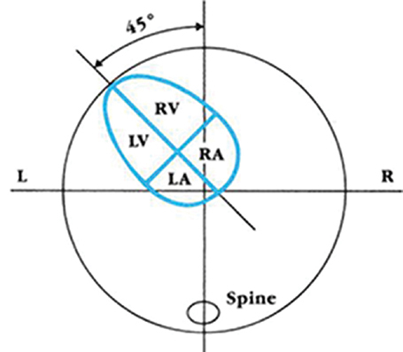

*Figure 15-36. Cardiac axis: the interventricular septum points ~45° to the left of the anterior–posterior line.*

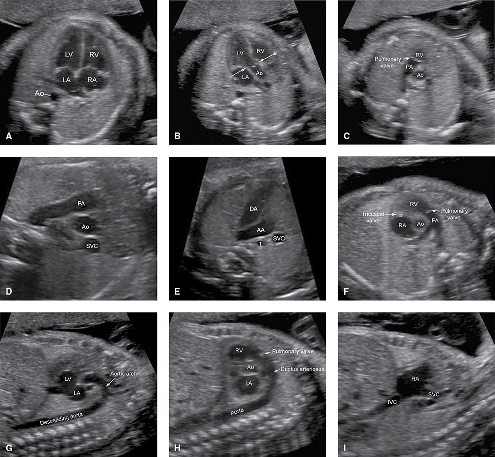

*Figure 15-37. Cardiac views: four-chamber, LVOT, RVOT, 3-vessel, 3-vessel trachea, short axis, aortic arch, ductal arch and venae cavae.*

### Selected Cardiac Anomalies
| Anomaly | Prevalence | Key sonographic features | Associations / outcome |
|---|---|---|---|
| **VSD** | **~1 in 300** (most common) | Perimembranous or muscular defect on 4-chamber; LVOT shows **break between IVS and anterior aortic wall**; color flow across | CMA abnormal **~1%** isolated vs **≥15%** with other anomalies. **>⅓ close in utero**, another **⅓ in the 1st year** |
| **Endocardial cushion (AV septal / AV canal) defect** | **~1 in 2500** | Involves septum primum, IVS and **medial leaflets of mitral & tricuspid valves** (crux); abnormal AV valve plane, common atrium. Mostly **balanced**. **Partial** = septum primum absent, subtle AV plane, **no VSD** | **Trisomy 21 in >50%**. Common in **heterotaxy** (present in **60%**) → risk of **complete heart block** (poor prognosis) |
| **Hypoplastic left heart (HLHS)** | **~1 in 4000** | Tiny LV, **or** normal/dilated LV with poor contractility and **echogenic wall (endocardial fibroelastosis)**; no LV inflow/outflow; **reversed flow in the aortic arch** on 3VTV; LV/Ao shrink with GA | Prenatal detection **~90%**. **Ductal-dependent → prostaglandin**. 3-stage single-ventricle palliation or transplant; survival to adulthood up to **70%**; high morbidity/developmental delay |
| **Coarctation of the aorta** | **~1 in 2500** | Usually focal, **distal to left subclavian (isthmus)**. Commonest sign **LV smaller than RV** (but only **⅓** with this have coarctation); narrow arch on 3VTV/arch view | **Turner (45,X)**, 22q11.2, autosomal trisomies; with HLHS, unbalanced AVSD, DORV |
| **Ebstein anomaly** | **~1 in 20,000** | **Apical displacement of septal & posterior tricuspid leaflets**; **tricuspid regurgitation**; huge RA → cardiomegaly, hydrops | **Lithium**: attributable risk **well below 1%** |
| **Tetralogy of Fallot** | **~1 in 3000** | **VSD + overriding aorta + PA/pulmonary valve abnormality + RV hypertrophy** (RVH usually not prenatal). **4-chamber may look normal** | PA lesion: **stenosis 60%**, **atresia >25%**, **absent pulmonary valve 10–15%** (huge PA → hydrops, tracheomalacia). **Chromosomal abnormality ~⅓** (22q11.2 = 15–20%, trisomies 10%) |
| **D-transposition (TGA)** | **~1 in 4000** | **Parallel outflow tracts**: RV → aorta, LV → PA (**ventriculo-arterial discordance**); 4-chamber often normal; **3VV shows only 2 vessels** | Prenatal detection **~40%** (↑ with outflow views) |
| **L- (corrected) transposition** | — | **AV discordance + VA discordance** | Strongly associated with other cardiac anomalies |
| **Double-outlet RV (DORV)** | **~1 in 20,000** | Most flow to both great arteries from RV; **always with VSD**; outflows often parallel | Classified by VSD location |
| **Truncus arteriosus** | **~1 in 16,000** | **Single large common arterial trunk** overriding a VSD, giving PAs and head/neck vessels | DDx: **ToF with pulmonary atresia**; Collett–Edwards 4 types (often only postnatally) |
| **Cardiac rhabdomyoma** | Most common cardiac tumor | Well-circumscribed **echogenic** masses in ventricles/outflow tracts; single or multiple; may grow; rarely obstruct | **~50% tuberous sclerosis** (AD; **TSC1 hamartin, TSC2 tuberin**) → consider fetal brain MRI. Tumors **regress** after the neonatal period |

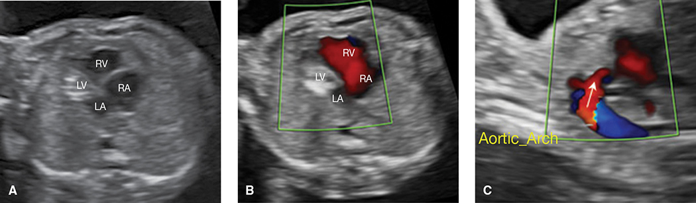

*Figure 15-40. HLHS: echogenic "filled-in" LV (fibroelastosis), no LV filling on color Doppler, and reversed flow in the aortic arch.*

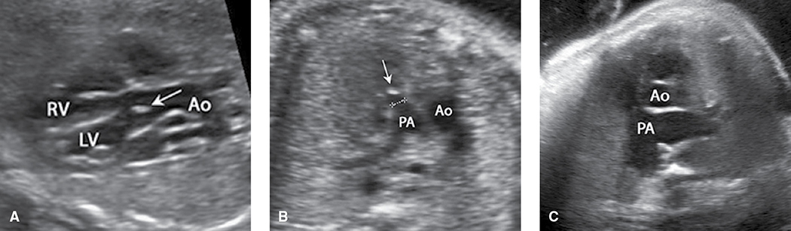

*Figure 15-42. Tetralogy of Fallot: VSD with overriding aorta (A), pulmonary stenosis (B), and the dilated PA of absent pulmonary valve (C).*

> **Memory hook:** Normal **4-chamber** but abnormal heart = **"outflow" lesions — ToF, TGA** (and truncus). Look at LVOT/RVOT/3VV.

### M-Mode and Arrhythmias
- **M-mode** = time on x-axis, motion on y-axis. Used for **heart rate**; separates **atrial vs ventricular** waveforms → characterizes arrhythmias and response to treatment; also ventricular function.
- **Premature atrial contractions (PACs)** = **most common fetal arrhythmia**; conduction-system immaturity; usually resolve.
  - Usually **blocked** → sound like **dropped beats** on handheld Doppler; M-mode shows the **compensatory pause**.
  - **Not** associated with structural heart disease. Old reports: caffeine, hydralazine.
  - **~2% develop SVT** (urgent treatment) → check FHR **every 1–2 wk** until ectopy resolves.

---

## 6. Abdomen

- Seen in the 2nd–3rd trimesters: stomach, liver, gallbladder, spleen, adrenals, kidneys, renal arteries, bowel, ventral wall.
- **Stomach nearly always seen after 14 wk.** Nonvisualization → impaired swallowing (oligohydramnios, hydrops), **esophageal atresia**, craniofacial, CNS or musculoskeletal anomaly.
- Liver and spleen seen in the AC plane. **Liver length**: top of right hemidiaphragm → tip of right lobe (sagittal/coronal). Hepatosplenomegaly → infection or hydrops.
- **Spleen** is posterior to the stomach; **gallbladder** is just below the AC plane, **right of the intrahepatic umbilical vein**, conical/teardrop.

**Echogenic bowel**
- May reflect swallowed intra-amnionic blood (especially with ↑ MSAFP).
- **Bowel as bright as bone in ~0.5%** of 2nd-trimester fetuses → ↑ risk **trisomy 21**; also **CMV** and **cystic fibrosis** (inspissated meconium).

### Gastrointestinal Obstruction
- Obstruction → proximal dilation. **The more proximal, the more hydramnios** (may cause maternal respiratory compromise/preterm labor → amnioreduction).

| Atresia | Prevalence | Sonographic clues | Associations |
|---|---|---|---|
| **Esophageal** | **~1 in 4000** | **Absent or small stomach** — but **TE fistula in up to 90%** lets fluid reach the stomach | **>50%** other anomalies/syndromes; multiple malformations 30%; **aneuploidy (T18, T21) 10%**; **VACTERL ~10%** |
| **Duodenal** | **~1 in 10,000** | **"Double bubble"** (stomach + 1st part of duodenum); may not be obvious before **24 wk**; show continuity between the bubbles | **~30% chromosomal/genetic, especially trisomy 21**; of the rest, **⅓** have other anomalies (cardiac, GI) |
| **Jejunoileal** | — | Dilated small-bowel loops; **jejunal → dilation + hyperperistalsis** (after 24 wk, ± hydramnios); **ileal → perforation** → **meconium peritonitis**: ascites, extraluminal bright echoes, later **pseudocyst** | Other GI anomalies postnatally **25%** (**malrotation 10–15%**); **cystic fibrosis ~10%** |
| **Anal (imperforate anus)** | — | Hard to diagnose; **no hydramnios**; may see **dilated rectum** between bladder and sacrum | **VACTERL** |

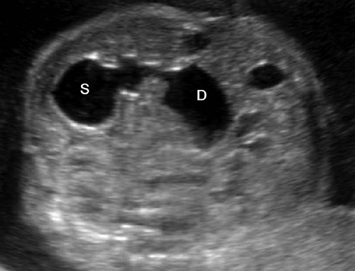

*Figure 15-48. Duodenal atresia: the "double bubble" of distended stomach (S) and proximal duodenum (D), shown to be continuous.*

### Ventral Wall Defects
- Abdominal wall integrity is checked at the **cord insertion** on the standard exam.

| Feature | **Gastroschisis** | **Omphalocele** | **Body-stalk anomaly** |
|---|---|---|---|
| Defect | **Full-thickness**, **right of the cord insertion** | Failure of lateral ectomesodermal folds to meet; herniation **into the base of the cord** | No abdominal wall; organs extrude into **extraamnionic coelom** |
| Covering | **None** (free bowel loops) | **Sac: amnion + peritoneum** | — |
| Prevalence | **~1 in 2000** | **1 in 3000–5000** | Rare |
| Maternal age | **Young (mean 20 yr)** — the one major anomaly commoner in young mothers | — | — |
| Associations | **No aneuploidy**; bowel anomalies (jejunal atresia) **~15%**; **FGR 15–40%** (no ↑ mortality) | **>50%** other major anomalies/aneuploidy (**aneuploidy especially with small defects**); **Beckwith-Wiedemann**, cloacal exstrophy, **pentalogy of Cantrell** | Body fused to placenta, **very short cord**, **acute-angle scoliosis**, amnionic bands |
| Outcome | **Survival 90–95%**. Earlier GA at delivery = risk; **planned delivery at 36–37 wk gives no benefit** | Survival **~90% isolated**, **80%** with other anomalies. **Liver-containing** defects → **cesarean** | **Lethal** |

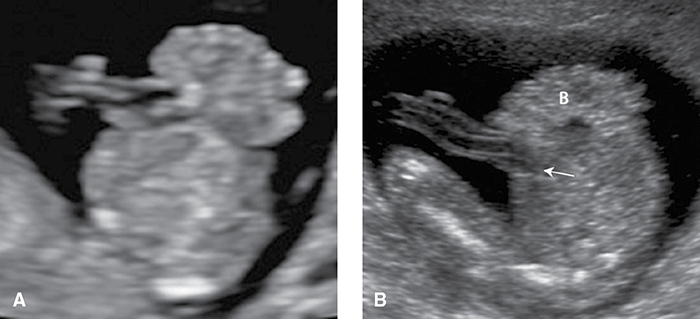

*Figure 15-51. Gastroschisis at 13 and 18 wk: free-floating bowel loops herniating to the right of the cord insertion.*

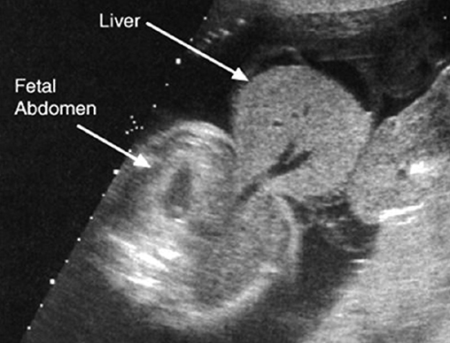

*Figure 15-52. Omphalocele: a round, membrane-covered midline defect containing liver.*

---

## 7. Kidneys and Genitourinary Tract

- Kidneys beside the spine, often in the 1st trimester, **routinely by 18 wk**. **Length ~20 mm at 20 wk**, growing **~1.1 mm/wk**.
- **Bladder**: anechoic, anterior midline pelvis; color Doppler shows it **outlined by the two superior vesical → umbilical arteries**.
- Ureters/urethra not visible unless dilated.
- **After 18 wk the kidneys are the main source of amnionic fluid**; normal fluid in the 2nd half = patent tract + ≥1 functioning kidney.
- **Genitalia**: part of the detailed exam; standard exam for **multifetal gestations** and when indicated (e.g., **X-linked** disease risk). Color Doppler of the urine stream locates the meatus in ambiguous genitalia.

### Renal Pelvis Dilatation (urinary tract dilatation, "hydronephrosis")
- Present in **1–5%** of fetuses. **Transient/physiological in 40–90%** (especially mild). **~⅓** have a confirmed postnatal abnormality — most often **UPJ obstruction** and **VUR**.
- Measure **AP diameter** in the **transverse** plane, calipers on the **inner border** of the fluid.
- **Dilated if >4 mm in the 2nd trimester or >7 mm at ~32 wk.** The 2nd-trimester threshold triggers 3rd-trimester follow-up.
- Higher risk: **calyceal dilation, cortical thinning**, dilation elsewhere in the tract.
- **Mild pyelectasis** (2nd tri) = **minor marker for trisomy 21**.

### Table 15-2. Risk for Postnatal Urinary Abnormality According to Degree of Renal Pelvis Dilation

| Dilation | Second Trimester | Third Trimester | Postnatal Abnormality |
|---|---|---|---|
| **Mild** | 4 to <7 mm | 7 to <9 mm | **12%** |
| **Moderate** | 7 to ≤10 mm | 9 to ≤15 mm | **45%** |
| **Severe** | >10 mm | >15 mm | **88%** |

*Modified from Lee, 2006; Nguyen, 2010 (Society for Fetal Urology; meta-analysis of >100,000 screened pregnancies).*

### Specific Anomalies
**UPJ obstruction**
- **Most common** abnormality with renal pelvis dilatation; **1 in 1000–2000**; **males 3×**.
- Usually **functional**, not anatomical; **bilateral in up to ¼**.
- Likelihood **5% (mild) → >50% (severe)** dilatation.

**Duplicated renal collecting system**
- Upper and lower pole **moieties**, each with its own ureter; separated by a band of renal tissue.
- **~1 in 4000**; **more common in females**; bilateral **15–20%**.
- **Weigert-Meyer rule:** **upper pole ureter → obstruction from a ureterocele**; **lower pole ureter → short intravesical segment → VUR**. Both moieties may dilate and lose function.

**Renal agenesis**
- **Bilateral 1 in 8000; unilateral 1 in 1000.**
- Signs: **absent renal artery** on color Doppler of the aorta; **"lying-down" adrenal sign** (adrenal fills the renal fossa).
- Bilateral → **anhydramnios** → pulmonary hypoplasia, limb contractures, distinctive facies.
  - From renal agenesis = **Potter syndrome**; from other causes (bilateral MCDK, ARPKD) = **Potter sequence**. Prognosis extremely poor.

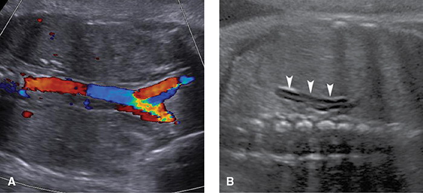

*Figure 15-58. Renal agenesis: absent renal arteries on aortic color Doppler (bilateral, A) and the "lying-down" adrenal sign (unilateral, B).*

**Multicystic dysplastic kidney (MCDK)**
- Severe dysplasia → **nonfunctioning kidney**; primitive ducts in fibromuscular tissue; **atretic ureter**.
- **Multiple variably sized, smooth-walled cysts that do NOT communicate with the renal pelvis**, surrounded by echogenic cortex.
- **Unilateral 1 in 4000**: **contralateral renal abnormality 30–40%** (VUR, UPJ obstruction); **nonrenal anomalies 25%**. Isolated unilateral → **good prognosis**.
- **Bilateral 1 in 12,000** → early severe oligohydramnios → **Potter sequence**, poor prognosis.

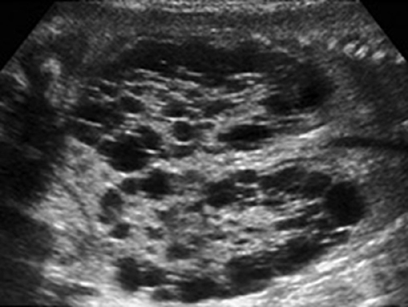

*Figure 15-59. Bilateral multicystic dysplastic kidneys: enlarged kidneys full of noncommunicating cysts with no renal pelvis.*

**Polycystic kidney disease**
- **ARPKD** (infantile form) is the only hereditary type reliably diagnosed prenatally: collecting-duct dilation + **congenital hepatic fibrosis**. **PKHD1** carrier **1 in 70**; birth prevalence **1 in 20,000**.
  - **Huge, echogenic "ground-glass" kidneys** that may fill the abdomen; **severe oligohydramnios → poor prognosis**. Phenotype ranges from lethal pulmonary hypoplasia to late-onset hepatic disease.
- **ADPKD**: far more common, usually adult-onset; some fetuses show mild enlargement + ↑ echogenicity with **normal fluid** (DDx: syndromes, aneuploidy, normal variant).

**Bladder outlet obstruction**
- More common in **males**; commonest cause **posterior urethral valves**; may be seen in the **1st trimester**.
- **Markedly dilated, thick-walled bladder + dilated proximal urethra = "keyhole" sign.**
- **Oligohydramnios, especially before midpregnancy → pulmonary hypoplasia, poor prognosis**; outcome may be poor even with normal fluid.
- Kidneys: hydroureteronephrosis → later **cystic dysplasia** or small echogenic kidneys.
- Associated anomalies **40%**; aneuploidy **5–8%**. Fetal therapy → Ch 19.

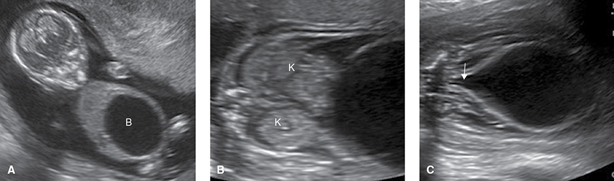

*Figure 15-61. Bladder outlet obstruction: megacystis at 13 wk, echogenic kidneys by 18 wk, and the "keyhole" sign.*

---

## 8. Skeleton

- **Standard exam:** presence of arms, legs, hands, feet. **Detailed:** also **number and position of digits**.
- Nosology: **461 disorders in 42 groups**; **>90%** have a known genetic basis (>400 genes).
- **Osteochondrodysplasias** = generalized abnormal bone/cartilage; **dysostoses** = individual bones. Also **deformations** (some clubfoot) and **disruptions** (limb reduction).

### Skeletal Dysplasias
- Prevalence **~3 in 10,000**. **FGFR3 chondrodysplasias** and **osteogenesis imperfecta/low bone density** group account for **>50%** (each **0.8 in 10,000**).
- **Evaluate:** every long bone, hands/feet, skull size and shape, clavicles, scapulae, thorax, spine; ossification, **bowing, fractures**.

| Term | Segment shortened |
|---|---|
| **Micromelia** | All long bones |
| **Rhizomelia** | Proximal (humerus, femur) |
| **Mesomelia** | Intermediate (forearm, leg) |
| **Acromelia** | Distal (hands, feet) |

**Predicting lethality**
- Profound shortening (often **far below 5th percentile**) and **FL:AC <16%**.
- **Pulmonary hypoplasia** suggested by: **thoracic circumference <80% of AC**, **TC <2.5th percentile**, **cardiac circumference >50% of TC**.
- Hydramnios and/or hydrops may develop.

| Dysplasia | Genetics | Key features |
|---|---|---|
| **Achondroplasia** (most common **nonlethal**) | **FGFR3**; **98%** one point mutation; **AD**, **80% new mutations** | **Rhizomelic** shortening, large head + **frontal bossing**, depressed nasal bridge, lumbar lordosis, **trident hand**; normal intelligence. FL/HL may not fall **<5th percentile until early 3rd trimester**. **Homozygous (25% if both parents affected) = lethal** |
| **Thanatophoric dysplasia** (most common **lethal**) | **FGFR3** | **Severe micromelia**; **cloverleaf skull (Kleeblattschädel)** from craniosynostosis, especially **type II**. Genetic testing confirms |
| **Osteogenesis imperfecta type II** (perinatal, lethal) | **COL1A1/COL1A2** (>90% of OI); **AD** → new mutation or gonadal mosaicism | Hypomineralized skull **deforms with transducer pressure**; multiple in-utero **fractures**; **"beaded" ribs**; small thorax |
| **Hypophosphatasia** | **AR** | Severe hypomineralization |

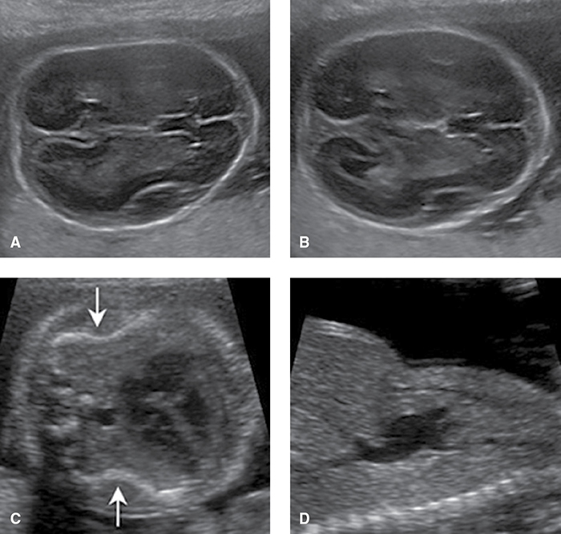

*Figure 15-64. Osteogenesis imperfecta type II: skull compresses under transducer pressure (A, B), angulated fractured ribs (C) and a small thorax (D).*

### Polydactyly
- **Most common skeletal abnormality**, **~1 in 1000**.
- **Post-axial** (ulnar/fibular side) is more common, often **AD**; **pre-axial** = radial/tibial side.
- Extra digit often rudimentary; without bone, prenatal detection is limited.
- Syndromic: **Meckel-Gruber**, **trisomy 13**.

### Clubfoot (Talipes Equinovarus)
- Deformed talus, short Achilles tendon: **equinus + varus + forefoot adduction**.
- Mostly multifactorial malformation; deformation also plays a role (environment, **early amniocentesis**).
- **Sign: "footprint" seen in the same plane as the tibia and fibula.**
- **~1 in 1000**; **M:F 2:1**; **bilateral ~50%**.
- **≥50%** have associated abnormalities (NTDs, **arthrogryposis**, **myotonic dystrophy**, syndromes). **Aneuploidy 30%** if other anomalies vs **<4% if isolated** → search carefully; consider CMA.

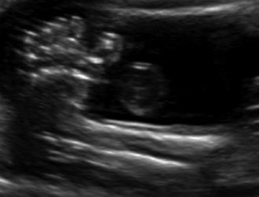

*Figure 15-65. Clubfoot: the sole ("footprint") is visible in the same plane as the tibia and fibula.*

### Limb-Reduction Defects
- Absence/hypoplasia of all or part of ≥1 limb; **4–8 in 10,000**. **~½ isolated**, **up to ⅓ syndromic**, rest with other anomalies. **Upper limbs > lower.**
- **Terminal transverse** (stump) is **more common** than **longitudinal** (absent long bone on one side).
- **Amelia** = entire limb absent. **Phocomelia** = absent long bone(s), hand/foot attached to trunk → **thalidomide**; **Roberts syndrome** (AR, tetraphocomelia).
- **Clubhand** (usually absent radius) → **TAR syndrome**, **trisomy 18**.
- Disruptions: **amnionic-band sequence**; **CVS before 10 wk**.

*Note: the extracted chapter text cites Fig. 15-63 for osteogenesis imperfecta and Fig. 15-64 for polydactyly; the printed captions are the reverse (15-63 = post-axial polydactyly, 15-64 = OI type IIa). The figure numbers here follow the printed captions.*

---

## Quick-Recall: Classic Sonographic Signs

| Sign | Diagnosis |
|---|---|
| **Lemon sign** (frontal bone scalloping) | Open spina bifida (Chiari II) |
| **Banana sign** (curved cerebellum, effaced cisterna magna) | Open spina bifida (Chiari II) |
| **"Shower cap"** cranium, triangular face | Anencephaly / exencephaly |
| **Dangling choroid** | Severe ventriculomegaly |
| **Teardrop ventricles**, widely spaced frontal horns, **bundles of Probst**, high 3rd ventricle | Agenesis of the corpus callosum |
| **Monoventricle + fused thalami**, no falx | Alobar holoprosencephaly (trisomy 13) |
| Absent CSP with **communicating frontal horns** | Septo-optic dysplasia, lobar HPE (also schizencephaly) |
| Vermian defect joining **4th ventricle to big cisterna magna**, raised tentorium | Dandy-Walker malformation |
| **Strawberry skull**; choroid plexus cysts; hypertelorism; clubhand | Trisomy 18 |
| **Shield-shaped** iliac wings, spine ends abruptly | Caudal regression (diabetes) |
| **Absent nasal bone**, echogenic bowel, mild pyelectasis, short femur, thick nuchal fold | Trisomy 21 markers |
| Heart shifted right, **stomach in chest** | Left CDH |
| Echogenic lung mass with **systemic (aortic) feeding vessel** | Pulmonary sequestration |
| Bright enlarged lungs, **everted diaphragm**, dilated bronchi | CHAOS |
| **Double bubble** | Duodenal atresia (trisomy 21) |
| Free bowel loops **right of cord**, no membrane | Gastroschisis |
| **Membrane-covered** midline defect at cord base | Omphalocele |
| **Reversed flow in aortic arch**, echogenic small LV | HLHS |
| **Only 2 vessels** on 3VV, parallel outflows | D-transposition |
| **Lying-down adrenal**, absent renal artery | Renal agenesis |
| **Keyhole** bladder | Posterior urethral valves |
| **Ground-glass** huge kidneys + oligohydramnios | ARPKD |
| Noncommunicating renal cysts, no pelvis | MCDK |
| **Cloverleaf skull**, severe micromelia | Thanatophoric dysplasia |
| **Compressible skull**, fractures, beaded ribs | Osteogenesis imperfecta type II |
| **Trident hand**, rhizomelia, frontal bossing | Achondroplasia |
| **Footprint in plane of tibia/fibula** | Clubfoot |

## Key Numbers to Memorize
- **FL:AC 20–24%** normal; **<18%** → skeletal dysplasia; **<16%** → lethal dysplasia
- **Lateral atrium 5–9 mm**; ventriculomegaly **mild 10–12 / moderate 13–15 / severe >15 mm**; normal outcome **≥90% / ≥75%** (isolated mild / moderate)
- **Cisterna magna 2–10 mm**; **cerebellum (mm) ≈ GA (wk) at 15–22 wk**; **CSP visible 17–37 wk**; **cephalic index 70–86%**
- **Nuchal fold at 15–20 wk**; **nasal bone at 15–22 wk**, short if **<2.5 mm**
- **MSAFP 2.5 MoM** → **95% anencephaly / 80% myelomeningocele**; NTD recurrence **3–5%**; **80–90%** of myelomeningocele need VP shunt
- **Microcephaly HC ≥3 SD** below mean (certain at **5 SD**; evaluate at **>2 SD**)
- Holoprosencephaly **30–40% aneuploid (T13)**; **⅔ of T13** have HPE; Dandy-Walker **aneuploidy 40%**
- Cystic hygroma **aneuploidy up to 70%** (2nd tri: **75% of aneuploid = 45,X**); euploid liveborn **1 in 6**
- CL/P aneuploidy **1% / 5% / 13%** (lip alone / unilateral CL/P / bilateral CL/P)
- CDH **left 75%**; associated anomalies **40%** (survival **50% → 20%**); liver up **≥50%** → survival **−30%**
- CCAM macrocystic **≥5 mm**; survival **>95%**; **5%** hydrops
- CHD **8/1000**; **1 in 8** aneuploid; VSD **1 in 300**; AVSD **>50% trisomy 21**; ToF **⅓ chromosomal**; PAC → **SVT 2%**
- Stomach seen **after 14 wk**; kidneys by **18 wk**; kidney **20 mm at 20 wk (+1.1 mm/wk)**
- Gastroschisis **mean maternal age 20**, **survival 90–95%**, **FGR 15–40%**, no aneuploidy; omphalocele **>50%** associated anomalies
- Renal pelvis **>4 mm (2nd tri) / >7 mm (~32 wk)**; postnatal abnormality **12% / 45% / 88%** (mild / moderate / severe)
- Bilateral renal agenesis **1 in 8000**; unilateral MCDK contralateral abnormality **30–40%**
- Clubfoot aneuploidy **30%** (with anomalies) vs **<4%** (isolated); achondroplasia **80% new mutations**
