# Chapter 16: Genetics — Revision Notes

> Williams Obstetrics 26e, pp. 789–848 of the PDF. High-yield numbers are in **bold**.
> The seven tables are transcribed from the PDF images (they are missing from the extracted chapter text). 13 of the 14 figures are included (Fig 16-11, a FISH probe-making schematic, is omitted).

**Big picture:** Genetic disease is common: **2–3%** of newborns have a recognized structural abnormality, another **3%** are diagnosed by age 5, and **8–10%** more have a functional or developmental abnormality before adulthood. Chromosomal, mendelian and nonmendelian conditions are covered here; prenatal screening/diagnosis is in Ch 17.

---

## 1. Genomics in Obstetrics

- **Gene** = specific DNA sequence coding for a protein; **genome** = all genes of an organism; **genomics** = how genes function and interact.
- Human genome: **3 billion base pairs, >20,000 genes**. **>99%** of DNA is identical between people.
- **Exons (coding) = only 1.5%** of the genome; **exome** = all exons. Introns = 24%; the rest is intergenic.
- Genetic code varies once every **200–500 bp**, usually as a **single-nucleotide polymorphism (SNP)**.
- Databases (NCBI): **GeneReviews** (>800 conditions; diagnostic criteria, management), **Genetic Testing Registry** (~80,000 tests), **MedlinePlus Genetics** (lay public, >1300 conditions).

---

## 2. Chromosomal Abnormalities

- Account for **>50% of 1st-trimester miscarriages**, **~20% of 2nd-trimester losses**, and **6–8% of stillbirths** and early-childhood deaths.
- Found in **0.4% of recognized pregnancies**; most are aneuploidies.
  - **Trisomy 21 >50%**, **trisomy 18 ~15%**, **trisomy 13 ~5%**.
- Fetus with a structural anomaly and a normal karyotype → CMA finds a **copy number variant in ~6.5%**.

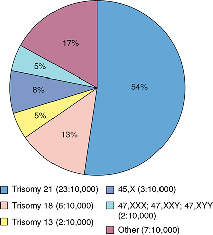

*Figure 16-1. EUROCAT: trisomy 21 is 54% of chromosomal abnormalities (23:10,000), T18 13%, T13 5%, 45,X 8%, other sex aneuploidies 5%.*

### Standard nomenclature (ISCN 2020)
- **p** = short ("petit") arm; **q** = long arm; separated by the **centromere**.
- Karyotype order: **total chromosome number** (= number of centromeres) → **sex chromosomes** → structural variation.
- Abbreviations: **del** (deletion), **dup**, **inv** (inversion), **t** (translocation), **der** (derivative), **r** (ring), **i** (isochromosome).
- FISH: **ish** = metaphase cells; **nuc ish** = interphase nuclei. Normal: probe region + probe name + number of signals (e.g., HIRAx2). Deletion: "del" before the region and a minus sign after the probe (HIRA–).
- CMA: starts with **arr**, then genome build (e.g., **GRCh38**), chromosome, arm, bands and **base-pair coordinates** (gives exact size and location). Same format whether pathogenic or of uncertain significance.

### Table 16-1. Examples of Karyotype Designations Using the 2020 International System for Human Cytogenomic Nomenclature

| Karyotype | Description |
|---|---|
| 46,XX | Normal female chromosome constitution |
| 47,XY,+21 | Male with trisomy 21 |
| 47,XX,+21/46,XX | Female who is a mosaic of trisomy 21 cells and cells with normal constitution |
| 46,XY,del(4)(p14) | Male with terminal deletion (del) of the short arm of chromosome 4 at band p14 |
| 46,XX,dup(5)(p14p15.3) | Female with duplication (dup) of the short arm of chromosome 5 from band p14 to band p15.3 |
| 45,XY,der(13;14)(q10;q10) | Male with balanced robertsonian translocation (der) of the long arms of chromosomes 13 and 14 — the karyotype now has one normal 13, one normal 14 and the translocation chromosome, reducing the normal 46 complement to 45 |
| 46,XX,t(11;22)(q23;q11.2) | Female with a balanced reciprocal translocation (t) between chromosomes 11 and 22, with breakpoints at 11q23 and 22q11.2 |
| 46,XY,inv(3)(p21q13) | Male with inversion (inv) of chromosome 3 from p21 to q13 — a **pericentric** inversion because it includes the centromere |
| 46,X,r(X)(p22.1q27) | Female with one normal X and one ring (r) X chromosome, with the regions distal to p22.1 and q27 deleted from the ring |
| 46,X,i(X)(q10) | Female with one normal X and an isochromosome (i) of the long arm of the other X |
| ish 22q11.2(HIRAx2) | FISH of metaphase cells using a probe for the HIRA locus of the 22q11.2 region, with 2 signals (no evidence of microdeletion) |
| ish del(22)(q11.2q11.2)(HIRA–) | FISH of metaphase cells using a probe for the HIRA locus of 22q11.2, with only one signal, consistent with the microdeletion |
| arr[GRCh38] 18p11.32q23(102328_79093443)x3 | Microarray (arr), build GRCh38, single copy gain of chromosome 18 from p11.32 to q23 (essentially the entire chromosome), consistent with trisomy 18 |
| arr[GRCh38] 4q32.2q35.1(163146681_183022312)x1 | Microarray, build GRCh38, copy loss on the long arm of chromosome 4 at bands q32.2 through q35.1 (19.9 Mb) |
| arr[GRCh38] 15q11.2q26(23123715_101888908)x2 hmz | SNP microarray, build GRCh38, homozygosity for the entire long arm of chromosome 15 |

*FISH = fluorescence in situ hybridization; GRCh38 = Genome Reference Consortium human build 38; HIRA = histone cell cycle regulator; SNP = single-nucleotide polymorphism.*

---

## 3. Abnormalities of Chromosome Number

- **Aneuploidy** = extra (trisomy) or missing (monosomy) chromosome. **Polyploidy** = abnormal number of whole haploid sets (e.g., **triploidy = 69**).

### Autosomal trisomies — general
- Usually from **nondisjunction**: chromosomes (1) fail to pair, (2) pair but separate prematurely, or (3) fail to separate.
- Any pair can missegregate, but only **21, 18 and 13** commonly reach term.
- Risk rises steeply with maternal age, **especially after 35**. Oocytes are arrested in **midprophase of meiosis I** from birth until ovulation.
- **10–20% of oocytes** are aneuploid vs **3–4% of sperm**.
- **Recurrence after any autosomal trisomy ≈ 1%** (until age-related risk exceeds this).
- **Parental karyotype is NOT indicated** unless caused by an unbalanced translocation or other structural rearrangement.

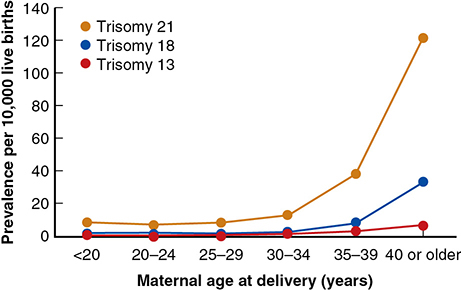

*Figure 16-2. Trisomy prevalence by maternal age: flat until the early 30s, then rises steeply (T21 ~120/10,000 at ≥40).*

### Trisomy 21 — Down syndrome
- **Causes:** trisomy 21 **95%** (nondisjunction in **meiosis I in ~75%**, meiosis II in the rest); **robertsonian translocation 3–4%**; isochromosome 21 or mosaicism **1–2%**.
- **Most common nonlethal trisomy:** **~1 in 450 pregnancies**; **1 in 740 live births** (US). Fetal death >20 wk ~5%.
- Proportion of pregnancies affected has risen **~33%** over 4 decades (older mothers).
- **Sonographic abnormality in 50–75%** (major anomalies + minor markers); a major malformation is seen in the 2nd trimester in **~⅓**.
- **Cardiac defects ~50%** — especially **endocardial cushion defects and VSD**.
- **GI defects 6–12%**: esophageal atresia, **duodenal atresia**, Hirschsprung disease.
- Other problems:

| Problem | Frequency |
|---|---|
| Hearing loss | **75%** |
| Early-onset Alzheimer disease (adults) | **70%** |
| Obstructive sleep apnea | 60% |
| Refractive errors | 50% |
| Cataracts | 15% |
| Thyroid disease | 15% |
| Transient myeloproliferative disorder (newborns) | 10% |
| Leukemia | ↑ incidence |

- Women with DS are fertile — **~⅓ of offspring have DS**. Males are almost always **sterile**.
- **IQ 35–70**; social skills higher than IQ predicts.
- **Features:** brachycephaly, epicanthal folds, up-slanting palpebral fissures, **Brushfield spots**, flat nasal bridge, hypotonia, loose nuchal skin, **sandal gap**, short fingers, **single palmar crease**, **5th-finger clinodactyly** (hypoplastic middle phalanx).
- **Survival:** ~**95%** survive year 1; 10-yr survival **≥90%** (**99%** without major malformations). Life expectancy **55–60 yr**.

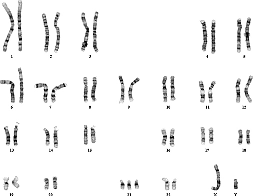

*Figure 16-3. G-banded male karyotype 47,XY,+21: three copies of chromosome 21.*

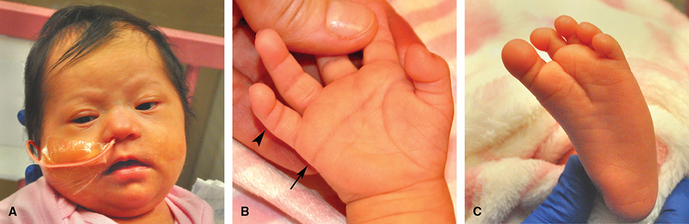

*Figure 16-4. Down syndrome newborn: (A) epicanthal folds, flat nasal bridge; (B) single palmar crease (arrow) and 5th-digit clinodactyly (arrowhead); (C) sandal gap.*

### Trisomy 18 — Edwards syndrome
- **~1 in 2000 recognized pregnancies**; live births only **1 in 6600–10,000** (high in-utero lethality + termination).
- **Uncommonly** from a rearrangement (chromosome 18 is not acrocentric — unlike 21 and 13).
- **Heart defects >90%** (especially VSD). Also: cerebellar vermian agenesis, myelomeningocele, diaphragmatic hernia, **omphalocele**, imperforate anus, horseshoe kidney.
- Cranial/limb signs: **"strawberry" skull**, wide cavum septum pellucidum, **choroid plexus cysts**, micrognathia, **clenched hands with overlapping digits**, **radial aplasia** with hyperflexed wrists, **rockerbottom or clubbed feet**.
- ⚠️ **Choroid plexus cysts raise T18 risk only with other risk factors** (structural anomaly or abnormal screen).
- 3rd trimester: **FGR**, mean birthweight **<2500 g**. Undiagnosed → emergency cesarean for "fetal distress" in **~50%** → discuss mode of delivery/FHR management in advance; offer **perinatal palliative care**.
- **Median neonatal survival 8 days; 5-yr survival 12%.** Cardiac surgery mortality **3–5×** higher.

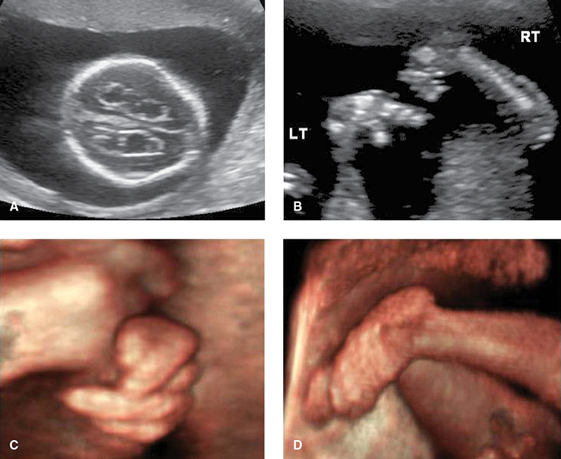

*Figure 16-5. Trisomy 18: (A) choroid plexus cysts and strawberry skull; (B) radial clubhand; (C) clenched fist with overlapping digits; (D) rockerbottom foot.*

### Trisomy 13 — Patau syndrome
- **~1 in 5000 recognized pregnancies**; live births **1 in 12,000–18,000**.
- **≥80% are trisomy 13**; nearly all the rest are **robertsonian translocations**, most commonly **der(13;14)(q10;q10)** (carried by **~1 in 1300** normal people; **<2%** of carriers have a liveborn with Patau).
- Brain, heart, kidneys, extremities most affected:
  - **Holoprosencephaly (usually alobar) in ⅔** — with hypotelorism/cyclopia, microphthalmia, single nostril to proboscis.
  - **Cardiac defects up to 90%**.
  - Cephalocele, microcephaly, omphalocele, **cystic renal dysplasia**, **polydactyly**, rockerbottom feet, **aplasia cutis**, cleft lip-palate (may be median), **bilateral echogenic intracardiac foci**.
- **Cephalocele + cystic kidneys + polydactyly** → differential = **T13 vs Meckel–Gruber syndrome** (autosomal recessive).
- More lethal than T18: **median survival 5 days; 5-yr survival <10%**.
- ⚠️ **Maternal risk:** continuing pregnancies have **≥25% hypertensive complications**; **preeclampsia with severe features ↑ >10-fold**, often **<32 wk**. Chromosome 13 carries the **sFlt-1** gene (overexpressed by T13 placentas).

### Other trisomies
- Live births extremely rare. **Trisomy 22**: severe FGR, microcephaly, midface hypoplasia, cardiac/GU anomalies.
- **Trisomy 16 = most common trisomy in 1st-trimester losses (16%)**; T21 and T22 also common. **Trisomy 1 never reported.**

### Monosomy
- Missing material is worse than extra: almost all monosomies are lost **before implantation**.
- **Only exception: 45,X**. Monosomy has **no maternal-age association**.

### Polyploidy
- **~20% of spontaneous abortions**; rare later.
- **Triploidy (69 chromosomes)**, ~**1 in 5000** pregnancies, lethal; multiple anomalies (brain, heart, kidneys, limbs). Phenotype depends on parent of origin (**imprinting**):

| | Diandric (type I) | Digynic (type II) |
|---|---|---|
| Extra set | **Paternal** | **Maternal** |
| Mechanism | 2 sperm (dispermy) or 1 diploid sperm | Egg fails meiosis I or II |
| Placenta | **Partial mole** (Ch 13) | No molar change |
| Fetus | — | **Asymmetric FGR** |
| Frequency | Majority of conceptions, but high early loss | **⅔ of triploidies seen after 1st trimester** |

- **Recurrence 1–1.5%** if the triploid fetus survived past the 1st trimester → offer prenatal diagnosis.
- **Tetraploidy** (92,XXXX or 92,XXYY): postzygotic failure of early cleavage; always lethal; minimal recurrence.

### Sex chromosome abnormalities

**45,X — Turner syndrome**
- **~1 in 2500 girls**; missing X is **paternal in 80%**.
- **Only monosomy compatible with life**, yet the **most common aneuploidy in 1st-trimester losses (20%)**. **~98%** abort early.
- Survivors to 2nd trimester: large **septated cystic hygromas** ± hydrops (**very poor prognosis** with hydrops). **<1%** of Turner pregnancies → live birth.
- Liveborns: only **½ are 45,X**; **~¼ mosaic** (45,X/46,XX or 45,X/46,XY); **15% isochromosome X**.
- **Left-sided cardiac defects 30–50%**: **coarctation**, hypoplastic left heart, **bicuspid aortic valve**. Also **horseshoe kidney**, hypothyroidism.
- Short stature, broad chest with wide-spaced nipples, **lymphedema** of hands/feet, **webbed neck** (from cystic hygroma).
- IQ usually normal (visual-spatial, nonverbal and social-cue problems).
- **GH** in childhood; **>90% have ovarian dysgenesis** → estrogen at puberty.
- ⚠️ **Y-chromosome mosaicism → germ cell tumor risk → prophylactic bilateral gonadectomy.**

**47,XXX**
- **~1 in 1000** female newborns; extra X **maternal in >90%**; weak maternal-age link; more diagnoses now via cfDNA.
- No characteristic appearance; ↑ GU problems and seizures. Tall, hypertelorism, epicanthal folds, kyphoscoliosis, clinodactyly, hypotonia.
- **>⅓ learning disability**, **½ ADD**; low-average cognition. Normal puberty; POI reported.
- Only **~10%** ascertained without prenatal diagnosis.
- 48,XXXX / 49,XXXXX: abnormalities at birth + intellectual disability. **IQ falls with each extra X.**

**47,XXY — Klinefelter syndrome**
- **Most common sex chromosome abnormality: ~1 in 700 males**. Extra X maternal or paternal equally; weak parental-age link.
- Normal newborn appearance; tall; **gonadal dysgenesis**, poor virilization → **testosterone**; gynecomastia.
- IQ average/low-average, delayed language. **Earlier (childhood) hormone therapy** → better working memory/executive function, less anxiety.

**47,XYY**
- **~1 in 1000 males**. Tall; **macrocephaly ⅓**, **hypotonia ~⅔**, tremors; hypertelorism and clinodactyly in >½.
- **Normal puberty and fertility.** ↑ language impairment, ADD, developmental delay, **autism spectrum disorder**.
- 48,XYYY, 48,XXYY, 49,XXXYY → more anomalies and intellectual disability.

---

## 4. Abnormalities of Chromosome Structure

- Types: deletions, duplications, translocations, isochromosomes, inversions, rings, mosaicism.
- Two key questions: **(1) what phenotype is expected?** **(2) are the parents carriers (is parental karyotyping indicated)?**

### Deletions and duplications
- From **malalignment/mismatching during pairing** of homologues in meiosis → deletion in one chromosome, duplication in the other.
- **Offer parental karyotyping** — a parental balanced translocation markedly ↑ recurrence.
- Karyotype-visible deletions: **~1 in 7000 births** (e.g., **del 5p = cri du chat**).

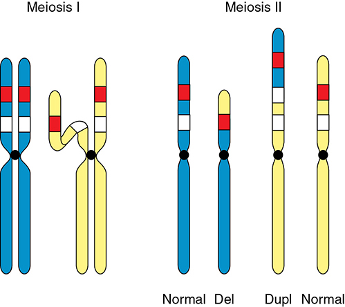

*Figure 16-6. Mismatched pairing in meiosis I produces one deleted (Del) and one duplicated (Dupl) chromosome.*

### Microdeletions and microduplications
- **<3–5 million bp** → too small for a karyotype; found by **CMA** (called a **copy number variant**).
- Multigene region → **contiguous gene syndrome** (unrelated but serious features). A microduplication may involve the same region as a known microdeletion syndrome.
- Suspected clinically → confirm by **CMA or FISH**.

### Table 16-2. Selected Microdeletion Syndromes

| Syndrome | Prevalence | Location | Features |
|---|---|---|---|
| Alagille | 1:70,000 | 20p12.2 | Cholestasis (paucity of intrahepatic bile ducts), cardiac disease, skeletal disease, ocular abnormalities, dysmorphic facies |
| Angelman | 1:12,000 to 1:20,000 | 15q11.2–q13 (maternal genes) | Dysmorphic facies — "happy puppet" appearance, intellectual disability, ataxia, hypotonia, seizures |
| Cri-du-chat | 1:20,000 to 1:50,000 | 5p15.2–15.3 | Abnormal laryngeal development with "cat-like" cry, hypotonia, intellectual disability |
| Kallmann syndrome | 1:30,000 males | Xp22.3 | Hypogonadotropic hypogonadism, anosmia |
| Langer-Giedion | Rare | 8q23.3 | Trichorhinophalangeal syndrome, dysmorphic facies, skeletal abnormalities, sparse hair |
| Miller-Dieker | Rare | 17p13.3 | Neuronal migration abnormalities with lissencephaly and microcephaly (profound impairment), dysmorphic facies |
| Prader-Willi | 1:10,000 to 1:30,000 | 15q11.2–q13 (paternal genes) | Obesity, hypotonia, hypogonadotropic hypogonadism, small hands and feet, intellectual disability |
| Retinoblastoma | 1:280,000 | 13q14.2 | Retinoblastoma, retinoma (benign neoplasm), non-retinal (second primary) tumors |
| Rubenstein-Taybi | 1:100,000 to 1:125,000 | 16p13.3 | Dysmorphic facies, broad thumbs and toes, intellectual disability, increased tumor risk |
| Smith-Magenis | 1:15,000 to 1:25,000 | 17p11.2 | Dysmorphic facies, speech delay, hearing loss, sleep disturbances, self-destructive behaviors, intellectual disability |
| Velocardiofacial syndrome | 1:3000 to 1:6000 | 22q11.2 | Conotruncal cardiac defects, cleft palate, velopharyngeal incompetence, thymic and parathyroid abnormalities, intellectual disability |
| WAGR | 1:500,000 | 11p13 | **W**ilms tumor, **a**niridia, **g**enitourinary anomalies, intellectual disability (mental **r**etardation) |
| Williams-Beuren | 1:7500 to 1:10,000 | 7q11.23 | Dysmorphic facies, dental malformation, aortic and peripheral pulmonary artery stenosis, intellectual disability |
| Wolf-Hirschhorn | 1:20,000 to 1:50,000 | 4p16.3 | Dysmorphic ("Greek helmet") facies, delayed growth and development, cleft lip/palate, coloboma, cardiac septal defects |
| X-linked ichthyosis | 1:6000 | Xp22.3 | Steroid sulfatase deficiency, corneal opacities |

*Prevalence reflects live births.*

### 22q11.2 microdeletion syndrome (DiGeorge / Shprintzen / velocardiofacial)
- **Most common microdeletion: 1 in 3000–6000 births.**
- **Autosomal dominant** (50% to offspring), but **>90% de novo**. Full deletion = **3 Mb, 40 genes, 180 features**; variable even within families → offer testing to both parents after prenatal diagnosis.
- **Conotruncal cardiac anomaly ~75%**: tetralogy of Fallot, truncus arteriosus, interrupted aortic arch, VSD.
- **Immune deficiency (T-cell lymphopenia) 75%**; **velopharyngeal insufficiency/cleft palate >70%**.
- Face: short palpebral fissures, bulbous nasal tip, micrognathia, short philtrum, small/posteriorly rotated ears.
- Also **hypocalcemia**, renal anomalies, esophageal dysmotility, hearing loss, learning disability, autism, psychiatric illness (**schizophrenia**).

> **Memory hook:** **CATCH-22** — **C**ardiac, **A**bnormal facies, **T**hymic hypoplasia (T-cell deficit), **C**left palate, **H**ypocalcemia, chromosome **22**.

### Translocations
Rearranged chromosomes = **derivative (der)**.

**Reciprocal translocations**
- Breaks in two chromosomes with exchange of fragments; **balanced** if nothing is gained or lost. **~1 in 600 births.**
- Balanced carriers are usually normal, but **~6%** have abnormalities from gene repositioning; **CMA finds hidden imbalance in up to 20%** of "balanced" carriers.
- Risk of a **liveborn with an unbalanced translocation**:
  - **5–30%** if ascertained after an abnormal child
  - **~5%** if ascertained otherwise (e.g., infertility) — gametes are so abnormal that conceptions are nonviable

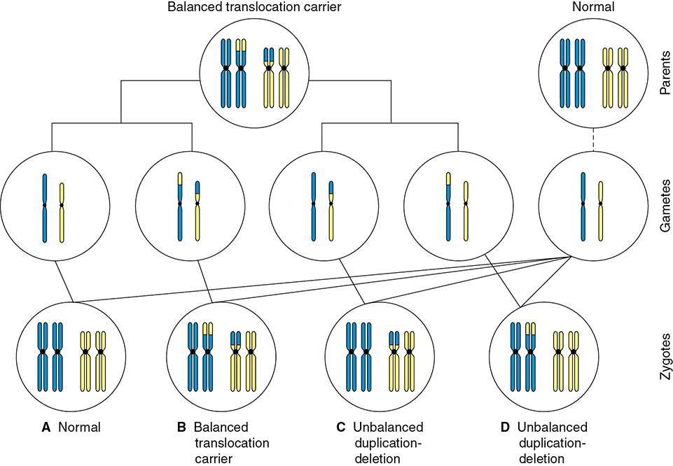

*Figure 16-7. Balanced translocation carrier × normal partner: normal (A), balanced carrier (B) or unbalanced duplication–deletion (C, D) offspring.*

**Robertsonian translocations**
- Only **acrocentric chromosomes: 13, 14, 15, 21, 22** (p arms carry redundant rRNA genes).
- The **q arms fuse at one centromere**; the p arms are lost → carrier is normal but has **45 chromosomes**.
- **Homologous** fusion (e.g., 21;21) → **only unbalanced gametes** (all trisomic or monosomic conceptions). **Nonhomologous** → **4 of 6** possible gametes abnormal.
- **~1 in 1000** individuals.
- **Risk of abnormal offspring: ~15% if the mother is the carrier, ~2% if the father.**
- **<5%** of couples with recurrent pregnancy loss; not a major miscarriage cause.
- Translocation trisomy in a fetus/child → **karyotype both parents**; if neither carries it, recurrence is extremely low.
- **der(13;14)(q10;q10)** is the most common; causes **up to 20%** of Patau syndrome.

### Isochromosomes
- **Two p arms or two q arms fuse** (transverse centromere split in meiosis II/mitosis, or a meiotic error in a robertsonian chromosome).
- **Acrocentric** isochromosome (two q arms) behaves like a **homologous robertsonian** translocation: normal carrier, **only unbalanced gametes**.
- **Nonacrocentric**: trisomy for one arm, monosomy for the other → carrier usually **abnormal**.
- Most common: **i(Xq)** → **15% of Turner syndrome**.

### Inversions
Two breaks in one chromosome with the segment inverted; nothing gained or lost, but gene function may change.

| | Pericentric | Paracentric |
|---|---|---|
| Breaks | Both p and q arms — **includes the centromere** | One arm — **excludes the centromere** |
| Gametes | Abnormal gametes → **duplication/deletion offspring** | Normal balanced, or too abnormal to be fertilized |
| Risk of abnormal offspring | **5–10%** if found after an abnormal child; **1–3%** if found for another reason | **Extremely low** (infertility/early loss may be a problem) |
| Note | **inv(9)(p11q12)** = **normal variant** (~1% of population) | — |

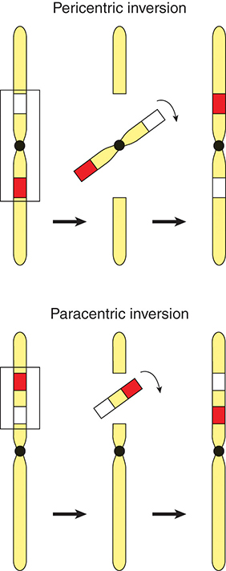

*Figure 16-8. Pericentric inversion spans the centromere (dup/del offspring); paracentric does not (early pregnancy loss).*

### Ring chromosome
- Deletion at both ends → ends join. If only **telomeres** are lost → balanced carrier; more proximal loss → abnormal phenotype. **Ring X → Turner syndrome.**

---

## 5. Mosaicism

- ≥2 cytogenetically distinct cell lines **from one zygote**. Phenotype depends on which tissues (fetus, part of fetus, placenta) carry the abnormal line.
- Found in **~0.3% of amnionic fluid cultures**.
  - Abnormal cells in **one flask only** → probably **pseudomosaicism** (culture artifact).
  - **Multiple cultures** → true mosaicism more likely; confirmed in **60–70%**.

### Confined placental mosaicism (CPM)
- Mosaicism in **1–2% of CVS specimens** → **offer amniocentesis**.
- In >1000 CVS mosaics: **true fetal mosaicism 13%**, **CPM 85%**, **uniparental disomy 2%**.
- If the chromosome has **imprinted genes — 6, 7, 11, 14, 15** — consider **UPD testing**.
- Outcomes generally good, but ↑ **FGR and stillbirth**. One series: **preterm birth 45%**, **SGA 50%**.
- ⚠️ **CPM for trisomy 16** → poor prognosis (**as few as 1 in 3** normal outcomes).

### Gonadal (germline) mosaicism
- One cell line in gametes, another in somatic cells → explains **apparently de novo** disease in children of normal parents.
- Spermatogonia divide throughout adulthood → new errors (paternal age >40).
- Explains the **~6% recurrence risk** after a child with a "new" mutation.

---

## 6. Modes of Inheritance

- **Monogenic (mendelian):** mutation at a single locus — autosomal dominant, autosomal recessive, X-linked, Y-linked.
- Other monogenic patterns: **mitochondrial, uniparental disomy, imprinting, trinucleotide repeat expansion**.

### Table 16-3. Selected Monogenic (Mendelian) Disorders

| Autosomal Dominant | Autosomal Recessive | X-Linked |
|---|---|---|
| Achondroplasia | α₁-Antitrypsin deficiency | Androgen insensitivity syndrome |
| Acute intermittent porphyria | Congenital adrenal hyperplasia | Chronic granulomatous disease |
| Adult polycystic kidney disease | Cystic fibrosis | Color blindness |
| Antithrombin III deficiency | Gaucher disease | Fabry disease |
| BRCA1 and BRCA2 breast and/or ovarian cancer | Hemochromatosis | Fragile X syndrome |
| Ehlers-Danlos syndrome | Homocystinuria | Glucose-6-phosphate deficiency |
| Familial adenomatous polyposis | Phenylketonuria | Hemophilia A and B |
| Familial hypercholesterolemia | Sickle-cell anemia | Hypophosphatemic rickets |
| Hereditary hemorrhagic telangiectasia | Tay-Sachs disease | Muscular dystrophy — Duchenne and Becker |
| Hereditary spherocytosis | Thalassemia syndromes | Ocular albinism type 1 and 2 |
| Huntington disease | Wilson disease | |
| Hypertrophic obstructive cardiomyopathy | | |
| Long QT syndrome | | |
| Marfan syndrome | | |
| Myotonic dystrophy | | |
| Neurofibromatosis type 1 and 2 | | |
| Tuberous sclerosis | | |
| von Willebrand disease | | |

*The printed table is a single column in three sections; laid out side by side here.*

### Phenotype vs genotype
- It is the **phenotype** that is dominant or recessive.
- Recessive carriers make some abnormal product but the normal co-gene directs the phenotype: sickle trait RBCs have **~30% HbS / 70% HbA** → do not sickle in vivo.

**Heterogeneity**

| Type | Meaning | Example |
|---|---|---|
| **Locus** | Same phenotype from mutations at **different loci** (may follow different inheritance) | Retinitis pigmentosa (≥35 loci; AD, AR or X-linked) |
| **Allelic** | **Different mutations in the same gene** → variable severity | Cystic fibrosis: one gene (CFTR), **>2000 mutations** |
| **Phenotypic** | **Different diseases** from different mutations in the same gene | **FGFR3**: achondroplasia and thanatophoric dysplasia |

### Autosomal dominant
- One copy determines the phenotype; **50% transmission** per conception.
- **Penetrance** = whether the gene is expressed at all (e.g., 80% penetrant). **Incomplete penetrance** → disease "skips" generations.
- **Expressivity** = range of severity in those who express it — e.g., **neurofibromatosis, tuberous sclerosis, adult polycystic kidney disease**.
- **Codominance**: both alleles expressed — **ABO blood groups**, **HbS + HbC** (Ch 59).

**Advanced paternal age (>40)**
- Spermatogonia divide **every 16 days** → ↑ single base-pair mutations → new **AD disorders** and **X-linked carrier states** ("paternal age effect disorders"):
  - **FGFR2** → craniosynostosis (**Apert, Crouzon, Pfeiffer**)
  - **FGFR3** → **achondroplasia**, thanatophoric dysplasia
  - **RET** → MEN syndromes
- **~2 extra mutations per year** of paternal age past 40.
- Absolute risk for any one disorder is low → **no specific screening or testing recommended**.

### Autosomal recessive
- Disease only when **both copies** are abnormal. Carriers usually found after an affected child.
- **Recurrence 25%** per pregnancy: ¼ normal, ½ carriers, ¼ affected. **⅔ of unaffected siblings are carriers.**
- A carrier's risk depends on the partner: low unless **consanguinity** or an at-risk group.

**Inborn errors of metabolism** — absent enzyme → toxic intermediates → intellectual disability etc.

**Phenylketonuria (PAH deficiency)**
- AR; **PAH** converts phenylalanine → tyrosine. **>600** mutations.
- Untreated: progressive intellectual impairment, autism, seizures, motor deficits; **hypopigmentation** (phenylalanine inhibits tyrosine hydroxylase → ↓ melanin).
- Northern European carrier frequency **1 in 50**; disease up to **1 in 10,000** newborns. **Universal newborn screening.**
- Treatment: dietary phenylalanine restriction from early infancy + **phenylalanine-free amino-acid supplements**.
- **Pregnancy target: phenylalanine 2–6 mg/dL (120–360 µmol/L), from ≥3 months before conception and throughout pregnancy.**
- Phenylalanine is **actively transported to the fetus** → even a heterozygous (unaffected) fetus is damaged: miscarriage and **PKU embryopathy** (intellectual disability, microcephaly, seizures, growth impairment, cardiac anomalies).
- **Unrestricted diet:** intellectual disability **>90%**, microcephaly **>70%**, cardiac defects **up to 1 in 6**.
- Maternal PKU Collaborative Study (572 pregnancies): levels in range → ↓ anomalies and **normal childhood IQ**.
- **Sapropterin** (tetrahydrobiopterin, synthetic PAH cofactor): ↓ phenylalanine in **25–50%**; an option when diet fails.
- Preconceptional counseling + PKU-center care.

**Consanguinity**
- Union of **second cousins or closer**. ~**10%** of the global population; 20–50% of marriages in some countries.
- Shared genes: 1st-degree **½**, 2nd-degree **¼**, 3rd-degree (first cousins) **⅛**.
- **First cousins: 2× risk** of congenital abnormalities; ↑ stillbirth; ↑ rare AR and multifactorial disorders.
- **SNP-array CMA can reveal consanguinity** → include in pretest counseling.
- **Incest** (1st-degree relatives): up to **40%** of offspring abnormal (older studies).

### X-linked and Y-linked
- **Most X-linked diseases are recessive**: color blindness, **hemophilia A and B**, **Duchenne/Becker** muscular dystrophy.
- Affected male → **no affected sons** (sons get his Y); all daughters are carriers.
- Carrier woman → each **son 50% affected**, each **daughter 50% carrier**.
- **Skewed lyonization** → symptomatic carriers: **~10% of hemophilia A carriers have factor VIII <30%** (similar for factor IX in hemophilia B) → ↑ bleeding at delivery (risk exists even at higher levels).
- **DMD/BMD carriers → cardiomyopathy risk** → periodic cardiac/neuromuscular evaluation.
- **X-linked dominant** disorders mainly affect females (lethal in males): **vitamin D–resistant rickets, incontinentia pigmenti**. Exception: fragile X.
- **Y-linked** disorders are rare. **Yq deletions → severe spermatogenic defects**; Yp tip genes → meiotic pairing and fertility.

### Mitochondrial inheritance
- Oocyte **~100,000 mitochondria**; sperm **~100** (destroyed after fertilization) → **exclusively maternal inheritance**. Males can be affected but **cannot transmit**.
- mtDNA: **16.5-kb circular** molecule, **37 genes** (oxidative phosphorylation, rRNAs, tRNAs).
- **Replicative segregation** → **homoplasmy** (all normal or all mutant) vs **heteroplasmy** (mixed). Degree of heteroplasmy in offspring **cannot be predicted** → counseling is difficult.
- **33** mitochondrial diseases with known molecular basis: **MERRF**, **Leber optic atrophy**, **Kearns-Sayre**, **Leigh syndrome**, mitochondrial myopathies/cardiomyopathies.

### DNA triplet repeat expansion
- Repeats expand in transmission: during **male meiosis (Huntington)** or **female meiosis (fragile X)**.
- Clinical hallmark: **anticipation** — earlier onset or greater severity in each generation.

### Table 16-4. Some Disorders Caused by DNA Triplet Repeat Expansion

| Disorder |
|---|
| Dentatorubral-pallidoluysian atrophy |
| Fragile X syndrome |
| Friedreich ataxia |
| Huntington disease |
| Spinal and bulbar muscular atrophy |
| Myotonic dystrophies |
| Spinocerebellar ataxias |

### Fragile X syndrome
- **Most common inherited intellectual disability**: **~1 in 3600 males**, **1 in 4000–6000 females**.
- **CGG** repeat at **Xq27.3**; full mutation → **FMR1 gene methylated and silenced**.
- Speech/language problems, ADHD, autism. Males: **IQ 35–45**. Narrow face, large jaw, **prominent ears**, connective tissue abnormalities, **macroorchidism** (postpubertal).

| Category | CGG repeats |
|---|---|
| Unaffected | **<45** |
| Intermediate | **45–54** |
| Premutation | **55–200** |
| Full mutation | **>200** |

- Full mutation is expressed in **all males** and many females (variable because of X-inactivation).
- Expansion to a full mutation almost always occurs through the **mother**.
- **Premutation mother → full-mutation child: ≤5% with <70 repeats, >95% with 100–200 repeats.**
- Male premutation carrier: expansion extremely unlikely, but **all daughters carry the premutation**.
- Premutation prevalence: **~1 in 250** women without risk factors; **~1 in 90** with a family history of intellectual disability.
- Premutation health effects: **males → FXTAS** (tremor/ataxia, memory loss, dementia); **females → 20% risk of fragile X–associated primary ovarian insufficiency (POI)**.
- **Carrier screening for:** family history of fragile X; unexplained intellectual disability, developmental delay or autism; **POI**.
- Prenatal diagnosis: amniocentesis or CVS (both give CGG repeat number); ⚠️ **CVS may not accurately show FMR1 methylation status**.

### Imprinting
- Expression depends on the **parent of origin** (epigenetic, genotype unchanged).
  - **Maternal imprinting**: maternal copy silent, paternal active. **Paternal imprinting**: the opposite.
- Imprint is **reset** in each generation (a female passes a paternally inherited gene with a maternal imprint).
- Explains diandric vs digynic triploidy phenotypes.

| | Prader-Willi | Angelman |
|---|---|---|
| Region | 15q11.2–q13 | 15q11.2–q13 |
| Missing contribution | **Paternal** | **Maternal** (gene: ubiquitin protein ligase E3A) |
| Microdeletion | **>70%** (paternal chromosome 15) | **~70%** (maternal chromosome 15) |
| Other causes | **Maternal UPD**, or maternal imprinting with the paternal gene inactivated | Paternal imprinting defects **2–3%**; **paternal UPD 2%** |
| Features | **Hyperphagia/obesity**, short stature, small hands and feet, mild intellectual disability | Normal size; **severe intellectual disability, absent speech**, seizures, ataxia, jerky arm movements, **inappropriate laughter** |

> **Memory hook:** **P**rader-Willi = **P**aternal copy missing; **A**ngelman = m**A**ternal copy missing.

### Table 16-5. Some Disorders That Can Involve Imprinting

| Disorder | Chromosomal Region | Parental Origin |
|---|---|---|
| Angelman | 15q11.2–q13 | Maternal |
| Beckwith-Wiedemann | 11p15.5 | Paternal |
| Myoclonus-dystonia | 7q21 | Maternal |
| Prader-Willi | 15q11.2–q13 | Paternal |
| Pseudohypoparathyroidism | 20q13.2 | Variable |
| Russell-Silver syndrome | 7p11.2 | Maternal |

### Uniparental disomy (UPD)
- **Both members of a pair from one parent.** Usually harmless, **except chromosomes 6, 7, 11, 14, 15** (imprinted genes).
- Commonest mechanism: **trisomic rescue** — loss of one homologue from a trisomic conceptus → UPD in **~⅓**.
- **Isodisomy** = two identical copies from one parent → e.g., **cystic fibrosis with only one carrier parent**.

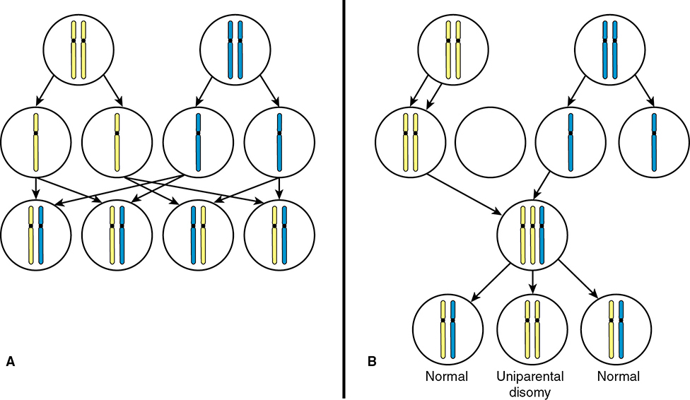

*Figure 16-9. Trisomic rescue: after nondisjunction, loss of one of three homologues gives uniparental disomy in about a third.*

### Multifactorial inheritance
- Multiple genes + environment (**polygenic** = several genes). Examples: **NTDs, cardiac defects, facial clefts**, diabetes, atherosclerosis, height, head size.
- Familial but non-mendelian. **After one affected child: empiric recurrence 3–5%**; falls exponentially with more distant relationships.

### Table 16-6. Characteristics of Multifactorial Diseases

| Characteristic | Details |
|---|---|
| There is a genetic contribution | No mendelian pattern of inheritance; no evidence of single-gene disorder |
| Nongenetic factors are also involved in disease causation | Lack of penetrance despite predisposing genotype; monozygotic twins may be discordant |
| Familial aggregation may occur | Relatives are more likely to have disease-predisposing alleles |
| Expression more common among close relatives | Greater concordance in monozygotic than dizygotic twins; becomes less common in less closely related relatives — fewer predisposing alleles |

- **Continuously variable traits**: normal distribution; **>2 SD** from the mean = abnormal; offspring are less extreme (**regression to the mean**).
- **Threshold traits**: all-or-none, appear only when liability exceeds a threshold.
  - If the **less-often-affected sex** is affected, relatives' risk is higher. **Pyloric stenosis ~4× more common in males** → an affected female's children/siblings have >3–5% risk, and **her sons and brothers have the highest risk**.
  - **Severity** raises recurrence: **bilateral cleft lip + palate ~8%** vs **unilateral cleft lip ~4%**.

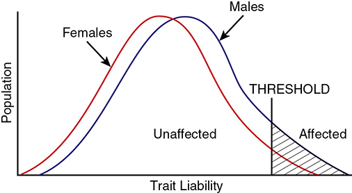

*Figure 16-10. Threshold trait with male predilection: at the same threshold more males than females are affected.*

**Cardiac defects**
- **Most common birth defects: 8 per 1000 births.**
- Offspring risk: **5–6% if mother affected**, **2–3% if father affected**.
- Left-sided lesions (**HLHS, coarctation, bicuspid aortic valve**) → recurrence **4–6× higher**. See Table 52-4.

**Neural-tube defects**
- Risk factors: family history, **hyperthermia, hyperglycemia**, teratogens, **obesity**, ethnicity, fetal sex.
- Most NTDs occur without maternal folate deficiency (complex gene–nutrient interactions).
- **Prior affected child: recurrence 3–5%, ↓ ≥70% with 4 mg/d periconceptional folic acid.**
- Folic acid also appears to help with pregestational diabetes, antiepileptic drugs, fever in embryogenesis and obesity.

---

## 7. Genetic Tests

- **All pregnant women** should be offered **aneuploidy screening** (serum or cfDNA) **and diagnostic testing**.
- Carrier screening for **cystic fibrosis and spinal muscular atrophy** routinely; ethnic-specific, panethnic and expanded panels are all acceptable (Ch 17).
- Diagnosis: **CMA, karyotype, FISH** on amnionic fluid or chorionic villi; **PCR** for specific known single-gene diseases. WGS/WES not routine.

### Cytogenetic analysis (karyotyping)
- Detects **aneuploidy, polyploidy** and balanced/unbalanced rearrangements **≥5–10 Mb**. **Accuracy >99%.**
- Needs **dividing cells** (arrested in metaphase). **Giemsa → G-bands**. Metaphase banding **450–550 bands**; prophase **~850**.
- Turnaround:

| Sample | Time |
|---|---|
| Amnionic fluid | **7–10 days** |
| Fetal blood | 36–48 h (rarely needed) |
| Postmortem skin fibroblasts | 2–3 wk (largely replaced by CMA) |

### Fluorescence in situ hybridization (FISH)
- **Rapid (1–2 days)** targeted test for **21, 18, 13** (and X, Y) → used when the result may change management. Can confirm 22q11.2 deletion (CMA preferred).
- Fluorescent probes hybridize to complementary DNA; **number of signals = number of copies**. Looks **only at the region probed**, not the whole complement.
- ⚠️ ACOG: **don't act on FISH alone** — need supporting data (abnormal screen, sonographic finding, or karyotype/CMA confirmation).

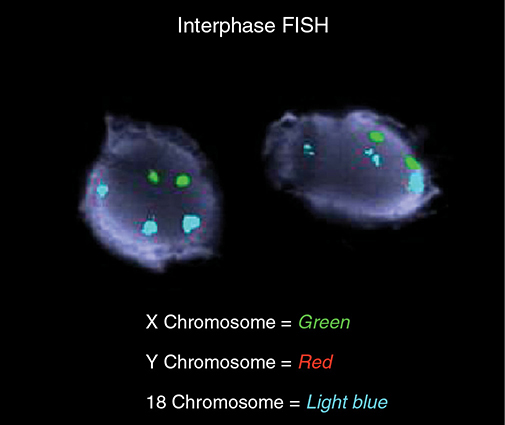

*Figure 16-12. Interphase FISH: three light-blue (18) signals, two green (X), no red (Y) = female fetus with trisomy 18.*

### Chromosomal microarray analysis (CMA)
- **100× more sensitive than karyotype**; detects deletions/duplications as small as **50–100 kb**.
- Turnaround: **3–7 days** direct (uncultured cells); **10–14 days** if culture needed. **No dividing cells needed.**
- **CGH platform**: fetal DNA and control DNA labeled with different dyes, hybridized to oligonucleotides on a chip; signal intensities compared.
- **SNP platform**: chip of known SNPs; signal intensity = copy number.

| Detects | CGH array | SNP array |
|---|---|---|
| Aneuploidy, unbalanced translocations, microdeletions/duplications | ✔ | ✔ |
| **Triploidy** | ✘ | ✔ |
| **Absence of heterozygosity** (UPD, **consanguinity**) | ✘ | ✔ |
| **Balanced rearrangements** | ✘ | ✘ |

- ⚠️ Because CMA misses balanced rearrangements, **recurrent pregnancy loss → karyotype first-line**.
- **Variants of uncertain significance ~1%** of prenatal specimens (source of parental distress).

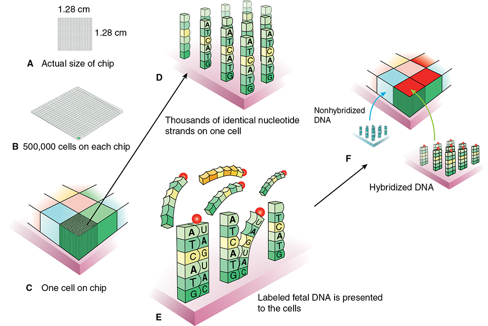

*Figure 16-13. CMA chip: ~500,000 cells, each holding thousands of identical oligonucleotides; labeled fetal DNA binds complementary sequences and glows.*

**Clinical applications**
- High-risk aneuploidy screen → offer **karyotype or FISH + karyotype**; CMA should be available.
- Normal karyotype → CMA finds relevant CNVs in **~6.5% with fetal anomalies** and **1–2% without**.
- **Fetal structural anomaly → CMA is the first-tier test** (ACOG, SMFM).
  - Exception: an anomaly strongly suggesting a specific aneuploidy (**endocardial cushion defect → T21**; **alobar holoprosencephaly → T13**) → karyotype or FISH first.
- CMA may reveal unmanifested AD disease in a parent or **nonpaternity**.
- **Stillbirth:** CMA beats karyotype (no dividing cells). SCRN: **~6%** extra diagnoses when karyotype uninformative. Meta-analysis: pathogenic CNV in **6%** with anomalies and **3%** without; CMA gave a result **15% more often** than karyotype.

### Whole genome (WGS) and whole exome (WES) sequencing
- WGS = entire genome; **WES = coding regions (~1.5%)**. Used postnatally for suspected syndromes/intellectual disability.
- Fetus with anomalies + normal karyotype + normal CMA: **WES diagnoses ~10%**; highest yield with **cardiac, skeletal or multisystem** anomalies.
- Limitations: long turnaround, cost, false-positive/negative results, VUS, incidental actionable findings in parents (trio sequencing).
- **Not recommended for routine prenatal use.**

---

## 8. Fetal DNA in the Maternal Circulation

- **Intact fetal cells:** only **2–6 cells/mL**; persist for **decades** → **microchimerism** (implicated in scleroderma, SLE, Hashimoto thyroiditis). Limited diagnostic use (low numbers, persistence into later pregnancies, hard to tell apart from maternal cells).

### Cell-free DNA (cfDNA; NIPS)
- Fragments from maternal cells + **apoptotic placental trophoblast** — so "fetal" is a misnomer.
- Reliably detected **after 9–10 wk**. **Fetal fraction ≈ 10%** of total cfDNA. **Cleared from maternal blood within minutes** (unlike intact fetal cells).
- Current clinical uses: **aneuploidy screening** and **Rh D genotyping**.
- Microdeletion panels and genome-wide screening (**>7 Mb**) are offered commercially but **not recommended routinely**.
- Research: single-gene disorders (skeletal dysplasias, hemoglobinopathies, CF, CAH, hemophilia, muscular/myotonic dystrophy, SMA).

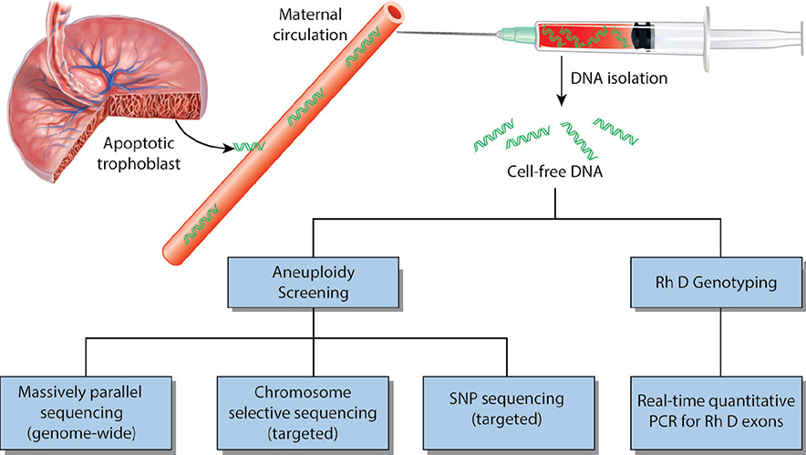

*Figure 16-14. cfDNA from apoptotic trophoblast: aneuploidy screening (massively parallel, chromosome-selective or SNP sequencing) and Rh D genotyping (real-time PCR).*

### Aneuploidy screening
- Platforms: **massively parallel (whole-genome) sequencing**, chromosome-selective/targeted sequencing, **SNP analysis**. A T21 fetus → excess proportion of chromosome 21 fragments.
- Performance (meta-analysis, mostly high-risk):

| Condition | Sensitivity |
|---|---|
| **Trisomy 21** | **99.7%** |
| Trisomy 18 | 98% |
| Trisomy 13 | 99% |
| Specificity (each) | **≥99.9%** — cumulative false-positive rate **<1%** |

- **Fetal sex**: sensitivity **95% at 7–12 wk**, **99% after 20 wk** (useful for X-linked disease, CAH).
- ⚠️ **Screening only — confirm with diagnostic testing before any irreversible intervention.**
- **No result in 2–4%** (assay failure, high variance, **low fetal fraction**) → these pregnancies have **↑ aneuploidy risk**.
- A result may reflect **CPM, a vanished aneuploid co-twin, maternal mosaicism** or rarely **occult maternal cancer**.

### Table 16-7. Selected Etiologies Creating Inaccurate Cell-free DNA Results

| Abnormality not detected — false negative | Normal fetus but abnormal screen — false positive |
|---|---|
| **Low fetal fraction:** fetal chromosomal abnormality; multifetal gestation; maternal obesity; low-molecular-weight heparin | Confined placental mosaicism (normal fetus, aneuploid placenta) |
| Confined placental mosaicism (normal placenta, aneuploid fetus) | Multifetal gestation with loss of aneuploid fetus |
| | Maternal aneuploidy (e.g., 47,XXX) |
| | Maternal mosaicism (e.g., 46,XX/45,X) or fetal mosaicism |
| | Maternal cancer (lymphoma, breast, colon, leukemia, others) |
| | Vitamin B₁₂ deficiency |

### Rh D genotyping
- **~40%** of fetuses of Rh D-negative (white) women are also Rh D-negative → avoid unnecessary **anti-D**, and in alloimmunization avoid needless **MCA Doppler/amniocentesis**.
- **Real-time PCR** targeting RHD **exons 4, 5, 7 and 10**. Routine in **Denmark, Finland, Netherlands**.
- At **24–27 wk** (>35,000 women): **false-negative 0.03%**, false-positive **<1%**. UK: false-negative higher in the 1st trimester; added alloimmunization risk **<1 per million births**.

---

## Quick-Recall: Inheritance Patterns and Recurrence Risks

| Situation | Risk / key fact |
|---|---|
| Prior autosomal trisomy | **~1%** recurrence (or age risk if higher) |
| Prior triploidy (past 1st trimester) | **1–1.5%** |
| Autosomal dominant parent | **50%** per pregnancy |
| Both parents AR carriers | **25%** affected; ⅔ of unaffected sibs are carriers |
| X-linked recessive carrier mother | Sons **50% affected**, daughters **50% carriers**; affected father → no affected sons, all daughters carriers |
| Mitochondrial | **Only maternal** transmission |
| "New" dominant mutation (gonadal mosaicism) | **~6%** |
| Multifactorial, one affected child | **3–5%** (bilateral CL/P 8%, unilateral CL 4%) |
| NTD recurrence | **3–5%**, ↓ ≥70% with **4 mg/d folic acid** |
| Congenital heart disease in parent | Mother **5–6%**, father **2–3%**; left-sided lesions 4–6× higher |
| Reciprocal translocation carrier | **5–30%** (after abnormal child) vs **~5%** (other ascertainment) |
| Robertsonian carrier | **~15% maternal**, **~2% paternal**; homologous → 100% unbalanced gametes |
| Pericentric inversion | **5–10%** (after abnormal child) vs **1–3%**; inv(9) normal variant |
| Paracentric inversion | Extremely low |
| Fragile X premutation mother | ≤5% (<70 repeats) → >95% (100–200 repeats) |

| Test | Resolution / turnaround | Misses |
|---|---|---|
| Karyotype | **5–10 Mb**; 7–10 days (amnio) | Microdeletions |
| FISH | Targeted; **1–2 days** | Everything not probed |
| CMA | **50–100 kb**; 3–7 days direct | **Balanced rearrangements**; triploidy (CGH) |
| WES | Coding 1.5% of genome | Not routine prenatally |
| cfDNA | Screening; after **9–10 wk** | Not diagnostic; 2–4% no-call |

## Key Numbers to Memorize
- Chromosomal abnormalities: **>50%** of 1st-trimester losses; **0.4%** of pregnancies; T21 **>50%**, T18 **15%**, T13 **5%** of cases
- Oocyte aneuploidy **10–20%** vs sperm **3–4%**
- Down syndrome **1:450 pregnancies / 1:740 live births**; 95% nondisjunction (75% meiosis I), 3–4% robertsonian; cardiac **50%**; life expectancy **55–60 yr**
- T18 **1:2000**; heart defects **>90%**; median survival **8 days**, 5-yr **12%**
- T13 **1:5000**; holoprosencephaly **⅔**; median survival **5 days**; maternal hypertension **≥25%**
- Turner **1:2500** girls; 98% lost early; paternal X missing **80%**; left heart lesions **30–50%**
- Klinefelter **1:700** males; XXX and XYY **1:1000** each
- 22q11.2 deletion **1:3000–6000**, **>90% de novo**; conotruncal heart **75%**
- Robertsonian **1:1000**; reciprocal **1:600**; inv(9) **1%** of people
- Mosaicism **0.3%** of amnio, **1–2%** of CVS (CPM 85%, true 13%, UPD 2%)
- Imprinted chromosomes **6, 7, 11, 14, 15**
- PKU target **2–6 mg/dL**, from **3 months** preconception
- Fragile X: normal **<45**, intermediate **45–54**, premutation **55–200**, full **>200**; premutation **1:250** women; POI **20%**
- CMA: **50–100 kb**, CNV in **6.5%** of anomalous fetuses with normal karyotype; VUS **~1%**; WES **~10%** extra yield
- cfDNA: fetal fraction **~10%**; T21 sensitivity **99.7%**; no-call **2–4%**; Rh D false-negative **0.03%**
