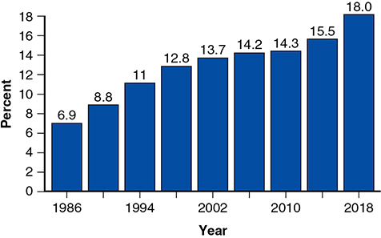
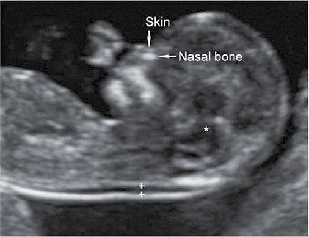
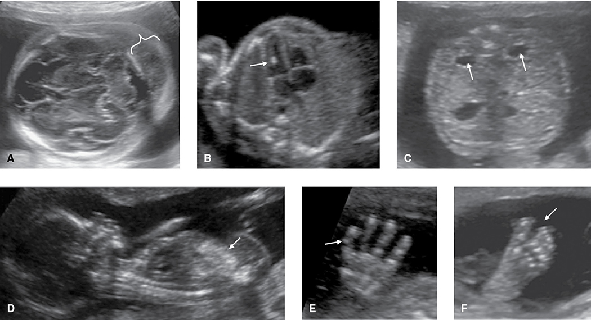
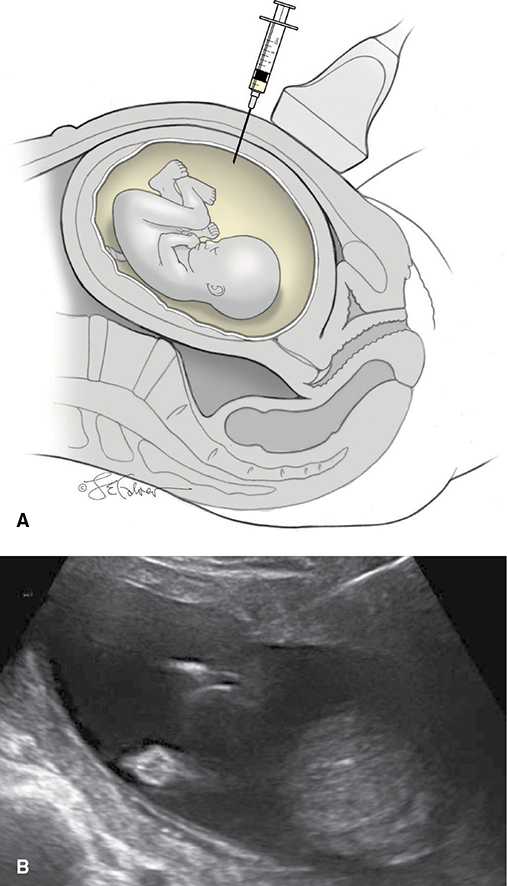
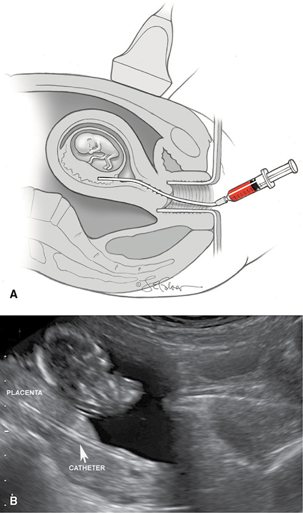
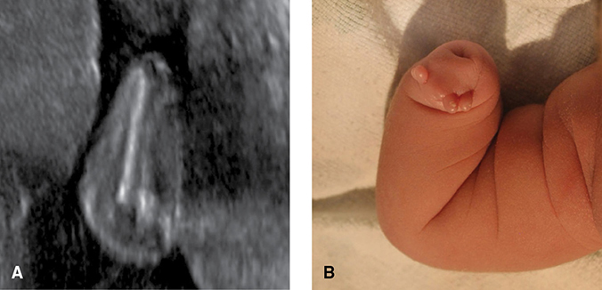
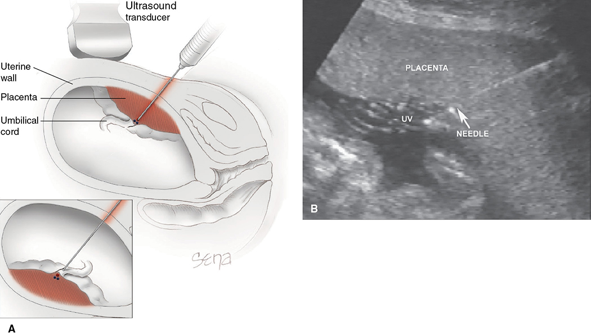
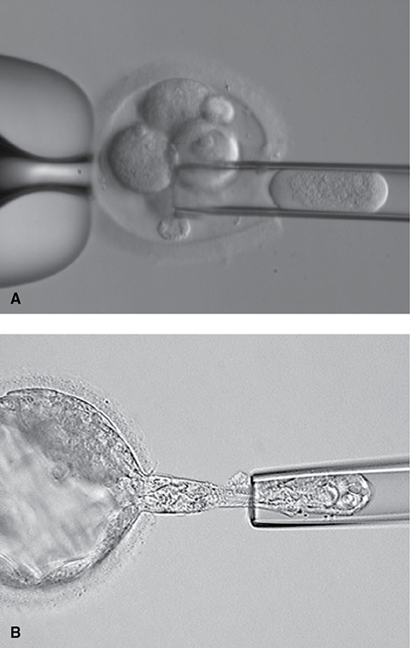

# Chapter 17: Prenatal Diagnosis — Revision Notes

> Williams Obstetrics 26e, pp. 849–903 of the PDF. High-yield numbers are in **bold**.
> The nine tables are transcribed from the PDF images (they are missing from the extracted chapter text). All 8 figures are included from the PDF.

**Big picture:** **4 per 1000** pregnancies have a chromosomal abnormality; CMA finds a pathogenic copy number variant in **another 4 per 1000**. **All pregnant women should be offered both screening and diagnostic testing.** Counseling is **nondirective**: accurate information on prognosis, recurrence risk and possible therapy.

---

## 1. Historical Perspective

- **Brock (1972–73):** ↑ AFP in maternal serum and amnionic fluid with **neural-tube defects**. UK trial (1977) → MSAFP screening.
- MSAFP at **16–18 wk** detects **90% of anencephaly** and **80% of open spina bifida** (similar to today).
- California program: **⅓** of MSAFP elevations were explained by **wrong gestational age, multifetal gestation or fetal death** on a basic ("level I") scan.
- Amnionic fluid AFP + **acetylcholinesterase** (leaks from exposed neural tissue) confirmed NTD, but both are also positive with **ventral wall defects, esophageal atresia, teratoma, cloacal exstrophy, epidermolysis bullosa**.
- Today most NTDs are found on standard ultrasound; **detailed ultrasound is the preferred diagnostic test**. "Level II" is no longer a synonym for a detailed exam.
- **"Advanced maternal age" (≥35)** came from the 1979 NIH conference: it assumed amniocentesis loss risk = Down risk at 35. **No longer true.**
- **1984, Merkatz:** midtrimester MSAFP is **low with trisomies 21 and 18**. Screen-positive cutoff **1:270** (2nd-trimester risk at age 35) with a **5% false-positive rate** became the standard.

### Table 17-1. Estimated Risks for Fetal Trisomy 21 and Any Aneuploidy According to Maternal Age and Timing of Diagnosis

| Age | T21 — CVS | T21 — Amniocentesis | T21 — Delivery | Any aneuploidy — Amniocentesis | Any aneuploidy — Delivery |
|---|---|---|---|---|---|
| 35 | 1/249 | 1/280 | **1/356** | 1/132 | 1/204 |
| 36 | 1/196 | 1/220 | 1/280 | 1/105 | 1/167 |
| 37 | 1/152 | 1/171 | 1/218 | 1/83 | 1/130 |
| 38 | 1/117 | 1/131 | 1/167 | 1/65 | 1/103 |
| 39 | 1/89 | 1/100 | 1/128 | 1/53 | 1/81 |
| 40 | 1/68 | 1/76 | **1/97** | 1/40 | 1/63 |
| 41 | 1/51 | 1/57 | 1/73 | 1/31 | 1/50 |
| 42 | 1/38 | 1/43 | 1/55 | 1/25 | 1/39 |
| 43 | 1/29 | 1/32 | 1/41 | 1/19 | 1/30 |
| 44 | 1/21 | 1/24 | 1/30 | 1/15 | 1/24 |
| 45 | 1/16 | 1/18 | **1/23** | 1/12 | 1/19 |

*Risk is highest at CVS and lowest at delivery because aneuploid fetuses are lost along the way.*

---

## 2. Aneuploidy Screening — Principles

- Among chromosomally abnormal pregnancies: **T21 ~½**, **T18 15%**, **T13 5%**, **sex chromosome aneuploidies ~12%**.
- Risk ↑ with maternal age, especially **>35**; **PPV of every screen is higher at ≥35**. Women ≥35 = **18% of US deliveries**.
- Other risk factors: parental numerical or structural abnormality (e.g., **balanced translocation**); **prior autosomal trisomy or triploidy**.

*Figure 17-1. US births to women aged 35–44 rose from 6.9% (1986) to 18.0% (2018).*

### Two types of screening
- **cfDNA**: more sensitive and specific; **PPV ~80% vs 3%** for 1st-trimester screening (Norton, 15,000 pregnancies).
- **Analyte-based**: an abnormal result can point to **other genetic abnormalities** not specifically screened for.
- ACOG: **no single screen is superior in all circumstances.** **No screen is diagnostic** — confirm before acting.

### When NOT to screen
- ⚠️ **Major fetal abnormality → diagnostic testing (CVS/amnio with CMA)**, not screening. A negative screen cannot "normalize" the risk.
- **Analyte screens invalid** with an abnormality affecting AFP (**NTD, ventral wall defect**).
- All methods **less accurate in twins**; **invalid in triplets and higher**.
- **≥20%** of women prefer no screening even when cost is removed → it is an informed choice.

### Table 17-2. Aneuploidy Screening Counseling Elements

| Principle | Details |
|---|---|
| **All pregnant women have 3 options: screening, diagnostic testing, and no screening or testing** | The purpose of a screening test is to provide information, not to dictate a course of action. Diagnostic testing is safe and effective and provides information that screening does not. |
| **There are differences between a screening test and a diagnostic test** | Screening evaluates whether the pregnancy is at increased risk for specific conditions and estimates the degree of risk; it does not provide information on all genetic abnormalities. With a negative screen, risk is decreased but not eliminated. With a positive screen, a diagnostic test is recommended if the patient wants to know whether the fetus is affected. **Irreversible management decisions should not be based on screening results.** cfDNA does not always provide a result, and aneuploidy risk is increased in such cases. |
| **Basic information is provided on the conditions screened for and the limitations of the test** | May include prevalence, associated abnormalities and prognosis. Diagnosis may aid earlier identification of associated abnormalities. With trisomy 18 or 13, diagnosis may affect management if complications arise (growth restriction, nonreassuring FHR). All screening tests are less effective in multifetal gestations. Phenotypic expression of sex chromosome aneuploidies varies widely. |
| **A-priori risk may affect whether a woman elects screening or diagnostic testing** | Age-related risk is in reference tables. Prior fetus with autosomal trisomy, robertsonian translocation or other chromosomal abnormality → additional evaluation and counseling. **Major fetal abnormality on ultrasound → diagnostic test preferred; screening not recommended.** |

### Test characteristics
| Term | Meaning |
|---|---|
| **Sensitivity (detection rate)** | Proportion of affected fetuses detected. False-negative rate = 1 − sensitivity (80% sensitivity misses **1 in 5**) |
| **Specificity** | Proportion of unaffected pregnancies with a negative screen. False-positive rate = 1 − specificity |
| **Screen-positive rate** | All positive results — ≈ false-positive rate because aneuploidy is rare; usually **≤5%** |
| **PPV** | Proportion of screen-positives who are truly affected — "the test result"; **depends on prevalence** (↑ with age) |
| **NPV** | Proportion of screen-negatives who are unaffected — **>99%** for all aneuploidy screens |

- Sensitivity and specificity say **nothing about an individual's risk**; PPV does.

### Table 17-3. Positive Predictive Value of Cell-Free DNA Screening for Autosomal Trisomies and Sex Chromosome Abnormalities, According to Maternal Age at Term

| Maternal Age | Trisomy 21 | Trisomy 18 | Trisomy 13 | 45,X | 47,XXX | 47,XXY | 47,XYY |
|---|---|---|---|---|---|---|---|
| 20 | 48% | 14% | 6% | 41% | 27% | 29% | 25% |
| 25 | 51% | 15% | 7% | 41% | 27% | 29% | 25% |
| 30 | 61% | 21% | 10% | 41% | 27% | 29% | 25% |
| 35 | **79%** | 39% | 21% | 41% | 28% | 30% | 25% |
| 40 | **93%** | 69% | 50% | 41% | 45% | 52% | 25% |
| 45 | 98% | 90% | NA | 41% | 73% | 77% | NA |

*NA = not available. PPVs from the Perinatal Quality Foundation cfDNA calculator (2020), based on prevalence at 16 weeks and sensitivities/specificities from Gil, 2015.*

> **Pearl:** even with cfDNA, a positive T21 result in a 20-year-old is a coin toss (**PPV ~48%**) — hence "screen positive ≠ affected".

---

## 3. Cell-free DNA Screening

- DNA fragments mainly from **apoptotic trophoblast** ("fetal" is a misnomer) → placenta–fetus discordance causes false results.
- Three assay types: **whole-genome sequencing, chromosome-selective (targeted) sequencing, SNP analysis**.
- **Any time after 9–10 wk.** Now offered to all risk groups.
- Screens **T21, T18, T13**; optionally **45,X, 47,XXX, 47,XXY, 47,XYY** (too few cases for accurate performance data; prognosis very different from autosomal trisomies → counsel).
- **Performance** (meta-analysis, mostly high-risk): **T21 99.7%**, **T18 98%**, **T13 99%** sensitivity; specificity **99.9%** each; combined false-positive rate **<0.2%**. Each added condition ↑ the overall false-positive rate.
- As **secondary screen** after a positive analyte screen (to avoid amnio): negative cfDNA still leaves a residual chromosomal-abnormality risk **up to 2%**, and a positive one delays diagnosis.
- **Not recommended** (ACOG) for trisomies 16/22, microdeletions or genome-wide CNVs — not validated.

### Limitations
- **No-call (indeterminate) in 2–4%** → aneuploidy risk **up to 4%** (≈ a positive analyte screen).
- **Fetal fraction ≈ 10%** in the late 1st trimester. **Low fetal fraction = <4%**; more common:
  - **Before 10 wk**
  - **Maternal obesity** — no-call **>10–20% at BMI ≥40**
  - **Aneuploidy, especially T18 and T13**
- ACMG: report the fetal fraction.
- **Positive or no-call → genetic counseling and offer amniocentesis.** Repeat cfDNA fails again in **~40%**. Detailed ultrasound is **not a substitute** for amniocentesis.
- False positives: **confined placental mosaicism, vanished aneuploid co-twin, maternal aneuploidy/mosaicism, occult maternal malignancy**.
- ⚠️ **Empty second gestational sac on ultrasound → cfDNA not recommended.**

### Table 17-4. Characteristics of Screening Tests for Trisomy 21 in Singletons

| Screening Test | Detection Rate | False-Positive Rate | Positive Predictive Valueᵃ |
|---|---|---|---|
| **Quadruple screen:** AFP, hCG, estriol, inhibin | 80–82% | 5% | 3% |
| **First-trimester screen:** NT, hCG, PAPP-A | 80–84% | 5% | 3–4% |
| First-trimester NT alone | 64–70% | 5% | — |
| **Integrated screening** | **94–96%** | 5% | 5% |
| **Sequential — stepwise** | 92–97% | 5.1% | 5% |
| **Sequential — contingent** | 91–95% | 4.5% | 5% |
| **Cell-free DNA — positive result** | **99%** | **0.1%** | Table 17-3 |
| Cell-free DNA — low fetal fraction or no result | — | 2–4% | 3–4% |

*ᵃPPV represents the overall population studied and cannot be applied to any individual patient. AFP = alpha-fetoprotein; hCG = human chorionic gonadotropin; NT = nuchal translucency; PAPP-A = pregnancy-associated plasma protein A.*

*The text gives first-trimester screen detection as 84% (trials) and 87% (meta-analysis); Table 17-4 gives 80–84%.*

---

## 4. Analyte-based Aneuploidy Screening

- Each analyte → **multiple of the median (MoM)**, adjusted for **maternal age, weight, gestational age**; AFP also for **race and diabetes**.
- Age-related risk × composite likelihood ratio → individual risk for T21 and T18 (± T13 in the 1st trimester).
- 2nd-trimester positive cutoff traditionally **1:270**.
- **Bonus:** abnormal combined screening in **93%** of T21/T18, **80%** of T13, **80%** of 45,X, ~60% of other sex aneuploidies and **>50%** of other genetic abnormalities. For women **<35**, integrated/sequential screening may find **as many or more** chromosomal abnormalities overall than cfDNA.

### Analyte patterns

| Condition | 1st trimester | 2nd trimester (quad) |
|---|---|---|
| **Trisomy 21** | **hCG ↑, PAPP-A ↓** | **AFP ↓, hCG ↑, uE3 ↓, inhibin ↑** |
| **Trisomy 18** | hCG ↓, PAPP-A ↓ | AFP ↓, hCG ↓, uE3 ↓ (inhibin not used) |
| Trisomy 13 | hCG ↓, PAPP-A ↓ | — |

> **Memory hook:** Down syndrome = "**HI**gh" — **h**CG and **I**nhibin are high; everything else is low. Edwards = **all low**.

### First-trimester screening (11–14 wk)
- **hCG + PAPP-A + nuchal translucency (NT)**.
- **NT** = maximum thickness of the subcutaneous translucency behind the fetal neck, **sagittal plane**, valid for **CRL 38–45 mm to 84 mm**. Requires certified, quality-reviewed operators.

*Figure 17-2. Normal 12-wk fetus: calipers (+) on the inner borders of the nuchal translucency; nasal bone and skin also seen.*

- ↑ NT is a **marker, not an anomaly**. Distinguish from **cystic hygroma** (septated, extends down the back) — **hygroma carries 5× the aneuploidy risk** of increased NT.
- ↑ NT also linked to other syndromes and birth defects, **especially cardiac**.
- **NT ≥3 mm or ≥99th percentile → offer detailed ultrasound.**
- **Fetal echo:** consider if **NT ≥3 mm**; **recommended if NT ≥3.5 mm**.
- NT alone detects only **~70%** of T21 → **not used alone in singletons**. **No added value after cfDNA.** Useful in **twins** (same NT distribution as singletons; fetus-specific).
- **Efficacy:** T21 detection **84%** at a 5% screen-positive rate (four trials, >100,000); **87%** in a meta-analysis. T18 **~80%**, T13 **~50%**.
  - Age **<35**: T21 detection **67–75%**. **>35**: **90–95%**, but false-positive **15–22%**.
- **Twins:** free β-hCG and PAPP-A ~**double**; a normal dichorionic co-twin normalizes results → detection **≥15% lower**.
- **Unexplained abnormal analytes:** **PAPP-A <5th percentile** → preterm birth, FGR, preeclampsia, fetal demise; low free β-hCG → demise. Too weak to use as screens.

### Second-trimester (quad) screening (15–20/21 wk)
- T21 detection **81–83%** at 5% screen-positive (text; Table 17-4 gives 80–82%).
- T18 detection similar, but false-positive only **0.5%**.
- Lower detection in younger women and twins.
- **No advantage over 1st-trimester screening**; used when care starts in the 2nd trimester (**>20%** of US pregnancies) or other screens unavailable.

### MSAFP elevation — neural-tube defect screening
- AFP = major fetal serum protein (like albumin). Leaks through **integument defects** (NTD, ventral wall).
- AFP rises **~15% per week** in the screening window → **accurate dating essential**.
- **Cutoff 2.5 MoM** → detects **~95% anencephaly**, **80% spina bifida**; screen-positive **1–3%**; **PPV only ~2%**.
- **Twins** have **2×** the AFP → higher thresholds.
- Because ultrasound finds nearly all anencephaly and most spina bifida, **MSAFP screening is optional**.
- **↑ MSAFP → detailed ultrasound** (findings are diagnostic). Amnio AFP + acetylcholinesterase can show whether a myelomeningocele is **open or closed** (relevant for fetal surgery, Ch 19).
- **Most women with ↑ MSAFP have a normal fetus**, but risk of an abnormality or adverse outcome rises with the AFP level.
- Unexplained ↑ **hCG or inhibin** (2nd trimester) → adverse outcomes, but no surveillance program improves outcome.

### Table 17-5. Conditions Associated with MSAFP Level Elevation

| Category | Conditions |
|---|---|
| Pregnancy/dating | **Underestimated gestational age**; **multifetal gestation**; **fetal death** |
| Fetal anomalies | **Neural-tube defect**; **gastroschisis**; **omphalocele**; cystic hygroma; esophageal or intestinal obstruction; liver necrosis; renal anomalies — polycystic kidneys, renal agenesis, congenital nephrosis, urinary tract obstruction; cloacal exstrophy; osteogenesis imperfecta; sacrococcygeal teratoma; congenital skin abnormality; pilonidal cyst |
| Placental | Chorioangioma of placenta; placental intervillous thrombosis; placental abruption |
| Pregnancy outcome | Oligohydramnios; preeclampsia; fetal-growth restriction |
| Maternal | Maternal hepatoma or teratoma |

*The printed table is a single list; grouped here for recall.*

### Low maternal serum estriol (<0.25 MoM)
- **Smith-Lemli-Opitz syndrome** — AR, **7-dehydrocholesterol reductase** mutation: CNS, heart, kidney, limb anomalies, **ambiguous genitalia**, FGR. Offer **detailed sonography**; confirm with **↑ amnionic fluid 7-dehydrocholesterol**.
- **Steroid sulfatase deficiency (X-linked ichthyosis)** — usually isolated; may be part of a contiguous gene deletion (with **Kallmann syndrome**, chondrodysplasia punctata, intellectual disability). **Male fetus + estriol <0.25 MoM → consider CMA or FISH** for the steroid sulfatase locus.

### Integrated and sequential screening
- Both trimesters' specimens must go to the **same lab** at the right gestational ages; the components can't be interpreted independently.

| Strategy | How it works | T21 detection |
|---|---|---|
| **Integrated** | NT + analytes at 11–14 wk **plus** quad at 15–21 wk; one result at the end | **94–96%** |
| **Stepwise sequential** | 1st-trimester result given; high risk (e.g., **>1:30**) → offer diagnosis; the rest get 2nd-trimester screening (overall cutoff 1:270) | **92%** (FP 5%) |
| **Contingent sequential** | **>1:30** → diagnosis offered; **1:30–1:1500** → 2nd-trimester screen; **<1:1500** → done, screen negative | **~91%**; **>75%** reassured almost immediately |

---

## 5. Ultrasound Screening

- Improves screening by **accurate dating**, detecting **multiples**, **major anomalies** and **minor markers**.
- **Major anomaly → offer diagnosis with CMA**; the authors do **not** recommend aneuploidy screening in this setting.
- Anomalies often coexist, and undetected associated anomalies can change prognosis.

### Table 17-6. Aneuploidy Risk Associated with Selected Major Fetal Anomalies

| Abnormality | Birth Prevalence | Aneuploidy Risk (%) | Common Aneuploidiesᵃ |
|---|---|---|---|
| **Cystic hygroma** | 1/5000 | **50–70** | 45,X; 21; 18; 13; triploidy |
| Nonimmune hydrops | 1/1500–4000 | 10–20 | 21; 18; 13; 45,X; triploidy |
| Ventriculomegaly | 1/1000–2000 | 5–25 | 13; 18; 21; triploidy |
| Holoprosencephaly | 1/10,000–15,000 | 30–40 | 13; 18; 22; triploidy |
| Dandy-Walker malformation | 1/12,000 | 40 | 18; 13; 21; triploidy |
| Cleft lip/palate | 1/1000 | 5–15 | 18; 13 |
| Cardiac defects | 5–8/1000 | 10–30 | 21; 18; 13; 45,X; 22q11.2 microdeletion |
| Diaphragmatic hernia | 1/3000–5000 | 5–15 | 18; 13; 21 |
| Esophageal atresia | 1/4000 | 10 | 18; 21 |
| **Duodenal atresia** | 1/10,000 | **30** | **21** |
| **Gastroschisis** | 1/2000 | **No increase** | — |
| **Omphalocele** | 1/3000–5000 | **30–50** | 18; 13; 21; triploidy |
| Clubfoot | 1/1000 | 5–30 | 18; 13 |

*ᵃNumbers indicate autosomal trisomies except where indicated (e.g., 45,X = Turner syndrome).*

> **Memory hook:** **O**mphalocele = **O**h no (aneuploidy 30–50%); **G**astroschisis = **G**ood (no increase).

- **Only ⅓ of T21 fetuses have a major anomaly** on 2nd-trimester ultrasound; with minor markers, **50–75%** show something. **~40%** of T21 newborns have no major organ abnormality.
- By contrast, **most T18, T13 and triploid fetuses have visible 2nd-trimester abnormalities**.

### Minor markers ("soft signs")
- **Normal variants**, not anomalies; no prognostic effect if isolated and euploid.
- **≥1 marker in ≥10%** of all pregnancies.
- A marker → **detailed anatomic survey** to see if it is isolated.
- Isolated marker + no screening yet → **offer screening**.
- **After a normal cfDNA, isolated markers no longer change the risk** (NPV too high). After an abnormal cfDNA, **absence of markers is not reassuring**.

### Table 17-7. First- and Second-Trimester Ultrasound Markers Associated with Fetal Trisomy 21

| First trimester | Second trimester |
|---|---|
| Ductus venosus with A-wave absence or flow reversal | Brachycephaly or shortened frontal lobes |
| Nasal bone absence or hypoplasia | Clinodactyly (hypoplastic middle phalanx of fifth digit) |
| Nuchal translucency enlargement | Echogenic bowel |
| Tricuspid valve regurgitation | Flat-appearing facies |
| | Echogenic intracardiac focus |
| | Nasal bone absence or hypoplasia |
| | Nuchal fold thickening |
| | Renal pelvis dilatation |
| | "Sandal gap" between first and second toes |
| | Short ear length |
| | Single transverse palmar crease |
| | Single umbilical artery |
| | Short femur |
| | Short humerus |
| | Subclavian artery aberrant (right side) |
| | Widened iliac angle |

*Markers listed alphabetically.*

- **1st-trimester markers** (nasal bone, ductus venosus, tricuspid flow) need specialized imaging/certification (Fetal Medicine Foundation); **not routine in the US**.

*Figure 17-3. Soft markers for Down syndrome: (A) thick nuchal skinfold, (B) echogenic intracardiac focus, (C) pyelectasis, (D) echogenic bowel, (E) 5th-finger clinodactyly, (F) sandal gap.*

**Second-trimester markers:** after analyte-based screening, they modify the risk by likelihood ratio (risk rises with the number of markers); follow a protocol with defined criteria.

### Table 17-8. Likelihood Ratios and False-Positive Rates for Isolated Second-Trimester Markers Used in Trisomy 21 Screening Protocols

| Sonographic Marker | Likelihood Ratio | Prevalence in Unaffected Fetuses (%) |
|---|---|---|
| **Nuchal skinfold thickening** | **11–17** | 0.5 |
| Renal pelvis dilation | 1.5–1.9 | 2.0–2.2 |
| Echogenic intracardiac focus | 1.4–2.8 | 3.8–3.9ᵃ |
| **Echogenic bowel** | **6.1–6.7** | 0.5–0.7 |
| Short femur | 1.2–2.7 | 3.7–3.9 |
| **Short humerus** | **5.1–7.5** | 0.4 |
| *Any one marker* | *1.9–2.0* | *10.0–11.3* |
| *Two markers* | *6.2–9.7* | *1.6–2.0* |
| *Three or more* | ***80–115*** | *0.1–0.3* |

*ᵃHigher in Asian individuals.*

| Marker | Definition | Prevalence / T21 risk | Follow-up |
|---|---|---|---|
| **Nuchal skinfold** | Transcerebellar view, outer skull to outer skin; **≥6 mm at 15–20 wk** | ~1 in 200; **>10× risk** | — |
| **Echogenic intracardiac focus** | Papillary muscle calcification; no structural/functional defect | **4–7%** of normal fetuses (more in Asians); risk **~2×**. **Bilateral → think T13** | — |
| **Renal pelvis dilatation** | AP diameter, transverse view, inner borders; **≥4 mm** | ~2%; risk **~2×** | Scan at **~32 wk** (degree predicts renal pathology) |
| **Echogenic bowel** | **As bright as bone** | ~0.5%; risk **~6×**. Also swallowed blood (often with ↑ MSAFP), **CMV**, **cystic fibrosis** (inspissated meconium) | Growth scan at **32 wk** |
| **Short femur / humerus** | **<2.5th percentile** | T21 fetuses with short femur are **not** more often growth restricted | 3rd-trimester growth scan |
| **Nasal bone** | Measured **15–22 wk**; hypoplasia **<2.5 mm**, >2 SD below mean, or BPD ratio | **Absent in 30%**, hypoplastic in **>50%** of T21; absent in **~1 in 200** euploid (delayed ossification) | Part of detailed, not standard, exam |
| **Choroid plexus cyst** | — | **1–2%** of euploid fetuses; benign. ↑ **T18** risk only with structural anomalies | — |

*The text gives EIF in 4–7% of normal fetuses, while Table 17-8 lists 3.8–3.9%.*

---

## 6. Carrier Screening for Genetic Disorders

- Goal: information for **pregnancy planning** according to personal values. **Optional, informed choice.**
- Three acceptable approaches: **ethnicity-based**, **panethnic**, **expanded** (panethnic, many conditions).
- **Ideally preconception** (allows PGT or donor gametes). Positive → **screen the partner**; counsel on **residual risk** and prenatal diagnosis options. Consanguinity → extra counseling.
- **Founder effect**: a rare gene common in a population traced to a few ancestors (endogamy, isolation).
- **Expanded screening**: dozens to >1000 conditions; **>50%** of people screened carry ≥1 condition → anxiety, complex counseling.
- **ACOG criteria for expanded-panel conditions:**
  1. **Carrier frequency ≥1:100** (population prevalence 1:40,000)
  2. Well-defined phenotype, detrimental to quality of life, cognitive/physical impairment, or needs medical/surgical intervention
  3. **No adult-onset conditions**
- **Don't repeat** carrier screening in a later pregnancy (low yield) — consult genetics first.

### Cystic fibrosis
- **CFTR** gene, **long arm of chromosome 7**, chloride channel. Commonest mutation **ΔF508**; **>2100** mutations. Homozygosity or **compound heterozygosity**.
- **Median survival 42 yr**; ~15% milder disease.
- **Offer to all women pregnant or planning pregnancy** — minimum **23-mutation panethnic panel** (each in ≥0.1% of classic CF).

| Group | Carrier frequency | Residual risk after negative 23-mutation panel |
|---|---|---|
| Ashkenazi Jewish | **1:25** | ~1:380 |
| Non-Hispanic white | **1:25** | ~1:170–1:200 |
| African American, Hispanic white | 1:60 | ~1:170–1:200 |
| Asian American | 1:95 | ~1:170–1:200 |

- Sequencing panels detect **30% more** at-risk couples. Newborn screening **doesn't replace** carrier screening. Both carriers → counseling + offer prenatal diagnosis.

### Spinal muscular atrophy (SMA)
- AR; motor neuron degeneration → atrophy/weakness; **1 in 6000–10,000** live births. **SMN1** gene, **5q13.2**.
- **Types I and II = 80%**, both lethal. **Type I (Werdnig-Hoffmann)**: onset <6 months, death from respiratory failure **by 2 yr**. Type II: onset <2 yr, death from 2 yr to the 3rd decade. Type III: onset <2 yr, milder. Type IV: adult onset.
- **Offer carrier screening to all women** considering or in pregnancy.

| Group | Carrier frequency |
|---|---|
| Non-Hispanic white | **1:35** |
| Ashkenazi Jewish | 1:41 |
| Asian | 1:53 |
| African American | 1:66 |
| Hispanic white | 1:117 |

- Detection **90–95%**, except **~70% in African Americans**.
- ⚠️ **"2 + 0" carriers (3–4%)**: two SMN1 copies on one chromosome, none on the other → total of 2 copies → **missed by quantitative PCR**; more common in African Americans. Three copies → even lower risk.

### Hemoglobinopathies
- Higher risk with **African, Mediterranean, Middle Eastern, Southeast Asian** ethnicity → offer **hemoglobin electrophoresis** (prenatal or preconception).
- **African Americans:** sickle trait **1 in 12**, HbC **1 in 40**, β-thalassemia trait **1 in 40**. HbS also ↑ in Mediterranean, Middle Eastern, Asian Indian descent. Prenatal diagnosis by CVS or amnio.
- **Thalassemias = most common single-gene disorders worldwide.**

| | α-Thalassemia | β-Thalassemia |
|---|---|---|
| Usual lesion | **Gene deletions** (1–4 α genes) | **Point mutations** |
| Key point | **cis (αα/– –) in Southeast Asians** vs trans (α–/α–) in African descent. Both partners cis → **Hb Barts → hydrops**, fetal loss | One gene → **minor**; both → **major (Cooley)** or intermedia |
| Electrophoresis | ⚠️ **Cannot detect** α-thal or trait → **molecular testing** if microcytosis without iron deficiency and normal electrophoresis (esp. SE Asian) | **↑ HbA₂ and HbF**; **HbA₂ >3.5%** confirms minor |

### Ashkenazi Jewish recessive diseases
- **Offer screening for:** **Tay-Sachs (1:30)**, **Canavan (1:40)**, **familial dysautonomia (1:32)** — detection **≥98%** each.
- **Consider screening for:** Bloom, familial hyperinsulinism, Fanconi anemia, **Gaucher** (variable phenotype, **treatable** with enzyme repletion/substrate reduction), glycogen storage disease I, Joubert, maple syrup urine disease, mucolipidosis IV, Niemann-Pick, Usher.

**Tay-Sachs disease**
- Lysosomal storage: **hexosaminidase A deficiency → GM2 ganglioside** accumulation → neurodegeneration, death in early childhood.
- Carriers asymptomatic with **<55%** enzyme activity. Screening campaign → incidence **↓ >90%**. Also ↑ in **French-Canadian and Cajun** people.
- **DNA mutation analysis** for Ashkenazi/high-risk groups; **hexosaminidase activity** for lower-risk ethnicities.
- ⚠️ **Pregnant or on oral contraceptives → test leukocyte hexosaminidase** (serum gives false positives).
- Both carriers → prenatal diagnosis (enzyme activity in villi or amnionic fluid).

---

## 7. Prenatal and Preimplantation Diagnostic Tests

- **Fetal structural anomaly → CMA recommended** (finds significant abnormalities in **~6.5%** with normal karyotype; up to **1%** without anomalies). **Make CMA available with every diagnostic procedure.**
- **Karyotype** still needed for **balanced rearrangements** (e.g., recurrent loss) and when an anomaly strongly suggests a specific aneuploidy (**endocardial cushion defect → T21**, **holoprosencephaly → T13**).
- **FISH** for rapid T21/18/13 — combine with CMA or karyotype and clinical findings.
- Since cfDNA (2012): **CVS ↓ 70%**, **amniocentesis ↓ ~50%**. **<40%** of screen-positive women choose diagnosis.

### Amniocentesis
- **Offered to all pregnant women.** Usually **15–20 wk**, any time later.
- Uses: genetics, congenital infection, alloimmunization. **Fetal lung maturity no longer routinely tested.**

**Technique**
- **20- or 22-gauge** needle (spinal needle **9 cm**; longer if obese — measure skin-to-fluid depth first). Empty bladder; povidone-iodine (**shellfish allergy is not a contraindication**).
- Continuous ultrasound guidance; pocket near the midline avoiding fetal parts; puncture the chorioamnion **without tenting**.
- **Chorioamnion fuses by 16 wk** → procedure usually deferred until then.
- **Local anesthetic not beneficial** (discomfort is from myometrial contraction).
- Fluid: clear/pale yellow. Blood-tinged → usually transplacental (occurs in **~60% with anterior placenta**; **no ↑ loss**). Dark brown/green → old intra-amnionic bleeding.
- **Discard first 1–2 mL** (maternal cells), then collect **20–30 mL** for CMA/karyotype.
- Afterward: check puncture site, **document fetal heart motion**, **anti-D if Rh D-negative and unsensitized**.
- **Twins:** map each sac and the membrane. Indigo carmine dye is in short supply, so usually no dye. ⚠️ **Methylene blue contraindicated** (jejunal atresia, neonatal methemoglobinemia).

*Figure 17-4. Amniocentesis under continuous ultrasound guidance; the needle is seen in the upper right of the sonogram.*

### Table 17-9. Selected Tests Performed on Amnionic Fluid and Volume of Fluid Required

| Test | Volume (mL)ᵃ |
|---|---|
| Chromosomal microarray analysis | 20 |
| Fetal karyotype | 20 |
| FISHᵇ | 10 |
| Genotype studies (alloimmunization) | 20 |
| PCR tests for cytomegalovirus, toxoplasmosis, or parvovirus | 1–2 each test |
| Cytomegalovirus culture | 2–3 |
| *Tests no longer commonly used:* | |
| Fetal lung maturity tests | 10 |
| Delta OD 450 (bilirubin analysis) | 2–3 |
| Alpha-fetoprotein | 2 |

*ᵃVolume may vary by laboratory. ᵇFISH is typically performed for chromosomes 21, 18, 13, X and Y. PCR = polymerase chain reaction.*

**Complications**
- **Procedure-related loss 0.1–0.3% (~1 in 500)** with an experienced operator.
  - **Doubled if BMI >40**; **1.8%** in twins.
  - Background loss without a procedure **0.6%** — about twice the procedure-related rate (meta-analysis, >60,000 procedures).
  - Severe anomalies/hydrops raise loss regardless.
- **Leakage or spotting 1–2%**; leakage usually within **48 h**, resolves in days, **fetal survival >90%** → pelvic rest, avoid strenuous activity.
- Needle injury rare. **Culture success >99%** (lower if the fetus is abnormal).

**Early amniocentesis (11–14 wk)** — ⚠️ **not recommended**: ↑ fetal loss, **talipes equinovarus**, fluid leakage (membranes not fused; ~1 mL per week of gestation withdrawn).

### Chorionic villus sampling (CVS)
- **10–13 wk**; sent for CMA or karyotype. **Advantage: earlier results** → more time, safer termination.
- **Transcervical** (flexible polyethylene catheter with a blunt malleable stylet) or **transabdominal** (18- or 20-gauge needle) — **equally safe and effective**; always under transabdominal ultrasound; sample the **chorion frondosum** into culture medium.
- **Relative contraindications:** vaginal bleeding/spotting, active genital infection, extreme ante-/retroflexion, habitus precluding visualization.
- **Anti-D** if Rh D-negative and unsensitized.

*Figure 17-5. Transcervical CVS: catheter passed through the cervix into the chorion frondosum under ultrasound guidance.*

**Complications**
- **Overall** loss is higher than after midtrimester amnio (background 1st→2nd-trimester losses), but **procedure-related loss is comparable: 0.1–0.3%**; a meta-analysis found **no significant excess** with matched controls. Loss ↑ with indication (e.g., **↑ NT**) and there is a **learning curve**.
- **Limb-reduction defects / oromandibular-limb hypogenesis** were linked to CVS at **7 wk**. **At ≥10 wk**, limb defects are no higher than background (**~1 per 1000**).
- Spotting after transcervical CVS is common and benign. **Infection or fluid leakage <0.5%.**
- ⚠️ **Mosaicism in up to 2%** — usually **confined placental mosaicism** → offer **amniocentesis**; if normal, presume CPM (still linked to **FGR**).

*Figure 17-6. Oromandibular limb hypogenesis: transverse limb deficiency of the right hand at 25 wk and at birth (CVS was not done here) — linked to CVS before 10 wk.*

### Fetal blood sampling (cordocentesis, PUBS)
- **Commonest indication: fetal anemia** (alloimmunization, with transfusion). Others: platelet alloimmunization; karyotype when **mosaicism** is found at amnio/CVS. Mostly replaced by amnio-based tests.
- **Technique:** **22- or 23-gauge** needle into the **umbilical vein** under ultrasound, into a heparinized syringe. Near the **placental cord insertion** (transplacental if anterior) or a **free loop**. Local anesthetic may be used; antibiotics at some centers (no trial support).
- ⚠️ **Avoid arterial puncture** → vasospasm and bradycardia.
- **Complications:**

| Complication | Rate |
|---|---|
| **Procedure-related fetal loss** | **~1%** |
| Cord vessel bleeding | 20–30% |
| Fetal–maternal bleeding (transplacental) | ~40% |
| Fetal bradycardia | 5–10% |

- Placental insertion vs free loop: same success, loss, bleeding and bradycardia; insertion site is **quicker (5 vs 7 min)** but has **more maternal blood contamination**.

*Figure 17-7. Fetal blood sampling: needle into the umbilical vein near the cord insertion (transplacental with an anterior placenta, via fluid if posterior).*

### Preimplantation genetic testing (PGT)
- For IVF: **trophectoderm biopsy at the blastocyst stage** (usual), polar bodies, or **blastomere biopsy** of a cleavage-stage embryo.
- False positives and negatives occur with every type → **offer CVS or amniocentesis**. Comprehensive counseling first.

| Type | Purpose | Key point |
|---|---|---|
| **PGT-A** | Aneuploidy screening (counts each chromosome) | Optimal platform not established. NGS after trophectoderm biopsy often finds **mosaicism** (many still healthy babies). ASRM: **routine PGT-A for all IVF unproven** |
| **PGT-M** | Specific **single-gene disorder** or hereditary cancer syndrome | A test for a specific condition, not a panel; can select a **cord-blood donor** match for a sick sibling |
| **PGT-SR** | Parental **structural rearrangement** (translocation, inversion, deletion, duplication, insertion) | Detects **unbalanced** embryos but **not balanced carriers** |

*Figure 17-8. (A) Blastomere biopsy of a cleavage-stage embryo; (B) trophectoderm biopsy of a blastocyst.*

---

## Quick-Recall: Screening and Diagnostic Tests at a Glance

| Test | Timing | T21 detection / key figure | Notes |
|---|---|---|---|
| cfDNA | **≥9–10 wk** | **99.7%**; FPR **0.1–0.2%** | No-call 2–4% (risk up to 4%); still a screen |
| First-trimester screen (NT + hCG + PAPP-A) | **11–14 wk** | **80–84%** (87% meta) | T21: hCG ↑, PAPP-A ↓ |
| NT alone | 11–14 wk | 64–70% | Not used alone in singletons; useful in twins |
| Quad screen | **15–21 wk** | **80–83%** | T21: AFP ↓, hCG ↑, uE3 ↓, inhibin ↑ |
| Integrated | 1st + 2nd tri | **94–96%** | One result at the end |
| Stepwise / contingent sequential | 1st ± 2nd tri | 92% / 91% | Contingent cut-offs 1:30 and 1:1500 |
| MSAFP (NTD) | 2nd tri (with quad) | Anencephaly 95%, spina bifida 80% | Cutoff **2.5 MoM**; PPV ~2%; optional |
| CVS | **10–13 wk** | Loss **0.1–0.3%** | Mosaicism up to 2%; not <10 wk |
| Amniocentesis | **≥15 wk** | Loss **0.1–0.3% (1/500)** | Early (<14 wk) not recommended |
| Fetal blood sampling | — | Loss **~1%** | Mainly anemia/transfusion |

| MSAFP ↑ | MSAFP ↓ / Estriol ↓ |
|---|---|
| Wrong dates (underestimated GA), twins, fetal death | Trisomy 21 and 18 (AFP ↓) |
| NTD, gastroschisis, omphalocele, cystic hygroma, GI obstruction, renal anomalies, sacrococcygeal teratoma, skin defects | **uE3 <0.25 MoM:** Smith-Lemli-Opitz; steroid sulfatase deficiency (X-linked ichthyosis) |
| Placental: chorioangioma, abruption, intervillous thrombosis; oligohydramnios, preeclampsia, FGR | |

## Key Numbers to Memorize
- Chromosomal abnormality **4/1000** pregnancies (+4/1000 pathogenic CNV on CMA)
- T21 risk at 35: **1/356 at delivery, 1/280 at amnio, 1/249 at CVS**; at 40: **1/97**; at 45: **1/23**
- Classic cutoff **1:270**, false-positive **5%**
- cfDNA after **9–10 wk**; fetal fraction **~10%**; low = **<4%**; no-call **2–4%**; repeat failure **~40%**; PPV T21 **79% at age 35**
- NT valid at CRL **38–45 to 84 mm**; **≥3 mm** → detailed scan; **≥3.5 mm** → fetal echo; hygroma **5×** NT risk
- MSAFP cutoff **2.5 MoM**; rises **15%/wk**; twins **2×**
- Estriol **<0.25 MoM** → SLOS / steroid sulfatase deficiency
- Nuchal fold **≥6 mm** (LR 11–17); renal pelvis **≥4 mm**; short long bones **<2.5th percentile**; ≥3 markers LR **80–115**
- CF carrier **1:25** (white, Ashkenazi); SMA carrier **1:35** (white); Tay-Sachs **1:30**, Canavan **1:40**, FD **1:32**
- Sickle trait **1 in 12** African Americans; HbA₂ **>3.5%** = β-thal minor
- Amnio loss **0.1–0.3% (1/500)**, background **0.6%**, twins **1.8%**; leakage **1–2%**, survival >90%; collect **20–30 mL**
- CVS **10–13 wk**, loss **0.1–0.3%**; limb defects at **7 wk**; mosaicism **≤2%**
- Cordocentesis loss **~1%**; bradycardia **5–10%**
