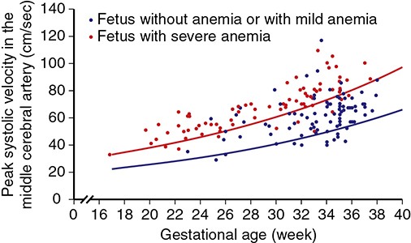
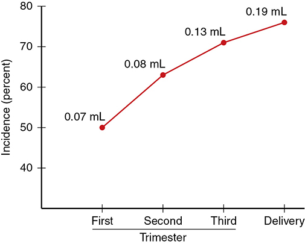
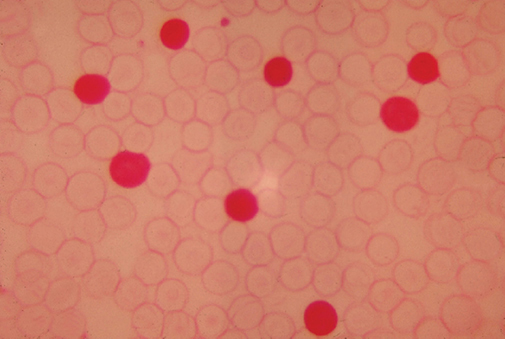
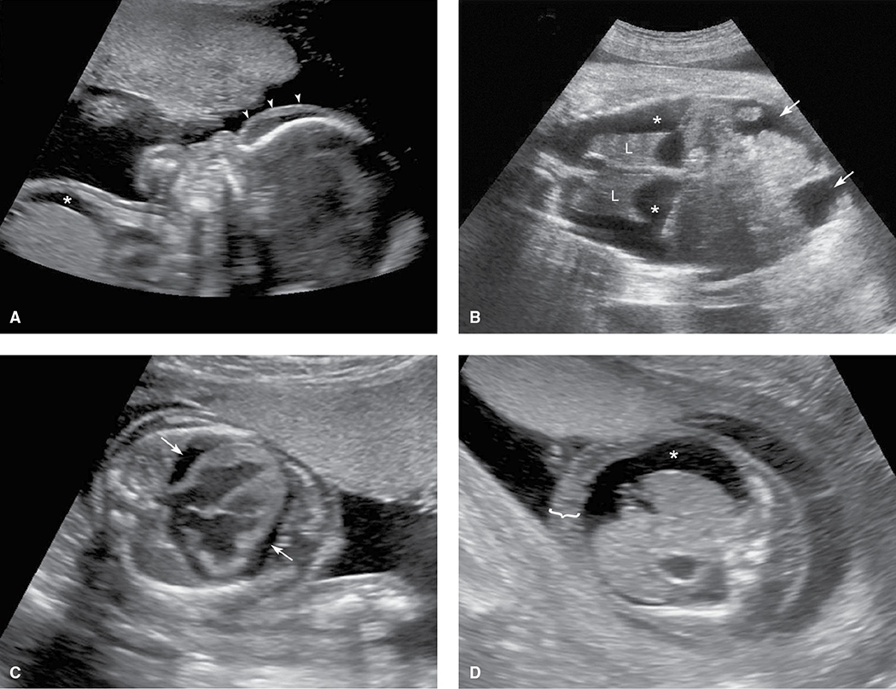
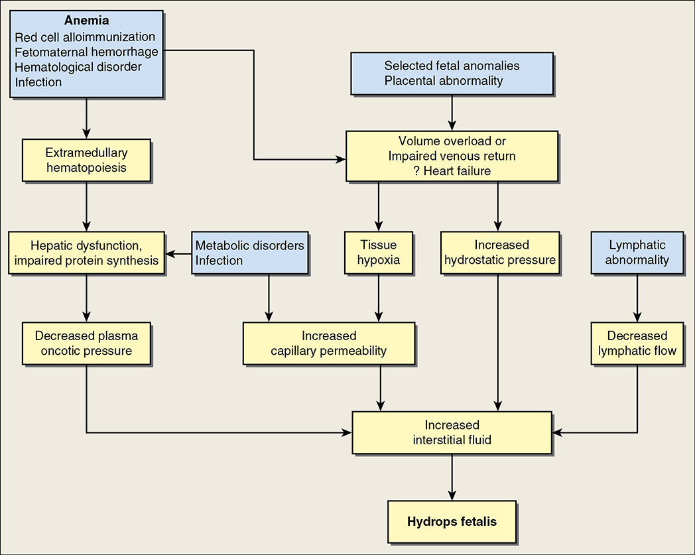

# Chapter 18: Fetal Disorders — Revision Notes

> Williams Obstetrics 26e, pp. 904–937 of the PDF. High-yield numbers are in **bold**.
> The four tables are transcribed from the PDF images (they are missing from the extracted chapter text). All 5 figures are included from the PDF. The Kleihauer-Betke formula (also missing from the text) is taken from the PDF page.

**Big picture:** Fetal anemia (alloimmune, infectious, genetic or from fetomaternal hemorrhage) is detected by **MCA peak systolic velocity** and treated by **intrauterine transfusion**. Anti-D immune globulin prevents most D alloimmunization. Platelet alloimmunization (FNAIT) can hit the **first** pregnancy. Hydrops is the final common pathway of many disorders; **≥90% is nonimmune**.

---

## 1. Fetal Anemia

- **Causes:**
    - **Red cell alloimmunization** → overproduction of immature red cells (erythroblastosis fetalis), now called **hemolytic disease of the fetus and newborn (HDFN)**
    - **Infection**, particularly **parvovirus B19**
    - **α⁰-thalassemia**: a common cause of severe anemia and nonimmune hydrops in **Southeast Asian** populations
    - Rare genetic causes: production disorders (Diamond-Blackfan, Fanconi), enzymopathies (G6PD, pyruvate kinase deficiency), membrane defects (spherocytosis, elliptocytosis), lysosomal storage diseases (Gaucher, Niemann-Pick, MPS VII), myeloproliferative disorders (leukemias)
    - **Fetomaternal hemorrhage**
- Detected by Doppler of the **MCA peak systolic velocity**.
- Progressive anemia → heart failure → **hydrops** → death.
- **Intrauterine transfusion survival >90%**; even with hydrops it approaches **80%**.

---

## 2. Red Cell Alloimmunization

- **36 blood group systems** and **360 erythrocyte antigens** are recognized.
- The fetus inherits a paternal antigen that the mother lacks; enough fetal cells in her circulation → sensitization → maternal IgG crosses the placenta → hemolysis.
- **Why alloimmunization is uncommon:**
    1. Low prevalence of incompatible antigens
    2. Insufficient transplacental passage of fetal antigens and maternal antibodies
    3. **Maternal-fetal ABO incompatibility** → rapid clearance of fetal cells before an immune response
    4. Variable antigenicity
    5. Variable maternal immune response
- Prevalence in pregnancy **~1%**.
- Most severe anemia needing antenatal transfusion: **anti-D, anti-Kell, anti-c, anti-E**.
- **Screening:** blood type + antibody screen at the first prenatal visit (**indirect Coombs** detects unbound antibody). If positive → identify antibody, IgG vs IgM, and titer.
    - **Only IgG matters** (IgM does not cross the placenta).
- **Critical titer** = level at which significant fetal anemia may develop: usually **1:8 to 1:32**. If the lab's anti-D cutoff is 1:16, a titer **≥1:16** means possible severe disease.
    - **Exception: Kell** (titer does not predict severity).

### Table 18-1. Selected Red Cell Antigens and Their Relationship to Fetal Hemolytic Disease

| Blood Group System | Antigens | Fetal Hemolysis Potential |
|---|---|---|
| CDE (Rh) | **D, c** | **Severe disease risk** |
| | E, Beᵃ, Ce, Cw, Cx, ce, Dw, Evans, e, G, Goa7, Hr, Hro, JAL, HOFM, LOCR, Riv, Rh29, Rh32, Rh42, Rh46, STEM, Tar | Severe disease infrequent, mild disease risk |
| Kell | **K** | **Severe disease risk** |
| | k, Kpᵃ, Kpᵇ, K11, K22, Ku, Jsᵃ, Jsᵇ, Ula | Severe disease infrequent, mild disease risk |
| Duffy | Fyᵃ | Severe disease infrequent, mild disease risk |
| | **Fyᵇ** | **Not associated** with fetal hemolytic disease |
| Kidd | Jkᵃ | Severe disease infrequent, mild disease risk |
| | Jkᵇ, Jk³ | Mild disease possible |
| MNS | M, N, S, s, U, Mtᵃ, Ena, Far, Hil, Hut, Miᵃ, Mit, Mut, Mur, Mv, sD, Vw | Severe disease infrequent, mild disease risk |
| Colton | Coᵃ, Co³ | Severe disease infrequent, mild disease risk |
| Diego | Diᵃ, Diᵇ, Wrᵃ, Wrᵇ | Severe disease infrequent, mild disease risk |
| Dombrock | Doᵃ, Gyᵃ, Hy, Joᵃ | Mild disease possible |
| Gerbich | Ge², Ge³, Ge⁴, Lsᵃ | Mild disease possible |
| Scianna | Sc2 | Mild disease possible |
| I | **I, i** | **Not associated** with fetal hemolytic disease |
| Lewis | **Leᵃ, Leᵇ** | **Not associated** with fetal hemolytic disease |

*Data from de Haas, 2015; Moise, 2008; Weinstein, 1982.*

> **Memory hook:** "**Lewis Lives, I Is fine, Duffy B Doesn't Bother**": Lewis, I and Fyᵇ are the harmless ones. **Lewis and I** are IgM cold agglutinins not expressed on fetal red cells.

### CDE (Rh) incompatibility
- Five antigens: **C, c, D, E, e**. There is **no "d" antigen**; D-negative = absence of D. **>200 D variants** exist. "Rhesus" is no longer used in transfusion medicine.
- **Sensitization after as little as 0.1 mL** of fetal red cells.
- Genes **RHD and RHCE** on the **short arm of chromosome 1**, inherited together.
- **D-positive:** ~85% of non-Hispanic white, ~90% Native American, 93% African American and Hispanic, **99% Asian** Americans.
- D alloimmunization complicates **0.5–0.9%** of pregnancies.
- **Without prophylaxis**, a D-negative woman delivering a D-positive, **ABO-compatible** baby → **16%** alloimmunization:
    - **2%** by delivery, **7%** by 6 months postpartum, **7%** "sensibilized" (antibodies only in the next pregnancy)
    - With **ABO incompatibility** the risk falls to **2%**.
- Also after 1st-trimester complications, prenatal procedures and trauma (Table 18-2).

### Table 18-2. Causes of Fetomaternal Hemorrhage Associated with Red Cell Antigen Alloimmunizationᵃ

| Pregnancy Loss | Procedures | Other |
|---|---|---|
| Abortion, spontaneous or elective | Amniocentesis | Antepartum bleeding, including threatened abortion |
| Ectopic pregnancy | Chorionic villus sampling | Delivery, vaginal or cesarean |
| Fetal death (any trimester) | Fetal blood sampling | External cephalic version |
| | Molar pregnancy evacuation | Placental abruption |
| | | Trauma to the abdomen during pregnancy |

*ᵃFor each of the above, anti-D immune globulin is recommended. Expanded from American Academy of Pediatrics, 2017; ACOG, 2019b.*

### C, c, E and e antigens
- Less immunogenic than D, but can cause hemolytic disease.
- Sensitization in **~0.3%** of pregnancies = **~30%** of red cell alloimmunization cases.
- **Anti-E is the most common**, but **anti-c more often needs fetal/neonatal transfusion** than anti-E or anti-C.

### The grandmother effect
- Small amounts of maternal blood enter the fetus in virtually all pregnancies.
- A **D-negative female fetus** exposed to her **D-positive mother's** cells may become sensitized → makes anti-D before or during her own pregnancy. Her fetus is then jeopardized by antibodies provoked by the **grandmother's** red cells.

### Minor antigens
- Because anti-D prophylaxis works, **proportionately more HDFN is now due to non-D ("minor") antigens**.
- **Kell** is among the most frequent. Others that can be severe: **Duffy A (Fyᵃ), MNS, Kidd (Jkᵃ)**.
- Most minor-antigen sensitization comes from an **incompatible blood transfusion**.
- If an IgG antibody is found and its significance is in doubt → **evaluate for hemolytic disease**.
- **No fetal risk:** **Lewis (Leᵃ, Leᵇ)** and **I** (IgM cold agglutinins, not on fetal cells); **Duffy B (Fyᵇ)**.

### Kell alloimmunization
- **~90%** of non-Hispanic white and up to **98%** of African Americans are **Kell negative**. Kell type is not routinely checked.
- **~90% of Kell sensitization is from transfusion** of Kell-positive blood → take a transfusion history.
- **More rapid and more severe:** anti-Kell attacks **erythrocyte precursors in the marrow** → suppressed erythropoiesis rather than hemolysis → **titer does not predict severity**.
- Slootweg (2018): titer **1:4** had **100% sensitivity**, 27% specificity, 60% PPV for transfusion need. **>50%** of Kell-positive fetuses needed transfusion.
- **ACOG: do not use antibody titers to monitor Kell-sensitized pregnancies** (surveil by MCA Doppler regardless of titer).

### ABO incompatibility
- **Most common cause of hemolytic disease in newborns**, but **no appreciable fetal hemolysis**:
    - Anti-A/anti-B are mostly **IgM** (do not cross)
    - Fetal cells have **fewer A and B sites**
- **~20%** of newborns are ABO incompatible; only **5%** are affected clinically, and anemia is mild.
- **Differs from CDE disease:**
    - Often affects the **firstborn** (group O women have anti-A/anti-B isoagglutinins from bacterial exposure)
    - **Rarely worsens** in successive pregnancies
    - **No fetal surveillance or early delivery** needed
- Postnatal: watch for **hyperbilirubinemia** (phototherapy, occasionally transfusion).

---

## 3. Management of the Alloimmunized Pregnancy

- D-alloimmunized fetuses: **25–30%** mild–moderate anemia; up to **25%** severe enough to cause **hydrops**.
- **Titer below critical value → repeat every 4 weeks.**
- **Once the critical titer is reached, no benefit in repeating it** — the pregnancy stays at risk even if the titer falls → further evaluation.
- **Prior affected pregnancy** → at risk **regardless of titer**.

### Fetal risk assessment
- Anti-D shows maternal sensitization, not fetal status. **Up to 40%** of D-negative women carry a **D-negative fetus**.
    - Titer can rise with a D-negative fetus (**amnestic response**).
- Non-Hispanic white D-negative woman: partner is D-positive **85%**; of these, **60% heterozygous** → only half the children at risk.
- **Step 1: paternal antigen status.** If paternity is certain and the father is antigen-negative → **not at risk**.
- **Father D-positive → paternal zygosity** by DNA analysis. If **heterozygous or paternity unknown → fetal genotype**:
    - **Amniocentesis + PCR of uncultured amniocytes**: **PPV 100%, NPV ~97%**. Also for E/e, C/c, Duffy, Kell, Kidd, M/N.
    - **CVS NOT recommended** (↑ fetomaternal hemorrhage → worsens alloimmunization).
    - **cfDNA fetal RHD genotyping** (maternal plasma): **sensitivity >99%, specificity >95%**. Routine in parts of Europe, not yet widely in the US.
        - Uses: (1) in sensitized women, find D-negative fetuses that need no surveillance; (2) in unsensitized women, withhold anti-D if the fetus is D-negative.
        - **ACOG does not recommend routine cfDNA** screening in D-negative women until shown to be cost-effective.
- **Standard pathway:** titer surveillance → once **critical titer** → serial **MCA PSV** → **fetal blood sampling ± transfusion** if MCA PSV exceeds the severe-anemia threshold.
- **Amnionic fluid ΔOD450 (bilirubin) is no longer recommended.**
- **Maternal IVIG** in severe early disease: delays the first transfusion (to beyond **20 wk**) by an average of **3 weeks** and ↓ hydrops. Mechanism unclear.

### MCA Doppler velocimetry
- **Recommended test to detect fetal anemia** (SMFM).
- Anemic fetus shunts blood to the brain; velocity ↑ from **↑ cardiac output + ↓ blood viscosity**.
- **Mari (2000):** threshold **1.5 MoM** detected **all** moderate–severe anemia: **sensitivity 100%, false-positive 12%**.
- **1.0–1.5 MoM and rising → at least weekly** Doppler.
- False-positives **↑ beyond 34 wk** (normal ↑ cardiac output). At Parkland, MCA PSV is **not measured beyond 35 wk** (hydrops surveillance instead).

*Figure 18-1. MCA peak systolic velocity vs gestational age: severely anemic fetuses (red dots) plot above the 1.5 MoM line (red).*

### Fetal blood transfusion
- **Indication:** MCA PSV **>1.5 MoM**, or hydrops with anemia as the leading cause → fetal blood sampling ± transfusion.
- Usually done **before 34–35 wk**; later, delivery risks are usually lower than transfusion risks.
- **Transfuse only if fetal Hct <30%.** With hydrops, Hct is usually **≤15%**.
- **Route:** usually **intravascular** (umbilical vein). **Intraperitoneal** if the vein is too narrow early in the 2nd trimester. Hydrops impairs peritoneal absorption → some do both.

| Donor red cells are… | Why |
|---|---|
| **Type O, D-negative** | Compatible |
| **CMV-negative** | Prevent infection |
| **Packed to Hct ~80%** | Prevent volume overload |
| **Irradiated** | Prevent fetal graft-vs-host |
| **Leukocyte-poor** | — |

- **Vecuronium** (paralytic) may be given to the fetus to stop movement.
- **Target Hct 40–50%** (nonhydropic fetus).
- **Volume (mL) ≈ EFW (g) × 0.02 for each 10% rise in Hct** needed.
- Severely anemic fetus at **18–24 wk**: smaller first volume, repeat in **~2 days**. Then every **2–4 weeks**.
- **After a transfusion, the MCA threshold rises to 1.70 MoM** (adult donor cells have smaller MCV).
- Post-transfusion **Hct falls ~1%/day** (faster with hydrops).

**Outcomes**

- **Overall survival ~95%.**
- Complications: **fetal death 2%**, emergent cesarean 1%, infection 0.3%, PPROM 0.3%.
- **Stillbirth >15% if transfusion needed before 20 wk.**
- Hydropic fetuses: neonatal survival **~80%**; **95%** if hydrops resolves vs **<40%** if it persists.
- **LOTUS (>450 pregnancies):** anti-D 80%, anti-Kell 12%, anti-c 5%; ~¼ hydropic; >½ needed neonatal exchange transfusion; **<5% severe neurodevelopmental impairment**.

---

## 4. Prevention of Anti-D Alloimmunization

- Used for >50 years, yet **50% of women worldwide** who need it do not get it. Without it, up to **10%** of D-negative pregnancies develop HDFN.
- With prophylaxis, risk falls to **<0.2%**. Mechanism not fully understood.
- **Delivery hemorrhage causes up to 90%** of cases.
- **Postpartum dose within 72 h** → ↓ alloimmunization by **90%**.
- **28-wk dose** → 3rd-trimester alloimmunization **2% → 0.1%**.
- **"When in doubt, give it."** It does no harm if unneeded.

### Preparations
| Preparation | Route | Note |
|---|---|---|
| Cold ethanol fractionation + ultrafiltration | **IM only** | Contains plasma proteins → anaphylaxis if IV |
| Ion-exchange chromatography | **IM or IV** | IV useful for large fetomaternal hemorrhage |

- Both remove viruses (hepatitis, HIV).
- **Half-life 16–24 days** → why it is given both at 28 wk and after delivery.

### Dosing and timing (US)
- **Standard dose 300 µg (1500 IU) IM** covers **30 mL fetal whole blood = 15 mL fetal red cells**.
- **All D-negative unsensitized women at ~28 wk**; **repeat antibody screen before** the 28-wk dose.
- **Second dose within 72 h of delivery if the newborn is D-positive** (40% of newborns of D-negative women are D-negative).
- **Missed dose → give as soon as recognized** (some protection up to **28 days**).
- After sensitizing events (Table 18-2). **1st trimester: 50 or 120 µg** may suffice.
- **Weakly positive indirect Coombs (1:1 to 1:4)** after anti-D is harmless — not alloimmunization.
- **BMI above 27–40 kg/m²** → antibody levels **↓ 30–60%** (may be less protective).
- Also give after **platelet transfusion or plasmapheresis** in D-negative women.
- May cause a weakly positive **direct Coombs** in cord blood, but no significant hemolysis.

### Large fetomaternal hemorrhage
- **>30 mL whole blood in 2–3 per 1000** pregnancies → one dose is not enough.
- Screening only women with risk factors **misses half** → **screen all D-negative women at delivery**:
    1. **Rosette test** (qualitative): maternal blood + anti-D coats fetal D+ cells; D+ indicator cells added form **rosettes** around fetal cells.
    2. If positive → **quantitative test**: **Kleihauer-Betke or flow cytometry**.
- **One 300-µg dose per 15 mL fetal red cells (30 mL whole blood).**
- **IM: max 5 doses in 24 h. IV: 600 µg every 8 h.**
- **Adequate dose** is shown by a **positive indirect Coombs** or fetal cells on rosette testing.

### Serological weak D phenotypes (formerly Dᵘ)
- The most common D variants in the US and Europe. Molecular **RHD genotyping** splits them:

| Type | Defect | Anti-D immune globulin? |
|---|---|---|
| **Weak D types 1, 2, 3** | Fewer intact D antigens | **Not needed** — manage as D-positive |
| **Partial D** | Protein deletions; D antigen lacks epitopes | **Needed** (can be sensitized) |

- **No molecular testing done** in a serologic weak D woman → **give anti-D**.

---

## 5. Fetomaternal Hemorrhage

- Some occurs in all pregnancies; enough to provoke an antigen-antibody reaction in **two thirds**.
- Incidence and volume **rise with gestation** (Fig. 18-2).
- **≥30 mL in ~3 per 1000** pregnancies; **≥150 mL in 1 in 2800** births.
- **Presentation:**
    - **Decreased fetal movement** = most common complaint
    - **Sinusoidal FHR** (infrequent) → evaluate immediately
    - **↑ MCA PSV = most accurate predictor**
    - **Hydrops = ominous**
- ↑ MCA PSV or hydrops → **urgent fetal transfusion or delivery**.
- **No cause in >80%.**
- Quantitative tests don't show **timing or chronicity**.
- **Chronic anemia is better tolerated** (FHR may stay normal until moribund). **Acute** hemorrhage → cerebral hypoperfusion, ischemia, infarction.
- May be found during **stillbirth** evaluation.

*Figure 18-2. Fetomaternal hemorrhage incidence rises from 50% (1st trimester, 0.07 mL) to ~76% at delivery (0.19 mL).*

### Hemorrhage quantification: Kleihauer-Betke (acid elution)
- **Hb F resists acid elution**; adult Hb A is eluted → fetal cells stain **red**, adult cells appear as **"ghosts"**. Count fetal cells as % of adult cells.

**Fetal blood volume = (MBV × maternal Hct × % fetal cells in KB) ÷ newborn Hct**

- Term MBV ≈ **5000 mL**.
- **Worked example:** maternal Hct 35%, fetal Hct 50%, KB 1.7% → 5000 × 0.35 × 0.017 ÷ 0.5 = **60 mL whole blood**.
    - Fetal-placental volume at term ≈ **125 mL/kg** → 375 mL for 3000 g → fetus lost **~15%**.
    - 60 mL whole blood = **30 mL red cells** → **two 300-µg doses** of anti-D.
- More precise MBV: from maternal height, weight and expected blood volume accrual (Table 42-1).
- **KB inaccurate when:**
    1. **Maternal hemoglobinopathy with ↑ Hb F** (e.g., β-thalassemia)
    2. **At or near term** (fetus already making Hb A)
- **Flow cytometry** (monoclonal anti-Hb F or anti-D, fluorescence): automated, counts more cells, **unaffected** by maternal Hb F or fetal Hb A; **more sensitive and accurate**, but not widely available.

*Figure 18-3. Kleihauer-Betke stain: Hb F-rich fetal cells stain darkly; maternal cells are pale "ghosts."*

---

## 6. Fetal Thrombocytopenia

### Fetal and neonatal alloimmune thrombocytopenia (FNAIT / AIT)
- **Most common cause of severe thrombocytopenia in term newborns**: **1–2 per 1000** births.
- Maternal antibodies against **paternally inherited fetal platelet antigens**.
- **Maternal platelet count is normal** (unlike ITP).
- **Can severely affect the FIRST pregnancy** (unlike anti-D).
- **HPA-1a = 80–90%** of cases, and the most severe. Then **HPA-5b > HPA-1b > HPA-3a**. Others 1%.
- **~85%** of non-Hispanic white people are HPA-1a positive; **2% are HPA-1b homozygous** (at risk), but only **10%** of these make antibodies with an HPA-1a fetus.
- **~⅓** of affected fetuses/neonates get severe thrombocytopenia; **10–20%** of those get **ICH**. Population rate: **1 ICH per 25,000–60,000** pregnancies.
- **Spectrum:** incidental thrombocytopenia → petechiae → devastating ICH.
    - Registry of 600: **ICH in 7%**; **60% in the first-born**; **half before 28 wk**; ⅓ died, **50% of survivors severely disabled**.
- **Bussel (1997):** severity predicted by a **prior sibling with ICH**; **50%** had initial platelets **<20,000/µL**; if >80,000/µL, counts fell **≥10,000/µL per week** untreated.

**Diagnosis and management**

- Usually diagnosed after delivery: **unexplained severe neonatal thrombocytopenia + normal maternal platelets**. Rarely after fetal ICH.
- **Recurs in 70–90%**, often severe and **earlier each pregnancy**.
- Fetal blood sampling (transfuse if <50,000/µL) has **>10% complication rate** → **empirical IVIG** is favored.
- **IVIG ↑ platelets ~50,000/µL**; no ICH in 50 treated fetuses (Bussel 1996).
- **+ Corticosteroids** in high risk (platelets <20,000/µL or sibling with ICH) → platelet rise in 80%, but a systematic review found **no consistent benefit** over IVIG alone → controversial.
- **Cesarean delivery at or near term** is generally recommended.

### Table 18-3. Fetal-Neonatal Alloimmune Thrombocytopenia (FNAIT) Treatment Recommendations

| Risk Group | Criteria | Suggested Management |
|---|---|---|
| 1 | Prior fetus or newborn with ICH, but **no maternal anti-HPA antibody** identified | Maternal anti-HPA antibody screening and cross-matching with paternal platelets at **12, 24 and 32 wk**; no treatment for negative results |
| 2 | Prior fetus or newborn with **thrombocytopenia** and maternal anti-HPA antibody, but **no ICH** | **From 20 wk:** IVIG 1 g/kg/wk + prednisone 0.5 mg/kg/d *or* IVIG 2 g/kg/wk. **From 32 wk:** IVIG 2 g/kg/wk + prednisone 0.5 mg/kg/d. Continue until delivery |
| 3 | Prior fetus with **3rd-trimester ICH** or prior newborn with ICH, and maternal anti-HPA antibody | **From 12 wk:** IVIG 1 g/kg/wk. **From 20 wk:** either ↑ IVIG to 2 g/kg/wk *or* add prednisone 0.5 mg/kg/d. **From 28 wk:** IVIG 2 g/kg/wk *and* prednisone 0.5 mg/kg/d. Continue until delivery |
| 4 | Prior fetus with **ICH before the 3rd trimester** and maternal anti-HPA antibody | **From 12 wk:** IVIG 2 g/kg/wk. **From 20 wk:** add prednisone **1 mg/kg/d**. Continue both until delivery |

*HPA = human platelet antigen; ICH = intracerebral hemorrhage; IVIG = intravenous immunoglobulin G.*

> **Memory hook:** The earlier the prior ICH, the earlier (12 wk) and heavier (2 g/kg + prednisone 1 mg/kg) the treatment.

### Immune thrombocytopenia (ITP)
- Maternal autoimmune antiplatelet IgG may cross the placenta → **usually mild** fetal thrombocytopenia.
- Neonatal platelets may fall rapidly after birth: **nadir at 48–72 h**.
- **Nothing predicts** fetal/neonatal counts: not maternal platelets, antibodies, or steroid treatment.
- **>400 pregnancies: no fetal/neonatal ICH.**
- **No fetal blood sampling. Mode of delivery by standard obstetric indications.**

| Feature | FNAIT | ITP |
|---|---|---|
| Maternal platelets | **Normal** | Low |
| Antibody against | Paternal platelet antigen (HPA-1a) | Platelet glycoproteins (autoimmune) |
| Fetal severity | Often **severe**; ICH risk, first pregnancy affected | Usually **mild**; ICH rare |
| Management | **IVIG ± prednisone**; cesarean near term | No fetal sampling; route by obstetric indications |

---

## 7. Hydrops Fetalis

- "General dropsy" of the fetus (Ballantyne, 1892).
- **Diagnosis:** **≥2 fetal effusions** (pleural, pericardial, ascites) **or 1 effusion + anasarca**.
- **Anasarca** = skin thickness **>5 mm**.
- **Placentomegaly** = thickness **≥4 cm in the 2nd trimester** or **≥6 cm in the 3rd**.
- As hydrops progresses: **anasarca is invariable**, usually with placentomegaly and hydramnios.
- **Immune** (with red cell alloimmunization) vs **nonimmune** (everything else).
- **Shared mechanisms:** **↓ colloid oncotic pressure, ↑ hydrostatic/central venous pressure, ↑ vascular permeability**.

*Figure 18-4. Sonographic hydrops: (A) scalp edema + ascites, (B) pleural effusions outlining lungs, (C) pericardial effusion with cardiomegaly, (D) ascites + anasarca with cystic hygroma.*

*Figure 18-5. Pathogenesis of hydrops: ↓ oncotic pressure, ↑ hydrostatic pressure, ↑ capillary permeability and ↓ lymphatic flow → ↑ interstitial fluid.*

### Immune hydrops
- Anemia → marrow erythroid hyperplasia + **extramedullary hematopoiesis** (liver, spleen) → **portal hypertension** + **↓ hepatic protein synthesis** → **↓ plasma oncotic pressure**.
- Anemia may also **↑ CVP**; tissue hypoxia **↑ capillary permeability**.
- Now much rarer (anti-D prophylaxis, MCA Doppler).
- **Only severe anemia** causes it: all immune hydrops had **Hb <5 g/dL** (Mari 2000). **Immediate fetal transfusion** may be lifesaving.

### Nonimmune hydrops
- **≥90%** of hydrops. **~1 per 1500** second-trimester pregnancies.
- **Cause found: ~60% prenatally**, up to **80% postnatally**.
- Prenatal causes: **aneuploidy ~20%**, **cardiovascular 15%**, **infection 14%** (most commonly **parvovirus B19**).
- **Twins: TTTS** is the most frequent cause.
- **Prognosis:** only **40%** result in a liveborn, and of these **neonatal survival ~50%**.
- **Cause varies with GA at diagnosis:**
    - **1st trimester: aneuploidy 70%**
    - **14–24 wk:** aneuploidy and infection **20% each**
    - **<24 wk:** commonest aneuploidy is **45,X (Turner)**; survival **<5%**
- **Whole exome sequencing** in unexplained cases (127): **~30%** pathogenic variant; commonest = **RASopathies (Noonan)**.
- **Thailand/Southern China: α⁰-thalassemia = 30–50%**, extremely poor prognosis.
- **Treatable causes** (parvovirus, chylothorax, tachyarrhythmias; **~10% each**) → **survival in ⅔** with fetal therapy.

### Table 18-4. Categories and Etiologies of Nonimmune Hydrops Fetalis

| Category | Examples | Percentᵃ |
|---|---|---|
| **Cardiovascular** | Structural defects: Ebstein anomaly, tetralogy of Fallot with absent pulmonary valve, hypoplastic left or right heart, premature closure of ductus arteriosus, arteriovenous malformation (vein of Galen aneurysm); cardiomyopathies; tachyarrhythmias; bradycardia, as in heterotaxy syndrome with endocardial cushion defect or with anti-Ro/La antibodies | **21** |
| **Chromosomal** | Turner syndrome (45,X), triploidy, trisomies 21, 18 and 13 | **13** |
| **Hematological** | Hemoglobinopathies, such as α⁰-thalassemia; erythrocyte enzyme and membrane disorders; erythrocyte aplasia/dyserythropoiesis; decreased erythrocyte production (myeloproliferative disorders); fetomaternal hemorrhage | **10** |
| **Lymphatic abnormalities** | Cystic hygroma, systemic lymphangiectasis, pulmonary lymphangiectasis | 8 |
| **Infections** | Parvovirus B19, syphilis, CMV, toxoplasmosis, rubella, enterovirus, varicella, herpes simplex, coxsackievirus, listeriosis, leptospirosis, Chagas disease, Lyme disease | 7 |
| **Syndromic** | Arthrogryposis multiplex congenita, lethal multiple pterygium, congenital lymphedema, myotonic dystrophy type I, Neu-Laxova, Noonan and Pena-Shokeir syndromes | 5 |
| **Thoracic abnormalities** | Cystic adenomatoid malformation, pulmonary sequestration, diaphragmatic hernia, hydro/chylothorax, CHAOS, mediastinal tumors, skeletal dysplasia with very small thorax | 5 |
| **Gastrointestinal** | Meconium peritonitis, GI tract obstruction | 1 |
| **Kidney and urinary tract** | Kidney malformations, bladder outlet obstructions, congenital (Finnish) nephrosis, Bartter syndrome, mesoblastic nephroma | 2 |
| **Placental, twin and cord** | Placental chorioangioma, TTTS, TRAP sequence, twin anemia polycythemia sequence, cord vessel thrombosis | 5 |
| **Other rare disorders** | Inborn errors of metabolism (Gaucher, galactosialidosis, GM₁ gangliosidosis, sialidosis, mucopolysaccharidoses, mucolipidoses); tumors (sacrococcygeal teratoma, hemangioendothelioma with Kasabach-Merritt syndrome) | 5 |
| **Idiopathic** | — | **18** |

*ᵃPercentages reflect the proportion within each category from a systematic review of 6775 pregnancies with nonimmune hydrops. CHAOS = congenital high airway obstruction sequence; TRAP = twin reversed arterial perfusion.*
*The printed table reads "α4-thalassemia", an evident typo for α⁰-thalassemia (the term used in the chapter text).*

> **Memory hook:** Top three identifiable categories: **"Heart, Chromosomes, Blood"** (21%, 13%, 10%), with **idiopathic 18%**.

### Diagnostic evaluation
1. **Indirect Coombs** (alloimmunization)
2. **Detailed ultrasound** of fetus and placenta:
    - Anatomical survey (Table 18-4 structural causes)
    - **Fetal echocardiography**
    - **MCA PSV** for anemia
3. **Amniocentesis:** **chromosomal microarray or karyotype**, plus **parvovirus B19, CMV, toxoplasmosis** testing
4. **Kleihauer-Betke** if anemia suspected
5. Consider **α-thalassemia** and/or **inborn errors of metabolism** testing
- **Whole exome sequencing** if the above is uninformative. Counsel about turnaround, cost and **variants of uncertain significance**; **not for routine use** (ACOG). Trio sequencing can reveal incidental parental findings (e.g., cancer predisposition).

### Isolated effusion or edema
- Not diagnostic of hydrops, but do the evaluation and surveil closely.

| Finding | Think of |
|---|---|
| **Pericardial effusion** | May precede hydrops in **parvovirus B19** |
| **Isolated ascites** | Parvovirus B19; **meconium peritonitis** |
| **Isolated pleural effusion** | **Chylothorax** — fetal therapy can be lifesaving if hydrops develops |
| **Edema of upper torso, dorsum of hands/feet** | **Turner or Noonan** syndrome; congenital lymphedema |

---

## 8. Mirror Syndrome (Ballantyne, "triple edema")

- **Mother mirrors the hydropic fetus**: fetus, mother and placenta all edematous.
- Complicates **≥20%** of hydrops cases. **Etiology of the hydrops does not matter** (D alloimmunization, TTTS, chorioangioma, cystic hygroma, Ebstein, SCT, chylothorax, bladder outlet obstruction, SVT, vein of Galen, infections).
- **Maternal findings (Braun, >50 cases):**

| Finding | Frequency |
|---|---|
| **Edema** | **~90%** |
| Hypertension | 60% |
| Proteinuria | 40% |
| ↑ Liver enzymes | 20% |
| Headache, visual disturbance | ~15% |

- Considered a **form of severe preeclampsia**: same angiogenic imbalance (**↑ sFlt-1, ↓ PlGF, ↑ sVEGFR1**). Others argue it is distinct, with **hemodilution** rather than hemoconcentration.
- **Management: usually prompt delivery** → maternal findings resolve.
- Successful **fetal therapy** (anemia, SVT, hydrothorax, bladder outlet obstruction, parvovirus transfusion) has reversed both hydrops and mirror syndrome, but delay delivery only **with caution**; **deliver if the mother deteriorates**.

---

## Quick-Recall: Antibodies, Tests and Thresholds

| Item | Key fact |
|---|---|
| Anti-D, anti-Kell, anti-c, anti-E | Cause most severe fetal anemia needing transfusion |
| Anti-Kell | Marrow suppression; **titer unreliable** → MCA Doppler regardless; 90% from transfusion |
| Anti-E vs anti-c | E most common; **c more often needs transfusion** |
| Lewis, I, Fyᵇ | **No** fetal hemolysis |
| ABO | Most common newborn hemolysis; firstborn; mild; no fetal surveillance |
| Indirect Coombs | Free antibody in maternal serum (screen; also weakly + 1:1–1:4 after anti-D) |
| Critical titer | **1:8–1:32** (often 1:16); repeat every 4 wk below it; don't repeat once reached |
| MCA PSV | **>1.5 MoM** = moderate–severe anemia (**1.70 MoM** after first transfusion); unreliable >34–35 wk |
| Rosette test | Qualitative screen for fetal D+ cells at delivery |
| Kleihauer-Betke | Quantifies FMH; inaccurate with maternal ↑ Hb F or near term |
| Flow cytometry | More accurate than KB; not widely available |
| Amniocyte PCR | Fetal genotype: PPV 100%, NPV ~97%; **avoid CVS** |
| cfDNA RHD | Sens >99%, spec >95%; not routine in US |
| FNAIT | **HPA-1a** (80–90%); normal maternal platelets; 1st pregnancy; IVIG ± prednisone |
| ITP | Mild fetal effect; neonatal nadir 48–72 h; no fetal sampling |

## Key Numbers to Memorize
- Alloimmunization **~1%** of pregnancies; D sensitization from **0.1 mL**; RH genes on **chromosome 1p**
- No prophylaxis → **16%** sensitized (2% / 7% / 7%); ABO-incompatible → **2%**
- Anti-D **300 µg = 30 mL whole blood / 15 mL red cells**; at **28 wk** + **≤72 h postpartum**; half-life **16–24 d**; protection up to **28 d**; 1st tri **50–120 µg**
- Prophylaxis: postpartum ↓ risk **90%**; 28-wk dose **2% → 0.1%**; overall **<0.2%**
- FMH **>30 mL in 2–3/1000**; **≥150 mL in 1/2800**; no cause in **>80%**
- KB: **MBV × maternal Hct × % fetal cells ÷ newborn Hct**; MBV **5000 mL**; fetoplacental volume **125 mL/kg**
- Transfuse if **Hct <30%**; target **40–50%**; donor Hct **~80%**; volume **EFW × 0.02 per 10%**; Hct falls **1%/day**; repeat every **2–4 wk**
- IUT survival **~95%**; hydrops **~80%**; fetal death **2%**; <20 wk stillbirth **>15%**
- FNAIT **1–2/1000**; HPA-1a **80–90%**; recurrence **70–90%**; IVIG ↑ platelets **~50,000/µL**
- Hydrops: **≥2 effusions** or 1 + anasarca; skin **>5 mm**; placenta **≥4 cm (2nd) / ≥6 cm (3rd)**
- Immune hydrops: **Hb <5 g/dL**; nonimmune **≥90%**, **1/1500**; liveborn **40%**, neonatal survival **50%**; Turner <24 wk survival **<5%**
- Mirror syndrome **≥20%** of hydrops; maternal edema **90%**, HTN **60%**
