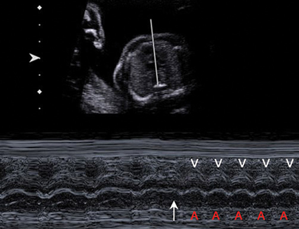
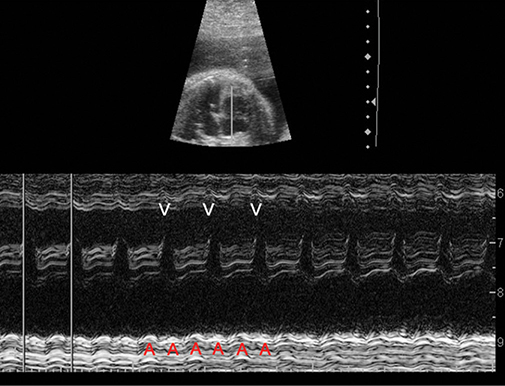
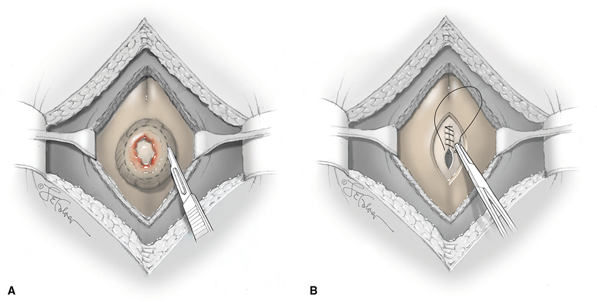
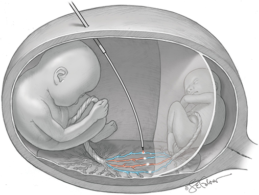
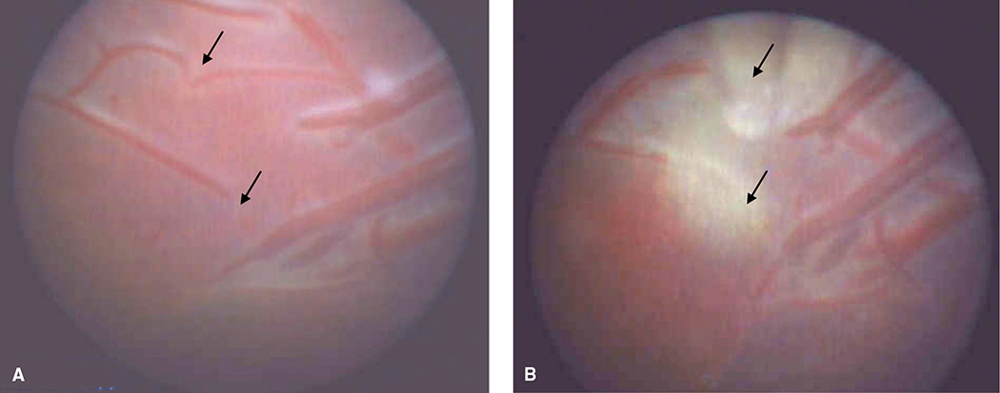
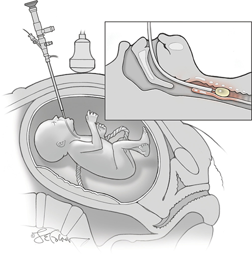
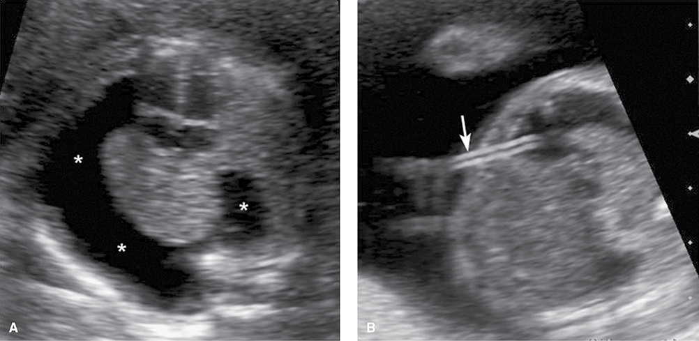
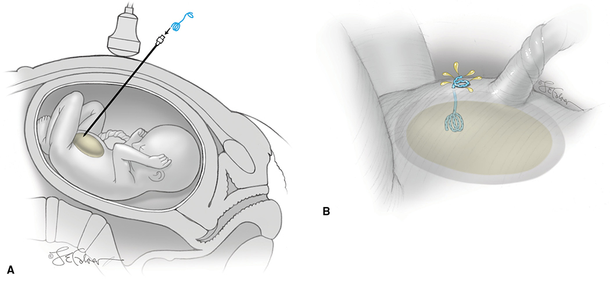
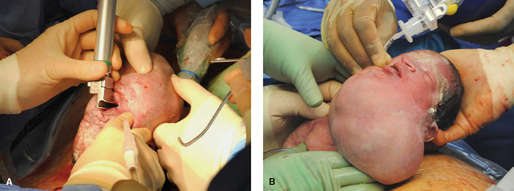

# Chapter 19: Fetal Therapy — Revision Notes

> Williams Obstetrics 26e, pp. 938–977 of the PDF. High-yield numbers are in **bold**.
> The five tables are transcribed from the PDF images (they are missing from the extracted chapter text). All 9 figures are included from the PDF.

**Big picture:** Fetal interventions have become less invasive over three decades; the North American Fetal Therapy Network has **36 centers**. **Medical therapy** works through drugs given to the mother that cross the placenta; **surgical therapy** is open, fetoscopic, percutaneous or EXIT. Fetal anemia/thrombocytopenia → Ch 18; fetal infections → Ch 67–68.

---

## 1. Medical Therapy — Fetal Arrhythmias

- Drugs given to the mother cross the placenta; transfer depends on maternal/placental metabolism.

| Category | Definition |
|---|---|
| **Tachyarrhythmia** | FHR **>180 bpm** |
| **Bradyarrhythmia** | FHR **<110 bpm** |
| **Ectopy** | Usually **premature atrial contractions** |

- **M-mode ultrasound** measures atrial and ventricular rates and their relationship → type of arrhythmia.

### Premature atrial contractions (PACs)
- **Commonest cause of an irregular rhythm with a normal rate**; **1–2%** of pregnancies. Reflect conduction-system **immaturity**; resolve later in pregnancy or in the newborn.
- May be linked to a **redundant foramen ovale flap** ("foramen ovale aneurysm").
- Usually **blocked** (arrives in the AV-node refractory period) → compensatory pause = "dropped beat".
- **Blocked atrial bigeminy**: PAC every other beat → auscultated rate **60–80 bpm**; **benign, no treatment** (labor monitoring may be hard → cesarean). M-mode separates it from **complete heart block**.
- **Up to 2%** of fetuses with PACs develop **SVT** → FHR check **every 1–2 wk** until ectopy resolves (handheld Doppler is enough at Parkland).

### Tachyarrhythmias

| | SVT | Atrial flutter | Sinus tachycardia |
|---|---|---|---|
| Onset | **Abrupt** | — | **Gradual** |
| Atrial rate | 180–300 (typically **200–240**) | **300–500** | Slightly above normal |
| AV relation | **1:1** | **Variable AV block** (ventricular rate low to ~250) | 1:1 |
| Mechanism / causes | Ectopic focus or **accessory pathway (reentry)** | — | **Maternal fever, hyperthyroidism**; rarely fetal anemia or infection |

*Figure 19-1. SVT on M-mode at 20 wk: rate jumps abruptly from 150 to 240 bpm (arrow) with one atrial (A) beat per ventricular (V) beat.*

*Figure 19-2. Atrial flutter at 32 wk: ventricular rate ~220 bpm, atrial rate ~440 bpm — 2:1 AV block.*

**Management**
- **Sustained = present ≥50% of the time**; monitor **12–24 h** at first detection, then periodically. Intermittent → no treatment, but close surveillance (may become sustained).
- **Sustained with ventricular rate >200 bpm** → impaired filling → **cardiomyopathy and hydrops** (flutter worse, from AV dyssynchrony).
- **Maternal antiarrhythmics** (often at the **upper adult dose range**) → **maternal ECG before and during**; serum levels when titrating. Continue until delivery if successful.
  - **Digoxin** — traditional first line, but **poor placental transfer with hydrops**.
  - **Flecainide or sotalol** — now first line at many centers.
  - **Second agent needed in >50%.**
- **Outcome:** conversion or rate control in **90%** (**80% with hydrops**). **SVT converts more readily than flutter.** Neonatal survival **>90%**.

### Bradyarrhythmia — congenital heart block

| | Structural heart disease | Structurally normal heart |
|---|---|---|
| Share | **~50%** | Remainder |
| Cause | **Heterotaxy (left atrial isomerism)**, endocardial cushion defect, corrected transposition | **85%**: maternal **anti-SSA/Ro or anti-SSB/La** antibodies (SLE/autoimmune disease) |
| Prognosis | **Fetal loss >80%** | Mortality **~20%**; **⅔ of survivors need permanent pacing**; cardiomyopathy risk |

- **Risk of 3rd-degree block with anti-Ro: ~2%**, rising to **~20% if a prior infant was affected**.
- Effusions, bradyarrhythmia or **endocardial fibroelastosis** → neonate may worsen after birth.
- **Dexamethasone (PRIDE, 4 mg/d):** did **not** stop 2nd→3rd-degree progression; **3rd-degree block is irreversible**; systematic review of >700 treated pregnancies: **no benefit** → the authors **do not recommend dexamethasone**.
- **Hydroxychloroquine:** ↓ recurrence in women with a prior affected child; trial showed **>50% reduction**; **<8%** of treated pregnancies had heart block. Research ongoing.
- **Terbutaline** (FHR persistently **<56 bpm**): titrate to maternal HR **95–115 bpm**; FHR ↑ **5–10 bpm**; hydrops not consistently reversed.

---

## 2. Congenital Adrenal Hyperplasia (CAH)

- **AR** enzyme deficiencies block cortisol synthesis → ↑ ACTH → ↑ androstenedione/testosterone → **virilization of female fetuses** (labioscrotal folds, urogenital sinus, even penile urethra/scrotum).
- **Commonest cause of androgen excess in 46,XX DSD.** **>90% = 21-hydroxylase deficiency** (**CYP21A2** gene).
- **Classic CAH: ~1 in 15,000** births (**1 in 300 Yupik Eskimos**):
  - **75% salt-wasting** (hyponatremia, dehydration, hypotension, collapse) → mineralo- + glucocorticoids
  - **25% simple virilizing** → glucocorticoids
- **Nonclassic**: precocious pubarche, hirsutism, infertility or none; **~1 in 200** Caucasians and Ashkenazi Jews. **Universal newborn screening.**

### Prenatal dexamethasone
- Suppresses fetal androgens → prevents/lessens virilization; **Prader score improved by 2.3 grades** (scale 1–5). Alternative: postnatal feminizing genitoplasty (**18%** complications, **12%** reoperation).
- **Dose: 20 µg/kg/d (max 1.5 mg/d) in 3 divided doses.**
- Genital development critical window **7–12 wk** → **start by 9 wk**, before fetal status is known.
- Only **1 in 8** at-risk conceptions is an affected female (AR × female) → most treated fetuses don't need it.
- **Limit exposure:** CYP21A2 testing on **CVS (10–12 wk)** or **amniocytes (>15 wk)**; **cfDNA for Y sequences** (sensitivity **≥95% at ≥7 wk**; research cfDNA for CYP21A2 as early as **5⁶⁄₇ wk**).
- ⚠️ **Controversial: Endocrine Society — only within research protocols**, which should include cfDNA fetal sexing to avoid treating males.
- Started just before 9 wk, the dose is not considered significantly teratogenic; long-term neurodevelopmental safety data are limited.

---

## 3. Congenital Cystic Adenomatoid Malformation (CCAM)

- Well-circumscribed lung mass. **Macrocystic = ≥1 cyst ≥5 mm**; microcystic = solid or smaller cysts.
- Some microcystic lesions grow rapidly at **18–26 wk** → mediastinal shift → ↓ venous return/cardiac output → **hydrops**.
- **CCAM-volume ratio (CVR)** = (length × width × height × **π/6** [≈0.52]) ÷ **head circumference**.
  - Mean CVR 0.5 at 20 wk, peaks ~1.0 at 26 wk, then falls sharply.

| CVR | Implication |
|---|---|
| **>1.6** | **Hydrops risk up to 60%** → consider steroids |
| <1.6 initially | Hydrops **<2%** |
| **>1.0** (maximal) | **75%** of newborns symptomatic |
| **≤1.0** | No newborn surgery needed |

- **Steroids if CVR >1.6 or hydrops:**
  - **Dexamethasone 6.25 mg q12h × 4 doses**, or
  - **Betamethasone 12.5 mg IM q24h × 2 doses**
  - One course → **hydrops resolves in ~80%**, **90% survive**. Two courses for persistent/worsening hydrops or ascites.
- Macrocystic CCAM → shunt a dominant cyst (Section 7).

---

## 4. Fetal Thyroid Disease

- Usually suspected from a **fetal goiter** on ultrasound → establish **hyper- vs hypothyroid** with thyroid hormones in **amnionic fluid or fetal blood** (FBS traditionally preferred; data limited).
- Goiter can compress trachea/esophagus → **hydramnios** (airway compromise rarely reported).

| | Fetal thyrotoxicosis | Fetal goitrous hypothyroidism |
|---|---|---|
| Cause | Maternal **Graves** — **IgG thyroid-stimulating antibodies** (even after maternal surgery/ablation) | **Maternal methimazole/PTU**; TPO antibodies; dyshormonogenesis; maternal iodine supplements |
| Findings | Goiter, **tachycardia**, FGR, hydramnios, **accelerated bone maturation**, heart failure, hydrops | Goiter, hydramnios, **neck hyperextension**, **delayed bone maturation** |
| Treatment | **Maternal antithyroid drug** (+ levothyroxine if she becomes hypothyroid) | **Intra-amnionic levothyroxine 150–500 µg every 1–4 wk**; stop maternal antithyroid drug |

---

## 5. Surgical Therapy — Principles

- For anomalies so likely to deteriorate that waiting until birth would risk **death or much worse morbidity**. Few specialized centers; extensive counseling; multidisciplinary.
- ⚠️ **Overriding concern = safety of mother and fetus**; achieving the fetal goal is secondary.

### Table 19-1. Guiding Principles for Fetal Surgical Procedures

| Principle |
|---|
| Accurate prenatal diagnosis for the defect is available, with staging if applicable |
| The defect appears isolated, with no evidence of other abnormality or underlying genetic syndrome that would significantly worsen survival or quality of life |
| The defect results in a high likelihood of death or irreversible organ destruction, and postnatal therapy is inadequate |
| The procedure is technically feasible, and a multidisciplinary team is in agreement regarding the treatment plan |
| Maternal risks from the procedure are well documented and considered acceptable |
| There is comprehensive parental counseling |
| It is recommended that there be an animal model for the defect and procedure |

### Table 19-2. Selected Fetal and Placental Abnormalities Amenable to In-Utero Procedures

| Approach | Procedures / conditions |
|---|---|
| **Open fetal surgery** | Congenital cystic adenomatoid malformation (CCAM); myelomeningocele; pulmonary sequestration; sacrococcygeal teratoma |
| **Fetoscopic surgery** | Amnionic band sequence: band release; congenital diaphragmatic hernia (CDH): fetal endoscopic tracheal occlusion (FETO); congenital high airway obstruction sequence (CHAOS): vocal cord laser; myelomeningocele; posterior urethral valves: cystoscopic laser; twin-twin transfusion: laser of placental anastomoses |
| **Percutaneous — cardiac catheter** | Aortic or pulmonic valvuloplasty for stenosis; atrial septoplasty for hypoplastic left heart with restrictive atrial septum |
| **Percutaneous — radiofrequency ablation** | Twin reversed arterial perfusion (TRAP) sequence; monochorionic twins with severe anomaly in one twin; chorioangioma |
| **Percutaneous — shunt therapy** | Dominant cyst in CCAM; thoracoamnionic shunt for pleural effusion; vesicoamnionic shunt for bladder outlet obstruction |
| **EXIT procedures** | CDH after FETO; CHAOS; EXIT-to-ECMO: CDH; EXIT-to-resection: fetal thoracic or mediastinal mass; micrognathia; neck or airway tumors |

*Procedures are listed alphabetically within groupings.*

---

## 6. Open Fetal Surgery

- **Hysterotomy not for delivery.** **General endotracheal anesthesia** (relaxes uterus, suppresses fetal responses).
- Hysterotomy with a **stapling device** (hemostasis, prevents chorioamnion separation); intraoperative ultrasound avoids the placental edge.
- **Warmed fluid infused continuously** (limits cord compression); fetal pulse oximetry and venous access.
- After: antibiotics **24 h**; tocolysis with **IV magnesium 24 h + oral indomethacin 48 h**.
- ⚠️ **Cesarean needed for this and all future deliveries.**

**Risks**
- PPROM **15%**, mean delivery **35 wk** (26-case series); maternal sepsis; fetal death (especially with hydrops).
- **Subsequent pregnancies: uterine rupture 14%, dehiscence 14%.**

### Myelomeningocele repair
- **First nonlethal defect** offered in-utero repair. Rationale: damage is thought to come from **abnormal neurulation followed by exposure of neural tissue to amnionic fluid** throughout pregnancy. Postnatal problems: paralysis, bladder/bowel dysfunction, developmental delay, **Arnold-Chiari II** brainstem dysfunction.

*Figure 19-3. Open fetal myelomeningocele repair: placode dissected free (A), then dura reflected over it and closed, followed by skin (B).*

**MOMS trial (Adzick 2011; 183 randomized) — entry criteria**
1. **Singleton at 19.0–25.9 wk**
2. Upper lesion boundary **T1 to S1** on MRI
3. **Hindbrain herniation**
4. **Normal karyotype**, no unrelated anomaly

**Excluded:** risk of preterm birth or abruption, contraindication to fetal surgery, **BMI >35** (later work shows similar outcomes up to **BMI 40**).

### Table 19-3. Benefits and Risks of Fetal Myelomeningocele Surgery versus Postnatal Repair

| | Fetal Surgery (n = 78) | Postnatal Surgery (n = 80) | p value |
|---|---|---|---|
| **Benefits (Primary Outcomes)** | | | |
| Perinatal death or shunt by 12 monthsᵃ | **68%** | **98%** | <0.001 |
| Shunt placement by 12 months | **40%** | **82%** | <0.001 |
| Composite developmental scoreᵃ,ᵇ | 149 ± 58 | 123 ± 57 | 0.007 |
| Hindbrain herniation (any) | 64% | 96% | <0.001 |
| Brainstem kinking (any) | 20% | 48% | <0.001 |
| Independent walking (30 months) | **42%** | **21%** | 0.01 |
| **Risks** | | | |
| Maternal pulmonary edema | 6% | 0 | 0.03 |
| Placental abruption | 6% | 0 | 0.03 |
| Maternal transfusion at delivery | 9% | 1% | 0.03 |
| Oligohydramnios | 21% | 4% | 0.001 |
| Gestational age at delivery (wk) | **34 ± 3** | 37 ± 1 | <0.001 |
| Preterm birth <37 weeks | **79%** | 15% | <0.001 |
| Preterm birth <35 weeks | 46% | 5% | |
| Preterm birth <30 weeks | 13% | 0 | |

*ᵃEach primary outcome had two components. The perinatal death components and the Bayley Mental Development Index at 30 months did not differ between groups. ᵇScore derived from the Bayley Mental Development Index and the difference between functional and anatomical level of the lesion (30 months).*

- **Take-home:** fetal surgery → **2× independent walking**, less hindbrain herniation, **½ the shunt rate** by 1 yr, better composite score.
- **But:** most still can't walk independently (**~30% can't walk at all**); **no difference in death or Bayley MDI**; **abruption, pulmonary edema**; **nearly half deliver <34 wk** → ↑ RDS.
- ACOG: **offer fetal surgery in nondirective counseling to all who meet MOMS criteria.**
- **6–10-yr follow-up:** sustained ambulation benefit (**~30%** walk independently); **~50%** shunted; cognition similar.

### Fetoscopic myelomeningocele repair
- Percutaneous (partial **CO₂ insufflation**) vs open (systematic review, 84 vs 456):

| Outcome | Fetoscopic | Open |
|---|---|---|
| Myometrial dehiscence/attenuation | **1%** | **26%** |
| Delivery <34 wk | **80%** | 45% |
| Perinatal mortality | **14%** | 5% |

- **Laparotomy-assisted (exteriorized uterus) fetoscopy:** shunt by 1 yr ~**40%** (like MOMS); one series median delivery **38 wk** and **50% vaginal births**. Still investigational.

### Thoracic masses
- Most are small with a good prognosis; large CCAM → steroids first; dominant cyst or effusion → drainage/shunt.
- **Open lobectomy** only **<32 wk** with a large solid/microcystic mass and **developing hydrops**: survival **~60%**.

### Sacrococcygeal teratoma (SCT)
- Prenatally diagnosed SCT: **perinatal mortality 20–40%**.
- **Poor prognosis:** **solid component >50%**; **tumor volume : fetal weight >12% before 24 wk**.
- Hydramnios common; **high-output failure** (vascularity or tumor bleeding → anemia) → **hydrops → loss ~100%**; may cause **mirror syndrome** (maternal preeclampsia + fetal hydrops).
- Open surgery only if tumor is **entirely external** with high output and early hydrops in the **2nd trimester**; after **27 wk**, rapid growth → **early delivery and postnatal resection**.

---

## 7. Fetoscopic Surgery

- Fiberoptic endoscopes **1–2 mm**; instruments (e.g., laser) through a **3–5-mm cannula**. Sometimes via laparotomy for access/positioning.

### Twin-twin transfusion syndrome (TTTS) — laser photocoagulation
- **Preferred treatment for severe TTTS** (Ch 48): **monochorionic-diamnionic** twins, **Quintero stage II–IV**, at **16–26 wk**.
- Fetoscope in the **recipient's sac** → image the **vascular equator** → **selective** coagulation of crossing anastomoses (**600-µm diode** or **400-µm Nd:YAG** laser). Usually under **epidural**.
- End: **amnioreduction to deepest pocket <5 cm** + intra-amnionic antibiotics.
- **Residual anastomoses in up to ⅓** → recurrent TTTS or **TAPS** (twin anemia-polycythemia sequence: large Hb difference).
- **Solomon technique:** after selective ablation, coagulate the **entire equator edge to edge** → fewer residual anastomoses.

*Figure 19-4. Selective laser photocoagulation: fetoscope in the recipient sac over the vascular equator between the two cord insertions.*

*Figure 19-5. Fetoscopic view: anastomoses before (A) and blanched yellow-white ablation sites after (B) laser.*

**Outcomes**

| Outcome | Rate |
|---|---|
| Perinatal mortality **without treatment** (severe TTTS) | **70–100%** |
| Perinatal mortality **after laser** | **30–50%** |
| Long-term neurological handicap | 5–20% |
| Double-twin survival / ≥1 survivor (one series) | ~70% / **>90%** |
| Ischemic brain lesions (cPVL, grade III–IV IVH) | 2% |
| Cerebral palsy in survivors | 5% |

**Complications**

| Complication | Rate |
|---|---|
| **PPROM** | **up to 25%** |
| Placental abruption | 8% |
| Vascular laceration | 3% |
| Amnionic band syndrome (membrane laceration) | 3% |
| **TAPS** | **16% selective** vs **3% Solomon** |

- **Most deliver before 34 wk.**

### Congenital diaphragmatic hernia (CDH) — FETO
- Open repositioning of the liver kinked the umbilical vein → demise (abandoned).
- **Rationale:** lungs make fluid; airway obstruction → lung hyperplasia → **"plug the lung until it grows."** External clip → now an endoscopic **detachable balloon** inflated with saline.
- **Fetoscopic tracheal occlusion (FETO):** **3-mm sheath**, fetoscope as small as 1 mm; performed at **26–30 wk**; balloon removed **after 6 wk or ~34 wk** (fetoscopy or ultrasound-guided puncture). Removal restores **type II pneumocytes**. **Vaginal delivery not contraindicated.**
- For **isolated CDH with poor prognosis** (degree of **liver herniation**).
- 2003 RCT (LHR <1.4 + liver up): **no benefit** — both arms **75%** survival → LHR threshold lowered and GA-adjusted. Meta-analysis (>200): **13-fold** survival improvement; benefit also in **right-sided CDH**.
- ⚠️ In the US, **only within research protocols**.

*Figure 19-6. FETO: endoscope passed through the fetal mouth down the trachea; the balloon is inflated to occlude it.*

**Lung-to-head ratio (LHR)** — isolated left CDH diagnosed **<25 wk**
- = **right lung area ÷ head circumference**.
- **LHR >1.35 → 100% survival**; **<0.6 → no survivors**; **0.6–1.35** (~¾ of cases) → ~60% survival, hard to predict.
- **Observed-to-expected (O/E) LHR** corrects for gestational age. Lung area by **tracing** (most reproducible), longest diameter × perpendicular, or AP × perpendicular at the midclavicular line; interrater agreement lower than hoped.

---

## 8. Percutaneous Procedures

- Ultrasound-guided through maternal abdomen, uterus and membranes: **shunts, angioplasty catheters, RFA needles, bipolar cautery**.
- Risks: preterm labor, PPROM, abruption, maternal infection, fetal injury or loss.

### Thoracoamnionic shunts
- Drain pleural fluid into the amnionic cavity; large effusion → **pulmonary hypoplasia** or mediastinal shift → **hydrops**.
- **Commonest primary effusion = chylothorax** (lymphatic obstruction): pleural fluid **>80% lymphocytes**, no infection. Secondary causes: viral infection, aneuploidy (**~5%**), malformation such as sequestration (associated anomalies **~10%**).
- **First drain with a 22-gauge needle** (send for CMA, infection studies, cell count) → if it **recurs**, place a **double-pigtail shunt**.
  - **Right** effusion → **lower third of the chest** (max lung expansion).
  - **Left** effusion → **upper axillary line** (lets the heart return to midline).
- **Survival ~70% overall, ~50% if hydropic.**
- **Weekly surveillance** (displacement common). ⚠️ **Clamp the shunt immediately at delivery** → prevents neonatal **pneumothorax**.
- **Macrocystic CCAM** with a dominant cyst: shunt → survival **90%** without hydrops, **≥75%** with hydrops.

*Figure 19-7. Chylothorax (95% lymphocytes) at 18 wk with ascites (A); double-pigtail thoracoamnionic shunt (arrow) (B) — effusion and ascites resolved.*

### Vesicoamnionic (urinary) shunts
- For **lower urinary tract obstruction (LUTO)** with **severely reduced amnionic fluid**. Mostly **male**; commonest cause **posterior urethral valves**; also anterior valves, urethral atresia/stenosis, **prune belly (Eagle-Barrett)**. Females: cloacal anomalies, **megacystis-microcolon**.
- Ultrasound: dilated bladder + proximal urethra (**"keyhole" sign**), thick bladder wall. Oligohydramnios before midpregnancy → **pulmonary hypoplasia**.
- Evaluate: associated anomalies (**~40%**), aneuploidy (**5–8%**; CMA can be done on fetal urine).
- **Offered only for male fetuses** without other severe anomalies (female anomalies are even more severe).
- **Serial vesicocentesis ~every 48 h** to assess urine. Normal fetal urine is **hypotonic** (tubular Na/Cl reabsorption); **isotonic urine = tubular damage**.

### Table 19-4. Fetal Urinary Analyte Values with Bladder Outlet Obstruction

| Analyte | Good Prognosis | Poor Prognosis |
|---|---|---|
| Sodium | <90 mmol/L | >100 mmol/L |
| Chloride | <80 mmol/L | >90 mmol/L |
| Calcium | <7 mg/dL | >8 mg/dL |
| Osmolality | <180 mmol/L | >200 mmol/L |
| β₂-Microglobulin | <6 mg/L | >10 mg/L |
| Total protein | <20 mg/dL | >40 mg/dL |

*Good or poor prognosis is based on values from serial vesicocentesis performed between 18 and 22 weeks, using the last specimen obtained.*

> **Memory hook:** "**90-80-7-180-6-20**" = the good-prognosis ceilings for Na, Cl, Ca, Osm, β₂M, protein — below these, the kidneys are still concentrating/reabsorbing.

- **Technique:** amnioinfusion of warmed lactated Ringer (visualization) → trocar into bladder → **double-pigtail** shunt placed **as caudal as possible** (avoids dislodgement once the bladder decompresses).
- Shunting may prevent pulmonary hypoplasia but **does not reliably preserve renal function**, especially with **renal cortical cysts**.

*Figure 19-8. Vesicoamnionic shunt: trocar into the distended bladder after amnioinfusion; double-pigtail drains bladder into the amnionic cavity.*

| Complication / outcome | Rate |
|---|---|
| **Shunt displacement** | **up to 40%** |
| Urinary ascites | ~20% |
| Gastroschisis (bowel through the defect) | up to 10% |
| Neonatal survival | 50–90% (preterm birth common) |
| Dialysis or renal transplant in survivors | **~⅓** |
| Respiratory problems | ~½ |

- RCT (31 cases): shunt ↑ survival, but only **2 children had normal renal function at 2 yr**. Meta-analysis: **perinatal survival benefit, no renal or 2-yr survival benefit**.

### Radiofrequency ablation (RFA)
- High-frequency current coagulates tissue. **Treatment of choice for TRAP sequence (acardiac twin)**; also selective reduction in other monochorionic complications.
- Untreated severe TRAP: **pump-twin mortality >50%**.
- **17–19-gauge needle** into the **cord base inside the acardiac twin's abdomen**; **2-cm** coagulation; confirm absent flow on color Doppler. Usually at **~20 wk**.
- **Pump-twin survival ~85%** (monoamnionic only **67%**). Main complications: **PPROM and preterm birth**.
- Offered when the acardius is large (median **90%** of pump-twin size in one series). **Acardius <50% of pump-twin weight → expectant management** with surveillance.

### Intracardiac catheter procedures
- Goal: stop in-utero progression of outflow obstruction and preserve ventricular growth/function.

| Procedure | Lesion | Key numbers |
|---|---|---|
| **Aortic valvuloplasty** (**75%** of fetal cardiac interventions) | **Critical aortic stenosis** with normal-size or dilated LV — to prevent **HLHS** and allow **biventricular repair** | 18-gauge cannula into LV; 2.5–4.5-mm balloon. Bradycardia needing treatment **⅓**, hemopericardium needing drainage **~20%**. 108 fetuses: **75%** alive at delivery, biventricular repair **32%**; Boston 2009–15: **~90%** live birth, **>50%** biventricular |
| **Atrial septoplasty** (± stent) | **HLHS with intact/restrictive atrial septum** (postnatal mortality **~80%**) | **35%** survived to discharge; better 1-yr survival if successful |
| **Pulmonary valvuloplasty** | **Pulmonary atresia with intact ventricular septum** — to prevent hypoplastic right heart | Technical success **70%**; 2× biventricular repair if successful; survival to discharge ~75% (same as no intervention) |

- Most biventricular survivors still need postnatal cardiac procedures; neurodevelopmental risk similar to postnatal repair.

---

## 9. Ex-Utero Intrapartum Treatment (EXIT)

- Fetus **partly delivered while still perfused by the placenta**, so an airway (or other treatment) can be secured before cord clamping. First used for **oropharyngeal/neck tumors**.
- **Multidisciplinary team:** obstetrician, MFM, pediatric surgeon(s), pediatric ENT, pediatric cardiologist, **maternal and fetal anesthesiologists**, neonatologists, specialized nurses.

### Table 19-5. Components of the Ex-Utero Intrapartum Treatment (EXIT) Procedure

| Component |
|---|
| Comprehensive preoperative evaluation: specialized fetal sonography, fetal echocardiography, magnetic resonance imaging, fetal karyotype if possible |
| **Uterine relaxation with deep general anesthesia and tocolysis** |
| Intraoperative sonography to confirm placental margin and fetal position and to visualize vessels at planned hysterotomy site |
| Placement of stay-sutures followed by use of uterine stapling device to decrease hysterotomy-site bleeding |
| Maintenance of uterine volume during the procedure via continuous amnioinfusion of warmed physiological solution to help prevent placental separation |
| Delivery of the fetal head, neck, and upper torso to permit access as needed |
| Fetal injection of intramuscular vecuronium, fentanyl, and atropine |
| Fetal peripheral intravenous access, pulse oximeter, and cardiac ultrasound |
| Following procedure, umbilical lines placed prior to cord clamping |
| Uterotonic agents administered as needed |

### Indications
- **Large cervical venolymphatic malformation** (preferred approach): EXIT if the mass **compresses, deviates or obstructs the airway** or **involves the floor of the mouth** — only **~10%** of 112 cases met these criteria.
- **Severe micrognathia**: jaw **<5th percentile** + indirect signs of obstruction (**hydramnios, absent stomach bubble, glossoptosis**).
- **CHAOS** (congenital high airway obstruction sequence).
- Case selection is mostly by **fetal MRI**.

*Figure 19-9. EXIT for a neck venolymphatic malformation: airway secured over 20 min on placental support (A), then controlled intubation before delivery (B).*

### EXIT as a bridge
- **EXIT-to-resection** of thoracic masses (CVR >1.6 or hydrops with mediastinal compression): **9 of 16** survived vs **no survivors** with urgent postnatal surgery alone; another series **20 of 22** survived.
- **EXIT-to-ECMO** for severe CDH: **no clear survival benefit**.

### Risks (counsel)
- **Hemorrhage** (abruption, **uterine atony** — relaxed uterus), **cesarean in all future pregnancies**, ↑ later **uterine rupture/dehiscence**, possible **hysterectomy**, fetal death or permanent disability.
- Versus cesarean: **more blood loss, more wound complications, longer operating time**.

---

## Quick-Recall: Condition → Fetal Therapy

| Condition | Therapy | Key threshold / result |
|---|---|---|
| PACs / blocked bigeminy | None; FHR check q1–2 wk | SVT develops in ≤2% |
| Sustained SVT / flutter | **Maternal digoxin, flecainide, sotalol** | Treat if sustained (≥50% of time), rate >200; 90% controlled |
| Anti-Ro heart block | Dexamethasone **not** recommended; **hydroxychloroquine** promising | Risk 2% (20% after affected child) |
| CAH (21-OH deficiency) | Maternal **dexamethasone 20 µg/kg/d** by **9 wk** (research only) | 1 in 8 at-risk fetuses benefit; cfDNA sexing |
| Microcystic CCAM | **Betamethasone/dexamethasone** | CVR **>1.6** → hydrops risk 60%; steroids resolve 80% |
| Macrocystic CCAM / pleural effusion | **Thoracoamnionic shunt** | Survival 70% (50% hydropic) |
| Fetal goiter — hyper | Maternal antithyroid drug | Graves TSI |
| Fetal goiter — hypo | **Intra-amnionic levothyroxine** | 150–500 µg q1–4 wk |
| Myelomeningocele | **Open (MOMS) or fetoscopic repair** | 19.0–25.9 wk, T1–S1, hindbrain herniation, BMI ≤35 (≤40) |
| Severe TTTS (stage II–IV) | **Fetoscopic laser** (Solomon) | 16–26 wk; mortality 70–100% → 30–50% |
| Severe CDH | **FETO** (research in US) | 26–30 wk in, out at 34 wk; LHR <0.6 no survivors |
| LUTO (male) | **Vesicoamnionic shunt** | Na <90, Cl <80, Osm <180 = good prognosis |
| TRAP sequence | **RFA** at ~20 wk | Pump-twin survival 85%; expectant if acardius <50% |
| Critical aortic stenosis | **Aortic valvuloplasty** | Prevent HLHS |
| SCT with hydrops | Open resection (2nd tri, external) or early delivery | Solid >50%, TV/FW >12% = poor |
| Airway-obstructing neck mass, micrognathia, CHAOS | **EXIT** | Jaw <5th percentile + obstruction signs |

## Key Numbers to Memorize
- Tachy **>180**, brady **<110 bpm**; SVT typically **200–240** (1:1); flutter atrial **300–500**
- PACs **1–2%** of pregnancies; SVT in **≤2%** of them; bigeminy rate **60–80 bpm**
- Antiarrhythmics: second agent in **>50%**; control **90%** (80% hydropic); survival **>90%**
- Heart block: **50%** structural (loss >80%); anti-Ro 3rd-degree risk **2% → 20%**; mortality **~20%**, pacing **⅔**
- CAH: classic **1:15,000**; dexamethasone **20 µg/kg/d (≤1.5 mg)** by **9 wk**; window **7–12 wk**; cfDNA Y ≥95% at 7 wk
- CCAM: CVR **>1.6** → hydrops 60%; **≤1.0** → no newborn surgery; dexamethasone **6.25 mg q12h ×4** / betamethasone **12.5 mg q24h ×2**
- Open surgery: later uterine rupture **14%**, dehiscence **14%**; Mg 24 h + indomethacin 48 h
- MOMS: walking **42 vs 21%**; shunt **40 vs 82%**; delivery **34 vs 37 wk**; <37 wk **79%**
- TTTS laser **16–26 wk**; residual anastomoses **⅓**; PPROM **25%**; TAPS **16% vs 3%** (Solomon)
- LHR **>1.35** all survive, **<0.6** none; FETO at **26–30 wk**, removal at **34 wk**
- Chylothorax: **>80% lymphocytes**; LUTO anomalies **40%**, aneuploidy **5–8%**; shunt displacement **40%**; dialysis/transplant **⅓**
- TRAP untreated mortality **>50%**; RFA pump-twin survival **85%** (67% monoamnionic)
- SCT perinatal mortality **20–40%**
