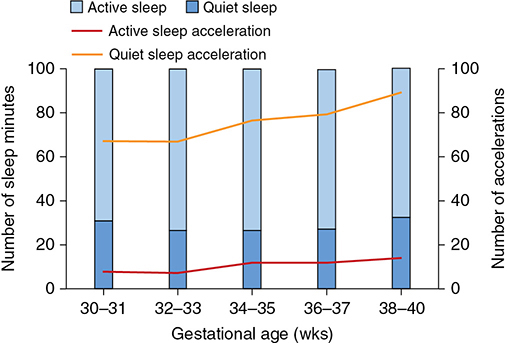
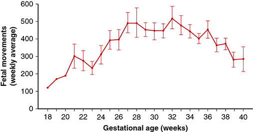
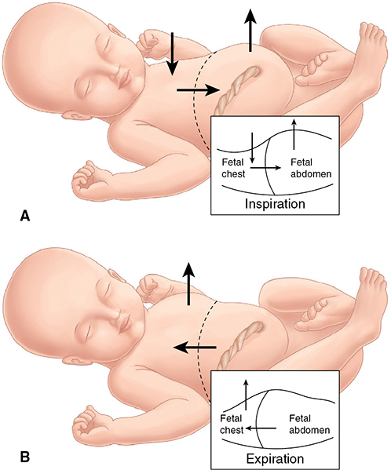
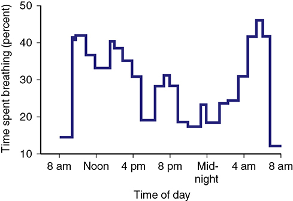
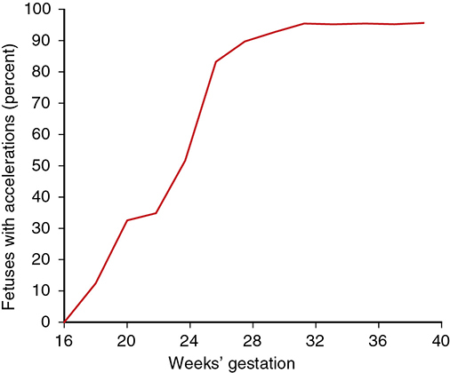
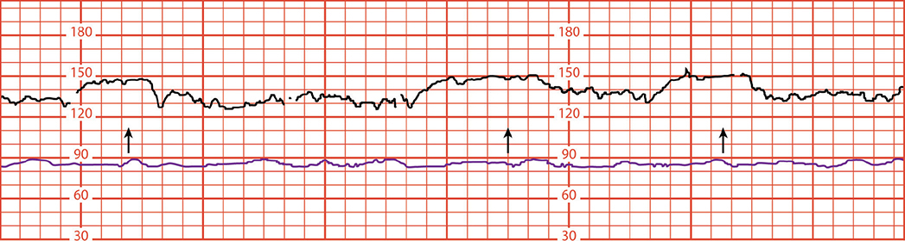
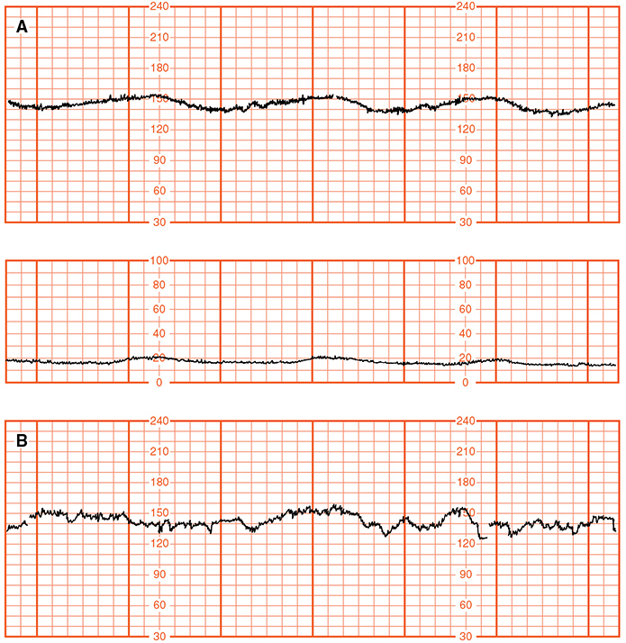
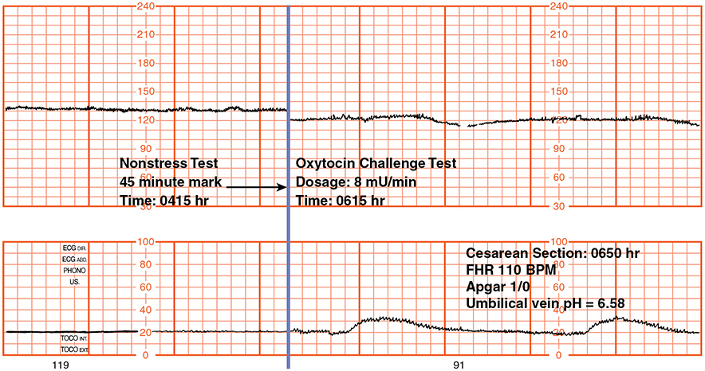
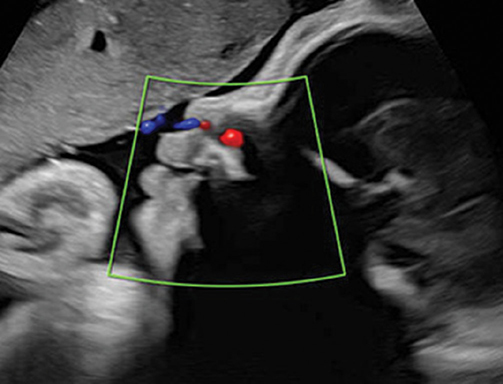
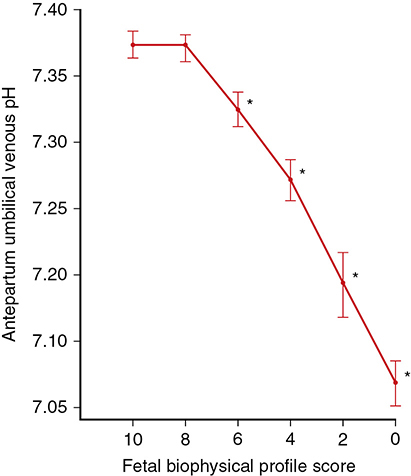

# Chapter 20: Antepartum Fetal Assessment — Revision Notes

> Williams Obstetrics 26e, pp. 978–1012 of the PDF. High-yield numbers are in **bold**.
> The five tables are transcribed from the PDF images (they are missing from the extracted chapter text). All 10 figures are included from the PDF.

**Big picture:** Antepartum surveillance uses fetal **heart rate, movement, breathing and amnionic fluid** to prevent fetal death without unnecessary intervention. A normal test is **highly reassuring**: **negative predictive value ≥99.8%**, but **positive predictive value only 10–40%**. Benefit rests on circumstantial evidence — no definitive RCTs (ethical reasons).

---

## 1. Fetal Movements

### Fetal behavioral states
- Fetal activity starts as early as **7 wk**. **20–30 wk**: movements organize into rest–activity cycles. **~36 wk**: true behavioral states.
- **Nijhuis states:**

| State | Description | Neonatal equivalent |
|---|---|---|
| **1F** | Quiescent; **narrow FHR oscillation** | **Quiet sleep** |
| **2F** | Frequent gross body movements, continuous eye movements, **wider FHR oscillation** | **Active (REM) sleep** |
| 3F | Continuous eye movements, no body movements, no accelerations — rare, disputed | — |
| **4F** | Vigorous body movements, continuous eye movements, **FHR accelerations** | **Awake** |

- From **28–30 wk** most time is in **1F and 2F**; at **38 wk, 75%** of time.
- Bladder volume ↑ in 1F and ↓ in 2F (less urine production — reduced renal flow in active sleep).

*Figure 20-1. Across the 3rd trimester fetuses spend more time in active sleep and have more accelerations per hour.*

### Determinants of fetal activity
- **Sleep–wake cycles** (independent of the mother): full cycle **~60 min** (quiet **23 min**, active **40 min**).
- ⚠️ **Longest normal inactivity: 75 min** (24-h scans of near-term fetuses).
- **↓ Amnionic fluid** → ↓ movement (restricted space).
- **↓ Movement:** **maternal smoking**; **methadone, buprenorphine**; **betamethasone for 24–72 h** (diurnal pattern lost; dexamethasone effect less clear).
- **Acetaminophen: no effect.** **Glucose load ↑ activity.**

### Maternal perception
- Movements: weak, strong, rolling. Weak ones fall and vigorous ones rise as pregnancy advances, then subside at term (less fluid/space).
- **Weekly counts (12-h daily recordings):** ~**200 at 20 wk** → peak **575 at 32 wk** → **282 at 40 wk**. **>90%** of women feel stronger movements in the evening/night.
- Women perceive only **16–45%** of sonographically seen movements. **BMI does not reduce perception**; effect of nulliparity/anterior placenta unclear.

*Figure 20-2. Weekly fetal movements rise to a peak at ~32 wk and decline toward term.*

*The text gives a peak of 575 movements/wk at 32 wk; the plotted mean at 32 wk is nearer 520.*

### Clinical application
- Optimal protocol undefined. Quantitative (e.g., **10 movements in 2 h**) vs subjective impression.
- **Grant (1989), >68,000 women** (28–32 wk): formal **count-to-10** (mean **2.7 h/d**) vs informal questioning → **same antepartum death rates**; most fetuses were already dead when mothers presented → **informal impression is as valid as formal counting**.
- **Decreased fetal movement in 6–7%** of pregnancies, **without ↑ stillbirth**; a 400,000-pregnancy education + management package **did not reduce stillbirth**.
- May help detect **FGR**; counting ↓ **1-min Apgar ≤3 (0.4 vs 2.3%)**.
- **Still: reduced movement warrants evaluation.** Low risk → fetal heart tones + adequate fluid may suffice; later gestation → **NST + amnionic fluid volume** (Parkland practice).
- **A single episode of excessive/vigorous movement** has been linked to later stillbirth — more research needed before acting on it.

---

## 2. Fetal Breathing

- **Discontinuous** and **paradoxical**: on inspiration the chest wall **collapses** and the abdomen protrudes (opposite of newborn/adult). Fluid exchange appears **essential for lung development**.
- Two types (Dawes): **gasps/sighs 1–4/min**, and **irregular bursts up to 240/min** (with REM).
- Respiratory rate ↓ while volume ↑ at **33–36 wk**, coinciding with lung maturation.

*Figure 20-3. Paradoxical fetal breathing: chest collapses and abdomen protrudes on inspiration (A); chest expands on expiration (B).*

- Affected by hypoxia and also: **maternal hypoglycemia**, sound, **smoking**, amniocentesis, **impending preterm labor**, gestational age, FHR, and **labor (breathing normally stops)**.
- **Diurnal:** less at night (minimum **20:00–24:00**), ↑ after meals, ↑ **04:00–07:00**.
- ⚠️ Normal fetuses can have **no breathing for up to 122 min** → long observation needed. Not useful alone; part of the **BPP**.

*Figure 20-4. Time spent breathing at 38–39 wk: rises after breakfast, lowest 20:00–24:00, peaks 04:00–07:00.*

---

## 3. Contraction Stress Test (CST)

- **Principle:** contractions compress myometrial vessels → ↓ intervillous flow. With **uteroplacental insufficiency** → **late decelerations** (start at contraction onset or after its acme). **Variable decelerations** suggest cord compression → often **oligohydramnios**.
- Originally the **oxytocin challenge test** (Ray, 1972). **Positive (abnormal) = uniform repetitive late decelerations**; negative = reassuring.
- CST = **test of uteroplacental function**.

**Technique**
- No stimulation needed if **≥3 spontaneous contractions ≥40 s in 10 min**.
- **Oxytocin** (Parkland): **20 U in 1 L** Ringer's, start **6 mU/min**, ↑ **6 mU/min every 40 min** to reach the pattern.
- **Nipple stimulation:** rub one nipple through clothing **2 min** or until a contraction → aim **3 per 10 min**; repeat after a **5-min rest**; then oxytocin if needed. Faster and cheaper than oxytocin; hyperstimulation reported by some.
- ⚠️ Takes **~90 min** on average. **Relative contraindications = contraindications to vaginal delivery.**

### Table 20-1. Criteria for Interpretation of the Contraction Stress Test

| Result | Criteria |
|---|---|
| **Negative** | No late or significant variable decelerations |
| **Positive** | **Late decelerations following ≥50% of contractions** (even if contraction frequency is fewer than three in 10 minutes) |
| Equivocal-suspicious | Intermittent late decelerations or significant variable decelerations |
| Equivocal-hyperstimulatory | FHR decelerations that occur with contractions more frequent than every 2 minutes or lasting longer than 90 seconds |
| Unsatisfactory | Fewer than three contractions in 10 minutes or an uninterpretable tracing |

---

## 4. Nonstress Test (NST)

- Based on **FHR acceleration with fetal movement** in a fetus that is **not acidemic** or neurologically depressed. **Test of fetal condition** (vs CST = uteroplacental function).
- **Most widely used primary test**; easier than CST; part of the BPP. Accelerations diminish as hypoxia develops.

### Accelerations (NICHD definitions)

| Gestational age | Acceleration |
|---|---|
| **≥32 wk** | **≥15 bpm above baseline for ≥15 s** (and <2 min) |
| **<32 wk** | **≥10 bpm for ≥10 s** |

- Percentage of movements with accelerations and their amplitude **rise with gestational age**. At **25–28 wk**, only **70%** reach 15 bpm but **90%** reach 10 bpm. RCT: 10×10 vs 15×15 criteria before 32 wk → same outcomes.

*Figure 20-5. Fetuses with ≥1 15-bpm/15-s acceleration with movement: rises steeply from 24 wk to ~95% by 30–32 wk.*

### Reactive (normal) NST
- **≥2 accelerations within 20 min** of starting (with or without felt movement).
- **Run ≥40 min before calling it nonreactive** (sleep cycles). One acceleration may be as reliable as two.
- More often reactive, and faster, in the **evening**.
- **Vibroacoustic stimulation:** 1–2-s stimulus on the abdomen, repeatable **up to 3 times for up to 3 s** → shorter tests, fewer nonreactive results (one case of provoked tachyarrhythmia with known PACs).

*Figure 20-6. Reactive NST: at least two accelerations (arrows) of >15 bpm lasting >15 s.*

### Nonreactive (abnormal) NST
- Absence of accelerations **doesn't always mean compromise** — **false-positive rates ≥90%** reported; sleep is common.
- Healthy fetuses may not move for up to **75 min** → prolonged monitoring if nonreactive at **40 min**: becomes reactive within **80 min**, or stays nonreactive for **120 min** = very ill fetus.
- A nonreactive NST can **revert** when the fetal condition improves (e.g., after correcting maternal **DKA**), and a reactive one can become abnormal.

*Figure 20-7. Maternal DKA at 28 wk: no accelerations, reduced variability and late decelerations (A) that normalize after acidemia is corrected (B).*

**Ominous patterns**
- **Nonreactive ≥90 min → >90%** have significant perinatal pathology.
- **Terminal cardiotocogram (Visser):** (1) **baseline variability <5 bpm**, (2) **absent accelerations**, (3) **late decelerations with spontaneous contractions**.
- Parkland: **no accelerations over 80 min** (27 fetuses) → consistently uteroplacental pathology:

| Finding | Frequency |
|---|---|
| **Placental infarction** | **93%** |
| Oligohydramnios | 80% |
| Fetal-growth restriction | 75% |
| Fetal acidemia | 40% |
| Meconium | 30% |

*Figure 20-8. Nonreactive NST followed by a CST with mild late decelerations; at cesarean the fetus (umbilical vein pH 6.58) could not be resuscitated.*

### Interval between tests
- Originally (arbitrarily) **7 days**; varies by indication.
- **Weekly** for stable maternal disease (**pregestational diabetes, chronic hypertension, lupus**); **daily** by some for **preeclampsia remote from term**; individualized for fetal conditions (e.g., FGR).

### Decelerations during NST
- Common with movement (**½–⅔** of tracings).
- **Nonrepetitive, brief (<30 s) variables → not compromise, no intervention needed.**
- **Repetitive variables (≥3 in 20 min)** → ↑ cesarean for fetal distress; decelerations **≥1 min** → even worse prognosis.
- **Variables + oligohydramnios → 75% cesarean rate**; distress also occurs with normal fluid.

### False-reactive NST
- Fetal death within 7 days of a reactive NST: most common indication **postterm pregnancy**; mean interval **4 days** (1–7).
- Commonest autopsy finding **meconium aspiration**, often with a **cord abnormality** → acute asphyxia with gasping. **NST can't exclude acute asphyxia → assess amnionic fluid volume.**
- Other causes: **intrauterine infection, abnormal cord position, malformations, abruption**.

---

## 5. Biophysical Profile (BPP)

- **Five variables (Manning, 1980):** NST, breathing, movement, tone, amnionic fluid. Each **2 (normal) or 0**; maximum **10**.
- Allow **30 min** before scoring breathing/movement as 0.
- Scores are higher in the **late evening**; **narcotics and sedatives lower** the score.

### Table 20-2. Components and Scores for the Biophysical Profile

| Component | Score 2 | Score 0 |
|---|---|---|
| Nonstress testᵃ | **≥2 accelerations within 20–40 min** | 0 or 1 acceleration within 20–40 min |
| Fetal breathing | **≥1 episode of rhythmic breathing lasting ≥30 sec** | <30 sec of breathing |
| Fetal movement | **≥3 discrete body or limb movements** | <3 discrete movements |
| Fetal tone | **≥1 episode of extremity extension and subsequent return to flexion** | 0 extension/flexion events |
| Amnionic fluid volumeᵇ | A pocket of amnionic fluid that measures **at least 2 cm in two planes perpendicular to each other (2 × 2 cm pocket)** | Deepest single vertical pocket ≤2 cm |

*ᵃMay be omitted if all four sonographic components are normal. ᵇFurther evaluation warranted, regardless of biophysical composite score, if deepest vertical amnionic fluid pocket ≤2 cm.*

> **Memory hook:** "**2-3-1-30**" — **2** accelerations, **3** movements, **1** flexion–extension, **30** s of breathing (plus a 2 × 2 cm pocket).

*Figure 20-9. Color Doppler shows amnionic fluid flowing through the fetal nares with breathing.*

### Table 20-3. Interpretation of Biophysical Profile Score

| Biophysical Profile Score | Interpretation | Recommended Management |
|---|---|---|
| **10** | Normal, nonasphyxiated fetus | No fetal indication for intervention; repeat test weekly |
| **8/10 (Normal AFV)**, 8/8 (NST not done) | Normal, nonasphyxiated fetus | No fetal indication for intervention; repeat test weekly |
| **8/10 (Decreased AFV)** | Chronic fetal asphyxia suspected | If ≥36 weeks, deliver. If <36 weeks, monitor per institution's protocol |
| **6 (Normal AFV)** | Equivocal | If ≥37 weeks, deliver. If <37 weeks and normal fluid, **repeat test in 24 hours**. If repeat test >6, monitor per institution's protocol |
| **6 (Decreased AFV)** | Possible fetal asphyxia | If 36–37 weeks, deliver. If <36 weeks, monitor per institution's protocol |
| **4** | Probable fetal asphyxia | If **≥32 weeks, deliver**. If <32 weeks, individualize management based on maternal and fetal conditions |
| **0 or 2** | Almost certain fetal asphyxia | **Deliver** |

*AFV = amnionic fluid volume; NST = nonstress test.*

- **Manning (>19,000 pregnancies):** **>97%** normal; **false-normal rate ~1 per 1000** (antepartum death of a normal fetus).
- Deaths after a normal BPP: **fetomaternal hemorrhage, cord accident, abruption**.
- **BPP vs umbilical venous pH (493 cordocenteses):** **score 0 → almost always acidemic**; **8 or 10 → normal pH**; **6 = poor predictor**; a **fall from 2–4 to 0** predicts better. Overall **poor sensitivity** for cord pH.
- FGR fetuses **<1000 g** with daily BPPs: despite scores of 8 (27) or 6 (13), **6 died and 21 were acidemic**.

*Figure 20-10. Mean umbilical venous pH falls as the BPP score falls (~7.37 at 8–10 to ~7.07 at 0).*

### Modified BPP
- **NST + amnionic fluid volume** (AFI; **≤5 cm abnormal**) — takes **~10 min**, no sonographer-heavy BPP.
- Clark (2628 pregnancies, **twice-weekly** NST): **no unexpected deaths**.
- Miller (>54,000 tests, 15,400 high-risk pregnancies): **false-negative 0.8 per 1000**, **false-positive 1.5%**.
- ACOG: **BPP and modified BPP are comparable** to other biophysical approaches.

---

## 6. Amnionic Fluid Volume

- Part of virtually every surveillance scheme. ↓ Uteroplacental perfusion → ↓ fetal renal flow → ↓ urine → **oligohydramnios**.
- Measured by **AFI** or **single deepest vertical pocket (DVP)**.
- **Abnormal: AFI ≤5 cm; DVP ≤2 cm.**
- **AFI → more oligohydramnios diagnoses and inductions without better outcomes.** ACOG: **DVP preferred** (fewer unnecessary interventions, same outcomes).

---

## 7. Doppler Velocimetry

- Flow velocity reflects **downstream impedance**. Vessels: umbilical artery, MCA, ductus venosus, uterine artery.
- **Sequence of deterioration:** placental villous hypovascularity (**60–70% of small placental arteries obliterated** before the UA waveform is abnormal) → ↑ afterload (**>40%** of combined ventricular output goes to the placenta) → hypoxemia → ventricular dilation and **MCA redistribution** → ↑ **ductus venosus** pressure (right-heart afterload). **Abnormal DV = late finding.**

### Umbilical artery
- **Abnormal S/D ratio: >95th percentile** for GA, or **absent/reversed end-diastolic flow** (poorly vascularized villi; extreme FGR; ↑ perinatal mortality).
- RCT (1360 high-risk): Doppler vs NST → more inductions but **cesarean for fetal distress 4.6% vs 8.7%**.
- BPP and UA Doppler are **comparable indicators of fetal acidosis**.
- ⚠️ **Not useful as a screening test in normal pregnancies. Valuable only in FGR** (ACOG) — best predictor of perinatal outcome in FGR.

### Ductus venosus
- Abnormal waveform = **cardiac/myocardial dysfunction**, poorer outcome.
- **Not recommended for routine FGR surveillance** (SMFM).
- Used in **TTTS staging (Quintero)** and monitoring congenital heart defects and **SVT** (reversible cardiomyopathy → hydrops).

### Middle cerebral artery
- **Primary method for detecting fetal anemia** (↑ **peak systolic velocity** from ↑ cardiac output and ↓ viscosity).
- **Not recommended for detecting fetal compromise**; adding MCA + UA Doppler to modified BPP did not change outcomes (RCT, 665 women).

### Uterine artery
- Resistance normally ↓ in the first half of pregnancy (trophoblast remodeling).
- High resistance at **22–24 wk** linked to fetal death **<32 wk** with abruption, preeclampsia or FGR (30,519 women).
- **Not standard practice** in low- or high-risk populations (no technique standards or criteria).

| Vessel | Main use | Recommended? |
|---|---|---|
| Umbilical artery | FGR surveillance | **Yes, in FGR only** |
| MCA | **Fetal anemia** (PSV) | Not for compromise |
| Ductus venosus | TTTS staging, cardiac/SVT monitoring | Not routine in FGR |
| Uterine artery | Uteroplacental insufficiency risk | Not standard |

---

## 8. Antenatal Testing Summary

- Precision of every method is limited; testing forecasts **wellness** better than illness.
- **LA County (1971–85, ~17,000 women):** testing ↑ from <1% to **15%** of pregnancies; fetal death rate lower in tested high-risk women (confounded by other innovations).
- Ghana (gestational hypertension): stillbirth **3.6 vs 9.2%** with NST (nonsignificant).
- **Cerebral palsy:** **1.3 per 1000** in BPP-tested high-risk vs **4.7 per 1000** in untested low-risk pregnancies (Manning).
- By the time testing detects compromise, **damage may already be done** (Todd, Low).

### Table 20-4. Indications for Antepartum Testing

| Maternal | Pregnancy-related | Fetal |
|---|---|---|
| Chronic hypertension | Gestational hypertension | Fetal-growth restriction |
| Pregestational DM | Preeclampsia | Decreased fetal movement |
| SLE | Insulin-requiring gestational DM | Multifetal gestation |
| Antiphospholipid syndrome | Oligohydramnios | |
| Hemoglobinopathies | Polyhydramnios | |
| Cyanotic heart disease | Postterm pregnancy | |
| Cardiomyopathy | Prior stillbirth | |
| Cystic fibrosis | Isoimmunization | |
| Restrictive lung disease | Cholestasis | |
| Chronic renal disease | Velamentous cord insertion | |
| Hyperthyroidism | Single umbilical artery | |
| In vitro fertilization | | |
| Substance abuse | | |
| Chemotherapy (current) | | |
| Prepregnancy BMI ≥35 | | |
| Maternal age >35 | | |

*BMI = body mass index; DM = diabetes mellitus; SLE = systemic lupus erythematosus.*

### Table 20-5. Stillbirth Rates within 1 Week of a Normal Antepartum Fetal Surveillance Test

| Antepartum Fetal Test | Stillbirthᵃ Rate/1000 | Number |
|---|---|---|
| Nonstress test | **1.9** | 5861 |
| Contraction stress test | **0.3** | 12,656 |
| Biophysical profile | **0.8** | 44,828 |
| Modified biophysical profile | **0.8** | 54,617 |

*ᵃCorrected for lethal anomalies and unpredictable causes of fetal death such as abruption or cord accident.*

### When to start and how often
- Depends on **prognosis for neonatal survival** and severity of maternal disease.
- **Most high-risk pregnancies: start at 32–34 wk.** Severe complications (e.g., **FGR**): as early as **26–28 wk**.
- Repeat arbitrarily every **7 days** (often more frequently).

---

## Quick-Recall: Antepartum Tests at a Glance

| Test | Normal | Abnormal | Key fact |
|---|---|---|---|
| Fetal movement | Maternal impression (or 10 in 2 h) | Perceived decrease → NST + AFV | Informal = formal counting (Grant) |
| **CST** | **Negative**: no late/significant variables | **Positive**: lates after **≥50%** of contractions | Needs 3 contractions/10 min; ~90 min; stillbirth 0.3/1000 |
| **NST** | **Reactive**: ≥2 accels in 20 min (15×15 at ≥32 wk; 10×10 <32 wk) | Nonreactive after 40 min → extend; ≥90 min → >90% pathology | Stillbirth 1.9/1000; FP ≥90% |
| **BPP** | 8–10 (normal AFV) | ≤4 probable asphyxia; 0–2 deliver | False-normal ~1/1000; score 0 → acidemia |
| **Modified BPP** | NST reactive + AFI >5 cm | Nonreactive or AFI ≤5 cm | FN 0.8/1000, FP 1.5% |
| **AFV** | DVP >2 cm, AFI >5 cm | **DVP ≤2 cm, AFI ≤5 cm** | DVP preferred |
| **UA Doppler** | S/D ≤95th percentile | S/D >95th; **absent/reversed EDF** | Only in FGR |
| MCA Doppler | — | ↑ PSV = **anemia** | Not for compromise |

| Reduces fetal movement / breathing | Increases activity | No effect |
|---|---|---|
| Smoking, methadone, buprenorphine, **betamethasone (24–72 h)**, narcotics/sedatives (↓ BPP), oligohydramnios, labor (breathing stops), maternal hypoglycemia (breathing) | **Glucose load**, maternal meals (breathing), evening/night | Acetaminophen, maternal BMI (on perception) |

## Key Numbers to Memorize
- NPV **≥99.8%**; PPV **10–40%**
- Movement from **7 wk**; behavioral states by **36 wk**; 1F + 2F = **75%** of time at 38 wk
- Sleep cycle **60 min** (quiet 23, active 40); longest normal inactivity **75 min**; apnea up to **122 min**
- Movements peak **~32 wk**; mothers perceive **16–45%**; decreased movement in **6–7%**
- CST: **≥3 contractions ≥40 s / 10 min**; oxytocin **6 mU/min ↑6 q40 min**; positive = lates with **≥50%**; **~90 min**
- NST: **15 bpm × 15 s ≥32 wk**, **10 × 10 <32 wk**; reactive = **2 in 20 min**; run **40 min**; VAS up to **3 × 3 s**
- Terminal CTG: variability **<5 bpm**, no accels, lates; no accels over 80 min → placental infarction **93%**
- Brief variables **<30 s** OK; repetitive = **≥3 in 20 min**; ≥1 min → worse; variables + oligo → **75%** cesarean
- BPP: 30-min window; 2 × 2 cm pocket; false-normal **~1/1000**; score 4 → deliver ≥32 wk; 6 → repeat in 24 h if <37 wk
- AFI **≤5 cm**, DVP **≤2 cm** abnormal
- UA Doppler abnormal after **60–70%** of placental small arteries obliterated; S/D **>95th percentile**
- Stillbirth ≤1 wk after normal test: NST **1.9**, CST **0.3**, BPP/modified BPP **0.8** per 1000
- Start testing at **32–34 wk** (FGR **26–28 wk**); repeat every **7 days**
