# Chapter 21: Physiology of Labor — Revision Notes

> Williams Obstetrics 26e, pp. 1013–1062 of the PDF. High-yield numbers are in **bold**.
> This chapter has no tables. 15 of the 17 figures are included (21-12 and 21-16 omitted as redundant) from the PDF.

**Big picture:** Parturition is a **4-phase** process (quiescence → activation → stimulation → involution). It is driven by **functional progesterone withdrawal**, a switch to **contraction-associated proteins (CAPs)**, cervical ECM remodeling, and fetal/placental signals such as the **placental CRH "clock"**. Three theories of labor initiation: (1) loss of pregnancy-maintenance factors, (2) synthesis of factors that induce parturition, (3) the mature fetus sends the signal. The real model draws on all three. Abnormal parturition → **preterm labor, dystocia, or postterm pregnancy**.

---

## 1. Maternal and Fetal Compartments

### Uterus and cervix
- The myometrial smooth muscle cell is **not terminally differentiated**, so it adapts (stretch, inflammation, hormones).
- **Smooth muscle advantages for delivery:**
  1. Shortening **one order of magnitude greater** than striated muscle
  2. Force can be exerted in **multiple directions**
  3. Thick and thin filaments in long random (**plexiform**) bundles → more shortening and force
  4. **Greater multidirectional force in the fundus** than in the lower segment → optimal expulsive vector
- **Decidua** (transformed endometrium: stromal + immune cells) suppresses inflammation during gestation, then switches to **pro-inflammatory signalling and withdraws immunosuppression** at term.
- **Cervix in pregnancy has 3 jobs:** (1) epithelial barrier against infection, (2) competence despite growing gravitational load, (3) ECM changes that give progressively more compliance.
- Consistency: nonpregnant **like nasal cartilage** → term **like the lips**.
- High fibroblast:smooth muscle ratio; ECM makes up much of the mass. Smooth muscle is **~50% of stromal cells at the internal os vs 10% at the external os** (Vink 2016).

### Placenta and membranes
- Amnion, chorion and adjacent decidua = physiological, immunological and metabolic **shield against untimely parturition**.
- **Amnion:** provides **virtually all the tensile strength** of the membranes. Avascular; resists leukocytes, microbes and tumour cells; filters fetal lung/skin secretions so they don't reach the mother (protects against premature activation and **amnionic fluid embolism**).
- **Chorion:** protective, immunological acceptance; rich in **uterotonin-inactivating enzymes** — **prostaglandin dehydrogenase (PGDH), oxytocinase, enkephalinase**.

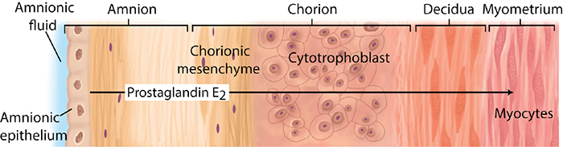

*Figure 21-1. Amnion makes PGE₂; chorionic PGDH limits its passage to the decidua and myometrium until labor, when PGDH falls.*

---

## 2. Sex Steroid Hormones
- In many species: **estrogen promotes, progesterone inhibits** parturition; **progesterone withdrawal** directly precedes it.
- In humans both are part of a broader system maintaining quiescence. Levels are far above receptor affinity constants, yet the evidence for a **↑ progesterone:estrogen ratio maintaining pregnancy** and a **fall in this ratio for parturition** is overwhelming.
- **Progesterone-receptor antagonists (mifepristone/RU486, onapristone)** produce cervical ripening, ↑ distensibility and ↑ sensitivity to uterotonins — in all species studied, including humans.
- Estrogen advances progesterone responsiveness and, at term, aids uterine activation and cervical ripening.
- Receptors (nuclear, regulate transcription): **ERα, ERβ**; **PR-A and PR-B** come from different transcripts of **one gene**.

---

## 3. Prostaglandins
- Lipid mediators of contractility, relaxation and inflammation. Act on **8 G protein–coupled receptors**.
- **Pathway:** membrane arachidonic acid (released by **phospholipase A₂ or C**) → **PGHS-1/-2 (= COX-1/-2)** → **PGH₂** → tissue-specific isomerases → **PGE₂, PGF₂α, PGI₂** → inactivated by **15-hydroxy-PGDH**.
- COX enzymes are NSAID targets. COX-inhibitor tocolysis looked promising until **adverse fetal effects** emerged (Ch 45).
- PGDH is **upregulated in the uterus and cervix during pregnancy** → rapid inactivation.
- Myometrial response depends on synthesis vs metabolism, receptor mix, and receptor-signalling switches. Prostanoids may relax the uterus at one stage and contract it after labor starts.
- **Amnion** makes more PGE₂ and PGF₂α late in pregnancy (↑ PLA₂ and PGHS-2). It is the main source of amnionic fluid PGs and clearly drives **membrane rupture**, but its effect on the myometrium is limited by chorionic PGDH.

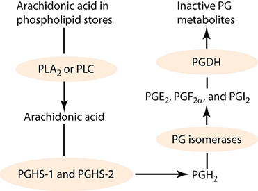

*Figure 21-2. Prostaglandin synthesis: PLA₂/PLC → arachidonic acid → PGHS-1/2 (COX) → PGH₂ → isomerases → PGE₂/PGF₂α/PGI₂ → PGDH inactivates.*

---

## 4. Phases of Parturition

| Phase | Name | Key events | Timing |
|---|---|---|---|
| **1 — Quiescence** | Prelude | Contractile unresponsiveness, **cervical softening** | Conception → ~**95% of pregnancy** |
| **2 — Activation** | Preparation | Uterine preparedness (CAPs), **cervical ripening**, lower segment forms | Last few weeks |
| **3 — Stimulation** | Process of labor | Contractions, dilation, expulsion of fetus and placenta = **the 3 clinical stages of labor** | Labor |
| **4 — Involution** | Recovery | Involution, cervical repair, breastfeeding | Until fertility returns |

- ⚠️ Phases of parturition ≠ stages of labor. **Stages 1–3 of labor all lie within phase 3.**

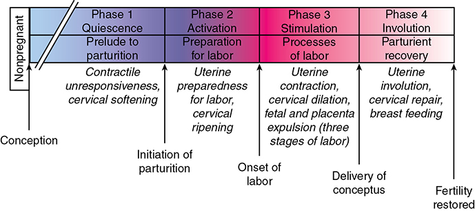

*Figure 21-3. The four phases of parturition, from conception to restored fertility.*

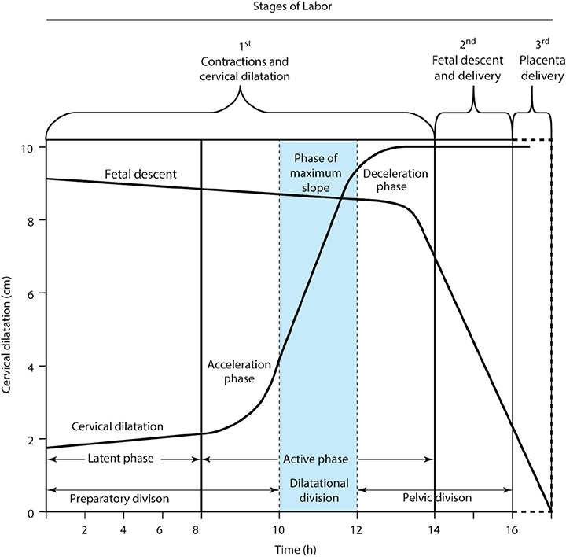

*Figure 21-4. Friedman labor curve: latent and active phases (acceleration, maximum slope, deceleration) and the preparatory, dilatational and pelvic divisions.*

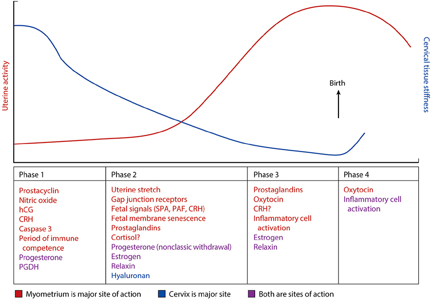

*Figure 21-5. Key regulators of each phase: uterine activity rises as cervical stiffness falls; stiffness recovers after birth.*

---

## 5. Phase 1: Uterine Quiescence and Cervical Softening
- Imposed **even before implantation**; ~**95% of pregnancy**. Plus a **"fail-safe" system** that protects against disruption.
- Myometrial cells switch to a **noncontractile phenotype**.
- **Braxton Hicks contractions (false labor):** low intensity, no cervical dilation, common near term, especially in **multiparas**.
- **Causes of quiescence:**
  1. Estrogen and progesterone via intracellular receptors
  2. Membrane receptor–mediated **↑ cAMP**
  3. **↑ cGMP**
  4. Other systems, e.g., ion channel changes

### Myometrial relaxation vs contraction
| Quiescence (relaxation) | Contractility |
|---|---|
| ↓ intracellular crosstalk, **↓ [Ca²⁺]i** | ↑ actin–myosin interaction |
| Ion channels keep membrane **hyperpolarized** | ↑ myocyte excitability |
| Stress–unfolded protein response (endoplasmic reticulum) | ↑ intercellular crosstalk → **synchronous** contractions |
| **Uterotonin degradation** | |

**Actin–myosin**
- Actin must go from **globular → filamentous** and anchor to the cytoskeleton at focal points. Keeping actin globular maintains relaxation.
- Contraction needs phosphorylation of the **20-kDa myosin light chain** by **myosin light-chain kinase (MLCK)**, which is activated by **Ca²⁺–calmodulin**.
- **Relaxation ← ↓ [Ca²⁺]i. Contraction ← ↑ [Ca²⁺]i** (release from sarcoplasmic reticulum or influx via ligand-/voltage-gated channels).
- **PGF₂α and oxytocin** open ligand-activated Ca²⁺ channels and release SR calcium.
- Contractions are prolonged by **inhibition of myosin phosphatase**.

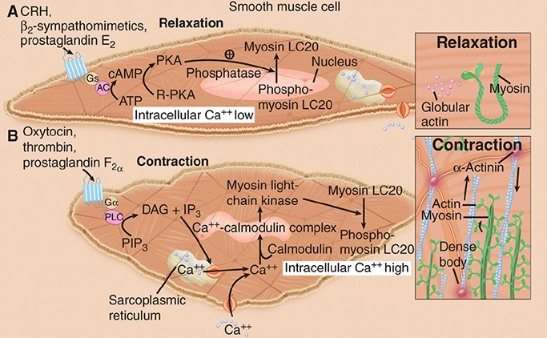

*Figure 21-6. Relaxation = Gs → cAMP → PKA, low Ca²⁺, globular actin. Contraction = Gq → PLC → IP₃ → Ca²⁺–calmodulin → MLCK → phosphorylated myosin LC20.*

**Membrane potential**
- Before labor, myocytes are **hyperpolarized** (interior electronegative) → less excitable.
- **Sodium leak channels (NALCN)** matter for normal uterine function.
- **BKCa channel** (large-conductance voltage- and Ca²⁺-activated K⁺ channel): opening → K⁺ efflux → keeps the interior negative → blocks voltage-gated Ca²⁺ entry. **Inhibiting BKCa → ↑ contractility.**

**Gap junctions**
- Made of **connexins**; **connexin-43** in myometrium **↑ near labor**. 6 connexins = 1 connexon; 2 connexons = a channel.
- Needed for **electrical synchrony**.
- **CAPs = oxytocin receptor, PGF receptor, connexin-43.**
- **Progesterone** keeps CAPs low and keeps anticontractile **caspase 3** high.
- At term, CAPs rise because of **stretch**, progesterone metabolism by **20α-HSD**, loss of PR repression and **estrogen dominance**.

**G protein–coupled receptors (GPCRs)**

| Ligand / receptor | Signal | Effect |
|---|---|---|
| **LH/hCG receptor** | Gαs → adenylyl cyclase → cAMP | ↓ contraction frequency and force, ↓ gap junctions → **high hCG = quiescence** |
| **β-adrenergic** | Gαs | Relaxation → tocolytics **ritodrine, terbutaline**. Limited by receptor number and adenylyl cyclase level |
| **EP2, EP4** (PGE₂) | Gαs → quiescence; **switch to Gαq/11 (Ca²⁺) in labor** | Relax → contract |
| **EP1, EP3** (PGE₂) | Gαq, Gαi → ↑ Ca²⁺ | Contraction |
| **Relaxin → RXFP1** | Adenylyl cyclase | Quiescence. **H1 gene** = decidua, trophoblast, prostate; **H2 gene** = corpus luteum. Peak **~1 ng/mL at 8–12 wk**, then falls |
| **CRH → CRHR1** | Nonlaboring: Gs–cAMP (↓ IP₃). **Laboring: Gq/Gi → ↑ IP₃, Ca²⁺** | Quiescence most of pregnancy → contraction at term |

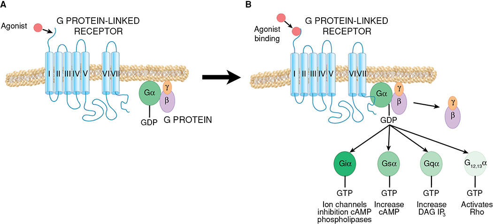

*Figure 21-7. GPCR signalling: seven-transmembrane receptor; Gαi (ion channels, ↓cAMP), Gαs (↑cAMP), Gαq (↑DAG/IP₃), G12/13 (Rho).*

**cGMP**
- Guanylyl cyclase → **↑ cGMP → relaxation**. Stimulated by **ANP, BNP and nitric oxide**, all expressed in the pregnant uterus.

**Accelerated uterotonin degradation (↑ in phase 1, falls late)**

| Enzyme | Target |
|---|---|
| PGDH | Prostaglandins |
| Enkephalinase | Endothelins |
| **Oxytocinase** | Oxytocin |
| Diamine oxidase | Histamine |
| Catechol O-methyltransferase | Catecholamines |
| Angiotensinases | Angiotensin II |
| PAF acetylhydrolase | Platelet-activating factor |

### Decidua
- Decidual **PGF₂α synthesis is markedly suppressed**; withdrawal of this suppression is a **prerequisite for parturition**.
- Maternal–fetal contact at the **decidua basalis and parietalis**. NK cells, macrophages, dendritic cells and T cells → **immune tolerance in phase 1**, decidual activation in phase 2.
- Decidual NK (dNK) cells (matured by **IL-15**) support remodeling, implantation and EVT invasion. Their cytotoxicity is controlled by **KIR binding HLA-G on EVT**. Decidual macrophages make **IDO**, limiting T-cell activation.
- **Phase 2:** decidual stromal cells and membranes undergo **cellular senescence** → pro-inflammatory cytokines, ↑ PGs, ↑ proteases → membranes break down.

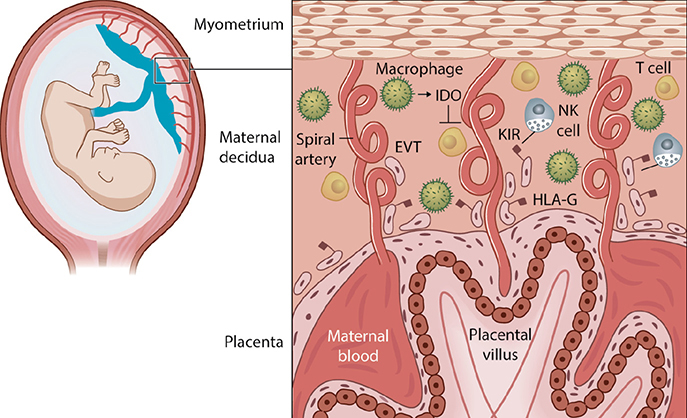

*Figure 21-8. Immune tolerance at the maternal–fetal interface: dNK cells (KIR–HLA-G), IDO-producing macrophages, spiral artery remodeling by EVT.*

### Cervical softening
- First stage of cervical remodeling; begins in phase 1. More compliant, but still **firm and unyielding**.
- **Hegar sign (1895):** palpable softening of the lower uterine segment at **4–6 wk** (once used to diagnose pregnancy).
- Preterm dilation or structural insufficiency may forecast delivery.

**Cervical connective tissue (ECM)**
- Components: **type I and III fibrillar collagen**, matricellular proteins, GAGs, proteoglycans, elastic fibers.
- From early pregnancy: ↓ **lysyl hydroxylase and lysyl oxidase** (cross-link enzymes) + collagen turnover → mature cross-linked fibrils replaced by **poorly cross-linked** ones → ↓ stiffness.
- **Decorin and biglycan** (collagen-binding proteoglycans) ensure proper assembly of the new collagen.
- Remodeling = a **balance of collagen synthesis and breakdown, not loss of collagen**.
- **Cervical insufficiency is more common in collagen/elastin defects: Ehlers-Danlos, Marfan** (Ch 62).
- Genes for dilation and parturition are actively repressed during softening.

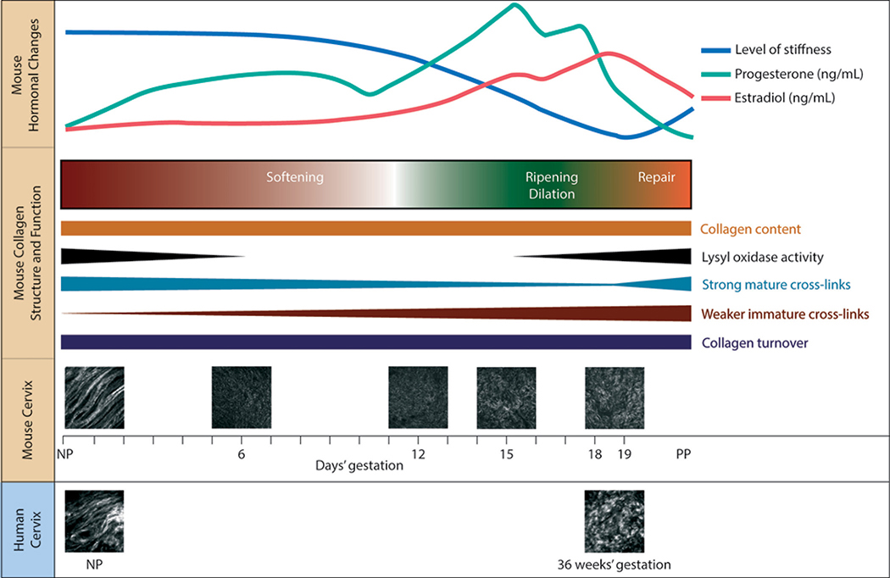

*Figure 21-9. Cervical remodeling (mouse): collagen content constant; lysyl oxidase and mature cross-links fall, weak cross-links rise → stiffness declines.*

---

## 6. Phase 2: Preparation for Labor
- "Uterine awakening/activation" over the last few weeks. Shifts in phase 2 can cause **preterm or delayed labor**.

### Progesterone withdrawal
- **Classic progesterone withdrawal (↓ secretion) does NOT occur in humans.** Instead, **functional** withdrawal: myometrium and cervix become refractory to progesterone.
- Mifepristone is less effective for abortion/labor later in pregnancy but helps **cervical ripening** and ↑ sensitivity to uterotonins.
- Progesterone for preventing preterm birth remains **debated** (Ch 45).
- **Mechanisms of functional withdrawal:**
  1. Change in relative expression of **PR-A vs PR-B**
  2. Different interaction of PR-A/PR-B with enhancers/inhibitors of gene expression
  3. Altered coactivators/corepressors
  4. **Local progesterone inactivation** (steroid-metabolizing enzymes) or a natural antagonist
  5. **microRNA** regulation of progesterone-metabolizing enzymes and transcription factors

### Myometrial changes
- Shift from quiescence proteins to **CAPs** → ↑ responsiveness to uterotonins.
- **Lower uterine segment forms from the isthmus** → **lightening** ("the baby dropped"): the head descends to or through the inlet.
- Upper and lower segments differ in PG receptors and CAPs. **HoxA13** is higher in the lower segment → regional contractility.

**Oxytocin receptors**
- **↑ in phase 2**; term myometrial OTR mRNA > preterm.
- Unclear whether oxytocin acts in early activation or **only in the expulsive phase**.
- **OTR-knockout mice deliver normally** → redundant systems.
- **Progesterone inhibits, estradiol induces** OTR expression. Progesterone (via **PR-B**) regulates the oxytocin pathway genes and may ↑ OTR degradation.

### Cervical ripening
- Competence → compliance, weeks or days before labor. Mainly connective-tissue change.
- **GAGs ↑ uniquely in phase 2.** **Hyaluronan** (made by hyaluronan synthase, ↑ in ripening) is hydrophilic and space-filling → ↑ viscoelasticity, hydration and matrix disorganization.
- **Inflammation:** immune cells are present but show little pro-inflammatory gene activity before labor. **Neutrophils, M1 and M2 macrophages activate once labor is underway**; inflammatory/immunosuppressive genes rise markedly **after delivery** → role in **postpartum repair**.
- **No therapy prevents premature cervical ripening.** Ripening for induction: **PGE₂ and PGF₂α** (Ch 26). **Progesterone antagonists** also ripen the human cervix.
- **Endocervical epithelium** proliferates (glands = a large share of cervical mass). Mucosal + **tight junction** barrier; **toll-like receptors**, antimicrobial peptides, protease inhibitors.

### Fetal contributions
**Uterine stretch**
- Stretch induces CAPs: **↑ connexin-43 and oxytocin receptors**, and ↑ **gastrin-releasing peptide**.
- Clinical clue: **multifetal pregnancy and hydramnios → ↑ preterm labor**. Mechanism = **mechanotransduction**.

**Fetal endocrine cascade (placental CRH)**
- Fetal **HPA–placental axis** is critical; **premature activation → many cases of preterm labor**.
- Placenta makes large amounts of **CRH identical to hypothalamic CRH**.
- ⚠️ Unlike hypothalamic CRH (negative feedback), **cortisol STIMULATES placental CRH** → **feed-forward cascade** that ends only with delivery.
- **CRH also stimulates fetal adrenal DHEA-S (C19 steroid)** → substrate for placental aromatization → maternal estrogens.
- **Maternal CRH:** low in the 1st trimester → rises from midgestation → **exponential rise in last 12 wk** → **peaks in labor** → falls precipitously after delivery.
- **CRH-binding protein** inactivates most CRH; **CRH-BP falls late** → more bioavailable CRH. CRH is the **only trophic releasing hormone with a specific binding protein**.
- "Stressed" fetus → ↑ CRH. **Preeclamptic placentas: 4× CRH content.**
- **Actions:** positive feedback on fetal cortisol; receptor switch from cAMP → Ca²⁺ (PKC); ↑ contractile force to PGF₂α; ↑ fetal adrenal C19 steroids. Oxytocin attenuates CRH-stimulated cAMP.
- **"Fetal–placental clock":** the **rate of rise** of maternal CRH predicts outcome better than a single value.

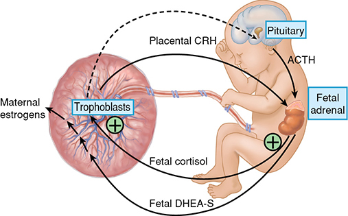

*Figure 21-10. Placental–fetal adrenal cascade: placental CRH → fetal adrenal cortisol and DHEA-S; cortisol feeds forward to more CRH; DHEA-S → maternal estrogens.*

**Fetal lung signals**
- **Surfactant protein A (SP-A):** in amnion, decidua and amnionic fluid; signals myometrial cells. SP-A **inhibits PGF₂α in term decidua**, but amnionic SP-A **falls at term**.
- Fetal lung also makes the uterotonin **platelet-activating factor (PAF)**.

**Fetal membrane senescence**
- Stretch + oxidative stress → senescence → **senescence-associated secretory phenotype (SASP)** (sterile inflammation) → weakens membranes and activates decidua/myometrium.

**Fetal anomalies and delayed parturition**
- Markedly ↓ estrogen → **prolonged gestation**: **placental sulfatase deficiency**, **anencephaly with adrenal hypoplasia** (wide range, so estrogen's role is uncertain).
- **Anencephaly:** adrenals only **5–10%** of normal size (failed **fetal zone**) → delayed labor → fetal adrenal matters for timing.
- **Renal agenesis and pulmonary hypoplasia do NOT prolong pregnancy** → the amnionic fluid (paracrine) arm is not mandatory.

---

## 7. Phase 3: Labor

| Stage | Starts | Ends | Called |
|---|---|---|---|
| **First** | Contractions strong/frequent enough for effacement | **Full dilation (~10 cm)** | Stage of **effacement and dilation** |
| **Second** | Full dilation | Delivery of fetus | Stage of **fetal expulsion** |
| **Third** | Delivery of fetus | Delivery of placenta | Stage of **placental separation and expulsion** |

### First stage: clinical onset
- **"Bloody show"** = extrusion of the mucus plug → labor in progress or will start within **hours to days**.
- **Why contractions hurt:**
  1. Myometrial hypoxia (like angina)
  2. **Compression of nerve ganglia in the cervix and lower uterus** (most attractive; **paracervical block** relieves pain)
  3. Cervical stretching
  4. Stretching of the peritoneum over the fundus
- Contractions are involuntary. **Epidural does not reduce their frequency or intensity.** In paraplegia or after bilateral lumbar sympathectomy they are **normal but painless**.
- **Ferguson reflex:** cervical stretching ↑ uterine activity (oxytocin suggested, not proven). Cervical manipulation and **membrane stripping ↑ PGF₂α metabolites**.

| Contraction feature | Value |
|---|---|
| Interval | **~10 min at onset → ≤1 min in 2nd stage** |
| Duration (active phase) | **30–90 s, average 1 min** |
| Intensity (amnionic fluid pressure) | **Average 40 mm Hg (20–60)** |

- **Relaxation between contractions is essential** — unremitting contractions → fetal hypoxemia.

**Upper vs lower uterine segments**

| Upper (active) segment | Lower (passive) segment |
|---|---|
| Firm in contractions; contracts, **retracts**, expels | Soft, distended, passive; from the **isthmus** |
| Fibers stay shorter after each contraction (**retraction**); tension constant | Fibers lengthen and **thin to a few mm** |
| **Thickens** progressively through stages 1–2 | Dilates with the cervix into a thin tube |

- If the whole uterus contracted equally, expulsive force would fall.
- **Upper segment retracts only as much as the lower segment distends and the cervix dilates.**
- **Physiological retraction ring** = ridge at the junction. Extreme thinning (**obstructed labor**) → **pathological retraction ring (Bandl ring)** (Ch 23).
- **Uterine shape:** each contraction lengthens the ovoid **5–10 cm**, narrows the horizontal diameter → **fetal axis pressure** straightens the spine.

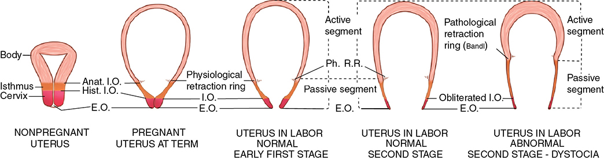

*Figure 21-11. Uterine segments: the isthmus becomes the passive lower segment; physiological retraction ring → pathological (Bandl) ring in dystocia.*

**Ancillary forces**
- After full dilation, **maternal intraabdominal pressure** (pushing: abdominal muscles + forced expiration against a closed glottis) is the **most important expulsive force**.
- Proof: **prolonged descent in paraplegia and with dense epidural block**.

**Cervical changes**
- **Effacement** = "taking up" of the cervix: canal **~3 cm → paper-thin circular orifice**. Internal os fibers pulled up into the lower segment; external os unchanged at first. Expels the mucus plug. May occur before active labor.
- **Dilation to ~10 cm** for an average head.
- **Primigravida: effaces first, then dilates. Multipara: dilates along with effacement** (internal and external os already open).
- Dilation mechanism: **centrifugal pull** on the less-resistant cervix + **hydrostatic wedge of the amnionic sac (forebag)**. Without membranes, the presenting part acts as the wedge → **early membrane rupture does not slow dilation** if the presenting part is applied to the cervix.
- **Latent phase:** variable; prolonged by **sedation**, shortened by myometrial stimulation; **little bearing on the rest of labor**. **Active phase characteristics predict outcome** (Ch 22–23).

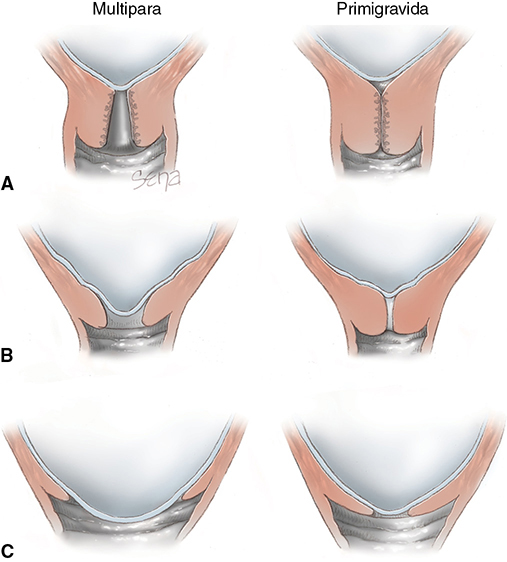

*Figure 21-13. Primigravida effaces before dilating; the multipara dilates (with funneling) as she effaces.*

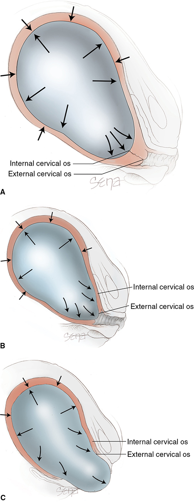

*Figure 21-14. Hydrostatic action of the membranes (forebag) as a wedge that effaces and dilates the cervix.*

### Second stage: fetal descent
- Many nulliparas are **engaged before labor**, but further descent may wait until late labor.
- Descent curve is **hyperbolic**. **Station** = biparietal diameter relative to the **ischial spines** (Ch 22).
- **Speed of descent is maximal in the 2nd stage**, until the presenting part reaches the perineal floor.
- **Nullipara:** slow, steady. **Multipara:** may be rapid.

### Pelvic floor changes
- **Levator ani** + its fibromuscular covering is the key component. ECM changes alter biomechanics.
- Membranes/presenting part dilate the upper vagina in the 1st stage. Biggest change = **stretching of levator ani fibers**.
- Central perineum: wedge **5 cm thick → <1 cm** (almost transparent).
- Maximally distended: **anus dilates 2–3 cm**, anterior rectal wall bulges.

### Third stage: placenta and membranes
- After birth, the cavity is nearly obliterated; **fundus just below the umbilicus**.
- **Mechanism of separation:** sudden ↓ in implantation-site area → placenta thickens and **buckles** (limited elasticity) → tension pulls apart the weakest layer, the **decidua spongiosa**.
- **Retroplacental hematoma is usually the result, not the cause**, of separation (sometimes bleeding is negligible).
- Membranes are thrown into folds and peeled off by contraction + traction of the descending placenta.
- Expulsion: ↑ abdominal pressure, or alternately compress and elevate the fundus with **minimal cord traction**.

| | **Schultze** | **Duncan** |
|---|---|---|
| Separation | Central | **Peripheral first** |
| Blood | Pours into the inverted membrane sac; escapes **after** the placenta | Collects between membranes and uterine wall; **escapes vaginally** before |
| Surface first seen | Fetal | **Maternal** (placenta descends sideways) |

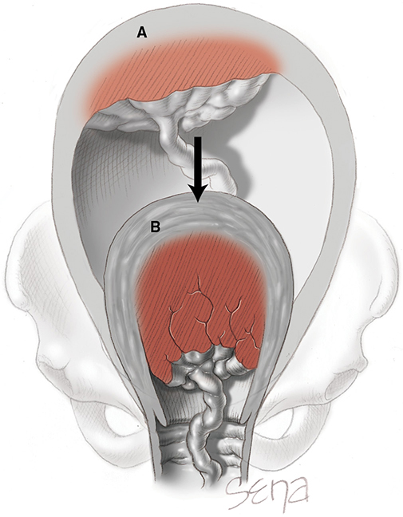

*Figure 21-15. The placental site shrinks after birth; the unchanged-size placenta buckles and shears off through the decidua spongiosa.*

---

## 8. Uterotonins in Phase 3

### Oxytocin
- **Nonapeptide** made in the **supraoptic and paraventricular** magnocellular neurons; carried with **neurophysin** to the posterior pituitary.
- First uterotonin implicated ("quick birth"). **Evidence:**
  1. **Oxytocin receptors ↑ strikingly** in myometrium and decidua near term
  2. Acts on decidua to **release prostaglandins**
  3. Also made in decidua, extraembryonic fetal tissues and placenta
- **Maternal serum oxytocin ↑:** (1) **2nd stage**, (2) early puerperium, (3) breastfeeding.
- After delivery of fetus and placenta, **firm persistent oxytocin-induced contraction prevents PPH**.

### Prostaglandins
- **Evidence for their role:** ↑ PGs/metabolites in amnionic fluid, maternal plasma and urine in labor; PGE₂/PGF₂α receptors in uterus and cervix; **PGs cause abortion or labor at all gestational ages**; **PGHS-2 inhibitors delay labor** and sometimes arrest preterm labor.
- Decidual PG synthesis is **high and unchanging** in phases 2–3; the **↑ decidual PGF₂α receptor** is likely the regulatory step.
- Amnionic fluid: mainly **PGE₂** (also PGF₂α) at all ages; rises with growth, **greatest rise after labor starts** — the dilating cervix exposes decidua, so **forebag levels > upper compartment** (inflammatory signal). Cytokines + PGs degrade ECM → weaker membranes.

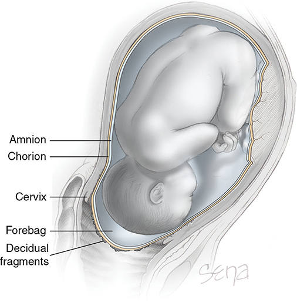

*Figure 21-17. The forebag and exposed decidual fragments after cervical dilation — the source of high forebag prostaglandins.*

### Endothelin-1
- 21-amino-acid peptides; **powerful myometrial contraction**. **Endothelin A receptor** (smooth muscle) → ↑ intracellular Ca²⁺. Made in term myometrium; induces PGs and inflammatory mediators. Necessity unproven.

### Angiotensin II
- Potent vasoconstrictor; levels ↑ in pregnancy, yet resistance ↓.
- Nonpregnant: **AT1R** dominates. Pregnant: **AT2R** preferred → vasodilation → ↑ uterine artery flow.
- **↓ AT2R expression in preeclampsia.**

---

## 9. Phase 4: The Puerperium
- For **~1 hour after delivery** the myometrium stays persistently contracted → compresses vessels → **thrombosis of their lumens** prevents hemorrhage (augmented by uterotonics, Ch 27).
- Uterine involution and cervical repair restore the nonpregnant state and protect against commensal microbes.
- Lactogenesis and milk let-down begin (Ch 36).
- **Ovulation usually returns at 4–6 wk**, delayed by breastfeeding (prolactin-mediated anovulation).

---

## Quick-Recall: Promotes Quiescence vs Promotes Contraction

| Promotes quiescence / relaxation | Promotes contraction / labor |
|---|---|
| Progesterone (via PR; ↓ CAPs, ↑ caspase 3, ↓ OTR) | Estrogen (↑ OTR, CAP dominance), functional progesterone withdrawal |
| ↑ cAMP (Gαs): hCG/LH receptor, β-agonists, relaxin (RXFP1), CRH–CRHR1 early, EP2/EP4 early | ↑ [Ca²⁺]i (Gαq/Gαi): oxytocin, PGF₂α, EP1/EP3, CRH at term, endothelin-1 (ETA) |
| ↑ cGMP: nitric oxide, ANP, BNP | Connexin-43 gap junctions, oxytocin receptor, PGF receptor (CAPs) |
| BKCa channel open, hyperpolarized membrane | BKCa inhibition, depolarization |
| Globular actin | Filamentous actin, MLCK phosphorylation of LC20 |
| Degrading enzymes: PGDH, oxytocinase, enkephalinase, etc. | Fall in PGDH (chorion) in labor |
| Decidual PGF₂α suppression, immune tolerance (dNK, IDO) | Decidual/membrane senescence (SASP), inflammation |
| SP-A inhibits decidual PGF₂α (early) | Uterine stretch (twins, hydramnios), placental CRH feed-forward, fetal PAF |
| PGHS-2 (COX-2) inhibitors | Prostaglandins (any route, any GA), progesterone antagonists |

## Key Numbers to Memorize
- Phase 1 = **95%** of pregnancy
- Cervical smooth muscle **50% at internal os vs 10% at external os**
- Hegar sign **4–6 wk**
- Relaxin peak **~1 ng/mL at 8–12 wk**
- CRH rises exponentially in the **last 12 wk**, peaks in labor; **4×** placental CRH in preeclampsia
- Anencephalic adrenals **5–10%** of normal size
- Full dilation **~10 cm**; cervical canal **~3 cm** before effacement
- Contraction interval **10 → ≤1 min**; duration **30–90 s (mean 60 s)**; pressure **40 mm Hg (20–60)**
- Each contraction lengthens the uterus **5–10 cm**
- Perineum **5 cm → <1 cm**; anus dilates **2–3 cm**
- Myometrium stays contracted for **~1 h** postpartum; ovulation at **4–6 wk**
