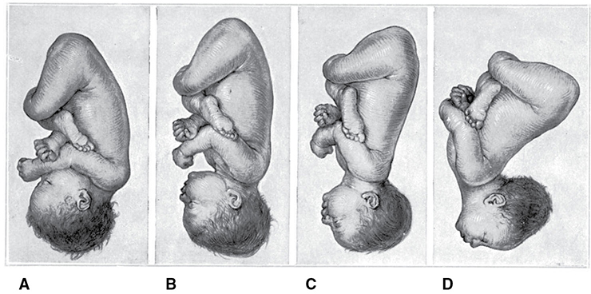
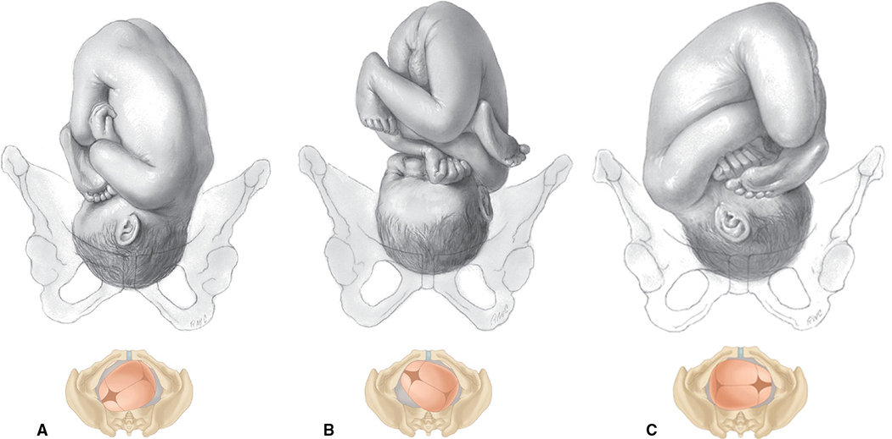
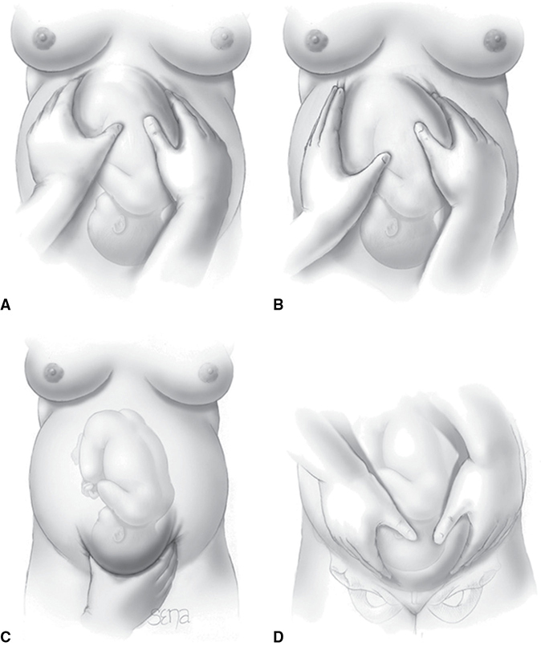
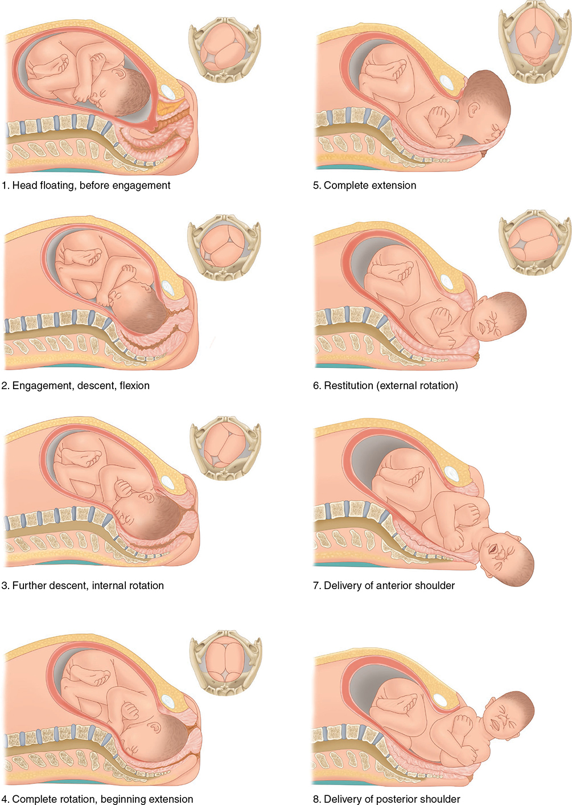
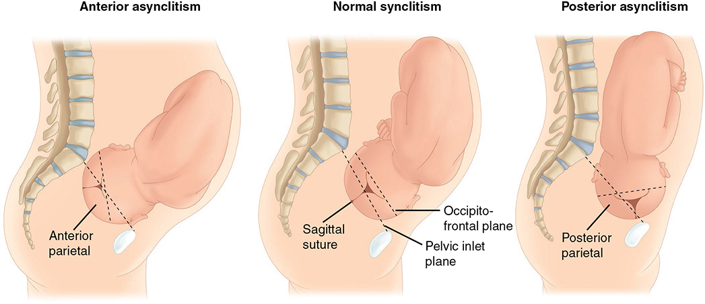
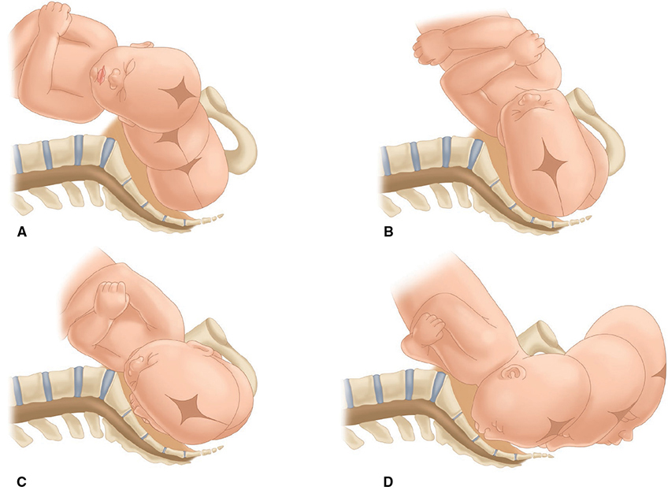
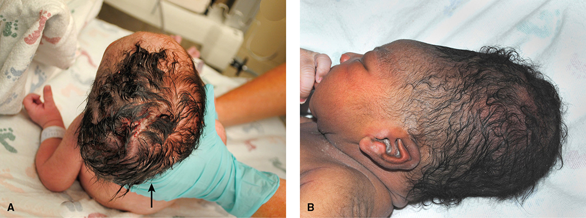
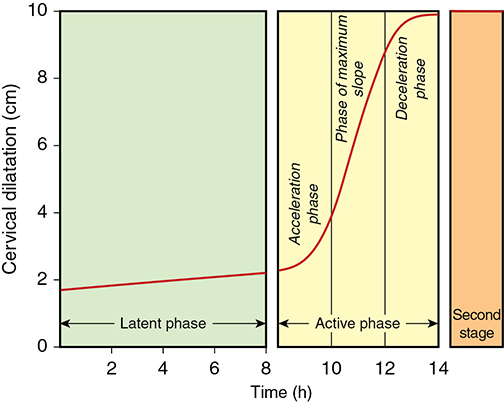
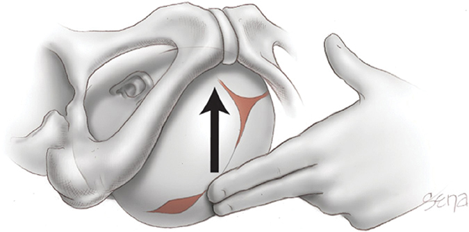
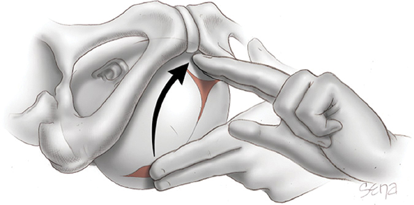

# Chapter 22: Normal Labor — Revision Notes

> Williams Obstetrics 26e, pp. 1063–1101 of the PDF. High-yield numbers are in **bold**.
> This chapter has no tables. 10 of the 11 figures are included from the PDF (22-8 is omitted because it repeats 21-4 and 22-9).

**Big picture:** Labor = regular contractions → effacement and dilation → delivery of the newborn and placenta. It is physiological and normal for most women. Know **fetal orientation** (lie, presentation, attitude, position), the **7 cardinal movements**, the **Friedman vs Zhang labor curves**, and the practical management of the 1st and 2nd stages.

---

## 1. Fetal Orientation

### Fetal lie
- = relation of the fetal long axis to the maternal long axis.
- **Longitudinal in >99%** of term labors. Transverse is less frequent.
- **Oblique lie** (axes cross at **45°**) is **unstable** → becomes longitudinal or transverse in labor.

### Fetal presentation
- **Presenting part** = the fetal part in or nearest the birth canal.
- Longitudinal lie → **cephalic** or **breech**. Transverse lie → **shoulder**.

| Cephalic type | Head/neck | Presenting part | Note |
|---|---|---|---|
| **Vertex (occiput)** | **Sharply flexed**, chin on thorax | **Occipital (posterior) fontanel** | Usual |
| **Sinciput** | Partly flexed | **Anterior (large) fontanel** | Transient → converts to occiput |
| **Brow** | Partly extended | Brow | Transient → converts to face |
| **Face** | **Sharply extended**, occiput touches back | Face | |

- If sinciput or brow do not convert → **dystocia** (Ch 23).
- **Why the fetus presents head-first:** the **podalic pole** (breech + limbs) is bulkier and more mobile than the head, so it takes the roomier **fundus**.
- Breech falls with gestational age, but **2–3% of singletons are breech at delivery**. Types: **frank, complete, footling** (Ch 28).

### Fetal attitude (habitus)
- Ovoid mass matching the uterine cavity: **convex back**, head sharply flexed, thighs flexed over the abdomen, knees bent; arms across the thorax; cord between the limbs.
- From occiput → face presentation, the spine goes from **convex (flexed) to concave (extended)**.

*Figure 22-1. Attitude in (A) occiput, (B) sinciput, (C) brow and (D) face presentations: the head becomes progressively less flexed.*

### Fetal position
- = relation of a **defined landmark** of the presenting part to the maternal **right or left**, and to the **anterior, transverse or posterior** pelvis.

| Presentation | Landmark | Positions |
|---|---|---|
| Occiput | **Occiput** | LOA, LOT, LOP, ROA, ROT, ROP, OA, OP |
| Face | **Chin (mentum)** | LM / RM ± A/T/P |
| Breech | **Sacrum** | LS / RS ± A/T/P |
| Shoulder | **Acromion** (scapula) | Right/left; **dorsoanterior vs dorsoposterior** |

- Transverse lie **"back up" vs "back down"** matters for choosing the **cesarean incision**.

*Figure 22-2. Occiput presentations: (A) LOA, (B) LOP, (C) ROT.*

### Diagnosis
**Leopold maneuvers (1894)** — mother supine. Hard in **obesity, polyhydramnios, anterior placenta**.

| Maneuver | Assesses | Findings |
|---|---|---|
| **1st** | **Fundus** → lie and presentation | Breech = large, **nodular**; head = hard, **round** |
| **2nd** | Sides → **position** (back vs limbs) | Back = hard, resistant (occiput on that side); limbs = small, irregular, mobile. **OA → convex back felt; OP → nodular limbs felt** |
| **3rd** | Above the symphysis → **presentation**, engagement | Movable mass = not engaged |
| **4th** | Examiner faces the feet → **descent** | Fingertips slide along the inlet axis |

- Accuracy for malpresentation: **sensitivity 88%, specificity 94%, PPV 74%, NPV 97%**.
- Fetal weight by palpation correlates **poorly**, especially in obesity.
- **Vaginal exam:** hard before labor (closed cervix). In labor, identify **sutures and fontanels**; facial features → face; sacrum and perineum → breech; ribs, scapula, clavicle → transverse lie.
- **Sonography** confirms abnormal presentation/lie. OA: spine anterior, the spine–occiput angle widens as the head flexes. **OP: orbits and nasal bridge anterior.** **Sonography is more accurate than digital exam for head position in the 2nd stage.**

*Figure 22-3. Leopold maneuvers A–D (fetus in LOA).*

---

## 2. Mechanisms of Labor (Cardinal Movements)

> **Memory hook:** "**E**very **D**iligent **F**etus **I**s **E**ager **E**xiting **E**arly" = **E**ngagement, **D**escent, **F**lexion, **I**nternal rotation, **E**xtension, **E**xternal rotation, **E**xpulsion.

- The movements **overlap in time**. Contractions straighten the fetus (loss of dorsal convexity) → the ovoid becomes a **cylinder** with the smallest cross-section.

*Figure 22-4. Cardinal movements from LOA: floating → engagement/descent/flexion → internal rotation → extension → restitution → anterior then posterior shoulder.*

### Engagement
- **Definition: the biparietal diameter passes through the pelvic inlet.**
- May occur in the last weeks of pregnancy or only after labor starts. **"Floating"** head at labor onset is common in multiparas and some nulliparas.
- In **5341 nulliparas**, no engagement before labor did **not** lower vaginal delivery rates (spontaneous or induced).
- Head usually enters with the **sagittal suture transverse**; **LOT slightly more common than ROT**.

**Synclitism and asynclitism**

| | Sagittal suture lies near | Bone presenting |
|---|---|---|
| **Synclitism** | Midway between symphysis and promontory | — |
| **Anterior asynclitism** | **Sacral promontory** | **Anterior parietal** |
| **Posterior asynclitism** | **Symphysis** | **Posterior parietal** |

- **Moderate asynclitism is normal**; successive shifting posterior → anterior asynclitism aids descent.
- **Severe** asynclitism → common cause of **CPD even with a normal pelvis**. Extreme → an **ear** is palpable.

*Figure 22-5. Anterior asynclitism (anterior parietal presents), synclitism, posterior asynclitism (posterior parietal presents).*

### Descent
- **First requisite for vaginal birth.**
- **Nullipara:** may engage before labor, then no further descent until the **2nd stage**. **Multipara:** descent usually begins **with** engagement.
- **Forces:** (1) fundal pressure on the breech during contractions, (2) maternal bearing-down, (3) extension/straightening of the fetal body.

### Flexion
- When the head meets resistance (cervix, pelvic walls, floor) → chin to thorax.
- The shorter **suboccipitobregmatic** diameter replaces the longer **occipitofrontal** → essential for descent.

### Internal rotation
- Occiput turns from transverse, **usually anteriorly** toward the symphysis (LOT → LOA; ROT → ROA). Less often posteriorly → OP.
- **Essential**, except for an unusually small fetus.
- **Calkins (>5000 women):**
  - **~⅔** complete rotation **by the time the head reaches the pelvic floor**
  - **~¼** shortly after reaching the floor
  - **~5%** do not rotate
- If rotation waits for the floor: **1–2 contractions in multiparas; 3–5 in nulliparas**.

### Extension
- Uterine force (posterior) + resistance of pelvic floor and symphysis (anterior) → resultant vector toward the **vulva** → extension.
- **Base of the occiput pivots under the inferior symphysis.** Born in order: **occiput, anterior fontanel, brow, nose, mouth, chin** over the perineum; then the chin drops over the anus.
- Without extension, the head would be forced through the posterior perineum.

*Figure 22-6. LOT mechanism: engagement with posterior asynclitism → anterior asynclitism → correction → internal rotation to OA and extension.*

### External rotation (restitution)
- Occiput turns back to its original side (toward the maternal **left or right ischial tuberosity**) → transverse.
- **Bisacromial diameter aligns with the AP diameter of the outlet** → one shoulder anterior (behind the symphysis), one posterior.

### Expulsion
- Anterior shoulder under the symphysis → posterior shoulder distends the perineum → body follows.
- Anterior shoulder wedged behind the symphysis = **shoulder dystocia** (Ch 27).

### Occiput posterior position
- Enters the pelvis OP in **~20%**; associated with a **narrow forepelvis**.
- Most rotate anteriorly at the pelvic floor (with good contractions, flexion and average size).
- **Incomplete or no rotation in 5–10%**, especially with a **large fetus**. Predisposed by poor contractions, faulty flexion, **epidural** (less pushing, relaxed pelvic floor).
- Outcomes: **transverse arrest** or **persistent OP** → dystocia, cesarean (management Ch 27; manual rotation Ch 29).

### Fetal head shape changes

| | **Caput succedaneum** | **Molding** |
|---|---|---|
| What | **Scalp edema** over the cervical os | Change in **bony** head shape from compression |
| When | Prolonged labor before full dilation; often low in the canal against a rigid outlet | Some **before labor** (Braxton Hicks); in labor |
| Features | Usually a few mm; may obscure sutures/fontanels. Over the most dependent part → **reveals original position**. **Far from the midline with marked asynclitism** | **Parietal bones seldom overlap** ("locking" at coronal and lambdoid sutures). **Shortens suboccipitobregmatic diameter** |
| Significance | — | May decide vaginal vs cesarean birth with a **contracted pelvis or asynclitism**. **No proven link to neurological injury.** Resolves within ~**1 week** |

- Molding vs caput vs **cephalohematoma** → Ch 33.

*Figure 22-7. (A) Caput far left of the midline (arrow) from marked asynclitism, after cesarean for arrest. (B) Caput and elongated molding after vaginal birth.*

---

## 3. Normal Labor Characteristics
- **Strict definition:** contractions that cause **demonstrable effacement and dilation**. Onset is judged **retrospectively**; no consensus on definitions.
- Onset methods: (1) clock time when painful contractions become regular; (2) time of admission.
- **False labor** wanes spontaneously; true labor progresses to a regular effective pattern.
- **US admission criteria (intact membranes): dilation ≥3–4 cm + frequent painful contractions.**

### First stage — Friedman's sigmoid curve
| Friedman division | Phase | Features |
|---|---|---|
| **Preparatory** | **Latent** | Little dilation, but big connective-tissue changes. **Arrested by sedation and conduction analgesia** |
| **Dilatational** | **Active** (maximum slope) | Fastest dilation. **Unaffected by sedation** |
| **Pelvic** | **Deceleration** + 2nd stage | **Cardinal movements** mainly here; onset seldom clear |

- Active phase = **acceleration → maximum slope → deceleration**.

*Figure 22-9. Average nulliparous dilatation curve: flat latent phase, then an active phase with acceleration, maximum slope and deceleration.*

**Latent phase**
- Starts when the mother perceives **regular contractions**; for most, ends at **4 cm**.
- ⚠️ **ACOG/SMFM (2019): active labor now begins at 6 cm** (Ch 23).
- **Prolonged latent phase (Friedman): >20 h nullipara, >14 h multipara** (95th percentiles).
- Causes: **excess sedation or epidural**, **unfavorable cervix** (thick, uneffaced, undilated), **false labor**.
- Heavily sedated latent labor: **85%** enter active labor, **10%** stop (false labor), **5%** need oxytocin. → **Amniotomy discouraged** (10% false labor).
- Prolonged latent phase did not raise fetal/maternal morbidity or mortality (Friedman), but is linked to **longer active labor and more interventions**.

**Active phase**

| | Friedman (1955, 1972) | Zhang (2010; 62,415 women) |
|---|---|---|
| Threshold | Slope changes at **3–5 cm**; **3–6 cm** + contractions reliably = active labor | — |
| Nullipara duration | **Mean 4.9 h (SD 3.4)**; statistical maximum **11.7 h** | Median **4→5 cm 1.3 h**, **5→6 cm 0.8 h**, then **~0.5 h/cm** |
| Dilation rate | Nullipara **1.2–6.8 cm/h** (minimum 1.2); multipara minimum **1.5 cm/h** | Normal may take **>6 h for 4→5 cm** and **>3 h for 5→6 cm** |
| Multiparas | Somewhat faster | Same as nulliparas 4–6 cm, then **much faster** |

- **Descent** begins late in active dilation: from **7–8 cm in nulliparas**, fastest **after 8 cm**.
- Zhang's data underpin the **ACOG Obstetric Care Consensus (2019)** on cesarean for arrest (Ch 23).

### Second stage
- Full dilation → delivery. **Median ~50 min nulliparas, ~20 min multiparas** (highly variable).
- High-parity women may need only **2–3 pushes**.
- **Longer** with a contracted pelvis, large fetus, conduction analgesia or sedation, and **high starting station** in nulliparas.
- **Higher BMI does not prolong** the 2nd stage.

### Labor duration

| Study | Nullipara | Multipara |
|---|---|---|
| Kilpatrick & Laros (1st + 2nd stage, no regional analgesia) | **Mean ~9 h; 95th percentile 18.5 h** | **Mean 6 h; 95th percentile 13.5 h** |

- Onset = recalled regular painful contractions every **3–5 min** with cervical change.
- **Parkland (~25,000 spontaneous term labors):** **~80% admitted at ≤5 cm**. Parity and admission dilation determine length. **Median admission → delivery 3.5 h; 95% delivered within 10.1 h** → normal active labor is relatively short.

---

## 4. Management of Normal Labor
- Guidelines for Perinatal Care (AAP/ACOG 2017) set personnel and facility standards. Out-of-hospital birth → Ch 27.

### EMTALA
- Medicare-participating hospitals with emergency services must give an **appropriate screening exam** to any pregnant woman with contractions.
- **Labor** = from the **latent phase through delivery of the placenta**. A woman with contractions is **in true labor unless a physician certifies false labor** after reasonable observation.
- A woman in true labor is **"unstable" for transfer until newborn and placenta are delivered**. Transfer only at her request or if a physician certifies benefits outweigh risks.

### Identification of labor
- Report early, especially if risk factors.
- **Advice rule: contractions 5 min apart for 1 h (≥12/h)** without ruptured membranes or bleeding → possible labor. Pates (768 women): active labor (≥4 cm) diagnosed **within 24 h in ¾** of those with ≥12/h.
- **Parkland triage (≥24 wk):** intact membranes and **<4 cm** → EFM for **up to 2 h**. Cervical change or persistent contractions → admit; otherwise home with false labor.
  - 3949 women discharged with false labor at 37–41⁶/₇ wk: returned after a **mean 4.9 days**; **no ↑ adverse neonatal outcome or cesarean**.
- ACOG endorses **hospital-based obstetrical triage units**.
- **Latent labor** in low-risk women: **expectant care is reasonable** → ↓ oxytocin, antibiotics for fever and cesarean. Some need admission for pain. Agree a time to reassess.

### Initial evaluation
- BP, temperature, pulse, RR; FHR by Doppler, sonography or fetoscope; review records.
- **Vaginal exam unless known placenta previa or vasa previa.** Index + middle fingers, avoid the anal region.

**Ruptured membranes — why it matters**
1. **Cord prolapse** if the presenting part is not fixed
2. **Labor likely soon** at or near term
3. **Infection** (intrauterine and neonatal) rises the longer delivery is delayed

**Diagnosis of rupture**

| Test | Positive | Pitfalls |
|---|---|---|
| **Sterile speculum** | Fluid **pooling in the posterior fornix** or clear fluid from the os | — |
| pH | Vaginal **4.5–5.5**; amnionic fluid **>7.0** | — |
| **Nitrazine** | **pH >6.5** | **False +: blood, semen, bacterial vaginosis.** False −: scant fluid |
| **Ferning** | Arborization on a dried slide (NaCl, protein, carbohydrate) | — |
| AFP in the vaginal vault | Present | — |
| **Fluorescein** (rare) | **1–4 mL of 5% sodium fluorescein** by amniocentesis | Invasive |
| Point-of-care: **AmniSure** (PAMG-1), **Actim PROM** (IGFBP-1), **ROM Plus** (IGFBP-1 + AFP) | Protein detected | False + and − not uncommon; FDA: **combine with clinical findings** |

**Cervical assessment**
- **Dilation:** sweep the finger rim to rim; **full = 10 cm**.
- **Effacement:** canal length vs an unlabored cervix. Half the length = **50%**; as thin as the lower segment = **100%**.
- **Position:** posterior, mid, anterior (descent moves it anteriorly). **Consistency:** soft, intermediate, firm.
- **Station:** leading edge vs the **ischial spines** (midway between inlet and outlet = **midpelvis**). **ACOG (1989): fifths, each = 1 cm**, from **−5 → 0 → +5**.
  - **+5 = head visible at the introitus.**
  - At **0 station or below, the head is usually engaged** (biparietal plane through the inlet) — but **extensive molding/caput can give 0 station without engagement**.
- **Bishop score** = dilation, effacement, consistency, position, station → predicts induction success (Ch 26).

**Laboratory**
- Recheck **Hct/Hb** (Parkland point-of-care spun Hct in **3 min**; send to lab if **<30%**).
- **Blood type and antibody screen.**
- Some states (e.g., Texas) require **syphilis, hepatitis B and HIV** testing at admission even if done prenatally.
- Urine protein: Parkland tests **hypertensive women only**.

---

## 5. Management of First-Stage Labor
- Complete the general exam; plan monitoring. **Don't promise a labor duration.**

### Fetal heart rate monitoring (AAP/ACOG 2017)

| | First stage | Second stage |
|---|---|---|
| **No risk factors** (auscultate after a contraction, or review EFM) | **Every 30 min** | **Every 15 min** |
| **At-risk pregnancy** | **Every 15 min** | **Every 5 min** |

### Maternal monitoring
- **Temperature, pulse, BP at least every 4 h**; temperature **hourly** if membranes ruptured for many hours or borderline fever.
- Manual contraction assessment: at the acme of a firm contraction the uterus **cannot be indented**.
- **After membrane rupture:** if the head was not definitely engaged → **exam promptly to exclude cord prolapse**; check FHR now and through the next contraction (occult cord compression).
- Parkland: pelvic exams every **2–3 h** in active labor. Link between number of exams and infection is **conflicting**.

### Maternal position
- Any comfortable position; often **lateral recumbency**. **Avoid supine** (aortocaval compression).
- Cochrane (Lawrence 2013): upright/ambulant → 1st stage **~1 h shorter**, less cesarean and epidural (variable-quality studies).
- **Bloom (1067 women, Parkland RCT): ambulation did not change labor length or analgesia need and was not harmful.** → Offer recumbency or supervised ambulation.

### Pain management
- Patient-directed. Relaxation (weak evidence), ambulation, **water immersion** (Cochrane: ↓ regional analgesia, no ↑ adverse outcomes).
- Pharmacological: **epidural**, IV/IM **opioids or meperidine**, less often **nitrous oxide** (Ch 25).

### Oral intake
- **No food or particulate liquids in active labor** — gastric emptying is **markedly prolonged** in labor and with analgesics → vomiting and **aspiration**.
- **Moderate clear liquids are fine** in uncomplicated labor: water, clear tea, black coffee, carbonated drinks, Popsicles, pulp-free juice.
- **Planned cesarean: stop liquids 2 h and solids 6–8 h before.**

### IV fluids
- Not always needed. Useful for analgesia, fluid before regional block, and **postpartum oxytocin** (prevent/treat atony).
- Long labors: glucose + Na + water at **60–120 mL/h** prevents dehydration and acidosis.
- **Dextrose-containing fluids may shorten labor**; rates **125 or 250 mL/h** suitable. **Parkland: D5 saline at 150 mL/h.**

### Amniotomy
- Pros: early detection of **meconium**; allows a scalp electrode or IUPC.
- **Does not shorten normal spontaneous labor** (meta-analysis of 15 studies).
- Risks: **infection** (if early) and **cord prolapse** → head must be well applied and not dislodged.
- **GBS unknown:** give intrapartum prophylaxis for **ROM >18 h or temperature >38.0 °C (100.4 °F)** (Ch 67). Also ↓ chorioamnionitis and endometritis.

### Bladder
- Distention hinders descent → later **hypotonia and infection**. Palpate suprapubically; encourage voiding.
- **Catheterize** if distended and unable to void (**regional analgesia** is a common reason). **Continuous vs intermittent: similar UTI and retention rates.**

---

## 6. Management of Second-Stage Labor
- **Head position by vaginal exam:** fingers sweep from posterior forward over the head → cross and trace the **sagittal suture** → identify the fontanel at each end → then station. Use **sonography** if unclear.

*Figure 22-10. Locating the sagittal suture: sweep the fingers forward over the head toward the symphysis.*

*Figure 22-11. Differentiating the fontanels by following the sagittal suture to each end.*

- Full dilation → **urge to bear down / defecate**. Contractions last **~1 min**, at intervals **<90 s**.
- Median **50 min nulliparas, 20 min multiparas**.

### Pushing
- Usually reflexive; may be **blunted by neuraxial analgesia**.
- **Delayed pushing (60 min)** proposed for passive descent. **RCT (Cahill 2018, nulliparas with neuraxial):** delivery route **similar**; immediate pushing = **9 min longer pushing** but **less chorioamnionitis**. Meta-analysis agrees.
- Coach to push as if straining at stool **during each contraction only**; rest in between. FHR may slow during a push but **should recover before the next**.
- **Coached vs uncoached: same outcomes.**

### Position
- **BUMPES trial (nulliparas with epidural):** **lateral recumbent (bed incline ≤30°) → 41% spontaneous birth vs 35% upright** (significant). OVD, anal sphincter tears and neonatal outcomes similar.
- Cochrane (with epidural): position has little effect on "operative birth".
- **Without epidural** (Cochrane, Gupta 2017): upright → slightly shorter, fewer episiotomies and OVDs, but **↑ blood loss >500 mL** and perhaps ↑ 2nd-degree tears.
- **No position is mandated**; reposition for comfort and fetal trajectory.
- **Lithotomy:** avoid prolonged excessive hip **flexion, abduction or external rotation** → **femoral or lumbosacral nerve injury**.
- Transperineal ultrasound **angle of progression** may predict vaginal birth (early data).
- Perineal bulging and visible scalp → prepare for delivery (Ch 27).

---

## 7. Labor Management Protocols

### Active management of labor (O'Driscoll, Dublin)
- Standardized protocol → cesarean rate **5%** (1970s–80s). Key components: **amniotomy + oxytocin**; constant **midwife** attendance.
- **Labor diagnosed:** painful contractions + **complete effacement, bloody show, or ruptured membranes** → committed to delivery **within 12 h**.
- Pelvic exam **hourly for 3 h**, then **every 2 h**.
- Dilation **<1 cm/h → amniotomy**; reassess in 2 h → **high-dose oxytocin** unless ≥1 cm/h (Ch 26).
- Membranes ruptured before admission → oxytocin for no progress at **1 h**.

| Trial | Result |
|---|---|
| **López-Zeno (705 nulliparas, Chicago)** | Cesarean **10.5% vs 14.1%** (active vs traditional), significant |
| **Frigoletto (1934 nulliparas, Boston)** | Labor somewhat shorter; **no change in cesarean rate** |
| Cochrane (Wei 2013) | **Modest** reduction in cesarean |

### Parkland protocol
- **Admit if active labor (≥4 cm + regular contractions) or confirmed ROM.**
- Pelvic exam **~every 2 h**.
- No dilation within **~2 h** of admission → **amniotomy** → reassess in 2 h.
- No progress → **IUPC** to assess contractions.
- **Hypotonic contractions + no dilation after 2–3 more hours → high-dose oxytocin.**
- **Goal: 200–250 Montevideo units for 4 h before diagnosing dystocia.**
- **Accepted progress on oxytocin: 1–2 cm/h**; may take **≥8 h** before cesarean for dystocia.
- Evaluated in **>20,000** uncomplicated pregnancies: did **not jeopardize the fetus-newborn**.

---

## Quick-Recall: Normal Labor at a Glance

| Topic | Key facts |
|---|---|
| Lie | Longitudinal **>99%**; oblique (45°) is unstable |
| Presentation | Vertex usual; breech **2–3%** at delivery; sinciput/brow transient |
| Landmarks | Occiput (vertex), mentum (face), sacrum (breech), acromion (shoulder) |
| Engagement | **BPD through the inlet**; usually 0 station; sagittal suture transverse; LOT > ROT |
| Asynclitism | Anterior = suture toward **promontory** (anterior parietal presents); posterior = suture toward **symphysis** |
| Flexion | Suboccipitobregmatic replaces occipitofrontal |
| Internal rotation | ⅔ by pelvic floor, ¼ just after, 5% none |
| OP | **20%** enter OP; **5–10%** fail to rotate → transverse arrest / persistent OP |
| Caput vs molding | Caput = scalp edema; molding = bone shape; parietal bones seldom overlap |
| Latent phase | Ends at **4 cm** (Friedman); active labor from **6 cm** (ACOG 2019); prolonged **>20 h / >14 h** |
| Active phase | Friedman nullipara min **1.2 cm/h**, multipara **1.5 cm/h**; Zhang: 4→5 cm may take >6 h |
| Second stage | Median **50 / 20 min** |
| Nitrazine | **pH >6.5** = ROM; false + blood, semen, BV |
| FHR checks | Low risk **30 / 15 min**; at risk **15 / 5 min** (1st / 2nd stage) |
| GBS unknown | Prophylaxis for **ROM >18 h** or **>38.0 °C** |
| Parkland dystocia | **200–250 MVU for 4 h** before diagnosing dystocia |

## Key Numbers to Memorize
- Longitudinal lie **>99%**; breech **2–3%** of singletons at delivery; OP at entry **~20%**, no rotation **5–10%**
- Leopold: sens **88%**, spec **94%**, PPV **74%**, NPV **97%**
- Rotation at the floor: **1–2 contractions (multipara), 3–5 (nullipara)**
- Latent phase ends **4 cm**; active labor **6 cm** (ACOG/SMFM 2019); prolonged latent **>20 h nullipara, >14 h multipara**
- Sedated latent labor: **85% active / 10% false / 5% oxytocin**
- Friedman active phase nullipara **4.9 h (max 11.7 h)**, **1.2 cm/h** min; multipara **1.5 cm/h**
- Descent starts **7–8 cm**, fastest after **8 cm**
- 2nd stage median **50 min / 20 min**; total labor **9 h (18.5 h)** nullipara, **6 h (13.5 h)** multipara
- Parkland: median admission → delivery **3.5 h**; **95% within 10.1 h**
- ≥**12 contractions/h** → labor; triage EFM **up to 2 h** if <4 cm
- Vaginal pH **4.5–5.5**; amnionic fluid **>7.0**; nitrazine **>6.5**
- Station **−5 to +5 cm**; +5 = crowning
- Planned cesarean: **liquids 2 h, solids 6–8 h** NPO
- IV fluid **60–120 mL/h** (125–250 suitable; Parkland D5-saline **150 mL/h**)
- GBS: **>18 h** ROM or **>38.0 °C**
- BUMPES: recumbent **41%** vs upright **35%** spontaneous birth
- Active management: cesarean **5%** (Dublin); **10.5% vs 14.1%** (López-Zeno)
- Parkland: **200–250 MVU × 4 h**; progress **1–2 cm/h** on oxytocin
