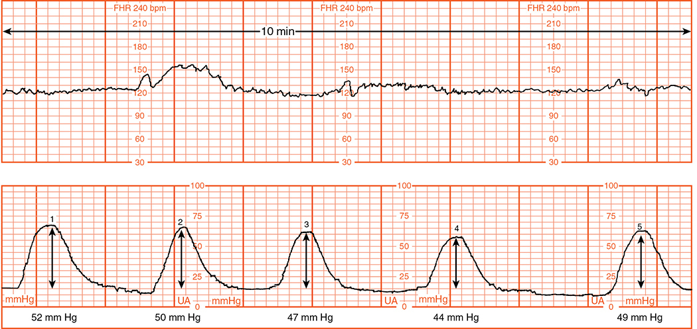
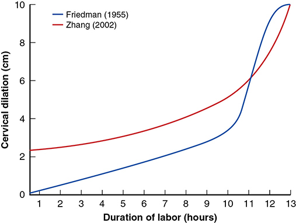
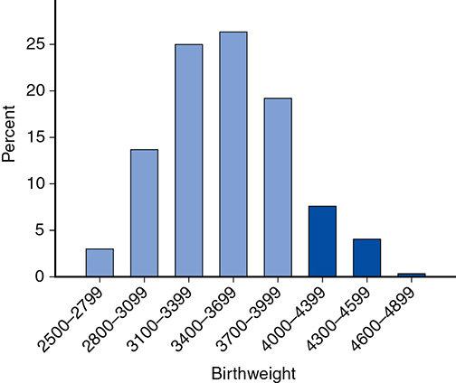
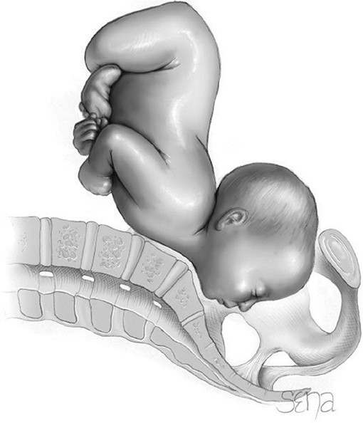
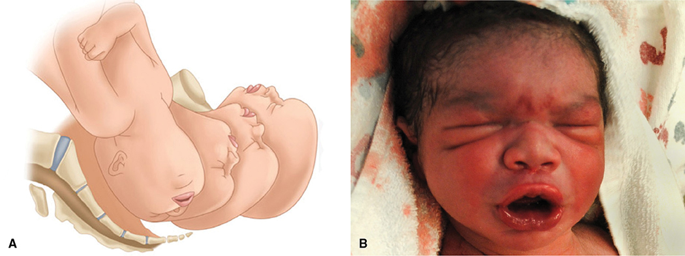
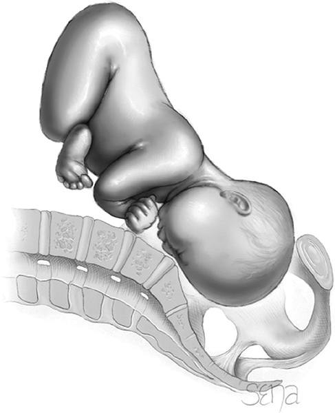
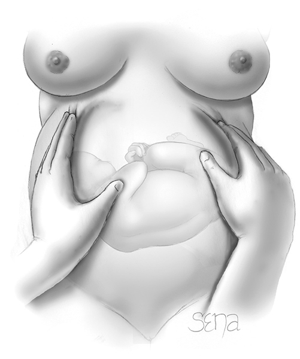
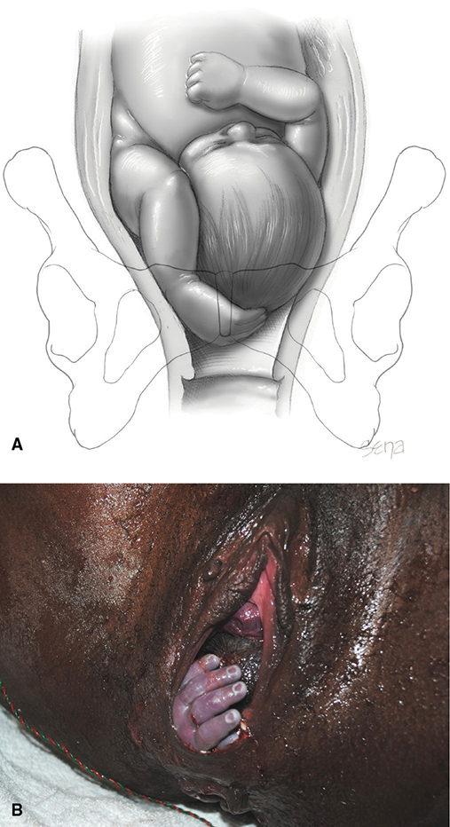

# Chapter 23: Abnormal Labor — Revision Notes

> Williams Obstetrics 26e, pp. 1102–1137 of the PDF. High-yield numbers are in **bold**.
> The two tables are transcribed from the PDF images (they are missing from the extracted chapter text). All 8 figures are included from the PDF.

**Big picture:** Labor arrest, malpresentation and fetal jeopardy cause a large share of **primary cesareans**. Dystocia = the **3 Ps**: **Powers** (uterine contractions, maternal pushing), **Passenger** (fetal presentation, position, size, anomalies), **Passage** (bony pelvis, soft tissues). Know the **traditional vs ACOG/SMFM Consensus (2019) criteria** for labor arrest, pelvic contraction thresholds, and malpresentations.

---

## 1. Dystocia
- **Dystocia** = "difficult labor": **abnormally slow progress**.
- **Uterine dysfunction** = contractions too weak or uncoordinated to efface and dilate the cervix. Pushing may also be inadequate in the 2nd stage.

### Table 23-1. Some Causes of Dystocia in Term Vertex Singletons

| Fetal characteristics | Intrapartum findings | Maternal characteristics |
|---|---|---|
| Presentation: face, brow, sinciput | Hydramnios | Nulliparity |
| Position: OT, OP, asynclitism | Chorioamnionitis | Increasing age |
| Macrosomia | Neuraxial analgesia | Obesity |
| Anomaly: sacrococcygeal teratoma, hydrocephalus, craniofacial tumor, anencephaly | Higher station at labor onset | Large leiomyoma |
| | Poor maternal pushing: sedation, severe pain, dense regional block, neurologic disease | Uterine müllerian anomaly |
| | | Anthropoid, android, or platypelloid pelvis types |
| | | Narrow pelvic diameters |
| | | Short stature |
| | | Pelvic tumor |
| | | Prior pelvic fracture |

*OP = occiput posterior; OT = occiput transverse.*

### CPD and "failure to progress"
- **Cephalopelvic disproportion (CPD)** = obstruction from a head–pelvis mismatch. The term dates from **rickets**-era pelvic contracture. **Absolute disproportion is now rare**; most cases are **malposition (asynclitism)**.
- CPD is a **tenuous diagnosis**: **50–75%** of women with cesarean for CPD later **deliver even larger babies vaginally**.
- **Failure to progress** = no progressive dilation or halted descent (spontaneous or stimulated labor).

---

## 2. Abnormalities of the Expulsive Forces

### Types of uterine dysfunction
- Contractions start from spontaneous action potentials; **no single pacemaker** identified. Normal labor shows a rising and falling **gradient** of activity.
- Normal contractions reach **~60 mm Hg**. **Minimum pressure to dilate the cervix = 15 mm Hg.**

| | **Hypotonic** (more common) | **Hypertonic / incoordinate** |
|---|---|---|
| Basal tone | **Normal** | **Raised appreciably** |
| Gradient | Normal, **synchronous** | **Distorted** |
| Problem | Contraction pressure too low to dilate the cervix | Uncoordinated |

### Risk factors
- **Neuraxial analgesia:** longer 1st and 2nd stages, but with modern methods the effect is blunted and **cesarean rates are not higher** (Ch 25).
- **Chorioamnionitis:** linked to prolonged labor (cause or consequence). Monitor progress; **augmenting protracted labor is prudent**.
- **Higher station at labor onset** → more dystocia, but most unengaged nulliparas still deliver vaginally (especially parous women).
- **Maternal age:** dystocia rises proportionally, even after adjustment.
- **Obesity:** lengthens the 1st stage by **30–60 min in nulliparas**; more dystocia-related cesareans; likely a biological effect on parturition.

---

## 3. Labor Disorders

### Table 23-2. Abnormal Labor Patterns, Diagnostic Criteria, and Methods of Treatment

| Labor phase: disorder | Traditional — Nulliparas | Traditional — Multiparas | Traditional treatment | Obstetric Care Consensus criteria |
|---|---|---|---|---|
| **LATENT PHASE — Prolongation disorder** | | | | |
| Prolonged latent phase | **>20 h** | **>14 h** | Supportive care; oxytocin or amniotomy; **CD not indicated** | Supportive care; oxytocin or amniotomy; **CD not indicated** |
| **ACTIVE PHASE — Protraction disorders** | | | | |
| Protracted active-phase dilation | **<1.2 cm/h** | **<1.5 cm/h** | Expectant care; CD for CPD | **CD not indicated** |
| Protracted descent | **<1 cm/h** | **<2 cm/h** | Expectant care; CD for CPD | **CD not indicated** |
| **ACTIVE PHASE — Arrest disorders** | | | | |
| Prolonged deceleration phase | **>3 h** | **>1 h** | CD for CPD; no CPD: oxytocin | CD indications: **ruptured membranes AND no progress after 4 h of adequate contractions, OR no progress after 6 h of inadequate contractions despite oxytocin** |
| Secondary arrest of dilation | **>2 h** | **>2 h** | (same) | (same) |
| Arrest of descent | **>1 h** | **>1 h** | (same) | (same) |
| Failure of descent | No descent in deceleration phase or second stage | (same) | (same) | (same) |

*CD = cesarean delivery; CPD = cephalopelvic disproportion. Sources: ACOG 2019b; Cohen 1983. The printed multipara protracted-dilation value reads "1.5 cm/hr" without the "<" sign; it is a rate threshold, so "<1.5 cm/h" is intended. Note the text quotes the older protraction definition as "<1 cm/h for ≥4 h", while the table gives <1.2 cm/h (nullipara).*

### Latent-phase prolongation
- **>20 h nullipara, >14 h multipara** (Friedman).
- Some stop contracting (**false labor**); the rest are often treated with **amniotomy and oxytocin**.
- Uterine dysfunction in the latent phase is hard to diagnose (often retrospective). Women not yet in active labor are **often wrongly treated** for dysfunction.

### Active-phase disorders
- **Protraction** = slow progress; **arrest** = halted progress. **Must be in the active phase** to diagnose either.
- **ACOG/SMFM Obstetric Care Consensus (2019): "Safe Prevention of the Primary Cesarean Delivery"** — a response to a US cesarean rate of **nearly ⅓**. WHO (2018) also revised its guidance. Controversial.

**Protraction**
- Previously **<1 cm/h for ≥4 h** (adapted from Cohen and Friedman).
- Treatment = **observation**. If hypotonic contractions are suspected → **amniotomy + internal monitors** → reassess. Deficient Montevideo units + poor progress → **oxytocin**.
- **Slow but progressive 1st-stage labor is NOT an indication for cesarean.**

**Arrest**
- **Active-phase arrest = no dilation for ≥2 h**: **5% of term nulliparas** (unchanged since the 1950s).
- **Inadequate contractions (<180 MVU) in 80%** of active-phase arrest.
- With effective oxytocin: **90% reach 200–225 MVU**, **40% reach ≥300 MVU** → minimum uterine activity should be reached before cesarean for dystocia.
- **Classic criteria (Rouse 1999):** latent phase complete with cervix **≥4 cm** + **≥200 MVU per 10 min for ≥4 h** without cervical change.

**Montevideo units (MVU)** = sum over a **10-minute window** of (peak − baseline pressure) for each contraction.

*Figure 23-1. Montevideo units: five contractions of 52 + 50 + 47 + 44 + 49 mm Hg above baseline in 10 min = 242 MVU.*

### Obstetric Care Consensus — four 1st-stage recommendations
1. **Prolonged latent phase is not by itself an indication for cesarean.**
2. **Slow but progressive labor (protraction) is not an indication for cesarean** → observe, assess, stimulate as needed.
3. **Active labor begins at 6 cm, not 4 cm**; don't apply active-phase standards before 6 cm. (**WHO 2018 uses 5 cm**; other large studies show acceleration after 5 cm.)
4. **Cesarean for active-phase arrest:** **≥6 cm with ruptured membranes** and no progress despite **4 h of adequate contractions**, or **≥6 h of oxytocin** with inadequate contractions.

**Why 6 cm? Friedman vs Zhang**

| | Friedman (1955/1978) | Zhang (2002; cohort 1992–96) |
|---|---|---|
| Population | Spontaneous labor; neuraxial analgesia and oxytocin **rare** | **~50%** had neuraxial analgesia or augmentation |
| Curve | Sigmoid; steep active phase from ~3–4 cm | **Slow from 4 to 6 cm, accelerates after 6 cm**; the active-phase curve flattens from 3–4 cm |

*Figure 23-2. Friedman (1955) vs Zhang (2002) dilation curves: Zhang's curve rises slowly until ~6 cm, then accelerates.*

**Criticism of the Consensus (Safe Labor Consortium, Zhang 2010)**
- **Retrospective** data from **19 US hospitals**, heavy statistical manipulation.
- **Excluded all cesareans and asphyxiated newborns** → lacks a neonatal safety focus.
- Came from settings with a **30% cesarean rate**, so following it may not lower rates.
- Cheng (2010): prolonged 1st stage → more cesarean and chorioamnionitis, **not** more neonatal morbidity.
- But **Harper (5030 women)** and others: **higher maternal and neonatal composite morbidity** at ≥90th percentile durations and after guideline adoption.
- **Efficacy is limited:** Thuillier (3200 vs 3000 women): cesarean for 1st-stage arrest in nulliparas **1.8% → 0.9%**, no change in multiparas, no outcome difference. Rosenbloom: cesarean rates **unchanged**.
- **Nelson (~9000 primary cesareans for dystocia, 1999–2000): median dilation at cesarean was already 6 cm.** Parkland dystocia cesarean rates 1988–2017 unchanged → the recommendations may already be in use.

### Second-stage descent disorders
- Disproportion often becomes apparent in the **2nd stage** (most cardinal movements happen here).

| | Traditional limit | + Regional analgesia | **Consensus (2019): push at least** |
|---|---|---|---|
| **Nullipara** | **2 h** | **3 h** | **3 h** |
| **Multipara** | **1 h** | **2 h** | **2 h** |

- Consensus caveat: **maternal and fetal status must be reassuring**. Longer may be fine **if progress is documented**. **No maximum** second-stage length has been identified.
- **Maternal risks rise with length:** chorioamnionitis, **anal sphincter injury**, **operative vaginal birth**, **PPH**.
- **Neonatal safety:** no robust data. Several studies show **serious newborn complications with 2nd stage >3 h**; adjusted studies show no difference; absolute numbers small but some outcomes severe. **RCTs needed.**
- **Nelson (12,523 Parkland nulliparas):** 2nd stage lengthens with 1st-stage length. **95th percentiles: 1st stage 15.6 h, 2nd stage 2.9 h.** 1st stage >15.6 h → **16%** had a 2nd stage ≥3 h vs **4.5%** otherwise.

### Maternal pushing efforts
- Uterine + abdominal muscle force propels the fetus. Pushing may be weakened by **heavy sedation or regional analgesia** → allow time for these to wear off.
- If pain overrides the urge to push: support and encouragement, **parenteral analgesia, pudendal block, or neuraxial analgesia** (depending on station).

---

## 4. Prematurely Ruptured Membranes at Term
- **ROM at term without contractions: ~8%** of pregnancies. Previously, stimulation was begun after **6–12 h**.
- **Hannah/Peleg RCT (TERMPROM; 5042 women, ~1200 per arm):** induction vs expectant; oxytocin vs PGE₂ gel.
  - **IV oxytocin induction preferred** → **fewer intrapartum and postpartum infections**. **Cesarean rates the same.**
  - Expectant management **at home** worse than in hospital.
- Mozurkewich: induction → ↓ chorioamnionitis, metritis and **NICU admission**.
- **Parkland:** induce soon after confirmed term ROM.
  - Hypotonic contractions or advanced dilation → **oxytocin** (less hyperstimulation risk).
  - Unfavorable cervix, few contractions, no significant decelerations → **misoprostol (PGE₁)**.
- Prophylactic antibiotics for term ROM: benefit unclear. **ROM >18 h → GBS prophylaxis** (Ch 67).

---

## 5. Precipitous Labor and Delivery
- **Definition: expulsion of the fetus in <3 h.** **3%** of US live births (25,260 in 2013).
- **Causes:** abnormally low birth-canal resistance, abnormally strong uterine/abdominal contractions, rarely **painless contractions**.
- **Maternal:** few problems if the cervix is effaced/compliant and the vagina and perineum are lax. With a **long firm cervix and noncompliant canal** → **uterine rupture**, extensive **cervical, vaginal, vulvar or perineal lacerations**, and here **amnionic fluid embolism** is most likely. Often followed by **uterine atony**.
- More common in **multiparas** with contractions **<2 min apart**. Linked to **cocaine**, **abruption**, meconium, PPH and low Apgar scores.
- **Neonatal:** ↓ uteroplacental flow (little relaxation) → hypoxia; rarely intracranial trauma; **Erb/Duchenne palsy** — precipitous 2nd stage in **⅓ of 22 cases**; falls during unattended birth; delayed resuscitation.
- **Treatment:**
  - Analgesia is unlikely to help; **tocolytics (MgSO₄, terbutaline) unproven**.
  - **Single IM terbutaline 250 µg** may be reasonable for a nonreassuring FHR (balance against **atony** if delivery is imminent).
  - **Stop oxytocin.**

---

## 6. Fetopelvic Disproportion

### Pelvic capacity (normal anatomy Ch 2)

| Level | Contracted if | Notes |
|---|---|---|
| **Inlet** | **AP (obstetrical conjugate) <10 cm** or **transverse <12 cm**; **diagonal conjugate <11.5 cm** | Diagonal conjugate is **~1.5 cm longer** than the obstetrical conjugate. Both diameters short → much more dystocia |
| **Midpelvis** (most common) | **Interspinous + posterior sagittal ≤13.5 cm** (normal 10.5 + 5 = **15.5 cm**). **Interspinous <10 cm = suspect; <8 cm = contracted** | Causes **transverse arrest** → difficult midforceps or cesarean |
| **Outlet** | **Intertuberous diameter ≤8 cm** | Found in **~1%** of nulliparas; rarely alone (usually with midpelvic contraction). ↑ **perineal tears** |

**Contracted inlet**
- Term BPD averages **9.5–9.8 cm**, so an inlet AP diameter <10 cm may be impassable.
- **Diagonal conjugate:** index finger to the sacral promontory (palm lateral); distance from fingertip to where the lower symphysis meets the finger base.
- Small women tend to have small babies: **Thoms (362 nulliparas)** — birthweight **280 g lower** with a small pelvis.
- **Consequences:**
  - Head arrested at the inlet → contraction force acts on the membranes over the cervix → **early spontaneous ROM**.
  - After ROM, no head pressure on the cervix → **less effective contractions**, slow or no dilation. (Better fetal–pelvic adaptation → more efficient contractions.)
  - Head floats or lies in an iliac fossa → **face and shoulder presentations and cord prolapse** are more frequent.

**Contracted midpelvis**
- Obstetrical plane: inferior symphysis → **ischial spines** → sacrum at **S4–S5**. The interspinous line divides it into anterior and posterior parts.
- **Average midpelvis: interspinous 10.5 cm; AP (lower symphysis → S4–S5) 11.5 cm; posterior sagittal 5 cm.**
- No precise manual measurement. Suspect contraction if **spines are prominent, sidewalls converge, or the sacrosciatic notch is narrow**.
- A narrow intertuberous diameter predicts a narrow interspinous one (the reverse is not reliable).

**Contracted outlet**
- Outlet = **two triangles** sharing the **intertuberous base**. Anterior triangle: pubic rami, apex at the inferoposterior symphysis. Posterior: no bony sides; apex = **tip of the last sacral vertebra (not the coccyx)**.
- Narrow anterior triangle → head forced **posteriorly** onto the ischiopubic rami → perineum overdistended → **lacerations**.

**Pelvic fractures**
- Mostly **car collisions**. Fracture pattern, minor malalignment and retained hardware are **not absolute indications for cesarean**.
- Healing takes **8–12 wk** → **recent fracture merits cesarean**. Healed: review radiographs ± pelvimetry late in pregnancy.

### Radiological and clinical assessment
- Current practice = **digital pelvic exam** only.
- **X-ray pelvimetry** (cephalic): **poor** prediction of CPD. **MRI pelvimetry**: not accurate enough.
- **Fetal size alone is seldom the cause:** Parkland — **⅔ of newborns delivered by cesarean after failed forceps weighed <3700 g**; only **12% >4000 g**. → **Head malposition** (asynclitism, OP, face, brow, sinciput) is the usual obstruction.
- **Mueller-Hillis maneuver** (push the head into the inlet through the abdomen) → **poorly predicts dystocia**.
- Radiographic head measurement suffers from parallax. **Sonographic BPD/HC, fetal–pelvic index** → poor sensitivity for CPD.

*Figure 23-3. Birthweights of 362 newborns delivered by cesarean after failed forceps (Parkland): only 12% weighed >4000 g (dark bars).*

---

## 7. Face Presentation
- **Neck hyperextended**, occiput against the back, **chin (mentum)** presents. **~0.1%** of births.
- **Causes (favor extension or prevent flexion):**
  - **Preterm** fetus (engages before converting), **multifetal** gestation
  - **High parity** (pendulous abdomen lets the back sag forward)
  - **Fetal malformations, hydramnios**; **anencephaly** naturally presents by the face
  - **Contracted pelvis or very large fetus** — Hellman (141 cases): **inlet contraction in 40%**
- **Diagnosis:** vaginal exam of facial features.

| Face | Breech (mimic) |
|---|---|
| Bony, unyielding **jaws and palate** through the mouth | **Muscular resistance** of the anus; finger may be **meconium-stained** |
| Mouth + malar eminences form a **triangle** | Ischial tuberosities + anus form a **straight line** |

- Sonography helps; radiographs (rare) show a hyperextended head with facial bones at/below the inlet.

### Mechanism of labor
- Chin may be anterior, transverse or posterior. **Most mentum posterior positions rotate anteriorly**, even late in the 2nd stage.
- **Mentum anterior:** chin rotates under the symphysis → chin and mouth appear → once the chin clears the symphysis, the **neck flexes** → nose, eyes, brow, occiput born over the perineum → occiput sags toward the anus → external rotation → shoulders.
- **Mentum posterior (persistent): vaginal birth impossible** — the short neck can't span the sacrum and the brow presses on the symphysis (no flexion possible). Only exception: **extremely small or macerated fetus**.
- Facial **edema and bruising** are common but temporary.

*Figure 23-4. Face presentation, chin directly posterior: vaginal delivery is impossible unless the chin rotates anteriorly.*

*Figure 23-5. (A) Mechanism for right mentoanterior. (B) Swollen eyes and lips after face presentation are common and transient.*

### Management
- **External FHR monitoring** (avoid face/eye injury from a scalp electrode).
- **Cesarean rates are substantially higher** (associated inlet contraction).
- **Low or outlet forceps** are acceptable for **mentum anterior** (Ch 29). **Vacuum is NOT recommended** (eye trauma).
- ⚠️ **Do not attempt conversion**: manual conversion to occiput, rotating a posterior chin, or internal podalic version and extraction are **dangerous**.

---

## 8. Brow Presentation
- Part of the head between the **orbital ridge and anterior fontanel** presents; head midway between full flexion and full extension. **0.1–0.2%** of births.
- Risks mirror face presentation. **Usually unstable → converts to face or occiput.**
- **Diagnosis:** abdomen — both occiput and chin palpable easily; vaginal — **frontal sutures, anterior fontanel, orbital ridges, eyes, root of the nose**, but **no mouth or chin**.
- **Persistent brow: engagement and delivery impossible** (unless small head or large pelvis) until **marked molding shortens the occipitomental diameter**, or more often the neck flexes or extends.
- Molded head: caput over the forehead (may hide landmarks); **forehead prominent and squared**.
- Management = as for face presentation.

*Figure 23-6. Brow posterior presentation: the head lies midway between flexion and extension, presenting the widest (occipitomental) diameter.*

---

## 9. Transverse Lie
- Fetal long axis **~perpendicular** to the mother's. **Shoulder** over the inlet; head in one iliac fossa, breech in the other.
- Named by the **acromion** side (right/left acromial) and back: **dorsoanterior / dorsoposterior**, back up / back down.
- **~0.3%** of births.
- **Causes:** **high parity (lax abdominal wall)**, **preterm fetus**, **placenta previa**, abnormal uterine anatomy, **hydramnios**, **contracted pelvis**.

### Diagnosis
- Often by **inspection**: abdomen unusually **wide**, fundus only slightly above the umbilicus.
- No fetal pole in the fundus; ballottable head on one side, breech on the other.
- **Back anterior:** hard plane across the front. **Back posterior:** irregular small parts.
- Vaginal: **ribs** (parallel), then **scapula and clavicle** on opposite sides. The **axilla** points to the side the shoulder faces.

*Figure 23-7. Transverse lie, right acromiodorsoanterior, on Leopold palpation.*

### Mechanism
- **Persistent transverse lie → spontaneous delivery of a term-size fetus is impossible.**
- After ROM → shoulder forced into the pelvis, **arm often prolapses** → shoulder **impacted** → vigorous contractions → contraction ring rises (**Bandl ring**) → **neglected transverse lie → uterine rupture**.
- Increased morbidity also from **placenta previa, cord prolapse** and **fetal manipulation at cesarean**.
- **Exception:** fetus **<800 g** + large pelvis → delivers doubled up (**conduplicato corpore**): chest wall below the shoulder leads; head and thorax pass together.

### Management
- **Active labor → cesarean.**

| Back position | Incision |
|---|---|
| **Dorsoanterior / back down** | Neither feet nor head in the lower segment → **vertical hysterotomy** usually indicated |
| **Dorsoposterior / back up** | Feet reachable through a **low transverse incision** → breech extraction |

- **Before or early in labor, membranes intact → try ECV.** Success is high and **exceeds that for breech** (Ch 28).

---

## 10. Umbilical Cord Prolapse
- **0.1–0.2%** of births. More common with a **contracted pelvis**.
- **Risks** (mostly an **unengaged presenting part**): **hydramnios, breech, transverse lie, fetus <2500 g/preterm, PPROM, multifetal gestation**. Less often: grand multiparity, distorting leiomyoma, müllerian anomaly.
- **Funic presentation** (cord is the presenting part) = potent risk → **cesarean before labor**.
- **Diagnosis:** clinical — cord loop felt below or beside the head.
- **Management:**
  1. **Manually elevate the presenting part** to relieve compression
  2. **Rapid transfer to the OR** for cesarean
  3. Rarely, vaginal or operative vaginal birth if it can be done **much faster** than emergent cesarean (RCOG)

---

## 11. Compound Presentation
- An **extremity prolapses beside the presenting part**. Hand/arm beside the head **1 in 700** (Goplerud and Eastman); Parkland **68 in >70,000 ≈ 1 in 1000**. Legs beside the head or a hand beside a breech are much rarer.
- Causes = anything that prevents occlusion of the inlet (as for other malpresentations).
- **Management:**
  - **Usually leave it alone** — it seldom impedes labor and often retracts as the head descends.
  - If it blocks descent: push the part up gently while pushing the head down with **fundal pressure**. A co-presenting hand may retract if **pinched**.
- ↑ Perinatal morbidity/mortality comes mainly from **preterm birth, cord prolapse and traumatic procedures**. Rare **forearm ischemia → amputation**.

*Figure 23-8. Compound presentation: (A) left hand in front of the vertex, often retracts with labor; (B) 34-wk fetus delivered hand-first without complication.*

---

## 12. Complications of Dystocia

**Maternal**
- **Infection:** intrapartum **chorioamnionitis**, postpartum **endomyometritis**.
- **PPH from atony** (prolonged and augmented labors).
- **Uterine tears** at 2nd-stage cesarean with an **impacted head**.
- **Uterine rupture:** the lower segment overstretches when descent arrests → exaggerated retraction ring → **pathological retraction ring of Bandl** = sharp indentation signalling **impending lower-segment rupture** (rare today).
- **Fistulas:** head wedged in the pelvis → pressure necrosis → **vesicovaginal, vesicocervical, rectovaginal fistulas** appearing **days after delivery**; usually after a **very prolonged 2nd stage**; mostly in under-resourced settings.
- **Lower-extremity nerve injury** after a prolonged 2nd stage: mainly **sensory**; most resolve **within 6 months** (Ch 36).

**Fetal**
- **Peripartum sepsis** rises with labor length.
- Marked **caput and molding**.
- Mechanical trauma: **nerve injury, fractures, cephalohematoma** (Ch 33).

---

## Quick-Recall: Labor Disorder Thresholds (Traditional vs Consensus)

| Disorder | Nullipara | Multipara | Consensus (ACOG/SMFM 2019) |
|---|---|---|---|
| Prolonged latent phase | >20 h | >14 h | Not an indication for CD |
| Protracted dilation | <1.2 cm/h | <1.5 cm/h | Not an indication for CD |
| Protracted descent | <1 cm/h | <2 cm/h | Not an indication for CD |
| Prolonged deceleration | >3 h | >1 h | — |
| Secondary arrest of dilation | >2 h | >2 h | CD only if ≥6 cm + ROM + no change with 4 h adequate MVU or 6 h oxytocin |
| Arrest of descent | >1 h | >1 h | Push ≥3 h (nullipara) / ≥2 h (multipara) before 2nd-stage arrest |
| Active labor starts | 4 cm (Friedman) | 4 cm | **6 cm** (WHO **5 cm**) |
| 2nd-stage limit | 2 h (3 h with regional) | 1 h (2 h with regional) | ≥3 h / ≥2 h pushing, longer if progressing |

## Quick-Recall: Malpresentations

| | Incidence | Landmark / key sign | Vaginal delivery? | Key management |
|---|---|---|---|---|
| **Face** | **0.1%** | Mouth + malar eminences (triangle) | **Mentum anterior: yes**; persistent **mentum posterior: no** | External monitoring; forceps OK, **no vacuum**; no conversion |
| **Brow** | **0.1–0.2%** | Orbital ridges, anterior fontanel, nose root; **no mouth/chin** | Not while persistent (unless small fetus) | Usually converts; as for face |
| **Transverse lie** | **0.3%** | Wide abdomen, low fundus; ribs, scapula, axilla | No (except **<800 g**, conduplicato corpore) | **ECV** early; cesarean — **vertical** incision if back down |
| **Compound** | **1 in 700–1000** | Hand beside head | Usually yes | Leave alone; pinch the hand |
| **Cord prolapse** | **0.1–0.2%** | Cord below or beside the head | Rarely, if faster | **Elevate presenting part**, emergency cesarean |

## Key Numbers to Memorize
- CPD: **50–75%** later deliver larger babies vaginally
- Contraction pressure normal **~60 mm Hg**; minimum to dilate **15 mm Hg**
- Obesity lengthens 1st stage by **30–60 min**
- Active-phase arrest (≥2 h no change): **5%** of nulliparas; **<180 MVU in 80%**
- Oxytocin: **90% reach 200–225 MVU**, **40% reach ≥300 MVU**
- Classic arrest: **≥4 cm + ≥200 MVU × ≥4 h**; Consensus: **≥6 cm + ROM + 4 h adequate or 6 h oxytocin**
- Nelson: 95th percentile **15.6 h** (1st stage), **2.9 h** (2nd stage); median dilation at dystocia cesarean already **6 cm**
- Term ROM without labor **8%**; GBS prophylaxis if ROM **>18 h**
- Precipitous labor **<3 h**, **3%** of births; terbutaline **250 µg IM**
- BPD **9.5–9.8 cm**; inlet AP **<10 cm** / transverse **<12 cm** / diagonal conjugate **<11.5 cm**; DC − 1.5 cm = OC
- Midpelvis: interspinous **10.5**, AP **11.5**, posterior sagittal **5 cm**; contracted if sum **≤13.5 cm** or interspinous **<8 cm** (suspect <10 cm)
- Outlet contracted: intertuberous **≤8 cm** (**~1%**)
- Pelvic fracture heals **8–12 wk**
- Failed forceps → cesarean: **⅔ <3700 g**, only **12% >4000 g**
- Face **0.1%** (inlet contraction **40%**); brow **0.1–0.2%**; transverse **0.3%** (spontaneous only if **<800 g**); cord prolapse **0.1–0.2%**; compound **1/700–1/1000**
- Nerve deficits resolve within **6 months**
