# Chapter 24: Intrapartum Assessment — Revision Notes

> Williams Obstetrics 26e, pp. 1138–1195 of the PDF. High-yield numbers are in **bold**.
> The five tables are transcribed from the PDF images (they are missing from the extracted chapter text). 14 of the 17 figures are included from the PDF.

**Big picture:** Electronic FHR monitoring (cardiotocography) is used in **>85%** of US births, yet it has **not lowered perinatal mortality or cerebral palsy**. Its value lies in standardized reading (NICHD definitions, 3-tier categories), recognizing the few truly ominous patterns, and knowing the in-utero resuscitation steps.

---

## 1. Electronic Fetal Monitoring

### Internal (direct) monitoring
- A **bipolar spiral electrode** is attached to the fetal scalp (wire in the scalp + metal wing as the second pole).
- The **R wave** is the most reliably detected part of the fetal ECG. The cardiotachometer computes a new rate with each R–R interval → this beat-to-beat change is now called **baseline variability**.
- **Premature atrial contractions** → erratic **"spiking"** on the tracing.
- The maternal ECG is attenuated through the scalp electrode, so it normally doesn't appear. **If the fetus is dead, the electrode picks up and records the maternal heart rate** → a dead fetus can appear to have a "normal" rate.

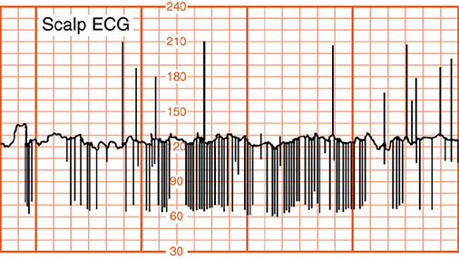

*Figure 24-3. Scalp-electrode tracing: spiking of the fetal rate reflects premature atrial contractions.*

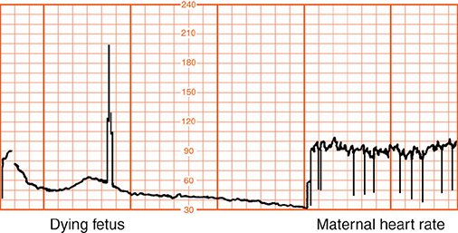

*Figure 24-4. Placental abruption: bradycardia of the dying fetus, then the maternal ECG is recorded after fetal death.*

### External (indirect) monitoring
- **Doppler ultrasound** through the maternal abdomen. Coupling gel is needed (air conducts ultrasound poorly).
- **Autocorrelation:** a microprocessor compares each signal with the previous one; FHR is regular while noise is random.
- Avoids membrane rupture but is **less precise**. More unmonitored time in **obese women**; wireless abdominal ECG patch systems may help and allow mobility.

### Scaling and interpretation
- **NICHD standard:** vertical **30 bpm/cm** (range 30–240 bpm); paper speed **3 cm/min**.
- Interpret trends over time, not just the current 5–30-min segment.
- Standard NICHD definitions (2008; adopted by ACOG) **improve interobserver agreement**.

### Table 24-1. Electronic Fetal Monitoring Definitions

| Pattern | Definition |
|---|---|
| **Baseline** | Mean FHR rounded to increments of **5 bpm** during a **10-min segment**, excluding periodic/episodic changes, periods of marked variability, and segments that differ by >25 bpm. Baseline must be present for **≥2 min** in any 10-min segment, or it is indeterminate (then refer to the prior 10-min window). **Normal 110–160 bpm. Tachycardia >160 bpm. Bradycardia <110 bpm.** |
| **Baseline variability** | Fluctuations in baseline FHR, irregular in amplitude and frequency; quantified as peak-to-trough amplitude. **Absent:** undetectable. **Minimal:** detectable but **≤5 bpm**. **Moderate (normal): 6–25 bpm.** **Marked: >25 bpm.** |
| **Acceleration** | Visually apparent **abrupt** increase (onset to peak **<30 s**). **≥32 wk:** peak **≥15 bpm** above baseline, lasting **≥15 s but <2 min**. **<32 wk:** peak **≥10 bpm**, lasting **≥10 s but <2 min**. Prolonged acceleration: **≥2 min but <10 min**. **≥10 min = baseline change.** |
| **Early deceleration** | Visually apparent, usually symmetrical **gradual** decrease and return of FHR with a contraction. Gradual = onset to nadir **≥30 s**. Decrease measured from onset to nadir. **Nadir coincides with the contraction peak**; onset, nadir and recovery coincide with the beginning, peak and end of the contraction. |
| **Late deceleration** | Visually apparent, usually symmetrical **gradual** decrease and return with a contraction (onset to nadir **≥30 s**). **Delayed in timing: nadir occurs after the contraction peak**; onset, nadir and recovery occur after the beginning, peak and end of the contraction. |
| **Variable deceleration** | Visually apparent **abrupt** decrease (onset to beginning of nadir **<30 s**). Decrease **≥15 bpm**, lasting **≥15 s and <2 min**. Onset, depth and duration commonly **vary with successive contractions**. |
| **Prolonged deceleration** | Visually apparent decrease below baseline of **≥15 bpm**, lasting **≥2 min but <10 min**. **≥10 min = baseline change.** |
| **Sinusoidal pattern** | Visually apparent, smooth, sine wave–like undulating baseline with a cycle frequency of **3–5/min** persisting **≥20 min**. |

*The printed table defines prolonged deceleration as "less than 2 minutes in duration", an obvious typo; the chapter text and Table 24-2 give ≥2 min but <10 min, as shown above. FHR = fetal heart rate.*

---

## 2. Baseline Fetal Heart Activity

### Rate
- From **16 wk**, FHR falls **~1 bpm/week** (maturing vagal control); mean **85 bpm by age 8 years**.
- Balance of **sympathetic (accelerator)** and **parasympathetic/vagal (decelerator)** tone, plus chemoreceptors (hypoxia, hypercapnia). Prolonged hypoxia + lactic acidemia → extended fall in rate.

**Bradycardia (<110 bpm)**

- **100–119 bpm without other changes** usually does not mean compromise (2% of monitored pregnancies, mean ~50 min). Often from **OP/OT head compression**, especially in the 2nd stage.
- Pathological causes: **congenital heart block**, fetal hypoxia (e.g., **abruption**, Fig. 24-4).
- **Maternal hypothermia** → fetal bradycardia without apparent harm.

**Tachycardia (>160 bpm)**

- **Most common cause = maternal fever** (may precede the fever). Not harmful by itself unless fetal sepsis or significant decelerations.
- Others: fetal compromise, arrhythmias, **atropine** (parasympathetic blocker), **terbutaline** (sympathomimetic).
- **Concomitant decelerations** are the key sign that tachycardia reflects compromise.

### Baseline variability
- The **most important index of cardiovascular function**: sympathetic/parasympathetic "push and pull" via the SA node. Increases with gestational age.
- **↑ variability:** fetal breathing and body movements; active awake state (4F). Marked variability linked to abnormal cord gases but not ↑ neonatal morbidity.
- **↓ variability (absent/minimal):**
    - **Reduced baseline variability is the single most reliable sign of fetal compromise.** It reflects **metabolic acidemia** (depressed brainstem/heart) rather than hypoxia alone.
    - **Moderate variability → normal cord pH in 98%.**
    - Absent/minimal variability predicts cord pH **<7.15 in only 12–31%**, so it can't be used alone. Comorbid tachycardia or decelerations improve prediction.
    - Severe **maternal acidemia** (e.g., DKA) also ↓ variability.
    - **Drugs:** narcotics, barbiturates, phenothiazines, tranquilizers, general anesthetics. **IV meperidine → ↓ variability within 5–10 min, lasting ≥60 min.** Also IV butorphanol, chronic buprenorphine, **corticosteroids**, **magnesium sulfate** (no adverse neonatal effect).
- **↓ variability without decelerations** is unlikely to be hypoxia. A persistently **flat baseline** at a normal rate without decelerations may reflect a **prior** neurological insult.

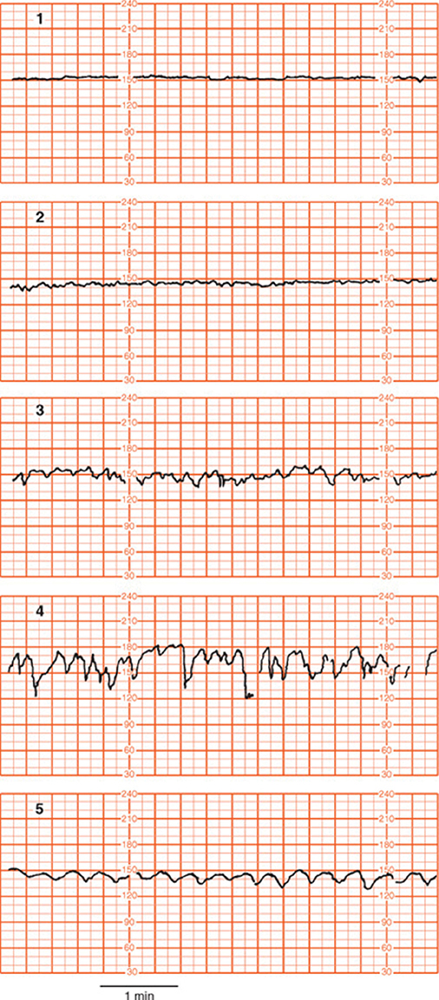

*Figure 24-5. Variability: 1 absent, 2 minimal (≤5 bpm), 3 moderate (6–25 bpm, normal), 4 marked (>25 bpm), 5 sinusoidal (excluded from variability).*

### Cardiac arrhythmia
- Suspect with bradycardia, tachycardia or, most commonly, **abrupt baseline spiking**. Documented only with a **scalp electrode** (single lead → limited).
- Arrhythmias, bradycardia <100 or tachycardia >180 bpm in **3%** of normal pregnancies at 30–40 wk.
- **Supraventricular arrhythmias** matter little in labor unless there is **hydrops** (heart failure). Many resolve after birth; some have structural defects.
- **Intermittent bradycardia → congenital heart block**, usually **complete AV block** with maternal **connective tissue disease**.
- Without hydrops, intervention doesn't improve outcome → conservative (Parkland), but uninterpretable tracings may force cesarean.

### Sinusoidal heart rate
- Sine wave–like baseline, **3–5 cycles/min for ≥20 min**.
- **True sinusoidal causes:** fetal **intracranial hemorrhage**, **severe asphyxia**, **severe fetal anemia** (alloimmunization, fetomaternal hemorrhage, TTTS, **parvovirus**, **bleeding vasa previa**).
- **Modanlou strict criteria (ominous):**
    1. Stable baseline **120–160 bpm** with regular oscillations
    2. Amplitude **5–15 bpm** (rarely more)
    3. **2–5 cycles/min**
    4. **Absent variability and accelerations**
    5. Oscillation above or below a baseline
    6. **No narcotics**
- Amplitude grading: mild 5–15, intermediate 16–24, major **≥25 bpm** (risk ↑ with amplitude).
- **Narcotic-induced** (meperidine, morphine, alphaprodine, butorphanol) sinusoidal pattern is insignificant and has a frequency of **6 cycles/min**.
- Intrapartum sinusoidal patterns are generally **not** associated with compromise → manage by clinical setting.
- **Pseudosinusoidal** = sine-like baseline + accelerations; **15%** of labors. Mild: meperidine, epidural. Intermediate: fetal sucking, transient cord compression. Transient sinusoidal pattern in **4%** of normal labors (up to 90 min).

> **Memory hook:** "Sinusoidal = **A**nemia, **A**sphyxia, **A**cute intracranial hemorrhage." Narcotics give a faster (**6/min**) benign version.

---

## 3. Periodic Fetal Heart Rate Changes
- Decelerations are **recurrent** if they occur with **≥50% of contractions in any 20 min**.

### Accelerations
- Abrupt rise, onset to peak **<30 s**; **≥15 bpm for ≥15 s** (≥32 wk) or **≥10 bpm for ≥10 s** (<32 wk); **<2 min**.
- Causes: fetal movement, contractions, cord occlusion, scalp stimulation/sampling, acoustic stimulation.
- **Virtually always reassuring** → fetus is **not acidemic at that moment**. Seen in **99.8%** of labors.
- Absence alone is not unfavorable. But if the fetus **fails to respond to stimulation** with an otherwise nonreassuring pattern, the chance of acidemia is **~50%**.

### Early deceleration
- **Gradual** fall and return that **mirrors the contraction** (nadir at contraction peak).
- Cause: **head compression → dural stimulation → vagal activation**.
- Seen at **4–7 cm**; rarely below **100–110 bpm** or 20–30 bpm below baseline.
- **Benign**: not linked to hypoxia, acidemia or low Apgar scores.

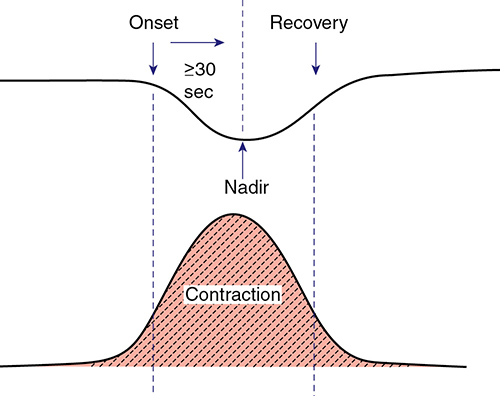

*Figure 24-6. Early deceleration: gradual (onset to nadir ≥30 s), coincides with the contraction.*

### Late deceleration
- Smooth, gradual, symmetrical fall **starting at or after the contraction peak** and recovering **after the contraction ends**. Usually shallow (**<10–20 bpm**); usually no accelerations.
- Cause: **uteroplacental insufficiency** → fetal PO₂ falls below a critical level → **chemoreceptor**-mediated. The lower the baseline PO₂, the **shorter the lag** from contraction onset.
- **The first FHR consequence of uteroplacental hypoxia.** Late decelerations **alone don't predict acidemia**; **late decelerations + ↓ variability** do. Greater **total deceleration area** best predicts acidemia.
- Causes: anything producing **maternal hypotension**, **uterine hyperactivity** or **placental dysfunction**. **Most common: epidural hypotension and oxytocin hyperstimulation.** Chronic: hypertension, diabetes, collagen vascular disease. Acute: **abruption**.

*The chapter text says a late deceleration reaches its nadir "within 30 seconds of its onset"; the figure legend and Table 24-1 define it as gradual (onset to nadir ≥30 s).*

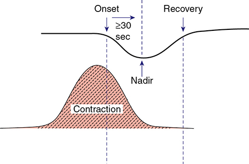

*Figure 24-7. Late deceleration: gradual, begins at or after the contraction peak and recovers after it ends.*

### Variable deceleration
- **Most frequent** deceleration in labor: **40% by 5 cm, 83% by the end of the 1st stage**.
- **Abrupt**, jagged; onset to nadir **<30 s**; depth **≥15 bpm**; lasts **15 s–2 min**; onset varies with successive contractions.
- Cause: **umbilical cord occlusion** (in lambs only after flow falls ≥50%).
- **"Shoulders"** (acceleration before/after): **partial occlusion of the thin-walled umbilical vein** → ↓ venous return → baroreceptor acceleration; then **complete occlusion (arteries too)** → fetal hypertension → **baroreceptor (vagal) deceleration**; reverse on release.
- Mediated **vagally** via baroreceptors and/or chemoreceptors.
- ACOG: recurrent variables with **minimal–moderate variability = indeterminate**; with **absent variability = abnormal**.
- **Saltatory baseline:** rapidly recurring acceleration–deceleration couplets with large oscillations; linked to cord problems (also postterm). Not ominous by itself.

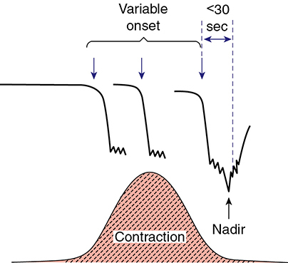

*Figure 24-8. Variable deceleration: abrupt drop (onset to nadir <30 s), ≥15 bpm for ≥15 s but <2 min; variable onset.*

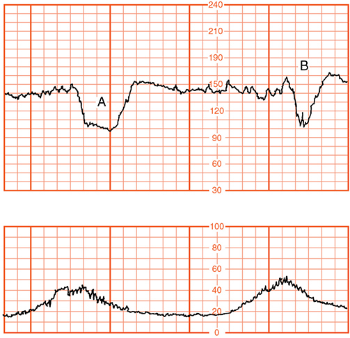

*Figure 24-9. Variable decelerations: B shows "shoulders" of acceleration, A does not.*

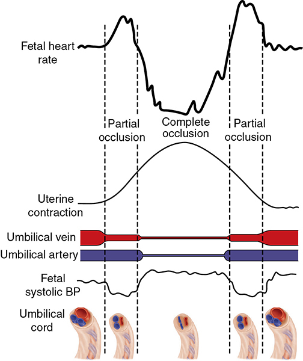

*Figure 24-10. Partial (vein) occlusion → acceleration; complete (arteries) occlusion → ↑ fetal BP → vagal deceleration.*

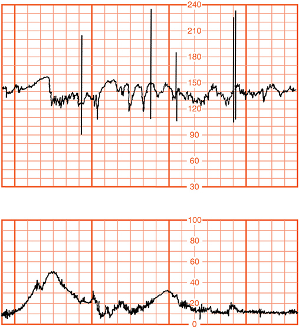

*Figure 24-11. Saltatory baseline: recurring acceleration–deceleration couplets; not ominous alone.*

### Prolonged deceleration
- Isolated fall **>15 bpm** lasting **≥2 min but <10 min**.
- **Frequent causes:** cervical exam, **uterine hyperactivity**, cord entanglement, **maternal supine hypotension**, **epidural/spinal/paracervical analgesia** (1% with epidural at Parkland).
- Others: abruption, cord knot or prolapse, maternal hypoperfusion or hypoxia, **seizures**, scalp-electrode application, impending birth, Valsalva.
- The placenta can resuscitate the fetus if the insult doesn't recur; recovery may show transient ↓ variability, tachycardia or late decelerations. **The fetus can die during prolonged decelerations** → clinical judgment.

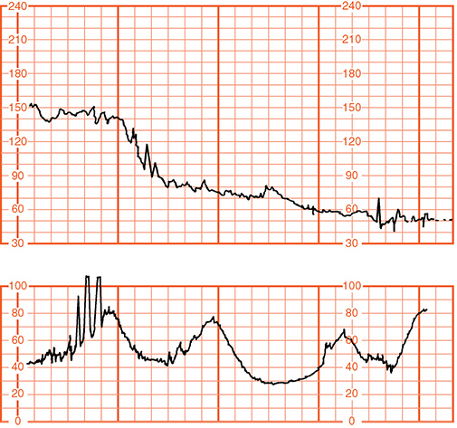

*Figure 24-12. Prolonged deceleration from uterine hyperactivity (hypertonus); FHR recovered and vaginal delivery followed.*

---

## 4. FHR Patterns in Second-stage Labor
- Decelerations are **almost universal**: only **1.4%** have none. Causes: cord and head compression (also bradycardia).
- Unpredictable: prolonged decelerations before delivery can have good outcomes or stillbirth.
- **Predictors of acidemia/morbidity:**
    - ↑ **total deceleration area in the last 120 min** (best predictor of acidemia); **+10 min of tachycardia** → best predictor of neonatal morbidity.
    - Abrupt decelerations **<100 bpm with lost variability for ≥4 min**.
- **2nd-stage decelerations + abnormal baseline (brady/tachycardia, absent variability) = ↑ risk.**

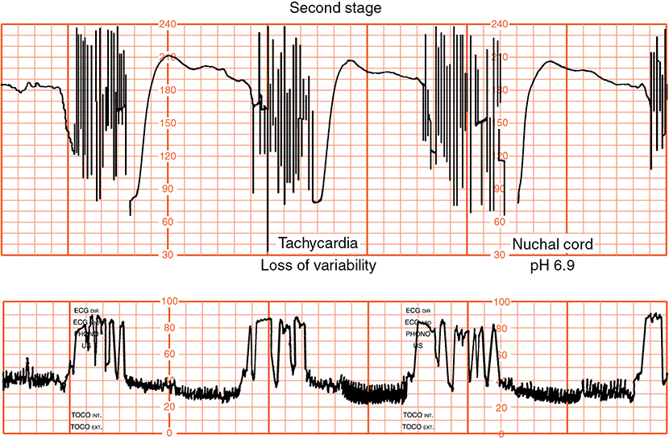

*Figure 24-13. Second-stage cord-compression decelerations with tachycardia and lost variability; cord arterial pH 6.9.*

### Computerized interpretation
- **INFANT trial:** computer decision support did **not** improve perinatal outcomes, 2-year neurodevelopment or cesarean rate. Valid in only **34%** of adverse cases (missed decelerations, ↓ variability, tachysystole).

---

## 5. Other Intrapartum Assessment Techniques

### Fetal scalp blood sampling
- Endoscope through dilated cervix after ROM; incision **2 mm** deep; heparinized capillary tube. Scalp pH ≈ **umbilical arterial** pH (lower than venous).
- ACOG: neither normal nor abnormal pH accurately predicts outcome; rarely available in the US.

| Scalp pH | Action (Zalar algorithm) |
|---|---|
| **≥7.25** | Observe labor |
| **7.20–7.25** | Repeat within **30 min** |
| **<7.20** | Repeat immediately; **deliver promptly if confirmed** |

- Only benefit: fewer cesareans for fetal distress. Sampling fell from 1.8% to 0.03% without ↑ cesareans → considered unnecessary.
- **Scalp lactate** is equivalent to pH for predicting acidemia (but ↑ cesareans).

### Scalp stimulation
- Acceleration after scalp pinch (Allis clamp) → **invariably normal pH**. No acceleration is not uniformly predictive of acidemia.
- Acceleration **>10 bpm after 15 s digital stroking → 100% had pH >7.20**; without acceleration, only **30%** had pH >7.20.
- A reliable alternative to scalp blood sampling; used for **category II** tracings.

### Vibroacoustic stimulation
- Electronic artificial larynx on or 1 cm from the abdomen. **Normal = acceleration within 15 s** + prolonged movements.
- Predicts acidosis with **variable** decelerations; **limited with late** decelerations; not useful in the 2nd stage.
- Meta-analysis: scalp pH, scalp pinch, vibroacoustic and digital stroking all similar → useful to **exclude acidemia**, but "less than perfect".

### Fetal pulse oximetry
- Sensor against the fetal face after ROM. **Lower limit of normal SpO₂ = 30%.**
- Garite: cesarean for nonreassuring status **10.2% → 4.5%**, no neonatal effect. Later trials: no consistent cesarean reduction, same outcomes → **device withdrawn in the US (2005)**.

### Fetal ECG (ST-segment analysis, STAN)
- Hypoxia → **ST elevation + ↑ T:QRS ratio** (adaptation, before neuro damage) → worsening → **biphasic ST** (myocardial hypoxia). Requires internal monitoring.
- **NICHD trial (Belfort 2015, ~11,000 women): no effect on neonatal outcome or cesarean rate.** Largely abandoned in the US; still used in Europe.

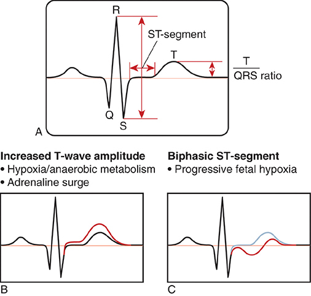

*Figure 24-14. Fetal ECG: A T:QRS ratio; B ST elevation / ↑ T wave in hypoxia; C biphasic ST with progressive hypoxia.*

---

## 6. Nonreassuring Fetal Status
- **"Fetal distress" is too vague**; use reassuring/nonreassuring **plus a description** of findings.
- FHR patterns reflect physiology more than pathology; **normal labor is a series of repeated hypoxic events**.

### Diagnosis
- Poor agreement: experts agreed on **62% of normal, 42% of suspicious, 25% of pathological** tracings; ~20% changed their own interpretation.
- **Jackson (48,444 labors):** category I in **99.5%**, II in **84.1%**, III in **0.1%**; **84%** had a mix during labor.
- ACOG/AAP: **category I or II with a 5-min Apgar >7 or normal arterial gases is not consistent with acute hypoxic-ischemic injury.**
- Criticism: **category II** is a huge heterogeneous group. Within it, **↓ variability and tachycardia** (not duration) predict asphyxia. Five-tier (Parer–Ikeda) system may be more sensitive.

### Table 24-2. Three-Tier Fetal Heart Rate Interpretation System

| Category | Criteria |
|---|---|
| **I — Normal** (all of the following) | Baseline **110–160 bpm**; **moderate** variability; late or variable decelerations **absent**; early decelerations present or absent; accelerations present or absent |
| **II — Indeterminate** (all tracings not in I or III; examples) | **Baseline rate:** bradycardia *not* accompanied by absent variability; tachycardia. **Variability:** minimal; absent *without* recurrent decelerations; marked. **Accelerations:** absence of induced accelerations after fetal stimulation. **Periodic/episodic decelerations:** recurrent variables with minimal or moderate variability; **prolonged deceleration ≥2 min but <10 min**; recurrent lates with moderate variability; variables with other features (slow return to baseline, "overshoots", "shoulders") |
| **III — Abnormal** (either) | **Absent variability AND any of:** recurrent late decelerations, recurrent variable decelerations, bradycardia; **OR sinusoidal pattern** |

*Reproduced from Macones (NICHD workshop), 2008.*

> **Memory hook:** Category III = "**Absent variability + L-V-B** (Late, Variable, Bradycardia)" or **Sinusoidal**.

### Meconium in the amnionic fluid
- Occurs in **12–22%** of labors; perinatal mortality attributable to meconium only **1/1000** live births → "low-risk" hazard.
- **Three theories:** (1) response to hypoxia; (2) normal GI maturation; (3) transient cord compression → vagal peristalsis.
- **Meconium aspiration syndrome (MAS):** linked to fetal acidemia, mostly **acute** (↑ PCO₂ → hypercarbia stimulates breathing → aspiration). Correlates: cesarean, forceps, FHR abnormalities, low Apgar, need for ventilation.
- ~Half of MAS cases are **not acidemic** at birth; **60% have cord pH ≥7.20**. **Chronic hypoxia** markers (↑ erythropoietin, ↑ nucleated RBCs) are common → MAS is often unpredictable and unpreventable.
- **No routine intrapartum oro/nasopharyngeal suctioning**, regardless of vigor; suction only for **airway obstruction**. Have a full resuscitation team present.

---

## 7. Management Options (Intrauterine Resuscitation)
- **Lateral position**, **O₂ by mask**, correct regional-analgesia **hypotension**, **stop oxytocin**, **vaginal exam** (cord prolapse, imminent delivery).
- IV **500–1000 mL lactated Ringer over 20 min**, lateral positioning and **O₂ 10 L/min** by nonrebreather each ↑ fetal O₂ saturation. But an RCT showed **O₂ vs room air: no difference** in resolving recurrent decelerations (75% vs 86%).

### Table 24-3. Some Resuscitative Measures for Category II or Category III Tracings

| Fetal Heart Rate Abnormalityᵃ | Interventionsᵇ |
|---|---|
| Recurrent late decelerations; minimal or absent FHR variability | **Initial actions:** lateral decubitus positioning; maternal oxygen; IV fluid bolus; reduce uterine contraction frequency |
| Prolonged decelerations or bradycardia; tachysystole with category II or III tracing | Initial actions **plus discontinue oxytocin or prostaglandins; consider terbutaline** |
| Recurrent variable decelerations; prolonged decelerations or bradycardia | Initial actions **plus consider amnioinfusion**; with **cord prolapse, manually elevate the presenting part** while preparing for immediate delivery |

*ᵃSimultaneous evaluation of the suspected cause(s) is also an important step. ᵇMultiple interventions at once may be appropriate and more effective than doing them individually or serially.*

### Tocolysis
- **Terbutaline 250 µg IV or SC** single dose → relaxes the uterus, improves oxygenation (fewer 5-min Apgar <7 before cesarean).
- **Nitroglycerin 60–180 µg IV** also works but ↓ MAP.
- ACOG: **insufficient evidence** to recommend routinely. Parkland uses terbutaline for **tachysystole-associated prolonged decelerations**.
- **Contraindications:** maternal cardiopulmonary disease, poorly controlled hyperthyroidism, maternal or fetal tachycardia with lost variability. Maternal β-agonist tachycardia complicates surgery.

### Amnioinfusion
- **Indicated for repetitive variable decelerations** (↓ variables, ↓ cesarean, better outcome). **Not for late decelerations.**
- **Not** recommended prophylactically for oligohydramnios, nor to **dilute thick meconium**.
- **Regimen:** **500–800 mL bolus** of warmed normal saline, then **3 mL/min** continuous (a 500-mL room-temperature bolus alone was as effective).

### Table 24-4. Complications Associated with Amnioinfusion from a Survey of 186 Obstetrical Units

| Complication | Percent |
|---|---|
| **Uterine hypertonus** | **14** |
| Abnormal fetal heart rate tracing | 9 |
| Chorioamnionitis | 4 |
| Maternal cardiac or respiratory compromise | 2 |
| Uterine rupture | 2 |
| Maternal death | 1 |
| Other: cord prolapse, abruption | 5 |

---

## 8. FHR Patterns and Brain Injury
- **70%** of neurologically impaired infants already had a **persistent nonreactive tracing on admission** → injury mostly **before arrival**. **No single FHR pattern** predicts neurological injury.
- **Myers (rhesus monkeys), total cord occlusion:** fetal arterial pH reaches **7.0 only after ~8 min**; **≥10 min** of prolonged deceleration needed before surviving fetuses had brain damage.
- Intermittent cord occlusion (e.g., 90 s every 30 min) → no necrotic brain injury; effects depend on **degree, duration and frequency**.
- Brain damage needs **profound, barely sublethal metabolic acidemia**; the intrapartum contribution to CP is **greatly overestimated**.
- **Obtain umbilical cord gases** with: cesarean for fetal compromise, **low 5-min Apgar**, severe FGR, abnormal FHR tracing, multifetal gestation.
- **Brain cooling** for neonatal HIE can reduce later CP.

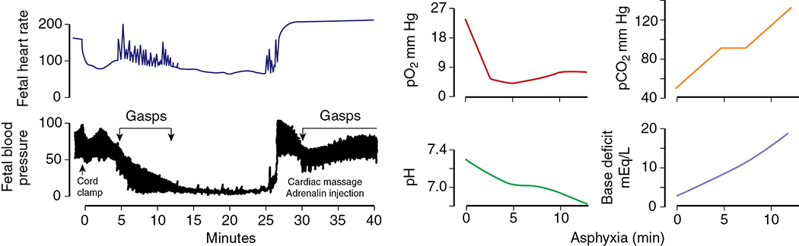

*Figure 24-15. Total cord occlusion in rhesus monkey: prolonged deceleration; pH falls to ~7.0 at 8 min as PCO₂ and base deficit rise.*

---

## 9. Benefits of Electronic FHR Monitoring
- False assumptions: fetal compromise develops slowly; all injury occurs in hospital; the "monitor" monitors.
- **Cochrane (13 RCTs, >37,000 women):** EFM → **fewer neonatal seizures** but **more cesarean and operative vaginal deliveries**; **no ↓ perinatal mortality or cerebral palsy**.
- **PPV for intrapartum death or CP ≈ zero** ("almost every positive test result is wrong").
- US epidemiological data suggest ↓ neonatal mortality, mostly in **preterm** infants (association ≠ causation).
- **Admission CTG** in low-risk women: no better outcomes, more interventions/cesareans.
- **Parkland universal vs selective EFM (>34,000):** no outcome difference; slight ↑ cesarean for fetal distress with universal monitoring.
- Cochrane: intermittent auscultation had **higher cesarean rate** than continuous monitoring (Martis 2017).

---

## 10. Current Recommendations
- **Intermittent auscultation or continuous EFM are both acceptable** in low- and high-risk pregnancies; intervals are shorter for high risk.
- Auscultation: **after a contraction, for 60 s**, with **1:1 nursing**.
- Parkland: all high-risk labors get continuous EFM.

### Table 24-5. Guidelines for Methods of Intrapartum Fetal Heart Rate Monitoring

| Surveillance | Low-Risk Pregnancies | High-Risk Pregnancies |
|---|---|---|
| **Acceptable methods** | | |
| Intermittent auscultation | Yes | Yesᵃ |
| Continuous electronic monitoring (internal or external) | Yes | Yesᵇ |
| **Evaluation intervals** | | |
| First-stage labor (active) | **30 min** | **15 min**ᵃ,ᵇ |
| Second-stage labor | **15 min** | **5 min**ᵃ,ᶜ |

*ᵃPreferably before, during and after a uterine contraction. ᵇIncludes tracing evaluation and charting at least every 15 min. ᶜTracing should be evaluated at least every 5 min.*

> **Memory hook:** "**30-15 low, 15-5 high**" (1st stage–2nd stage, in minutes).

---

## 11. Intrapartum Surveillance of Uterine Activity
- **Internal:** intrauterine pressure catheter (IUPC) with its tip above the presenting part → true pressure.
- **External:** tocodynamometer ("plunger") → **relative** intensity only.
- RCT (1456 women): internal vs external → **equivalent** operative delivery rates and neonatal outcomes.

### Patterns of uterine activity
- **Montevideo units (MVU)** = contraction intensity above baseline (mm Hg) × number of contractions in **10 min** (e.g., 3 × 50 = 150 MVU).

| Phase | Intensity | Frequency | Other |
|---|---|---|---|
| **Labor onset** | **80–120 MVU** (~3 contractions of 40 mm Hg/10 min) | — | Gradual transition, no clear onset |
| **1st stage** | **25 → 50 mm Hg** | **3 → 5 per 10 min** | Baseline tone **8 → 12 mm Hg** |
| **2nd stage** | **80–100 mm Hg** (with pushing) | **5–6 per 10 min** | — |
| **Oxytocin-augmented** | Most reach **200–225 MVU**; 40% up to **300 MVU** | — | Seek before cesarean for dystocia |

- Contraction **duration 60–80 s** is constant from active labor to 2nd stage → limit of fetal "breath holding" (intervillous exchange stops during contractions).
- **Clinical thresholds:** palpable **>10 mm Hg**; uterus easily indented **<40 mm Hg**; **painful >15 mm Hg** (distends lower segment/cervix).
- Postpartum contractions are identical to those of labor → a **poorly performing uterus in labor is prone to atony and PPH**.

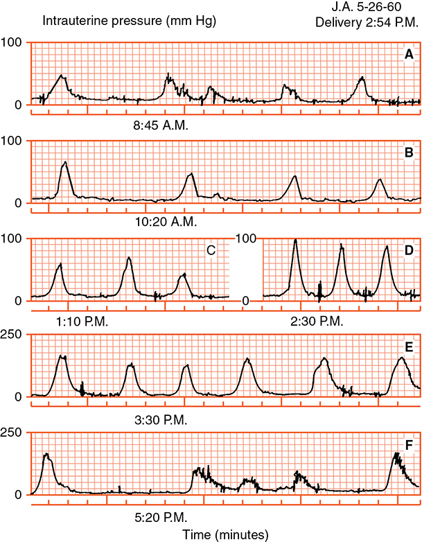

*Figure 24-17. Intrauterine pressure from prelabor (A) through late labor (D) and postpartum (E, F): activity rises progressively.*

### Uterine contraction terminology (ACOG)
- **Normal: ≤5 contractions in 10 min**, averaged over **30 min**.
- **Tachysystole: >5 in 10 min**, averaged over 30 min; applies to spontaneous or induced labor. **"Hyperstimulation" is abandoned.**
- Misoprostol study: more contractions did not ↑ adverse neonatal outcomes, but **≥6 in 10 min → ↑ FHR decelerations**.

### EFM complications
- **IUPC:** laceration of a placental fetal vessel, placental/uterine perforation → hemorrhage, abruption, spurious readings; cord entanglement.
- **Scalp electrode:** rarely severe injury; **face presentation → eye/mouth trauma**; scalp infection, rarely **cranial osteomyelitis**.
- **Relative contraindications to internal FHR monitoring:** maternal **HIV, HSV, hepatitis B and C**.

---

## Quick-Recall: FHR Pattern → Mechanism → Significance

| Pattern | Key definition | Mechanism | Significance / action |
|---|---|---|---|
| Tachycardia | >160 bpm | **Maternal fever** (most common), drugs, arrhythmia, compromise | Worrisome only with decelerations or ↓ variability |
| Bradycardia | <110 bpm | OP/OT head compression, **heart block**, hypoxia, hypothermia | 100–119 alone usually benign |
| ↓ Variability | ≤5 bpm | **Acidemia**, drugs (meperidine, MgSO₄, steroids), sleep | **Most reliable sign of compromise** |
| Acceleration | ≥15 × 15 s (≥32 wk) | Intact neuro control | **Not acidemic now** |
| Early decel | Gradual; mirrors contraction | **Head compression → vagal** | Benign |
| Late decel | Gradual; after peak | **Uteroplacental insufficiency → chemoreceptor** | Ominous with ↓ variability; stop oxytocin, correct BP |
| Variable decel | Abrupt, <30 s to nadir, ≥15 bpm, 15 s–2 min | **Cord compression → baro/chemoreceptor vagal** | **Amnioinfusion**; abnormal if absent variability |
| Prolonged decel | ≥15 bpm, 2–10 min | Hypertonus, hypotension, exam, epidural, cord prolapse | Resuscitate; fetus can die |
| Sinusoidal | 3–5 cycles/min ≥20 min | **Severe anemia**, ICH, asphyxia | Category III (narcotics: 6/min, benign) |
| Saltatory | Large accel–decel couplets | Cord problems | Not ominous alone |

## Key Numbers to Memorize
- EFM use **>85%** of US births; scaling **30 bpm/cm**, **3 cm/min**
- Baseline **110–160 bpm**, rounded to **5 bpm** over **10 min** (≥2 min of baseline); FHR falls **1 bpm/wk** from 16 wk
- Variability: absent / **≤5** / **6–25 (normal)** / **>25 bpm**; moderate variability → normal pH **98%**
- Acceleration **≥15 bpm × ≥15 s** (≥32 wk), **≥10 × ≥10 s** (<32 wk); **<2 min**; ≥10 min = baseline change
- Decel onset-to-nadir **30 s** divides gradual (early/late) from abrupt (variable); prolonged **2–10 min**; recurrent = **≥50%** of contractions in 20 min
- Sinusoidal **3–5 cycles/min for ≥20 min**; narcotic pattern **6/min**
- Variables: **40% at 5 cm, 83%** by end of 1st stage; only **1.4%** have no decels in 2nd stage
- Categories: I **99.5%**, II **84.1%**, III **0.1%**
- Scalp pH: **≥7.25** observe, **7.20–7.25** repeat in 30 min, **<7.20** deliver
- Fetal SpO₂ lower limit **30%**; terbutaline **250 µg**; nitroglycerin **60–180 µg**
- Amnioinfusion **500–800 mL** bolus + **3 mL/min**; hypertonus **14%**
- Meconium **12–22%**; MAS pH ≥7.20 in **60%**; cord pH **7.0 at ~8 min** of total occlusion, **≥10 min** for brain damage
- IA intervals: low risk **30/15 min**, high risk **15/5 min**
- MVU: labor onset **80–120**; augmented **200–225** (up to 300); contraction **60–80 s**; painful **>15 mm Hg**; tachysystole **>5/10 min**
