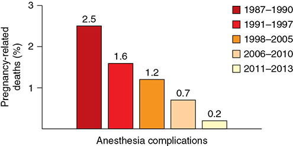
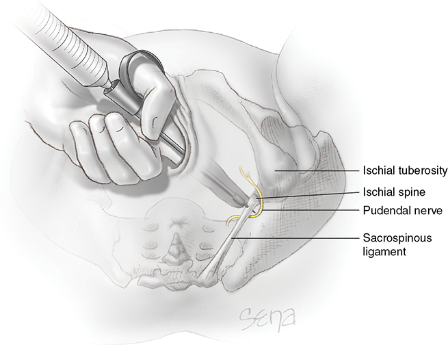
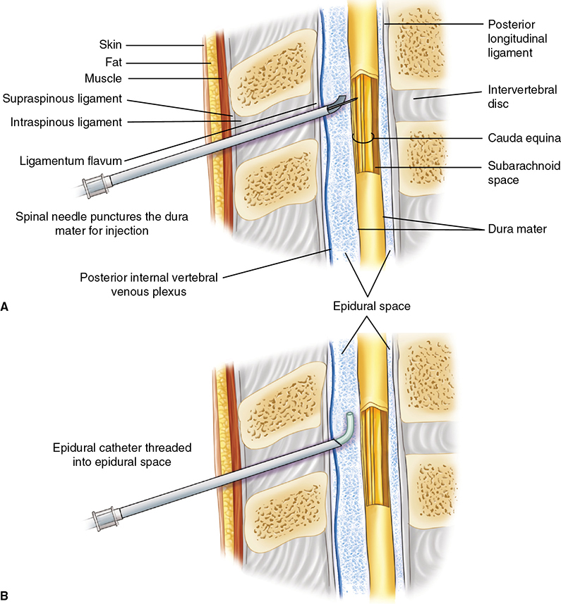
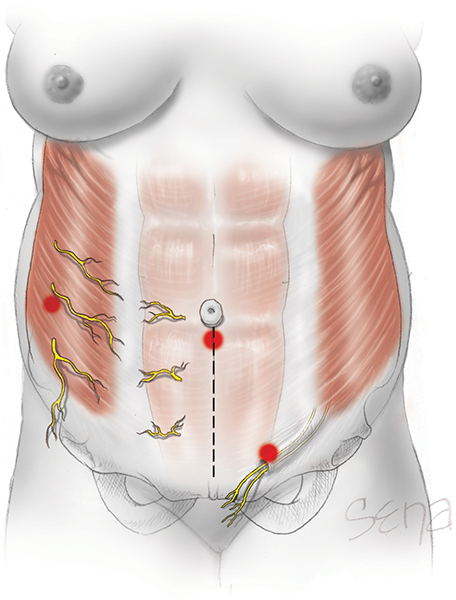

# Chapter 25: Obstetrical Analgesia and Anesthesia — Revision Notes

> Williams Obstetrics 26e, pp. 1196–1243 of the PDF. High-yield numbers are in **bold**.
> The eight tables are transcribed from the PDF images (they are missing from the extracted chapter text). All 4 figures are included from the PDF.

**Big picture:** Labor starts without warning, often on a full stomach, so **aspiration** is a constant threat. Obstetrical anesthesia is now very safe: anesthesia-related maternal mortality fell **>60%** over 40 years, mainly because of **more regional analgesia**. **Neuraxial is preferred** unless contraindicated; general anesthesia carries the risk of **failed intubation**.

---

## 1. Safety and Mortality
- **2007–2017: only 0.4% of 6765 maternal deaths** were due to anesthesia complications.
- **General anesthesia deaths:** **~⅔** from **induction problems or failed intubation** during cesarean.
- **Regional analgesia deaths:** **high block (26%)**, **respiratory failure (19%)**, **drug reaction (19%)**.
- GA's case-fatality has improved even though it is now used for the **highest-risk** women and emergencies with **decision–incision <15 min**. Fewer aspiration/hypoxic events: difficult-airway algorithms, better equipment, in-house staff.
- But **complications of regional techniques are now rising**.

*Figure 25-1. Anesthesia complications as a share of US pregnancy-related deaths: 2.5% (1987–90) → 0.2% (2011–13).*

---

## 2. General Principles

### Obstetrical anesthesia services
- Every obstetrician should be able to give **local and pudendal** blocks, but ideally an anesthesiologist/anesthetist provides pain relief.
- ⚠️ **A woman's request for labor pain relief is sufficient indication** (ACOG, ASA). Payers denying epidural reimbursement without a medical indication is **repudiated** by ACOG.

### Table 25-1. Maternal Factors That May Prompt Anesthetic Consultation

| Factor |
|---|
| Anatomical abnormalities of the face, neck, or spine |
| Thyromegaly |
| Cardiac, pulmonary, renal, hepatic, or neurological disease |
| Bleeding disorders |
| Prior anesthetic complications |
| Class III obesity (BMI ≥40 kg/m²) |
| Obstetrical complications likely to lead to operative delivery |
| Severe pregnancy-associated hypertension |
| Obstetrical hemorrhage |

*BMI = body mass index.*

**ACOG/ASA requisites (partial list)**
1. A credentialed practitioner available whenever needed, who can support vital functions in an emergency
2. Anesthesia personnel able to start a cesarean **within 30 min of the decision** (decision–incision time)
3. Anesthesia **immediately available during active labor of a TOLAC** (Ch 31)
4. A qualified anesthesiologist responsible for all anesthetics
5. A physician with obstetrical privileges for operative vaginal or cesarean delivery available during anesthesia
6. Equipment, facilities and support staff equal to a surgical suite
7. Someone other than the surgical team **immediately available to resuscitate the newborn** (Ch 32)

- Usually needs **24-hour in-house anesthesia**; hard for small units (**~40%** of obstetric hospitals have **<500 deliveries/yr**).

### Principles of pain relief

| Labor phase | Pain source | Pathway |
|---|---|---|
| **1st stage** | Uterine contractions, cervical dilation | **Visceral afferent sympathetic nerves, T10–L1** |
| **2nd stage** | Perineal stretching | **Pudendal nerve, S2–S4** |

- Pain perception is shaped by emotional, cognitive, social and cultural factors, expectations, age, education and support. Main causes of dissatisfaction: **perceived pain and delay in relief**.
- **Physiological effects of pain:**
  1. ↑ metabolic rate and O₂ use → **hyperventilation → hypocarbia**
  2. Sympathetic response → **↑ catecholamines** → ↑ CO, SVR, BP; can impair **uterine activity and uteroplacental flow**
  3. ↑ **cortisol, endorphins**
- Effective analgesia blunts these responses.

---

## 3. Analgesia and Sedation During Labor
- Goal: discomfort only at the **acme** of contractions; rest in between. Classic combination: **meperidine + promethazine** (antiemetic tranquilizer).

### Table 25-2. Typical Parenteral Analgesic Agents for Labor Pain

| Agent | Usual Dose | Frequency | Onset | Neonatal Half-Life |
|---|---|---|---|---|
| **Meperidine** | 25–50 mg (IV) | Every 1–2 h | 5 min | ~18–20 h |
| | 50–100 mg (IM) | Every 2–4 h | 30–45 min | ~60 h |
| **Fentanyl** | 50–100 µg (IV) | Every 1 h | 1 min | ~5 h |
| **Remifentanil** | 0.15–0.5 µg/kg (PCA) | Every 2 min | <1 min | 10 min |
| **Butorphanol** | 1–2 mg (IV or IM) | Every 4 h | 1–2 min (IV); 10–30 min (IM) | ~5 h |
| **Morphine** | 2–5 mg (IV); 10 mg (IM) | Every 4 h | 5 min (IV); 30–40 min (IM) | ~7 h |

*IV = intravenously; IM = intramuscularly; PCA = patient-controlled analgesia. The text gives the neonatal half-life of the metabolite normeperidine as ~72 h.*

### Parenteral agents
**Meperidine + promethazine**
- **Meperidine 50–100 mg + promethazine 25 mg IM every 2–4 h**; peak analgesia **30–45 min**. IV **25–50 mg every 1–2 h** acts almost immediately.
- Most common labor opioid worldwide; better than placebo in the 1st stage.
- **Parkland IV PCA:** bolus **50 mg meperidine + 25 mg promethazine**, then **15 mg every 10 min** as needed. **Naloxone needed in 3%** of newborns.
- Crosses the placenta; fetal depression follows peak maternal analgesia. **Normeperidine neonatal half-life ~72 h** → **other opioids are now favored** (ACOG).

**Butorphanol**
- Opioid **agonist-antagonist**; **1–2 mg IV every 4 h**. Comparable to meperidine; **less neonatal respiratory depression**.
- Side effects: somnolence, dizziness, dysphoria.
- ⚠️ **Don't give it right after meperidine** — it antagonizes meperidine.
- Can cause a **transient sinusoidal FHR pattern** (no adverse sequelae).

**Fentanyl**
- **50–100 µg IV every hour**; potent but **short-acting** → frequent doses or PCA. Butorphanol gave better initial analgesia with fewer requests for more drug or epidural.

**Remifentanil**
- **Ultrashort-acting**, by PCA through a **dedicated IV line** (a bolus can cause **apnea**).
- **Apnea in 25%** → respiratory monitoring and **1:1 nursing**. **Moderate hypoxia (SaO₂ <94%) in ¼** (RemiPCA SAFE).
- **Halved later epidural requests** vs IM meperidine.

**Safety**
- 4 of 129 anesthetic deaths were from sedation (1 aspiration, 2 inadequate ventilation, 1 overdose).
- **Naloxone** reverses neonatal opioid respiratory depression by displacing the opioid from CNS receptors. Give **after ventilation is established**.
- ⚠️ **Contraindicated in the newborn of an opioid-addicted mother** (precipitates withdrawal).

### Nitrous oxide
- **Self-administered 50% N₂O in O₂** (Entonox premixed; Nitronox blender). Valve opens only on inspiration.
- **Doesn't change epidural rates** but **improves birth satisfaction**.
- Side effects: nausea, vomiting, dizziness, drowsiness. **No difference in Apgar or cord gases.**

---

## 4. Nerve Blocks — Local Anesthetic Agents
- Onset, duration and quality ↑ with dose, concentration, volume and delivery mode. **Give incremental boluses** and watch for early toxicity; resuscitation equipment must be at hand.

### Table 25-3. Commonly Used Local Anesthetic Agents in Obstetrics

| Anesthetic Agentᵃ | Usual Concentration (%) | Usual Volume (mL) | Onset | Average Duration (min) | Maximum Dose (mg) | Clinical Use |
|---|---|---|---|---|---|---|
| **Aminoestersᵇ** | | | | | | |
| 2-Chloroprocaine | 2 | 10–20 | Rapid | 30–60 | 800 | Local infiltration or pudendal block |
| | 3 | 10–20 | | 30–60 | | Epidural for cesarean or forceps delivery |
| **Aminoamidesᵇ** | | | | | | |
| Bupivacaine | 0.0625–0.125 | 5–10 | Slow | 60–90 | 175 | Epidural for labor |
| | 0.5 | 10–20 | | 90–150 | | Epidural for cesarean |
| | 0.75 | 1.5–2 | | 60–120 | | Spinal for cesarean |
| Lidocaine | 1–1.5 | 10–20 | Rapid | 30–60 | 300 | Local infiltration or pudendal block |
| | 1.5–2 | 5–20 | | 60–90 | | Epidural for cesarean |
| | 5 | 1.5–2 | | 45–60 | | Spinal for D & C or puerperal tubal |
| Ropivacaine | 0.08–0.2 | 5–10 | Slow | 60–90 | 200 | Epidural for labor |
| | 0.5–1 | 10–30 | | 90–150 | 250 | Epidural for cesarean |

*ᵃWithout epinephrine. ᵇEsters are hydrolyzed by plasma cholinesterases and amides by hepatic clearance. D & C = dilation and curettage. From Chestnut, 2020; Lin, 2017.*

- Several concentrations and ampule sizes → **dosing errors**. Serious toxicity usually follows **inadvertent IV, subarachnoid or subdural injection**.
- **Test dose (local anesthetic + epinephrine)** before an epidural:
  - **Sudden ↑ HR or BP within 1–2 min → IV placement**
  - **Wider-than-expected block and/or dense motor block → subarachnoid or subdural placement**

### Local anesthetic systemic toxicity (LAST)

| | CNS toxicity | Cardiovascular toxicity |
|---|---|---|
| Timing | **Earlier**, at lower levels | **Later**, at higher levels — **except bupivacaine** (neuro- and cardiotoxic at **virtually identical levels**) |
| Pattern | **Stimulation → depression** | **Stimulation → depression** |
| Features | Light-headedness, dizziness, **tinnitus, metallic taste, perioral/tongue numbness**, bizarre behavior, slurred speech, fasciculations → **convulsions, unconsciousness** | **Hypertension, tachycardia** → **hypotension, arrhythmias**, ↓ uteroplacental perfusion |

**Treatment**
- **20% lipid emulsion (Intralipid)** pulls the drug off neural and myocardial membranes.
  - **>70 kg: 100-mL bolus**, repeat **once or twice every 5 min** for persistent instability; then **200 mL over 15 min**.
- **Convulsions:** airway + O₂; **lorazepam 4 mg IV slowly** (repeat once after 10–15 min) **or diazepam 5–10 mg IV every 10–15 min (max 30 mg)**. **Succinylcholine** stops the peripheral manifestations and allows intubation. **MgSO₄** (eclampsia regimen) also works.
- **Fetus:** late decelerations or bradycardia from maternal hypoxia/acidosis. **The fetus usually recovers faster in utero than after immediate cesarean** → delay delivery until maternal hypoxia and acidosis improve.
- **Hypotension:** lateral tilt, rapid crystalloid, vasopressors.
- **Cardiac arrest:** consider **bedside cesarean if no return of vital signs within 4 min**, aiming for **delivery within 5 min** (Ch 50).
- Bupivacaine is mostly used dilute epidurally; **0.75% is limited to small spinal doses**.

---

## 5. Pudendal Block
- **Pudendal nerve (S2–S4 ventral branches)** supplies the perineum, anus, vulva and clitoris. It passes **beneath the sacrospinous ligament where it attaches to the ischial spine**.
- **Technique:**
  1. Tubular introducer guides a **15-cm, 22-gauge needle**; introducer tip against the vaginal mucosa **just below the ischial spine**, needle protruding **1.0–1.5 cm**
  2. Mucosal wheal with **1 mL of 1% lidocaine**
  3. **Aspirate before every injection**
  4. Advance to the **sacrospinous ligament**, infiltrate **3 mL lidocaine**
  5. Repeat on the other side
- **Effective within 3–4 min** (pinch of lower vagina and posterior vulva painless).
- If delivery comes first and an episiotomy is needed: infiltrate **5–10 mL of 1% lidocaine** at the site.
- **Lidocaine maximum 4.5 mg/kg, not >300 mg.** Example: 50 kg × 4.5 = **225 mg = 22.5 mL of 1%**. **1% = 10 mg/mL.**
- **Not adequate** for extensive manipulation, visualizing the cervix/upper vagina, or **manual uterine exploration** → parenteral or neuraxial needed.
- **Complications:** IV injection (toxicity); **hematoma** (esp. coagulopathy); rare severe infection spreading to the **hip joint, gluteal muscles or retropsoas space**. Adding corticosteroid did **not** reduce pudendal neuralgia at 3 months.

*Figure 25-2. Transvaginal pudendal block: needle beyond the guard, through the sacrospinous ligament just below the ischial spine.*

---

## 6. Paracervical Block
- **Uterovaginal plexus** lies lateral to the uterosacral ligaments → inject just lateral to their uterine insertion.
- **1% lidocaine or 3% chloroprocaine, 5–10 mL at 4 and 8 o'clock.**
- Relieves **1st-stage** pain only (pudendal not blocked); short-acting, may need repeating.
- ⚠️ **Fetal bradycardia in ~15%**, within **10 min**, lasting **up to 30 min** — likely **uterine artery vasospasm** (↑ pulsatility index).
- **Avoid with possible fetal compromise.** **Not used at Parkland.**

---

## 7. Neuraxial Analgesia

### Overview
- Epidural, spinal, dural-puncture epidural (DPE), combined spinal–epidural (CSE).
- **~75%** of US mothers receive neuraxial analgesia. First births **68%** vs later births **57%** (vaginal deliveries).
- Antepartum education ↑ use by **30%** in Hispanic women.
- Use rises with obesity class: **I 72%, II 73%, III 76%**.
- **Anatomy:** epidural space lies just outside the dura; the **subarachnoid space** (inside the dura) holds the cauda equina and CSF. **Spinal = intrathecal.**
- **Epidural** = catheter, mainly for labor (also operative delivery). **Spinal** = single intrathecal injection, usually for operative vaginal or cesarean delivery.

*Figure 25-3. (A) Combined spinal–epidural: spinal needle through the epidural needle punctures the dura. (B) Epidural catheter threaded into the epidural space.*

---

## 8. Spinal (Subarachnoid) Block
- Advantages: **short procedure, rapid onset, high success**.
- **Subarachnoid space is smaller in pregnancy** (engorged internal vertebral venous plexus) → the **same dose gives a higher block** than when nonpregnant.
- **Hyperbaric** solution (with dextrose) is denser than CSF: **sitting → settles caudally**; lateral → more effect on the dependent side.

| Use | Level | Agent/dose |
|---|---|---|
| **Operative vaginal delivery** | **T10** (umbilicus) | **Hyperbaric lidocaine** (rapid, short) or **isobaric bupivacaine** (>1 h). Given at **full dilation** once forceps criteria are met. **Pre-hydrate with 1 L crystalloid** |
| **Cesarean** | **T4** | **Hyperbaric bupivacaine 10–12 mg** + **fentanyl 20–25 µg** (better, longer block; less shivering and referred pain) ± **intrathecal morphine 0.1–0.2 mg** (postoperative pain) |

**Intrathecal morphine monitoring (SOAP)**
- **Low dose (>50 to ≤150 µg), no risk factors:** respiratory rate and sedation checks for **12 h**.
- **Additional risk factors:** checks for **24 h** ± pulse oximetry or capnography.
- **Dose >150 µg:** same as with risk factors (24 h ± oximetry/capnography).

### Table 25-4. Complications of Neuraxial Analgesia

| Complication |
|---|
| Fever >38°C |
| Hypotension — highest with spinal analgesia (~50%) |
| Fetal heart rate abnormalities |
| High spinal level |
| Increased QT interval — with spinal analgesia in postterm pregnancies |
| Inadequate analgesia (~10%) |
| Postdural puncture headache (1–3%) |
| Nerve injury — arachnoiditis |
| Pruritus — with addition of opioids |

*From ACOG, 2019b; ASA, 2016; D'Angelo, 2014; Karahan, 2020; Maronge, 2018. The table's PDPH rate (1–3%) is higher than the text's figure for spinal analgesia (0.2–1%).*

### Hypotension
- **Sympathetic blockade → vasodilation**, worsened by **caval compression**. Placental flow may fall even without maternal hypotension when supine.
- **Treatment:** **left lateral uterine displacement**, rapid IV crystalloid, **IV vasopressors** (a systematic review: give vasopressors only if hypotensive).
- **Phenylephrine = preferred** (pure α-agonist):
  - **Better cord gases / less fetal acidosis** than ephedrine (meta-analysis of 36 RCTs: equal efficacy)
  - **More maternal bradycardia** than ephedrine or norepinephrine
  - **Prophylactic infusion** works and needs less intervention than boluses
- **Norepinephrine** may ↑ CO (β effect) but gives a **lower cord arterial pH** than phenylephrine.

### High (total) spinal blockade
- Usually from an **excessive dose**; also from a small volume in the **subdural space** (between dura and arachnoid; small, so it spreads high).
- **Rapid hypotension and apnea** → treat at once to prevent arrest:
  1. **Lateral uterine displacement**
  2. **Ventilation, preferably intubation**
  3. **IV fluids + vasopressors**

### Postdural puncture headache (PDPH)
- **CSF leak** → traction on pain-sensitive structures when upright; or compensatory cerebral vasodilation (**Monro-Kellie**).
- **Spinal: 0.2–1%** (overall ~**1 per 200 blocks**). **40%** of postpartum headache visits are from neuraxial anesthesia, mostly **within 7 days**.
- **Prevention:** **small-gauge, pencil-point needles (Sprotte, Whitacre)**, avoid multiple punctures.
- ⚠️ **No benefit** from lying flat, vigorous hydration, or a **prophylactic blood patch** within 24 h.
- **Caffeine** (cerebral vasoconstrictor): limited efficacy.
- **Severe headache → epidural blood patch (most effective):** **10–20 mL autologous blood** injected **at or below** the puncture site (spreads cephalad). Immediate relief; few complications.
- **Non-postural or persistent after a repeat patch → think of another cause:** **superior sagittal sinus thrombosis**, persistent CSF leak, **pneumocephalus**, intracranial or intraspinal **subarachnoid hematoma**.

### Other complications
- **Convulsions with PDPH:** rare, with temporary blindness (8 in 19,000 at Parkland); presumed from CSF-leak hypotension. Treat seizures + blood patch.
- **Bladder dysfunction:** obtunded sensation → postpartum **distention** (especially with large IV volumes). **Intermittent catheterization → more bacteriuria than continuous** (Millet, 146 women).
- **Arachnoiditis and meningitis:** rare thanks to **preservative-free (no methylparaben)** agents, asepsis and disposable kits.

### Table 25-5. Absolute Contraindications to Spinal Analgesia

| Contraindication |
|---|
| Refractory hypotension |
| Maternal coagulopathy |
| Thrombocytopenia <70,000/µL |
| Untreated maternal bacteremia |
| Skin infection at site of needle placement |
| Increased intracranial pressure |
| Prophylactic low-molecular-weight heparin within 12 hours |

**Other considerations**
- **Hypovolemia/hemorrhage** → spinal contraindicated (additive cardiovascular effects).
- **Severe preeclampsia:** BP may fall → **judicious dosing**. Preeclamptic women under GA needed more antihypertensives than with spinal.
- **Bleeding diatheses (von Willebrand, hemophilia):** ↑ subarachnoid hematoma risk, but neuraxial is **safe after factor replacement and normal levels**. Consult anesthesia before labor.
- **Anticoagulation (SOAP):** UFH **>10,000 U/d** → individual assessment; **prophylactic LMWH → 12-h delay; therapeutic LMWH → 24-h delay** (Ch 55).
- **Relative contraindications:** **Chiari malformation, pseudotumor cerebri** (often OK after anesthesia + neurology consultation); **severe aortic stenosis, pulmonary hypertension** (can't tolerate ↓ preload/afterload).

---

## 9. Epidural Analgesia
- Epidural space: areolar tissue, fat, lymphatics, **internal vertebral venous plexus**. Usually **lumbar** entry with an indwelling catheter → boluses or continuous infusion (patient- or caregiver-controlled). Trained L&D nurses may adjust or stop infusions under physician supervision.

| Indication | Block needed |
|---|---|
| **Labor + vaginal delivery** | **T10–S4** |
| **Cesarean** | **T4–S1** |

- Spread depends on catheter tip, dose, concentration and volume. **Septa/synechiae** or catheter **migration** can give a patchy block.
- Maintain with continuous infusion or **programmed intermittent boluses**. **Adding fentanyl or sufentanil** reduces local anesthetic → **preserves motor function**. Popular regimen: **bupivacaine 0.0625–0.125% + fentanyl 2 µg/mL**.

### Table 25-6. Technique for Labor Epidural Analgesia

| Step |
|---|
| Obtain informed consent and consult the obstetrician |
| **Monitoring:** BP every 1–2 min for 15 min after a local anesthetic bolus; continuous maternal HR during induction; continuous FHR; continual verbal communication |
| **Hydration with 500–1000 mL of Ringer lactate** |
| Woman in a **lateral decubitus or sitting** position |
| Epidural space identified by **loss of resistance** |
| Catheter threaded **3–5 cm** into the epidural space |
| After negative aspiration, **test dose: 3 mL of 1.5% lidocaine with 1:200,000 epinephrine**, injected **between contractions** (after careful aspiration and after a contraction, so labor-pain tachycardia is not confused with IV-injection tachycardia) |
| **Positive test dose (IV):** tinnitus, circumoral numbness, dizziness, **HR ↑ >20 bpm within 1 min**. **Subarachnoid:** inability to raise the legs against gravity **within 4 min** |
| If negative: **10–15 mL of 0.0625–0.125% bupivacaine** to reach a **T10** sensory level |
| After **15–20 min**, assess block (cold or pinprick). No block → replace catheter. **Asymmetric → withdraw 0.5–1.0 cm and give 3–5 mL of 0.25% bupivacaine**; still inadequate → replace |
| Position **lateral or semilateral** (avoid aortocaval compression) |
| Then **BP every 5–15 min**; continuous FHR |
| Level of analgesia and motor block assessed **at least hourly** |

### Complications of epidural analgesia
- **High spinal block:** from unrecognized subarachnoid or subdural injection. **Accidental dural puncture 0.91%** (>18,000 women).
- **Ineffective analgesia:**
  - **90%** rate relief good to excellent; **12%** have ≥3 episodes of pain/pressure; efficacy ↓ with rising BMI.
  - Consider **replacing the catheter**. A poorly working catheter can't be extended for cesarean: **conversion fails ~20%** → new block or GA. MFMU: **4%** of women with labor epidurals needed **GA for cesarean**.
  - Poor perineal analgesia → extra doses or **add a pudendal block**.
- **Hypotension:**
  - **Most frequent side effect; needs treatment in ⅓**.
  - **20% if admission pulse pressure <45 mm Hg vs 6% if >45**; ↑ in obesity.
  - Prevent with **500–1000 mL crystalloid** and lateral position.
- **CNS stimulation/convulsions:** rare → lipid emulsion + lorazepam or diazepam.
- **Fever:**
  - **10–15% above baseline** rate.
  - Theories: **infection vs thermoregulatory dysregulation**.
  - Fever only with **placental inflammation** (Dashe) → suggests infection; but **cefoxitin 2 g prophylaxis did not reduce fever (~40% in both arms**; Sharma, 400 nulliparas) → infection unlikely.
  - Other ideas: hypothalamic set-point change, blocked warm-receptor input, heat imbalance, **bupivacaine blocking antipyretic interleukins**.
  - Persistent fever → usually treated as **presumed chorioamnionitis**.
- **Back pain:** common short-term; **no link to new long-term backache**.
- **Miscellaneous:**
  - **Spinal/epidural hematoma** (rare, neurological emergency → usually surgery).
  - **Epidural abscess** (**Staphylococcus aureus**; IV antibiotics ± surgery) → early neurosurgery consult.
  - **Sheared catheter:** locate by **CT**; asymptomatic tip in the epidural space → surveillance; neurological signs or subarachnoid fragment → neurosurgery.
  - **Autism link unlikely.**

### Effect on labor
- Epidural **prolongs labor and ↑ oxytocin use** (Parkland pooled RCTs).
- Alexander (459 nulliparas): active phase **~1 h longer** than Friedman.
- Systematic review (Anim-Somuah 2018): **1st stage +32 min, 2nd stage +15 min**.
- 2nd-stage prolongation was worse with the older, denser blocks → more operative vaginal delivery. Craig (310): **second-stage bupivacaine caused motor block but did not lengthen the 2nd stage**; outcomes and satisfaction the same as fentanyl alone.
- Spinal-epidural and epidural give similar labor durations.

### Table 25-7. Selected Labor Events in 2703 Nulliparous Women Randomized to Epidural Analgesia or Intravenous Meperidine Analgesia

| Eventᵃ | Epidural Analgesia (n = 1339) | Intravenous Meperidine (n = 1364) | p value |
|---|---|---|---|
| **Labor outcomes** | | | |
| First-stage duration (h)ᵇ | 8.1 ± 5 | 7.5 ± 5 | 0.011 |
| Second-stage duration (min) | 60 ± 56 | 47 ± 57 | <0.001 |
| Oxytocin after analgesia | 641 (48) | 546 (40) | <0.001 |
| **Type of delivery** | | | |
| SVD | 1027 (77) | 1122 (82) | <0.001 |
| Forceps | 172 (13) | 101 (7) | <0.001 |
| **Cesarean** | **140 (10.5)** | **141 (10.3)** | **0.92** |

*ᵃData are presented as n (%) or mean ± SD. ᵇFirst stage = initiation of analgesia to complete cervical dilation. SVD = spontaneous vaginal delivery.*

### Fetal heart rate and neonate
- Epidural (0.25% bupivacaine) vs IV meperidine: **no worrisome FHR effects**; **meperidine → ↓ variability and fewer accelerations**.
- Epidural → **better neonatal acid–base status** than meperidine.

### Cesarean delivery rates
- Early data showing more cesareans came from the **dense motor block** era. With **dilute solutions, cesarean risk is NOT increased** (ACOG, ASA).

### Table 25-8. Cesarean Delivery (CD) Rates in Laboring Women Receiving Epidural Analgesia or Intravenous Meperidine

| Study | Odds Ratioᵃ | CD Incidence Higher with |
|---|---|---|
| Ramin (1995) | 1.20 (0.73–1.97) | Epidural |
| Sharma (1997) | 0.77 (0.31–1.91) | Meperidine |
| Gambling (1998) | 1.13 (0.65–1.97) | Epidural |
| Lucas (2001) | 1.05 (0.68–1.63) | Epidural |
| Sharma (2002) | 0.81 (0.41–1.61) | Meperidine |
| **Adjusted** | **1.04 (0.81–1.34)** | — |

*ᵃShown with 95-percent confidence intervals.*

- Every confidence interval crosses 1 → **epidural does not significantly change the cesarean rate**.

### Timing of placement
- Early observational data linked early epidurals to cesarean, but **≥5 RCTs: timing has no effect on cesarean, forceps or malposition**.
- ⚠️ **Withholding an epidural until an arbitrary dilation only denies pain relief.**

### Safety
- MFMU (~20,000 epidurals): **no anesthesia-related maternal deaths**.
- Ruppen (27 studies, **1.4 million** women):

| Event | Rate |
|---|---|
| Deep epidural infection | **1 : 145,000** |
| Epidural hematoma | **1 : 168,000** |
| Persistent neurological injury | **1 : 240,000** |

- **SOAP Serious Complication Repository (>228,000 neuraxial, 5 yr):** no anesthesia deaths; **high neuraxial block 1 in 4000** (58); **respiratory arrest 1 in 10,000** (16); 27 neurological injuries; 4 abscess/meningitis.

### Contraindications (see Table 25-5)
**Thrombocytopenia**
- The platelet count at which epidural bleeding occurs is unknown. Epidural hematoma **0–0.6%** with platelets **<70,000/µL**.
- **ACOG/SOAP: platelets ≥70,000/µL → may have neuraxial.**

**Anticoagulation (ACOG 2019b)**

| Regimen | Neuraxial placement |
|---|---|
| **Prophylactic UFH 5000 U twice daily** | **Not contraindicated** |
| **Intermediate UFH (7500–10,000 U)** | Likely low risk **>12 h** after last dose |
| **High-dose UFH (>20,000 U)** | Likely low risk **>24 h** after last dose **if aPTT normal or anti-Xa undetectable** |
| **Prophylactic LMWH** | Delay placement or removal **≥12 h** |
| **Therapeutic LMWH** | Delay placement or removal **24 h** |

**Severe preeclampsia–eclampsia**
- **Epidural is favored over GA.**
  - Epidural concerns: hypotension, pressor-induced hypertension, **pulmonary edema** from large crystalloid volumes.
  - GA risks are worse: **difficult intubation (airway edema)**, **sudden severe hypertension** → pulmonary/cerebral edema, **intracranial hemorrhage**.
- **Lucas (738 hypertensive women, Parkland RCT):** labor epidural is **safe** with a standard protocol (prehydration, incremental dosing, ephedrine).
- **HELLP/thrombocytopenia:** neuraxial OK if **platelets ≥70,000/µL**.
- **Contracted intravascular volume but ↑ total body water** (capillary leak) → aggressive fluids risk **pulmonary edema, especially in the first 72 h postpartum**.
  - Unlimited preload → pulmonary edema in **3.5%** (Hogg).
  - **Preload limited to 500 mL → no pulmonary edema** (Lucas). Usual judicious preload **500–1000 mL**.
- Slow onset with dilute solutions → less abrupt vasodilation.
- Vigorous crystalloid → **cerebral edema** and **pharyngolaryngeal edema**.

---

## 10. Other Neuraxial and Regional Techniques

| Technique | How | Pros | Cons / key data |
|---|---|---|---|
| **Epidural opioid** | Opioid **with** a local anesthetic (opioid alone usually inadequate) | Less local anesthetic → **less motor block**, rapid onset, **less shivering** | **Pruritus, urinary retention** → relieved by **nalbuphine** without losing analgesia. Monitor respiration with neuraxial morphine |
| **Combined spinal–epidural (CSE)** | **Needle-through-needle**: intrathecal opioid ± local anesthetic, then epidural catheter | **Rapid, profound relief with virtually no motor block** | Outcomes similar to epidural (Miro, **6497** women). **↑ FHR abnormalities from uterine hypertonus**; hypotension, pruritus. Intrathecal sufentanil ↓ contractility but not labor length. **Failure: CSE 6.6% vs epidural 11.6%** |
| **Continuous spinal** | Intrathecal catheter | — | Seldom used (PDPH). Redesigned kits: complications = epidural (Arkoosh, 429) |
| **Dural-puncture epidural (DPE)** | **25-gauge** spinal needle punctures the dura (CSF drip confirms), **nothing injected**; then epidural catheter | Faster onset than epidural, **fewer side effects than CSE**, **better sacral coverage**, fewer top-ups | **PDPH not significantly increased** (5 studies, 581 women) |

### Local infiltration for cesarean
- To supplement a **patchy** emergency block, or rarely for an emergency cesarean with **no anesthesia available**.
- **Method 1 — layer-by-layer:** skin along the incision, then subcutaneous, muscle and rectus sheath as the abdomen is opened. **Avoid large volumes in fat** (few nerves). Cooper: **52 mL of 0.5% lidocaine with 1:200,000 epinephrine = 260 mg**. With **epinephrine**, lidocaine **max 7 mg/kg** (vasoconstriction slows absorption). 1% procaine also used.
- **Method 2 — field block:**
  1. **10th–12th intercostal nerves:** midway between costal margin and iliac crest in the **midaxillary line** → needle medially down to the transversalis fascia, **5 mL of 0.5% lidocaine with epinephrine**, then redirect 45° cephalad and caudad
  2. **Ilioinguinal and genitofemoral:** at the **external inguinal ring**, **2–3 cm lateral to the pubic tubercle** at 45°
  3. Both sides (4 skin punctures total), then the **skin over the incision**

*Figure 25-4. Local block for cesarean: midaxillary point (T10–T12 intercostals), external inguinal ring (ilioinguinal, genitofemoral), and the incision line.*

### Transversus abdominis plane (TAP) block
- **Ultrasound-guided** injection between the **internal oblique and transversus abdominis** → **T6–L1** anterior abdominal wall.
- High vs low dose similar. For postoperative pain: **not better than wound infiltration**; comparable to IV PCA; **equivalent to intrathecal morphine**. **Liposomal bupivacaine** incisional block **no better than placebo**.

---

## 11. General Anesthesia
- Needs trained staff and special equipment (incl. **fiberoptic intubation**).
- **Failed intubation ~1 in 390** obstetric GAs → **neuraxial preferred** unless contraindicated.
- **93% of >54,000 cesareans** (MFMU) used neuraxial. GA used more in **non-white women**; common for **emergent cesarean for fetal distress**. Obstetric anesthesiologists use neuraxial more.

### Patient preparation
1. **Antacid** — probably lowered GA mortality **more than any other single practice**. ASA: **nonparticulate antacid, H₂-blocker or metoclopramide**. Parkland: **30 mL Bicitra (sodium citrate + citric acid)** a few minutes before GA or major neuraxial block; **repeat if >1 h** passes before induction.
2. **Lateral uterine displacement** (duration of GA then matters less for the neonate).
3. **Preoxygenation:** ↓ FRC and ↑ O₂ use → **rapid desaturation during apnea** (worse with obesity). **100% O₂ by face mask for 2–3 min**, or in an emergency **4 vital-capacity breaths**. **High-flow nasal O₂ is inferior** to face mask.

### Induction
| Agent | Note |
|---|---|
| **Propofol** | **Hypotension** |
| **Etomidate** | **Fewer hemodynamic changes** |
| **Ketamine** | For **hemodynamically unstable** women |

### Intubation
- **Succinylcholine** (rapid, short-acting) right after loss of consciousness.
- **Cricoid pressure (Sellick maneuver)** from induction until the tube is placed; confirm tube position before surgery.
- **Predictors of difficulty:** prior difficult intubation, neck/maxillofacial/pharyngeal/laryngeal anatomy, **intrapartum airway edema**, **morbid obesity** (major risk).
- Have ready: different laryngoscopes, **laryngeal mask airway**, **video laryngoscope**, transtracheal ventilation kit, **awake fiberoptic** intubation.
- **Failed intubation algorithm:**
  1. **Mask ventilation + cricoid pressure**
  2. Proceed with mask ventilation **or let her wake up**
  3. **Can't ventilate** (oral airway, LMA, fiberoptic fail) = life-threatening → **percutaneous or open cricothyrotomy + jet ventilation**
  - **Failed intubation drills** recommended.

### Inhalational agents
- **Desflurane, sevoflurane** (volatile halogenated) → amnesia and analgesia.
- **High concentrations relax the uterus** → used for **internal podalic version of twin B, breech decomposition, EXIT procedures, acute uterine inversion**.

### Extubation
- Only when **awake, following commands and maintaining saturation**. Consider **NG emptying** of the stomach first.
- **Now relatively more dangerous than induction:** Michigan 1985–2003 — of 15 anesthesia deaths, **none at induction**, **5 from hypoventilation/obstruction at emergence, extubation or recovery**.

### Fasting
- **Uncomplicated labor: modest clear liquids allowed** (water, clear tea, black coffee, carbonated drinks, pulp-free juice). **ERAS: clear liquids up to 2 h** before scheduled surgery.
- **Avoid solid foods.** **Elective cesarean or puerperal tubal: fast 6–8 h** depending on food type.
- Gastric fluid in nonlaboring women (**~2 mL/kg**) ≈ nonpregnant, but pregnancy shifts the stomach horizontally and ↓ esophageal sphincter tone.
- Parkland: clear liquids for low-risk laboring women expecting vaginal delivery.

---

## 12. Aspiration
- **Aspiration pneumonitis** — historically the **most common cause of obstetric anesthetic death**.
- **Prevention:** routine **antacids**, **cricoid pressure** with intubation, **regional analgesia** whenever possible.

### Pathophysiology
- **Aspirate pH <2.5 → severe chemical pneumonitis** (Teabeaut 1952). **Nearly half** of laboring women have gastric pH <2.5.
- **Right mainstem bronchus → right lower lobe** most often; severe cases bilateral.
- Onset immediate or hours later.

| Aspirated material | Result |
|---|---|
| Large solid material | **Airway obstruction** |
| Small particles, non-acidic | **Patchy atelectasis → bronchopneumonia** |
| **Highly acidic liquid** | ↓ SaO₂, tachypnea, **bronchospasm**, rhonchi, rales, atelectasis, cyanosis, tachycardia, hypotension; capillary leak of protein- and RBC-rich fluid → ↓ compliance, shunt, **severe hypoxemia** |

- **Earliest and most sensitive signs: respiratory rate and pulse oximetry.** X-ray changes may lag → **a normal chest radiograph does not exclude aspiration**.

### Treatment
- **Wipe the mouth and suction** pharynx and trachea at once.
- ⚠️ **No saline lavage** (spreads the acid).
- **Bronchoscopy** if large particles obstruct the airway.
- ⚠️ **No corticosteroids or prophylactic antibiotics.** Treat infection vigorously if it develops (now community- or hospital-type organisms rather than anaerobes; Ch 54).
- **ARDS → mechanical ventilation with PEEP** (Ch 50).

---

## Quick-Recall: Choosing and Troubleshooting Analgesia

| Situation | Choice / action |
|---|---|
| Mild–moderate labor pain, no neuraxial | Meperidine + promethazine; butorphanol; fentanyl; remifentanil PCA (1:1 nursing); N₂O |
| Opioid-exposed newborn with respiratory depression | Ventilate, then naloxone — **not** if mother is opioid-addicted |
| Outlet/low forceps or episiotomy repair | Pudendal block (S2–S4) or low spinal to T10 |
| First-stage pain, no anesthesiologist | Paracervical block — but 15% fetal bradycardia; avoid if fetal compromise |
| Labor analgesia | Epidural T10–S4 (bupivacaine 0.0625–0.125% + fentanyl 2 µg/mL); CSE for fastest onset; DPE for better sacral coverage |
| Cesarean | Spinal T4: hyperbaric bupivacaine 10–12 mg + fentanyl 20–25 µg ± morphine 0.1–0.2 mg |
| Hypotension after block | Lateral tilt, crystalloid, **phenylephrine** |
| Test dose: HR ↑ >20 bpm in 1 min | IV catheter → resite |
| Can't lift legs in 4 min / wide dense block | Subarachnoid/subdural → watch for high spinal |
| High spinal | Displace uterus, intubate/ventilate, fluids + pressors |
| LAST (tinnitus, perioral numbness → seizures/arrhythmia) | **20% lipid 100 mL bolus** (repeat ×1–2 q5 min) → 200 mL/15 min; lorazepam 4 mg or diazepam; arrest → deliver by 5 min |
| Severe postural PDPH | Epidural blood patch 10–20 mL at/below the site |
| Platelets <70,000/µL | No neuraxial |
| Prophylactic LMWH / therapeutic LMWH | Wait 12 h / 24 h |
| Severe preeclampsia | Epidural preferred; preload ≤500–1000 mL |
| General anesthesia | Bicitra 30 mL, lateral tilt, preoxygenate 2–3 min, propofol/etomidate/ketamine + succinylcholine, cricoid pressure |
| Failed intubation, can't ventilate | Cricothyrotomy + jet ventilation |
| Need uterine relaxation | High-concentration volatile agent (desflurane/sevoflurane) |
| Aspiration | Suction; no lavage, no steroids, no prophylactic antibiotics; PEEP for ARDS |

## Key Numbers to Memorize
- Anesthesia = **0.4%** of maternal deaths (2007–17); regional deaths: high block **26%**, respiratory failure **19%**, drug reaction **19%**
- Decision–incision capability **30 min**; **40%** of units <500 births/yr
- Pain pathways: **T10–L1** (1st stage), **S2–S4** (2nd stage)
- Meperidine IM **50–100 mg** + promethazine **25 mg** q2–4 h; normeperidine neonatal t½ **~72 h**; naloxone needed **3%** (PCA)
- Remifentanil: apnea **25%**, SaO₂ <94% in **¼**
- Lidocaine max **4.5 mg/kg (≤300 mg)**; **7 mg/kg with epinephrine**; **1% = 10 mg/mL**
- Lipid rescue: **100 mL** bolus (>70 kg) → **200 mL/15 min**; lorazepam **4 mg**; diazepam **5–10 mg (max 30)**
- Perimortem cesarean: start at **4 min**, deliver by **5 min**
- Pudendal: **15-cm 22-G** needle, **1 + 3 mL** per side, works in **3–4 min**
- Paracervical: **4 and 8 o'clock**, **5–10 mL**; bradycardia **15%** (within 10 min, up to 30 min)
- Neuraxial use **~75%**
- Spinal: **T10** (vaginal), **T4** (cesarean); bupivacaine **10–12 mg**, fentanyl **20–25 µg**, morphine **0.1–0.2 mg**; monitor **12 h / 24 h**
- Epidural: **T10–S4** labor, **T4–S1** cesarean; test dose **3 mL 1.5% lidocaine + 1:200,000 epi**; catheter **3–5 cm**
- Hypotension: spinal **~50%**; epidural needs treatment in **⅓**; **20% vs 6%** by pulse pressure <45 / >45 mm Hg
- PDPH spinal **0.2–1%** (~1/200); accidental dural puncture **0.91%**; blood patch **10–20 mL**
- Epidural: good relief **90%**; conversion failure **~20%**; GA needed **4%**; fever **+10–15%**
- Labor: 1st stage **+32 min**, 2nd **+15 min**; cesarean **10.5% vs 10.3%**; adjusted OR **1.04**
- Rare events: infection **1:145,000**, hematoma **1:168,000**, persistent injury **1:240,000**; high block **1:4000**; respiratory arrest **1:10,000**
- Platelets **≥70,000/µL**; LMWH **12 h / 24 h**; UFH 5000 bid OK; 7500–10,000 → **>12 h**; >20,000 → **>24 h**
- CSE failure **6.6%** vs epidural **11.6%**; DPE needle **25-G**
- Failed intubation **1 in 390**; neuraxial for **93%** of cesareans; preoxygenate **2–3 min** or **4 breaths**; Bicitra **30 mL**
- Aspiration: **pH <2.5**; right lower lobe; elective surgery fast **6–8 h** (clear liquids to **2 h**)
