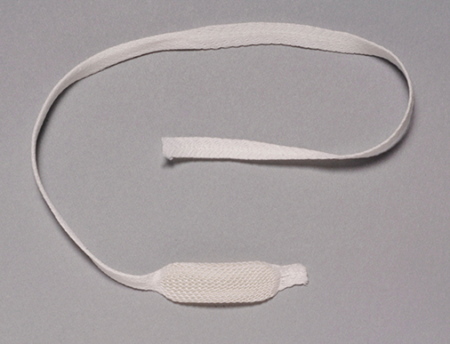
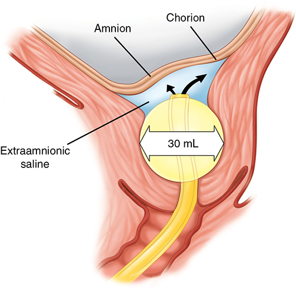

# Chapter 26: Induction and Augmentation of Labor — Revision Notes

> Williams Obstetrics 26e, pp. 1244–1272 of the PDF. High-yield numbers are in **bold**.
> The six tables are transcribed from the PDF images (they are missing from the extracted chapter text). Both figures are included from the PDF.

**Big picture:**
- **Induction** = stimulating contractions **before spontaneous labor**, with or without ruptured membranes.
- **Cervical ripening** = softening and opening a closed, uneffaced cervix before induction (it can itself induce labor).
- **Augmentation** = enhancing spontaneous contractions that are inadequate (failed dilation, poor descent).
- Know: **ARRIVE**, the **Bishop score**, **dinoprostone vs misoprostol vs Foley**, **oxytocin regimens**, and amniotomy.

---

## 1. Labor Induction

### Indications and contraindications
- US induction rate: **9.5% (1991) → 27% (2019)**.
- Induce when the **benefits to mother or fetus outweigh continuing the pregnancy**.
- **Common indications:** ROM without labor, **gestational hypertension**, **oligohydramnios**, **nonreassuring fetal status**, **postterm pregnancy**, maternal disease (**chronic hypertension, diabetes**).
- **Contraindications** = anything that precludes spontaneous labor or vaginal delivery:

| Maternal | Fetal |
|---|---|
| **Abnormally implanted placenta** (previa, accreta) | **Appreciable macrosomia** |
| **Prior uterine incision with high rupture risk** (e.g., classical) | **Severe hydrocephalus** |
| Active **genital herpes** | **Malpresentation** |
| Contracted or distorted pelvis | **Nonreassuring fetal status** |
| **Cervical cancer** | |

### Risks
- **Chorioamnionitis**, **uterine rupture**, **PPH from atony**.
- **Cesarean:** older nonrandomized studies suggested ↑ risk in induced nulliparas; newer ones show **comparable or lower** rates vs spontaneous labor. **Expectant management is the better comparator** than spontaneous labor.
- **ARRIVE trial (>6000 low-risk nulliparas at 39 wk, induction vs expectant):**
  - Primary outcome (**severe neonatal morbidity or death**): **no difference**.
  - **Cesarean 18.6% vs 22.2%** (significantly lower with induction).
  - Chorioamnionitis, PPH, peripartum infection: **no difference**.
  - Meta-analysis of 6 cohort studies: 39-wk elective induction → **lower cesarean** and morbidity.

### Table 26-1. Selected Maternal and Perinatal Outcomes with Labor Induction Versus Expectant Management in Low-Risk Nulliparous Women — the ARRIVE Trial

| Factor | Induction (%) (n = 3059) | Expectant (%) (n = 3037) | p value |
|---|---|---|---|
| **Maternal outcomeᵃ** | | | |
| **Cesarean delivery** | **18.6** | **22.2** | **<0.001** |
| Operative vaginal delivery | 7.3 | 8.5 | 0.07 |
| **Hypertensive disorder** | **9.1** | **14.1** | **<0.001** |
| Chorioamnionitis | 13.3 | 14.1 | 0.35 |
| Postpartum hemorrhage | 4.6 | 4.5 | 0.81 |
| **Perinatal outcomeᵇ** | **4.3** | **5.4** | **0.049** |
| Respiratory support | 3.0 | 4.2 | |
| Apgar score ≤3 at 5 min | 0.4 | 0.6 | |
| Seizure | 0.4 | 0.1 | |
| Meconium aspiration | 0.6 | 0.9 | |
| Birth trauma | 0.5 | 0.6 | |
| Perinatal death | 0.1 | 0.1 | |

*ᵃSecondary outcomes. ᵇComposite outcomes. ARRIVE = A Randomized Trial of Induction Versus Expectant Management. The composite perinatal outcome (the trial's primary outcome) shows p = 0.049 in the table, while the text says it "did not differ" between groups.*

**Uterine rupture and other risks**
- Rupture risk is low overall but **highest with a prior uterine scar**.
- ⚠️ **ACOG: no prostaglandins** for ripening or induction **with a prior uterine incision**. **Oxytocin induction is an option** but carries a higher rupture rate and lower VBAC rate. Oxytocin **augmentation** may be used in TOLAC (evidence on rupture conflicting).
- **Amniotomy → more chorioamnionitis** than spontaneous labor.
- Atony/PPH more common with induction or augmentation in some studies. Parkland: induction linked to **17% of 553 unanticipated peripartum hysterectomies**.

### Elective induction
- ACOG previously advised **against elective term induction for convenience** (exceptions: risk of rapid labor, psychosocial reasons, distance from hospital/family support).
- ⚠️ **Elective delivery before 39 completed weeks → significant neonatal morbidity.**
- **After ARRIVE, ACOG (2018) and SMFM (2019): offering elective induction to low-risk, well-dated nulliparas at 39 wk is reasonable** — they must meet ARRIVE criteria, with **shared decision-making** and consideration of **resources**.

### Factors affecting induction success
- **Favorable:** **younger age**, **multiparity**, **BMI <30**, **favorable cervix**, **birthweight <3500 g**.
- **Consortium on Safe Labor:** elective induction → vaginal delivery in **97% of multiparas vs 76% of nulliparas**; better with a ripe cervix.
- Failed induction depends strongly on **how long you allow**, especially with an unfavorable cervix. **Higher BMI** and **diabetes** lengthen time to active phase and full dilation.

| Author | Recommendation before calling induction "failed" |
|---|---|
| **Simon and Grobman (2005)** | A **latent phase of up to 18 h** lets most induced women deliver vaginally without ↑ morbidity |
| **Rouse (2000)** | At least **12 h of oxytocin after membrane rupture** |
| **Kawakita (2016)** | Up to **15 h** for **multiparas** |

---

## 2. Preinduction Cervical Ripening
- A soft, **"ripe/favorable"** cervix predicts success, though favorability is often subjective.
- Pharmacological and mechanical methods can ripen the cervix and may start labor on their own. But **few data show they lower cesarean rates or morbidity**.

### Table 26-2. Some Commonly Used Regimens Compared with Oxytocin Infusion for Preinduction Cervical Ripening and/or Labor Induction

| Techniques | Agent | Route/Dose | Compared with Oxytocin |
|---|---|---|---|
| **Pharmacological** | | | |
| Prostaglandin E₂ | **Dinoprostone gel, 0.5 mg (Prepidil)** | **Cervical 0.5 mg; repeat in 6 h; permit 3 doses total** | 1. Shorter I-D times with oxytocin infusion than oxytocin alone |
| | **Dinoprostone insert, 10 mg (Cervidil)** | **Posterior fornix, 10 mg** | 1. Insert has shorter I-D times than gel. 2. 6–12 h interval from last insert to oxytocin infusion |
| Prostaglandin E₁ᵃ | **Misoprostol tablet, 100 or 200 µg (Cytotec)ᵇ** | **Vaginal, 25 µg; repeat 3–6 h prn. Oral, 50–100 µg; repeat 3–6 h prn** | 1. Contractions within 30–60 min. 2. Success comparable to oxytocin for ruptured membranes at term and/or favorable cervix. 3. **Tachysystole common with vaginal doses >25 µg** |
| **Mechanical** | | | |
| Transcervical 36F Foley catheter | 30-mL balloon | Transcervical | 1. Improves Bishop scores rapidly. 2. 80-mL balloon more effective. 3. Combined with oxytocin infusion is superior to PGE₁ vaginally. 4. With EASI, results improved and possible decreased infection rate |
| Hygroscopic dilators | Laminaria, hydrogel | Intracervical | 1. Rapidly improves Bishop score. 2. May not shorten I-D times with oxytocin. 3. Uncomfortable, requires speculum and placement on an examination table |

*ᵃOff-label use. ᵇTablets must be divided for 25- and 50-µg dose, but drug is evenly dispersed. EASI = extraamnionic saline infusion at 30–40 mL/h; I-D = induction-to-delivery. Two mismatches with the text: the table lists a "36F" Foley, while the Fig 26-2 legend describes a 26F catheter; and the table gives a 6–12 h interval from the insert to oxytocin, while the text (manufacturer) says 6–12 h after the **gel** but only ≥30 min after **removing the insert**.*

### Cervical favorability — Bishop score
- Higher score → higher rate of vaginal delivery after induction.
- **Bishop score >8 → high likelihood of successful induction. ≤6 → unfavorable** (ACOG).

### Table 26-3. Bishop Scoring System Used for Assessment of Inducibility

| Score | Dilatation (cm) | Effacement (%) | Station (−3 to +2) | Consistency | Position |
|---|---|---|---|---|---|
| 0 | Closed | 0–30 | −3 | Firm | Posterior |
| 1 | 1–2 | 40–50 | −2 | Medium | Midposition |
| 2 | 3–4 | 60–70 | −1 | Soft | Anterior |
| 3 | ≥5 | ≥80 | +1, +2 | — | — |

> **Memory hook:** "**Call PEDS**" = **C**onsistency, **P**osition, **E**ffacement, **D**ilation, **S**tation. Only dilation, effacement and station can score 3 (max total **13**).

- **Simplified Bishop score** (Laughon, 5610 nulliparas at 38–42 wk): **dilation, station and effacement** alone predict as well or better; consistency and position can be dropped.
- **Transvaginal cervical length** as an alternative: meta-analysis of **31 trials** → **low sensitivity and specificity**, limited value.

---

## 3. Pharmacological Ripening Agents
- All are **prostaglandin analogues**; they can also stimulate contractions. Oxytocin is usually started with or after the agent.

### Prostaglandin E₂ (dinoprostone)

| Form | Dose / use | Details |
|---|---|---|
| **Prepidil gel** | **0.5 mg intracervical** (2.5-mL syringe), just **below the internal os** | Supine, stay reclined **30 min**. Repeat **every 6 h**, **max 3 doses in 24 h** |
| **Cervidil insert** | **10 mg**, releases **0.3 mg/h** (slower than gel) | Single dose, placed **transversely in the posterior fornix**; little or no lubricant (coats the device). Recumbent **≥2 h**. **Remove after 12 h**, at labor onset, and **≥30 min before oxytocin**. **Removable by its tail** if tachysystole or FHR changes |
| **20-mg suppository** | ⚠️ **NOT for cervical ripening** | For **termination at 12–20 wk** and **evacuation after fetal demise up to 28 wk** |

*Figure 26-1. Cervidil insert: 10 mg dinoprostone releasing ~0.3 mg/h over ~10 h; the mesh sac's long tail allows quick removal.*

**Efficacy**
- ↑ **vaginal delivery within 24 h**, but **cesarean rate not consistently reduced**.
- **Cochrane (70 trials, 11,487 women):** more vaginal births in 24 h; **3× ↑ tachysystole with FHR changes**; cesarean not reduced.
- Intracervical gel: ↓ cesarean only in women with an **unfavorable cervix and intact membranes**.
- **PROBAAT-P and -M (Foley vs vaginal PGE₂):** **no difference in cesarean**.

**Side effects**
- **Uterine tachysystole in 1–5%** after vaginal PGE₂.
- **Tachysystole (ACOG) = >5 contractions in 10 min**, always qualified by the **presence or absence of FHR abnormalities**. ⚠️ "Hypertonus", "hyperstimulation" and "hypercontractility" are **no longer defined — don't use them**.
- **Don't use prostaglandins in women already in spontaneous labor** (tachysystole with fetal compromise).
- Tachysystole after the insert → **pull it out**. **Irrigating out gel doesn't help.**
- Manufacturer cautions: **ruptured membranes, glaucoma, asthma** (but in 189 asthmatics dinoprostone did **not** worsen asthma).
- **Manufacturer contraindications:**
  - Dinoprostone hypersensitivity
  - Suspected fetal compromise or **CPD**
  - **Unexplained vaginal bleeding**
  - **≥6 prior term pregnancies**
  - Contraindication to vaginal delivery
  - Already on oxytocin, or oxytocin contraindicated
  - Endangered by prolonged contractions — **prior cesarean or uterine surgery**

**Administration**
- Give **only in or near the delivery suite**, with **uterine activity and FHR monitoring**.
- Contractions usually appear in the **1st hour**, peak in the **first 4 h**.
- **Oxytocin afterwards: wait 6–12 h after gel**, or **≥30 min after insert removal**.

### Prostaglandin E₁ (misoprostol, Cytotec)
- Approved as **100- or 200-µg tablets for peptic ulcer prevention**; split for **25- or 50-µg** doses (drug evenly distributed). Vaginal, oral and buccal absorption.
- Widely and safely used **off-label**; stable at room temperature; **preferred ripening prostaglandin at Parkland**.

**Vaginal misoprostol**
- **Equivalent or superior** to intracervical/vaginal PGE₂.
- vs oxytocin or dinoprostone: **↑ vaginal delivery within 24 h**; ↑ tachysystole but **no change in cesarean**.
- vs dinoprostone: **less need for oxytocin**, but **more meconium-stained fluid**.
- Higher doses → less oxytocin but **more tachysystole** (± FHR changes).
- **ACOG: 25 µg vaginally** (quartered 100-µg tablet).

**Oral misoprostol**
- Faster peak and decline than vaginal.
- **Cochrane (76 trials):** vs placebo → ↑ vaginal birth in 24 h, ↓ oxytocin, **↓ cesarean**. Also ↓ cesarean vs **oxytocin** and vs **dinoprostone**.
- Oral ≈ vaginal in efficacy, but oral → **higher Apgar scores and less PPH**.

### Table 26-4. Randomized Trials with 200 or More Subjects Designed to Compare Misoprostol (PGE₁) With or Without Foley Bulb

| Study | Comparators | Primary Outcome | N | Findings |
|---|---|---|---|---|
| Kehl (2015) | Double balloon catheter + oral PGE₁ (50 µg) vs oral PGE₁ alone | TTD | 326 | **Longer** TTD with Foley + oral PGE₁ (32 h) vs oral PGE₁ alone (22 h) (p = 0.004) |
| Ten Eikelder (2016) | **PROBAAT-II:** Oral PGE₁ (50 µg) vs Foley | Neonatal asphyxia or EBL >1000 mL | 1859 | No difference in primary outcome: Foley (12%) vs oral PGE₁ (11.5%) |
| Levine (2016) | **FOR MOMI:** Vaginal PGE₁ (25 µg) + Foley vs oxytocin + Foley vs vaginal PGE₁ alone vs Foley alone | TTD | 492 | **Shorter TTD with combinations:** Foley + PGE₁ (13.1 h), oxytocin + Foley (14.5 h), PGE₁ alone (17.6 h), Foley alone (17.7 h) (p <0.001) |
| Kruit (2016) | Foley vs oral PGE₁ (50–100 µg) | CD and infections | 202 | No difference in CD or maternal/neonatal infection rates |
| Mundle (2017) | Foley vs oral PGE₁ (25 µg) | VD within 24 h | 602 | VD within 24 h more common with **oral PGE₁ (57%) vs Foley (47%)** (p = 0.014) |
| Al-Ibraheemi (2018) | Vaginal PGE₁ (25 µg) ± Foley | TTD | 200 | TTD in combination group (15 h) vs vaginal PGE₁ alone (19 h) (p = 0.001) |
| Young (2020) | Oral PGE₁ (50 µg) vs vaginal PGE₁ (25–50 µg) vs dinoprostone gel (1 to 2 mg) | TTD | 511 | TTD differences not significant: oral PGE₁ (22.6 h), vaginal PGE₁ (25.5 h), vaginal dinoprostone (20.1 h) (p = 0.46) |
| **Adhikari (2020)** | Oral PGE₁ (100 µg) ± Foley | VD | 2227 | **No difference in VD rates:** Foley + oral PGE₁ (78%), PGE₁ alone (77%) |

*CD = cesarean delivery; EBL = estimated blood loss; N = participant number; PGE₁ = prostaglandin E₁; TTD = time to delivery; VD = vaginal delivery. The Kehl row prints "oral E₁ alone"; PGE₁ is meant.*

### Nitric oxide donors
- NO likely mediates cervical ripening (cervical NO metabolites ↑ at contraction onset).
- **Isosorbide mononitrate, glyceryl trinitrate:** **less effective than prostaglandins**, **no reduction in cesarean**, and **more headache, nausea and vomiting**.

---

## 4. Mechanical Ripening Techniques
- Options: **transcervical Foley** (± **EASI**), **hygroscopic dilators**, **membrane stripping**.
- **Meta-analyses:**
  - vs prostaglandins → **less tachysystole**, **same cesarean rate**
  - vs oxytocin → **lower cesarean rate**
  - vs dinoprostone → **more multiparas undelivered at 24 h**
  - Foley vs dinoprostone insert → same cesarean rate, less tachysystole

### Transcervical catheter
- Used with an **unfavorable cervix** (it falls out as the cervix opens). OK with **intact or ruptured** membranes.
- Foley through the **internal os**, traction by taping to the thigh.
- **EASI:** constant saline infusion into the space between the internal os and membranes. **Chorioamnionitis 6% vs 16%** without infusion (Karjane). Meta-analysis: **transcervical catheters don't raise maternal or fetal infection**.

*Figure 26-2. EASI: 26F Foley, 30-mL balloon pulled snug against the internal os, room-temperature saline at 30–40 mL/h into the extraamnionic space.*

**Trial evidence**
- **PROBAAT I, P, M, II** (Foley vs dinoprostone gel, insert, vaginal/oral misoprostol): **similar outcomes**; **fewer CTG changes** with Foley.
- **Foley + concurrent oxytocin** (Schoen): **shorter median time to delivery** than Foley then oxytocin; **cesarean unchanged**. Same with intact membranes (Connolly).
- **Ruptured membranes:** Foley + oxytocin **no better than oxytocin alone** (Amorosa).
- **Foley + misoprostol:** shorter time to delivery, cesarean unchanged. With a catheter, **vaginal misoprostol beat buccal**.
- **Tension on the catheter adds nothing** (Fruhman, 140 women).
- **Parkland (Adhikari): adding Foley to oral misoprostol → no gain in vaginal delivery (77% with misoprostol alone), but 30% more chorioamnionitis.**

### Hygroscopic cervical dilators
- **Laminaria japonicum**, synthetic (**Dilapan-S**) (Ch 11).
- Ascending infection **not verified** → appear safe.
- Need a **speculum and an exam table**. **Few benefits over prostaglandins.**

---

## 5. Methods of Induction and Augmentation
- Oxytocin used for **>70 years** (Theobald 1948). Others: prostaglandins (misoprostol, dinoprostone) and mechanical methods (stripping, amniotomy, EASI, balloons, dilators).
- Each unit should have **written protocols** (Guidelines for Perinatal Care).
- ⚠️ **Prostaglandins for augmentation are considered experimental** (high tachysystole).

### Misoprostol for induction
- ROM at or near term, or favorable cervix: **100 µg oral or 25 µg vaginal ≈ IV oxytocin**; **oral may be superior**.
- More tachysystole (especially higher doses); may still need oxytocin. Either drug is suitable.
- **Parkland protocol:**
  1. **100 µg oral**
  2. Repeat after **6 h** if labor inadequate
  3. **Oxytocin** (if needed, for hypotonic labor) **4 h after the 2nd dose**, or if tachysystole occurs
- **Misoprostol vaginal insert (up to 24 h):** shorter time to delivery but **more cesareans and adverse neonatal outcomes** vs oral; mitigated if limited to **10 h**.
- **Augmentation (Bleich RCT): oral 75 µg every 4 h, max 2 doses** = safe and effective. More tachysystole, but **no difference in nonreassuring status or cesarean** vs oxytocin.

---

## 6. Oxytocin
- Ripening and induction are a **continuum**. Oxytocin augmentation is key to **active management of labor** (Ch 22).
- ACOG: **monitor FHR and contractions** (palpation or electronic).

### IV administration
- **1-mL vial = 10 units.** Add **10 or 20 units (10,000 or 20,000 mU) to 1000 mL** → **10 or 20 mU/mL**, by **infusion pump**.
- Piggyback into the main line **close to the venipuncture site** (avoid boluses).
- Goal: contractions enough for cervical change and descent **without a nonreassuring (category III) tracing**.
- **Stop oxytocin if:** **>5 contractions in 10 min**, **>7 in 15 min**, or a **persistent nonreassuring FHR**.
- **Half-life 3–5 min** → stopping lowers contraction frequency rapidly.
- **Uterus responds in 3–5 min**; **plasma steady state in 40 min**.
- Response varies (uterine activity, cervix, GA, individual). **Uterine sensitivity rises from 20 to 30 wk and rapidly at term.**
- **Cochrane:** failure to deliver vaginally within 24 h **8% with oxytocin vs 54% expectant**.

### Table 26-5. Various Low- and High-Dose Oxytocin Regimens Used for Labor Induction

| Regimen | Starting Dose (mU/min) | Interval (min) | Incremental Increase (mU/min) |
|---|---|---|---|
| **Low-dose** | 0.5–1.5 | 15–40 | 1–2 |
| | 2 | 15 | 4, 8, 12, 16, 20, 25, 30 |
| **High-dose** | 4 | 15 | 4 |
| | 4.5 | 15–30 | 4.5 |
| | 6 | 20–40ᵃ | 3–6ᵇ |

*ᵃUterine tachysystole is more common with shorter intervals. ᵇWith uterine tachysystole and after oxytocin infusion is discontinued, it is restarted at one half the previous dose and then increased at 3-mU/min incremental doses. From ACOG, 2019a; Hauth, 1986; Satin, 1992, 1994; Son, 2021; Tesemma, 2020.*

### Regimens — the evidence
- Originally only low-dose in the US. **Dublin (O'Driscoll): start 6 mU/min, ↑ by 6 mU/min.** 1990s trials: **high-dose (4–6) vs low-dose (0.5–1.5 mU/min)**.
- **Satin (Parkland), 6 vs 1 mU/min:**
  - **Induction (1112 women):** shorter admission-to-delivery, **fewer failed inductions**, **no neonatal sepsis**
  - **Augmentation (1676 women):** faster delivery, **fewer forceps**, **fewer cesareans for dystocia**, **less chorioamnionitis and neonatal sepsis**
  - Tachysystole → stop, **restart at half the stopping dose**, then **↑ by 3 mU/min**. No adverse neonatal effects.
- **Son (2021) RCT confirmed** these findings. Parkland has used **6 mU/min start and increments since 1990**; other units use **2 mU/min**. Either regimen serves for induction or augmentation.

**Dose interval**
- Ranges **15–40 min**. **Satin (6 mU/min regimen): 20-min vs 40-min increases → cesarean for dystocia 8% vs 12%**, but **more tachysystole with 20 min**.
- Others: **4 mU/min every 15 min** (Frigoletto, Xenakis); **4.5 mU/min every 30 min** (Merrill and Zlatnik); **6 mU/min every 15 min** (López-Zeno).

**Maximum dose**
- Varies by woman. **Wen (1151 nulliparas):** likelihood of vaginal delivery ↓ at and beyond **36 mU/min**, but at **72 mU/min half still delivered vaginally**.
- If contractions are **<200 MVU**, fetal status reassuring and labor arrested → doses **>48 mU/min have no apparent risk**.

### Risks vs benefits
**Uterine rupture**
- **Rare without a scar**, even in parous women:
  - Flannelly: **0 ruptures in 27,829 nulliparas**; **8 in 48,718 parous women**, only **1** with oxytocin
  - Denmark: **3.3 per 100,000** women without prior cesarean (highest in multiparas)
- **Parkland (8 yr, ~95,000 births): 15 primary ruptures, 14 with oxytocin**; half had prostaglandins before oxytocin.

**Water intoxication**
- Oxytocin is homologous to **arginine vasopressin** → **antidiuretic**.
- At **≥20 mU/min**, **free water clearance falls markedly**. With large aqueous fluid volumes → **water intoxication → convulsions, coma, death**.
- **Prevention:** for prolonged high doses, **increase the concentration rather than the flow rate**; use **normal saline or lactated Ringer's**.

### Uterine contraction pressures
- Spontaneous labor: **90–390 MVU** (Ch 24). A mean/median spontaneous pattern of **140–150 MVU** led to vaginal delivery.
- **Hauth protocol (active-phase arrest):** **>90% reached ≥200–225 MVU**. Nearly all with persistent arrest despite oxytocin generated **>200 MVU**. **No adverse maternal or perinatal effects** in those who needed cesarean.
- **No safety data** for contraction patterns with **prior cesarean, twins or an overdistended uterus**.

---

## 7. Amniotomy for Induction and Augmentation

### For induction ("surgical induction")
- **Always implies a commitment to delivery.**
- Main drawback: **unpredictable, sometimes long interval to labor onset**.
- Bakos: amniotomy alone or with oxytocin was **superior to oxytocin alone**.
- **Mercer (209 induced women): early amniotomy (1–2 cm) vs late (5 cm) → labor 4 h shorter**, but **more chorioamnionitis**.
- Meta-analysis (De Vivo 2020): early amniotomy → **shorter induction-to-delivery**, **no ↑ cesarean**.

### For augmentation
- Common when labor is abnormally slow. **Amniotomy at ~5 cm shortens spontaneous labor by 1–1½ h**, without ↑ oxytocin need or overall cesarean rate, and **no adverse perinatal effects**.

### Table 26-6. Randomized Clinical Trials of Elective Amniotomy in Early Spontaneous Labor at Term

| Study | Number | Mean Dilation at Amniotomy | Mean Shortening of Labor | Need for Oxytocin | Cesarean Delivery Rate | Abnormal Tracing | Neonatal Effects |
|---|---|---|---|---|---|---|---|
| Fraser (1993) | 925 | <5 cm | 125 min | None | Noneᵃ | None | None |
| Garite (1993) | 459 | 5.5 cm | 81 min | Decreased | None | Increasedᵇ | None |
| UK Amniotomy Group (1994) | 1463 | 5.1 cm | 60 min | None | None | NA | None |

*ᵃNo effect on overall rate; cesarean delivery for fetal distress significantly increased. ᵇIncreased mild and moderate umbilical cord compression patterns. NA = not assessed. Note: this footnote conflicts with the text, which says cesarean rates for fetal distress were not greater after amniotomy.*

- **Rouse (1994): amniotomy + oxytocin for active-phase arrest → 44 min faster** than oxytocin alone; **delivery route unchanged**; **↑ chorioamnionitis**.

### Technique and safety
- ⚠️ **Cord prolapse risk** → **don't disengage the head**; fundal and/or suprapubic pressure helps. Some rupture **during a contraction**.
- Head poorly applied → controlled release: several punctures with a **26-gauge needle** in a **ring forceps** under speculum view, or guided through the **pudendal-block trumpet**. (The membranes often tear anyway.)
- **Check FHR before and immediately after amniotomy** (cord prolapse, rarely **abruption**).

---

## 8. Membrane Stripping (Sweeping)
- Common. Several studies: **safe**, ↓ **postterm pregnancy**, without consistently raising ROM, infection or bleeding.
- But RCTs are limited; a **meta-analysis of two found sweeping ineffective**.
- Downsides: **discomfort and bleeding**.

---

## Quick-Recall: Ripening and Induction Agents

| Agent | Dose | Key rules | Main risk / note |
|---|---|---|---|
| **Dinoprostone gel (Prepidil)** | **0.5 mg intracervical** | q6h, **max 3/24 h**; recline 30 min; oxytocin **6–12 h** later | Tachysystole 1–5% |
| **Dinoprostone insert (Cervidil)** | **10 mg** posterior fornix, 0.3 mg/h | Recline 2 h; remove at **12 h**/labor; oxytocin **≥30 min** after removal | **Removable** if tachysystole |
| **Dinoprostone 20-mg suppository** | — | **Not for ripening**; termination 12–20 wk, IUFD ≤28 wk | — |
| **Misoprostol vaginal** | **25 µg** q3–6h | ACOG dose; off-label | Tachysystole >25 µg; meconium |
| **Misoprostol oral** | **50–100 µg** q3–6h (Parkland 100 µg, repeat at 6 h, oxytocin 4 h later) | Augmentation: 75 µg q4h × 2 | Higher Apgar, less PPH than vaginal |
| **Prostaglandins in general** | — | **Not with prior uterine incision**; not in spontaneous labor | Uterine rupture |
| **Foley ± EASI** | 30-mL balloon; saline 30–40 mL/h | Unfavorable cervix; intact or ruptured membranes | Less tachysystole; EASI ↓ chorioamnionitis (6% vs 16%) |
| **Laminaria / Dilapan-S** | Intracervical | Speculum + table | Few benefits |
| **Nitric oxide donors** | — | Less effective | Headache, nausea, vomiting |
| **Oxytocin low-dose** | 0.5–2 mU/min | ↑ 1–2 mU/min q15–40 min | — |
| **Oxytocin high-dose** | 4–6 mU/min | ↑ 3–6 mU/min q15–40 min; tachysystole → restart at ½ dose, ↑ 3 | Water intoxication ≥20 mU/min |
| **Amniotomy** | — | Commits to delivery; check FHR before/after | Cord prolapse, chorioamnionitis |

## Key Numbers to Memorize
- Induction rate **9.5% → 27%** (1991 → 2019)
- ARRIVE: **>6000** nulliparas at **39 wk**; cesarean **18.6% vs 22.2%**; hypertensive disorders **9.1% vs 14.1%**
- Induction linked to **17%** of unanticipated peripartum hysterectomies
- Elective induction vaginal delivery: **97%** multiparas, **76%** nulliparas
- Favorable: BMI **<30**, birthweight **<3500 g**
- Failed induction: allow latent phase **18 h**; **≥12 h** oxytocin after ROM; **15 h** multiparas
- Bishop **>8** favorable; **≤6** unfavorable
- Prepidil **0.5 mg** q6h ×3; Cervidil **10 mg**, **0.3 mg/h**, out at **12 h**; oxytocin **6–12 h** after gel, **30 min** after insert
- PGE₂ tachysystole **1–5%**; Cochrane: tachysystole with FHR changes **×3**
- **Tachysystole = >5 contractions/10 min**; stop oxytocin at **>5/10 min or >7/15 min**
- Misoprostol **25 µg** vaginal; **100 µg** oral (Parkland); **75 µg** oral augmentation
- EASI chorioamnionitis **6% vs 16%**; Foley + misoprostol → **30%** more chorioamnionitis, no VD gain (**77–78%**)
- Oxytocin: **10 U/mL** vial; **10–20 mU/mL** infusate; **t½ 3–5 min**; response **3–5 min**; steady state **40 min**
- Oxytocin vs expectant: undelivered at 24 h **8% vs 54%**
- 20- vs 40-min increments: dystocia cesarean **8% vs 12%**
- Max dose: VD falls ≥**36 mU/min**; **half** deliver at **72 mU/min**; **>48 mU/min** OK if <200 MVU and reassuring
- Water intoxication at **≥20 mU/min**
- Rupture: **0/27,829** nulliparas; Denmark **3.3/100,000**; Parkland **14 of 15** with oxytocin
- Spontaneous labor **90–390 MVU**; target **200–225 MVU**
- Amniotomy: early (1–2 cm) → **4 h** shorter; at ~5 cm → **1–1½ h** shorter; with oxytocin for arrest → **44 min** shorter
