# Chapter 27: Vaginal Delivery — Revision Notes

> Williams Obstetrics 26e, pp. 1273–1323 of the PDF. High-yield numbers are in **bold**.
> The one table (27-1) is transcribed from the PDF image (it is missing from the extracted chapter text). 12 of the 13 figures are included (Fig 27-7, membrane teasing with ring forceps, is omitted).

**Big picture:** Spontaneous vaginal vertex delivery carries the lowest maternal risk. The goals are a controlled birth with minimal trauma, **prevention of OASIS**, fast and orderly management of **shoulder dystocia**, and a safe **third stage** (intact placenta, no inversion, no hemorrhage).

---

## 1. Delivery Technique

### Preparation
- End of 2nd stage is heralded by **perineal bulging** and the scalp showing between the labia. Head pressure on the perineum triggers reflex pushing.
- Continue FHR monitoring: a **nuchal cord** often tightens with descent → deepening variable decelerations.
- Catheterize a distended bladder (more pelvic room).
- **Dorsal lithotomy** is most common. Stirrups vs no stirrups: **equal laceration rates** (RCT, n = 214).
  - Legs not spread too widely, not one higher than the other, and **never strapped in** → allows rapid thigh flexion (McRoberts) if shoulder dystocia develops.
- Vulvar/perineal cleansing, optional drapes; scrub, gown, glove, mask and eyewear.

### Delivery of the head
- Position is usually **OA** or slightly oblique; **OP persists in ~5%**.
- **Crowning** = the vulvar ring encircles the largest head diameter.
- **OASIS** = 3rd- + 4th-degree lacerations (involve the anal sphincter ± perineal body/mucosa). **Preventing OASIS is a main goal.**

**Perineal protection techniques**

| Technique | Effect |
|---|---|
| **Antepartum perineal massage** from **34–35 wk** (1–2 fingers, 3 cm in; 2 min down, then 2 min to each side) | Nulliparas: ↓ episiotomy and ↓ 1st-degree tears. **Does NOT ↓ 3rd/4th-degree** tears |
| Epi-No intravaginal balloon (antepartum) | **No** benefit (episiotomy, perineal trauma, levator injury) |
| **Intrapartum** perineal massage (2nd stage) | One large RCT: no difference. **Systematic reviews: ↓ OASIS, ↑ intact perineum** |
| **Hands-on** (V of thumb/fingers bolsters perineum; other hand keeps head flexed and slows it) vs **hands-poised** (hands off unless expulsion is rapid) | Hands-poised → **↓ episiotomy**. Intact perineum / OASIS rates **not consistently different** |
| **Ritgen maneuver** (chin pushed up through the perineum between contractions; other hand on occiput) | Expedites delivery, but **does NOT change OASIS rates** |

- Once the introitus opens to **≥5 cm**, slow the head and control expulsive forces.

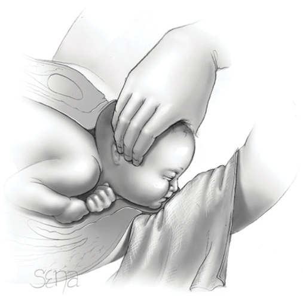

*Figure 27-1. Modified Ritgen maneuver: upward pressure on the chin via the posterior hand while the occiput is held against the symphysis.*

### Delivery of the shoulders
- Feel for a **nuchal cord**: present in **~25% at term** (rises with GA).
  - Loose → slip over the head. Tight → cut between two clamps.
  - Tight nuchal cords occur in **~6%** of deliveries, with **no worse neonatal outcome**.
- **External rotation (restitution):** occiput turns to a maternal thigh → the **bisacromial diameter** rotates into the AP diameter of the pelvis.
- If delayed: grasp the sides of the head and apply **gentle axial traction** (in line with the fetal spine); lateral neck deviation **≤25–45 degrees** → anterior shoulder under the pubic arch → then posterior shoulder.
  - Avoid abrupt/forceful lateral extension (**brachial plexus injury**).
  - **Don't hook fingers in the axillae** (upper-extremity nerve injury/paralysis).
- **Suctioning:** routine nasopharyngeal bulb suction is out (can cause **neonatal bradycardia**).
  - **Meconium:** no routine intubation/tracheal suction for **vigorous OR nonvigorous** neonates.
  - Suction only for **obvious airway obstruction** or when **PPV** is needed.

### Cord clamping
- Two clamps **6–8 cm** from the abdomen; cord clamp later **2–3 cm** from the insertion.
- **Delayed clamping 30–60 s** for vigorous **term** neonates (baby held below the uterus).
  - Benefits: **↑ iron stores, ↓ infant anemia** (especially where iron deficiency is common).
  - No worse Apgar or cord pH. **No ↑ maternal PPH** or change in postpartum Hb.
  - Harm: ↑ Hb → ↑ **hyperbilirubinemia** risk (phototherapy rates probably not different) → have jaundice protocols.
  - Cautions: need for urgent maternal/fetal resuscitation, abnormal placentation, abruption, FGR.
- **Preterm:** delayed clamping **≥30 s** → **↓ transfusion and ↓ death before discharge** (systematic reviews; one large RCT negative for its composite outcome).
- **ACOG: delayed clamping for vigorous term AND preterm** neonates not needing immediate resuscitation.
- **Cord milking:** safe at term (useful if rapid clamping is needed). In preterms it may ↑ **severe IVH at <32 wk** → **not recommended routinely at <29 wk**.

### Occiput transverse (OT)
- Persistent OT from pelvic shape: **platypelloid** (flat AP) or **android** (heart-shaped) pelvis.
- Without architectural abnormality or asynclitism, OT is **transient** and usually rotates to OA unless contractions are hypotonic.
- Aids: **manual rotation** (to OA, less often OP) or **Kielland forceps** (Ch 29).

---

## 2. Persistent Occiput Posterior Position
- **2–10%** of singleton, term, cephalic fetuses deliver OP. Many are OA early and malrotate in labor.
- **Risk factors:** **epidural**, nulliparity, larger fetal weight, prior OP delivery, **anthropoid pelvis**, **narrow subpubic angle**.
- **Maternal consequences:** prolonged 2nd stage, ↑ cesarean, ↑ operative vaginal delivery, ↑ blood loss and **↑ OASIS**.
- **Neonatal:** ↑ acidemic cord gases, birth trauma, **Apgar <7**, NICU admission.
- **Diagnosis:** digital exam can be inaccurate → **transabdominal sonography** (transducer transverse above the mons): orbits and nasal bridge ventral, occiput against the lower sacrum.
- Maternal positioning (antepartum or in labor) does **not** ↓ persistent OP.
- **Management options:**
  1. Spontaneous OP delivery (roomy outlet, relaxed perineum in multiparas)
  2. **Manual rotation to OA** → ↓ cesarean, ↓ severe laceration, ↓ chorioamnionitis, ↓ blood loss
  3. Forceps rotation to OA (skilled operators)
  4. Forceps or vacuum delivery **from OP** (Ch 29)
- ⚠️ **Scalp at the introitus can be misleading:** it may be **molding + caput**, not descent; the head may not even be engaged. Long labor, slow descent, head palpable above the symphysis → **prompt cesarean**.

---

## 3. Shoulder Dystocia
- The **anterior shoulder is wedged behind the symphysis** and fails to deliver with pushing and gentle axial traction.
- **Turtle sign** = head retracts against the perineum.
- An **emergency** (cord compressed in the birth canal) → team approach, clear leadership and communication.
- **Definition:** no consensus.
  - ACOG: **maneuvers required** to free the shoulder.
  - Spong: head-to-body time **24 s normal vs 79 s** with dystocia → proposed **>60 s** threshold.
  - In practice: clinical perception that normal traction fails.
- **Incidence ~1%** of deliveries; rising (↑ birthweight, better documentation).

### Maternal and neonatal consequences
- Greater risk to the **fetus** than the mother.
- **Mother:** severe perineal tears, **PPH** (mainly **atony**, also lacerations).
- **Neonate:**

| Outcome | Rate |
|---|---|
| **Brachial plexus injury** | **11%** (n = 1177) |
| Clavicular or humeral fracture | **2%** |
| Acidosis at delivery | 7% (n = 514) |
| Cardiac resuscitation or HIE | 1.5% |
| Severe acidosis / HIE if head-to-body **<5 min** | **0.5% / 0.5%** |
| Severe acidosis / HIE if **≥5 min** | **6% / 24%** |

### Prediction and prevention
- **Cannot be accurately predicted or prevented** (ACOG).
- **Associations:** fetal **macrosomia**, maternal obesity, prolonged 2nd stage, operative vaginal delivery, **prior shoulder dystocia**. Risk rises with birthweight.
  - Macrosomia linked to maternal obesity, postterm, multiparity, diabetes.
  - **Macrosomia + diabetes** escalates risk: diabetic fetuses have larger shoulder/extremity circumferences and larger shoulder-to-head and chest-to-head ratios. Sonographic thresholds based on these have **poor sensitivity**.
- **Planned cesarean should be considered** (ACOG) if EFW:
  - **>5000 g without diabetes**
  - **>4500 g with diabetes**
- **Early induction (37–39 wk) for suspected macrosomia:**
  - Boulvain RCT (~800, insulin-requiring diabetics excluded): dystocia **↓ by two thirds**, no brachial plexus injury in either group; ↑ hyperbilirubinemia/phototherapy with induction.
  - Meta-analysis of 4 RCTs: no difference in cesarean, dystocia or operative delivery; **↓ fracture** with induction.
  - EFW is inaccurate; weigh against early-delivery harms. **ACOG: no induction <39 wk for suspected macrosomia alone.**
- **Recurrence: 4–13%.** Labor is still reasonable for many.
  - Evaluate EFW, GA, maternal glucose intolerance and severity of prior neonatal injury; discuss cesarean risks/benefits. **Either route is appropriate** after counseling.

### Management
- **Two competing goals:** shorten delivery time (ongoing cord compression) vs avoid injury from aggressive manipulation.
- Call for help: nurses, obstetric providers, **anesthesia**. Adequate analgesia helps.
- **Episiotomy** may give room for maneuvers but **does NOT ↓ brachial plexus injury** itself.

| Maneuver | How | Mechanism / note |
|---|---|---|
| **McRoberts** (usually first) | Legs out of stirrups, **hips sharply flexed onto abdomen**, knees flexed | Sacrum straightens vs lumbar spine, **symphysis rotates cephalad**, ↓ pelvic inclination. **Does NOT enlarge the pelvis**; ↓ force needed to free the shoulder |
| **Suprapubic pressure** (with McRoberts) | Assistant pushes **down and lateral** | Abducts anterior shoulder (**↓ bisacromial diameter**) and rotates shoulders into the **oblique** diameter (longer than AP at the inlet) |
| **Delivery of posterior arm** | Hand along the posterior humerus; sweep the arm across the chest, elbow flexed; grasp hand and deliver along the face | Fingers **parallel to the humerus** ↓ fracture. ↓ bisacromial diameter, then rotate girdle into oblique |
| **Rubin** | Push the most accessible shoulder (often posterior) toward the fetal **anterior chest** | Abducts shoulders (↓ bisacromial diameter), rotates into oblique |
| **Woods corkscrew** | Press the **anterior surface of the posterior shoulder** toward the fetal back; rotate **180 degrees** | Posterior shoulder becomes anterior and delivers **beneath, not behind**, the symphysis |
| **Gaskin (all-fours)** | Mother on hands and knees; axial traction frees posterior shoulder | Hard with regional analgesia; repositioning takes time |
| **Posterior axilla sling traction** | Suction tubing/stiff catheter looped under posterior axilla; pull up and out | For an inaccessible posterior arm; **96% success** as first maneuver (n = 119) |
| **Deliberate clavicle fracture** | Thumb presses anterior clavicle against the pubic ramus | Hard in a large baby; heals fast; trivial vs plexus injury/asphyxia/death |
| **Symphysiotomy** | Divide symphyseal cartilage/ligaments under local; widens up to **2.5 cm**; displace urethral catheter laterally with a vaginal finger | Rarely used (training, maternal pelvic/urinary injury) |
| **Zavanelli** | **Terbutaline 0.25 mg SC**; rotate head to OA/OP, flex, push back up → **cesarean** | Success **91%** cephalic, 100% breech head entrapment; fetal injury common (prior manipulations) |
| **Cleidotomy** | Cut the clavicle with scissors | Usually for a **dead fetus** |

- McRoberts, suprapubic pressure, posterior arm and rotational maneuvers have **similar neonatal injury rates**. **Longer duration and more maneuvers → more injury.** Maneuvers may be repeated.
- **Simulation drills** improve performance and documentation; neonatal outcome benefit inconsistent.

> **Memory hook:** Order of escalation: "**McRoberts + Suprapubic → Posterior arm → Rotate (Rubin/Woods) → All-fours / sling → Last resorts (clavicle, symphysiotomy, Zavanelli, cleidotomy)**".

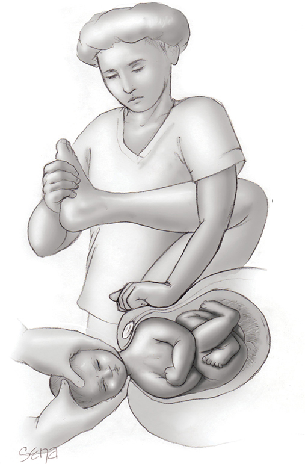

*Figure 27-2. McRoberts maneuver with suprapubic pressure directed down and lateral.*

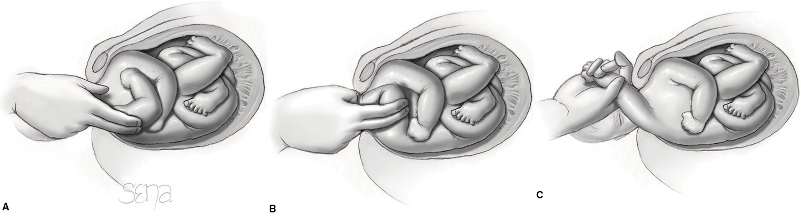

*Figure 27-3. Delivery of the posterior arm: follow the humerus, sweep the flexed arm across the chest, then deliver it along the face.*

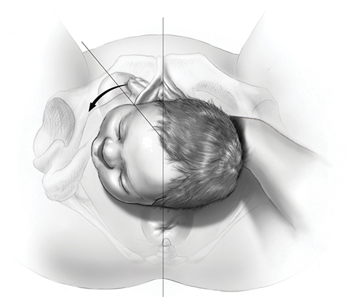

*Figure 27-4. Rubin maneuver: push the accessible shoulder toward the fetal chest to abduct both shoulders and shrink the bisacromial diameter.*

---

## 4. Special Populations

### Home birth
- US 2017: **1.4% planned**, 0.2% unplanned.
- **Unplanned** (Norway): **1.1%** fetal/neonatal death (infection, prematurity, abruption). Risks: multiparity, distance from hospital (Norway); youth, no prenatal care, minority race, lower education (US).
- **Planned low-risk:** fewer interventions (augmentation, episiotomy, operative delivery, cesarean).
- **US midwife-attended home birth: neonatal mortality 1.3/1000**, **~4×** that of midwife-attended hospital births. ↑ neonatal seizures and serious neurologic dysfunction.
- Substantial risk with preeclampsia, multifetal gestation, prior cesarean, breech.
- **ACOG absolute contraindications: multifetal gestation, prior cesarean, breech.** Hospitals/accredited birth centers are safest, but patient autonomy is respected.

### Water birth
- **1st-stage immersion:** ↓ regional analgesia use, no added harm (Cochrane).
- **Birth in water:** cord **avulsion ~3/1000** (baby lifted out abruptly); fresh-water drowning, pneumonia/sepsis → strict sanitizing.
- **ACOG: "birth occur on land, not in water."**

### Female genital mutilation (FGM)
- Federal crime in the US for girls **<18 y**; condemned by major organizations. Practiced in Africa, Middle East, Asia.
- Long-term: urogenital infection, chronic vulvar pain, dyspareunia, psychiatric sequelae (offer referral).

### Table 27-1. World Health Organization Classification of Female Genital Mutilation

| Type | Description |
|---|---|
| Type I | Partial or total removal of the clitoris and/or prepuce |
| Type II | Partial or total removal of the clitoris and the labia minora, with or without labia majora excision |
| Type III | Partial or total labial minora and/or majora excision, followed by fusion of the wound, termed **infibulation**, to cover and narrow the vagina. With or without clitoridectomy |
| Type IV | Pricking, piercing, incising, scraping, cautery, or other injury to female genitalia |

- Assess introital elasticity and caliber with a finger or swab.
- **Types I, II and IV → routine care.** **Type III** or extensive scarring → higher risk; discuss release **early antenatally**.
- **Defibulation** (= deinfibulation = anterior episiotomy): midline division of scar to reopen the vulva.
- FGM **↑ perinatal morbidity by 1–2%** (WHO); ↑ prolonged labor, lacerations/episiotomy, PPH.
- Type III + defibulation → **↓ cesarean and ↓ OASIS**. **WHO recommends defibulation**, antepartum or intrapartum (intrapartum works well).
- Technique: lidocaine (if no regional) → two fingers or clamp tips behind the fused shelf, in front of urethra and head → **midline incision** → raw edges sutured with rapidly absorbable suture.
- **Counseling:** cultural sensitivity (avoid "mutilated/assaulted" language). **Partial** defibulation exposes vagina and urethra; **total** extends to the clitoris. Urine stream and menses will change; new anatomy visible. Wound complications rare; dyspareunia uncommon; **sexual function scores usually improve**.

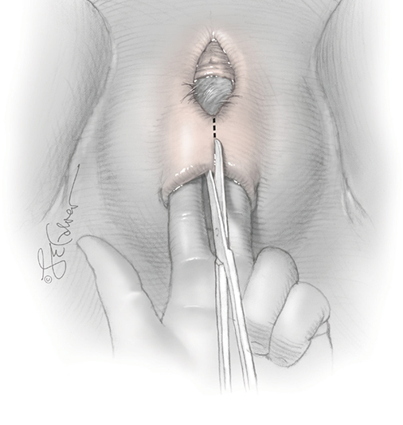

*Figure 27-5. Deinfibulation: fingers protect the urethra and head while the fused shelf is incised in the midline.*

### Prior pelvic reconstructive surgery

| Prior surgery | Delivery advice |
|---|---|
| **Midurethral sling** | Continence preserved in most (multiple pregnancies may ↑ recurrence). **Vaginal delivery suitable** |
| **Sacral neuromodulation** | **Turn the device off** in pregnancy. Lead displacement/efficacy loss after either route; vaginal birth not proscribed |
| **Hysteropexy** | Data too few; **most have elective cesarean** |

### Anomalous fetuses
- Obstruction can occur with extreme hydrocephaly, body-stalk anomaly, conjoined twins, massive abdominal enlargement (bladder, ascites, organomegaly).
- Mild hydrocephaly: vaginal delivery allowed if **BPD <10 cm** or **HC <36 cm**.
- If neonatal death has occurred or is certain: reduce size by sonographically guided **cephalocentesis/paracentesis**, or **cleidotomy**. Breech hydrocephalus → suprapubic cephalocentesis once the aftercoming head enters the pelvis.

---

## 5. Third Stage of Labor

### Delivery of the placenta
- From birth of the fetus to delivery of the placenta. Goals: **intact placenta, no inversion, no PPH**.
- If the fundus is firm and bleeding minimal → **watchful waiting**. **No massage or fundal pressure** before separation; palpate often for atony.
- ⚠️ **Never pull the cord to extract the placenta** → **uterine inversion**.
- **Signs of separation:**
  1. Sudden **gush of blood**
  2. **Globular, firmer fundus**
  3. **Cord lengthens** (moves outward)
  4. **Uterus rises** into the abdomen (placental bulk in the vagina pushes it up)
- **Median time to separation 4–12 min.**
- Expression: mother bears down; or, with a firmly contracted uterus, cord held slightly taut (not pulled), a hand around the fundus propels the placenta while the **heel of the hand pushes the uterus cephalad/toward the sacrum** (prevents inversion). Lift the placenta out; clamp and tease torn membranes.

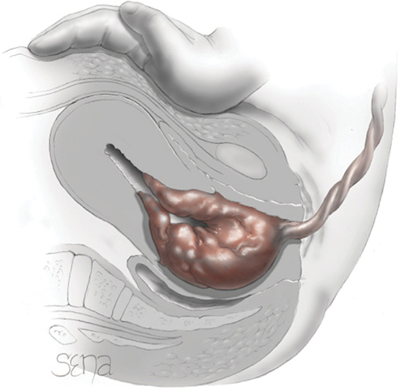

*Figure 27-6. Expression of the detached placenta: the heel of the hand pushes the uterus cephalad while the cord is held in place, never pushing the fundus into the canal.*

### Expectant vs active management

| | Components | Evidence |
|---|---|---|
| **Expectant** | Wait for separation; spontaneous delivery ± nipple stimulation or gravity | — |
| **Active** | (1) Early cord clamping, (2) **controlled cord traction**, (3) **immediate prophylactic uterotonic** | Bundle is questioned: delayed clamping doesn't ↑ PPH; cord traction **doesn't prevent PPH** but **↓ manual removal and shortens 3rd stage**. **Uterotonic is the essential component** |

- Post-placental **uterine massage** supported, though evidence against PPH is weak.
- Uterotonic **before or after** placental expulsion: timing doesn't affect PPH, retention or 3rd-stage length.
- **WHO: oxytocin is first line.**

### Uterotonic agents

| Agent | Dose / route | Key facts |
|---|---|---|
| **Oxytocin** (Pitocin) | **20 U (2 mL) per 1 L crystalloid** after the placenta at **10–20 mL/min (200–400 mU/min)** until firm, then **1–2 mL/min** until transfer. No IV: **10 U IM** | Onset **~1 min**, half-life **3–5 min**; store **≤25°C**. **IV bolus → profound hypotension** (dangerous with hypovolemia/cardiac disease). **Water intoxication** with large volumes of electrolyte-free dextrose (antidiuretic effect). No standard dose established |
| **Methylergonovine** (Methergine) | **200 µg IM**, or slow IV over **≥60 s** | ↓ PPH and extra uterotonics; **↑ BP → contraindicated in hypertension**. Only ergot made in the US (ergonovine similar) |
| **Misoprostol** (Cytotec, PGE₁) | **400 or 600 µg orally**, single dose | **Inferior to oxytocin**; for settings **without oxytocin**. S/E: **fever, diarrhea** |
| **Carbetocin** (Duratocin) | Long-acting oxytocin analogue | **Equivalent to oxytocin** after vaginal birth; more expensive; **heat-stable** form for low-resource settings |
| Oxytocin + ergonovine (Syntometrine) | — | Used outside the US |
| **Tranexamic acid** | 1 g IV (studied) | Meta-analysis PPH 11.4 → 8.7%, but large RCT (n = 3891) **no benefit** → **not recommended prophylactically** (used for treatment, Ch 42/44) |

### Manual removal of placenta
- Placenta not promptly delivered in **~2%** of singletons. Causes:
  1. **Placenta adherens** (contractions insufficient to detach)
  2. **Lower uterine segment constriction** trapping a detached placenta
  3. **Placenta accreta spectrum**
- **Risk factors:** stillbirth, prior cesarean, prior retention, **preterm delivery**.
- Time by which **90%** deliver spontaneously: **180 min at 20 wk; 21 min at 30 wk; 14 min at 40 wk**.
- PPH risk rises with 3rd-stage length. Without bleeding, evidence supports intervening at **15–20 min**; **WHO cites 60 min**.
- **Brisk bleeding + undeliverable placenta → manual removal** (fundal hand + intrauterine hand sweeping side to side to cleave the placenta).
- **Antibiotics:** evidence neither supports nor refutes (ACOG); **WHO recommends** prophylaxis. Authors give **single-dose cefazolin** (if not allergic/not already on antibiotics).

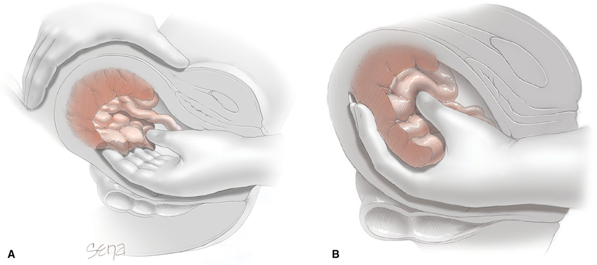

*Figure 27-8. Manual removal: one hand on the fundus, the other sweeps the placenta off the wall and removes it.*

---

## 6. Immediate Postpartum Care
- **The first hour is critical:** laceration repair, **atony most likely now**, hematomas may expand → check uterine tone and perineum often.
- **BP and pulse** immediately and **every 15 min for 2 h**. **Temperature every 4 h for 8 h**, then every 8 h. More often if high risk.
- Examine placenta, membranes and cord (Ch 6).
- **Skin-to-skin contact** (promotes breastfeeding):
  - Mother semi-reclined; dry the baby; chest on breast, legs flexed; warm blankets and cap.
  - Head uncovered, turned to the side, **sniffing position**, mouth and nares clear.
  - Monitor continuously for stability, somnolence, breathing and positioning (**smothering, falls**).

---

## 7. Lower Genital Tract Lacerations

### Perineal laceration classification

| Degree | Structures involved |
|---|---|
| **1st** | Vaginal epithelium or perineal skin only |
| **2nd** | Perineal muscles (**bulbospongiosus, superficial transverse perineal**); anal sphincter spared |
| **3a** | **<50% of EAS** torn |
| **3b** | **>50% of EAS** torn, IAS intact |
| **3c** | **EAS + IAS** torn |
| **4th** | Perineal body, entire sphincter complex **and anorectal mucosa** |

- Cervical and vaginal lacerations → Ch 42.

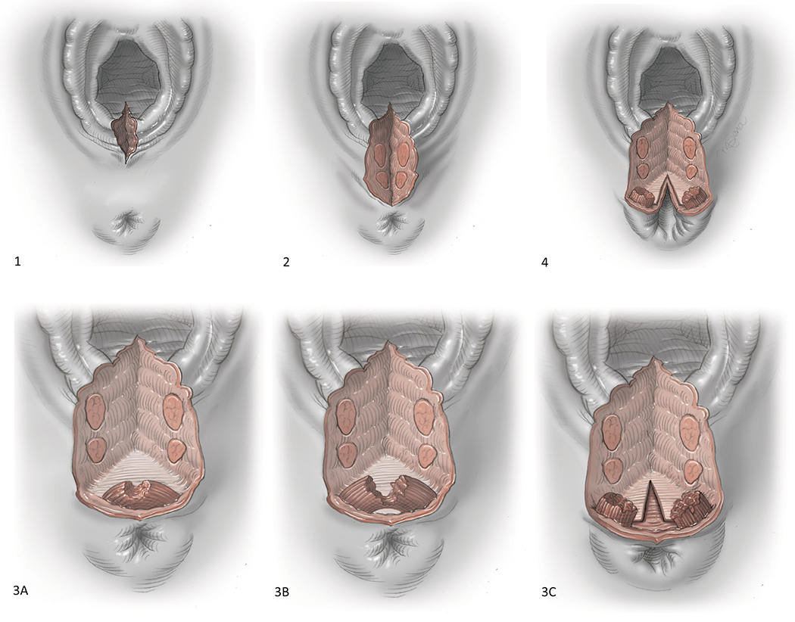

*Figure 27-9. Perineal laceration degrees 1, 2, 3a, 3b, 3c and 4.*

### OASIS
- **Incidence 0.1–5%.**
- **Risk factors:** **nulliparity**, **midline episiotomy**, **persistent OP**, Asian race, ↑ birthweight, **operative vaginal delivery**.
- **Short term:** more blood loss and pain, wound disruption and infection (**~7%** complications).
- **Long term:** anal incontinence **~2×**; **4th > 3rd degree**. Dyspareunia data conflicting.
- **Intrapartum endoanal US** can reveal occult tears but is **not recommended** (ACOG).
- **Next pregnancy:**
  - No anal incontinence after repair → a subsequent vaginal birth does **not** raise the incontinence risk → **vaginal route reasonable**.
  - Recurrence is higher than in multiparas without OASIS, but **similar to primiparas** (low). A **recurrent** OASIS carries substantial incontinence risk.
  - Recurrence factors: **macrosomia, operative vaginal delivery**.
  - **Consider cesarean** with prior postpartum **anal incontinence**, OASIS complications needing **re-repair**, or **psychological trauma**.

### Episiotomy

| Type | Technique | Notes |
|---|---|---|
| **Midline** | From the fourchette through the perineal body, stopping well short of the EAS; **2–3 cm** | **↑ OASIS** |
| **Mediolateral** | From the midline of the fourchette, directed **60 degrees** off midline toward the ischial tuberosity | Heals to **~45 degrees** after crowning distortion resolves. Pain/dyspareunia similar or ↑ short term. **Probably preferred to ↓ OASIS** |
| Lateral | Starts **1–2 cm lateral** to the fourchette midline, toward the ischial tuberosity | vs mediolateral: same pain, sexual QoL, OASIS; mediolateral repair faster and uses less suture |

- **ACOG: selective, not routine** episiotomy (restrictive use ↓ severe perineal trauma).
- **Indications:** fetal jeopardy (speed), shoulder dystocia, breech, macrosomia, operative vaginal delivery, persistent OP, and imminent significant perineal rupture.
- Rates: **↓ 75%** (1979–2006); **~12%** of US vaginal births in 2012.
- **Timing:** when the head is visible to **4–5 cm** during a contraction. Too early → bleeding; too late → tears not prevented.
- **Analgesia:** existing epidural, bilateral pudendal block, or **1% lidocaine**. EMLA (2.5% lidocaine-prilocaine) needs an hour's application.

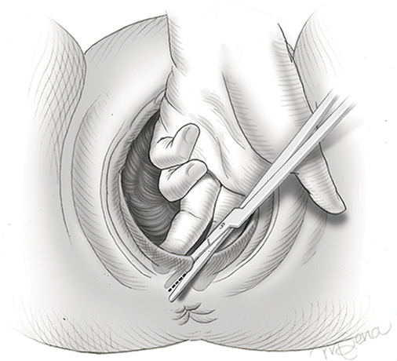

*Figure 27-10. Mediolateral episiotomy cut at crowning, 60 degrees off midline toward the ischial tuberosity.*

---

## 8. Laceration and Episiotomy Repairs
- **Repair after the placenta is delivered** (full attention to separation; no interruption, e.g. for manual removal). Downside: ongoing bleeding → gauze pressure.
- Adequate analgesia (local lidocaine ± pudendal block; top up epidural). **Reconcile needle and sponge counts** and document.

### 1st and 2nd degree / episiotomy
- **1st degree:** doesn't always need suturing (only for bleeding or anatomy). Fine absorbable (chromic) or delayed-absorbable (Vicryl, Monocryl); **skin glue** if hemostatic.
- **2nd degree and episiotomy (same steps):**
  1. **Anchor stitch above the apex** → running locking 2-0 closure of vaginal epithelium and deeper tissue, reapproximating the hymeneal ring
  2. Transition stitch to the perineum
  3. **Superficial transverse perineal + bulbospongiosus** reapproximated with continuous nonlocking suture (restores perineal body)
  4. **Running subcuticular** skin closure; final knot proximal to the hymeneal ring
- **Continuous vs interrupted:** continuous is faster with **less short-term pain**; wound complications and long-term pain the same.
- **Suture:** chromic or **2-0 Vicryl**. Vicryl → less short-term pain, but sometimes needs removal → **Vicryl Rapide** reduces this. Also Monocryl, PDS II. Blunt needles ↓ needle-stick injury.

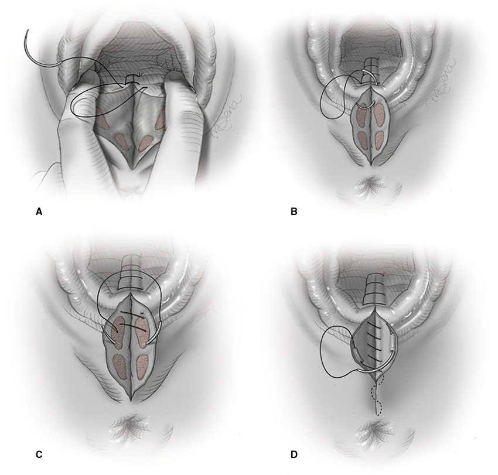

*Figure 27-11. Midline episiotomy repair: vaginal closure from above the apex, transition stitch, perineal muscles, then subcuticular skin.*

### 3rd degree (EAS)
- **End-to-end (authors' preference):** retrieve retracted EAS ends; **strength comes from the perisphincter connective tissue ("capsule")** more than the muscle.
  - **4–6 interrupted 2-0 or 3-0 polyglactin 910** sutures at **12, 3, 6 and 9 o'clock**: posterior first, then inferior (6 o'clock), figure-of-eight through the muscle, then anterior and superior.
- **Overlapping:** ends overlapped and sutured with two rows of mattress sutures; **only for 3c** (complete EAS rupture).
- **Neither technique superior** long term.
- **IAS tear:** running nonlocking **3-0 or 4-0**, repaired **before the EAS**.
- **Delayed-absorbable** suture preferred (chromic → ↑ perineal breakdown).

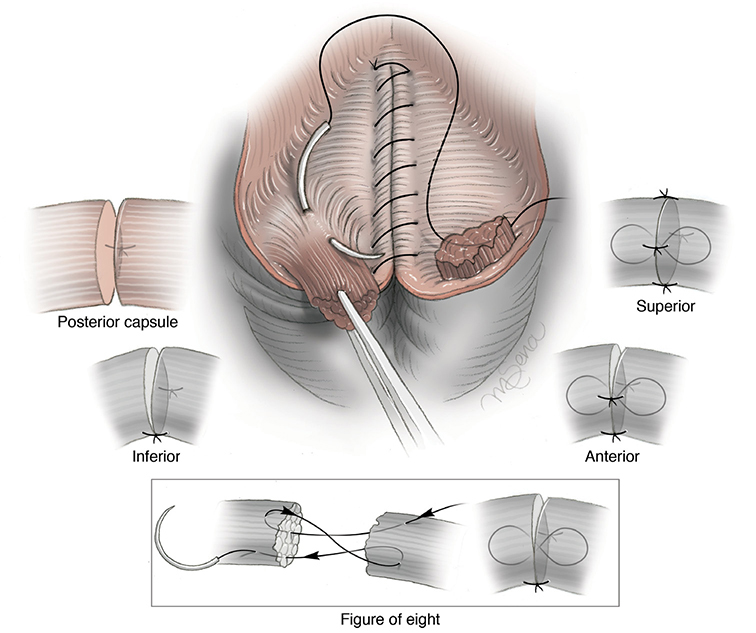

*Figure 27-12. End-to-end EAS repair: interrupted sutures through the capsule at posterior, inferior, anterior and superior positions plus a figure-of-eight through the muscle.*

### 4th degree
- **Anorectal mucosa first:** start **1 cm above the apex**, sutures **~0.5 cm apart** in the rectal muscularis (**not entering the lumen**), running **4-0** delayed-absorbable or chromic, down to the anal verge. ± second reinforcing layer.
- Then **IAS** (glistening white layer between submucosa and EAS; often retracted laterally), then EAS.
- **Antibiotics for OASIS:** a **single dose** at repair may be considered: **2nd-generation cephalosporin**, or **clindamycin** if penicillin-allergic.
- **Post-op:** **stool softeners for 1 week**; **avoid enemas and suppositories**.

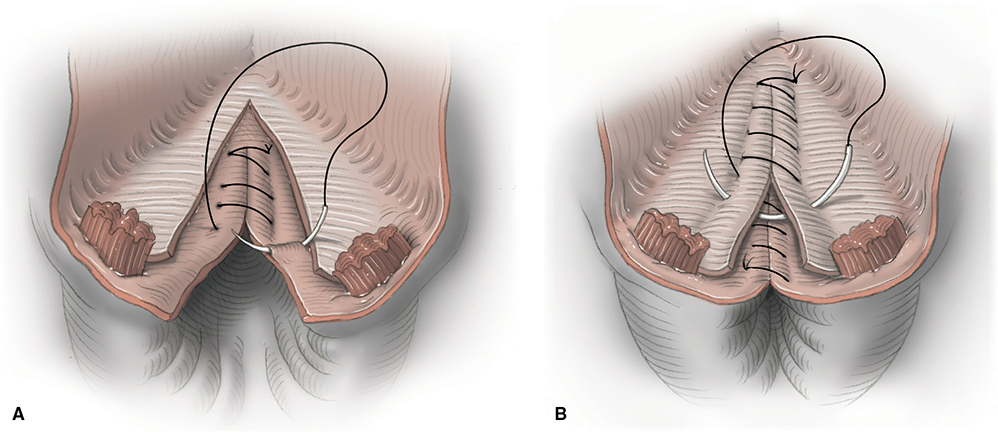

*Figure 27-13. Fourth-degree repair: running submucosal anorectal layer (A), then a reinforcing layer incorporating the IAS (B).*

### Perineal care
- **Ice packs** first (swelling, pain) → later **warm sitz baths**; squirt bottle after voiding/stooling.
- Analgesia: codeine-containing agents; **NSAIDs** for lesser pain.
- ⚠️ **Severe or persistent pain** → examine for **vulvar, paravaginal or ischiorectal hematoma** or **cellulitis** (Ch 37, 42).
- Urinary retention may occur (Ch 36).
- **Intercourse deferred** until after the first postpartum visit (2nd degree/OASIS). Delayed resumption at 3 and 6 months, not at 1 year.

---

## Quick-Recall: Shoulder Dystocia and Third-Stage Essentials

| Topic | Remember |
|---|---|
| Shoulder dystocia definition | Maneuvers needed (ACOG); head-to-body **>60 s** (Spong) |
| Incidence / recurrence | **~1%** / **4–13%** |
| First maneuver | **McRoberts + suprapubic pressure** (down and lateral) |
| Doesn't help plexus injury | **Episiotomy** |
| Zavanelli tocolytic | **Terbutaline 0.25 mg SC** |
| Consider planned cesarean | EFW **>5000 g** (no DM), **>4500 g** (DM) |
| No induction for macrosomia alone | Before **39 wk** |
| Separation signs | Gush, globular fundus, cord lengthening, uterus rises |
| Active management | Early clamping + controlled cord traction + **uterotonic** (the key part) |
| Oxytocin never as | **IV bolus** (hypotension) |
| Methylergonovine contraindicated | **Hypertension** |
| Misoprostol side effects | Fever, diarrhea |
| TXA prophylaxis | **Not recommended** |
| Midline vs mediolateral | Midline ↑ OASIS; mediolateral **60°** cut → heals at 45° |
| Overlapping EAS repair | Only for **3c** |
| After OASIS repair | Stool softener 1 wk; no enemas/suppositories |

## Key Numbers to Memorize
- Persistent OP **~5%** (2–10%); nuchal cord **~25%** at term, tight **~6%**
- Lateral neck deviation **≤25–45°** during traction
- Delayed cord clamping **30–60 s** (term), **≥30 s** (preterm); no cord milking **<29 wk**; clamps **6–8 cm**, cord clamp **2–3 cm**
- Antepartum perineal massage from **34–35 wk**; slow the head once introitus **≥5 cm**
- Shoulder dystocia **1%**; brachial plexus injury **11%**, fracture **2%**; HIE **0.5% vs 24%** (<5 vs ≥5 min)
- Posterior axilla sling success **96%**; Zavanelli success **91%**; symphysiotomy widens **2.5 cm**
- Home birth neonatal mortality **1.3/1000** (~4×); water-birth cord avulsion **3/1000**
- Hydrocephaly vaginal delivery if BPD **<10 cm** or HC **<36 cm**
- Placental separation median **4–12 min**; retained placenta **2%**; 90% delivered by **180 / 21 / 14 min** at 20 / 30 / 40 wk; intervene at **15–20 min** (WHO **60 min**)
- Oxytocin **20 U/L at 10–20 mL/min**, then 1–2 mL/min; **10 U IM**; half-life **3–5 min**
- Methylergonovine **200 µg IM**; misoprostol **400–600 µg PO**; TXA **1 g IV**
- Vitals: BP/pulse **q15 min × 2 h**; temp **q4h × 8 h**
- OASIS **0.1–5%**; anal incontinence **~2×**; episiotomy **~12%** of US births; cut at **4–5 cm** head visibility
