# Chapter 28: Singleton Breech Delivery — Revision Notes

> Williams Obstetrics 26e, pp. 1324–1364 of the PDF. High-yield numbers are in **bold**.
> The one table (28-1) is transcribed from the PDF image (it is missing from the extracted chapter text). All 13 figures are included (Fig 28-9 is printed twice in the PDF, on p1346 and p1347; one copy is used).

**Big picture:** Breech persists in **2–5%** of term singletons. Since the **Term Breech Trial**, planned cesarean dominates, but carefully selected women can still deliver vaginally with a skilled provider. **ECV at ≥37 wk** is the main way to lower the breech cesarean rate.

---

## 1. Classification

| Type | Hips | Knees | Lowest part |
|---|---|---|---|
| **Frank** | Flexed | **Extended** (feet near the head) | Buttocks |
| **Complete** | Flexed (both) | One or both **flexed** | Buttocks, feet alongside |
| **Incomplete** | One or both **extended** | — | A **foot or knee** below the breech |
| **Footling** (a type of incomplete) | — | — | One or both **feet** below the breech |

- **Stargazing fetus:** extreme neck hyperextension in **~5%** of term breeches. **Flying fetus** = the same with a transverse lie.
  - Look for fetal or uterine anomalies.
  - Vaginal delivery can injure the **cervical spinal cord** → **cesarean indicated** at term. (Cord injury has also followed uneventful cesarean; flexion itself may be to blame.)

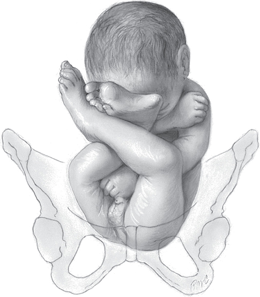

*Figure 28-1. Frank breech: hips flexed, knees extended, feet by the head.*

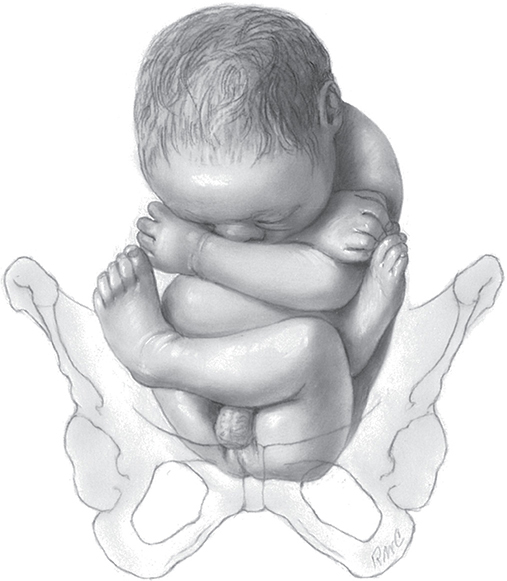

*Figure 28-2. Complete breech: hips and knees flexed, feet beside the buttocks.*

---

## 2. Diagnosis

### Risk factors
- **Preterm** gestation (poles of similar bulk earlier on), **multifetal gestation**.
- Singletons: **extremes of amnionic fluid**, fetal anomalies, **uterine anomalies**, **placenta previa**, nulliparity, ↑ maternal age, **female fetus**, prior breech, **SGA**.
- **Recurrence:** **10%** after one breech delivery; **28%** for a third breech.

### Examination
- **Leopold:**
  - 1st: hard, round **head in the fundus**
  - 2nd: back on one side, small parts on the other
  - 3rd: soft, movable breech above the inlet (if not engaged)
  - 4th: breech beneath the symphysis after engagement
- Palpation accuracy varies → **sonography** if unclear.
- **Vaginal exam (frank):** ischial tuberosities, sacrum, anus; later the genitalia.
- **Breech vs face** (a swollen breech can mimic a face):

| Feature | Breech | Face |
|---|---|---|
| Opening | **Anus:** muscular resistance; finger may be **meconium-stained** | **Mouth:** bony jaws and palate |
| Landmark geometry | Ischial tuberosities + anus in a **straight line** | Malar eminences + mouth form a **triangle** |

- **Position** is named by the **fetal sacrum**: LSA (back up, sacrum in the maternal left upper/ventral quadrant), RSA, LSP/RSP, LST/RST.

---

## 3. Delivery Route
- Factors: parity, pelvic size, pregnancy complications, **provider experience**, patient preference, hospital capability, fetal size, anatomy and GA.

### Table 28-1. Factors Favoring Cesarean Delivery of the Breech Fetus

| Category | Factors |
|---|---|
| **Clinical characteristics** | Lack of operator experience; patient request for cesarean delivery; prior perinatal death or neonatal birth trauma |
| **Sonographic fetal characteristics** | Large fetus: **>3800 to 4000 g**; severe fetal-growth restriction; term weight **<2500 to 2800 g**; **oligohydramnios**; fetal anomaly incompatible with vaginal delivery; **incomplete breech** presentation; **hyperextended neck**; apparently healthy, viable **preterm** fetus either with active labor or with indicated delivery |
| **Maternal characteristics** | Pelvic contraction or unfavorable pelvic shape determined clinically or with pelvimetry; **prior cesarean delivery** |

*Compiled from text references.*

### Term breech fetus

**Term Breech Trial (Hannah, 2000)**: 1041 planned cesarean vs 1042 planned vaginal

| Outcome | Planned cesarean | Planned vaginal |
|---|---|---|
| **Perinatal mortality** | **3/1000** | **13/1000** |
| **"Serious" neonatal morbidity** | **1.4%** | **3.8%** |
| Short-term maternal morbidity | Similar | Similar |

- Only **57%** of the planned-vaginal group actually delivered vaginally.
- **Criticism:** <10% had radiological pelvimetry; most "serious morbidity" outcomes didn't predict long-term disability. **2-year follow-up: death and neurodevelopmental delay similar.**
- **Supporting cesarean:** WHO (>100,000 deliveries, 9 Asian countries) and others. Meta-analysis absolute risks with vaginal breech: perinatal mortality **0.3%**, birth trauma/neurologic morbidity **0.7%**.
- **Supporting vaginal birth (with strict selection):**
  - **PREMODA** (France, >8000; 2526 selected for planned vaginal, **71%** delivered vaginally): **no difference** in corrected neonatal mortality/outcomes; maternal severe morbidity similar.
  - Lille group: no excess morbidity with strict biometry + pelvimetry.
  - Eide: IQ of >8000 breech-born men unaffected by route.
- US planned vaginal attempts keep falling → **fewer skilled providers**; simulators used for training.
- **Selection criteria for term vaginal breech:**
  - **EFW >2500–2800 g and <3800–4000 g**
  - **No FGR, no oligohydramnios**
  - **Prior cesarean** = rupture risk; limited data suggest worse perinatal outcome (and prior cesarean for arrest suggests a contracted pelvis) → generally avoided
  - **Positive factors:** parity/prior vaginal birth, **spontaneous labor with a normal labor curve**

### Preterm breech fetus
- **No RCTs.** Observational data biased (GA groupings, resuscitation thresholds, poor-prognosis fetuses delivered vaginally, incomplete steroids/antibiotics).
- Overall, **planned cesarean confers a survival advantage** (24–32 wk: low vaginal success, ↑ neonatal mortality; meta-analysis >3500 women). One cohort at 26–34 wk found similar outcomes.
- **23–28 wk:** conflicting data.
- Cesarean avoids anoxia, trauma and **head entrapment**, but often needs a **classical incision** (poor lower segment) → ↑ blood loss, infection, **future rupture**.
- **Periviable (20–25⁶/₇ wk) workshop:** data don't consistently support routine cesarean.
- **ACOG/SMFM:** **consider cesarean from 23⁰/₇ wk; recommend from 25⁰/₇ wk**.
- **32–37 wk:** similar perinatal mortality/morbidity with planned cesarean vs vaginal (>6800).
- → **Individualize** (skill, GA, parity, labor curve, facility). **No resuscitation planned → vaginal delivery likely preferable.**

### Delivery complications
- **Maternal:**
  - Genital tract lacerations with either route. At cesarean, forceps or an unmolded head can **extend the hysterotomy**.
  - Vaginally: head through an incompletely dilated cervix or forceps → vaginal/cervical tears, even **uterine rupture**; episiotomy extension, deep tears, cervical incision, infection.
  - Inhalational anesthesia for uterine relaxation → **atony and PPH**.
  - **Maternal death** higher with planned cesarean for breech: **0.47/1000**.
- **Fetal:** prematurity, ↑ **congenital anomalies**, ↑ **cord prolapse**:

| Breech type | Cord prolapse (Collea) |
|---|---|
| Frank | **~0.5%** |
| Complete | **~5%** |
| Footling | **up to 15%** |

- Rare injuries (more with vaginal birth): humeral/clavicular fracture, brachial plexus injury, **sternocleidomastoid** trauma, epiphyseal separation (scapula, humerus, femur), spinal cord/vertebral injury, genital injury.
- Cesarean does **not** protect against **femur or skull fractures**.
- **Hip dysplasia** is linked to breech **position itself**, not delivery mode.

> **Memory hook:** Cord prolapse "**half, five, fifteen**" = frank, complete, footling.

### Imaging
- Sonography confirms presentation and excludes gross anomalies (hydrocephaly, anencephaly), avoiding emergency cesarean for a nonsurvivable fetus.
- ⚠️ In preterm or growth-restricted fetuses the **breech is smaller than the aftercoming head**, and the breech head **does not mold**.
- Assess **fetal size, breech type, neck flexion** (two-view abdominal x-ray can show head inclination).
- **Nuchal arm or nuchal cord** on sonography → may warrant cesarean.
- EFW accuracy is **not** altered by breech.
- **BPD >90–100 mm** is often exclusionary.

**Pelvimetry** (some protocols; Parkland instead relies on **steady labor progress**). CT favored (accurate, low dose, available); MR or plain film also fine.

| Measurement | Threshold for planned vaginal birth |
|---|---|
| Inlet AP diameter | **≥10.5 cm** |
| Inlet transverse diameter | **≥12.0 cm** |
| Midpelvic interspinous distance | **≥10.0 cm** |
| Obstetrical conjugate − BPD | ≥15 mm |
| Inlet transverse − BPD | ≥25 mm |
| Interspinous − BPD | ≥0 mm |
| MR: interspinous >11 cm + true conjugate >12 cm | ~75% vaginal success |

---

## 4. Labor and Delivery

### Labor management
- **Team:** (1) provider skilled in breech extraction, (2) assistant, (3) **anesthesia**, (4) newborn resuscitation. **IV access.**
- Don't do pelvimetry if labor is too advanced (risk of delivery in radiology); stepwise progress is itself evidence of pelvic adequacy.
- **One-on-one nursing** (cord prolapse). Continuous EFM preferred; at minimum FHR **every 15 min** in 1st stage. **Scalp electrode on the buttock, avoiding genitalia.**
- **After membrane rupture:** immediate vaginal exam + watch FHR for **5–10 min** (↑ prolapse risk with small/preterm or non-frank breech).
- **Epidural:** may ↑ augmentation and prolong 2nd stage, but gives pain relief and pelvic relaxation for manipulation. Must cover **episiotomy, extraction and Piper forceps**. Nitrous oxide adjunct; general anesthesia must be inducible quickly.

**Second stage**

| Phase | Data / recommendation |
|---|---|
| **Passive** (breech descends to the perineum) | Recommended. PREMODA: <30 min in 60%, >60 min in only 20%. Some: **cesarean if breech not visible after 1½–2 h** |
| **Active** (pushing once breech visible) | **Hands-off** preferred. PREMODA: **<30 min in 95%** of successes. **>20 min ↑ adverse outcome**; Term Breech Trial lowest risk if **<30 min**; risk ↑ if >40 min. Canada: **cesarean if not delivered/imminent after 60 min** of pushing |

### Induction or augmentation
- Controversial, retrospective data. Meta-analysis: induction → **NICU admission 3% (2× spontaneous labor)**, **cesarean 33%**.
- Breech labor is slower, but steady progress indicates adequate pelvis. Some avoid augmentation; others use it only for hypotonic contractions.
- **Parkland:** amniotomy OK, but **cesarean rather than pharmacologic induction/augmentation**.

### Vaginal delivery methods

| Method | Definition |
|---|---|
| **Spontaneous breech delivery** | Entire fetus expelled with **no traction/manipulation**, only support |
| **Partial breech extraction** | Spontaneous **to the umbilicus**; the rest by provider traction and maneuvers |
| **Total breech extraction** | **Entire body extracted** by the provider |

### Spontaneous breech delivery (cardinal movements)
1. Engagement/descent with the **bitrochanteric diameter in an oblique** diameter; anterior hip descends faster.
2. **Internal rotation 45 degrees** → anterior hip to the pubic arch; bitrochanteric diameter in the AP of the outlet.
3. Anterior hip at the vulva → **lateral flexion** delivers the posterior hip over the perineum → legs follow.
4. Slight **external rotation, back turning anteriorly**; shoulders enter an oblique, then rotate so the **bisacromial diameter is AP**.
5. Head, **sharply flexed**, enters in an oblique, rotates the **nape under the symphysis**, and is **born in flexion**.

**Caution**
- **Back-posterior rotation is prevented** if possible: the slightest traction can **extend the head** → a longer diameter must pass.

---

## 5. Partial Breech Extraction
- Successively **larger, less compressible parts** are born → spontaneous expulsion is the exception.
- **Episiotomy** (mediolateral preferred) unless the perineum is lax.
- Let the breech deliver **spontaneously to the umbilicus**. Once past the introitus, the cord is drawn into the pelvis → **abdomen, thorax, arms and head must follow promptly**.
- Posterior hip usually delivers at **6 o'clock** (often with thick meconium) → anterior hip → external rotation to **sacrum anterior**.

**Legs:** fingers **parallel to the femur** (avoids femoral fracture); press in the popliteal fossa → knee flexes → deliver the foot; sweep each leg **up and laterally** away from the midline.

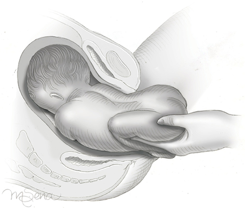

*Figure 28-3. Delivering a leg: fingers along the femur, popliteal pressure flexes the knee and brings the foot within reach.*

**Body:** **thumbs on the sacrum, fingers on the anterior superior iliac crests** (not the abdomen, to avoid soft-tissue injury). Maternal pushing + downward traction.

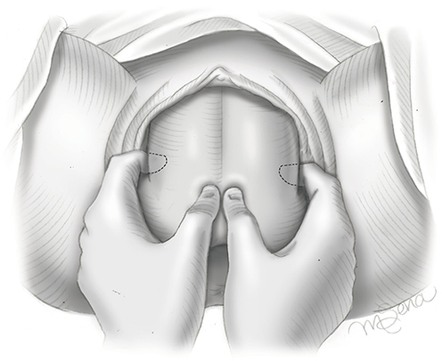

*Figure 28-4. Pelvic grip: thumbs over the sacrum, index fingers over the iliac crests; gentle downward traction until the scapulas show.*

- **Cardinal rule:** steady, gentle, **downward traction until the lower halves of the scapulas deliver**. Don't attempt the arms until **one axilla is visible**. Either shoulder may be first.

**Arms**
- **Method 1 (trunk rotation):** rotate the trunk to bring the anterior shoulder into view; **splint the humerus** with fingers parallel (perpendicular force → **humeral fracture**); then rotate **180 degrees the other way** for the second arm.
- **Method 2 (posterior arm first)** if rotation fails: lift the feet up over the mother's inner thigh; hand over the posterior shoulder, sweep the arm up and out over the perineum; then **depress the body** → the anterior shoulder delivers under the pubic arch. The back then turns to the symphysis.

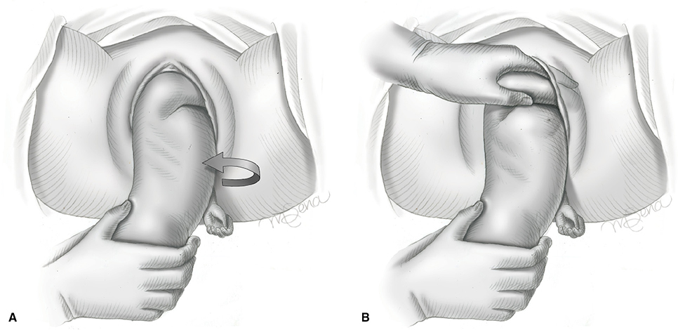

*Figure 28-5. After the first arm, a 180-degree rotation (to RST) brings the other shoulder forward; fingers splint the humerus and sweep it across the chest.*

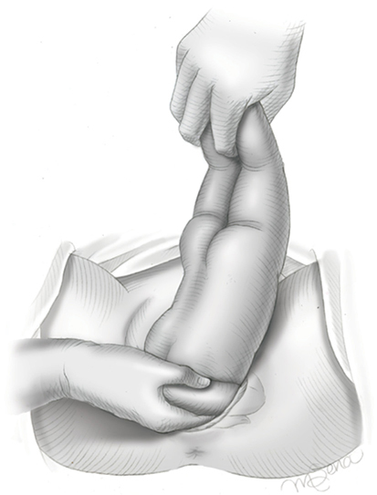

*Figure 28-6. Posterior arm first: body lifted over the maternal groin, fingers under the posterior shoulder along the humerus.*

### Nuchal arm
- Arm(s) trapped **behind the neck** at the inlet.
- **Rotate the fetus through a half circle** so birth-canal friction draws the elbow toward the face:
  - **Right nuchal arm → counterclockwise** (back to maternal right)
  - **Left nuchal arm → clockwise** (back to maternal left)
- If that fails: push the fetus up to a roomier part of the pelvis and retry, or **extract** the arm (fingers along the humerus, flex the elbow, sweep down the ventral surface). **Humeral or clavicular fracture is common.**

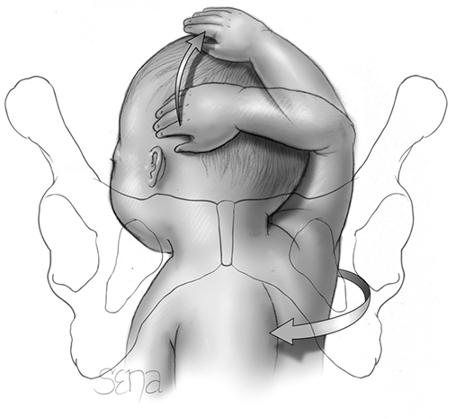

*Figure 28-7. Right nuchal arm: rotate the body 180 degrees counterclockwise so friction pulls the elbow toward the face.*

### Delivery of the aftercoming head (avoid neck hyperextension)

| Maneuver | Technique |
|---|---|
| **Mauriceau** | Index + middle fingers on the **maxilla** (flex the head); body on the palm/forearm, legs straddling it. Other hand's two fingers hook over the **shoulders**. Downward traction until the **suboccipital region** is under the symphysis; **assistant's suprapubic pressure** keeps flexion. Then lift the body toward the maternal abdomen → mouth, nose, brow, occiput emerge |
| **Piper forceps** (or Laufe-Piper) | Elective or if Mauriceau fails. Apply only once the head is **engaged** (traction + suprapubic pressure). Body suspended in a towel. Shank has a **downward arch** and **no pelvic curve**. **Left blade in the left hand** for the maternal left side first, then the right. Pull outward while slightly raising the handle; face rolls over the perineum, occiput stays under the symphysis until the brow delivers |
| **Modified Prague** | For a back that **fails to rotate anteriorly**: two fingers grasp the shoulders from below while the other hand draws the **feet up over the maternal abdomen** |

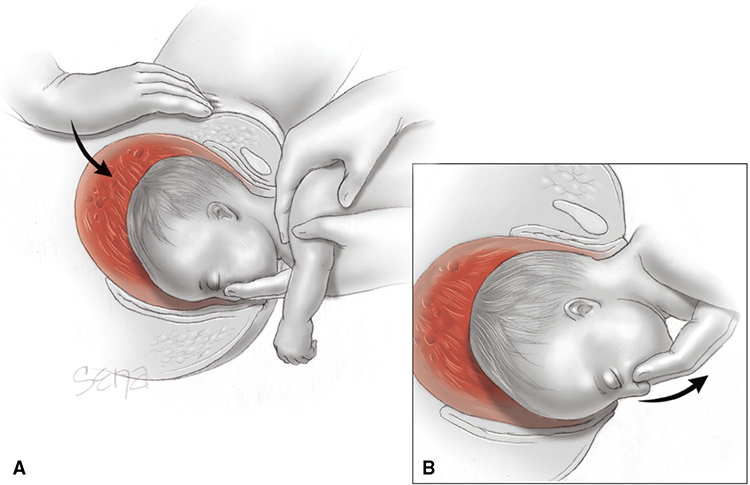

*Figure 28-8. Mauriceau maneuver: maxillary pressure plus assistant's suprapubic pressure keeps the head flexed.*

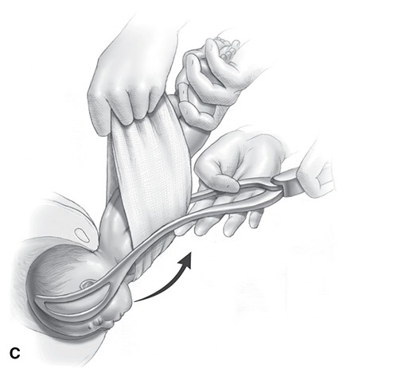

*Figure 28-9. Piper forceps to the aftercoming head (panel C of 3): body held up in a towel, head delivered in flexion by pulling out while raising the handle.*

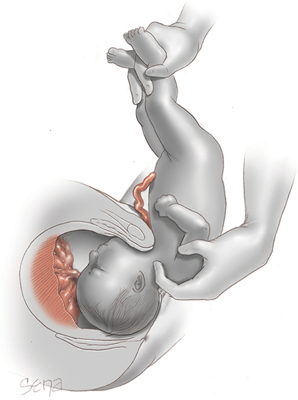

*Figure 28-10. Modified Prague maneuver for the back-down fetus.*

### Head entrapment (a true emergency: assume cord compression)
- **Incompletely dilated cervix** (especially small preterm fetus):
  1. Gentle traction + **manually slip the cervix over the occiput**
  2. **Dührssen incisions** at **2 o'clock**, then **10 o'clock** if needed, rarely **6 o'clock** (avoid the lateral cervical branches of the uterine artery); repair after delivery
  3. **General anesthesia with halogenated agents** to relax the lower segment
  4. **Zavanelli** (replace the fetus, then cesarean)
- **Cephalopelvic disproportion** with arrested head → **Zavanelli or symphysiotomy**.

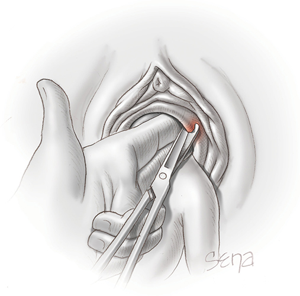

*Figure 28-11. Dührssen incision at 2 o'clock (then 10, rarely 6 o'clock) to free a head trapped by the cervix.*

---

## 6. Total Breech Extraction
- **Frank breech:** moderate traction with **a finger in each groin** + generous episiotomy; then as for partial extraction.
- **Pinard maneuver (decomposition)**: converts a frank breech into a **footling** inside the uterus.
  - Easier soon after membranes rupture; very hard with scant fluid and a tight uterus → relax with **general anesthesia, IV magnesium, nitroglycerin or a betamimetic**.
  - Two fingers along a leg press the medial thigh parallel to the femur (externally rotating the hip) + **popliteal pressure** → knee flexes → foot touches the back of the hand → bring it down.
- **Complete/incomplete breech** (when rapid progress prevents cesarean):
  - Hand in the vagina grasps **both feet**, **middle finger between the ankles**; pull gently; grasp successively higher parts; deliver the hips; thumbs on sacrum, fingers on iliac crests; finish as partial extraction.
  - **Only one foot:** hold it with the **matching hand** (right hand for right foot); other hand follows the leg to find the second foot. If that hip is flexed with the knee extended, hook a finger in the groin.
- The same maneuvers help deliver a breech **through a hysterotomy**.

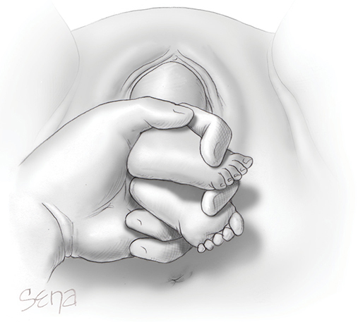

*Figure 28-12. Total breech extraction starts with traction on both feet and ankles.*

---

## 7. External Cephalic Version (ECV)
- **Version** = substituting one pole for the other or converting oblique/transverse to longitudinal.
  - **ECV:** transabdominal → cephalic.
  - **Internal podalic version:** intrauterine → breech; **reserved for the second twin** (Ch 48).

### Indications and timing
- Success **50–60%**; **higher for transverse lie**.
- Performed **before labor at ≥37⁰/₇ wk**:
  - Balances immaturity vs more fluid earlier.
  - Before 37 wk: ↑ ECV success but **no ↓ cesarean** and ↑ **late-preterm birth**; spontaneous correction still likely; reversion possible.
  - Iatrogenic early-term delivery complications are generally not severe.
- **Absolute contraindication:** vaginal delivery not an option (e.g., **placenta previa**).
- **Relative contraindications:** early labor, **oligohydramnios or ruptured membranes**, known nuchal cord, structural uterine anomaly, **FGR**, **multifetal gestation**, prior abruption or its risk factors.
- **Prior cesarean:** pooled >100 attempts, no ruptures; Parkland does not attempt.
- **Favorable factors:** **multiparity, unengaged presenting part, nonanterior placenta, nonobese, abundant fluid**. A 2-L IV bolus or amnioinfusion does **not** help. Dedicated breech teams may ↑ success.

### Complications
- Small risks: **abruption, preterm labor, fetal compromise**.
- **Bradycardia is common**; emergency cesarean **≤0.5%**.
- Rare: uterine rupture, **fetomaternal hemorrhage, alloimmunization**, AFE, maternal/fetal death.
- Perinatal morbidity/mortality **not higher** than expectant care.
- After successful ECV, cesarean rates **don't fully fall to vertex baseline** (dystocia, malpresentation, abnormal FHR).

### Technique
1. Near facilities for emergency cesarean; **IV access**; **NPO 6 h** (clear liquids until **2 h** before).
2. **Sonography:** confirm nonvertex, adequate fluid, exclude anomalies, placental site, spine orientation.
3. **NST** beforehand (reactivity).
4. **Anti-D immune globulin for Rh D–negative women.**
5. ± **Tocolysis** and **regional analgesia**.
6. **Left lateral tilt + Trendelenburg**; plenty of gel; monitor fetal heart sonographically.
7. **Forward roll first**: lift the breech out of the pelvis, displace laterally, guide toward the fundus while the head goes to the pelvis. Then **backward flip** if needed.
8. **Stop** for excessive discomfort, persistent abnormal FHR, or multiple failures.

**After the attempt**
- **After failed ECV:** spontaneous version **7%** (**2% nulliparas, 13% multiparas**).
- **After success:** repeat NST until normal.
  - Transient abnormal FHR **6–9%** → IV fluids, O₂, lateral tilt. Immediate cesarean for tracing only **0.2–0.4%**; a resolved transient tracing does **not** predict later distress.
- **Successful ECV before 39 wk → await spontaneous labor** (immediate induction linked to ↑ cesarean).

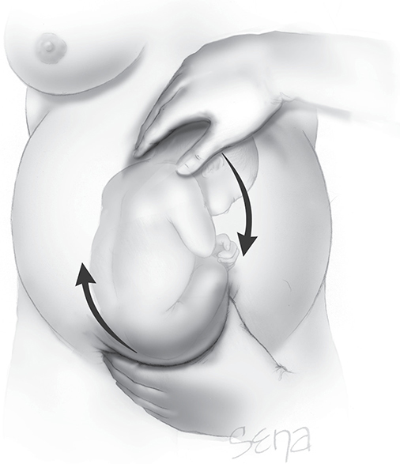

*Figure 28-13. ECV forward roll: clockwise pressure on both fetal poles.*

### Adjuncts

| Adjunct | Evidence |
|---|---|
| **Tocolysis (betamimetics)** | ↑ success. **SC terbutaline 52% vs 27%** without. Parkland: **terbutaline 250 µg SC**, start once **maternal tachycardia** appears. Crosses placenta (mild ↑ FHR baseline) |
| Other tocolytics | Nifedipine, nitroglycerin, atosiban, salbutamol: limited or unsupportive |
| **Regional analgesia + tocolysis** | ↑ success vs tocolysis alone; **no ↑** FHR changes, emergency cesarean or abruption. Spinal or epidural both reasonable (spinal headache risk) |
| IV sedation, nitrous oxide | **No** improvement |

### Moxibustion
- Burning **mugwort (*Artemisia vulgaris*, moxa)** at acupuncture point **BL 67** to ↑ fetal movement and spontaneous version.
- Done at **33–36 wk** (so ECV is still possible). RCT results **conflicting**.

---

## Quick-Recall: Breech Maneuvers

| Problem / step | Maneuver |
|---|---|
| Frank breech legs out of reach | **Pinard** (popliteal pressure → knee flexion) |
| Delivering the body | Thumbs on **sacrum**, fingers on **iliac crests** |
| Arms | Trunk rotation 180° each way (splint humerus), or posterior arm first |
| Nuchal arm (right) | Rotate **counterclockwise** |
| Nuchal arm (left) | Rotate **clockwise** |
| Aftercoming head | **Mauriceau** (maxilla + shoulders + suprapubic pressure) |
| Aftercoming head (alt.) | **Piper forceps** (no pelvic curve, head must be engaged) |
| Back won't rotate anteriorly | **Modified Prague** |
| Cervix trapping the head | **Dührssen** incisions at 2, 10 (6) o'clock; halogenated GA |
| CPD with trapped head | **Zavanelli** or **symphysiotomy** |
| Breech → cephalic antepartum | **ECV** ≥37 wk, terbutaline 250 µg SC ± neuraxial |
| Second twin → breech | **Internal podalic version** |

## Key Numbers to Memorize
- Term breech **2–5%**; stargazing **~5%**; recurrence **10%** (second), **28%** (third)
- Term Breech Trial: perinatal mortality **3 vs 13/1000**; serious morbidity **1.4 vs 3.8%**; only **57%** delivered vaginally
- PREMODA: **71%** vaginal success in selected women
- Vaginal candidate EFW **2500–2800 to 3800–4000 g**; BPD **>90–100 mm** excludes
- Pelvimetry: inlet AP **≥10.5**, transverse **≥12.0**, interspinous **≥10.0 cm**
- Cord prolapse: frank **0.5%**, complete **5%**, footling **15%**
- Maternal death with planned breech cesarean **0.47/1000**
- Periviable: consider cesarean from **23⁰/₇**, recommend from **25⁰/₇ wk**
- FHR every **15 min** (minimum); watch **5–10 min** after membrane rupture
- Passive 2nd stage: cesarean if breech not visible by **1½–2 h**; active pushing ideally **<30 min**, cesarean after **60 min**
- Induction: NICU **3%**, cesarean **33%**
- ECV at **≥37 wk**; success **50–60%**; terbutaline **250 µg** SC (**52% vs 27%**); emergency cesarean **≤0.5%**; transient abnormal FHR **6–9%**; spontaneous version after failure **7%**
- NPO **6 h** (clear liquids until **2 h**); moxibustion at **33–36 wk**
