# Chapter 29: Operative Vaginal Delivery — Revision Notes

> Williams Obstetrics 26e, pp. 1365–1404 of the PDF. High-yield numbers are in **bold**.
> The three tables (29-1 to 29-3) are transcribed from the PDF images (they are missing from the extracted chapter text). 13 of the 15 figures are included (Figs 29-4 and 29-5, blade-insertion close-ups, are omitted).

**Big picture:** Operative vaginal delivery (OVD) = forceps or vacuum traction that adds to maternal pushing. **Station and rotation** decide the risk. The right comparator is **second-stage cesarean**, not spontaneous birth. **Forceps → more maternal (OASIS) injury; vacuum → more scalp/extracranial fetal injury.**

---

## 1. Incidence and Indications
- US OVD rate: **3.1% (2015)**, down from **9% (1990)**. **Vacuum : forceps ≈ 4 : 1.**
- **Failure to achieve vaginal birth:**
  - All US (2006): forceps **0.4%**, vacuum **0.8%**
  - Term nulliparas (25 academic hospitals): forceps **4.4%**, vacuum **6.4%**
- **Indication:** any condition threatening mother or fetus that delivery will relieve, if technically safe.
  - **Maternal (most common):** **maternal exhaustion, prolonged second stage** (no defined maximum second-stage length mandates OVD). Also conditions limiting pushing or needing expedited delivery: severe/acute pulmonary compromise, intrapartum infection with decompensation, neurological disease, serious cardiac disease.
  - **Fetal:** **nonreassuring FHR**, **premature placental separation**.

---

## 2. Classification and Prerequisites
- **Station** = cm above/below the **interspinous line (0 station)**; range **−5 to 0 to +5**.
- Categories: **outlet, low, midpelvic**; most are low or outlet.
- ⚠️ **High forceps (above 0 station) have no place in current obstetrics.**

### Table 29-1. Operative Vaginal Delivery Prerequisites and Classification According to Station and Rotationᵃ

| Procedure | Criteria |
|---|---|
| **Outlet forceps** | Scalp is visible at the introitus **without separating the labia**; fetal skull has reached **pelvic floor**; fetal head is at or on perineum; head is OA or OP **or** head is right or left OA or OP position but rotation **≤45 degrees** |
| **Low forceps** (2 types) | Fetal station is **≥+2 cm but not on the pelvic floor**, and: (a) rotation **≤45 degrees** is required **or** (b) rotation **>45 degrees** is required |
| **Midforceps** | Fetal station is **between 0 and +2 cm** |

**Prerequisites**

| | | |
|---|---|---|
| Engaged head | Experienced operator | No fetal coagulopathy |
| Vertex presentationᵇ,ᶜ | Ruptured membranes | No fetal demineralization disorder |
| Known fetal head position | **Completely dilated cervix** | Informed consent completed |
| CPD not suspected | Adequate anesthesia | **Willingness to abandon OVD** |
| Fetal weight estimated | Emptied maternal bladder | |

*ᵃClassification for the vacuum delivery is the same as for forceps except that vacuum is used for traction but **not rotation**. ᵇForceps, but not vacuum extractor, may be used for delivery of a **mentum anterior face** presentation. ᶜPiper forceps may be used to deliver the head during breech delivery. CPD = cephalopelvic disproportion; OA = occiput anterior; OP = occiput posterior; OVD = operative vaginal delivery.*

- SMFM publishes a preprocedural **checklist and documentation template**.
- **Vacuum: ideally not <34 wk** (cranial hemorrhage risk). No recent **fetal scalp blood sampling** before vacuum.
- **Know the head position**; sonography (orbits, nasal bridge) helps when unclear.
- **Analgesia:** regional preferred for low/mid; **pudendal** may suffice for outlet. Newer/early epidurals do **not** ↑ OVD rates.
- **Empty the bladder.** Urinary retention is common after OVD (episiotomy and epidural add risk) → usually resolves with **24–48 h** of catheter drainage.

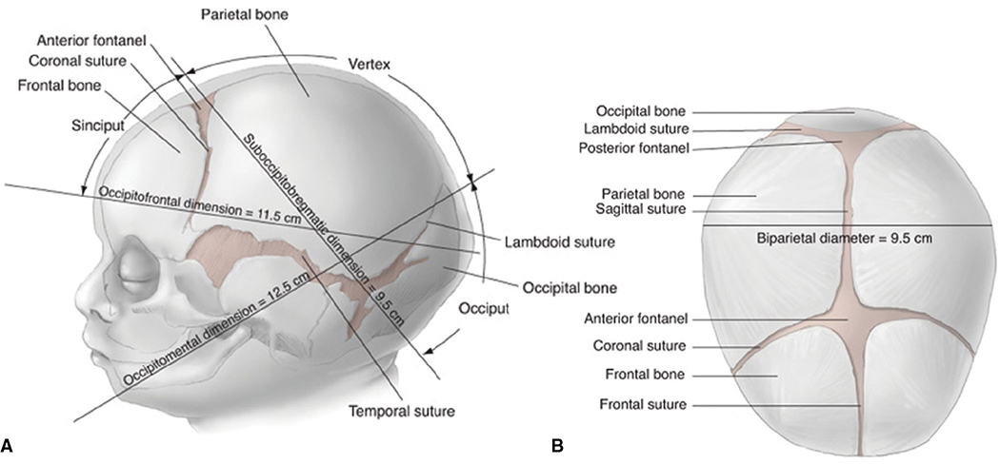

*Figure 29-1. Term fetal head: occipitofrontal 11.5 cm, occipitomental 12.5 cm, suboccipitobregmatic 9.5 cm, biparietal 9.5 cm; fontanels and sutures used to confirm position.*

---

## 3. Morbidity
- Higher station and more rotation → harder procedure, more injury.
- **Compare with cesarean** (the real alternative), not spontaneous birth.

### Maternal morbidity

**Lacerations**
- OVD ↑ **3rd/4th-degree (OASIS)**, vaginal wall and (less often) cervical tears vs spontaneous birth, and far more than cesarean.
- **Forceps > vacuum** for OASIS, especially with a **midline episiotomy**.
- **OASIS protection:**
  - **Indicated, not routine, episiotomy**; if needed, **mediolateral** (better OASIS protection; pain/dyspareunia similar or ↑)
  - **Early forceps disarticulation/removal** (avoid full distention by blades + head)
  - **Stop maternal pushing** during disarticulation/crowning → operator controls the force
  - **Dedicated assistant bolstering the perineum** (authors' practice)
  - **Rotate OP → OA** (manual or forceps), since OP ↑ OASIS

**Infection and future pregnancy**
- Cesarean, not OVD, is a risk for **peripartum hysterectomy** (>1 million births).
- Avoiding cesarean avoids future previa, accreta, rupture and adhesions. Wound/uterine infection more frequent after cesarean than OVD.
- **ANODE trial** (~3500 OVDs): single IV **amoxicillin–clavulanic acid** → puerperal infection **11% vs 19%** (placebo).
- **ACOG:** prophylaxis "reasonable" but **no routine antibiotics for all OVD**. **Single dose reasonable with 3rd/4th-degree lacerations.**

**Pelvic floor disorders**

| Disorder | Link with OVD |
|---|---|
| Urinary incontinence | Parity and vaginal birth are risks; OVD **not clearly worse** than vaginal birth alone |
| Anal incontinence | Conflicting; **OASIS rather than delivery mode** is probably the main link (OVD ↑ OASIS). **Cesarean not protective long term** |
| Pelvic organ prolapse | Mixed. **Levator ani avulsion** (esp. with **forceps**) implicated; OVD without avulsion → no ↑ POP |

### Perinatal morbidity
- OVD has **higher fetal injury risk than cesarean or spontaneous birth**; risk rises with duration, number of pulls and **pop-offs**.

| Instrument | Characteristic injuries |
|---|---|
| **Vacuum** (more injuries overall) | **Cephalohematoma, subgaleal hemorrhage, retinal hemorrhage**, jaundice from these, clavicular fracture, scalp lacerations |
| **Forceps** | **Facial nerve injury, brachial plexus injury, depressed skull fracture, corneal abrasion** |
| Both | Shoulder dystocia |

- **Intracranial hemorrhage:** vacuum higher in some studies, equal in others. Rates are **similar for vacuum, forceps and cesarean during labor**, but higher than spontaneous birth or **prelabor cesarean** → the common factor is **abnormal labor**.
- Werner (>150,000): forceps had **fewer total neurological complications** (seizures, IVH, SDH) than vacuum or any cesarean.
- **Acidemia/HIE** not higher with OVD vs second-stage cesarean.
- **Rotational OVD (Kielland, rotational vacuum) vs second-stage cesarean:** similar maternal and neonatal morbidity.
- **Low vs midforceps:** comparable neonatal morbidity (mostly older data).
- **Midpelvic OVD vs second-stage cesarean (Muraca):**
  - **Dystocia indication:** fetal and maternal morbidity **higher with OVD**
  - **Distress indication:** neonatal morbidity ↑ only with **midpelvic vacuum**; maternal morbidity ↑ only with **midforceps**

**Mechanisms**
- Cephalohematoma/subgaleal: **suction ± rotation shears vessels**.
- Intracranial hemorrhage: fracture lacerating vessels, or force alone.
- **Facial palsy:** blade compresses the nerve against the facial bones.
- **Brachial plexus:** "**shoulder dystocia at the pelvic inlet**": head descends while shoulders stay above the inlet; traction stretches the plexus.

**Long-term:** reassuring. No link with **epilepsy** (>21,000) or **cerebral palsy**; neurodevelopment similar after successful forceps, failed forceps + cesarean, or cesarean alone; midpelvic OVD not harmful.

### Trial of OVD and sequential instruments
- An expected-difficult OVD is a **trial**, ideally **in the operating room** with immediate cesarean available.
  - Forceps won't apply satisfactorily → **stop** → vacuum trial or cesarean. Vacuum with **no descent** → cesarean.
  - Cesarean after a prepared trial: **no worse neonatal outcome** (reassuring FHR). **Unexpected** failure without preparation → ↑ neonatal morbidity.
- **Failure risks:** **persistent OP**, **birthweight >4000 g** (but prediction is poor). Attempt only if success is likely.
- **Sequential instruments** (usually vacuum → forceps) **significantly ↑ fetal trauma** → **ACOG: avoid unless a "compelling and justifiable reason."**

---

## 4. Forceps Delivery

### Design
- **Forceps** = the pair; each half = a **branch**, named **left/right by the maternal side** it is applied to.
- **Four components:** **blade, shank, lock, handle**. Blade has a toe, heel and two curves:
  - **Cephalic curve** (outward) fits the fetal head
  - **Pelvic curve** (upward) fits the birth canal

| Feature | Options | Trade-offs |
|---|---|---|
| Blade | **Solid**; **fenestrated** (true window); **pseudofenestrated** (smooth outside, indented inside) | Fenestration ↓ head slippage in rotation but ↑ thickness/friction; pseudofenestration aims for both grip and easy insertion |
| Shanks | **Parallel** (e.g. Simpson) vs **overlapping** (e.g. Luikart) | Parallel: ↓ head compression but wider at the introitus. Overlapping: ↑ compression, ↓ perineal distention (best for **outlet**) |
| Lock | **English** (end of shank near handles), **pivot** (end of handles), **sliding** (along the shank) | Sliding lock allows correction of asynclitism |
| Handle | — | Squeezing ↑ **compression**; forces = **traction + compression** |

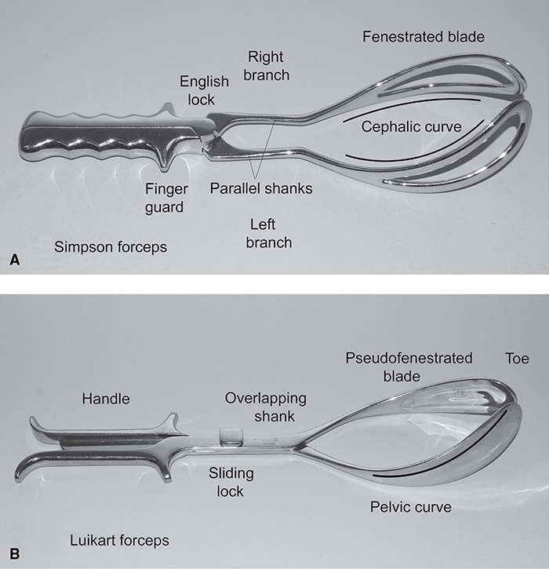

*Figure 29-2. Simpson forceps (fenestrated blades, parallel shanks, English lock) vs Luikart forceps (pseudofenestrated, overlapping shanks, sliding lock).*

### Blade application (OA)
1. **Left branch first:** handle in the **left hand**; fingers of the **right hand** in the left posterior vagina as a guide; blade enters along the **left posterior vaginal wall** and is swept up and in between head and fingers.
2. **Right branch:** right hand holds it; left-hand fingers guide in the right posterior vagina.
3. **Insertion force comes mainly from the thumb** behind the heel.

**Oblique positions**
- **LOA/ROA:** place the **lower (posterior) blade first**.

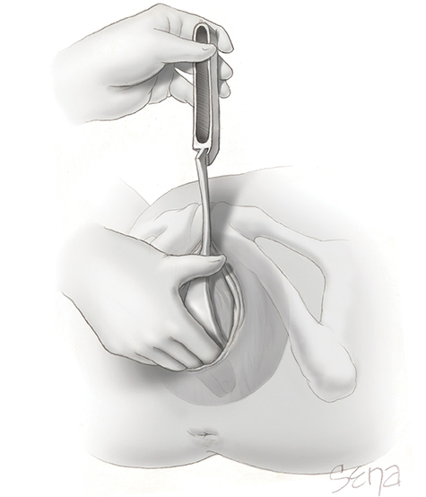

*Figure 29-3. OA/LOA: the left branch, held in the left hand, is introduced on the left between head and the operator's right-hand fingers.*

**Checking application**
- Ideal grasp: blade long axis along the **occipitomental diameter**; most of the blade over the **lateral face**.
- **OA:** blades **equidistant from the sagittal suture**, each equidistant from its **lambdoid** suture.
- **OP:** symmetric to the sagittal suture and each **coronal** suture.
- **Won't articulate** → reassess suture relationships. Brow + occiput placement → cannot lock, or slips with traction.
- Slow articulation corrects mild **asynclitism**; for greater asynclitism use **Luikart** (sliding lock: slide branches until finger guards align).

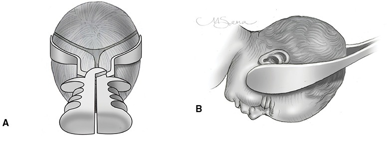

*Figure 29-6. Correct symmetric application: blades along the sides of the head over the lateral face with the vertex OA.*

### Rotation and traction
- **Rotate to OA before traction.**
- Traction: **gentle, intermittent, downward and outward**, with maternal pushing, **only with contractions**. Initially downward (head under the symphysis), then **gradually upward** as the head descends, mimicking spontaneous birth.
- **Bill axis traction device** (teaching): arrow on the indicator line = path of least resistance.
- Force can't be measured → slow, deliberate, gentle (avoid head compression) unless urgent.
- As the occiput distends the vulva: episiotomy if needed. Either keep blades on (↑ distention/laceration), or **remove branches in the reverse order of placement** and finish with pushing ± modified Ritgen, **bolstering the perineum**. Removing too early → head recedes.

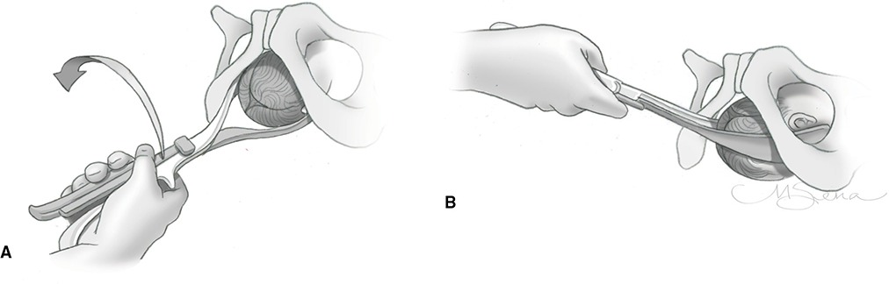

*Figure 29-7. From LOA, the vertex is rotated to OA before traction.*

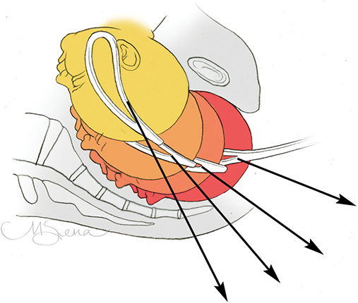

*Figure 29-8. Low forceps: the traction vector moves from downward to upward as the head descends.*

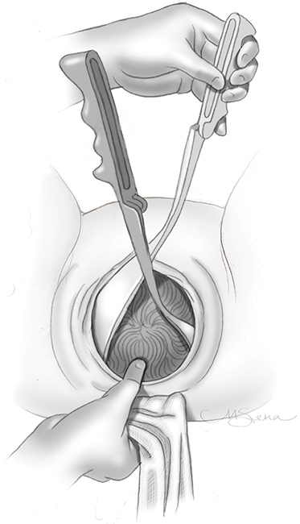

*Figure 29-9. Branches removed in reverse order; a towel-covered hand bolsters the perineum and the thumb prevents sudden egress.*

### Manual rotation
- OT/OP heads are often **deflexed** (wider diameter) → slow descent. Rotating to OA improves proportions. Usually done in the **second stage**.
- vs no attempt: **↓ cesarean, ↓ OVD, ↓ severe laceration, ↓ chorioamnionitis**. If OVD is still needed, OA ↓ perineal trauma.
- **Digital rotation:** two fingers hooked on the molded suture ridge, force parallel to the skull, **between contractions**; hold gains during pushing; repeat as needed.
- **Manual rotation** (open hand):
  - **ROP:** right palm cups the head over the sagittal suture, rotate **clockwise** → ROA.
  - **LOP:** left palm, **counterclockwise**.
  - **Three simultaneous actions** between contractions: **flex** the head, slightly **destation** it (⚠️ **never disengage**), and use the other hand on the abdomen to pull the fetal back toward the midline.
- **Success >90%** (Le Ray, 796 rotations): no cord prolapse; 2 cervical lacerations; FHR normal in **71%**, severe FHR abnormalities in **10%**. Failure to rotate **does not mandate cesarean**.

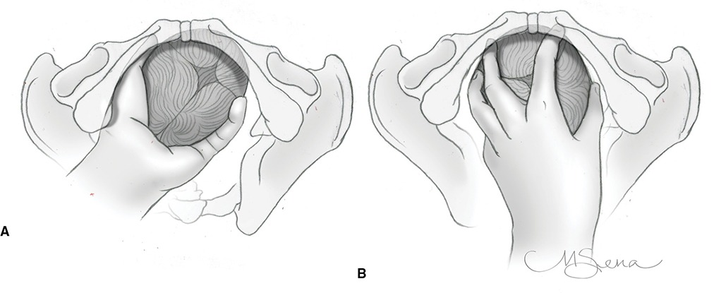

*Figure 29-10. Manual rotation from ROP: the head is flexed and destationed during clockwise rotation to OA.*

*Note: the printed Fig 29-10 legend says the **left** hand rotates from ROP, whereas the text says the **right** palm is used for ROP (left palm for LOP).*

### Persistent occiput posterior
- Options: spontaneous OP delivery, manual/instrumental rotation to OA, or forceps/vacuum delivery **as OP**.
- Common cause: **anthropoid pelvis** (opposes rotation).
- **Forceps delivery from OP:** downward/outward traction until the **base of the nose passes under the symphysis** → **elevate handles** so the occiput emerges over the fourchette → then downward again for nose, mouth, chin.
- OP → more vulvar distention, **severe lacerations and extensive episiotomy**. Newborns delivered by OVD from OP: **Erb palsy 1%, facial palsy 2%**.
- **Kielland forceps** preferred for OP → OA rotation (**minimal pelvic curve**, **sliding lock**, light weight).

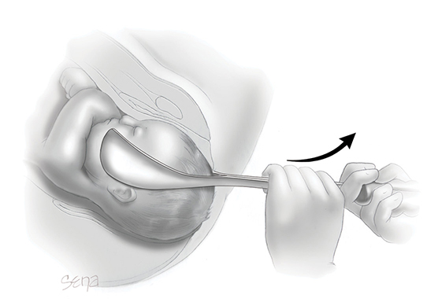

*Figure 29-11. Outlet forceps from OP: the head should be flexed after the bregma passes under the symphysis.*

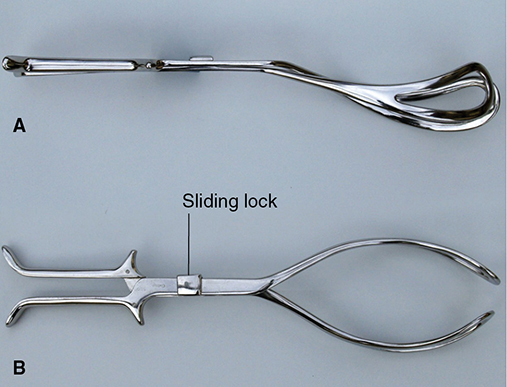

*Figure 29-12. Kielland forceps: minimal pelvic curve, sliding lock, light weight.*

### Occiput transverse
- Rotation is required: manual, standard forceps or **Kielland** (high success, low morbidity in experienced hands).
- Kielland handles carry a **knob that faces the occiput**.
- **Two anterior-blade methods (LOT example):**
  1. **Wandering:** anterior blade introduced **posteriorly**, then arched around the face to the anterior position (handle kept near the left maternal buttock); second blade posteriorly along the sacral hollow; lock.
  2. **Classic:** anterior blade inserted with the **cephalic curve upward** under the symphysis, advanced, then **turned 180 degrees** on its long axis; second blade posterior; lock.
- **Rotation:** pull handles slightly to the patient's right to **flex**; fingers of the left hand on the finger guards; right-hand fingers on the **anterior lambdoid suture** (ensures the head turns with the blades); elevate/slightly destation; supinate the left wrist for **counterclockwise** rotation. Abdominal sonography can document rotation.
- **Delivery after rotation:**
  - Traction on the Kielland with a bimanual grip; once the posterior fontanel is under the subpubic arch, raise the handles **to horizontal but no further** (reverse pelvic curve → **vaginal sulcus tears**), or
  - Seat the head with moderate traction, then **swap to conventional forceps**.

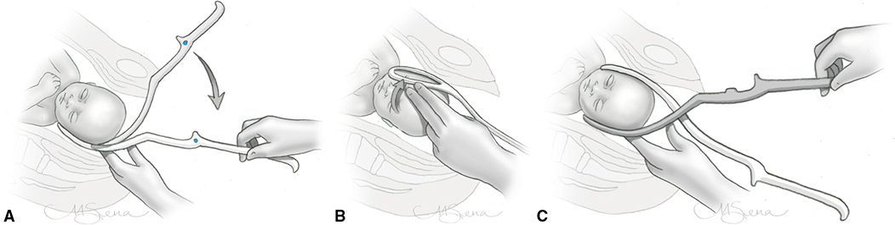

*Figure 29-13. Kielland application for LOT: right (anterior) branch wandered into place behind the symphysis, then the left branch inserted posteriorly.*

### Face presentation
- **Mentum anterior:** forceps OK. Blades along the **occipitomental** diameter, **pelvic curve toward the neck**; downward traction until the **chin is under the symphysis**, then upward: nose, eyes, brow, occiput.
- ⚠️ **Mentum posterior: no forceps** (vaginal delivery impossible except in very small fetuses). **Vacuum is not used for face presentation.**

---

## 5. Vacuum-Assisted Delivery

### Design
- US: **vacuum extractor**; Europe: **ventouse**.
- **Theoretical advantages over forceps:** less need for precise placement; no space-occupying blades → less maternal trauma.
- Components: **cup, shaft, handle, vacuum generator** (handheld by operator or run by assistant).

| Cup type | Traits |
|---|---|
| **Soft bell cup** (pliable dome) | Fewer **scalp lacerations**; recommended for straightforward **OA** |
| **Rigid mushroom cup** (flat, circular rim ridge) | **More traction force**; better at the flexion point in **OP/asynclitism**; **more scalp lacerations** |
| **Metal cup** | Higher success but more scalp injury incl. **cephalohematoma** |

- Cephalohematoma and subgaleal hemorrhage rates are **similar** for soft vs rigid cups (Vacca). **High pressure generates large force whatever the cup.**
- **Flexible shafts** help cup seating in OP/asynclitism.

### Table 29-2. Vacuum Cups for Operative Vaginal Delivery

| Cup Style | Manufacturer |
|---|---|
| **Soft Bell Cup** | |
| GentleVac | OB Scientific |
| Kiwi ProCup | Clinical Innovations |
| MitySoft | CooperSurgical |
| Pearl Edge | CooperSurgical |
| Mityvac Reusable Siliconeᵃ | CooperSurgical |
| Secure Cup | Utah Medical Products |
| Soft Touch | Utah Medical Products |
| Tender Touch | Utah Medical Products |
| Tender Touch Ultra | Utah Medical Products |
| Velvet Touchᵃ | Utah Medical Products |
| Silc Cup | Medela |
| CaesAidᵃ | Medela |
| **Rigid Mushroom Cup** | |
| Flex Cup | Utah Medical Products |
| M-Style | CooperSurgical |
| Super M-Style | CooperSurgical |
| M-Selectᵇ | CooperSurgical |
| Kiwi OmniCupᵇ | Clinical Innovations |
| Kiwi Omni-MT | Clinical Innovations |
| Kiwi Omni-Cᶜ | Clinical Innovations |
| Bird Cupᵇ | Medela |
| Malmström Cup | Medela |

*ᵃReusable cups. ᵇSuitable for occiput posterior positions or asynclitism. ᶜFor extractions through a hysterotomy incision during cesarean delivery.*

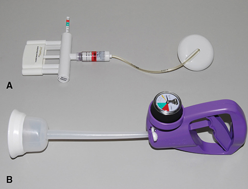

*Figure 29-14. Kiwi OmniCup (rigid mushroom cup, handheld pump) and Mityvac MitySoft Bell Cup (soft bell cup).*

### Technique
- **Flexion point:** on the **sagittal suture ~3 cm from the posterior fontanel and ~6 cm from the anterior fontanel**.
  - Cups are **5–6 cm** across → rim at the posterior fontanel border, **3 cm from the anterior fontanel**.
  - Benefits: max traction, fewer pop-offs, flexes the neck, **smallest diameter** delivered → ↑ success, ↓ scalp and perineal injury.
  - ⚠️ **Anterior placement** (near the anterior fontanel) → neck extension, wider diameter. **Asymmetric** placement worsens asynclitism.
  - Easy in OA; hard when the indication is malposition-related failure to descend.
- **Check the whole cup rim** (before and after suction and before traction) for trapped **maternal soft tissue** (→ lacerations and "**pop-off**").
- **Vacuum build-up:** some raise it by **0.2 kg/cm² every 2 min** to **0.8 kg/cm²**; reaching 0.8 kg/cm² in **<2 min** is equally effective and safe.

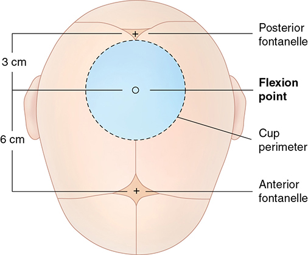

*Figure 29-15. Flexion point: on the sagittal suture 3 cm from the posterior and 6 cm from the anterior fontanel.*

### Table 29-3. Vacuum Pressure Conversions

| mm Hg | cm Hg | Inches Hg | lb/in² | kg/cm² |
|---|---|---|---|---|
| 100 | 10 | 3.9 | 1.9 | 0.13 |
| 200 | 20 | 7.9 | 3.9 | 0.27 |
| 300 | 30 | 11.8 | 5.8 | 0.41 |
| 400 | 40 | 15.7 | 7.7 | 0.54 |
| 500 | 50 | 19.7 | 9.7 | 0.68 |
| **600** | **60** | **23.6** | **11.6** | **0.82** |

> **Memory hook:** Target vacuum **0.8 kg/cm² ≈ 600 mm Hg**.

**Traction**
- Same angles as forceps (Fig 29-8); **steady, no jerking or rocking**; **1–4 pulls** typical (more at higher station); intermittent, with pushing.
- ⚠️ **No manual torque/rotation** (cup displacement, cephalohematoma, "cookie-cutter" lacerations with metal cups). OA-oblique and OP heads are **not rotated**; with correct placement and traction line the head **rotates by itself**.
- **Nondominant hand in the vagina:** thumb on the cup, finger(s) on the scalp → judge descent, adjust the angle, detect cup separation.
- Lowering suction between contractions vs maintaining it: **no outcome difference**.
- Release vacuum once the head delivers.
- **It is a trial:** expect **progressive descent with each pull**. No consensus on maximum pulls, pop-offs or duration (manufacturers give guidance).
  - Pop-off from **technical failure** (poor placement) ≠ pop-off with ideal placement → may reapply or try forceps.
  - **Traction without progress or repeated detachment despite correct use** is the worst scenario → **be willing to abandon**.

---

## 6. Training
- Fewer OVDs → fewer training cases: median **~20** for recent graduates; ACGME **minimum 15** (2021).
- Solutions: skilled teachers, simulation.
  - One dedicated instructor → **59% ↑** forceps deliveries over 2 years.
  - Manikin/pelvic simulation program → ↓ neonatal morbidity and severe cervical/labial/vaginal lacerations (OASIS unchanged).
  - OVD simulation curriculum → **22% ↓ OASIS**.

---

## Quick-Recall: Forceps vs Vacuum

| Feature | Forceps | Vacuum |
|---|---|---|
| Rotation | **Yes** (manual rotation, Kielland) | **No** (traction only; head self-rotates) |
| Face (mentum anterior) | Yes | **No** |
| Aftercoming breech head | Yes (**Piper**) | No |
| Minimum GA | — | **≥34 wk** |
| Failure (all US) | **0.4%** | **0.8%** |
| Failure (term nulliparas) | **4.4%** | **6.4%** |
| Maternal injury (OASIS) | **Higher** | Lower |
| Fetal injury profile | **Facial nerve, brachial plexus, depressed skull fracture, corneal abrasion** | **Cephalohematoma, subgaleal, retinal hemorrhage**, jaundice, scalp laceration |
| Total neuro complications (Werner) | **Fewer** | More |
| Key placement landmark | Blades along **occipitomental** diameter, equidistant from sagittal suture | **Flexion point**: 3 cm from posterior, 6 cm from anterior fontanel |
| Rotational OVD vs second-stage cesarean | Similar morbidity | Similar morbidity |

## Key Numbers to Memorize
- OVD **3.1%** of US births (was **9%** in 1990); vacuum:forceps **4:1**
- Station **−5 to +5**; outlet = on the perineum, rotation **≤45°**; low = **≥+2** not on floor; mid = **0 to +2**; high = above 0 (**never**)
- Vacuum not before **34 wk**; retention resolves with **24–48 h** catheter drainage
- ANODE: infection **11% vs 19%** with single-dose amoxicillin–clavulanate
- OP OVD: Erb palsy **1%**, facial palsy **2%**
- Manual rotation success **>90%**; severe FHR changes **10%**
- Fetal head: occipitofrontal **11.5**, occipitomental **12.5**, suboccipitobregmatic **9.5**, biparietal **9.5 cm**
- Flexion point **3 cm / 6 cm**; cup **5–6 cm**; vacuum **0.8 kg/cm² (≈600 mm Hg)**; step-up **0.2 kg/cm² per 2 min**; **1–4 pulls**
- Failure predictors: **OP**, birthweight **>4000 g**
- ACGME minimum **15** OVDs; simulation → **22% ↓** OASIS
