# Chapter 30: Cesarean Delivery and Peripartum Hysterectomy — Revision Notes

> Williams Obstetrics 26e, pp. 1405–1474 of the PDF. High-yield numbers are in **bold**.
> The single table is transcribed from the PDF image (it is missing from the extracted chapter text). 16 of the 22 operative figures are included from the PDF.

**Big picture:** Cesarean delivery = laparotomy + hysterotomy. It trades higher maternal surgical risk (now and in every later pregnancy) for less perineal/pelvic floor injury and less neonatal trauma. Most technique choices (bladder flap, one vs two layers, peritoneal closure, exteriorization) matter less than prophylaxis: **antibiotics before incision, VTE prophylaxis, oxytocin after birth**.

---

## 1. Background and Indications

- US cesarean rate: **4.5% (1970) → 32.9% (2009)**; plateau at **31.9% in 2018**.
- **>85%** of cesareans are for **four reasons:** prior cesarean, **labor dystocia/arrest**, **fetal jeopardy**, **abnormal presentation**. The last three are the main **primary** cesarean indications.
- **Why rates stay high:**
  1. Fewer children → more births are to nulliparas (higher risk)
  2. Rising maternal age (especially older nulliparas)
  3. Widespread **electronic fetal monitoring** (vs intermittent auscultation)
  4. Most **breech** fetuses now delivered by cesarean
  5. Fewer **operative vaginal deliveries**
  6. **Obesity** epidemic
  7. More cesareans (fewer inductions) for **preeclampsia**
  8. **VBAC rate fell from 28% (1996) to 13.3% (2018)**
  9. More **assisted reproductive technology**

### Table 30-1. Some Indications for Cesarean Delivery

| Maternal | Maternal-Fetal | Fetal |
|---|---|---|
| Prior cesarean delivery | Cephalopelvic disproportion | Nonreassuring fetal status |
| Abnormal placentation | Failed operative vaginal delivery | Malpresentation |
| Maternal request | Placenta previa or vasa previa | Macrosomia |
| Prior classical hysterotomy | Placental abruption | Congenital anomaly |
| Unknown uterine scar type | | Abnormal umbilical cord Doppler study |
| Prior uterine incision extension | | Thrombocytopenia |
| Uterine incision dehiscence | | Prior neonatal birth trauma |
| Prior full-thickness myomectomy | | |
| Genital tract obstructive mass | | |
| Invasive cervical cancer | | |
| Prior trachelectomy | | |
| Permanent cerclage | | |
| Prior pelvic reconstructive surgery | | |
| Prior significant perineal trauma | | |
| Pelvic deformity | | |
| HSV or HIV infection | | |
| Cardiac or pulmonary disease | | |
| Cerebral aneurysm or arteriovenous malformation | | |
| Pathology requiring concurrent intraabdominal surgery | | |
| Perimortem cesarean delivery | | |

*HIV = human immunodeficiency virus; HSV = herpes simplex virus.*

---

## 2. Definitions

| Term | Meaning |
|---|---|
| **Cesarean delivery** | Birth of a fetus by **laparotomy then hysterotomy**. Not used for removal of the fetus from the abdomen after **uterine rupture** or with **abdominal pregnancy**. |
| Postmortem / perimortem cesarean | Hysterotomy in a woman who has just died or whose death is expected soon (Ch 50) |
| **Cesarean hysterectomy** | Hysterectomy at the time of cesarean |
| **Postpartum hysterectomy** | Hysterectomy shortly after vaginal delivery |
| **Peripartum hysterectomy** | Umbrella term for both |
| Total vs supracervical | Total removes body + cervix (usual); supracervical removes body only. **Adnexa usually not removed.** |
| Simple (type I) vs radical | Simple is usual. **Radical** (uterus + parametrium + proximal vagina) for invasive cervical cancer, or **percreta extending to the pelvic sidewall** |

---

## 3. Cesarean Delivery Risks

**Overall balance:** higher maternal surgical risk (now and in later pregnancies) vs less perineal injury and fewer short-term pelvic floor disorders. For the neonate: **less birth trauma and stillbirth**, but **more initial respiratory difficulty**.

### Maternal mortality and morbidity

- **Mortality 2.2 vs 0.2 per 100,000** (cesarean vs vaginal; Clark 2008).
- Meta-analysis: **13 per 100,000** with elective repeat cesarean vs **4 per 100,000** with trial of labor.
- Part of the risk is from the **underlying indication** (e.g., long first stage → fever and PPH too). In China, nonindicated cesarean did not raise mortality over spontaneous vaginal birth.
- **Morbidity ~2× vaginal birth.** Main ones: **infection, hemorrhage, VTE**; also anesthetic complications and adjacent organ injury.
- **Repeat cesareans accrue risk:** abnormal placentation, wound/uterine infection, organ injury, cesarean hysterectomy, transfusion (Ch 31).
- **Pelvic floor:**
  - Cesarean → **less urinary incontinence and pelvic organ prolapse**.
  - **Anal incontinence is not influenced by route** (but operative vaginal delivery raises it → sphincter injury).
  - The pelvic floor advantage **fades as women age**; duration of stress UI protection unclear (NIH 2006).

### Neonatal morbidity

- **Fetal injury in ~1% of cesareans.** **Skin laceration most common**; others: cephalohematoma, clavicular fracture, brachial plexopathy, skull fracture, facial nerve palsy.
- **Highest injury rate: cesarean after failed operative vaginal delivery.** **Lowest (0.5%): elective cesarean.**
- Parkland: ~⅓ entered spontaneous term labor, and **96%** of them delivered vaginally without adverse neonatal outcome.

### Cesarean delivery on maternal request (CDMR)

- US estimate **~5%** (older data).
- Reasons: pelvic floor protection, convenience, **fear of childbirth**, less fetal injury.
- Chinese cohort (>66,000): similar serious maternal morbidity and neonatal mortality. Birth trauma, infection and HIE lower with CDMR, but **RDS higher**.
- NIH conference: insufficient data for most outcomes; more research needed.
- **ACOG: not before 39 weeks**; ideally **avoid in women who want several children** (accruing morbidity).

---

## 4. Patient Preparation

### Delivery availability

- **No national standard** for decision-to-incision time. The old **30-minute rule**: failure to meet it was **not associated with worse neonatal outcome** (Bloom 2006; systematic review).
- Still, with **acute catastrophic fetal deterioration**, deliver as fast as possible; purposeful delay is inappropriate.
- AAP/ACOG: facilities must be able to start cesarean in a time frame that balances maternal and fetal risk.

### Informed consent

- A **process**, not a document: diagnosis, alternatives, goals, limitations, risks. Offer **TOLAC** to suitable candidates. Sterilization/IUD consent can be done at the same time.
- A woman **may decline**; document the reasons and that consequences were explained.
- **Jehovah's Witnesses** (start discussions early in pregnancy; use a checklist of accepted products):
  - Usually decline **red cells, white cells, platelets and plasma** (primary components). Some clotting factors or fractions may be acceptable.
  - Maximize Hb: **iron, folate, ± erythropoietin**. Limit phlebotomy; pediatric tubes.
  - Intraop: prompt atony treatment, topical hemostatics, **tranexamic acid, desmopressin**, **cell salvage**, normovolemic hemodilution, controlled hypotensive/hypothermic anesthesia, uterine artery embolization, occlusive balloons.

### Timing of scheduled cesarean

- Elective delivery **before 39 completed weeks** → appreciable neonatal immaturity morbidity.
- **Criteria supporting fetal maturity:**
  - Ultrasound **before 20 weeks** corroborating GA
  - Fetal heart tones heard for **30 weeks**
  - **36 weeks** since a positive pregnancy test

### Preoperative care (ERAS)

- **Solids stopped ≥6 h** before; **clear liquids up to 2 h** before. **No bowel prep.**
- Review recent **hematocrit and indirect Coombs** (if positive, ensure compatible blood).
- **Regional analgesia preferred.**
- **Aspiration prophylaxis:** oral antacid (e.g., **Bicitra 30 mL**) shortly before anesthesia ± **IV H₂-receptor antagonist**.
- **Left lateral tilt** (wedge under the right hip) to prevent aortocaval compression/hypotension.
- Fetal heart: Parkland does a **5-min tracing** before elective cases; at minimum document FHR in the OR.
- **Hair removal** does not lower SSI. If needed, **clip on the day of surgery** (fewer SSIs than shaving).
- **Indwelling bladder catheter** (Parkland): moves the bladder away from the hysterotomy, prevents retention after regional block, measures urine. Can be omitted in stable women (less discomfort, UTI rate unchanged).
- **VTE:**
  - Cesarean VTE rate **8 per 10,000** (~2× vaginal birth).
  - **ACOG: pneumatic compression stockings before cesarean** for all women not already on prophylaxis (stop once ambulating).
  - ACCP: early ambulation only if no risk factors. **RCOG most conservative** (pharmacological prophylaxis for most).

### Infection prevention

**Antibiotic prophylaxis** (cesarean = **clean-contaminated**)

| Situation | Regimen |
|---|---|
| Standard | **Cefazolin 1 g IV**, single dose |
| Weight **≥80 kg** | **2 g** (CDC); ACOG accepts 2 or 3 g |
| Weight **≥120 kg** | **3 g** (CDC) |
| Redose | Blood loss **>1500 mL** or surgery **>3 h** |
| In labor or ruptured membranes | Add **azithromycin 500 mg IV** (↓ SSI and endometritis; Tita 2016) |
| History of **MRSA** | Add **vancomycin 15 mg/kg** once |
| Significant **β-lactam allergy** (anaphylaxis, angioedema, respiratory distress, urticaria) | **Clindamycin 900 mg IV + aminoglycoside 5 mg/kg** (900 mg clindamycin also in obese women) |

- **Timing: within 60 min before incision** (better than after cord clamping, with no neonatal harm). Emergency: as soon as feasible.
- Regimens without a β-lactam may have higher SSI rates → specialist **penicillin-allergy evaluation** can remove the label.
- **Skin prep:** chlorhexidine-alcohol or povidone-iodine; **data favor chlorhexidine**. Night-before chlorhexidine wipe = no benefit.
- Adhesive incisional drapes may slightly ↑ SSI.
- **Vaginal cleansing** with 1% povidone-iodine (or 4% chlorhexidine if allergic) ↓ endometritis/SSI in some studies (not Parkland practice).
- Possible: **48 h oral antibiotics** after cesarean in **obese** women.
- **Endocarditis prophylaxis** only for cyanotic heart disease (repaired or unrepaired), **prosthetic valves**, prior endocarditis, or cardiac transplant with valve regurgitation. Give 30–60 min before delivery; standard cesarean prophylaxis also covers endocarditis.

**Other prevention**

- Glycemic control; stop smoking; **intraoperative normothermia**.
- **Vaginal seeding** (swabbing the newborn's mouth with vaginal gauze) is **not encouraged by ACOG** (few data, risk of transmitting infection).

### Surgical safety

- Joint Commission protocol: verify documents + **"time out"** (right patient, site, procedure; team introductions, antibiotics, expected duration, anticipated complications).
- **Surgical fire** prevention: assess risk, **let alcohol-based prep dry**, keep ignition sources off the patient.
- **Instrument, sponge and needle counts** before and after; if unreconciled → **portable radiograph**.

---

## 5. Cesarean Technique: Laparotomy

### Choice of incision

| | **Pfannenstiel (transverse)** | **Midline vertical** |
|---|---|---|
| Cosmesis, incisional hernia | **Better cosmesis, fewer hernias** (follows Langer lines) | More hernias |
| Operating space / upper abdomen | Limited | **Large space, upper abdominal access** |
| Speed of emergent entry | Slower | **Faster** |
| Infection risk | Pus can collect between oblique aponeurosis layers | Favored by some when infection risk is high |
| Neurovascular structures | Ilioinguinal, iliohypogastric nerves; superficial and inferior epigastric vessels → more bleeding, hematoma, nerve injury | Fewer |

- **Maylard:** transects the **rectus muscles and sheath horizontally** to widen space; harder (muscle cutting, ligation of **inferior epigastric arteries**, which lie lateral to the rectus bellies).
- **Morbid obesity:** best incision unclear; Parkland prefers a **periumbilical midline vertical** incision.
- **Plastic barrier retractor (Alexis-O)** does **not** lower SSI.

### Pfannenstiel steps

- Skin: low, slightly curved, at the **pubic hairline (~3 cm above the symphysis)**, **12–15 cm** long.
- **Superficial epigastric vessels** lie halfway between skin and fascia, several cm from midline → coagulate.
- Fascia has **two layers** (external oblique aponeurosis + fused internal oblique/transversus aponeuroses); incise individually. **Inferior epigastric vessels** lie lateral to the rectus, beneath the fused layer → at risk with far lateral extension.
- Separate fascia from rectus down to the symphysis and up (semicircle, radius **~8 cm**). **Meticulous hemostasis** ↓ hematoma and infection.
- Separate rectus and pyramidalis in the midline → transversalis fascia and peritoneum.
- **Enter peritoneum high** (lowers **cystotomy** risk); check the tented fold for omentum, bowel, bladder. Beware adhesions after prior surgery and a **high-riding bladder in obstructed labor**.

### Midline vertical

- Begins **2–3 cm above the symphysis**; **12–15 cm** long.
- Open fascia in the **upper half of the linea alba** (avoids cystotomy), then extend up and down.

### Joel-Cohen and Misgav Ladach

- Differ from Pfannenstiel-Kerr by **higher, straight incision** and **more blunt dissection**.
- **Joel-Cohen:** straight **10-cm** incision **3 cm below the anterior superior iliac spines**; subcutaneous tissue opened only 2–3 cm in the midline; fascia opened laterally under intact fat; rectus separated by fingers in opposition; peritoneum entered **sharply**.
- **Misgav Ladach:** same, but **peritoneum entered bluntly**.
- Benefits: **shorter operating time, less blood loss and pain.** Harder with rectus fibrosis or adhesions (repeat surgery).

---

## 6. Hysterotomy

| Incision | Notes |
|---|---|
| **Low transverse (Kerr, 1921)** | **Preferred.** Easy repair, less bleeding, less bowel/omental adhesion; in the **inactive segment** → less likely to rupture later |
| Low vertical (Krönig, 1912) | Confined to the lower segment; occasional |
| **Classical** | Low vertical incision extended **up into the active corpus** |
| Fundal or posterior | For **placenta accreta syndrome** |

### Low transverse cesarean incision

- **Palpate for uterine rotation (dextrorotation)** and re-center the uterus, so the incision does not extend into the uterine artery.
- **Bladder flap:** vesicouterine peritoneum grasped and incised transversely (Figs 30-1, 30-2), then bladder separated bluntly/sharply (**usually ≤5 cm**).
  - Moves the bladder away and protects it if the incision extends down.
  - **Extend the dissection further if hysterectomy is anticipated.**
  - Dense adhesions → sharp dissection; **back-fill the bladder via Foley** to find its edge.
  - **Omitting the flap** shortens incision-to-delivery time, but data are limited.

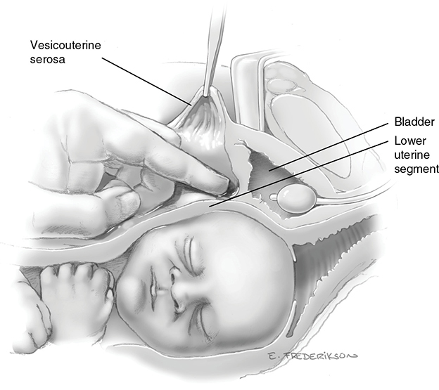

*Figure 30-3. Bladder flap: blunt dissection of the bladder off the lower uterine segment (cross section).*

**Uterine incision**

- Enter at the border between firm upper and flexible lower segment (often at the flap level). With **advanced or full dilation, place it higher** → otherwise extension into uterine arteries or incision into cervix/vagina.
- Scalpel **1–2 cm transverse** in the midline with **repetitive shallow strokes** (avoid fetal laceration), then finger entry.
- Extend by **blunt finger spreading** (lateral and slightly upward) or **cephalocaudad pull** (may ↓ extensions). Thick lower segment → **bandage scissors**, fingers shielding the fetus.
- **Blunt vs sharp expansion:** blunt → **fewer extensions, shorter surgery, less blood loss**; infection and transfusion rates the same.
- **Extension risk factors:** **occiput posterior**, **primary cesarean**, **advanced first or second stage**.
- **Placenta in the incision line** → detach or incise it, and **deliver quickly**.

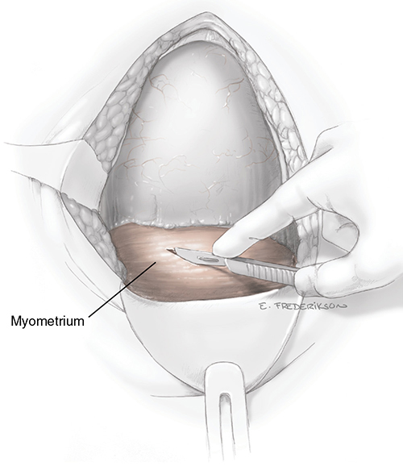

*Figure 30-4. Myometrium incised with repeated shallow scalpel strokes to avoid cutting the fetal head.*

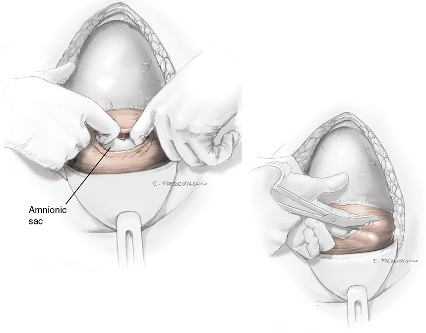

*Figure 30-5. After entry, the incision is widened with fingers (or bandage scissors, inset).*

**Inadequate room → extended incisions**

| Extension | Shape | Consequence |
|---|---|---|
| **J** | One corner extended cephalad into the contractile myometrium | ↑ blood loss; ↑ rupture risk with later TOLAC |
| **U** | Both corners extended | Same |
| **T** | Midline vertical extension | Same |
| Inferior extension | Down into the lower segment/cervix | Limited data: ↑ rupture; **Parkland precludes TOLAC** |

- RCOG: insufficient evidence on TOLAC after a significant extension → individualize.
- A **classical or fundal incision greatly raises rupture risk** in later TOLAC → **tell the patient and document it** in the operative report.

### Delivery of the fetus

- **Cephalic:** hand between symphysis and head, lift the head through the incision, **modest fundal pressure**.
- **Deeply impacted head** (long labor, CPD) → risks: extension, blood loss, **fetal skull fracture**.
  - **"Push":** assistant pushes the head up vaginally (frog-leg position helps).
  - **"Pull":** grasp the fetal legs and deliver as a **breech extraction** → **fewer uterine extensions**.
  - Pull by elevating both shoulders; or a **"fetal pillow"** (intravaginal balloon) — evidence limited.
- **Unlabored, unmolded, high head** in a thick lower segment → **forceps or vacuum**. Rotate to **occiput transverse** first.
- After the head: check for **nuchal cord**; rotate to OT (bisacromial diameter vertical); axial traction for anterior shoulder, then upward for posterior. **Avoid abrupt lateral force** (brachial plexus).
- **No routine suctioning**, even with meconium (AHA).
- **Delayed cord clamping** does not lower maternal Hb on postop day 1.
- **A person skilled in neonatal resuscitation must be present** (AAP/ACOG). Need for resuscitation after elective cesarean under neuraxial ≈ vaginal birth.
- **Skin-to-skin** in the OR; breastfeeding can start the day of surgery.

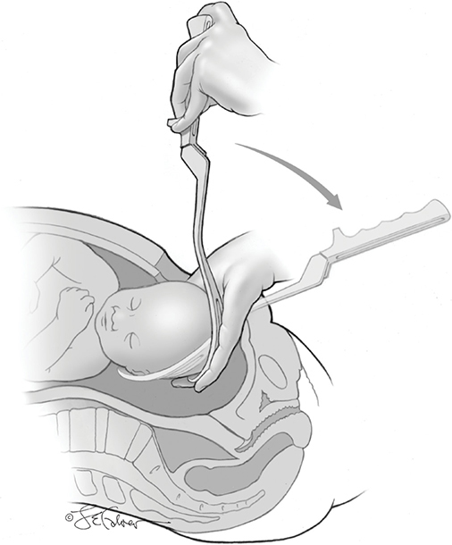

*Figure 30-7. Forceps at cesarean: the first blade slides along the operator's palm to lie over the malar/parietal bone.*

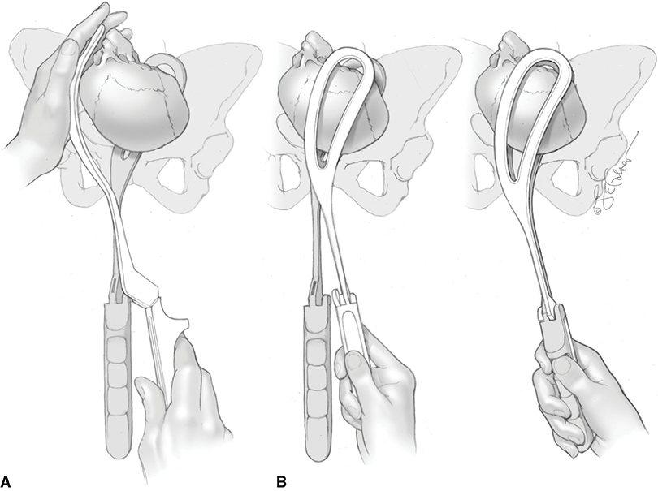

*Figure 30-8. Second blade guided in via the posterolateral hysterotomy (A); handles locked, then traction up and out (B).*

### Delivery of the placenta

- Clamp briskly bleeding incision sites (**Pennington or ring forceps**).
- **Spontaneous delivery with gentle cord traction + fundal massage** → **less blood loss and infection** than manual removal.
- Inspect the placenta, wipe out the cavity. **Dilating the cervix** from above does **not** reduce infection or PPH.

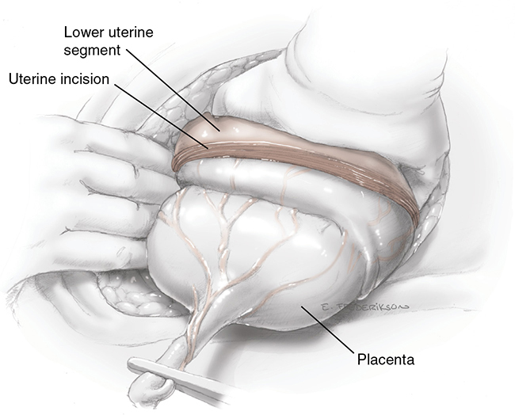

*Figure 30-9. Placenta bulging through the incision; fundal massage aids spontaneous separation.*

**Uterotonic prophylaxis**

- **Oxytocin 20 units (2 ampules) per liter crystalloid at 10 mL/min**, reduced once the uterus contracts. **Avoid undiluted boluses (hypotension).**
- **WHO: oxytocin is first-line.**
- Alternatives: **carbetocin** (long-acting, not in US), misoprostol, **methylergonovine, ergonovine**, Syntometrine (oxytocin + ergonovine).
- **Tranexamic acid** with oxytocin: ↓ EBL >1000 mL or transfusion (Sentilhes 2021), but **no reduction in secondary blood-loss clinical outcomes**.

### Uterine repair

- **Exteriorize** (Parkland) → faster recognition of atony, easier view of bleeding/extensions and adnexa. **vs in situ: no difference in endometritis or transfusion (CORONIS)**; nausea, vomiting and pain similar.
- Insert a planned **IUD before closure**. Count before closing.
- **Closure:** one or two layers of **continuous 0 or No. 1 absorbable suture** (chromic catgut or polyglactin 910). **Suture type doesn't change later rupture risk.**
- **Single-layer:** faster; **no more infection or transfusion**; most studies: number of layers doesn't affect next-pregnancy complications. **Double-layer → slightly more scar niches at 3 months** (Stegwee 2021).
- **Parkland: one-layer, running locking chromic**, full thickness, from just beyond one end to just beyond the other. Persistent bleeding → extra layer or figure-of-8/mattress stitches.
- **Peritoneal (bladder flap) closure not needed** — no complications from omitting it.

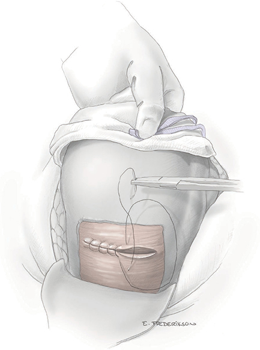

*Figure 30-10. Hysterotomy closed with a running, locking suture.*

### Adhesions

- Form in the **vesicouterine space** and between uterus and anterior abdominal wall; **increase with each cesarean**.
- Lengthen incision-to-delivery and operating time; ↑ **cystotomy and bowel injury**.
- Reduce by gentle handling, hemostasis, less ischemia/infection/foreign body. **Peritoneal closure and adhesion barriers: no benefit.**

### Abdominal closure

- Suction gutters and cul-de-sac. **Routine irrigation** in low-risk women → more nausea, **no less infection**.
- **Rectus fascia: continuous, nonlocking, delayed-absorbable** (monofilament if high infection risk).
- **Subcutaneous tissue: close if ≥2 cm thick** (↓ seroma/hematoma → ↓ wound infection/disruption). **Subcutaneous drain does not help.**
- **Skin:** subcuticular **4-0 delayed-absorbable** (poliglecaprone 25 or polyglactin 910), glue (2-octyl cyanoacrylate, equivalent for Pfannenstiel) or staples. Cosmesis and infection similar; **staples → more wound separation**; suturing takes longer.
- **Negative-pressure wound therapy** in obese women: evidence mostly **against** routine use.

### Classical cesarean incision
**Indications** (avoid otherwise: the active upper segment is prone to rupture)

| Maternal / access | Fetal |
|---|---|
| Densely adhered bladder | **Transverse lie of a large fetus**, especially with ruptured membranes and shoulder impacted |
| **Leiomyoma** in the lower segment | **Back-down transverse lie** (can't reach a leg through a low transverse incision) |
| **Cervical cancer** invading the cervix | **Very small preterm breech** (poorly developed lower segment; head entrapment) |
| Prior **radical trachelectomy** | **Multiple fetuses** (malpositioned or preterm) |
| **Massive obesity** blocking access | **Large fetal malformation or conjoined twins** |
| **Anterior placenta previa**, especially with **accreta** (incision may go higher or posterior; cephalic fetus delivered like a breech extraction) | |

- **Technique:** start **as low as possible**, then extend cephalad with **bandage scissors** over the surgeon's fingers. Large myometrial vessels bleed profusely.
- **Closure (multilayer):** deep half with running **0 or No. 1 chromic**, then the outer half, then the **serosa** — avoids suture tearing through.

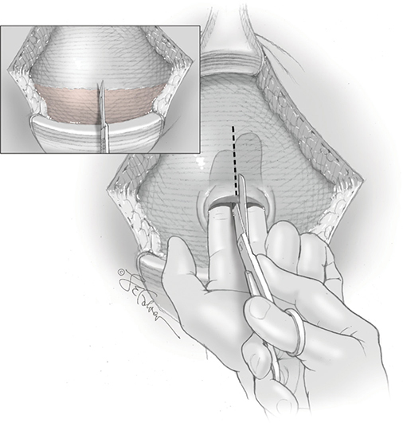

*Figure 30-11. Classical incision: small low vertical cut, then scissors extend it cephalad over protecting fingers.*

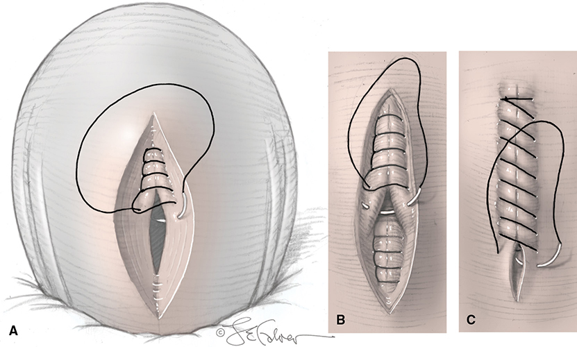

*Figure 30-12. Classical closure in layers: deep half (A), superficial half (B), then serosa (C).*

---

## 7. Peripartum Hysterectomy

### Indications and outcomes

- **Most common reasons:** to stop or prevent hemorrhage from **intractable atony**, **surgical trauma/tears**, or **abnormal placentation**.
- US rate **~1 per 1000 births** and rising (Parkland **1.7 per 1000** over 25 years), driven by **rising cesarean rates** and their complications in later pregnancies.
- **½ to ⅔ total**, the rest supracervical.
- **Major complications:** blood loss and **urinary tract injury**.
- **Planned (elective) vs emergent:** planned → **less blood loss, fewer transfusions, fewer urinary tract complications**. Accreta preparation: Ch 43.

### Technique

- Exposure with assistant's cephalad uterine traction + handheld retractors (a Balfour isn't needed initially).
- **Bladder flap as low as the cervix**; if hysterectomy is planned, **do the extended dissection before the hysterotomy**.
- **Placenta accreta with planned hysterectomy → leave the placenta in situ.** Bleeding hysterotomy → quick full-thickness closure or Pennington/sponge forceps.

**Steps (each side, then contralateral):**

1. **Round ligament** clamped, cut, ligated (0 or No. 1 suture) → open the anterior leaf of the broad ligament down to the bladder flap.
2. **Perforate the posterior leaf** beneath the tube, utero-ovarian ligament and ovarian vessels.
3. Clamp and cut **tube + utero-ovarian ligament**; lateral pedicle **doubly ligated** (medial clamp stays with the specimen).
4. Divide the posterior leaf down toward the **uterosacral ligament**; dissect the bladder further (sharply if adherent).
5. **Uterine vessels** clamped close to the uterus, divided, **doubly suture-ligated**. The **ureter passes beneath the uterine artery** → assistant pulls the uterus to the opposite side.
- **Profuse hemorrhage:** rapidly clamp and divide all pedicles first, ligate afterward.

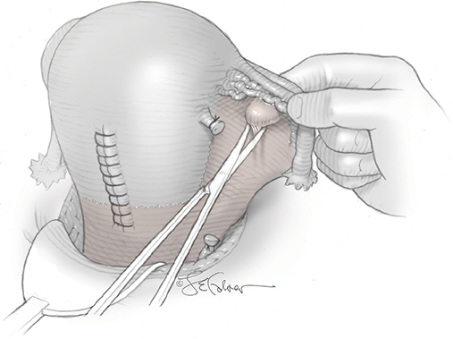

*Figure 30-14. Posterior leaf of the broad ligament perforated beneath the tube, utero-ovarian ligament and ovarian vessels.*

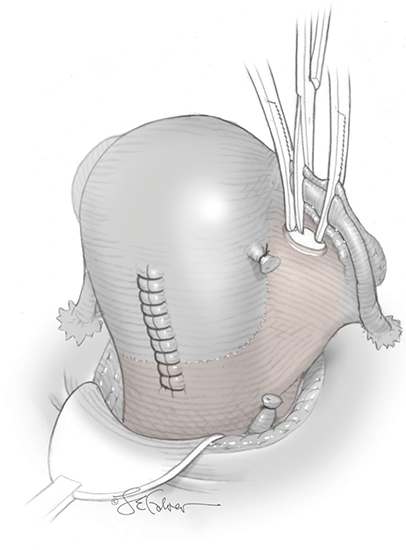

*Figure 30-15. Tube and utero-ovarian ligament clamped and cut; lateral pedicle doubly ligated.*

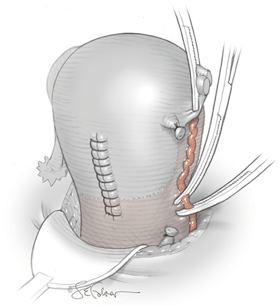

*Figure 30-18. Uterine vessels clamped close to the uterus (ureter lies just beneath) and doubly ligated.*

**Total hysterectomy**

- Often easier to **amputate the fundus first** and hold the cervical stump with Ochsner/Kocher clamps.
- Mobilize the bladder further → carries the **ureters caudad** and protects the bladder.
- **Cardinal and uterosacral ligaments** clamped with Heaney clamps **close to the cervix**, cut and ligated in steps down to the lateral vaginal fornix.
- **Finding a dilated, effaced cervix:** feel through the hysterotomy or a low anterior midline uterine incision (change the contaminated glove), or **place 4 clips/colored sutures at 12, 3, 6, 9 o'clock transvaginally** before a planned case.
- Clamp across the lateral vaginal fornix below the cervix, cut above it, confirm the whole cervix is out.
- **Vaginal cuff:** transfixing stitch at each angle + interrupted sutures for the middle; **attach the lateral fornices to the uterosacral ligaments** (prevents prolapse).
- Survey all pedicles for bleeding, avoiding the ureters.

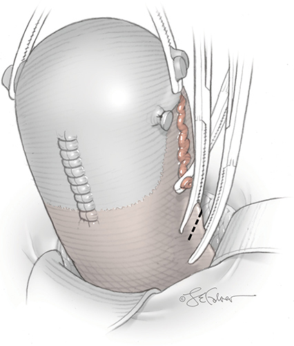

*Figure 30-19. Cardinal ligaments clamped, cut and ligated close to the cervix.*

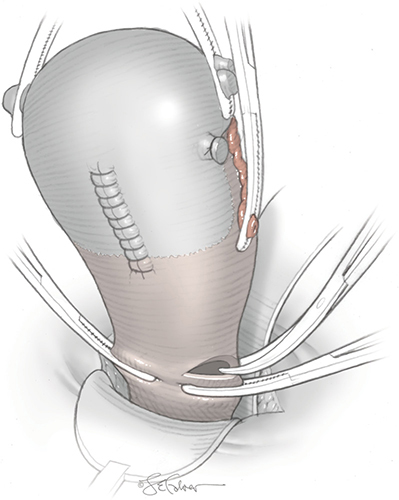

*Figure 30-20. Curved clamp across the lateral vaginal fornix just below the cervix; tissue cut medially.*

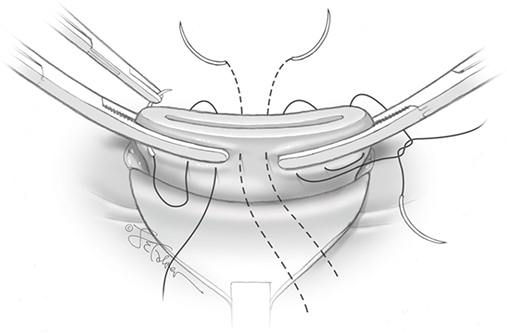

*Figure 30-21. Vaginal cuff closed with lateral transfixing stitches plus interrupted midline sutures.*

**Supracervical (subtotal) hysterectomy**

- Amputate the uterine body **just above the uterine artery ligation**; close the stump.
- **Often all that is needed to stop hemorrhage.** Preferred when a **shorter operation** is needed or **adhesions threaten the urinary tract**.

**Salpingo-oophorectomy**

- May be needed for hemostasis (large adnexal vessels close to the uterus). **Unilateral or bilateral oophorectomy in ~¼ of cases** (Briery 2007) → include in counseling.

### Urinary tract and bowel injury

| Injury | Rate per cesarean |
|---|---|
| **Bladder laceration** | **~2 per 1000** |
| Ureteral injury | **~0.3 per 1000** |
| Bowel injury | **~1 per 1000** |

**Cystotomy**

- Occurs during **bladder flap dissection**, **peritoneal entry** or **hysterotomy**.
- **Risk factors:** prior cesarean, adhesions, **emergency** cesarean, **cesarean hysterectomy** (especially accreta), **second-stage** surgery.
- Signs: **clear fluid gush**, visible **Foley bulb**. Confirm by retrograde filling (**dilute sterile infant formula** or **methylene blue saline**).
- **Dome most common**; the rest involve the **trigone**.
- **Before repair: confirm both ureteric jets** (through the cystotomy, or a separate extraperitoneal dome cystotomy if near the trigone).
- **Repair:** **2–3 layers, running 3-0 absorbable/delayed-absorbable**; first layer inverts the mucosa, then muscularis; test with marker fluid.
- **Continuous bladder drainage 7–14 days** (↓ fistula). **No prophylactic antibiotics** needed. Cystogram may be skipped for a simple laceration **<1 cm**.
- Trigone/large injuries → specialist; catheterize ureters if jets unseen; stents may stay.
- **Unrecognized cystotomy:** hematuria, oliguria, pain, ileus, ascites, peritonitis, fever, **urinoma, fistula** → retrograde cystography or **CT cystography**; repair promptly.

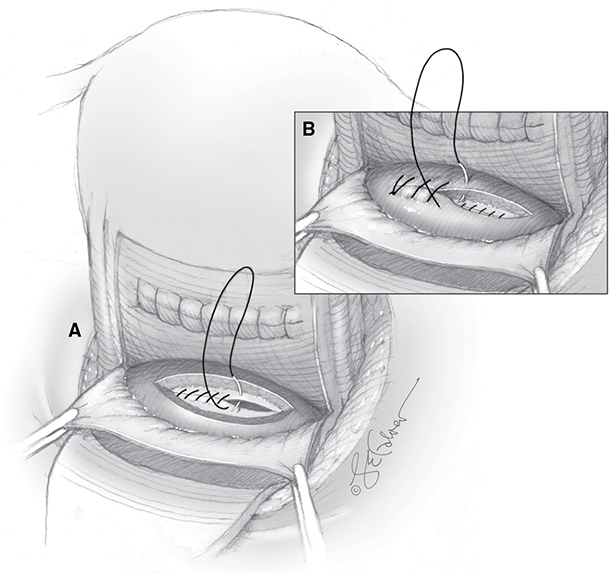

*Figure 30-22. Cystotomy repair: mucosa inverted with 3-0 suture (A), then 1–2 muscularis layers (B).*

**Ureteral injury**

- Risk: **cesarean hysterectomy (especially accreta)**, and repair of **extensions into the broad ligament or vagina**.
- Preop ureteral catheters: individualize (not Parkland practice). Lithotomy positioning allows cystoscopy.
- **Check with IV dye:**
  - **Methylene blue 50 mg IV over 5 min** — ⚠️ risk of **methemoglobinemia with G6PD deficiency**.
  - **10% sodium fluorescein 25–50 mg IV** (bright yellow).
  - Look for brisk colored jets from each orifice (cystoscopy or cystotomy). **Sluggish jets may just be hypovolemia** → resuscitate.
- **Catheter test:** 4F–6F catheter up the orifice; most injuries are **at or below the pelvic brim (~13 cm from the orifice)**. Won't pass → kink, ligation or crush. **Catheter seen in the abdomen → transection.**
- **Management:**
  - Kinked/ligated → release the suture. Crush → **stent** to prevent stricture.
  - **Stents 4F–7F, 20–30 cm** (24–26 cm for most adults), **double-J/double-pigtail**. **Foley 7–10 days, stents out by cystoscopy after 14 days.**
  - Devascularization, thermal injury, transection → **ureteroneocystostomy** if tension-free; more proximal → **ureteroureterostomy, psoas hitch, Boari flap**.
- **Unrecognized:** like cystotomy + **CVA tenderness**; **CT urography first**.

**Bowel injury**

- **Serosal tears** are weak points → may perforate if obstruction develops. Oversew a few with fine suture; larger injuries → general surgeon or gynecologic oncologist.

---

## 8. Postoperative Care

### Euvolemia

- ERAS: **euvolemic replacement** with lactated Ringer or similar crystalloid ± 5% dextrose.
- **Blood loss: ~1000 mL** for uncomplicated cesarean; **~1500 mL** for elective cesarean hysterectomy (more if emergent).
- A woman with **Hct ≥30%** and normal pregnancy volume expansion tolerates **up to 2000 mL** loss.
- Blood loss is often **underestimated** (vaginal loss, concealed uterine blood) → check Hct intra/postop as needed.

### Recovery suite

- Watch **vaginal bleeding ≥1 hour** and palpate the fundus (firmly contracted).
- Transfer when: **minimal bleeding, stable vital signs, adequate urine output**.

### Hospital care until discharge

**Analgesia**

| Option | Detail |
|---|---|
| **Neuraxial (intrathecal/epidural) morphine** | **12–24 h** relief; preferred over intermittent parenteral opioid. Dose-related sedation and **respiratory depression** (monitoring protocol); pruritus, nausea |
| NSAIDs alternating with acetaminophen | Added relief |
| **Oxycodone 2.5–5 mg q4h** | Breakthrough; **max 30 mg/d** (neonatal sedation) |
| IM meperidine 50–75 mg or IM morphine 10–15 mg q3–4h | Severe breakthrough pain |
| **TAP block** | If no neuraxial anesthesia |
| **PCA morphine** | **1 mg**, **6-min lockout**, **max 30 mg/4 h**; 2-mg booster ×2 allowed |

**Monitoring and fluids**

- Assess **hourly for 4 h**, then every 4 h (vitals, uterine tone, urine, bleeding). Encourage deep breathing and coughing.
- **Hct the morning after surgery**; sooner if big loss or hypotension, tachycardia, oliguria. Significant drop → repeat and look for the cause. **Iron preferred over transfusion** if bleeding has stopped.
- Maintenance IV fluid until eating (she mobilizes her expanded extravascular fluid).
- **Urine <30 mL/h → reassess promptly** (unrecognized bleeding, **oxytocin antidiuretic effect**).
- Unscheduled cesareans may have **contracted extracellular volume** (severe preeclampsia, sepsis, vomiting, long labor, bleeding) → keep in recovery longer.

**Bladder and bowel**

- **Foley removal:** SOAP **6–12 h** (retention risk with long-acting neuraxial); ERAS **immediately**.
- **Urinary retention ~5%**; risks: **failure to progress in labor**, postop narcotics.
- **Early feeding** within hours in uncomplicated cases.
- **Ileus** (distention, colic, no flatus/stool): some degree after every laparotomy but negligible after most cesareans.
  - Plain radiograph diagnoses only **50–60% of SBO** → use as triage. The postpartum uterus can compress the rectosigmoid and **mimic distal colonic obstruction**.
  - **CT with IV + oral contrast** is more accurate (also for unrecognized bowel injury).
  - Treat: IV fluids, **correct electrolytes**; **NG tube only for persistent vomiting or severe distention**.
  - Prevention: minimal bowel handling, avoid fluid excess or hypovolemia, short surgery; **chewing gum** (≥3 sessions/day, 15–60 min) speeds bowel recovery.

**Ambulation and wound**

- **Early ambulation** lowers VTE risk. Abdominal binder optional (evidence conflicting).
- Remove dressing at **24 h** (6 h is also fine); inspect daily. **Showering by day 3.**
- **Staples out on day 4** (tape strips for 1 week); keep **7–10 days** if superficial separation is a concern.

### Hospital discharge

- Average stay **3–4 days**. Earlier discharge is feasible for selected women, but **discharge <96 h ↑ neonatal readmission** (plan jaundice checks).
- First week: self-care and newborn care with help. **Drive** when pain allows emergency braking and no narcotics.
- **Intercourse resumed:** **44% by 6 wk, 81% by 3 months, 97% by 1 year.** Sexual function after the puerperium = vaginal birth.
- Return to work: **6 weeks** commonly cited; FMLA allows up to **12 weeks**.

---

## Quick-Recall: Cesarean Decisions at a Glance

| Question | Answer |
|---|---|
| Earliest elective / CDMR cesarean | **39 weeks** |
| Antibiotic and timing | **Cefazolin 1 g** (2 g ≥80 kg; 3 g ≥120 kg) **within 60 min before incision** |
| Add for labor/ROM | **Azithromycin 500 mg IV** |
| β-lactam anaphylaxis | **Clindamycin 900 mg + aminoglycoside 5 mg/kg** |
| Redose antibiotic | EBL **>1500 mL** or **>3 h** |
| VTE prophylaxis (ACOG) | **Pneumatic compression** before surgery |
| Preferred skin prep | **Chlorhexidine-alcohol** |
| Preferred incision | **Pfannenstiel + low transverse hysterotomy** |
| Fastest entry | **Midline vertical** |
| Uterine closure layers | One or two — outcomes similar; double → slightly more niches |
| Close peritoneum? | **No** (no benefit) |
| Close subcutaneous fat? | **Yes if ≥2 cm** |
| Staples vs suture | Staples → **more wound separation** |
| Impacted head | **Push (vaginal) or pull (breech extraction)** — pull ↓ extensions |
| High unlabored head | **Forceps or vacuum** |
| Placenta | **Spontaneous + cord traction + massage** (less blood loss/infection) |
| Uterotonic | **Oxytocin 20 U/L at 10 mL/min**; no bolus |
| Hysterectomy for accreta | **Leave placenta in situ**; extended bladder dissection **before** hysterotomy |
| Cystotomy | **2–3 layers 3-0**, Foley **7–14 d** |
| Ureter check | **Methylene blue 50 mg IV** (not in G6PD) or **fluorescein** |
| Unrecognized ureter injury | **CT urography** |

## Key Numbers to Memorize

- Cesarean rate **31.9%** (2018); **>85%** for 4 indications; VBAC **28% → 13.3%**
- Maternal mortality **2.2 vs 0.2 per 100,000** (cesarean vs vaginal); morbidity **2×**
- Fetal injury **1%** (elective **0.5%**); CDMR **~5%**
- Maturity criteria: US **<20 wk**, FHT **30 wk**, positive test **36 wk** ago
- NPO solids **6 h**, clears **2 h**; Bicitra **30 mL**
- VTE after cesarean **8 per 10,000**
- Pfannenstiel **3 cm above symphysis**, **12–15 cm**; Joel-Cohen **10 cm**, **3 cm below ASIS**
- Bladder flap **≤5 cm**
- Blood loss: cesarean **~1000 mL**; cesarean hysterectomy **~1500 mL**; tolerates **2000 mL** if Hct ≥30%
- Peripartum hysterectomy **~1 per 1000** births; oophorectomy in **¼**
- Bladder injury **2/1000**, ureter **0.3/1000**, bowel **1/1000**; ureter injury **~13 cm** from orifice
- Urine output alarm **<30 mL/h**; urinary retention **~5%**
- Oxycodone max **30 mg/d**; PCA morphine **1 mg / 6 min / 30 mg per 4 h**
- Stay **3–4 days**; staples out **day 4**; intercourse **44% / 81% / 97%** at 6 wk / 3 mo / 1 y
