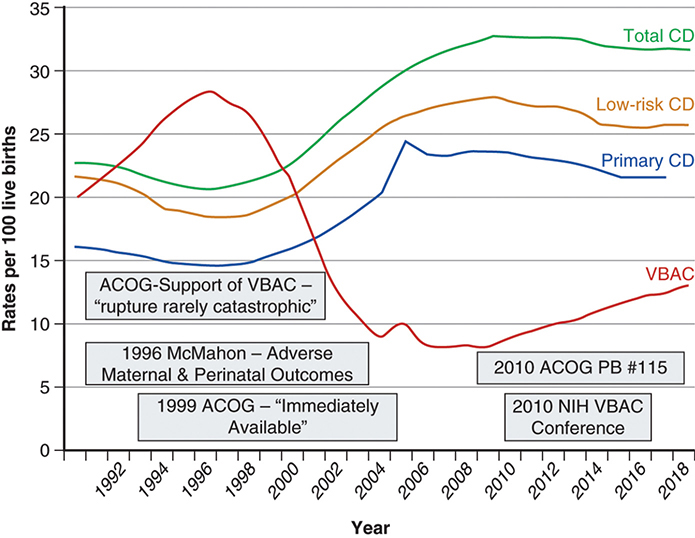
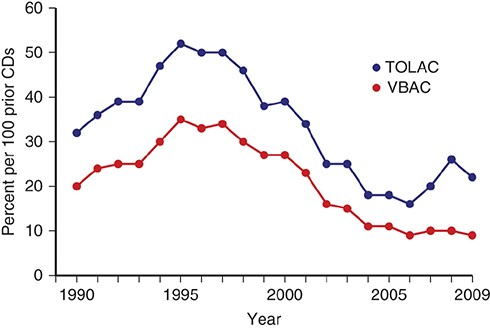
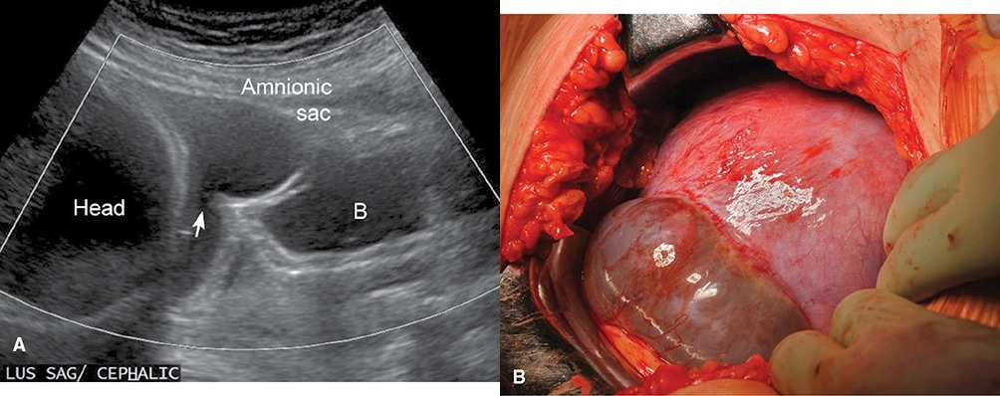
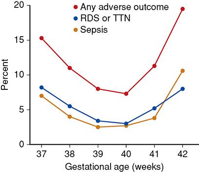
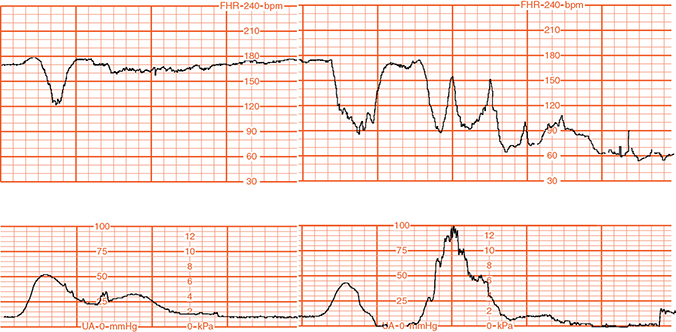
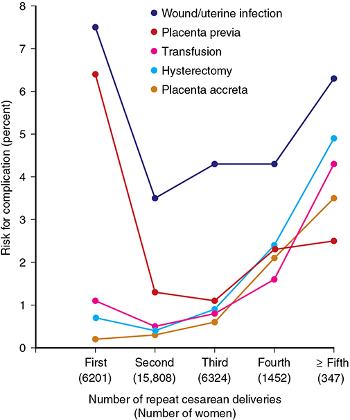

# Chapter 31: Prior Cesarean Delivery — Revision Notes

> Williams Obstetrics 26e, pp. 1475–1511 of the PDF. High-yield numbers are in **bold**.
> The six tables (31-1 to 31-6) are transcribed from the PDF images (they are missing from the extracted chapter text). All 6 figures are included.

**Big picture:** "Once a cesarean, always a cesarean" (Cragin, 1916) is still debated 100 years on. **TOLAC** has a small absolute risk of **uterine rupture (~0.5–0.9%)** and slightly higher perinatal mortality/HIE than **ERCD**, but avoids the escalating risks of **multiple repeat cesareans** (previa, **placenta accreta spectrum**, hysterectomy). Most women with **one prior low transverse** incision are candidates.

---

## 1. 100 Years of Controversy
- **Eastman (1950):** 30% postcesarean vaginal delivery; **2% rupture**, with **10% maternal mortality** in those ruptures.
- 1960s: cesarean rate only **~5%**; VBAC judged reasonable.
- **1981 NIH conference** + ACOG support (1988, 1994) → **VBAC rate 3.4% (1980) → peak 28.3% (1996)**, with a fall in the total cesarean rate.
- Reports of rupture-related morbidity/mortality (McMahon 1996) → **ACOG 1998:** physicians "**readily** available" → **1999:** "**immediately** available". This one-word change is thought to have driven the decade-long **VBAC decline**.
- **TOLAC attempts:** peaked **1995** (just over half), nadir **16% (2006)**, **21% by 2009**.
- **TOLAC success (VBAC among TOLACs):** peak **70% (2000)** → nadir **38% (2006)**.
- 2013: only **1 in 5** with one prior cesarean attempt TOLAC; **<1 in 10** with ≥2 prior (half succeed).
- **Parkland:** only **15%** choose TOLAC, but **86%** succeed.
- **2010 NIH panel** → slight VBAC rise afterwards.

*Figure 31-1. US cesarean and VBAC rates 1989–2018: VBAC peaked in 1996, fell after the 1999 "immediately available" wording, and rose slightly after the 2010 NIH conference.*

*Figure 31-2. TOLAC attempts (peak ~52 per 100 prior CDs in 1995) and VBAC rates (per 100 prior CDs), 1990–2009.*

### Table 31-1. Acronyms Used to Describe Management of Women with a Prior Cesarean Delivery

| Acronym / term | Meaning |
|---|---|
| **CD** | Cesarean delivery |
| **TOL** | Trial of labor |
| **VBAC** | Vaginal birth after CD |
| **TOLAC** | Trial of labor after CD |
| – Failed TOLAC | Resulting in CD |
| – Successful TOLAC | Resulting in VBAC |
| **ERCD** | Elective repeat cesarean delivery |
| – Scheduled ERCD | CD planned before labor |
| – Unscheduled ERCD | Planned scheduled CD but indications for early delivery, e.g., spontaneous labor, abruption, etc. |
| **Uterine rupture** | |
| – **Complete** | **All uterine wall layers separated** |
| – **Incomplete** | **Uterine dehiscence** with uterine muscle separated but **peritoneum intact** |

---

## 2. Influencing Factors
- Counsel **preconceptionally** and early in prenatal care; plans can change as pregnancy evolves.
- **Two choices:** **TOLAC** (goal VBAC; cesarean during the trial = failed TOLAC) or **ERCD** (scheduled, or unscheduled but planned for labor/other indication).
- Institutional economics, staffing and **medicolegal** factors also shape TOLAC availability.

### Table 31-2. Some Factors That Influence a Successful Trial of Labor in a Woman with Prior Cesarean Delivery (CD)

| Low-Risk | Favors Success | Increased Failure Rate | High-Riskᵃ |
|---|---|---|---|
| Transverse incision | Teaching hospital | Single mother | **Classical or T incision** |
| **Prior vaginal delivery** | White race | Advanced maternal age | **Prior uterine rupture** |
| Appropriate counseling | **Spontaneous labor** | **Macrosomic fetus** | Patient refusal |
| Sufficient personnel and equipment | Prior indication of fetal malpresentation | **Obesity** | **Transfundal surgery** |
| | 1 or 2 prior low transverse incisions | Current breech | Obstetrical contraindication, e.g., **previa** |
| | **Nonrecurrent indication** | Multifetal pregnancy | **Prior open maternal–fetal surgery** |
| | Current preterm pregnancy | Preeclampsia | Inadequate obstetrical or anesthesia staff coverage |
| | | **EGA >40 weeks** | |
| | | Low vertical incision | |
| | | Unknown incision | |
| | | **Labor induction** | |
| | | Medical disease | |
| | | Multiple prior CDs | |
| | | Education <12 years | |
| | | Short interdelivery interval | |
| | | Liability concerns | |

*ᵃMost consider these **absolute contraindications**. EGA = estimated gestational age.*

---

## 3. Delivery Route Risks

### Maternal risks
- **Guise review:** TOLAC rupture **absolute risk 0.47%, RR 20.7** vs ERCD.
- **MFMU (Landon 2004):** rupture **0.7%** with TOLAC vs **0** with ERCD. Maternal mortality: no difference or higher with ERCD in various reports.

### Table 31-3. Complications in Women with a Prior Cesarean Delivery Enrolled in the Study by the NICHD MFMU, 1999–2002

| Complication | TOLAC n = 17,898 No. (%) | ERCD n = 15,801 No. (%) | Odds Ratio (95% CI) | p value |
|---|---|---|---|---|
| **Maternal** | | | | |
| **Uterine rupture** | **124 (0.7)** | 0 | NA | <.001 |
| Uterine dehiscence | 119 (0.7) | 76 (0.5) | 1.38 (1.04–1.85) | .03 |
| Hysterectomy | 41 (0.2) | 47 (0.3) | 0.77 (0.51–1.17) | .22 |
| Thromboembolic disease | 7 (0.04) | 10 (0.1) | 0.62 (0.24–1.62) | .32 |
| **Transfusion** | 304 (1.7) | 158 (1.0) | **1.71** (1.41–2.08) | <.001 |
| **Uterine infection** | 517 (2.9) | 285 (1.8) | **1.62** (1.40–1.87) | <.001 |
| Death | 3 (0.02) | 7 (0.04) | 0.38 (0.10–1.46) | .21 |
| **Perinatal** | | | | |
| Antepartum stillbirthᵃ 37–38 weeks | 18 (0.4) | 8 (0.1) | 2.93 (1.27–6.75) | .008 |
| Antepartum stillbirthᵃ ≥39 weeks | 16 (0.2) | 5 (0.1) | 2.70 (0.99–7.38) | .07 |
| Intrapartum stillbirthᵃ | 2 | 0 | NA | NS |
| **Term HIE**ᵃ | **12 (0.08)** | 0 | NA | <.001 |
| Term neonatal deathᵃ | 13 (0.08) | 7 (0.05) | 1.82 (0.73–4.57) | .19 |

*ᵃDenominator is 15,338 for the TOLAC group and 15,014 for the ERCD group. CD = cesarean delivery; CI = confidence interval; ERCD = elective repeat cesarean delivery; HIE = hypoxic ischemic encephalopathy; NA = not applicable; MFMU = Maternal–Fetal Medicine Units Network; NICHD = National Institute of Child Health and Human Development; NS = not significant; TOLAC = trial of labor after cesarean delivery.*

- **Morbidity data conflict:**
  - Guise: no difference in hysterectomy or transfusion.
  - Mozurkewich meta-analysis: TOLAC **~half** the transfusion/hysterectomy risk.
  - MFMU: TOLAC ↑ **transfusion and infection**.
  - **Canadian cohort (Young 2018):** TOLAC aRR **rupture 6.41**, **severe PPH with transfusion 2.80**, composite maternal morbidity **1.96**.
- ⚠️ **Failed TOLAC carries ~5× the major complications of a successful TOLAC.**

### Perinatal risks

| Outcome | TOLAC vs ERCD |
|---|---|
| Perinatal mortality (Guise) | **0.13% vs 0.05%** |
| Perinatal death (Smith, ~25,000) | **1.3/1000**, **11×** ERCD |
| Canada: composite severe neonatal morbidity/mortality | aOR **1.49** |
| Canada: neonatal death (failed VBAC / attempted TOLAC) | aOR/aRR **3.22** |
| **HIE at term** (MFMU) | **46 per 100,000** vs **0** |
| Transient tachypnea | **3.6% vs 4.2%** (↑ with ERCD) |
| Bag-and-mask ventilation | **5.4% vs 2.5%** |
| 5-min Apgar, NICU admission | No difference |

---

## 4. Trial of Labor Selection Considerations
- TOLAC/VBAC **calculators** help predict VBAC success but are **not validated for uterine rupture**; nomograms have poor prognostic value.
- **ACOG:** most women with **one prior low transverse** hysterotomy are candidates → counsel on both TOLAC and ERCD. **Home birth is a contraindication to TOLAC.**

### Prior uterine incision

### Table 31-4. Types of Prior Uterine Incisions and Estimated Risks for Uterine Rupture

| Prior Incision | Estimated Rupture Rate (%) |
|---|---|
| **One low transverse** | **0.2–0.9** |
| Multiple low transverse | 0.9–1.8 |
| Low-verticalᵃ | 1–7 |
| **Classical** | **2–9** |
| **T-shaped** | **4–9** |
| Prior preterm CD | "Increased" |
| Prior uterine rupture — **Lower segment** | **2–6** |
| Prior uterine rupture — **Upper uterus** | **9–32** |

*ᵃSee text for definition. CD = cesarean delivery. Data from the American College of Obstetricians and Gynecologists, 2017; Cahill, 2010b; Chauhan, 2002; Landon, 2006; Macones, 2005a,b; Martin, 1997; Miller, 1994; Sciscione, 2008; Society for Maternal-Fetal Medicine, 2012; Tahseen, 2010.*

**Incision type**
- **One low transverse:** lowest risk of symptomatic separation; asymptomatic dehiscence/"uterine window" still possible.
- **Low vertical without fundal extension:** probably not higher risk than low transverse → **may be a TOLAC candidate** (ACOG).
- **Classical or T-shaped → contraindication to labor.** Highest risk: vertical incisions **into the fundus**.
  - Classical scars can rupture **before labor and before term**. Chauhan (157 women, delivery at mean **35.6 wk**): one rupture at **29 wk** (fetal death), **9% dehiscence**, **25% maternal morbidity**; rupture is **neither predictable nor preventable**.
  - Even higher early risk after **open maternal–fetal surgery**.
  - **Prior classical → deliver at 36⁰/₇–37⁰/₇ wk** (ACOG).
- **Who gets a classical incision?** **53%** of cesareans at **24⁰/₇–25⁶/₇ wk**, **35%** by 28 wk, **<10%** by 32 wk; also noncephalic presentations (a "low vertical" in a preterm breech with an undeveloped lower segment almost always extends into the active segment).
  - Prior **preterm classical**: ~**1%** rupture.
  - Prior **periviable** cesarean: rupture **1.8% vs 0.4%** after a term cesarean (half of the periviable ruptures had "low transverse" incisions). Not confirmed by all.
- **Unknown incision:** a potential TOLAC candidate unless the circumstances suggest a classical incision.
- **Müllerian anomalies:** earlier reports suggested ↑ risk; a study of 103 women had **no ruptures**.

*Figure 31-3. "Uterine window" after one low transverse cesarean: sonographic defect with a bulging amnionic sac (A) and the sac seen through the thin lower segment at surgery (B).*

**Closure technique**
- Single vs double layer, locking vs nonlocking: **no difference in dehiscence/rupture** (meta-analysis). Single-layer and locked first layer → thinner residual myometrium on later sonography (another study: double layer didn't thicken it).
- **Parkland:** one running, locking layer.

**Number of prior incisions**
- Three studies: **2–3× rupture risk** with two vs one prior transverse hysterotomy.
- MFMU: **0.9%** (≥2 prior, n = 975) vs **0.7%** (one prior), **not significant**.

**Imaging the scar**
- Large nonpregnant defects and a **thinner lower uterine segment** predict rupture/defect, but **no safe threshold** exists.
- **Jastrow 2016** (LUS measured at **34⁰/₇–38⁶/₇ wk**, n = 1856):

| LUS thickness | Risk category | TOLAC rate |
|---|---|---|
| **<2.0 mm** | High | 9% |
| 2.0–2.4 mm | Intermediate | 42% |
| **≥2.5 mm** | Low | 61% |

  - No symptomatic ruptures in 984 TOLACs. **Parkland does not measure the LUS.**

### Prior uterine rupture
- Recurrence: **lower segment up to 6%**, **upper segment 9–32%**; one series ~**20%**.
- ERCD before labor (or at onset of preterm labor) → no ruptures in 60 pregnancies.
- **Deliver at 36⁰/₇–37⁰/₇ wk** (ACOG).

### Interdelivery interval
- MRI: full myometrial healing may need **≥6 months**.
- **Interdelivery interval ≤18 months → 3× symptomatic rupture** (Shipp; overall rupture 1.4%).
- **Interpregnancy interval <6 months → 3×** rupture.

### Prior vaginal delivery
- Before or after the cesarean → **↑ VBAC success** and **↓ rupture** and other morbidity.

### Prior cesarean indication

| Prior indication | VBAC rate |
|---|---|
| **Nonrecurring** (e.g., breech) | **~90%** |
| Fetal compromise | **~80%** |
| **Labor arrest** | **~60%** |

- Prior **second-stage** cesarean → may be linked to second-stage rupture next time.
- Second stage **>3 h** during TOLAC often still ends in VBAC, but rupture/dehiscence rises as it lengthens.

### Fetal size and lie
- ↑ fetal size → **↓ VBAC**; rupture link weaker. Zelop: rupture **1.0% (<4000 g)**, **1.6% (>4000 g)**, **2.4% (>4250 g)** (not significant).
- **Preterm TOLAC:** similar or higher VBAC, **lower rupture**.
- Breech with prior cesarean: little data. **ECV is not contraindicated** by a prior incision (ACOG); success and adverse events similar. (Parkland: no ECV or vaginal breech in these women.)

### Multifetal gestation
- Twins do **not ↑ rupture**: rupture **0.7–1.1%**, VBAC **45%** (one study) to **75–85%**.
- **ACOG: twins + one prior low transverse → TOLAC is safe.**

### Maternal obesity (VBAC success by BMI)

| BMI | VBAC |
|---|---|
| Normal | **85%** |
| 25–30 | 78% |
| 30–40 | 70% |
| **≥40** | **61%** |

### Fetal death
- Most prefer vaginal delivery; **maternal risk ↑**.
- MFMU (209 fetal deaths, mean **32.8 wk**): VBAC **87%**; rupture **2.4%** overall, **3.4% with induction**.
- Induction for **second-trimester** demise has a low complication rate.

---

## 5. Labor and Delivery Considerations

### Timing
- **No nonindicated delivery before 39 completed weeks** (ACOG): ERCD before 39 wk ↑ neonatal morbidity (RDS/TTN, sepsis, any adverse outcome). **Beyond 40 wk** morbidity rises again.
- **Accurate dating** is essential; **early embryo-fetal sonography** is the best method.

*Figure 31-4. Neonatal morbidity with 13,258 ERCDs: lowest at 39–40 wk, higher at 37–38 wk and ≥41 wk.*

### Intrapartum care
- **ACOG:** TOLAC in facilities able to perform **emergency cesarean** for immediate threats to mother or fetus. If unavailable, discuss hospital resources; **referral** may be best.
- Access problem: Ohio hospitals meeting requirements: **15% Level I, 63% Level II, 100% Level III**. TOLAC allowed in **88%** (≥1500 deliveries/yr), **59%** (500–1499), **43%** (<500) of hospitals.

### Cervical ripening and labor stimulation
- **Induction → ↑ TOLAC failure** vs spontaneous labor.
- ⚠️ **Misoprostol (PGE₁) is contraindicated** at term with a prior cesarean or major uterine surgery (RCT stopped after **2 of 17** ruptured).
- Ideally avoid induction/augmentation with **unknown incision, unfavorable cervix, or >40 wk**. **Parkland: amniotomy only**, no pharmacologic induction/augmentation.

| Method | Uterine rupture data |
|---|---|
| Spontaneous labor (MFMU) | **0.4%** |
| **Oxytocin induction** (MFMU) | **1.1%**; **1.8% (4×)** if no prior vaginal delivery; **dose-related** |
| Oxytocin augmentation | **0.9%** |
| PGE₂ gel (Ravasia) | **2.9%** vs 0.9% spontaneous |
| Any prostaglandin + oxytocin (MFMU) | **1.4%**; prostaglandin alone (n = 227): **0** |
| **Sequential PG → oxytocin** | **3×** spontaneous |
| Transcervical Foley (Bujold) | **1.6%** vs 1.1% spontaneous vs 1.2% amniotomy ± oxytocin (NS) |
| Balloon catheter (Sarreau, 101) | 50% VBAC, no ruptures |
| Foley ripening (Hoffman) | **6.5%** vs 1.9% spontaneous |

### Epidural analgesia
- Does **not mask rupture**: <10% of scar separations cause pain and bleeding; **FHR decelerations are the most likely sign**.
- More frequent epidural dosing was associated with ↑ rupture.
- VBAC rates similar or higher with epidural; ~¼ of VBACs are operative vaginal.
- **AAP/ACOG: epidural may be used safely in TOLAC.**

### Uterine scar exploration after VBAC
- Routine transcervical palpation of the lower segment is debated: dehiscence/rupture **0.23%** (3469 VBACs) → explore only with **severe third-stage bleeding** (Silberstein).
- **Parkland** examines routinely. **Laparotomy/repair** for a large tear, **peritoneal breach**, or **active bleeding**.

---

## 6. Uterine Scar Rupture

### Diagnosis
- Labor progress is similar to normal; **no labor pattern predicts rupture**.
- Early signs can be bizarre: hemoperitoneum → diaphragmatic irritation → **chest pain** (may mimic PE or AFE).
- **Most common sign: nonreassuring FHR** (variable → late decelerations → **bradycardia**). Utah (36 TOLAC ruptures): fetal signs 24, maternal 8, both 3.
- **Contractions rarely stop**; **IUPC is not reliable** for diagnosis.
- May resemble **abruption** with little pain/tenderness (often masked by analgesia). Diagnosis emerges from **fetal distress** ± **maternal hypovolemia** (concealed hemorrhage).
- Clues: **loss of station**; presenting part moved away from the inlet; firm contracted uterus felt beside the fetus; emergent bedside sonography.

*Figure 31-5. FHR tracing during rupture while pushing: a reflex push, then loss of uterine tone and worsening fetal bradycardia.*

### Management
- Fetal extrusion into the peritoneal cavity → poor intact survival; depends on how much placenta stays attached. **Only chance = immediate delivery, usually laparotomy.** Total placental separation → very few intact survivors.
- **Utah (35 ruptures):**
  - Decision-to-delivery **<18 min** (n = 17): **no adverse neurological outcome**.
  - >18 min (n = 18): 3 long-term impairments at **31, 40, 42 min**.
  - No deaths; severe neonatal neurological morbidity **8%**. Delivery within **30 min** did not prevent every low cord pH/Apgar, but when rupture was identified and delivery achieved **<30 min**, there was **no long-term neonatal morbidity**.
- **MFMU:** neonatal encephalopathy in **6%** (7 of 114) of TOLAC ruptures. Neonatal death after rupture **5%** (Sweden).
- **Maternal death** uncommon: **0.2%** of ruptures (Canada); **30%** in rural India.
- **Hysterectomy** may be needed; selected cases → **suture repair** with uterine preservation. **Check the bladder** (comorbid injury).

---

## 7. Multiple Repeat Cesarean Deliveries
- Complications rise with each repeat cesarean.
- **Placenta accreta spectrum (with previa):** **11%** at the 2nd cesarean → **67%** at the 5th (MFMU, 30,132 women).
- Almost **half of Parkland cesarean hysterectomies** are in women with ≥1 prior cesarean.
- Also rising: **bowel/bladder injury, ICU/ventilation, maternal mortality, operative time, hospital stay**, adhesion-related **bowel obstruction** and **pelvic pain**.
- **UKOSS (≥5 cesareans vs one prior):** major hemorrhage **18×**, visceral damage **17×**, critical care **15×**, delivery <37 wk **6×**; much of this in the **18%** with previa or PAS. Neonatal complications mainly from **indicated preterm birth**.

*Figure 31-6. MFMU: accreta, hysterectomy and transfusion rise steeply after the third repeat cesarean.*

---

## 8. Vaginal Birth After Cesarean — 2021
- **No large RCTs**; most studies compare actual, not intended, route.
- Common-sense approach: **shared decision-making** (decision aids help), with the partner if she wishes.
- Absolute adverse rates are low, but **TOLAC has higher maternal and neonatal morbidity and mortality than ERCD**.
- **Counseling includes:** documentation of the **prior incision**, risks/benefits/likely outcomes of each route, and **future-pregnancy risks**. Begin preconceptionally; keep options flexible until delivery.
- Women choosing TOLAC despite a higher-risk factor → **additions to the consent form** (ACOG).

### Table 31-5. Some Recommendations of Professional Societies Concerning TOLAC

| Society | Counseling | Facilities | Other |
|---|---|---|---|
| **ACOG (2019d)** | Offer to most women with **1 prior LTCD**; **consider for 2 prior LTCDs** | Safest with ability for **immediate CD**; patients should be allowed to accept increased risk when not available | **Not precluded:** twins, macrosomia, prior low vertical or unknown incision type |
| **SOGC** | Offer to women with 1 prior LTCS; with >1 prior CD then VBAC likely successful but increased risks | Should deliver in hospital in which **timely CD** is available; the woman and provider must be aware of hospital resources and availability of obstetrical, anesthetic, pediatric, and operating room staff | **Oxytocin or Foley catheter induction safe, but PGs not recommended**; macrosomia, diabetes, postterm pregnancy, twins are not contraindications |
| **RCOG (2015)** | Offer to most women with **singleton, cephalic fetus at ≥37 weeks with 1 prior LTCD**; with >1 prior CD then VBAC likely successful but increased risks, offer after counseling by senior obstetrician, VBAC checklists should be considered | Suitable delivery suite with **continuous intrapartum care and monitoring**; immediate cesarean delivery and advanced neonatal resuscitation | Uncertainty about safety and efficacy with postterm, twin gestation, macrosomia, and advanced maternal age; induction and augmentation associated with **two- to threefold increased risk of uterine rupture** |

*ACOG = American College of Obstetricians and Gynecologists; CD = cesarean delivery; LTCS = low transverse cesarean delivery; PG = prostaglandins; RCOG = Royal College of Obstetricians and Gynaecologists; SOGC = Society of Obstetricians and Gynaecologists of Canada; TOLAC = trial of labor after cesarean delivery; VBAC = vaginal birth after cesarean.*

### Table 31-6. Conservative Approach to TOLAC

**Review and follow ACOG guidelines**

| Domain | Steps |
|---|---|
| **Education and counseling** | **Preconceptionally:** provide ACOG patient pamphlet. **Prenatal care:** early counseling and delivery planning; develop preliminary delivery plan; revisit delivery plan at least each trimester; be willing to alter decision; confirm facility capabilities |
| **Risk assessment** | Review and document operative note(s); review relative/absolute contraindications; reconsider risks as pregnancy progresses; careful consideration and counseling if: >1 prior transverse CD, unknown incision, twins, macrosomia |
| **Labor and delivery** | Review previous medical records/operative notes; cautions for induction: unfavorable cervix, high station (consider AROM; **avoid prostaglandins**; respect oxytocin and know when to quit); **continuous EFM**; beware of abnormal labor progress; respect EFM pattern abnormalities; **be ready to abandon TOLAC**; **recommend against home birth** |

*ACOG = American College of Obstetricians and Gynecologists; AROM = artificial rupture of membranes; CD = cesarean delivery; EFM = electronic fetal monitoring; TOLAC = trial of labor following cesarean delivery.*

---

## Quick-Recall: TOLAC Candidate or Not?

| Situation | TOLAC? |
|---|---|
| One prior low transverse | **Yes** (rupture 0.2–0.9%) |
| Two prior low transverse | **Consider** (ACOG); rupture 0.9–1.8% |
| Low vertical, no fundal extension | **May be candidate** |
| Unknown incision | **Candidate** unless classical suspected |
| Twins | **Yes** (rupture 0.7–1.1%) |
| Macrosomia | Not precluded (↓ VBAC; rupture 2.4% >4250 g) |
| Breech needing ECV | ECV **not contraindicated** |
| **Classical / T-shaped / transfundal surgery** | **No** — deliver **36⁰/₇–37⁰/₇ wk** |
| **Prior uterine rupture** | **No** — deliver **36⁰/₇–37⁰/₇ wk** |
| Prior open fetal surgery | **No** |
| Placenta previa | **No** |
| **Home birth** | **Contraindicated** |
| **Misoprostol** for ripening | **Contraindicated** |
| Epidural | **Safe** |

## Key Numbers to Memorize
- VBAC rate **3.4% (1980) → 28.3% (1996)**; TOLAC nadir **16%** (2006); TOLAC success peak **70%**, nadir **38%**; Parkland **15%** attempt, **86%** succeed
- Rupture: TOLAC **0.47%** (RR **20.7**, Guise); MFMU **0.7%** vs 0; failed TOLAC **5×** complications
- Perinatal mortality **0.13 vs 0.05%**; term HIE **46/100,000** vs 0
- One low transverse **0.2–0.9%**; classical **2–9%**; T **4–9%**; prior rupture lower **2–6%**, upper **9–32%**
- Classical incision in **53%** at 24–25 wk, **35%** at 28 wk, **<10%** at 32 wk
- Interdelivery **≤18 mo → 3×**; interpregnancy **<6 mo → 3×**
- VBAC by prior indication: **90 / 80 / 60%** (nonrecurring / fetal compromise / arrest)
- VBAC by BMI: **85 / 78 / 70 / 61%**
- Oxytocin induction rupture **1.1%** (1.8% with no prior vaginal birth) vs spontaneous **0.4%**
- LUS thickness **<2.0 mm high risk**, **≥2.5 mm low risk**
- Decision-to-delivery **<18 min**: no neuro injury; neonatal encephalopathy after rupture **6%**; maternal death **0.2%**
- PAS with previa **11% → 67%** (2nd → 5th cesarean); ≥5 cesareans: hemorrhage **18×**, visceral injury **17×**
- ERCD at **≥39 wk**
