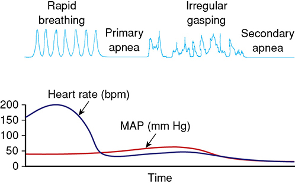
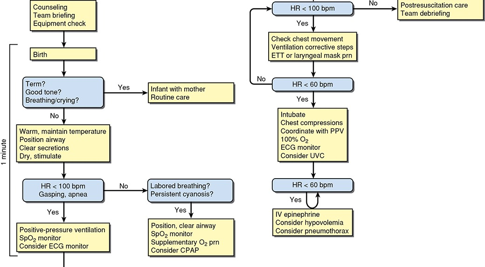
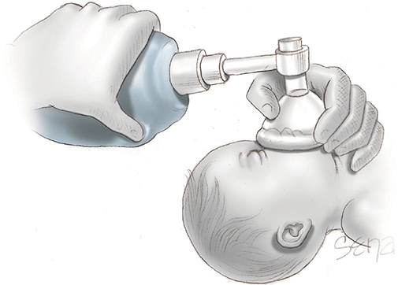
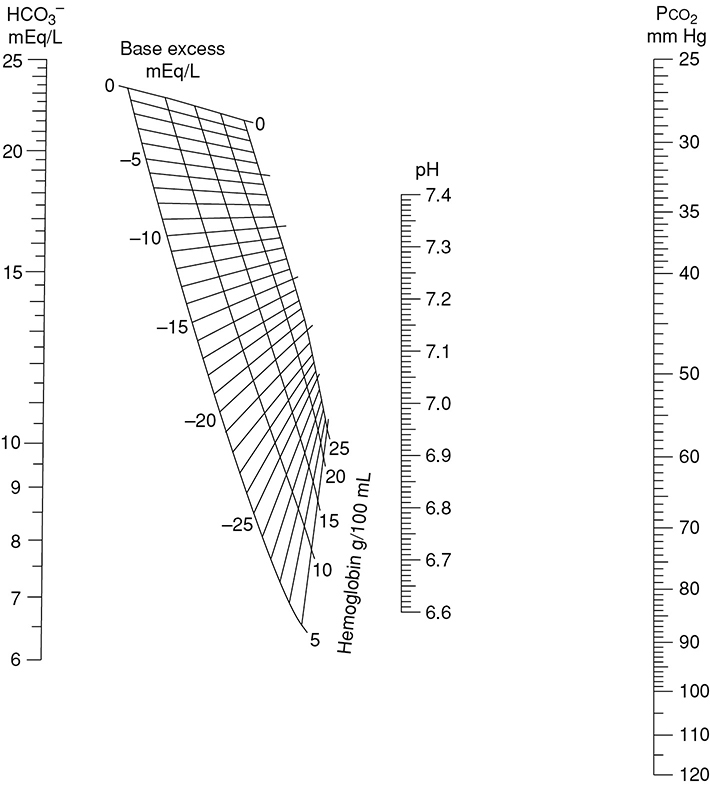
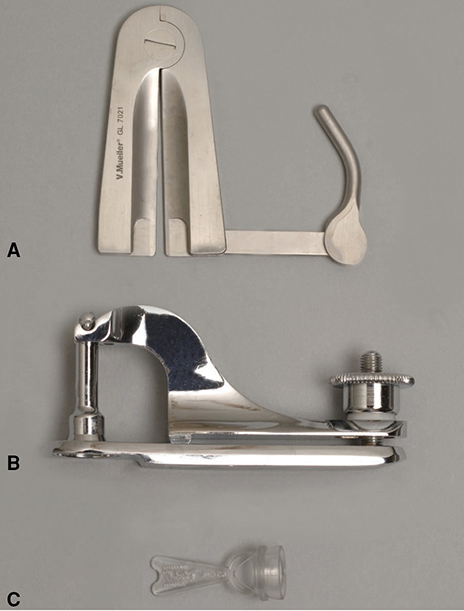

# Chapter 32: The Newborn — Revision Notes

> Williams Obstetrics 26e, pp. 1512–1544 of the PDF. High-yield numbers are in **bold**.
> The five tables (32-1 to 32-5) are transcribed from the PDF images (they are missing from the extracted chapter text). All 5 figures are included (the resuscitation algorithm, Fig 32-2, is printed twice, on p1518 and p1519; the p1511 bag-and-mask drawing is the Section 9 title-page art, not a numbered figure). The acid–base equations, lost from the extracted text, are restored from the PDF pages.

**Big picture:** Every birth needs **at least one person whose only job is the newborn** and who can give **positive-pressure ventilation (PPV)**, the single most important step in resuscitation. After birth: Apgar and cord gases describe the newborn's condition; then come the preventive care bundle (eyes, hepatitis B, vitamin K, screening) and routine care.

---

## 1. Attendants at Delivery
- **AAP/ACOG:** ≥1 qualified person at every birth, skilled in initial steps and PPV, **responsible only for the newborn** (pediatrician, NP, anesthesia provider, or trained nurse). If absent, it falls to the **obstetrical attendant**.
- **High-risk deliveries:** a full-resuscitation team **present**, and **immediately available** for every resuscitation (**not on call from home** or a remote area).
- Team **simulation training** recommended.

---

## 2. Transition to Air Breathing
- Placental → pulmonary gas exchange: **PVR falls**, pulmonary flow rises, and the **ductus arteriosus and foramen ovale** begin to close.
- **Lung aeration itself triggers the cardiovascular changes** at birth.

**Lung fluid clearance mechanisms**
1. **Fetal adrenaline surge** late in labor → epithelium switches from secreting to **reabsorbing** fluid (sodium-channel activation). Probably **minor** (blockade delays but doesn't prevent clearance).
2. **Mechanical forces:** thoracic compression can expel up to **⅓** of lung liquid. **Uterine contractions changing fetal posture** (early in labor) matter more than the "vaginal squeeze".
3. **After birth (major):** most aeration happens during **inspiration within 3–5 breaths**; the transpulmonary gradient pushes fluid into the interstitium, then it is cleared by blood and lymphatics. **No clearance between breaths.** Without PEEP, fluid can re-enter airspaces in expiration → may contribute to **transient tachypnea of the newborn**.
4. **Surfactant** (type II pneumocytes) ↓ surface tension and prevents alveolar collapse. Deficiency (preterm) → **RDS**.

**Breathing mechanics**
- First breaths need **high negative intrathoracic pressure**; opening pressure falls with each breath. By about the **5th breath** pressure–volume changes resemble the adult's.
- Air replaces fluid → ↓ vascular compression → ↓ PVR → ↓ pulmonary artery pressure → **ductus closes**.

**Why delayed cord clamping helps**
- In utero, **umbilical venous return is the main LV preload** (pulmonary flow is tiny).
- **Clamping before lung aeration** → ↓ preload → ↓ cardiac output → **bradycardia**.
- **Clamping after aeration** → smoother transition, no fall in output → interest in **physiological cord clamping** (special resuscitation trolleys; trials ongoing).

---

## 3. Care in the Delivery Room
- **ILCOR** scientific review (2020) → AAP/AHA **North American** neonatal resuscitation guidelines.

### Immediate care
- **Risk factors** that call for a resuscitation team at delivery:
  1. Poor maternal health
  2. Prenatal complications incl. suspected malformations
  3. **Preterm**
  4. Labor complications
  5. Long labor / **prolonged rupture of membranes**
  6. Anesthesia affecting placental perfusion
  7. Difficult delivery
  8. Labor medications (dose, route, timing)
- **Pre-delivery huddle:** expected GA, **amnionic fluid color**, extra risk factors, **cord-clamping plan**.
- **Causes of a nonvigorous newborn:** immaturity, hypoxemia/acidosis, sepsis, recent maternal drugs, **meconium-stained fluid**, CNS anomalies; respiratory: lung anomalies, upper airway obstruction, **pneumothorax**, meconium aspiration.

### Umbilical cord management
- **Term:** delay **30–60 s** → ↑ Hb at birth, ↑ infant iron stores. Only harm: **hyperbilirubinemia / more phototherapy**.
- **Preterm:** ↓ **transfusion, IVH, NEC** and ↑ **survival**.
- **Delay for all preterm and term newborns not needing resuscitation.**
- **Don't delay** if resuscitation needed, or with **abruption, cord avulsion, bleeding previa or vasa previa**.
- **Cord milking:** reasonable alternative to immediate clamping for **late-preterm and term**; **avoid <28 wk**.

> **Pearl:** Chapter 27 quotes organizations advising against routine milking **<29 wk**; this chapter says **<28 wk**. Either way, no milking in the extremely preterm.

### Newborn resuscitation
- **~10%** need some active resuscitation; **~1%** need extensive care.
- Home birth neonatal death rate is **4×** attended hospital birth.

**Apnea sequence (Fig 32-1)**

| Stage | Breathing | HR / BP / tone | Responds to stimulation? |
|---|---|---|---|
| Early O₂ lack / CO₂ rise | Transient **rapid breathing** | — | — |
| **Primary apnea** | Stops | **HR falls**, tone lost | **Yes** (simple stimulation) |
| Gasping | **Deep, irregular gasps** | — | — |
| **Secondary apnea** | Stops | HR falls further, **BP falls**, tone lost | **No**; death unless ventilated |

- **Primary and secondary apnea look the same clinically** → if no immediate response to stimulation, **start effective ventilation quickly**.
- **Effective PPV is the most critical intervention.**

*Figure 32-1. Rapid breathing → primary apnea → gasping → secondary apnea, with heart rate falling first and blood pressure falling in secondary apnea.*

---

## 4. Resuscitation Protocol

### Initial assessment (during delayed cord clamping)
- Assess **tone, breathing and heart rate**. Most term babies are **vigorous by 10–30 s**.
- **Vigorous:** stay with mother; skin-to-skin, dry, warm blanket. Keep **36.5–37.5°C**. **No routine oral suctioning**; bulb suction only for apnea or copious secretions. Dry, rub the back, observe.
- **Not vigorous or preterm → radiant warmer:** remove the wet blanket, dry.
- **Preterm thermal care:**
  - Delivery room **>25°C**
  - Plastic or wool **hat**
  - **Polyethylene wrap/"poncho"** (↓ evaporative loss)
  - **Chemically activated thermal mattress** (↓ conductive loss)
  - **Warm, humidified** respiratory gases
- Position with **mild neck extension**; suction mouth then nose only if apneic or obstructed.
- ⚠️ **Meconium:** **no routine intubation/suction** for the **nonvigorous** newborn; only for suspected **airway obstruction**. (Meconium still ↑ need for advanced resuscitation.)
- **Apnea, gasping or HR ≤100 bpm** after initial steps → **PPV with room air**, started **by 60 s** of life.

*Figure 32-2. ILCOR/AAP/AHA newborn resuscitation algorithm (shown in two columns): initial steps within the first minute; PPV for HR <100 or apnea; compressions + 100% O₂ for HR <60; IV epinephrine if HR stays <60.*

*Note: the text uses **≤100 bpm** and **≤60 bpm** in places, whereas the algorithm uses **<100** and **<60 bpm**.*

### Mask ventilation
- Rate **40–60 breaths/min**.
- **Pulse oximetry**; add O₂ in graded steps to meet the targets below.
- **Best sign of adequate ventilation: rising heart rate.** Colorimetric **ETCO₂** detector between device and mask confirms gas exchange.

*Figure 32-3. Bag-and-mask ventilation: sniffing position, nose to the ceiling, neck not hyperextended.*

### Table 32-1. Oxygen Saturation Goals per Minute of Life

| Minute of life | Target SpO₂ |
|---|---|
| 1 min | **60–65%** |
| 2 min | 65–70% |
| 3 min | 70–75% |
| 4 min | 75–80% |
| 5 min | **80–85%** |
| 10 min | **85–95%** |

> **Memory hook:** Start at **60%** and add **5% per minute** to 85% at 5 min; **85–95% by 10 min**.

- HR still **≤100 after 5–10 breaths** with inadequate ventilation → **MR. SOPA**. The two commonest problems are **mask leak** and **airway malposition**. Keep the **mouth open** (better conduit than the nares).

### Table 32-2. Ventilation Corrective Steps (MR. SOPA)

| Step | Action |
|---|---|
| **M**—Mask adjustment | Check the mask seal and reapply if needed |
| **R**—Reposition airway | Ensure the newborn is truly in the open airway position with mild neck extension |
| **S**—Suction mouth and nose | Remove obstructing secretions |
| **O**—Open the mouth | Avoid closing the mouth during efforts to achieve a good mask seal |
| **P**—Pressure increase | Increase the inflation pressure |
| **A**—Advanced airway | If all prior steps fail to achieve chest rise, then intubate or place a laryngeal mask or other supraglottic airway |

### Alternative airway
- For ineffective or prolonged mask ventilation.
- **Straight laryngoscope blade: size 0 preterm, size 1 term.** Gentle cricoid pressure may help.
- **Confirm tracheal placement:** **rising HR + ETCO₂ detection** (primary); also symmetric chest movement, equal breath sounds (axillae), none/gurgling over the stomach.
- ETT suction only for suspected obstruction. Attach self-inflating bag, flow-inflating bag or **T-piece**.

| | Term | Preterm |
|---|---|---|
| Rate | **40–60/min** | 40–60/min |
| Opening pressure | **30–40 cm H₂O** | **20–25 cm H₂O** |
| After lung inflation | **20–25 cm H₂O** | — |

### Chest compressions
- **HR <60 bpm despite ventilation corrective steps including an ETT.**
- Once the ETT is secured, compress **from the head of the bed** (leaves room for **umbilical venous access**).
- ↑ **O₂ to 100%**.
- **Two-thumb, hands-encircling technique** on the **lower third of the sternum**, depth **~⅓ of the AP chest diameter** (enough for a palpable pulse). Less fatigue, higher perfusion pressure, less injury.
- **3:1 ratio: 90 compressions + 30 breaths = ~120 events/min.**
- Continue until spontaneous **HR ≥60 bpm**.

### Epinephrine
- HR still **≤60** after adequate ventilation + compressions.

| Route | Dose |
|---|---|
| **IV (preferred)** | **0.01–0.03 mg/kg** |
| Endotracheal (if no IV; less reliable) | **0.05–0.1 mg/kg** |

### Stopping resuscitation
- ILCOR: reasonable to stop if **no heartbeat after ≥20 min** of continuous, adequate resuscitation; **individualize**.
- Extended from 10 min because some hypothermia-trial babies with a **10-min Apgar of 0 survived without disability**.

---

## 5. Evaluation of Newborn Condition

### Apgar score
- Dr. Virginia Apgar, **1953**. Five signs scored **0, 1 or 2**. Record at **1 and 5 min** in all.
- Score **<7** → repeat **every 5 min up to 20 min** (or until resuscitation stops). Expanded form also records **resuscitation interventions**.

### Table 32-3. 20-Minute Expanded Apgar Score

| Sign | 0 point | 1 point | 2 point |
|---|---|---|---|
| **Color** | Blue or pale | Acrocyanotic | Completely pink |
| **Heart rate** | Absent | **<100/min** | **>100/min** |
| **Reflex irritability** | No response | Grimace | Cry or active withdrawal |
| **Muscle tone** | Limp | Some flexion | Active motion |
| **Respiration** | Absent | Weak cry; hypoventilation | Good, crying |

*The form has columns for scores at **1, 5, 10, 15 and 20 min** plus a Total, and a Resuscitation section recording at each of those minutes: **Oxygen, PPV/CPAP, ETT, Chest compressions, Epinephrine**, with space for comments. CPAP = continuous positive airway pressure; ETT = endotracheal tube; PPV = positive-pressure ventilation.*

> **Memory hook:** **APGAR** = **A**ppearance (color), **P**ulse, **G**rimace (reflex irritability), **A**ctivity (tone), **R**espiration.

**Prognostic value (Parkland, >150,000)**
- Term, 5-min Apgar **7–10**: neonatal death **~1 in 5000**.
- Term, 5-min Apgar **≤3**: mortality **25%**.
- Equally predictive in preterms (also 5- and 10-min scores at 22–36 wk).
- **Apgar alone does NOT predict HIE**, but in HIE cohorts a low **10-min** score predicts school-age outcome.
- ⚠️ **Apgar alone cannot diagnose asphyxia or attribute cerebral palsy to hypoxia.** Confounders: **prematurity**, malformations, maternal drugs, infection.

### Umbilical cord blood acid–base studies
- **Sampling:** isolate a **10–20 cm** cord segment with two clamps near the baby and two near the placenta; cut between each pair.
- Draw **arterial** blood into a **1–2 mL** heparinized syringe (lyophilized heparin, or flushed with **1000 U/mL**); cap and send **on ice**.
- **pH and Pco₂ stable at room temperature for up to 60 min.** Models can estimate birth values up to **60 h** later.
- Results can vary between analyzers.

### Fetal acid–base physiology

| Acid | Source | Clearance | Accumulation gives |
|---|---|---|---|
| **Carbonic (H₂CO₃)** | Oxidative metabolism (CO₂) | **Fast**, via placenta | **Respiratory acidemia** (↓ CO₂ exchange) |
| **Organic** (lactic, β-hydroxybutyric) | **Anaerobic glycolysis** (persistent exchange impairment) | **Slow** | **Metabolic acidemia** (↓ HCO₃⁻ as it buffers) |
| Both | — | — | **Mixed** respiratory–metabolic acidemia |

- In the fetus these form a **progressive continuum** (the placenta is lungs and, partly, kidneys). Usual cause: **↓ uteroplacental perfusion** → CO₂ retention → if prolonged/severe, mixed or metabolic acidemia.
- **Henderson–Hasselbalch:** pH = pK + log [base]/[acid], i.e. **pH = pK + log (HCO₃⁻ mEq/L) / (Pco₂ mm Hg)**. HCO₃⁻ = metabolic component; Pco₂ = respiratory component.
- pH is **logarithmic**: the [H⁺] change from 7.0 → 6.9 is **almost twice** that from 7.3 → 7.2.
- **Delta base** is a more linear measure of metabolic acid: **BE = 0.02786 × Pco₂ × 10^(pH − 6.1) + 13.77 × pH − 124.58**. Fig 32-4 gives it from any two values.
  - **Base deficit** = HCO₃⁻ below normal; base excess = above normal.
  - A mixed acidemia with a **large base deficit and low HCO₃⁻ (e.g., 12 mmol/L)** is more often associated with a **depressed neonate** than one with a near-normal HCO₃⁻.

*Figure 32-4. Siggaard-Andersen nomogram: a line through any two of HCO₃⁻, pH and Pco₂ gives the base excess (by hemoglobin).*

### Clinical significance of acidemia

### Table 32-4. Umbilical Cord Blood pH and Blood Gas Values in Normal Term Newborns

| Values | Ramin, 1989ᵃ Spontaneous Delivery n = 1292ᶜ | Riley, 1993ᵇ Spontaneous Delivery n = 3522ᶜ | Kotaska, 2010ᵇ Spontaneous Delivery n = 303ᵈ | Kotaska, 2010ᵉ Cesarean Delivery n = 189ᵈ |
|---|---|---|---|---|
| **Arterial Blood** | | | | |
| pH | **7.28** (0.07) | 7.27 (0.069) | 7.26 (7.01–7.39) | 7.3 (7.05–7.39) |
| Pco₂ (mm Hg) | **49.9** (14.2) | 50.3 (11.1) | 51 (30.9–85.8) | 54 (37.5–79.5) |
| HCO₃⁻ (mEq/L) | **23.1** (2.8) | 22.0 (3.6) | — | — |
| Base excess (mEq/L) | **−3.6** (2.8) | −2.7 (2.8) | — | — |
| **Venous Blood** | | | | |
| pH | — | 7.34 (0.063) | 7.31 (7.06–7.44) | 7.34 (7.10–7.42) |
| Pco₂ (mm Hg) | — | 40.7 (7.9) | 41 (24.9–70.9) | 44 (29.1–70.2) |
| HCO₃⁻ (mEq/L) | — | 21.4 (2.5) | — | — |
| Base excess (mEq/L) | — | −2.4 (2) | — | — |

*ᵃNewborns of selected women with uncomplicated vaginal deliveries. ᵇNewborns of unselected women with vaginal deliveries. ᶜData shown as mean (SD). ᵈData shown as range with 2.5 or 97.5 percentile. ᵉCesarean delivery—labor not stated. From Centers for Disease Control and Prevention, 2012; Watson, 2006.*

- Oxygenation and pH normally **fall during labor**. Preterm values are similar.
- **Lower limit of normal pH: 7.05–7.16** at **28–42 wk** (varies with GA) → defines **acidemia**.
- Most fetuses tolerate **pH as low as 7.00** without neurological injury.
- **pH <7.0 (Parkland):** neonatal death **8%**, ICU admission **39%**, intubation **14%**, seizures **13%**. Neonatal encephalopathy **3%** (>51,000 term babies). Even with a normal 5-min Apgar, pH <7.0 → ↑ respiratory distress, NICU admission, sepsis.
- **Faster resolution** of acidemia → better outcome.

**Respiratory acidemia**
- Acute interruption of gas exchange, most often **transient cord compression**. **Generally not harmful.**
- **Correction rule:** subtract the upper-normal neonatal Pco₂ (**~50 mm Hg**); **each extra 10 mm Hg Pco₂ lowers pH by 0.08**.
- **Worked example (cord prolapse, cesarean 20 min later):** pH **6.95**, Pco₂ **90 mm Hg** → 90 − 50 = **40 mm Hg excess CO₂** → (40 ÷ 10) × 0.08 = **0.32** → 6.95 + 0.32 = **7.27** → pre-prolapse pH was normal, so the acidemia was **respiratory**.

**Metabolic acidemia**

| Definition | Criteria |
|---|---|
| Low (1997): **fetal acidosis** | **Base deficit ≥12 mmol/L** |
| Low (1997): **severe fetal acidosis** | **Base deficit ≥16 mmol/L** |
| Parkland (Casey, 2 SD below the mean) | UA **pH <7.00**, Pco₂ **≤76.3 mm Hg** (higher = respiratory component), HCO₃⁻ **≤17.7 mmol/L**, base deficit **≥10.3 mEq/L** |
| **ACOG** (possible neurological injury) | **UA pH <7.0 and base deficit ≥12 mmol/L** |

- Linked to **multiorgan dysfunction**; rarely severe enough to cause **HIE**. Severe metabolic acidosis **poorly predicts** later neurological impairment at term, but **a fetus without acidemia cannot have had recent hypoxic injury**.
- **Preterms:** acid–base status is more closely tied to **IVH, PVL** and poorer long-term outcome.
- **Term neonates with metabolic acidemia + 5-min Apgar ≤3:** neonatal death **>3200×** that with Apgar ≥7.

### Recommendations for cord blood gases
- Some centers test **all** neonates (cost analysis suggests benefit and savings).
- **Reasonable to obtain for:**
  - Cesarean for **fetal compromise**
  - **Abnormal FHR tracing**
  - Intrapartum **fever**
  - **Low 5-min Apgar**
  - **Multifetal gestation**
  - **Severe FGR**
- Poor predictors of neurological outcome, but **the most objective evidence of fetal metabolic status at birth**.

---

## 6. Preventive Care

### Eye infection prophylaxis (ophthalmia neonatorum)
- Mucopurulent conjunctivitis; commonest causes **gonococcus and chlamydia**. Gonococcal prophylaxis is **mandatory** in most states.

| Situation | Management |
|---|---|
| **Routine prophylaxis (all)** | **0.5% erythromycin ophthalmic ointment** soon after delivery |
| Mother with **untreated gonorrhea** (presumptive neonatal GC conjunctivitis) | **Ceftriaxone 25–50 mg/kg IV or IM, single dose, max 125 mg IM**; test for GC and chlamydia first |
| **Chlamydial conjunctivitis** | **Oral erythromycin base/ethylsuccinate 50 mg/kg/d in 4 doses × 14 d**, or **oral azithromycin 20 mg/kg once daily × 3 d**. Erythromycin only **~80%** effective → a 2nd course may be needed; follow up |

- Vaginal birth with active maternal chlamydia → **30–50%** conjunctivitis. **Topical prophylaxis doesn't reliably prevent chlamydial conjunctivitis** → rely on **prenatal screening/treatment**.
- Conjunctivitis **up to 3 months** of age → consider chlamydia.

### Hepatitis B
- **Thimerosal-free vaccine within 24 h** for all medically stable newborns **>2000 g**.
- **Mother HBsAg-positive → also HBIG** (passive immunization). Some advocate maternal **antiviral nucleos(t)ide analogues** to cut transmission.

### Vitamin K
- **0.5–1 mg IM, single dose, within 1 h of birth** → prevents **vitamin K deficiency bleeding**.

### COVID-19
- Attendants: **airborne + contact precautions** (aerosolizing resuscitation).
- **~2%** of newborns of SARS-CoV-2-positive mothers test positive at **24–96 h**. Neonatal deaths rare; symptomatic maternal infection ↑ **preterm birth** and perinatal morbidity.
- Infected mother **masks** while holding the baby. Acutely ill → temporary separation. Not acutely ill → **rooming-in** with distance where possible; **breastfeeding with mask + hand hygiene** is fine.
- **Test the newborn at least once before discharge.**

### Newborn screening
- **35 core conditions** (Advisory Committee on Heritable Disorders in Newborns and Children); most states require the full core panel, some add secondary conditions (see babysfirsttest.org).

### Table 32-5. Newborn Screening Core Panel

| Organic Acid Metabolism | Fatty Acid Metabolism | Amino Acid Metabolism | Others |
|---|---|---|---|
| Isovaleric acidemia | Medium-chain acyl-CoA dehydrogenase deficiency | **Phenylketonuria** | Biotinidase deficiency |
| Propionic acidemia | Very long-chain acyl-CoA dehydrogenase deficiency | Maple syrup urine disease | **Galactosemia** |
| Glutaric acidemia type I | Long-chain 3-OH acyl-CoA dehydrogenase deficiency | Homocystinuria | **Hearing loss** |
| β-Ketothiolase deficiency | Trifunctional protein deficiency | Citrullinemia, type I | **Cystic fibrosis** |
| 3-Hydroxy-3-methylglutaric aciduria | Carnitine uptake defect | Argininosuccinic | **Critical congenital heart disease** |
| Holocarboxylase synthase deficiency | **Endocrine Disorders:** | Tyrosinemia, type I | **Severe combined immunodeficiency** |
| 3-Methylcrotonyl-CoA carboxylase deficiency | **Congenital hypothyroidism** | **Hemoglobin Disorders:** | Glycogen storage disease, type II |
| Methylmalonic acidemia (methylmalonyl-CoA mutase) | **Congenital adrenal hyperplasia** | **SS disease** | Mucopolysaccharidosis, type 1 |
| Methylmalonic acidemia (cobalamin disorder) | | S-β-thalassemia | X-linked adrenoleukodystrophy |
| | | SC disease | **Spinal muscular atrophy** |

*From Advisory Committee on Heritable Disorders in Newborns and Children, 2018; Watson, 2006. (9 organic acid + 5 fatty acid + 2 endocrine + 6 amino acid + 3 hemoglobin + 10 others = 35 conditions.)*

---

## 7. Routine Newborn Care

### Gestational age estimation
- Done soon after birth. **SGA and LGA** neonates → ↑ **hypoglycemia and polycythemia** → check **glucose and hematocrit**.

### Skin and umbilical cord
- Wipe off excess vernix, blood, meconium; remaining vernix absorbs within **24 h**. **First bath after temperature is stable.**
- **Dry cord care is sufficient** (AAP); **no dressing** (air speeds drying and separation).
  - Stump dries and blackens within **24 h**; usually **separates within 2 weeks**.
  - Resource-poor settings / high infection rates: local antimicrobials; **WHO: chlorhexidine**.
- **Omphalitis:** *S. aureus*, **group A and B streptococci**, gram-negatives (*E. coli*). Cellulitis and discharge; mild erythema/bleeding at separation is common; some have no outward signs.

### Feeding and weight loss
- **Exclusive breastfeeding for 6 months.** US 2020: **84%** initiated, **58%** at 6 months, **35%** at 1 year.
- Term: **8–12 feeds/day**, ~**15 min** each; preterm/FGR need shorter intervals.
- Little intake for the first **3–4 days** → weight loss. **Term babies regain birthweight by ~10 days**; preterms lose more and regain more slowly; healthy FGR babies regain faster than preterms.

### Stools and urine
- **Meconium** (2–3 days): desquamated cells, mucus, epidermal cells, **lanugo**; color from **bile pigments**. Gut sterile until hours after birth.
- **Meconium passed by 24 h in 90%**, most of the rest by **36 h**. First void soon after birth, possibly not until **day 2**.
- **No stool/urine by these times →** consider **Hirschsprung disease, imperforate anus, posterior urethral valves**.
- After day **3–4**: light-yellow, soft milk stools.

### Neonatal hyperbilirubinemia
- **Physiological jaundice** in **~⅓** between **days 2 and 5**; important with early discharge. Use AAP guidelines by GA, hour of life and risk factors (Ch 33).

### Male circumcision
- US rate **57% (2003) → 52% (2016)**.
- **Benefits:** prevents **phimosis, paraphimosis, balanoposthitis**, **UTI**; ↓ **penile cancer**, ↓ **cervical cancer** in partners, ↓ some **STIs incl. HIV**.
- **AAP Task Force (2012):** benefits **outweigh risks** → access justified, but **not recommended for all**.
- **Contraindications:** unhealthy neonate, **genital anomalies (e.g., hypospadias)**, **family history of bleeding disorder** (unless excluded).
- **Analgesia required:** **dorsal penile nerve block or ring block > topical** EMLA; **sucrose pacifier** as adjunct.
  - **Ring block:** wheal of **1% lidocaine** at the penile base, needle advanced in a 180-degree arc to each side. **Max lidocaine 1.0 mL.**
  - ⚠️ **Never add epinephrine** (ischemia).
- **Devices:** **Gomco**, **Mogen** (opens to **3 mm** max; quicker and less apparent discomfort than Gomco), **Plastibell**.
- **Technique goals:** remove enough shaft skin and inner prepuce to expose the glans (prevent phimosis):
  1. Estimate the external skin to remove accurately
  2. **Dilate the preputial orifice** to see a normal glans
  3. **Free the inner preputial epithelium** from the glans
  4. Leave the device on **long enough for hemostasis** before excising
- **Complications:** bleeding, infection, hematoma (low). Rare: **glans amputation**, HIV/STI transmission, **meatal stenosis**, penile denudation, destruction from **electrosurgery**, inclusion cyst, **urethrocutaneous fistula**, ischemia from lidocaine **with epinephrine**.

*Figure 32-5. Circumcision tools: Mogen clamp (A; opens to 3 mm), Gomco clamp (B), Plastibell (C).*

### Rooming-in and discharge
- Rooming-in fosters bonding and **breastfeeding**; mother usually **fully ambulatory by 24 h**.
- **WHO minimum stay 24 h.** Most newborns can go within **48 h**, but not all:
  - Belgium (stays cut by 1 day): ↑ readmission for **jaundice and dehydration**.
  - Washington: discharge **<30 h** → **28-day mortality 4×**, 1-year mortality **2×**.
  - **Late-preterm** newborns need special care at discharge.
- **Newborns' and Mothers' Health Protection Act (1996):** insurers can't limit stays to **<2 days (vaginal)** or **<4 days (cesarean)**. California: readmissions fell **9, 12, 20%** at 1, 2 and 3 years.

---

## Quick-Recall: Neonatal Resuscitation Triggers and Actions

| Trigger | Action |
|---|---|
| Term, good tone, breathing/crying | **Stay with mother**, routine care (dry, warm, skin-to-skin) |
| Not vigorous or preterm | Radiant warmer: **warm, position (mild extension), clear if needed, dry, stimulate** |
| Apnea, gasping or **HR <100** (by 60 s) | **PPV (room air), 40–60/min**, SpO₂ monitor ± ECG |
| Labored breathing / persistent cyanosis (HR ≥100) | Position/clear airway, SpO₂, **O₂ as needed**, consider **CPAP** |
| HR still <100 after 5–10 breaths | **MR. SOPA**; ETT or laryngeal mask |
| **HR <60** despite effective ventilation (ETT) | **Chest compressions 3:1**, **100% O₂**, ECG, consider **UVC** |
| **HR still <60** | **IV epinephrine 0.01–0.03 mg/kg** (ETT 0.05–0.1 mg/kg); consider **hypovolemia, pneumothorax** |
| No heartbeat after **≥20 min** | Reasonable to stop (individualize) |
| Meconium, nonvigorous | **No routine intubation/suction** |

## Key Numbers to Memorize
- Resuscitation needed: **10%** any, **1%** extensive
- Aeration within **3–5 breaths**; adult-like mechanics by **~5th breath**
- Delayed clamping **30–60 s**; no milking **<28 wk**
- Temperature **36.5–37.5°C**; preterm delivery room **>25°C**
- PPV by **60 s**; rate **40–60/min**; pressures **30–40** then **20–25** cm H₂O (term), **20–25** (preterm)
- SpO₂ targets **60–65% (1 min) → 80–85% (5 min) → 85–95% (10 min)**
- Laryngoscope blade **0** preterm, **1** term
- Compressions at **HR <60**; depth **⅓ AP**; **3:1**, **90 + 30 = 120/min**; stop at HR **≥60**
- Epinephrine **0.01–0.03 mg/kg IV**, **0.05–0.1 mg/kg ETT**; stop after **20 min** asystole
- Apgar at **1, 5**, then q5 min to **20 min** if <7; term 5-min ≤3 → **25%** mortality; 7–10 → **1/5000**
- Cord segment **10–20 cm**; gases stable **60 min** at room temp
- Normal UA pH **~7.28**, Pco₂ **~50**, HCO₃⁻ **~23**, BE **~−3.6**; lower limit pH **7.05–7.16**
- pH <7.0: death **8%**, NICU **39%**, intubation **14%**, seizures **13%**, encephalopathy **3%**
- Pco₂ rule: each **10 mm Hg over 50 → pH −0.08**
- Metabolic acidosis (ACOG): **pH <7.0 + BD ≥12**; severe **BD ≥16**
- Erythromycin eye ointment **0.5%**; ceftriaxone **25–50 mg/kg, max 125 mg**; chlamydia erythromycin **50 mg/kg/d × 14 d** or azithromycin **20 mg/kg × 3 d**
- Hep B vaccine **<24 h** if **>2000 g**; vitamin K **0.5–1 mg IM within 1 h**
- Newborn screen **35** core conditions
- Meconium by **24 h (90%)** / 36 h; birthweight regained by **10 days**; jaundice **⅓** on days **2–5**; cord separates by **2 wk**
- Circumcision lidocaine max **1.0 mL**, no epinephrine; Mogen **3 mm**
- Discharge <30 h → **4×** 28-day mortality; insured stay **2 d** vaginal / **4 d** cesarean
