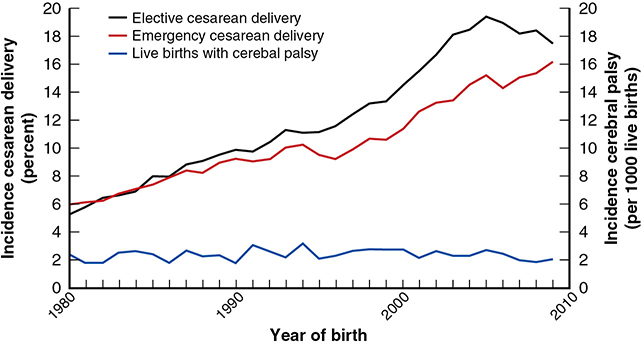
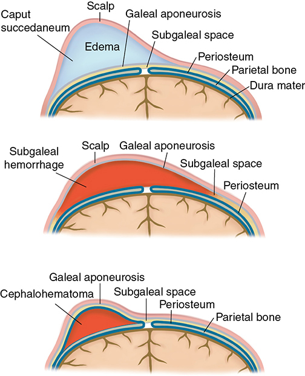
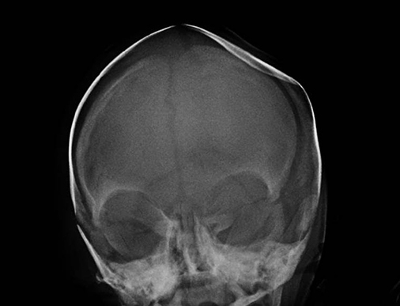
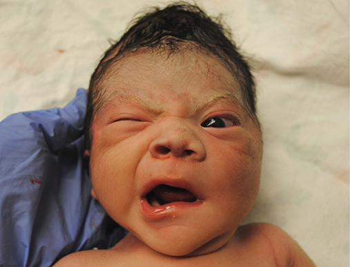

# Chapter 33: Complications of the Term Newborn — Revision Notes

> Williams Obstetrics 26e, pp. 1545–1587 of the PDF. High-yield numbers are in **bold**.
> The four tables are transcribed from the PDF images (they are missing from the extracted chapter text). All 4 figures are included from the PDF.

**Big picture:** Many neonatal problems are extensions of fetal pathology. **Most cerebral palsy (CP) begins long before labor**: CP rates have stayed flat for 50 years despite a **sixfold rise in cesarean rates**. Only a small fraction of CP is due to intrapartum hypoxia.

---

## 1. Respiratory Distress

- Signs: hypoxemia with compensatory **tachypnea, nasal flaring, chest wall retractions, grunting**.
- Preterm: mostly **RDS** (surfactant deficiency, Ch 34).
- **Leading causes at term:** **transient tachypnea of the newborn (TTN), meconium aspiration syndrome, pneumonia, pneumothorax.**
  - Less common: RDS, persistent pulmonary hypertension, acid–base disturbance, CNS insults, congenital chest/airway/CNS/cardiac anomalies.
- **Evaluation:** chest radiograph; CBC or CRP and blood cultures (infection); arterial blood gas.
- **Treatment is supportive:** oxygen as needed → CPAP or mechanical ventilation. Feeding by mouth, gavage or IV depending on the degree of tachypnea (high rates limit breastfeeding and raise aspiration risk).

### Transient tachypnea of the newborn
- Benign, self-limited; due to **slow clearance of fetal lung fluid**.
- Risk factors: delivery **<39 wk** (risk rises as GA falls), **cesarean without labor**, male sex, perinatal asphyxia, LGA or SGA, maternal GDM or asthma.
- **Diagnosis of exclusion.** Supportive O₂. Most resolve **within 48 h**.

### Respiratory distress syndrome at term
- Surfactant deficiency; low incidence at term.
- Risks: **male sex, white race, maternal diabetes**. Rare surfactant gene mutations: **SP-B, SP-C, ABCA3, thyroid transcription factor 1**.
- Treatment as for preterm: CPAP/ventilation ± surfactant (ET tube or less invasive techniques).
- **GBS pneumonia is often indistinguishable from RDS** clinically and radiographically → empirical antibiotics are often added.
- **Late-preterm (34–37 wk) antenatal corticosteroids** enhance surfactant synthesis. Parkland does **not** give them for this indication: concern for **neonatal hypoglycemia** and unknown long-term effects (promptly treated hypoglycemia seems to leave no sequelae).

### Meconium aspiration syndrome
- Mechanisms: acute **airway obstruction, chemical pneumonitis, surfactant dysfunction/inactivation, pulmonary hypertension**.
- Meconium-stained fluid is common; severe aspiration is not: **~4 per 1000** newborn discharges, rising from **37 to 43 wk**.
- Morbidity is linked to **thick meconium**, but MAS can follow light staining and a normal labor.
- **Highest risk: postterm pregnancy and FGR** — less amnionic fluid, cord compression or uteroplacental insufficiency → thick, undiluted meconium.

**Prevention — what does NOT work**

| Intervention | Evidence |
|---|---|
| FHR abnormalities to predict aspiration | Unreliable predictor |
| Oropharyngeal suctioning at the perineum | Abandoned: no ↓ in MAS incidence or severity |
| Routine endotracheal intubation + suction (vigorous **or** nonvigorous) | No benefit; no longer recommended routinely |
| Amnioinfusion for thick meconium (Fraser 2005, ~2000 women ≥36 wk) | Perinatal death **0.05% in both groups**; mod–severe MAS **4.4% vs 3.1%** (NS); cesarean **32% vs 29%** |

- Pediatric providers must still attend deliveries: these neonates may need **effective positive-pressure ventilation**.
- Amnioinfusion still has a role for **recurrent variable decelerations** with low fluid (Ch 24), not for meconium.

**Treatment**
- Ventilatory support (CPAP, intubation, mechanical ventilation).
- **Surfactant replacement:** may ↓ need for **ECMO**, but does **not** ↓ mortality.
- Inhaled or systemic corticosteroids: no consistent improvement in critical outcomes.
- **Inhaled nitric oxide** for MAS with pulmonary hypertension → ↓ death and ↓ ECMO.
- **ECMO** only when oxygenation is poor despite maximal ventilation: **0.35%** of >5100 MAS cases (California); mortality **5.3%**.

---

## 2. Neonatal Encephalopathy and Cerebral Palsy

- The old belief that intrapartum events cause most neurological disability drove the rise in cesareans from the 1970s. It was wrong.
- **Nelson and Ellenberg:** CP is multifactorial (genetic, physiological, environmental, obstetrical); **few cases are linked to peripartum events.**
- **ACOG Task Forces:** 2003, updated **2014** (more circumspect). The 2014 Task Force recommends a **multidimensional assessment** of each infant; no single strategy gives 100% certainty about cause.

### Neonatal encephalopathy
- **Definition (2014 Task Force):** neurological dysfunction in the earliest days of life in neonates **≥35 wk**, shown by **seizures or subnormal consciousness**, often with trouble starting/maintaining respiration and depressed tone and reflexes.
- Incidence **1–2 per 1000 term live births** (much more frequent preterm).
- Evaluation: maternal history, obstetrical antecedents, intrapartum factors, **placental pathology**, newborn course, labs, neuroimaging.

| Grade | Features |
|---|---|
| **Mild** | Hyperalertness, irritability, jitteriness, hypertonia and hypotonia |
| **Moderate** | Lethargy, abnormal tone, occasional seizures |
| **Severe** | Coma, multiple seizures, recurrent apnea |

- **Only spastic quadriplegic CP can result from acute peripartum ischemia.**
  - Hemiparetic/hemiplegic CP, spastic diplegia and ataxia are **unlikely** to come from an intrapartum event.
  - Purely **dyskinetic or ataxic** CP (especially with a learning disorder) is usually **genetic**.

### Table 33-1. Findings Consistent with an Acute Peripartum or Intrapartum Event Leading to Hypoxic-Ischemic Encephalopathy

| Category | Finding |
|---|---|
| **Neonatal findings** | Apgar score: **<5 at 5 and 10 minutes** |
| | Umbilical arterial acidemia: **pH <7.0 and/or base deficit ≥12 mmol/L** |
| | Neuroimaging evidence of acute brain injury: MR imaging or MRS consistent with HIE |
| | Multisystem involvement consistent with HIE |
| **Type and timing of contributing factors** | Sentinel hypoxic or ischemic event occurring immediately before or during delivery |
| | Fetal heart rate monitor patterns consistent with an acute peripartum or intrapartum event |

*HIE = hypoxic-ischemic encephalopathy; MR = magnetic resonance; MRS = magnetic resonance spectroscopy.*

**Caveats to the criteria**
- **Apgar:** low 5- and 10-min scores ↑ risk, but most such infants do not get CP. **5-min Apgar ≥7 → peripartum HIE unlikely** to have caused CP.
- **Acid–base:** low pH/high base deficit ↑ likelihood of HIE on a continuum, but most acidemic neonates are neurologically normal. **Cord artery pH ≥7.2 → HIE very unlikely.**
- **Imaging:** **MR imaging/MRS is best**; cranial sonography and CT lack sensitivity at term.
  - **Normal imaging after the first 24 h effectively excludes a hypoxic-ischemic cause.**
  - MR at **24–96 h** is more sensitive for timing; MR at **7–21 days** best shows the full extent of injury.
- **Multisystem injury** (renal, GI, hepatic, cardiac, hematological) is consistent with HIE; its severity does not necessarily track neurological severity.
- **Sentinel events:** **uterine rupture, severe abruption, cord prolapse, amnionic fluid embolism.**
  - Martinez-Biarge (~58,000 deliveries, 192 sentinel events): **6% died** intrapartum/early neonatal, **10% developed encephalopathy**.
- Other risks for neonatal acidosis: prior or emergent cesarean, maternal age **≥35**, obesity, thick meconium, chorioamnionitis, general anesthesia.
- **FHR pattern on presentation vs later:**
  - Category 1 or 2 tracing with **5-min Apgar ≥7**, normal cord gases (±1 SD) or both → **not** consistent with acute HIE.
  - A tracing **on admission** with persistently **minimal/absent variability, no accelerations, ≥60 min**, even without decelerations → suggests an **already compromised fetus**. If well-being cannot be established, evaluate method and timing of delivery.

### Therapeutic hypothermia and adjuncts
- **Cooling started within 6 h of life, to 33.5°C for 72 h** → ↓ death and moderate–severe disability in term newborns.
  - Meta-analysis (>1500 neonates): better survival and neurodevelopment at **24 months**; protection extends into childhood.
  - MR: slower diffusion abnormalities, fewer infarcts.
  - **Longer or deeper cooling adds nothing.**
  - "Late" cooling (after 6 h) → some benefit, but less.
- Hospitals need plans for **timely transfer to a cooling center**.
- Adjuncts under study: **erythropoietin** (antiapoptotic, anti-inflammatory; meta-analysis shows some ↓ cognitive impairment and CP), allopurinol, xenon, melatonin, stem cells.

### Cerebral palsy
- **Definition:** a group of **nonprogressive** disorders of movement or posture from abnormal development or damage of motor-control centers.
- Classified by dysfunction (**spastic, dyskinetic, ataxic**) and by limbs (**quadriplegia, diplegia, hemiplegia, monoplegia**).
  - **Spastic quadriplegia — the most common**; strongly linked to intellectual disability and seizures.
  - **Diplegia** — common in preterm/LBW neonates.
- Epilepsy and intellectual disability seldom stem from perinatal asphyxia **in the absence of CP**.

**Incidence**
- US prevalence **~3 per 1000 children** (all children, including preterm).
- Overall rate unchanged despite more cesareans, partly because more preterm infants survive (Fig 33-1).
- **23–27 wk:** **105 per 1000** infants alive at 1 year (Sweden).
- **Term newborns make up about half of CP cases** in absolute numbers.

*Figure 33-1. Elective and emergency cesarean rates climbed from ~6% to 16–19% (1980–2010), while CP stayed flat at ~2 per 1000 live births.*

**Nelson and Ellenberg (Collaborative Perinatal Project, ~54,000 pregnancies, followed to age 7)** — main risk factors:
- (1) **Genetic abnormalities** (maternal intellectual disability, fetal malformations)
- (2) **Birthweight <2000 g**
- (3) **Birth <32 wk**
- (4) **Perinatal infection**
- Obstetrical complications were not strongly predictive; only **one fifth** had markers of perinatal asphyxia. Most causes unknown; no single intervention would prevent many cases.
- **Preterm birth is the single most important risk.** SGA also ↑ risk: **>90%** of CP in growth-restricted newborns is antepartum in origin.

### Table 33-2. Perinatal Risk Factors Reported to Be Increased in Children with Cerebral Palsy

| Risk Factors | Risk Ratio | 95% CI |
|---|---|---|
| Hydramnios | 6.9 | 1.0–49.3 |
| Placental abruption | 7.6 | 2.7–21.1 |
| Interval between pregnancies <3 mo or >3 yr | 3.7 | 1.0–4.4 |
| Spontaneous preterm labor | 3.4 | 1.7–6.7 |
| **Preterm delivery at 23–27 weeks** | **78.9** | 56.5–110 |
| Breech or face presentation, transverse lie | 3.8 | 1.6–9.1 |
| Severe birth defect | 5.6 | 8.1–30.0 |
| Nonsevere birth defect | 6.1 | 3.1–11.8 |
| Time to cry >5 minutes | 9.0 | 4.3–18.8 |
| Obesity | 1.2–2 | 1.1–2.8 |
| Low placental weight | 3.6 | 1.5–8.4 |
| Placental infarction | 2.5 | 1.2–5.3 |
| Chorioamnionitis — clinical | 2.4 | 1.5–3.8 |
| Chorioamnionitis — histological | 1.8 | 1.2–2.9 |
| Othersᵃ | — | — |

*ᵃIncludes respiratory distress syndrome, meconium aspiration, emergent cesarean or operative vaginal delivery, hypoglycemia, gestational hypertension, hypotension, advanced maternal age, genetic factors, twins, thrombotic states, nighttime delivery, seizures, fetal-growth restriction, male gender, and nulliparity. CI = confidence interval.*
*The printed "Severe birth defect" row (5.6; 95% CI 8.1–30.0) is internally inconsistent — the point estimate lies outside its CI. It is reproduced as printed.*

**Other causes and associations**
- **Chorioamnionitis** carries substantively greater risk.
- **Neonatal arterial ischemic stroke** (may be linked to inherited fetal thrombophilias).
- Isolated congenital heart lesions → ↑ microcephaly (chronic fetal hypoxemia).
- Miscellaneous: fetal anemia, **TTTS**, intrauterine transfusions, fetal alcohol syndrome.
- **Only 1.6 CP cases per 10,000 deliveries are attributable solely to intrapartum hypoxia** (2003 Task Force). FGR and birth defects contribute more than asphyxial birth events.

### Intrapartum FHR monitoring
- **Electronic FHR monitoring does not predict or reduce CP** or long-term neurological impairment (ACOG).
- No FHR pattern predicts CP; clinician response to abnormal patterns does not relate to outcome; computer analysis doesn't help.
- An abnormal tracing may reflect a **pre-existing** neurological abnormality.

### Apgar scores
- 1- and 5-min Apgars are **poor predictors** of long-term neurological impairment.
- **5-min Apgar ≤3** → death and neurological sequelae rise substantially.
  - Sweden: **5%** later needed special schooling. Scotland (>750,000 term children): incidence **0.3%**, with a **dose-dependent** link to later educational support (physical/motor strongest, then visual, hearing, cognitive).
- Persistence of very low scores beyond 5 min strongly predicts morbidity and death:

| Apgar | Mortality | Cerebral palsy |
|---|---|---|
| 10-min **0–3** | — | **10%** |
| 15-min **≤2** | **53%** | **36%** |
| 20-min **≤2** | **60%** | **57%** |

### Table 33-3. Comparison of Mortality and Morbidity in Norwegian Infants Weighing >2500 g According to 5-Minute Apgar Scores

| Outcome | Apgar 0–3 (%) | Apgar 7–10 (%) | Relative Risk (95% CI) |
|---|---|---|---|
| Number | 292 | 233,500 | |
| **Mortality rates** | | | |
| Neonatal | **16.5** | 0.05 | **386** (270–552) |
| Infant | 19.2 | 0.3 | 76 (56–103) |
| 1–8 yr | 3 | 0.2 | 18 (8–39) |
| **Morbidity rates** | | | |
| **Cerebral palsy** | **6.8** | 0.09 | **81** (48–128) |
| Mental retardation | 1.3 | 0.1 | 9 (3–29) |
| Other neurological | 4.2 | 0.5 | 9 (5–17) |
| Non-neurological | 3.4 | 2.0 | 2 (0.8–5.5) |

*CI = confidence interval.*

### Umbilical cord blood gases
- **Metabolic acidosis = cord artery pH <7.0 and base deficit ≥12 mmol/L** → risk factor for encephalopathy and CP; risk grows as acidosis worsens.
- Alone, cord gases are **not accurate** predictors of long-term sequelae.
- **pH <7.0 = threshold for clinically significant acidemia.**
- Casey 2001: pH **≤6.8 → neonatal mortality ↑ 1400-fold**; pH **≤7.0 plus 5-min Apgar 0–3 → ↑ 3200-fold**.
- Oxford: adverse neurological outcome **0.36% with pH <7.1**, **3% with pH <7.0**.
- **Cord lactate** may also help predict outcome.

### Nucleated RBCs and lymphocytes
- Both enter the circulation in response to hypoxia or hemorrhage. Proposed as markers of hypoxia, but data are inconsistent.

### Neuroimaging
- Findings vary with GA, insult severity/duration and reperfusion. **Precise timing of injury by imaging is not realistic** — only an imprecise window.
- Encephalopathy grade does **not** correlate with MR findings.

| Modality (term newborn) | Day of birth | With injury |
|---|---|---|
| **Sonography** | Usually normal | Thalami/basal ganglia **increasingly echogenic from ~24 h**, progress over 2–3 days, persist **5–7 days** |
| **CT** | Usually normal | Thalami/basal ganglia **↓ density from ~24 h**, persist 5–7 days |
| **MR imaging** | Some abnormalities detectable | **Restricted diffusion within 24 h, peaks ~5 days, gone within 2 wk**; T1/T2 changes from <24 h to several days |

- **Basal ganglia lesions on MR** accurately predicted motor impairment at 2 yr (175 term neonates).

**Older children with CP**
- Wu (273 children born >36 wk, CT/MR): **⅓ normal**; focal arterial infarction **22%**; brain malformations **14%**; periventricular white-matter injury **12%**.
- MR abnormal in **88%** (Bax; ~half near term) and in **84% of spastic quadriplegia**.
- MR is preferred over CT (radiation).
- Hemiplegic CP at term (Wiklund): ~75% abnormal CT; **>½ suggested prenatal injury**, ~20% perinatal.

### Intellectual disability, seizures and autism
- When either occurs **without CP**, it is seldom from perinatal hypoxia.
- **Severe intellectual disability: 3 per 1000**; commonest causes are chromosomal, gene mutations and other malformations; also preterm birth.
- **Seizure disorders:** major predictors are fetal malformations (cerebral and noncerebral), family history of seizures, and neonatal seizures. Encephalopathy causes a small share; seizures correlate best with **encephalopathy severity**.
- **Autism spectrum disorder:** **15 per 1000** 8-year-olds; not convincingly linked to peripartum events.

---

## 3. Neonatal Abstinence Syndrome
- Drug withdrawal, most often after in-utero **opioid** exposure; also alcohol or benzodiazepines.
- Features: **hypertonia, autonomic instability, irritability, poor suck, seizures.**
- Incidence ↑ **6–7-fold** over the past decade; **4% of NICU days** in 2013.
- Care: close observation + usually pharmacotherapy — **morphine, methadone**; also phenobarbital, benzodiazepines, clonidine.
- **Buprenorphine vs morphine → shorter treatment and hospital stay.** No consensus on the best regimen.

---

## 4. Hematological Disorders

### Anemia
- After **35 wk**, mean cord Hb **~17 g/dL**; **<14 g/dL is abnormal.**
- **Delayed cord clamping:**
  - Hb **+1.2 g/dL** at birth; improves iron stores for several months.
  - Anemia at 6 months not different.
  - ↑ **hyperbilirubinemia needing phototherapy** (no longer stay).
  - **ACOG: delay 30–60 seconds in all healthy newborns.**
- Causes:
  - **Antenatal (extension of fetal anemia):** immune-mediated hemolysis, aneuploidy, genetic hematological defects, fetomaternal hemorrhage, fetal infection, placental lesions (chorioangioma, twin anastomoses).
  - **At delivery (acute, with hypovolemia):** laceration of placenta, fetal vessel or cord; intracranial/extracranial or intra-abdominal organ hemorrhage.

### Polycythemia
- Associations: chronic or acute fetal hypoxia, **TAPS**, maternal diabetes or hypertension, placental and fetal-growth restriction, aneuploidy, delayed cord clamping.
- **Hct >65 → viscosity rises markedly.** No routine screening in asymptomatic newborns.
- Signs: hypotonia, **plethora**, respiratory distress with cyanosis, jitteriness, **hypoglycemia**; hyperbilirubinemia follows (short-lived macrocytic fetal RBCs).
- **Isovolemic partial exchange transfusion (PET) with saline** ↓ Hct and symptoms but is **not neuroprotective**; usually reserved for acute symptoms or hypoglycemia.

### Hyperbilirubinemia
- Fetal bilirubin is partly cleared across the placenta. After birth, levels rise for **3–4 days to up to 10 mg/dL**, then fall rapidly.
- **~15%** of term newborns become jaundiced.
- ↑ Burden: polycythemia, hemolysis (**ABO incompatibility, G6PD deficiency**), extravasated blood (**cephalohematoma**). ↓ Clearance: prematurity.

| Form | Features |
|---|---|
| **Acute bilirubin encephalopathy** | First days of life: hypotonia, poor feeding, lethargy, abnormal auditory-evoked responses. Prompt treatment usually halts it. |
| **Kernicterus** (chronic) | Bilirubin staining of **basal ganglia and hippocampus** → neuronal degeneration. Survivors: spasticity, incoordination, intellectual deficits. Ongoing hemolysis is a risk factor. |

- Prevention: **effective breastfeeding** (avoid dehydration); check for jaundice with vital signs; **universal predischarge bilirubin screening** (serum or, more often, **transcutaneous**).
- **Phototherapy ("bili-lights") 460–490 nm** → bilirubin photo-oxidation → renal clearance. Filtered sunlight (UV removed) in low-resource settings.
- Kernicterus hospitalizations: **5 per 100,000 (1988) → 0.4–2.7 per 100,000**; persistence partly linked to **early discharge**.

### Vitamin K deficiency bleeding (VKDB)
- Causes of deficiency: poor antenatal liver stores, **sterile gut**, **low vitamin K in breast milk**.

| Onset | Timing | Notes |
|---|---|---|
| **Early** | **<24 h** | e.g., maternal vitamin K deficiency |
| **Classic** | **Days 2–7** | No prophylaxis at delivery |
| **Late** | **2–12 wk** | Exclusively breastfed infants |

- **Prophylaxis: single IM dose of vitamin K1 (phytonadione) 0.5–1 mg** (AAP/ACOG).
  - Oral is less effective; maternal vitamin K barely reaches the fetus.
  - **No link to childhood leukemia.**
- "Hemorrhagic disease of the newborn" is broader: also congenital factor deficiency, DIC, birth trauma, thrombocytopenia.

### Thrombocytopenia
- **Early onset ≤72 h**, late onset after.
- Causes: **immune** (alloimmune thrombocytopenia, maternal ITP, neonatal lupus — antiplatelet IgG crosses to the fetus), **infection** (parvovirus B19, CMV, toxoplasmosis; sepsis → consumption), maternal **antiretroviral therapy**, inherited platelet disorders, congenital syndromes.

---

## 5. Newborn Injuries

### Incidence
- Birth injury **~2% of deliveries** (varies with how major and minor injuries are lumped).
- Washington State: **5.3 → 4.5 per 1000** live births (2004–2013), a **14%** fall.
- **Major injury highest with forceps or vacuum**, much lower with all cesarean categories.

### Cranial injuries

### Table 33-4. Major Types of Cranial Hemorrhage

| Type | Collection Site | Associations in Term Neonates | Clinical Outcomes |
|---|---|---|---|
| **Intracranial** | | | |
| Epidural | Between periosteum and dura mater | Difficult or prolonged birth; idiopathic | Usually good |
| Subdural | Between dura and arachnoid mater | Difficult or prolonged birth; idiopathic | Usually good |
| Subarachnoid | Between arachnoid and pia mater | Difficult or prolonged birth; idiopathic | Usually good |
| Intraventricular | Ventricles (lateral, 3rd, or 4th) | Birth trauma, hypoxia, or coagulation dysfunction | Variable; worse with high IVH grade and thalamic source |
| Intracerebral | Cerebral parenchyma | Coagulation dysfunction, vascular anomalies, intrapartum factors | Variable; affected by size, location, or comorbid hydrocephalus |
| Intracerebellar | Cerebellar parenchyma | Abnormal FHR, OVD, resuscitation required | Variable; affected by size and comorbid lesions |
| **Extracranial** | | | |
| Cephalohematoma | Subperiosteal | OVD, especially VAD; dystocia | Good; risk of anemia or hyperbilirubinemia |
| Subgaleal | Between galea aponeurotica and periosteum | OVD, especially VAD; dystocia | Variable; worse with associated acidosis, hypovolemia, and comorbid lesions |

*OVD = operative vaginal delivery; VAD = vacuum-assisted delivery. (The epidural, subdural and subarachnoid rows share one bracketed "Associations" entry in the printed table.)*

**Intracranial hemorrhage**
- **Term: subdural and intracerebral** are most common. **Preterm: intraventricular, subarachnoid, cerebellar** (BP instability, hypoxia, ischemia).
- At term, **birth trauma** is the most frequent cause; others: fetal coagulopathy, vascular anomaly, tumor, genetic mutation, infection. Some follow an uneventful vaginal birth with no cause found.
- Presentation: **seizures, apnea or tachypnea, poor feeding, temperature instability.**
- Imaging: sonography or CT; **MR is often preferred**. Treatment mostly supportive; surgery for acute hydrocephalus, ↑ ICP or mass effect.
- **Subdural:** prolonged/difficult delivery → molding, dural stretch, **tearing of bridging veins**. Also seen asymptomatically after uneventful vaginal or cesarean birth; **good prognosis if asymptomatic**.
- Subarachnoid (less common) and epidural (rare): risks and recovery like subdural.
- **IVH at term:** germinal matrix has largely regressed, so the source is the **choroid plexus, thalamus or residual germinal matrix**. ⅓–⅔ have no antecedent. Worse with high grade or **thalamic** hemorrhage.
- **Intracerebral (hemorrhagic stroke):** coagulation defects, vascular anomalies, abnormal FHR, low Apgars; trauma less often.
- **Intracerebellar:** abnormal FHR, operative vaginal delivery, emergent cesarean, delivery-room resuscitation.

**Extracranial hemorrhage**
- Scalp layers from outside in: **skin → subcutaneous tissue → galea aponeurotica → subgaleal space → periosteum → calvarium**. **Emissary veins** cross the subgaleal space, linking dural sinuses to scalp veins.

| Lesion | Layer | Crosses sutures? | Key features |
|---|---|---|---|
| **Caput succedaneum** | Scalp soft-tissue **edema** | Yes | Pressure of head on cervix; **maximal at birth**, gone within hours–days |
| **Cephalohematoma** | **Subperiosteal** (emissary/diploic veins) | **No** | Incidence **~1%**; dystocia, OVD (**vacuum > forceps or cesarean**). Appears **hours** after birth, grows, persists **weeks–months** → anemia, hyperbilirubinemia. Rarely infection or calcification. Good outcome. |
| **Subgaleal hemorrhage** | Between **galea and periosteum** (emissary veins) | Yes (spans occipital, parietal, frontal) | Rare; **0.05% spontaneous, 10× with vacuum**. Can spread from neck to orbits → **hypovolemic shock**; **mortality ~15%**. Seizures, enlarging head circumference, respiratory distress. |

- Diagnosis starts with **head ultrasound** (may suffice for cephalohematoma); CT/MR for subgaleal hemorrhage to exclude other injury.

*Figure 33-2. Caput = edema above the galea; subgaleal hemorrhage = blood between galea and periosteum (spreads widely); cephalohematoma = blood under the periosteum (limited by sutures).*

> **Memory hook:** "**Ceph**alohematoma **C**an't cross sutures; **Sub**galeal **S**preads and causes **S**hock."

**Skull fractures**
- Rare (**~1 per 100,000 births**) but worrying because of associated **intracranial hemorrhage**.
- Associated with operative vaginal delivery, but also spontaneous or cesarean birth: compression against the pelvis, surgeon's hand lifting the head, or **upward vaginal pressure by an assistant** to disimpact the head.
- Diagnose with radiographs or CT; expectant or surgical management. Prognosis depends on comorbid intra-/extracranial injury.

*Figure 33-3. Depressed skull fracture after cesarean for a deeply impacted head disimpacted by upward vaginal hand pressure.*

### Spinal cord injury
- Rare overstretch with hemorrhage/edema; **cervical spine** most often.
- Excess traction, rotation or hyperextension during **shoulder dystocia maneuvers, breech vaginal delivery, operative vaginal delivery**.
- **Upper cervical injury is often fatal**; survivors may be quadriplegic. Treatment: ventilatory support with corticosteroids or therapeutic hypothermia.

### Peripheral nerve injuries

**Brachial plexopathy (roots C5–C8 and T1)**
- **~1 per 1000 term births**: **1.3/1000 vaginal vs 0.2/1000 cesarean**.
- Risks: **shoulder dystocia**, labor dystocia, breech delivery.
- Hemorrhage/edema → temporary dysfunction, good recovery. **Avulsion → poor prognosis.**

| Palsy | Roots | Findings |
|---|---|---|
| **Erb** | **C5–6** (upper trunk) | Paralysis of deltoid, infraspinatus and forearm flexors. Arm straight and **internally rotated**, elbow extended, wrist and fingers flexed. Finger function retained. Typical breech injury. |
| **Klumpke** | **C8–T1** (lower plexus) | **Flaccid hand** |
| **Total plexus** | C5–T1 | Flaccid arm and hand |

> **Pearl:** the Erb posture (adducted, internally rotated arm, extended elbow, flexed wrist) is classically called the "waiter's tip" position.

- Severe injury: **phrenic nerve** → ipsilateral diaphragm paralysis; sympathetic fibers → **Horner syndrome (ptosis, miosis, anhidrosis)**.
- Clavicle or humerus fracture may coexist → chest radiograph. MR for suspected avulsion.
- Breech injuries are usually Erb type; more extensive, persistent lesions follow difficult cephalic (forceps/vacuum) deliveries.
- **ACOG Task Force:** shoulder dystocia **cannot be accurately predicted**; in most cases axons survive and prognosis is good.
- **Recovery (Lindqvist): C5–6 86% complete**; C5–7 **38%**; **global C5–T1 → always permanent disability**.
- Management: **early physical therapy** (prevent contracture); surgical exploration/nerve reconstruction for severe injury at **3–6 months**.

**Facial paralysis**
- Nerve injured at the **stylomastoid foramen**. **0.3 per 1000 term births.**
- **¾ after spontaneous birth** (pressure from bony pelvis), **¼ with forceps** (blade pressure); can follow cesarean.
- **Spontaneous recovery within days is the rule**; permanent paralysis described.

*Figure 33-4. Left facial nerve palsy: eye fails to close, labionasal fold lost, mouth pulls to the unaffected side when crying.*

### Fractures
- After any difficult delivery, **palpate clavicles and long bones**; crepitus or irregularity → radiograph.
- **Clavicle:** commonest; **~5 per 1000** live births; unpredictable and **unavoidable**; **10× higher with vaginal birth**. Vaginal: shoulder dystocia; cesarean: higher birthweight.
- **Humerus** (rare): breech delivery, **posterior arm delivery** in shoulder dystocia.
- **Femur** (rare): breech — now mostly at **cesarean**.
- Prevention: splint the bone along its long axis; avoid perpendicular forces during extraction.
- **Rib fractures** rare at term; from chest compression in difficult birth/shoulder dystocia (none from CPR in one series).

### Soft tissue injury
- **Intra-abdominal hemorrhage** (rare): **liver, spleen, adrenals** (disproportionately large).
- Risks: difficult (especially breech) delivery, cardiac resuscitation, macrosomia, organ enlargement.
- Retroperitoneal bleeding → bruising of flanks, umbilicus, groin, upper thigh or scrotum; pallor, distension, falling Hct. Treat with resuscitation and bleeding control.

### Congenital deformity injuries
- **Congenital torticollis:** one sternocleidomastoid fails to elongate; head turns toward the affected side. Linked to breech, OVD, difficult delivery, but many are uncomplicated births. **Early physical therapy.**
- **Deformations:** normal structures deformed by restrictive intrauterine forces — **chronic oligohydramnios, multifetal gestation, abnormal/small uterine cavity**.
  - **Talipes equinovarus**; **oligohydramnios sequence** (pulmonary hypoplasia; head, face, skin, limb deformations). Both can also be genetic or with malformations.
- **Congenital hip dislocation:** strongly linked to **in-utero breech**. Examine all newborns; observe or brace.

---

## Quick-Recall: Differentials and Distinctions

| Topic | Key distinction |
|---|---|
| TTN vs RDS vs MAS (term) | TTN: retained lung fluid, cesarean without labor, <39 wk, resolves ≤48 h, diagnosis of exclusion. RDS: surfactant deficiency (male, white, diabetes, SP-B/SP-C/ABCA3). MAS: postterm/FGR, thick meconium, pulmonary hypertension |
| MAS prevention | Nothing works: no perineal suction, no routine intubation, no amnioinfusion |
| MAS treatment | Surfactant (↓ ECMO, not death); iNO (↓ death and ECMO); ECMO last resort |
| CP type from intrapartum ischemia | **Spastic quadriplegia only**; dyskinetic/ataxic = genetic |
| HIE unlikely if… | 5-min Apgar ≥7; cord pH ≥7.2; normal imaging after 24 h |
| HIE consistent if… | Apgar <5 at 5 **and** 10 min; pH <7.0 and/or BD ≥12; MR/MRS changes; multisystem injury; sentinel event; consistent FHR |
| Cooling | Start ≤6 h; 33.5°C; 72 h; longer/deeper no better |
| Caput vs cephalohematoma vs subgaleal | Edema, crosses sutures, max at birth / subperiosteal, respects sutures, appears later / below galea, spreads, shock (15% mortality) |
| Term vs preterm ICH | Term: subdural, intracerebral (trauma). Preterm: IVH, subarachnoid, cerebellar |
| Erb vs Klumpke | C5–6: waiter's tip, fingers work / C8–T1: flaccid hand ± Horner |
| VKDB timing | Early <24 h; classic 2–7 d; late 2–12 wk (breastfed) |
| Kernicterus site | Basal ganglia and hippocampus |

## Key Numbers to Memorize
- TTN resolves within **48 h**; severe MAS **4/1000**; MAS needing ECMO **0.35%** (mortality **5.3%**)
- Neonatal encephalopathy: **≥35 wk**; **1–2/1000** term births
- HIE criteria: Apgar **<5 at 5 and 10 min**; cord pH **<7.0** and/or BD **≥12 mmol/L**
- Cooling: **within 6 h**, **33.5°C**, **72 h**
- CP prevalence **3/1000**; 23–27 wk **105/1000**; intrapartum hypoxia alone **1.6/10,000** deliveries; cesarean rate **↑6×** with no change in CP
- Apgar 0–3 at 5 min → neonatal death RR **386**, CP RR **81**; 10-min 0–3 → CP **10%**; 20-min ≤2 → death **60%**, CP **57%**
- Cord pH **≤6.8** → neonatal death **↑1400×**; pH ≤7.0 + Apgar 0–3 → **↑3200×**
- MR diffusion restriction peaks **~5 days**, gone by **2 wk**; best extent at **7–21 days**
- Cord Hb **~17 g/dL** (abnormal **<14**); delayed clamping **30–60 s** (+1.2 g/dL); polycythemia **Hct >65**
- Bilirubin peaks day **3–4**, up to **10 mg/dL**; jaundice **15%**; phototherapy **460–490 nm**
- Vitamin K1 **0.5–1 mg IM** once
- Birth injury **~2%**; cephalohematoma **1%**; subgaleal **0.05%** (×10 with vacuum), mortality **15%**; skull fracture **1/100,000**
- Brachial plexus **1/1000** (vaginal 1.3 vs cesarean 0.2); C5–6 recovery **86%**; facial palsy **0.3/1000**; clavicle fracture **5/1000** (10× vaginal)
