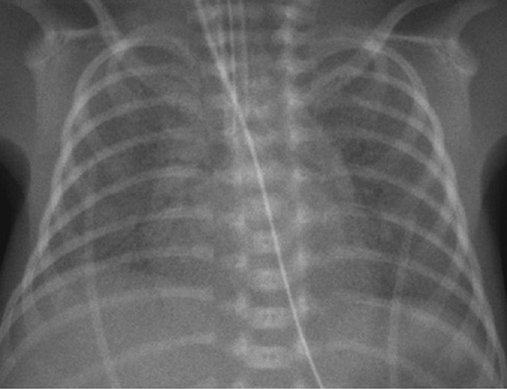
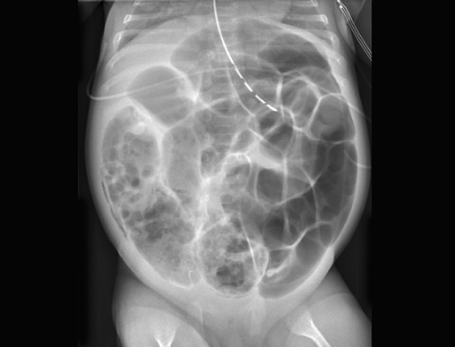
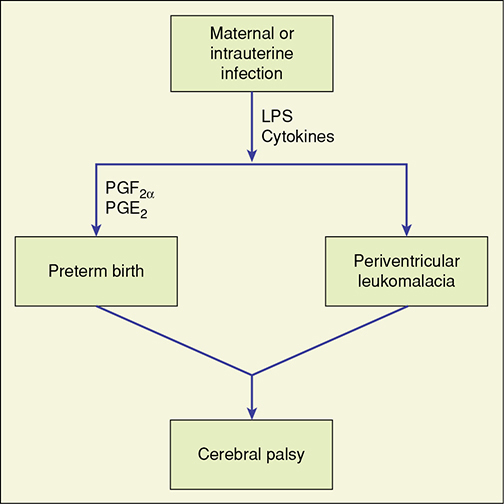

# Chapter 34: The Preterm Newborn — Revision Notes

> Williams Obstetrics 26e, pp. 1588–1611 of the PDF. High-yield numbers are in **bold**.
> The one table is transcribed from the PDF image (it is missing from the extracted chapter text). All 3 figures are included from the PDF.

**Big picture:** Viability is now **22–24 wk**, and survival for neonates **<29 wk approaches 80%**. Still, **two thirds of US infant deaths** occur in the **10%** born before 37 wk. The main threats are RDS/BPD, NEC, ROP and brain injury (IVH, PVL → CP).

---

## 1. Overview and Complications of Prematurity

### Table 34-1. Complications of Prematurity

| Complication |
|---|
| Respiratory distress syndrome (RDS) |
| Bronchopulmonary dysplasia (BPD) |
| Pneumothorax |
| Pneumonia/sepsis |
| Patent ductus arteriosus (PDA) |
| Necrotizing enterocolitis (NEC) |
| Retinopathy of prematurity (ROP) |
| Intraventricular hemorrhage (IVH) |
| Periventricular leukomalacia (PVL) |
| Cerebral palsy (CP) |
| Neurodevelopmental impairment (NDI) |

- US preterm birth rate fell from **~12% (2007) → 10% (2020)**.
- Early preterm (<34 wk): **2.77% → 2.69%**, the lowest since 2007.

---

## 2. Respiratory Distress Syndrome

- **The seminal complication of prematurity:** immature lungs + **surfactant deficiency** → hypoxia.
- Hypoxia → pulmonary hypertension and neurological damage (e.g., CP).
- **Hyperoxia** from treatment contributes to **BPD, NEC, PVL and ROP**.

### Etiopathogenesis
- At birth, lungs must fill with air and clear fluid while pulmonary blood flow rises. Some fluid is squeezed out during vaginal birth; **most is absorbed by pulmonary lymphatics**.
- **Surfactant** (from **type II pneumocytes**) lowers surface tension → prevents alveolar collapse at end-expiration.
- Can occur at term with **sepsis, pneumonia or meconium aspiration** (surfactant inactivated by inflammation or meconium).
- Sequence without surfactant:
  - Unstable alveoli collapse → hypoxia and hypotension impair pneumocyte nutrition.
  - Partial persistence of fetal circulation → **pulmonary hypertension and right-to-left shunt**.
  - Alveolar cells undergo ischemic necrosis. With O₂ therapy the pulmonary bed dilates and the shunt reverses; protein-rich fluid leaks into alveolar ducts and lining cells slough.
  - **Hyaline membranes** (fibrin-rich protein + cell debris) line dilated alveoli and terminal bronchioles; underlying epithelium necroses.
- On H&E the membranes are **amorphous and eosinophilic, like hyaline cartilage** → hence **"hyaline membrane disease."**

### Clinical course
- **Tachypnea, chest wall retraction, nostril flaring, expiratory grunting** (grunting creates auto-PEEP to prevent collapse).
- Shunting through unventilated lung → hypoxemia, **metabolic and respiratory acidosis**; poor peripheral perfusion, hypotension.
- **Chest radiograph: diffuse reticulogranular infiltrate + air bronchograms.**
- Differential of respiratory insufficiency: sepsis, pneumonia, meconium aspiration, pneumothorax, persistent fetal circulation, heart failure, thoracic malformations (e.g., **diaphragmatic hernia**). Rare: surfactant protein or **ABCA3** transporter mutations.

*Figure 34-1. Moderate RDS: diffuse granular ("ground-glass") lungs with central air bronchograms; only 8 ribs expanded despite ventilation.*

### Treatment

**Ventilatory strategy**
- Supplemental O₂ is needed, but **excess O₂ damages lung epithelium, retina and other immature tissues**.
- **CPAP** keeps unstable alveoli open → allows lower FiO₂ (less toxicity).
- **Initial CPAP + selective surfactant** is a beneficial alternative to immediate intubation + surfactant in extremely preterm neonates.
- **Less-invasive surfactant administration (thin catheter on CPAP)** → ↓ intubation/ventilation in the first **72 h**, ↓ **death or BPD**, ↓ major complications and in-hospital mortality vs ET tube delivery.
- High-frequency oscillatory ventilation: variable benefit/risk. High-frequency jet ventilation: not superior to conventional ventilation.

**Bronchopulmonary dysplasia (chronic lung disease of prematurity)**
- **The most frequent complication of extreme preterm birth.**
- Causes: mechanical ventilation (**barotrauma, volutrauma**), **hyperoxia** (reactive oxygen species → inflammation), infection.
- Disrupted alveolar and pulmonary vascular development → hypoxia, hypercarbia, **chronic O₂ dependence**; can affect adult lung function.

| BPD prevention/treatment | Verdict |
|---|---|
| **Postnatal corticosteroids** (e.g., dexamethasone) | **AAP recommends against routine use** — limited benefit, ↑ impaired motor/cognitive function and school performance. Worst when given to infants at **low** BPD risk. Intratracheal steroid + surfactant under study. |
| **Inhaled nitric oxide** | NIH consensus: data **do not support** use to prevent or treat BPD |
| **Caffeine** (for apnea of prematurity; bronchodilator) | ↓ BPD, better early neurodevelopment, safe to **11 years** → widely used at **≤1250 g** |
| **Vitamin A** (antioxidant; preterm infants have low levels) | Modestly ↓ BPD in VLBW **<1500 g**; limited by production shortages |

### Surfactant prophylaxis and rescue
- **Standard therapy for RDS:** ↓ mortality, ↓ need for ventilation, better short-term outcomes.
- Usually given by **endotracheal tube**. Animal-derived products: **bovine (Survanta), calf (Infasurf), porcine (Curosurf)**.
- **Animal-derived > synthetic** (synthetic lacks key surfactant proteins); **no synthetic surfactant is currently available**.
- Less invasive rescue routes: pharyngeal instillation, nebulization, laryngeal mask, **thin catheter on CPAP** (best evidence).
- Antenatal corticosteroids + postnatal surfactant → an even greater ↓ in death.
- ⚠️ **Prophylactic surfactant is no longer beneficial** where antenatal steroid use is high and delivery-room CPAP is routine — it is linked to **↑ death or BPD**.

### Prevention

**Antenatal corticosteroids**
- **NIH 2000:** a single course ↓ **RDS and IVH** in neonates born **24–34 wk**.
- **ACOG:** all women at risk of preterm birth in this range are candidates; may be considered from **23 wk** if delivery is expected **within 7 days**.
- **Periviable period:** tie steroid use to the family's **resuscitation decision** (see Table 45-4).
- **Late preterm (34–36 wk):** ↓ neonatal respiratory complications; ACOG supports considering a **single course of betamethasone**. **Parkland does not currently do this.**

**Amniocentesis for fetal lung maturity**
- Previously used to predict RDS. **No longer supported or recommended** to guide delivery in any clinical situation.

---

## 3. Necrotizing Enterocolitis

- Findings: **abdominal distension, emesis, ileus, bilious gastric aspirates, bloody stools.**
- **Radiology:** **pneumatosis intestinalis** (intramural gas from invading bacteria) — classic; also **hepatobiliary/portal venous gas** and **pneumoperitoneum**.
- Mainly **low-birthweight** newborns; occasionally mature ones.
- **Hypothesized causes:** perinatal hypotension, hypoxia, sepsis, **umbilical catheterization**, exchange or blood transfusions, **cow milk and hypertonic feeds**.
- **Pathophysiology is multifactorial:** genetics, intestinal immaturity, microvascular tone imbalance, **abnormal microbial colonization**, enteral feeds, highly immunoreactive mucosa.

| Management | Details |
|---|---|
| **Medical** | Abdominal decompression, **bowel rest**, **broad-spectrum antibiotics**, parenteral nutrition |
| **Surgical** | For **perforation** or clinical/biochemical deterioration: drain placement, laparotomy with resection, or enterostomy (stoma). **Perforation → prompt resection.** |

*Figure 34-2. NEC: distended gas-filled small and large bowel with pneumatosis intestinalis (intramural gas) in the right lower quadrant and pelvis.*

---

## 4. Retinopathy of Prematurity

- Formerly **retrolental fibroplasia**; by **1950 the largest single cause of blindness** in the US. Fell once linked to **hyperoxemia**, then rose again as more extremely preterm infants survived.
- **Normal:** retina vascularizes **centrifugally from the optic nerve** from ~**4th month** until shortly after birth.
- **Pathogenesis:** excess O₂ → severe retinal **vasoconstriction** → endothelial damage and vessel obliteration → **aberrant neovascularization** into the vitreous → leakage, bleeding → **adhesions and retinal detachment**.
- **VEGF** is upregulated in ROP → basis for **anti-VEGF therapy**.
- Even room air after birth is "relatively" hyperoxic compared with in utero. The safe O₂ level is unknown.

**SUPPORT trial (1316 neonates, 24–27 wk)**

| SpO₂ target | Death before discharge | Severe ROP in survivors |
|---|---|---|
| **85–89%** (lower) | **20%** (significantly ↑) | **8.6%** (significantly ↓) |
| **91–95%** (higher) | 16% | 17.9% |

> **Memory hook:** "Low O₂ saves the **eyes** but costs **lives**."

---

## 5. Brain Disorders

- Preterm lesions differ from term: **IVH, cerebellar hemorrhage, periventricular hemorrhagic infarction, cystic PVL, diffuse white-matter injury** — all strongly linked to adverse neurodevelopment.
- **Cranial sonography is the preferred modality** in preterm neonates (available, reliable, tracks brain growth).
- Cystic injury takes **2–5 wk** to evolve → **serial scans**. Transient lesions that resolve carry a better prognosis.
- **4–10%** of preterm children develop CP **without** lesions; i.e., **90–96%** of preterm newborns with CP have lesions visible on cranial sonography.

### Intracranial hemorrhage — five categories (Table 33-4)

| Type | Typical population | Significance |
|---|---|---|
| Primary **subarachnoid** | More common **preterm** | Frequently **benign** |
| **Cerebellar** | More common **preterm** | Increasingly recognized cause of serious sequelae |
| **Intraventricular (IVH)** | **Almost exclusively preterm**; relatively common | Can be serious |
| **Subdural** | More common **term** | Can be serious |
| Miscellaneous **intraparenchymal** | More common **term** | Variable |

### Intraventricular hemorrhage

**Pathogenesis**
- **Germinal matrix** = highly cellular, vascular region **beneath the lateral ventricles**. Its capillaries are fragile because of:
  - (1) poor support from the subependymal matrix
  - (2) venous anatomy causing **stasis and congestion** (vessels burst if pressure rises)
  - (3) **impaired autoregulation**
- Rupture → blood in ventricles → ventricular dilation → obstructed venous drainage → **periventricular hemorrhagic infarction**.
- Risk of severe IVH is **inversely related to GA**: serious **<32 wk**, especially frequent **<27 wk**.
- **Germinal matrix involutes at 34–36 wk** → IVH infrequent after that.
- **Most bleed within 72 h** of birth — so often wrongly blamed on birth events; **prelabor IVH also occurs**.
- Multifactorial: hypoxic-ischemic events, **↑ CO₂**, anatomy, **BP instability**, coagulopathy, genetics; **infection** (endothelial activation, platelet adherence, thrombi); RDS and mechanical ventilation.
- **~Half are clinically silent.** Most small germinal matrix/intraventricular bleeds resolve, yet nearly half show some neurological impairment. Extensive bleeds → major handicap, **hydrocephalus** or **PVL**. **PVL extent correlates with CP risk.**

**Incidence**
- NRN, <29 wk: **19% (1993) → 13% (2012)**.
- 2012: **11% at 23 wk → 5% at 28 wk**.

**Papile grading (modified)**

| Grade | Extent |
|---|---|
| **I** | Limited to the **germinal matrix** |
| **II** | IVH occupying **10–50%** of the ventricular area |
| **III** | IVH with **>50%** of the ventricular area |
| **Parenchymal hemorrhage** (formerly **grade IV**) | Most likely **hemorrhagic venous infarction**, not IVH extending into parenchyma |

**Antenatal corticosteroids and IVH**
- Given **≥48 h before delivery** → prevent or ↓ severe IVH.
- **NIH 1994:** ↓ mortality, RDS and IVH at **24–32 wk**. **NIH 2000:** **no repeated courses**.
- **MFMU (Wapner) repeat courses:** some better neonatal outcomes but **↓ birthweight and ↑ FGR**; no difference in physical/neurocognitive measures at 2–3 yr, but a nonsignificant **5.7-fold RR of CP**.
- **Australian trial (>1100):** CP **4.2% vs 4.8%** (repeat vs single) — about the same.
- <28 wk: **≥10 days** since betamethasone → ↑ severe IVH (inconsistent across studies).
- **ACOG now:** a **single course at 24 0/7–33 6/7 wk** for women at risk of preterm delivery; a **second "rescue" course** if the first was **>14 days** earlier and delivery is imminent.

**Other preventive methods**

| Intervention | Effect |
|---|---|
| **Antenatal magnesium sulfate** | Does **not** ↓ IVH, but **protects against neurodevelopmental impairment** → ACOG recommends |
| Antenatal vitamin K or phenobarbital; postnatal phenobarbital | No consistent ↓ in IVH |
| Vitamin E | ↓ IVH but ↑ **sepsis** |
| Postnatal indomethacin / prostaglandin inhibitors | Inconsistent ↓ IVH; no neurodevelopmental benefit |
| Cesarean (VLBW) | No effect on severe IVH; ↓ overall IVH (one meta-analysis). Unclear for breech/FGR. |
| **Delayed cord clamping** | ↓ **any-grade** IVH (not severe IVH); ↑ Hb/Hct; may ↑ survival |
| ⚠️ **Cord milking** | ↑ **severe IVH at <28 wk** → **avoid** |

### Periventricular leukomalacia
- **Cystic areas deep in white matter** after hemorrhagic or ischemic infarction → regional necrosis.
- No regeneration and minimal gliosis in preterm brain → **echolucent cysts** on imaging.
- Take **≥2 wk** to form (up to **4 months**) → **cysts present at birth imply an earlier (antenatal) insult**, helping to time the event.

---

## 6. Cerebral Palsy

- **Definition:** chronic movement or posture abnormalities, **cerebral in origin**, arising early in life, **nonprogressive**. Epilepsy and intellectual disability often coexist.
- Classified by dysfunction (spastic, dyskinetic, ataxic) and limb distribution (quadriplegia, diplegia, hemiplegia, monoplegia).

| Type | Features |
|---|---|
| **Spastic quadriplegia** | **Most severe** spastic form: all four limbs, trunk, face; strong link to developmental delay and epilepsy |
| **Spastic diplegia** | **Common in preterm/LBW**; stiffness mainly in **legs** (arms less or not affected); legs pull together, turn in, **cross at the knees** → walking difficulty |
| **Spastic hemiplegia** | One side only; **arm > leg** |
| **Dyskinetic** | Athetoid, choreoathetoid, dystonic; slow writhing or rapid jerky movements; hard to sit and walk |
| **Ataxic** | Balance and coordination problems |
| **Mixed** | >1 type; commonest is **spastic–dyskinetic** |

### Incidence
- US prevalence **~3 per 1000 children**.
- Sweden, born **<28 wk** (2004–2007), 6-yr follow-up: **CP 10.5%**, with **no linear association** with GA in this cohort.

### Risks

**Intraventricular hemorrhage**
- **Severe IVH (grade III or IV) and resulting PVL** are linked to CP.
- Even **low-grade IVH** is associated with more CP at school age in extremely preterm children; higher grades carry greater risk.

**Ischemia**
- Immature vessels and a **pressure-passive** cerebral circulation: with hypotension the preterm brain cannot ↑ perfusion to **borderzone** areas fed by immature penetrating vessels.
- Hypoxia–ischemia → **pyramidal tract damage → spastic diplegia**.

**Perinatal infection/inflammation**
- **PVL in 9%** of 753 neonates born 24–32 wk; highest risk if born **<28 wk** and/or with inflammatory events days–weeks before delivery.
- PVL strongly associated with **prolonged membrane rupture, chorioamnionitis, neonatal hypotension**. **Chronic** (not acute) placental inflammation is linked to PVL.
- 3094 singletons <33 wk: **15%** had clinical chorioamnionitis; **IVH 22% vs 12%** (infected vs not).
- **Mechanism (Fig 34-3):**
  - Infection → **TNF, IL-1, IL-6, IL-8** → prostaglandins → **preterm labor**.
  - Same cytokines are **directly toxic to oligodendrocytes and myelin**.
  - Vessel rupture, hypoxia, cytokines → neuronal death → **glutamate** release → **Ca²⁺ influx** → white-matter toxicity (glutamate also directly toxic to oligodendrocytes).
  - Activated **microglia/macrophages** (cytokines, chemokines, proteases, complement, excitotoxins, ROS, NO) worsen secondary injury.
- TNF and IL-6 are more frequent in brains of infants who died with PVL; cytokines are linked to white-matter lesions **even without demonstrable organisms**.

*Figure 34-3. Maternal/intrauterine infection → LPS and cytokines → PGF₂α/PGE₂ → preterm birth, and directly → PVL; both lead to cerebral palsy.*

### Prevention — neuroprotection
- **Antenatal magnesium sulfate and corticosteroids** — benefits well described.
- **Erythropoiesis-stimulating agents** (erythropoietin, darbepoetin):
  - Meta-analysis: ↓ IVH and PVL when given soon after birth; neurodevelopmental effect unclear.
  - Large trial: early high-dose **erythropoietin did not ↓ severe NDI or death at 2 yr**. Darbepoetin trial in follow-up.
- ⚠️ **Therapeutic hypothermia is NOT recommended for preterm newborns** (different gray/white matter injury pattern, greater cold-stress susceptibility). Trial at **33 0/7–35 6/7 wk** with moderate/severe HIE is in follow-up.

---

## Quick-Recall: Preterm Complications — Cause, Clue, Management

| Complication | Key cause/mechanism | Classic clue | Management / prevention |
|---|---|---|---|
| **RDS** | Surfactant deficiency (type II pneumocytes) | Grunting, retractions; reticulogranular CXR + air bronchograms; hyaline membranes | CPAP + selective surfactant (thin catheter); antenatal steroids |
| **BPD** | Ventilation (baro/volutrauma), hyperoxia, infection | Chronic O₂ dependence | Caffeine (≤1250 g), vitamin A (<1500 g); **no** routine postnatal steroids or iNO |
| **NEC** | Multifactorial: immaturity, feeds, dysbiosis, hypoxia | Pneumatosis intestinalis, portal venous gas, bloody stools | Bowel rest, decompression, antibiotics, TPN; surgery for perforation |
| **ROP** | Hyperoxia → vasoconstriction → VEGF-driven neovascularization | Retinal detachment | Lower SpO₂ targets (↑ death trade-off); anti-VEGF |
| **IVH** | Fragile germinal matrix (involutes 34–36 wk) | Within 72 h; half silent | Antenatal steroids ≥48 h; delayed clamping; avoid cord milking |
| **PVL** | Ischemia, infection/cytokines | Echolucent cysts after ≥2 wk | Mg sulfate neuroprotection |
| **CP (preterm)** | IVH/PVL, ischemia, inflammation | **Spastic diplegia** | MgSO₄, steroids; no cooling |

## Key Numbers to Memorize
- Viability **22–24 wk**; survival <29 wk **~80%**; preterm rate **10%** (2020) causes **⅔** of infant deaths
- Antenatal steroids: **24 0/7–33 6/7 wk** single course; consider from **23 wk** if delivery within **7 days**; ≥**48 h** before birth for IVH benefit; rescue course if first **>14 days** ago; late preterm **34–36 wk**
- Caffeine for **≤1250 g**; vitamin A for **<1500 g**; LISA ↓ intubation in first **72 h**
- SUPPORT: SpO₂ **85–89% vs 91–95%** → death **20 vs 16%**, severe ROP **8.6 vs 17.9%**
- Retinal vascularization begins **~4th month**
- IVH: most within **72 h**; germinal matrix involutes **34–36 wk**; <29 wk incidence **19 → 13%**; **11% at 23 wk, 5% at 28 wk**
- Papile: I germinal matrix; II **10–50%**; III **>50%**; IV = parenchymal (venous infarction)
- PVL cysts need **≥2 wk** (up to **4 months**); cystic injury evolves over **2–5 wk**
- **90–96%** of preterm CP have sonographic lesions; CP **10.5%** if born <28 wk; US CP **3/1000**
- Repeat steroids: CP RR **5.7** (NS); Australian CP **4.2 vs 4.8%**
- Chorioamnionitis <33 wk: **15%**; IVH **22 vs 12%**; PVL **9%** at 24–32 wk
