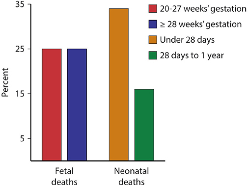
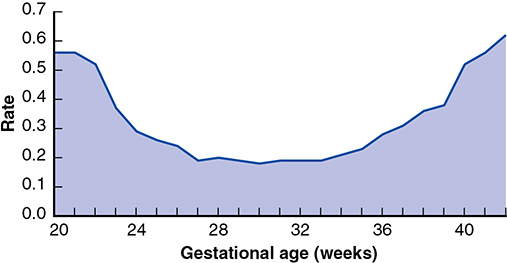
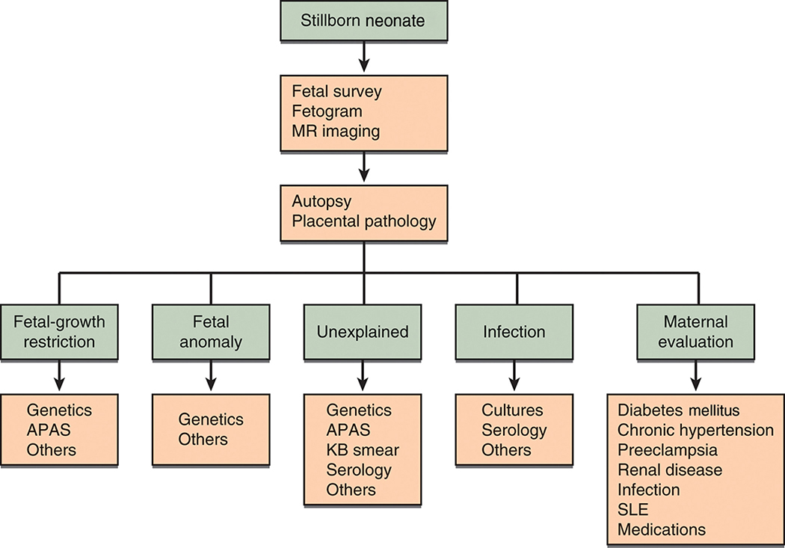
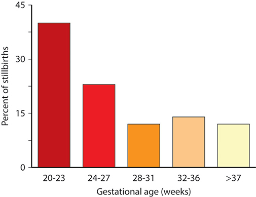

# Chapter 35: Stillbirth — Revision Notes

> Williams Obstetrics 26e, pp. 1612–1632 of the PDF. High-yield numbers are in **bold**.
> The three tables are transcribed from the PDF images (they are missing from the extracted chapter text). All 4 figures are included from the PDF.

**Big picture:** In the US, fetal deaths ≥20 wk now slightly **outnumber neonatal deaths**. Systematic evaluation (**autopsy + placental pathology + genetics by CMA**) finds a probable or possible cause in **~¾**. **Prior stillbirth** is the strongest predictor of recurrence. Deliver a woman with a prior stillbirth at **39 wk**.

---

## 1. Perinatal Mortality Overview
- **Perinatal mortality = fetal + neonatal deaths**; a measure of healthcare quality before, during and after delivery.
- US vital statistics usually count fetal deaths **after 20 wk**. In **2013**, fetal deaths slightly outnumbered neonatal deaths.

*Figure 35-1. US 2013: fetal deaths split ~25% at 20–27 wk and ~25% at ≥28 wk; infant deaths ~34% under 28 days and ~16% at 28 days–1 year.*

---

## 2. Definitions
- **Fetal death (NCHS, based on WHO):** death before complete expulsion or extraction, **irrespective of gestational age**, and **not an induced termination**. After delivery the fetus shows **no breathing, heartbeat, cord pulsation or definite voluntary movement**.
  - Heartbeats ≠ transient cardiac contractions; respirations ≠ fleeting efforts or gasps.
- **Reporting is set by each state**: most require reporting at **≥20 wk** and/or **≥350 g** (≈ 20-wk weight). Under-reporting is common, especially early.
- International comparisons are limited: **<5%** of neonatal deaths worldwide are formally documented.
- Defining US stillbirth by **≥500 g** instead of 20 wk would lower the rate by **40%**.

| Fetal mortality epoch | Gestational age |
|---|---|
| **Early** | **<20** completed weeks |
| **Intermediate** | **20–27 wk** |
| **Late** | **≥28 wk** |

- Rates in each epoch have changed little since **2006**.
- **Fetal death rates are highest at the earliest and latest GAs** (U-shaped curve) → suggests different causes.

*Figure 35-2. Fetal mortality by week is U-shaped: ~0.55 at 20–21 wk, nadir ~0.2 at 27–33 wk, rising to ~0.6 at 42 wk.*

---

## 3. Etiologies

**Stillbirth Collaborative Research Network (SCRN, NICHD)**
- **512 stillbirths** (500 women), ≥20 wk, 2006–2008, 59 hospitals in 5 states; population-based.
- Standardized workup: **autopsy, placental histology, maternal/fetal blood and tissue testing, fetal karyotype**.
- **83% died before labor.**
- Causes graded **probable, possible or unknown**.
  - Example: diabetes was *probable* with diabetic embryopathy with lethal anomalies or maternal DKA; *possible* with poor glycemic control plus abnormal fetal growth.
- **Probable or possible cause found in 76%** (similar to Australia).

### Table 35-1. Causes of 512 Stillbirths in the Stillbirth Collaborative Research Network Study

| Cause | Percent | Examples |
|---|---|---|
| **Obstetrical complications** | **29** | Placental abruption, multifetal gestation, ruptured membranes at 20–24 weeks |
| **Placental abnormalities** | **24** | Uteroplacental insufficiency, maternal vascular disorders |
| Fetal malformations | 14 | Major structural abnormalities and/or genetic abnormalities |
| Infection | 13 | Involving the fetus or placenta |
| Umbilical cord abnormalities | 10 | Prolapse, stricture, thrombosis |
| Hypertensive disorders | 9 | Preeclampsia, chronic hypertension |
| Medical complications | 8 | Diabetes, antiphospholipid antibody syndrome |
| Undetermined | 24 | Not applicable |

*Percentages are rounded and total more than 100 percent because some stillbirths had more than one cause. Overall, a probable or possible cause was identified in 76 percent of stillbirths.*

- **Leading causes are obstetrical:** abruption, multifetal complications, spontaneous labor or membrane rupture **before viability**; then structural anomalies.
- "Placental abnormalities" is the least clearly defined category (mostly uteroplacental insufficiency).
- The high yield shows the value of **standardized evaluation**, although Cochrane found **no RCT evidence** supporting specific tests.

---

## 4. Risk Factors
- **Sociodemographic:** **non-Hispanic Black women** (more hypertension, diabetes, abruption, PPROM).
- **Maternal:** age at **either extreme**, **obesity**, preeclampsia, diabetes, substance use, **late-term pregnancy**.
- **Multifetal**, especially **monochorionic**.
- **Prior adverse outcome:** stillbirth, preterm birth, FGR.
- **Current FGR** is especially vulnerable (linked to hypertension, diabetes, fetal infection, autoimmune and chronic renal disease).
- **SARS-CoV-2:** data mixed; perhaps higher risk in low-resource countries. At Parkland (**245** infected gravidas) the stillbirth rate was **not** increased.

### Table 35-2. Maternal Risk Factors and Estimated Stillbirth Rate

| Condition | Estimated Rate (per 1000 births) |
|---|---|
| **All pregnancies** | **6.4** |
| Low-risk pregnancies | 4.0–5.5 |
| **Hypertensive disorders** | |
| Chronic hypertension | 6–25 |
| Preeclampsia — nonsevere | 9–51 |
| Preeclampsia — severe | 12–29 |
| Diabetes: insulin requiring | 6–35 |
| **SLE** | **40–150** |
| **Renal disease** | **15–200** |
| Thyroid disease | 12–20 |
| Cholestasis of pregnancy | 12–30 |
| Smoking >10 cigarettes | 10–15 |
| **Obesity** | |
| BMI 25–29.9 kg/m² | 12–15 |
| BMI >30 | 13–18 |
| Education (<12 yr vs ≥12 yr) | 10–13 |
| Fetal-growth restriction | 10–47 |
| Prior fetal-growth restriction | 12–30 |
| Late-term pregnancy | 14–40 |
| Oligohydramnios | 14 |
| Antiphospholipid syndrome | NS |
| **Prior stillbirth** | **9–20** |
| **Multifetal gestation** | |
| Twins | 12 |
| Triplets | 34 |
| **Maternal age** | |
| 35–39 yr | 11–14 |
| ≥40 yr | 11–21 |
| Black women (versus white) | 12–14 |

*BMI = body mass index; NS = not stated; SLE = systemic lupus erythematosus.*
*The printed table reads "≥49 yr" for the older maternal-age row; this is almost certainly a typo for ≥40 yr (as in the ACOG source table).*

> **Memory hook:** The two "hundred-plus" rows are **S**LE and **R**enal disease — "**S**tillbirth **R**ates soar."

**Can risk be predicted early?**
- **Consortium on Safe Labor** (206,969 women, 19 hospitals): most stillbirths were at **term**; results **do not support routine antenatal surveillance for any demographic risk factor**.
- **SCRN:** factors known at the start of pregnancy explain only a **small part** of risk. Only **prior stillbirth** or prior loss from **preterm birth or FGR** had meaningful predictive value.
- **Prior stillbirth → ~5-fold ↑ risk.** Prior preterm birth, FGR, preeclampsia and abruption are strongly linked to later stillbirth.

---

## 5. Evaluation of the Stillborn Fetus

**Why evaluate:** aids maternal coping, eases guilt, allows accurate **recurrence counseling**, may prompt preventive intervention, and identifies **inherited syndromes** for relatives.
- Key tests: **autopsy, chromosomal (genetic) analysis, pathological exam of placenta, cord and membranes**.
- **Placental pathology and fetal autopsy are the most useful** (Page 2017).

### Clinical examination
- Measure **fetal weight, head circumference, length, and placental weight**.
- **Photographs:** extremities, palms; frontal and profile views of whole body and face.
- **Fetogram** (full fetal radiograph) may be done.
- If parents decline autopsy, **postnatal MR, radiographs or sonography** become especially important.
- Document findings and relevant ante-/intrapartum events.

**Anomaly rates**
- With autopsy + chromosomes: **up to 35%** major structural anomalies; **~20%** dysmorphic or skeletal anomalies; **8%** chromosomal abnormalities.
- SCRN: structural anomalies only **14%**.

*Figure 35-3. Stillbirth workup: fetal survey, fetogram, MR → autopsy and placental pathology → targeted tests by category (FGR: genetics, APAS; anomaly: genetics; unexplained: genetics, APAS, KB, serology; infection: cultures, serology; maternal: diabetes, hypertension, preeclampsia, renal, SLE, medications).*

### Laboratory evaluation

**Genetic testing**
- Without dysmorphology, **up to 5%** still have a chromosomal abnormality.
- **Chromosomal microarray analysis (CMA) is now recommended** (replaces routine karyotype): it **does not need dividing cells**, so it works on **macerated tissue** where culture often fails.
- **Exome sequencing** (246 unexplained stillbirths): **8.5%** with normal CMA and no maternal/obstetrical cause were probably due to **mendelian disorders**; a similar number may involve loss-of-function variants in genes essential to fetal survival.
- Requires **parental consent**. Any fetal or placental tissue or amnionic fluid can be sent for CMA. Avoid maternal contamination; **sterile technique, room temperature**.

**Specimens if fetal blood (cord or heart) cannot be drawn** — send at least one:
- (1) **Placental block 1 × 1 cm** from **below the cord insertion**, **not formalin-fixed**
- (2) **Umbilical cord segment 1.5 cm** long
- (3) Internal fetal tissue: **costochondral junction, fascia lata or patella**
- Wash in sterile saline; place in **Ringer solution or sterile cytogenetic medium**. ⚠️ **Formalin or alcohol kills viable cells.**
- If only conventional karyotype is available and death is recent: **amniocentesis before delivery** gives better cell growth, especially if delivery is not imminent.

**Maternal blood tests**

| Test | Indication |
|---|---|
| **Kleihauer-Betke** | Routine (fetomaternal hemorrhage) |
| **Antiphospholipid antibodies / lupus anticoagulant** | If indicated |
| **Serum glucose** | Exclude overt diabetes |
| **Syphilis serology** | If not previously screened, exposure risk, or suggestive maternal/fetal/placental findings |
| ⚠️ **Inherited thrombophilia panel** | **Not routinely** — most maternal and fetal thrombophilias are not linked to stillbirth (ACOG/SMFM) |

### Placental examination
- Ideally gross and microscopic exam of **placenta, membranes and cord by a perinatal pathologist** (e.g., cord knots, placental microvascular lesions, infection).

### Autopsy
- Encourage a **full autopsy** (SCRN protocol, Pinar 2012).
- Wales (400 deaths): autopsy **changed the cause of death in 13%** and **added new information in 26%**.
- Autopsy changed recurrence estimates and counseling in **25–50%**; placental exam + autopsy altered future management in **45%**.
- **Limited autopsy** still helps: external exam, photographs, radiography, MR, bacterial cultures, selective chromosomal/histological studies.
- Most hospitals do **not** audit stillbirths. Parkland: monthly **stillbirth committee** (obstetricians, MFM, neonatology, genetics, perinatal pathology) assigns cause; parents are then **counseled on cause, recurrence risk and prevention**.

---

## 6. Perinatal Care
- Fetal death is psychologically traumatic. **Added stressors:**
  - **>24 h between diagnosis and induction**
  - Not seeing the baby for as long as desired
  - **No keepsakes**
  - Poor communication
- **Seeing and holding the stillborn** helps parental well-being. Few providers are formally trained in bereavement care.
- **Parkland:** dedicated L&D nursing team — time with the neonate, keepsakes, photographs, chaplaincy, bereavement information (matches global consensus).
- After stillbirth or early miscarriage: **↑ depression and PTSD** → monitor closely.
- **Perinatal palliative care** (life-limiting fetal conditions): maximize comfort and quality of life. Components: diagnosis review, **birth plan**, bereavement counseling, neonatal consultation; team gives medical, psychological and spiritual support centered on the parents' values, goals and fears.

---

## 7. Prior Stillbirth
- Substantial recurrence risk (Table 35-2); **magnified if the prior fetus was preterm or growth-restricted**.
- SCRN recurrent stillbirths (**43** women): **most died before 28 wk**.

*Figure 35-4. Recurrent stillbirths by GA: ~40% at 20–23 wk, ~23% at 24–27 wk, then ~12–14% in each later band.*

### Table 35-3. Management of Subsequent Pregnancy after Stillbirth

| Timing | Management |
|---|---|
| **Preconceptional or initial prenatal visit** | Detailed medical and obstetrical history |
| | Review evaluation of prior stillbirth |
| | Determination of recurrence risk |
| | Discuss recurrence of comorbid obstetrical complications |
| | **Smoking cessation** |
| | Preconceptional **weight loss** in obese women |
| | **Genetic counseling** if familial genetic condition exists |
| | **Diabetes screen** |
| | Screen for **antiphospholipid antibodies** |
| | Reassurance |
| **First trimester** | Dating sonography |
| | First-trimester screen: PAPP-A, hCG, cfDNA, NT |
| | Reassurance |
| **Second trimester** | Sonographic **anatomy survey at 18–20 weeks** |
| | Maternal serum screening (quadruple) *or* single-marker AFP if first-trimester screening elected |
| | Possible **uterine artery Doppler at 22–24 weeks** |
| | Reassurance |
| **Third trimester** | Sonographic screening for **FGR starting at 28 weeks** |
| | **Kick counts starting at 28 weeks** |
| | **Antepartum fetal surveillance starting at 32 weeks** *or* **1–2 weeks earlier than prior stillbirth** |
| | Reassurance |
| **Delivery** | **Labor induction at 39 weeks** |
| | Delivery before 39 weeks for obstetrical indications |

*AFP = alpha-fetoprotein; cfDNA = cell-free DNA; hCG = human chorionic gonadotropin; NT = nuchal translucency; PAPP-A = pregnancy-associated plasma protein-A.*

- These recommendations rest mainly on **limited or inconsistent evidence** or expert opinion.
- **Few risk factors are modifiable**; treat hypertension or diabetes specifically. Prior placental insufficiency → ↑ later adverse outcome.
- **Almost half of fetal deaths are associated with FGR** → anatomy scan at midpregnancy, then **serial growth scans from 28 wk**. Detecting FGR may cause iatrogenic prematurity but fewer fetal deaths.
- **Weeks (300 women, prior stillbirth only):** 1 subsequent stillbirth; only **3** abnormal tests before **32 wk**. The GA of the prior loss did **not** predict timing of jeopardy → **start surveillance at ≥32 wk** in otherwise healthy women (ACOG/SMFM agree, noting ↑ iatrogenic preterm delivery).
- **Kick counts:** routinely used but few data for this group.
- **Delivery at 39 wk** unless other indications: minimizes fetal death (maybe more benefit in older women). **Induction is suitable; cesarean only if induction is contraindicated.**

---

## 8. Changes in Stillbirth Rates
- US fetal mortality fell until **2011**, then has changed little.
- **"39-week rule"** (no nonmedically indicated delivery <39 wk):
  - 45 states + DC: births <39 wk fell from 2007 to 2013, but **term stillbirth rose** → possible unintended harm.
- **Prospective stillbirth risk** (15 million pregnancies): **0.11 per 1000 at 37 wk → 3.18 per 1000 at 42 wk**.

| Method (MacDorman 2006–2012) | Denominator | Finding |
|---|---|---|
| **Traditional stillbirth rate** | Live births + stillbirths **at that GA** | ↑ at 24–27, 34–36 and 38 wk |
| **Prospective stillbirth rate** | Women **still pregnant** at that GA (21–42 wk) | **No change** |

- The discrepancy mainly reflects **fewer preterm and early-term births** (smaller denominators).
- **Little 2015** (early-term 37 0/7–38 6/7 wk, 2005–2011): early-term deliveries fell with no overall change in term stillbirth, but **term singleton stillbirth rose 25% in women with diabetes** — early-term policies were **misapplied to high-risk women**.
- Bottom line: the 39-week rule cut elective early births; indicated early delivery must still be offered to women with complications.

---

## Quick-Recall: Stillbirth Workup and Prevention

| Question | Answer |
|---|---|
| Definition threshold (most US states) | ≥20 wk and/or ≥350 g |
| Epochs | Early <20 wk; intermediate 20–27 wk; late ≥28 wk |
| Commonest SCRN category | Obstetrical complications (29%) > placental (24%) = undetermined (24%) |
| Most useful tests | Autopsy + placental pathology |
| Genetic test of choice | Chromosomal microarray (no dividing cells needed) |
| Best tissue if no fetal blood | Placental block 1 × 1 cm below cord insertion (unfixed), 1.5-cm cord, or costochondral junction/fascia lata/patella |
| Transport medium | Sterile saline wash → Ringer or cytogenetic medium; never formalin/alcohol |
| Maternal blood | Kleihauer-Betke, glucose, ± APLA/lupus anticoagulant, ± syphilis; **no** routine thrombophilia screen |
| Highest-risk conditions | SLE (40–150/1000), renal disease (15–200/1000) |
| Next pregnancy: surveillance start | 32 wk or 1–2 wk before prior loss |
| Next pregnancy: growth scans / kick counts | From 28 wk |
| Next pregnancy: delivery | Induce at 39 wk |

## Key Numbers to Memorize
- Baseline stillbirth **6.4/1000**; low-risk **4.0–5.5/1000**; prior stillbirth **9–20/1000** (**~5×** risk)
- Reporting threshold **20 wk / 350 g**; using ≥500 g would cut the rate **40%**
- SCRN: **512** stillbirths; **83%** antepartum; cause found in **76%**
- Anomalies: up to **35%** structural (autopsy + karyotype), **8%** chromosomal; SCRN **14%**; up to **5%** chromosomal without dysmorphology; exome finds mendelian cause in **8.5%**
- Autopsy changes cause in **13%**, adds data in **26%**; changes counseling in **25–50%**; alters management in **45%**
- Induction delay **>24 h** after diagnosis adds distress
- Recurrent stillbirth mostly **<28 wk**; almost **½** of fetal deaths involve FGR
- Next pregnancy: anatomy **18–20 wk**; uterine artery Doppler **22–24 wk**; growth and kick counts from **28 wk**; testing from **32 wk**; deliver at **39 wk**
- Prospective stillbirth **0.11/1000 at 37 wk → 3.18/1000 at 42 wk**; diabetic term stillbirth **↑25%** with misapplied 39-wk rule
