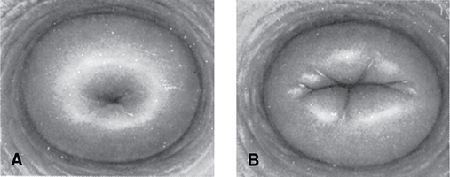
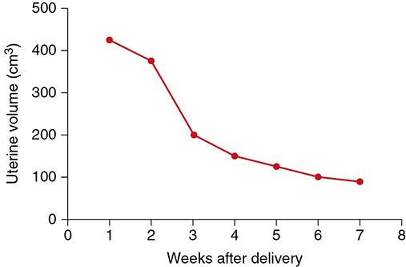
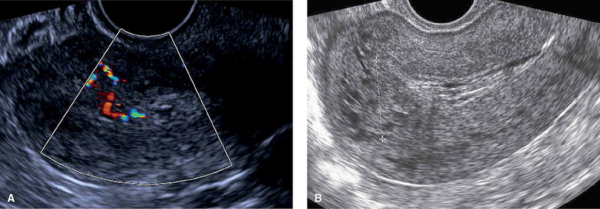
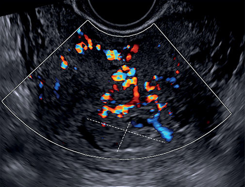
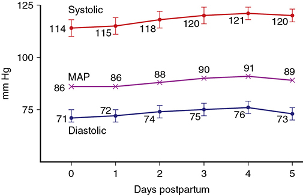
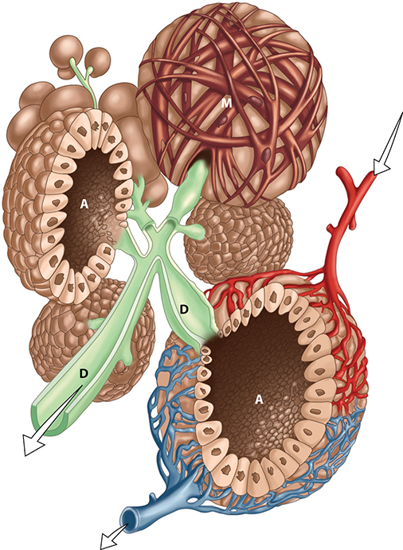
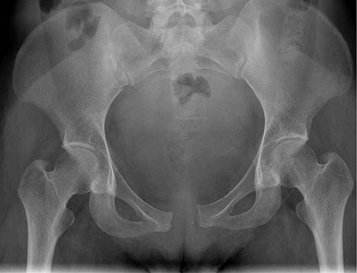

# Chapter 36: The Puerperium — Revision Notes

> Williams Obstetrics 26e, pp. 1633–1672 of the PDF. High-yield numbers are in **bold**.
> The five tables are transcribed from the PDF images (they are missing from the extracted chapter text). All 7 figures are included from the PDF.

**Big picture:** The puerperium (Latin *puer*, child + *parus*, bringing forth) is the **4–6 weeks** after delivery during which pregnancy changes reverse. Morbidity is surprisingly common: **3%** of British mothers were readmitted within 8 wk, and almost **¾** still had health problems up to 18 months later.

### Table 36-1. Concerns Raised by Women in the Puerperium

| Concerns | Percent |
|---|---|
| Pain after cesarean delivery | 58 |
| Feeling stressed | 54 |
| Breastfeeding issues | 48 |
| Perineal pain after vaginal delivery | 41 |
| Need for social support | 32 |
| Inadequate education about newborn care | 21 |
| Help with postpartum depression | 10 |
| Perceived need for extended hospital stay | 8 |
| Need for maternal insurance coverage postpartum | 6 |

*From Childbirth Connection, 2013a,b; Kanotra, 2007 (PRAMS data).*

---

## 1. The Fourth Trimester

- ACOG (2018) concept: the **12 weeks after birth** are a critical period → comprehensive physical, social and psychological assessment.
- **Initial visit at 3 wk** postdelivery and a **final summary visit at 12 wk**; add visits as needed (chronic hypertension, overt diabetes, cardiovascular disease, depression).
- Use it to discuss lifestyle changes and **update immunizations**. Afterwards → well-woman care, primary/specialty care, preconceptional counseling.

### Table 36-2. Components of Postpartum Care for the Fourth Trimester

| Components |
|---|
| Care team |
| Postpartum visits |
| Lactation support |
| Infant feeding plan |
| Reproductive life plan |
| Contraception |
| Pregnancy complications |
| Cardiovascular risk assessment |
| Mental health |
| Postpartum problems |
| Chronic conditions |

---

## 2. Reproductive Tract Involution

### Birth canal

- Vagina and outlet shrink but **rarely regain nulliparous dimensions**. **Rugae reappear by 3 wk** (less prominent).
- Hymenal remnants scar into **myrtiform caruncles**.
- Vaginal epithelium is hypoestrogenic; it doesn't proliferate until **4–6 wk** (= resumed ovarian estrogen).
- Parturition predisposes to pelvic organ prolapse.

### Cervix

- For a few days it **admits two fingers**; by the **end of week 1** it narrows, thickens and the canal reforms.
- The external os stays wider, with permanent lateral depressions at laceration sites → **parous cervix** (transverse slit).
- Epithelial remodeling: **almost half of women have regression of high-grade dysplasia** after delivery.

*Figure 36-1. Nulliparous cervix (A, round os) vs parous cervix (B, transverse slit with laceration scars).*

### Uterus

- Pelvic vessels shrink; large uterine vessels are obliterated by **hyaline change** and replaced by smaller ones.
- Immediately postpartum: fundus **slightly below the umbilicus**; walls **4–5 cm** thick; the lower segment becomes the barely discernible **isthmus** over a few weeks.

| Time postpartum | Uterine weight |
|---|---|
| Immediately | **~1000 g** |
| 1 wk | **~500 g** |
| 2 wk | **~300 g** |
| 4 wk | **~100 g** (involution complete) |

- Involution starts by **day 2**. Myocyte **number doesn't fall much — cell size falls**. Each pregnancy leaves the uterus slightly larger.

**Sonographic findings**

- Uterine size falls by more than half, **450 → 200 g, in the first 2 wk**. Uterus and endometrium return to pregravid size by **8 wk**. Multiparas involute more slowly.
- After cesarean, residual myometrium over the scar is thicker with **two-layer closure**.
- **Fluid in the cavity is normal:** 78% at 2 wk, 52% at 3 wk, 30% at 4 wk, 10% at 5 wk.
- **Intracavitary tissue** (3-D US): ⅓ on day 1, **95% on day 7**, 87% day 14, 28% day 28; empty by day 56.
- Uterine artery resistance rises steadily for 7 wk; no difference between vaginal and cesarean delivery.

*Figure 36-2. Sonographic uterine volume falls steeply in the first 3 wk (~425 → 200 cm³), then slowly to ~90 cm³ by 7 wk.*

### Decidual and endometrial regeneration

- Separation occurs in the **spongy layer**, so the **decidua basalis is not shed**.
- By **2–3 days** it splits into two layers: **superficial → necrotic → lochia**; **basal → source of new endometrium**.
- Surface re-epithelialized in **~1 wk**; **fully restored endometrium from day 16** (except the placental site).
- **Histological endometritis is normal** (repair). Noninfectious "salpingitis" changes in **~½** of women at 5–15 days.

### Clinical aspects
**Afterpains**

- Primiparas: uterus stays tonically contracted. **Multiparas:** intermittent vigorous contractions.
- ↑ with parity and **worse with suckling (oxytocin)**; mild by **day 3**.
- Unusually severe/persistent afterpains → think **uterine infection**.

**Lochia** (RBCs, shredded decidua, epithelial cells, bacteria)

| Type | Timing | Color / content |
|---|---|---|
| **Lochia rubra** | First **3–4 days** | Red (blood) |
| **Lochia serosa** | After 3–4 days | Progressively paler |
| **Lochia alba** | After **~day 10** | White/yellow-white (leukocytes, less fluid) |

- Average total duration **24–36 days**.
- Because leukocytes are expected, **saline microscopy of lochia is uninformative** for suspected metritis.

---

## 3. Placental Site Involution

- Complete extrusion takes **up to 6 wk**. Palm-sized at delivery (full of thrombosed vessels) → **3–4 cm by end of week 2**.
- Mechanism = **exfoliation**, not absorption in situ: undermined by new endometrium growing in from the margins and up from glands deep in the decidua basalis; infarcted superficial tissue sloughs.

### Subinvolution

- **Causes:** incompletely remodeled **spiral arteries**, retained placental fragments, infection.
  - Noninvoluted vessels: thrombosed, no endothelium, perivascular trophoblast.
- **Features:** prolonged lochia, irregular/excessive bleeding; uterus **larger and softer** than expected.
- **Sonography:**
  - **Retained products** → thickened endometrium or endometrial mass; **vascularity ↑ the likelihood**.
  - **Subinvolution** → enlarged uterus with **tubular hypoechoic areas in the myometrium** (dilated vessels).
- **Treatment (Parkland):**
  - **Methylergonovine 0.2 mg PO q3–4h for 24–48 h** (efficacy of uterotonics is questionable).
  - Brisk bleeding: IM methylergonovine ± **oxytocin 20 U in 1 L** crystalloid.
  - Suspected infection: ⅓ of late metritis is ***Chlamydia trachomatis*** → oral, twice daily for **7–10 days**: **azithromycin 500 mg**, **amoxicillin-clavulanate 875 mg** or **doxycycline 100 mg**.

*Figure 36-3. (A) Retained products with color Doppler vascularity; (B) retained clot (calipers) with dilated fundal myometrial vessels in subinvolution.*

### Late postpartum hemorrhage

- **Secondary PPH (ACOG) = bleeding 24 h to 12 wk after delivery.** Worrisome bleeding at 1–2 wk in **~1%**.
- **Causes:** most often **abnormal placental-site involution**; occasionally a retained fragment or **uterine artery pseudoaneurysm**; **von Willebrand disease** or other coagulopathies.
- **Placental polyp:** retained products → necrosis, fibrin, neovascularization. Severe bleeding in only **6%**. US: discrete hypervascular endometrial mass extending into myometrium.
- **Management:**
  - Few have retained fragments, so **no routine curettage** (it may avulse the implantation site and worsen bleeding).
  - Stable + **empty cavity on US** → **oxytocin, methylergonovine or a prostaglandin** ± antimicrobials if infection suspected.
  - **Large clots on US** → gentle suction curettage. Otherwise curette only if bleeding persists or recurs after medical therapy.

*Figure 36-4. Placental polyp (dashed lines): hypervascular mass extending into the myometrium on color Doppler.*

---

## 4. Urinary Tract

- Glomerular **hyperfiltration persists** but is back to baseline by **2 wk**.
- **Dilated ureters/pelves normalize by 2–8 wk** → UTI risk (plus residual urine, bacteriuria, bladder trauma).
- Bladder trauma (submucosal hemorrhage/edema) correlates with **labor length**.
- Postpartum bladder: **greater capacity, relative insensitivity** to pressure → overdistention, incomplete emptying.
- **Retention is more common with epidural or narcotic analgesia.**
- Puerperal **stress urinary incontinence ~5%**.

---

## 5. Peritoneum and Abdominal Wall

- Broad and round ligaments take considerable time to recover. Abdominal wall soft and flaccid (ruptured elastic fibers).
- Lax abdomen → ordinary girdle or binder. **Exercise:** any time after vaginal delivery; **wait ~6 wk after cesarean** (fascial healing).
- **Diastasis recti** = thinning/widening of the linea alba. **Musculofascial continuity and no true hernia sac** distinguish it from a ventral hernia.

---

## 6. Blood and Blood Volume

### Hematological and coagulation changes

- **WBC seldom >25,000/µL** (mainly granulocytes); relative lymphopenia, absolute eosinopenia. Thrombocytosis possible.
- Hb/Hct fall moderately in the first days; a fall **much below prelabor** values = considerable blood loss.
- **Fibrinogen stays high for ≥1 wk** → hypercoagulability. **DVT/PE risk persists for 12 wk** after childbirth.

### Pregnancy-induced hypervolemia

- If the pregnancy hypervolemia is lost as PPH → nonpregnant volume regained almost immediately. Otherwise blood volume returns to near nonpregnant by **1 wk**.

| Parameter | Postpartum course |
|---|---|
| Cardiac output | Stays ↑ **24–48 h**, nonpregnant by **10 days** |
| Heart rate | Same pattern as CO |
| Blood pressure | **Rises** toward nonpregnant values over the first days |
| SVR | Stays low for **2 days**, then rises steadily |
| Arterial stiffness | **Reduction persists** (favorable remodeling → may explain ↓ preeclampsia risk in later pregnancies) |

*Figure 36-5. BP normally rises over days 0–5 postpartum (systolic 114 → ~120, diastolic 71 → ~75, MAP 86 → ~90 mm Hg).*

### Postpartum diuresis

- Physiological reversal of Na⁺/water retention: **sodium space ↓ ~2 L in week 1**. Can be **prodigious in preeclampsia**.
- Weight loss: **5–6 kg at delivery** (baby + blood loss) + **2–3 kg from diuresis**. Weight loss peaks by the end of **week 2**; residual excess = fat stores.

---

## 7. Lactation and Breastfeeding

### Breast anatomy and secretory products

- **15–25 lobes** → lobules → alveoli. Each lobe has one lactiferous duct opening separately on the nipple.
- **Colostrum:** deep yellow, expressible by **day 2**.
  - vs mature milk: **more immune components, minerals, amino acids and protein (mostly globulin); less sugar and fat**.
  - Lasts **5–14 days**; mature milk by **4–6 wk**.
  - **IgA** protects against enteric pathogens. Also complement, macrophages, lymphocytes, lactoferrin, lactoperoxidase, lysozymes.
- **Milk output ≥600 mL/d**; gestational weight gain has little effect on quantity or quality.
- **Milk is isotonic with plasma; lactose = ½ the osmotic pressure.**
- Unique proteins: **α-lactalbumin, β-lactoglobulin, casein**. Fatty acids made in alveoli from glucose (apocrine-like secretion).
- **Vitamin K is virtually absent** → IM vitamin K to the newborn. **Vitamin D is low** → newborn supplementation.
- **Whey:casein = 60:40** (ideal for absorption). Whey is rich in IL-6.
- Others: prolactin, **epidermal growth factor** (resists gastric proteolysis → gut maturation), melatonin, oligosaccharides.

*Figure 36-6. Alveolus (A) secretes milk; myoepithelial fibers (M) contract under oxytocin to eject it into ducts (D).*

### Table 36-3. Average Composition of Human Breast Milk

| Component | g/100 mL |
|---|---|
| **Fat** — Total | 4.2 |
| Fatty acids | Trace |
| PUFA | 0.6 |
| Cholesterol | 0.016 |
| **Protein** — Total | 1.1 |
| Casein | 0.3 |
| α-Lactalbumin | 0.3 |
| Lactoferrin | 0.2 |
| **Carbohydrate** — Lactose | 7 |
| Oligosaccharides | 0.5 |

*PUFA = polyunsaturated fatty acids.*

### Lactation endocrinology

- Growth of the secretory apparatus: progesterone, estrogen, placental lactogen, prolactin, cortisol, insulin.
- **Delivery → abrupt fall in progesterone and estrogen:**
  - Removes progesterone's inhibition of **α-lactalbumin** → **lactose synthase ↑** → milk lactose ↑.
  - Prolactin acts **unopposed**.
- Calcium-sensing receptors ↓ PTHrP and ↑ Ca transport into milk. Serotonin helps maintain production.
- **Maintenance = repeated suckling and emptying.**
- **Prolactin is essential** → **Sheehan syndrome = no lactation**. Baseline prolactin falls after delivery, but **each suckling episode causes a surge** (↓ hypothalamic **dopamine = prolactin-inhibiting factor**).
- **Oxytocin** (posterior pituitary, pulsatile) → myoepithelial contraction → **milk ejection ("let-down")**. Triggered by suckling or even an **infant's cry**; **inhibited by fright or stress**.

> **Memory hook:** "Prolactin **P**roduces, Oxytocin **O**ut-puts (ejects)."

### Immunological consequences

- Secretory IgA and growth factors; antibodies target maternal environmental antigens (e.g., *E. coli*).
- ↓ **ear, respiratory and GI infections, NEC and SIDS**. Especially important for preterm infants.
- Milk T cells are mostly **memory T cells** → the neonate benefits from maternal immune experience.

### Lactation (benefits and uptake)

- **Start breastfeeding within 1 h of birth.** WHO/AAP/ACOG: **exclusive breastfeeding for up to 6 months**.
- **Maternal:** ↓ breast and reproductive cancer; less postpartum weight retention.
- **Child:** higher adult IQ scores; ↓ SIDS.
- A 90% breastfeeding rate for 12 months would save >$3 billion/yr (US).
- Uptake: **55%** breastfeeding at 6 months (Healthy People 2020 goal **61%**); **<⅔** exclusively breastfed at discharge; **<½** at 3 months.
- **Baby-Friendly Hospital Initiative:** ~20,000 hospitals worldwide; only **15–20% of US hospitals**.

### Table 36-4. Advantages of Breastfeeding

| Advantages |
|---|
| Nutritional |
| Immunological |
| Developmental |
| Psychological |
| Social |
| Economic |
| Environmental |
| Optimal growth and development |
| Decrease risks for acute and chronic diseases |

### Table 36-5. Ten Steps to Successful Breastfeeding

| # | Step |
|---|---|
| 1 | Have a written breastfeeding policy that is regularly communicated to all health-care staff |
| 2 | Train all staff in skills necessary to implement this policy |
| 3 | Inform all pregnant women about the benefits and management of breastfeeding |
| 4 | Help mothers initiate breastfeeding **within an hour of birth** |
| 5 | Show mothers how to breastfeed and how to sustain lactation, even if they should be separated from their infants |
| 6 | Feed newborns nothing but breast milk, unless medically indicated, and prioritize donor breast milk when supplementation is needed |
| 7 | Practice **rooming-in**, which allows mothers and newborns to remain together 24 hours a day |
| 8 | Encourage breastfeeding **on demand** |
| 9 | Give **no artificial pacifiers** to breastfeeding newborns |
| 10 | Help start breastfeeding support groups and refer mothers to them |

*Adapted from the World Health Organization, 2018.*

### Breast care

- Cleanliness; wash areola with water and mild soap before and after feeds.
- **Fissured nipples:** painful, ↓ milk, portal for pyogenic bacteria → topical **lanolin + nipple shield for ≥24 h**. **Severe fissuring → don't nurse on that side; pump** until healed.
- Cause is usually **poor latch** (nipple only, pressed against the hard palate). Correct latch = **nipple + areola**.

### Breastfeeding contraindications

| Contraindicated | NOT contraindicated |
|---|---|
| Street drugs or uncontrolled alcohol use | **CMV** (virus and antibodies both in milk) |
| Infant with **galactosemia** | **Hepatitis B** — if newborn gets **HBIG** |
| **HIV** (in developed countries) | **Hepatitis C** (no proven transmission) |
| **Active, untreated TB** | **HSV** — if no breast lesions + hand washing |
| Certain medications | **COVID-19** — mask + hand hygiene |
| **Breast cancer treatment** | |

### Drugs secreted in milk

- Most drugs appear in milk but infant doses are small. Determinants: plasma concentration, protein binding, pH, ionization, **lipid solubility**, molecular weight. **Milk-to-plasma ratio**.
- **Prefer:** shorter half-life, poor oral absorption, low lipid solubility.
- **Timing:** multiple daily doses → take **right after a feed**; once-daily → **before the longest infant sleep** (bedtime).
- **Cytotoxics** (cyclophosphamide, cyclosporine, doxorubicin, methotrexate, mycophenolate) are a concern. Avoid **marijuana and alcohol**. Resource: **LactMed**.
- **Radioisotopes** (Cu, Ga, In, I, Na, Tc) enter milk rapidly → pick the shortest-excreted agent; **pump and freeze beforehand**, then pump and discard for **15 h to 2 wk** depending on isotope. Radioactive iodine concentrates in the thyroid (Ch 66).
- **Gadolinium: don't interrupt breastfeeding.**

### Breast engorgement

- Common in **non-breastfeeding** women: leakage and pain **peaking at 3–5 days**. Up to ½ need analgesia; **10%** severe pain up to 14 days.
- **Treatment:** supportive bra/binder, **cool packs, oral analgesics for 12–24 h**. **Pharmacological suppression of lactation is not recommended.**
- **Engorgement fever:** 13% of cases, **37.8–39°C**, seldom lasts **>4–16 h**. Exclude infection (mastitis, Ch 37).

### Other lactation issues

- **Inverted nipples:** pump if shallow; if deep, "tease" the nipple out daily in late pregnancy.
- **Polymastia / polythelia** along the **milk line (axilla → groin)**; incidence **0.22–6%**. May enlarge or engorge; can mimic moles, lymph nodes or lipoma. No obstetric significance.
- **Galactocele:** duct blocked by inspissated milk → fluctuant mass mimicking an abscess; resolves or aspirate.
- Milk volume depends on **glandular development**, not general health. **Agalactia** (none) and **polygalactia** (excess) are rare.
- **Lactation-associated osteoporosis:** rare; back pain, vertebral fractures; **bisphosphonates** seem effective. Lactation does **not** cause later osteoporosis in almost all women.

---

## 8. Hospital Care

### Immediate monitoring

- **BP and pulse every 15 min for ≥2 h.** **Temperature every 4 h for 8 h**, then at least every 8 h.
- After regional or general anesthesia → staffed recovery area.
- Watch vaginal bleeding and **palpate the fundus**; if relaxed → **massage** ± uterotonics. Concealed intrauterine blood → uterine enlargement.
- **Early ambulation** (attendant present the first time): fewer bladder problems, less constipation, **↓ VTE** (Parkland attributes its very low VTE rate to this).
- **Diet:** eat **2 h** after uncomplicated vaginal delivery. Lactation → slightly more calories and protein.
- **Oral iron for ≥3 months** postpartum; check Hct at the first visit.
- **Hot flushes** (estrogen withdrawal), especially at night → check temperature to exclude infection.
- **Headache:** migraine may flare with hypoestrogenism; exclude **postdural puncture headache** and **hypertensive complications**. Ibuprofen/acetaminophen → narcotics; **sumatriptan is breastfeeding compatible**.

### Perineal care

- Clean front to back. **Cool pack in the first 24 h**; local anesthetic spray; **warm sitz baths from ~24 h**. Tub bathing allowed.
- **Severe perineal/vaginal/rectal pain always needs examination:** **hematoma in the first day or so; infection after day 3–4**.
- Episiotomy healed and nearly asymptomatic by **3 wk**.
- **Puerperal procidentia:** improves with involution; temporize with a **donut pessary**.
- **Thrombosed hemorrhoids** (worsened by pushing): topical anesthetics, warm soaks, stool softeners. OTC steroid/astringent/phenylephrine preparations have no RCT support.

### Bladder function

- Retention is common: IV fluids + **antidiuretic effect of oxytocin** + ↓ sensation. **~5%** on bladder scan (much less clinically).
- **Risk factors:** **primiparity, epidural, cesarean, perineal lacerations, operative vaginal delivery, catheterization in labor, prolonged 2nd stage**.
- Detect by suprapubic palpation or a fundus pushed **above the umbilicus**; most units use automated bladder sonography.

**Management algorithm**

1. **Not voided within 4 h** of delivery → she probably can't. Examine for **perineal/genital tract hematoma**.
2. Overdistended bladder → **indwelling catheter for ≥24 h** (prevents recurrence, restores tone).
3. Remove → **voiding trial**. Can't void by 4 h → scan: **>200 mL → re-catheterize for another 24 h**; **<200 mL → remove catheter** and monitor.
4. Failed second trial (rare) → indwelling catheter + leg bag; outpatient voiding trial in **1 wk**. All protracted cases resolved by **3 wk**.
5. **40% develop bacteriuria** → single dose or short course of antibiotics after removal.

### Pain, mood and cognition

- Analgesia: codeine, ibuprofen, acetaminophen (combinations), up to **every 4 h**.
- **Screen for depression.**
- **Postpartum blues:** emotional letdown, discomfort, sleep deprivation, anxiety, body image. **Mild, self-limited 2–3 days (up to 10 days).** Treat with anticipation, recognition, reassurance. **Persistent/worse → evaluate for major depression.**
- Executive function may decline postpartum.

### Neuromusculoskeletal problems
**Obstetrical neuropathies** (~**1%** of puerperas)

- Mechanism: lumbosacral plexus compressed by the fetal head or forceps at the pelvic brim; **common fibular nerve compressed in stirrups**.
- **Footdrop** → lumbosacral plexus, sciatic or common fibular (peroneal) nerve injury.
- Most common: **lateral femoral cutaneous (24%)**, then **femoral (14%)**. Motor deficit in **⅓**.
- **Risk factors:** nulliparity, prolonged 2nd stage, long pushing in **semi-Fowler position**.
- **Median duration 2 months** (2 wk–18 months).
- Cesarean → iliohypogastric/ilioinguinal nerve injury.

**Musculoskeletal injuries**

- Pelvic girdle/hip pain from stretching or tearing → **MRI** if exam normal; NSAIDs + physical therapy. Rare **septic pyomyositis** (iliopsoas abscess).
- **Symphyseal separation:** 1 in 600 to 1 in 30,000. Pain onset acute at delivery (can be antepartum or up to 48 h after).
  - **Normal symphysis 0.4–0.5 cm; >1 cm = diastasis** (radiograph).
  - Treat conservatively: **lateral decubitus rest + pelvic binder**; surgery occasionally if **>4 cm**.
  - **High recurrence** → consider cesarean next time.
- Rare: sacral or pubic ramus fracture (more likely with heparin/steroid osteoporosis); **osteitis pubis** (osteomyelitis).

*Figure 36-7. Pubic symphyseal separation on postpartum day 1: shuffling gait, treated with a pelvic binder, analgesia and physical therapy.*

### Immunizations

- **D-negative, unsensitized, D-positive newborn → 300 µg anti-D immune globulin** shortly after delivery.
- **Rubella and varicella** vaccines before discharge if nonimmune.
- **Tdap/Td and influenza** if not given; **COVID-19 vaccine** (including breastfeeding women).
- EMR best-practice alert → **97%** Tdap rate at Parkland. ACOG supports **standing orders**.

### Contraception

- Immediate puerperium is ideal for **LARC**.
- **Non-breastfeeding:** menses return in **6–8 wk**; **ovulation at a mean of 7 wk (5–11 wk)**, but **before 28 days** has been described → conception possible early.
- 58% of adolescents were sexually active by 3 months; only 80% of them used contraception.
- **Breastfeeding:** ovulation much less frequent but variable; first menses **2nd–18th month**. Campbell and Gray findings:
  1. Resumed ovulation is often marked by normal menstrual bleeding.
  2. **Feeds of 15 min, 7× daily** delayed ovulation.
  3. Ovulation can occur **without bleeding**.
  4. Bleeding can be **anovulatory**.
  5. Pregnancy risk with breastfeeding **~4%/yr**.
- **Progestin-only methods** (pills, DMPA, implant, LNG-IUD, progesterone vaginal ring) **don't affect milk** → start any time.
- **Estrogen-progestin methods probably ↓ milk quantity**, but can be used in the right circumstances.

### Hospital discharge

- **Stay up to 48 h after uncomplicated vaginal delivery; up to 96 h after cesarean** (federal law). Earlier discharge is fine if desired and appropriate.
- Teach: lochia, diuretic weight loss, let-down. **Warning signs:** fever, heavy bleeding, leg pain/swelling/tenderness. **Persistent headache, dyspnea or chest pain → immediate concern.**

---

## 9. Home Care

### Coitus

- No evidence-based rule; **after 2 wk** based on desire and comfort. 60% resume by 1 wk, 80% by 4 months; ⅓ have sexual dysfunction.
- **Dyspareunia:** only **0.4%** with 1st/2nd-degree tears (no episiotomy) vs primiparas with episiotomy: **67% dysfunction at 3 months, 31% at 6, 15% at 12**. Only **40%** with anal sphincter injury resumed by 12 wk. Also common after cesarean.
- **Hypoestrogenic thin epithelium** (prolonged with breastfeeding) → poor lubrication and dysuria → **topical estrogen cream** daily for several weeks + lubricants (exclude cystitis first).

### Follow-up care

- Most activities (bathing, driving, housework) resume by discharge.
- Only **½** regain usual energy by 6 wk; **vaginal delivery 2× more likely** than cesarean to have normal energy.
- **80%** of working women return to work within 1 yr.
- ACOG: **comprehensive visit within 12 wk** after delivery.

---

## Quick-Recall: Postpartum Timeline

| When | What happens |
|---|---|
| First 2 h | BP/pulse **q15 min**; fundal checks; eat at 2 h |
| 4 h | **Not voided → probably can't → catheterize** |
| 24 h | Switch from cool packs to **warm sitz baths**; secondary PPH window starts |
| 24–48 h | Cardiac output still ↑; SVR still low (2 days) |
| Day 2 | Myometrial involution starts; colostrum expressible |
| Days 2–3 | Afterpains mild by day 3; decidua splits into 2 layers; **blues last 2–3 days** |
| Days 3–4 | **Lochia rubra → serosa**; perineal pain now suggests **infection** |
| Days 3–5 | **Engorgement peaks** |
| Day 10 | **Lochia alba**; cardiac output nonpregnant |
| 1 wk | Uterus **500 g**; cervix reformed; blood volume ~nonpregnant; Na space ↓2 L |
| 2 wk | Uterus **300 g**; placental site 3–4 cm; GFR normal; coitus may resume |
| 3 wk | Rugae reappear; episiotomy healed; **first fourth-trimester visit** |
| 4 wk | Uterus **100 g** (involution complete) |
| 4–6 wk | Vaginal epithelium proliferates; placental site extruded (6 wk); mature milk |
| 6–8 wk | Menses return (non-breastfeeding); **ovulation mean 7 wk**; ureters normal by 8 wk |
| 12 wk | End of secondary PPH window and of VTE risk; **comprehensive visit** |

## Key Numbers to Memorize

- Puerperium **4–6 wk**; fourth trimester **12 wk** (visits at **3 wk** and **12 wk**)
- Uterus **1000 → 500 → 300 → 100 g** at 0, 1, 2, 4 wk; pregravid on US by **8 wk**
- Lochia rubra **3–4 d**, alba after **~10 d**; total **24–36 d**
- Endometrium restored by **day 16**; placental site **3–4 cm** at 2 wk, extruded by **6 wk**
- Secondary PPH **24 h – 12 wk**, ~**1%**; methylergonovine **0.2 mg PO q3–4h × 24–48 h**
- WBC **≤25,000/µL**; VTE risk **12 wk**; CO normal by **10 d**
- Weight loss **5–6 kg** at delivery + **2–3 kg** diuresis
- Milk **≥600 mL/d**; whey:casein **60:40**; lactose **7 g/dL**; fat **4.2 g/dL**; protein **1.1 g/dL**
- Engorgement peak **3–5 d**; fever **37.8–39°C**, **<16 h**
- Retention: catheter **≥24 h**; residual **>200 mL** → recatheterize; bacteriuria **40%**
- Symphysis normal **0.4–0.5 cm**; **>1 cm** diastasis; surgery **>4 cm**
- Neuropathy **~1%** (LFCN 24%, femoral 14%)
- Anti-D **300 µg**; ovulation mean **7 wk** (as early as <28 d); breastfeeding pregnancy risk **~4%/yr**
- Hospital stay **48 h** vaginal / **96 h** cesarean
