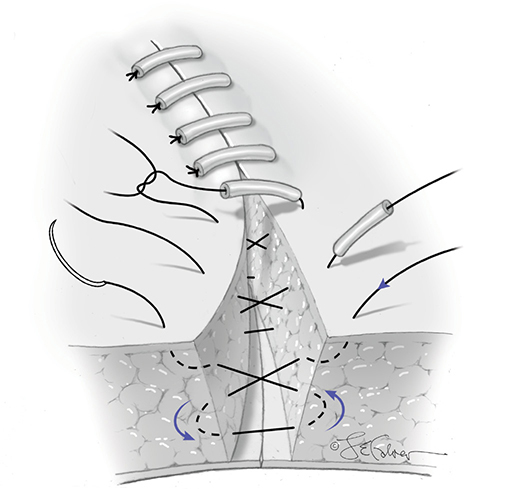
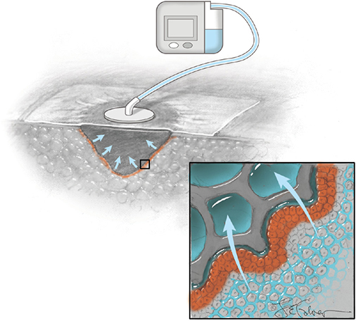
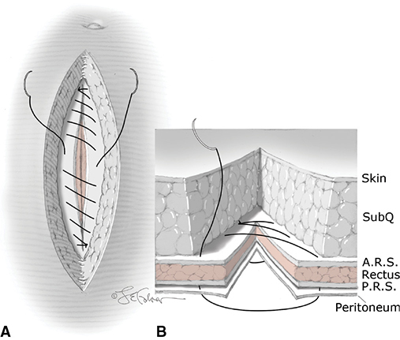
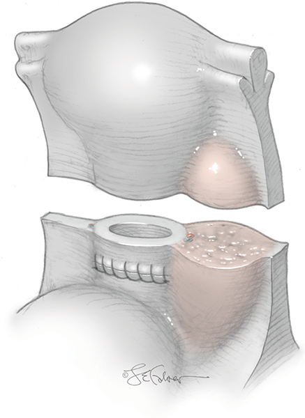
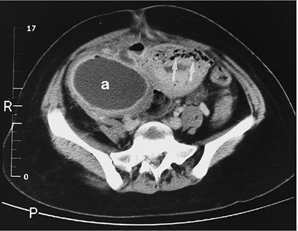
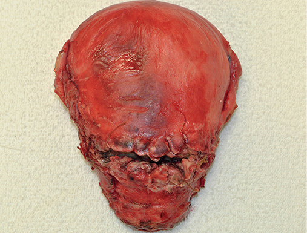
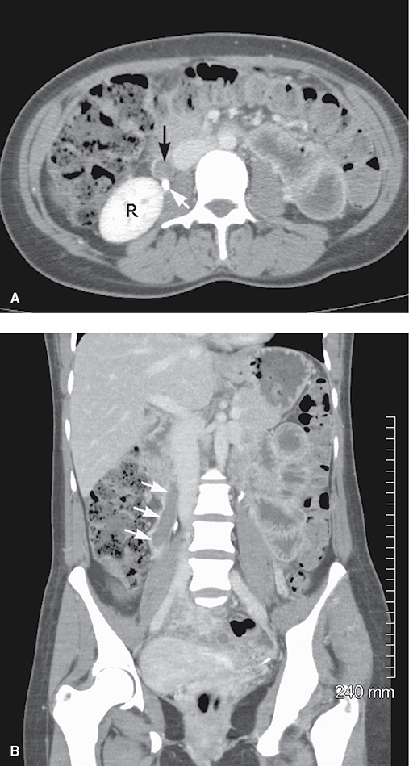
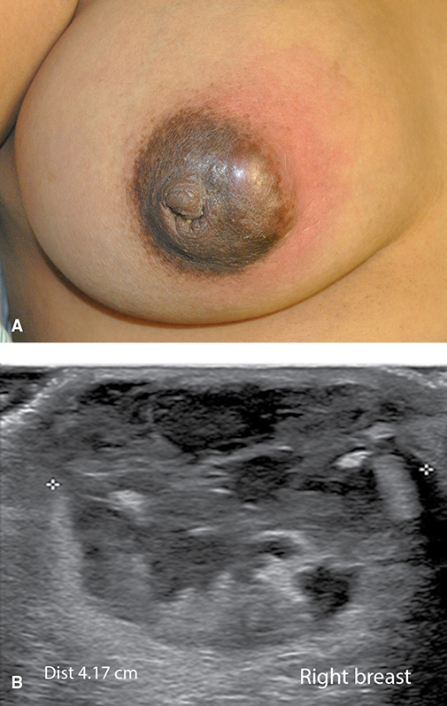

# Chapter 37: Puerperal Infection — Revision Notes

> Williams Obstetrics 26e, pp. 1673–1713 of the PDF. High-yield numbers are in **bold**.
> The five tables are transcribed from the PDF images (they are missing from the extracted chapter text). All 8 figures are included from the PDF (Figure 37-7 appears twice in the PDF, on pp. 1696 and 1697; it is included once).

**Big picture:** **Route of delivery is the single biggest risk factor**: cesarean carries far more infection than vaginal birth. Metritis is **polymicrobial** and **~90% respond within 48–72 h**. Persistent fever means a search for **wound infection, phlegmon, abscess/hematoma or septic pelvic thrombophlebitis**, not resistant bacteria. **Single-dose prophylaxis at cesarean** has done more than anything else to cut postcesarean infection.

---

## 1. Puerperal Pelvic Infections — Overview
- **Puerperal infection** = any bacterial infection of the genital tract after delivery.
- Historically, the "lethal triad" of maternal death was **infection, preeclampsia and hemorrhage**.
- US Pregnancy Mortality Surveillance, **2006–2010 (4693 deaths)**: infection caused **13.6%** of deaths and was the **2nd leading cause**. In North Carolina, **40%** of infection-related maternal deaths were **preventable**.
- Postpartum hospitalization for **sepsis is rising**.

### Puerperal fever
- **Definition: ≥38.0°C (100.4°F).**
- Fever in the first 24 h → pelvic infection in only **~20% after vaginal birth**, but **~70% after cesarean**.
- **Most persistent postpartum fevers are genital tract infections.**
- ⚠️ **Spiking fever ≥39°C in the first 24 h** → think **group A streptococcus** (virulent pelvic infection).

| Other cause of fever | Key points |
|---|---|
| **Breast engorgement** | **~15%** of women who **do not breastfeed**. Rarely **>39°C**, first few days, lasts **<24 h**. Less common in breastfeeding women. |
| Urinary infection | Uncommon (normal postpartum diuresis). Pyelonephritis: fever first, then CVA tenderness, nausea, vomiting. |
| Wounds | Episiotomy, perineal lacerations, abdominal incisions |
| **Atelectasis** (after general anesthesia) | Hypoventilation. Prevent with **scheduled coughing and deep breathing**. Fever comes from infection of normal flora distal to obstructing mucus plugs. |

---

## 2. Uterine Infection (Metritis)
- Also called endometritis, endomyometritis, endoparametritis. Williams prefers **"metritis with pelvic cellulitis."**
- After vaginal birth: infection of the **decidua, myometrium and parametrium**. After cesarean: essentially a **surgical-site infection of the incised myometrium**.

### Predisposing factors

**Route of delivery — the single most significant risk factor**

| Setting | Metritis rate |
|---|---|
| Vaginal delivery (Parkland) | **1–2%** |
| Vaginal + ROM, prolonged labor, multiple cervical exams | **5–6%** |
| **Intrapartum chorioamnionitis** | **>13%** persistent uterine infection |
| MFMU cohort (>115,000) overall pelvic infection | **~5%** |
| **Cesarean, 1970s Parkland, no prophylaxis** | **50%** |

- Cesarean: higher rehospitalization for wound complications and metritis. French enquiry: infection-related mortality **~25-fold** higher with cesarean.
- **Operative vaginal delivery:** ↑ metritis and perineal infection vs spontaneous birth.
  - Knight 2019 (**3500** women): **single-dose prophylactic antibiotic** ↓ maternal infection (urinary, uterine, perineal).
  - But **~50%** had "failure to progress" and **10%** had ROM 24–48 h — these confounders need study before routine adoption.
- **Cesarean prophylaxis:** a **single perioperative dose for all cesareans** (ACOG) → pelvic infection ↓ **65–75%**. **β-lactams are superior.**

**Other risk factors**
- **Postcesarean:** prolonged labor, membrane rupture, multiple cervical exams, **internal fetal monitoring**.
- **Any route:** lower socioeconomic status. Anemia and poor nutrition rarely matter (except extreme cases).
- **Lower genital tract colonization:** **GBS, *Chlamydia trachomatis*, *Mycoplasma hominis*, *Ureaplasma urealyticum*, *Gardnerella vaginalis***.
- Also: general anesthesia, large hysterotomy extension, young age, nulliparity, prolonged induction, chorioamnionitis, obesity, meconium-stained fluid.

### Microbiology
- **Most infections are polymicrobial** (bacterial synergy). Hematomas and devitalized tissue promote virulence.
- The uterine cavity is **usually sterile until the amnionic sac ruptures**; labor and manipulation then contaminate fluid and uterus.

### Table 37-1. Bacteria Commonly Responsible for Female Genital Infections

| Group | Organisms |
|---|---|
| **Aerobes** | |
| Gram-positive cocci | Group A, B, and D streptococci, enterococcus, *Staphylococcus aureus*, *Staphylococcus epidermidis* |
| Gram-negative bacteria | *Escherichia coli*, *Klebsiella*, *Proteus* spp. |
| Gram-variable | *Gardnerella vaginalis* |
| **Others** | *Mycoplasma* spp., *Chlamydia trachomatis*, *Neisseria gonorrhoeae* |
| **Anaerobes** | |
| Cocci | *Peptostreptococcus*, *Peptococcus* spp. |
| Others | *Clostridium*, *Bacteroides*, *Fusobacterium*, *Mobiluncus* spp. |

**Amnionic fluid cultures at cesarean (labor, ROM >6 h, before prophylaxis; Gilstrap 1979)**
- **All** grew bacteria; average **2.5 organisms** per specimen.
- **Mixed aerobic + anaerobic 63%**, anaerobes alone **30%**, aerobes alone **7%**.
- Anaerobes: **Peptostreptococcus/Peptococcus 45%**, Bacteroides 9%, Clostridium 3% (rare but can be severe).
- Aerobes: **Enterococcus 14%**, E. coli 9%, GBS 8%.
- Isolates at cesarean match those from metritis on day 3. Commonest **blood culture** isolates: **GBS, E. coli, enterococci**.

**Specific organisms**

| Organism | Point |
|---|---|
| **MRSA** | Now prevalent in skin/soft-tissue infection; more often **abdominal and perineal wound** infection than metritis |
| **Group A β-hemolytic streptococcus** | **1 in 1220 births**. Toxic shock–like syndrome. Onset before, during or **within 12 h** of delivery → maternal mortality **~90%**, fetal mortality **>50%** (older reviews) |
| ***Ureaplasma urealyticum*** | Heavy cervical colonization may contribute. **Azithromycin-based extended prophylaxis** ↓ postcesarean infection **12% → 6%** vs β-lactam alone |
| ***Chlamydia*** | **Late-onset, indolent** metritis |
| **Bacterial vaginosis** (early pregnancy) | **3-fold** ↑ puerperal infection (Sweden) |

**Cultures**
- **Routine genital tract cultures before treatment are of little use** and add cost.
- Temperature **>102°F** → bacteremia more likely, but **routine blood cultures seldom change care**.
  - Before prophylaxis era: positive in **13%** (Parkland) and **24%** (LA County) with postcesarean metritis. Finland later: **5%** with puerperal sepsis.
  - Exception: very high spikes suggesting **group A strep**.

### Pathogenesis and clinical course
- **Vaginal birth:** placental implantation site, decidua and adjacent myometrium, or cervicovaginal lacerations.
- **Cesarean:** an infected surgical incision. Cervicovaginal bacteria enter the uterus in labor and invade devitalized tissue after delivery.
- **Parametrial cellulitis** = infection of the retroperitoneal fibroareolar pelvic tissue. Usually contained if treated early; may spread deep.
- **Fever is the most important diagnostic criterion.**
  - Usually **38–39°C**; **>39°C suggests bacteremia or endotoxemia**.
- Abdominal pain; **parametrial tenderness** on abdominal and bimanual exam.
- **WBC 15,000–30,000/μL** (cesarean itself raises WBC).
- **Foul lochia is unreliable** (can occur without infection and vice versa). ⚠️ **Group A strep may give scant, odorless lochia.**

### Treatment
- **Mild metritis after vaginal birth:** oral or IM antibiotic may suffice.
- **Moderate–severe:** **IV broad-spectrum** regimen.
- **~90% improve within 48–72 h.**
- **Persistent fever beyond this** → search for:
  - **Parametrial phlegmon** (intense cellulitis)
  - **Abdominal incisional or pelvic abscess, or infected hematoma**
  - **Septic pelvic thrombophlebitis**
  - ⚠️ Rarely resistant bacteria or drug fever.
- **Discharge after ≥24 h afebrile; no oral antibiotics needed afterward.**

**Choice of antimicrobials**
- Empirical, against mixed flora.
- **After vaginal delivery:** up to **90%** respond to **ampicillin + gentamicin**.
- **After cesarean:** include **anaerobic coverage**.

### Table 37-2. Antimicrobial Regimens for Pelvic Infections Following Cesarean Delivery

| Regimen | Comments |
|---|---|
| **Clindamycin + gentamicin** | **"Gold standard," 90–97% efficacy**, once-daily gentamicin dosing acceptable |
| ***Plus*** | Ampicillin added to regimen with **sepsis or suspected enterococcal infection** |
| Clindamycin + aztreonam | Gentamicin substitute for **renal insufficiency** |
| Extended-spectrum penicillins | Piperacillin, piperacillin/tazobactam, ampicillin/sulbactam, ticarcillin/clavulanate |
| Cephalosporins | Cefotetan, cefoxitin, cefotaxime, ceftriaxone |
| Vancomycin | Added to other regimens for suspected *Staphylococcus aureus* infections |
| Metronidazole + ampicillin + gentamicin | Metronidazole has excellent anaerobic coverage |
| Carbapenems | Imipenem/cilastatin, meropenem, ertapenem; all reserved for special indications |

- **DiZerega 1979:** clindamycin + gentamicin **95%** response vs penicillin G + gentamicin — still the standard.
- **Enterococcus** may persist → add **ampicillin** initially or after **48–72 h** without response.
- **Gentamicin levels:** Parkland does **not** monitor routinely if **creatinine is normal**. **Once-daily = multiple-daily dosing** in levels and cure.
- **Reduced GFR:** clindamycin + 2nd-generation cephalosporin, or **clindamycin + aztreonam** (monobactam, aminoglycoside-like activity) — avoids gentamicin nephro-/ototoxicity.
- **β-lactams:** safe except allergy; β-lactamase inhibitors (**clavulanic acid, sulbactam, tazobactam**) extend spectrum.
- **Metronidazole:** superior anaerobic activity; second line for *C. difficile* colitis.
- **Imipenem + cilastatin** (cilastatin blocks renal metabolism): broad but costly → reserve for serious **nonobstetrical** infections.
- **Vancomycin:** gram-positive only; use for **type 1 (anaphylactic) β-lactam allergy**, suspected *S. aureus*, and *C. difficile*.

### Perioperative prophylaxis

### Table 37-3. Various Prophylactic Methods for Decreasing Pelvic and Wound Infection Rates Following Delivery

| Route | Method | Study Results |
|---|---|---|
| Routine delivery | Peripartum antimicrobials | Limited evidence, may reduce risk (Bonet, 2017a) |
| Episiotomy | Perioperative prophylaxis | Insufficient evidence (Bonet, 2017b) |
| Operative vaginal delivery | Peripartum antimicrobials | Limited evidence, may reduce risk (Knight, 2019) |
| **Cesarean delivery** | **Perioperative antimicrobial prophylaxis** | **Decreased 70–80%** (Carter, 2017; Smaill, 2014) |
| Cesarean delivery | Skin preparation | Decreased incidence (Hadiati, 2018) |

*The table gives a 70–80% reduction with cesarean prophylaxis, but the text (citing the same Smaill 2014 review) gives 65–75%.*

- Benefit applies to **elective and nonelective** cesarean.
- **No proven benefit** after spontaneous vaginal birth, episiotomy repair or manual placental extraction.
- **ACOG: a single dose for 3rd- and 4th-degree lacerations is reasonable** (evidence-based).

**Cesarean prophylaxis — the regimen**
- **Single 2-g dose of a 1st-generation cephalosporin (cefazolin)** — as effective as broad-spectrum or multidose regimens.
- **Obese women: 3 g cefazolin** for adequate tissue levels.
- **± Azithromycin** → ↓ postcesarean uterine infection.
- **MRSA colonized:** add **vancomycin** to the cephalosporin.
- **Timing:** ACOG favors **before skin incision** (vs after cord clamping; still debated).
- **Penicillin allergy:** most are not at risk of anaphylaxis → **cephalosporin is safe** without an anaphylaxis history. With anaphylaxis → **vancomycin + clindamycin + gentamicin**.

**Skin and vaginal preparation**
- **Chlorhexidine–alcohol > iodine–alcohol** for surgical-site infection.
- **Vaginal cleansing** with povidone-iodine or **metronidazole gel** may add benefit.

**Other prophylaxis — what does and doesn't work**

| Helps | No effect |
|---|---|
| **Spontaneous placental separation** | Treating asymptomatic **BV** or ***Trichomonas*** in pregnancy (no ↓ puerperal infection) |
| **Exteriorizing the uterus** for hysterotomy closure | Changing gloves after placental delivery |
| Subcutaneous closure in obese women → ↓ **wound separation** (not infection) | Wiping the uterine cavity; dilating the lower segment/cervix |
| | Single- vs two-layer uterine closure |
| | Peritoneal closure vs nonclosure |

- **Staples vs suture:** staples → more **noninfectious skin separation**.

---

## 3. Complications of Uterine and Pelvic Infections
- **>90%** respond within 48–72 h. In the rest: **wound infection, phlegmon or abscess, septic pelvic thrombophlebitis**. All are reduced by prophylaxis.

### Abdominal incisional infections
- **A common cause of persistent fever** in women treated for metritis.
- Risk factors: **obesity, diabetes**, corticosteroids, immunosuppression, anemia, hypertension, **hematoma** (poor hemostasis).
- Incidence with prophylaxis **2–10%**; Parkland **~2%**, rising with BMI.
- **Presentation:** persistent fever or fever starting around **day 4**; erythematous wound draining pus.
- Organisms = those in amnionic fluid at cesarean, ± hospital-acquired pathogens.
- **Treatment:**
  - Antibiotics + **surgical drainage and debridement** (usually spinal or general anesthesia); **check fascial integrity**.
  - **Twice-daily wound care**, analgesia tailored to wound (± topical lidocaine), debride and repack with moist gauze.
  - **Granulation by 4–6 days → secondary en bloc closure**: polypropylene or nylon suture entering **2–3 cm** from one edge, through the full thickness, exiting **3 cm** from the other edge; remove sutures on **day 10**.

*Figure 37-1. Secondary en bloc closure of an open abdominal wound: full-thickness interrupted sutures placed in series.*

**Negative-pressure wound therapy (NPWT; VAC, topical negative pressure)**
- ↑ wound blood flow, angiogenesis, cellular proliferation; ↓ wound size. Widely used despite **meager formal evidence**.
- Uses: open wounds after infection clears, the **"open abdomen"** (most efficient temporary abdominal closure), and perineal wounds (infected episiotomy, hematoma, abscess).
- **No trials** compare it with conventional care after cesarean.

*Figure 37-2. NPWT: suction through a porous sponge causes macro- and microdeformation, removes tissue fluid and keeps the wound warm and moist; granulation tissue forms at the sponge interface.*

**Prophylactic incisional NPWT (obese women)**
- **Hussamy (Parkland, 441 morbidly obese women):** wound morbidity **similar** with iNPWT vs standard dressing (Table 37-4).
- **Denmark (Hyldig, 876 obese women):** SSI **4.6% vs 9.2%** with NPWT.
- Systematic review: ↓ wound complications. Cost-effectiveness inconclusive.
- **Williams: routine prophylactic NPWT needs more evaluation.**

### Table 37-4. Randomized Trial of Prophylactic Incisional Negative-Pressure Wound Therapy (iNPWT) Versus Standard Surgical Dressing for Morbidly Obese Women Undergoing Cesarean Delivery

| Factor | iNPWT (N = 222) | Standard (N = 219) | Significance |
|---|---|---|---|
| BMI at delivery | 46.6 ± 6.0 | 45.8 ± 5.8 | NS |
| **Cesarean delivery** | | | |
| Primary | 43% | 37% | *p* = 0.18 |
| Secondary | 57% | 63% | *p* = 0.18 |
| Scheduled | 32% | 33% | *p* = 0.99 |
| Unscheduled | 68% | 67% | *p* = 0.99 |
| Pfannenstiel | 23% | 28% | *p* = 0.29 |
| Vertical midline | 77% | 72% | *p* = 0.29 |
| **Incision** | | | |
| Depth | 5.5 ± 1.7 | 5.3 ± 1.8 | *p* = 0.19 |
| Length | 14.5 ± 2.5 | 14.6 ± 2.9 | *p* = 0.74 |
| **Wound morbidity** | | | |
| Cellulitis | 32% | 38% | RR = 0.7 (95% CI, 0.3–1.7) |
| Superficial SSI | 54% | 61% | RR = 0.8 (95% CI, 0.4–1.5) |
| Dehiscence | 11% | 2% | RR = 3.9 (95% CI, 0.4–194) |
| **Composite outcome** | **17%** | **19%** | **RR = 0.9 (95% CI, 0.5–1.4)** |
| Readmission | 5% | 4% | RR = 1.3 (95% CI, 0.5–3.5) |
| Reoperation | 6% | 5% | RR = 1.4 (95% CI, 0.6–3.5) |

*BMI = body mass index; CI = confidence interval; NS = not significant; RR = relative risk; SSI = surgical site infection. Data from Hussamy, 2018, 2019.*
*The wound-morbidity rows (cellulitis, SSI, dehiscence) appear to be percentages of the women who had wound morbidity, not of the whole group: they are larger than the 17–19% composite rate.*

### Fascial dehiscence
- Serious; may come with **bowel evisceration**. Risk factors: **wound infection and obesity**.
- **~1 per 300** cesareans (McNeeley, ~9000 women); **⅔ of the 27 cases** had fascial infection and necrosis.
- Usually presents **days 7–10**: superficial separation with **profuse peritoneal fluid or pus leakage**. CT if unclear (only if fast).
- **Dehiscence is a surgical emergency:**
  - Cover or gently replace eviscerated bowel with **saline-soaked sterile towels/gauze**.
  - **Broad-spectrum antibiotics**; exam under anesthesia.
  - Surgery: assess bowel, debride, close fascia with **interrupted mass closure, no. 2 permanent suture**.
  - With infection, leave the subcutaneous layers to close secondarily. Involve general surgery if bowel ischemia or difficult closure is expected.

*Figure 37-3. Mass closure: each bite 1.5–2 cm from the edge, through peritoneum, rectus muscle and rectus sheath; stitches 1 cm apart.*

### Necrotizing fasciitis
- Uncommon, **high mortality**; abdominal incisions, episiotomy or perineal lacerations.
- Risk factors increasingly common in gravidas: **diabetes, obesity, hypertension**.
- Usually **polymicrobial** vaginal flora; sometimes a single virulent species (**group A β-hemolytic strep**) or rare pathogens.
- Goepfert: **9 cases in >5000 cesareans**, 2 deaths. Schorge: 5 cases, none with risk factors, none died.
- Can involve skin, superficial and deep subcutaneous tissue, any abdominopelvic fascial layer, ± muscle (**myofasciitis**).
- **Symptoms usually at 3–5 days**; hard to distinguish from a superficial wound infection → septicemia if it progresses.
- ⚠️ **High suspicion + early surgical exploration if uncertain can be lifesaving.**
- **Treatment:** early diagnosis, **surgical debridement to wide margins of healthy bleeding tissue** (may include abdominal, vulvar, thigh or buttock fascia), antibiotics, ICU care. Mesh may later be needed.
- **Mortality virtually 100% without surgery; ~50% even with exhaustive debridement.**

### Peritonitis and adnexal abscesses
- **After cesarean:** infrequent; almost always preceded by **metritis**, especially **uterine incisional necrosis and dehiscence**. Also ruptured adnexal abscess, bowel injury, perforated appendicitis → usually **prompt surgery**.
- **After vaginal birth:** rare; often **virulent group A strep**.
- ⚠️ **Abdominal rigidity may be absent** (lax postpartum abdominal wall). First signs are often those of **adynamic ileus**; marked bowel distension (unusual after vaginal birth).
- Infection spreading from an **intact uterus** → antibiotics alone usually suffice.
- **Ovarian abscess:** rare, via a break in the ovarian capsule; usually **unilateral**, presents **1–2 wk** postpartum; **rupture common** → severe peritonitis.

### Parametrial phlegmon
- Intense parametrial cellulitis after **cesarean** metritis → **induration within the broad ligament leaves**.
- **Suspect when fever persists >72 h despite IV antibiotics.**
- Usually **unilateral**, at the base of the broad ligament. Spreads along cleavage planes: most often **laterally to the pelvic sidewall**; sometimes posteriorly into the **rectovaginal septum** (firm mass behind the cervix).
- **Most improve with continued broad-spectrum antibiotics; fever resolves in 5–7 days.**
- Severe cellulitis of the uterine incision → **necrosis and separation** → pus extrusion, abscess, peritonitis.
- **Surgery only for suspected uterine incisional necrosis**: usually **hysterectomy + debridement**. Difficult (cervix and lower segment inflamed to the sidewall); **adnexa seldom involved → ovaries usually conserved**; blood loss often large, transfusion common.

*Figure 37-4. Left parametrial phlegmon: indurated cellulitis in the parametrium next to the hysterotomy.*

**Imaging (CT or MR)**
- Brown: CT after **5 days** of refractory infection → abnormal in **75%**, mostly **nonsurgical** lesions.
- Fishel Bartal: refractory fever **>3 days** → abnormal CT in **~60%**; fluid collections **22%**; surgery prompted in **8%**.
- **Imaging mainly helps avoid unnecessary surgery.**
- CT may show incisional dehiscence, but apparent defects (edema) are also seen after uncomplicated cesarean → interpret clinically.

*Figure 37-5. CT: necrosis of the uterine incision with gas in the myometrium (arrows) and a large right parametrial abscess (a).*

*Figure 37-6. Necrotic, dehisced hysterotomy that leaked into the peritoneal cavity; hysterectomy was needed.*

**Drainage options**
- Suppurated phlegmon → **broad ligament abscess** that may point **above the inguinal ligament** → **CT-guided needle drainage**.
- **Psoas abscess** (rare): percutaneous drainage often needed.
- **Rectovaginal-septum abscess → colpotomy drainage.**
- Induration may take days to weeks to resolve.

### Septic pelvic thrombophlebitis
- Infection spreads along veins → thrombosis (± lymphangitis). The **ovarian veins** drain the upper uterus/placental site → **one or both ovarian venous plexuses** usually involved.
- Clot extends into the **IVC in ¼**, occasionally the renal vein.

| Study | Incidence |
|---|---|
| Brown (Parkland, 45,000 births) | **1/9000 vaginal**, **1/800 cesarean** |
| Rouse (16,650 primary cesareans) | **1/400**; **1/175 with chorioamnionitis**, 1/500 without |

- **Symptoms are few:** chills, occasional lower-quadrant pain. Women **feel better on antibiotics but stay febrile**.
- **Diagnosis: pelvic CT or MR.**
  - **20%** of 69 women febrile after **>5 days** of antibiotics for metritis (Brown).
  - **6%** of women with refractory fever ≥3 days (Fishel Bartal).
- **Heparin is controversial:**
  - RCT (**14 women**): adding heparin did **not** hasten recovery or improve outcome.
  - Williams: **heparin unnecessary**; others still anticoagulate.
  - **No evidence for long-term anticoagulation.**

*Figure 37-7. Contrast CT: enlarged right ovarian vein filled with low-density thrombus (axial, A; coronal, B). R = right kidney.*

---

## 4. Perineal Infections
- **Episiotomy infection is uncommon** (fewer episiotomies): **10 in 20,000** vaginal births (Owen).
- **Dehiscence:**
  - Parkland **0.5%**, and **80% of those were infected**. Uygur **1%**, ⅔ from infection.
- **Anal sphincter tears → more infection:** **20%** infection rate (Lewicky-Gaupp); influenced by intrapartum antibiotics.
- **Fourth-degree lacerations (Goldaber, 390 women):** morbidity **5.4%** — infection + dehiscence 2.8%, dehiscence only 1.8%, infection only 0.8%.

### Pathogenesis and clinical course
- Other dehiscence factors: **coagulation disorders, smoking, HPV infection**. **No data link dehiscence to faulty repair.**
- Symptoms: local pain, **dysuria ± urinary retention**. Commonest findings (Ramin): **pain 65%, purulent discharge 65%, fever 44%**.
- Extreme: whole vulva edematous, ulcerated, covered with exudate. Septic shock or necrotizing fasciitis is rare.
- **Vaginal lacerations:** red, swollen → necrosis and slough; parametrial extension → lymphangitis.
- **Cervical lacerations** seldom look infected; they present as **metritis**. Deep tears into the broad ligament base → lymphangitis, parametritis, bacteremia.

### Treatment
- **Cellulitis, no pus:** observation + broad-spectrum antibiotics.
- **Pus:** open, **remove sutures, debride**. **Dehiscence:** local wound care + IV antibiotics.
- **Early repair (after infection clears) — Hauth/Hankins:**
  - Success **94%**; mean **6 days** from dehiscence to repair. Two failures = **pinpoint rectovaginal fistula** (small rectal flap).
- Repair when the wound is **free of exudate with pink granulation tissue**. Mobilize tissue, **identify and mobilize the anal sphincter**, **tension-free** layered closure.
- **Aftercare:** local wound care, **stool softeners**, **nothing per vagina or rectum** until healed. Aim for **soft formed stools** (hard stool disrupts; liquid stool seeps in and reinfects).

### Table 37-5. Preoperative Protocol for Early Repair of Episiotomy Dehiscence

| Step | Action |
|---|---|
| 1 | Open wound, remove sutures, begin intravenous antimicrobials |
| 2 | Initiate wound care: |
| | • Institute sitz bath several times daily or hydrotherapy |
| | • Provide adequate analgesia or anesthesia — regional analgesia or general anesthesia may be necessary for initial debridements |
| | • Scrub wound twice daily with a povidone-iodine solution |
| | • Debride necrotic tissue |
| 3 | **Close wound when afebrile and pink, healthy granulation tissue present** |
| 4 | Provide **enemas prior to fourth-degree repair** |
| 5 | Institute postoperative stool softeners; normal diet, nothing per vagina or rectum |

---

## 5. Toxic Shock Syndrome
- Acute febrile multisystem illness; **case-fatality 10–15%**.
- **Features:** fever, headache, confusion, **diffuse macular erythematous rash**, nausea, vomiting, **watery diarrhea**, **marked hemoconcentration** → renal then hepatic failure, **DIC**, circulatory collapse. **Rash areas desquamate** during recovery.

| Cause | Mechanism / notes |
|---|---|
| ***Staphylococcus aureus*** (incl. MRSA) | **TSST-1** exotoxin → profound endothelial injury; tiny amounts activate T cells → **"cytokine storm"** |
| **Group A β-hemolytic strep** | **Pyrogenic exotoxin** → streptococcal TSS; serotypes **M1 and M3** especially virulent |
| ***Clostridium sordellii*** and ***C. novyi*** | Almost identical picture in pregnant women |

- Infection may not be apparent — **mucosal colonization** is the presumed source.
  - **10–20%** of pregnant women carry vaginal *S. aureus*; *C. perfringens*/*sordellii* in **3–10%** of asymptomatic women.
- **Delayed diagnosis → maternal death.** Antenatal TSS can cause neonatal death.
- **Treatment:** mainly **supportive** while endothelial injury reverses; antibiotics covering **staphylococci and streptococci** (+ polymicrobial coverage if pelvic infection); **wound debridement ± hysterectomy**. Mortality is high because the toxin is so potent.

---

## 6. Breast Infections

### Mastitis
- Rare antepartum; **postpartum incidence ~3%**. **No proven prophylaxis.**
- Risk factors: **nursing difficulties, cracked nipples, oral antibiotic therapy**.
- **Onset rarely before the end of week 1; usually weeks 3–4.**
- Almost always **unilateral**; marked **engorgement precedes** inflammation.
- **Chills or rigors → fever and tachycardia**; severe pain; hard, red breast.
- **~10% develop an abscess** — fluctuation is hard to feel → **sonography is usually diagnostic**.
- Rarely, **TSS** from *S. aureus* mastitis.

### Etiology
- ***S. aureus*, especially MRSA — the most common isolate** (40% in Matheson). Others: **coagulase-negative staphylococci, viridans streptococci**.
- **Source: the newborn's nose and throat**; bacteria enter through **nipple fissures/abrasions**. Organism usually cultured from milk.
- Epidemics coincide with new resistant staphylococcal strains (now MRSA).
  - Parkland 2000–2004: **¼ of community-acquired MRSA** isolates were from pregnant/postpartum women with mastitis.
  - Hospital MRSA: newborn colonized by nursery staff.
  - **MRSA mastitis → more recurrent abscess.**

### Management
- Started before suppuration → **usually resolves within 48 h**.
- Many **culture expressed milk** before treatment (surveillance, sensitivities).
- Best regimen unclear; choice reflects local staphylococcal patterns.

| Situation | Antibiotic |
|---|---|
| **Empirical** | **Dicloxacillin 500 mg orally four times daily** |
| Penicillin sensitivity | **Erythromycin** |
| Resistant/penicillinase-producing staph suspected (e.g., MRSA) | **Vancomycin, clindamycin or trimethoprim-sulfamethoxazole** |
| **Duration** | **10 days**, even if response is prompt |

- ⚠️ **Continue breastfeeding.** Marshall (65 women): the **only 3 abscesses** occurred among the **15 who stopped** breastfeeding. Vigorous milk expression alone may suffice.
- Infant refusing the inflamed breast is due to **engorgement/edema** (harder areolar grip), not milk taste → **pumping** helps.
- **Start suckling on the uninvolved breast** so let-down begins, then move to the tender side.
- **HIV (resource-poor settings):** breastfeeding is allowed, but **stop feeding from a breast with mastitis or abscess** — HIV RNA rises in that milk (returns to baseline after resolution).

### Breast abscess
- Incidence **0.1%** (1.5 million Swedish women).
- **Suspect if no defervescence within 48–72 h** of treatment or a **palpable mass** → **sonography**. Can be large (**2 L** of pus in one report).

| Approach | Details |
|---|---|
| **Sonographically guided needle aspiration** (now favored; local analgesia) | Success **80–90%**. RCT at 8 wk: healed **93% vs 77%** with surgical drainage |
| **Surgical drainage** (traditional; usually general anesthesia) | Incision along **Langer lines**; single incision over the most dependent fluctuant area; multiple abscesses → several incisions + break loculations; loose gauze pack, replaced at **24 h** with a smaller one |

- Sonographic findings, first antibiotic and organism do **not** predict aspiration failure.
- **Nonhealing abscess** → consider **granulomatous mastitis, cancer, tuberculosis**.

*Figure 37-8. Puerperal mastitis with abscess: (A) indurated, erythematous right breast; (B) sonogram of a 5-cm abscess.*

---

## Quick-Recall: Persistent Postpartum Fever — Differential

| Cause | Timing / clue | Diagnosis | Management |
|---|---|---|---|
| **Metritis** | Fever 38–39°C, uterine/parametrial tenderness, esp. post-cesarean | Clinical | Clindamycin + gentamicin (± ampicillin); stop after 24 h afebrile |
| **Group A strep** | Fever ≥39°C in first 24 h; scant odorless lochia | Blood culture | Urgent broad therapy; high mortality |
| **Wound infection / abscess** | Fever ~day 4, red draining wound | Exam | Open, drain, debride; secondary closure at 4–6 d |
| **Fascial dehiscence** | Days 7–10, gush of serous/purulent fluid | Exam ± CT | Emergency: mass closure with no. 2 permanent suture |
| **Necrotizing fasciitis** | Days 3–5, looks worse than wound | Surgical exploration | Wide debridement (50% mortality even then) |
| **Parametrial phlegmon** | Fever >72 h on IV antibiotics; broad-ligament induration | CT/MR | Continue antibiotics (5–7 d); surgery only for incisional necrosis |
| **Pelvic/broad-ligament abscess** | Fluctuant mass, may point above inguinal ligament | CT | CT-guided drainage; colpotomy if rectovaginal septum |
| **Septic pelvic thrombophlebitis** | Feels well but febrile despite antibiotics | CT/MR: ovarian vein thrombus | Continue antibiotics; heparin optional |
| **Breast engorgement** | Non-breastfeeding, <39°C, <24 h | Clinical | Supportive |
| **Mastitis** | Week 3–4, unilateral red hard breast | Clinical | Dicloxacillin 10 d; keep breastfeeding |
| **Breast abscess** | No response in 48–72 h, mass | Sonography | Needle aspiration (80–90%) |
| **Atelectasis** | Post–general anesthesia | Clinical | Coughing, deep breathing |
| **Toxic shock** | Rash, diarrhea, hemoconcentration, shock | Clinical | Supportive; anti-staph/strep; debridement |

## Key Numbers to Memorize
- Fever **≥38.0°C**; infection causes **13.6%** of maternal deaths (2nd); **40%** preventable
- Fever <24 h → pelvic infection **20%** vaginal vs **70%** cesarean; engorgement fever in **15%** non-breastfeeders
- Metritis: vaginal **1–2%** (5–6% with risks, >13% with chorioamnionitis); cesarean **50%** without prophylaxis
- Prophylaxis ↓ infection **65–75%** (text) / **70–80%** (table); **cefazolin 2 g** (3 g if obese); azithromycin extra ↓ **12 → 6%**
- Amnionic fluid: **2.5** organisms; mixed **63%**, anaerobes alone **30%**, aerobes alone **7%**
- Group A strep **1/1220** births; maternal mortality **~90%** in early-onset cases
- Response in **48–72 h** in **~90%**; clindamycin + gentamicin **90–97%**; discharge after **24 h** afebrile
- Wound infection **2–10%** (~2% Parkland); secondary closure at **4–6 d**, sutures out at **10 d**
- Fascial dehiscence **1/300**, days **7–10**; necrotizing fasciitis mortality **~50%** with surgery
- Phlegmon: fever >**72 h**, resolves in **5–7 d**; CT abnormal **75%**, surgery in **8%**
- Septic pelvic thrombophlebitis: **1/9000 vaginal, 1/800 cesarean** (1/175 with chorioamnionitis); IVC in **¼**
- Episiotomy dehiscence **0.5–1%**; sphincter-tear infection **20%**; early repair success **94%** at ~**6 d**
- TSS fatality **10–15%**; vaginal *S. aureus* in **10–20%**
- Mastitis **3%**, weeks **3–4**; abscess in **10%** of mastitis (**0.1%** overall); dicloxacillin **500 mg qid × 10 d**; aspiration success **80–90%**
