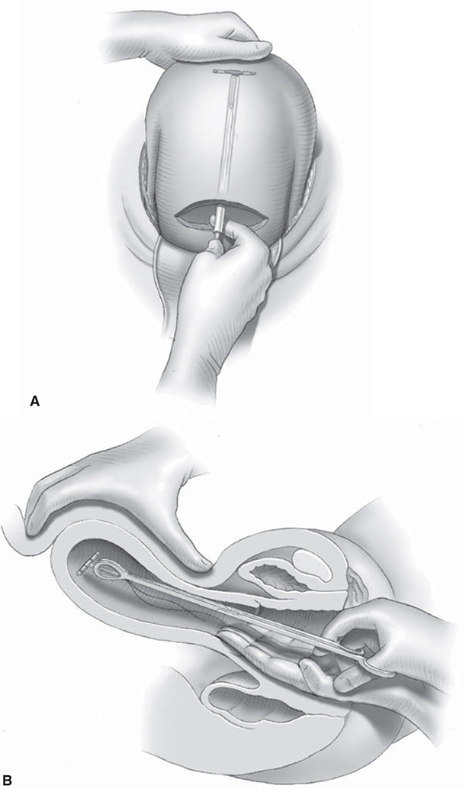
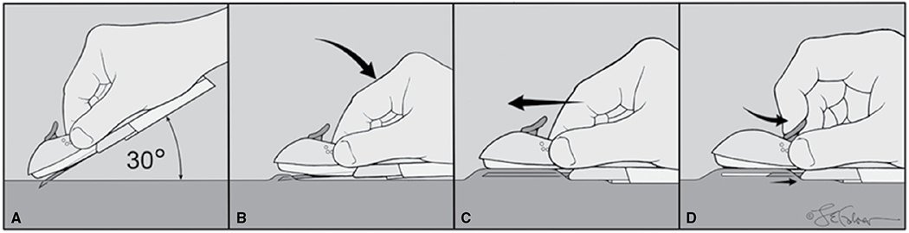
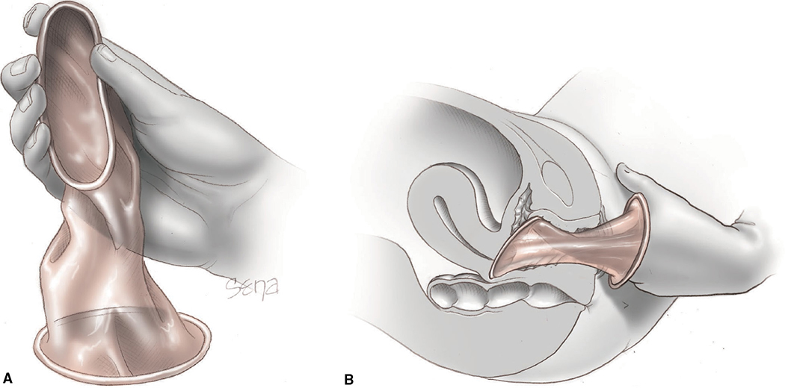

# Chapter 38: Contraception — Revision Notes

> Williams Obstetrics 26e, pp. 1714–1758 of the PDF. High-yield numbers are in **bold**.
> The seven tables are transcribed from the PDF images (they are missing from the extracted chapter text). All 3 figures are included from the PDF (Figure 38-1 appears twice in the PDF, on pp. 1724 and 1725; it is included once).

**Big picture:** Nearly **half of US pregnancies are unintended**. **LARC (IUDs and the implant) is top-tier** (<1% failure, perfect = typical use) and should be encouraged for suitable women. The **US MEC** grades each method **1–4** for each condition. After delivery, **estrogen is avoided for the first 21 days**, while progestin-only methods and IUDs can start immediately.

---

## 1. Postpartum Context, Efficacy and Eligibility

### The puerperium
- **Exclusive breastfeeding → ovulation unlikely in the first 10 wk.** Not reliable if the infant nurses only by day.
- **Ovulation usually precedes the first menses** → waiting for menses risks pregnancy. **After the first menses, contraception is essential.**

### Table 38-1. Contraceptive Failure Rates of Reversible Methods During the First Year and Use Ratesᵃ

| Method | Perfect Use | Typical Use | Percent Useᵇ |
|---|---|---|---|
| **Top tier (most effective)** | | | |
| Intrauterine devices: | | | 11.8 |
| 52-mg LNG-IUS | **0.1** | **0.1** | – |
| T380A Cu-IUD | 0.6 | 0.8 | – |
| Etonogestrel implant | **0.1** | **0.1** | 2.6 |
| Female sterilization | 0.5 | 0.5 | 21.8 |
| Male sterilization | 0.1 | 0.15 | 6.5 |
| **Second tier (very effective)** | | | |
| Combination pill | 0.3 | **7** | **24.9** |
| Vaginal ring | 0.3 | 7 | 2.4 |
| Patch | 0.3 | 7 | 0.2 |
| DMPA | 0.2 | **4** | 3.9 |
| Progestin-only pill | 0.3 | 7 | 0.4 |
| **Third tier (effective)** | | | |
| Condom | | | 14.6 |
| Male | 2 | 13 | – |
| Female | 5 | 21 | – |
| Diaphragm + spermicidesᶜ | 16 | 24 | – |
| **Fourth tier (least effective)** | | | |
| Spermicidesᶜ | 18 | **28** | – |
| Spongeᶜ — multiparas | 20 | 27 | – |
| Spongeᶜ — nulliparas | 9 | 14 | – |

*Values are percentages of women with a pregnancy in the first year. ᵃAmong women in the United States using contraception. ᵇThis sum totals less than 100% as withdrawal (8.1%) and natural family planning (2.2%) values are not presented in the table. ᶜCombined into "other method" category, which has a use rate of 0.6%. Cu-IUD = copper-containing intrauterine device; DMPA = depot medroxyprogesterone acetate; LNG-IUS = levonorgestrel-releasing intrauterine system.*

> **Memory hook:** Typical-use failures by tier: **LARC <1 → DMPA 4 → pill/patch/ring/POP 7 → male condom 13 → spermicide 28.**

### US Medical Eligibility Criteria (US MEC, CDC 2016)
- Six method groups: **LNG-IUS, Cu-IUD, implants, DMPA, POPs, CHCs** (COCs, ring, patch).

| Category | Meaning |
|---|---|
| **1** | No restriction |
| **2** | Advantages generally outweigh risks |
| **3** | Risks generally outweigh advantages |
| **4** | **Unacceptable health risk** |

- Contraception usually carries **less risk than pregnancy**. Sterilization is covered in Ch 39.

---

## 2. Intrauterine Devices

- **Five US IUDs**, all chemically active (copper or progestin); flexible **T-shaped polyethylene frame with barium** (radiopaque).
- LNG devices differ in size, string color, lifespan and **silver ring** (at stem–arm junction). **Smaller devices may fit a nulliparous uterus better.**
- **ParaGard (T380A):** copper wire around the stem + a copper sleeve on each arm.

### Table 38-2. Properties of Intrauterine Devices

| Active Agent | Quantity of Active Agent | Width × Height (mm) | Inserter Tube Diameter (mm) | FDA-approved Duration of Use (yr) | String Color | Silver Ring | Brand Name |
|---|---|---|---|---|---|---|---|
| LNG | 52 mg | 32 × 32 | 4.4 | **5** | Tan | No | Mirena |
| LNG | 52 mg | 32 × 32 | 4.8 | **6** | Blue | No | Liletta |
| LNG | 19.5 mg | 28 × 30 | 3.8 | **5** | Blue | Yes | Kyleena |
| LNG | 13.5 mg | 28 × 30 | 3.8 | **3** | Tan | Yes | Skyla, Jaydess |
| Copper | 380 mm³ | 32 × 36 | 4.4 | **10** | White | No | ParaGard |

*FDA = U.S. Food and Drug Administration; LNG = levonorgestrel.*

### Contraceptive action
- **Prevention of fertilization is favored.**
- **Intense sterile endometrial inflammation** (especially **Cu-IUD**) → inflammatory fluid in uterus and tubes ↓ sperm and egg viability; also acts against any blastocyst.
- **LNG-IUS:** endometrial **atrophy** + **scant, viscous cervical mucus**.
- Ovulation inhibition is **inconsistent with LNG-IUS and absent with Cu-IUD**.

### Method-specific adverse effects

**Ectopic pregnancy**
- IUDs **halve the absolute number of ectopics** vs no contraception.
- But they prevent intrauterine implantation better → **if an IUD fails, a higher proportion of pregnancies are ectopic**.

**Lost device (missing strings)**
- **Expulsion is most common in the first month** → check strings **4–6 wk** after insertion (after menses); the woman then checks monthly after menses.
- **Cumulative 3-yr expulsion ~10%** after nonpuerperal insertion.
- Strings not seen → expelled, perforated, malpositioned, or normal with strings curled up.
- **Stepwise approach:**
  - (1) **Exclude pregnancy**
  - (2) Twirl a **cytology brush** in the endocervical canal
  - (3) Gently probe the cavity with a **Randall stone clamp** or hooked rod
  - (4) **Transvaginal sonography** (3-D improves views)
  - (5) If inconclusive or no device seen → **plain abdominopelvic radiograph**; CT or MR as alternatives
- ⚠️ **Never assume expulsion unless the device was seen.** MR at 1.5 or 3 T is safe with an IUD.

**Perforation**
- **~1 per 1000 insertions**; risks: **puerperal insertion and breastfeeding**.
- Recognized when the sound/inserter goes **farther than expected**.
- **Acute:** usually **fundal**, little bleeding (myometrium contracts) → **observe** if no brisk bleeding from the os. Rare lateral perforation → uterine artery laceration → laparoscopy/laparotomy.
- **Occult/embedded:** pain, bleeding or missing strings → imaging.
  - Arm partly embedded → steady transcervical traction.
  - Mainly intrauterine → **hysteroscopic** removal.
  - Nearly or fully through the wall → **laparoscopic** removal (often on cul-de-sac or omentum; bowel/bladder perforation possible).

**Menstrual changes**
- Dysmenorrhea and irregular bleeding → **NSAIDs or tranexamic acid**.
- **Heavy bleeding mainly with Cu-IUD** → iron-deficiency anemia (oral iron).
- **LNG-IUS:** spotting for up to **6 months** → progressive **amenorrhea (~10% at 1 yr, 35% at 3 yr)**, often with less dysmenorrhea.

**Infection**
- **Risk greatest in the first 3 wk after insertion**: *N. gonorrhoeae*, *C. trachomatis*, vaginal flora.
- Screen women at STD risk **before or at insertion**; **don't delay insertion** for STD or Pap results in asymptomatic women. If positive later → treat, **IUD may stay**.
- **No routine antibiotic prophylaxis; no endocarditis prophylaxis.**
- After month 1, **no ↑ infection** in low-risk users; little if any ↑ infertility. **Adolescents and nulliparas at low STD risk are good candidates** (ACOG). Safe in **HIV/immunosuppression**; doesn't ↑ HIV acquisition.

| Infection | Management |
|---|---|
| **Mild–moderate PID** | Antibiotics; **IUD may be retained**. Remove if no improvement in **48–72 h** |
| **Tuboovarian abscess** | IV broad-spectrum antibiotics + **IUD removal** |
| **Septic abortion** | **Immediate uterine evacuation** + antibiotics |
| ***Actinomyces* on Pap, asymptomatic** | **Keep IUD, no antibiotics** |
| ***Actinomyces* with infection** (fever, weight loss, pain, abnormal bleeding/discharge) | **Remove IUD** + gram-positive coverage |

**Pregnancy with an IUD**
- **Exclude ectopic and pelvic infection.**
- Infection → broad-spectrum antibiotics + **prompt evacuation**.
- **Intrauterine, no infection, strings visible → remove by gentle traction** → ↓ abortion, chorioamnionitis, preterm birth.

| Cu-IUD in pregnancy (Tatum) | Abortion | Preterm delivery |
|---|---|---|
| **Left in situ** | **54%** | **17%** |
| **Removed promptly** | **25%** | **4%** |

- Few LNG-IUS data (practice extrapolated from copper).
- **Strings not visible:** searching for the device may cause abortion; Williams does not use sonographic/hysteroscopic retrieval. Find and remove the IUD at delivery.

### IUD insertion — timing

### Table 38-3. Contraindications to IUD Use

| Category | Contraindication |
|---|---|
| **Both IUD types** | Pregnancy or suspicion of pregnancy |
| | Distorted uterine cavity |
| | Acute PID |
| | Postpartum/postabortal endometritis in past 3 months |
| | Uterine bleeding of unknown etiology |
| | Acute untreated LGT infection |
| | Conditions linked to pelvic infection riskᵃ |
| | Allergy to device components |
| | Coexisting retained IUD |
| **Specific to Cu-IUD** | Known or suspected uterine or cervical cancer |
| | **Wilson disease** |
| **Specific to LNG-IUS** | Prior PID unless a subsequent IUP has occurred |
| | Known or suspected uterine or cervical neoplasia |
| | Acute liver disease or benign/malignant liver tumor |
| | Known or suspected current or prior **breast cancer** or other progestin-sensitive cancer |

*ᵃThese include multiple sexual partners, severe immune compromise, intravenous drug use, and recent PID or endometritis. Cu-IUD = copper-containing intrauterine device; IUD = intrauterine device; IUP = intrauterine pregnancy; LGT = lower genital tract; LNG-IUS = levonorgestrel-releasing intrauterine system; PID = pelvic inflammatory disease.*

| Placement | Definition | Expulsion |
|---|---|---|
| **Interval** | After complete uterine involution | Lowest |
| **Immediate** | **Within 10 min of placental delivery** (also after miscarriage or surgical abortion, if no infection) | Slightly higher |
| **Early** | **>10 min but within the first month** postpartum | **Highest** |

- Also possible **1 wk after mifepristone** once medical abortion is complete.
- **Immediate placement → more women end up with a retained IUD**, because many never return for interval insertion.

### Table 38-4. U.S. Medical Eligibility Criteria Category of Contraceptive Methods Related to Breastfeeding and Time After Delivery

| CHCsᵃ | Cat. | DMPA, POPs, Implants | Cat. | LNG-IUS | Cat. | Cu-IUD | Cat. |
|---|---|---|---|---|---|---|---|
| **Breastfeeding** | | **Breastfeeding** | | **± Breastfeedingᶜ** | | **± Breastfeedingᶜ** | |
| <21 d | **4** | <1 month | 2 | <10 mins | 2 | <10 min | **1** |
| 21 d to <30 d | 3 | ≥1 month | 1 | 10 mins to ≤4 wks | 2 | 10 min to ≤4 wks | 2 |
| 30–42 dᵇ | 2 | | | ≥4 wks | 1 | ≥4 wks | 1 |
| >42 d | 2 | | | Puerperal sepsis | **4** | Puerperal sepsis | **4** |
| **Nonbreastfeeding** | | **Nonbreastfeeding** | 1 | | | | |
| <21 d | **4** | | | | | | |
| 21–42 dᵇ | 2 | | | | | | |
| >42 d | 1 | | | | | | |

*ᵃCombined hormonal contraceptive (CHC) group includes pills, vaginal ring, and patch. ᵇAssociated risks that increase puerperal category score include: age ≥35, transfusion at delivery, body mass index ≥30, postpartum hemorrhage, cesarean delivery, smoking, preeclampsia. ᶜWith or without breastfeeding. Cat. = category; Cu-IUD = copper-containing intrauterine device; DMPA = depot medroxyprogesterone acetate; LNG-IUS = levonorgestrel-releasing intrauterine system; POPs = progestin-only pills.*

> **Memory hook:** "**21 days, no estrogen**" (VTE risk; category 4 whether or not breastfeeding). **Puerperal sepsis = category 4 for any IUD.**

### Postpregnancy insertion techniques
- **After 1st-trimester evacuation:** standard manufacturer technique. Larger cavity → **ring forceps under sonographic guidance**.
- **Immediately after vaginal or cesarean delivery:** by hand, inserter tube, or ring forceps; arms need **not** be folded into the tube.
  - **At cesarean:** through the unsutured hysterotomy to the **fundus**; a hand on the outer fundus gives counterpressure. Strings are directed, **not pulled**, toward the cervix.
  - **After vaginal birth (instrumented):** re-prep the vulva and **change gloves after placental delivery, before perineal repair**. Hold the anterior cervical lip with one ring forceps; a second grasps the stem and places it at the fundus. **Keep jaws open on withdrawal** so strings aren't caught. Manual insertion also possible. Abdominal-hand counterpressure guides placement.

*Figure 38-1. Postpartum IUD placement: (A) inserter through the hysterotomy to the fundus at cesarean, with fundal counterpressure; (B) ring forceps to the fundus after vaginal delivery, guided by an abdominal hand.*

### Interval insertion technique
- Easiest **near the end of menses** (cervix softer, early pregnancy excluded), but can be done **any time** if pregnancy is reasonably excluded.
- Analgesia: **lidocaine–prilocaine cream** or **paracervical block**.
- Bimanual exam (size, position, abnormalities). **Treat mucopurulent cervicitis or significant vaginitis first.**
- Antiseptic prep, sterile instruments → **tenaculum** + gentle traction straightens the canal → **uterine sound** for direction and depth → insert per package insert.
- **Trim strings to 3–4 cm** and record length. Oral NSAID for cramping.
- Suspected malposition → confirm (sonography). Not fully intrauterine → **remove and replace with a new device**. ⚠️ **Never reinsert an expelled or partly expelled device.**

---

## 3. Progestin-Only Contraceptives

### Actions and side effects
- **Mechanisms:** **LH suppression → no ovulation**, **thick cervical mucus**, **endometrial atrophy**.
- **Rapid return of fertility** — except **DMPA**.
- Theoretical concern that early postpartum progestin could hinder lactogenesis (progesterone withdrawal triggers it) → reflected in US MEC 2 at <1 month, although studies support safety.
- **Irregular bleeding = the commonest reason for stopping.** Options: counseling; **2-wk estrogen course** or short **NSAID** course; a few cycles of COCs with DMPA or implant. Long use → atrophy → **amenorrhea** (often welcome; less iron deficiency).
- **Generally no effect** on lipids, glucose, hemostasis, liver or thyroid function, BP. **Exception: DMPA ↑ LDL and ↓ HDL** (less desirable with CV risk).
- **No ↑ genital, liver or breast neoplasia.**
- Weight gain and fractures are not prominent — **except DMPA**.
- **Functional ovarian cysts** ↑ (usually no intervention). **No ↑ depression.**

### Progestin contraindications
- **Absolute:** current **pregnancy**, **breast cancer**, **acute liver disease, liver tumors**, **undiagnosed abnormal genital bleeding**.
- Nexplanon and DMPA labels add current/past **thromboembolism**, but **US MEC rates progestin methods category 2** for these women.

### Progestin implants
- Subdermal, inner upper arm, **~8 cm from the elbow**; **top-tier**.
- **Nexplanon:** single-rod **etonogestrel**, releases **≥30 µg/day**, **3 years**; **radiopaque**. Replaced Implanon (**not radiopaque**).
- **Levonorgestrel** two-rod implants (outside US; total **150 mg** LNG): **Jadelle 5 yr** (FDA-approved, not marketed in US); **Sino-implant II 3 yr**.

**Implant-specific adverse effects**
- Complications in **~1% of insertions and ~5% of removals**.
- Too-deep insertion or removal exploration → injury to **medial antebrachial cutaneous nerve** branches and the **median nerve**. Deep/intramuscular or near neurovascular structures → **surgeon familiar with arm anatomy**.
- **Nonpalpable implant → image before removal:**
  - **Nexplanon:** 2-D **x-ray**.
  - **Implanon:** **10–15-MHz linear sonography** or **MR**.
  - Rare migration (e.g., lung). If still not found → **etonogestrel blood level** (via manufacturer).

**Implant insertion**
- **Etonogestrel implant: ideally within 5 days of menses onset.** LNG implants: contraceptive within **24 h** if placed in the **first 7 days** of the cycle.
- **Switching:** on the day of the **first placebo COC pill**; the day the next **DMPA** injection is due; or **within 24 h of the last POP**.
- Other times (not pregnant) → **back-up for 7 days**. Can be placed **before discharge** postpartum or postabortion.
- **Technique (Nexplanon):**
  - Nondominant arm **abducted, elbow flexed**.
  - Mark **8–10 cm proximal to the medial humeral epicondyle** and **3–5 cm posterior to the biceps–triceps groove**; second mark **4 cm** proximal (guide along the long axis).
  - Sterile prep; **1% lidocaine** track along the path.
  - Needle bevel enters at **30°** → flatten horizontally once the bevel is in → **tent the skin** while advancing subdermally → pull the lever back to retract the needle and leave the implant.
  - **Both patient and provider palpate both ends of the 4-cm rod.** Pressure bandage, removed next day.

*Figure 38-2. Nexplanon insertion: (A) enter at 30°, (B) drop to horizontal, (C) tent the skin while advancing subdermally, (D) pull the lever to retract the needle and deposit the implant.*

**Implant removal**
- Antiseptic prep → press the **proximal end** so the distal end bulges → anesthetize → **2-mm incision toward the elbow** along the long axis → push the proximal end toward the incision → grasp the distal end with a hemostat; dissect superficial adhesions.

### Injectable progestins

| Agent | Dose / interval | Notes |
|---|---|---|
| **DMPA IM (Depo-Provera)** | **150 mg every 3 months** | Deltoid or gluteus; **do not massage** (slow release) |
| **Depo-subQ provera 104** | **Every 3 months SC** (anterior thigh or abdomen) | Can be **self-administered** |
| Norethisterone enanthate | 200 mg every 2 months IM | Used worldwide (not US) |

- **First injection within 5 days of menses onset** → contraceptive levels by **24 h**, no back-up needed.
- **Quick start** (any cycle day): negative pregnancy test first, **back-up for 7 days**, repeat pregnancy test at **3–6 wk**.
- Pregnancy on DMPA → **no ↑ anomalies**.

**DMPA-specific adverse effects**
- **Delayed return of fertility** (prolonged anovulation): **¼ lack regular menses for up to 1 year** → poor choice for brief use before planned conception.
- No ↑ CV events/stroke in healthy women, but **↑ stroke with severe hypertension**. US MEC concern for **hypoestrogenism and ↓ HDL** in vascular disease/multiple CV risks.
- **Weight gain 1–3 kg in year 1.**
- **Bone density loss** in long-term users, **slowly reversible** after stopping.
  - **FDA black box warning (2004)** — most relevant to **adolescents** and **perimenopausal** women — but **DMPA should NOT be restricted** in these groups (ACOG).

### Progestin-only pills ("mini-pills")

| Pill | Dose / regimen | Ovulation inhibited? | Missed-pill window |
|---|---|---|---|
| **Norethindrone** | **0.35 mg daily, continuous** | **Not reliably** (mucus + endometrium) | **3 h** → back-up for **48 h** |
| **Drospirenone (Slynd)** | **4 mg, 24 days of 28** (4 hormone-free days ↓ irregular bleeding) | Yes | **24 h** (like COCs) |
| **Desogestrel** | 0.075 mg daily, continuous (not in US) | Yes | **12 h** |

- Norethindrone pills must be taken at the **same time daily** (mucus effect is short-lived).
- **Drospirenone** (spironolactone analog): antiandrogenic, antialdosterone (↓ water retention), antimineralocorticoid → theoretical **hyperkalemia**.
  - **Contraindicated in renal or adrenal insufficiency** (plus usual progestin contraindications).
  - **Check K⁺ in the first month** if also on NSAIDs, ACE inhibitors, ARBs, heparin, aldosterone antagonists or K⁺-sparing diuretics.

---

## 4. Combination Hormonal Contraceptives (CHCs)

### Mechanism
- **Main effect: suppression of hypothalamic gonadotropin-releasing factors → no ovulation** (both components).
- Progestin: thick mucus, unfavorable endometrium.
- **Estrogen: stabilizes the endometrium → prevents breakthrough bleeding ("cycle control").**
- Extremely effective yet highly reversible.

### Combination oral contraceptive pills — composition
- **Ethinyl estradiol (EE)** is the usual estrogen; less often mestranol, estetrol, estradiol valerate.
- Estrogen side effects: **breast tenderness, weight gain, nausea, headache**.

### Table 38-5. Estrogen and Progestins Used in FDA-Approved Combination Oral Contraceptive Pills

| Estrogen Type (Pill Dose) | Paired Progestinᵃ |
|---|---|
| Ethinyl estradiol 10 µg | Norethindrone acetate |
| Ethinyl estradiol 20 µg | Desogestrel, Drospirenone, Levonorgestrel, Norethindrone acetate |
| Ethinyl estradiol 25 µg | Desogestrel, Norgestimate |
| Ethinyl estradiol 30–35 µg | Desogestrel, Drospirenone, Ethynodiol diacetate, Levonorgestrel, Norethindrone, Norethindrone acetate, Norgestimate, Norgestrel |
| Ethinyl estradiol 50 µg | Ethynodiol diacetate, Norgestrel |
| Estradiol valerate 2 mg | Dienogest |
| Estetrol 14.2 mg | Drospirenone |
| Mestranol 50 µg | Norethindrone |

*ᵃProgestins are listed alphabetically. FDA = U.S. Food and Drug Administration.*

- Progestins are related to **progesterone, testosterone or spironolactone** → variable binding to progesterone, androgen, glucocorticoid and mineralocorticoid receptors (explains side effects); clinical superiority of one over another is unclear.
- **EE 10–50 µg/day; most ≤35 µg.** The floor is set by pregnancy prevention + cycle control.
- **"Fe"** pills: iron replaces placebo. **Beyaz, Sayfral:** **levomefolate** (folate) in active and placebo pills.
- **Monophasic** (constant dose) vs **bi-/tri-/quadriphasic**: phasic pills aim to ↓ total progestin, but **no proven clinical advantage**; cycle control similar.

### Administration
- Active pills **21–81 days** + placebo **4–7 days** (pill-free interval → withdrawal bleed).
- **24/4 regimens** counter follicular growth with low-dose pills; perform like **21/7**.
- **Extended cycle:** 12 wk active + 1 wk off (**13-wk cycle**). **Amethyst:** continuous **365 days**. Same efficacy/safety; good for significant menstrual symptoms.

| Start method | Back-up needed? |
|---|---|
| **First day of menses** | **No** |
| **Sunday start** (first Sunday after menses begins) | **Yes, 1 wk** (none if menses begin on Sunday) |
| **Quick start** (any day, usually day prescribed) | **Yes, 1 wk** |

- **COCs are not teratogenic** if the woman is unknowingly pregnant. A missed menses after starting → pregnancy test. Same start rules for rings and patches.

| Missed pills | Action |
|---|---|
| **1 dose** | Take missed pill now + today's pill on time; continue |
| **≥2 doses** | Take **most recent** missed pill now + today's on time; **back-up for 7 days**; continue |
| No withdrawal bleed in pill-free interval | Continue pills, **exclude pregnancy** |

- Early spotting is common, resolves in **1–3 cycles**, and is **not** method failure.
  - Persistent bleeding **early in the pack → ↑ estrogen**; **late in the pack → ↑ progestin**.

### Drug interactions
- **↓ COC efficacy (choose another method):**
  - **Rifampin/rifabutin** (other antibiotics are **not** implicated)
  - **CYP450-inducing anticonvulsants:** phenytoin, phenobarbital, primidone, carbamazepine, oxcarbazepine, topiramate, rufinamide, felbamate
  - Some antiretrovirals (mainly **protease inhibitors**)
- **COCs ↓ lamotrigine** efficacy.
- **COCs remain effective in obesity**; the **Ortho Evra patch** may be less effective.

### Metabolic changes, risks and benefits

### Table 38-6. Contraindications to the Use of Combination Oral Contraceptive Pills

| Contraindication |
|---|
| Pregnancy |
| Uncontrolled hypertension |
| **Smokers older than 35 years** |
| Diabetes with vascular involvement |
| Cerebrovascular or coronary artery disease |
| **Migraines with associated focal neurologic deficits** |
| Thrombophlebitis or thromboembolic disorders |
| History of deep-vein thrombophlebitis or thrombotic disorders |
| Thrombogenic heart arrhythmias |
| Thrombogenic cardiac valvulopathies |
| Undiagnosed abnormal genital bleeding |
| Known or suspected breast carcinoma |
| Cholestatic jaundice of pregnancy or jaundice with pill use |
| Hepatic adenomas and carcinomas |
| Cirrhosis or active liver disease with abnormal liver function |
| Known or suspected estrogen-dependent neoplasia |

**Hypertension**
- COCs ↑ hepatic **angiotensinogen** → possible pill-induced hypertension → **recheck BP 8–12 wk** after starting. Low-dose pills rarely cause significant hypertension.
- **Well-controlled hypertension → US MEC 3** (↑ stroke, MI, PAD). **Severe hypertension / end-organ damage → avoid.**

**Venous thromboembolism**
- Estrogen ↑ fibrinogen and clotting factors; risk is **estrogen-dose related**.
- Baseline VTE **4–5 per 100,000 woman-years**; **COCs ↑ 3–5-fold**.
- **Obesity → US MEC 2** (compounds risk). **Smokers >35 → not recommended.** **Thrombophilias** carry the highest risk.
- COC use in the month before **major surgery ~doubles postoperative VTE** → weigh stopping **4–6 wk before surgery** (time to reverse the thrombogenic effect) against pregnancy risk.
- **Early puerperium → avoid** (Table 38-4).
- **Progestin type:** **drospirenone, desogestrel, gestodene** → slightly higher VTE risk.

**Arterial disease**
- **Prior MI → do not use.** Multiple CV risks (smoking, hypertension, older age, dyslipidemia, diabetes) → MI risk outweighs benefit. No CV risks → **no ↑ MI** with low-dose pills.
- **Stroke:** rare in nonsmokers <35; small ↑ ischemic stroke. **Much higher with hypertension, smoking, or migraine with aura/focal signs.**
  - Migraine **without aura**: may start if young, healthy, normotensive nonsmoker. **Prior stroke → avoid.**

**Carbohydrate and lipids**
- **No ↑ diabetes.** Diabetics may use COCs if **nonsmokers, disease <20 yr, no vascular disease, nephropathy, retinopathy or neuropathy**.
- ↑ TG, total and HDL cholesterol; ↓ LDL. **No weight gain.**

| Neoplasia | COC effect |
|---|---|
| **Ovarian and endometrial cancer** | **Protective** |
| **Colorectal cancer** | ↓ in ever users |
| **Cervical dysplasia/cancer** | **↑ in current users**; returns to baseline **≥10 yr** after stopping |
| Breast cancer | Unclear — none or small ↑ in current users, fading after cessation |
| Liver tumors | No ↑ risk. OK with **focal nodular hyperplasia**; **avoid with hepatic adenoma and HCC** |

**Liver disease**
- Cholestasis/cholestatic jaundice: uncommon, resolves on stopping.
- **Active hepatitis:** don't **start** COCs (may **continue** if a flare happens while on them); progestin-only unrestricted; fine after recovery.
- **Mild compensated cirrhosis:** no restriction. **Severe decompensated cirrhosis: avoid all hormonal methods.**
- **Chloasma:** more likely if it occurred in pregnancy; less with low-dose pills.

**Noncontraceptive benefits**
- ↓ **dysmenorrhea and heavy menstrual bleeding**.
- ↑ **SHBG** → binds testosterone → ↓ **acne and hirsutism**.
- **Drospirenone COCs** ↓ **PMDD** symptoms.
- ⚠️ **Low-dose COCs do not treat or prevent functional ovarian cysts.**

### Intravaginal rings

| Feature | NuvaRing | Annovera |
|---|---|---|
| Hormones | **EE + etonogestrel** | **EE + segesterone acetate** |
| Size | 54 mm diameter, 4 mm cross-section (clear) | 56 mm, 8.4 mm (white) |
| Use | **3 wk in, 1 wk out; new ring each cycle** | 3 wk in, 1 wk out; **wash and reuse** — **13 cycles** per ring |
| Out for intercourse | Replace within **3 h** | Replace within **2 h** |

- Insert within **5 days of menses onset**; no special orientation.
- High satisfaction; **more vaginitis, ring events and leukorrhea** than COCs.
- Compatible with tampons and vaginal medications — **except Annovera + miconazole suppositories** (↑ hormone levels) → use cream or oral antifungals.

### Transdermal patches
- **Ortho Evra / Xulane:** **EE + norelgestromin**. **Twirla:** **EE + levonorgestrel**.
- Apply to buttocks, upper outer arm, lower abdomen or upper torso — **not the breasts**.
- **New patch weekly × 3, then 1 patch-free week.** Replace if it needs tape. Saunas/whirlpools OK; **Twirla: swimming ≤30 min**.
- Efficacy, side effects and metabolic effects similar to COCs, but:
  - **Ortho Evra: possible ↑ VTE** (label RR **1.2–2.2**) and **↑ failure at ≥90 kg**.
  - **Twirla:** VTE comparable to COCs; efficacy similar in obese and normal-weight women.

---

## 5. Barrier Methods

### Male condom
- Considerable (not absolute) **STD/HIV protection**.
- Efficacy ↑ with **reservoir tip + spermicide**. **Use water-based lubricants** (oil degrades latex).
- **Lambskin:** effective contraception but **no infection protection**. **Polyurethane/synthetic elastomer:** STD-protective but **more breakage and slippage** than latex.

### Female condom (FC2)
- **Nitrile sheath** + outer ring + flexible **polyurethane inner ring**. Open ring outside the vagina; **closed inner ring under the symphysis** like a diaphragm. Silicone-lubricated.
- ⚠️ **Never use with a male condom** (friction → slipping, tearing).
- Twist the outer ring after use to keep semen in. Some STD protection.

*Figure 38-3. FC2 female condom: (A) squeeze the inner ring to insert; (B) push the inner ring up behind the symphysis with a finger.*

### Diaphragm + spermicide
- Latex dome on a spring rim; **water-based spermicide** in the cup and along the rim. Cup faces the cervix.
- Correct position: one rim in the **posterior fornix**, the other **behind the symphysis, just below the urethra**. Too small → dislodges; too large → uncomfortable. **Prolapse** → expulsion. **Fitted and prescribed.**
- Can be inserted hours ahead; **>6 h before sex → add spermicide**; add spermicide **before each act**.
- **Leave in ≥6 h after intercourse**; remove at 6 h or next morning (rare **TSS**).
- Slightly ↑ **UTIs** (rim irritating the urethra).

### Cervical cap (FemCap)
- Silicone "sailor cap"; sizes **22, 26, 30 mm**; spermicide once on both sides of the dome.
- Leave **≥6 h after coitus**, up to **48 h**. **Pregnancy rates higher than with the diaphragm.**

---

## 6. Fertility Awareness–Based Methods (FABMs)
- Identify fertile days and abstain. **Typical-use pregnancy ~15%.** Smartphone apps may help.

| Method | Rule |
|---|---|
| **Standard Days** | Avoid unprotected sex on **cycle days 8–19**; needs regular cycles of **26–32 days** (CycleBeads) |
| **TwoDay** | Sex considered safe if **no cervical mucus today or yesterday** |
| **Symptothermal** | Mucus marks the **start**, a **sustained 0.4°F BBT rise** marks the **end** of the fertile window, plus calculations. Abstain from **day 1 of menses to the 3rd day after the temperature rise**. More complex; not appreciably more effective. |

*The chapter states that the BBT rise "usually precedes ovulation"; physiologically the progesterone-driven rise follows ovulation, which is why it marks the end of the fertile period.*

---

## 7. Spermicides
- Mostly **nonoxynol-9** (OTC creams, jellies, suppositories, films, foams): chemical spermicide + physical barrier. **Less effective; max effect ≤1 h; no STD protection.** Not teratogenic.
- **Phexxi (2020):** vaginal gel of **lactic acid, citric acid, potassium bitartrate** → keeps vaginal pH acidic despite semen buffering (possible microbicide).
- Place high in the vagina **up to 1 h before coitus**; reapply for each act.

### Contraceptive sponge (Today)
- OTC, one size; **nonoxynol-9** polyurethane disc **2.5 cm thick, 5.5 cm wide**; dimple faces the cervix, loop for removal.
- Insert **up to 24 h before**; works regardless of coital frequency; **leave ≥6 h after**.
- Works mainly by spermicide (also covers cervix, absorbs semen). **Less effective than diaphragm or condom.**
- Stopped mainly for pregnancy, discomfort, vaginitis. TSS rare (sponge may even limit toxin), but **avoid during menses and the puerperium**.

---

## 8. Emergency Contraception (EC)

### Table 38-7. Emergency Contraception Methods and Some Brand-Name Examples

| Method | Formulation | Pills per Dose | Number of Dosesᵃ |
|---|---|---|---|
| **Progestin-only Pill** | | | |
| Plan B One-Step | **1.5 mg LNG** | 1 | 1 |
| **PRM Pill** | | | |
| Ella | **30 mg ulipristal acetate** | 1 | 1 |
| **COC Pillsᵇ** | | | |
| Ogestrel | 50 µg EE + 0.5 mg norgestrelᶜ | 2 | 2 |
| Cryselle, Low-Ogestrel | 30 µg EE + 0.3 mg norgestrelᶜ | 4 | 2 |
| Enpresse (orange), Trivora (pink) | 30 µg EE + 0.125 mg LNG | 4 | 2 |
| Levora, Seasonale | 30 µg EE + 0.15 mg LNG | 4 | 2 |
| Aviane, LoSeasonique (orange) | 20 µg EE + 0.1 mg LNG | 5 | 2 |
| **Copper-containing IUD** | | | |
| Paragard T380A | | | |

*ᵃDoses taken 12 hours apart. ᵇCOCs method, also known as the **Yuzpe method**, aims to provide a minimum of **100 µg of EE and 0.5 mg of LNG or 1.0 mg of norgestrel** in each of the two doses. ᶜNorgestrel contains two isomers, and only one of these isomers is bioactive, namely levonorgestrel. Thus, the amount of norgestrel needed for efficacy is twice that of the levonorgestrel-based regimens. COC = combination oral contraceptive; EE = ethinyl estradiol; IUD = intrauterine device; LNG = levonorgestrel; PRM = progesterone-receptor modulator.*
*The printed footnote reads "aims to provides"; corrected to "provide".*

- **Single-dose LNG is OTC** for all reproductive-aged people (888-NOT-2-LATE; not-2-late.com).
- **LNG-IUS was noninferior to Cu-IUD for EC** in early data (not yet adopted).

### Hormonal EC
- **No US MEC contraindication** except allergy. **No exam or pregnancy test needed.**
- Start **ASAP, ideally ≤72 h**; may be given up to **120 h**.
- **Main mechanism: inhibition or delay of ovulation.**
- **Failure: ulipristal lowest (1–2%); Yuzpe highest (2–3.5%).**
- If it fails, **no ↑ major malformations** or pregnancy complications.
- **Nausea/vomiting:** antiemetic **≥1 h before** each dose; **vomiting within 2 h → repeat the dose**.
- Afterward use a barrier method until long-term contraception starts; EC may be repeated within a cycle. Quick-start other methods is fine.
- ⚠️ **After ulipristal, wait 5 days before starting a progestin-containing method** (competes at the progesterone receptor).

### Copper IUD for EC
- **The most effective EC**, and gives **10 years** of contraception.
- Inserted **up to 5 days** after unprotected sex → pregnancy **~0.1%**.

---

## Quick-Recall: Method Comparison

| Method | Key mechanism | Duration / regimen | Typical failure | Signature caveats |
|---|---|---|---|---|
| **Cu-IUD (ParaGard)** | Sterile inflammation; no ovulation block | **10 yr** | 0.8% | Heavy bleeding; Wilson disease; best EC (≤5 d) |
| **LNG-IUS 52 mg** (Mirena/Liletta) | Atrophy + mucus | **5 / 6 yr** | 0.1% | Amenorrhea 35% at 3 yr; breast cancer contraindicates |
| **Implant (Nexplanon)** | Ovulation suppression | **3 yr** | 0.1% | Insert 8–10 cm above medial epicondyle; nerve injury if deep |
| **DMPA** | Ovulation suppression | **150 mg IM q3mo** | 4% | Delayed fertility, 1–3 kg gain, bone loss (black box but not restricted) |
| **POP — norethindrone** | Mucus + endometrium | 0.35 mg daily | 7% | **3-h** window |
| **POP — drospirenone (Slynd)** | Ovulation block | 4 mg, 24/4 | 7% | 24-h window; K⁺; avoid renal/adrenal insufficiency |
| **COC** | Ovulation block (GnRH suppression) | 21/7, 24/4, extended, continuous | 7% | VTE ×3–5; no estrogen <21 d postpartum; smokers >35; migraine with aura |
| **Ring** | As COC | 3 wk in / 1 out | 7% | NuvaRing 3 h / Annovera 2 h out; Annovera 13 cycles |
| **Patch** | As COC | Weekly × 3 | 7% | Ortho Evra: ↑ VTE, fails ≥90 kg |
| **Male condom** | Barrier | Each act | 13% | STD protection; water-based lube |
| **Diaphragm** | Barrier + spermicide | Leave ≥6 h | 24% | UTI, TSS; fitted |
| **Spermicide** | Nonoxynol-9 / acid gel | ≤1 h before | 28% | No STD protection |

## Key Numbers to Memorize
- Exclusive breastfeeding: ovulation unlikely for **10 wk**; ~**½** of US pregnancies unintended
- Typical failure: LARC **0.1–0.8%**, DMPA **4%**, pill/patch/ring/POP **7%**, male condom **13%**, female condom **21%**, diaphragm **24%**, spermicide **28%**, FABM **15%**
- IUD lifespans: Mirena **5**, Liletta **6**, Kyleena **5**, Skyla **3**, ParaGard **10** yr
- IUD: expulsion **~10%** at 3 yr (most in month 1); strings check **4–6 wk**; perforation **1/1000**; infection risk highest first **3 wk**; strings trimmed to **3–4 cm**; PID not improving in **48–72 h** → remove
- Pregnancy with Cu-IUD: abortion **54% vs 25%**, preterm **17% vs 4%** (left vs removed)
- Immediate IUD = **<10 min** after placenta; early = 10 min–4 wk (highest expulsion)
- CHCs postpartum: **<21 d = category 4**
- Nexplanon **≥30 µg/day × 3 yr**, 4-cm rod, insert **8–10 cm** above medial epicondyle, bevel at **30°**; complications **1%** insertion / **5%** removal
- DMPA **150 mg IM q3mo**; ¼ no menses for **1 yr** after; weight gain **1–3 kg**; quick start → back-up **7 d**, pregnancy test **3–6 wk**
- POP windows: norethindrone **3 h** (back-up 48 h), desogestrel **12 h**, drospirenone **24 h**
- COC: EE **10–50 µg** (most ≤35); VTE baseline **4–5/100,000** → **×3–5**; stop **4–6 wk** before major surgery; BP check at **8–12 wk**; diabetes OK if **<20 yr** duration without vascular disease; cervical cancer risk normalizes **≥10 yr** after stopping
- Standard Days: avoid days **8–19** (cycles 26–32 d); BBT rise **0.4°F**
- EC: **≤72 h** ideal, up to **120 h**; ulipristal failure **1–2%**, Yuzpe **2–3.5%**; repeat if vomiting within **2 h**; wait **5 d** after ulipristal to start progestin; Cu-IUD ≤**5 d** → **0.1%** pregnancy; Yuzpe ≥**100 µg EE + 0.5 mg LNG** per dose, 2 doses **12 h** apart
