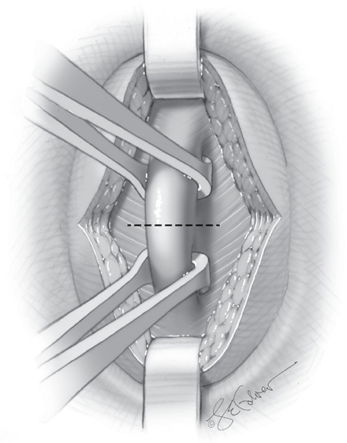
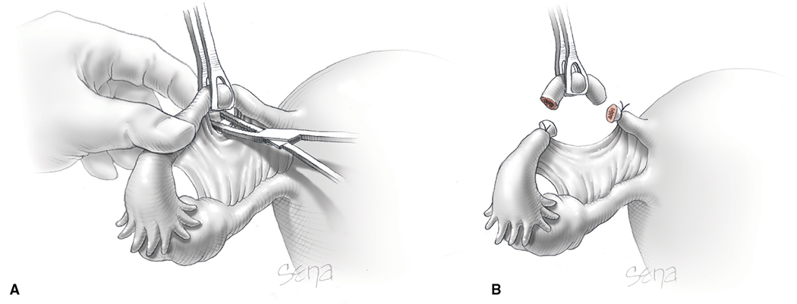
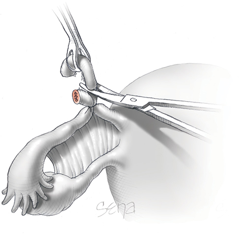
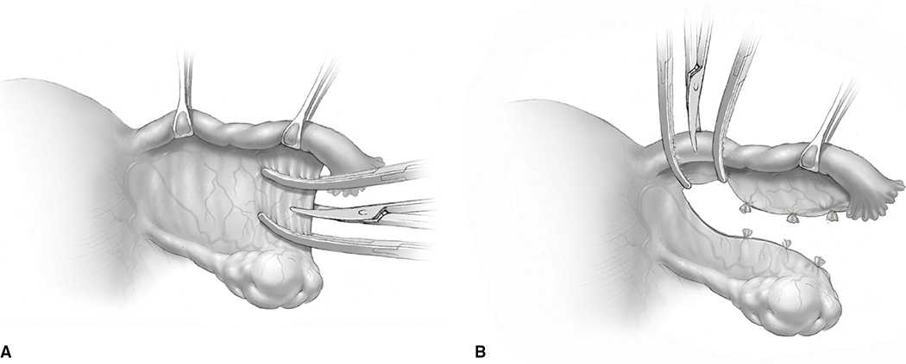
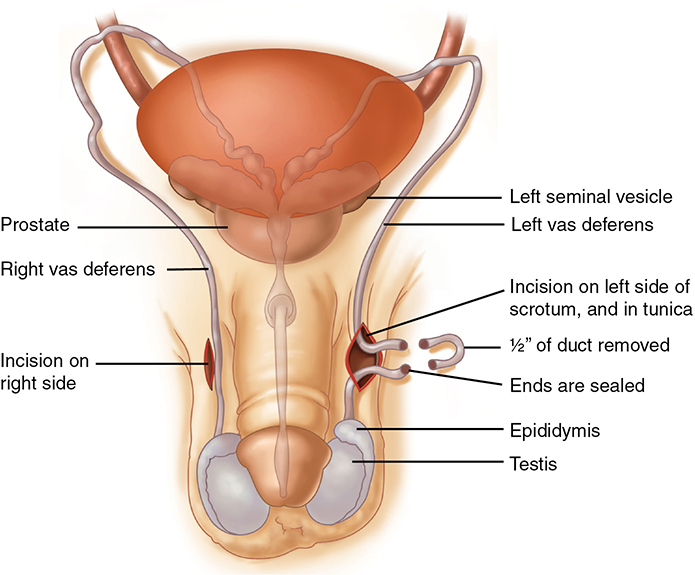

# Chapter 39: Sterilization — Revision Notes

> Williams Obstetrics 26e, pp. 1759–1776 of the PDF. High-yield numbers are in **bold**.
> This chapter has no tables. All 5 figures are included from the PDF.

**Big picture:** **28%** of US women using contraception rely on male or female sterilization. It is for women who **clearly understand its permanence** (reversal is difficult and often unsuccessful); alternatives must be offered, and after counseling **patient autonomy is respected**. Puerperal sterilization follows **~7% of US live births**. **Salpingectomy** is now recommended for consideration because it also lowers ovarian cancer risk. **Vasectomy is safer and more effective** than tubal sterilization.

---

## 1. Puerperal Tubal Sterilization

### Definitions
- **Puerperal** sterilization = done after cesarean or vaginal delivery.
- **Nonpuerperal (interval)** sterilization = done at a time unrelated to recent pregnancy.
- Methods: **occlusion, excision or division** of the fallopian tubes.

### Timing
- Several days postpartum the **fundus is at the umbilicus** and the tubes lie directly beneath the abdominal wall; abdominal laxity lets the incision be moved over each cornu.
- Parkland practice: surgery the **morning after delivery** by a dedicated team.
  - Minimizes hospital stay, lowers the chance that **postpartum hemorrhage** complicates recovery, and lets the **newborn's status** be confirmed first.
- Alternative: operate **immediately after delivery**, using the labor **neuraxial catheter**.
- Designating postpartum sterilization as **nonelective** lessens access barriers (busy units prioritize OR time for intrapartum cases).
- Postpartum tubal ligation is safe **regardless of BMI**.

### Method selection
- Standard: excise a **midtubal segment**; the cut ends seal by **fibrosis and peritoneal regrowth**.
- Common methods: **Parkland, Pomeroy, modified Pomeroy**.
- **Filshie clips**: used less often, with **slightly lower efficacy**.
- **Hysterectomy solely for sterilization** is hard to justify: much higher surgical morbidity.

### Salpingectomy and ovarian cancer
- Most **pelvic serous cancers arise from the distal fallopian tube**.
- **SGO and ACOG** recommend considering salpingectomy. For women at **average risk** of ovarian cancer, discuss risk-reducing salpingectomy with abdominopelvic surgery, with hysterectomy, or **in lieu of tubal ligation**.

| Point | Figure |
|---|---|
| Lifetime ovarian cancer risk | **~1%** |
| Tubal interruption alone | **~30% ↓** ovarian cancer |
| Salpingectomy | **42–78% ↓** |
| Ovarian reserve (AMH) | **No difference** vs tubal ligation (small studies) |
| Extra operating time at cesarean | **5–10 min** longer than partial salpingectomy |
| Blood loss | Comparable or slightly higher; **no ↑ transfusion** or hematocrit fall |

- Caveats: no adequately sized prospective studies in low-risk women; few data on ovarian reserve; only small studies after **vaginal delivery**.

### Technique

**Anesthesia and preparation**
- **Spinal** analgesia for cases on postpartum day 1. **General anesthesia less desirable** (residual aspiration risk).
- Near delivery, reuse the **labor epidural catheter**.
- Thrombocytopenia: platelets **>70,000/µL** for spinal blockade.
- **Empty the bladder**: avoids laceration, and a full bladder pushes the fundus and tubes above the umbilicus.
- **Clean case → no antibiotic prophylaxis.**

**Incision: infraumbilical**
- Why infraumbilical:
  1. The fundus lies near the umbilicus.
  2. The umbilicus is the **thinnest** part of the anterior abdominal wall (less dissection to the linea alba).
  3. The fascia there is strong → low **incisional hernia** risk.
  4. Good cosmesis in the lower umbilical skin fold.
- Skin incision **2–3 cm** (transverse or vertical); **4–5 cm** in obese women.
- Bluntly separate subcutaneous fat (Allis clamp opened/closed, or two army-navy retractors pulling in opposite directions) so the fascia is clean for incision and closure.
- Fascial incision follows the skin orientation. Grasp the linea alba with **two Allis clamps**, one each side of the planned incision (Fig 39-1); the peritoneum is often entered at the same time. Extend with curved Mayo scissors if too small.

*Figure 39-1. Linea alba fascia lifted between two Allis clamps away from the viscera; dashed line = planned fascial incision.*

**Exposure**
- Army-navy or appendiceal retractors; narrower, deeper retractors and a larger incision if obese.
- **Trendelenburg** displaces bowel/omentum cephalad.
- A single moist fanned-out gauze can pack bowel, but **always clamp a hemostat to its end** (avoid retained sponge).
- Tilt the table away from the side being exposed.

**Identifying the tube**
- Grasp the tube at its **midportion with a Babcock**, then a second clamp more distally, and follow it until the **fimbriated end is seen**.
- ⚠️ A common cause of failure is ligating the **wrong structure, usually the round ligament**.
- If the tube is dropped, the **identification must be repeated**.

### Ligation methods

| Method | Steps | Key point |
|---|---|---|
| **Parkland** | Perforate an avascular site of mesosalpinx with a small hemostat; open the jaws to free **~2.5 cm** of tube. Ligate proximally and distally with **0-chromic**; excise the **~2-cm** segment between; check hemostasis. | Designed to avoid the close contact of cut ends that occurs with Pomeroy |
| **Pomeroy** | Midsegment tubal **loop** tied at its base; loop excised. | **Plain catgut** → rapid absorption so the severed ends **separate** |
| **Total salpingectomy** | Mesosalpinx sequentially **clamped, cut and ligated**; clamps across tube and mesosalpinx at the **cornu** before transection. | Needs a **larger** umbilical incision; risk of bleeding from large congested mesosalpingeal veins (may need extension or adnexectomy). Bipolar sealing devices (**LigaSure, ENSEAL**) are faster but cost more. |

*Figure 39-2. Parkland method: (A) hemostat opens an avascular window in the mesosalpinx; (B) ~2-cm segment excised between two 0-chromic ties.*

*Figure 39-3. Pomeroy method: a midsegment loop is tied with plain catgut and excised; absorption lets the ends pull apart.*

*Figure 39-4. Salpingectomy: (A) mesosalpinx clamped, cut and ligated in sequence; (B) clamps placed at the cornu before transecting the tube.*

### Postoperative care
- Diet as tolerated; early walking.
- **Ileus is infrequent → suspect bowel injury** (rare).
- Most women go home on **postoperative day 1**.

---

## 2. Nonpuerperal (Interval) Tubal Sterilization
- Three approaches:
  1. **Ligation and resection** at laparotomy (as for puerperal).
  2. **Rings, clips or inserts** placed laparoscopically or hysteroscopically.
  3. **Electrocoagulation** of a tubal segment, usually laparoscopic.
- **Laparoscopy is the most common US approach**: ambulatory, usually **general anesthesia**, home within hours.
- **Minilaparotomy** (**3-cm suprapubic** incision): popular in resource-poor countries.
- Major morbidity is **rare** with either.
- Rarely: **colpotomy** through the posterior vaginal fornix.

---

## 3. Long-Term Complications

### Contraceptive failure (CREST study, 10,863 women, 1978–1986)
- **Cumulative failure 18.5 per 1000 (~0.5%)** across all tubal methods.
- Puerperal sterilization is highly effective: **5 per 1000 at 5 yr, 7 per 1000 at 12 yr**.
- **Two reasons puerperal sterilization fails:**
  1. **Surgical error**: transecting the **round ligament** or only part of the tube → **send both tubal segments for pathology**.
  2. **Fistula or spontaneous reanastomosis** between the stumps.
- **Ectopic pregnancy:** **~30%** of pregnancies after failed tubal sterilization; **20%** after a postpartum procedure.

> **Pearl:** any pregnancy symptoms after tubal sterilization → **exclude ectopic pregnancy**.

### Other effects
- **Salpingitis** afterward is **highly unlikely**.
- Heavy or intermenstrual bleeding is **not increased** (most studies).
- Sexual interest/pleasure **unchanged in 80%**; of the 20% reporting change, **positive changes were 10–15× more likely**.
- **Regret**: more common when sterilized at a **younger age**.
  - **7%** of women regretted tubal ligation by **5 years** (CREST).
  - **6.1%** of women whose husbands had a vasectomy had similar regret.

### Tubal sterilization reversal
- Neither reversal surgery nor ART guarantees later fertility: difficult, expensive, not always successful.
- **Better pregnancy rates with:** **≥7 cm of remaining tube**, age **<35 yr**, **short interval** since sterilization, **isthmic–isthmic** repair.

| Reversal | Outcome |
|---|---|
| Reanastomosis via laparotomy | Live births **44–82%** |
| Ectopic rate after reanastomosis | **2–10%** |
| Reversal of Essure | Live births **0–27%** |

---

## 4. Transcervical Sterilization
- Hysteroscopic device placed into the **proximal tubes** via the ostia. **No transcervical method is currently approved in the US.**
- **Essure** and **Adiana** have both been **withdrawn from the US market**.

| Device | Description | Notes |
|---|---|---|
| **Adiana** | Cylindrical nonabsorbable **silicone elastomer** matrix | Stimulates tissue ingrowth → occlusion |
| **Essure** | Long, slender, coiled **metallic** insert | **Fibroblastic proliferation** → occlusion. Failure **<1% to 5%** |

**Essure adverse effects**
- **Chronic pelvic pain in 2–6%**: from tubal perforation, device migration, or the device itself.
- Removal: **proximal linear salpingostomy**; ⚠️ removal does **not** cure every symptomatic patient.
- Also abnormal bleeding and **allergy/hypersensitivity** to device components.

**Chemical occlusion: quinacrine**
- Pellets placed in the uterine fundus with an IUD-type inserter; inflammation occludes the tubes.
- Pregnancy rates **1% at 1 yr, 12% at 10 yr**.
- **WHO recommends against** it (carcinogenesis concerns). Some still consider it for resource-poor countries.

---

## 5. Vasectomy
- Up to **half a million US men** per year; **5% of women** rely on it.
- The **vas deferens lumen** is disrupted so sperm cannot pass from the testes.

*Figure 39-5. Vasectomy: scrotal incision on each side, about ½ inch of vas deferens removed, and the ends sealed.*

### Vasectomy vs tubal sterilization
- Vasectomy is **safer**: less invasive, done under **local analgesia**.
- Tubal sterilization has a **20-fold higher complication rate** and a **10- to 37-fold higher failure rate**.
- ⚠️ **Not immediately effective:** stored sperm take **~3 months or 20 ejaculations** to clear.
- **AUA: semen analysis at 8–16 weeks** to document sterility; use **other contraception until azoospermia** is confirmed.

### Failure
- **9.4 per 1000** in the 1st year; **11.4 per 1000** cumulative at 2, 3 and 5 years.
- Causes: **intercourse too soon** after ligation, **incomplete occlusion**, **recanalization**.
- Reversal is best done **microsurgically**. Conception after reversal is worse with **longer time since vasectomy**, **poor sperm quality** at reversal, and the **type of reversal** needed.

---

## Quick-Recall: Sterilization Methods Compared

| Method | Setting | Failure / efficacy | Key risk or point |
|---|---|---|---|
| Parkland / Pomeroy (partial salpingectomy) | Puerperal, infraumbilical minilaparotomy | **5/1000 at 5 yr, 7/1000 at 12 yr** | Ligating the round ligament; ~20% of failures ectopic |
| Filshie clip | Puerperal or interval | Slightly less effective | — |
| Total salpingectomy | At cesarean, or instead of ligation | Sterilization + **42–78% ↓ ovarian cancer** | 5–10 min longer; mesosalpinx bleeding |
| Laparoscopic (rings, clips, coagulation) | Interval, ambulatory | CREST overall **18.5/1000** | General anesthesia |
| Essure (withdrawn) | Hysteroscopic | **<1–5%** | Chronic pelvic pain **2–6%** |
| Quinacrine | Resource-poor settings | **1% (1 yr), 12% (10 yr)** | WHO advises against (carcinogenesis) |
| Vasectomy | Office, local analgesia | **9.4/1000** yr 1; **11.4/1000** at 5 yr | Not immediate: **3 mo / 20 ejaculations**; semen analysis **8–16 wk** |

## Key Numbers to Memorize
- **28%** of US contraceptive users rely on sterilization; puerperal sterilization after **~7%** of live births; vasectomy relied on by **5%** of women
- Skin incision **2–3 cm** (obese **4–5 cm**); platelets **>70,000** for spinal; no antibiotic prophylaxis
- Parkland: free **2.5 cm**, excise **2 cm**, **0-chromic**; Pomeroy: **plain catgut**
- Ovarian cancer lifetime risk **~1%**; tubal ligation **↓30%**; salpingectomy **↓42–78%**
- CREST cumulative failure **18.5/1000 (~0.5%)**; puerperal **5/1000 (5 yr), 7/1000 (12 yr)**
- Ectopic: **30%** of failures overall, **20%** after postpartum procedures
- Regret **7%** at 5 yr; sexual function unchanged in **80%**
- Reversal: **≥7 cm** tube, age **<35**; live births **44–82%**; ectopic **2–10%**; Essure reversal **0–27%**
- Essure pelvic pain **2–6%**; Essure failure **<1–5%**
- Vasectomy: tubal sterilization has **20×** complications and **10–37×** failures; azoospermia after **3 mo / 20 ejaculations**; semen analysis at **8–16 wk**
