# Chapter 40: Preeclampsia Syndrome — Revision Notes

> Williams Obstetrics 26e, pp. 1777–1839 of the PDF. High-yield numbers are in **bold**.
> The four tables are transcribed from the PDF images (they are missing from the extracted chapter text). All 14 figures are included from the PDF.

**Big picture:** Hypertensive disorders complicate **up to 10%** of pregnancies and are one of the **deadly triad** (with hemorrhage and infection). Preeclampsia, alone or superimposed on chronic hypertension, is the most dangerous: **7%** of US pregnancy-related deaths (2011–2015), and most are **preventable**. It is a **two-stage disorder**: faulty trophoblastic remodeling of spiral arterioles (placental syndrome) → systemic **endothelial cell activation** (maternal syndrome) → vasospasm, capillary leak, and ischemic/thrombotic organ damage.

---

## 1. Terminology and Diagnosis

### ACOG classification: four types of hypertensive disease
1. **Preeclampsia and eclampsia syndrome**
2. **Chronic hypertension** of any etiology
3. **Preeclampsia superimposed on chronic hypertension**
4. **Gestational hypertension**: no definitive preeclampsia, and BP **resolves by 12 wk postpartum**

### Diagnosing hypertension
- **Systolic ≥140 and/or diastolic ≥90 mm Hg**; diastolic = **Korotkoff phase V**.
- The old criteria (**rise of 30 systolic / 15 diastolic** above midpregnancy values) are **no longer used**, but surveillance is reasonable: some women have eclampsia with BP **<140/90**.
- **"Delta hypertension"** = a relatively acute rise in BP that still lies in the normal range. It may signal preeclampsia; some of these women develop eclampsia or HELLP.
- 140/90 dates from the 1950s and was chosen by **insurance companies for middle-aged men**; pregnancy-specific normal ranges are being developed.

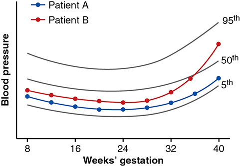

*Figure 40-1. "Delta hypertension": patient B rises from the 25th to the 75th percentile after ~36 wk yet is still "normotensive."*

### Gestational hypertension
- BP **≥140/90 for the first time after midpregnancy**, **without proteinuria**.
- **Almost half** go on to develop preeclampsia.
- ⚠️ **10% of eclamptic seizures occur before overt proteinuria** is detected → do not ignore a rising BP just because protein is absent.
- Called **transient hypertension** if preeclampsia never develops and BP normalizes by **12 wk postpartum**.

### Preeclampsia syndrome
- A **pregnancy-specific syndrome that can affect virtually every organ system**.
- Proteinuria remains a primary criterion: an objective marker of the **system-wide endothelial leak**. But some women have neither proteinuria nor FGR, so other criteria are accepted (Table 40-1).

| Onset category | Gestational age |
|---|---|
| Early onset | **<34 wk** |
| Late onset | **≥34 wk** |
| Preterm onset | **<37 wk** |
| Term onset | **≥37 wk** |

### Table 40-1. Classification and Diagnosis of Pregnancy-Associated Hypertension

| Condition | Criteria Required |
|---|---|
| **Gestational hypertension** | BP >140/90 mm Hg after 20 weeks in previously normotensive women |
| **Preeclampsia: Hypertension plus** | |
| Proteinuria | **≥300 mg/24 h**, or urine protein:creatinine ratio **≥0.3**, or dipstick **1+ persistent**ᵃ |
| | ***or*** |
| Thrombocytopenia | Platelets **<100,000/µL** |
| Renal insufficiency | Creatinine **>1.1 mg/dL** or **doubling of baseline**ᵇ |
| Liver involvement | Serum transaminase levelsᶜ **twice normal** |
| Cerebral symptoms | Headache, visual disturbances, convulsions |
| Pulmonary edema | — |

*ᵃRecommended only if sole available test. ᵇNo prior renal disease. ᶜAspartate transaminase (AST) or alanine transaminase (ALT). BP = blood pressure.*

*The table prints ">140/90"; the text defines hypertension as 140/90 "or greater", which is the standard ACOG threshold.*

### Severity
- The Task Force **discourages "mild preeclampsia"**; there is no consensus "moderate" category. Parkland uses **"severe" vs "nonsevere"** (ACOG 2020).
- **Ominous symptoms:**
  - **Headache or visual disturbance** → may precede eclampsia.
  - **Eclampsia** = a convulsion in a woman with preeclampsia not attributable to another cause. Generalized; before, during or after labor. **~10% occur >48 h postpartum.**
  - **Epigastric/RUQ pain** → hepatocellular necrosis, ischemia and edema (↑ transaminases).
  - **Thrombocytopenia** → worsening disease (platelet activation/aggregation, microangiopathic hemolysis).
- Profound signs usually cannot be temporized → delivery. ⚠️ Apparently mild disease can **progress rapidly** to severe.

### Table 40-2. Indicators of Severity of Gestational Hypertensive Disordersᵃ

| Abnormality | Nonsevereᵇ | Severe |
|---|---|---|
| Diastolic BP | <110 mm Hg | **≥110 mm Hg** |
| Systolic BP | <160 mm Hg | **≥160 mm Hg** |
| Proteinuriaᶜ | None to positive | None to positive |
| Headache | Absent | **Present** |
| Visual disturbances | Absent | **Present** |
| Upper abdominal pain | Absent | **Present** |
| Oliguria | Absent | **Present** |
| Convulsion (eclampsia) | Absent | **Present** |
| Serum creatinine | Normal | **Elevated** |
| Thrombocytopenia (<100,000/µL) | Absent | **Present** |
| Serum transaminase elevation | Minimal | **Marked** |
| Fetal-growth restriction | Absent | **Present** |
| Pulmonary edema | Absent | **Present** |
| Gestational age | Late | **Early** |

*ᵃCompare with criteria in Table 40-1. ᵇIncludes "mild" and "moderate" hypertension not specifically defined. ᶜMost disregard degrees of proteinuria to classify as nonsevere or severe. BP = blood pressure.*

> **Memory hook:** severe = "**160/110**, plus any symptom or organ": head, eyes, belly, kidneys (oliguria/creatinine), platelets, liver, lungs, fetus (FGR). **Proteinuria amount does not count.**

### Preeclampsia superimposed on chronic hypertension
- **Chronic hypertension** = BP **≥140/90 before pregnancy or before 20 wk**, or both.
- Hard to classify when first seen after midpregnancy: BP often falls into the normal range before 20 wk and returns to hypertensive levels in the 3rd trimester; many have no end-organ evidence.
- **20–50%** of women with chronic hypertension have a clear BP rise, typically **after 24 wk**.
- **Diagnosis:** new-onset or worsening hypertension **plus new proteinuria or other Table 40-1 findings**.
- Compared with "pure" preeclampsia: **earlier onset, more severe, more often FGR**.

---

## 2. Incidence and Risk Factors

- Preeclampsia in **5–8%** of all pregnancies.
  - **Nulliparas 3–10%**; **multiparas 2–5%**.
  - Young and nulliparous women are most vulnerable; older women more often have **chronic hypertension with superimposed preeclampsia**.
- MFMU nulliparas: **5% white, 9% Hispanic, 11% African American**. Black women also have more severe adverse outcomes.
- Other risks: prior preeclampsia (**especially HELLP**), metabolic syndrome, hyperhomocysteinemia, chronic kidney disease.
- Lesser risks: **HIV**, **sleep-disordered breathing**, **male fetus**, affected family members, maternal and fetal genetics, **mirror syndrome**.
- ⚠️ **Smoking paradoxically lowers** the risk of hypertension in pregnancy.

### Table 40-3. Selected Clinical Risk Factors for Preeclampsia

| Risk Factor | Pooled Unadjusted Relative Riskᵃ |
|---|---|
| Nulliparity | 2.1 (1.9–2.4) |
| Age >35 | 1.2 (1.1–1.3) |
| BMI >30 | 2.8 (2.6–3.1) |
| Multifetal gestation | 2.9 (2.6–3.1) |
| Prior abruption | 2.0 (1.4–2.7) |
| Diabetes | 3.7 (3.1–4.3) |
| **Prior preeclampsia** | **8.4 (7.1–9.9)** |
| **CHTN** | **5.1 (4.0–6.5)** |
| Prior stillbirth | 2.4 (1.7–3.4) |
| Chronic kidney disease | 1.8 (1.5–2.1) |
| ART | 1.8 (1.6–2.1) |
| SLE | 2.5 (1.0–6.3) |
| APA | 2.8 (1.8–4.3) |

*ᵃ95% confidence interval. APA = antiphospholipid antibody; ART = assisted reproductive technology; BMI = body mass index; CHTN = chronic hypertension; SLE = systemic lupus erythematosus. Data from >25 million pregnancies (Bartsch, 2016).*

### Eclampsia incidence
- In well-resourced countries **1 in 2000–3000 deliveries**; falls where care is accessible.
- Parkland: ~**1 in 2000 births** now, attributed to prenatal care access and active management.

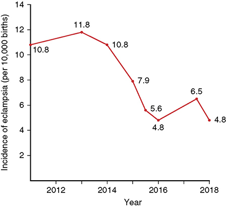

*Figure 40-2. Eclampsia at Parkland fell from 10.8–11.8 to ~4.8 per 10,000 births (2011–2018).*

---

## 3. Etiopathogenesis

### Who gets it? Any theory must explain higher risk with:
- **First exposure to chorionic villi** (nulliparity)
- A **superabundance of villi**: twins, hydatidiform mole
- Preexisting **endothelial activation or inflammation**
- **Genetic predisposition**

- ⚠️ **A fetus is not required**; villi are essential but need not be intrauterine (e.g., advanced abdominal pregnancy).
- Final common pathway: **endothelial damage → vasospasm → plasma transudation → ischemic and thrombotic sequelae**.

### Two-stage disorder (Redman)
- **Stage I (placental syndrome):** faulty endovascular trophoblastic remodeling of spiral arterioles.
- **Stage II (maternal syndrome):** systemic inflammatory response and endothelial activation. It is **modified by maternal conditions** with endothelial activation: chronic hypertension, renal disease, obesity, immunological/connective tissue disorders, diabetes.
- Staging is artificial: a spectrum, likely with "isoforms" (early vs late onset, different placental and genetic findings).

**Proposed primary mechanisms**
- Abnormal trophoblastic invasion of uterine vessels
- Dysfunctional **immunological tolerance** between maternal, paternal (placental) and fetal tissues
- Maternal **maladaptation** to the cardiovascular or inflammatory changes of pregnancy
- **Genetic** factors and epigenetic influences

### Stage I: placental syndrome
- **Normal:** endovascular trophoblasts **replace the endothelial and muscular lining** of spiral arterioles in the decidua basalis → wide, low-resistance vessels. Veins are invaded only superficially.
- **Preeclampsia (some cases):** invasion reaches **decidual but not myometrial** vessels. Myometrial arterioles keep their endothelium and musculoelastic tissue → **mean external diameter only half** of normal. More prevalent in **early-onset** disease. Soluble antiangiogenic factors likely play a role.
- Early placental changes: endothelial damage, insudation of plasma into vessel walls, myointimal proliferation, medial necrosis.
- **Atherosis** (Hertig) = **lipid-laden myointimal cells and macrophages**. More common with preeclampsia **<34 wk**; may mark women at risk of later **cardiovascular disease**.
- Narrow lumens → reduced perfusion, **hypoxia** → systemic inflammatory response (stage II).
- Defective placentation also predisposes to gestational hypertension, **preterm delivery, FGR and abruption**.

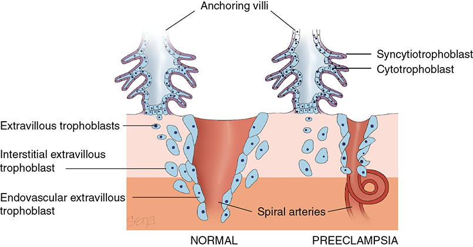

*Figure 40-3. Normal: endovascular extravillous trophoblast converts spiral arteries into wide, low-resistance vessels. Preeclampsia: shallow invasion leaves narrow, high-resistance arteries.*

**Immunological factors**
- Loss of maternal tolerance to paternal antigens; placental histology resembles **acute graft rejection**.
- **More paternal antigen → more risk:**
  - **Complete mole** (all-paternal diploid) → early-onset preeclampsia with later-stage moles.
  - **Trisomy 13: 30–40% incidence**; the **sFlt-1 gene is on chromosome 13**.
- Prior pregnancy with the **same partner** may be "immunizing"; a **new partner raises risk**.
- Reduced **HLA-G** (immunosuppressive) on extravillous trophoblast early in affected pregnancies. The **1597∆C** allele (more common in Black women) causes incomplete HLA-G expression.
- Normal pregnancy has a **Th2 bias**; in women who develop preeclampsia, **Th1 activity rises from the early 2nd trimester**.

**Genetic factors**
- **Multifactorial, polygenic**; hundreds of maternal and paternal genes; fetal genes also contribute. No single gene will explain it.

| Relative of affected woman | Incident risk of preeclampsia |
|---|---|
| Daughters | **20–40%** |
| Sisters | **11–37%** |
| Twins | **22–47%** |

- Latina women have a lower incidence (interaction of American Indian and white genes).

### Stage II: maternal syndrome

**Endothelial cell activation** (centerpiece of pathogenesis)
- Placental antiangiogenic and metabolic factors and activated leukocytes → cytokines (**TNF-α, interleukins**) → **oxidative stress** (toxic oxygen radicals).
- Consequences:
  - ↓ **nitric oxide**, disturbed prostaglandin balance
  - **Foam cells** (placental atherosis)
  - Microvascular coagulation → **thrombocytopenia**
  - ↑ capillary permeability → **edema and proteinuria**
- Intact endothelium is anticoagulant and blunts smooth-muscle responses (NO); injured endothelium promotes **coagulation and vasopressor sensitivity**.

**Vasospasm and hypertension**
- Endothelial activation → **vasospasm** → ↑ resistance → hypertension.
- Leak into interstitium; **platelets and fibrinogen deposited subendothelially**; junctional proteins disrupted. Veins are involved too.
- Maldistribution + leak → tissue **ischemia, necrosis, hemorrhage**.
- Clinical correlate: **markedly reduced blood volume** in severe preeclampsia.

**Increased pressor responses**
- Normal pregnancy = **refractoriness to infused vasopressors**. Early preeclampsia = **enhanced reactivity to norepinephrine and angiotensin II**; ↑ angiotensin II sensitivity **precedes** gestational hypertension.
- Paradox: women with preterm preeclampsia have **lower circulating angiotensin II**.

| Mediator | Change in preeclampsia | Effect |
|---|---|---|
| **Prostacyclin (PGI₂)** (endothelial) | **↓** (via phospholipase A₂) | Loss of vasodilation |
| **Thromboxane A₂** (platelets) | **↑** | ↓ PGI₂:TXA₂ ratio → vasoconstriction, AII sensitivity. Seen from **22 wk** |
| **Nitric oxide** (from L-arginine) | ↓ eNOS expression → ↓ activity | NO keeps fetoplacental bed dilated; mediates PlGF/VEGF effects |
| **Endothelin-1** (21-amino-acid vasoconstrictor) | **↑** (already ↑ in normal pregnancy) | May mediate renal injury. **MgSO₄ lowers ET-1**; sildenafil lowers it in animals |
| Autoantibodies | Functional antibodies to **endothelin and angiotensin II receptors** | — |

**Angiogenic and antiangiogenic factors**
- Placental vasculogenesis by **21 days** after conception. VEGF and angiopoietin families are most studied.
- **Angiogenic imbalance** = excess antiangiogenic factors, driven by worsening uteroplacental **hypoxia**.
- **sFlt-1** = soluble VEGF receptor variant → binds and **lowers free PlGF and VEGF** → endothelial dysfunction.
  - Rises **months before** clinical disease, earlier with early-onset disease; high 2nd-trimester levels → much higher risk. Also seen in **FGR**.
- **sEng (soluble endoglin)** → blocks **TGF-β** binding to endothelial receptors (endoglin) → ↓ NO-dependent vasodilation. Also rises months before disease.
- **Both ↑ together → more severe disease.** Doubling of sFlt-1 / sEng raises risk by **39% / 74%**.
- ↑ sFlt-1 and ↓ PlGF in the 3rd trimester correlate with preeclampsia after **25 wk**.
- Levels are **not raised in fetal blood or amnionic fluid** and **dissipate after delivery**. Therapeutic **apheresis** of sFlt-1 is preliminary.

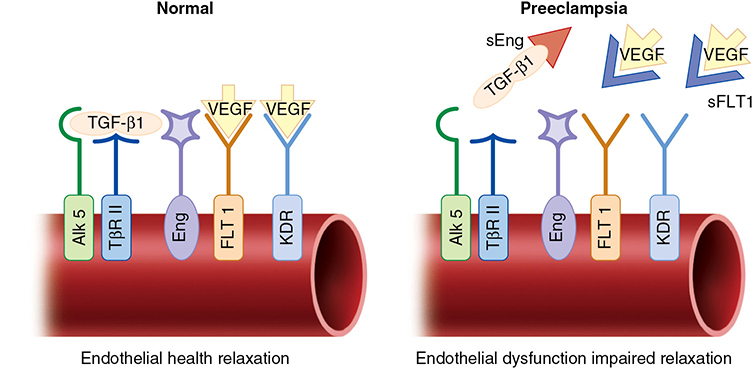

*Figure 40-4. sFlt-1 mops up VEGF (and PlGF) and sEng mops up TGF-β1, so endothelial receptors (FLT1, KDR, endoglin) go unstimulated → impaired relaxation.*

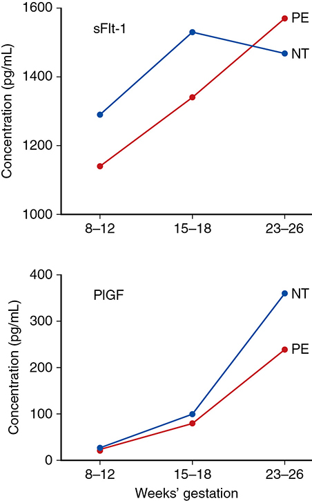

*Figure 40-5. sFlt-1 rises and PlGF lags in women who develop preeclampsia; the curves diverge significantly by 23–26 wk.*

---

## 4. Pathophysiology

### Cardiovascular system
- Three drivers:
  1. ↑ **afterload** from hypertension
  2. **Preload**: ↓ by pathologically curtailed volume expansion, ↑ by IV crystalloid or oncotic fluids
  3. **Endothelial leak** of intravascular fluid into the extracellular space
- With clinical onset, **cardiac output falls**, partly from ↑ peripheral resistance. Some changes precede hypertension.

**Myocardial function**
- **Diastolic dysfunction in up to 45%** (ventricles relax and fill poorly). May persist **up to 4 yr** postpartum.
- Cause: maladaptive **ventricular remodeling** to the ↑ afterload; antiangiogenic proteins may contribute.
- Usually inconsequential, but with preexisting dysfunction (e.g., **concentric LVH from chronic hypertension**) → **cardiogenic pulmonary edema**.

**Ventricular function**
- Clinical cardiac function is **usually appropriate**, often **slightly hyperdynamic**. Troponin may be slightly ↑; **NT-pro-BNP ↑** in severe disease.
- ⚠️ **Aggressive IV hydration** → overtly hyperdynamic function, **↑ PCWP**, and **pulmonary edema despite normal ventricular function**. Worsened by alveolar endothelial-epithelial leak and **low albumin (↓ oncotic pressure)**.

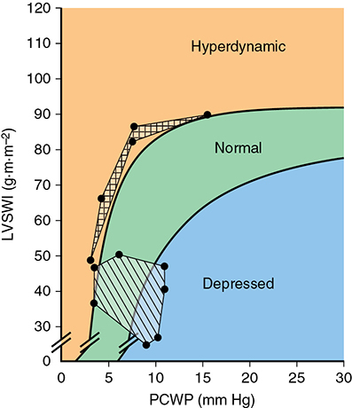

*Figure 40-6. Braunwald curve: eclamptic women (boxed area) sit at the hyperdynamic edge of normal, with low PCWP; normal pregnancy (striped area) sits in the normal zone.*

### Blood volume
- **Hemoconcentration is a hallmark of eclampsia.**
- Nonpregnant average **3000 mL** → normal late pregnancy **4500 mL**. In eclampsia, **much or all of the expected 1500 mL excess is lost** (vasospasm + plasma leak). Less marked in preeclampsia, depending on severity.
- ⚠️ Such women are **unduly sensitive to "normal" delivery blood loss**.
- After delivery, vasoconstriction reverses and volume re-expands → hematocrit falls by dilution. But **delivery blood loss** is often a substantive cause of that fall.

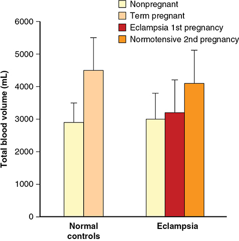

*Figure 40-7. Blood volume barely rises in eclampsia (~3000 → ~3200 mL) versus ~4500 mL at term in normal pregnancy and ~4100 mL in the same women's next, normotensive pregnancy.*

### Hematological changes

**Thrombocytopenia**
- Check platelets in **any** gestational hypertension. Severity and duration of preeclampsia determine it.
- **<100,000/µL = severe disease**; the lower the count, the higher the maternal and fetal morbidity and mortality. Usually worsens → **delivery advisable**.
- After delivery: may fall for **~1 day**, then normalizes within **3–5 days**.
  - With HELLP it may keep falling; a nadir delayed to **48–72 h** can be wrongly attributed to a **thrombotic microangiopathy**.
- Platelet activation and ↑ α-degranulation (β-thromboglobulin, factor 4 release) → faster clearance; **↑ platelet volume** (young platelets).
- Paradoxically **↓ in-vitro aggregation** ("exhaustion" after in-vivo activation). ↑ platelet-bound immunoglobulins.
- ⚠️ **The fetus does not become thrombocytopenic** → maternal thrombocytopenia is **not a fetal indication for cesarean**.

**Hemolysis**
- Frequent in severe preeclampsia: **↑ LDH, ↓ haptoglobin**; schizocytes, spherocytes, reticulocytosis; **↑ RDW**.
- Mechanism: **microangiopathic hemolysis** (endothelial disruption, platelet adherence, fibrin deposition) ± serum lipid changes (↓ long-chain fatty acids in RBCs).
- Hemolysis + thrombocytopenia + ↑ transaminases (hepatocellular necrosis) = **HELLP** (Weinstein, 1982).

**Coagulation**
- Subtle intravascular coagulation: ↑ factor VIII consumption, ↑ fibrinopeptides A and B and **D-dimer**, ↓ **antithrombin III, proteins C and S**.
- Usually mild and seldom significant. **Fibrinogen is not remarkably different** unless **abruption** coexists. TEG worsens as disease worsens.
- **Routine PT, aPTT and fibrinogen are NOT required** in hypertensive disorders.

### Endocrine changes
- Renin, angiotensin II, aldosterone, DOC and **ANP** rise in normal pregnancy; **ANP (and pro-ANP) rise further in preeclampsia**.
- **Vasopressin**: levels similar in nonpregnant, pregnant and preeclamptic women (clearance ↑ in the latter two).

### Fluid and electrolytes
- **Extracellular fluid (edema) much greater** in severe preeclampsia: endothelial injury + **↓ plasma oncotic pressure**.
- Electrolytes are **not appreciably different**.
- After an eclamptic convulsion: **↓ pH and HCO₃⁻** from **lactic (metabolic) acidosis** plus respiratory acidosis; severity depends on lactate produced and CO₂ exhaled.

### Kidney
- Renal perfusion and **GFR slightly ↓** (reversible), mostly from **afferent arteriolar resistance up to 5×**.
- **Glomerular endotheliosis** blocks filtration → **creatinine rises to nonpregnant values (~1 mg/dL)** or higher.
- **Uric acid ↑** beyond what the GFR explains (↑ tubular reabsorption). **Urinary calcium ↓.**

*The text prints creatinine "1 mg/mL"; the intended unit is mg/dL.*

**Proteinuria**

| Test | Abnormal threshold |
|---|---|
| 24-h urine | **≥300 mg/24 h** (consensus) |
| 12-h urine | **165 mg** (equivalent efficacy) |
| Spot urine protein:creatinine ratio | **≥0.3** |
| Dipstick (random) | **30 mg/dL (1+) persistent** |

- **Nephrotic-range or worsening proteinuria is NOT a sign of severe disease.**
- P:C ratio **<0.13–0.15** (130–150 mg/g) → proteinuria >300 mg/d unlikely.
- P:C **<0.08** NPV **86%**; **>1.19** PPV **96%**. **Midrange (~0.3) ratios are poor** → repeat, and consider a 24-h collection if persistent.
- **Dipstick** depends on urine concentration: concentrated urine may read 1+ to 2+ with <300 mg/d. Notorious false positives and negatives.
- ⚠️ Proteinuria can appear **late**: absent in **10–15% of HELLP** at presentation and in **17% of eclampsia** at the time of seizures.

**Anatomy (glomerular capillary endotheliosis)**
- Glomeruli **~20% enlarged**, **"bloodless"**; capillary loops dilated or contracted.
- **Swollen endothelial cells** block or partly block capillary lumens; homogeneous **subendothelial protein and fibrin-like deposits**.
- Cause: **angiogenic protein "withdrawal"** (VEGF/PlGF bound by sFlt-1) → podocyte dysfunction and endothelial swelling. **Podocyturia** ↑ in eclampsia.

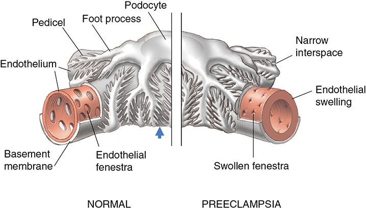

*Figure 40-8. Glomerular endotheliosis: swollen endothelium with narrowed fenestrae, and podocyte pedicels that abut one another.*

**Acute kidney injury**

| Group | AKI incidence |
|---|---|
| Preeclampsia syndrome | **5%** |
| HELLP syndrome | **14%** (5% in another series of 183) |
| Severe preeclampsia (Parkland) | **15%**, mostly **stage 1** |

- In preeclampsia with renal failure: **½ had HELLP, ⅓ had abruption**. In HELLP with AKI: half had abruption, most had PPH.
- Renal values begin to normalize **≥10 days** after delivery.
- **Clinically apparent ATN is almost always from comorbid hemorrhage** → hypovolemia and hypotension.
- Urine electrolytes: preeclampsia = **intrarenal** pattern (**urine Na ↑**). Prerenal = ↑ urine osmolality, ↑ urine:plasma creatinine, **low FENa**.
- ⚠️ **Oliguria is not treated with aggressive IV fluid** (risk of **pulmonary edema**) unless there is hemorrhage or loss from vomiting or fever. Crystalloid only improves output temporarily.
- Parkland switch from Ringer lactate to **normal saline** did not significantly impair renal function.

### Liver
- **Transaminitis** = hepatocellular injury and a **marker of severe preeclampsia**. Usually **<500 U/L** (reports **>2000 U/L**). Levels **inversely follow platelets**; both normalize within **~3 days** postpartum.
- Classic lesion: **periportal hemorrhage in the liver periphery**; some infarction with hemorrhage in **almost half** of eclamptic deaths.

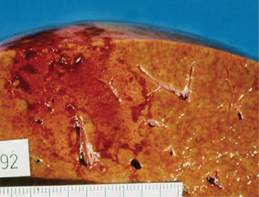

*Figure 40-9. Liver in fatal HELLP: areas of ischemia, infarction and periportal hemorrhage.*

**Clinical manifestations**
1. **Pain** (moderate–severe RUQ or midepigastric pain and tenderness) = **severe disease**, usually with ↑ AST/ALT.
2. Infarction may be extensive yet clinically silent (MRI: acute liver injury in **14 of 16** HELLP cases; volume correlated with AST). Frank infarction is unusual, worsened by **hemorrhage-related hypotension**; occasionally **"shock liver"** (hepatic failure).
3. **Hepatic hematoma** → **subcapsular hematoma** → may **rupture**.

**Hepatic hematoma**
- Diagnose with **CT or MRI**. Unruptured hematomas are more common than suspected, especially with HELLP.
- Management: usually **observation unless bleeding continues**; surgery or **angiographic embolization** may be lifesaving; rarely **liver transplant**.
- Review of 180 cases: **94% had HELLP**, **90% ruptured**; **maternal mortality 22%, perinatal mortality 31%**.

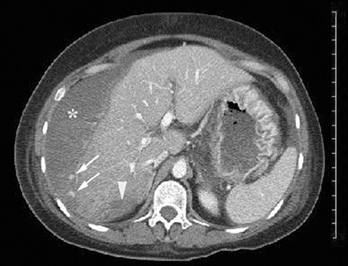

*Figure 40-10. CT in severe HELLP: large subcapsular hematoma (asterisk) confluent with intrahepatic infarction/hematoma (arrowhead).*

**Mimics**
- **Acute fatty liver of pregnancy**: also late pregnancy with hypertension, ↑ transaminases and creatinine, thrombocytopenia. **Hallmark = marked liver dysfunction**; overall liver function is **usually normal in HELLP**.
- **Pancreatitis**: not convincingly linked (**1%** in severe preeclampsia); lipase and amylase seldom ↑.

### HELLP syndrome
- **H**emolysis, **E**levated **L**iver enzymes, **L**ow **P**latelets. **No universally accepted definition**, so incidence varies. Worse outcomes than preeclampsia without HELLP; some postulate a **distinct pathogenesis**.

| Outcome (183 women) | Rate |
|---|---|
| Any adverse outcome | **40%** (2 maternal deaths) |
| Eclampsia | **6%** |
| Placental abruption | **10%** |
| AKI | **5%** |
| Pulmonary edema | **10%** |
| Others | Stroke, hepatic hematoma, coagulopathy, ARDS, sepsis |

- Concurrent eclampsia in **10%** (693 women).

| HELLP vs preeclampsia (Sep, 2009) | HELLP | Preeclampsia |
|---|---|---|
| Eclampsia | **15%** | 4% |
| Preterm birth | **93%** | 78% |
| Perinatal mortality | **9%** | 4% |

### Central nervous system

**Neuroanatomical lesions (autopsy)**
- Brain pathology caused only **~⅓ of fatal cases**; **most deaths were from pulmonary edema**.
- Gross intracerebral hemorrhage in **up to 60%** of eclamptic women, fatal in only **half** of these.
- Principal lesions: **cortical and subcortical petechial hemorrhages**. Classic microscopic lesion: **fibrinoid necrosis of the arterial wall** with perivascular microinfarcts and hemorrhages.
- Also nonhemorrhagic "softening," white-matter hemorrhage, subcortical edema, and **basal ganglia or pontine hemorrhage** that may rupture into the ventricles.

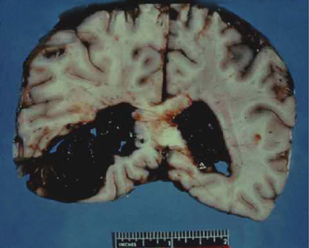

*Figure 40-11. Autopsy brain slice: fatal hypertensive hemorrhage rupturing into the ventricles in an eclamptic primigravida.*

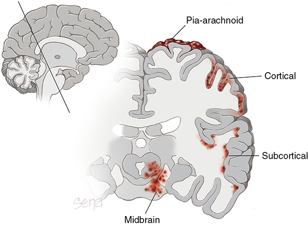

*Figure 40-12. Sites of hemorrhage and petechiae in eclampsia: pia-arachnoid, cortical, subcortical and midbrain.*

**Cerebrovascular pathophysiology: two theories (endothelial dysfunction in both)**

| Theory | Mechanism | Evidence |
|---|---|---|
| **Overregulation** | Acute severe hypertension → cerebral **vasospasm** → infarction | Little objective evidence |
| **Forced dilation (loss of autoregulation)** | Sudden BP rise **exceeds autoregulation** → forced vasodilation/constriction in **arterial boundary zones** → ↑ capillary hydrostatic pressure, hyperperfusion, leak through tight junctions → **vasogenic edema** | Supported |

- Most likely a **combination**: an endothelial leak at BP far **lower** than usually causes vasogenic edema, plus loss of upper-limit autoregulation.
- Result: **PRES (posterior reversible encephalopathy syndrome)**, mainly **occipital and parietal cortex**.

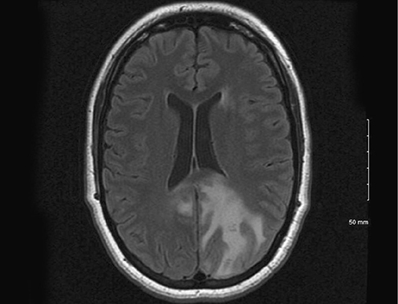

*Figure 40-13. T2-FLAIR MRI in eclampsia: occipital hyperintensity typical of PRES.*

**Cerebral blood flow**
- Nonpregnant autoregulation protects against hyperperfusion up to a **MAP of 160 mm Hg**, far above the pressures in most eclamptic women → autoregulation must be altered in preeclampsia (impaired autoregulation shown; normal again **2–3 yr** postpartum).
- Normal pregnancy: CBF unchanged in the first two trimesters, then **↓ 20% in the 3rd trimester**. **Severe preeclampsia: CBF higher** than in normotensive women.
- Synthesis: eclampsia = **cerebral hyperperfusion** forcing fluid into the interstitium through damaged endothelium → **perivascular edema**.

**Neurological manifestations (each = severe disease)**
- **Headache and scotomata** from occipital hyperperfusion. Before eclampsia: **headache in up to 75%**, **visual changes in 20–30%**.
  - The headache typically **does not respond to usual analgesics** but often **improves with magnesium sulfate**.
- **Convulsions are diagnostic of eclampsia.** Prolonged seizures can cause lasting brain injury.
- **Cognitive decline** 5–10 yr after eclampsia.

**Neuroimaging**
- **CT:** hypodense lesions at the **gray-white junction**, mainly **parietooccipital** (also frontal, inferior temporal, basal ganglia, thalamus) = petechial hemorrhage and edema. Diffuse edema → compressed ventricles, risk of **transtentorial herniation**.
- **MRI:** **T2 hyperintense** cortical/subcortical parietooccipital lesions = PRES (also basal ganglia, brainstem, cerebellum).
  - PRES is **almost universal in eclampsia** and in **~20% of severe preeclampsia**.
  - **~¼** of eclamptic lesions show **restricted diffusion = infarction** with persistent findings.

**Visual changes and blindness**
- ↓ retinal arteriolar and venular caliber + visual cortex involvement → scotomata, blurring, diplopia; improve with **MgSO₄ and/or BP lowering**.
- **Blindness:** rare with preeclampsia alone but in **up to 15% of eclampsia**; may start **≥1 week after delivery**; usually reversible.

| Site | Features |
|---|---|
| **Occipital visual cortex (amaurosis)** | Extensive occipital **vasogenic edema** on MRI. Parkland: lasted **4 h to 8 days**, **resolved completely in all 15** |
| Lateral geniculate nuclei | — |
| **Retina** | Ischemia, infarction (**Purtscher retinopathy**, rare) or **serous detachment** (usually unilateral, seldom total loss; asymptomatic detachment relatively common). **Retinal artery occlusion → may be permanent** |

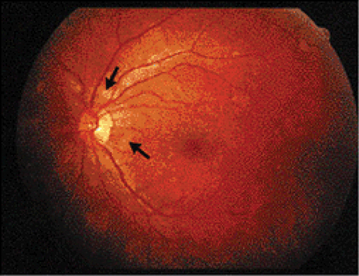

*Figure 40-14. Purtscher retinopathy: scattered yellowish opaque retinal lesions (arrows) from choroidal ischemia and infarction.*

**Cerebral edema**
- Parkland: **10 of 175** eclamptic women had symptomatic cerebral edema. Symptoms from lethargy, confusion and blurred vision to obtundation and coma, often waxing and waning.
- **3 became comatose** with transtentorial herniation; **1 died**. Mental status correlated with imaging.
- ⚠️ Very sensitive to sudden BP surges → **careful BP control is essential**.

### Uteroplacental perfusion
- Poor uteroplacental perfusion is a major cause of **perinatal morbidity and mortality**. Direct measurement is hard; **uterine artery Doppler** (systolic:diastolic waveforms) is the surrogate.
- Normally impedance falls markedly once placentation is complete; with abnormal placentation **high resistance persists**.
- **Uterine artery "notching"** → ↑ risk of preeclampsia or FGR, but **low predictive value except for early-onset severe disease** (MFMU).
- Only **⅓** of women with severe 3rd-trimester disease, and **⅓ with HELLP**, have abnormal uterine artery velocimetry.
- Abnormal waveforms correlate with **fetal** involvement → useful to predict **FGR, not preeclampsia**. No other waveform is clinically suitable.

**Fetal-growth restriction**
- A severity indicator; **usually confined to fetuses of women destined for severe preeclampsia**.
- FGR pregnancies share preeclampsia-like hemodynamics: ↑ MAP, ↑ SVR, ↓ cardiac output, ↑ uterine artery PI. Fetuses of preeclamptic mothers show **cardiac remodeling** like FGR fetuses.

---

## 5. Prediction
- Overall: **poor sensitivity and PPV**. **No screening test is reliable, valid and economical.** Multivariable algorithms (1st-trimester sFlt-1, midpregnancy) are **not verified for widespread use**.

| Test category | Examples | Performance |
|---|---|---|
| **Pressor tests** | **Roll-over test** (28–32 wk: left lateral → supine, BP rise = positive), **isometric handgrip**, **angiotensin II infusion** | Sensitivity **55–70%**, specificity **~85%**; cumbersome |
| Uterine artery Doppler | Resistance, notching | Poor for preeclampsia (better for FGR) |
| Fetal-placental endocrine analytes | Many serum analytes | **None clinically beneficial** |
| **Serum uric acid** | ↓ clearance (↓ GFR, ↑ reabsorption, ↓ secretion) | Sensitivity **0–55%**, specificity **77–95%**; seldom used |
| Microalbuminuria | Isolated gestational proteinuria is a risk factor | Sensitivity **7–90%**, specificity **29–97%** |
| Endothelial / oxidative | Fibronectin (not useful), **platelet volume** (early predictor), coagulation markers (overlap), lipid peroxides, iron/ferritin, resistin, homocysteine, lipids, vitamins C/E | **None sufficiently predictive** |
| **Angiogenic imbalance** | ↓ **VEGF, PlGF**; ↑ **sFlt-1, sEng** (and ratios) before disease | **Best, especially for early-onset** disease |
| Others | **cfDNA** (no correlation, MFMU), HbA1c, cystatin C, 1st-trimester placental volume, proteomics/metabolomics | Preliminary |

- **Angiogenic markers as diagnostic adjuncts:** help separate preeclampsia from **mimics** (chronic hypertension, CKD, SLE, immune thrombocytopenia) and **mild from severe** disease; likely future role in 1st-trimester screening.

---

## 6. Prevention
- **With the possible exception of aspirin, nothing is convincingly and reproducibly effective.**

### Table 40-4. Some Methods to Prevent Preeclampsia That Have Been Evaluated in Randomized Trials

| Category | Methods |
|---|---|
| Dietary manipulation | Low-salt diet, calcium or fish oil supplementation |
| Exercise | Physical activity, stretching |
| Cardiovascular drugs | Diuretics, antihypertensive drugs |
| Antioxidants | Ascorbic acid (vitamin C), α-tocopherol (vitamin E), vitamin D |
| Antithrombotic drugs | Low-dose aspirin, aspirin/dipyridamole, aspirin + heparin, aspirin + ketanserin |

*Modified from Jim, 2017; Staff, 2015.*

### Diet and lifestyle

| Intervention | Evidence |
|---|---|
| **Low-salt diet** | **Ineffective** (RCT) |
| **Exercise** | Linked to lower risk; few RCTs |
| Bed rest | Hospital bed rest RR **0.27** (cohort); home rest **4–6 h/d** helped in 2 small RCTs. **SMFM does not recommend reduced activity** |
| **Calcium** | No benefit in >4500 low-risk nulliparas; **benefit only if calcium deficient** |
| Iodine | No association with preeclampsia (subclinical hypothyroidism is a risk factor) |
| **Folic acid 4 mg/d** | No effect (~**14%** in both arms, ~2500 high-risk women) |
| **Fish oil** | No benefit in RCTs (seafood diet protective in one cohort) |

### Drugs

| Agent | Evidence |
|---|---|
| **Diuretics** | ↓ edema and hypertension but **not preeclampsia** (9 RCTs, >7000) |
| **Antihypertensives** in chronic hypertension | **No proven reduction** in superimposed preeclampsia |
| **Vitamins C and E** | **No benefit** (CAPPS, ~10,000 low-risk nulliparas, and others) |
| **Statins (pravastatin)** | ↑ heme oxygenase-1 → inhibits sFlt-1 release; animal data; pilot done, MFMU RCT planned |
| **Metformin** | Inhibits HIF-1α → ↓ sFlt-1 and sEng; ↓ severe preeclampsia in one preliminary prediabetic study |
| **LMWH** | No reduction in recurrent preeclampsia, abruption or FGR (IPD meta-analysis, 963 women); may help high-risk women ± aspirin |
| Aspirin + enoxaparin vs aspirin (prior early-onset) | **Similar** outcomes |
| Aspirin + heparin | Mitigates thrombosis with **lupus anticoagulant** |

### Low-dose aspirin
- **50–150 mg/d** inhibits platelet **thromboxane A₂** with minimal effect on vascular prostacyclin.
- Evidence:
  - MFMU (1998): no significant benefit.
  - **ASPRE (Rolnik, 2017):** >1600 high-risk women, **11–14 wk → 36 wk**: preterm preeclampsia **1.6% vs 4.3%**.
  - Started **<16 wk**: **~60%** ↓ preeclampsia and FGR (Roberge, 2017); ↓ **preterm but not term** preeclampsia (Roberge, 2018).
  - IPD meta-analysis: only **~10%** reduction, whether started before or after 16 wk (Meher, 2017).
- **USPSTF** recommends low-dose aspirin for high-risk women. **ACOG: start between 12 and 28 wk.**

| High risk: ≥1 → give aspirin | Moderate risk: >1 → consider aspirin |
|---|---|
| Prior preeclampsia | Nulliparity |
| Chronic hypertension | Age >35 yr |
| Overt diabetes | Obesity |
| Renal disease | Family history of preeclampsia |
| Autoimmune disorders | Vulnerable sociodemographics |
| Multifetal gestation | Prior low-birthweight or growth-restricted neonate |

> **Pearl:** In practice (ACOG/USPSTF), the aspirin dose used in the US is **81 mg daily**, started ideally before 16 wk and continued until delivery.

---

## Quick-Recall: Organ Involvement in Preeclampsia

| System | Key lesion / mechanism | Clinical marker | Must-know number |
|---|---|---|---|
| Placenta | Shallow trophoblast invasion; **atherosis** | FGR, abruption, abnormal uterine artery Doppler | Myometrial arterioles **½** normal diameter |
| Endothelium | **↑ sFlt-1, ↑ sEng, ↓ PlGF/VEGF**; ↓ PGI₂, ↑ TXA₂, ↑ ET-1, ↓ NO | Hypertension, edema, proteinuria | Diverge by **23–26 wk** |
| Heart | Diastolic dysfunction; hyperdynamic function | Pulmonary edema with fluids | Diastolic dysfunction **≤45%** |
| Blood volume | Hemoconcentration | Sensitive to delivery blood loss | Expected **+1500 mL** lost |
| Platelets | Consumption, activation | **<100,000** = severe | Normal by **3–5 d** postpartum |
| RBCs | Microangiopathic hemolysis | ↑ LDH, ↓ haptoglobin, schistocytes | — |
| Coagulation | Mild DIC-like changes | Fibrinogen normal unless abruption | Routine PT/aPTT not needed |
| Kidney | **Glomerular endotheliosis**; ↑ afferent resistance | Proteinuria, ↑ creatinine, ↑ urate, ↓ urinary Ca | Creatinine **>1.1** or doubled |
| Liver | **Periportal hemorrhage**, infarction, subcapsular hematoma | RUQ pain, transaminases **2× normal** | Rupture: **22%** maternal mortality |
| Brain | Loss of autoregulation → vasogenic edema (**PRES**) | Headache, scotomata, seizures | PRES in **~20%** of severe preeclampsia |
| Eye | Occipital cortex edema; retinal detachment/infarction | Blindness | **≤15%** of eclampsia; usually reversible |

## Key Numbers to Memorize
- Hypertensive disorders **≤10%** of pregnancies; preeclampsia **5–8%** (nulliparas **3–10%**, multiparas **2–5%**); **7%** of US pregnancy-related deaths
- Hypertension **≥140/90** (Korotkoff V); severe **≥160/110**; chronic = before pregnancy or **<20 wk**; gestational hypertension resolves by **12 wk** postpartum
- Proteinuria **≥300 mg/24 h**, P:C **≥0.3**, dipstick **1+** (30 mg/dL); 12-h **165 mg**
- Platelets **<100,000**; creatinine **>1.1 mg/dL** or doubled; transaminases **2× normal**
- Early onset **<34 wk**; preterm **<37 wk**
- **~½** of gestational hypertension becomes preeclampsia; **10%** of eclampsia before proteinuria; **~10%** of seizures **>48 h** postpartum
- Superimposed preeclampsia in **20–50%** of chronic hypertension (after **24 wk**)
- Highest RR: **prior preeclampsia 8.4**, **CHTN 5.1**, diabetes 3.7; trisomy 13 → **30–40%**
- Eclampsia **1 in 2000–3000** deliveries
- Blood volume **3000 → 4500 mL** normally; eclampsia loses the **1500 mL** excess
- AKI: **5%** preeclampsia, **14%** HELLP, **15%** severe preeclampsia (Parkland)
- Hepatic hematoma: **94%** HELLP, **90%** ruptured, maternal death **22%**, perinatal death **31%**
- Pre-eclamptic headache **75%**, visual symptoms **20–30%**; blindness **≤15%** of eclampsia
- Aspirin **50–150 mg/d**, start **12–28 wk** (ideally **<16 wk**); ASPRE **1.6% vs 4.3%**
