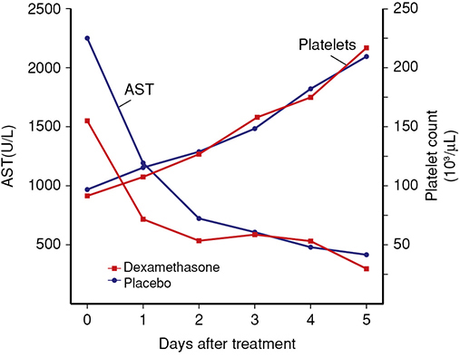
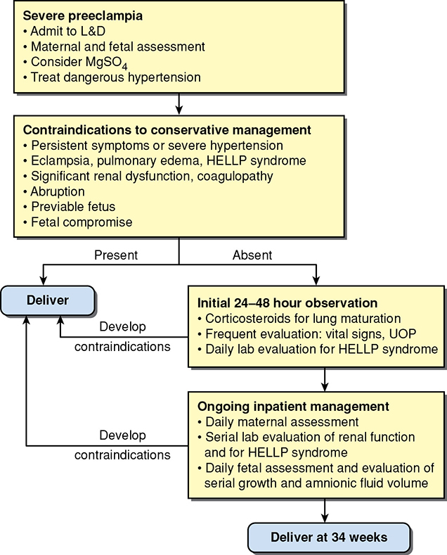
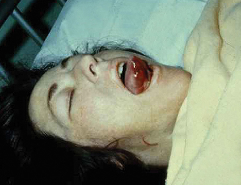
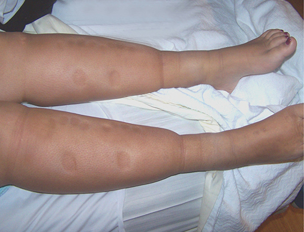
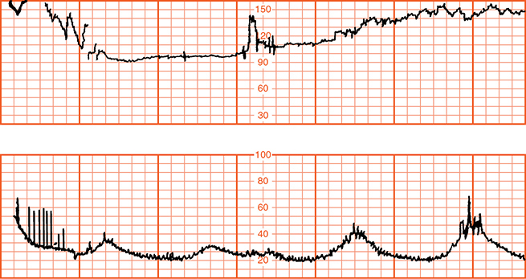
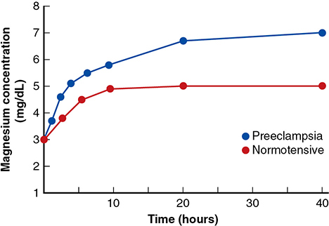
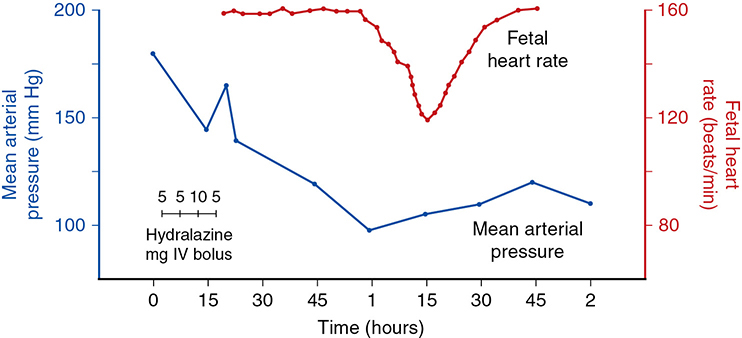

# Chapter 41: Clinical Management of the Preeclampsia Syndrome — Revision Notes

> Williams Obstetrics 26e, pp. 1840–1892 of the PDF. High-yield numbers are in **bold**.
> The 11 tables are transcribed from the PDF images (they are missing from the extracted chapter text). All 7 figures are included from the PDF.

**Big picture:** **Delivery is the only cure.** Management goals: deliver with the least trauma to mother and fetus, a healthy newborn, and full maternal recovery. Severe preeclampsia and eclampsia are treated the same way: **magnesium sulfate** to prevent or stop seizures, **antihypertensives** for BP **≥160/110** to prevent stroke, then **delivery** (usually by induction). Preeclampsia is also a **marker for lifelong cardiovascular, renal and neurological risk**.

---

## 1. Diagnosis and Evaluation

### Diagnosis
- More frequent 3rd-trimester visits aid early detection; BP rises may be physiological or pathological.
- Suspected early preeclampsia → **more frequent visits**; outpatient surveillance continues unless **overt hypertension, proteinuria, headache, visual changes or epigastric pain** develop.
- Parkland: **new-onset BP ≥140 systolic or ≥90 diastolic → admit** to exclude preeclampsia or define its severity.

### Evaluation on admission
- **Daily** check for headache, visual changes, epigastric pain; **daily weight** (rapid gain).
- **Proteinuria** quantification or urine protein:creatinine ratio.
- **BP every 4 h** with an appropriate cuff (more often if previously high).
- **Creatinine, transaminases, CBC with platelets**; frequency by severity. Uric acid, LDH and coagulation tests are of **questioned value**.
- **Fetal size, well-being and amnionic fluid volume.**
- Reduced activity may help (weak evidence). **PlGF and sFlt-1** are still investigational.
- Signs rarely resolve fully **until after delivery**.

---

## 2. Consideration for Delivery

### Objectives
1. End the pregnancy with the **least trauma** to mother and fetus.
2. Birth of a **healthy newborn** who thrives.
3. **Complete restoration** of maternal health.

- **Termination of pregnancy is the only known cure.**
- **Headache, visual changes or epigastric pain** → convulsions may be imminent. **Oliguria** is another ominous sign.
- **Severe preeclampsia = anticonvulsant + antihypertensive → delivery.** Eclampsia is treated identically, **even with an unfavorable cervix**.

### Route
- **Labor induction** (usually with cervical ripening); **cesarean for other obstetrical indications** only.
- Parkland (neonates **750–1500 g**, severe preeclampsia): induction in half, **vaginal delivery in ⅓** of those induced. Consortium on Safe Labor: half induced, **half of those delivered vaginally**.

### Timing

| Situation | Recommendation / data |
|---|---|
| **Preeclampsia without severe features** | Deliver **after 37 wk** (RCT of 756; ACOG). **Parkland: induce at 38 wk** |
| Antenatal testing (ACOG) | **Twice weekly** for gestational hypertension/nonsevere; **daily** with severe features |
| **HYPITAT-II** (nonsevere, 34–37 wk) | Immediate delivery: adverse maternal outcome **1.1% vs 3.1%**, but neonatal RDS **5.7% vs 1.7%** |
| **Chappell 2019** (901, nonsevere preeclampsia 34 to <37 wk) | Early delivery: **fewer severe maternal features**, but **more perinatal deaths/NICU admissions** |
| **PEACOCK** | Angiogenic biomarkers **did not help** decide on late-preterm delivery |

- With a preterm fetus, delay is justified in milder cases, with **NST or BPP** surveillance.

---

## 3. Inpatient or Outpatient Care (mild–moderate, stable hypertension)
- Reduced activity seems reasonable, but **complete bed rest is NOT recommended** (Task Force 2013); **SMFM: do not prescribe activity restriction**. Bed rest is impractical and predisposes to **thromboembolism**.
- **Parkland antepartum unit** (since 1973, >10,000 nulliparas):
  - Most improve, but **~90% have recurrent hypertension** before or during labor.
  - Modest nursing, **no drugs except iron and folate**, few tests; costs minimal vs NICU; thromboembolism rare.
- **Home care** (1182 nulliparas with mild gestational hypertension, 20% proteinuric; enrolled 32–33 wk, delivered 36–37 wk): severe preeclampsia **~20%**, eclampsia in **2**, HELLP **3%**, FGR **~20%**, PMR **4.2/1000**.
- Outpatient care is fine if disease does not worsen and fetal jeopardy is not suspected; not feasible with **vulnerable home situations**. Home BP/urine protein or visiting nurse helps.
- **Bottom line:** inpatient or close outpatient care is appropriate for **mild de novo hypertension**, including **nonsevere preeclampsia**. Keys: close surveillance, home support, access to care.

### Table 41-1. Randomized Clinical Trials Comparing Hospitalization Versus Routine Care for Women with Mild Gestational Hypertension or Preeclampsia

| Study Groups | No. | Para₀ (%) | Chronic HTN (%) | EGA adm (wk) | Prot (%) | EGA del (wk) | <37 wk (%) | <34 wk (%) | Mean Hosp (d) | Mean BW (g) | SGA (%) | PMR (%) |
|---|---|---|---|---|---|---|---|---|---|---|---|---|
| **Crowther (1992)** | 218ᵃ | | | | | | | | | | | |
| Hospitalization | 110 | 13 | 14 | 35.3 | 0 | 38.3 | 12 | 1.8 | 22.2 | 3080 | 14 | 0 |
| Outpatient | 108 | 13 | 17 | 34.6 | 0 | 38.2 | 22 | 3.7 | 6.5 | 3060 | 14 | 0 |
| **Turnbull (2004)** | 374ᵇ | | | | | | | | | | | |
| Hospitalization | 125 | 63 | 0 | 35.9 | 22 | 39 | — | — | 8.5 | 3330 | 3.8 | 0 |
| Day Unit | 249 | 62 | 0 | 36.2 | 22 | 39.7 | — | — | 7.2 | 3300 | 2.3 | 0 |

*Columns "adm" = maternal characteristics at admission; "del" = at delivery. ᵃExcluded women with proteinuria at study entry. ᵇIncluded women with ≤1+ proteinuria. BW = birthweight; EGA = estimated gestational age; Hosp = hospital; HTN = hypertension; Para₀ = nulliparas; PMR = perinatal mortality rate; Prot = proteinuria; SGA = small for gestational age.*

- Crowther: outpatients had **~2× severe hypertension and preterm delivery** (<34 and <37 wk), but other outcomes were similar.
- Turnbull (day care, popular in Europe): no perinatal deaths, no eclampsia or HELLP; similar cost; **satisfaction favored day care**.

---

## 4. Antihypertensive Therapy for Mild to Moderate Hypertension
- **Disappointing** for early mild preeclampsia/gestational hypertension: the only benefit is **fewer episodes of severe hypertension** (also 49-trial review).
- Labetalol (Sibai 1987a): lower BP but no pregnancy prolongation or outcome gain; **FGR doubled (19% vs 9%)**.
- Chronic hypertension treatment: see Chapter 53.

### Table 41-2. Randomized Placebo-Controlled Trials of Antihypertensive Therapy for Early Mild Gestational Hypertension

| Study | Study Drug (No.) | Pregnancy Prolonged (d) | Severe HTNᵃ (%) | Cesarean Delivery (%) | Placental Abruption (%) | Mean Birthweight (g) | Growth Restriction (%) | Neonatal Deaths (No.) |
|---|---|---|---|---|---|---|---|---|
| Sibai (1987a)ᵃ, 200 inpatients | Labetalol (100) | 21.3 | 5 | 36 | 2 | 2205 | 19ᶜ | 1 |
| | Placebo (100) | 20.1 | 15ᶜ | 32 | 0 | 2260 | 9 | 0 |
| Sibai (1992)ᵇ, 200 outpatients | Nifedipine (100) | 22.3 | 9 | 43 | 3 | 2405 | 8 | 0 |
| | Placebo (100) | 22.5 | 18ᶜ | 35 | 2 | 2510 | 4 | 0 |
| Pickles (1992), 144 outpatients | Labetalol (70) | 26.6 | 9 | 24 | NS | NS | NS | NS |
| | Placebo (74) | 23.1 | 10 | 26 | NS | NS | NS | NS |
| Wide-Swensson (1995), 111 outpatients | Isradipine (54) | 23.1 | 22 | 26 | NS | NS | NS | 0 |
| | Placebo (57) | 29.8 | 29 | 19 | NS | NS | NS | 0 |

*ᵃAll women had preeclampsia. ᵇIncludes postpartum hypertension. ᶜp <0.05 when study drug compared with placebo. HTN = hypertension; NS = not stated.*

*The printed footnote c reads "p <0.5", an obvious typo for p <0.05.*

---

## 5. Expectant Management of Preterm Severe Preeclampsia
- Aim: better neonatal outcome **without compromising maternal safety**; always with daily (or more frequent) **inpatient** maternal and fetal monitoring. Controversial and **potentially dangerous**.

**Key studies**
- **Memphis, 18–27 wk (60 women):** **disastrous**. PMR **87%**; abruption 13, eclampsia 10, renal failure 3, hypertensive encephalopathy 2, ICH 1, ruptured hepatic hematoma 1 (no maternal deaths).
- **Sibai 1994 RCT, 28–32 wk (95 women, HELLP excluded):** aggressive = steroids then delivery in **48 h**; expectant = bed rest + oral labetalol or nifedipine. Pregnancy prolonged **15.4 days**; neonatal outcomes improved.
- At **23–34 wk**: abruption, HELLP, pulmonary edema, renal failure, eclampsia; **PMR averages ~90/1000**. **FGR common** (**94%** in Dutch studies), and PMR is disproportionately high in FGR neonates.
- Hence **HELLP and FGR are usually excluded**. (One study suggests "stable" HELLP <34 wk may benefit.)
- **MEXPRE** (267, 28–32 wk): PMR **~90/1000 in both arms**; no neonatal benefit. Expectant arm: **FGR 22% vs 9%**, **abruption 7.6% vs 1.5%**.
- **Cochrane** (6 RCTs, 24–34 wk): may benefit perinatal outcome; **insufficient data on maternal health**.

### Table 41-3. Maternal and Perinatal Outcomes with Expectant Management of Severe Preeclampsia from 23 to 34 Weeks

| Study | No. | Days Gained | Placental Abruption (%) | HELLP (%) | Pulm. Edema (%) | AKI (%) | Eclampsia (%) | FGR (%) | PMR (%) |
|---|---|---|---|---|---|---|---|---|---|
| Ganzevoort (2005a,b) | 216 | 11 | 1.8 | 18 | 3.6 | NS | 1.8 | 94 | 18 |
| Bombrys (2009) | 66 | 5 | 11 | 8 | 9 | 3 | 0 | 27 | 1.5 |
| Abdel-Hady (2010) | 211 | 12 | 3.3 | 7.6 | 0.9 | 6.6 | 0.9 | NS | 48 |
| Vigil-De Gracia (2013) | 131 | 10.3 | 7.6 | 14 | 1.5 | 4.5 | 0.8 | 22 | 8.7 |
| Mooney (2016) | 108 | 5ᵇ | NS | 11 | NS | NS | 2 | ~36 | 4.6 |
| Hoshino (2019) | 79 | 8.5 | 12 | 12 | 4 | 3 | 3 | NS | 0 |
| Cavaignac-Vitalis (2019)ᵃ | 87 | 6ᵇ | NS | 100 | 0 | NS | 3.5 | NS | 9.3 |
| **Total** | **892** | | | | | | | | |
| **Range** | | **5–12** | **1.8–12** | **7.6–100** | **0.9–4.0** | **3–6.6** | **0.9–18** | **27–94** | **1.5–48** |

*Maternal outcomes = abruption through eclampsia; perinatal outcomes = FGR and PMR. ᵃAll had HELLP syndrome at enrollment. ᵇMedian. AKI = acute kidney injury; FGR = fetal-growth restriction; HELLP = hemolysis, elevated liver enzyme levels, low platelet count; NS = not stated; PMR = perinatal mortality rate; Pulm. = pulmonary.*

*The printed "Range" row does not match the rows above it. From the rows themselves: pulmonary edema 0–9, eclampsia 0–3.5, FGR 22–94, PMR 0–48.*

---

## 6. Expectant Management of Midtrimester Preeclampsia (<28 wk)
- Review of 8 studies (~200 women, onset **<26 wk**): maternal complications common.
- **No neonates survived delivery <23 wk** → most experts recommend **termination**.

| Gestational age | Perinatal survival |
|---|---|
| 23 wk | **18%** (long-term morbidity unknown) |
| 24–26 wk | **~60%** |
| 26 wk | **~90%** |

- Maternal complications (especially **HELLP**) are common and approach **50%**; one mother died; **PMR >50%**. No comparative studies show a perinatal benefit.

### Table 41-4. Pregnancy Outcomes with Expectant Management of Women with Severe Midtrimester Preeclampsiaᵃ

| Study | No. | EGA | Prolonged Pregnancy | HELLP (%) | Pulm. Edema (%) | Placental Abruption (%) | Eclampsia (%) | Death (%) | Perinatal Mortality |
|---|---|---|---|---|---|---|---|---|---|
| Gaugler-Senden (2006) | 26 | <26 wk | 24 dᵇ | 16 | 4 | 0 | 5 | 1 | 23/28 |
| Budden (2006) | 31 | <25 wk | ~12 dᵇ | 20 | 0 | 0 | 0 | 0 | 22/31 |
| Bombrys (2008) | 46 | <27 wk | 6 dᶜ | 11 | 2 | 6 | 1 | NS | 22/51 |
| Abdel-Hady (2010) | 61 | 24–28 wk | 12 dᵇ | 6 | 0 | 4 | 0 | 0 | 29/61 |
| Belghiti (2011) | 51 | <26 wk | 7 dᶜ | 5 | 2 | 3 | 0 | 0 | 31/53 |

*HELLP through Death are maternal outcomes (%). ᵃIncludes women with superimposed preeclampsia. ᵇMean. ᶜMedian. EGA = estimated gestational age; NS = not stated; Pulm. = pulmonary edema.*

### Corticosteroids
- **For lung maturation:** do not seem to worsen maternal hypertension; ↓ RDS and ↑ survival. Only one RCT (Amorim, **218 women, 26–34 wk**, betamethasone vs placebo): ↓ RDS, IVH and death, **but 2 maternal deaths and 18 stillbirths**.
- **To improve HELLP: NOT recommended** (Task Force 2013). Three RCTs showed no benefit:
  - Dexamethasone vs placebo, 132 women: no difference in stay, lab recovery or complications.
  - Postpartum dexamethasone, 105 women: no advantage (Fig 41-1).
  - Methylprednisolone for platelets 50,000–150,000/µL: no benefit.

*Figure 41-1. Postpartum HELLP: AST falls and platelets recover over ~5 days at the same pace with dexamethasone or placebo.*

### Expectant management recommendations
- Benefits at **24–32 wk** are **not overwhelming** compared with the maternal risks.
- **SMFM (2011) and the Task Force:** expectant management is a **reasonable alternative in selected women with severe preeclampsia <34 wk**, with inpatient surveillance and strict delivery triggers.
- Vaginal delivery is attempted, but **cesarean becomes more likely at lower gestational ages**.
- **Williams (Parkland) view is more conservative:** maternal safety comes first, and the average gain is **~1 week** without convincing perinatal benefit. If expectant management is used, the Table 41-5 triggers must be **strictly heeded**.

*Figure 41-2. Severe preeclampsia <34 wk: admit, MgSO₄, treat BP → deliver if any contraindication; otherwise steroids, 24–48 h observation, daily inpatient surveillance, deliver at 34 wk.*

### Table 41-5. Indications for Delivery in Women <34 Weeks' Gestation Managed Expectantly

| Prompt Delivery After Maternal Stabilization and After Single-dose Corticosteroid Therapy for Lung Maturationᵃ | Delay Delivery 48 hr If Possible to Allow Corticosteroid Therapy for Lung Maturation |
|---|---|
| Uncontrolled severe hypertension | Preterm ruptured membranes or labor |
| Persistent headaches, refractory to treatment | Fetal-growth restriction |
| Persistent epigastric pain | Oligohydramnios |
| Eclampsia | Reversed end-diastolic Doppler flow in umbilical artery |
| HELLP syndrome | Worsening renal dysfunction |
| Pulmonary edema | |
| Placental abruption | |
| Disseminated intravascular coagulation | |
| Stroke | |
| Myocardial infarction | |
| Nonreassuring fetal status | |
| Fetal demise | |

*ᵃInitial dose only, do not delay delivery. HELLP = hemolysis, elevated liver enzyme levels, low platelet count. From American College of Obstetricians and Gynecologists, 2020b; Society for Maternal-Fetal Medicine, 2011.*

### Experimental therapies
- **Apheresis** to lower sFlt-1, **RNA silencing** of placental sFlt-1, **esomeprazole**, **sildenafil**, **recombinant antithrombin**. **None has shown promise.**

---

## 7. Severe Preeclampsia and Eclampsia

- **Severe features:** SBP **≥160** or DBP **≥110**; transaminitis; thrombocytopenia; renal insufficiency; pulmonary edema; new-onset headache; visual changes (Table 40-2).
- **Eclampsia** = new-onset **tonic-clonic, focal or multifocal seizures** with no other cause.

### Eclampsia: maternal complications (399 women, Mattar & Sibai)

| Complication | Rate |
|---|---|
| Placental abruption | **10%** |
| Neurological deficits | **7%** |
| Aspiration pneumonia | **7%** |
| Pulmonary edema | **5%** |
| Cardiopulmonary arrest | **4%** |
| Acute kidney injury | **4%** |
| **Maternal death** | **1%** |

- Also HELLP, pulmonary embolism, stroke.
- **Preeclampsia almost always precedes convulsions** (sometimes unnoticed).
- Most common in the **3rd trimester**, increasingly so toward term. Postpartum eclampsia has declined (prenatal care, earlier detection, **prophylactic MgSO₄**).
- ⚠️ Consider **other diagnoses** if seizures occur **>48 h postpartum**, or with **focal deficits, prolonged coma or atypical** features.

### Clinical findings
- **Protect the woman and her airway.** Violent tonic-clonic movements can throw her from bed and cause **tongue biting**; this phase lasts **~1 min**.
- Then postictal state or coma; consciousness usually returns between infrequent seizures, often with a **semiconscious combative** state.
  - Coma persisting between frequent seizures → death may follow. Rare **status epilepticus** needs deep sedation or general anesthesia.
- **Respiratory rate** rises, may reach **≥50/min** (hypercarbia, lactic acidemia, transient hypoxia); cyanosis in severe cases.
- ⚠️ **High fever is a grave sign** → likely cerebrovascular hemorrhage.
- Proteinuria usually present. **¼ of severe preeclampsia has some AKI**; oliguria or occasionally anuria. **Hemoglobinuria** may be seen; hemoglobinemia is rare. Edema may be marked.

*Figure 41-3. Tongue hematoma from biting during an eclamptic convulsion (thrombocytopenia may add to bleeding).*

*Figure 41-4. Severe pitting edema in antepartum preeclampsia: fingerprint indentations on both shins.*

**Recovery after delivery**
- **Rising urine output** = an early sign of improvement.
- Proteinuria and edema usually gone **within 1 week**; BP normal in **a few days to 2 weeks**. Persisting severe hypertension suggests **underlying chronic vascular disease**.

**Labor and the fetus**
- Antepartum eclampsia: labor may start soon after and progress **rapidly**; intrapartum seizures can intensify and shorten labor.
- **Fetal bradycardia** often follows a seizure (maternal hypoxemia, lactic acidemia). It usually recovers in **2–10 min**.
- ⚠️ **Bradycardia >10 min → think of another cause, e.g., placental abruption.**

*Figure 41-5. Fetal bradycardia after an intrapartum eclamptic seizure, recovering with return of variability in ~5 min. Don't rush to cesarean.*

**Serious sequelae**
- **Pulmonary edema**: right after the seizure or hours later.
- **Sudden death** with a seizure → usually **massive cerebral hemorrhage**. Sublethal hemorrhage → **hemiplegia**. More likely in **older women with chronic hypertension**.
- New **neurological deficit → emergent cranial CT**.
- **Altered consciousness/persistent coma in up to 5%** (cerebral edema; herniation may kill).
- **Blindness in ~10%** after a seizure; usually improves.
- **Postictal psychosis** (rare): lasts days to 2 weeks; good prognosis; antipsychotics effective.

**Differential diagnosis**
- Epilepsy, encephalitis, meningitis, brain tumor, **neurocysticercosis**, **amnionic fluid embolism**, **postdural puncture headache**, **ruptured cerebral aneurysm**.
- Eclampsia is **overdiagnosed more often than missed**, but **every pregnant woman with convulsions has eclampsia until proven otherwise** → **load with MgSO₄** while other diagnoses are explored.

---

## 8. Management of Severe Preeclampsia–Eclampsia

### US philosophy (four principles)
1. **Control or prevent convulsions** with an **IV loading dose of MgSO₄**, then maintenance (usually IV).
2. **Intermittent antihypertensives** for dangerously high BP.
3. **Avoid diuretics** (unless obvious pulmonary edema), **limit IV fluids** (unless excessive loss), **avoid hyperosmotic agents**.
4. **Deliver** to resolve preeclampsia.

### Magnesium sulfate
- Effective **anticonvulsant without CNS depression**. Given **IV infusion** (almost universal in the US), **IM** (equally effective; useful where infusion is not available), or intermittent **IV 2-g** injections.
- Same doses for **severe preeclampsia and eclampsia**. Given **during labor and for 24 h postpartum** (labor and delivery is when seizures are most likely).
- ⚠️ **MgSO₄ is NOT an antihypertensive.** It acts on the **cerebral cortex**.
- Usually seizures stop after the **4-g load**; orientation returns in **1–2 h**.

### Table 41-6. Magnesium Sulfate Dosage Schedule for Severe Preeclampsia and Eclampsia

| Continuous Intravenous (IV) Infusion |
|---|
| Give **4- to 6-g loading dose** of magnesium sulfate diluted in 100 mL of IV fluid administered over **15–20 min** |
| Begin **2 g/hr** in 100 mL of IV maintenance infusion. Some recommend 1 g/hr |
| Monitor for magnesium toxicity: assess **deep tendon reflexes** periodically; some measure serum magnesium level at 4–6 hr and adjust infusion to maintain levels between **4 and 7 mEq/L (4.8–8.4 mg/dL)**; measure serum magnesium levels if serum **creatinine ≥1.0 mg/dL** |
| Magnesium sulfate is discontinued **24 hr after delivery** |

| Intermittent Intramuscular Injections |
|---|
| Give **4 g** of magnesium sulfate (MgSO₄·7H₂O USP) as a **20% solution IV** at a rate not to exceed **1 g/min** |
| Follow promptly with **10 g of 50%** magnesium sulfate solution, one half (**5 g**) injected deeply in the upper outer quadrant of **each buttock** through a 3-inch-long 20-gauge needle. (Addition of 1.0 mL of 2% lidocaine minimizes discomfort.) If convulsions persist after 15 min, give up to **2 g more IV** as a 20% solution at a rate not to exceed 1 g/min. If the woman is large, up to 4 g may be given slowly |
| **Every 4 hr** thereafter, give **5 g of 50%** solution injected deeply in the upper outer quadrant of alternate buttocks, but only after ensuring that: the **patellar reflex is present**, **respirations are not depressed**, and **urine output the previous 4 hr exceeded 100 mL** |
| Magnesium sulfate is discontinued **24 hr after delivery** |

> **Memory hook (Pritchard IM regimen):** "**4 IV + 10 IM (5 each buttock), then 5 IM q4h** — only if reflexes, respirations and urine (>100 mL/4 h) are all present."

*Figure 41-6. Serum Mg after a 4-g load + 2 g/h: preeclamptic women reach ~7 mg/dL versus ~5 mg/dL in normotensive women.*

**Recurrent seizures on MgSO₄**
- **Up to 15%** convulse again → give **another 2 g of 20% MgSO₄ IV slowly** (once in a small woman, up to twice in a larger woman).
- Only **5 of 245** eclamptic women at Parkland needed another anticonvulsant → small IV dose of **midazolam or lorazepam**. Avoid prolonged benzodiazepine use (**↑ mortality from aspiration pneumonia**).

**Duration**
- Traditionally **24 h after delivery**; for postpartum eclampsia, **24 h after seizure onset**. Shorter courses (12 h, or stopping at delivery) need more study.

### Pharmacology and toxicology
- Cleared **almost entirely by the kidney**; Mg clearance ≈ **⅓ of GFR**. Toxicity is unusual when GFR is normal or only slightly reduced.
- Mg excretion is **not urine-flow dependent** → urine volume alone does not show renal function; **measure serum creatinine**.
- **Load normally regardless of renal function** (4–6 g); **only the maintenance rate is reduced** when GFR is low. With creatinine **>1.0 mg/dL**, check serial serum Mg levels to guide the infusion.
- **Obesity**: **>60%** of women with BMI >30 on 2 g/h were **subtherapeutic at 4 h** → most obese women need **3 g/h**. (1 g/h gives low levels.) Routine Mg levels are still **not generally recommended**.

*The chapter text prints creatinine ">1.0 mg/mL"; Table 41-6 gives the correct unit, mg/dL.*

| Plasma magnesium | Effect |
|---|---|
| **4–7 mEq/L** (4.8–8.4 mg/dL; 2.0–3.5 mmol/L) | **Therapeutic**: prevents/arrests eclamptic seizures |
| **8–10 mEq/L** | Needed to inhibit uterine contractions |
| **10 mEq/L** (~12 mg/dL) | **Patellar reflexes lost** (curariform action) = warning sign |
| **>10 mEq/L** | Breathing weakens |
| **≥12 mEq/L** | **Respiratory paralysis and arrest** |

**Treating toxicity**
- **Stop MgSO₄ + calcium gluconate or calcium chloride 1 g IV** → reverses mild–moderate respiratory depression (keep it at the bedside). Effect may be short-lived at a steady-state toxic level.
- Severe depression or arrest → **prompt intubation and ventilation**.
- Direct myocardial toxicity is uncommon.

**Cardiovascular and other effects**
- 4 g IV over 15 min → MAP falls slightly, **cardiac index ↑ 13%** (↓ SVR). Transient nausea and flushing; effect lasts only **15 min**. Weaker vasodilation in placental vessels.
- Small rise in **CSF magnesium**, proportional to serum level.
- Anticonvulsant/neuroprotective mechanisms: ↓ presynaptic **glutamate** release, **NMDA receptor blockade**, potentiation of adenosine, better mitochondrial calcium buffering, block of voltage-gated calcium entry.
- **Uterus:** needs **8–10 mEq/L** to inhibit contractions; standard regimens cause only transient depression after the load. **Delivery blood loss is not increased.**

### Neuroprophylaxis: seizure prevention
- In all RCTs **MgSO₄ beat the comparator**.
- **Magpie** (>10,000 women with severe preeclampsia, 33 countries): **58% ↓ eclampsia** vs placebo; ↓ maternal mortality and abruption; child behavior at 18 months unchanged.
- **Nimodipine** (cerebral vasodilator CCB): eclampsia **>3×** higher than with MgSO₄ (**2.6% vs 0.8%**).

### Table 41-7. Randomized Comparative Trials of Prophylaxis with Magnesium Sulfate and Placebo or Another Anticonvulsant in Women with Gestational Hypertension

| Study / Inclusions | Magnesium Sulfate: Seizures/Treated (%) | Control: Seizures/Treated (%) | Comparisonᵃ |
|---|---|---|---|
| Lucas (1995): gestational hypertensionᵇ | 0/1049 | Phenytoin 10/1089 (0.9) | p <0.001 |
| Coetzee (1998): severe preeclampsia | 1/345 (0.3) | Placebo 11/340 (3.2) | RR = 0.09 (0.1–0.69) |
| Altman (2002)ᶜ: severe preeclampsia | 40/5055 (0.8) | Placebo 96/5055 (1.9) | RR = 0.42 (0.26–0.60) |
| Belfort (2003): severe preeclampsia | 7/831 (0.8) | Nimodipine 21/819 (2.6) | RR = 0.33 (0.14–0.77) |

*ᵃAll comparisons significant p <0.05. ᵇIncluded women with and without proteinuria and those with all severities of preeclampsia. ᶜMagpie Trial Collaboration Group, 2002. RR = relative risk.*

*The Coetzee lower confidence limit prints as 0.1, which is above the RR of 0.09. It is probably 0.01.*

**Who should get MgSO₄?**
- It prevents proportionately more seizures in **worse disease**, but severity is hard to quantify.
- **ACOG: give to all women with eclampsia or severe preeclampsia.**
- Nonsevere disease without MgSO₄: **~1 in 100 seizes**, and **¼ of those need emergent cesarean** (general anesthesia risk). ACOG accepts **not treating 99 to risk eclampsia in 1**.
- **Parkland policy:** MgSO₄ for preeclampsia **with severe features**, and conservatively for **proteinuric hypertension**.

**Fetal and neonatal effects**
- Crosses the placenta rapidly (equilibrates in fetal serum, less in amnionic fluid).
- FHR: small but significant **↓ variability**, lower (still normal) baseline, fewer prolonged decelerations.
- Generally **safe**; need for resuscitation not related to cord Mg (>1500 preterm neonates).
- Parkland (6654 mostly term newborns): **hypotonia 6%**, lower 1- and 5-min Apgars, more intubation and special-care admissions. **Neonatal depression only with severe hypermagnesemia.**
- **Protects against cerebral palsy in VLBW** newborns (see Ch 45); insufficient data at term.

### Maternal safety and efficacy: Eclampsia Trial Collaborative Group (1687 eclamptic women)
- MgSO₄ had significantly fewer **recurrent seizures** (aggregate **9.7%**) and fewer **maternal deaths** (**3.2% vs 5.2%**) than diazepam or phenytoin.

### Table 41-8. Randomized Comparative Trials of Magnesium Sulfate versus Phenytoin and Diazepam to Prevent Recurrent Eclamptic Convulsions

| | Magnesium Sulfate | Phenytoin | Diazepam |
|---|---|---|---|
| Recurrent seizuresᵃ | 60/453 (13%) | — | 126/452 (28%) |
| | 22/388 (5.6%) | 66/389 (17%) | — |
| Maternal deathsᵇ | 10/388 (2.6%) | 20/387 (5.2%) | — |
| | 17/453 (3.8%) | — | 24/452 (5.3%) |

*ᵃAll comparisons p <0.01. ᵇIndividual comparisons nonsignificant, combined comparison p <0.05.*

*"17.453" in the printed table is a typo for 17/453. The printed table (and the chapter text) also put the phenytoin and diazepam labels the wrong way round in the seizure rows. Each arm has a fixed size: 453 vs 452 women in the diazepam comparison and 388 vs 387 in the phenytoin comparison, as the deaths rows show. So the seizure rows are corrected here: recurrent seizures **28% with diazepam** and **17% with phenytoin** (Collaborative Eclampsia Trial, 1995). Either way, MgSO₄ is superior to both.*

### Severe hypertension treatment
- Dangerous BP → **cerebral hemorrhage**, hypertensive encephalopathy, eclampsia, **abruption**, heart failure. Treat **systolic >160**.
- **Target (NHBPEP, ACOG): SBP ≤160 and DBP ≤110.** ⚠️ Lower diastolic pressures can **compromise placental perfusion**.
- **At least half** of serious hemorrhagic strokes with preeclampsia occur in women with **chronic hypertension**: long-standing hypertension → **Charcot–Bouchard aneurysms** in lenticulostriate branches of the MCA (basal ganglia, putamen, thalamus, deep white matter, pons, deep cerebellum), which rupture with sudden BP surges.
- **First-line (ACOG): hydralazine, labetalol, nifedipine.** All **equally effective** and reduce stroke risk.
  - Hydralazine → more **tachycardia and palpitations**.
  - Labetalol → more **hypotension and bradycardia**.
  - Nifedipine lowers BP **faster** than labetalol. Both reduce FHR accelerations.
- Others tested but not widely used: verapamil, nitroglycerin, nitroprusside, ketanserin, nicardipine, nimodipine.

### Table 41-9. Antihypertensive Agents for Urgent Control of Severe Hypertension

| Drug | Dose | Side Effects |
|---|---|---|
| **Hydralazine** | **5 mg IV or IM** followed by **10-mg doses at 15–20 min** intervals for up to 3 doses ***or*** constant infusion 0.5–10 mg/hr | Tachycardia, headaches, hypotension |
| **Labetalol** | **10 mg IV** followed by **20 mg IV in 20 min, then 40 mg IV, then 80 mg IV** ***or*** constant infusion 1–2 mg/min | Asthma precipitation, bradycardia, hypotension |
| **Nifedipine** | **10 mg orally** followed by **20 mg doses at 20 min × 2** | Tachycardia, headaches |

*IM = intramuscular; IV = intravenous.*

*The table says the second labetalol dose comes "in 20 min", but the text gives 10-minute steps (10 → 20 → 40 → 40 → 80 mg).*

**Details from the text**

| Drug | Parkland protocol | ACOG |
|---|---|---|
| **Hydralazine** | **Always start with 5 mg** (response is unpredictable, regardless of BP height); acts in ~**10 min**; then 10 mg every 15–20 min; Parkland will give a **3rd dose** | Switch to **labetalol if still severe after the 2nd dose** |
| **Labetalol** (α + nonselective β-blocker) | **10 → 20 → 40 → 40 → 80 mg IV** at 10-min intervals. ⚠️ **Avoid in asthma** | 10–20 mg IV, then 20–80 mg every 10–30 min; then hydralazine |
| **Nifedipine** (immediate release) | 10–20 mg orally, repeat 10–20 mg after 20 min; then labetalol. ⚠️ **Never sublingual** (dangerously rapid effect) | — |

- ⚠️ **Overtreatment:** avoid a large initial hydralazine dose. Fig 41-7: hydralazine every 5 min instead of every 15 → MAP **180 → 90 mm Hg** within 1 h (BP 270/150 → 110/80) with **fetal bradycardia/decelerations**, reversed by rapid crystalloid. This can be mistaken for **abruption** → unnecessary emergency cesarean.

*Figure 41-7. Hydralazine given too often: MAP fell from 180 to ~90 mm Hg and the FHR dropped to ~120; fluid raised MAP to ~115 and the fetus recovered.*

**Diuretics**
- Loop diuretics further **compromise placental perfusion** and redistribute an already contracted volume → **not used antepartum to lower BP**; furosemide before delivery **only for pulmonary edema**. May help **postpartum** hypertension.

### Fluid therapy
- Crystalloid at **60–125 mL/h** unless unusual losses (vomiting, diarrhea, diaphoresis, hemorrhage).
- ⚠️ Oliguria is common and tempting to treat, but these women already have excess extravascular fluid. Large volumes → **pulmonary and cerebral edema**.
- **Oliguria/anuria:** small incremental boluses to keep urine output **>30 mL/h**. Replace hemorrhage or other losses with gradual boluses. Before neuraxial analgesia, infuse slowly in graded amounts.

**Pulmonary edema**
- **Most often postpartum.** In eclampsia, first exclude **aspiration** (from convulsion, anesthesia or oversedation).
- Three causes:
  1. **Capillary permeability edema** (↑ permeability + ↑ extravascular oncotic pressure; worsened by vigorous fluids)
  2. **Cardiogenic** (ventricular failure from severe hypertension, more common with **morbid obesity or chronic hypertension**)
  3. A **combination**

**Invasive hemodynamic monitoring**
- Classic indications: oliguria or pulmonary edema, and "ironically, vigorous treatment of the former causes most of the latter."
- **Task Force: no routine invasive monitoring.** Reserve for severe preeclampsia with **cardiac and/or renal disease**, or **refractory hypertension, oliguria and pulmonary edema**. Noninvasive monitors are unverified.

### Plasma volume expansion
- Older studies: serious complications, especially **pulmonary edema**.
- **Amsterdam RCT** (216 women, 24–34 wk): **250 mL 6% hydroxyethyl starch over 4 h twice daily** → **no difference** in outcomes. **Not recommended.**

### Analgesia and anesthesia
- **Neuraxial analgesia is ideal**: safe in RCTs. Slow induction with **dilute** agents avoids hypotension and the need for large fluid preloads.
- It **avoids general anesthesia**, where **intubation causes sudden severe hypertension** → pulmonary edema, cerebral edema, ICH. **Airway edema** makes intubation difficult.
- Vigorous crystalloid with epidural → ↑ PCWP; aggressive volume → pulmonary edema, especially **in the first 72 h postpartum**; most **pharyngolaryngeal edema** comes from aggressive fluids.
- General, epidural or CSE are all acceptable with a careful approach. Parkland: a **gentle bolus** with epidural placement.

### Blood loss at delivery
- These women **lack pregnancy hypervolemia** and tolerate even normal blood loss poorly.
- ⚠️ **A sharp BP fall soon after delivery usually means excessive blood loss**, not sudden resolution of vasospasm.
- Oliguria after delivery → check **hematocrit frequently**; treat hemorrhage with crystalloid and **blood**.

---

## 9. Persistent Severe Postpartum Hypertension
- **8%** of women develop **de novo** postpartum hypertension.
- If IV hydralazine/labetalol or oral nifedipine keeps being needed → **oral maintenance**: labetalol or another β-blocker, **nifedipine XL, amlodipine** or another CCB. This **reduces readmission**. SMFM has a postpartum checklist.
- Causes: **mobilized interstitial fluid returning to the circulation**, underlying chronic hypertension, or both.
- **NSAIDs do not aggravate** postpartum hypertension.
- With chronic hypertension + **LVH**, severe postpartum hypertension can cause **cardiac pulmonary edema**.

### Furosemide
- RCT (384 women): furosemide → less hypertension at **7 days (6% vs 14%)** and fewer discharged on antihypertensives.
- Nifedipine + furosemide vs nifedipine alone: need for additional agents **8% vs 26%**. **Torsemide**: no benefit.
- **Parkland weight check:** postpartum weight should be **≥10–15 lb below** the last prenatal weight. If it is **higher** (IV fluids with epidural or surgery) **and** severe hypertension persists → **IV furosemide**.

### Thrombotic microangiopathy
- Rare atypical persistence of severe preeclampsia–eclampsia after delivery. **Plasma exchange** advocated (e.g., 3 L × 3 = **36–45 donor units**), but the distinction from **TTP/HUS** was unclear.
- Parkland: of **>55,000** women with gestational hypertension (~500,000 pregnancies), **very few** had a TMA.

### Reversible cerebral vasoconstriction syndrome (RCVS)
- Persistent hypertension, **"thunderclap" headaches**, seizures and CNS findings. **Diffuse segmental constriction** of cerebral arteries; may cause ischemic or hemorrhagic stroke.
- Triggers include **pregnancy and especially preeclampsia**; more common in women; long-term sequelae uncommon. Best management unclear.

---

## 10. Long-Term Consequences

### Future pregnancies
- ↑ risk of hypertensive disorders in later pregnancies and later life; hypertension risk may be highest in the **first 6 months** postpartum.
- After preterm preeclampsia, even normotensive later pregnancies have more **preterm birth and FGR**.
- **Earlier onset → higher recurrence:**

| Index pregnancy | Recurrence risk |
|---|---|
| Preeclampsia near term | **23%** |
| Nulliparas diagnosed **<30 wk** | **up to 40%** |

- **HELLP** recurs substantially; even without recurrence, preterm delivery, FGR, abruption and cesarean are ↑.

### Cardiovascular morbidity
- Preeclampsia is a **marker for long-term cardiovascular disease** → evaluate hypertensive women in the **first several months postpartum**.
- Pregnancy-attributable hypertension should resolve by **12 wk**; beyond that it is **chronic hypertension**.

| Data | Finding |
|---|---|
| Magpie follow-up (3375, median 26 mo) | **20%** hypertensive |
| Meta-analysis | **28%** hypertension within **2 yr** |
| Danish registry (~15 yr) | Chronic hypertension **5×** after gestational hypertension, **4×** after mild, **6×** after severe preeclampsia |
| Iceland (gestational hypertension vs controls) | Ischemic heart disease **24% vs 15%**; stroke **9.5% vs 6.5%** |
| Sweden (>400,000, recurrent preeclampsia) | Systolic dysfunction, ↑ ischemic heart disease; also more diastolic dysfunction |

- Also **coronary calcification** and **idiopathic cardiomyopathy**. ↑ LV mass index **before** hypertension develops.
- Risk may begin at the woman's **own birth** (as with preterm birth and FGR). Cofactors: **metabolic syndrome, diabetes, obesity, dyslipidemia, atherosclerosis**. ↑ **type 2 diabetes**, later **diabetic retinopathy** and **retinal detachment**.

### Table 41-10. Some Long-Term Consequences in Women with Preeclampsia Syndrome

| Obstetrical | Cardiovascular | Renal | Neurovascular | Metabolic |
|---|---|---|---|---|
| Hypertensive disorders | Chronic hypertension | Glomerular dysfunction | Stroke | Type 2 diabetes |
| Preterm delivery | Ischemic heart disease | Proteinuria | Retinal detachment | Metabolic syndrome |
| Fetal-growth restriction | Atherosclerosis | | Diabetic retinopathy | Dyslipidemia |
| | Coronary artery calcification | | Dementia | Obesity |
| | Cardiomyopathy | | Seizure disorder | |
| | Thromboembolism | | Retinopathy | |
| | Peripheral vascular disease | | | |

### Table 41-11. Long-Term Cardiovascular Morbidities After Recurrent Preeclampsia Compared with a Single Pregnancy with Preeclampsia and a Subsequent Normal Pregnancy

| Morbidity (No. of Studies) | Recurrent (No.) | Single (No.) | Risk Ratioᵃ |
|---|---|---|---|
| Hypertension (7) | 2186 | 5589 | **2.33** |
| IHD (3) | 428 | 977 | **2.40** |
| Heart failure (2) | 160 | 298 | **2.88** |
| CVA (2) | 196 | 616 | **1.69** |
| Cardiovascular event (2) | 1278 | 5909 | **1.57** |

*ᵃAll p values <0.0002. CVA = cerebrovascular accident; IHD = ischemic heart disease.*

### Renal sequelae
- **~15%** of women with prior preeclampsia have **renal dysfunction** (possibly from preeclamptic AKI).
- Danish study (>1 million): chronic renal disease **6×** after preeclampsia.
- But **15–20%** of preeclamptic women who undergo biopsy **already have chronic renal disease**.
- Long-term: chronic hypertension **55% vs 7%** in controls, with ↑ renovascular resistance and ↓ renal blood flow (cause vs effect unclear).

### CNS sequelae
- Eclampsia does have lasting effects: almost all have multifocal perivascular edema, **~¼ cerebral infarction**.
- **Persistent white-matter lesions** on MRI: **40%** after eclampsia vs **17%** of controls; also seen in preeclampsia without seizures. Temporal-lobe white-matter changes and ↓ cortical volume.
- Some studies: subjective **cognitive impairment**, ↑ **dementia**, modest ↑ **seizure disorders**, ↓ vision-related quality of life.

---

## Quick-Recall: Drugs in Severe Preeclampsia–Eclampsia

| Drug | Regimen | Key cautions |
|---|---|---|
| **MgSO₄ IV** | **4–6 g over 15–20 min, then 2 g/h**; continue **24 h postpartum** | Therapeutic **4–7 mEq/L**; reflexes lost **10**; respiratory arrest **≥12**. Obese: may need **3 g/h**. Reduce **maintenance** only if creatinine ↑ |
| **MgSO₄ IM (Pritchard)** | **4 g IV (20%) + 10 g IM (50%, 5 g each buttock)**, then **5 g IM q4h** | Only if patellar reflex present, respirations normal, urine **>100 mL/4 h** |
| Recurrent seizure | **2 g of 20% MgSO₄ IV** slowly (×1–2) | Refractory: small dose midazolam/lorazepam; avoid prolonged use |
| **Calcium gluconate** | **1 g IV** + stop MgSO₄ | For Mg respiratory depression; intubate if arrest |
| **Hydralazine** | **5 mg IV/IM**, then 10 mg q15–20 min (≤3 doses) | Tachycardia, headache; overshoot → fetal distress |
| **Labetalol** | **10 → 20 → 40 → 40 → 80 mg IV** q10 min (or 1–2 mg/min) | **Asthma**, bradycardia, hypotension |
| **Nifedipine IR** | **10–20 mg orally**, repeat after 20 min | **Never sublingual**; tachycardia, headache |
| **Furosemide** | IV, postpartum | Antepartum **only for pulmonary edema** |
| BP target | SBP **≤160**, DBP **≤110** | Don't drop the diastolic too low (placental perfusion) |
| IV fluids | **60–125 mL/h** crystalloid | Oliguria → small boluses for **>30 mL/h**; no volume expansion |

## Key Numbers to Memorize
- Admit if new BP **≥140/90**; BP checks **every 4 h**
- Deliver nonsevere preeclampsia at **≥37 wk** (Parkland **38 wk**); testing **twice weekly** (nonsevere) vs **daily** (severe)
- HYPITAT-II: maternal adverse outcome **1.1% vs 3.1%**, RDS **5.7% vs 1.7%**
- Parkland day unit: **~90%** have recurrent hypertension
- Expectant management of severe disease: gains **~1 wk** (5–12 days); PMR **~90/1000**; Memphis 18–27 wk PMR **87%**
- Survival: **0% <23 wk, 18% at 23 wk, ~60% at 24–26 wk, ~90% at 26 wk**
- Delivery triggers <34 wk: steroids first dose only for maternal indications; **48-h delay** for PPROM, FGR, oligohydramnios, **reversed EDF**, worsening renal function
- Eclampsia: abruption **10%**, maternal death **1%**; FHR recovers in **2–10 min**; coma **≤5%**; blindness **~10%**; recurrent seizure on MgSO₄ **≤15%**
- Magpie: **58% ↓** eclampsia; nonsevere untreated → **1 in 100** seizes
- MgSO₄ therapeutic **4–7 mEq/L**; reflexes lost **10**; respiratory arrest **≥12**; Ca gluconate **1 g**
- Postpartum de novo hypertension **8%**; postpartum weight should fall **≥10–15 lb**
- Recurrence **23%** (term) to **40%** (<30 wk); hypertension **20%** at 26 mo; chronic hypertension **4–6×** at 15 yr
- Renal dysfunction **~15%**; white-matter lesions **40% vs 17%**
