# Chapter 42: Causes of Obstetrical Hemorrhage — Revision Notes

> Williams Obstetrics 26e, pp. 1893–1942 of the PDF. High-yield numbers are in **bold**.
> The five tables are transcribed from the PDF images (they are missing from the extracted chapter text). 12 of the 14 figures are included from the PDF.

**Big picture:** Hemorrhage is one of the **"infamous triad"** of maternal death (with hypertension and infection): a direct cause in **11%** of US pregnancy-related deaths and the **single most important cause worldwide**. About **⅓ of severe cases are preventable**. Atony is the most frequent cause; lacerations, inversion, rupture and AFE are the other big ones.

---

## 1. General Considerations

### Normal hemostasis

- Near term, **≥600 mL/min** flows through ~**120 spiral arteries** into the intervillous space. They have **no muscular layer** (trophoblast remodeling) → low-pressure system.
- After placental separation, hemostasis is achieved **first by myometrial contraction** (compresses vessels) → then clotting → vessel obliteration.
- An **intact coagulation system is NOT needed** for postpartum hemostasis unless there are lacerations. Conversely, **atony can be fatal despite normal coagulation**.

### Definition and incidence

- Old definition: **≥500 mL** after the 3rd stage — but almost **half** of vaginal deliveries lose that much when measured.
- **ACOG definition: cumulative blood loss >1000 mL, or blood loss with signs/symptoms of hypovolemia.**
- **~5%** of vaginal deliveries lose >1000 mL; almost **⅓ of cesareans** lose >1000 mL.
- Incidence (MFMU, >115,000 deliveries): **5.3% vaginal, 10.5% cesarean**. Underreported (only 2.6% in discharge data).

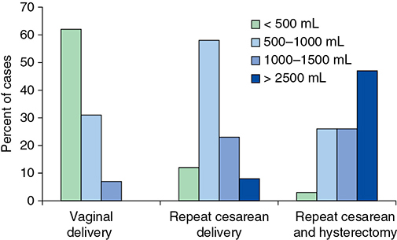

*Figure 42-1. Measured blood loss: most vaginal deliveries lose <500 mL; repeat cesarean usually 500–1000 mL; cesarean hysterectomy often >2500 mL.*

### Blood loss assessment

- **Visual estimation underestimates large losses** and overestimates small ones.
- Quantitative methods: **gravimetric** (weigh soaked items minus dry weight); tablet camera colorimetry. ACOG supports quantitative methods, but a Cochrane review found **no outcome difference** vs subjective methods.
- Pregnancy blood volume usually ↑ **~50%** (range **30–60%**, i.e., **1500–2000 mL** in an average woman).
- **Axiom:** a normal woman loses up to the **pregnancy-added volume without a fall in hematocrit**.
- **Retrospective estimate:** blood loss = pregnancy-added volume **+ 500 mL for every 3-vol% fall in hematocrit**.
- A **6-vol% hematocrit drop** ≈ **>1000 mL** loss (found in ¼ of vaginal deliveries, Tita).
- Transfusion: >6% of vaginal deliveries (Tita); **2.3%** at Parkland (half cesarean), with calculated loss averaging **~3500 mL**.
- **Transfusion = >80% of severe maternal morbidity (SMM)** rates. Massive transfusion for PPH: **25–65 per 100,000** births. Problems with transfusion as a quality metric: derived from billing codes and skewed by case-mix.

### Table 42-1. Calculation of Maternal Total Blood Volume

| Component | Details |
|---|---|
| **Nonpregnant blood volume**ᵃ | **[Height (inches) × 50] + [Weight (pounds) × 25] ÷ 2 = Blood volume (mL)** |
| **Pregnancy blood volume** | Average increase is **30–60%** of calculated nonpregnant volume |
| | Increases across gestation and **plateaus at ~34 wk** |
| | Usually **larger with low-normal hematocrit (~30)** and smaller with high-normal hematocrit (~40) |
| | Average increase is **40–80% with multifetal gestation** |
| | Average increase is **less with preeclampsia** — volumes vary inversely with severity |
| **Postpartum blood volume with serious hemorrhage** | Assume acute return to **nonpregnant total volume** after volume resuscitation |
| | Pregnancy hypervolemia **cannot be restored** postpartum |

*ᵃFormula derived by measuring blood volume and loss in >100 women using ⁵¹Cr-labeled erythrocytes. Data from Hernandez, 2012; Pritchard, 1962.*

### Risk factors

- The Joint Commission requires hemorrhage **risk assessment on admission and postpartum** (e.g., ACOG, AWHONN tools). Scoring systems predict **only modestly**; AWHONN tool did identify high-risk women.

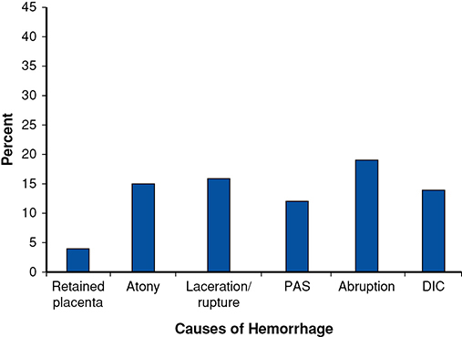

*Figure 42-2. Contribution to hemorrhage deaths: abruption (~19%), laceration/rupture (~16%), atony (~15%), DIC (~14%), PAS (~12%), retained placenta (~4%).*

### Table 42-2. Obstetrical Hemorrhage: Causes, Predisposing Factors, and Vulnerable Patients

| Category | Causes / factors |
|---|---|
| **Abnormal placentation** | Placenta previa; placental abruption; placenta accreta spectrum; ectopic pregnancy; hydatidiform mole |
| **Injuries to the birth canal** | Episiotomy and lacerations; forceps or vacuum delivery; cesarean delivery or hysterectomy; **uterine rupture** (previously scarred uterus, high parity, tachysystole, obstructed labor, intrauterine manipulation, midforceps rotation, breech extraction) |
| **Obstetrical factors** | Obesity; previous postpartum hemorrhage; early preterm pregnancy; sepsis; preeclampsia/eclampsia |
| **Vulnerable patients** | Chronic renal insufficiency; constitutionally small size |
| **Uterine atony** | **Overdistention** (large fetus, multiple fetuses, hydramnios, retained clots); labor induction; anesthesia or analgesia (halogenated agents, regional analgesia with hypotension); labor abnormalities (rapid, prolonged, augmented labor, chorioamnionitis); previous uterine atony; parity (primiparity, high parity) |
| **Coagulation defects — intensify other causes** | Massive transfusions; placental abruption; sepsis; HELLP syndrome; acute fatty liver; anticoagulant treatment; congenital coagulopathies; amnionic fluid embolism; prolonged retention of dead fetus; saline-induced abortion |

*HELLP = hemolysis, elevated liver enzyme levels, low platelet count.*

### Timing of hemorrhage

- Better to name the **cause and gestational age** than just "antepartum/postpartum".
- **Bloody show** in labor = effacement/dilation tearing small vessels. Bleeding **above the cervix** → think **abruption, previa, vasa previa**. Cervical varicosities may bleed (esp. with previa).
- Near term, often **no cause** found → probably slight **marginal separation**, but the pregnancy **stays high risk** even after bleeding stops and previa is excluded.
- Bleeding **22–28 wk** (Canadian study, n = 806): **abruption 32%, previa 21%, cervical 6.6%**, no cause in ⅓; **44% delivered <29 wk**.
- Antepartum hemorrhage after the 1st trimester: **11%** (Scotland) → ↑ preterm birth, induction, PPH.
- **Postpartum:** usually obvious, except **concealed intrauterine/intravaginal blood, rupture with intra-/retroperitoneal bleeding, expanding hematoma**.
- **Atony vs laceration:**
    - **Boggy, soft uterus** with clots expressed on massage → **atony**.
    - **Bleeding despite a firm, contracted uterus → laceration** (bright red = arterial). Inspect vagina, cervix, uterus (regional analgesia, OR transfer).
    - No lower-tract laceration + contracted uterus + supracervical bleeding → **manually explore the uterus** for a tear. Also routine after internal podalic version, breech extraction, and (Parkland) after VBAC.
- **Late PPH** = bleeding **after the first 24 h**; up to **1%**; risk factor = PPH at delivery (Ch 36).

### Appreciation of blood loss

- PPH is often **steady, not sudden**; uterus can hide **≥1000 mL** of blood; massage of an abdominal **fat roll mistaken for the uterus** is useless.
- Tolerance depends on nonpregnant volume and degree of hypervolemia: **small women** tolerate less.
- **Severe preeclampsia/eclampsia:** volume ↑ only **~10%** above nonpregnant (Zeeman) → very vulnerable; also chronic renal insufficiency.
- ⚠️ **Pulse and BP change only moderately until large losses.** Catecholamines may even make a woman **hypertensive**; a **preeclamptic woman may look "normotensive" despite marked hypovolemia**.

---

## 2. Uterine Atony

### Third-stage management

- **Atony = the most frequent cause** of obstetrical hemorrhage.
- Placental separation: **Duncan** mechanism (blood escapes vaginally immediately) vs **Schultze** mechanism (blood concealed behind placenta until delivery). Descent → **slack cord**.
- ⚠️ **Cord traction before separation, especially with an atonic uterus → uterine inversion.**
- After placental delivery, **always palpate the fundus**; vigorous **fundal massage** + a **uterotonic** prevents most atony.

### Risk factors

- Risk scores of limited value: **up to half of women with atony after cesarean had no risk factors**.
- **Parity:** PPH 0.3% (low parity) → **1.9% with parity ≥4** → **2.7% with parity ≥7**. Primiparity is also a risk.
- **Overdistention** (large fetus, multiples, hydramnios); hyper-/hypotonic labor; **induction/augmentation** (prostaglandins or oxytocin).
- **3rd stage >20 min** → ↑ hemorrhage.
- **Prior PPH → recurrence.**

### Evaluation and management

- **Safety bundles** (AIM, Joint Commission): notify personnel, activate resources, standardize management.
- **Inspect the placenta routinely** → if a defect, manually explore and remove the fragment (incl. retained **succenturiate lobe**).

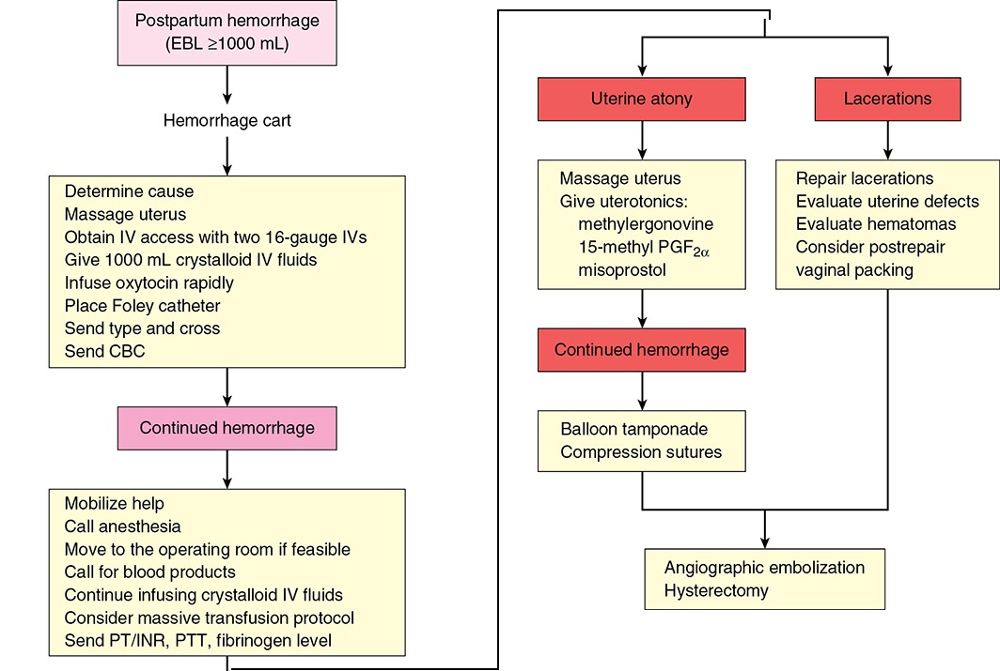

*Figure 42-3. Parkland PPH algorithm (EBL ≥1000 mL): massage, two 16-G IVs, 1 L crystalloid, oxytocin, Foley, labs → escalate help/blood → atony (uterotonics → balloon/compression sutures) or lacerations (repair) → embolization/hysterectomy.*

### Manual removal of the placenta

- **Indicated** if heavy bleeding persists while the placenta is partly or totally attached.
- **Adequate analgesia is mandatory**; aseptic technique. Fingertips (approximated) insinuated between placenta and wall, sweep to peel off. Tease membranes with ring forceps or a gauze-wrapped hand. Bierer forceps under US also described.
- **Antibiotics:** systematic review found no benefit; ACOG — data neither support nor refute. **WHO recommends ampicillin or cefazolin**; Parkland gives **single-dose cefazolin**.

### Uterotonic agents

| Agent | Dose / route | Key points |
|---|---|---|
| **Oxytocin** (Pitocin) | **20 U in 1000 mL crystalloid IV at 10 mL/min (= 200 mU/min)**; IM if no IV | **WHO first-line for prophylaxis and treatment.** IV more effective than IM. ⚠️ **Never an undiluted IV bolus** → severe hypotension/arrhythmia |
| **Ergonovine / methylergonovine** (Ergotrate / Methergine) | **0.2 mg IM**; Methergine repeat q **2–4 h** | **Second-line.** Tetanic contractions lasting **~45 min**. ⚠️ **Hypertension** (esp. IV, **preeclampsia**, and with **HIV protease inhibitors**) |
| **Carboprost** (Hemabate; 15-methyl PGF₂α) | **250 µg (0.25 mg) IM**, repeat q **15–90 min**, **max 8 doses** | **88% success.** Side effects in ~**20%**: diarrhea > hypertension > vomiting > fever > flushing > tachycardia. Bronchoconstriction/vasoconstriction → **avoid in asthma, pulmonary hypertension (incl. suspected AFE)**; O₂ desaturation averages **10%**. Relative CI: renal, liver, cardiac disease |
| **Misoprostol** (Cytotec; PGE₁) | **600–1000 µg** rectal, oral or sublingual | No added benefit over oxytocin/ergonovine for treatment (Cochrane) |
| **Dinoprostone** (PGE₂) | **20-mg suppository** PR or PV **q 2 h** (off label) | Diarrhea (bad for PR); heavy bleeding precludes PV; **hypotension** — not used at Parkland |
| Sulprostone (IV PGE₂) | IV | Europe only |

- If atony is refractory, **add an agent from a different class** (ACOG).

### Tranexamic acid (TXA)

- **WOMAN trial:** **1 g IV TXA** + usual care → hemorrhage deaths **1.2% vs 1.7%** (significant).
- Also ↓ progression to severe PPH, transfusion and hysterectomy after vaginal birth. See Ch 44.

### Bleeding unresponsive to uterotonics — do immediately and simultaneously

1. **Bimanual compression** (controls most cases): fist in the anterior fornix pushes the anterior wall; abdominal hand compresses and massages the posterior wall. Not just fundal massage.
2. Mobilize the emergency obstetric team; call for **whole blood or packed RBCs**.
3. Urgent **anesthesia** help.
4. **≥2 large-bore IVs** (crystalloid + oxytocin alongside blood); **Foley** for urine output.
5. **Rapid IV crystalloid** resuscitation.
6. Under analgesia/anesthesia, **manually re-explore** the uterus for retained fragments, lacerations, rupture.
7. **Re-inspect cervix and vagina.**
8. **Transfuse** if still unstable or bleeding.

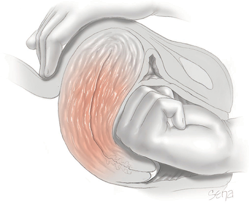

*Figure 42-4. Bimanual compression: fist in the anterior fornix against the anterior wall; abdominal hand compresses and massages the posterior wall.*

### Balloon tamponade

- **Foley:** 24F–30F with a 30-mL balloon, filled with **60–80 mL saline**; open tip drains blood. Rupture reported at **>50 mL** → a **34F Foley with 60-mL balloon** can be used. Remove after **12–24 h**.
- Other devices: Sengstaken-Blakemore, Rusch, ebb balloons, condom catheters.
- **Bakri balloon / BT-Cath:** 3-person insertion (sonographer; inserter; filler). Infuse **≥150 mL rapidly, then up to 300–500 mL** total. Remove after **~12 h**.
- Antibiotic prophylaxis (**cefazolin 1 g q8h** until removal) suggested to ↓ endometritis.
- **Success ~85%** (all causes). Uterine rupture from a balloon reported once. Balloon + compression sutures ("sandwich") described.
- Failure → **compression sutures, pelvic vessel ligation, angiographic embolization, hysterectomy** (Ch 44).

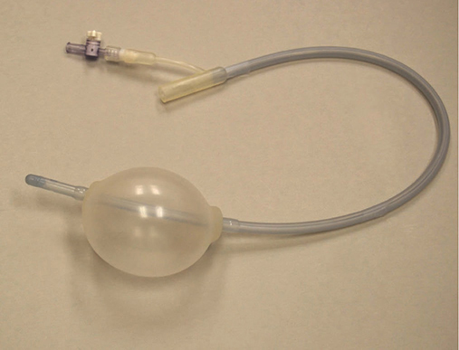

*Figure 42-5. Bakri intrauterine balloon (fill with 300–500 mL; drain port at the tip).*

---

## 3. Uterine Inversion

- A classic hemorrhagic disaster; bleeding often **massive** unless recognized promptly.
- **Risk factors** (alone or combined):
    1. **Fundal placental implantation**
    2. **Uterine atony**
    3. **Cord traction before placental separation**
    4. **Placenta accreta spectrum**
    - Also: short cord, weakened implantation site, uterine tumors, excessive fundal pressure.
- **Incidence: 1:2000 to 1:20,000** vaginal deliveries (Parkland ~**1:2000**). Unknown whether active 3rd-stage management with cord traction raises risk.

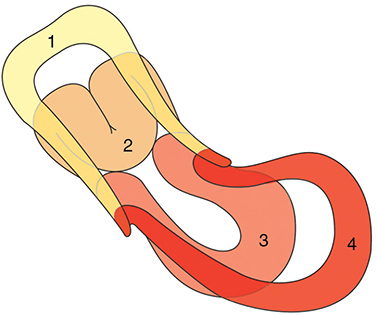

*Figure 42-6. Progressive degrees of uterine inversion (1 = normal → 4 = complete inversion protruding through the introitus).*

### Recognition and management

- Partial inversion can be **mistaken for a myoma** → sonography helps. **¼ need blood replacement.**
- **Urgent, simultaneous steps:**
    1. Summon obstetric + anesthesia help.
    2. Bring **blood** to the room.
    3. **Two large-bore IVs**, rapid crystalloid.
    4. Evaluate for **emergency general anesthesia**.
    5. If recently inverted, not contracted, and placenta **already separated** → **push the fundus up with palm and fingers along the long axis of the vagina** (or two rigid fingers at the center). Avoid perforation.
    6. If the **placenta is still attached → reposition with placenta in situ** (less bleeding). Give a **tocolytic**:
     - **Terbutaline 250 µg SC**, or
     - **Nitroglycerin 50–100 µg IV**, or
     - **Magnesium sulfate 4 g IV**
     - If these fail → **halogenated inhalational anesthetic**. Remove placenta manually **after** replacement.
    7. If repositioning fails with placenta attached → **peel it off**, then retry.
    8. Once replaced: **stop tocolysis → start oxytocin** ± other uterotonics; hold the fundus in place with **bimanual compression**; monitor for re-inversion. A **Bakri balloon** can maintain position.

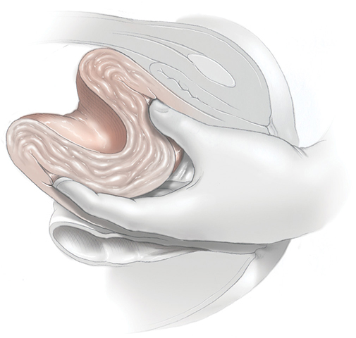

*Figure 42-8. Manual replacement of incomplete inversion: push the inverted fundus upward while the abdominal hand palpates the crater-like depression.*

### Surgical intervention

- Manual replacement fails (e.g., dense **constriction ring**) → **laparotomy**.
- **Huntington procedure:** after tocolysis, push from below + **atraumatic clamps on each round ligament** with upward traction. Deep traction suture or tissue forceps on the fundus may help.
- **Haultain incision:** **posterior sagittal** incision through the constriction ring → reinvert fundus → repair. Risk of scar separation in later pregnancy is **unknown**.
- Immediate **re-inversion** → uterine **compression sutures**.
- Chronic puerperal inversion may present **weeks later**.

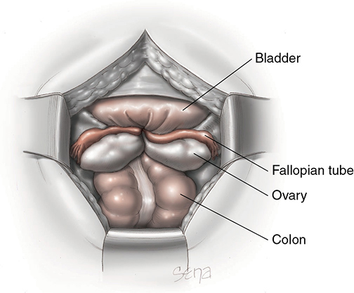

*Figure 42-9. Complete inversion at laparotomy: a "crater" with tubes and ovaries drawn in — the anatomy can be confusing.*

---

## 4. Birth Canal Injuries

### Vulvovaginal lacerations

- **Up to 80%** of vaginal births have some laceration (ACOG).
- Periurethral tears: common, usually superficial; extensive repairs → **voiding difficulty** → indwelling catheter.
- **Middle/upper third** vaginal lacerations: usually with perineal or cervical injury, often **longitudinal**, often after **operative vaginal delivery**, and may bleed heavily → repair with good analgesia, exposure, assistance and resuscitation.
- Extensive vaginal/cervical tears → look for **retroperitoneal hemorrhage or peritoneal perforation**; consider **intrauterine exploration**. Suspected perforation/rupture → **laparotomy**. Large retroperitoneal hematomas → imaging ± **embolization**.

### Cervical lacerations

- Superficial tears in **>½** of vaginal deliveries; most **<0.5 cm**, rarely need repair.
- Deeper tears more likely with **vacuum/forceps**. Incidence **1% nulliparas / 0.5% multiparas** (Consortium) vs **0.16%** (Israel).
- **Colporrhexis** = cervix avulsed from the vagina in a fornix. **Annular (circular) detachment** = avulsion of the entire vaginal portion of the cervix — after forceps through an **incompletely dilated cervix**.
- Tears may reach the **lower uterine segment/uterine artery** or peritoneum. **~11%** of women with cervical laceration needed transfusion (Israel).
- Anterior lip compressed between head and symphysis → rarely **ischemic necrosis** and separation.
- **Exposure:** OR; assistant pushes the uterus down; ring forceps on cervical lips; right-angle or **Breisky** retractors; suction.
- **Tears of 1–2 cm are not repaired unless bleeding** (heal as a stellate os).
- **Repair:** pack vaginal tears meanwhile; **first suture (2-0 chromic or polyglactin) placed ABOVE the upper angle** (bleeding comes from there), then interrupted or continuous locking sutures toward the operator. Uterine involvement + persistent bleeding → surgical/angiographic methods (Ch 44).
- **Later pregnancies:** recurrent lacerations, cervical incompetence, preterm labor, cesarean, severe perineal lacerations.

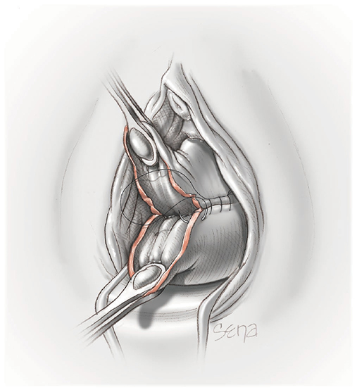

*Figure 42-10. Cervical laceration repair: continuous absorbable suture starting above the upper angle.*

### Puerperal hematomas

- Types: **vulvar, vulvovaginal, paravaginal, retroperitoneal (supralevator)**.
    - **Vulvar:** vestibular bulb or **pudendal artery branches** (inferior rectal, perineal, clitoral).
    - **Paravaginal:** descending branch of the **uterine artery**.
    - **Supralevator** (vessel above pelvic fascia): extends into the upper vagina and can dissect **retroperitoneally** → mass above the inguinal ligament, even up to the hepatic flexure.
- **Risks:** vaginal/perineal laceration, episiotomy, **operative vaginal delivery (esp. forceps)**; can occur **without a laceration**; sometimes coagulopathy.
- **Diagnosis:** **excruciating pain**, tense tender swelling, ecchymosis. Paravaginal → **pelvic pressure, pain, inability to void**. Supralevator may present only as abdominal mass or hypovolemia. **US or CT** useful.

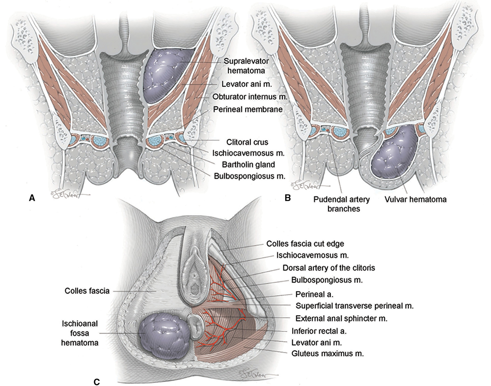

*Figure 42-11. Puerperal hematomas: A. supralevator (above levator ani); B. vulvar (urogenital triangle, pudendal branches); C. ischioanal fossa.*

**Management**

- **Small, non-expanding** → expectant: cool packs, analgesia, catheter if unable to void.
- **Severe pain or enlarging → surgical exploration.** ⚠️ Blood loss is nearly **always greater than estimated**; transfusion frequent.
    - Incise at **maximal distention**, evacuate clots, ligate bleeders (often none found), **obliterate the cavity in layers**.
    - Vaginal hematoma → **pack the vagina with 1–2 gauze rolls for 12–24 h** (record the number).
- **Supralevator:** harder; vaginal/vulvar evacuation, laparotomy, or **angiographic embolization** (primary or after failed surgery). Bakri balloon (paracervical) and US-guided drainage described.
- Hematomas can rebleed up to **2 weeks** postpartum.

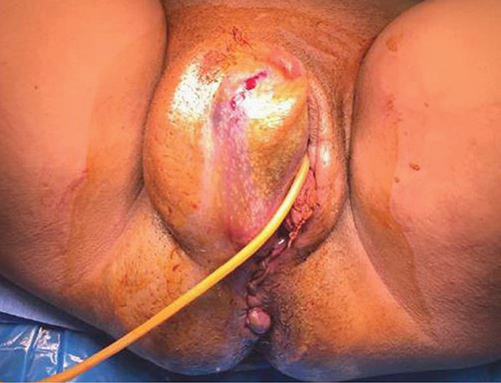

*Figure 42-12. Right vulvar hematoma needing evacuation; Foley catheter placed for bladder drainage.*

---

## 5. Uterine Rupture

### Predisposing factors

- **Primary** = in a previously intact (unscarred) uterus. **Secondary** (more common) = preexisting incision, anomaly or injury.
- Before 1960 primary rupture (grand multiparity) dominated; with rising cesarean and TOLAC, **scar rupture** became predominant; now only **~half** of ruptures are in women with a prior cesarean (Yao).
- **INOSS:** overall **3 per 10,000** births; **0.6/10,000 unscarred vs 22/10,000 with prior cesarean**. Parkland: **5/10,000** (25 of 40 with prior hysterotomy).
- Other risks: **advancing maternal age**; **sequential prostaglandin + oxytocin induction** (high- vs low-dose oxytocin did not differ); curettage/perforation, ablation, **myomectomy**, operative hysteroscopy, **prior rupture**; connective tissue disorders; childhood pelvic radiotherapy; **blunt abdominal trauma** (monitor in late 2nd–3rd trimesters, Ch 50); rudimentary horn; **placenta percreta**.
- Now rare: internal podalic version/extraction, difficult forceps, breech extraction, hydrocephalus, multifetal pregnancy, anomalies.

### Table 42-3. Some Causes of Uterine Rupture

| Preexisting Uterine Injury or Anomaly | Uterine Injury or Abnormality Incurred in Current Pregnancy |
|---|---|
| **Surgery involving the myometrium:** | **Before delivery:** |
| Cesarean delivery or hysterotomy | Persistent, intense, spontaneous contractions |
| Previously repaired uterine rupture | Labor stimulation: oxytocin or prostaglandins |
| Myomectomy incision through or to the endometrium | Intraamnionic instillation: saline or prostaglandins |
| Deep cornual resection of interstitial fallopian tube | Perforation by internal uterine pressure catheter |
| Operative hysteroscopy | External trauma: sharp or blunt |
| Metroplasty | External version |
| Sharp or blunt trauma — assaults, vehicular accidents, bullets, knives | Uterine overdistention: hydramnios, multifetal pregnancy |
| Silent rupture in previous pregnancy | **During delivery:** |
| **Congenital:** | Internal version of second twin |
| Pregnancy in rudimentary uterine horn | Difficult forceps delivery |
| Defective connective tissue — Marfan or Ehlers-Danlos syndrome | Breech extraction |
| | Fetal anomaly distending the lower segment |
| | Vigorous uterine pressure during delivery |
| | Difficult manual removal of placenta |
| | **Acquired:** |
| | Placental accreta spectrum |
| | Gestational trophoblastic neoplasia |
| | Adenomyosis |
| | Sacculation of entrapped retroverted uterus |

### Pathogenesis

- Rupture of an **intact uterus** in labor usually involves the **thinned lower segment**.
    - Near the cervix → tear runs **transversely or obliquely**.
    - Next to the broad ligament → **longitudinal**. May extend up, down into the cervix/vagina, or into the **bladder**.
- Large rent → contents escape into the peritoneal cavity (unless the presenting part is engaged).
- **Fetal prognosis** depends on rent size, placental separation, maternal hypovolemia and **speed of diagnosis/response**.
- Intact overlying peritoneum → bleeding into the **broad ligament → retroperitoneal hematoma**.
- **Inner myometrial (incomplete) tear** after vaginal birth in an unscarred uterus: vertical into the active segment, not visible from below → torrential bleeding **despite a contracted uterus**, usually stopped only by **clamping both uterine artery pedicles** (found at hysterectomy).

### Management and outcomes

- Clinical presentation and management → Ch 31.
- Uterine rupture = **~10% of hemorrhage-related maternal deaths**. Hysterectomy may be needed. High perinatal mortality and neurological morbidity. Maternal **obesity** worsens neonatal outcomes.
- After prior rupture: **cesarean before labor** or at onset of preterm labor (Fox).

### Table 42-4. Some Maternal and Perinatal Outcomes in 72 Women with Uterine Rupture

| Outcomes | Parkland Hospitalᵃ | Australia–New Zealandᵇ |
|---|---|---|
| Number | 40 | 32 |
| **Maternal** | | |
| Blood loss | 2500 mLᶜ | 2580 mLᵈ |
| Transfusions | 55% | 63% |
| Hysterectomy | 27% | 10% |
| ICU admission | 17% | NS |
| **Perinatal** | | |
| Cord artery pH | 7.07ᶜ | NS |
| Cord pH <7.0 | 35% | NS |
| 5-min Apgar <7 | 25% | NS |
| NNICU | 47% | 13% |
| HIE | 15% | NS |
| Death | 5% | 16% |

*ᵃData from Yule, 2019. ᵇData from Chang, 2020. ᶜMedian. ᵈMean. HIE = hypoxic ischemic encephalopathy; ICU = intensive care unit; NNICU = neonatal intensive care unit; NS = not stated.*
*The printed footnote reads "Date from Yule", an obvious typo for "Data".*

---

## 6. Amnionic Fluid Embolism (AFE)

### Pathophysiology

- Classically **IV embolization of meconium-laden amnionic fluid** → rapid **cardiorespiratory collapse + profound consumptive coagulopathy**.
- Old "obstruction" theory abandoned: fetal squames/trophoblast are **commonly found in maternal blood at normal delivery**, and clear fluid is innocuous in animals. **Meconium-laden fluid** is the likely potent trigger.
- Mechanism resembles **SIRS**:
    1. Transient **pulmonary vasoconstriction/hypertension** → **acute RV failure** (RV infarction, septal shift) → ↓ LV output.
    2. **LV dysfunction → cardiogenic pulmonary edema + systemic hypotension**; severe **hypoxemia** from shunting.
    3. Survivors of these phases **invariably develop DIC**: fetal **tissue factor activates factor VII** (and X).
- **Classic triad: hypoxia/respiratory compromise + hemodynamic collapse + consumptive coagulopathy.**
- Autopsy: fetal elements in **75%**; in **50%** of pulmonary-artery buffy coat aspirates. Special stains may be needed.

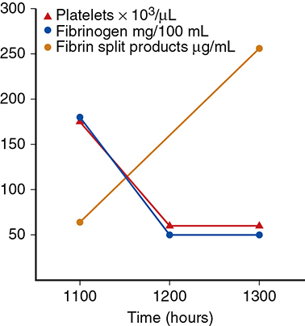

*Figure 42-14. Fatal AFE: within 1 h fibrinogen and platelets plunge (~180 → 50) while fibrin split products soar — the coagulopathy is abrupt.*

### Incidence and risk factors

- **1–2 per 100,000 births**; case-fatality **11–43%**. Causes **5–15%** of pregnancy-related deaths (US, Canada, France).
- **Predisposing:** **rapid labor, meconium-stained fluid**, tears into uterine/large pelvic veins.
- Also: older age, postterm, induction/augmentation, eclampsia, cesarean/forceps/vacuum, abruption/previa, hydramnios.
- **Uterine hypertonus is an EFFECT, not a cause:** uterine blood flow stops at **>35–40 mm Hg**, so a hypertonic contraction is the least likely time for fluid entry → **oxytocin hypertonus not implicated**.

### Diagnosis

- **Clinical diagnosis — no confirmatory lab test.** Classic: late labor or immediately postpartum, woman **gasps for air → seizures or cardiorespiratory arrest → massive DIC hemorrhage**.
- Only **60%** of autopsy-confirmed cases met all four criteria.
- **Forme fruste:** isolated acute consumptive coagulopathy after an otherwise uncomplicated delivery.
- **Differential:** MI, pulmonary or air embolism, high spinal, eclampsia, anaphylaxis. ⚠️ Unrecognized **hemorrhage with dilutional coagulopathy may be mislabeled AFE**.

### Table 42-5. Diagnostic Criteria for Amnionic Fluid Embolism

| Criteria (all four) |
|---|
| Clinical onset **during labor or within 30 minutes of placental delivery** |
| **Abrupt onset of cardiorespiratory arrest**, or both **hypotension and respiratory compromise** |
| **Overt disseminated intravascular coagulopathy** |
| **No fever ≥38°C** |

*Adapted from Clark, 2016; Pacheco, 2020.*

### Management

- Hypertensive phase is transient → **immediate high-quality CPR + ACLS** (Ch 50). Coagulopathy per Ch 44.
- Post-resuscitation: avoid **fever and hyperoxia** (worsen brain reperfusion injury). Targets: **temperature 36°C, MAP 65 mm Hg**. Intubation usually needed.
- **RV failure → inotrope (dobutamine)**; later systemic hypotension → **vasopressor (norepinephrine)**.
- ⚠️ **Avoid excess fluid** → worsens RV dilation, RV infarction, septal shift.
- **ECMO:** VV-ECMO for hypoxemic respiratory failure without ventricular failure; VA-ECMO for impending arrest/ventricular failure. 20 ECMO cases: mortality **15%** (publication bias likely).
- **Check coagulation immediately**; DIC is often worsened by **atony**.
- ⚠️ **Avoid carboprost** in suspected AFE (pulmonary vasoconstriction).

### Outcomes

- Maternal mortality: **60%** (California), **30–41%** (INOSS); **89% if presenting with cardiac arrest**. 12 of 34 died **within 30 min**.
- Only **8%** of arrest survivors are neurologically intact (Clark). Prognosis tracks **severity/cardiac arrest**, not any specific treatment.
- **Neonatal survival ~70%**, but **up to half** have neurological impairment; outcome inversely related to **arrest-to-delivery interval**. 28% asphyxiated (Canada).

> **Memory hook:** AFE = **"Gasp, Crash, Bleed"** — hypoxia, hemodynamic collapse, DIC — within **30 min** of delivery, **no fever**.

---

## Quick-Recall: Causes of PPH ("4 Ts") and Their Fixes

> **Memory hook:** the classic **4 Ts** — **Tone, Trauma, Tissue, Thrombin** — map onto this chapter's causes.

| "T" | Chapter cause | Clue | First-line action |
|---|---|---|---|
| **Tone** | Uterine atony (commonest) | **Boggy uterus**, clots on massage | Massage + **oxytocin** → methylergonovine / carboprost / misoprostol → TXA → bimanual compression → balloon → surgery |
| **Trauma** | Lacerations, hematomas, rupture, inversion | **Bleeding despite a firm uterus**; excruciating pain (hematoma); no fundus palpable/mass in vagina (inversion) | Inspect & repair (**suture above apex**); evacuate expanding hematoma; replace inverted uterus (tocolysis) |
| **Tissue** | Retained placenta/fragments, PAS | Incomplete placenta on inspection | **Manual removal/exploration** under analgesia ± cefazolin |
| **Thrombin** | DIC (abruption, AFE, sepsis, HELLP, massive transfusion) | Oozing, low fibrinogen/platelets | Blood components, correct coagulopathy (Ch 44) |

| Drug | Dose | Avoid in |
|---|---|---|
| Oxytocin | 20 U/L at 10 mL/min (200 mU/min) | **IV bolus** |
| Methylergonovine | 0.2 mg IM q2–4h | **Hypertension/preeclampsia**, HIV protease inhibitors |
| Carboprost | 250 µg IM q15–90 min, max 8 | **Asthma**, pulmonary hypertension, AFE |
| Misoprostol | 600–1000 µg PR/PO/SL | — |
| Tranexamic acid | 1 g IV | — |
| Tocolysis for inversion | Terbutaline 250 µg SC / NTG 50–100 µg IV / MgSO₄ 4 g IV | — |

## Key Numbers to Memorize

- **PPH = >1000 mL cumulative** (or hypovolemia); incidence **5.3% vaginal / 10.5% cesarean**
- Spiral artery flow **≥600 mL/min** near term; ~**120** spiral arteries
- Blood volume **↑30–60%** (plateau **34 wk**); **40–80%** twins; only **~10%** in eclampsia
- Nonpregnant BV = **(height in × 50 + weight lb × 25) ÷ 2**; loss = added volume **+ 500 mL per 3-vol% Hct fall**
- 3rd stage **>20 min** ↑ PPH; late PPH = **>24 h**, up to **1%**
- Bakri: **300–500 mL**, remove ~**12 h**; Foley balloon **60–80 mL**; balloon success **~85%**
- Carboprost success **88%**, side effects **20%**, max **8 doses**; ergots act **~45 min**
- WOMAN trial: TXA **1 g** → deaths **1.2% vs 1.7%**
- Inversion **1:2000–1:20,000**; ¼ need transfusion
- Lacerations in **up to 80%** of vaginal births; cervical tears **1–2 cm** not repaired unless bleeding
- Rupture **3/10,000** overall (**0.6 unscarred vs 22 scarred**); **~10%** of hemorrhage deaths
- AFE **1–2/100,000**; onset **≤30 min** after placenta; mortality **89% with arrest**; only **8%** of arrest survivors intact; neonatal survival **70%**; targets **36°C, MAP 65**
