# Chapter 43: Hemorrhagic Placental Disorders — Revision Notes

> Williams Obstetrics 26e, pp. 1943–1999 of the PDF. High-yield numbers are in **bold**.
> The four tables are transcribed from the PDF images (they are missing from the extracted chapter text). All 14 figures are included from the PDF (Fig 43-11 is printed three times, on pp. 1975–1977; one copy is used).

**Big picture:** At term **>600 mL/min** flows through the intervillous space, so placental separation can be torrential. Three placental disorders contribute substantially to maternal deaths in the second half of pregnancy: **placental abruption**, **placenta previa** and **placenta accreta spectrum (PAS)**. PAS is now more common because of rising cesarean rates.

---

## 1. Placental Abruption

### Definition and etiopathogenesis
- **Placental abruption (abruptio placentae)** = partial or total separation of the placenta from its implantation site **before delivery** ("rending asunder"; usually a sudden event).
  - "Premature separation of the normally implanted placenta" is the most exact term because it **excludes previa**.
- Likely starts with **rupture of a decidual spiral artery** → bleeding into the **decidua basalis** → expanding **retroplacental hematoma** splits the decidua (a thin layer stays on the myometrium) and lifts and compresses the placenta.
- Predispositions: **impaired trophoblast invasion with atherosis** (preeclampsia), inflammation or infection. Histology **cannot date** the abruption.
- Early abruption may be asymptomatic.

**External vs concealed hemorrhage**
- Usually blood dissects between membranes and uterine wall and escapes through the cervix → **external bleeding**.
- Less often blood is retained → **concealed hemorrhage** → delayed diagnosis, **greater maternal and fetal hazard**, and **more consumptive coagulopathy** (higher intervillous pressure forces more **placental thromboplastin** into the maternal circulation).

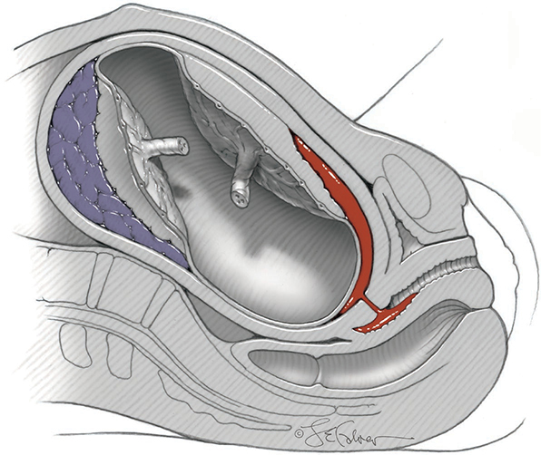

*Figure 43-1. Left: total abruption with concealed hemorrhage. Right: partial abruption with blood dissecting between membranes and decidua to the cervix (external bleeding).*

**Source of blood: maternal**
- Nontraumatic abruption: blood is **almost all maternal** (villi are initially intact).
  - Fetal-to-maternal hemorrhage in only **20%**, all **<10 mL** (78 women, Parkland). Fetal cells in maternal blood in only **4%** (68 women).
- Placenta: a **circumscribed depression** a few cm wide covered by **dark clot**. A very fresh separation may look **normal** (changes take minutes). **Clot "age" cannot be determined** exactly.

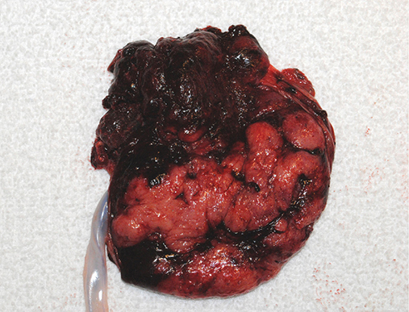

*Figure 43-2. Partial abruption: a dark, adherent clot that has depressed the placental substance (probably several hours old).*

**Severity**
- Williams: abruption is **severe when the fetus dies**.
- **Ananth definition of severe abruption** (≥1 of):
  1. **Maternal:** DIC, shock, transfusion, hysterectomy, renal failure, death
  2. **Fetal:** nonreassuring status, FGR, death
  3. **Neonatal:** death, preterm delivery, FGR

### Traumatic abruption
- Motor vehicle crashes, assault; can follow **relatively minor trauma**.
- **Fetomaternal hemorrhage is more common** than in spontaneous abruption (placental tears/"fractures"): **80–100 mL in 3 of 8** Parkland cases.
- A nonreassuring FHR (e.g., **sinusoidal**) may be the **only sign** of separation.
- ⚠️ After blunt abdominal trauma, **uterine contractions are the single most important predictor** of abruption (see Ch 50).

### Chronic abruption
- Separation **not followed by delivery**; may start early in pregnancy.
- Associations: abnormally ↑ **maternal serum aneuploidy markers**; 1st- and 2nd-trimester bleeding → 3rd-trimester abruption.
- **CAOS = chronic abruption–oligohydramnios sequence.**
- Arrested late hematomas may show ↑ **MSAFP** or placenta-specific RNAs.

### Frequency
- **~0.5% (1 in 200)** deliveries on average; **nearly 1%** in a US database of >125 million births; **1 in 290** at Parkland (2000–2015).
- Rising in the US, mostly in **Black women** (partly conservative management of early preeclampsia).
- **Abruption severe enough to kill the fetus** at Parkland: **0.24% (1 in 420)** in 1956–1967 → **0.05% (1 in 2060)** through 2020 (fewer high-parity births; more prenatal care and emergency transport).

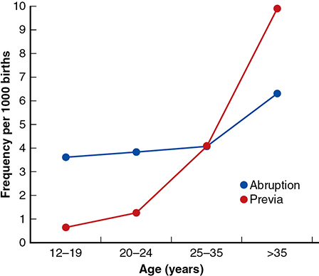

*Figure 43-3. Abruption (~4 per 1000) rises modestly after 35 yr (~6.3); previa climbs steeply with age (~0.6 → ~10 per 1000 after 35 yr).*

### Perinatal morbidity and mortality
- Frequency rises across the 3rd trimester: **more than half** of Parkland abruptions occurred at **≥37 wk**. Morbidity and mortality are worse with **earlier abruption** and with **preeclampsia**. Associated with **major congenital anomalies**.
- **10–12% of all 3rd-trimester stillbirths** at Parkland are from abruption.
- **PMR 119/1000** with abruption vs **8/1000** overall (US, >15 million births).
- **15% of liveborn neonates die** (Parkland). Deaths mainly from **asphyxia and prematurity**.
- 20% had severe acidemia and **20% of survivors had cerebral palsy** (43 liveborns); **35%** had umbilical artery **pH <7.00** (84 liveborns).

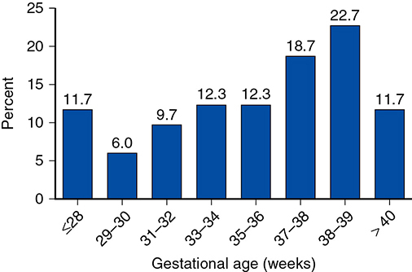

*Figure 43-4. Abruption by gestational age at Parkland: >50% at ≥37 wk. (The x-axis label printed "38–39" after "37–38" is probably 39–40.)*

### Predisposing factors

### Table 43-1. Risk Factors for Placental Abruption

| Risk Factor | Relative Risk |
|---|---|
| **Prior abruption** | **10–188** |
| Increased age and parity | 1.3–2.3 |
| Preeclampsia | 2.1–4.0 |
| Chronic hypertension | 1.8–3.0 |
| Chorioamnionitis | 3.0 |
| Preterm ruptured membranes | 2.4–4.9 |
| Multifetal gestation | 2–8 |
| **Low birthweight** | **14.0** |
| Hydramnios | 1.9 |
| Cigarette smoking | 1.4–1.9 |
| Single umbilical artery | 3.4 |
| Cocaine use | — |
| Uterine leiomyoma | 2.6 |
| Subchorionic hematoma | 5.7 |

*Data from Aviram, 2015; Downes, 2017; Gutvirtz, 2016; Khazaei, 2019; Kortekaas, 2020; Morgan, 2016; Ruiter, 2015; Tuuli, 2011.*

**Demographic**
- **Advancing maternal age** (data on great parity conflict).
- Race: abruption killing the fetus in **1 in 200** Black and white women, **1 in 300** Asian, **1 in 350** Latina (366,000 Parkland deliveries).
- **Familial**: a sister's risk is **doubled** after a severe abruption. Candidate genes in mitochondrial pathways.

**Hypertension: the most frequent association**
- Gestational hypertension, preeclampsia, chronic hypertension; **HELLP** ↑ risk. Expectant management of preterm preeclampsia → abruption in **4%**.
- 408 abruptions with fetal death: **hypertension in half** once hypovolemia was corrected; **¼ of all** had chronic hypertension.
- Chronic hypertension: abruption **1.5%** (MFMU). Treated chronic hypertension **with significant proteinuria ~1%** vs **0.3%** without. Superimposed preeclampsia or FGR → higher still.
- **Severity of hypertension does not correlate** with abruption incidence; but preeclampsia + abruption → worse outcomes.
- Prior abruption → ↑ long-term **cardiovascular mortality**.
- **MgSO₄** (Magpie) may ↓ abruption; **aspirin 100 mg/d** may ↓ abruption (meta-analysis).

**Preterm prelabor rupture of membranes**
- **5%** with ruptured membranes at 20–36 wk; **17%** with **previable** PPROM; higher still with **infection**.
- **Hydramnios**: **8×** at ≥34 wk (one cohort); **2×** in a meta-analysis. **Abrupt uterine decompression** may trigger it.

**Prior abruption (recurrence)**

| Study | Recurrence |
|---|---|
| Abruption with fetal death (Pritchard) | **12%**, half with another fetal death |
| Furuhashi | **22%**; half recurred **1–3 wk earlier** |
| Dutch longitudinal (Ruiter) | **5.8%** |
| Population (767,000) | **7×** for "mild", **12×** for "severe"; after **2 severe → 50×** for a third |

- ⚠️ **Antepartum fetal testing is not predictive**: testing is usually reassuring right before a recurrence.
- Ruiter recommends **induction at 37 wk**; Williams: reasonable to **induce at 38 completed weeks**.

**Other associations**
- **Smoking: 2×** (meta-analysis, 1.6 million); **5–8×** with chronic hypertension and/or severe preeclampsia.
- **Cocaine:** 8 of 50 users had a stillbirth from abruption.
- Serum markers: abnormal **MSAFP, inhibin, PAPP-A**; 3rd-trimester **MSAFP >280 µg/L** may predict.
- **Subclinical hypothyroidism / antithyroid antibodies: 2–3×.**
- Lupus anticoagulant → **maternal floor infarction**, less so typical abruption.
- ⚠️ **Thrombophilias: no convincing link** to abruption (ACOG).

### Diagnosis
- Classic triad: **sudden abdominal pain, vaginal bleeding, uterine tenderness**.

| Finding (Hurd, 1983) | Frequency |
|---|---|
| Vaginal bleeding | **78%** |
| Uterine tenderness or back pain | **66%** |
| Nonreassuring fetal status | **60%** |
| Misdiagnosed as **preterm labor** | **⅕** |

- Also frequent contractions and **persistent hypertonus**.
- Profuse external bleeding may come with only minor separation, and a **concealed abruption** may kill the fetus with no external bleeding. Either can cause **hypovolemic shock**.
- Abruption killing the fetus: blood loss often **≥½ of the pregnant blood volume** (141 women).

### Consumptive coagulopathy
- **Some intravascular coagulation is almost universal.** Abruption is the **most common cause of clinically profound consumptive coagulopathy in obstetrics** (probably in all of medicine).
- Plasminogen → plasmin lyses fibrin microemboli. With fetal death, **FDPs and D-dimers are almost always ↑**, but measuring them is **not clinically useful**.
- **Fibrinogen <150 mg/dL in ⅓** of abruptions that kill the fetus. It depends on the **pre-abruption level** (higher = "protective"). Measure to guide replacement.
- Other factors ↓ → replaced empirically with **FFP** in massive transfusion protocols. **Thrombocytopenia** may accompany; **dilutional coagulopathy** from repeated transfusion adds to DIC.
- **More likely with concealed abruption**; **less common with partial abruption and a live fetus**. If serious coagulopathy develops, it is **usually evident by the time symptoms appear**.
- Parkland case: presented with only a **nosebleed**, dead fetus, **fibrinogen 25 mg/dL** → total abruption.

### Couvelaire uterus
- **Uteroplacental apoplexy** = widespread extravasation of blood into the myometrium and beneath the serosa, seen at cesarean.
- May cause **atony** but is **NOT by itself an indication for hysterectomy**.
- Blood may also collect under the tubal serosa, in the broad ligaments, ovaries or peritoneal cavity.

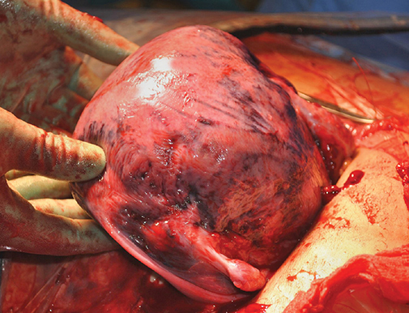

*Figure 43-5. Couvelaire uterus after total abruption: blood infiltrates the myometrium to the serosa. Not an indication for hysterectomy on its own.*

### End-organ injury
- **AKI** from delayed or incomplete treatment of hypovolemia; **prompt, vigorous blood and crystalloid usually prevents it**, even with severe DIC. Risk ↑ with **preeclampsia**.
- Most AKI is reversible without dialysis; occasionally **irreversible acute cortical necrosis**.
- Rarely **Sheehan syndrome** (pituitary failure) after severe hemorrhage.

### Differential diagnosis
- Severe abruption is usually obvious; lesser degrees are a **diagnosis of exclusion**.
- **Sonography sensitivity only 24%** (149 women) → **a negative scan does not exclude abruption** (placenta and fresh clot look alike).
- **MRI is highly sensitive**: consider it if the result would change management. D-dimer may be suggestive (not adequately tested).
- Bleeding with a live fetus → look for **previa** and other causes.
- "Painful bleeding = abruption, painless = previa" is **not reliable**: labor with previa hurts; abruption may mimic labor or be **painless (especially with a posterior placenta)**.

### Management
- Depends on maternal and fetal condition, gestational age and the amount of hemorrhage. **Start prompt, intensive resuscitation with blood and crystalloid** in all cases.

| Situation | Approach |
|---|---|
| **Live, viable fetus**, vaginal delivery not imminent | **Emergency cesarean** (most) |
| **Dead or previable fetus** | **Vaginal delivery** preferred |
| Uncertain diagnosis, live uncompromised fetus | **Close observation** with immediate intervention available |
| Preterm fetus, no compromise | Expectant management possible; Williams: **tocolysis contraindicated** |

- ⚠️ Confirm fetal heart activity by **sonography**: a scalp electrode on a dead fetus can record the **maternal heart rate**.

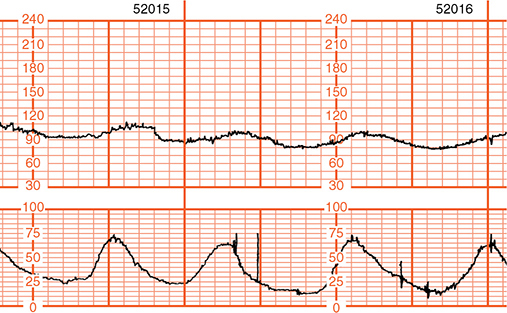

*Figure 43-6. Abruption with fetal compromise: uterine hypertonus (baseline 20–25 mm Hg, contractions to ~75 mm Hg) with fetal bradycardia and repetitive late decelerations.*

**Cesarean delivery**
- **Speed matters.** Abruption with bradycardia: **15 of 22 intact survivors** delivered within **20 min** of the decision; **8 of 11** who died or got cerebral palsy were delivered **after 20 min**. Decision-to-delivery interval correlates inversely with cord pH.
- Abruption is one of the strongest antecedents of **cooling for neonatal encephalopathy**.
- Major hazard: **consumptive coagulopathy** → **two large-bore IV lines**, blood and components ready. Guide replacement with **Hb, platelets, fibrinogen, PT and PTT**.

**Vaginal delivery (dead fetus)**
- ⚠️ **Placental-site hemostasis depends on myometrial contraction, not on coagulation** → use **uterotonics and uterine massage**.
- Cesarean may still be needed for **brisk hemorrhage** not controlled by vigorous replacement, or other obstetrical indications.
- Labor may be rapid because of **persistent hypertonus**: baseline intraamnionic pressure **≥50 mm Hg**, contractions **>100 mm Hg**. Overall 1st and 2nd stages are **not shorter** than usual.
- **Early amniotomy**: long championed (spiral artery compression, less thromboplastin entry); no proof, but may hasten delivery. An intact sac may dilate the cervix better if the fetus is small.
- **Oxytocin in standard doses** if rhythmic contractions are not superimposed on hypertonus; it does **not** worsen coagulopathy.
- **Misoprostol** is less favored (**tachysystole**).
- ⚠️ **No arbitrary time limit** to delivery: maternal outcome depends on **diligent fluid and blood replacement**, not the interval. Women transfused for **≥18 h** before delivery did as well as those delivered sooner.

**Expectant management (immature fetus)**
- 43 women <35 wk (31 given tocolysis): delivery gained **~12 days**; cesarean **75%**; no stillbirths.
- CAOS: abruption at ~20 wk → oligohydramnios → delivery ~28 wk.
- Abruption <28 wk (256 women): mean gain **1.6 wk**; **65%** delivered <29 wk; half emergent cesarean.
- ⚠️ **Continuous FHR monitoring does not guarantee safety**: a normal tracing may precede sudden further separation and fetal death.
- **Tocolysis:** PMR **5% with or without** it (131 women <36 wk); one RCT (MgSO₄ at 24–34 wk) showed no benefit. **Terbutaline tachycardia may mask maternal compromise.**
- **Williams: suspected abruption contraindicates tocolytics.**

---

## 2. Placenta Previa

### Classification (NIH Fetal Imaging Workshop, 2014)
- *Previa* = "going before": the placenta precedes the fetus into the birth canal, implanted in the **lower uterine segment** over or very near the internal os.

| Term | Definition |
|---|---|
| **Placenta previa** | Internal os **covered partially or completely** by placenta (formerly "total" or "partial" previa) |
| **Low-lying placenta** | Edge does **not cover** the os but lies **within 2 cm** of it (formerly includes "marginal previa") |
| **Vasa previa** | **Fetal vessels** run through the membranes over the os (see Ch 6) |

- Classification can **change with cervical dilation** (low-lying at 2 cm may become partial previa at 4 cm; total may become partial).
- ⚠️ **Digital palpation to assess the placental edge usually causes severe hemorrhage!**
- Some separation (bleeding) is **inevitable** as the lower segment forms and the cervix dilates; this is not termed abruption.

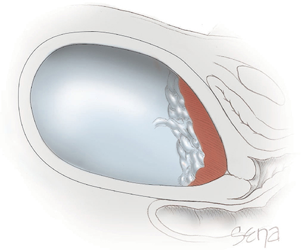

*Figure 43-7. Placenta previa covering the internal os: any cervical dilation will cause copious bleeding.*

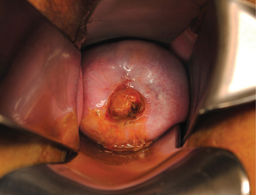

*Figure 43-8. Speculum view: placenta protruding through the cervical os.*

### Placental "migration"
- A **misnomer**: villi are anchored and do not move. Apparent movement is from:
  1. Imprecise **2-D sonography**
  2. **Differential growth** of the lower vs upper segments
  3. **Trophotropism**: growth toward the better-perfused fundus
- Many "migrating" placentas never truly covered the os circumferentially.
- **Less likely to migrate with a prior cesarean scar** (previa more likely to persist).
- Midpregnancy (4300 women): **12% low-lying**. If **not covering** the os → previa did not persist, no bleeding. If **covering** the os → **~40% persisted** to delivery.
- A placenta near but not over the os until the early 3rd trimester is **unlikely to persist**.

### Incidence and risk factors
- **~0.4% (1 in 250–400)** deliveries; rising. Parkland: **2.6/1000** (1988–2003) → **3.8/1000** (2004–2020).

| Factor | Data |
|---|---|
| **Maternal age** | FASTER: **0.5%** if <35 vs **1.1%** if ≥35. Parkland: ~**0.65/1000** at ≤19 yr → **~10/1000** at >35 yr |
| **Multiparity** | **2.2%** with parity ≥5 (age and parity confounded); interpregnancy interval no effect |
| **Smoking** | **≥2×** (CO hypoxemia → placental hypertrophy; decidual vasculopathy) |
| **Prior cesarean** (foremost) | **1.3%** with 1 prior → **3.4%** with ≥6 prior (MFMU, 30,132). Cesarean in 1st pregnancy → **1.6×** previa in 2nd. Parity >4 with >4 cesareans → **8×** |
| **Multifetal gestation** | ↑; **dichorionic > monochorionic** (two implantation sites) |
| **Unexplained ↑ MSAFP** | ↑ previa; previa with MSAFP **>2.0 MoM** at 16 wk → more late bleeding and preterm birth |
| **ART** | ↑ even after adjusting for multiples |
| **Leiomyomas** | ↑ (systematic review, ~256,000 births) |

- ⚠️ **Previa + prior uterine incision → PAS and hysterectomy**: hysterectomy in **6%** with previa at primary cesarean vs **25%** at repeat cesarean.

### Clinical features
- **Painless bleeding** is the most characteristic event, usually **near the end of the 2nd trimester or later** (can be before midpregnancy; some late abortions).
- The first **"sentinel bleed"** comes without warning, is **rarely fatal**, usually stops, then **recurs**.
- **~10%** (especially placenta near, not over, the os) do not bleed **until labor**; this can mimic abruption.
- **Mechanism:** lower segment forms and the os dilates → placental separation. Bleeding is worse because **lower-segment myometrium contracts poorly** and cannot constrict torn vessels. It also continues **after placental delivery**; friable cervix and lower segment lacerate (especially after manual removal).
- **Cervical length:** 3rd-trimester **<30 mm** → more hemorrhage, contractions and preterm birth (one study). **<25 mm** at admission for bleeding → more delivery within 7 days (one study). Other studies disagree.
- **PAS is a frequent, serious association**: poorly developed lower-segment decidua. Placental bed biopsies: spiral arterioles infiltrated by **trophoblastic giant cells in 50%** vs 20% of controls. Abnormal attachment in **7%** of 514 previas.
- ⚠️ **Coagulopathy is rare** with previa, even with extensive separation: thromboplastin escapes through the cervix, and the area has **few large myometrial veins**.

### Diagnosis
- Bleeding after midpregnancy → always consider **previa and abruption**. Previa = **21%** of admissions for bleeding at **22–28 wk**.
- ⚠️ **Do not exclude previa until sonography clearly proves its absence.**
- No sonography available → digital exam only in the **OR with a "double set-up"** (prepared for immediate cesarean). Even the gentlest exam can cause torrential bleeding.
- **Transabdominal** sonography first: excellent sensitivity and NPV when the placenta clearly overlies the cervix or lies away from the lower segment.
  - Pitfalls: **obesity**; a **full bladder** elongates the cervix and compresses the lower segment, **mimicking previa**.
- **Transvaginal sonography = most accurate**, and **safe even with bleeding**. Internal os seen in **100%** transvaginally vs **30%** transabdominally.
- **MRI**: excellent images but won't replace ultrasound for routine use; **useful for PAS**.

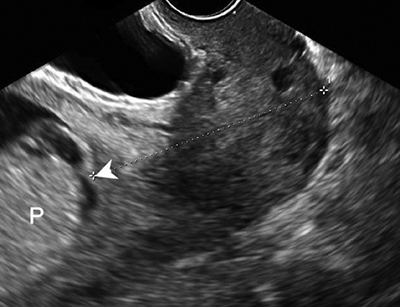

*Figure 43-9. Transvaginal sonogram at 21 wk: posterior placenta (P) completely covers the internal os (arrowhead); dotted line = cervical canal.*

**Parkland follow-up imaging**

| Finding at 18–22 wk | Re-image |
|---|---|
| Previa **+ prior cesarean** | **28 wk**, then **32 wk** if persistent |
| Previa, no prior cesarean | **32 wk** |
| Edge still **<2 cm** from os at 32 wk | TVS again at **36 wk** |

- Activity restriction only if previa persists **beyond 28 wk** or with bleeding/contractions earlier.

### Management
- Individualized by **fetal maturity, labor and bleeding severity**. Emergency delivery in **43%** (half preterm) of 214 women; overall **25–40%**.
- **Bleeding subsides, fetus immature** → close observation in an obstetrical unit.
- **Tocolytics:** some limit to **48 h**; ⚠️ Williams **categorically recommends against** them (hypotension/tachycardia mask maternal compromise).
- **Discharge** after bleeding has stopped for **~2 days** with a healthy fetus → **"pelvic rest"**, must be able to return immediately. **SMFM: no routine cervical length screening.**
- Long-term inpatient care adds **no benefit** over outpatient care in selected women. RCT (53 women, 24–36 wk): no difference; **60% rebled**, **half** needed expeditious cesarean.
- **Timing (ACOG/SMFM): uncomplicated previa → deliver at 36⁰⁄₇–37⁶⁄₇ wk.** Parkland: elective cesarean usually at **38⁰⁄₇ wk**.

### Delivery
- **Practically all by cesarean.** Some prefer a **vertical skin incision** (fast entry, room for hysterectomy).
- **Emergent in >½** for hemorrhage; **~¼** need transfusion.
- Low transverse hysterotomy is usually possible, but cutting an **anterior placenta** may cause **fetal bleeding** → deliver quickly; a **vertical uterine incision** may be better at times. Outcomes are rarely compromised even when incising through the placenta.

**Controlling implantation-site bleeding (poorly contracting lower segment)**
1. **Uterotonics and pressure**
2. **Oversew** the site with **no. 0 chromic**; **Cho sutures** (interrupted sutures at **1-cm intervals** in a circle around the bleeding area); **compression sutures** through anterior and posterior walls
3. **Bakri or Foley balloon tamponade** ± compression sutures
4. **Bilateral uterine or internal iliac artery ligation**; **pelvic artery embolization**
5. **Hysterectomy** if these fail and bleeding is brisk

- Prophylactic **internal iliac balloon occlusion** did **not** reduce PPH or morbidity (RCT).
- Hysterectomy rate with previa **without PAS ~2%**. Peripartum hysterectomy: **40%** done for abnormal placentation (UK, 318); **44%** of Parkland cesarean hysterectomies were for bleeding previa or PAS.

### Maternal and perinatal outcomes
- **Maternal mortality ~3×**; previa alone caused **~3%** of US hemorrhage deaths (2006–2013).
- **Preterm delivery** is the main cause of perinatal death; neonatal death is ↑ even **at term**.
- **Fetal anomalies 2–3×** more common.
- **FGR**: association minimal after controlling for gestational age (most LBW is preterm); slight ↑ in a meta-analysis. Similar with PAS.

---

## 3. Placenta Accreta Spectrum (PAS)
- **PAS** = abnormally implanted, invasive or adhered placenta (Latin *ac- + crescere*, "to adhere"). Also called the **morbidly adherent placenta**; in Europe, "pernicious placenta previa with accreta."

### Etiopathogenesis
- Main problem: the placenta **fails to separate** from the myometrium after delivery.
- Partial or total **absence of the decidua basalis** and imperfect **Nitabuch (fibrinoid) layer** → no physiological cleavage plane → **villi attach directly to smooth muscle**.
- Not just decidual deficiency: **cytotrophoblast-controlled invasion** (angiogenesis), immunologically mediated **"hyperinvasiveness"**, and highly expressed remodeling/adherence genes.
- **Myometrial fibers on the basal plate** in a prior pregnancy predict later PAS → a "**constitutional endometrial defect**".
- Prior surgical trauma increases vulnerability to invasion. **Cesarean scar pregnancy (CSP) is a precursor**: CSP and PAS lie on one spectrum. Early rupture and hemorrhage are common with CSP, so many women choose termination.

### Classification (by depth of invasion)

| Variant | Villi | Approximate frequency (general) | Referral center |
|---|---|---|---|
| **Accreta** | **Attached to** the myometrium | **80%** | 22% |
| **Increta** | **Invade** the myometrium | **15%** | 24% |
| **Percreta** | Penetrate **through** the myometrium **to or through the serosa** | **5%** | 54% |

- **Total** = all lobules abnormally adherent; **focal** = all or part of a single lobule.
- Histological diagnosis needs **myometrium** (placenta alone is not enough). FIGO has proposed a clinical classification.

> **Memory hook:** **A**ccreta **A**ttaches, **I**ncreta **I**nvades, **P**ercreta **P**enetrates (80 : 15 : 5).

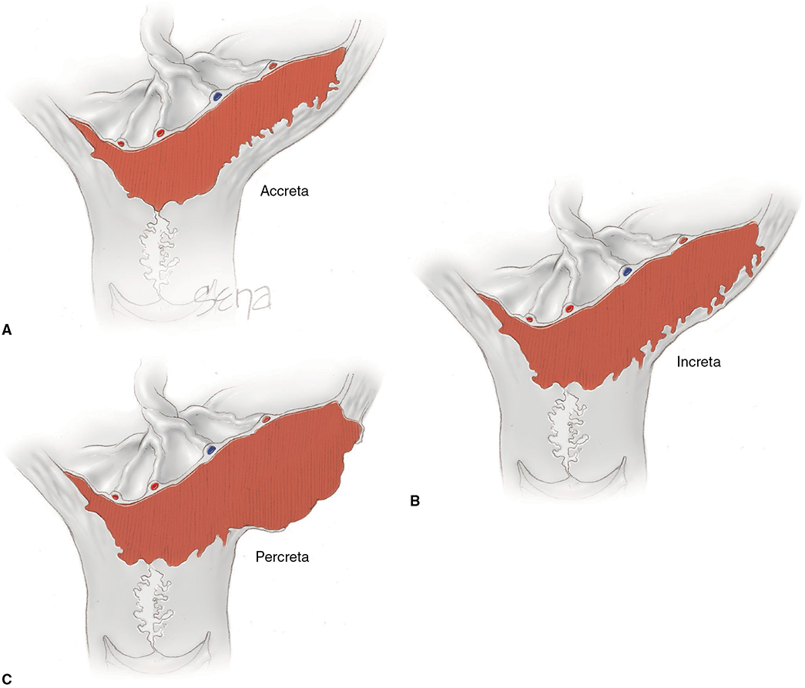

*Figure 43-10. PAS: (A) accreta, (B) increta, (C) percreta through the serosa toward the bladder.*

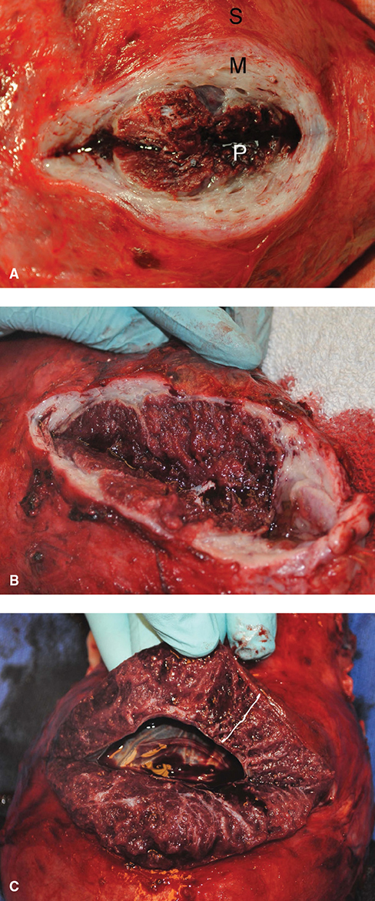

*Figure 43-11. Increasing invasion at surgery: (A) minimal, myometrium (M) intact; (B) deeper; (C) placenta reaching the serosa with no myometrium left.*

### Incidence and risk factors
- **1 in 20,000** (1951) → **1 in 2500** (1980s) → **1 in 731** (MFMU, 115,502 women) → **1 in 270** (Nationwide Inpatient Sample). Rise is **directly related to the cesarean rate**.
- **13%** of US pregnancy-related deaths (2006–2013) were from PAS hemorrhage. A leading cause of **emergency peripartum hysterectomy**.
- **Recurrence ~20%** if the uterus is conserved; also ↑ previa, uterine rupture, manual removal, preterm delivery, hysterectomy.

**Risk factors** (similar to previa)
- **The two most important: placenta previa and prior cesarean delivery, especially both.**
- **Classical** hysterotomy > low-segment scar.
- **Almost half** of women with a prior cesarean have myometrial fibers adherent to the placenta microscopically.
- Other myometrial trauma: **curettage, endometrial ablation**. **ART** is an independent risk factor.
- **MSAFP >2.5 MoM → 8×**; **free β-hCG >2.5 MoM → 4×** (>9300 women screened at 14–22 wk).

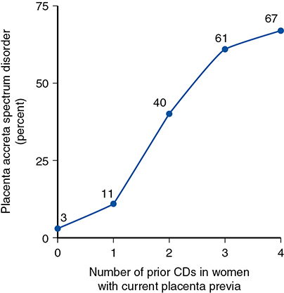

*Figure 43-12. PAS risk with a current previa: 3% (no prior cesarean) → 11% (1) → 40% (2) → 61% (3) → 67% (≥4 prior cesareans).*

### Diagnosis
- 1st- and 2nd-trimester bleeding with PAS usually comes from a **coexisting previa** → sonography.
- 1st trimester: the **smallest myometrial thickness** helps predict later hysterectomy. Screening at 11–13 wk (>22,000): **6%** high risk; 14 suspected, 13 confirmed at delivery (imaging still imperfect).

**Five sonographic signs of PAS**
1. **Placental lacunae** ("lakes")
2. **Thinning of the retroplacental myometrium**
3. **Disruption of the bladder–uterine serosal interface**
4. **Bridging vessels** from placenta to the bladder–serosal interface
5. **Placental bulge** distorting the uterine contour

| Performance | Accreta | Increta | Percreta |
|---|---|---|---|
| Sensitivity (meta-analysis) | **91%** | **93%** | **89%** |
| Specificity | **97%** | **98%** | **99%** |

- ⚠️ These are likely **overestimates** (clinical bias, interobserver variability). Bowman: sensitivity **54%**, specificity **88%**, PPV **82%**, NPV **65%**, accuracy **65%**.
- **Location matters:** detection **90% anterior vs 50% posterior**; posterior PAS → delayed diagnosis and more surgical complications.
- Interpret sonography **with clinical and operative findings**.
- **Color/power Doppler and 3-D** help: invasion suspected if **serosa–bladder interface to retroplacental vessels <1 mm** plus **large lacunae**. **Hypervascularity of the serosa–bladder interface** has the best PPV and NPV for **percreta**. **Intracervical lakes** also reported.
- **Placenta accreta index**: number of prior cesareans, placental location, lacunae, bridging vessels, smallest myometrial distance.

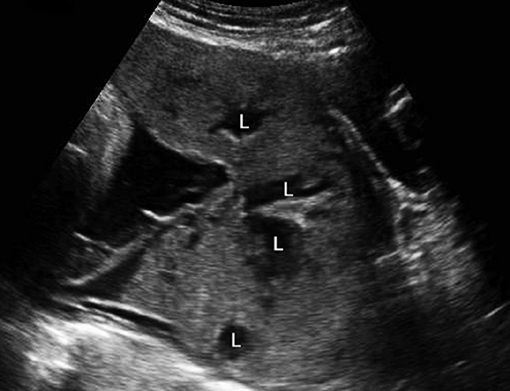

*Figure 43-13. Transabdominal sonogram of percreta: multiple large placental lacunae (L).*

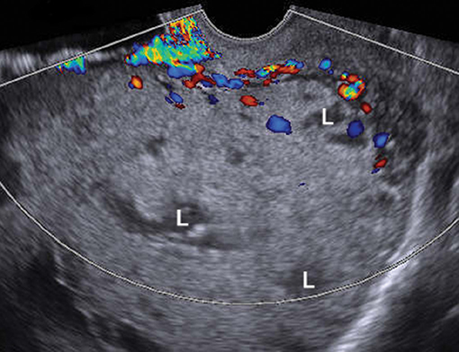

*Figure 43-14. Transvaginal color Doppler in percreta: retroplacental vessels invading the myometrium, with intraplacental venous lakes (L).*

**MRI**
- Defines **invasion of adjacent structures**; good interobserver agreement for diagnosis and depth (less for topography). Shows **pelvic parasitic arteries**. Not all find it helpful.
- **Gadolinium usually not used** in pregnancy (may enhance images).
- **Three MRI signs (Lax):** **uterine bulging**, **dark intraplacental bands on T2**, **heterogeneous placental signal** (lacunae).
- Use when sonography is **inconclusive** or with a **posterior previa**.

### Management: planning
- Key decisions: **timing and facility**. Needs surgical, anesthesia, ICU and **blood bank** capability, plus an obstetrical surgeon or **gynecological oncologist** and surgical, urological and **interventional radiology** consultants.
- **ACOG/SMFM: planned delivery in a tertiary-care facility.** Dedicated on-call teams improve maternal outcomes (meta-analysis).
- Schedule for peak resource availability, but **⅓ need unscheduled delivery** → have contingency plans. Women who **refuse blood** are especially difficult.

### Table 43-2. Criteria to Consider for Delivery of Placenta Accreta Spectrum (PAS) in a Center of Excellence

| Criteria |
|---|
| Sonogram findings suspicious for PAS |
| Placenta previa with abnormal ultrasound appearance |
| Placenta previa with 2 to 3 prior cesarean deliveries |
| Prior classical cesarean delivery and anterior placentation |
| Prior endometrial ablation or pelvic irradiation |
| Inability to adequately evaluate or exclude PAS |
| Any other reason to suspect PAS |

### Delivery timing
- **40%** bled and needed **unplanned delivery before 34 wk** (one study).

| Source | Recommended timing |
|---|---|
| **ACOG** | Individualize; **34⁰⁄₇–35⁶⁄₇ wk** (no lung maturity testing needed after 34 wk) |
| **SMFM** | **34–37 wk** |
| Surveys of practice | Most deliver at **≥36 wk** |
| **Parkland** | Generally after **36 completed weeks**, ready for nonelective cases |

- ⚠️ **PAS found unexpectedly at laparotomy** with inadequate resources, and the woman is stable and not bleeding → **do not deliver the fetus**; close the abdomen and **transfer** to a tertiary center.

### Prophylactic catheters
- **Ureteral catheters**: may aid identification and dissection but **do not lower urinary tract injury** overall; used by some.
- **Arterial balloon catheters** (internal iliac, or infrarenal aortic), inflated after fetal delivery, or used to embolize: **borderline efficacy, serious risks** (e.g., common iliac thrombosis). **ACOG: no recommendation for or against.** Prophylactic **internal iliac ligation: no benefit**.

### Cesarean delivery and hysterectomy
- Estimate the need for hysterectomy beforehand. Partial PAS may allow placental delivery with **hemostatic sutures**. ⚠️ **Increta or percreta almost always → hysterectomy.**
- **Steps:**
  1. Before hysterotomy, dissect early: **wide bladder flap**, divide the **round ligaments**, carry the peritoneal incisions down around the implantation site (prevesical space, posterior bladder wall).
  2. **Hysterotomy away from the placenta**: **classical, transverse fundal or high posterior**.
  3. After the fetus is out, assess the invasion **without attempting manual placental removal**. Attempted partial or total removal before hysterectomy **doubles blood loss**.
  4. Obvious increta/percreta → **hysterectomy with the placenta left in situ**. Bleeding may be minimal until removal is tried.
- Heavy bleeding: immediate blood replacement plus **uterine or internal iliac artery ligation, balloon occlusion or embolization**. **Supracervical hysterectomy** may be easier. Kingdom **modified radical hysterectomy** (Table 43-3).
- **High postoperative VTE risk → consider thromboprophylaxis.**

### Table 43-3. Steps in Cesarean Hysterectomy for Management of Placenta Percreta

| Step | Details |
|---|---|
| **Midline vertical laparotomy and midline hysterotomy** | Enter uterus to avoid placenta |
| **Superior devascularization** | Divide and ligate uteroovarian pedicles and round ligaments |
| **Retroperitoneal dissection** | Incise down to paravesical space; consider cephalad dissection to expose ureters and bifurcation of common iliac arteries |
| **Bladder dissection** | Progress lateral to medial and down to vaginal fornices; associated with troublesome venous bleeding |
| **Colpotomy** | Inferior dissection of extremely vascular paravesical space may cause significant hemorrhage |

### Conservative management (placenta left in situ)
- Trim the cord, close the hysterotomy, leave the placenta, **no hysterectomy**. Options for:
  - **Unsuspected PAS** at cesarean when uterine closure stops bleeding → **transfer** for definitive care.
  - Women strongly desiring **fertility** after extensive counseling. Resecting the adherent placenta with its myometrium is a uterine-sparing alternative; external uterine sutures over the placental bed (**Nausicaa** procedure) are another.
- The placenta resorbed spontaneously in **1–12 months (mean 6)**.
- Complications: **sepsis, coagulopathy, pulmonary embolism, AV malformation**.
- Delayed hysterectomy (planned, or for bleeding or infection) days to weeks later: needed in **≤20%** in some studies but **up to 60%** in others.
- **Methotrexate: no evidence** it helps. **Serial β-hCG is uninformative** → follow with serial **sonography or MRI**.
- **ACOG (and Williams): leaving the placenta in situ is investigational**, except to allow transfer. ISAIP guidelines are more permissive.

### Pregnancy outcomes
- Invasion depth does **not** predict perinatal outcome but is of **paramount maternal significance**.
- Even with prenatal diagnosis at tertiary centers: hemorrhage, **urinary tract injury**, ICU admission, reoperation and maternal death. **Worse** without tertiary care or when percreta is found only at delivery.

### Table 43-4. Selected Maternal Outcomes in Women with Placenta Accreta Spectrum Identified Prenatally and Delivered in Tertiary-Care Units

| Outcomeᵃ | San Diegoᵇ n = 62 | Utahᶜ n = 60 | Houstonᵈ n = 189 | Adelaideᵉ n = 67 | Montrealᶠ n = 42 |
|---|---|---|---|---|---|
| Gestational age (wk) | 33.0 ± 1.1 | 34 (17–41) | 34 (32, 35) | 35 (32, 36) | NS |
| Operating time (min) | 194 ± 1.6 | NS | NS | NS | 112 ± 49 |
| Transfusions | ~75% | 70% | NS | 43% | 34% |
| RBC (units) | 4.7 ± 2.2 | ≥4 (30%) | 2 (0–5) | 4 (3, 6) | 4 |
| Bladder injury | 23% | 37% | 3.7% | 6% | 13% |
| ICU admission | 72% | 30% | 100% | NS | 9% |
| LOS (days) | 7.4 ± 1.8 | 3–13 | NS | 7.9 | 5.2 |

*ᵃOutcomes shown as mean ± 1 SD; median (range). ᵇData from Warshak, 2010. ᶜData from Eller, 2011. ᵈData from Erfani, 2019. ᵉData from Yasin, 2019. ᶠData from Mitric, 2019. ICU = intensive care unit; LOS = length of stay; NS = not stated; RBC = red blood cells.*

---

## Quick-Recall: Abruption vs Previa vs PAS

| Feature | Placental abruption | Placenta previa | Placenta accreta spectrum |
|---|---|---|---|
| Definition | Separation of a normally sited placenta **before delivery** | Placenta **covers the internal os** (low-lying = within **2 cm**) | Villi attach to / invade / penetrate myometrium (**absent decidua basalis**) |
| Incidence | **~1 in 200** (Parkland 1 in 290) | **~1 in 250–400** (Parkland 3.8/1000) | **1 in 270–731** and rising |
| Key risk factors | **Prior abruption**, hypertension, PPROM, smoking, cocaine, trauma | **Prior cesarean**, age, parity, smoking, multifetal, ART | **Previa + prior cesarean**, classical scar, ablation, ART, ↑ MSAFP |
| Bleeding | **Painful**, may be **concealed**; hypertonus | **Painless**, recurrent "sentinel" bleed | From coexisting previa; massive at attempted placental removal |
| Coagulopathy | **Common** (most frequent obstetric DIC) | **Rare** | From massive hemorrhage |
| Sonography | **Insensitive (24%)**; MRI highly sensitive | **TVS is accurate and safe** | 5 signs (lacunae etc.); **poorer for posterior**; MRI adjunct |
| Delivery | Live viable fetus → **cesarean**; dead fetus → **vaginal** | **Cesarean at 36⁰⁄₇–37⁶⁄₇ wk** (Parkland 38) | **Planned cesarean hysterectomy**, tertiary center, **34⁰⁄₇–35⁶⁄₇ wk** (Parkland >36) |
| Don't | Use **tocolytics**; set an arbitrary delivery time limit | Do a **digital exam** (outside a double set-up); use tocolytics | Try **manual placental removal**; incise through the placenta |

## Key Numbers to Memorize
- Intervillous flow at term **>600 mL/min**
- Abruption **0.5% (1/200)**; fetal-death abruption now **1 in 2060** (was 1 in 420); **>50%** at ≥37 wk
- Abruption PMR **119/1000** vs 8/1000; **10–12%** of 3rd-trimester stillbirths; **15%** of liveborns die
- Fetomaternal hemorrhage in spontaneous abruption **20%, all <10 mL**; traumatic abruption **80–100 mL**
- Recurrence **5.8–22%**; **12×** after severe; **50×** after two severe; induce at **37–38 wk**
- Presentation: bleeding **78%**, tenderness/back pain **66%**, fetal compromise **60%**, "preterm labor" **⅕**
- Fibrinogen **<150 mg/dL** in **⅓** of fetal-death abruptions; ultrasound sensitivity **24%**
- Decision-to-delivery **≤20 min** for bradycardia; intraamnionic baseline **≥50**, contractions **>100 mm Hg**
- Previa **0.4%**; low-lying **<2 cm**; 12% low-lying at midpregnancy, **~40%** of os-covering previas persist
- Previa with prior cesarean: hysterectomy **25%** (vs 6%); previa **1.3% → 3.4%** with 1 → ≥6 cesareans
- Previa: ~**10%** first bleed in labor; PAS in **7%**; hysterectomy without PAS **~2%**; maternal mortality **3×**
- Previa delivery **36⁰⁄₇–37⁶⁄₇ wk**; discharge after **~2 days** without bleeding
- PAS accreta : increta : percreta = **80 : 15 : 5**; PAS with previa **3 / 11 / 40 / 61 / 67%** for 0–4 prior cesareans
- PAS **13%** of US hemorrhage deaths; recurrence **~20%**; MSAFP >2.5 MoM **8×**
- PAS US sensitivity ~**90%** (meta-analysis) but **54%** in practice; anterior **90%** vs posterior **50%**; serosa–vessel distance **<1 mm**
- PAS delivery **34⁰⁄₇–35⁶⁄₇ wk** (ACOG); **40%** bleed before 34 wk; **⅓** unscheduled
- In-situ placenta resorbs in **1–12 mo (mean 6)**; later hysterectomy **≤20% to 60%**
