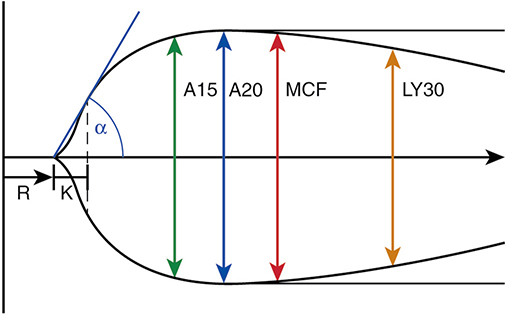
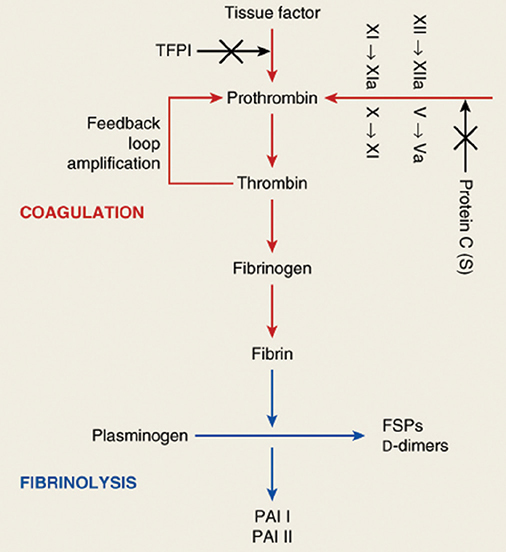
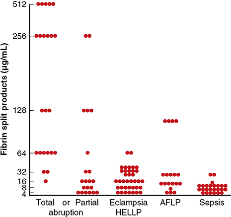
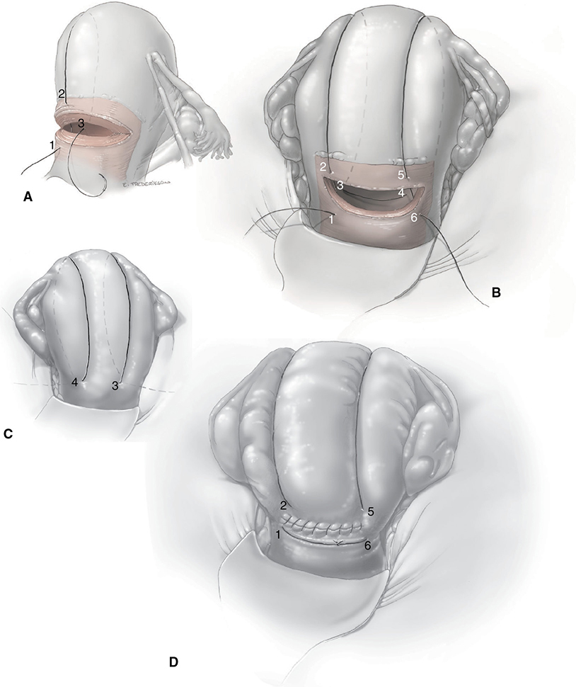
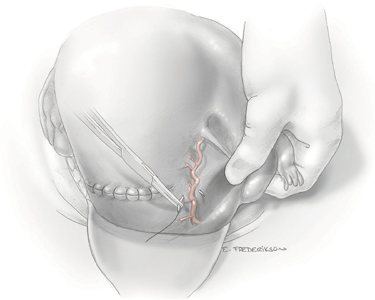
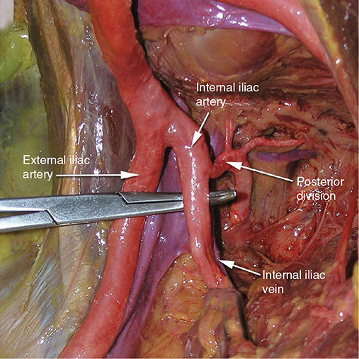

# Chapter 44: Management of Obstetrical Hemorrhage — Revision Notes

> Williams Obstetrics 26e, pp. 2000–2035 of the PDF. High-yield numbers are in **bold**.
> The two tables are transcribed from the PDF images (they are missing from the extracted chapter text). All 6 figures are included from the PDF.

**Big picture:** Visual estimates of blood loss are notoriously inaccurate: true loss is often **2–3× the estimate**, and some or all of it may be concealed. Management = **find and stop the source**, while you **resuscitate with crystalloid and blood**, **replace procoagulants** (dilutional and consumptive coagulopathy are treated the same way), and escalate to **surgical or radiological** control. Hourly **urine output** is one of the most important vital signs.

---

## Recognizing the Severity of Hemorrhage
- Peripartum loss includes the **pregnancy-augmented blood volume**.
- **Rule of thumb:** once pregnancy hypervolemia is lost, each **3-volume-percent fall in hematocrit ≈ 500 mL** blood loss.
- ⚠️ With ongoing bleeding, the hematocrit measured in the delivery, operating or recovery room is at its **maximum**; the nadir depends on how fast crystalloid and blood are given.
- If loss seems more than average → check hematocrit and observe closely for deterioration. (ACOG blood-loss assessment: Ch 42.)
- **Urine output** reflects renal and other vital-organ perfusion: keep **≥30 mL/h, preferably ≥50 mL/h**. Diuretics are seldom indicated during active bleeding.
- Always ask whether there are **enough procoagulants** for clot formation: many severe hemorrhages are complicated by **DIC**.

---

## 1. Management of Hemorrhage

### Hypovolemic shock: pathophysiology
- **Early:** ↓ MAP, stroke volume, cardiac output, CVP and PCWP; ↑ arteriovenous O₂ difference (more extraction) but total O₂ consumption falls.
- **~70% of blood volume is in the venules** (capacitance vessels, humorally controlled) → catecholamines ↑ venular tone = **autotransfusion**. Also ↑ HR, SVR, PVR and contractility.
- **Autoregulation** redistributes flow **to heart, brain and adrenals**, away from kidneys, splanchnic bed, muscle, skin and **uterus**.
- ⚠️ **Volume deficit >~25% → compensation fails**; small further losses cause **rapid deterioration**.
- Then: tissue hypoxia and **metabolic acidosis** → vicious cycle of vasoconstriction, ischemia and cell death. Leukocyte activation → **endotheliopathy** and platelet aggregation → microvascular occlusion. Preeclampsia or sepsis add capillary leak and can **incite DIC**.
- Fluid and electrolyte shifts (Na⁺ and water into skeletal muscle, K⁺ loss) → **both extracellular fluid and intravascular volume must be replaced**. Survival is better with **blood + crystalloid** than with blood alone.

### Fluid resuscitation
- **Simultaneously** identify the source and resuscitate (algorithm: Fig 42-3).
  - Undelivered: restoring volume helps mother and fetus and prepares for emergent delivery.
  - Postpartum: immediately look for **atony, retained placental fragments, genital tract lacerations**.
- **One or two large-bore IV lines**, rapid crystalloid, order blood; ready the OR; assemble surgical and anesthesia teams (plus neonatal team if delivery is imminent).
- Only **20% of crystalloid remains intravascular after 1 h** → give **2–3× the estimated blood loss** initially.

**Crystalloid vs colloid**
- **Little or no difference in mortality** (Cochrane; SAFE trial, ~7000 patients).
- Parkland: **crystalloid + blood**. Saline or **balanced solutions** (Ringer lactate, Plasma-Lyte, whose electrolytes resemble plasma). Balanced were superior in some, not all, studies. Excess saline → theoretical **hyperchloremic acidosis**.

---

## 2. Blood Replacement

### Type and screen vs crossmatch
- Parkland does a **type and screen on every woman admitted to labor and delivery** (PPH prediction is poor).
- **Screen** = maternal serum + standard reagent red cells (common significant antigens). **Crossmatch** = uses actual donor red cells.
- Only **0.03–0.07%** of antibody-negative screens later have antibodies → screened blood **rarely** causes adverse effects.

### Transfusion thresholds
- Cardiac output does not fall substantially until **Hb ~7 g/dL (Hct ~20%)**. Military target **Hct 21%**, where most experts consider transfusion.
- **Williams: with ongoing obstetrical hemorrhage, transfuse rapidly when Hct <25%.** Modify for undelivered fetus, imminent surgery or expected ongoing loss, hypoxia, vascular collapse.
- Nonpregnant evidence: restrictive (**Hb >7**) vs liberal (10–12 g/dL) → 30-day mortality **19% vs 23%** (similar). Septic shock: 7 vs 9 g/dL targets gave similar mortality.
- Units needed depend on **body mass** and expected further loss.

### Components and ratios
- Whole blood is rarely available → most get **PRBCs + crystalloid + components**, often through a **massive transfusion protocol (MTP)**.
- Trauma data (massive transfusion = **≥10 units**): best survival as **plasma:RBC approaches 1:1.4**; worst at **1:8**.
- After **~5 units RBC** → check **platelets, clotting studies and fibrinogen**.

| Target in obstetrical hemorrhage | Action |
|---|---|
| Platelets **>50,000/µL** | Platelet concentrates |
| Fibrinogen **<150 mg/dL**, or prolonged PT/PTT with surgical bleeding | **FFP 10–15 mL/kg** or cryoprecipitate |

- **Parkland escalation (no whole blood):** **2 units PRBC** → if bleeding continues, **2 PRBC + 2 FFP** automatically → then **activate MTP**.

### Table 44-1. Blood Products Commonly Transfused in Obstetrical Hemorrhage

| Product | Volume per Unit | Contents per Unit | Effect on Hemorrhage |
|---|---|---|---|
| **Whole blood** | About 500 mL; Hct ~40 percent | RBCs, plasma, 600–700 mg fibrinogen, no platelets | Restores blood volume and fibrinogen, increases Hct **3–4 volume percent** per unit |
| **Packed RBCs** | 250–300 mL; Hct ~55–80 percent | RBCs, minimal fibrinogen, no platelets | Increases Hct **3–4 volume percent** per unit |
| **FFP** | About 250 mL; **30-minute thaw** | Colloid, **600–700 mg fibrinogen**, no platelets | Restores circulating volume and fibrinogen |
| **Cryoprecipitate** | About 15 mL, frozen | One unit has **200 mg fibrinogen**, other clotting factors, no platelets | **15–20 units or 3–4 g** will increase baseline fibrinogen **~150 mg/dL** |
| **Platelets** | About 50 mL, stored at **room temperature** | One unit raises platelet count **~5000/µL**; single-donor apheresis bag preferable | **6–10 units** transfused; single-donor bag preferable to raise platelets ~50,000/µL |

*FFP = fresh-frozen plasma; Hct = hematocrit; RBCs = red blood cells.*

*The whole-blood volume prints as "About 50 mL", an obvious typo for ~500 mL (a standard unit). The platelet unit prints as "µ/L" and should be /µL. The text says one single-donor apheresis bag raises platelets by ~20,000/µL, while the table's last cell gives ~50,000/µL for the full 6–10-unit transfusion.*

### Whole blood and packed red cells
- **Whole blood is ideal** for severe obstetrical hemorrhage: shelf life **40 days**; **70%** of cells function ≥24 h; **one unit ↑ Hct 3–4%**. It replaces **fibrinogen** and other factors, treats hypovolemia, and means **fewer donor exposures**.
- Parkland (>66,000 deliveries): whole blood → **less severe morbidity** (renal failure, ARDS, pulmonary edema, hypofibrinogenemia, ICU admission, death) than PRBC + components.
- **PRBC:** Hct **55–80%**; one unit ↑ Hct **3–4%** (depends on size).

### Dilutional coagulopathy
- Massive crystalloid + PRBC deplete platelets and factors → **clinically indistinguishable from DIC**.
- **Thrombocytopenia is the most frequent coagulation defect** after blood loss and multiple transfusions.
- PRBCs contain only tiny amounts of soluble factors; **stored whole blood lacks platelets and factors V, VIII and XI** → hypofibrinogenemia, ↑ PT/PTT.
- Distinguishing dilutional from consumptive coagulopathy is confusing, but **treatment is the same**.

### Platelets
- Transfuse with ongoing hemorrhage if **<50,000/µL**. Without surgery, bleeding is rare at **≥10,000/µL**.
- **Single-donor apheresis bag** = equivalent of **6 donor units** → raises count **~20,000/µL**. Otherwise **6–8** individual units.
- Donor plasma must be **compatible with recipient red cells**; **D-negative women get platelets only from D-negative donors** (some red cells are always transfused).

### Fresh-frozen plasma
- Takes **~30 min to thaw**. Contains **all stable and labile factors, including fibrinogen** → for consumptive or dilutional coagulopathy.
- ⚠️ **Not a volume expander** without a specific factor deficiency. Consider with fibrinogen **<150 mg/dL** or abnormal PT/PTT.
- **Liquid plasma** (never frozen, stored at **1–6°C** up to **40 days**) compares favorably; not widely available.

*The extracted text prints "1 to 60 C", which is 1–6°C.*

### Cryoprecipitate and fibrinogen concentrate
- One unit of cryo (from one unit of FFP, **10–15 mL**) has **≥200 mg fibrinogen** + **factor VIII:C, VIII:vWF, factor XIII, fibronectin**. Usually given as a pooled "bag".
- **Ideal fibrinogen source** when levels are dangerously low and incisions ooze.
- **Most commonly wasted product** in labor and delivery (**~17%** of ordered cryo).
- **Virus-inactivated fibrinogen concentrate** (RiaSTAP, Fibryna): each **1 g ↑ fibrinogen ~40 mg/dL**; used for congenital hypofibrinogenemia.

*The text says a cryo pool comes from "8 to 120 donors". The upper figure is probably a typo for about 12.*

### Recombinant activated factor VII (rFVIIa, NovoSeven)
- Binds exposed **tissue factor** at the injury → thrombin → platelet and cascade activation. Used in surgery, trauma and obstetrics; in many trauma MTPs.
- ⚠️ **Ineffective if fibrinogen <50 mg/dL or platelets <30,000/µL.**
- Concerns: **arterial (and venous) thrombosis**; only **marginal efficacy**.

*The text reports arterial thromboembolism in "55 percent" across 35 RCTs (Levi, 2010). That study actually found about 5.5%, so "55" is probably a misprint.*

### Tranexamic acid (TXA)
- **Antifibrinolytic**: binds plasminogen reversibly → stops plasmin from binding fibrin → clot persists.

| Trial / source | Finding |
|---|---|
| **WOMAN** (PPH after vaginal birth or at cesarean; developing countries) | **1 g IV TXA** → hemorrhage deaths **1.2% vs 1.7%** → **WHO recommends** |
| Prophylaxis after **vaginal** delivery (Sentilhes 2018) | **No ↓ PPH** |
| **TRAAP2** (prophylaxis at **cesarean**) | ↓ red-cell transfusion |
| Meta-analysis / Cochrane | Must be given **early** after bleeding onset to ↓ mortality |
| **ACOG** | **Not** recommended for prophylaxis **or first-line** treatment; if used, give **within 3 h of delivery** |

### Massive transfusion protocols
- Start once **4–5 units PRBC are given within ~2 h**. Speeds product delivery and **avoids dilutional coagulopathy**. Some include rFVIIa, TXA or prothrombin complex concentrate.
- Evidence of benefit in obstetrics is limited (mostly trauma data, some observational obstetric studies).

### Table 44-2. Parkland Hospital Obstetrical Massive Transfusion Protocol

| Round No. | PRBC 5 Units | FFP 3 Units | Plts 6-Pack | Cryo 1 Unit |
|---|---|---|---|---|
| 1 | X | X | — | — |
| 2 | X | X | X | — |
| 3 | X | X | — | X |
| 4 | X | X | X | — |
| 5 | X | X | — | — |
| 6 | X | X | X | X |
| 7 | X | X | — | — |
| 8 | X | X | X | — |

*Cryo = cryoprecipitate; FFP = fresh-frozen plasma; Plts = platelets; PRBC = packed red blood cells.*

> **Memory hook:** every round = **5 RBC + 3 FFP**; platelets on **even** rounds; cryo on rounds **3 and 6**.

### Viscoelastic assays (TEG, ROTEM)
- Point-of-care whole-blood tests of **clot formation, strength and fibrinolysis**; used in trauma, liver transplant and cardiac surgery. Pregnancy reference ranges confirm **hypercoagulability**.
- Limits: less useful in **torrential** bleeding (need minute-by-minute data), **cannot detect primary hemostasis disorders**, and are easily **misinterpreted** by untrained staff.
- Williams: needs more study; more useful **after initial management / in ICU recovery** than during acute hemorrhage.

*Figure 44-1. Normal TEG: R = time to clot start; K = to 20-mm amplitude; α = speed of fibrin build-up; A15/A20 = amplitude at 15/20 min; MCF = maximum clot firmness; LY30 = % lysis at 30 min.*

### Cell salvage and autologous transfusion
- **Preoperative autologous donation: disappointing** (exceptions: rare blood type or unusual antibodies).
- **Intraoperative cell salvage is safe** in obstetrics and helps women who **decline transfusion**. Earlier fear of amnionic fluid embolism was **not borne out** (no AFE in recent studies).
- RCT (3028 cesareans at risk): donor transfusion **2.5% vs 3.5%** (**not significant**). Routine set-up in another study → lower donor transfusion.

### Transfusion complications

| Complication | Key facts |
|---|---|
| **Acute hemolytic reaction** (ABO incompatibility) | Usually **clerical error** (mislabeling, wrong patient): **~1 in 14,000 units**. Fever, hypotension, tachycardia, dyspnea, chest/back pain, flushing, anxiety, **hemoglobinuria** → DIC, AKI, death. **Stop transfusion**, treat hypotension and **hyperkalemia**, induce diuresis, **alkalinize urine** |
| **TACO** | **Most common** of the two; incidence **~1%** |
| **TRALI** | **≥1 in 12,000**; HLA and neutrophil antibodies in donor plasma |
| TACO + TRALI | **Most common causes of transfusion-related death**. Severe dyspnea, hypoxia, pulmonary edema **within 6 h**; supportive care ± ventilation |
| Bacterial (red cells) | Unusual (refrigeration): *Yersinia, Pseudomonas, Serratia, Acinetobacter, E coli* |
| **Bacterial (platelets)** | Stored at **room temperature**: **1 in 1000–2000** units contaminated; sepsis death **1 in 17,000** single-donor platelets and **1 in 61,000** apheresis packs |
| HIV, hepatitis C | **1 in 1–2 million** units |
| Hepatitis B | **<1 in 100,000** |
| CMV | Infected leukocytes often transfused (high prevalence) |
| Others | West Nile, parvovirus B19, HTLV-1, toxoplasmosis (slight); **Zika** (all donations now tested); SARS-CoV-2 hypothetical |

---

## 3. Obstetrical Coagulopathies

### Terms
- **Consumptive coagulopathy** = actual consumption of procoagulants inside the vessels.
- **Dilutional coagulopathy** = massive **loss** of procoagulants through hemorrhage.
- Consumptive coagulopathy → systemic intravascular activation that overwhelms natural anticoagulants → widespread fibrin deposition → **multiorgan failure**.

### Pregnancy-induced coagulation changes (procoagulant state)
- ↑ **Fibrinogen (I), VII, VIII, IX, X**.
- ↑ **Plasminogen**, but also ↑ **PAI-1 and PAI-2** → **plasmin activity falls** until after delivery.
- **Platelets ↓ ~10%**, with ↑ activation.
- ↑ fibrinopeptide A, β-thromboglobulin, platelet factor 4, **FDPs/D-dimers**; ↓ **protein S**.
- Net: hypercoagulability, ↓ fibrinolysis and **compensated intravascular coagulation** that may maintain the uteroplacental interface.

*The extracted text lists factors "VII, VII, IX, and X"; the duplicate is presumably VIII.*

### DIC in pregnancy
- Incidence **0.03–0.35%**. **Significant coagulopathy in virtually all abruptions and amnionic fluid embolism.**
- Less recognized activation: sepsis, thrombotic microangiopathies, AKI, **acute fatty liver**, severe preeclampsia, HELLP.
- 49 severe cases: transfusion **59%**, hysterectomy **18%**, dialysis **6%**, **3 maternal deaths**, PMR **30%**.
- DIC was the **2nd most common severe maternal morbidity indicator** (2010–2011) and was associated with **~¼ of maternal deaths**, yet as a **sole cause** it accounts for only **0.2%** of US pregnancy-related deaths.

### Normal coagulation: cell-based (tissue factor) model
- **Tissue factor** (membrane glycoprotein) is the **principal initiator**, not the old "waterfall".
- **TF–VIIa** complexes → activate **IX and X** → **Xa** starts clotting. The "intrinsic" pathway **amplifies**: initial thrombin directly activates **factor XI** (feedback loop) → fibrin.
- TF is abundant in the **brain, lungs, placenta and amnionic fluid**.
- Balanced by **fibrinolysis** (plasminogen → plasmin) → **fibrin split products incl. D-dimers**.

*Figure 44-2. Coagulation (tissue factor → thrombin with feedback amplification → fibrin) balanced by fibrinolysis (plasminogen → FSPs/D-dimers). Inhibitors: TFPI, protein C/S, PAI-1/2. (The figure's "X → XI" label presumably means X → Xa.)*

### Pathological coagulation
- Disease releases **tissue factor** from subendothelium and stimulated monocytes → endothelial cytokines → **diffuse coagulation**. Clinically important once factors and platelets are depleted.
- **Purpura fulminans**: severe, often lethal. **Microthrombi → skin necrosis** (± vasculitis); burn-unit debridement; rarely **four-limb amputation**.
  - Usually **sepsis in women with heterozygous protein C deficiency**. **Homozygous protein C or S deficiency → fatal neonatal purpura fulminans.**

### Inciting conditions

| Condition | Coagulopathy |
|---|---|
| **Placental abruption** | **Most common cause of severe consumptive coagulopathy** in obstetrics |
| Preeclampsia / eclampsia / **HELLP** | Endothelial activation; DIC in **~10% of HELLP**; severity correlates with thrombocytopenia and FDPs, but **seldom clinically worrisome** |
| **Acute fatty liver** | Intravascular coagulation **+ ↓ procoagulant synthesis** |
| **Amnionic fluid embolism** | IV embolization of (meconium-laden) amnionic fluid → **cardiorespiratory collapse + profound DIC** (SMFM checklist; Ch 42) |
| **Sepsis** | Seldom massive alone; *E coli* (pyelonephritis, puerperal infection) usually mild. **Exceptions: exotoxins of group A *Streptococcus*, *S aureus*, *Clostridium perfringens, C sordellii, C novyi*** |
| **Septic abortion** | Can incite coagulation and worsen bleeding |
| **Late 2nd-trimester D&E** | **1.6%** (1249 cases; ⅔ for fetal demise) |
| Hypertonic-solution abortion | Thromboplastin release from placenta, fetus, decidua (rarely used now) |
| **Retained dead fetus** | Most labor within **2 wk**; gross disruption rarely **before 4 wk**; **after 1 month ~¼** develop consumptive coagulopathy |

*Figure 44-3. Fibrin split products are highest with total abruption (up to 512 µg/mL), lower with partial abruption, eclampsia/HELLP and AFLP, and lowest with sepsis.*

### Diagnosis
- **"Bioassay"** is excellent: bleeding at sites of minor trauma (venipuncture, shaving nicks, catheterization); spontaneous gum, nose or GI bleeding. **Petechiae or purpura** at cuff or tourniquet sites → thrombocytopenia. **Surgery is the ultimate bioassay** (generalized oozing).

| Test | Interpretation |
|---|---|
| **Fibrinogen** | Late pregnancy **300–600 mg/dL**, so even major consumption (e.g., 600 → 250) may still clot. **Clinically important threshold ~150 mg/dL.** Serious hypofibrinogenemia **<50 mg/dL** |
| **Clot observation test** | Whole blood in a glass tube: with low fibrinogen the clot is **soft and doesn't retract**; platelet-driven retraction follows over ~30 min. **No retraction within ~1 h → thrombocytopenia** likely |
| **D-dimer / FDPs** | Almost always ↑ in significant consumptive coagulopathy; **level does not correlate with outcome** in obstetrics |
| **Platelet count** | Confirms thrombocytopenia; qualitative dysfunction possible with severe preeclampsia |
| **PT / PTT** | Prolonged by very low fibrinogen, depleted procoagulants, or large amounts of FDPs |
| **TEG / ROTEM** | Adjuncts to guide replacement |
| **ISTH DIC score** | Only after a DIC-causing condition is identified. **≥5 = overt DIC**; <5 = nonovert. Not widely applied in obstetrics |

### General management
1. **Identify and remove the cause** (e.g., deliver) to stop defibrination.
2. **Vigorous restoration of circulation**: perfusion lets the liver and endothelium resynthesize procoagulants and lets the reticuloendothelial system **clear activated factors, fibrin and FDPs**.
3. **Rapid procoagulant replacement** with incisions or extensive lacerations and severe bleeding.

- ⚠️ **Heparin: abandoned.**
- ⚠️ **TXA and ε-aminocaproic acid: not first-line** in DIC: fibrinolysis is needed to dissolve the widespread fibrin thrombi.
- **rFVIIa**: insufficient evidence for obstetrical coagulopathies.

---

## 4. Surgical Management of Hemorrhage
- Evidence quality is generally **poor** (AHRQ).
- 6660 PPH cases: invasive procedure **4%**, hysterectomy **1%**; conservative surgery or embolization **failed in 15%**.
- **Uterine balloon tamponade** for atony has **doubled** in a decade (Ch 42).
- **Topical hemostatic agents** for low-pressure oozing (mainly at cesarean hysterectomy).

### Uterine compression sutures (B-Lynch "brace")
- **No. 2 chromic** suture compresses the anterior and posterior walls together; looks like **suspenders**. Several modifications exist.
- Mainly for **atony**; may reduce DIC bleeding while coagulation is corrected by transfusion.
- Success: B-Lynch **948 cases, 7 failures**; other series **20–25% failure**.
- Rare complications: **uterine ischemic necrosis with peritonitis**; later **uterine wall defects or synechiae**. Most later pregnancies are uneventful.

**B-Lynch steps (Fig 44-4)**
1. Enter the cavity through the lower segment **below** the hysterotomy (one side).
2. Exit **above** the incision; loop **over the fundus** to the back.
3. Re-enter the cavity through the **posterior wall** (at the level of the incision); cross to the other side inside.
4. Exit posteriorly; loop **over the fundus** to the front.
5. Re-enter **above** the incision.
6. Exit **below** the incision; **tie ends 1 and 6** below the incision; close the hysterotomy as usual.

*Figure 44-4. B-Lynch compression suture: numbers trace the path from front, over the fundus, through the posterior wall, and back over the fundus; tied below the hysterotomy.*

### Artery ligation
- Indications: **hysterotomy laceration, atony, abnormal placentation**.
- **Uterine artery ligation** (uni- or bilateral): mainly for **lacerations at the lateral hysterotomy**; less helpful for other causes. Suture passes through the lateral uterine wall anteriorly, curves posteriorly and re-enters anteriorly, encircling the uterine vessels.
- Torrential PAS bleeding: a **tourniquet around the lower segment** may slow bleeding during resuscitation and hysterectomy dissection.

*Figure 44-5. Uterine artery ligation: the suture passes through the lateral myometrium to encircle the ascending uterine artery.*

**Internal iliac (hypogastric) artery ligation**
- Technically difficult; **successful in only ~half**. Helped with **placenta previa**; **not particularly helpful for atony**.
- **Technique:**
  1. Open the peritoneum over the common iliac and dissect to the **bifurcation** of external and internal iliacs.
  2. **Palpate pulses distal to the external iliac** (inguinal area) to confirm the correct vessel.
  3. Ligate **~5 cm distal to the common iliac bifurcation**, which avoids the **posterior division**.
  4. Incise the areolar sheath longitudinally; pass a **right-angle clamp beneath the artery from lateral to medial**. ⚠️ Don't perforate the **internal iliac vein**.
  5. Tie with (usually **nonabsorbable**) suture.
- **Mechanism: ~85% ↓ pulse pressure** distally → arterial system behaves like a **venous-pressure** system, so clot and pressure can stop the bleeding.
- **Fertility is preserved**: 17 women, 21 later pregnancies (13 normal, 3 miscarriages, 3 terminations, 2 ectopics).

*Figure 44-6. Right internal iliac ligation (cadaver): right-angle clamp under the anterior division, just distal to the posterior division; note the internal iliac vein beneath.*

### Angiographic embolization
- For intractable bleeding when surgical access is hard; use has **increased remarkably**.
- **Effective in ~90%** (>500 pregnancy cases). **Fertility is not impaired.**
- ⚠️ **Hemodynamically unstable women with active bleeding should not leave the OR** for radiology.
- Rare but severe complications: iliac artery rupture, **uterine ischemic necrosis**, uterine infection, **buttock necrosis and paraplegia** (bilateral internal iliac embolization), myometrial defect in a later pregnancy.
- Preoperative balloon catheters for anticipated massive loss: see PAS (Ch 43).

### Aortic compression
- **REBOA** (resuscitative endovascular balloon occlusion of the aorta): prophylactic use reported to reduce blood loss and hysterectomy (e.g., 11 PAS cases). ↓ distal perfusion, ↑ afterload, redistributes volume to heart and brain. ⚠️ Prolonged occlusion → **limb ischemia and amputation**.
- **Manual aortic compression above the sacral promontory** for torrential pelvic bleeding; with the abdomen closed, press **above the umbilicus**.

### Pelvic packing
- If **hysterectomy fails** to stop bleeding: pack the pelvis with **gauze rolls** and end the operation.
  - Temporizing before embolization, or left **48–72 h** and removed if the patient is stable.
  - Review of 104: **success 79%**; 24 failures, 13 of whom died → overall mortality **13%**.
- **Umbrella (parachute) pack:** sterile plastic bag filled with knotted gauze rolls placed transabdominally, **stalk out through the vagina**, traction from a **1-L fluid bag** hung over the foot of the bed; removed vaginally after **24 h**. Lifesaving when all else fails, especially in low-resource settings.

---

## Quick-Recall: Blood Products and Hemostatic Agents

| Product / agent | Key content | Effect / dose | Trigger / caution |
|---|---|---|---|
| **Whole blood** | RBC + plasma + fibrinogen (600–700 mg), no platelets | ↑ Hct **3–4%**/unit | **Ideal**; fewer donor exposures; lacks V, VIII, XI when stored |
| **PRBC** | Hct 55–80%, minimal fibrinogen | ↑ Hct **3–4%**/unit | Transfuse if Hct **<25%** with ongoing bleeding |
| **FFP** | All factors incl. fibrinogen (600–700 mg) | **10–15 mL/kg**; 30-min thaw | Fibrinogen **<150** or ↑ PT/PTT; **not** a volume expander |
| **Cryoprecipitate** | **200 mg fibrinogen**, VIII, vWF, XIII, fibronectin | **15–20 units (3–4 g) → +150 mg/dL** | Most wasted product (~17%) |
| **Fibrinogen concentrate** | Virus-inactivated | **1 g → +40 mg/dL** | Congenital hypofibrinogenemia |
| **Platelets** | Apheresis bag = 6 units | **+~20,000/µL** per bag | Keep **>50,000** when bleeding; D-neg → D-neg donors; sepsis risk |
| **rFVIIa** | Binds tissue factor | — | Ineffective if fibrinogen **<50** or platelets **<30,000**; thrombosis; marginal benefit |
| **TXA** | Antifibrinolytic | **1 g IV**, within **3 h** | WOMAN **1.2% vs 1.7%**; ACOG: not prophylaxis/first-line; not for DIC |
| **MTP (Parkland)** | Rounds of **5 RBC + 3 FFP** ± 6-pack platelets ± cryo | Start after **4–5 units in ~2 h** | Plasma:RBC ~**1:1.4** best in trauma |

## Key Numbers to Memorize
- True blood loss **2–3×** the visual estimate; **3% Hct drop ≈ 500 mL**
- Urine output **≥30 mL/h (ideally ≥50)**
- Shock decompensates at **>25%** volume loss; **70%** of blood volume is in venules
- Crystalloid: **20%** stays intravascular at 1 h → give **2–3×** the estimated loss
- Antibody screen misses **0.03–0.07%**
- Cardiac output falls at **Hb ~7 / Hct ~20%**; Williams transfuses at **Hct <25%**
- Check coagulation after **~5 units**; platelets **>50,000**; fibrinogen **>150 mg/dL**; FFP **10–15 mL/kg**
- Whole blood shelf life **40 days**; 1 unit ↑ Hct **3–4%**
- Cryo **200 mg** fibrinogen/unit; fibrinogen concentrate **1 g → +40 mg/dL**
- rFVIIa useless if fibrinogen **<50** or platelets **<30,000**
- WOMAN TXA **1 g**: deaths **1.2% vs 1.7%**; give within **3 h**
- MTP after **4–5 units in 2 h**; plasma:RBC **1:1.4** best, **1:8** worst
- Hemolytic reaction **1 in 14,000**; TACO **~1%**; TRALI **≥1 in 12,000**; both within **6 h**
- Contaminated platelets **1 in 1000–2000**; HIV/HCV **1 in 1–2 million**; HBV **<1 in 100,000**
- DIC **0.03–0.35%** of pregnancies; sole cause of **0.2%** of deaths; HELLP DIC **~10%**
- Dead fetus: DIC in **~¼ after 1 month**; D&E DIC **1.6%**
- Fibrinogen late pregnancy **300–600**; clinical threshold **150**; severe **<50 mg/dL**; ISTH overt DIC **≥5**
- B-Lynch **no. 2 chromic**; failure **20–25%** in series
- Internal iliac ligation **5 cm** distal to the bifurcation; **85%** ↓ pulse pressure; works in **~½**
- Embolization **~90%** effective; pelvic packing **79%** success, **48–72 h**; umbrella pack out at **24 h**
