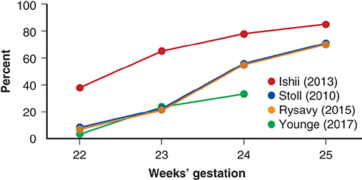
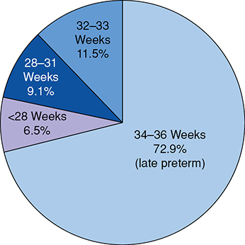
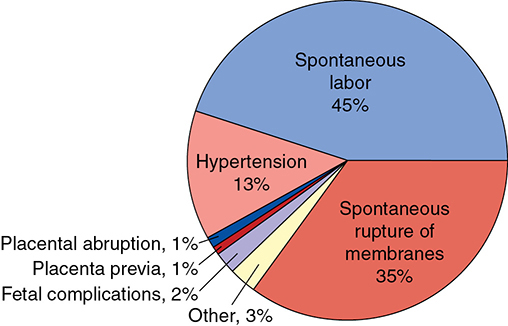
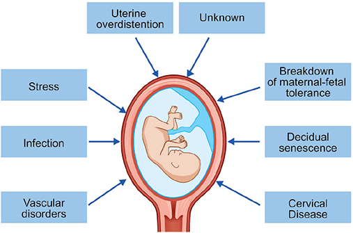
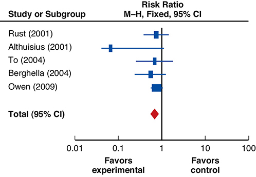
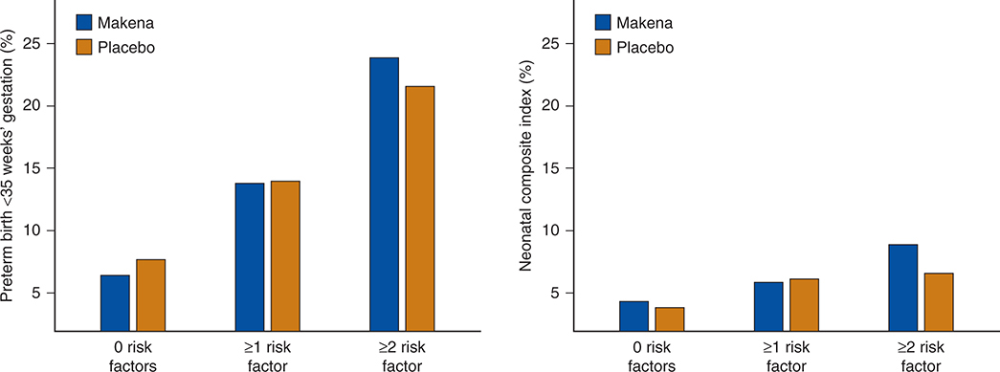
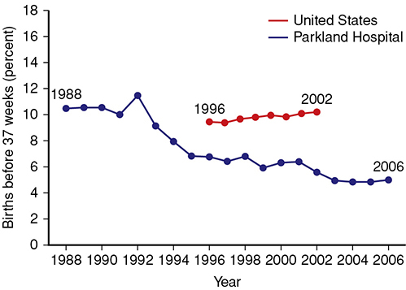
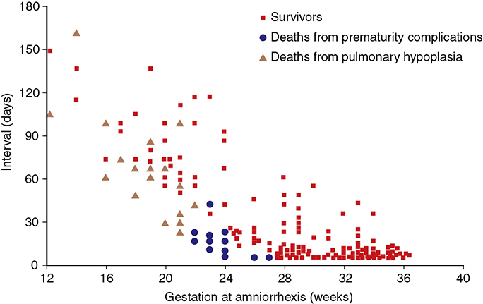

# Chapter 45: Preterm Birth — Revision Notes

> Williams Obstetrics 26e, pp. 2036–2118 of the PDF. High-yield numbers are in **bold**.
> The ten tables are transcribed from the PDF images (they are missing from the extracted chapter text). All 8 figures are included from the PDF.

**Big picture:** Preterm birth affects **~15 million births/yr worldwide** and is the **leading cause of death in children <5 years**. It is a *syndrome* with many pathways (not simply "labor that starts too soon"). Few preventive measures work well; the proven perinatal benefits come from **antenatal corticosteroids**, **antibiotics for PPROM** and **magnesium sulfate neuroprotection**.

---

## 1. Definitions

| Term | Definition |
|---|---|
| **Preterm birth** | Delivery **before 37 completed weeks** (before 36⁶/₇ wk) |
| **Late preterm** (ACOG) | **34–36 completed weeks** |
| **Early preterm** (CDC) | Before **33⁶/₇ wk** |
| WHO: extremely preterm | **<28 wk** |
| WHO: very preterm | **28–32 wk** |
| WHO: moderate-to-late preterm | **32–37 wk** |

- These cutoffs lack a functional basis. **Prematurity** = incomplete organ development at birth (lungs → RDS).
- A preterm neonate can be SGA or LGA and still be preterm.

| Birthweight category | Weight |
|---|---|
| **Low birthweight (LBW)** | **1500–2500 g** |
| **Very low birthweight (VLBW)** | **1000–1500 g** |
| **Extremely low birthweight (ELBW)** | **<1000 g** |

---

## 2. Preterm Birth Rate Trends
- US rate **10.02% (2018) → 10.23% (2019)**. Fell 2007–2014, rising since.
  - The rise was mainly in **late-preterm births** (rising since 2013).
  - From **2014**, the NCHS uses the **obstetrical estimate** of gestational age instead of the LMP → current data are not directly comparable with older rates.
- National data do **not separate spontaneous from indicated** preterm births.
- **Racial disparity:** rates are markedly higher in **black women** than in white and Hispanic women. US rates exceed those of other industrialized countries; international rates are also rising.
- **Multifetal gestations** raise the rate → analyze singletons separately.

---

## 3. Preterm Newborn Morbidity and Mortality
- US 2018: **21,498 infant deaths**; **66% were among preterm births**.
- Gestational age and morbidity/mortality are **inversely related**.
- Infant mortality at **<28 wk was 186× higher** than at 37–41 wk.
- Lower 5- and 10-min Apgar scores → higher relative risk of death in preterm neonates (may reflect immaturity rather than depression).
- **Survival reaches 95%** once birthweight is **≥1000 g**, or GA is **≥28 wk (females)** or **≥30 wk (males)** (Fanaroff 2007).

### Table 45-1. Infant Mortality Rates in the United States in 2018

| Gestational age (weeks) | Live Births | Infant Deaths |
|---|---|---|
| **Total infants** | 3,791,712 | 21,498 |
| <34 | 104,031 | 12,004 |
| 34–36 | 275,746 | 2263 |
| <37 | 379,777 | 14,267 |
| 37–38 | 1,005,405 | 3135 |
| 39–41 | 2,292,705 | 3843 |
| ≥42 | 11,318 | 61 |

### Table 45-2. Major Short- and Long-Term Problems in Very-Low-Birthweight Infants

| Organ or System | Short-Term Problems | Long-Term Problems |
|---|---|---|
| Pulmonary | Respiratory distress syndrome, air leak, bronchopulmonary dysplasia, apnea of prematurity | Bronchopulmonary dysplasia, reactive airway disease, asthma |
| Gastrointestinal or nutritional | Hyperbilirubinemia, feeding intolerance, necrotizing enterocolitis, growth failure | Failure to thrive, short-bowel syndrome, cholestasis |
| Immunological | Hospital-acquired infection, immune deficiency, perinatal infection | Respiratory syncytial virus infection, bronchiolitis |
| Central nervous system | Intraventricular hemorrhage, periventricular leukomalacia, hydrocephalus | Cerebral palsy, hydrocephalus, cerebral atrophy, neurodevelopmental delay, hearing loss |
| Ophthalmological | Retinopathy of prematurity | Blindness, retinal detachment, myopia, strabismus |
| Cardiovascular | Hypotension, patent ductus arteriosus, pulmonary hypertension | Pulmonary hypertension, systemic hypertension, hypertension in adulthood |
| Renal | Water and electrolyte imbalance, acid-base disturbances | Hypertension in adulthood |
| Hematological | Iatrogenic anemia, need for frequent transfusions, anemia of prematurity | — |
| Endocrinological | Hypoglycemia, transiently low thyroxine levels, cortisol deficiency | Impaired glucose regulation, increased insulin resistance |

### Threshold of viability
- Fetuses **<500 g** once called "abortuses" are now live births (**5189** such US live births in 2019).
- **Threshold of viability** = lower limit of maturation compatible with extrauterine survival: currently **20⁰/₇ to 25⁶/₇ wk** (the **periviable period**).
- Guidance: 2013 NICHD workshop (Raju 2014) → ACOG **Obstetric Care Consensus on Periviable Birth** (2019).

**Periviable survival**
- Birth **before 23 wk** usually ends in death: survival **~5–10%**, with significant morbidity among survivors.
- Survival at **24 wk** ranges **35–84%** internationally.
- Iowa (Watkins 2020), active management at 22–25 wk: **64%** of 22–23-wk survivors had mild or no neurodevelopmental impairment.
- **Ascertainment bias:** mean survival **45%** if the denominator is all live births vs **72%** if only NICU admissions.
- NICHD NRN, 22–24 wk (Younge 2017): survival **30% → 36%** (2000–03 → 2008–11); survival without neurodevelopmental impairment **16% → 20%**. At **22 wk only 1%** survived without impairment.

*Figure 45-1. Neonatal survival at 22–25 weeks rises steeply with each week; curves differ by denominator (liveborn vs NICU vs intact survival).*

### Table 45-3. One-Year Survival Among Infants Delivered at 22–26 Weeks' Gestational Age in Sweden

Values are No./Total (%), for 2004–2007 → 2014–2016.

| Outcome | 22 wk 04–07 | 22 wk 14–16 | 23 wk 04–07 | 23 wk 14–16 | 24 wk 04–07 | 24 wk 14–16 |
|---|---|---|---|---|---|---|
| *All deliveries* — Stillbirths | 91/140 (65) | 52/148 (35) | 82/183 (45) | 59/207 (29) | 47/191 (25) | 68/260 (26) |
| Live born | 49/140 (35) | 96/148 (65) | 101/183 (55) | 148/207 (71) | 144/191 (75) | 192/260 (74) |
| *1-yr survival* — NICU admission | 5/17 (29) | 29/50 (58) | 53/81 (65) | 91/138 (66) | 96/132 (73) | 151/191 (79) |
| Live borna | 5/49 (10) | 29/96 (30) | 53/101 (52) | 91/148 (61) | 96/144 (67) | 151/192 (79) |
| All deliveriesb | 5/140 (3.6) | 29/148 (20) | 53/183 (29) | 91/207 (44) | 96/191 (50) | 151/260 (58) |
| *1-yr survival, no major morbidityc* — NICU admission | 1/5 (20) | 5/29 (17) | 9/53 (17) | 25/91 (28) | 30/96 (31) | 60/151 (40) |
| Live bornd | 1/49 (2.0) | 5/96 (5.2) | 9/101 (8.9) | 25/148 (17) | 30/144 (21) | 60/192 (31) |

| Outcome | 25 wk 04–07 | 25 wk 14–16 | 26 wk 04–07 | 26 wk 14–16 | All 22–26 wk 04–07 | All 22–26 wk 14–16 |
|---|---|---|---|---|---|---|
| *All deliveries* — Stillbirths | 45/250 (18) | 58/277 (21) | 39/245 (16) | 36/304 (12) | 304/1009 (30) | 273/1196 (23) |
| Live born | 205/250 (82) | 219/277 (79) | 206/245 (84) | 268/304 (88) | 705/1009 (70) | 923/1196 (77) |
| *1-yr survival* — NICU admission | 167/200 (84) | 193/219 (88) | 176/204 (86) | 247/267 (93) | 497/634 (78) | 711/865 (82) |
| Live borna | 167/205 (81) | 193/219 (88) | 176/206 (85) | 247/268 (92) | 497/705 (70) | 711/923 (77) |
| All deliveriesb | 167/250 (67) | 193/277 (70) | 176/245 (72) | 247/304 (81) | 497/1009 (49) | 711/1196 (59) |
| *1-yr survival, no major morbidityc* — NICU admission | 75/167 (45) | 104/193 (54) | 111/176 (63) | 161/247 (65) | 226/497 (45) | 355/711 (50) |
| Live bornd | 75/205 (37) | 104/219 (47) | 111/206 (54) | 161/268 (60) | 226/705 (32) | 355/923 (38) |

*aPrimary outcome. bIncludes stillbirths. cMajor neonatal morbidity = IVH grade 3 or 4; periventricular leukomalacia; necrotizing enterocolitis; retinopathy of prematurity stage 3, 4 or 5; or severe bronchopulmonary dysplasia. dSecondary outcome. NICU = neonatal intensive care unit.*

### Clinical management of threatened periviable birth
- **Nonmodifiable:** fetal gender, weight, plurality.
- **Potentially modifiable:** place of delivery, intent to intervene by cesarean, antenatal corticosteroids.
- Postnatal: initiation or withdrawal of intensive care.

### Table 45-4. General Guidance for Threatened Periviable Birth

| Intervention | <22 wk | 22⁰/₇–22⁶/₇ wk | 23⁰/₇–23⁶/₇ wk | 24⁰/₇ wk + |
|---|---|---|---|---|
| Assess neonate for resuscitation | Not recommended | Consider | Consider | Recommended |
| Corticosteroid therapy | Not recommended | Not recommended | Consider | Recommended |
| Tocolysis to allow CS therapy | Not recommended | Not recommended | Consider | Recommended |
| MS for neuroprotection | Not recommended | Not recommended | Consider | Recommended |
| Antibiotics for PPROM | **Consider** | **Consider** | Consider | Recommended |
| GBS prophylaxis | Not recommended | Not recommended | Consider | Recommended |
| CD for fetal indication | Not recommended | Not recommended | Consider | Considera/recommended |

*aCD is considered for fetuses 24⁰/₇–24⁶/₇ wk but recommended for those 25⁰/₇ weeks and older. CD = cesarean delivery; CS = corticosteroid; GBS = group B streptococcus; MS = magnesium sulfate; PPROM = preterm prelabor rupture of membranes.*

> **Memory hook:** "**22 = Consider, 23 = Consider all, 24 = Recommend all.**" Antibiotics for PPROM are the only thing considered even below 22 wk.

**Cesarean at the limit of viability**
- Controversial; observational data are inconsistent and cesarean adds maternal morbidity.
- Reddy 2012 (24–31⁶/₇ wk): **84%** of cephalic fetuses delivered vaginally with **no difference in neonatal mortality**. For **breech**, attempted vaginal delivery → **3× mortality**.
- Werner 2013 (24–34 wk): cesarean did **not** protect against death, IVH, seizures, RDS or subdural hemorrhage.
- Consensus: consider **cesarean for fetal indications at 23⁰/₇–24⁶/₇ wk**; **before 22 wk only for maternal indications**.
- Active management (e.g., corticosteroids) can be **uncoupled** from the decision for cesarean.
- Interventions at **22 vs 23 wk: 38.9% vs 78.3%** (Hajdu 2020). **~20%** of women have serious morbidity with periviable delivery.
- Individualized, multidisciplinary care; **perinatal palliative care** for life-limiting prematurity.

### Late-preterm birth
- **34–36 wk = >70% of all preterm births** (72.9% in 2019).
- Parkland (McIntire 2008): 3% of births at 24–32 wk and **9% late preterm** → late preterm = **¾ of preterm births**.
- **~80%** follow idiopathic spontaneous preterm labor or PROM; **20%** other obstetrical complications.
- Higher neonatal mortality, morbidity and adverse neurodevelopment than term → prematurity care should include late preterm.

*Figure 45-2. US preterm births 2019 by gestational age: 34–36 wk = 72.9%; 32–33 wk 11.5%; 28–31 wk 9.1%; <28 wk 6.5%.*

*Figure 45-3. Causes of 21,771 late-preterm births at Parkland: spontaneous labor 45% + spontaneous membrane rupture 35% (= 80%); hypertension 13%.*

### Table 45-5. Neonatal Outcomes in Live Births Delivered Late Preterm Compared with Referent Group at 39 Weeks

| Outcome | 34 wk | 35 wk | 36 wk | 39 wk |
|---|---|---|---|---|
| **Neonatal death rate per 1000 live births** | 1.1 | 1.5 | 0.5 | 0.2 |
| *Morbidity (%)* | | | | |
| Resp. distress — Ventilator | 3.3a | 1.7a | 0.8a | 0.3 |
| Resp. distress — TTN | 2.4a | 1.6a | 1.1a | 0.4 |
| IVH — Grades 1, 2 | 0.5a | 0.2a | 0.06a | 0.01 |
| IVH — Grades 3, 4 | 0 | 0.02 | 0.01 | 0.004 |
| Sepsis — Work-up | 31a | 22a | 15a | 12 |
| Sepsis — Proven | 0.5a | 0.4a | 0.2b | 0.1 |
| Phototherapy | 6.1a | 3.5a | 2.0a | 1 |
| NEC | 0.09a | 0.02b | 0.01 | 0.001 |
| 5-min Apgar ≤3 | 0.1 | 0.2a | 0.09† | 0.06 |
| Intubation | 1.4a | 0.8b | 0.6 | 0.6 |
| **≥1 of above** | **34a** | **24a** | **17a** | **14** |

*ap <.001 vs 39-wk referent. bp <.05 vs 39-wk referent. IVH = intraventricular hemorrhage; NEC = necrotizing enterocolitis; TTN = transient tachypnea. †Printed as "0.9", which would exceed the 34- and 35-wk values yet carries no significance marker; almost certainly 0.09.*

---

## 4. Causes of Preterm Birth

**Four direct causes:**
1. Spontaneous unexplained preterm labor with intact membranes — **40–45%**
2. Idiopathic preterm prelabor rupture of membranes (PPROM) — **30–35%**
3. Delivery for maternal or fetal indications — **30–35%**
4. Twins and higher-order multiples: **>98% of triplets** and **60% of twins** are born preterm.

- Preterm labor = several disease processes activating the **common parturition pathway**; a heterogeneous syndrome (genes, microbes, environment). No reliable predictive biomarker yet despite multiomics.

### Spontaneous preterm labor
- Associations: multifetal pregnancy, intrauterine infection, bleeding, placental infarction, premature cervical dilation, cervical insufficiency, hydramnios, uterine fundal abnormalities, fetal anomalies; severe maternal illness (infection, autoimmune disease, gestational hypertension).
- Labor is the **final step** of changes that may start **days or weeks** earlier.
- **Four major mechanisms:** uterine overdistention, premature cervical change, infection, maternal–fetal stress.

*Figure 45-4. Pathways to spontaneous preterm labor: overdistention, stress, infection, vascular disorders, decidual senescence, breakdown of maternal–fetal tolerance, cervical disease, unknown.*

**Uterine overdistention** (multifetal pregnancy, hydramnios)
- Myometrial stretch → **contraction-associated proteins** (gap-junction proteins, **oxytocin receptors**, prostaglandin synthase) and an "inflammatory pulse".
- Early activation of the **placental–fetal endocrine cascade** → inflammatory activation → contractions.

**Cervical dysfunction**
- An intact cervical **epithelial barrier** prevents ascending infection. Loss of **hyaluronan** or **GBS colonization** ↑ risk (GBS makes **hyaluronidase**).
- ↓ Mechanical competence: mutations in collagen/elastic fiber components → cervical insufficiency.

**Infection**
- **Only intraamnionic infection has been causally linked** to spontaneous preterm delivery.
- Routes: (1) transplacental, (2) via fallopian tubes, (3) **ascending from vagina/cervix — most common**.
- Colonization found in **25–40%** of preterm deliveries.
- **The earlier the preterm labor, the more likely infection.**
- Paradox: culture-positive amnionic fluid is as common at term labor (bacteria enter *because of* labor) as in preterm labor (bacteria *cause* it).
- **Sterile intraamnionic inflammation** (no detectable microbes) is also a risk factor.

**Inflammatory cascade**
- LPS → **toll-like receptors** (on phagocytes, decidua, cervical epithelium, trophoblast) → **IL-8** and **IL-1β**.
- IL-1β → ↑ IL-6, IL-8, TNF-α; leukocyte recruitment; matrix changes; fever/acute-phase response.
- IL-1β → **prostaglandins** → cervical ripening and loss of myometrial quiescence. COX-2 inhibition prevents inflammation-mediated preterm labor in mice.
- **MMPs** break down collagen/elastic fibers → weakens membranes and cervix.
- Amnionic fluid cytokines come mostly from recruited **mononuclear phagocytes and neutrophils**.

**Microbiota**
- The pregnant vaginal microbiome becomes **less diverse and more stable**.
- *Gardnerella vaginalis* and *Ureaplasma urealyticum* ↑ in some studies of preterm birth; asymptomatic *Candida* colonization is **not** linked.
- **Most consistent finding: *Lactobacillus crispatus*-dominant flora is protective.**
- The **placenta has no relevant microbiome** (de Goffau 2019: bacteria reflect labor or contamination, except *Streptococcus agalactiae*).

### Preterm prelabor rupture of membranes (PPROM)
- **Definition:** spontaneous membrane rupture **before 37 completed weeks and before labor onset** (formerly "premature rupture").
- Major predisposing events: **intrauterine infection, oxidative-stress DNA damage, premature cellular senescence**.
- Risk factors: low socioeconomic status, **low BMI**, nutritional deficiency, **smoking**, **prior PPROM** (recurrence). Often none.
- Amnionic fluid bacteria in **~⅓** of PPROM cases.

**Molecular changes**
- More amnion **apoptosis** (endotoxin, IL-1β, TNF-α).
- Oxidative stress → DNA damage → senescence → inflammation and proteolysis.
- Rupture → ↑ **thrombin** → MMPs and prostaglandins.
- Endotoxin/TNF-α → amnion releases **fFN** → binds **TLR4** in mesenchymal cells → ↑ **PGE₂** and **MMPs** → ripening, contractions, collagen breakdown.
- **Galectins** may mediate maternal–fetal tolerance. Preterm labor and PPROM share **inflammation** as the common mechanism.

### Maternal–fetal stress
- Psychosocial stress (e.g., **racial discrimination**, childhood stress, depression, PTSD, **intimate partner violence**) is linked to preterm birth and LBW.
- Mechanisms: premature activation of the **placental–adrenal endocrine axis**; premature **cellular senescence**.

---

## 5. Contributing Factors
Association vs causation is hard to untangle.

### Table 45-6. Factors That May Contribute to the Genesis of Preterm Labor

| Factor | Examples |
|---|---|
| Prior preterm birth | Spontaneous, indicated |
| Lifestyle | Smoking, poor diet, illicit drug use, stress, heavy physical activity |
| Genetic | Recurrent, familial, ethnoracial, immunoregulatory genes |
| Infection | *Mycoplasma* spp., bacterial vaginosis |
| Periodontal disease | Gingivitis |
| Interpregnancy interval | Long or short |

### Prior preterm birth — the MOST important risk factor
- Parkland (Bloom 2001, ~16,000 women): preterm first birth → **3× recurrence risk**.
- After **two** preterm births, **>⅓** have a third preterm birth.
- **70%** of recurrences occur **within 2 weeks** of the prior preterm GA; causes also recur.
- But women with prior preterm birth account for only **10%** of preterm births → **90% are not predictable** from history.
- Prior **indicated** preterm birth also predicts later **spontaneous** preterm birth.
- Recurrence depends on the **number**, **GA (severity)** and **order** of prior preterm births: preterm→term carries a lower risk than term→preterm.

### Pregnancy factors
- **Threatened abortion** (bleeding at 6–13 wk, light or heavy) → ↑ preterm labor, abruption and loss before 24 wk.
- **Birth defects** → preterm birth and LBW.
- **Multifetal gestation** — preterm delivery is the main cause of its excess perinatal morbidity/mortality.

### Lifestyle factors
- **Underweight and obese** mothers, young or advanced age, poverty, short stature, **vitamin C deficiency**, smoking, inadequate weight gain, illicit drugs.
- Long hours, **fixed night shifts**, hard physical labor → probably ↑ risk.
- **Aerobic exercise is safe**; leisure-time activity may ↓ risk. Work accommodations are the best way to protect pay and job.

### Genetic factors
- Familial recurrence. GWAS variants in **EBF1, EEFSEC, AGTR2** (European-ancestry cohorts only).

### Periodontal disease
- Gingivitis affects **up to 50%** of pregnant women; associated with preterm birth.
- **Treating it in pregnancy does NOT lower preterm birth** (Michalowicz 2006, 813 women).

### Interpregnancy interval
- Intervals **<18 months and >59 months** → ↑ preterm birth and SGA. Causality questioned; the effect is modified by whether the prior birth was preterm.

### Infection
- **Antimicrobial prophylaxis does not work:**
  - Interconceptional azithromycin + metronidazole every 4 months → no reduction (and possibly harmful).
  - Metronidazole + erythromycin at 20–24 wk (2661 women) → no reduction in preterm birth or histological chorioamnionitis.
  - Not recommended with preterm labor and intact membranes.
- **Bacterial vaginosis:** H₂O₂-producing lactobacilli replaced by anaerobes. Linked to abortion, preterm labor, PROM, chorioamnionitis, amnionic fluid infection — but **screening and treatment do NOT prevent preterm birth**, and treatment breeds resistance.

### COVID-19
- Conflicting population data. Parkland: **no increase** in preterm birth (252 infected vs 3122 negative). Severe infection → **indicated** preterm delivery.

---

## 6. Diagnosis

### Symptoms
- Contractions, pelvic pressure, menstrual-like cramps, watery discharge, low back pain — also common in normal pregnancy (Braxton Hicks).
- **ACOG definition of preterm labor:** **regular contractions + cervical change** (dilation, effacement or both), **or** regular contractions with **cervical dilation ≥2 cm** at presentation.
- Parkland (Chao 2011, 843 women, 24–33⁶/₇ wk, cervix <2 cm, sent home as false labor):
  - Birth <34 wk **2% vs 1%** in the general population (similar); **34–36 wk 5% vs 2%** (higher).
  - Discharged at **1 cm** → birth <34 wk **5% vs 1%**; **~90%** delivered within **21 days**.

### Cervical change
- Cervical length/diameter at 18–30 wk are **identical in nulliparas and multiparas** → multiparity does not explain early dilation.
- Asymptomatic dilation **2–3 cm at 26–30 wk** → **~25%** deliver before 34 wk.
- Routine digital cervical exams at every visit **do not change outcomes** (Buekens 1994) — neither beneficial nor harmful.

### Ambulatory uterine monitoring
- Home tocodynamometry (FDA-approved 1985) **does not reduce preterm birth** → **discouraged**.

### Biomarkers
- **Fetal fibronectin (fFN):** glycoprotein for implantation/placental adherence; reflects cervical stromal remodeling.
  - **Positive = >50 ng/mL** (ELISA). Avoid contamination with amnionic fluid or blood.
  - **ACOG does NOT recommend fFN screening**; fFN-based interventions in asymptomatic women have not improved outcomes.
- **phIGFBP-1** and **PAMG-1**: **PAMG-1 predicts better than fFN**, especially in symptomatic women.
- Proteomic markers and microRNAs: promising, not yet recommended.

### Cervical length measurement
- Progressively **shorter cervix → higher preterm birth rate** (Iams 1996).
- **Transvaginal** sonography is unaffected by obesity, cervical position or shadowing; done **after 16 wk**; **singletons only** (not multifetal outside research). Specific training advised (SMFM).
- **Prior spontaneous preterm birth → TVS cervical length screening recommended** (SMFM and ACOG).
- **No prior preterm birth:** universal screening "reasonable" but **debated / not mandatory**.
- nuMoM2b (Esplin 2017, 9410 nulliparas): cervical length + fFN had **poor predictive performance** → not routinely recommended in low-risk women. Cost concerns (Bloom and Leveno 2017).

---

## 7. Preterm Birth Prevention
- Dietary supplements show **no benefit**; prevention may be achievable in selected groups.

### Cervical cerclage
**Three indications** (singletons):
1. **History-indicated** — recurrent second-trimester loss with **cervical insufficiency** (Ch 11).
2. **Ultrasound-indicated** — short cervix on sonography.
3. **Rescue / emergency** — cervical incompetence found with threatened preterm labor.

- **Short cervix without prior preterm birth → cerclage offers NO benefit.** To 2004: screened 47,123; 253 with cervix **<15 mm** randomized → no difference in delivery <33 wk.
- **Short cervix + prior preterm birth → may benefit.** Owen 2009 (302 women, cervix **<25 mm**): primary outcome negative, but with **<15 mm**, delivery <35 wk **30% vs 65%**.
- Berghella 2011 IPD metaanalysis: cerclage ↓ preterm birth and composite perinatal morbidity/mortality with **prior spontaneous PTB + singleton + CL <25 mm**.
  - Caveat: trials counted losses at **16–17 wk** as preterm births — hard to separate from cervical incompetence.
- **ACOG:** singleton + **prior spontaneous PTB** + **CL <25 mm** + **GA <24 wk** → **cerclage may be considered (vs vaginal progesterone)**.

*Figure 45-5. IPD metaanalysis: cerclage favored for prior preterm birth + cervical length <25 mm (pooled RR <1 for composite perinatal morbidity/mortality).*

**Technique trends**
- Indication may guide suture choice; perioperative **cefazolin + indomethacin** with exam-indicated cerclage prolonged latency in one retrospective series (not adopted at Parkland).
- **After a failed vaginal cerclage → transabdominal cerclage is superior.**

### Progestogen prophylaxis
- Rationale: human parturition involves **functional progesterone withdrawal** (↓ receptor activity), not a fall in levels.
- Benefit is **limited to singletons**; **no benefit in multifetal gestations**.
- ACOG and SMFM support progestogens in select singletons: **prior preterm birth** OR **no prior preterm birth but a sonographic short cervix**.

**17-OHPC (17-alpha-hydroxyprogesterone caproate) for prior preterm birth**
- The **only FDA-approved** drug for recurrent preterm birth (accelerated approval **2011**) — now disputed.
- **MFMU trial (Meis 2003):** 463 women, **250 mg IM weekly from 16 to 36 wk** → recurrence **36% vs 55%** (placebo).
  - Criticized: unexpectedly high placebo rate; **41% of placebo vs 28%** of 17-OHPC arm had ≥2 prior preterm births; dose chosen empirically.
- **Pricing:** Makena **$1500/injection** (>$30,000/pregnancy). Parkland used compounded 17-OHPC at **$25/dose**: **ineffective** vs historical cohort (Nelson 2017, 430 women); plasma levels did not differ by outcome.
- **Pharmacology:** metabolized by **CYP3A**; **not** converted to 17α-hydroxyprogesterone; receptor affinity **~30%** of progesterone; half-life **median 16.2 days**; crosses the placenta (in cord plasma **44 days** after last dose). **Safe for the fetus** — no genital or developmental abnormalities at 48 months.
- **PROLONG trial** (Blackwell 2020; 1708 women, 2:1): **no reduction** in PTB <35 wk or neonatal composite (Table 45-7).
- **FDA:** Advisory Committee (Oct 2019) recommended **withdrawal**; CDER proposed withdrawal (Nov 2020); accelerated approval not yet withdrawn at time of writing.
- **ACOG and SMFM still endorse** 17-OHPC for recurrent PTB in singletons. EPPPIC 2021 metaanalysis: vaginal progesterone and 17-OHPC ↓ birth <34 wk, but **17-OHPC not statistically significant**, and trials of differing risk were pooled.

### Table 45-7. Perinatal Outcomes of PROLONG Trial

| Outcomes | 17-OHPC (n = 1130) | Placebo (n = 578) | Relative Risk |
|---|---|---|---|
| Number assessed | 1,113 | 574 | |
| **PTB <35⁰/₇ wk** | **122 (11.0)** | **66 (11.5)** | **0.95** |
| — Spontaneous | 93 (8.4) | 51 (8.9) | 0.93 |
| — Indicated | 28 (2.5) | 14 (2.4) | 1.03 |
| Number assessed | 1,112 | 572 | |
| PTB <37⁰/₇ wk | 257 (23.1) | 125 (21.9) | 1.06 |
| — Spontaneous | 209 (18.8) | 98 (17.1) | 1.10 |
| — Indicated | 46 (4.1) | 26 (4.5) | 0.91 |
| Number assessed | 1,116 | 574 | |
| PTB <32⁰/₇ wk | 54 (4.8) | 30 (5.2) | 0.92 |
| — Spontaneous | 38 (3.4) | 22 (3.8) | 0.88 |
| — Indicated | 15 (1.3) | 7 (1.2) | 1.11 |
| **Composite M&M** | **61 (5.6)** | **28 (5.0)** | **1.12** |
| Death | 6 (0.5) | 3 (0.5) | 0.98 |
| BPD | 6 (0.5) | 1 (0.2) | 3.02 |
| RDS | 54 (4.9) | 26 (4.7) | 1.06 |
| NEC | 2 (0.2) | 2 (0.4) | 0.5 |
| IVH, grade 3 or 4 | 2 (0.2) | 1 (0.2) | 0.99 |
| Sepsis | 5 (0.5) | 3 (0.5) | 0.84 |

*Values are n (%). The printed table places each RR on the "Number assessed" line; it is moved here to the PTB row it belongs to. 17-OHPC = 17-hydroxyprogesterone caproate; BPD = bronchopulmonary dysplasia; IVH = intraventricular hemorrhage; M&M = mortality and morbidity; NEC = necrotizing enterocolitis; PTB = preterm birth; RDS = respiratory distress syndrome.*

*Figure 45-6. PROLONG post-hoc risk-profile analysis: Makena (17-OHPC) did not beat placebo for PTB <35 wk or neonatal composite, even with ≥2 risk factors.*

**Vaginal progesterone for a short cervix (no prior preterm birth)**
- **Fonseca 2007:** CL ≤15 mm, **200-mg micronized progesterone vaginal capsules nightly, 24–34 wk** → ↓ spontaneous delivery <34 wk. (Mixed population incl. twins and prior PTB.)
- **Hassan 2011:** CL **10–20 mm**, **90-mg vaginal gel daily** → ↓ PTB <33 wk.
- **Grobman 2012:** nulliparas, CL **<30 mm**, **17-OHPC IM** from 16–22³/₇ wk → **no benefit** at any cervical length.
- → **Vaginal progesterone, but not IM 17-OHPC, appears to benefit a short cervix.** Natural progesterone ≠ synthetic 17-OHPC; 17-OHPC has no local anti-inflammatory effect.
- **OPPTIMUM (Norman 2016):** high-risk women (prior spontaneous birth ≤34 wk, CL ≤25 mm, or positive fFN + risk factors) → vaginal progesterone **did NOT** ↓ PTB, neonatal composite, or change 2-year cognitive scores (no harm either).
- ACOG: universal CL screening without prior PTB **not mandatory**; could be considered in the context of vaginal progesterone treatment.

### Table 45-8. Randomized Trials of Progestogen Compounds Given Prophylactically to Prevent Preterm Labor

| Investigator | Women Randomized | Cervical Lengtha | Progestogen Compound | Progestogen vs Placebo |
|---|---|---|---|---|
| Fonseca (2007) | n = 250; 5% nulliparous, 10% twins, 15% prior PTB; 8 hospitals: UK, Greece, Brazil, Chile | <15 mm | Progesterone, 200-mg vaginal capsules daily | Delivery <34 weeks: **19% vs 34%**, p = .02 |
| Hassan (2011) | n = 465; singletons only; 55% nulliparous; 13% prior PTB; 44 hospitals in 10 countries | 10–20 mm | Progesterone, 90-mg vaginal gel daily | Delivery <33 weeks: **9% vs 16%**, p = .02 |
| Grobman (2012) | n = 657; singletons only; nulliparous only; 14 centers across US | <30 mm | 17-OHPC, 250 mg IM weekly | Delivery <37 weeks: **25% vs 24%**, p = NS |

*aDetermined sonographically. 17-OHPC = 17-hydroxyprogesterone caproate; IM = intramuscularly; NS = nonsignificant; PTB = preterm birth. The text gives the Fonseca threshold as ≤15 mm; the table prints <15 mm.*

### Progestogens summary
- Evidence remains **conflicting**; nearly every indication can be challenged. A major review of progesterone use and a search for alternatives is warranted (Norman 2016).

### Geography-based public health-care programs
- A well-organized prenatal system lowers preterm birth in high-risk indigent populations.
- **Parkland 1988–2006:** preterm rate fell (**~10.5% → ~5%**) as prenatal visit attendance rose — community clinics, nurse-practitioner protocols, central high-risk MFM clinics. Similar results at UAB.

*Figure 45-7. Parkland singleton births <37 wk fell from ~10.5% (1988) to ~5% (2006), while the US rate stayed ~9.5–10% (1996–2002).*

### Aspirin
- Low-dose aspirin **81 mg** from **6⁰/₇–13⁶/₇ wk** in 11,976 nulliparas (LMICs; Hoffman 2020) → ↓ birth <37 wk and ↓ perinatal mortality (did not separate spontaneous vs indicated).
- **ACOG does NOT recommend** aspirin to prevent spontaneous preterm birth **without preeclampsia risk factors**.

---

## 8. Management of Preterm Prelabor Rupture of Membranes
- History of fluid leakage (gush or stream) → **sterile speculum exam** for pooling or fluid from the os (Ch 22).
- **Sonography:** amnionic fluid volume, presenting part, gestational age.

### Table 45-9. Management of Prelabor Rupture of Membranes

| Gestational age | Management |
|---|---|
| **37⁰/₇ weeks or older** | Deliver. GBS prophylaxis as indicated (Table 67-3). Treat any intraamnionic infection. |
| **34⁰/₇–36⁶/₇ weeks** | **Expectant management or deliver.** Neonatal consultation. Consider single course of corticosteroids if: no prior corticosteroids; no chorioamnionitis; ≥24 hr anticipated from administration to delivery; <7 d anticipated from administration to delivery. For delivery, GBS prophylaxis as indicated; for expectant care, GBS screening. Treat any intraamnionic infection and deliver. |
| **24⁰/₇–33⁶/₇ weeks** | **Expectant management**, if no maternofetal indications favoring delivery. Neonatal and perinatal consultations. **Single course of corticosteroids**; rescue course suitable but not supported by robust data. GBS screening on admission; for delivery, GBS prophylaxis as indicated. **Antibiotics recommended to prolong latency.** For pregnancies **<32⁰/₇ weeks, magnesium sulfate for neuroprotection** before anticipated delivery. Treat any intraamnionic infection and deliver. |
| **Periviable** | See Table 45-4 |

*GBS = group B streptococcus. Source: ACOG 2019b; 2020g,h.*

### Natural history
- Latency is **inversely related to GA at rupture** — few days are gained in the third trimester.
- Parkland (Cox 1988, 24–34 wk): PPROM in **1.7%** of pregnancies; **76% already in labor**, 5% delivered for complications → only **19%** suitable for expectant care; delivery delayed ≥48 h in only **7%**. Neonatal deaths **0%** in that group vs **8%** if delivered within 48 h.

*Figure 45-8. Rupture-to-delivery interval shortens as GA at rupture rises; deaths from pulmonary hypoplasia cluster with rupture before ~22–23 wk.*

### Hospitalization
- Most clinicians admit; most women labor **within a week**.
- Carlan 1993 (67 women): home care halved maternal stay (**14 vs 7 days**) with no difference found — too small to judge **cord prolapse** safety.
- Suggested surveillance: periodic sonography for growth, FHR monitoring, watch for infection (**fever**).
- Periviable PPROM: brief observation, then outpatient care in select cases; admit at viability.

### Intentional delivery vs expectant management
- PPROM **<25 wk** managed expectantly (Morales 1993): mean **11 days** gained; **41%** alive at 1 yr but only **27%** neurologically normal.
- **Chorioamnionitis** is a recognized risk factor for neonatal neurological injury.
- Cochrane (Bond 2017; 12 RCTs, 3617 women): **no difference in neonatal sepsis**; early birth ↓ chorioamnionitis but ↑ prematurity sequelae → **expectant management with careful monitoring preferred <37 wk** if no contraindication.
- Late-preterm PROM: immediate delivery and expectant management give **comparable** composite neonatal outcomes.
- **ACOG:**
  - **24⁰/₇–33⁶/₇ wk → expectant management** unless nonreassuring fetal status, clinical chorioamnionitis or abruption.
  - **34⁰/₇–36⁶/₇ wk → expectant management OR delivery** (shared decision).
  - **Do not go beyond 37⁰/₇ wk.**
- Parkland favors **immediate delivery after 34 wk**.

### Expectant management — specific issues
- **Digital cervical exam:** 1–2 exams shortened latency (**3 vs 5 days**) without worse outcomes → use judiciously.
- **PPROM after genetic amniocentesis:** much better outcome — perinatal survival **91%**; fluid usually normal again in **~2 weeks**; outpatient care.
- **Tocolysis:** prophylactic → no neonatal benefit and **↑ chorioamnionitis**; therapeutic → no benefit.
- **Cerclage in place:** outcomes similar to controls; retention >24 h may prolong pregnancy but risks infection. Parkland retains it if no infection or labor.
- **Pulmonary hypoplasia:** up to **30%** of survivors after PPROM **<24 wk** → **23 wk** is a threshold. Residual fluid volume before 26 wk is prognostic. Oligohydramnios → **limb compression deformities**.
- **Active herpes:** expectant management — prematurity risk outweighs infection risk.
- **Noncephalic presentation** → ↑ **cord prolapse**, especially <26 wk.
- **Membrane sealants:** insufficient evidence; not used.

### Clinical chorioamnionitis
- If diagnosed → **prompt delivery, preferably vaginal**.
- Maternal leukocytosis is inconsistent; **fever is the only reliable indicator**. Traditional threshold **≥38.0°C (100.4°F)** (still used at Parkland).
- NICHD 2015: "**Triple I**" = intraamnionic infection and inflammation.
- **ACOG (2019) definitions:**
  - **Suspected intraamnionic infection:** temperature **≥39.0°C**, OR **38.0–38.9°C + one additional clinical risk factor**.
  - Risk factors: low parity, multiple digital exams, internal uterine/fetal monitors, meconium-stained fluid, genital pathogens (**GBS**, STIs).
  - **Isolated maternal fever:** **38.0–38.9°C** with no additional risk factor.
- VLBW neonates of infected mothers (**~7%**): ↑ sepsis, RDS, early seizures, IVH, PVL. Intraamnionic infection ↑ **cerebral palsy**. Intrapartum fever (**1.6%**) predicts infection-related neonatal death.

### Antimicrobial therapy
- Metaanalysis (Mercer 1995, PPROM <35 wk): ↓ chorioamnionitis, ↓ neonatal sepsis, more pregnancies prolonged **7 days**; survival and RDS unchanged.
- **MFMU trial (Mercer 1997), 24–32 wk:** **IV ampicillin + erythromycin q6h × 48 h → oral amoxicillin + erythromycin q8h × 5 days** (7 days total).
  - ↓ RDS, NEC and composite morbidity; undelivered at 7 days **50% vs 25%**; more undelivered at 14 and 21 days. Unaffected by GBS status.
- **3-day** vs 7-day ampicillin (or ampicillin-sulbactam) regimens appear equally effective.
- **Azithromycin can replace erythromycin** (better side effects).
- ⚠️ **Avoid amoxicillin-clavulanate** → ↑ **necrotizing enterocolitis** (ORACLE).
- Epoch comparison (Stoll 2002, 400–1500 g): overall early-onset sepsis unchanged; **GBS sepsis 5.9 → 1.7/1000**, but ***E. coli* sepsis 3.2 → 6.8/1000**, **~85% ampicillin-resistant**; coliform sepsis more lethal.
- No effect on child health at **7 years** (ORACLE).

### Corticosteroids in PPROM
- **Single course at 24⁰/₇–34⁰/₇ wk** (ACOG). **May consider from 23⁰/₇ wk** if delivery risk within 7 days.
- 34–36⁶/₇ wk and rescue courses: see below.

---

## 9. Management of Preterm Labor with Intact Membranes
- Managed much like PPROM; aim to delay delivery before **34 wk** where possible.

### Amniocentesis to detect infection
- **~1 in 10** women with preterm labor and intact membranes have (mostly subclinical) intraamnionic infection, but **routine amniocentesis offers little value**.

### Antenatal corticosteroids
- Liggins and Howie **1972**: ↓ RDS and neonatal mortality if birth delayed **≥24 h** after betamethasone. No ill effects into adulthood.
- NIH Consensus **1995** recommended them; NIH **2000**: reasonable also in hypertension, diabetes, multifetal gestation, FGR, hydrops (insufficient data).
- Cochrane (Roberts 2017; 30 studies): ↓ **perinatal death, neonatal death, RDS, IVH, NEC, mechanical ventilation, systemic infection in first 48 h**. No benefit for chronic lung disease, childhood death or neurodevelopmental delay. **No ↑ chorioamnionitis.**
- LMIC cluster trial (Althabe 2015): ↑ perinatal mortality — attributed to **inaccurate dating**; WHO ACTION trial (**dexamethasone, 26⁰/₇–33⁶/₇ wk**) stopped early for **benefit** (↓ stillbirth or neonatal death).
- **ACOG: single course at 24–34 wk if at risk of delivery within 7 days.** May consider at **23 wk**; periviable use should match resuscitation plans.

| Agent | Regimen |
|---|---|
| **Betamethasone** | **12 mg IM × 2 doses, 24 h apart** |
| **Dexamethasone** | **6 mg IM q12h × 4 doses** |

- Equivalent efficacy for lung maturation and 2-year neurosensory outcome.
- **Give the first dose even if the course cannot be completed** (<24 h still helps).

**Late-preterm steroids (ALPS; Gyamfi-Bannerman 2016)**
- Betamethasone at **34⁰/₇–36⁶/₇ wk** → respiratory composite **11.6% vs 14.4%**. Only 60% of 2831 women got both doses.
- ↑ **Neonatal hypoglycemia** (possible developmental delay); the largest effect was on **TTN (6.7% vs 9.9%)**, a self-limited condition — and these TTN rates were 3–4× those of the Consortium on Safe Labor.
- ACOG and SMFM: **consider** a single course at 34⁰/₇–36⁶/₇ wk. **Parkland does not give steroids beyond 34 wk.**

**Repeated courses**
- Weekly repeat courses ↓ respiratory morbidity. Crowther 2007: no harm to 2 yr. Wapner 2007: **nonsignificant ↑ cerebral palsy** → "early gain, long-term questions." **Single course** recommended.

**Rescue therapy**
- = a second course when delivery is imminent and **>7 days** since the first.
- Peltoniemi 2007: single 12-mg rescue dose paradoxically ↑ RDS. Garite 2009 (<33 wk): ↓ respiratory complications and composite morbidity; mortality unchanged.
- **ACOG: consider one rescue course if <34 wk and the prior course was ≥7 days earlier.** Effects beyond 34 wk unknown. Parkland gives no additional courses.

### Magnesium sulfate for neuroprotection
- Observational: VLBW neonates exposed to MgSO₄ (for preterm labor or preeclampsia) had less **cerebral palsy**.
- ACTOMgSO4 (Crowther 2003, <30 wk, 1063 women): ↓ neonatal death and CP but underpowered. French trial similar.
- **BEAM (Rouse 2008):** 2241 women, **24–31 wk**, imminent delivery.
  - **6-g IV bolus over 20–30 min, then 2 g/hr.**
  - Stopped after **12 h** if delivery not imminent; restarted when imminent, with a new loading dose if **>6 h** off.
  - Infusing at delivery in ~½. 2-year follow-up in **96%**.
- Interpretation: prevents CP at any GA (one view) vs only **<28 wk** (other view).
- Doyle 2009 metaanalysis (5 RCTs, 6145 infants): ↓ CP; **NNT = 63**. Criticisms: random error, no dose–response.
- **ACOG:** centers electing prophylaxis should develop **specific guidelines** (including PPROM).
- 22–26 wk: **steroids + MgSO₄** → less neurodevelopmental impairment or death than steroids alone.

### Table 45-10. Magnesium Sulfate for the Prevention of Cerebral Palsya

| Perinatal Outcomea | Magnesium Sulfate No. (%) | Placebo No. (%) | Relative Risk (95% CI) |
|---|---|---|---|
| Infants with 2-year follow-up | 1041 (100) | 1095 (100) | — |
| Fetal or infant death | 99 (9.5) | 93 (8.5) | 1.12 (0.85–1.47) |
| **Moderate or severe cerebral palsy — Overall** | **20/1041 (1.9)** | **38/1095 (3.5)**† | **0.55 (0.32–0.95)** |
| — **24–27 weeks**b | **12/442 (2.7)** | **30/496 (6)** | **0.45 (0.23–0.87)** |
| — 28–31 weeksb | 8/599 (1.3) | 8/599 (1.3) | 1.00 (0.38–2.65) |

*aSelected results from the Beneficial Effects of Antenatal Magnesium Sulfate (BEAM) Study. bWeeks' gestation at randomization. CI = confidence interval. †Printed typos corrected: placebo overall CP prints as "3/1095 (3.4)" (the subgroups sum to 38/1095 = 3.5%); the subgroup labels print as "<28–31" and "≥24–27" — the numbers fit 442 + 599 = 1041 randomized at 24–27 and 28–31 wk respectively, and the text states the benefit was seen before 28 wk; "confidence index" should read "confidence interval".*

### Antimicrobials for preterm labor with intact membranes
- **Not recommended:** no reduction in preterm birth (Cochrane, Flenady 2013); more short- and long-term harm.
- **ORACLE II** (6295 women): no benefit; **↑ cerebral palsy at 7 years** with antibiotic exposure.
- **Clindamycin for BV** does not lower preterm birth.
- Distinct from **GBS prophylaxis**, which should be given.

### Bed rest
- Widely prescribed, **unsupported**. Harms: **thromboembolism, deconditioning, bone loss**. Activity restriction → **2.5×** PTB <34 wk (likely ascertainment bias).
- **SMFM and ACOG recommend against activity restriction.**

### Cervical pessaries
- Arabin silicone pessary: Goya 2012 (CL ≤25 mm) → spontaneous birth <34 wk **6% vs 27%**; later trials negative.
- Systematic review (4687 women): **no benefit** in singletons or twins with short cervix, or unselected twins. **SMFM: research protocols only.**

### Emergency (rescue) cerclage
- **Contraindicated with labor and active cervical change.**
- Althuisius 2003 (<27 wk, 23 women): emergency McDonald cerclage + bed rest delayed delivery **54 vs 24 days**.
- Poor-prognosis factors: **nulliparity, membranes prolapsing beyond the external os, cerclage before 22 wk**.
- Twins with 1–5 cm dilation at 16–23⁶/₇ wk (Roman 2020, all given indomethacin + antibiotics): ↓ PTB at all GAs; birth <28 wk ↓ **50%**.
- Reasonable with counseling for midgestation cervical dilation; unclear whether it truly helps or just ↑ rupture/infection.

### Tocolysis
- **No tocolytic is completely effective.** They may delay delivery up to **48 hours** → time for **corticosteroids** and **transfer** to a higher-level center.
- No direct neonatal benefit shown; **maintenance tocolysis is ineffective**.
- Recommended short-term agents: **β-agonists, MgSO₄, calcium-channel blockers, indomethacin**. Most do not use them **after 33 wk**.

| Agent | Mechanism | Evidence | Key adverse effects / cautions |
|---|---|---|---|
| **β-agonists** (ritodrine — withdrawn 2003; **terbutaline**) | ↓ Intracellular Ca²⁺ | Delay **24–48 h**; oral and SC-pump terbutaline **ineffective** | **Pulmonary edema** (Na/water retention; worse with multifetal, steroids, >24 h tocolysis, large IV crystalloid), arrhythmia, myocardial ischemia. **FDA 2011 warning** → **short-term inpatient use only**; **0.25 mg SC** for **uterine tachysystole** |
| **Magnesium sulfate** | Calcium antagonist | **Ineffective** vs saline (Cox 1990); possibly harmful | Pulmonary edema (rare at Parkland). **FDA 2013: avoid >5–7 days** → fetal **bone thinning/fractures** (low fetal Ca) |
| **Indomethacin** (nonselective COX inhibitor) | ↓ Prostaglandin synthesis | Not better than ritodrine or MgSO₄; ineffective for short cervix | **Oligohydramnios** (reversible) → limit to **24–48 h**; debated **NEC** and **premature ductus closure** |
| **Nifedipine** (CCB) | Blocks Ca²⁺ entry | **Safer and more effective than β-agonists**; = MgSO₄; = atosiban; Parkland RCT: no effect on PTB (stopped for futility) | ⚠️ **Nifedipine + MgSO₄ is dangerous** — enhanced neuromuscular blockade (cardiorespiratory compromise) |
| **Atosiban** (oxytocin-receptor antagonist) | Oxytocin antagonism | Used in Europe; no neonatal benefit, linked with neonatal morbidity | **Not FDA-approved** |
| **Nitric oxide donors** (nitroglycerin) | Smooth-muscle relaxation | Ineffective / not superior | **Maternal hypotension** |

### Labor and delivery
- **Continuous electronic FHR monitoring** preferred. **Fetal tachycardia** (esp. with ruptured membranes) suggests **sepsis**.
- Intrapartum **acidemia** (umbilical artery **pH <7.0**) worsens prematurity complications.
- Give **GBS prophylaxis** (Ch 67).
- **No routine episiotomy or forceps** to "protect" the preterm head.
- Skilled resuscitation team present; **delivery in tertiary centers** improves survival; team simulation helps community hospitals.
- Cesarean does **not** prevent germinal matrix/IVH → **cesarean only for usual obstetrical indications**.

---

## Quick-Recall: What Works and What Doesn't

| Proven / Recommended | Consider / Debated | Not effective / Not recommended |
|---|---|---|
| **Corticosteroids 24–34 wk** (single course) | Steroids at 23 wk; late-preterm (34–36⁶/₇) steroids; one rescue course <34 wk | Repeated weekly courses |
| **Antibiotics for PPROM** (ampicillin + erythromycin/azithromycin) | Cerclage retention after PPROM | **Amoxicillin-clavulanate** (NEC) |
| **MgSO₄ neuroprotection** (<32 wk; guideline-based) | Expectant vs delivery at 34–36⁶/₇ wk PPROM | Antibiotics for preterm labor with intact membranes (↑ CP at 7 yr) |
| **Cervical length screening with prior spontaneous PTB** | Universal CL screening without prior PTB | fFN screening; home uterine monitoring; routine digital exams |
| **Vaginal progesterone for short cervix** (Fonseca, Hassan) | **17-OHPC** for prior PTB (ACOG/SMFM endorse; FDA proposed withdrawal) | 17-OHPC for short cervix; progestogens in **twins** |
| Cerclage: prior PTB + CL <25 mm + <24 wk | Rescue cerclage; transabdominal cerclage after failed cerclage | Cerclage for short cervix **alone**; pessary (research only) |
| Tocolysis ≤48 h for steroids/transfer | Indomethacin with cerclage | Maintenance tocolysis; bed rest; BV or periodontal treatment; aspirin without preeclampsia risk factors |
| GBS prophylaxis; continuous FHR monitoring | Cesarean for fetal indication at 23–24 wk | Routine cesarean, episiotomy or forceps for prematurity |

## Key Numbers to Memorize
- Preterm **<37 wk**; late preterm **34–36⁶/₇ wk** = **>70%** of preterm births; US rate **~10.2%** (2019)
- LBW **1500–2500 g**; VLBW **1000–1500 g**; ELBW **<1000 g**
- Viability window **20⁰/₇–25⁶/₇ wk**; survival <23 wk **5–10%**; 95% survival at **≥1000 g / ≥28 wk (F) / ≥30 wk (M)**
- Causes: spontaneous labor **40–45%**, PPROM **30–35%**, indicated **30–35%**; **>98%** triplets / **60%** twins preterm
- Prior PTB → **3×** recurrence; **70%** recur within **2 wk** of prior GA; but only **10%** of all PTB
- Preterm labor = regular contractions + cervical change, or **≥2 cm** dilation
- fFN positive **>50 ng/mL**; short cervix **<25 mm**; TVS after **16 wk**
- Interpregnancy interval **<18 or >59 months**
- 17-OHPC **250 mg IM weekly, 16–36 wk** (36% vs 55%); half-life **16.2 days**; PROLONG RR **0.95**
- Vaginal progesterone **200 mg capsule** or **90 mg gel** daily
- Betamethasone **12 mg IM × 2, 24 h apart**; dexamethasone **6 mg IM q12h × 4**; rescue if **≥7 days** and **<34 wk**
- MgSO₄ neuroprotection **6 g bolus + 2 g/h**; CP **1.9% vs 3.5%**; **NNT 63**; avoid tocolytic use **>5–7 days**
- PPROM antibiotics: IV ampicillin + erythromycin **48 h**, then oral amoxicillin + erythromycin **5 days**; latency at 7 d **50% vs 25%**
- Chorioamnionitis (ACOG): **≥39.0°C**, or **38.0–38.9°C** + risk factor; pulmonary hypoplasia up to **30%** if PPROM <24 wk
- Tocolysis buys up to **48 h**; terbutaline **0.25 mg SC** for tachysystole; indomethacin **≤48 h**
