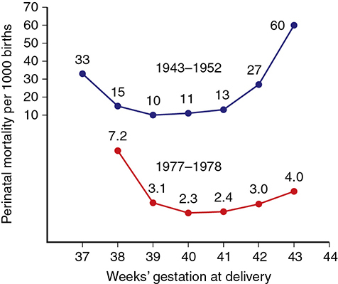
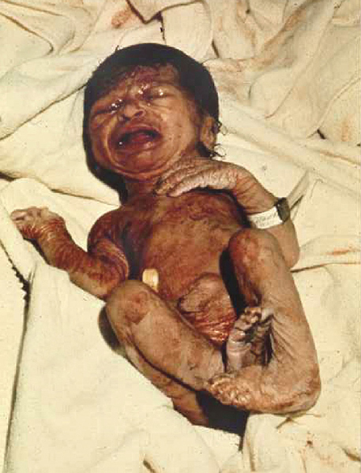
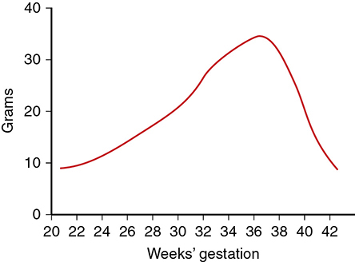
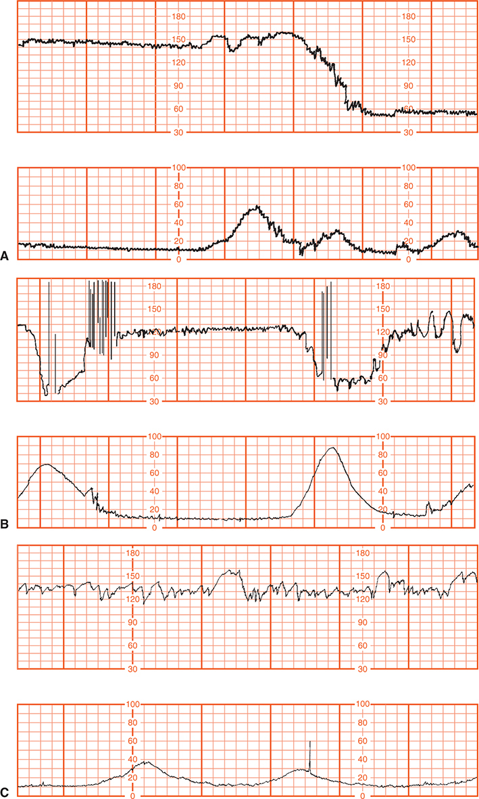
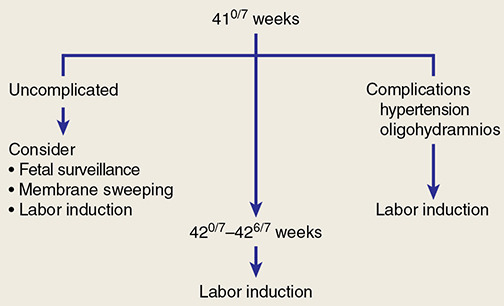

# Chapter 46: Postterm Pregnancy — Revision Notes

> Williams Obstetrics 26e, pp. 2119–2140 of the PDF. High-yield numbers are in **bold**.
> The two tables are transcribed from the PDF images (they are missing from the extracted chapter text). All 5 figures are included from the PDF.

**Big picture:** Perinatal risk is lowest at **39–40 weeks** and climbs after the due date. The dangers to the postterm fetus are **oligohydramnios → cord compression**, **thick meconium**, **growth restriction** and **macrosomia**. Accurate **first-trimester dating** prevents many "false" postterm diagnoses. **Induce after 42⁰/₇ wk**; at 41 wk either induce or start fetal surveillance.

---

## 1. Definitions

| Term | Definition |
|---|---|
| **Postterm (prolonged) pregnancy** | **>42⁰/₇ wk**, i.e., **≥294 days** from the first day of the LMP = **42 completed weeks** |
| **Late term** | **41⁰/₇–41⁶/₇ wk** (in the 42nd week, but 42 weeks not yet completed) |
| **Postmature** | Reserved for the uncommon **clinical neonatal syndrome** of pathologically prolonged pregnancy |
| "Postdates" | **Avoided** — the real problem is often an uncertain EDD |

- Williams prefers **postterm** or **prolonged** pregnancy.

---

## 2. Estimated Gestational Age
- The definition assumes **ovulation 2 weeks after the LMP** → menstrual recall errors or delayed ovulation create false postterm diagnoses.
- **First-trimester sonography is the most accurate** way to establish or confirm GA.
- Reconcile LMP and first accurate ultrasound (Table 14-1) and **record the EDD**.

---

## 3. Incidence and Risk Factors
- US 2019: **0.3%** of 3.75 million births at **≥42 wk** — falling because of better dating and earlier intervention.
- **Risk factors:**
  - **Nulliparity** and **prepregnancy BMI ≥25** (the only significant factors in the Danish Birth Cohort)
  - **Long midpregnancy cervical length** (3rd/4th quartile) in nulliparas → **2×** likely to deliver after 42 wk
  - **Prior postterm birth** — familial tendency (mother and daughter); **maternal, not paternal, genes**; locus on **chromosome 2q13**
- Adverse outcomes rise with **advancing maternal age**.
- **Rare fetal–placental causes:** **anencephaly**, **fetal adrenal hypoplasia**, **X-linked placental sulfatase deficiency** (all ↓ estrogen precursors — Ch 5).

---

## 4. Perinatal Mortality and Morbidity
- **Stillbirth, neonatal death and infant morbidity all rise after the EDD.**
- Swedish data: perinatal mortality **nadir at 39–40 wk**, rising thereafter (same trend in the US).
- Main morbidities: **gestational hypertension**, **prolonged labor with CPD**, **birth injury**, **hypoxic-ischemic encephalopathy**.
- Slight ↑ **cerebral palsy** and **2-point lower IQ**; **no link with autism**.

*Figure 46-1. Swedish perinatal mortality is U-shaped with a nadir at 39–41 wk: 1943–52 rose from 13 (41 wk) to 60/1000 (43 wk); 1977–78 from 2.3 (40 wk) to 4.0/1000 (43 wk).*

### Table 46-1. Adverse Maternal and Perinatal Outcomes Associated with Postterm Pregnancy

| Maternal | Perinatal |
|---|---|
| Fetal macrosomia | Stillbirth |
| Oligohydramnios | Postmaturity syndrome |
| Preeclampsia | NICU admission |
| Cesarean delivery — labor dystocia; fetal jeopardy | Meconium aspiration syndrome |
| Shoulder dystocia | Neonatal convulsions |
| Postpartum hemorrhage | Hypoxic-ischemic encephalopathy |
| Forceps delivery | Birth injuries |
| Perineal lacerations | Infection |
| | Childhood obesity |

*NICU = neonatal intensive care unit. From Amark, 2021; Kortekaas, 2020; Lindquist, 2021; MacDorman, 2009; Maoz, 2019; Middleton, 2018; Olesen, 2003.*

**Parkland (Alexander 2000a; 56,317 singletons ≥40 wk)**
- Labor induced in **35%** of pregnancies reaching 42 wk.
- At **42 wk**: ↑ cesarean for dystocia or fetal distress; ↑ NICU admission; **neonatal seizures and deaths doubled**.

**The denominator problem (Smith 2001)**
- The population at risk in a given week = **all ongoing pregnancies**, not just births that week.
- Using this cumulative "perinatal index", **38 wk** had the lowest risk of perinatal death.
- In practice, death risk is balanced against immaturity → **no elective delivery before 39 wk** unless a comorbidity warrants it.

---

## 5. Pathophysiology

### Postmaturity syndrome
- **Features:**
  - Wrinkled, patchy, **peeling skin**, most prominent on **palms and soles**
  - **Long, thin body** suggesting wasting
  - Advanced maturity: **open-eyed, unusually alert, "old and worried"** look
  - **Long nails**
- Most are **not** technically growth restricted (birthweight seldom <10th percentile), but severe FGR may be present.
- Complicates **10–20%** of pregnancies at 42 completed weeks.
- **Oligohydramnios** raises the likelihood: **88%** postmature if the maximal vertical pocket was **≤1 cm** at 42 wk (Trimmer 1990).

*Figure 46-2. Postmaturity syndrome at 43 weeks: thick meconium on desquamating skin, long thin body, wrinkled hands.*

### Placental dysfunction
- Proposed: limited placental capacity with **dysfunctional syncytiotrophoblast** (Redman and Staff).
- Clifford (1954): skin changes from loss of protective **vernix caseosa**; "placental senescence" — but **no consistent histological or quantitative placental findings**.
- **Placental apoptosis ↑** at 41–42 wk vs 36–39 wk; proapoptotic genes (e.g., **kisspeptin**) upregulated. Clinical significance unclear.
- **Cord erythropoietin ↑ at ≥41 wk** (only stimulus is ↓ Po₂) despite normal Apgar and acid–base → fetal oxygenation reduced in some.
- But fetuses **keep growing** (often large at birth) → placental function not severely compromised.
  - Growth velocity **peaks ~37 wk**, then slows; growth continues to at least **42 wk**.
  - **Umbilical blood flow does not increase** accordingly.

*Figure 46-3. Mean daily fetal weight gain peaks at ~35 g/day around 37 weeks, then falls steeply (~10 g/day by 42 weeks).*

### Fetal distress and oligohydramnios
- Leveno 1984 (727 postterm pregnancies): antepartum and intrapartum jeopardy were due to **cord compression from oligohydramnios**, **not uteroplacental insufficiency** (no late decelerations).
- **Prolonged decelerations** preceded **¾** of emergency cesareans for nonreassuring FHR; **variable decelerations** were present in nearly all.
- **Saltatory baseline** (oscillations **>20 bpm**) was common — not ominous alone.
- Other correlates: oligohydramnios, **viscous meconium**, **nuchal cord**.
- Amnionic fluid volume normally **declines after 38 wk**. Meconium into scant fluid → thick → **meconium aspiration syndrome**; risk **5% at 42 wk**.

*Figure 46-4. Postterm FHR patterns with oligohydramnios: (A) prolonged deceleration before emergency cesarean, (B) variable decelerations, (C) saltatory baseline >20 bpm — all point to cord compression.*

### Fetal-growth restriction
- Stillbirths are more common among growth-restricted fetuses delivered after 42 wk: **⅓ of postterm stillbirths were growth restricted** (Sweden).
- Parkland (355 neonates ≥42 wk and **<3rd percentile**): ↑ morbidity and mortality; this small group accounted for **¼ of postterm stillbirths**.

---

## 6. Complications

### Oligohydramnios
- Cause: **↓ fetal urine production** (sequential bladder volumes) and **↓ fetal renal blood flow** (Doppler), possibly from the lack of rising umbilical flow.
- Measured by **deepest vertical pocket (DVP)** or **AFI** (Ch 14); no exact definition.
  - The smaller the pocket, the greater the risk — but a **normal volume does not exclude** a bad outcome (oligohydramnios can develop quickly).
  - RCT (500 women): **AFI overestimates** abnormal outcomes compared with DVP.
- **Oligohydramnios by most definitions is clinically meaningful** → more intrapartum "fetal compromise".

### Macrosomia
- Weight gain velocity peaks at **~37 wk** but most fetuses keep gaining; **95th percentile at 42 wk = 4475 g**.
- Brachial plexus injury was **not** related to postterm gestation (one study).
- **Induction for suspected macrosomia is not supported** (ACOG).
- Without diabetes, **vaginal delivery is not contraindicated up to EFW 5000 g** (Ch 27). Fetal weight estimates vary widely.

---

## 7. Antepartum Management
- **After 42 completed weeks → labor induction recommended.**
- For late term (41 wk), some intervention is indicated; induction vs expectant management with surveillance is debated.
- Older ACOG survey: **73%** routinely induced at 41 wk; most others did **twice-weekly testing** until 42 wk.

### Induction factors
- **Unfavorable cervix:** **Bishop score <7** in **92%** at 42 wk (Harris 1983); **40%** "undilated" at 41 wk.
- **No cervical dilation → 2× cesarean for "dystocia"** (Parkland, 800 inductions).
- **Transvaginal cervical length ≤3 cm** predicts successful induction; **≤25 mm** predicts spontaneous labor or successful induction.
- **Prostaglandins:** PGE₂ gel was **not better than placebo** (MFMU 1994). With 2–4 cm dilation, almost **half** entered labor with PGE₂ alone.
- **Membrane sweeping:** slightly ↑ spontaneous labor and ↓ induction (Cochrane, 44 studies) but **no ↓ cesarean**; other trials no ↓ induction. Downsides: pain, bleeding, irregular contractions.
- **Station predicts cesarean** in nulliparas induced after 41 wk (Shin 2004):

| Station before induction | Cesarean rate |
|---|---|
| –1 | **6%** |
| –2 | **20%** |
| –3 | **43%** |
| –4 | **77%** |

### Induction versus fetal testing

| Study | Design | Result |
|---|---|---|
| **Hannah 1992** (Canada) | 3407 women ≥41 wk: induction vs testing | Induction ↓ cesarean **21% vs 24%**; only 2 stillbirths with testing |
| **MFMU (Gardner 1996)** | 41 wk: induction (265) vs **twice-weekly NST + AF volume** (175) | No perinatal deaths; **cesarean rate the same** → both strategies valid |
| **Alexander 2001** | ≥41 wk | Spontaneous labor before 42⁰/₇ wk vs induction after 42⁰/₇ wk: cesarean **14% vs 19%** (failure to progress) |
| **Denmark (Zizzo 2017)** | Guideline changed 2011: induction at **41²/₇–41⁶/₇ wk** + surveillance from 41⁰/₇ wk (was 42⁰/₇ wk, no surveillance) | Pregnancies past 42 wk **2.85% → 0.62%**; perinatal mortality **22 → 13 per 1000**; cesarean rate unchanged |
| **Bleicher 2017** | Before–after | Induction at ≥42 wk: cesarean **15% vs 19.4%** |
| **SWEPIS (Wennerholm 2019)** | 2760 low-risk women: induction at **41 wk** vs expectant + induction at 42 wk | Primary composite **no different**; **stopped early** for ↑ **perinatal mortality** with expectant care (**0 vs 6/1000**); ↑ macrosomia with expectant care |

### Table 46-2. Selected Maternal and Perinatal Outcomes from SWEPIS Trial

| Outcome | Induction (n = 1381) | Expectant (n = 1379) | p value |
|---|---|---|---|
| *Maternal* | | | |
| Gestational age (days) | 289 ± 1.3 | 292 ± 2.7 | — |
| Labor (hours) | 7.1 ± 5.4 | 8.3 ± 5.9 | <0.001 |
| Cesarean delivery | 10.4% | 10.7% | 0.79 |
| Operative vaginal delivery | 6.4% | 6.6% | 0.87 |
| *Perinatal* | | | |
| Primary composite | 2.4% | 2.2% | 0.9 |
| **Perinatal mortality** | **0** | **6/1000** | **0.03** |
| Meconium aspiration | 0.1% | 0.2% | 1.00 |
| **Macrosomia (>4500 g)** | **4.9%** | **8.3%** | **<0.001** |
| NICU stay (days) | 3.4 ± 3 | 4.6 ± 5.6 | NS |

*g = grams; NICU = neonatal intensive care unit; NS = not significant; SWEPIS = SWEdish Post-term Induction Study. Note: the text says only perinatal mortality and macrosomia differed, but the table also shows a significantly shorter labor with induction (p <0.001).*

### Management strategies
- Evidence is **insufficient to mandate** one strategy between 40 and 42 completed weeks → **induction or fetal surveillance at 41 wk** are both reasonable.
- **ACOG/SMFM: fetal surveillance once or twice weekly from 41⁰/₇ wk.**
- **After 42 completed weeks → induce.**
- With the higher stillbirth rate on expectant management at 41 wk, **routine induction at 41 wk will likely become preferred**.
- **Uncertain GA:** deliver at **41 wk** by the best clinical estimate. **No amniocentesis for fetal lung maturity.**

*Figure 46-5. ACOG algorithm: at 41⁰/₇ wk, uncomplicated → consider surveillance, membrane sweeping or induction; complications (hypertension, oligohydramnios) → induce; 42⁰/₇–42⁶/₇ wk → induce.*

> **Memory hook:** "**41 — choose; 42 — induce.**" Oligohydramnios or hypertension at any point after 41 wk → induce.

---

## 8. Intrapartum Management
- Labor is particularly dangerous for the postterm fetus → come to hospital **as soon as labor is suspected**; **continuous electronic FHR and contraction monitoring**.
- **Amniotomy dilemma:**
  - Against: further ↓ fluid → ↑ **cord compression**.
  - For: allows a **scalp electrode and IUPC** (more precise data) and reveals **thick meconium**.
- **Thick meconium** = little liquid (oligohydramnios); aspiration → severe pulmonary dysfunction and death.
- **Amnioinfusion does NOT prevent meconium aspiration syndrome**, but is reasonable for **repetitive variable decelerations**.
- **Do not suction the pharynx** at delivery of the head. **Intubate the depressed newborn** with meconium-stained fluid.
- **Nullipara in early labor with thick meconium** → vaginal delivery less likely → **strongly consider prompt cesarean**, especially with suspected **CPD** or **hypotonic/hypertonic dysfunctional labor**. Some avoid oxytocin.

---

## Quick-Recall: Postterm Problems and Their Mechanism

| Problem | Mechanism / Key fact | Clue / Action |
|---|---|---|
| **False postterm** | Dating error, delayed ovulation | First-trimester ultrasound dating |
| **Oligohydramnios** | ↓ Fetal urine, ↓ renal blood flow | DVP (AFI overcalls); → induce |
| **Nonreassuring FHR** | **Cord compression** (not placental insufficiency) | Prolonged/variable decelerations, saltatory baseline |
| **Meconium aspiration** | Thick meconium in scant fluid (5% at 42 wk) | No pharyngeal suction; intubate depressed newborn; amnioinfusion does not prevent it |
| **Postmaturity syndrome** | 10–20% at 42 wk; 88% if pocket ≤1 cm | Peeling skin, long thin body, alert "old" face, long nails |
| **FGR** | ⅓ of postterm stillbirths; ¼ at Parkland (<3rd %ile) | Highest-risk subgroup |
| **Macrosomia** | Growth continues; 95th %ile 4475 g at 42 wk | Induction for suspected macrosomia not supported; vaginal OK ≤5000 g without diabetes |
| **Failed induction** | Unfavorable cervix (Bishop <7 in 92%), high station | Station –4 → 77% cesarean |

## Key Numbers to Memorize
- Postterm **>42⁰/₇ wk / ≥294 days**; late term **41⁰/₇–41⁶/₇ wk**
- Incidence **0.3%** at ≥42 wk (US 2019)
- Perinatal mortality nadir **39–40 wk**; Smith's perinatal index lowest at **38 wk**
- Seizures and deaths **doubled at 42 wk** (Parkland)
- Postmaturity **10–20%** at 42 wk; **88%** if max vertical pocket **≤1 cm**
- Growth velocity peaks **~37 wk**; 95th percentile at 42 wk **4475 g**; vaginal delivery OK to **5000 g** (no diabetes)
- Meconium aspiration syndrome **5%** at 42 wk
- Emergency cesareans preceded by prolonged deceleration: **¾**; saltatory baseline **>20 bpm**
- FGR = **⅓** of postterm stillbirths
- Bishop **<7** in **92%** at 42 wk; cervical length **≤3 cm / ≤25 mm** favors success
- Station –1/–2/–3/–4 → cesarean **6/20/43/77%**
- Hannah: cesarean **21 vs 24%**; Denmark perinatal mortality **22 → 13/1000**; SWEPIS perinatal mortality **0 vs 6/1000**
- Surveillance **1–2×/week from 41⁰/₇ wk**; induce after **42 wk**; uncertain dates → deliver at **41 wk**
