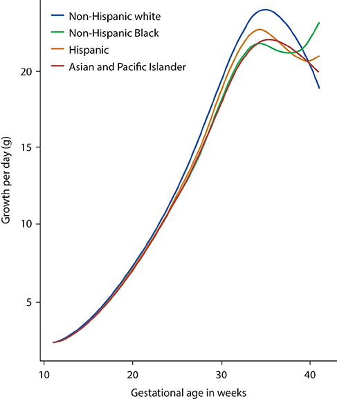
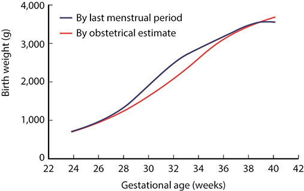
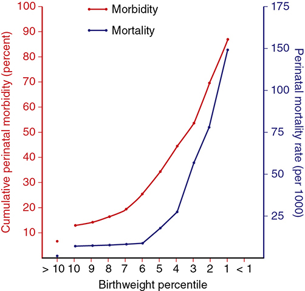
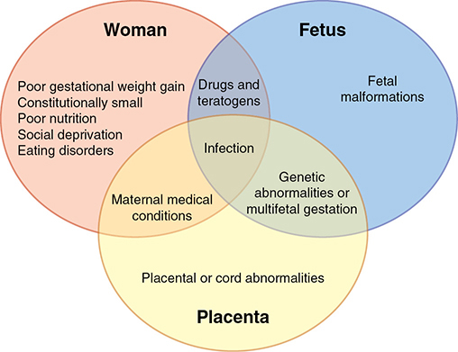
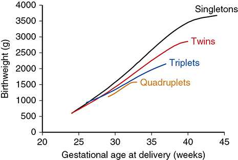
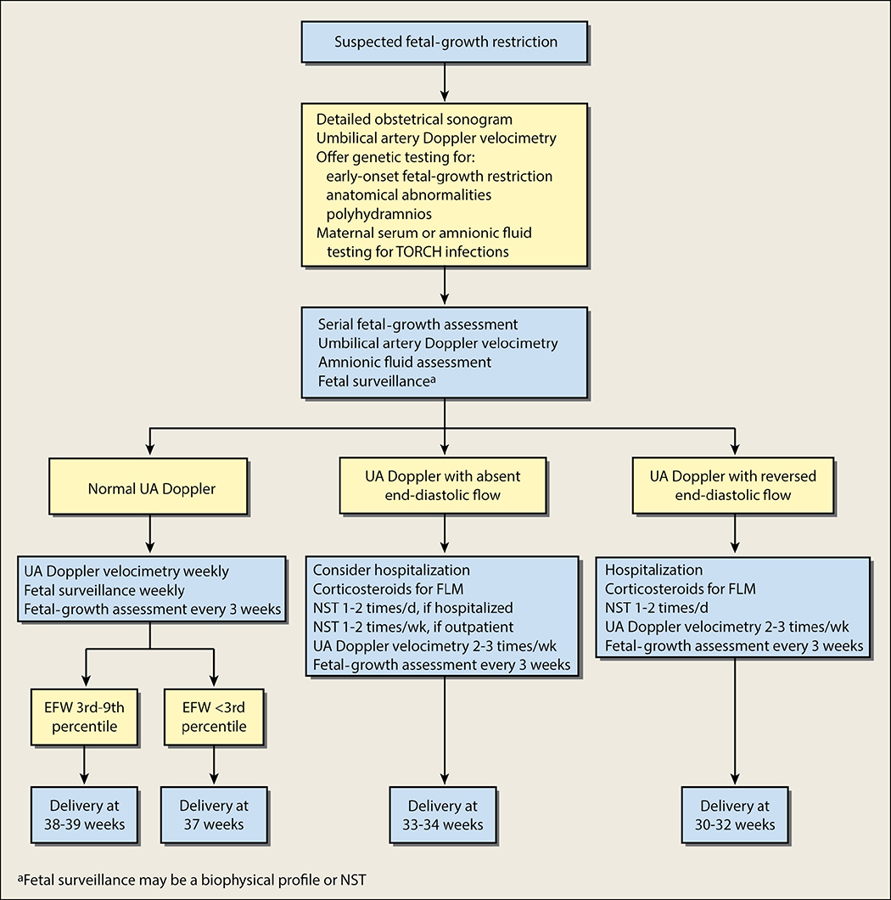
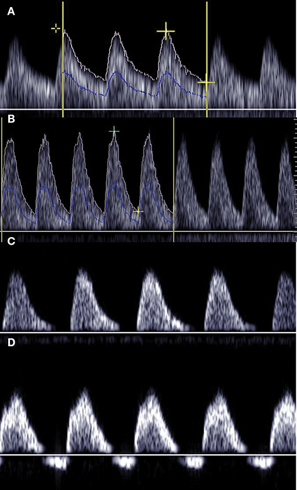

# Chapter 47: Fetal-Growth Disorders — Revision Notes

> Williams Obstetrics 26e, pp. 2141–2181 of the PDF. High-yield numbers are in **bold**.
> The four tables are transcribed from the PDF images (they are missing from the extracted chapter text). All 7 figures are included from the PDF.

**Big picture:** Growth disorders sit at both ends — **fetal-growth restriction (FGR)** and **macrosomia**. Most small or large babies are simply **constitutionally** small or large. FGR is managed with **serial growth scans, umbilical artery Doppler and fetal testing**, with delivery timed by the Doppler findings. For suspected macrosomia, **neither early induction nor elective cesarean** is advised below set weight thresholds.

---

## 1. Normal Fetal Growth

| Phase | Weeks | Process | Growth rate |
|---|---|---|---|
| 1 | **0–16** | **Hyperplasia** (↑ cell number) | ~**5 g/d** at 15 wk |
| 2 | **16–32** | Hyperplasia + hypertrophy | ~**15 g/d** at 24 wk |
| 3 | **>32** | **Hypertrophy**; most **fat and glycogen** laid down | ~**30 g/d** at 34 wk |

- NICHD Fetal Growth Studies (1733 low-risk women): growth velocity **peaks at 35 wk**.
- Growth varies widely and correlates poorly with birthweight percentile: some fetuses <5th percentile keep their velocity and end up heavier than initially bigger fetuses → **serial sonography** matters.

*Figure 47-1. Fetal weight gain (g/day) by race/ethnicity: velocity peaks ~35 weeks at ~22–24 g/day, then diverges.*

### Normal birthweight
- Accurate GA (obstetrical estimate incl. sonography) is critical.
- Percentiles below: **>3 million** US singletons, 2011 (Duryea 2014).
- LMP-based dating gives **heavier weights for GA**, especially preterm → affects SGA/LGA prevalence.
- Duryea curve = **population reference** (all risks and outcomes), not a **standard** (normal pregnancies, normal outcomes). Because it includes preterm births, it may overestimate impaired growth.

### Table 47-1. 2011 Gestational Age Birthweight (g) Percentiles for 3,252,011 Singleton Live Births in the United States

| Age (wk) | 5th | 10th | 50th | 90th | 95th |
|---|---|---|---|---|---|
| 24 | 539 | 567 | 680 | 850 | 988 |
| 25 | 540 | 584 | 765 | 938 | 997 |
| 26 | 580 | 637 | 872 | 1080 | 1180 |
| 27 | 650 | 719 | 997 | 1260 | 1467 |
| 28 | 740 | 822 | 1138 | 1462 | 1787 |
| 29 | 841 | 939 | 1290 | 1672 | 2070 |
| 30 | 952 | 1068 | 1455 | 1883 | 2294 |
| 31 | 1080 | 1214 | 1635 | 2101 | 2483 |
| 32 | 1232 | 1380 | 1833 | 2331 | 2664 |
| 33 | 1414 | 1573 | 2053 | 2579 | 2861 |
| 34 | 1632 | 1793 | 2296 | 2846 | 3093 |
| 35 | 1871 | 2030 | 2549 | 3119 | 3345 |
| 36 | 2117 | 2270 | 2797 | 3380 | 3594 |
| 37 | 2353 | 2500 | 3025 | 3612 | 3818 |
| 38 | 2564 | 2706 | 3219 | 3799 | 3995 |
| **39** | 2737 | 2877 | 3374 | **3941** | 4125 |
| **40** | 2863 | **3005** | **3499** | 4057 | 4232 |
| 41 | 2934 | 3082 | 3600 | 4167 | 4340 |
| 42 | 2941 | 3099 | 3686 | 4290 | 4474 |

*From Duryea, 2014, with permission.*

*Figure 47-2. LMP-based dating overstates birthweight for GA at 28–36 weeks compared with the obstetrical (ultrasound-informed) estimate.*

### Physiology of fetal growth
- **Substrate supply and placental transfer** drive development; **the genome** sets growth potential.
- **Insulin and insulin-like growth factors** are key regulators. **Leptin** rises with gestation and correlates with birthweight and fat mass.
- **Glucose:** FGR neonates usually do **not** have low cord glucose; deprivation restricts growth only with **long-term severe caloric deprivation**. **Hyperglycemia** more consistently causes overgrowth.
  - **HAPO:** ↑ **cord C-peptide** (fetal hyperinsulinemia) → ↑ birthweight, even with maternal glucose below diabetic thresholds.
- **Lipids:** maternal free fatty acids (late pregnancy) and **omega-3** intake correlate with birthweight.
  - **Endothelial lipase ↓** in FGR placentas, **overexpressed in diabetes**; obesity ↑ trophoblast fatty-acid transport proteins → lipid accumulation, placental inflammation.

---

## 2. Fetal-Growth Restriction: Definition
- An EFW threshold identifies an **at-risk category**, not disease. A 10th-percentile cutoff labels ~10% of low-risk fetuses (mostly constitutionally small) and misses fetuses above it that have not reached their potential.
- **ACOG/SMFM definition of FGR: EFW <10th percentile OR abdominal circumference (AC) <10th percentile** for GA.
  - Adding AC finds **1 extra SGA newborn per 14 sonograms** in the last month.
  - Management is further stratified by lower thresholds (**<3rd percentile**), **oligohydramnios** and **umbilical artery Doppler**.
- **Customized growth charts** (maternal height/weight, ethnicity, parity, fetal sex) **do not improve outcomes → not recommended**.

| FGR | SGA |
|---|---|
| **Prenatal** sonographic diagnosis | **Postnatal** designation — birthweight **<10th percentile** |

- **50%** of fetuses with suspected FGR on routine third-trimester scans had birthweight >10th percentile; false positives were delivered **2 weeks earlier** (iatrogenic harm).
- **Up to 70% of SGA newborns are not pathologically growth restricted** (normal when maternal ethnicity, parity, weight, height are considered).
- Maternal and paternal birthweights explain **6% and 3%** of birthweight variance.
- **Most adverse outcomes occur below the 3rd percentile.** Parkland (>80,000 term births): neonatal mortality and most morbidity rose only at **≤3rd percentile**.
- Small-but-normal neonates stay smaller to 2 yr but show **no metabolic derangement**.

*Figure 47-3. In 1560 SGA fetuses, morbidity and perinatal mortality rise steeply below the 3rd–4th percentile (mortality ~150/1000 at the 1st percentile).*

---

## 3. Detection
**Three tenets:**
1. **Accurate GA**, ideally by first- or early second-trimester sonography. If GA uncertain and FGR suspected → serial sonography.
2. **Low-risk:** suspect when **fundal height lags by ≥3 cm after 24 wk** → sonography.
3. **At-risk pregnancy:** consider sonography at **~32 wk**; sometimes **every 4 weeks** (e.g., **twins**, where fundal height cannot assess each fetus).

**Fundal height**
- Measured each visit **after 20 wk**; cm ≈ weeks. Discrepancy **≥3 cm** without explanation → ultrasound.
- **The only routine FGR screening endorsed by ACOG/SMFM**; simple, safe, cheap.
- **Sensitivity only 11–25%**; worse in **obesity**.

**Sonography**
- Routine third-trimester scans detect **<20% to >60%** of SGA newborns — misses late-onset FGR; EFW is imperfect.
- FGR **recurrence ≈ 20%** (often small mothers with small healthy babies).
- **Routine third-trimester ultrasound is NOT recommended** — no maternal or fetal benefit (Cochrane: 13 trials, 34,980 women).

---

## 4. Pathophysiology
- FGR is one of the "**major obstetrical syndromes**" of **defective early placentation** (with preeclampsia) — vascular and immunological mechanisms.
- **Corin** (atrial natriuretic peptide–converting enzyme) is needed for trophoblast invasion and spiral artery remodeling; corin-deficient mice get FGR-like and preeclampsia features; corin mutations occur in preeclampsia.
- **Immunological:** maternal rejection of the "paternal semiallograft".
  - **C4d** (complement, humoral rejection) linked to **chronic villitis — 88% vs 5%** of controls — and small placentas.
  - Chronic villitis → placental hypoperfusion, fetal acidemia, FGR.

---

## 5. Risk Factors
Three overlapping compartments: **mother, fetus, placenta**.

*Figure 47-4. FGR risk factors overlap across woman (nutrition, weight gain, social deprivation), fetus (malformations) and placenta (placental/cord abnormalities); infection sits in all three.*

### Maternal factors

| Factor | Key facts |
|---|---|
| **Gestational weight gain / nutrition** | Weight gain correlates with fetal size. Second/third-trimester gain below IOM advice → ↑ SGA in all BMI groups except **class II–III obesity**. **Dutch famine 1944** (500 kcal/d for 6 months) → mean birthweight **↓ 250 g**. Micronutrients may ↓ LBW (Indonesia; Cochrane 141,849 women). |
| **Socioeconomic** | Linked to smoking, alcohol/drugs, poor nutrition, food insecurity, late prenatal care. Interventions ↓ LBW. Racial gap persists even with equal access (military). |
| **Vascular and renal disease** | Chronic hypertension (esp. + **superimposed preeclampsia**); abnormal early **uterine artery Doppler** → preeclampsia, SGA, delivery <34 wk. **Ischemic heart disease → 16% SGA**. Nephropathy. |
| **Pregestational diabetes** | FGR from malformations or vasculopathy; worsens with **White class**, esp. **nephropathy** |
| **Chronic hypoxia** | Asthma, cyanotic heart disease, lung disease, smoking, altitude. **Smoking: dose-dependent, ~200 g lighter**. **Altitude: −150 g per 1000 m.** |
| **Anemia** | Usually **no effect**, except **sickle-cell** and other inherited anemias. **Poor plasma-volume expansion** is linked to FGR. |
| **Antiphospholipid syndrome** | Anticardiolipin, lupus anticoagulant, **anti-β2 glycoprotein-I** (strongest link, esp. early-onset). "**Two-hit**": endothelial damage → intervillous thrombosis. >1 antibody type → higher risk. |
| **Drugs and substances** | Cyclophosphamide/antineoplastics, **lead**, cocaine, methamphetamine; **alcohol** (FGR is a criterion for **fetal alcohol syndrome**); **smoking → 2–3× FGR**. Most drugs do not affect growth. |

### Placental, cord and uterine
- Chronic **abruption**, extensive **infarction**, **chorioangioma**, **velamentous cord insertion**, **umbilical artery thrombosis**, abnormal implantation (preeclampsia), some **uterine malformations**.
- **Confined placental mosaicism** is a recognized cause.

### Multifetal gestation
- Growth of one or more fetuses is more often impaired → **serial sonography**. Parkland uses a **chorionicity-specific twin nomogram**; also assess **discordance** (Ch 48).

*Figure 47-5. Mean birthweight by GA falls progressively from singletons to twins, triplets and quadruplets, diverging after ~30 weeks.*

### Infections (up to **5%** of FGR)
- **Rubella and CMV** best known (fetal calcifications from cell death; earlier infection = worse).
  - Congenital rubella (Vietnam): **39%** LBW.
  - CMV: no severe cases if primary infection **after 14 wk**; FGR in **30%** of those with sonographic findings.
- **Tuberculosis:** OR **1.7** for LBW.
- **Syphilis:** placenta is paradoxically **larger and heavier** (edema, perivascular inflammation); strongly linked to **preterm birth**.
- **Toxoplasmosis:** LBW in ~**40%** (only 13% treated antenatally). **Malaria** → LBW; give prophylaxis early.

### Congenital malformations
- Major malformations/chromosomal abnormalities → FGR at **2×** the population rate.
- **Gastroschisis = the defect most strongly linked to FGR**: **⅓** <10th percentile.
- Isolated cardiac defects: SGA **13%** (3% above baseline).
- FGR + structural anomaly → ↑ risk of a genetic syndrome → **offer amniocentesis with chromosomal microarray**.

### Genetic abnormalities

| Condition | SGA prevalence / feature |
|---|---|
| **Trisomy 21** | **15–30%** |
| **Trisomy 13** | **~50%**; short CRL |
| **Trisomy 18** | **>80%**; FGR + anomalies + **hydramnios**; short CRL |
| **Turner syndrome** | Severity ∝ haploinsufficiency of **Xp** |
| Extra X chromosomes | Poor growth **not** characteristic |

---

## 6. Management of FGR
- Stillbirth risk ↑; **early-onset** FGR is especially problematic.
- **General tenets:**
  - **Growth scans every 3 weeks**
  - **At least weekly amnionic fluid + umbilical artery (UA) Doppler**
  - **Fetal well-being testing** (NST or BPP)
  - Slow-but-progressing EFW is more reassuring than a **plateau**
  - Consider a **detailed anatomic survey** and **amniocentesis** (genetics, infection), especially with early onset

*Figure 47-6. FGR algorithm: delivery timing is set by UA Doppler and EFW — normal Doppler: 38–39 wk (EFW 3rd–9th %ile) or 37 wk (<3rd %ile); AEDF: 33–34 wk; REDF: 30–32 wk.*

| Finding | Surveillance | **Deliver at** |
|---|---|---|
| Normal UA Doppler, EFW **3rd–9th** %ile | Weekly UA Doppler and fetal testing; growth every 3 wk | **38–39 wk** |
| Normal UA Doppler, EFW **<3rd** %ile | Same | **37 wk** |
| **Absent** end-diastolic flow (AEDF) | Consider admission; **steroids**; NST 1–2×/day inpatient (1–2×/wk outpatient); UA Doppler 2–3×/wk; growth every 3 wk | **33–34 wk** |
| **Reversed** end-diastolic flow (REDF) | **Admit**; **steroids**; NST 1–2×/day; UA Doppler 2–3×/wk; growth every 3 wk | **30–32 wk** |
| **Oligohydramnios** (near term) | — | **36⁰/₇–37⁶/₇ wk** |

> **Memory hook:** "**Normal 37–39, Absent 33–34, Reversed 30–32**" — each step of Doppler deterioration moves delivery earlier.

### Delivery timing trials
- **GRIT** (Thornton 2004; 548 women, **24–36 wk**): immediate vs delayed delivery → **no difference** in death or disability at 2 yr, nor at 6–13 yr.
- **DIGITAT** (321 women, **≥36 wk**): induction vs expectant → **no difference** in composite neonatal morbidity (fewer admissions if induced after 38 wk, secondary analysis); same 2-yr neurodevelopment.

### Doppler velocimetry
- **UA Doppler is central** to FGR management. Progression: **↑ impedance (↑ S/D) → absent EDF → reversed EDF**, paralleling hypoxia, acidosis and death.
- EFW <10th percentile: adverse outcome **1%** with normal UA Doppler vs **12%** with abnormal (O'Dwyer 2014, 1116 fetuses).
- **Stillbirth risk: AEDF 7%, REDF 19%.**
- **ACOG/SMFM: serial UA Doppler** in FGR.

*Figure 47-7. Umbilical artery waveforms: (A) normal S/D, (B) raised S/D, (C) absent end-diastolic flow, (D) reversed end-diastolic flow.*

**Other vessels — NOT recommended for routine management**
- **Ductus venosus:** abnormal flow = ↑ central venous pressure (↓ cardiac compliance, ↑ RV end-diastolic pressure) → stillbirth **20%**, **46% with reversed a-wave**.
- **Umbilical vein pulsatility** → cardiac dysfunction.
- **Cerebroplacental ratio (CPR) = MCA PI ÷ UA PI**; reflects **brain-sparing** vasodilation. **CPR <1** → earlier delivery, lower birthweight, cesarean, NICU, death — but a metaanalysis (18,731 fetuses) found it **not predictive**.

### Near-term fetus
- Normal UA Doppler, normal fluid, reassuring testing → delivery can wait until **37–38 wk**.
- **Oligohydramnios → deliver 36⁰/₇–37⁶/₇ wk.**
- Normal FHR → plan vaginal delivery; some fetuses **do not tolerate labor**.

### Fetus remote from term (<34 wk)
- Normal fluid and testing → **observe**; reassess growth **no sooner than 3 weeks**; weekly outpatient UA Doppler, fluid and testing.
- **AEDF or REDF → inpatient surveillance.**
- **No treatment works:** bed rest, nutrient supplements, plasma volume expansion, **oxygen**, antihypertensives, **heparin, aspirin** — all ineffective.
- Balance fetal death risk vs prematurity. 2-yr neurodevelopment is best predicted by **birthweight and GA**; Doppler abnormalities do not reliably predict childhood cognition.

### Intrapartum management
- Placental insufficiency may worsen in labor; **oligohydramnios → cord compression** → ↑ **cesarean**, neonatal hypoxia, **meconium aspiration**.
- Skilled neonatal resuscitation at delivery.
- Severely growth-restricted newborn: **hypothermia, hypoglycemia, polycythemia, hyperviscosity** — worst at lowest weights.

---

## 7. Outcomes of SGA/FGR
- Battaglia and Lubchenco (1967): SGA = **<10th percentile**; mortality at 38 wk **1% vs 0.2%**.
- SGA stillbirth rate **~1%** (**2×** the population).
- **<27 wk and <10th percentile:** **~4×** death or neurodevelopmental impairment; **~3×** cerebral palsy.
- **<5th percentile** (91,000 pregnancies): ↑ low Apgar, RDS, NEC, sepsis; stillbirth **6×**, neonatal death **4×**.
- **<1st percentile:** only **14%** survived to discharge.
- Poor motor, cognitive, language, attention and behavioral outcomes persist into adolescence.

### Early-onset FGR
- **~30%** of FGR is diagnosed **before 32 wk** — the cutoff for **early vs late onset** (SMFM).
- Early onset: more **severe**, more **placental dysfunction and maternal hypertension**, more **UA Doppler abnormalities**, ↑ antiangiogenic **sVEGFR-1 / sFlt-1** (as in preeclampsia).

| | Early-onset FGR | Late-onset FGR |
|---|---|---|
| Timing | **<32 wk** (~30%) | ≥32 wk |
| Severity | More severe | Milder |
| Association | Placental dysfunction, **hypertension/preeclampsia**, ↑ sFlt-1 | Less placental disease |
| UA Doppler | **Often abnormal** | Less often abnormal |

### Barker hypothesis
- Fetal and infant health (under- and overgrowth) programs adult disease: **hypertension, atherosclerosis, type 2 diabetes, metabolic syndrome**. Early postnatal weight gain also matters.
- **Heart:** SGA infants (<34 wk) have a more **globular ventricle** with systolic and diastolic dysfunction; LBW adolescents have a thicker LV posterior wall.
- **Kidney:** low or high birthweight, maternal obesity and GDM harm renal development.

### Prevention
- Preconception: treat maternal disease, adjust medications, **stop smoking**, antimalarial prophylaxis, correct nutrition.
- **Treating mild–moderate hypertension does not ↓ SGA.**
- **No drug prevents FGR.** Aspirin: no benefit in a 1700-woman RCT; metaanalyses showed ↓ FGR, but in women at risk for preeclampsia (secondary finding) → **aspirin NOT recommended for FGR prevention** without preeclampsia risk factors.

---

## 8. Fetal Macrosomia

### Definition
- **Macrosomia:** EFW above a threshold — **4000, 4500 or 5000 g** (no consensus). <4000 g is not excessively large.
- **LGA:** weight **>90th percentile** for GA; usually constitutional. The 90th percentile at **39 wk ≈ 3900 g** → most LGA infants are not macrosomic.
- US 2019: **4000–4499 g 6.4%**; **4500–4999 g 0.9%**; **≥5000 g 0.1%**.
- Parkland (>350,000 births): only **1.4% ≥4500 g**.
- Williams: abnormal overgrowth = **>2 SD above the mean** (~**3%** of births) ≈ **4500 g at 40 wk**.

### Table 47-2. Birthweight Distribution of 354,509 Liveborn Infants at Parkland Hospital between 1988 and 2012

| Birthweight (g) | Births No. | Births % | Maternal Diabetes No. | Maternal Diabetes % |
|---|---|---|---|---|
| 500–3999 | 322,074 | 90.9 | 13,365 | 86.2 |
| 4000–4249 | 19,106 | 5.4 | 1043 | 6.7 |
| 4250–4499 | 8391 | 2.4 | 573 | 3.7 |
| 4500–4749* | 3221 | 0.9 | 284 | 1.8 |
| 4750–4999 | 1146 | 0.3 | 134 | 0.7 |
| 5000–5249 | 385 | 0.1 | 57 | 0.4 |
| 5250–5499 | 127 | 0.04 | 31 | 0.2 |
| 5500 or more | 59 | 0.02 | 14 | 0.09 |
| **Total** | **354,509** | | **15,501** | |

*\*Printed as "4500–4649"; the next row starts at 4750, so the band is 4500–4749.*

### Detection
- **Macrosomia cannot be diagnosed until delivery** — fundal height and sonography are inaccurate, especially with **obesity**.
- EFW >4000 g within 2 weeks of delivery: **>50%** overestimated; of cesareans done for suspected LGA, **~30%** of babies were **<4000 g**.

### Pathophysiology
- **Pedersen hypothesis (1954):** maternal **hyperglycemia → fetal hyperinsulinemia → overgrowth**.
- Diabetes + ↑ cord **IGF-1** → more fat mass and cardiac changes (↑ **interventricular septal thickness** with GDM).
- **Persistent pulmonary hypertension of the newborn:** independent risk factors = maternal obesity, diabetes, and both deficient and excessive fetal growth.

### Table 47-3. Risk Factors for Fetal Macrosomia

| Risk factors |
|---|
| Obesity |
| Diabetes |
| Postterm gestation |
| Multiparity |
| Large size of parents |
| Advancing maternal age |
| Previous macrosomic infant |
| Racial and ethnic factors |

- Many are interrelated (age ↔ parity and diabetes; obesity ↔ diabetes).
- Obese women in China: macrosomia **>24%**; **~2.5×** with prolonged pregnancy and GDM.
- **Diabetes is strongly linked to >4000 g** (Table 47-2), and **type 1 > type 2** for >90th and >97.7th percentiles. Third-trimester glucose, **HbA1c and fasting glucose** independently predict it.
- But diabetes accounts for only a **small share** of all LGA newborns.

### Management
- **Exercise** ↓ LGA / >4000 g **without** ↑ SGA or <2500 g (28 studies, 5322 women).
- Diabetes: insulin and glycemic control ↓ macrosomia but not consistently cesarean.
- Macrosomia is strongly tied to **maternal obesity** and **excessive gestational weight gain** (Ch 10).

**"Prophylactic" labor induction**
- Systematic review (11 studies): induction for suspected macrosomia **↑ cesarean** with no perinatal benefit.
- Metaanalysis (4 RCTs, 1190 women): induction at **≥38 wk** ↓ overgrowth and **fractures**. Boulvain 2015 (822 women): marginally more vaginal births, lower composite morbidity.
- Early-term elective delivery worsens neonatal outcomes → **ACOG: no early induction or delivery before 39 wk for suspected macrosomia.**

**Elective cesarean**
- **9%** of shoulder-dystocia–related injuries still follow cesarean.
- Nondiabetic women: planned cesarean to prevent **brachial plexopathy** is unreasonable — too many cesareans per injury prevented.
- Diabetic women with EFW **>4250 or >4500 g**: planned cesarean may be reasonable. Conway and Langer: routine cesarean at **≥4250 g** ↓ shoulder dystocia **2.4% → 1.1%**.
- **Elective cesarean is not indicated if EFW <5000 g (no diabetes) or <4500 g (diabetes)** (ACOG).

### Outcomes
- Birthweight **≥4000 g → cesarean >50%**, especially with obesity, diabetes or >5000 g.
- ↑ **Shoulder dystocia**, **brachial plexus injury**, **fractures**; shoulder dystocia up to **~30%** with diabetes; **≥5%** at ≥5000 g in general populations.
- ↑ **Stillbirth** (rising with weight), **PPH**, **perineal laceration**, **maternal infection**.

### Table 47-4. Maternal and Fetal Outcomes for 208,090 Pregnancies Delivered at Parkland Hospital from 1998 through 2012

| Outcomea | <4000 g (n = 187,119) | 4000–4499 g (n = 17,750) | 4500–4999 g (n = 2849) | ≥5000 g (n = 372) | p value |
|---|---|---|---|---|---|
| **Cesarean total** | 46,577 (25) | 5,362 (30) | 1204 (42) | **224 (60)** | <0.001 |
| — Scheduled | 12,564 (7) | 1,481 (8) | 316 (11) | 65 (17) | <0.001 |
| — Dystocia | 7589 (4) | 1388 (8) | 337 (12) | 46 (12) | <0.001 |
| **Shoulder dystocia** | 437 (0) | 366 (2) | 192 (7) | **56 (15)** | <0.001 |
| 3rd- or 4th-degree laceration | 7296 (4) | 932 (5) | 190 (7) | 37 (10) | <0.001 |
| Labor induction | 26,118 (13) | 2499 (14) | 420 (15) | 39 (10) | 0.141 |
| Prolonged second stage | 6905 (4) | 899 (5) | 147 (5) | 14 (4) | <0.001 |
| Chorioamnionitis | 13,448 (7) | 1778 (10) | 295 (10) | 35 (9) | <0.001 |
| pH <7.0 | 925 (0.5) | 96 (0.6) | 20 (0.7) | 4 (1.1) | 0.039 |
| Apgar <7 @ 5 minutes | 1898 (1.0) | 80 (0.5) | 22 (0.8) | 10 (2.7) | <0.001 |
| ICN admission | 4266 (2.2) | 123 (0.7) | 36 (1.3) | 9 (2.4) | <0.001 |
| Fractured clavicle | 1880 (1.0) | 616 (3.5) | 125 (4.4) | 16 (4.3) | <0.001 |
| Mechanical ventilation | 2305 (1.2) | 54 (0.3) | 11 (0.4) | 9 (2.4) | <0.001 |
| Hypoglycemia | 480 (0.2) | 89 (0.5) | 31 (1.1) | 12 (3.2) | <0.001 |
| Hyperbilirubinemia | 5829 (3.0) | 305 (1.7) | 60 (2.1) | 12 (3.2) | <0.001 |
| **Erb palsy** | 470 (0.2) | 224 (1.3) | 74 (2.6) | **22 (5.9)** | <0.001 |
| Neonatal death | 402 (0.2) | 3 (0) | 2 (0.1) | 1 (0.3) | <0.001 |

*aOutcome data presented as n (%). ICN = intensive care nursery.*

---

## Quick-Recall: FGR vs Macrosomia

| Feature | Fetal-growth restriction | Macrosomia |
|---|---|---|
| Definition | EFW **or AC <10th %ile** (prenatal); SGA = birthweight <10th %ile | EFW/birthweight **>4000 / 4500 / 5000 g**; LGA = >90th %ile |
| Truly pathological | Mostly **<3rd %ile**; up to 70% of SGA are normal | >2 SD (~3%, ≈4500 g at 40 wk) |
| Screening | **Serial fundal height** (sensitivity 11–25%); no routine 3rd-trimester scan | Clinical/sonographic EFW (>50% overestimated) |
| Key causes | Placental (preeclampsia, APS), smoking, infection (CMV, rubella), aneuploidy (T18 >80%), **gastroschisis** | Obesity, **diabetes**, postterm, multiparity, prior macrosomia |
| Monitoring | Growth q3 wk; **weekly UA Doppler + fluid + NST/BPP** | Glycemic control, exercise, weight-gain limits |
| Delivery | Normal Doppler 37–39 wk; AEDF 33–34; REDF 30–32; oligohydramnios 36–37⁶/₇ | **No induction before 39 wk**; cesarean only if EFW ≥5000 g (≥4500 g with diabetes) |
| Neonatal risks | Hypothermia, hypoglycemia, polycythemia, hyperviscosity, stillbirth | Shoulder dystocia, Erb palsy, clavicle fracture, hypoglycemia, stillbirth |
| Ineffective therapies | Bed rest, O₂, nutrients, volume expansion, heparin, aspirin | Prophylactic early induction, elective cesarean for EFW below thresholds |

## Key Numbers to Memorize
- Growth phases: hyperplasia **0–16 wk**; + hypertrophy to **32 wk**; growth **5 / 15 / 30 g/d** at 15 / 24 / 34 wk; velocity peaks **35 wk**
- FGR = EFW or AC **<10th %ile**; adverse outcomes mainly **<3rd %ile**; **70%** of SGA normal
- Fundal height lag **≥3 cm** → ultrasound; sensitivity **11–25%**; FGR recurrence **~20%**
- Smoking **−200 g** (2–3× FGR); altitude **−150 g/1000 m**; Dutch famine **−250 g**
- Chronic villitis with C4d **88% vs 5%**; infections **≤5%** of FGR; gastroschisis **⅓** FGR
- SGA in T21 **15–30%**, T13 **50%**, T18 **>80%**
- UA Doppler: adverse outcome **1% vs 12%**; stillbirth AEDF **7%**, REDF **19%**; DV abnormal **20%**, reversed a-wave **46%**
- Deliver: normal Doppler **38–39 wk** (3rd–9th) / **37 wk** (<3rd); AEDF **33–34**; REDF **30–32**; oligohydramnios **36⁰/₇–37⁶/₇**
- Early-onset FGR **<32 wk** (~30%); <1st percentile survival to discharge **14%**
- 90th percentile at 39 wk **~3900 g**; ≥4500 g **1.4%** at Parkland; ≥4000 g → cesarean **>50%**
- Cesarean for macrosomia only if EFW **≥5000 g** (no diabetes) / **≥4500 g** (diabetes); Conway–Langer shoulder dystocia **2.4 → 1.1%**
- ≥5000 g at Parkland: cesarean **60%**, shoulder dystocia **15%**, Erb palsy **5.9%**
