# Chapter 48: Multifetal Pregnancy — Revision Notes

> Williams Obstetrics 26e, pp. 2182–2254 of the PDF. High-yield numbers are in **bold**.
> Both tables are transcribed from the PDF images (they are missing from the extracted chapter text). 13 of the 17 figures are included.

**Big picture:** Chorionicity, not zygosity, drives most twin-specific risk. Monochorionic twins share placental vessels, which causes TTTS, TAPS, TRAP and co-twin injury after a demise. Preterm birth is the dominant problem for all multiples, and almost nothing prevents it.

- US twin birth rate **3.2%** (2019). Triplets-or-more fell **55%** from their 1998 peak (0.2% of births).
- Multiples were **3% of live births but 15% of infant deaths**. Infant mortality is **>4× for twins** and **12× for triplets**.
- Mother: preeclampsia, PPH and maternal death **2× singletons**. Peripartum hysterectomy **3× (twins), 24× (triplets/quads)**. ↑ previa and accreta spectrum.

### Table 48-1. Selected Outcomes in Singleton and Twin Pregnancies Delivered at Parkland Hospital from 1988 through 2021

| Outcome | Singletons (No.) | Twins (No.) |
|---|---|---|
| Pregnancies | 456,120 | 5366 |
| Birthsᵃ ᵇ | 456,120 | 10,732 |
| Stillbirths | 2532 (5.6) | 258 (**24.0**) |
| Neonatal deaths | 918 (2.1) | 186 (**18.2**) |
| Perinatal deaths | 3453 (7.6) | 444 (**41.4**) |
| Very low birthweight (<1500 g) | 4450 (10.0) | 1109 (**108.8**) |

*ᵃBirth data are number (per 1000). ᵇDenominator for neonatal deaths and very low birthweight is liveborn infants.*

---

## 1. Mechanisms of Multifetal Gestations

### Dizygotic vs monozygotic
- Describe by **zygosity, amnionicity and chorionicity** (number of zygotes, amnions, chorions).
- **Dizygotic (fraternal):** two ova fertilized in one cycle. Genetically just siblings. **Opposite sex = almost always dizygotic.**
  - Rare exceptions: postzygotic Y loss in one 46,XY monozygotic twin → 45,X Turner female twin.
- **Monozygotic (identical):** one zygote divides. Still not truly identical: unequal protoplasm, postzygotic mutations, variable expression, **skewed lyonization** in females.
- **Sesquizygosity:** rare dispermic fertilization that yields monozygotic twins; may be sex-discordant.

### Monozygotic twinning: timing of division
- Association with **ART/IVF**: monozygotic twinning **2× more common with blastocyst transfer** (culture media effect?).

| Division after fertilization | Result |
|---|---|
| **<72 h (0–4 days)** | **Dichorionic diamnionic** (placentas separate or fused) |
| **4–8 days** | **Monochorionic diamnionic** |
| **8–12 days** | **Monochorionic monoamnionic** |
| **Later (>13 days)** | **Conjoined twins** |

- Rarely, **monochorionic twins are dizygotic**: ~80% after ART, 90% with **chimerism**.

> **Memory hook:** "3-8-12": split by day **3** = two of everything; by day **8** = shared chorion; by day **12** = shared amnion; later = conjoined.

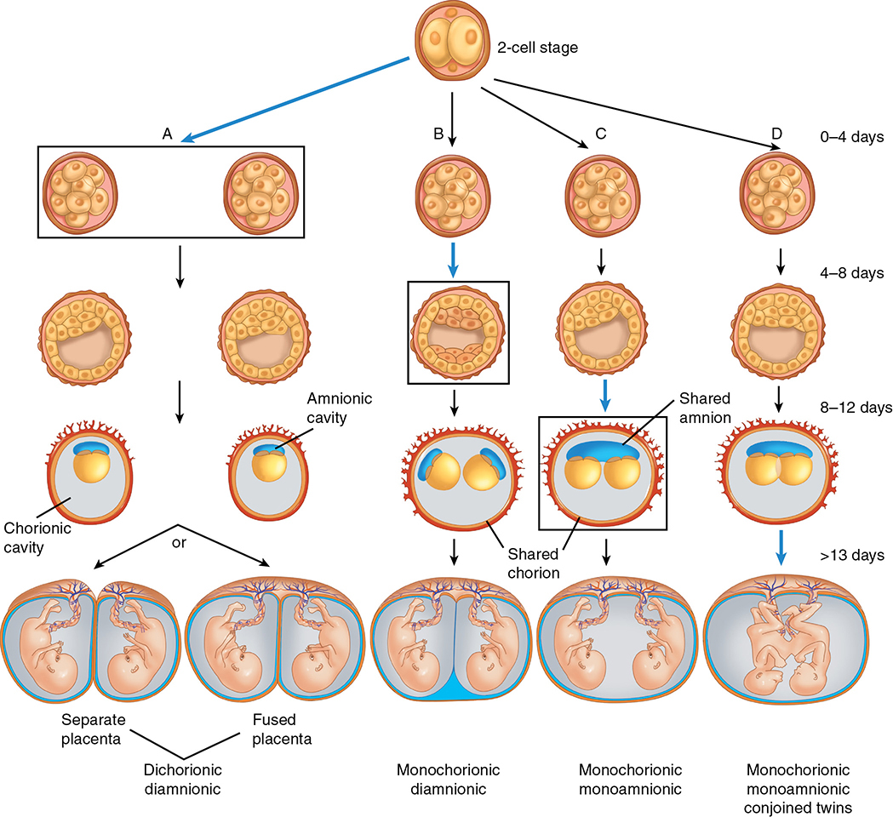

*Figure 48-1. Timing of monozygotic division determines chorionicity and amnionicity: DCDA → MCDA → MCMA → conjoined.*

### Factors affecting twinning
- **Monozygotic rate is constant worldwide: ~1 in 250 births**, independent of demographics except ART.
- **Dizygotic** twinning ↑ with: **infertility treatment, maternal age, race, heredity, maternal size/nutrition**.
- **ART:** clomiphene or FSH + hCG → multiple ovulation. More embryos transferred → more multiples.
  - ART = **1.9%** of US newborns but **14.7%** of multifetal neonates (2017).
  - ASRM: women **<35 y → single-embryo transfer**, whatever the embryo stage.
- **Age:** rising **FSH** with age → greater ovarian stimulation. Paternal age effect is small.
- **Race (US 2019):** black **4.1%**, white **3.3%**, Hispanic **2.5%**. Rural Nigeria **1 in 20** births.
- **Heredity (maternal side dominates):** a woman who is herself a DZ twin → **1 in 58**; husband a DZ twin → 1 in 116.
- **Size/nutrition:** tall, heavy women **25–30%** higher rate. WWII undernourishment → fall in DZ twinning (nutrition > body size).

### Superfecundation and superfetation
- **Superfecundation:** two ova fertilized in the same cycle but not at the same coitus, possibly by different men (**heteropaternity**).
- **Superfetation:** ≥1 menstrual cycle between fertilizations. Not known spontaneously; likely due to ART.
- **Pseudosuperfetation:** markedly unequal growth of twins of the same age.

---

## 2. Diagnosis of Multifetal Gestation

### Clinical
- Fundal height at 20–30 wk averages **5 cm greater** than singletons.
- Palpating **two fetal heads** strongly supports it; Doppler may find two distinct heart rates.
- Clinical criteria alone are unreliable: in the **RADIUS** trial, unscanned twins were undiagnosed until **26 wk in 37%** and until **delivery admission in 13%**.

### Sonography
- Aim to define **fetal number, gestational age, chorionicity, amnionicity**. See each head in two perpendicular planes; ideally both heads or abdomens in one image.
- **Accuracy for chorionicity:** **98% in the 1st trimester**; wrong in up to **10%** in the 2nd; **~95%** correct before 24 wk. Membrane assessment establishes chorionicity in **>99%** in the 1st trimester.
- **Early 1st trimester:** number of **chorions = number of gestational sacs**. Thin amnion may be invisible **before 8 wk** → **number of yolk sacs ≈ number of amnions** (not always accurate). Cord entanglement = monoamnionic.
- **10–14 wk, four features:**
  1. **Number of placental masses** (two = dichorionic; one fused mass doesn't exclude it)
  2. **Intervening membrane** present?
  3. **Membrane thickness: ≥2 mm = dichorionic** (4 layers: 2 amnions + 2 chorions); **<2 mm = monochorionic**
  4. **Fetal sex:** discordant = dichorionic (and dizygotic)

| Sign | What it is | Means |
|---|---|---|
| **Twin-peak (lambda, delta) sign** | Triangular projection of placenta between the layers of the dividing membrane | **Dichorionic** |
| **T sign** | Thin membrane meets placenta at a right angle, no tissue between | **Monochorionic diamnionic** |
| **No dividing membrane** | — | **Monochorionic monoamnionic** |

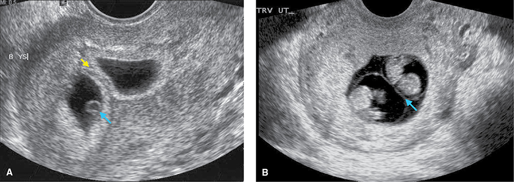

*Figure 48-2. First-trimester twins: (A) DCDA at 6 wk with a thick dividing chorion; (B) MCDA at 8 wk with a thin dividing membrane.*

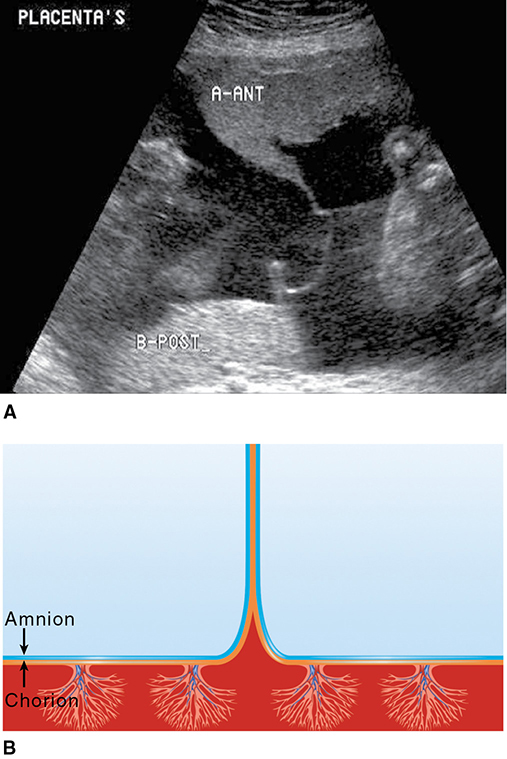

*Figure 48-3. Twin-peak (lambda) sign: placental tissue insinuates between the amniochorion layers → dichorionic.*

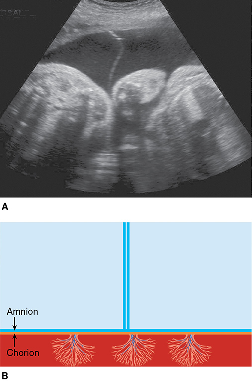

*Figure 48-4. "T" sign: two apposed amnions meet the placenta with no intervening chorion → monochorionic diamnionic.*

### Other aids
- **MRI** helps delineate monochorionic complications, including conjoined twins.
- Abdominal radiography: limited use (fetal movement → errors).
- **No biochemical test** reliably diagnoses multiples: β-hCG and MSAFP are higher but overlap with singletons.

### Placental examination
- One common amnionic sac, or apposed amnions **without chorion** between → **monozygotic**.
- Amnions separated by **chorion** → DZ or MZ, but **DZ is more common**.
- Different sex or blood types = dizygotic. Same sex/type does **not** confirm monozygosity. Postnatal zygosity DNA testing is available.

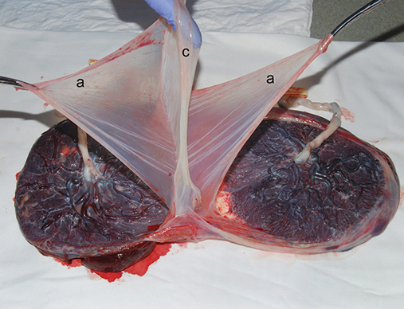

*Figure 48-5. DCDA placenta: the dividing membrane has chorion (c) between two amnions (a).*

---

## 3. Maternal Physiological Adaptations
- ↑ β-hCG → more **nausea and vomiting** in the 1st trimester.
- **Blood volume ↑ 50–60%** (vs 40–50% singleton). Offsets vaginal-delivery blood loss, which is **2×** that of a singleton.
- Red cell mass rises proportionately less + higher **iron and folate** needs → **anemia**.
- **BP:** diastolic is **lower from 8 wk**, then rises more at term: a rise of **≥15 mm Hg in 95%** of twins vs 54% of singletons.
- **Cardiac output ↑ a further ~20%** above singletons, mainly from **stroke volume** (not heart rate). SVR lower throughout. Progressive **diastolic dysfunction** that normalizes after delivery.
- Uterus + nonfetal contents may reach **≥10 L** and weigh **>20 lb**. Hydramnios (especially monozygotic) → compression of viscera and lungs; rarely obstructive uropathy with renal impairment.
  - **Therapeutic amniocentesis** can relieve symptoms, but fluid reaccumulates quickly.

---

## 4. Pregnancy Complications

### Spontaneous abortion and vanishing twin
- **Monochorionic** twins have higher early loss than dichorionic.
- **1 in 8** pregnancies start multifetal, but only **1 in 80** births are multifetal.
- One twin "**vanishes**" before the 2nd trimester in **10–40%** of twin pregnancies (more after ART).
- Spontaneous loss of ≥1 embryo before 12 wk: **36% of twins, 53% of triplets, 65% of quadruplets**.
- **Effect on screening:**
  - Loss **before 9 wk**: 1st-trimester markers unaffected. **After 9 wk**: markers higher and less precise.
  - **PAPP-A ↑** (1st trimester); **MSAFP and inhibin A ↑** (2nd trimester).
  - **cfDNA:** a vanishing twin caused **15%** of false-positive results. Identify the reduced sac to avoid confusion.

### Congenital malformations
- **406 vs 238 per 10,000** (twins vs singletons). **Monochorionic ≈ 2×** dichorionic.
- Congenital heart disease **73% higher** in twins; higher concordance in monochorionic.
- European rates rose 2.2% → 3.3% (1987–2007) with more DZ (ART) twins. After adjusting for maternal age/subfertility, ART itself doesn't clearly ↑ anomalies.

### Low birthweight
- Twin weights track singletons until **28–30 wk**, then lag; clearly diverge from **35–36 wk**. → Use **twin-specific growth curves** (stratified by chorionicity).
- Parkland surveillance: **dichorionic** sonography **every 4 wk from 16–20 wk**; **monochorionic every 2 wk** (TTTS).

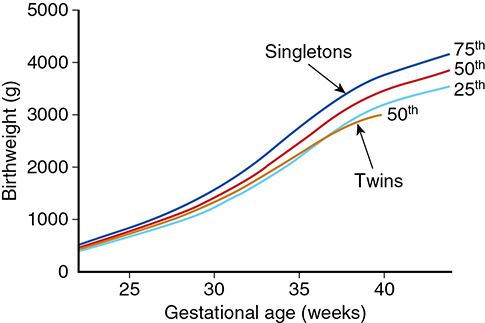

*Figure 48-6. Twin 50th-percentile birthweight falls below the singleton curve after ~30 wk and diverges clearly from 35–36 wk.*

### Hypertension
- Risk rises with fetal number: **14%** of twin pregnancies develop a hypertensive disorder. No zygosity effect. Twins + GDM → more preeclampsia.
- Twins have ↑ **sFlt-1 and soluble endoglin**, ↓ **PlGF** even without hypertension; with preeclampsia, sFlt-1 and sFlt-1/PlGF rise further.
- **Low-dose aspirin** recommended (see Prenatal Care).

### Long-term development
- Academic performance similar to singletons, including after ART.
- **Cerebral palsy:** **7 vs 1.6 per 1000** live births (multiples vs singletons); 2× even among normal-birthweight neonates. Mainly from **prematurity**; also FGR, anomalies, TTTS, co-twin demise.

### Table 48-2. Incidence of Some Complications Related to Twin Characteristics

Rates of twin-specific complications, in percent:

| Type of Twinning | Twins | Fetal-Growth Restriction | Preterm Deliveryᵃ | Placental Vascular Anastomosis | Perinatal Mortality |
|---|---|---|---|---|---|
| Dizygotic | 80 | 25 | 40 | 0 | 10–12 |
| Monozygotic | 20 | 40 | 50 | — | 15–18 |
| Diamnionic/dichorionic | 6–7 | 30 | 40 | 0 | 18–20 |
| **Diamnionic/monochorionic** | 13–14 | 50 | 60 | **100** | **30–40** |
| **Monoamnionic/monochorionic** | **<1** | 40 | 60–70 | 80–90 | **58–60** |
| Conjoined | 0.002 to 0.008 | — | 70–80 | 100 | 70–90 |

*ᵃDelivery before 37 weeks. The three indented rows are subtypes of monozygotic twins.*

---

## 5. Unique Fetal Complications
Most twinning-specific complications occur in **monozygotic (monochorionic)** twins.

### Monoamnionic twins
- **<1% of twins, 4% of monochorionic** pairs.
- Of fetuses alive before 16 wk, **less than half** survive to the neonatal period (anomalies, miscarriage).
- Deaths: preterm birth, TTTS, **cord entanglement**, discordance, anomalies.
- **Anomalies 18–28%** (concordant in only ~¼) → **fetal echocardiography**.
- Down syndrome risk per fetus ≤ age-matched singletons.
- **TTTS is less common** than in MCDA: near-universal **artery-to-artery anastomoses are protective**. Still screen.
- **Cord entanglement** is frequent; color Doppler shows it, but death from it is **unpredictable**.
- **Inpatient vs outpatient surveillance:**
  - Heyborne: **0 stillbirths** in 43 admitted at 26–27 wk vs **13 deaths** in 44 outpatients.
  - MONOMONO: fetal death **3.3% inpatient** (admitted 24–29 wk) vs **10.8% outpatient**. **No deaths after 32 wk.**
- **Management (US):** admit at **24–28 wk** for **1 h daily FHR monitoring** (NST/BPP), betamethasone, **cesarean at 32⁰⁄₇–34⁰⁄₇ wk**.

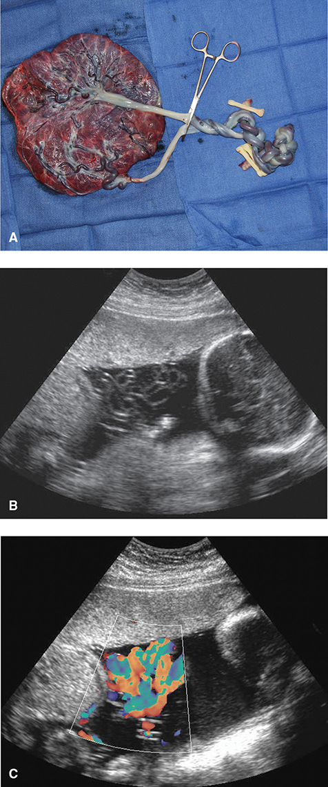

*Figure 48-7. MCMA cord entanglement: knotted cords at cesarean (A), entwined cords on sonography (B), accentuated by color Doppler (C).*

### Aberrant twinning
Spectrum from incomplete splitting (or secondary fusion). Asymmetrical forms: **external parasitic twin, fetus-in-fetu, TRAP sequence**.

**Conjoined twins**
- **1.5 per 100,000** births. **Thoracopagus is most common.**
- Named by joined region: ventral (rostral: omphalo-, thoraco-, cephalopagus; caudal: ischiopagus; lateral: parapagus) and dorsal (craniopagus, rachipagus, pygopagus).
- **1st-trimester sonographic clues:**
  - Fetal poles closely associated and **don't change relative position**
  - **>3 vessels** in the cord
  - Fewer limbs than expected
  - Spine hyperflexion, bifid fetal pole, ↑ nuchal thickness
- 3D US, color Doppler and MRI clarify shared organs.
- Separation succeeds if essential organs are not shared. **Viable conjoined twins → cesarean.** For termination, vaginal delivery is possible (union is pliable) but dystocia and uterine/cervical trauma are common.

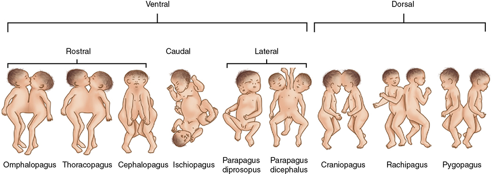

*Figure 48-8. Types of conjoined twins: ventral (rostral, caudal, lateral) and dorsal unions. Thoracopagus is most common.*

**External parasitic twin**
- Grossly defective fetus or parts (supernumerary limbs ± viscera) attached to a normal twin; **functional heart and brain absent**. **4%** of conjoined twins.

**Fetus-in-fetu**
- Embryo enfolded within its co-twin, mainly **intraabdominal**; arrests in the 1st trimester. **Vertebral/axial bones present; heart and brain absent.** Thought to be MCDA, supplied by large parasitic vessels.

### Monochorionic twins and vascular anastomoses
- **Virtually all monochorionic placentas** have anastomoses (median **8**); they are essentially unique to monochorionic twins.
- **Superficial** (chorionic surface): **artery–artery (AA), vein–vein (VV), artery–vein**.
- **Deep AV anastomoses** run through a shared cotyledon → "**third circulation**" (common villous district), found in ~½.
- Danger depends on hemodynamic balance. Imbalance → **TTTS, TAPS, TRAP**.

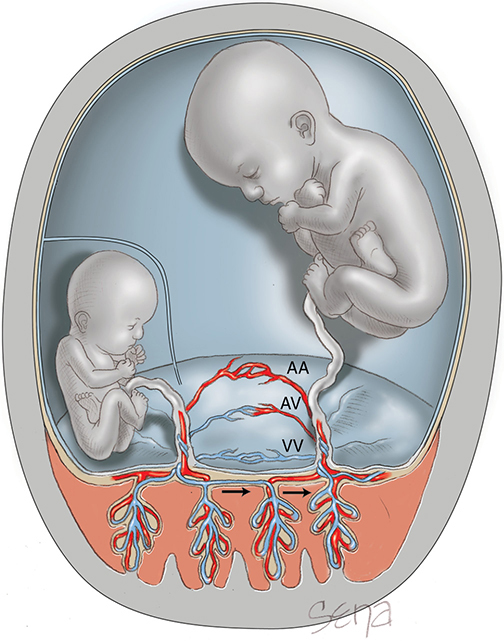

*Figure 48-11. AA, AV and VV anastomoses. A deep AV "third circulation" shunts blood from the small "stuck" donor to the recipient.*

### Twin-twin transfusion syndrome (TTTS)
- **10–15% of monochorionic twins.**
- **Mechanism:** unidirectional flow through **deep AV anastomoses** (donor artery → shared cotyledon → recipient vein), uncompensated by superficial AA anastomoses.

| Donor | Recipient |
|---|---|
| Hypovolemic, **oliguric → oligohydramnios** ("**stuck twin**") | Hypervolemic, **polyuric → hydramnios** |
| Anemic, pale, smaller, **growth-restricted** | **Polycythemic**, larger, volume excess |
| Contractures, pulmonary hypoplasia | **Heart failure / hydrops**, hyperviscosity, hyperbilirubinemia/kernicterus, PROM |

- Presents in **midpregnancy**. Also called "**poly–oli**" (polyhydramnios–oligohydramnios syndrome).

**Fetal brain damage**
- CP, microcephaly, porencephaly, multicystic encephalomalacia (ischemic necrosis). Cerebral abnormalities in **8%** of liveborn TTTS fetuses.
- **If one twin dies:** blood shifts acutely from the survivor into the low-resistance vessels of the dead twin → **hypovolemia and ischemic brain injury** in the survivor. This happens at the moment of death, so **immediate delivery doesn't help** without another indication.

**Diagnosis (SMFM): two criteria**
1. **Monochorionic** pregnancy
2. **Hydramnios: largest vertical pocket >8 cm** in one sac **and oligohydramnios: <2 cm** in the other
- Growth discordance/FGR is **not** a diagnostic criterion.
- **Surveillance: sonography every 2 wk from ~16 wk** (intervals >2 wk → higher stage at diagnosis).

**Quintero staging**

| Stage | Criteria |
|---|---|
| **I** | Discordant fluid (>8 cm / <2 cm); donor **bladder still visible** |
| **II** | Donor **bladder not visible** |
| **III** | **Abnormal Doppler**: umbilical artery, ductus venosus or umbilical vein |
| **IV** | **Ascites or hydrops** in either twin |
| **V** | **Demise** of either fetus |

- Recipient cardiac function also declines (not in Quintero); many centers add fetal echo (e.g., myocardial performance index).

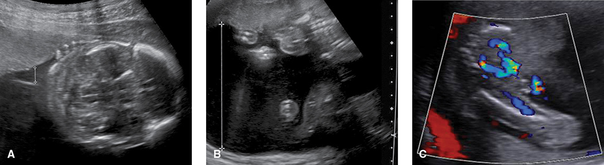

*Figure 48-12. TTTS: stage I "stuck" donor wrapped by its membrane (A); recipient pocket >10 cm (B); stage II donor with empty bladder outlined by color Doppler (C).*

**Management and prognosis**
- Stage I: some stay stable or regress, but **60% progress**. **Stage ≥III untreated: perinatal loss 70–100%.**
- **Eurofetus trial** (severe TTTS <26 wk): survival of ≥1 twin to 6 months **76% with laser vs 51% with serial amnioreduction**. No extra survival or neurological benefit at 6 years.
- **Laser ablation of anastomoses = preferred for stages II–IV.** Stage I: laser or expectant care (controversial).
- **Solomon technique** (ablate the whole vascular equator) → less TTTS recurrence and less **post-laser TAPS**.
- After laser: **weekly** US + Doppler (growth, fluid, placental function, anemia).
- **Selective reduction** (considered if severe before 20 wk): must occlude the **cord/umbilical vein** (RFA, fetoscopic ligation, laser/bipolar coagulation) because injected agents reach the co-twin. Termination of the whole pregnancy is another option.

### Twin anemia–polycythemia sequence (TAPS)
- Chronic fetofetal transfusion with large **Hb difference but NO fluid discordance**.
- **Spontaneous: 1–6%** of monochorionic twins, any gestational age.
- **Iatrogenic: up to 13% after laser**, usually within **5 wk**. The former **recipient becomes anemic** and the former donor polycythemic.
- **Diagnosis: MCA-PSV >1.5 MoM in the donor and <1.0 MoM in the recipient.**
- Staging exists (higher stage → higher mortality). Screening for spontaneous TAPS is controversial.
- Options: expectant, delivery, laser, intrauterine transfusion, selective feticide, termination. Postnatal: transfusion for the donor, partial exchange for the recipient.

### Twin reversed-arterial-perfusion (TRAP) sequence (acardiac twinning)
- **1 in 35,000** births; monochorionic.
- Normal **pump (donor) twin** + **acardiac recipient** perfused via a large **AA (± VV) anastomosis** with **reversed, deoxygenated** arterial blood.
- Blood enters via the recipient's umbilical arteries → **iliac vessels** → only the **lower body is perfused**; upper body fails to develop.
  - **Acardius acephalus** (no head); **acardius myelacephalus** (partial head, identifiable limbs); **acardius amorphous** (no recognizable structure).
- Pump twin → **cardiomegaly, high-output heart failure**. Historic pump-twin mortality **>50%**; risk ∝ **size of the acardiac twin**.
- **Radiofrequency ablation (RFA) of the cord** is preferred: NAFTNet median delivery **37 wk**, **80%** donor survival.

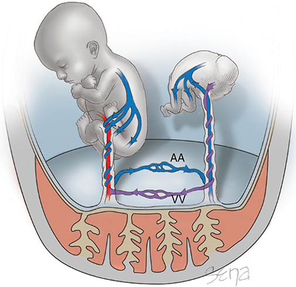

*Figure 48-13. TRAP: AA and VV anastomoses let the pump twin perfuse the acardiac twin's lower body with reversed, deoxygenated blood.*

### Complete mole with coexisting normal fetus
- One normal fetus + a **complete mole** co-twin. Differentiate from **partial mole** (singleton **triploid** fetus with molar placenta).
- Sonography: normal twin + large placenta with **multiple small anechoic cysts**.
- Continuing is increasingly accepted: **live birth ~50%**. **GTN risk is similar whether terminated or not.**
- Risks of continuing: bleeding, hyperemesis, **thyrotoxicosis, early-onset preeclampsia** → preterm birth. **Postpartum GTN surveillance is essential.**

---

## 6. Discordant Growth
- **~15%** of twins. Mortality rises with the weight difference; worse if **early** and **monochorionic**. Discordance at ≤20 wk → **8–15%** of the smaller fetuses die.

### Pathogenesis
| Monochorionic | Dichorionic |
|---|---|
| **Unequally shared placenta** (main cause) | Different genetic growth potential (esp. opposite sex) |
| TTTS: anastomotic perfusion imbalance | Suboptimal implantation site for one placenta |
| Discordant structural anomalies | Cord abnormalities: **velamentous/marginal insertion, vasa previa** |
| | Crowding (severe discordance **2× in triplets**); placental histological lesions |

### Diagnosis
- CRL differences **don't** predict birthweight discordance → surveillance starts after the 1st trimester.
- **% discordance = (larger EFW − smaller EFW) / larger EFW.**
- **ACOG: discordance = EFW difference >20%.**

### Management
- Discordance between two **appropriately grown** twins may not add risk.
- **>25–30% discordance** best predicts adverse outcome. Parkland (1370 pairs): RDS, IVH, seizures, PVL, sepsis and NEC rose with discordance, sharply **>25%**.
  - **Relative risk of fetal death: 5.6 if >30%; 18.9 if >40%.**
- NST/BPP; umbilical artery Doppler of the smaller **monochorionic** twin. Deliver at advanced gestations.

**Selective fetal-growth restriction (sFGR)**
- Usually late 2nd/early 3rd trimester. Defined by **AC difference >20 mm** or **discordance >20%**.
- Once diagnosed: **weekly** fetal testing, fluid and umbilical artery Doppler. Growth scans **every 3 wk**.

| sFGR type (Gratacós) | Umbilical artery end-diastolic flow (smaller twin) | Course |
|---|---|---|
| **I** | **Positive** | Smaller discordance, relatively **benign** |
| **II** | **Persistently absent** | **High risk** of deterioration and demise |
| **III** | **Intermittently absent/reversed** | Large AA anastomoses → **lower risk than type II** |

- Parkland: **daily inpatient surveillance** if one twin is growth-restricted or discordance **>25%** with a growth-restricted twin.

---

## 7. Fetal Demise
- Causes: anomalies and chorionicity (sFGR, TTTS, TAPS in MC pairs; cord entanglement in MCMA).
- **Early loss** = vanishing twin: survivor's risk is **not** increased; no extra surveillance needed.
- Later: **fetus compressus** (compressed) or **fetus papyraceus** (flattened and desiccated).

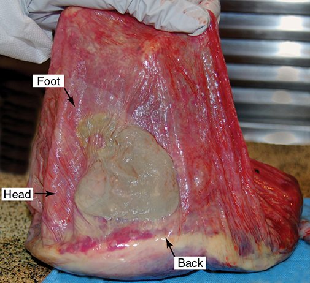

*Figure 48-16. Fetus papyraceus: a tan, flattened ovoid mass on the membranes after demise at ~17 wk; the co-twin delivered at 40 wk.*

### Single intrauterine fetal demise (sIUFD) after 20 wk
- Twin stillbirth rate **1.4%** vs singleton **0.6%**.
- Risks to the survivor: **death, preterm birth, neurological injury** (acute hypovolemia through anastomoses at the moment of death; not preventable).
- **Co-twin death: MCDA 16× more likely** than DC twins. Risk falls after **26–28 wk**.
- Preterm birth ↑, similar in MC and DC.
- **Neurodevelopmental morbidity (sIUFD <34 wk): 29% in monochorionic, ~3× dichorionic.** After 34 wk: similar.
- **Management:**
  - MC demise after the 1st trimester but **before viability** → termination can be considered.
  - After viability: prolong gestation, prioritize maternal/co-twin safety, consider corticosteroids. **Immediate delivery isn't beneficial** without another indication.
  - **sIUFD ≥34 wk → delivery is reasonable.**
- **Maternal coagulopathy** is rare (the survivor is usually delivered within weeks).

---

## 8. Prenatal Care
- Parkland: visits **every 2 wk from 22 wk**, with **digital cervical exam** each visit.
- **Weight gain (IOM, normal BMI): 37–54 lb.**
- **Calories: 40–45 kcal/kg/d**; diet **20% protein, 40% carbohydrate, 40% fat**, as 3 meals + 3 snacks.
- Supplement calcium, magnesium, zinc, vitamins C, D, E.
- **Low-dose aspirin 81 mg/d from 12–28 wk until delivery** (multifetal = high risk for preeclampsia).
- **Aneuploidy screening:** combined/serum screening with multifetal thresholds; **cfDNA acceptable** (vanishing twin caveat).
- Midpregnancy anatomy scan; **fetal echo for monochorionic** twins.
- **Amnionic fluid: deepest vertical pocket per sac. <2 cm = oligohydramnios, >8 cm = hydramnios.**
- Stillbirth: monochorionic **2–3×** dichorionic, including beyond 34 wk.
- **Weekly antenatal testing (NST/BPP):** from **36 wk for uncomplicated DC** and **32 wk for uncomplicated MC** twins. High false-positive rates → counsel first (iatrogenic preterm birth).

---

## 9. Preterm Birth
- US preterm birth rate: **twins 60%, triplets 98%** (2019).
- Causes in twins: **~60% indicated, ⅓ spontaneous labor, 10% PPROM**.
- Higher with monochorionic; also prior preterm birth, adolescence, nulliparity, obesity, diabetes.

### Prediction
- Cervical length at 22–24 wk vs delivery <32 wk: **10 mm → 66%; 20 mm → 24%; 40 mm → 1%**.
- **CL <20 mm** best predicts birth <34 wk: specificity **97%**, LR+ **9.0**.
- A closed internal os on digital exam predicted as well as normal CL + negative fetal fibronectin.
- **But screening doesn't improve outcomes:** SMFM recommends **against routine CL screening** in multiples; **fFN not recommended**.

### Prevention: nothing works reliably

| Strategy | Verdict |
|---|---|
| **Bed rest / hospitalization** | **No benefit** (almost half of outpatients were admitted anyway for indications) |
| **Prophylactic oral β-mimetics** | Ineffective; FDA warning against oral terbutaline |
| **17-OHPC** | **Not effective**, even with CL <36 mm or <25 mm |
| **Vaginal progesterone** | Ineffective in general twin population; short-cervix data conflicting. Not used at Parkland |
| **Prophylactic cerclage** | **No benefit** (with or without short cervix) |
| **Physical exam–indicated (rescue) cerclage** | **May benefit**: dilated cervix <24 wk + antibiotics + indomethacin → less preterm birth and perinatal death |
| **Arabin pessary** | Mixed trials; **not recommended by ACOG** |

### Treatment
- **Tocolysis does not improve neonatal outcomes** and is riskier: hypervolemia → **pulmonary edema**.
  - β-mimetics: cardiovascular complications **43% vs 4%** (twins vs singletons). Nifedipine: tachycardia **19% vs 9%**.
- **Antenatal corticosteroids:** less well studied; mixed results. **Use as for singletons.**

### PPROM
- Proportion of preterm births with PPROM: singletons **13%**; twins **17%**; triplets and quads **20%**; higher-order **100%**.
- Expectant management is comparable to singletons, but **latency is shorter**: median **4 days (twins) vs 7 days** after 24 wk; shorter still after 30 wk.

### Delayed delivery of the second twin
- Maternal complications in **~40%** (infection, PPH, abruption).
- Median latency **6 days** (range 6–107). Retained fetuses survive better than the first-born.
  - First-born <25 wk: **0% survived vs 50%** of co-twins. >25 wk: **65% vs 95%**.
- Cerclage, antibiotics, tocolysis didn't improve outcome. Most likely to benefit at **22–24 wk**. Good candidates are rare.

---

## 10. Labor and Delivery

### Delivery timing (ACOG)

| Twin type (uncomplicated) | Deliver at |
|---|---|
| **Dichorionic diamnionic** | **38⁰⁄₇–38⁶⁄₇ wk** |
| **Monochorionic diamnionic** | **34⁰⁄₇–37⁶⁄₇ wk** (Parkland: not before 37 wk without another indication) |
| **Monochorionic monoamnionic** | **32⁰⁄₇–34⁰⁄₇ wk** (cesarean) |

- Stillbirth peaks: DCDA **10.6/1000 at 38⁶⁄₇ wk**; MCDA **9.6/1000 at 37⁶⁄₇ wk**.
- Lung maturity is usually synchronous and **several weeks earlier** than in singletons. In sFGR the smaller twin has less RDS but more BPD.

### Preparations
Higher rates of: uterine dysfunction, malpresentation, **cord prolapse**, previa, abruption, emergency operative delivery, **atonic PPH**. **Second twins** have worse composite outcomes regardless of route.
1. Trained attendant throughout; **continuous electronic monitoring** (internal for the presenting twin once possible)
2. IV line for rapid infusion; LR or dextrose at **60–125 mL/h**
3. **Blood available**
4. Obstetrician skilled in **intrauterine manipulation**
5. **Sonography machine** in the room
6. **Anesthesia** immediately available
7. **One neonatal resuscitator per fetus**
8. Adequate space and equipment

### Analgesia and anesthesia
- **Labor epidural is ideal**: can be extended quickly for internal podalic version or cesarean.
- Uterine relaxation for manipulation: **halogenated inhalation agent** (general anesthesia), or IV/sublingual **nitroglycerin** or IV **terbutaline**.

### Presentation
- Commonest: **cephalic–cephalic, cephalic–breech, cephalic–transverse**. First twin cephalic in **71%** at admission (Parkland).
- The second twin is unstable: compound, footling breech, face/brow, cord prolapse (more with small fetuses, hydramnios, high parity).

### Delivery route

| Presentation | Approach |
|---|---|
| **Cephalic–cephalic** | **Vaginal birth** near term; planned cesarean doesn't help; trial of labor succeeds in **~80%** |
| **Cephalic–noncephalic** | Controversial. Vaginal delivery reasonable if each **>1500 g and >32 wk** with skilled provider (breech extraction ± internal podalic version); or cesarean for both |
| **Breech first twin** | Usually **cesarean** (Parkland practice); vaginal delivery is supported if >32 wk and >1500 g |

- **Cephalic–noncephalic evidence:**
  - Schmitz (5915): 75% planned vaginal, **80%** successful. Planned cesarean <37 wk had *higher* perinatal morbidity/mortality (**5.2% vs 3.0%**).
  - **Twin Birth Study:** planned vaginal = planned cesarean outcomes. Cephalic vs noncephalic second twins did equally well when delivered vaginally.
- For the second twin, **internal podalic version** beats intrapartum external cephalic version (ECV → more cesareans and fetal distress).
- **Worst scenario:** vaginal first twin + **cesarean for the second** (cord prolapse, abruption, contracting cervix, nonreassuring FHR).
- **Breech first twin problems:** **head entrapment** above an incompletely dilated cervix (preterm, FGR, hydrocephaly), cord prolapse, and **locked twins** (breech first chin locks with cephalic second; 1 in 817).

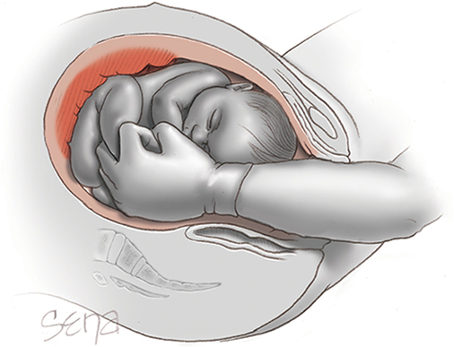

*Figure 48-17. Internal podalic version: a hand in the uterus grasps the feet and pulls down while the other hand pushes the head up.*

### Augmentation and induction
- Active labor and second stage are **slower** with twins.
- Oxytocin augmentation acceptable if criteria are met; induction (oxytocin ± ripening) can be used safely, but ends in **cesarean ~40%** and more maternal morbidity.
- Parkland generally **doesn't induce or augment** twins (overdistended uterus → rupture, PPH). Amniotomy induction is one option.

### Vaginal delivery technique
- **Clamp each cord and keep it clamped** until all fetuses are delivered (prevents hypovolemia through anastomoses). Second baby's cord gets **two clamps**; collect cord blood only after all are born.
- Evidence insufficient for or against **delayed cord clamping**.
- After twin 1: assess the second's presentation (abdominal, vaginal, sonographic).
  - **Head/breech fixed in the pelvis** → moderate fundal pressure, **rupture membranes**, recheck for cord prolapse. **Oxytocin if no contractions within ~10 min.**
  - Over the inlet but not fixed → guide it in with vaginal + fundal hands. A shoulder may be converted to cephalic.
  - Not over the inlet or bleeding → **internal podalic version / breech extraction** by a skilled obstetrician with uterine-relaxing anesthesia; otherwise **prompt cesarean**. Avoid delay before the cervix retracts.
- **Intertwin interval classically <30 min**; FHR abnormalities may matter more than the interval itself.

### TOLAC
- Uterine rupture and VBAC success similar to singleton TOLAC. ACOG: women with twins and **one prior low transverse cesarean may be TOLAC candidates**. Two thirds deliver both vaginally. **Parkland recommends repeat cesarean.**

### Cesarean technique
- **Left lateral tilt** (supine hypotension common).
- **Low transverse hysterotomy** if large enough; Piper forceps for a breech second twin.
- **Low vertical** incision is better if, e.g., a back-down transverse fetus delivers its arms first: easier to extend upward than laterally or as a "T".

### Triplets and higher-order
- Monitoring each fetus is hard; later fetuses often need **breech extraction ± internal podalic version**; more cord prolapse and placental separation bleeding.
- Only **17%** attempting vaginal birth delivered vaginally (higher neonatal morbidity). **94%** of US triplets delivered by cesarean.
- **ACOG: vaginal birth may be considered** for uncomplicated triplets if the **first is cephalic**, attendants are experienced and fetuses are **>1500 g**. Parkland delivers most by cesarean.

---

## 11. Reducing Fetal Number

| Term | Meaning |
|---|---|
| **Multifetal pregnancy reduction (MPR)** | Reduce fetal number to improve survival of the rest |
| **Selective reduction** | Early removal of a fetus with an anomaly or serious risk |
| **Selective termination** | Same indications, but **later** gestation → greater risk |

- Done in the **late 1st trimester**: most spontaneous losses have already happened, fetuses can be assessed, little devitalized tissue remains, low risk of losing the whole pregnancy.
- **Technique:**
  - **Separate chorion → intracardiac/intrathoracic KCl.** Don't cross the sacs of retained fetuses.
  - **Monochorionic → cord occlusion** (e.g., **RFA** into the intrafetal cord), because of shared vasculature.
- **Counsel on risks:** (1) loss of all fetuses; (2) abortion or retention of the wrong fetus; (3) damage without death; (4) preterm labor; (5) discordance/FGR; (6) maternal complications. Rarely infection, hemorrhage, **DIC** from retained products.

### MPR
- **Triplets → twins or singleton: less preterm birth <34 wk**, miscarriage not increased. Also benefits higher-order multiples.
- Twins → singleton: for maternal comorbidity or monochorionic complications.

### Selective reduction / termination
- For **discordant anomalies** or severe **TTTS, TAPS, TRAP, sFGR**.
- Usually only when the anomaly is **severe but not lethal**, or when the abnormal fetus threatens the normal one.

---

## Quick-Recall: Chorionicity at a Glance

| Feature | Dichorionic diamnionic | Monochorionic diamnionic | Monochorionic monoamnionic |
|---|---|---|---|
| Split timing (if MZ) | **<72 h** (or any DZ) | **4–8 days** | **8–12 days** |
| Sonography | **Twin-peak/lambda**, membrane **≥2 mm**, 2 placentas or discordant sex | **T sign**, membrane **<2 mm** | **No membrane**, cord entanglement |
| Anastomoses | 0% | **~100%** | 80–90% (AA, protective vs TTTS) |
| Perinatal mortality | 10–20% | **30–40%** | **58–60%** |
| Unique risks | Discordance from implantation/cords | **TTTS (10–15%), TAPS (1–6%), TRAP, sFGR, co-twin injury after sIUFD** | **Cord entanglement**, anomalies 18–28% |
| Growth scans | Every **4 wk** from 16–20 wk | Every **2 wk from 16 wk** | Every 2 wk; admit **24–28 wk** |
| Weekly testing from | **36 wk** | **32 wk** | Daily FHR monitoring inpatient |
| Deliver at | **38⁰⁄₇–38⁶⁄₇ wk** | **34⁰⁄₇–37⁶⁄₇ wk** | **32⁰⁄₇–34⁰⁄₇ wk** by cesarean |

## Key Numbers to Memorize
- Twin rate **3.2%**; monozygotic **1 in 250** (constant); twin infant mortality **>4×**, triplets **12×**
- Split **<3 d DCDA, 4–8 d MCDA, 8–12 d MCMA, later conjoined**
- Chorionicity accuracy **98%** 1st trimester; dichorionic membrane **≥2 mm**
- Vanishing twin **10–40%**; start multifetal **1 in 8**, born multifetal **1 in 80**
- Blood volume **+50–60%**; CO **+20%** over singletons; weight gain **37–54 lb**; **40–45 kcal/kg/d**
- Aspirin **81 mg** from **12–28 wk**; DVP **<2 cm** oligo, **>8 cm** hydramnios
- TTTS **10–15%** of MC; Quintero **I–V**; scan **q2 wk from 16 wk**; laser **76% vs 51%**; stage ≥III untreated loss **70–100%**
- TAPS: MCA-PSV **>1.5 MoM donor, <1.0 MoM recipient**; post-laser TAPS **≤13%**
- TRAP **1 in 35,000**; RFA → **80%** survival
- Discordance **>20%** (ACOG); **>25–30%** predicts harm; fetal death RR **5.6 (>30%), 18.9 (>40%)**
- MCDA sIUFD: co-twin death **16×**; neuro morbidity **29%**; deliver if **≥34 wk**
- Preterm: twins **60%**, triplets **98%**; CL **<20 mm** predicts <34 wk; PPROM latency **4 vs 7 d**
- Deliver DCDA **38 wk**, MCDA **34–37 wk**, MCMA **32–34 wk**; vaginal breech/noncephalic if **>1500 g and >32 wk**; intertwin **<30 min**
- Triplets: **94%** cesarean; conjoined **1.5/100,000**, thoracopagus most common
