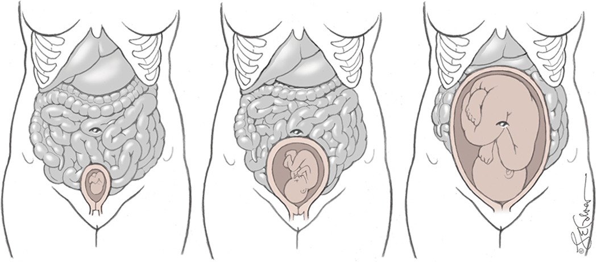
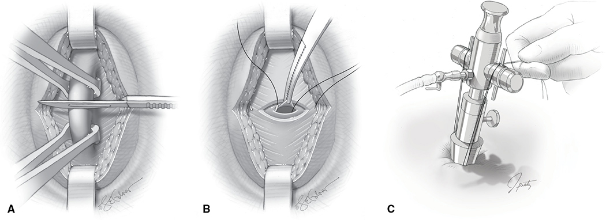
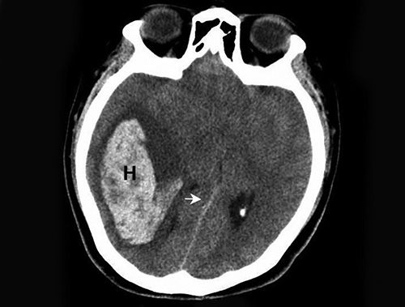
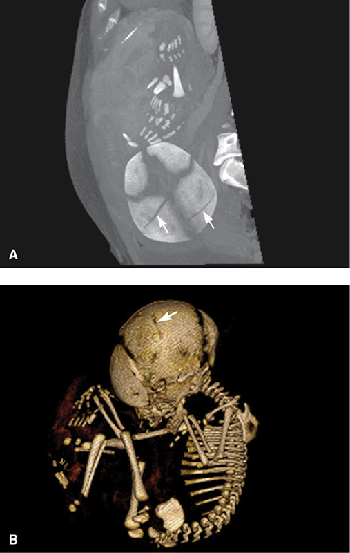
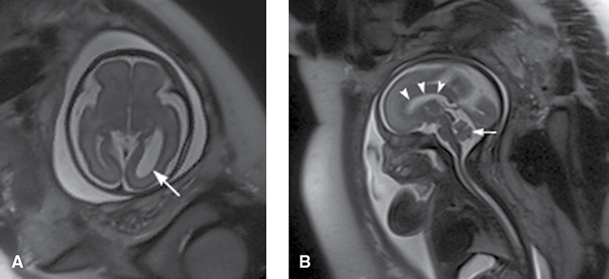

# Chapter 49: General Considerations and Maternal Evaluation — Revision Notes

> Williams Obstetrics 26e, pp. 2255–2290 of the PDF. High-yield numbers are in **bold**.
> The eleven tables are transcribed from the PDF images (they are missing from the extracted chapter text). All 5 figures are included from the PDF.

**Big picture:** **Treatment should never be withheld because a woman is pregnant.** Nonobstetrical surgery is usually safe; bad outcomes come mostly from the **underlying disease** (e.g., perforated appendix). Laparoscopy is safe in **all trimesters**. **No single diagnostic imaging study delivers a harmful fetal radiation dose** — the fetal thresholds are **50 mGy (5 rad)** for any effect and **~200 mGy (20 rad)** for malformations. Sonography and MRI are preferred.

---

## 1. Scope and Principles
- **~10 per 100** pregnant women have an antepartum admission; **⅓** are for nonobstetrical conditions (renal, pulmonary, infectious).
- Trauma admissions **~4 per 1000 deliveries**; higher with intellectual and developmental disabilities.
- **1–2%** of pregnant women undergo nonobstetrical surgery.
- Care may need MFM or a multidisciplinary team (internists, surgeons, anesthesiologists).

**Four questions for individualized care:**
1. What would be recommended if she were **not pregnant**?
2. If management differs because of pregnancy, **can it be justified**?
3. What are the **risks and benefits** to mother and fetus, and do they conflict?
4. Can an **individualized plan** balance them?

---

## 2. Maternal Physiology and Laboratory Values
- Pregnancy alters almost every organ system (Ch 4) and many laboratory values.
  - Some "abnormal" nonpregnant values are **normal** in pregnancy; some "normal-range" values are **abnormal** for a gravida.
- Use the pregnancy reference ranges (Appendix).

---

## 3. Medications
- Most drugs for common illnesses are **relatively safe** (exceptions: Ch 8).
- FDA labeling now uses the **Pregnancy and Lactation Labeling Rule (PLLR)**.

---

## 4. Nonobstetrical Surgery
- Adverse outcomes are relatively low and **cannot be separated from the underlying condition**.
  - e.g., **perforated appendicitis with feculent peritonitis** → much higher maternal and perinatal morbidity/mortality than simple appendicitis, even with flawless surgery.
  - Procedure-related complications matter (e.g., **aspiration of gastric acid** at intubation/extubation).

### Maternal morbidity
- **Most common procedures: appendectomy, cholecystectomy, adnexal surgery.**
- NSQIP: morbidity and mortality **no different** from nonpregnant women. Taiwan (~5600 gravidas): slightly more infection and **4× mortality**.
- Postoperative complications **~5%**; maternal mortality **<1%**.
- **Preoperative sepsis** → higher risk of maternal death.

### Perinatal morbidity
- **2–3×** risk of **spontaneous abortion, preterm delivery, preeclampsia, cesarean** (Yu 2018).
- 47,628 women: ↑ fetal death, preterm birth, FGR, cesarean — mostly after **emergency** surgery.
- Swedish Birth Registry (Mazze 1989): **no ↑ malformations or stillbirth**; ↑ **LBW, preterm birth, neonatal death** (deaths mostly from prematurity).

### Table 49-1. Birth Outcomes in 5405 Pregnant Women Undergoing Nonobstetrical Surgery

| Outcome | Rate | p valuea |
|---|---|---|
| Stillbirth | 0.7% | NS |
| Major malformation | 1.9% | NS |
| Preterm <37 wk | **7.5%** | <0.05 |
| Birthweight <1500 g | 1.2% | <0.05 |
| Birthweight <2500 g | **6.6%** | <0.05 |
| Neonatal death by 7 days | 1.1% | <0.05 |

*aCompared with 720,000 pregnancies in women without surgery. NS = not significant.*

### Anesthesia and the fetus
- **No link between early-pregnancy surgery and fetal anomalies**; a nonsignificant ↑ in neural-tube defects with surgery at **4–5 wk**.
- Anesthetic agents are **not teratogenic**; most inhalation agents appear safe.
- **FDA 2016 warning:** possible impaired fetal/child **brain development** with **isoflurane, sevoflurane, desflurane, propofol, midazolam**, with exposures of **≥3 hours**.

---

## 5. Laparoscopic Surgery
- **Most common first-trimester procedure** for diagnosis and treatment of surgical disorders.

### Table 49-2. Some Guidelines from the Society of American Gastrointestinal Endoscopic Surgeons (SAGES) for Laparoscopic Surgery in Pregnant Women

| Category | Guideline |
|---|---|
| **Indications** — same as for nonpregnant women | Investigation of acute abdominal processes; excision of an adnexal mass; appendectomy, cholecystectomy, nephrectomy, adrenalectomy, splenectomy |
| Position | **Lateral recumbent** |
| Entry | **Open Hasson technique**, careful Veress needle, or optical trocar; fundal height may alter insertion site selection |
| Secondary trocars | Direct visualization for placement; gravid uterus may alter insertion site selection |
| CO₂ insufflation pressures | **10–15 mm Hg** |
| Monitoring | **Capnography** intraoperatively; **FHR assessment pre- and postoperatively** |
| VTE prevention | Perioperative **pneumatic compression devices** and **early postoperative ambulation** |

*CO₂ = carbon dioxide; FHR = fetal heart rate.*

### Laparoscopy vs laparotomy
- Laparotomy is still common: open appendectomy **36%** of pregnant vs 17% of nonpregnant; open cholecystectomy **10% vs 5%**.
- Japan (Shigemi 2019; 6018 women): laparotomy had longer operations and stays and more adverse fetal events and transfusions (Table 49-3). Others find equal outcomes. RCTs are not feasible.
- **Laparoscopy is preferred for adnexal masses**. Splenectomy, adrenalectomy, nephrectomy also described.
- The old upper limit of **26–28 wk** no longer applies → **laparoscopy is safe in all trimesters** (⅓ of laparoscopic cholecystectomies/appendectomies were >26 wk in one series).

### Table 49-3. Comparative Outcomes in Pregnant Women Undergoing Abdominal Surgery

| Factor | Open | LSC | p value |
|---|---|---|---|
| Primary outcomea | 1.3% | **0.36%** | <0.05 |
| Transfusion rate | 2.3% | 0.41% | 0.002 |
| Operative time | 115 min | 95 min | <0.001 |
| Hospital stay | 9.2 d | 5.9 d | <0.001 |

*aIncludes miscarriage, stillbirth, or preterm delivery. LSC = laparoscopically.*

### Hemodynamic effects of pneumoperitoneum
- Baboons (22–26-wk equivalent): **10 mm Hg** → no substantive change; **20 mm Hg** → after 20 min ↑ RR, **respiratory acidosis**, ↓ cardiac output, ↑ PA and wedge pressures.
- Ewes: **uteroplacental flow falls above 15 mm Hg** (↓ perfusion pressure, ↑ placental vascular resistance).
- Women: cardiorespiratory changes are generally mild at **<15 mm Hg**; cardiac index still ↓ **26%** at 5 min and **21%** at 15 min, but MAP, SVR and HR unchanged.

### Table 49-4. Physiological Effects of CO₂ Insufflation of the Peritoneal Cavity

| System | Effectsa | Mechanisms | Possible Maternal-Fetal Effects |
|---|---|---|---|
| Respiratory | ↑ PaCO₂; ↓ pH | CO₂ absorption | Hypercarbia, acidosis |
| Cardiovascular | ↑ Heart rate; ↑ systemic vascular resistance; ↑ pulmonary, central venous and mean arterial pressures | Hypercarbia and ↑ intraabdominal pressure | Uteroplacental hypoperfusion — possible fetal hypoxia, acidosis and hypoperfusionb |
| | ↓ Cardiac output | ↓ Venous return | (as above) |
| Blood flow | ↓ Splanchnic flow with hypoperfusion of liver, kidneys and GI organs | ↑ Intraabdominal pressure | As above |
| | ↓ Venous return from lower extremities | ↑ Intraabdominal pressure | As above |
| | ↑ Cerebral blood flow | Hypercarbia, possibly from shunting due to splanchnic tamponade | ↑ CSF pressureb |

*aEffects intensified when insufflation pressure >20 mm Hg in baboons (Reedy, 1995). bData primarily from animal studies. CSF = cerebrospinal fluid; PaCO₂ = partial pressure of CO₂. Data from O'Rourke, 2006; Reynolds, 2003.*

### Technique
- **Preparation:** bowel prep not needed; **naso/orogastric tube** (↓ trocar puncture of stomach and aspiration).
- **Left-lateral tilt** to avoid aortocaval compression; **boot stirrups** allow vaginal access for fetal sonography or manual uterine displacement. **No intrauterine manipulator.**
- **VTE:** pregnancy hypercoagulability + pneumoperitoneum venous stasis → **pneumatic compression devices**.
- **General endotracheal anesthesia**; maintain **EtCO₂ 30–35 mm Hg**.
- **Entry beyond the first trimester** must avoid the uterus:
  - **Open (Hasson) entry** at or above the umbilicus under direct vision → **12 mm Hg** pneumoperitoneum, insufflated slowly.
  - **Palmer point:** **left upper quadrant, midclavicular line, 2 cm below the costal margin** — avoids the fundus in advanced pregnancy (few adhesions here).
  - Secondary trocars under direct laparoscopic view. Gas leak → towel clamp around cannula. Single-port surgery described.
- **Gasless laparoscopy** (fan retractors lift the abdominal wall) avoids insufflation-related cardiovascular effects.

*Figure 49-1. The uterus at 10, 20 and 36 weeks displaces bowel upward — entry sites must move cephalad as the fundus rises.*

*Figure 49-2. Hasson open entry: (A) fascia elevated with Allis clamps and incised, (B) two stay sutures through fascia and peritoneum, (C) sutures anchor the Hasson cannula.*

### Complications and perinatal outcomes
- Unique risk: **perforation of the uterus** by trocar or Veress needle; complications are infrequent.
- Swedish registry (2181 laparoscopies, mostly first trimester): surgery in pregnancy → ↑ **LBW, preterm delivery, FGR**, but **no difference between laparoscopy and laparotomy**.

---

## 6. Radiography and Ionizing Radiation
- Most diagnostic radiographic procedures carry **minimal fetal risk**; the bigger danger is **needless termination** from anxiety, or litigation.
- Record and monitor exposure in high-dose areas (CT, fluoroscopy); **consult the radiologist**.

### Ionizing radiation
- **X-rays and gamma rays** = short wavelength, high energy, **ionizing**. Microwaves, ultrasound, diathermy and radio waves are long-wavelength, low-energy.
- Damage: **direct DNA injury** or via **free hydroxyl radicals**.
- **1 Gy = 100 rad; 1 Sv = 100 rem**. For diagnostic x-rays, Gy and Sv are used interchangeably.

### Table 49-5. Some Measures of Ionizing Radiation

| Measure | Definition | Units |
|---|---|---|
| **Exposure** | Number of ions produced by x-rays per kg of air | Roentgen (R) |
| **Dose** | Amount of energy deposited per kg of tissue | Modern: **gray (Gy)** (1 Gy = 100 rad; 1000 mGy = 1 Gy). Traditional: rad |
| **Relative effective dose** | Energy deposited per kg of tissue normalized for biological effectiveness | Modern: **sievert (Sv)** (1 Sv = 100 rem; 1000 mSv = 1 Sv). Traditional: rem |

### Deterministic effects (threshold effects)
- Abortion, growth restriction, malformations, intellectual disability.
- Threshold = **NOAEL (no observed adverse effect level)**:
  - **No risk below 0.05 Gy (5 rad)**
  - **Gross malformations: threshold likely 0.2 Gy (20 rad)**
- **Animal data:** lethality highest **preimplantation** (to 10 days postconception; blastomere destruction → "all-or-none"). During organogenesis, **1 Gy (100 rad)** → malformations and FGR more than death. Acute low doses → no harm.
- **Human data (Hiroshima/Nagasaki):**
  - **Severe intellectual disability risk greatest at 8–15 wk.**
  - IQ falls **25 points per Gy (100 rad)**; linear dose response, threshold uncertain.
  - **No proven ↑ intellectual disability <8 wk or >25 wk**, even with >0.5 Gy (50 rad).
  - Low first-trimester doses → no ↑ miscarriage, anomalies or FGR.
- Therapeutic doses **~2.5 Gy (250 rad)** in the first half of pregnancy → **microcephaly and intellectual disability** (22 infants; Dekaban) — also carcinogenic.

### Table 49-6. Deterministic Effects of Ionizing Radiation in Pregnancy

| GA (wks) | CA (wks) | <50 mGy (<5 rad) | 50–100 mGy (5–10 rad) | >100 mGy (>10 rad) |
|---|---|---|---|---|
| 0–2 | — | None | None | None |
| 3–4 | 1–2 | None | Probably none | Low risk of spontaneous abortion |
| 5–10 | 3–8 | None | Potential uncertain and probably too subtle to be clinically detectable | Possible malformations increasing in likelihood as dose increases |
| **11–17** | **9–15** | None | Potential uncertain and probably too subtle to be clinically detectable | **Risk of decreased IQ or of mental retardation, increasing in frequency and severity with increasing dose** |
| 18–27 | 16–25 | None | None | IQ deficits not detectable at diagnostic doses |
| >27 | >25 | None | None | None applicable to diagnostic exposures |

*CA = conceptional age; GA = gestational age; IQ = intelligence quotient.*

### Summary of fetal radiation exposure
- **8–15 wk = most susceptible** to radiation-induced intellectual disability.
- Severe intellectual disability risk: **~4% at 0.1 Gy (10 rad)** to **~60% at 1.5 Gy (150 rad)** — doses **2–100×** above maximal diagnostic exposures.
- **Cumulative doses** from multiple studies can reach the harmful range, especially at 8–15 wk.
- 16–25 wk: less risk; **no proven risk before 8 or after 25 wk**.
- **<0.05 Gy (5 rad): no ↑ malformations, FGR or abortion.** <0.2 Gy (20 rad): no ↑ gross malformations.
- **Diagnostic radiographs seldom exceed 0.1 Gy (10 rad)** — equal to **>1000 chest x-rays**.

> **Memory hook:** "**5 – 20 – 8-to-15**": no effect below **5 rad**, malformations need **~20 rad**, the brain is most vulnerable at **8–15 weeks**.

### Stochastic effects (no threshold; random)
- **Childhood cancer** and genetic disease; excess cancers from doses as low as **0.01 Sv (1 rad)**.
- **0.03 Gy (3 rad)** doubles childhood cancer risk: **1 in 600 → 2 in 600**.
- In utero exposure linked with adult solid cancers (17–45 yr), dose–response at the 0.1 Sv (10 rem) level.
- **Below 0.1–0.2 Sv, carcinogenic evidence is not convincing.**

| | Deterministic | Stochastic |
|---|---|---|
| Threshold | **Yes** (NOAEL 0.05 Gy; malformations ~0.2 Gy) | **No** (assumed linear) |
| Severity with dose | ↑ | Probability ↑, severity unchanged |
| Examples | Abortion, FGR, malformations, intellectual disability, microcephaly | Childhood cancer/leukemia, genetic mutation |
| Key window | Preimplantation (lethality); organogenesis (malformations); **8–15 wk** (IQ) | Throughout |

### X-ray dosimetry
- Dose falls with **distance** from the uterus; also depends on maternal size, technique, equipment → table values are guides. **Consult a medical physicist** when an individual dose is needed.

### Table 49-7. Dose to the Uterus for Common Radiologic Procedures

| Study | View | Dosea per View (mGy) | No. Filmsb | Dose (mGy) |
|---|---|---|---|---|
| Skullc | AP, PA, Lat | <0.0001 | 4.1 | <0.0005 |
| Chest | AP, PAc, Latd | <0.0001–0.0008 | 1.5 | 0.0002–0.0007 |
| Mammogramd | CC, Lat | <0.0003–0.0005 | 4.0 | 0.0007–0.002 |
| Lumbosacral spinee | AP, Lat | 1.14–2.2 | 3.4 | **1.76–3.6** |
| Abdomene | AP | | 1.0 | **0.8–1.63** |
| Intravenous pyelograme | 3 views | | 5.5 | **6.9–14** |
| Hipb (single) | AP / Lat | 0.7–1.4 / 0.18–0.51 | 2.0 | 1–2 |

*aCalculated for x-ray beams with half-value layers ranging from 2 to 4 mm aluminum equivalent. bBased on data and methods reported by Laws, 1978. cEntrance exposure data from Conway, 1989. dEstimates based on compilation of above data. eBased on NEXT data reported in National Council on Radiation Protection and Measurements, 1989. AP = anterior-posterior; CC = cranial-caudal; Lat = lateral; PA = posterior-anterior.*

### Therapeutic radiation
- Individualize cancer radiotherapy; **fetal shielding** may be possible; models estimate fetal dose for brain or tangential breast irradiation.

---

## 7. Diagnostic Radiation by Modality

### Plain radiographs
- **No single diagnostic procedure** threatens embryofetal well-being (ACR).
- **AP chest x-ray** = most common study; fetal exposure **exceptionally small**.
- **Abdominal film ~1 mGy (100 mrad)** (fetus in beam); **IVP may exceed 5 mGy (500 mrad)** (multiple films). Use a **one-shot pyelogram** if sonography fails to diagnose obstruction/urolithiasis.
- Mammography and extremity, skull or rib "trauma series" → low dose (distance).

> *Text vs table:* the text gives chest radiograph exposure as "0.0007 Gy or 70 mrad", but Table 49-7 lists **0.0002–0.0007 mGy** — i.e., about 1000× lower. The table value fits the text's own statement that the exposure is "exceptionally small".

### Fluoroscopy and angiography
- Dose is hard to calculate (number of films, total fluoroscopy time, time with fetus in the field). Barium studies are FDA-limited; **angiography units can deliver much more**.
- Angiography/embolization for trauma or serious disease: distance lowers dose.

### Table 49-8. Estimated X-Ray Doses to the Uterus/Embryo from Common Fluoroscopic Procedures

| Procedure | Dose to Uterus (mGy) | Fluoroscopic Exposure in Seconds (SD) |
|---|---|---|
| Cerebral angiographya | <0.1 | — |
| Cardiac angiographyb,c | 0.65 | 223 (± 118) |
| Single-vessel PTCAb,c | 0.60 | 1023 (± 952) |
| Double-vessel PTCAb,c | 0.90 | 1186 (± 593) |
| Upper gastrointestinal seriesd | 0.56 | 136 |
| Barium swallowb,e | 0.06 | 192 |
| **Barium enema**b,f,g | **20–40** | 289–311 |

*aWagner, 1997. bCalculations based on data of Gorson, 1984. cFinci, 1987. dSuleiman, 1991. eBased on female data from Rowley, 1987. fAssumes embryo in radiation field for entire examination. gBednarek, 1983. PTCA = percutaneous transluminal coronary angioplasty; SD = standard deviation.*

### Computed tomography
- CT use in pregnancy rose **5-fold** (1996–2016). **Multidetector CT (MDCT)** is standard and may give higher doses.
- Dose depends on pitch, kilovoltage, tube current, collimation, slice number, tube rotation, acquisition time; **with + without contrast doubles the dose**; closer to the fetus = higher dose.
- **Cranial CT** (neurological disorders, **eclampsia**) is the most common CT in gravidas; noncontrast CT detects acute epidural, subdural, subarachnoid bleeding. **Fetal dose negligible.**

*Figure 49-3. Noncontrast head CT: large right frontoparietal-temporal intraparenchymal hematoma (H) with leftward midline shift — head CT exposes the fetus negligibly.*

- **Abdominal CT is more problematic** (Table 49-9):
  - PE protocol dose ≈ V/Q scan.
  - **Appendicitis protocol has the highest dose**, but is very useful when MRI is unavailable; a **greater pitch** lowers the dose with **sensitivity 92%, specificity 99%, NPV 99%**.
  - **Renal stone protocol** if sonography is nondiagnostic (stones found in 13 of 20 women).
  - **Severe trauma → abdominal CT if indicated.**

### Table 49-9. Estimated Radiation Dosimetry with 16-Channel Multidetector Computed-Tomographic (MDCT) Imaging Protocols

| Protocol | Preimplantation (mGy) | 3 Months' Gestation (mGy) |
|---|---|---|
| Pulmonary embolism | 0.20–0.47 | 0.61–0.66 |
| Renal stone | 8–12 | 4–7 |
| **Appendix** | **15–17** | **20–40** |

*Figure 49-4. Maternal trauma CT (third trimester) incidentally shows fetal skull fractures (arrows) on MIP and 3-D bone reconstruction.*

**Suspected pulmonary embolism: CTPA vs V/Q**
- Historically radiologists favored **V/Q 70%** vs CTPA 30%. Now **MDCT pulmonary angiography (CTPA)** is more accurate and faster.
- **American Thoracic Society: V/Q scintigraphy if the chest x-ray is normal.**
- **Fetal dose: CTPA < V/Q**; **maternal breast/chest dose: CTPA much higher**.
- **YEARS algorithm** (D-dimer + clinical criteria) markedly ↓ the number of CTPAs; D-dimer rises normally with gestation, but a **negative** result helps.
- OPTICA trial (low-dose CTPA) ongoing; Williams uses a **reduced-exposure CTPA as the first-line test** for suspected PE.
- **CT pelvimetry** (breech): fetal dose **~15 mGy (1.5 rad)**, or **2.5 mGy (0.25 rad)** with a low-exposure technique.

### Radiographic contrast
- **IV iodinated contrast** (low osmolality) **crosses the placenta**; FDA category B. **No neonatal hypothyroidism** or other harm reported with water-soluble iodinated agents.
- **Oral** iodine or barium contrast: minimal absorption → unlikely to affect the fetus.

### Nuclear medicine
- Radioisotope (e.g., **technetium-99m**) tagged to RBCs, sulfur colloid or pertechnetate; the tag determines fetal exposure. **Placental transfer** and **maternal renal clearance** (fetal proximity to bladder) both matter.
- Activity in **curie (Ci) / becquerel (Bq)**, usually **mCi**; tissue dose in **Sv**.
- Keep radionuclide dose **as low as possible**. Exposure is generally **greater early** in pregnancy — **exception: iodine-131**, whose fetal thyroid effect is **later**.
- **V/Q scan:** Tc-99m macroaggregated albumin (perfusion) + xenon-127 or xenon-133 (ventilation) → **negligible fetal exposure**.
- **Thyroid scans** (I-123, I-131) seldom indicated; trace diagnostic doses are low risk.
  - ⚠️ **Therapeutic radioiodine** (Graves disease, thyroid cancer) → **fetal thyroid ablation and cretinism**.
- **Sentinel lymphoscintigram** (Tc-99m sulfur colloid, breast cancer) — the text calls the dose (~0.014 mSv) safe in pregnancy.

### Table 49-10. Radiopharmaceuticals Used in Nuclear Medicine Studies

| Study | Estimated Activity Administered per Examination (mCi)a | Weeks' Gestationb | Dose to Uterus/Embryo (mSv)c |
|---|---|---|---|
| Brain | 20 mCi ⁹⁹ᵐTc DTPA | <12 / 12 | 8.8 / 7c |
| Hepatobiliary | 5 mCi ⁹⁹ᵐTc sulfur colloid | 12 | 0.45 |
| | 5 mCi ⁹⁹ᵐTc HIDA | | 1.5 |
| Bone | 20 mCi ⁹⁹ᵐTc phosphate | <12 | 4.6 |
| Pulmonary — perfusion | 3 mCi ⁹⁹ᵐTc-macroaggregated albumin | Any | **0.45–0.57 (combined)** |
| Pulmonary — ventilation | 10 mCi ¹³³Xe gas | | (combined above) |
| Renal | 20 mCi ⁹⁹ᵐTc DTPA | <12 | 8.8 |
| Abscess or tumor | 3 mCi ⁶⁷Ga citrate | <12 | 7.5 |
| Cardiovascular | 20 mCi ⁹⁹ᵐTc-labeled red blood cells | <12 | 5 |
| | 3 mCi ²⁰¹Tl chloride* | <12 / 12 / 24 / 36 | 11 / 6.4 / 5.2 / 3 |
| Thyroid | 5 mCi ⁹⁹ᵐTcO₄ | <8 | 2.4 |
| | 0.3 mCi ¹²³I (whole body)d | 1.5–6 | 0.10 |
| | 0.1 mCi ¹³¹I — whole body | 2–6 / 7–9 / 12–13 / 20 | 0.15 / 0.88 / 1.6 / 3 |
| | 0.1 mCi ¹³¹I — **thyroid-fetal** | 11 / 12–13 / 20 | **720 / 1300 / 5900** |
| Sentinel lymphoscintigram | 5 mCi ⁹⁹ᵐTc sulfur colloid (1–3 mCi) | | 5 |

*amCi = millicuries. To convert to mrad, multiply by 100. bExposures are generally greater prior to 12 weeks compared with increasing gestational ages. cSome measurements account for placental transfer. dThe uptake and exposure of ¹³¹I increases with gestational age. DTPA = diethylenetriaminepentaacetic acid; Ga = gallium; HIDA = hepatobiliary iminodiacetic acid; I = iodine; mSv = millisievert; Tc = technetium; TcO₄ = pertechnetate; Tl = thallium. Data from Adelstein, 1999; Bailey, 2017; Schwartz, 2003; Stather, 2002; Wagner, 1997; Zanzonico, 2000. \*Printed as "²¹⁰Tl"; the cardiac imaging isotope is thallium-201. Note: the table lists 5 mSv for the sentinel lymphoscintigram, whereas the text quotes ~0.014 mSv (1.4 mrad).*

---

## 8. Sonography
- One of obstetrics' greatest advances; virtually indispensable (Ch 14, 15). **No fetal risk** — preferred imaging.

---

## 9. Magnetic Resonance Imaging
- **No ionizing radiation**; sharp soft-tissue resolution, tissue characterization, any plane.

### Safety
- **No harmful human effects reported** (ACR, ISUOG). Safe at **≤3 T** within standard limits; **>1.5 T** may be chosen for specific maternal indications; early data suggest **3 T** is safe and improves fetal assessment.
- **Can be used in any trimester if:**
  1. the information **cannot be obtained with sonography**,
  2. results will **guide management during pregnancy**, and
  3. imaging **cannot wait** until after pregnancy.
- **No FHR changes** during MRI; no harm in exposed children.
- **Contraindications:** cardiac **pacemakers**, neurostimulators, implanted **defibrillators** and infusion pumps, **cochlear implants**, shrapnel/metal in sensitive areas, some **intracranial aneurysm clips**, **metallic foreign body in the eye**. Only **0.4%** of patients have an absolute contraindication.

### Gadolinium contrast
- Gadolinium chelates **cross the placenta** and concentrate in **amnionic fluid**.
- ~10× human dose → slight developmental delay in rabbits; 26 first-trimester exposures without harm.
- **Not recommended routinely** — only if benefits outweigh risks — because free toxic gadolinium may **dissociate in amnionic fluid** and prolong fetal exposure.

### Maternal indications
- Complements or replaces CT; excellent for the abdomen and retroperitoneum.
- **Right lower quadrant pain / suspected appendicitis**; adrenal, renal, GI lesions; pelvic masses.
- **CNS:** brain tumors, spinal trauma, neurological emergencies.
- MR urography (urolithiasis); cardiac MR (physiology, complex defects, cardiomyopathy).
- **Placenta accreta spectrum** (depth of invasion); preeclampsia research; **puerperal infection** (best view of the **bladder flap** after cesarean); placental function.

### Fetal indications
- Complements sonography; can show almost the whole standard anatomic survey; excellent 3-D reconstruction.
- **Most frequent: complex brain, chest and genitourinary anomalies**; CNS anomalies and biometry; suprarenal masses; renal anomalies with **oligohydramnios**.
- **Fetal weight** may be more accurate than sonography; identifies **fetal anemia** needing transfusion.
- Fetal motion overcome with fast **T2-weighted** sequences: **HASTE** or **SSFSE**.

*Figure 49-5. Fetal MRI at 27 weeks (T2): (A) mild left unilateral ventriculomegaly; (B) sagittal view confirms a normal corpus callosum and vermis.*

---

## 10. Imaging During Pregnancy — ACOG Guidelines

### Table 49-11. Guidelines for Diagnostic Imaging During Pregnancy and Lactation

| Guideline |
|---|
| **Sonography and MR imaging are not associated with fetal risk** and are preferred options for imaging in pregnancy |
| In general, radiation exposure during radiography, CT or nuclear medicine imaging delivers a dose **much lower than that associated with fetal harm**. If needed to supplement sonography or MR imaging or if more readily available, **these should not be withheld** |
| With MR imaging, **gadolinium contrast use should be restricted** unless it significantly improves diagnostic accuracy to benefit fetal or maternal outcome |
| **Breastfeeding should not be interrupted after gadolinium administration** |

---

## Quick-Recall: Approximate Fetal Dose by Study

| Study | Approx. fetal/uterine dose | Verdict |
|---|---|---|
| Chest x-ray, skull, mammogram, extremity | **<0.001 mGy** | Negligible |
| Head CT | Negligible (distance) | Safe |
| CTPA | **~0.2–0.7 mGy** | Low (fetal < V/Q; maternal breast dose higher) |
| V/Q scan | **0.45–0.57 mSv** | Low |
| Abdominal film | **~1 mGy** | Low |
| Lumbosacral spine | **1.8–3.6 mGy** | Low |
| IVP | **6.9–14 mGy** | Low–moderate |
| CT renal stone | **4–12 mGy** | Moderate |
| CT pelvimetry | **15 mGy** (2.5 with low-dose) | Moderate |
| CT appendix | **15–40 mGy** | Highest common CT, still <50 mGy |
| Barium enema | **20–40 mGy** | Highest fluoroscopy |
| ¹³¹I therapy / fetal thyroid | **720–5900 mSv** to fetal thyroid | ⚠️ Fetal thyroid ablation — avoid |
| Ultrasound / MRI (no gadolinium) | None | **Preferred** |

## Key Numbers to Memorize
- Antepartum admission **~10%** (⅓ nonobstetrical); nonobstetrical surgery **1–2%**; complications **~5%**, maternal mortality **<1%**
- Surgery → abortion/preterm/preeclampsia/cesarean **2–3×**; Swedish preterm **7.5%**, LBW **6.6%**
- FDA anesthetic warning with exposure **≥3 h**
- Insufflation **10–15 mm Hg** (entry pneumoperitoneum **12 mm Hg**); uteroplacental flow falls **>15 mm Hg**; baboon effects at **20 mm Hg**; EtCO₂ **30–35 mm Hg**
- **Palmer point:** LUQ, midclavicular line, **2 cm** below costal margin
- **1 Gy = 100 rad; 1 Sv = 100 rem**
- No deterministic effect **<50 mGy (5 rad)**; malformations **~200 mGy (20 rad)**; most diagnostic studies **<100 mGy (10 rad)** (= >1000 chest films)
- Intellectual disability window **8–15 wk**; IQ **−25 points/Gy**; severe ID **4% at 0.1 Gy → 60% at 1.5 Gy**; no proven risk **<8 or >25 wk**
- Childhood cancer: **30 mGy (3 rad)** doubles risk **1/600 → 2/600**
- CT appendix protocol **15–40 mGy**; sensitivity **92%**, specificity **99%**, NPV **99%**
- MRI safe **≤3 T**; absolute contraindication in **0.4%**; avoid routine **gadolinium**; do **not** stop breastfeeding after gadolinium
