# Chapter 50: Critical Care and Trauma — Revision Notes

> Williams Obstetrics 26e, pp. 2291–2349 of the PDF. High-yield numbers are in **bold**.
> The nine tables are transcribed from the PDF images (they are missing from the extracted chapter text). 11 of the 12 figures are included from the PDF (Fig 50-8 repeats Fig 49-4 and is omitted).

**Big picture:** Critically ill gravidas are usually young and healthy, so the prognosis is generally good. Key themes: pulmonary edema in pregnancy is usually **noncardiogenic** (preeclampsia, sepsis, hemorrhage + fluids + tocolytics); ARDS needs **lung-protective ventilation** with a **PaO₂ >60 mm Hg** target to protect the fetus; sepsis needs **fluids + antibiotics within 1 h + source control**. In trauma, **stabilize the mother first**, then monitor the fetus (**≥4 h**) because **abruption can be occult**. In cardiac arrest: **left uterine displacement** and **perimortem cesarean by 4–5 min**.

---

## 1. Critical Care

- **1–3%** of US pregnant women need critical care each year; **risk of death during such admissions 2–11%**. Black women and Medicaid recipients are disproportionately affected.
- Greatest need: **hemorrhage, sepsis, hypertension**.
- Nonobstetrical antepartum admissions: diabetes, pneumonia/asthma, heart disease, chronic hypertension, pyelonephritis, thyrotoxicosis.
- **Cardiac disease = leading nonobstetrical indication for ICU admission.**
- Keep close to an **operating room** (hemorrhage; many are delivered preterm).

### Organization of critical care
- ICUs from the 1960s; costly → **step-down intermediate care units** (between ICU and ward).

### Table 50-1. Guidelines for Conditions That Could Qualify for Intermediate Care

| System | Conditions |
|---|---|
| **Cardiac** | Evaluation for possible infarction, stable infarction, stable arrhythmias, mild to moderate congestive heart failure, hypertensive urgency without end-organ damage |
| **Pulmonary** | Stable patients for weaning and chronic ventilation; patients with potential for respiratory failure who are otherwise stable |
| **Neurological** | Stable central nervous system, neuromuscular or neurosurgical conditions that require close monitoring |
| **Drug overdose** | Hemodynamically stable |
| **Gastrointestinal** | Stable bleeding; liver failure with stable vital signs |
| **Endocrinological** | Diabetic ketoacidosis; thyrotoxicosis that requires frequent monitoring |
| **Surgical** | Postoperative from major procedures or complications that require close monitoring |
| **Miscellaneous** | Early sepsis; patients who require closely titrated IV fluids; **pregnant women with severe preeclampsia** or other medical problems |

*From the American College of Critical Care Medicine, 1998; Nasraway, 1998.*

### Obstetrical critical care — three unit types
1. **Medical/surgical ICU** (critical care specialists) — e.g., for **ventilatory support, invasive monitoring, pharmacological circulatory support**. About **0.5%** of obstetrical patients are transferred to these.
2. **Obstetrical intermediate care (high-dependency) unit** within labor and delivery — Parkland model; MFM, obstetricians and critical-care-trained nurses, with consultants as needed.
3. **Full obstetrical ICU** run by obstetrics and anesthesia near L&D (few centers).

**Transport of the critically ill gravida**
- Follow **EMTALA** for transfers.
- Minimum monitoring: **continuous pulse oximetry, ECG, regular vital signs**; secure IV access; confirmed and secured ETT if ventilated.
- **Left uterine displacement and supplemental O₂** routinely if antepartum. Fetal monitoring individualized.

### Severe maternal morbidity (SMM)
- Population-based monitoring standard from **18 ICD-10 indicators** (CDC). Aim: find opportunities for prevention.
- **Limitations:** ignores comorbidities and referral case mix (e.g., accreta centers → more transfusions); indicators incomplete (only total, not supracervical, hysterectomy) → be cautious comparing hospitals.

### Hemodynamic monitoring
- **Pulmonary artery catheter (PAC)** studies defined normal pregnancy hemodynamics and those of preeclampsia, ARDS and amnionic-fluid embolism — but **PAC is seldom necessary** now.
- **Echocardiography** is indispensable (anatomy, **RV function**).
- **NICOM** (noninvasive cardiac output monitoring) **overestimates** stroke volume and cardiac output vs Doppler echo; not widely adopted.

### Table 50-2. Formulas for Deriving Various Cardiopulmonary Parameters

| Parameter | Formula |
|---|---|
| **Mean arterial pressure** (MAP) (mm Hg) | **[SBP + 2(DBP)] ÷ 3** |
| **Cardiac output** (CO) (L/min) | Heart rate × stroke volume |
| Stroke volume (SV) (mL/beat) | CO/HR |
| Stroke index (SI) (mL/beat/m²) | Stroke volume/BSA |
| Cardiac index (CI) (L/min/m²) | CO/BSA |
| **Systemic vascular resistance** (SVR) (dyn × s × cm⁻⁵) | **[(MAP − CVP)/CO] × 80** |
| **Pulmonary vascular resistance** (PVR) (dyn × s × cm⁻⁵) | **[(MPAP − PCWP)/CO] × 80** |

*BSA = body surface area (m²); CVP = central venous pressure (mm Hg); DBP = diastolic blood pressure; HR = heart rate (beats/min); MAP = mean systemic arterial pressure (mm Hg); MPAP = mean pulmonary artery pressure (mm Hg); PCWP = pulmonary capillary wedge pressure (mm Hg); SBP = systolic blood pressure.*

- Values can be indexed to BSA; nonpregnant normal values are used, although they may not reflect the low-resistance uteroplacental circulation.

---

## 2. Acute Pulmonary Edema
- Incidence **~1 in 500 deliveries** at tertiary centers.

| Type | Mechanism | In pregnancy |
|---|---|---|
| **Noncardiogenic (permeability)** | Capillary endothelial + alveolar epithelial damage | **More common** |
| **Cardiogenic (hydrostatic)** | High pulmonary capillary hydraulic pressure | Hypertension, hemorrhage/anemia, sepsis; diastolic dysfunction |

- **>½** have sepsis with tocolysis, severe preeclampsia, or hemorrhage + vigorous fluids.
- One series (53 cases): **83% hypertensive disorders**, **11% cardiac**, **6% sepsis**.
- **β-mimetic tocolysis** once caused **up to 40%** of cases.

### Noncardiogenic permeability edema
- Common denominator = **endotheliopathy** (preeclampsia, sepsis, hemorrhage — often combined).
- Often with **corticosteroids for fetal lungs + vigorous fluids + tocolysis**. Parenteral **β-agonists** clearly implicated; **MgSO₄** in some studies; combined therapy is causative.

### Table 50-3. Some Causes and Associated Factors for Pulmonary Edema in Pregnancy

| Type | Causes |
|---|---|
| **Noncardiogenic permeability edema:** endotheliopathy with capillary-alveolar leakage | Preeclampsia syndrome; acute hemorrhage; sepsis (pyelonephritis, metritis); tocolytic therapy (β-mimetics, MgSO₄); aspiration pneumonitis; vigorous intravenous fluid therapy; pancreatitis |
| **Cardiogenic pulmonary edema:** myocardial failure with hydrostatic edema from excessive pulmonary capillary pressure | Hypertensive cardiomyopathy; obesity (adipositas cordis); left-sided valvular disease; vigorous intravenous fluid therapy; pulmonary hypertension |

### Cardiogenic hydrostatic edema
- Usually with hypertension, hemorrhage and anemia, or sepsis. **Diastolic dysfunction** from **chronic hypertension and/or obesity**; **acute systolic hypertension** tips it into edema.
- In preeclampsia with pulmonary edema, **half are undelivered**.

### Diagnosis
- Clinical exam + **chest radiograph**; bedside **lung sonography** helps. Later echo often shows **normal ejection fraction**.
- **BNP:** **<100 pg/mL** — excellent NPV; **>500 pg/mL** — excellent PPV; **100–500** nondiagnostic (common). NT-proBNP and ANP are ↑ in **preeclampsia**.

### Management
- **Emergency.** **Oxygen** + **furosemide 20–40 mg IV** as needed.
- O₂ delivery: nasal cannula and simple masks (imprecise, mix with room air); **nonrebreather** — **10–15 L/min**, FiO₂ approaching **95%**.
- Goal **SpO₂ >92%**.
- **Live fetus:** avoid cardioactive drugs that rapidly ↓ peripheral resistance (would ↓ uteroplacental flow).
- **Echocardiography** to define cardiogenic cause.
- ⚠️ **Acute pulmonary edema is NOT an indication for emergency cesarean.**

---

## 3. Acute Respiratory Distress Syndrome (ARDS)
- Acute lung injury → **severe permeability edema** and respiratory failure; a continuum from mild insufficiency to ventilator dependence.
- Incidence **60 ventilated cases per 100,000 births**; mortality **9%** (higher with sepsis). Antepartum ARDS → high perinatal mortality.

### Definition
- **Radiographic pulmonary infiltrates + PaO₂:FiO₂ <200 + no heart failure.** Berlin definition: **mild / moderate / severe**.
- Clinical: dyspnea, tachypnea, desaturation.

### Etiopathogenesis
- **>½** of pregnant women with ARDS have sepsis, hemorrhage, shock and fluid overload in combination.
- Most frequent single causes: **pneumonia** (esp. **influenza**; also pneumococcus, metapneumovirus, Legionella) and **sepsis** (**pyelonephritis, puerperal pelvic infection, chorioamnionitis**). TRALI's contribution unclear.

### Table 50-4. Some Causes of Acute Lung Injury and Respiratory Failure

| Causes |
|---|
| Pneumonia: bacterial, viral, aspiration |
| Sepsis: chorioamnionitis, pyelonephritis, puerperal infection, septic abortion |
| Hemorrhage: shock, massive transfusion, transfusion-related acute lung injury (TRALI) |
| Preeclampsia syndrome |
| Tocolytic therapy |
| Embolism: amnionic fluid, trophoblastic disease, air, fat |
| Connective tissue disease |
| Substance abuse |
| Irritant inhalation and burns |
| Pancreatitis |
| Drug overdose |
| Fetal surgery |
| Trauma |
| Sickle-cell disease |
| Miliary tuberculosis |
| Cerebral hemorrhage |

*From Baron, 2018; Duarte, 2014; Lapinsky, 2015; Sibai, 2014; Snyder, 2013; Zeeman, 2006.*

**Three phases**
1. **Exudative** — alveolar epithelial + microvascular endothelial injury → ↑ permeability, **surfactant loss**, ↓ lung volume, **shunting → hypoxemia**.
2. **Proliferative** — begins **~7 days**, lasts up to **21 days**; most recover here.
3. **Fibrotic** — healing. Long-term lung function is surprisingly good.

### Clinical course
- Early: few signs (hyperventilation), adequate oxygenation → treat the underlying insult now.
- Progression: edema, ↓ compliance, ↑ shunting → dyspnea, tachypnea, hypoxemia; **bilateral** infiltrates.
- **Shunt >30% → refractory hypoxemia**; acidosis → arrhythmia, cardiac arrest.

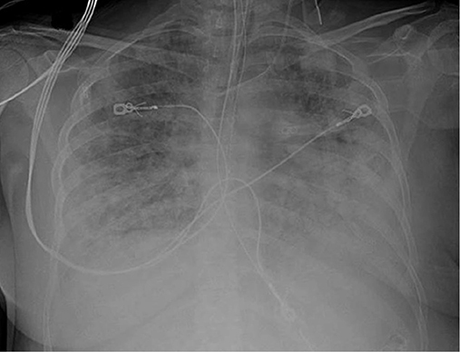

*Figure 50-1. ARDS in the second trimester: marked bilateral parenchymal and pleural opacification.*

### Management
- Treat the underlying disorder; aggressive **antimicrobials** and **debridement**; support perfusion with crystalloid and blood.
- **Correct anemia** — the most efficient way to ↑ O₂ delivery: **1 g Hb carries 1.25 mL O₂** (at 90% saturation), whereas raising PaO₂ from 100 to 200 mm Hg adds only **0.1 mL O₂ per 100 mL** blood.
- **Goals:** **PaO₂ 60 mm Hg or SaO₂ 90%**, with **FiO₂ <50%** and **PEEP <15 mm Hg**.
- **Delivery to improve maternal oxygenation is controversial**: 10 of 29 ventilated women were delivered while intubated; ~half improved modestly; no predictors.

### Mechanical ventilation
- **Noninvasive (face-mask) ventilation** may help early.
- **Intubate early** if respiratory failure is likely or imminent. Because PaCO₂ is normally low in pregnancy, **consider intubation when PaCO₂ reaches 35–40 mm Hg**.
- **Tidal volume ≤6 mL/kg** initially.
- **Targets: PaO₂ >60 mm Hg or SaO₂ ≥90%; PaCO₂ 35–45 mm Hg.** Lower PaO₂ may impair placental perfusion.
- Modes: **assist-control, intermittent mandatory, pressure-support**; CPAP for those needing little support.
- Pregnancy series: 51 ARDS cases — half had severe preeclampsia; 2 maternal deaths. 29 ventilated women — mortality **10%**; delivery while ventilated gave little respiratory benefit.
- **PEEP 5–15 mm Hg** is usually safe and recruits collapsed alveoli; higher levels → ↓ venous return, ↓ cardiac output, ↓ uteroplacental perfusion, overdistention, **barotrauma**.
- **ECMO (veno-venous):** influenza lung failure (12 women; 3 of 4 deaths from **anticoagulation-related hemorrhage**); maternal and perinatal mortality **~30%**; maternal survival lower than nonpregnant.

### Fetal oxygenation
- Rightward shift of the O₂–Hb curve (↓ affinity, better tissue unloading): **hypercapnia, metabolic acidosis, fever, ↑ 2,3-DPG**. **2,3-DPG rises ~30%** in pregnancy.
- **Fetal Hb curve lies to the left:** **P50 = 27 mm Hg (maternal) vs 19 mm Hg (fetal)**. The fetus is always on the steep dissociation part of the curve, so O₂ transfer to fetal tissues is favored even with low maternal PaO₂ (high altitude: maternal PaO₂ 60 mm Hg, fetal PaO₂ as at sea level).

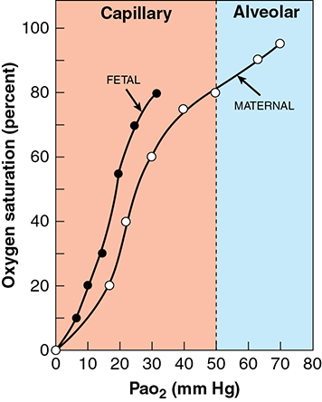

*Figure 50-2. Oxyhemoglobin dissociation: the fetal curve lies left of the maternal curve, so fetal Hb is more saturated at any PaO₂ (P50 19 vs 27 mm Hg).*

### Intravenous fluids
- **Conservative** fluid strategy → fewer ventilator days (same mortality).
- **Colloid oncotic pressure (COP):** **1 g/dL albumin ≈ 6 mm Hg**. COP falls **28 (nonpregnant) → 23 (term) → 17 mm Hg (puerperium)**; lower in preeclampsia.
- **COP–wedge gradient:** normally **>8 mm Hg**; **≤4 mm Hg → ↑ pulmonary edema risk**.
- **Albumin offers no benefit over crystalloid.**

### Long-term outcomes
- Near-normal lung function, but impaired **cognition** at 3–12 months, delayed return to activity (**1–2 years**), exercise limitation and psychological sequelae at 5 years (nonpregnant data).

---

## 4. Sepsis and Septic Shock

### Definitions (Sepsis-3)
- **Sepsis = infection + acute organ dysfunction.**
- **Septic shock = hypotension unresponsive to fluids — needs vasopressors despite fluid resuscitation** (nonpregnant mortality **~20%**).
- **"SIRS" and "severe sepsis" are no longer recommended terms.**
- Incidence **2.4 per 10,000** deliveries (55 million births); SMFM cites **4–10 per 10,000**. Infection/sepsis caused **12%** of US pregnancy-related deaths (2013–2017).
- Case fatality is **lower in pregnant** than age-matched nonpregnant women, but maternal sepsis mortality is underestimated.

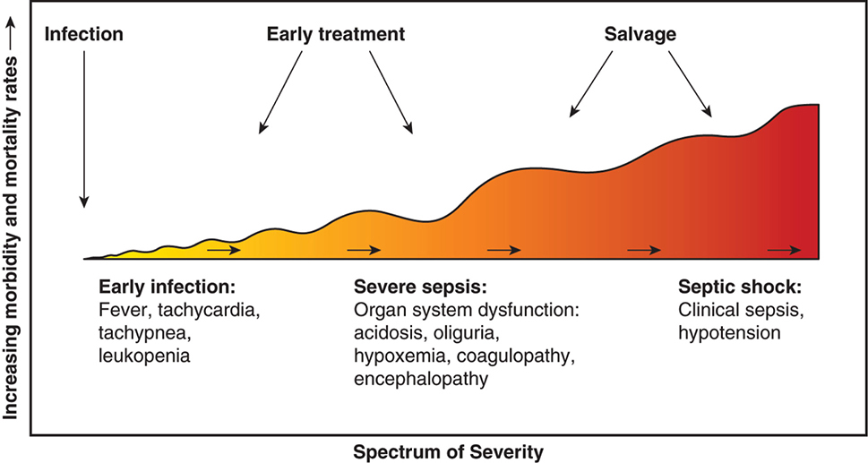

*Figure 50-3. Sepsis continuum: early infection (fever, tachycardia, tachypnea, leukopenia) → organ dysfunction (acidosis, oliguria, hypoxemia, coagulopathy, encephalopathy) → septic shock; early treatment beats salvage.*

**Common obstetrical sources:** **pyelonephritis**, **chorioamnionitis and puerperal sepsis**, **pneumonia**, **septic abortion**, **necrotizing fasciitis**.

### Etiopathogenesis
- **LPS (endotoxin)** of gram-negative bacteria — **lipid A** binds mononuclear cells → cytokine release.
- **Pyelonephritis:** *E. coli*, *Klebsiella*. Pelvic infections are polymicrobial; severe sepsis most often from **Enterobacteriaceae (E. coli)**; also aerobic/anaerobic streptococci, *Bacteroides*, *Clostridium*.
- **Superantigens** (group A β-hemolytic streptococci, *S. aureus* incl. **CA-MRSA**) activate T cells → **toxic shock syndrome**.
- **Exotoxins:** *Clostridium perfringens* / *sordellii*, **TSST-1** (*S. aureus*), streptococcal toxic shock–like exotoxin → rapid **tissue necrosis and gangrene** (esp. postpartum uterus), cardiovascular collapse; maternal mortality **58%** (Yamada review).
- **"Cytokine storm"** (TNF-α, interleukins, proteases, oxidants, bradykinin) → **selective vasodilation**, maldistributed flow, leukocyte/platelet **capillary plugging**, **capillary leak**. **IL-6** likely mediates **myocardial suppression**.
- Early shock = **↓ SVR not fully compensated by ↑ CO** → lactic acidosis, ↓ O₂ extraction, organ injury (lung, kidney); **septic cardiomyopathy** common.

### Table 50-5. Clinical Manifestations of Sepsis

| System | Manifestations |
|---|---|
| **Central nervous system** | Confusion, delirium, somnolence, coma, combativeness, fever, hypothermia |
| **Cardiovascular** | Tachycardia, hypotension |
| **Pulmonary** | Tachypnea, arteriovenous shunting with dysoxia and hypoxemia, exudative infiltrates from endothelial-alveolar damage, pulmonary hypertension |
| **Gastrointestinal** | Gastroenteritis — nausea, vomiting and diarrhea; ileus; hepatocellular necrosis — jaundice, transaminitis |
| **Renal** | Prerenal oliguria, azotemia, acute kidney injury, proteinuria |
| **Hematological** | Leukocytosis or leukopenia, thrombocytopenia, activation of coagulation with disseminated intravascular coagulation |
| **Endocrinological** | Hyperglycemia, adrenal insufficiency |
| **Cutaneous** | Acrocyanosis, erythroderma, bullae, digital gangrene |

### Hemodynamic phases
- **Warm phase** (after crystalloid): **high cardiac output, low SVR**, pulmonary hypertension, myocardial depression.
- Good response to fluids + antibiotics ± debridement = favorable. If shock persists despite fluids and **β-adrenergic inotropes** fail → severe leak and/or myocardial depression.
- **Cold phase:** **oliguria + peripheral vasoconstriction** — rarely survived.
- Continued renal, pulmonary, cerebral dysfunction after BP correction = poor sign. **Each failed organ system adds 15–20% to the risk of death.**

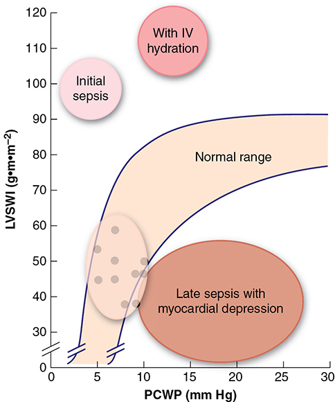

*Figure 50-4. Ventricular function in sepsis: early sepsis has high LVSWI at low PCWP (↑ further with IV fluids); late sepsis shows myocardial depression (low LVSWI, high PCWP).*

### Management
- **Early goal-directed therapy (EGDT)** — no survival benefit in 3 trials → **no longer recommended**, though its tenets remain.
- Obstetrical early warning scores (**MEWS**) predict sepsis poorly (PPV **1–2%**); **Sepsis in Obstetrics Score** under study.
- **Core steps:** broad-spectrum antibiotics, **cultures**, **serum lactate**, **IV fluid bolus**, **vasopressors as needed** — performed **simultaneously** (Evaluate, Assess, Manage).

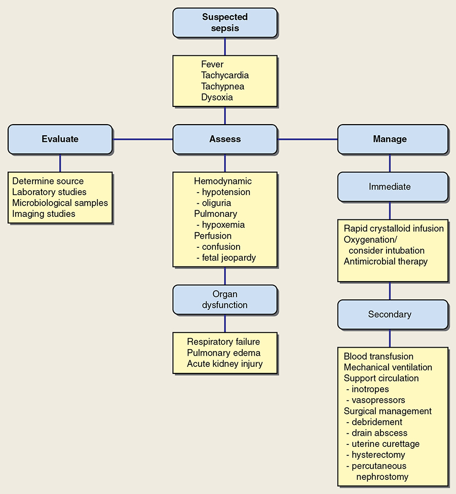

*Figure 50-5. Sepsis algorithm: evaluate the source, assess hemodynamic/pulmonary/perfusion status and organ dysfunction, and manage immediately (crystalloid, oxygenation, antimicrobials) then secondarily (blood, ventilation, inotropes/vasopressors, surgery).*

- **Most important step: rapid crystalloid 2 L** (sometimes **4–6 L**) to restore renal perfusion.
- **Broad-spectrum antibiotics within 1 hour**, maximal doses, after cultures.
  - **Pelvic infection:** **ampicillin + gentamicin + clindamycin**; **add vancomycin** for likely **MRSA** (incisional, soft tissue).
  - Pyelonephritis: cover Enterobacteriaceae.
  - Septic abortion or deep fascial infection: **Gram stain** for *Clostridium* or group A strep.
- **Blood** if anemic (hemoconcentration masks it). Nonpregnant ICU: Hb **≥9 vs ≥7 g/dL** no different — but higher Hb improves fetal oxygenation.
- **Colloids:** hydroxyethyl starch → ↑ mortality in one trial, equivalent in another; **albumin not superior** to crystalloid.
- Target **urine output ≥30, preferably 50 mL/h**; if not → vasoactive drugs.
- Alveolar flooding may occur with normal wedge pressure → ventilation.

**Surgical source control**
- **Debride necrotic tissue, drain pus** — crucial.
- **Septic abortion → prompt uterine evacuation**; hysterectomy only for **gangrene**.
- **Pyelonephritis with ongoing sepsis** → look for **obstruction** (calculi, perinephric/intrarenal phlegmon or abscess): renal sonography, "one-shot" IVP, CT/MRI → **ureteral stent, percutaneous nephrostomy**, or flank exploration.

**Puerperal infections — four exceptions to "antibiotics alone cure"**
1. **Uterine myonecrosis/gangrene** from **group A β-hemolytic streptococcus** or **clostridia** → high mortality; **prompt hysterectomy may be lifesaving**. If toxic shock without uterine necrosis (excluded by **CT**), hysterectomy may be unnecessary.
2. **Necrotizing fasciitis** of episiotomy or abdominal incision → **surgical emergency** (Fournier gangrene reported).
3. **Uterine incisional necrosis / dehiscence with peritonitis** (later onset, less aggressive) → CT; hysterectomy usually needed.
4. Ruptured **parametrial, intraabdominal or ovarian abscess** (less common).

### Table 50-6. Clinical Findings in 126 Women with Group A β-Hemolytic Streptococcal Infection

| Findings |
|---|
| High fever |
| Respiratory symptoms |
| Gastrointestinal symptoms |
| Uterine hypertonus |
| Uterine tenderness |
| Capillary leak — dyspnea, cough; pulmonary edema; bloating, distention |
| Shock |

*Data from Kaiser, 2018; Yamada, 2010.*

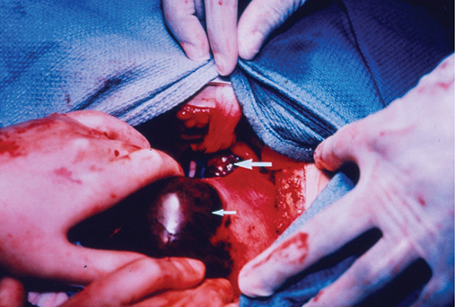

*Figure 50-6. Fatal group A streptococcal puerperal sepsis after an uncomplicated term vaginal birth: black, ballooned gangrenous areas of the uterus (arrows) at hysterectomy.*

### Adjunctive therapy
- **Vasopressors only after aggressive fluids fail.** **First-line: norepinephrine and vasopressin**; norepinephrine is best studied in pregnancy (SMFM).
- **Low-dose corticosteroids** may be considered in septic shock (**hydrocortisone + fludrocortisone** ↓ 90-day mortality; Annane 2018).
- Endotoxin ↑ tissue factor (procoagulant) and ↓ activated protein C; anticoagulant agents **do not improve outcomes**.
- **Induced hypothermia does not help.**

---

## 5. Trauma
- **10–20%** of gravidas sustain physical trauma. **Injury is the most common identified nonobstetrical cause of maternal death**; pregnant trauma victims are **2×** as likely to die.
- Parkland: **motor vehicle accidents + falls = 85%** of injuries.
- Pregnancy-associated **suicide 2 / 100,000** and **homicide 3 / 100,000** live births (often linked to IPV).

### Intimate partner violence (IPV)
- Physical, sexual or psychological harm by a current/former partner; affects **1 in 5 women** in their lifetime; continues in pregnancy.
- Linked to poverty, low education, tobacco, alcohol, drugs. **Prior IPV** is a major risk factor for **intimate partner homicide**. More common in women seeking termination.
- Outcomes: uterine rupture, preterm delivery, maternal and perinatal death; later abruption, preterm/LBW. **~3× perinatal death** (metaanalysis).
- **Screen universally: first prenatal visit, each trimester, and postpartum.** Women who refuse to answer may be at highest risk; abused women present late.

### Sexual assault
- Lifetime prevalence **20%**; **2%** of victims (Dallas) were pregnant. Physical trauma is common; **evidence collection protocol is unchanged**.
- **Prophylaxis against gonorrhea, chlamydia, trichomoniasis** (CDC) ± HIV; emergency contraception if not pregnant.
- **PTSD, major depression, suicidal ideation: 30–35% lifetime risk each** → counseling.

### Table 50-7. Guidelines for Prophylaxis Against Sexually Transmitted Disease in Pregnant Victims of Sexual Assault

| Prophylaxis Against | Regimena | Alternative |
|---|---|---|
| *Neisseria gonorrhoeae* | **Ceftriaxone 250 mg IM single dose PLUS azithromycin 1 g single dose** | Cefixime 400 mg single dose PLUS azithromycin 1 g single dose |
| *Chlamydia trachomatis* | **Azithromycin 1 g single dose**b OR amoxicillin 500 mg three times daily for 7 days | Erythromycin-base 500 mg four times daily for 7 days |
| *Trichomonas vaginalis* | **Metronidazole 2 g single dose** OR tinidazole 2 g single dose | Metronidazole 500 mg twice daily for 7 days |
| Hepatitis B (HBV) | If not previously vaccinated, give first dose HBV vaccine IM, repeat at 1–2 and 4–6 months | — |
| Human immunodeficiency virus (HIV) | If exposure **≤72 h** ago, consider antiretroviral prophylaxis if risk for HIV exposure is high | Tenofovir disoproxil fumarate/emtricitabine (Truvada) once daily plus raltegravir 400 mg (Isentress) twice daily for **28 days** |

*aOral administration unless otherwise stated. bFor nonpregnant women, doxycycline 100 mg orally twice daily for 7 days can be given instead. IM = intramuscularly. From Centers for Disease Control and Prevention, 2015, 2016.*

### Automobile accidents
- **≥3%** of pregnant women per year; **90% of nonviolent blunt trauma**; the most common cause of serious/fatal blunt trauma and the **leading cause of traumatic fetal death**. Alcohol often involved.
- **Up to ½ occur without seat belts.** **Three-point restraint:** **lap belt below the uterus across the upper thighs**, shoulder belt above the uterus → prevents steering-wheel contact and ↓ abdominal impact pressure.
- **Airbags:** perinatal outcomes not different (2207 vs 1141; **96%** belted) → injuries relate to crash severity.

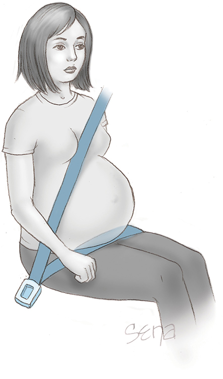

*Figure 50-7. Correct three-point restraint: shoulder belt between the breasts and above the uterus; lap belt snug across the upper thighs, well below the uterus.*

### Other blunt trauma
- Falls and assaults (≈⅓ of hospitalized trauma intentional). **Bowel injury less frequent** (uterus protects), but diaphragm, spleen, liver, kidney injured; **retroperitoneal hemorrhage** more common. **Amnionic-fluid embolism** even after mild trauma.
- **Orthopedic injuries: 6%** (Parkland) → ↑ abruption, preterm delivery, perinatal death.
- **Pelvic fracture:** maternal mortality **9%**, fetal **35%**.

### Fetal injury and death
- Rises with maternal injury severity; more likely with **direct fetoplacental injury, maternal shock, pelvic fracture, maternal head injury, hypoxia**.
- **Motor vehicle accidents → 82%** of traumatic fetal deaths; **placental injury in ½**, **uterine rupture 4%**.
- Fetal skull/brain injury: **engaged head + maternal pelvic fracture**; contrecoup head injury in unengaged or nonvertex fetuses. **Fetal skull fractures best seen by CT** (see Fig 49-4).

### Placental injuries
- **Traumatic abruption:** elastic myometrium deforms around the **inelastic placenta** (deceleration against wheel or belt, or **coup–contrecoup**).
- **Abruption in 1–6% of minor and up to 50% of major injuries**; more likely at **>30 mph**.
- ⚠️ **May be occult**: Parkland 13 cases — **11 uterine tenderness, only 5 vaginal bleeding**. More often **concealed**, with higher intrauterine pressure → **coagulopathy more common** than with spontaneous abruption.
- Warning signs: uterine activity, **fetal tachycardia, sinusoidal pattern, late decelerations**, acidosis, fetal death. CT is accurate but routine CT screening for abruption is not advocated.
- **Placental tear** (linear or stellate) → life-threatening **fetal hemorrhage** into amnion or maternal circulation.
- **Fetomaternal hemorrhage:** small FMH in up to **⅓** of trauma cases, **<15 mL in 90%**. Evidence of FMH → **20× risk of contractions/preterm labor**. Severe fetal bleeding → long-term neurological harm.

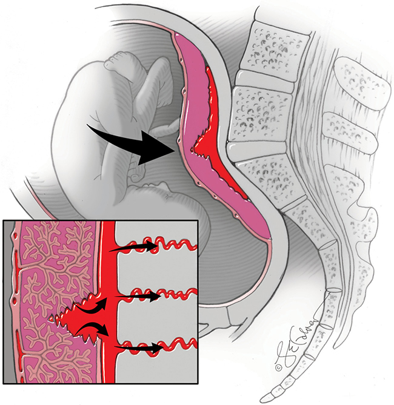

*Figure 50-9. Coup–contrecoup: the inelastic placenta "fractures" against the sacral promontory; retroplacental blood can be forced into maternal venules (fetomaternal hemorrhage — Kleihauer–Betke).*

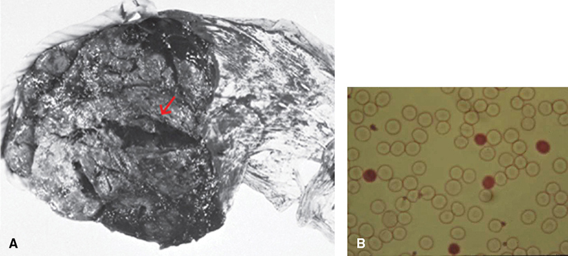

*Figure 50-10. (A) Placental laceration (arrow) under a partial abruption caused fatal fetomaternal hemorrhage; (B) Kleihauer–Betke smear — dark fetal cells made up 4.5% of maternal RBCs.*

### Uterine rupture
- **<1%** of severe blunt trauma; more likely with a **scarred uterus** and direct high-force impact. A **25-mph** collision can generate **500 mm Hg** intrauterine pressure in a restrained woman.

### Penetrating trauma
- **9%** of abdominal trauma in pregnancy: **77% gunshot, 23% stab**.
- **Maternal visceral injury only 15–40%** (vs 80–90% nonpregnant) — the uterus shields; **fetus injured in ⅔**, maternal viscera **20%**.
- vs blunt injury: maternal mortality **7% vs 2%**, fetal mortality **73% vs 10%**.

### Management of trauma
- Injury severity scores **do not predict** pregnancy outcome; **minor injuries** can cause preterm labor and abruption. Minor trauma ≥24 wk: **14%** had contractions needing monitoring **>4 h**.
- **Priorities: evaluate and stabilize the mother first** (fetal assessment must not distract). Ventilation, stop hemorrhage, treat hypovolemia with crystalloid and blood; **displace the uterus off the great vessels** after midpregnancy.
- Then search for fractures, internal injuries and uterine/placental/fetal trauma. **Radiography is not proscribed** when indicated. Screening sonography → CT if positive.
- **FAST scan** (focused assessment with sonography for trauma): **5-minute, 4–6 views** — perihepatic, perisplenic, pelvic, pericardial. Upper-abdominal fluid implies **>500 mL hemoperitoneum** (not validated in pregnancy). Open peritoneal lavage sometimes.

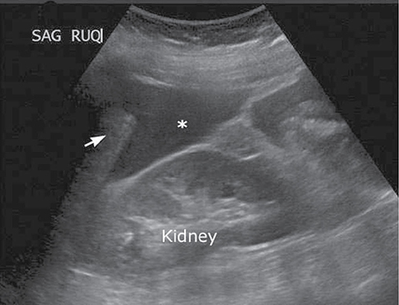

*Figure 50-11. FAST scan: free fluid (blood, marked by the asterisk) in Morison pouch between liver and kidney; this patient had 2500 mL of hemoperitoneum.*

- **Penetrating injury:** peritoneal signs are blunted → **aggressive exploratory laparotomy**. **Mandatory for abdominal gunshot wounds**; selected stab wounds may be observed; diagnostic laparoscopy used.
- **Cesarean:** laparotomy itself is **not** an indication; depends on GA, fetal condition, uterine injury, and whether the uterus hinders repair.

**Electronic fetal monitoring after trauma**
- Fetal status is a maternal "vital sign"; may reveal abruption even if the mother is stable.
- **Contractions less often than every 10 min over 4 h → no abruption**; **more often → ~20% abruption** (Pearlman 1990).
- **Normal tracing → no adverse outcomes.** Avoid **tocolytics** (mask abruption).
- **Start monitoring once the mother is stable; observe ≥4 hours** if normal. **Continue** with contractions, nonreassuring FHR, bleeding, uterine tenderness/irritability, serious maternal injury or ruptured membranes. Rarely abruption occurs **days later**.

### Fetal-maternal hemorrhage
- **Routine Kleihauer–Betke has little value acutely**, but fetal cells **≥0.1%** predicted contractions/preterm labor.
- **D-negative → consider anti-D immunoglobulin** (may omit if FMH test negative). Alloimmunization may still occur if FMH **>15 mL fetal cells** (dose by calculation — Ch 18).
- Check **tetanus** status; give **Tdap** when indicated (neonatal pertussis benefit).

---

## 6. Thermal Injury
- Treat as for nonpregnant women; **pregnancy does not alter maternal outcome**. Survival parallels **% body surface area burned**; worse with suicide attempts and **inhalation injury**.

| Burn (% TBSA) | Maternal mortality | Fetal mortality |
|---|---|---|
| **20%** | **~4%** | **~20%** |
| **40%** | **~30%** | **~48%** |
| **60%** | **~93%** | **~96%** |

- Severe burns → spontaneous labor within **days to a week**, often stillbirth (hypovolemia, lung injury, sepsis, catabolic state).
- Later pregnancies: painful abdominal **contractures** (release if scars span **>75%** of abdomen); nipple loss affects breastfeeding. Postpartum abdominal skin is a good graft source.

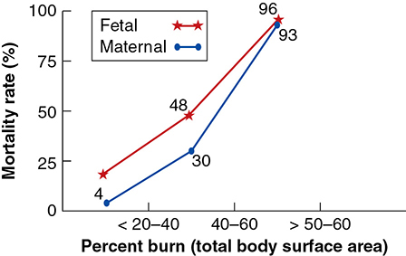

*Figure 50-12. Maternal and fetal mortality climb steeply with burn size (211 women): ~4/20%, 30/48% and 93/96% at 20, 40 and 60% TBSA.*

### Electrical and lightning injuries
- 31 women with electric shock: perinatal outcomes **similar to controls** (110-V North American current likely less dangerous than 220-V European).
- **Lightning:** **~50% stillbirth** (13 case reports).

---

## 7. Cardiopulmonary Resuscitation
- Maternal cardiac arrest: **1 in 12,000 to 36,000** delivery admissions.
- Most common causes: **hemorrhage, anesthesia, heart failure, amnionic-fluid embolism, sepsis**.

### Table 50-8. Possible Etiologies for Cardiac Arrest During Pregnancy

| Letter | Category | Causes |
|---|---|---|
| **A** | Anesthesia | High neuraxial block, intravenous local anesthetic, airway complications |
| **A** | Accidents | Trauma |
| **B** | Bleeding | Atony, abnormal placentation, DIC |
| **C** | Cardiovascular | Valvar or congenital heart disease, arrhythmias, ischemia, aortic dissection |
| **D** | Drugs | Tocolysis, overdose, anaphylaxis, uterotonics, magnesium sulfate |
| **E** | Embolism | Venous, amnionic fluid |
| **F** | Fever | Sepsis, viral syndromes, ARDS |
| **G** | General | Metabolic abnormalities, hypocalcemia or hyperkalemia with massive hemorrhage |
| **H** | Hypertension | Shock, preeclampsia syndrome, HELLP syndrome |

*ARDS = acute respiratory distress syndrome; DIC = disseminated intravascular coagulation; HELLP = hemolysis, elevated liver transaminases, low platelets. Adapted from Jeejeebhoy, 2015; Soar, 2021; Zelop, 2018.*

> **Memory hook:** "**A-B-C-D-E-F-G-H**" — Anesthesia/Accidents, Bleeding, Cardiovascular, Drugs, Embolism, Fever, General, Hypertension.

### AHA standards for CPR in the second half of pregnancy
1. **Left lateral uterine displacement** (relieve vena caval compression)
2. **100% oxygen**
3. **IV access above the diaphragm**
4. Treat hypotension: **SBP <100 mm Hg or <80% of baseline**
5. Review and treat the causes of critical illness early

- Hand position for compressions is **the same** as in nonpregnant women.
- External compressions give **~30%** of normal cardiac output — less in late pregnancy (aortocaval compression) → **uterine displacement** by table tilt, **wedge under the right hip**, or **manual displacement to the left**.

### Table 50-9. High-Quality Cardiopulmonary Resuscitation in Pregnancy

| Components |
|---|
| Place provider hands in **lower half of sternum** |
| **Displace uterus laterally** during resuscitation |
| Provide rapid chest compressions (**100 per minute**) |
| Achieve a compression depth of **at least 2 inches** |
| Assure adequate chest recoil between compressions |
| Minimize interruptions of chest compressions |
| Avoid prolonged pulse checks (**no more than 5–10 seconds**) |
| Resume chest compressions immediately after defibrillating |
| Switch provider of compressions **every 2 minutes** to avoid fatigue |

### Perimortem cesarean delivery
- Maternal survival after arrest **60–70%** (many deaths are out of hospital).
- **AHA / SOAP: deliver within 4–5 min of starting CPR** if the fetus is viable and circulation is not restored. **ACOG: consider from 4 min.**
- Neurologically intact neonatal survival vs arrest-to-delivery interval (Clark 1997):

| Arrest-to-delivery | Neurologically intact |
|---|---|
| **≤5 min** | **98%** |
| 6–15 min | 83% |
| 16–25 min | 33% |
| 26–35 min | 25% |

- Evidence is weak (Katz 2005: 38 cases, large selection bias). In practice the 4-min goal is rarely met; a "crash" cesarean without anesthesia/equipment could cause a preventable maternal death. Distinguish **perimortem** from **postmortem** cesarean; ethical conflicts are unavoidable.
- **CPR complications:** severe **neurological injury** (most feared), **liver lacerations** (3 of 7 survivors), **Takotsubo cardiomyopathy**.
- **Maternal brain death:** somatic support may continue to reach fetal viability (Ch 63).

---

## 8. Envenomation
- Snakes, spiders, scorpions, jellyfish, **hymenoptera** (bees, wasps, hornets, ants). Adverse outcomes stem from **maternal** effects.
- **Venom-specific care:** symptomatic treatment, **antivenom when appropriate**, treat anaphylaxis, fetal assessment.

---

## Quick-Recall: Critical Illness in Pregnancy — Targets and Actions

| Problem | Key target / threshold | Action |
|---|---|---|
| Pulmonary edema | SpO₂ **>92%**; BNP <100 rules out, >500 rules in | O₂ (nonrebreather 10–15 L/min), **furosemide 20–40 mg IV**, echo; **not an indication for cesarean** |
| ARDS | P:F **<200**; PaO₂ **≥60** (SaO₂ ≥90%), FiO₂ <50%, PEEP <15 | Treat cause, correct anemia, **TV ≤6 mL/kg**, intubate when PaCO₂ 35–40 |
| Fluids | COP–wedge gradient **≤4 mm Hg** → edema risk | Conservative fluids; albumin no better |
| Sepsis | Urine **≥30 (50) mL/h** | **2 L (up to 4–6 L) crystalloid**, antibiotics **≤1 h**, lactate, cultures, source control |
| Septic shock | Hypotension despite fluids | **Norepinephrine** (or vasopressin); consider low-dose steroids |
| Group A strep / clostridial gangrene | Uterine hypertonus, capillary leak, shock | **Prompt hysterectomy** |
| Blunt trauma | Contractions ≥1 per 10 min → ~20% abruption | Mother first; **FHR/contraction monitoring ≥4 h**; anti-D if D-negative |
| Penetrating abdomen | Fetus injured in ⅔ | **Laparotomy for gunshot**; selective for stab |
| Burns | 20/40/60% TBSA | Maternal death ~4/30/93%; fetal ~20/48/96% |
| Cardiac arrest | Delivery ≤5 min → 98% intact | Left uterine displacement, 100 compressions/min, IV above diaphragm, **perimortem cesarean at 4–5 min** |

## Key Numbers to Memorize
- Critical care **1–3%** of pregnancies; ICU death risk **2–11%**; ICU transfer **~0.5%**
- MAP = (SBP + 2DBP)/3; SVR = [(MAP − CVP)/CO] × 80
- Pulmonary edema **1/500**; 83% hypertensive; β-mimetics once **40%**; furosemide **20–40 mg IV**
- ARDS **60/100,000**, mortality **9%**; P:F **<200**; shunt **>30%** = refractory hypoxemia; proliferative phase **day 7–21**
- 1 g Hb carries **1.25 mL O₂**; P50 **27 (maternal) vs 19 (fetal) mm Hg**; 2,3-DPG **+30%**
- COP **28 → 23 → 17 mm Hg**; 1 g/dL albumin ≈ **6 mm Hg**; COP–wedge gradient normally **>8**, danger **≤4**
- Ventilate: TV **≤6 mL/kg**, PaO₂ **>60**, PaCO₂ **35–45**; PEEP safe **5–15**; ECMO mortality **~30%**
- Sepsis **2.4–10/10,000**; **12%** of pregnancy-related deaths; septic shock mortality **20%**; each failed organ **+15–20%** death risk; GAS/clostridial toxin mortality **58%**
- Trauma **10–20%** of pregnancies; MVA + falls **85%**; IPV **1 in 5** women; sexual assault PTSD/depression **30–35%**
- Abruption **1–6%** minor, **≤50%** major, >**30 mph**; FMH <15 mL in **90%**; uterine rupture **<1%** (25 mph → 500 mm Hg)
- Penetrating: maternal visceral injury **15–40%**; maternal death **7%**, fetal **73%**
- Burns 20/40/60% → maternal **4/30/93%**, fetal **20/48/96%**; lightning stillbirth **50%**
- Arrest **1/12,000–36,000**; survival **60–70%**; compressions give **30%** CO; perimortem cesarean at **4–5 min**; ≤5 min → **98%** intact
